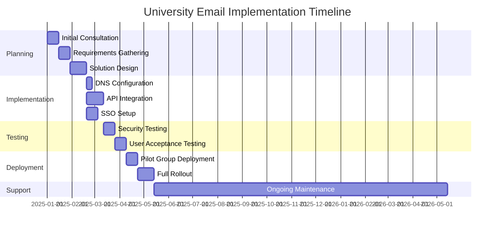
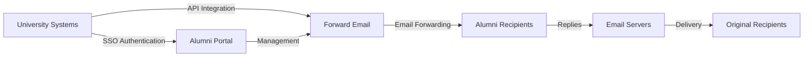

# Nghiên cứu trường hợp: Cách Forward Email cung cấp giải pháp email cựu sinh viên cho các trường đại học hàng đầu {#case-study-how-forward-email-powers-alumni-email-solutions-for-top-universities}


## Mục lục {#table-of-contents}

* [Lời nói đầu](#foreword)
* [Tiết kiệm chi phí đáng kể với giá cả ổn định](#dramatic-cost-savings-with-stable-pricing)
  * [Tiết kiệm thực tế tại các trường đại học](#real-world-university-savings)
* [Thách thức email cựu sinh viên đại học](#the-university-alumni-email-challenge)
  * [Giá trị của danh tính email cựu sinh viên](#the-value-of-alumni-email-identity)
  * [Các giải pháp truyền thống không đáp ứng được](#traditional-solutions-fall-short)
  * [Giải pháp Forward Email](#the-forward-email-solution)
* [Triển khai kỹ thuật: Cách hoạt động](#technical-implementation-how-it-works)
  * [Kiến trúc cốt lõi](#core-architecture)
  * [Tích hợp với hệ thống đại học](#integration-with-university-systems)
  * [Quản lý dựa trên API](#api-driven-management)
  * [Cấu hình và xác minh DNS](#dns-configuration-and-verification)
  * [Kiểm thử và đảm bảo chất lượng](#testing-and-quality-assurance)
* [Lịch trình triển khai](#implementation-timeline)
* [Quy trình triển khai: Từ di chuyển đến bảo trì](#implementation-process-from-migration-to-maintenance)
  * [Đánh giá và lập kế hoạch ban đầu](#initial-assessment-and-planning)
  * [Chiến lược di chuyển](#migration-strategy)
  * [Thiết lập kỹ thuật và cấu hình](#technical-setup-and-configuration)
  * [Thiết kế trải nghiệm người dùng](#user-experience-design)
  * [Đào tạo và tài liệu](#training-and-documentation)
  * [Hỗ trợ và tối ưu hóa liên tục](#ongoing-support-and-optimization)
* [Nghiên cứu trường hợp: Đại học Cambridge](#case-study-university-of-cambridge)
  * [Thách thức](#challenge)
  * [Giải pháp](#solution)
  * [Kết quả](#results)
* [Lợi ích cho các trường đại học và cựu sinh viên](#benefits-for-universities-and-alumni)
  * [Cho các trường đại học](#for-universities)
  * [Cho cựu sinh viên](#for-alumni)
  * [Tỷ lệ áp dụng trong cộng đồng cựu sinh viên](#adoption-rates-among-alumni)
  * [Tiết kiệm chi phí so với các giải pháp trước đây](#cost-savings-compared-to-previous-solutions)
* [Cân nhắc về bảo mật và quyền riêng tư](#security-and-privacy-considerations)
  * [Biện pháp bảo vệ dữ liệu](#data-protection-measures)
  * [Khung tuân thủ](#compliance-framework)
* [Phát triển trong tương lai](#future-developments)
* [Kết luận](#conclusion)


## Lời nói đầu {#foreword}

Chúng tôi đã xây dựng dịch vụ chuyển tiếp email an toàn, riêng tư và linh hoạt nhất thế giới dành cho các trường đại học danh tiếng và cựu sinh viên của họ.

Trong bối cảnh cạnh tranh của giáo dục đại học, duy trì kết nối suốt đời với cựu sinh viên không chỉ là truyền thống mà còn là một chiến lược quan trọng. Một trong những cách thiết thực nhất để các trường đại học duy trì kết nối này là thông qua địa chỉ email cựu sinh viên, cung cấp cho các tốt nghiệp một danh tính kỹ thuật số phản ánh di sản học thuật của họ.

Tại Forward Email, chúng tôi đã hợp tác với một số tổ chức giáo dục danh tiếng nhất thế giới để cách mạng hóa cách họ quản lý dịch vụ email cựu sinh viên. Giải pháp chuyển tiếp email cấp doanh nghiệp của chúng tôi hiện đang cung cấp năng lượng cho hệ thống email cựu sinh viên của [Đại học Cambridge](https://en.wikipedia.org/wiki/University_of_Cambridge), [Đại học Maryland](https://en.wikipedia.org/wiki/University_of_Maryland,_College_Park), [Đại học Tufts](https://en.wikipedia.org/wiki/Tufts_University), và [Trường Swarthmore](https://en.wikipedia.org/wiki/Swarthmore_College), phục vụ hàng nghìn cựu sinh viên trên toàn thế giới.

Bài viết này khám phá cách dịch vụ chuyển tiếp email tập trung vào quyền riêng tư và mã nguồn mở của chúng tôi đã trở thành giải pháp ưu tiên cho các tổ chức này, các triển khai kỹ thuật giúp điều đó trở nên khả thi, và tác động chuyển đổi mà nó mang lại cho cả hiệu quả quản trị và sự hài lòng của cựu sinh viên.


## Tiết kiệm chi phí đáng kể với giá cả ổn định {#dramatic-cost-savings-with-stable-pricing}
Lợi ích tài chính của giải pháp của chúng tôi là rất lớn, đặc biệt khi so sánh với giá cả ngày càng tăng của các nhà cung cấp email truyền thống:

| Giải pháp                     | Chi phí trên mỗi Cựu sinh viên (Hàng năm)                                                                | Chi phí cho 100.000 Cựu sinh viên | Tăng giá gần đây                                                                                                                                                                         |
| ------------------------------ | --------------------------------------------------------------------------------------------------------- | --------------------------------- | ---------------------------------------------------------------------------------------------------------------------------------------------------------------------------------------- |
| Google Workspace for Business  | $72                                                                                                       | $7,200,000                        | • 2019: G Suite Basic từ $5 lên $6/tháng (+20%)<br>• 2023: Các gói linh hoạt tăng 20%<br>• 2025: Business Plus từ $18 lên $26.40/tháng (+47%) với các tính năng AI                    |
| Google Workspace for Education | Miễn phí (Education Fundamentals)<br>$3/sinh viên/năm (Education Standard)<br>$5/sinh viên/năm (Education Plus) | Miễn phí - $500,000               | • Giảm giá theo số lượng: 5% cho 100-499 giấy phép<br>• Giảm giá theo số lượng: 10% cho 500+ giấy phép<br>• Gói miễn phí giới hạn ở các dịch vụ cốt lõi                              |
| Microsoft 365 Business         | $60                                                                                                       | $6,000,000                        | • 2023: Giới thiệu cập nhật giá hai lần mỗi năm<br>• 2025 (Tháng 1): Personal từ $6.99 lên $9.99/tháng (+43%) với Copilot AI<br>• 2025 (Tháng 4): Tăng 5% cho cam kết hàng năm trả theo tháng |
| Microsoft 365 Education        | Miễn phí (A1)<br>$38-55/giảng viên/năm (A3)<br>$65-96/giảng viên/năm (A5)                               | Miễn phí - $96,000                | • Giấy phép sinh viên thường được bao gồm khi mua cho giảng viên<br>• Giá tùy chỉnh qua cấp phép số lượng lớn<br>• Gói miễn phí giới hạn ở phiên bản web                             |
| Self-Hosted Exchange           | $45                                                                                                       | $4,500,000                        | Chi phí bảo trì và an ninh liên tục tăng                                                                                                                                                 |
| **Forward Email Enterprise**   | **Cố định $250/tháng**                                                                                    | **$3,000/năm**                   | **Không tăng giá kể từ khi ra mắt**                                                                                                                                                      |

### Tiết kiệm thực tế của các trường đại học {#real-world-university-savings}

Dưới đây là số tiền các trường đại học đối tác của chúng tôi tiết kiệm hàng năm khi chọn Forward Email thay vì các nhà cung cấp truyền thống:

| Trường đại học           | Số lượng Cựu sinh viên | Chi phí hàng năm với Google | Chi phí hàng năm với Forward Email | Tiết kiệm hàng năm |
| ------------------------ | ---------------------- | --------------------------- | --------------------------------- | ------------------ |
| Đại học Cambridge        | 30,000                 | $90,000                     | $3,000                            | $87,000            |
| Swarthmore College       | 5,000                  | $15,000                     | $3,000                            | $12,000            |
| Đại học Tufts            | 12,000                 | $36,000                     | $3,000                            | $33,000            |
| Đại học Maryland         | 25,000                 | $75,000                     | $3,000                            | $72,000            |

> \[!NOTE]
> Forward Email enterprise thường chỉ tốn $250/tháng, không có chi phí thêm cho mỗi người dùng, giới hạn tốc độ API được phép, và chi phí bổ sung duy nhất là lưu trữ nếu bạn cần thêm GB/TB cho sinh viên (+$3 cho mỗi 10 GB lưu trữ thêm). Chúng tôi sử dụng ổ NVMe SSD để hỗ trợ nhanh các giao thức IMAP/POP3/SMTP/CalDAV/CardDAV.
> \[!IMPORTANT]
> Khác với Google và Microsoft, những công ty đã nhiều lần tăng giá trong khi tích hợp các tính năng AI phân tích dữ liệu của bạn, Forward Email duy trì mức giá ổn định với trọng tâm nghiêm ngặt về quyền riêng tư. Chúng tôi không sử dụng AI, không theo dõi các mẫu sử dụng, và không lưu trữ nhật ký hay email lên đĩa (tất cả xử lý được thực hiện trong bộ nhớ), đảm bảo quyền riêng tư hoàn toàn cho các liên lạc của cựu sinh viên.

Điều này đại diện cho một sự giảm chi phí đáng kể so với các giải pháp lưu trữ email truyền thống — nguồn kinh phí mà các trường đại học có thể chuyển hướng cho học bổng, nghiên cứu hoặc các hoạt động quan trọng khác theo sứ mệnh. Theo phân tích năm 2023 của Email Vendor Selection, các tổ chức giáo dục ngày càng tìm kiếm các lựa chọn thay thế tiết kiệm chi phí cho các nhà cung cấp email truyền thống khi giá cả tiếp tục tăng cùng với việc tích hợp các tính năng AI ([Email Vendor Selection, 2023](https://www.emailvendorselection.com/email-service-provider-list/)).


## Thách Thức Email Cựu Sinh Viên Đại Học {#the-university-alumni-email-challenge}

Đối với các trường đại học, việc cung cấp địa chỉ email trọn đời cho cựu sinh viên đặt ra một bộ thách thức độc đáo mà các giải pháp email truyền thống gặp khó khăn trong việc giải quyết hiệu quả. Như đã đề cập trong một cuộc thảo luận toàn diện trên ServerFault, các trường đại học với số lượng người dùng lớn cần các giải pháp email chuyên biệt cân bằng giữa hiệu suất, bảo mật và chi phí hiệu quả ([ServerFault, 2009](https://serverfault.com/questions/97364/what-is-the-best-mail-server-for-a-university-with-a-large-amount-of-users)).

### Giá Trị Của Địa Chỉ Email Cựu Sinh Viên {#the-value-of-alumni-email-identity}

Địa chỉ email cựu sinh viên (như `firstname.lastname@cl.cam.ac.uk` hoặc `username@terpalum.umd.edu`) phục vụ nhiều chức năng quan trọng:

* Duy trì kết nối với tổ chức và nhận diện thương hiệu
* Tạo điều kiện cho việc liên lạc liên tục với trường đại học
* Nâng cao uy tín chuyên nghiệp cho các cựu sinh viên
* Hỗ trợ mạng lưới cựu sinh viên và xây dựng cộng đồng
* Cung cấp điểm liên lạc ổn định, trọn đời

Nghiên cứu của Tekade (2020) nhấn mạnh rằng các địa chỉ email giáo dục mang lại nhiều lợi ích cho cựu sinh viên, bao gồm truy cập tài nguyên học thuật, uy tín chuyên nghiệp và các ưu đãi độc quyền trên nhiều dịch vụ ([Medium, 2020](https://medium.com/coders-capsule/top-20-benefits-of-having-an-educational-email-address-91a09795e05)).

> \[!TIP]
> Truy cập thư mục mới của chúng tôi tại [AlumniEmail.com](https://alumniemail.com) để có một nguồn tài nguyên toàn diện về dịch vụ email cựu sinh viên đại học, bao gồm hướng dẫn thiết lập, các thực hành tốt nhất, và thư mục có thể tìm kiếm các miền email cựu sinh viên. Đây là trung tâm tập hợp tất cả thông tin về email cựu sinh viên.

### Các Giải Pháp Truyền Thống Không Đáp Ứng Đủ {#traditional-solutions-fall-short}

Các hệ thống email truyền thống có một số hạn chế khi áp dụng cho nhu cầu email cựu sinh viên:

* **Chi Phí Cao**: Mô hình cấp phép theo người dùng trở nên không bền vững về mặt tài chính với số lượng cựu sinh viên lớn
* **Gánh Nặng Quản Trị**: Quản lý hàng nghìn hoặc hàng triệu tài khoản đòi hỏi nguồn lực CNTT đáng kể
* **Lo Ngại Bảo Mật**: Duy trì bảo mật cho các tài khoản không hoạt động làm tăng nguy cơ bị tấn công
* **Hạn Chế Về Linh Hoạt**: Các hệ thống cứng nhắc không thể thích ứng với nhu cầu đặc thù của chuyển tiếp email cựu sinh viên
* **Vấn Đề Quyền Riêng Tư**: Nhiều nhà cung cấp quét nội dung email cho mục đích quảng cáo

Một cuộc thảo luận trên Quora về việc duy trì email đại học cho thấy các mối lo ngại về bảo mật là lý do chính khiến các trường đại học có thể hạn chế hoặc hủy bỏ địa chỉ email cựu sinh viên, vì các tài khoản không sử dụng có thể dễ bị tấn công và đánh cắp danh tính ([Quora, 2011](https://www.quora.com/Is-there-any-cost-for-a-college-or-university-to-maintain-edu-e-mail-addresses)).

### Giải Pháp Forward Email {#the-forward-email-solution}

Phương pháp của chúng tôi giải quyết những thách thức này thông qua một mô hình cơ bản khác biệt:

* Chuyển tiếp email thay vì lưu trữ
* Giá cố định thay vì chi phí theo người dùng
* Kiến trúc mã nguồn mở để minh bạch và bảo mật
* Thiết kế ưu tiên quyền riêng tư, không quét nội dung
* Các tính năng chuyên biệt cho quản lý nhận diện đại học


## Triển Khai Kỹ Thuật: Cách Thức Hoạt Động {#technical-implementation-how-it-works}
Giải pháp của chúng tôi tận dụng một kiến trúc kỹ thuật tinh vi nhưng đơn giản một cách thanh lịch để cung cấp chuyển tiếp email đáng tin cậy, an toàn ở quy mô lớn.

### Kiến trúc cốt lõi {#core-architecture}

Hệ thống Forward Email bao gồm một số thành phần chính:

* Máy chủ MX phân tán để đảm bảo tính sẵn sàng cao
* Chuyển tiếp thời gian thực không lưu trữ tin nhắn
* Xác thực email toàn diện
* Hỗ trợ tên miền và tên miền phụ tùy chỉnh
* Quản lý tài khoản dựa trên API

Theo các chuyên gia CNTT trên ServerFault, đối với các trường đại học muốn triển khai giải pháp email riêng, Postfix được khuyến nghị là Mail Transfer Agent (MTA) tốt nhất, trong khi Courier hoặc Dovecot được ưu tiên cho truy cập IMAP/POP3 ([ServerFault, 2009](https://serverfault.com/questions/97364/what-is-the-best-mail-server-for-a-university-with-a-large-amount-of-users)). Tuy nhiên, giải pháp của chúng tôi loại bỏ nhu cầu các trường đại học phải tự quản lý các hệ thống phức tạp này.

### Tích hợp với hệ thống đại học {#integration-with-university-systems}

Chúng tôi đã phát triển các con đường tích hợp liền mạch với hạ tầng đại học hiện có:

* Cung cấp tự động thông qua tích hợp [RESTful API](https://forwardemail.net/email-api)
* Tùy chọn thương hiệu riêng cho cổng thông tin đại học
* Quản lý bí danh linh hoạt cho các khoa và tổ chức
* Các thao tác hàng loạt để quản trị hiệu quả

### Quản lý dựa trên API {#api-driven-management}

[RESTful API](https://forwardemail.net/email-api) của chúng tôi cho phép các trường đại học tự động hóa quản lý email:

```javascript
// Ví dụ: Tạo địa chỉ email cựu sinh viên mới
const response = await fetch('https://forwardemail.net/api/v1/domains/example.edu/aliases', {
  method: 'POST',
  headers: {
    'Content-Type': 'application/json',
    'Authorization': `Basic ${Buffer.from(YOUR_API_TOKEN + ":").toString('base64')}`
  },
  body: JSON.stringify({
    name: 'alumni.john.smith',
    recipients: ['johnsmith@gmail.com'],
    has_recipient_verification: true
  })
});
```

### Cấu hình và xác minh DNS {#dns-configuration-and-verification}

Cấu hình DNS đúng cách rất quan trọng cho việc gửi email. Đội ngũ của chúng tôi hỗ trợ:

* Cấu hình [DNS](https://en.wikipedia.org/wiki/Domain_Name_System) bao gồm bản ghi MX
* Triển khai bảo mật email toàn diện sử dụng gói mã nguồn mở [mailauth](https://www.npmjs.com/package/mailauth) của chúng tôi, một công cụ đa năng cho xác thực email xử lý:
  * [SPF](https://en.wikipedia.org/wiki/Sender_Policy_Framework) (Sender Policy Framework) để ngăn chặn giả mạo email
  * [DKIM](https://en.wikipedia.org/wiki/DomainKeys_Identified_Mail) (DomainKeys Identified Mail) cho xác thực email
  * [DMARC](https://en.wikipedia.org/wiki/Email_authentication) (Domain-based Message Authentication, Reporting & Conformance) để thực thi chính sách
  * [MTA-STS](https://en.wikipedia.org/wiki/Opportunistic_TLS) (SMTP MTA Strict Transport Security) để bắt buộc mã hóa TLS
  * [ARC](https://en.wikipedia.org/wiki/DomainKeys_Identified_Mail#Authenticated_Received_Chain) (Authenticated Received Chain) để duy trì xác thực khi chuyển tiếp tin nhắn
  * [SRS](https://en.wikipedia.org/wiki/Sender_Rewriting_Scheme) (Sender Rewriting Scheme) để bảo toàn xác thực SPF qua chuyển tiếp
  * [BIMI](https://en.wikipedia.org/wiki/Email_authentication) (Brand Indicators for Message Identification) để hiển thị logo trong các ứng dụng email hỗ trợ
* Xác minh bản ghi TXT DNS để chứng minh quyền sở hữu tên miền

Gói `mailauth` (<http://npmjs.com/package/mailauth>) là giải pháp mã nguồn mở hoàn chỉnh xử lý tất cả các khía cạnh của xác thực email trong một thư viện tích hợp. Khác với các giải pháp độc quyền, phương pháp này đảm bảo tính minh bạch, cập nhật bảo mật thường xuyên và kiểm soát hoàn toàn quá trình xác thực email.

### Kiểm thử và đảm bảo chất lượng {#testing-and-quality-assurance}

Trước khi triển khai đầy đủ, chúng tôi tiến hành kiểm thử nghiêm ngặt:

* Kiểm thử gửi nhận email đầu-cuối
* Kiểm thử tải cho các kịch bản khối lượng lớn
* Kiểm thử thâm nhập bảo mật
* Xác nhận tích hợp API
* Kiểm thử chấp nhận người dùng với đại diện cựu sinh viên
## Implementation Timeline {#implementation-timeline}


```mermaid
gantt
    title University Email Implementation Timeline
    dateFormat  YYYY-MM-DD
    section Planning
    Initial Consultation           :a1, 2025-01-01, 14d
    Requirements Gathering         :a2, after a1, 14d
    Solution Design                :a3, after a2, 21d
    section Implementation
    DNS Configuration              :b1, after a3, 7d
    API Integration                :b2, after a3, 21d
    SSO Setup                      :b3, after a3, 14d
    section Testing
    Security Testing               :c1, after b1 b2 b3, 14d
    User Acceptance Testing        :c2, after c1, 14d
    section Deployment
    Pilot Group Deployment         :d1, after c2, 14d
    Full Rollout                   :d2, after d1, 21d
    section Support
    Ongoing Maintenance            :e1, after d2, 365d
```


## Implementation Process: From Migration to Maintenance {#implementation-process-from-migration-to-maintenance}

Quy trình triển khai có cấu trúc của chúng tôi đảm bảo sự chuyển đổi suôn sẻ cho các trường đại học khi áp dụng giải pháp của chúng tôi.

### Initial Assessment and Planning {#initial-assessment-and-planning}

Chúng tôi bắt đầu với việc đánh giá toàn diện hệ thống email hiện tại của trường đại học, cơ sở dữ liệu cựu sinh viên và các yêu cầu kỹ thuật. Giai đoạn này bao gồm:

* Phỏng vấn các bên liên quan với bộ phận IT, quan hệ cựu sinh viên và quản trị
* Kiểm toán kỹ thuật hạ tầng email hiện có
* Lập bản đồ dữ liệu cho hồ sơ cựu sinh viên
* Đánh giá bảo mật và tuân thủ
* Phát triển tiến độ dự án và các mốc quan trọng

### Migration Strategy {#migration-strategy}

Dựa trên đánh giá, chúng tôi phát triển chiến lược di cư phù hợp nhằm giảm thiểu gián đoạn đồng thời đảm bảo toàn vẹn dữ liệu:

* Phương pháp di cư theo từng nhóm cựu sinh viên
* Vận hành hệ thống song song trong quá trình chuyển đổi
* Các quy trình xác thực dữ liệu toàn diện
* Các thủ tục dự phòng cho mọi sự cố di cư
* Kế hoạch truyền thông rõ ràng cho tất cả các bên liên quan

### Technical Setup and Configuration {#technical-setup-and-configuration}

Đội ngũ kỹ thuật của chúng tôi xử lý tất cả các khía cạnh thiết lập hệ thống:

* Cấu hình và xác minh DNS
* Tích hợp API với hệ thống của trường đại học
* Phát triển cổng thông tin tùy chỉnh với thương hiệu của trường
* Thiết lập xác thực email (SPF, DKIM, DMARC)

### User Experience Design {#user-experience-design}

Chúng tôi làm việc chặt chẽ với các trường đại học để tạo ra giao diện trực quan cho cả quản trị viên và cựu sinh viên:

* Cổng email cựu sinh viên có thương hiệu tùy chỉnh
* Quản lý chuyển tiếp email đơn giản hóa
* Thiết kế đáp ứng trên thiết bị di động
* Tuân thủ khả năng truy cập
* Hỗ trợ đa ngôn ngữ khi cần thiết

### Training and Documentation {#training-and-documentation}

Đào tạo toàn diện đảm bảo tất cả các bên liên quan có thể sử dụng hệ thống hiệu quả:

* Các buổi đào tạo cho quản trị viên
* Tài liệu kỹ thuật cho nhân viên IT
* Hướng dẫn sử dụng cho cựu sinh viên
* Video hướng dẫn các tác vụ phổ biến
* Phát triển cơ sở kiến thức

### Ongoing Support and Optimization {#ongoing-support-and-optimization}

Quan hệ đối tác của chúng tôi tiếp tục vượt xa giai đoạn triển khai:

* Hỗ trợ kỹ thuật 24/7
* Cập nhật hệ thống định kỳ và bản vá bảo mật
* Giám sát hiệu suất và tối ưu hóa
* Tư vấn về các thực hành tốt nhất về email
* Phân tích dữ liệu và báo cáo


## Case Study: University of Cambridge {#case-study-university-of-cambridge}

Đại học Cambridge đã tìm kiếm một giải pháp để cung cấp địa chỉ email @cam.ac.uk cho cựu sinh viên đồng thời giảm thiểu chi phí và gánh nặng IT.

### Challenge {#challenge}

Cambridge đã đối mặt với một số thách thức với hệ thống email cựu sinh viên trước đây:

* Chi phí vận hành cao để duy trì hạ tầng email riêng biệt
* Gánh nặng quản trị khi quản lý hàng nghìn tài khoản
* Lo ngại về bảo mật với các tài khoản không hoạt động
* Hạn chế trong tích hợp với hệ thống cơ sở dữ liệu cựu sinh viên
* Nhu cầu lưu trữ ngày càng tăng

### Solution {#solution}

Forward Email đã triển khai một giải pháp toàn diện:

* Chuyển tiếp email cho tất cả các địa chỉ cựu sinh viên @cam.ac.uk
* Cổng thông tin có thương hiệu tùy chỉnh cho dịch vụ tự phục vụ của cựu sinh viên
* Tích hợp API với cơ sở dữ liệu cựu sinh viên của Cambridge
* Triển khai bảo mật email toàn diện

### Results {#results}

Việc triển khai đã mang lại những lợi ích đáng kể:
* Giảm chi phí đáng kể so với giải pháp trước đây
* Độ tin cậy giao nhận email 99,9%
* Quản trị đơn giản hóa thông qua tự động hóa
* Tăng cường bảo mật với xác thực email hiện đại
* Phản hồi tích cực từ cựu sinh viên về tính dễ sử dụng của hệ thống


## Lợi ích cho Các Trường Đại học và Cựu Sinh viên {#benefits-for-universities-and-alumni}

Giải pháp của chúng tôi mang lại lợi ích thiết thực cho cả các tổ chức và cựu sinh viên của họ.

### Đối với Các Trường Đại học {#for-universities}

* **Hiệu quả Chi phí**: Giá cố định bất kể số lượng cựu sinh viên
* **Đơn giản Hành chính**: Quản lý tự động qua API
* **Tăng cường Bảo mật**: Xác thực email toàn diện
* **Đồng nhất Thương hiệu**: Địa chỉ email tổ chức trọn đời
* **Gắn kết Cựu sinh viên**: Củng cố kết nối thông qua dịch vụ liên tục

Theo BulkSignature (2023), các nền tảng email cho các tổ chức giáo dục mang lại lợi ích đáng kể bao gồm hiệu quả chi phí thông qua các gói miễn phí hoặc giá thấp, tiết kiệm thời gian nhờ khả năng truyền thông hàng loạt, và các tính năng theo dõi để giám sát việc giao nhận và tương tác email ([BulkSignature, 2023](https://bulksignature.com/blog/5-best-email-platforms-for-educational-institutions/)).

### Đối với Cựu Sinh viên {#for-alumni}

* **Danh tính Chuyên nghiệp**: Địa chỉ email đại học danh tiếng
* **Tiếp tục Email**: Chuyển tiếp đến bất kỳ email cá nhân nào
* **Bảo vệ Quyền riêng tư**: Không quét nội dung hay khai thác dữ liệu
* **Quản lý Đơn giản**: Dễ dàng cập nhật người nhận
* **Tăng cường Bảo mật**: Xác thực email hiện đại

Nghiên cứu từ Tạp chí Quốc tế về Giáo dục & Nghiên cứu Văn hóa đọc viết nhấn mạnh tầm quan trọng của giao tiếp email đúng cách trong môi trường học thuật, cho rằng kỹ năng sử dụng email là một kỹ năng thiết yếu cho cả sinh viên và cựu sinh viên trong bối cảnh chuyên nghiệp ([IJELS, 2021](https://files.eric.ed.gov/fulltext/EJ1319324.pdf)).

### Tỷ lệ Áp dụng trong Cộng đồng Cựu Sinh viên {#adoption-rates-among-alumni}

Các trường đại học báo cáo tỷ lệ áp dụng và hài lòng cao trong cộng đồng cựu sinh viên của họ.

### Tiết kiệm Chi phí So với Giải pháp Trước đây {#cost-savings-compared-to-previous-solutions}

Tác động tài chính là đáng kể, với các trường đại học báo cáo tiết kiệm chi phí lớn so với các giải pháp email trước đây.


## Các Vấn đề về Bảo mật và Quyền riêng tư {#security-and-privacy-considerations}

Đối với các tổ chức giáo dục, bảo vệ dữ liệu cựu sinh viên không chỉ là thực hành tốt mà còn thường là yêu cầu pháp lý theo các quy định như GDPR ở châu Âu.

### Các Biện pháp Bảo vệ Dữ liệu {#data-protection-measures}

Giải pháp của chúng tôi tích hợp nhiều lớp bảo mật:

* Mã hóa đầu cuối cho tất cả lưu lượng email
* Không lưu trữ nội dung email trên máy chủ của chúng tôi
* Kiểm tra bảo mật định kỳ và thử nghiệm xâm nhập
* Tuân thủ các tiêu chuẩn bảo vệ dữ liệu quốc tế
* Mã nguồn mở minh bạch để xác minh bảo mật

> \[!WARNING]
> Nhiều nhà cung cấp email quét nội dung email cho mục đích quảng cáo hoặc đào tạo mô hình AI. Thực hành này gây ra những lo ngại nghiêm trọng về quyền riêng tư, đặc biệt trong giao tiếp chuyên nghiệp và học thuật. Forward Email không bao giờ quét nội dung email và xử lý tất cả email trong bộ nhớ để đảm bảo quyền riêng tư hoàn toàn.

### Khung Tuân thủ {#compliance-framework}

Chúng tôi duy trì tuân thủ nghiêm ngặt các quy định liên quan:

* Tuân thủ GDPR cho các tổ chức châu Âu
* Chứng nhận SOC 2 Loại II
* Đánh giá bảo mật hàng năm
* Thỏa thuận Xử lý Dữ liệu (DPA) có tại [forwardemail.net/dpa](https://forwardemail.net/dpa)
* Cập nhật tuân thủ định kỳ khi quy định thay đổi


## Phát triển Tương lai {#future-developments}

Chúng tôi tiếp tục nâng cấp giải pháp email cựu sinh viên với các tính năng và khả năng mới:

* Phân tích nâng cao cho quản trị viên trường đại học
* Bảo vệ chống lừa đảo tiên tiến
* Mở rộng khả năng API để tích hợp sâu hơn
* Thêm các tùy chọn xác thực


## Kết luận {#conclusion}

Forward Email đã cách mạng hóa cách các trường đại học cung cấp và quản lý dịch vụ email cho cựu sinh viên. Bằng cách thay thế dịch vụ lưu trữ email phức tạp, tốn kém bằng chuyển tiếp email thanh lịch, an toàn, chúng tôi đã giúp các tổ chức cung cấp địa chỉ email trọn đời cho tất cả cựu sinh viên đồng thời giảm đáng kể chi phí và gánh nặng quản trị.
Các quan hệ đối tác của chúng tôi với các tổ chức danh tiếng như Cambridge, Maryland, Tufts và Swarthmore chứng minh hiệu quả của phương pháp tiếp cận của chúng tôi trong các môi trường giáo dục đa dạng. Khi các trường đại học phải đối mặt với áp lực ngày càng tăng để duy trì kết nối với cựu sinh viên đồng thời kiểm soát chi phí, giải pháp của chúng tôi cung cấp một lựa chọn hấp dẫn thay thế cho các hệ thống email truyền thống.


```mermaid
flowchart LR
    A[University Systems] -->|API Integration| B[Forward Email]
    B -->|Email Forwarding| C[Alumni Recipients]
    C -->|Replies| D[Email Servers]
    D -->|Delivery| E[Original Recipients]
    F[Alumni Portal] -->|Management| B
    A -->|SSO Authentication| F
```

Đối với các trường đại học quan tâm đến việc khám phá cách Forward Email có thể biến đổi dịch vụ email cựu sinh viên của họ, hãy liên hệ với đội ngũ của chúng tôi tại <support@forwardemail.net> hoặc truy cập [forwardemail.net](https://forwardemail.net) để tìm hiểu thêm về các giải pháp doanh nghiệp của chúng tôi.
