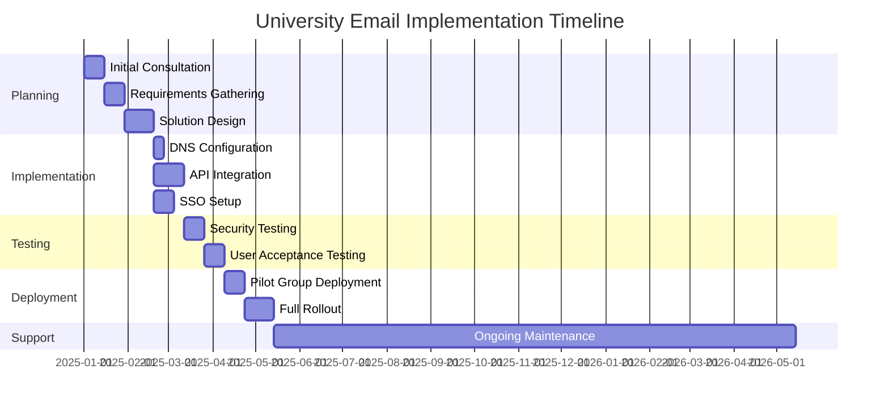
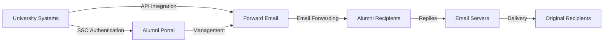

# 案例研究：Forward Email 如何助力顶尖大学校友邮件解决方案 {#case-study-how-forward-email-powers-alumni-email-solutions-for-top-universities}


## 目录 {#table-of-contents}

* [前言](#foreword)
* [稳定的价格大幅节省成本](#dramatic-cost-savings-with-stable-pricing)
  * [现实世界的大学储蓄](#real-world-university-savings)
* [大学校友电子邮件挑战赛](#the-university-alumni-email-challenge)
  * [校友电子邮件身份的价值](#the-value-of-alumni-email-identity)
  * [传统解决方案不足](#traditional-solutions-fall-short)
  * [转发电子邮件解决方案](#the-forward-email-solution)
* [技术实现：工作原理](#technical-implementation-how-it-works)
  * [核心架构](#core-architecture)
  * [与大学系统整合](#integration-with-university-systems)
  * [API驱动的管理](#api-driven-management)
  * [DNS配置和验证](#dns-configuration-and-verification)
  * [测试和质量保证](#testing-and-quality-assurance)
* [实施时间表](#implementation-timeline)
* [实施过程：从迁移到维护](#implementation-process-from-migration-to-maintenance)
  * [初步评估和规划](#initial-assessment-and-planning)
  * [迁移策略](#migration-strategy)
  * [技术设置和配置](#technical-setup-and-configuration)
  * [用户体验设计](#user-experience-design)
  * [培训和文档](#training-and-documentation)
  * [持续支持和优化](#ongoing-support-and-optimization)
* [案例研究：剑桥大学](#case-study-university-of-cambridge)
  * [挑战](#challenge)
  * [解决方案](#solution)
  * [结果](#results)
* [对大学和校友的益处](#benefits-for-universities-and-alumni)
  * [对于大学](#for-universities)
  * [对于校友](#for-alumni)
  * [校友采用率](#adoption-rates-among-alumni)
  * [与之前的解决方案相比节省成本](#cost-savings-compared-to-previous-solutions)
* [安全和隐私考虑](#security-and-privacy-considerations)
  * [数据保护措施](#data-protection-measures)
  * [合规框架](#compliance-framework)
* [未来发展](#future-developments)
* [结论](#conclusion)

## 前言 {#foreword}

我们为著名大学及其校友打造了世界上最安全、最私密、最灵活的电子邮件转发服务。

在竞争激烈的高等教育格局中，与校友保持终身联系不仅仅是一种传统，更是战略要务。大学建立这种联系最切实可行的方式之一是通过校友邮箱，为毕业生提供反映其学术传承的数字身份。

在 Forward Email，我们与一些全球最负盛名的教育机构合作，彻底革新了他们管理校友电子邮件服务的方式。我们企业级的电子邮件转发解决方案现已支持 [剑桥大学](https://en.wikipedia.org/wiki/University_of_Cambridge)、[马里兰大学](https://en.wikipedia.org/wiki/University_of_Maryland,\_College_Park)、[塔夫茨大学](https://en.wikipedia.org/wiki/Tufts_University) 和 [斯沃斯莫尔学院](https://en.wikipedia.org/wiki/Swarthmore_College) 的校友电子邮件系统，共同服务于全球数千名校友。

这篇博文探讨了我们的 [开源](https://en.wikipedia.org/wiki/Open-source_software)（注重隐私的电子邮件转发服务）如何成为这些机构的首选解决方案、实现这一目标的技术实现以及它对行政效率和校友满意度产生的变革性影响。

## 稳定定价，大幅节省成本 {#dramatic-cost-savings-with-stable-pricing}

我们的解决方案的经济效益是巨大的，特别是与传统电子邮件提供商不断上涨的价格相比：

| 解决方案 | 每位校友的费用（每年） | 10万名校友的费用 | 最近的价格上涨 |
| ------------------------------ | --------------------------------------------------------------------------------------------------------- | ----------------------- | ---------------------------------------------------------------------------------------------------------------------------------------------------------------------------------------- |
| Google Workspace 企业版 | $72 | $7,200,000 | • 2019 年：G Suite Basic 价格从每月 5 美元涨至 6 美元 (+20%)<br>• 2023 年：灵活方案价格上涨 20%<br>• 2025 年：Business Plus 价格从每月 18 美元涨至 26.40 美元 (+47%)，并配备 AI 功能 |
| Google Workspace 教育版 | 免费（教育基础版）<br>$3/学生/年（教育标准版）<br>$5/学生/年（教育增强版） | 免费 - 50万美元 | • 批量折扣：100-499 个许可证可享受 5% 折扣<br>• 批量折扣：500 个以上许可证可享受 10% 折扣<br>• 免费套餐仅限核心服务 |
| Microsoft 365 商业版 | $60 | $6,000,000 | • 2023 年：推出每年两次的价格更新<br>• 2025 年（1 月）：个人版价格从 6.99 美元/月上涨至 9.99 美元/月 (+43%)，并配备 Copilot AI<br>• 2025 年（4 月）：按月支付的年度承诺费用增加 5% |
| Microsoft 365 教育版 | 免费 (A1)<br>$38-55/教师/年 (A3)<br>$65-96/教师/年 (A5) | 免费 - 96,000 美元 | • 学生许可证通常包含在教职员工购买中<br>• 通过批量许可进行自定义定价<br>• 免费套餐仅限于网络版本 |
| 自托管交易所 | $45 | $4,500,000 | 持续维护和安全成本持续上升 |
| **转发电子邮件企业** | **固定 250 美元/月** | **每年 3,000 美元** | **自推出以来价格未上涨** |

### 真实大学储蓄 {#real-world-university-savings}

以下是我们的合作大学通过选择转发电子邮件而非传统提供商每年节省的费用：

| 大学 | 校友人数 | Google 的年度费用 | 转发电子邮件的年度费用 | 每年节省 |
| ----------------------- | ------------ | ----------------------- | ------------------------------ | -------------- |
| 剑桥大学 | 30,000 | $90,000 | $3,000 | $87,000 |
| 斯沃斯莫尔学院 | 5,000 | $15,000 | $3,000 | $12,000 |
| 塔夫茨大学 | 12,000 | $36,000 | $3,000 | $33,000 |
| 马里兰大学 | 25,000 | $75,000 | $3,000 | $72,000 |

> \[!NOTE]
> 企业版 Forward Email 通常每月仅需 250 美元，每位用户无需额外付费，API 速率受白名单限制，如果您需要为学生提供更多 GB/TB 存储空间，则只需额外支付存储空间费用（每增加 10 GB 存储空间需额外支付 3 美元）。我们还使用 NVMe SSD 硬盘，以快速支持 IMAP/POP3/SMTP/CalDAV/CardDAV。

> \[!IMPORTANT]
> 与谷歌和微软在整合人工智能功能分析数据的同时不断提高价格不同，Forward Email 在严格保护隐私的前提下保持价格稳定。我们不使用人工智能，不追踪使用模式，也不将日志或电子邮件存储到磁盘（所有处理均在内存中完成），确保您与校友的通信完全保密。

与传统的电子邮件托管解决方案相比，这显著降低了成本——大学可以将这些资金用于奖学金、研究或其他关键任务活动。根据 Email Vendor Selection 2023 年的分析，随着 AI 功能的集成导致价格持续上涨，教育机构越来越多地寻求传统电子邮件提供商的经济高效的替代方案 ([2023 年电子邮件供应商选择](https://www.emailvendorselection.com/email-service-provider-list/))。

## 大学校友电子邮件挑战赛 {#the-university-alumni-email-challenge}

对于大学而言，为校友提供终身电子邮件地址是一系列独特的挑战，传统的电子邮件解决方案难以有效应对。正如 ServerFault 上的一篇全面讨论中所述，拥有庞大用户群的大学需要专门的电子邮件解决方案，以平衡性能、安全性和成本效益 ([ServerFault，2009年](https://serverfault.com/questions/97364/what-is-the-best-mail-server-for-a-university-with-a-large-amount-of-users))。

### 校友电子邮件身份的价值 {#the-value-of-alumni-email-identity}

校友电子邮件地址（如 `firstname.lastname@cl.cam.ac.uk` 或 `username@terpalum.umd.edu`）具有多项重要作用：

* 维护机构联系和品牌形象
* 促进与大学的持续沟通
* 提升毕业生的专业信誉
* 支持校友交流和社群建设
* 提供稳定、终身的联系点

Tekade (2020) 的研究表明，教育电子邮件地址为校友带来了诸多好处，包括获取学术资源、专业信誉以及各种服务的独家折扣 ([中等，2020年](https://medium.com/coders-capsule/top-20-benefits-of-having-an-educational-email-address-91a09795e05))。

> \[!TIP]
> 访问我们全新的 [AlumniEmail.com](https://alumniemail.com) 目录，获取大学校友邮箱服务的全面资源，包括设置指南、最佳实践以及可搜索的校友邮箱域名目录。它是所有校友邮箱信息的中心枢纽。

### 传统解决方案不足 {#traditional-solutions-fall-short}

传统电子邮件系统在满足校友电子邮件需求时存在一些局限性：

* **成本高昂**：对于庞大的校友群体来说，按用户授权模式在财务上难以为继
* **管理负担**：管理数千甚至数百万个账户需要大量的 IT 资源
* **安全隐患**：维护休眠账户的安全会增加漏洞
* **灵活性有限**：僵化的系统无法适应校友邮件转发的独特需求
* **隐私问题**：许多提供商会出于广告目的扫描邮件内容

Quora 上关于大学电子邮件维护的讨论表明，安全问题是大学限制或取消校友电子邮件地址的主要原因，因为未使用的帐户容易受到黑客攻击和身份盗窃（[Quora，2011年](https://www.quora.com/Is-there-any-cost-for-a-college-or-university-to-maintain-edu-e-mail-addresses)）。

### 转发电子邮件解决方案 {#the-forward-email-solution}

我们的方法通过一个根本不同的模型来解决这些挑战：

* 邮件转发，而非托管
* 固定费用定价，而非按用户付费
* 开源架构，确保透明度和安全性
* 隐私优先的设计，无需内容扫描
* 专为大学身份管理提供的功能

## 技术实施：工作原理 {#technical-implementation-how-it-works}

我们的解决方案利用复杂而又优雅简单的技术架构来提供可靠、安全的大规模电子邮件转发。

### 核心架构 {#core-architecture}

转发电子邮件系统由几个关键组件组成：

* 分布式 MX 服务器，确保高可用性
* 实时转发，无需存储邮件
* 全面的电子邮件身份验证
* 支持自定义域名和子域名
* API 驱动的账户管理

ServerFault 上的 IT 专家表示，对于希望自行部署电子邮件解决方案的大学，Postfix 是最佳的邮件传输代理 (MTA)，而 Courier 或 Dovecot 则是 IMAP/POP3 访问的首选 ([ServerFault，2009年](https://serverfault.com/questions/97364/what-is-the-best-mail-server-for-a-university-with-a-large-amount-of-users))。然而，我们的解决方案免除了大学自行管理这些复杂系统的麻烦。

### 与大学系统集成 {#integration-with-university-systems}

我们已经开发了与现有大学基础设施无缝集成的途径：

* 通过 [RESTful API](https://forwardemail.net/email-api) 集成实现自动配置
* 大学门户的自定义品牌选项
* 灵活的部门和组织别名管理
* 批量操作，高效管理

### API 驱动管理 {#api-driven-management}

我们的 [RESTful API](https://forwardemail.net/email-api) 使大学能够实现电子邮件管理自动化：

```javascript
// Example: Creating a new alumni email address
const response = await fetch('https://forwardemail.net/api/v1/domains/example.edu/aliases', {
  method: 'POST',
  headers: {
    'Content-Type': 'application/json',
    'Authorization': `Basic ${Buffer.from(YOUR_API_TOKEN + ":").toString('base64')}`
  },
  body: JSON.stringify({
    name: 'alumni.john.smith',
    recipients: ['johnsmith@gmail.com'],
    has_recipient_verification: true
  })
});
```

### DNS 配置和验证 {#dns-configuration-and-verification}

正确的 DNS 配置对于电子邮件投递至关重要。我们的团队将协助您：

* [DNS](https://en.wikipedia.org/wiki/Domain_Name_System) 配置（包括 MX 记录）
* 使用我们的开源 [邮件验证](https://www.npmjs.com/package/mailauth) 软件包实现全面的电子邮件安全，该软件包是电子邮件身份验证的瑞士军刀，可处理：
* [SPF](https://en.wikipedia.org/wiki/Sender_Policy_Framework)（发件人策略框架），用于防止电子邮件欺骗
* [DKIM](https://en.wikipedia.org/wiki/DomainKeys_Identified_Mail)（域密钥识别邮件），用于电子邮件身份验证
* [DMARC](https://en.wikipedia.org/wiki/Email_authentication)（基于域的消息身份验证、报告和一致性），用于策略执行
* [MTA-STS](https://en.wikipedia.org/wiki/Opportunistic_TLS)（SMTP MTA 严格传输安全），用于强制执行 TLS 加密
* [ARC](https://en.wikipedia.org/wiki/DomainKeys_Identified_Mail#Authenticated_Received_Chain)（已验证接收链），用于在转发邮件时保持身份验证
* [SRS](https://en.wikipedia.org/wiki/Sender_Rewriting_Scheme)（发件人重写方案），用于在转发过程中保留 SPF 验证
* [BIMI](https://en.wikipedia.org/wiki/Email_authentication)（消息的品牌指示符）标识）用于在支持的电子邮件客户端中显示徽标
* DNS TXT 记录验证域名所有权

`mailauth` 软件包 (<http://npmjs.com/package/mailauth>) 是一个完全开源的解决方案，它在一个集成库中处理电子邮件身份验证的所有方面。与专有解决方案不同，这种方法可确保透明度、定期安全更新以及对电子邮件身份验证过程的完全控制。

### 测试和质量保证 {#testing-and-quality-assurance}

在全面部署之前，我们进行了严格的测试：

* 端到端电子邮件投递测试
* 大流量场景的负载测试
* 安全渗透测试
* API 集成验证
* 与校友代表进行用户验收测试

## 实施时间表 {#implementation-timeline}



## 实施过程：从迁移到维护 {#implementation-process-from-migration-to-maintenance}

我们结构化的实施流程确保采用我们解决方案的大学能够顺利过渡。

### 初步评估和规划 {#initial-assessment-and-planning}

我们首先会全面评估大学现有的电子邮件系统、校友数据库和技术要求。此阶段包括：

* 与 IT、校友关系和行政部门的利益相关者访谈
* 对现有电子邮件基础设施进行技术审计
* 校友记录数据映射
* 安全与合规性审查
* 项目时间表和里程碑制定

### 迁移策略 {#migration-strategy}

根据评估结果，我们制定了量身定制的迁移策略，以最大限度地减少中断，同时确保完整的数据完整性：

* 校友群体分阶段迁移
* 过渡期间系统并行运行
* 全面的数据验证协议
* 迁移问题后备程序
* 为所有利益相关者提供清晰的沟通计划

### 技术设置和配置 {#technical-setup-and-configuration}

我们的技术团队负责系统设置的所有方面：

* DNS 配置和验证
* 与大学系统 API 集成
* 定制门户开发，打造大学品牌
* 电子邮件身份验证设置（SPF、DKIM、DMARC）

### 用户体验设计 {#user-experience-design}

我们与大学密切合作，为管理员和校友创建直观的界面：

* 定制品牌校友邮箱门户
* 简化的邮件转发管理
* 移动端响应式设计
* 无障碍合规
* 按需提供多语言支持

### 培训和文档 {#training-and-documentation}

全面的培训确保所有利益相关者都能有效地使用该系统：

* 管理员培训课程
* 面向 IT 人员的技术文档
* 面向校友的用户指南
* 常见任务的视频教程
* 知识库开发

### 持续支持和优化 {#ongoing-support-and-optimization}

我们的伙伴关系在实施之后仍将继续：

* 全天候技术支持
* 定期系统更新和安全补丁
* 性能监控和优化
* 电子邮件最佳实践咨询
* 数据分析和报告

## 案例研究：剑桥大学 {#case-study-university-of-cambridge}

剑桥大学寻求一种解决方案，为校友提供@cam.ac.uk 电子邮件地址，同时降低 IT 开销和成本。

### 挑战 {#challenge}

剑桥大学之前的校友电子邮件系统面临几个挑战：

* 维护独立电子邮件基础设施的运营成本高昂
* 管理数千个账户的行政负担
* 休眠账户的安全隐患
* 与校友数据库系统的集成受限
* 存储需求不断增加

### 解决方案 {#solution}

Forward Email 实施了全面的解决方案：

* 为所有 @cam.ac.uk 校友提供邮件转发服务
* 为校友提供定制品牌的自助服务门户
* 与剑桥校友数据库集成 API
* 全面实施邮件安全

### 个结果 {#results}

该实施带来了显著的效益：

* 与之前的解决方案相比，成本大幅降低
* 99.9% 的电子邮件投递可靠性
* 通过自动化简化管理
* 通过现代电子邮件身份验证增强安全性
* 校友对系统可用性的积极反馈

## 大学和校友福利 {#benefits-for-universities-and-alumni}

我们的解决方案为院校及其毕业生带来了切实的利益。

### 大学 {#for-universities}

* **成本效益**：无论校友数量多少，价格均固定
* **管理简便**：通过 API 实现自动化管理
* **增强安全性**：全面的电子邮件身份验证
* **品牌一致性**：终身机构电子邮件地址
* **校友参与**：通过持续服务加强联系

根据 BulkSignature (2023) 的调查，教育机构的电子邮件平台提供了显著的优势，包括通过免费或低成本计划实现成本效益、通过大众传播功能实现时间效率、以及通过跟踪功能监控电子邮件传递和参与度 ([批量签名，2023年](https://bulksignature.com/blog/5-best-email-platforms-for-educational-institutions/))。

### 校友专区 {#for-alumni}

* **专业身份**：知名大学邮箱地址
* **邮件连续性**：可转发至任何个人邮箱
* **隐私保护**：无需内容扫描或数据挖掘
* **简化管理**：轻松更新收件人
* **增强安全性**：现代电子邮件身份验证

《国际教育与读写能力研究杂志》的研究强调了在学术环境中正确的电子邮件沟通的重要性，并指出电子邮件素养对于专业环境中的学生和校友来说都是一项至关重要的技能（[IJELS, 2021](https://files.eric.ed.gov/fulltext/EJ1319324.pdf)）。

### 校友采用率 {#adoption-rates-among-alumni}

大学报告称其校友群体的采用率和满意率很高。

### 与之前的解决方案相比节省了成本 {#cost-savings-compared-to-previous-solutions}

财务影响是巨大的，据大学报告，与之前的电子邮件解决方案相比，成本节省显著。

## 安全和隐私注意事项 {#security-and-privacy-considerations}

对于教育机构来说，保护校友数据不仅是一种良好的做法，而且通常是欧洲 GDPR 等法规的一项法律要求。

### 数据保护措施 {#data-protection-measures}

我们的解决方案包含多层安全性：

* 所有电子邮件流量均采用端到端加密
* 我们的服务器不存储电子邮件内容
* 定期进行安全审核和渗透测试
* 符合国际数据保护标准
* 透明、开源代码用于安全验证

> \[!WARNING]
> 许多电子邮件提供商会扫描电子邮件内容，用于广告目的或训练 AI 模型。这种做法引发了严重的隐私问题，尤其是在专业和学术交流方面。Forward Email 绝不会扫描电子邮件内容，并且会在内存中处理所有电子邮件，以确保完全的隐私。

### 合规框架 {#compliance-framework}

我们严格遵守相关规定：

* 欧洲机构的 GDPR 合规性
* SOC 2 类型 II 认证
* 年度安全评估
* 数据处理协议 (DPA) 可在 [forwardemail.net/dpa](https://forwardemail.net/dpa) 获取
* 随着法规的演变，定期更新合规性

## 未来发展 {#future-developments}

我们将继续通过新特性和功能增强我们的校友电子邮件解决方案：

* 增强大学管理员的分析功能
* 高级反钓鱼保护
* 扩展 API 功能，实现更深入的集成
* 额外的身份验证选项

## 结论 {#conclusion}

Forward Email 彻底改变了大学提供和管理校友电子邮件服务的方式。通过用便捷、安全的电子邮件转发服务取代昂贵而复杂的电子邮件托管服务，我们帮助各大院校为所有校友提供终身电子邮件地址，同时大幅降低成本和管理开销。

我们与剑桥大学、马里兰大学、塔夫茨大学和斯沃斯莫尔学院等知名院校的合作，证明了我们的方法在多元化教育环境中的有效性。随着大学在控制成本的同时维护校友联系的压力日益增大，我们的解决方案为传统电子邮件系统提供了一个极具吸引力的替代方案。



对于有兴趣探索 Forward Email 如何转变其校友电子邮件服务的大学，请联系我们的团队 <support@forwardemail.net> 或访问 [forwardemail.net](https://forwardemail.net) 了解有关我们的企业解决方案的更多信息。