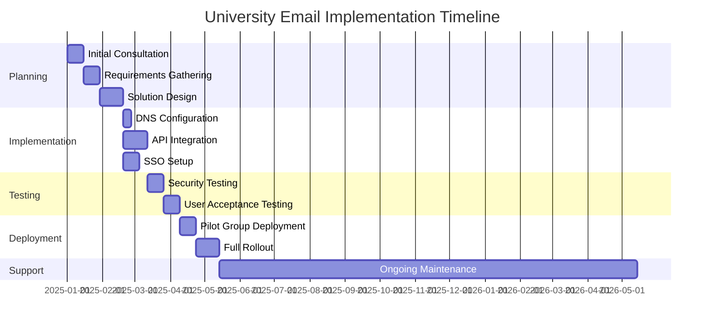
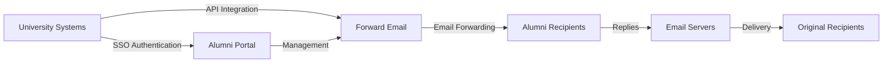

# 案例研究：Forward Email 如何为顶尖大学的校友邮箱解决方案提供动力 {#case-study-how-forward-email-powers-alumni-email-solutions-for-top-universities}


## 目录 {#table-of-contents}

* [前言](#foreword)
* [显著的成本节约与稳定的定价](#dramatic-cost-savings-with-stable-pricing)
  * [真实大学节省案例](#real-world-university-savings)
* [大学校友邮箱的挑战](#the-university-alumni-email-challenge)
  * [校友邮箱身份的价值](#the-value-of-alumni-email-identity)
  * [传统解决方案的不足](#traditional-solutions-fall-short)
  * [Forward Email 解决方案](#the-forward-email-solution)
* [技术实现：工作原理](#technical-implementation-how-it-works)
  * [核心架构](#core-architecture)
  * [与大学系统的集成](#integration-with-university-systems)
  * [基于 API 的管理](#api-driven-management)
  * [DNS 配置与验证](#dns-configuration-and-verification)
  * [测试与质量保证](#testing-and-quality-assurance)
* [实施时间表](#implementation-timeline)
* [实施流程：从迁移到维护](#implementation-process-from-migration-to-maintenance)
  * [初步评估与规划](#initial-assessment-and-planning)
  * [迁移策略](#migration-strategy)
  * [技术设置与配置](#technical-setup-and-configuration)
  * [用户体验设计](#user-experience-design)
  * [培训与文档](#training-and-documentation)
  * [持续支持与优化](#ongoing-support-and-optimization)
* [案例研究：剑桥大学](#case-study-university-of-cambridge)
  * [挑战](#challenge)
  * [解决方案](#solution)
  * [结果](#results)
* [大学与校友的收益](#benefits-for-universities-and-alumni)
  * [对大学的益处](#for-universities)
  * [对校友的益处](#for-alumni)
  * [校友的采用率](#adoption-rates-among-alumni)
  * [与以往解决方案相比的成本节约](#cost-savings-compared-to-previous-solutions)
* [安全与隐私考量](#security-and-privacy-considerations)
  * [数据保护措施](#data-protection-measures)
  * [合规框架](#compliance-framework)
* [未来发展](#future-developments)
* [结论](#conclusion)


## 前言 {#foreword}

我们打造了全球最安全、私密且灵活的邮箱转发服务，专为知名大学及其校友设计。

在高等教育的激烈竞争中，与校友保持终身联系不仅是传统，更是一项战略必需。大学通过校友邮箱地址为毕业生提供反映其学术背景的数字身份，是促进这种联系的最具体方式之一。

在 Forward Email，我们与全球一些最负盛名的教育机构合作，革新他们的校友邮箱管理方式。我们的企业级邮箱转发解决方案现已为[剑桥大学](https://en.wikipedia.org/wiki/University_of_Cambridge)、[马里兰大学](https://en.wikipedia.org/wiki/University_of_Maryland,_College_Park)、[塔夫茨大学](https://en.wikipedia.org/wiki/Tufts_University)和[斯沃斯莫尔学院](https://en.wikipedia.org/wiki/Swarthmore_College)的校友邮箱系统提供支持，服务全球数千名校友。

本文将探讨我们的[开源](https://en.wikipedia.org/wiki/Open-source_software)、注重隐私的邮箱转发服务如何成为这些机构的首选解决方案，支持这一切的技术实现，以及它对管理效率和校友满意度带来的变革性影响。


## 显著的成本节约与稳定的定价 {#dramatic-cost-savings-with-stable-pricing}
我们的解决方案在财务上的优势非常显著，尤其是与传统电子邮件服务提供商不断上涨的价格相比：

| 解决方案                       | 每位校友年成本                                                                                             | 10万校友总成本          | 最近的价格上涨                                                                                                                                                                           |
| ------------------------------ | --------------------------------------------------------------------------------------------------------- | ----------------------- | ---------------------------------------------------------------------------------------------------------------------------------------------------------------------------------------- |
| Google Workspace 商业版        | $72                                                                                                       | $7,200,000              | • 2019年：G Suite Basic 从 $5涨至 $6/月（+20%）<br>• 2023年：灵活计划涨价20%<br>• 2025年：Business Plus 从 $18涨至 $26.40/月（+47%），新增AI功能                                  |
| Google Workspace 教育版        | 免费（教育基础版）<br>$3/学生/年（教育标准版）<br>$5/学生/年（教育增强版）                                   | 免费 - $500,000         | • 批量折扣：100-499许可证5%折扣<br>• 批量折扣：500+许可证10%折扣<br>• 免费套餐仅限核心服务                                                                                              |
| Microsoft 365 商业版           | $60                                                                                                       | $6,000,000              | • 2023年：引入半年一次的价格更新<br>• 2025年1月：个人版从 $6.99涨至 $9.99/月（+43%），新增Copilot AI<br>• 2025年4月：按月支付的年度承诺价格上涨5%                                  |
| Microsoft 365 教育版           | 免费（A1版）<br>$38-55/教职工/年（A3版）<br>$65-96/教职工/年（A5版）                                     | 免费 - $96,000          | • 学生许可证通常随教职工购买附赠<br>• 通过批量许可可定制价格<br>• 免费套餐仅限网页版                                                                                                      |
| 自托管 Exchange               | $45                                                                                                       | $4,500,000              | 持续的维护和安全成本不断上升                                                                                                                                                             |
| **Forward Email 企业版**       | **固定 $250/月**                                                                                          | **$3,000/年**           | **自发布以来无价格上涨**                                                                                                                                                                  |

### 真实高校节省案例 {#real-world-university-savings}

以下是我们的合作高校选择 Forward Email 替代传统服务商后，每年节省的费用：

| 大学                     | 校友人数     | 使用 Google 年成本       | 使用 Forward Email 年成本     | 年度节省       |
| ------------------------ | ------------ | ------------------------ | ----------------------------- | -------------- |
| 剑桥大学                 | 30,000       | $90,000                  | $3,000                        | $87,000        |
| 斯沃斯莫尔学院           | 5,000        | $15,000                  | $3,000                        | $12,000        |
| 塔夫茨大学               | 12,000       | $36,000                  | $3,000                        | $33,000        |
| 马里兰大学               | 25,000       | $75,000                  | $3,000                        | $72,000        |

> \[!NOTE]
> Forward Email 企业版通常只需 $250/月，无额外用户费用，API 白名单速率限制，唯一额外费用是存储空间，如果需要为学生增加 GB/TB 存储，每增加 10 GB 额外收费 $3。我们使用 NVMe SSD 驱动器以快速支持 IMAP/POP3/SMTP/CalDAV/CardDAV。
> \[!IMPORTANT]
> 与谷歌和微软不同，后者在集成分析您数据的 AI 功能的同时反复提高价格，Forward Email 保持价格稳定，并严格关注隐私。我们不使用 AI，不跟踪使用模式，也不将日志或邮件存储到磁盘（所有处理均在内存中完成），确保您的校友通信完全私密。

这相比传统的电子邮件托管解决方案大幅降低了成本——大学可以将这部分资金重新投入奖学金、研究或其他关键任务。根据 Email Vendor Selection 2023 年的分析，随着 AI 功能的集成和价格持续上涨，教育机构越来越多地寻求比传统电子邮件提供商更具成本效益的替代方案（[Email Vendor Selection, 2023](https://www.emailvendorselection.com/email-service-provider-list/)）。

## 大学校友电子邮件挑战 {#the-university-alumni-email-challenge}

对于大学来说，为校友提供终身电子邮件地址带来了传统电子邮件解决方案难以有效应对的一系列独特挑战。正如 ServerFault 上一篇全面讨论所指出的，拥有大量用户的大学需要专门的电子邮件解决方案，以平衡性能、安全性和成本效益（[ServerFault, 2009](https://serverfault.com/questions/97364/what-is-the-best-mail-server-for-a-university-with-a-large-amount-of-users)）。

### 校友电子邮件身份的价值 {#the-value-of-alumni-email-identity}

校友电子邮件地址（如 `firstname.lastname@cl.cam.ac.uk` 或 `username@terpalum.umd.edu`）具有多重重要功能：

* 维护机构联系和品牌身份
* 促进与大学的持续沟通
* 增强毕业生的专业信誉
* 支持校友网络和社区建设
* 提供稳定的终身联系方式

Tekade（2020 年）的研究强调，教育电子邮件地址为校友提供了诸多好处，包括访问学术资源、专业信誉以及各种服务的专属折扣（[Medium, 2020](https://medium.com/coders-capsule/top-20-benefits-of-having-an-educational-email-address-91a09795e05)）。

> \[!TIP]
> 访问我们新的 [AlumniEmail.com](https://alumniemail.com) 目录，获取关于大学校友电子邮件服务的全面资源，包括设置指南、最佳实践以及可搜索的校友电子邮件域名目录。它是所有校友电子邮件信息的集中枢纽。

### 传统解决方案的不足 {#traditional-solutions-fall-short}

传统电子邮件系统在应用于校友电子邮件需求时存在若干限制：

* **成本高昂**：按用户许可模式对庞大校友群体来说财务不可持续
* **管理负担重**：管理成千上万个账户需要大量 IT 资源
* **安全隐患**：维护闲置账户的安全性增加了风险
* **灵活性有限**：僵化系统无法适应校友电子邮件转发的独特需求
* **隐私问题**：许多提供商会扫描邮件内容用于广告目的

Quora 上关于大学电子邮件维护的讨论显示，安全问题是大学可能限制或取消校友电子邮件地址的主要原因，因为未使用的账户容易受到黑客攻击和身份盗用（[Quora, 2011](https://www.quora.com/Is-there-any-cost-for-a-college-or-university-to-maintain-edu-e-mail-addresses)）。

### Forward Email 解决方案 {#the-forward-email-solution}

我们的方法通过根本不同的模型解决这些挑战：

* 电子邮件转发而非托管
* 固定费用定价而非按用户收费
* 开源架构，确保透明和安全
* 隐私优先设计，无内容扫描
* 专为大学身份管理设计的特色功能


## 技术实现：工作原理 {#technical-implementation-how-it-works}
我们的解决方案利用复杂而优雅简洁的技术架构，实现大规模可靠且安全的邮件转发。

### 核心架构 {#core-architecture}

Forward Email 系统由几个关键组件组成：

* 分布式 MX 服务器以实现高可用性
* 实时转发，无消息存储
* 全面的邮件身份验证
* 支持自定义域名和子域名
* 基于 API 的账户管理

根据 ServerFault 上的 IT 专业人士，对于希望自行实现邮件解决方案的大学，推荐 Postfix 作为最佳邮件传输代理（MTA），而 Courier 或 Dovecot 则是 IMAP/POP3 访问的首选（[ServerFault, 2009](https://serverfault.com/questions/97364/what-is-the-best-mail-server-for-a-university-with-a-large-amount-of-users)）。然而，我们的解决方案消除了大学自行管理这些复杂系统的需求。

### 与大学系统的集成 {#integration-with-university-systems}

我们开发了与现有大学基础设施的无缝集成路径：

* 通过 [RESTful API](https://forwardemail.net/email-api) 集成实现自动配置
* 大学门户的自定义品牌选项
* 部门和组织的灵活别名管理
* 高效管理的批量操作

### 基于 API 的管理 {#api-driven-management}

我们的 [RESTful API](https://forwardemail.net/email-api) 使大学能够自动化邮件管理：

```javascript
// 示例：创建新的校友邮箱地址
const response = await fetch('https://forwardemail.net/api/v1/domains/example.edu/aliases', {
  method: 'POST',
  headers: {
    'Content-Type': 'application/json',
    'Authorization': `Basic ${Buffer.from(YOUR_API_TOKEN + ":").toString('base64')}`
  },
  body: JSON.stringify({
    name: 'alumni.john.smith',
    recipients: ['johnsmith@gmail.com'],
    has_recipient_verification: true
  })
});
```

### DNS 配置与验证 {#dns-configuration-and-verification}

正确的 DNS 配置对邮件投递至关重要。我们的团队协助：

* 包括 MX 记录在内的 [DNS](https://en.wikipedia.org/wiki/Domain_Name_System) 配置
* 使用我们的开源 [mailauth](https://www.npmjs.com/package/mailauth) 包实施全面的邮件安全，mailauth 是邮件身份验证的瑞士军刀，支持：
  * [SPF](https://en.wikipedia.org/wiki/Sender_Policy_Framework)（发件人策略框架）防止邮件伪造
  * [DKIM](https://en.wikipedia.org/wiki/DomainKeys_Identified_Mail)（域密钥识别邮件）进行邮件身份验证
  * [DMARC](https://en.wikipedia.org/wiki/Email_authentication)（基于域的消息认证、报告和一致性）用于策略执行
  * [MTA-STS](https://en.wikipedia.org/wiki/Opportunistic_TLS)（SMTP MTA 严格传输安全）强制 TLS 加密
  * [ARC](https://en.wikipedia.org/wiki/DomainKeys_Identified_Mail#Authenticated_Received_Chain)（认证接收链）在邮件转发时保持身份验证
  * [SRS](https://en.wikipedia.org/wiki/Sender_Rewriting_Scheme)（发件人重写方案）通过转发保持 SPF 验证
  * [BIMI](https://en.wikipedia.org/wiki/Email_authentication)（消息标识品牌指示器）在支持的邮件客户端显示徽标
* 用于域名所有权验证的 DNS TXT 记录

`mailauth` 包（<http://npmjs.com/package/mailauth>）是一个完全开源的解决方案，集成处理邮件身份验证的所有方面。与专有解决方案不同，这种方法确保了透明性、定期的安全更新以及对邮件身份验证过程的完全控制。

### 测试与质量保证 {#testing-and-quality-assurance}

在全面部署前，我们进行严格测试：

* 端到端邮件投递测试
* 高负载场景的负载测试
* 安全渗透测试
* API 集成验证
* 与校友代表的用户验收测试
## Implementation Timeline {#implementation-timeline}


```mermaid
gantt
    title University Email Implementation Timeline
    dateFormat  YYYY-MM-DD
    section Planning
    Initial Consultation           :a1, 2025-01-01, 14d
    Requirements Gathering         :a2, after a1, 14d
    Solution Design                :a3, after a2, 21d
    section Implementation
    DNS Configuration              :b1, after a3, 7d
    API Integration                :b2, after a3, 21d
    SSO Setup                      :b3, after a3, 14d
    section Testing
    Security Testing               :c1, after b1 b2 b3, 14d
    User Acceptance Testing        :c2, after c1, 14d
    section Deployment
    Pilot Group Deployment         :d1, after c2, 14d
    Full Rollout                   :d2, after d1, 21d
    section Support
    Ongoing Maintenance            :e1, after d2, 365d
```


## Implementation Process: From Migration to Maintenance {#implementation-process-from-migration-to-maintenance}

我们结构化的实施流程确保大学在采用我们的解决方案时实现平稳过渡。

### Initial Assessment and Planning {#initial-assessment-and-planning}

我们从对大学当前的电子邮件系统、校友数据库和技术需求进行全面评估开始。此阶段包括：

* 与IT、校友关系和管理部门的利益相关者访谈
* 现有电子邮件基础设施的技术审计
* 校友记录的数据映射
* 安全性和合规性审查
* 项目时间表和里程碑制定

### Migration Strategy {#migration-strategy}

基于评估结果，我们制定了量身定制的迁移策略，最大限度减少中断，同时确保数据完整性：

* 按校友批次分阶段迁移
* 过渡期间并行系统运行
* 全面的数据验证协议
* 迁移问题的回退程序
* 针对所有利益相关者的清晰沟通计划

### Technical Setup and Configuration {#technical-setup-and-configuration}

我们的技术团队负责系统设置的所有方面：

* DNS 配置和验证
* 与大学系统的 API 集成
* 带有大学品牌的定制门户开发
* 电子邮件认证设置（SPF、DKIM、DMARC）

### User Experience Design {#user-experience-design}

我们与大学紧密合作，为管理员和校友创建直观的界面：

* 定制品牌的校友电子邮件门户
* 简化的电子邮件转发管理
* 移动响应式设计
* 无障碍合规
* 需要时的多语言支持

### Training and Documentation {#training-and-documentation}

全面的培训确保所有利益相关者能够有效使用系统：

* 管理员培训课程
* IT人员的技术文档
* 校友用户指南
* 常见任务的视频教程
* 知识库建设

### Ongoing Support and Optimization {#ongoing-support-and-optimization}

我们的合作关系远超实施阶段：

* 24/7 技术支持
* 定期系统更新和安全补丁
* 性能监控与优化
* 电子邮件最佳实践咨询
* 数据分析与报告


## Case Study: University of Cambridge {#case-study-university-of-cambridge}

剑桥大学寻求一种解决方案，为校友提供 @cam.ac.uk 邮箱地址，同时降低IT开销和成本。

### Challenge {#challenge}

剑桥在其先前的校友电子邮件系统中面临多项挑战：

* 维护独立电子邮件基础设施的高运营成本
* 管理数千个账户的行政负担
* 休眠账户的安全隐患
* 与校友数据库系统的集成有限
* 不断增长的存储需求

### Solution {#solution}

Forward Email 实施了全面的解决方案：

* 为所有 @cam.ac.uk 校友地址提供邮件转发
* 校友自助服务的定制品牌门户
* 与剑桥校友数据库的 API 集成
* 全面的电子邮件安全实施

### Results {#results}

该实施带来了显著的效益：
* 与之前的解决方案相比大幅降低成本
* 99.9% 的电子邮件投递可靠性
* 通过自动化简化管理
* 采用现代电子邮件认证增强安全性
* 校友对系统易用性的积极反馈


## 大学和校友的优势 {#benefits-for-universities-and-alumni}

我们的解决方案为机构及其毕业生带来了切实的好处。

### 对大学而言 {#for-universities}

* **成本效益**：无论校友数量多少，价格固定
* **管理简便**：通过 API 实现自动化管理
* **安全增强**：全面的电子邮件认证
* **品牌一致性**：终身机构邮箱地址
* **校友参与**：通过持续服务加强联系

根据 BulkSignature（2023 年）的数据，教育机构的电子邮件平台提供显著优势，包括通过免费或低成本计划实现成本效益，通过群发通信提高时间效率，以及通过跟踪功能监控电子邮件投递和参与度（[BulkSignature, 2023](https://bulksignature.com/blog/5-best-email-platforms-for-educational-institutions/)）。

### 对校友而言 {#for-alumni}

* **专业身份**：享有知名大学邮箱地址
* **邮件连续性**：可转发至任何个人邮箱
* **隐私保护**：不扫描内容或挖掘数据
* **管理简化**：轻松更新收件人信息
* **安全增强**：采用现代电子邮件认证

国际教育与识字研究期刊的研究强调了学术环境中正确电子邮件沟通的重要性，指出电子邮件素养是学生和校友在职业环境中的关键技能（[IJELS, 2021](https://files.eric.ed.gov/fulltext/EJ1319324.pdf)）。

### 校友采纳率 {#adoption-rates-among-alumni}

各大学报告其校友群体中采纳率和满意度均较高。

### 与之前解决方案相比的成本节约 {#cost-savings-compared-to-previous-solutions}

财务影响显著，大学报告与之前的电子邮件解决方案相比节省了大量成本。


## 安全与隐私考虑 {#security-and-privacy-considerations}

对于教育机构来说，保护校友数据不仅是良好实践——在欧洲等地的 GDPR 等法规下，这往往是法律要求。

### 数据保护措施 {#data-protection-measures}

我们的解决方案包含多层安全措施：

* 所有电子邮件流量端到端加密
* 不在服务器上存储邮件内容
* 定期进行安全审计和渗透测试
* 遵守国际数据保护标准
* 透明的开源代码以便安全验证

> \[!WARNING]
> 许多电子邮件提供商会扫描邮件内容用于广告目的或训练 AI 模型。这种做法引发严重的隐私担忧，尤其是在专业和学术通信中。Forward Email 从不扫描邮件内容，所有邮件均在内存中处理，以确保完全隐私。

### 合规框架 {#compliance-framework}

我们严格遵守相关法规：

* 欧洲机构的 GDPR 合规
* SOC 2 类型 II 认证
* 年度安全评估
* 数据处理协议（DPA）可在 [forwardemail.net/dpa](https://forwardemail.net/dpa) 获取
* 随法规变化定期更新合规措施


## 未来发展 {#future-developments}

我们持续通过新功能和能力提升校友邮箱解决方案：

* 为大学管理员提供增强的分析功能
* 先进的反钓鱼保护
* 扩展 API 功能以实现更深层集成
* 额外的认证选项


## 结论 {#conclusion}

Forward Email 革新了大学提供和管理校友邮箱服务的方式。通过用优雅、安全的邮件转发替代昂贵且复杂的邮件托管，我们使机构能够为所有校友提供终身邮箱地址，同时大幅降低成本和管理负担。
我们与剑桥、马里兰、塔夫茨和斯沃斯莫尔等知名机构的合作，展示了我们的方法在多样化教育环境中的有效性。随着大学面临在控制成本的同时维持校友联系的日益压力，我们的解决方案为传统电子邮件系统提供了一个有力的替代方案。


```mermaid
flowchart LR
    A[University Systems] -->|API Integration| B[Forward Email]
    B -->|Email Forwarding| C[Alumni Recipients]
    C -->|Replies| D[Email Servers]
    D -->|Delivery| E[Original Recipients]
    F[Alumni Portal] -->|Management| B
    A -->|SSO Authentication| F
```

对于有兴趣探索 Forward Email 如何改变其校友电子邮件服务的大学，请通过 <support@forwardemail.net> 联系我们的团队，或访问 [forwardemail.net](https://forwardemail.net) 了解更多关于我们企业解决方案的信息。
