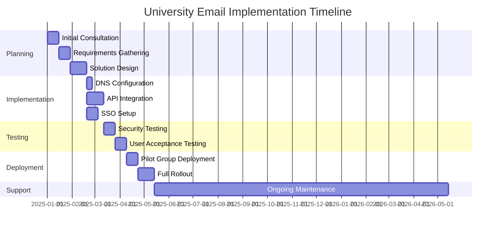
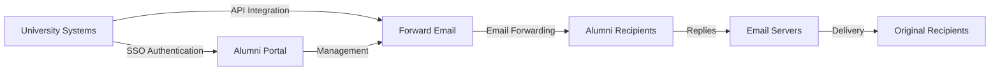

# Case Study: How Forward Email Powers Alumni Email Solutions for Top Universities


## Table of Contents

* [Foreword](#foreword)
* [Dramatic Cost Savings with Stable Pricing](#dramatic-cost-savings-with-stable-pricing)
  * [Real-World University Savings](#real-world-university-savings)
* [The University Alumni Email Challenge](#the-university-alumni-email-challenge)
  * [The Value of Alumni Email Identity](#the-value-of-alumni-email-identity)
  * [Traditional Solutions Fall Short](#traditional-solutions-fall-short)
  * [The Forward Email Solution](#the-forward-email-solution)
* [Technical Implementation: How It Works](#technical-implementation-how-it-works)
  * [Core Architecture](#core-architecture)
  * [Integration with University Systems](#integration-with-university-systems)
  * [API-Driven Management](#api-driven-management)
  * [DNS Configuration and Verification](#dns-configuration-and-verification)
  * [Testing and Quality Assurance](#testing-and-quality-assurance)
* [Implementation Timeline](#implementation-timeline)
* [Implementation Process: From Migration to Maintenance](#implementation-process-from-migration-to-maintenance)
  * [Initial Assessment and Planning](#initial-assessment-and-planning)
  * [Migration Strategy](#migration-strategy)
  * [Technical Setup and Configuration](#technical-setup-and-configuration)
  * [User Experience Design](#user-experience-design)
  * [Training and Documentation](#training-and-documentation)
  * [Ongoing Support and Optimization](#ongoing-support-and-optimization)
* [Case Study: University of Cambridge](#case-study-university-of-cambridge)
  * [Challenge](#challenge)
  * [Solution](#solution)
  * [Results](#results)
* [Benefits for Universities and Alumni](#benefits-for-universities-and-alumni)
  * [For Universities](#for-universities)
  * [For Alumni](#for-alumni)
  * [Adoption Rates Among Alumni](#adoption-rates-among-alumni)
  * [Cost Savings Compared to Previous Solutions](#cost-savings-compared-to-previous-solutions)
* [Security and Privacy Considerations](#security-and-privacy-considerations)
  * [Data Protection Measures](#data-protection-measures)
  * [Compliance Framework](#compliance-framework)
* [Future Developments](#future-developments)
* [Conclusion](#conclusion)


## Foreword

We've built the world's most secure, private, and flexible email forwarding service for prestigious universities and their alumni.

In the competitive landscape of higher education, maintaining lifelong connections with alumni is not just a matter of tradition—it's a strategic imperative. One of the most tangible ways universities foster these connections is through alumni email addresses, providing graduates with a digital identity that reflects their academic heritage.

At Forward Email, we've partnered with some of the world's most prestigious educational institutions to revolutionize how they manage alumni email services. Our enterprise-grade email forwarding solution now powers the alumni email systems for the [University of Cambridge](https://en.wikipedia.org/wiki/University_of_Cambridge), the [University of Maryland](https://en.wikipedia.org/wiki/University_of_Maryland,_College_Park), [Tufts University](https://en.wikipedia.org/wiki/Tufts_University), and [Swarthmore College](https://en.wikipedia.org/wiki/Swarthmore_College), collectively serving thousands of alumni worldwide.

This blog post explores how our [open-source](https://en.wikipedia.org/wiki/Open-source_software), privacy-focused email forwarding service has become the preferred solution for these institutions, the technical implementations that make it possible, and the transformative impact it's had on both administrative efficiency and alumni satisfaction.


## Dramatic Cost Savings with Stable Pricing

The financial benefits of our solution are substantial, especially when compared to the continuously increasing prices of traditional email providers:

| Solution                       | Cost per Alumnus (Annual)                                                                                 | Cost for 100,000 Alumni | Recent Price Increases                                                                                                                                                                   |
| ------------------------------ | --------------------------------------------------------------------------------------------------------- | ----------------------- | ---------------------------------------------------------------------------------------------------------------------------------------------------------------------------------------- |
| Google Workspace for Business  | $72                                                                                                       | $7,200,000              | • 2019: G Suite Basic from $5 to $6/month (+20%)<br>• 2023: Flexible plans increased by 20%<br>• 2025: Business Plus from $18 to $26.40/month (+47%) with AI features                    |
| Google Workspace for Education | Free (Education Fundamentals)<br>$3/student/year (Education Standard)<br>$5/student/year (Education Plus) | Free - $500,000         | • Volume discounts: 5% for 100-499 licenses<br>• Volume discounts: 10% for 500+ licenses<br>• Free tier limited to core services                                                         |
| Microsoft 365 Business         | $60                                                                                                       | $6,000,000              | • 2023: Introduced twice-yearly price updates<br>• 2025 (Jan): Personal from $6.99 to $9.99/month (+43%) with Copilot AI<br>• 2025 (Apr): 5% increase on annual commitments paid monthly |
| Microsoft 365 Education        | Free (A1)<br>$38-55/faculty/year (A3)<br>$65-96/faculty/year (A5)                                         | Free - $96,000          | • Student licenses often included with faculty purchases<br>• Custom pricing through volume licensing<br>• Free tier limited to web versions                                             |
| Self-Hosted Exchange           | $45                                                                                                       | $4,500,000              | Ongoing maintenance and security costs continue to rise                                                                                                                                  |
| **Forward Email Enterprise**   | **Fixed $250/month**                                                                                      | **$3,000/year**         | **No price increases since launch**                                                                                                                                                      |

### Real-World University Savings

Here's how much our partner universities save annually by choosing Forward Email over traditional providers:

| University              | Alumni Count | Annual Cost with Google | Annual Cost with Forward Email | Annual Savings |
| ----------------------- | ------------ | ----------------------- | ------------------------------ | -------------- |
| University of Cambridge | 30,000       | $90,000                 | $3,000                         | $87,000        |
| Swarthmore College      | 5,000        | $15,000                 | $3,000                         | $12,000        |
| Tufts University        | 12,000       | $36,000                 | $3,000                         | $33,000        |
| University of Maryland  | 25,000       | $75,000                 | $3,000                         | $72,000        |

> \[!NOTE]
> Forward Email enterprise only costs $250/month typically, with no extra cost per user, whitelisted API rate limitations, and the only additional cost is storage if you need additional GB/TB for students (+$3 per 10 GB additional storage). We use NVMe SSD drives for fast support of IMAP/POP3/SMTP/CalDAV/CardDAV as well.

> \[!IMPORTANT]
> Unlike Google and Microsoft, who have repeatedly increased their prices while integrating AI features that analyze your data, Forward Email maintains stable pricing with a strict privacy focus. We don't use AI, don't track usage patterns, and don't store logs or emails to disk (all processing is done in-memory), ensuring complete privacy for your alumni communications.

This represents a significant cost reduction compared to traditional email hosting solutions—funds that universities can redirect to scholarships, research, or other mission-critical activities. According to a 2023 analysis by Email Vendor Selection, educational institutions are increasingly seeking cost-effective alternatives to traditional email providers as prices continue to rise with the integration of AI features ([Email Vendor Selection, 2023](https://www.emailvendorselection.com/email-service-provider-list/)).


## The University Alumni Email Challenge

For universities, providing lifetime email addresses to alumni presents a unique set of challenges that traditional email solutions struggle to address effectively. As noted in a comprehensive discussion on ServerFault, universities with large user bases require specialized email solutions that balance performance, security, and cost-effectiveness ([ServerFault, 2009](https://serverfault.com/questions/97364/what-is-the-best-mail-server-for-a-university-with-a-large-amount-of-users)).

### The Value of Alumni Email Identity

Alumni email addresses (like `firstname.lastname@cl.cam.ac.uk` or `username@terpalum.umd.edu`) serve multiple important functions:

* Maintaining institutional connection and brand identity
* Facilitating ongoing communication with the university
* Enhancing professional credibility for graduates
* Supporting alumni networking and community building
* Providing a stable, lifetime contact point

Research by Tekade (2020) highlights that educational email addresses provide numerous benefits to alumni, including access to academic resources, professional credibility, and exclusive discounts on various services ([Medium, 2020](https://medium.com/coders-capsule/top-20-benefits-of-having-an-educational-email-address-91a09795e05)).

> \[!TIP]
> Visit our new [AlumniEmail.com](https://alumniemail.com) directory for a comprehensive resource on university alumni email services, including setup guides, best practices, and a searchable directory of alumni email domains. It serves as a central hub for all alumni email information.

### Traditional Solutions Fall Short

Conventional email systems present several limitations when applied to alumni email needs:

* **Cost Prohibitive**: Per-user licensing models become financially unsustainable for large alumni bases
* **Administrative Burden**: Managing thousands or millions of accounts requires significant IT resources
* **Security Concerns**: Maintaining security for dormant accounts increases vulnerability
* **Limited Flexibility**: Rigid systems can't adapt to the unique needs of alumni email forwarding
* **Privacy Issues**: Many providers scan email content for advertising purposes

A Quora discussion on university email maintenance reveals that security concerns are a major reason universities might limit or cancel alumni email addresses, as unused accounts can be vulnerable to hacking and identity theft ([Quora, 2011](https://www.quora.com/Is-there-any-cost-for-a-college-or-university-to-maintain-edu-e-mail-addresses)).

### The Forward Email Solution

Our approach addresses these challenges through a fundamentally different model:

* Email forwarding rather than hosting
* Flat-fee pricing instead of per-user costs
* Open-source architecture for transparency and security
* Privacy-first design with no content scanning
* Specialized features for university identity management


## Technical Implementation: How It Works

Our solution leverages a sophisticated yet elegantly simple technical architecture to deliver reliable, secure email forwarding at scale.

### Core Architecture

The Forward Email system consists of several key components:

* Distributed MX servers for high availability
* Real-time forwarding with no message storage
* Comprehensive email authentication
* Custom domain and subdomain support
* API-driven account management

According to IT professionals on ServerFault, for universities seeking to implement their own email solutions, Postfix is recommended as the best Mail Transfer Agent (MTA), while Courier or Dovecot are preferred for IMAP/POP3 access ([ServerFault, 2009](https://serverfault.com/questions/97364/what-is-the-best-mail-server-for-a-university-with-a-large-amount-of-users)). However, our solution eliminates the need for universities to manage these complex systems themselves.

### Integration with University Systems

We've developed seamless integration pathways with existing university infrastructure:

* Automated provisioning through [RESTful API](https://forwardemail.net/email-api) integration
* Custom branding options for university portals
* Flexible alias management for departments and organizations
* Batch operations for efficient administration

### API-Driven Management

Our [RESTful API](https://forwardemail.net/email-api) enables universities to automate email management:

```javascript
// Example: Creating a new alumni email address
const response = await fetch('https://forwardemail.net/api/v1/domains/example.edu/aliases', {
  method: 'POST',
  headers: {
    'Content-Type': 'application/json',
    'Authorization': `Basic ${Buffer.from(YOUR_API_TOKEN + ":").toString('base64')}`
  },
  body: JSON.stringify({
    name: 'alumni.john.smith',
    recipients: ['johnsmith@gmail.com'],
    has_recipient_verification: true
  })
});
```

### DNS Configuration and Verification

Proper DNS configuration is critical for email delivery. Our team assists with:

* [DNS](https://en.wikipedia.org/wiki/Domain_Name_System) configuration including MX records
* Comprehensive email security implementation using our open-source [mailauth](https://www.npmjs.com/package/mailauth) package, a Swiss Army knife for email authentication that handles:
  * [SPF](https://en.wikipedia.org/wiki/Sender_Policy_Framework) (Sender Policy Framework) to prevent email spoofing
  * [DKIM](https://en.wikipedia.org/wiki/DomainKeys_Identified_Mail) (DomainKeys Identified Mail) for email authentication
  * [DMARC](https://en.wikipedia.org/wiki/Email_authentication) (Domain-based Message Authentication, Reporting & Conformance) for policy enforcement
  * [MTA-STS](https://en.wikipedia.org/wiki/Opportunistic_TLS) (SMTP MTA Strict Transport Security) to enforce TLS encryption
  * [ARC](https://en.wikipedia.org/wiki/DomainKeys_Identified_Mail#Authenticated_Received_Chain) (Authenticated Received Chain) to maintain authentication when messages are forwarded
  * [SRS](https://en.wikipedia.org/wiki/Sender_Rewriting_Scheme) (Sender Rewriting Scheme) to preserve SPF validation through forwarding
  * [BIMI](https://en.wikipedia.org/wiki/Email_authentication) (Brand Indicators for Message Identification) for logo display in supporting email clients
* DNS TXT record verification for domain ownership

The `mailauth` package (<http://npmjs.com/package/mailauth>) is the fully open-source solution that handles all aspects of email authentication in one integrated library. Unlike proprietary solutions, this approach ensures transparency, regular security updates, and complete control over the email authentication process.

### Testing and Quality Assurance

Before full deployment, we conduct rigorous testing:

* End-to-end email delivery testing
* Load testing for high-volume scenarios
* Security penetration testing
* API integration validation
* User acceptance testing with alumni representatives


## Implementation Timeline




## Implementation Process: From Migration to Maintenance

Our structured implementation process ensures a smooth transition for universities adopting our solution.

### Initial Assessment and Planning

We begin with a comprehensive assessment of the university's current email system, alumni database, and technical requirements. This phase includes:

* Stakeholder interviews with IT, alumni relations, and administration
* Technical audit of existing email infrastructure
* Data mapping for alumni records
* Security and compliance review
* Project timeline and milestone development

### Migration Strategy

Based on the assessment, we develop a tailored migration strategy that minimizes disruption while ensuring complete data integrity:

* Phased migration approach by alumni cohorts
* Parallel systems operation during transition
* Comprehensive data validation protocols
* Fallback procedures for any migration issues
* Clear communication plan for all stakeholders

### Technical Setup and Configuration

Our technical team handles all aspects of system setup:

* DNS configuration and verification
* API integration with university systems
* Custom portal development with university branding
* Email authentication setup (SPF, DKIM, DMARC)

### User Experience Design

We work closely with universities to create intuitive interfaces for both administrators and alumni:

* Custom-branded alumni email portals
* Simplified email forwarding management
* Mobile-responsive designs
* Accessibility compliance
* Multi-language support where needed

### Training and Documentation

Comprehensive training ensures all stakeholders can effectively use the system:

* Administrator training sessions
* Technical documentation for IT staff
* User guides for alumni
* Video tutorials for common tasks
* Knowledge base development

### Ongoing Support and Optimization

Our partnership continues well beyond implementation:

* 24/7 technical support
* Regular system updates and security patches
* Performance monitoring and optimization
* Consultation on email best practices
* Data analytics and reporting


## Case Study: University of Cambridge

The University of Cambridge sought a solution to provide @cam.ac.uk email addresses to alumni while reducing IT overhead and costs.

### Challenge

Cambridge faced several challenges with their previous alumni email system:

* High operational costs for maintaining separate email infrastructure
* Administrative burden of managing thousands of accounts
* Security concerns with dormant accounts
* Limited integration with alumni database systems
* Increasing storage requirements

### Solution

Forward Email implemented a comprehensive solution:

* Email forwarding for all @cam.ac.uk alumni addresses
* Custom-branded portal for alumni self-service
* API integration with Cambridge's alumni database
* Comprehensive email security implementation

### Results

The implementation delivered significant benefits:

* Substantial cost reduction compared to previous solution
* 99.9% email delivery reliability
* Simplified administration through automation
* Enhanced security with modern email authentication
* Positive alumni feedback on system usability


## Benefits for Universities and Alumni

Our solution delivers tangible benefits for both institutions and their graduates.

### For Universities

* **Cost Efficiency**: Fixed pricing regardless of alumni count
* **Administrative Simplicity**: Automated management through API
* **Enhanced Security**: Comprehensive email authentication
* **Brand Consistency**: Lifetime institutional email addresses
* **Alumni Engagement**: Strengthened connections through ongoing service

According to BulkSignature (2023), email platforms for educational institutions offer significant benefits including cost-effectiveness through free or low-cost plans, time efficiency through mass communication capabilities, and tracking features to monitor email delivery and engagement ([BulkSignature, 2023](https://bulksignature.com/blog/5-best-email-platforms-for-educational-institutions/)).

### For Alumni

* **Professional Identity**: Prestigious university email address
* **Email Continuity**: Forward to any personal email
* **Privacy Protection**: No content scanning or data mining
* **Simplified Management**: Easy recipient updates
* **Enhanced Security**: Modern email authentication

Research from the International Journal of Education & Literacy Studies highlights the importance of proper email communication in academic settings, noting that email literacy is a crucial skill for both students and alumni in professional contexts ([IJELS, 2021](https://files.eric.ed.gov/fulltext/EJ1319324.pdf)).

### Adoption Rates Among Alumni

Universities report high adoption and satisfaction rates among their alumni communities.

### Cost Savings Compared to Previous Solutions

The financial impact has been substantial, with universities reporting significant cost savings compared to their previous email solutions.


## Security and Privacy Considerations

For educational institutions, protecting alumni data is not just good practice—it's often a legal requirement under regulations like GDPR in Europe.

### Data Protection Measures

Our solution incorporates multiple layers of security:

* End-to-end encryption for all email traffic
* No storage of email content on our servers
* Regular security audits and penetration testing
* Compliance with international data protection standards
* Transparent, open-source code for security verification

> \[!WARNING]
> Many email providers scan email content for advertising purposes or to train AI models. This practice raises serious privacy concerns, especially for professional and academic communications. Forward Email never scans email content and processes all emails in-memory to ensure complete privacy.

### Compliance Framework

We maintain strict compliance with relevant regulations:

* GDPR compliance for European institutions
* SOC 2 Type II certification
* Annual security assessments
* Data Processing Agreement (DPA) available at [forwardemail.net/dpa](https://forwardemail.net/dpa)
* Regular compliance updates as regulations evolve


## Future Developments

We continue to enhance our alumni email solution with new features and capabilities:

* Enhanced analytics for university administrators
* Advanced anti-phishing protections
* Expanded API capabilities for deeper integration
* Additional authentication options


## Conclusion

Forward Email has revolutionized how universities provide and manage alumni email services. By replacing costly, complex email hosting with elegant, secure email forwarding, we've enabled institutions to offer lifetime email addresses to all alumni while dramatically reducing costs and administrative overhead.

Our partnerships with prestigious institutions like Cambridge, Maryland, Tufts, and Swarthmore demonstrate the effectiveness of our approach across diverse educational environments. As universities face increasing pressure to maintain alumni connections while controlling costs, our solution offers a compelling alternative to traditional email systems.



For universities interested in exploring how Forward Email can transform their alumni email services, contact our team at <support@forwardemail.net> or visit [forwardemail.net](https://forwardemail.net) to learn more about our enterprise solutions.
