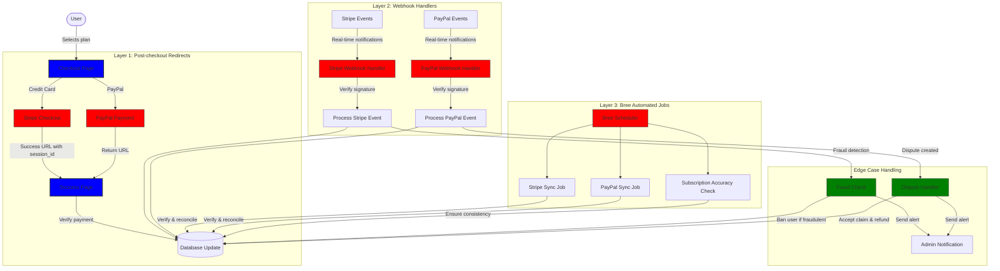
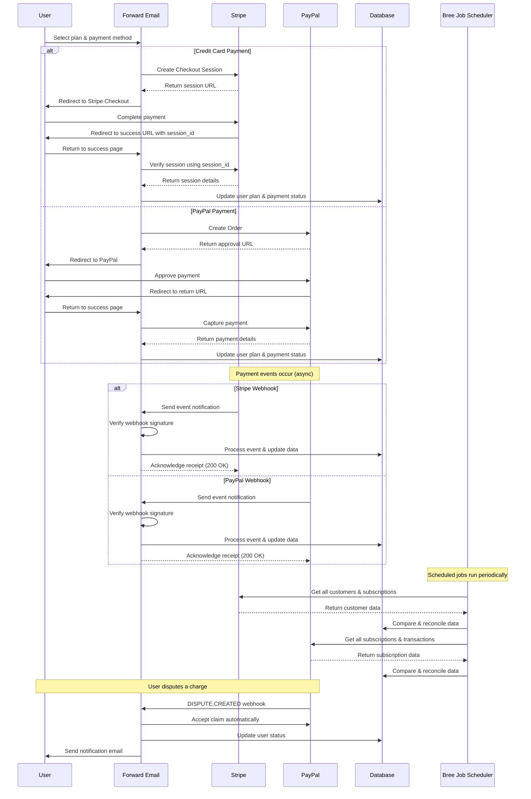
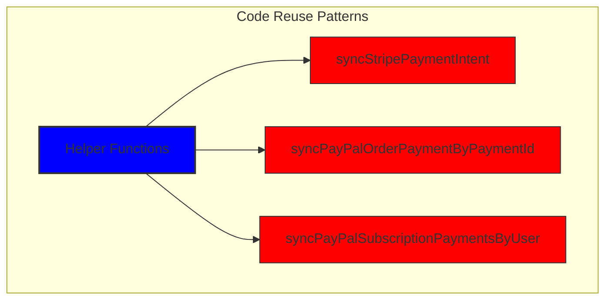
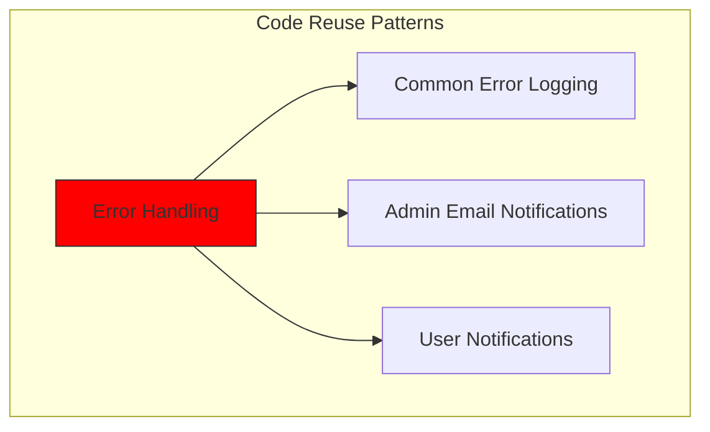
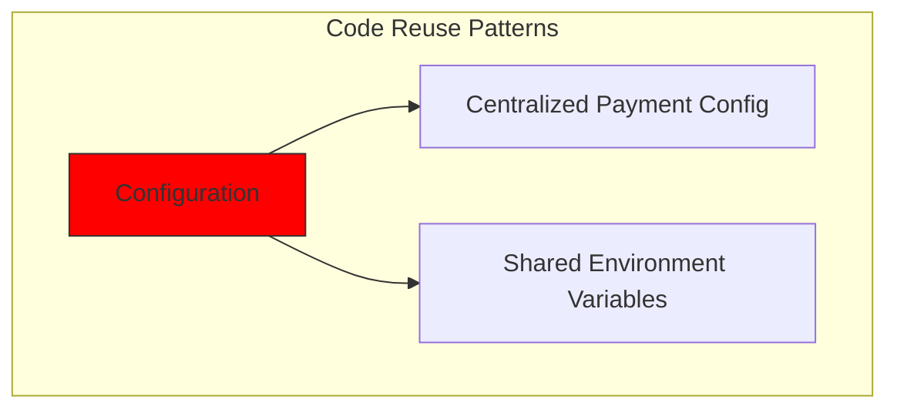
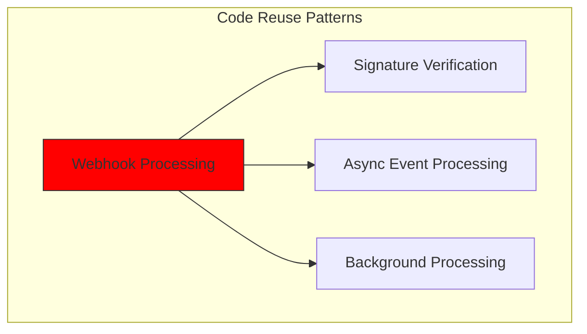
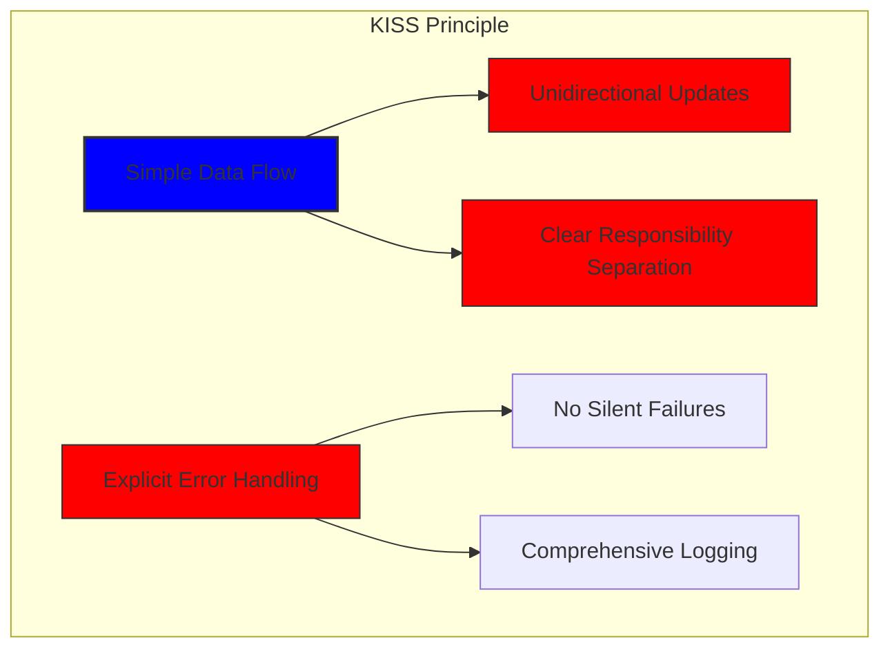
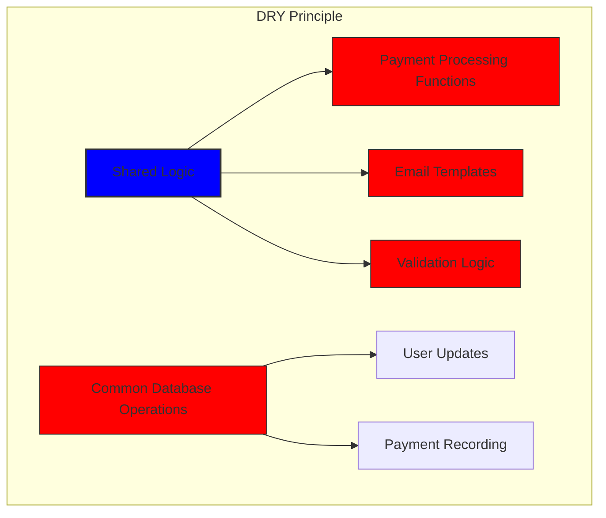

# كيف قمنا ببناء نظام دفع قوي مع Stripe وPayPal: نهج ثلاثي {#how-we-built-a-robust-payment-system-with-stripe-and-paypal-a-trifecta-approach}


## جدول المحتويات {#table-of-contents}

* [مقدمة](#foreword)
* [التحدي: معالجات دفع متعددة، مصدر واحد للحقيقة](#the-challenge-multiple-payment-processors-one-source-of-truth)
* [نهج تريفيكتا: ثلاث طبقات من الموثوقية](#the-trifecta-approach-three-layers-of-reliability)
* [الطبقة 1: عمليات إعادة التوجيه بعد الدفع](#layer-1-post-checkout-redirects)
  * [تنفيذ عملية الدفع عبر Stripe](#stripe-checkout-implementation)
  * [تدفق الدفع عبر PayPal](#paypal-payment-flow)
* [الطبقة 2: معالجات Webhook مع التحقق من التوقيع](#layer-2-webhook-handlers-with-signature-verification)
  * [تنفيذ Stripe Webhook](#stripe-webhook-implementation)
  * [تنفيذ PayPal Webhook](#paypal-webhook-implementation)
* [الطبقة 3: الوظائف الآلية مع Bree](#layer-3-automated-jobs-with-bree)
  * [مدقق دقة الاشتراك](#subscription-accuracy-checker)
  * [مزامنة اشتراك PayPal](#paypal-subscription-synchronization)
* [التعامل مع الحالات الطارئة](#handling-edge-cases)
  * [الكشف عن الاحتيال والوقاية منه](#fraud-detection-and-prevention)
  * [معالجة النزاعات](#dispute-handling)
* [إعادة استخدام الكود: مبادئ KISS وDRY](#code-reuse-kiss-and-dry-principles)
* [تنفيذ متطلبات اشتراك فيزا](#visa-subscription-requirements-implementation)
  * [إشعارات البريد الإلكتروني التلقائية قبل التجديد](#automated-pre-renewal-email-notifications)
  * [التعامل مع الحالات الطارئة](#handling-edge-cases-1)
  * [فترات التجربة وشروط الاشتراك](#trial-periods-and-subscription-terms)
* [الخلاصة: فوائد نهجنا الثلاثي](#conclusion-the-benefits-of-our-trifecta-approach)

## مقدمة {#foreword}

في Forward Email، لطالما أولينا أهمية كبيرة لإنشاء أنظمة موثوقة ودقيقة وسهلة الاستخدام. عند تطبيق نظام معالجة المدفوعات لدينا، كنا على دراية بحاجتنا إلى حل قادر على التعامل مع معالجات دفع متعددة مع الحفاظ على اتساق مثالي للبيانات. توضح هذه المدونة بالتفصيل كيف نجح فريق التطوير لدينا في دمج كلٍّ من Stripe وPayPal باستخدام نهج متكامل يضمن دقةً فوريةً وشاملةً في جميع أنحاء نظامنا.

## التحدي: معالجات دفع متعددة، مصدر واحد للحقيقة {#the-challenge-multiple-payment-processors-one-source-of-truth}

بصفتنا خدمة بريد إلكتروني تُركّز على الخصوصية، أردنا أن نُقدّم لمستخدمينا خيارات دفع مُختلفة. يُفضّل البعض بساطة الدفع ببطاقات الائتمان عبر Stripe، بينما يُقدّر آخرون ميزة الفصل الإضافية التي يُوفّرها PayPal. مع ذلك، يُضيف دعم مُعالجات دفع مُتعددة تعقيدًا كبيرًا:

١. كيف نضمن اتساق البيانات عبر أنظمة الدفع المختلفة؟
٢. كيف نتعامل مع الحالات الطارئة كالنزاعات، أو استرداد الأموال، أو فشل الدفعات؟
٣. كيف نحافظ على مصدر واحد للحقيقة في قاعدة بياناتنا؟

كان حلنا هو تنفيذ ما نسميه "نهج الثلاثية" - وهو نظام ثلاثي الطبقات يوفر التكرار ويضمن اتساق البيانات مهما حدث.

## نهج تريفيكتا: ثلاث طبقات من الموثوقية {#the-trifecta-approach-three-layers-of-reliability}

يتكون نظام الدفع لدينا من ثلاثة مكونات أساسية تعمل معًا لضمان مزامنة البيانات بشكل مثالي:

١. **إعادة توجيه ما بعد الدفع** - التقاط معلومات الدفع فورًا بعد الدفع
٢. **معالجات الويب هوك** - معالجة الأحداث الفورية من معالجات الدفع
٣. **الوظائف الآلية** - التحقق من بيانات الدفع ومطابقتها دوريًا

دعونا نتعمق في كل مكون ونرى كيف يعملان معًا.



## الطبقة 1: عمليات إعادة التوجيه بعد الخروج {#layer-1-post-checkout-redirects}

تبدأ المرحلة الأولى من نهجنا الثلاثي فور إتمام المستخدم عملية الدفع. يوفر كلٌّ من Stripe وPayPal آليات لإعادة توجيه المستخدمين إلى موقعنا الإلكتروني مع معلومات المعاملة.

### تنفيذ عملية الدفع الشريطي {#stripe-checkout-implementation}

بالنسبة لـ Stripe، نستخدم واجهة برمجة تطبيقات جلسات الدفع الخاصة بهم لتوفير تجربة دفع سلسة. عندما يختار المستخدم خطةً ويدفع ببطاقة ائتمان، ننشئ جلسة دفع ناجحة ونلغي عناوين URL.

```javascript
const options = {
  mode: paymentType === 'one-time' ? 'payment' : 'subscription',
  customer: ctx.state.user[config.userFields.stripeCustomerID],
  client_reference_id: reference,
  metadata: {
    plan
  },
  line_items: [
    {
      price,
      quantity: 1,
      description
    }
  ],
  locale: config.STRIPE_LOCALES.has(ctx.locale) ? ctx.locale : 'auto',
  cancel_url: `${config.urls.web}${ctx.path}${
    isMakePayment || isEnableAutoRenew ? '' : `/?plan=${plan}`
  }`,
  success_url: `${config.urls.web}${ctx.path}/?${
    isMakePayment || isEnableAutoRenew ? '' : `plan=${plan}&`
  }session_id={CHECKOUT_SESSION_ID}`,
  allow_promotion_codes: true
};

// Create the checkout session and redirect
const session = await stripe.checkout.sessions.create(options);
const redirectTo = session.url;
if (ctx.accepts('html')) {
  ctx.status = 303;
  ctx.redirect(redirectTo);
} else {
  ctx.body = { redirectTo };
}
```

الجزء المهم هنا هو مُعامل `success_url`، والذي يتضمن مُعامل `session_id` كمُعامل استعلام. عندما يُعيد Stripe توجيه المستخدم إلى موقعنا بعد إتمام عملية دفع ناجحة، يُمكننا استخدام مُعرّف الجلسة هذا للتحقق من المعاملة وتحديث قاعدة بياناتنا وفقًا لذلك.

### تدفق دفع PayPal {#paypal-payment-flow}

بالنسبة إلى PayPal، نستخدم نهجًا مشابهًا مع واجهة برمجة تطبيقات الطلبات الخاصة بهم:

```javascript
const requestBody = {
  intent: 'CAPTURE',
  application_context: {
    cancel_url: `${config.urls.web}${ctx.path}${
      isMakePayment || isEnableAutoRenew ? '' : `/?plan=${plan}`
    }`,
    return_url: `${config.urls.web}${ctx.path}/?plan=${plan}`,
    brand_name: 'Forward Email',
    shipping_preference: 'NO_SHIPPING',
    user_action: 'PAY_NOW'
  },
  payer: {
    email_address: ctx.state.user.email
  },
  purchase_units: [
    {
      reference_id: ctx.state.user.id,
      description,
      custom_id: sku,
      invoice_id: reference,
      soft_descriptor: sku,
      amount: {
        currency_code: 'USD',
        value: price,
        breakdown: {
          item_total: {
            currency_code: 'USD',
            value: price
          }
        }
      },
      items: [
        {
          name,
          description,
          sku,
          unit_amount: {
            currency_code: 'USD',
            value: price
          },
          quantity: '1',
          category: 'DIGITAL_GOODS'
        }
      ]
    }
  ]
};
```

كما هو الحال مع Stripe، نحدد معلمتي `return_url` و`cancel_url` لمعالجة عمليات إعادة التوجيه بعد الدفع. عندما يعيد PayPal توجيه المستخدم إلى موقعنا، يمكننا تسجيل تفاصيل الدفع وتحديث قاعدة بياناتنا.



## الطبقة 2: معالجات Webhook مع التحقق من التوقيع {#layer-2-webhook-handlers-with-signature-verification}

رغم أن عمليات إعادة التوجيه بعد إتمام عملية الشراء تعمل بكفاءة في معظم الحالات، إلا أنها ليست مضمونة النجاح. فقد يُغلق المستخدمون متصفحهم قبل إعادة توجيههم، أو قد تمنع مشاكل في الشبكة إتمام عملية إعادة التوجيه. وهنا يأتي دور خطافات الويب.

يوفر كلٌّ من Stripe وPayPal أنظمة ويب هوك تُرسل إشعارات فورية حول عمليات الدفع. وقد طبّقنا معالجات ويب هوك فعّالة للتحقق من صحة هذه الإشعارات ومعالجتها وفقًا لذلك.

### تنفيذ خطاف الويب الشريطي {#stripe-webhook-implementation}

يتحقق معالج Webhook Stripe الخاص بنا من توقيع أحداث Webhook الواردة للتأكد من شرعيتها:

```javascript
async function webhook(ctx) {
  const sig = ctx.request.get('stripe-signature');
  // throw an error if something was wrong
  if (!isSANB(sig))
    throw Boom.badRequest(ctx.translateError('INVALID_STRIPE_SIGNATURE'));
  const event = stripe.webhooks.constructEvent(
    ctx.request.rawBody,
    sig,
    env.STRIPE_ENDPOINT_SECRET
  );
  // throw an error if something was wrong
  if (!event)
    throw Boom.badRequest(ctx.translateError('INVALID_STRIPE_SIGNATURE'));
  ctx.logger.info('stripe webhook', { event });
  // return a response to acknowledge receipt of the event
  ctx.body = { received: true };
  // run in background
  processEvent(ctx, event)
    .then()
    .catch((err) => {
      ctx.logger.fatal(err, { event });
      // email admin errors
      emailHelper({
        template: 'alert',
        message: {
          to: config.email.message.from,
          subject: `Error with Stripe Webhook (Event ID ${event.id})`
        },
        locals: {
          message: `<pre><code>${safeStringify(
            parseErr(err),
            null,
            2
          )}</code></pre>`
        }
      })
        .then()
        .catch((err) => ctx.logger.fatal(err, { event }));
    });
}
```

تتحقق دالة `stripe.webhooks.constructEvent` من صحة التوقيع باستخدام سر نقطة النهاية. إذا كان التوقيع صحيحًا، فسنعالج الحدث بشكل غير متزامن لتجنب حظر استجابة خطاف الويب.

### تنفيذ خطاف الويب الخاص بـ PayPal {#paypal-webhook-implementation}

على نحو مماثل، يتحقق معالج الويب الخاص بـ PayPal من صحة الإشعارات الواردة:

```javascript
async function webhook(ctx) {
  const response = await promisify(
    paypal.notification.webhookEvent.verify,
    paypal.notification.webhookEvent
  )(ctx.request.headers, ctx.request.body, env.PAYPAL_WEBHOOK_ID);
  // throw an error if something was wrong
  if (!_.isObject(response) || response.verification_status !== 'SUCCESS')
    throw Boom.badRequest(ctx.translateError('INVALID_PAYPAL_SIGNATURE'));
  // return a response to acknowledge receipt of the event
  ctx.body = { received: true };
  // run in background
  processEvent(ctx)
    .then()
    .catch((err) => {
      ctx.logger.fatal(err);
      // email admin errors
      emailHelper({
        template: 'alert',
        message: {
          to: config.email.message.from,
          subject: `Error with PayPal Webhook (Event ID ${ctx.request.body.id})`
        },
        locals: {
          message: `<pre><code>${safeStringify(
            parseErr(err),
            null,
            2
          )}</code></pre>`
        }
      })
        .then()
        .catch((err) => ctx.logger.fatal(err));
    });
}
```

يتبع كلا معالجي خطاف الويب نفس النمط: التحقق من التوقيع، وتأكيد الاستلام، ومعالجة الحدث بشكل غير متزامن. هذا يضمن عدم تفويت أي عملية دفع، حتى في حال فشل إعادة التوجيه بعد إتمام عملية الدفع.

## الطبقة 3: الوظائف الآلية مع Bree {#layer-3-automated-jobs-with-bree}

الطبقة الأخيرة من نهجنا الثلاثي هي مجموعة من المهام الآلية التي تتحقق من بيانات الدفع وتُطابقها دوريًا. نستخدم Bree، وهو مُجدول مهام لـ Node.js، لتشغيل هذه المهام على فترات منتظمة.

### أداة التحقق من دقة الاشتراك {#subscription-accuracy-checker}

أحد وظائفنا الرئيسية هو التحقق من دقة الاشتراك، والذي يضمن أن قاعدة البيانات الخاصة بنا تعكس بدقة حالة الاشتراك في Stripe:

```javascript
async function mapper(customer) {
  // wait a second to prevent rate limitation error
  await setTimeout(ms('1s'));
  // check for user on our side
  let user = await Users.findOne({
    [config.userFields.stripeCustomerID]: customer.id
  })
    .lean()
    .exec();
  if (!user) return;
  if (user.is_banned) return;

  // if emails did not match
  if (user.email !== customer.email) {
    logger.info(
      `User email ${user.email} did not match customer email ${customer.email} (${customer.id})`
    );
    customer = await stripe.customers.update(customer.id, {
      email: user.email
    });
    logger.info(`Updated user email to match ${user.email}`);
  }

  // check for active subscriptions
  const [activeSubscriptions, trialingSubscriptions] = await Promise.all([
    stripe.subscriptions.list({
      customer: customer.id,
      status: 'active'
    }),
    stripe.subscriptions.list({
      customer: customer.id,
      status: 'trialing'
    })
  ]);

  // Combine active and trialing subscriptions
  let subscriptions = [
    ...activeSubscriptions.data,
    ...trialingSubscriptions.data
  ];

  // Handle edge case: multiple subscriptions for one user
  if (subscriptions.length > 1) {
    await logger.error(
      new Error(
        `We may need to refund: User had multiple subscriptions ${user.email} (${customer.id})`
      )
    );
    await emailHelper({
      template: 'alert',
      message: {
        to: config.email.message.from,
        subject: `User had multiple subscriptions ${user.email}`
      },
      locals: {
        message: `User ${user.email} (${customer.id}) had multiple subscriptions: ${JSON.stringify(
          subscriptions.map((s) => s.id)
        )}`
      }
    });
  }
}
```

تتحقق هذه الوظيفة من وجود أي تناقضات بين قاعدة بياناتنا وStripe، مثل عدم تطابق عناوين البريد الإلكتروني أو تعدد الاشتراكات النشطة. في حال وجود أي مشاكل، تُسجلها وتُرسل تنبيهات إلى فريق الإدارة لدينا.

### مزامنة اشتراك PayPal {#paypal-subscription-synchronization}

لدينا وظيفة مماثلة لاشتراكات PayPal:

```javascript
async function syncPayPalSubscriptionPayments() {
  const paypalCustomers = await Users.find({
    $or: [
      {
        [config.userFields.paypalSubscriptionID]: { $exists: true, $ne: null }
      },
      {
        [config.userFields.paypalPayerID]: { $exists: true, $ne: null }
      }
    ]
  })
    // sort by newest customers first
    .sort('-created_at')
    .lean()
    .exec();

  await logger.info(
    `Syncing payments for ${paypalCustomers.length} paypal customers`
  );

  // Process each customer and sync their payments
  const errorEmails = await pReduce(
    paypalCustomers,
    // Implementation details...
  );
}
```

تخدم هذه الوظائف الآلية كشبكة أمان نهائية لدينا، مما يضمن أن قاعدة البيانات الخاصة بنا تعكس دائمًا الحالة الحقيقية للاشتراكات والمدفوعات في كل من Stripe وPayPal.

## التعامل مع الحالات الحدية {#handling-edge-cases}

يجب على نظام الدفع القوي أن يتعامل مع الحالات الطارئة بكفاءة. لنلقِ نظرة على كيفية تعاملنا مع بعض السيناريوهات الشائعة.

### اكتشاف الاحتيال والوقاية منه {#fraud-detection-and-prevention}

لقد قمنا بتنفيذ آليات متطورة للكشف عن الاحتيال والتي تعمل تلقائيًا على تحديد أنشطة الدفع المشبوهة ومعالجتها:

```javascript
case 'charge.failed': {
  // Get all failed charges in the last 30 days
  const charges = await stripe.charges.list({
    customer: event.data.object.customer,
    created: {
      gte: dayjs().subtract(1, 'month').unix()
    }
  });

  // Filter for declined charges
  const filtered = charges.data.filter(
    (d) => d.status === 'failed' && d.failure_code === 'card_declined'
  );

  // if not more than 5 then return early
  if (filtered.length < 5) break;

  // Check if user has verified domains
  const count = await Domains.countDocuments({
    members: {
      $elemMatch: {
        user: user._id,
        group: 'admin'
      }
    },
    plan: { $in: ['enhanced_protection', 'team'] },
    has_txt_record: true
  });

  if (!user.is_banned) {
    // If no verified domains, ban the user and refund all charges
    if (count === 0) {
      // Ban the user
      user.is_banned = true;
      await user.save();

      // Refund all successful charges
    }
  }
}
```

يقوم هذا الرمز بحظر المستخدمين الذين لديهم عمليات شحن فاشلة متعددة وليس لديهم نطاقات تم التحقق منها تلقائيًا، وهو مؤشر قوي على النشاط الاحتيالي.

### معالجة النزاعات {#dispute-handling}

عندما يعترض المستخدم على رسوم ما، فإننا نقبل المطالبة تلقائيًا ونتخذ الإجراء المناسب:

```javascript
case 'CUSTOMER.DISPUTE.CREATED': {
  // accept claim
  const agent = await paypalAgent();
  await agent
    .post(`/v1/customer/disputes/${body.resource.dispute_id}/accept-claim`)
    .send({
      note: 'Full refund to the customer.'
    });

  // Find the payment in our database
  const payment = await Payments.findOne({ $or });
  if (!payment) throw new Error('Payment does not exist');

  const user = await Users.findById(payment.user);
  if (!user) throw new Error('User did not exist for customer');

  // Cancel the user's subscription if they have one
  if (isSANB(user[config.userFields.paypalSubscriptionID])) {
    try {
      const agent = await paypalAgent();
      await agent.post(
        `/v1/billing/subscriptions/${
          user[config.userFields.paypalSubscriptionID]
        }/cancel`
      );
    } catch (err) {
      // Handle subscription cancellation errors
    }
  }
}
```

يقلل هذا النهج من تأثير النزاعات على أعمالنا مع ضمان تجربة جيدة للعملاء.

إعادة استخدام الكود ##: مبادئ KISS وDRY {#code-reuse-kiss-and-dry-principles}

في نظام الدفع لدينا، التزمنا بمبدأي KISS (البساطة، البساطة) وDRY (عدم تكرار نفس الشيء). إليك بعض الأمثلة:

1. **وظائف المساعدة المشتركة**: لقد أنشأنا وظائف مساعدة قابلة لإعادة الاستخدام للمهام الشائعة مثل مزامنة المدفوعات وإرسال رسائل البريد الإلكتروني.

2. **معالجة الأخطاء بشكل متسق**: يستخدم كل من معالجات Webhook الخاصة بـ Stripe وPayPal نفس النمط لمعالجة الأخطاء وإشعارات المسؤول.

3. **مخطط قاعدة البيانات الموحدة**: تم تصميم مخطط قاعدة البيانات لدينا لاستيعاب بيانات Stripe وPayPal، مع حقول مشتركة لحالة الدفع والمبلغ ومعلومات الخطة.

4. **التكوين المركزي**: يتم تجميع التكوين المتعلق بالدفع في ملف واحد، مما يجعل من السهل تحديث الأسعار ومعلومات المنتج.













## تنفيذ متطلبات اشتراك VISA {#visa-subscription-requirements-implementation}

بالإضافة إلى نهجنا الثلاثي، طبّقنا ميزات محددة للامتثال لمتطلبات اشتراك VISA مع تحسين تجربة المستخدم. أحد أهم متطلبات VISA هو إشعار المستخدمين قبل تحصيل رسوم الاشتراك، خاصةً عند الانتقال من الاشتراك التجريبي إلى الاشتراك المدفوع.

### إشعارات البريد الإلكتروني التلقائية قبل التجديد {#automated-pre-renewal-email-notifications}

لقد أنشأنا نظامًا آليًا يتعرّف على المستخدمين الذين لديهم اشتراكات تجريبية نشطة، ويرسل لهم إشعارًا عبر البريد الإلكتروني قبل أول عملية خصم. هذا لا يضمن التزامنا بمتطلبات VISA فحسب، بل يقلل أيضًا من عمليات استرداد المبالغ المدفوعة ويحسّن رضا العملاء.

فيما يلي كيفية تنفيذ هذه الميزة:

```javascript
// Find users with trial subscriptions who haven't received a notification yet
const users = await Users.find({
  $or: [
    {
      $and: [
        { [config.userFields.stripeSubscriptionID]: { $exists: true } },
        { [config.userFields.stripeTrialSentAt]: { $exists: false } },
        // Exclude subscriptions that have already had payments
        ...(paidStripeSubscriptionIds.length > 0
          ? [
              {
                [config.userFields.stripeSubscriptionID]: {
                  $nin: paidStripeSubscriptionIds
                }
              }
            ]
          : [])
      ]
    },
    {
      $and: [
        { [config.userFields.paypalSubscriptionID]: { $exists: true } },
        { [config.userFields.paypalTrialSentAt]: { $exists: false } },
        // Exclude subscriptions that have already had payments
        ...(paidPayPalSubscriptionIds.length > 0
          ? [
              {
                [config.userFields.paypalSubscriptionID]: {
                  $nin: paidPayPalSubscriptionIds
                }
              }
            ]
          : [])
      ]
    }
  ]
});

// Process each user and send notification
for (const user of users) {
  // Get subscription details from payment processor
  const subscription = await getSubscriptionDetails(user);

  // Calculate subscription duration and frequency
  const duration = getDurationFromPlanId(subscription.plan_id);
  const frequency = getHumanReadableFrequency(duration, user.locale);
  const amount = getPlanAmount(user.plan, duration);

  // Get user's domains for personalized email
  const domains = await Domains.find({
    'members.user': user._id
  }).sort('name').lean().exec();

  // Send VISA-compliant notification email
  await emailHelper({
    template: 'visa-trial-subscription-requirement',
    message: {
      to: user.receipt_email || user.email,
      ...(user.receipt_email ? { cc: user.email } : {})
    },
    locals: {
      user,
      firstChargeDate: new Date(subscription.start_time),
      frequency,
      formattedAmount: numeral(amount).format('$0,0,0.00'),
      domains
    }
  });

  // Record that notification was sent
  await Users.findByIdAndUpdate(user._id, {
    $set: {
      [config.userFields.paypalTrialSentAt]: new Date()
    }
  });
}
```

يضمن هذا التنفيذ أن يكون المستخدمون على علم دائمًا بالرسوم القادمة، مع تفاصيل واضحة حول:

١. موعد أول عملية تحصيل رسوم
٢. وتيرة تحصيل الرسوم المستقبلية (شهريًا، سنويًا، إلخ.)
٣. المبلغ الدقيق الذي سيتم تحصيله
٤. النطاقات المشمولة باشتراكهم

من خلال أتمتة هذه العملية، نحافظ على الامتثال التام لمتطلبات VISA (التي تلزم بالإخطار قبل 7 أيام على الأقل من فرض الرسوم) مع تقليل استفسارات الدعم وتحسين تجربة المستخدم بشكل عام.

### التعامل مع الحالات الحدية {#handling-edge-cases-1}

يتضمن تطبيقنا أيضًا معالجةً فعّالة للأخطاء. في حال حدوث أي خطأ أثناء عملية الإشعار، يُنبّه نظامنا فريقنا تلقائيًا:

```javascript
try {
  await mapper(user);
} catch (err) {
  logger.error(err);

  // Send alert to administrators
  await emailHelper({
    template: 'alert',
    message: {
      to: config.email.message.from,
      subject: 'VISA Trial Subscription Requirement Error'
    },
    locals: {
      message: `<pre><code>${safeStringify(
        parseErr(err),
        null,
        2
      )}</code></pre>`
    }
  });
}
```

وهذا يضمن أنه حتى في حالة وجود مشكلة في نظام الإشعارات، يمكن لفريقنا معالجتها بسرعة والحفاظ على الامتثال لمتطلبات VISA.

ويشكل نظام إشعار الاشتراك ببطاقة VISA مثالاً آخر على كيفية بناء البنية التحتية للدفع لدينا مع مراعاة الامتثال وتجربة المستخدم، وهو ما يكمل نهجنا الثلاثي لضمان معالجة المدفوعات بشكل موثوق وشفاف.

### فترات التجربة وشروط الاشتراك {#trial-periods-and-subscription-terms}

بالنسبة للمستخدمين الذين يقومون بتمكين التجديد التلقائي للخطط الحالية، فإننا نحسب فترة التجربة المناسبة للتأكد من عدم فرض رسوم عليهم حتى انتهاء صلاحية خطتهم الحالية:

```javascript
if (
  isEnableAutoRenew &&
  dayjs(ctx.state.user[config.userFields.planExpiresAt]).isAfter(
    dayjs()
  )
) {
  const hours = dayjs(
    ctx.state.user[config.userFields.planExpiresAt]
  ).diff(dayjs(), 'hours');

  // Handle trial period calculation
}
```

كما نقدم معلومات واضحة حول شروط الاشتراك، بما في ذلك تكرار الفواتير وسياسات الإلغاء، ونقوم بتضمين بيانات وصفية مفصلة مع كل اشتراك لضمان التتبع والإدارة المناسبين.

## الخاتمة: فوائد نهجنا الثلاثي {#conclusion-the-benefits-of-our-trifecta-approach}

لقد قدم لنا نهجنا الثلاثي في معالجة المدفوعات العديد من الفوائد الرئيسية:

1. **الموثوقية**: من خلال تنفيذ ثلاث طبقات من التحقق من الدفع، فإننا نضمن عدم تفويت أي دفعة أو معالجتها بشكل غير صحيح.

2. **الدقة**: تعكس قاعدة بياناتنا دائمًا الحالة الحقيقية للاشتراكات والمدفوعات في كل من Stripe وPayPal.

3. **المرونة**: يمكن للمستخدمين اختيار طريقة الدفع المفضلة لديهم دون المساس بموثوقية نظامنا.

4. **المتانة**: يتعامل نظامنا مع الحالات الطارئة بسلاسة، بدءًا من فشل الشبكة وحتى الأنشطة الاحتيالية.

إذا كنت تُطبّق نظام دفع يدعم معالجات متعددة، فنوصي بشدة بهذا النهج الثلاثي. يتطلب هذا جهدًا تطويريًا أوليًا أكبر، لكن فوائده طويلة الأمد من حيث الموثوقية والدقة تستحق العناء.

لمزيد من المعلومات حول إعادة توجيه البريد الإلكتروني وخدمات البريد الإلكتروني التي تركز على الخصوصية، تفضل بزيارة [موقع إلكتروني](https://forwardemail.net).

<!-- *الكلمات المفتاحية: معالجة الدفع، تكامل Stripe، تكامل PayPal، معالجة خطاف الويب، مزامنة الدفع، إدارة الاشتراك، منع الاحتيال، معالجة النزاعات، نظام دفع Node.js، نظام دفع متعدد المعالجات، تكامل بوابة الدفع، التحقق من الدفع في الوقت الفعلي، اتساق بيانات الدفع، فوترة الاشتراك، أمان الدفع، أتمتة الدفع، خطافات الويب للدفع، تسوية الدفع، حالات الدفع الحدية، معالجة أخطاء الدفع، متطلبات اشتراك VISA، إشعارات ما قبل التجديد، الامتثال للاشتراك* -->