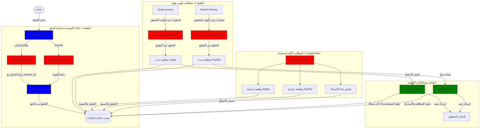
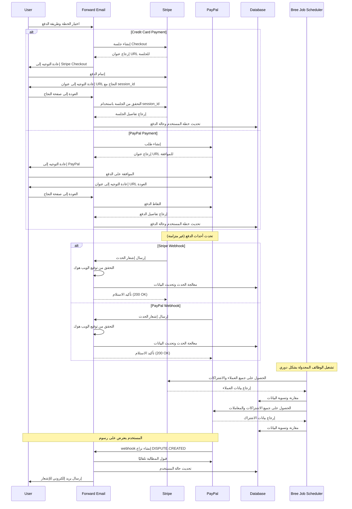
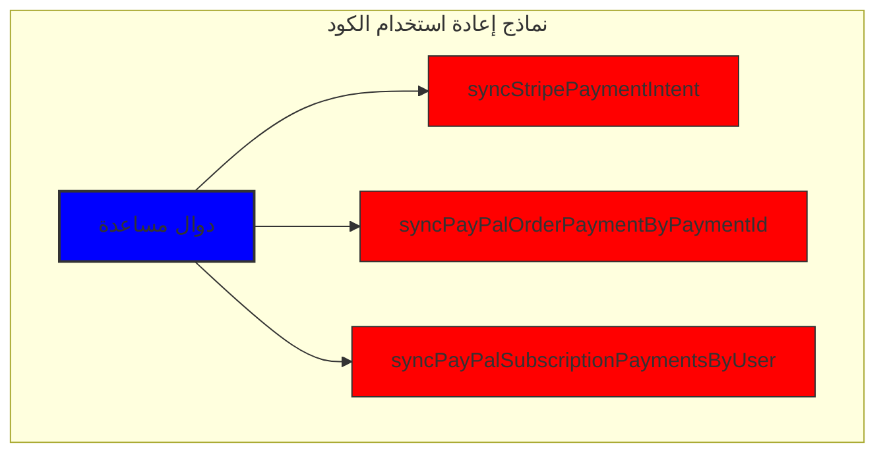
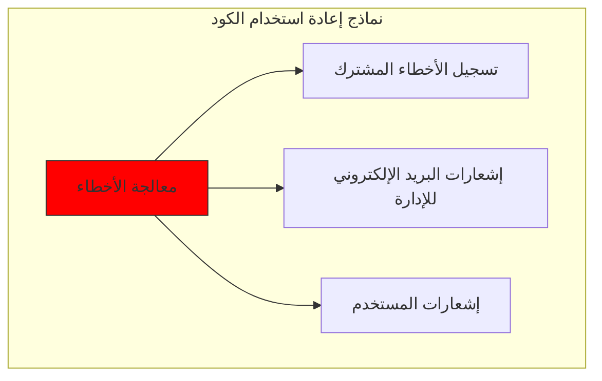
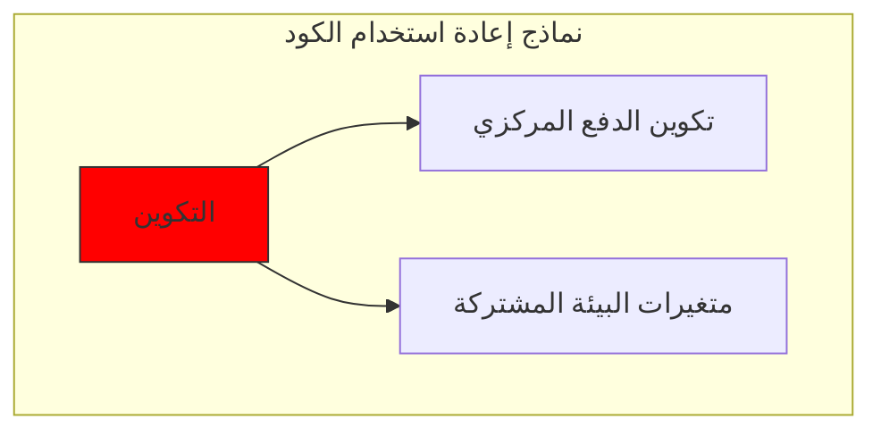
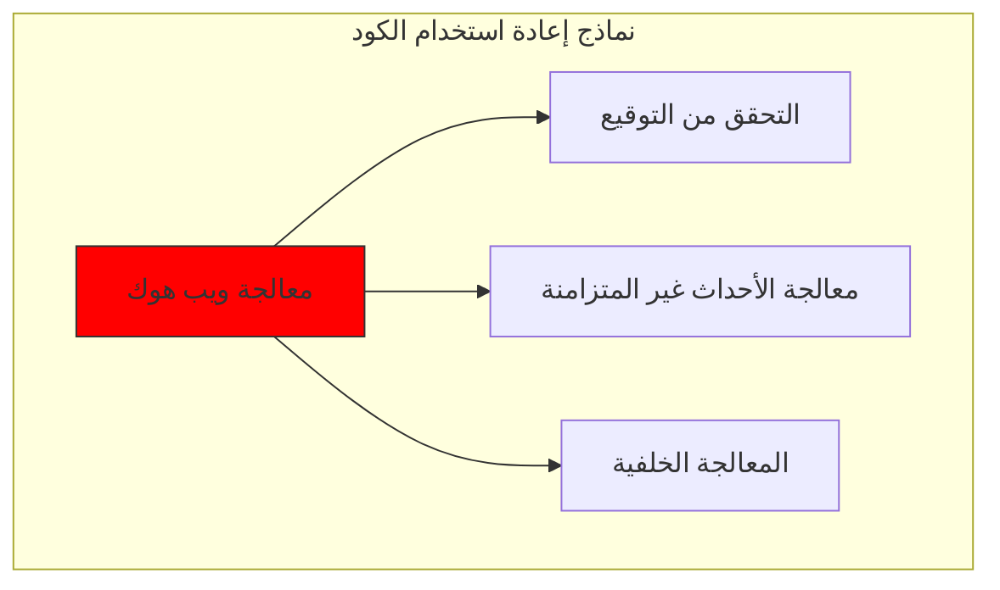
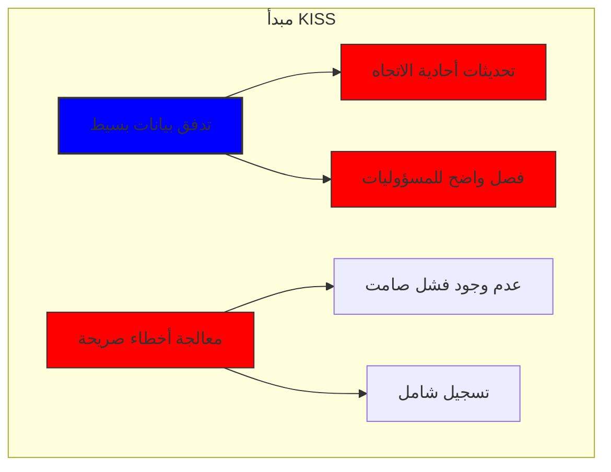

# كيف بنينا نظام دفع قوي باستخدام Stripe و PayPal: نهج الثلاثية {#how-we-built-a-robust-payment-system-with-stripe-and-paypal-a-trifecta-approach}


## جدول المحتويات {#table-of-contents}

* [مقدمة](#foreword)
* [التحدي: معالجات دفع متعددة، مصدر واحد للحقيقة](#the-challenge-multiple-payment-processors-one-source-of-truth)
* [نهج الثلاثية: ثلاث طبقات من الاعتمادية](#the-trifecta-approach-three-layers-of-reliability)
* [الطبقة 1: إعادة التوجيه بعد إتمام الدفع](#layer-1-post-checkout-redirects)
  * [تنفيذ Stripe Checkout](#stripe-checkout-implementation)
  * [تدفق دفع PayPal](#paypal-payment-flow)
* [الطبقة 2: معالجات الويب هوك مع التحقق من التوقيع](#layer-2-webhook-handlers-with-signature-verification)
  * [تنفيذ ويب هوك Stripe](#stripe-webhook-implementation)
  * [تنفيذ ويب هوك PayPal](#paypal-webhook-implementation)
* [الطبقة 3: الوظائف الآلية باستخدام Bree](#layer-3-automated-jobs-with-bree)
  * [مدقق دقة الاشتراك](#subscription-accuracy-checker)
  * [مزامنة اشتراكات PayPal](#paypal-subscription-synchronization)
* [التعامل مع الحالات الخاصة](#handling-edge-cases)
  * [كشف ومنع الاحتيال](#fraud-detection-and-prevention)
  * [معالجة النزاعات](#dispute-handling)
* [إعادة استخدام الكود: مبادئ KISS و DRY](#code-reuse-kiss-and-dry-principles)
* [تنفيذ متطلبات اشتراك VISA](#visa-subscription-requirements-implementation)
  * [إشعارات البريد الإلكتروني الآلية قبل التجديد](#automated-pre-renewal-email-notifications)
  * [التعامل مع الحالات الخاصة](#handling-edge-cases-1)
  * [فترات التجربة وشروط الاشتراك](#trial-periods-and-subscription-terms)
* [الخاتمة: فوائد نهج الثلاثية لدينا](#conclusion-the-benefits-of-our-trifecta-approach)


## مقدمة {#foreword}

في Forward Email، كنا دائمًا نولي الأولوية لإنشاء أنظمة موثوقة ودقيقة وسهلة الاستخدام. عندما حان وقت تنفيذ نظام معالجة الدفع الخاص بنا، كنا نعلم أننا بحاجة إلى حل يمكنه التعامل مع معالجات دفع متعددة مع الحفاظ على اتساق البيانات بشكل مثالي. يوضح هذا المنشور كيف دمج فريق التطوير لدينا كل من Stripe و PayPal باستخدام نهج الثلاثية الذي يضمن دقة 1:1 في الوقت الحقيقي عبر نظامنا بأكمله.


## التحدي: معالجات دفع متعددة، مصدر واحد للحقيقة {#the-challenge-multiple-payment-processors-one-source-of-truth}

بصفتنا خدمة بريد إلكتروني تركز على الخصوصية، أردنا أن نوفر لمستخدمينا خيارات دفع. يفضل البعض بساطة الدفع ببطاقات الائتمان عبر Stripe، بينما يقدر آخرون الطبقة الإضافية من الفصل التي يوفرها PayPal. ومع ذلك، فإن دعم معالجات دفع متعددة يضيف تعقيدًا كبيرًا:

1. كيف نضمن اتساق البيانات عبر أنظمة الدفع المختلفة؟
2. كيف نتعامل مع الحالات الخاصة مثل النزاعات، الاستردادات، أو المدفوعات الفاشلة؟
3. كيف نحافظ على مصدر واحد للحقيقة في قاعدة بياناتنا؟

كان حلنا هو تنفيذ ما نسميه "نهج الثلاثية" - نظام ثلاثي الطبقات يوفر التكرار ويضمن اتساق البيانات مهما حدث.


## نهج الثلاثية: ثلاث طبقات من الاعتمادية {#the-trifecta-approach-three-layers-of-reliability}

يتكون نظام الدفع لدينا من ثلاثة مكونات حاسمة تعمل معًا لضمان تزامن البيانات بشكل مثالي:

1. **إعادة التوجيه بعد إتمام الدفع** - التقاط معلومات الدفع فورًا بعد إتمام الشراء
2. **معالجات الويب هوك** - معالجة الأحداث في الوقت الحقيقي من معالجات الدفع
3. **الوظائف الآلية** - التحقق الدوري وتسوية بيانات الدفع

دعونا نغوص في كل مكون ونرى كيف يعملون معًا.


```mermaid
flowchart TD
    User([User]) --> |يختار الخطة| Checkout[Checkout Page]

    %% Layer 1: Post-checkout redirects
    subgraph "الطبقة 1: إعادة التوجيه بعد إتمام الدفع"
        Checkout --> |بطاقة ائتمان| Stripe[Stripe Checkout]
        Checkout --> |PayPal| PayPal[PayPal Payment]

        Stripe --> |رابط النجاح مع session_id| SuccessPage[صفحة النجاح]
        PayPal --> |رابط العودة| SuccessPage

        SuccessPage --> |التحقق من الدفع| Database[(تحديث قاعدة البيانات)]
    end

    %% Layer 2: Webhooks
    subgraph "الطبقة 2: معالجات الويب هوك"
        StripeEvents[Stripe Events] --> |إشعارات في الوقت الحقيقي| StripeWebhook[معالج ويب هوك Stripe]
        PayPalEvents[PayPal Events] --> |إشعارات في الوقت الحقيقي| PayPalWebhook[معالج ويب هوك PayPal]

        StripeWebhook --> |التحقق من التوقيع| ProcessStripeEvent[معالجة حدث Stripe]
        PayPalWebhook --> |التحقق من التوقيع| ProcessPayPalEvent[معالجة حدث PayPal]

        ProcessStripeEvent --> Database
        ProcessPayPalEvent --> Database
    end

    %% Layer 3: Automated jobs
    subgraph "الطبقة 3: الوظائف الآلية باستخدام Bree"
        BreeScheduler[Bree Scheduler] --> StripeSync[وظيفة مزامنة Stripe]
        BreeScheduler --> PayPalSync[وظيفة مزامنة PayPal]
        BreeScheduler --> AccuracyCheck[فحص دقة الاشتراك]

        StripeSync --> |التحقق والتسوية| Database
        PayPalSync --> |التحقق والتسوية| Database
        AccuracyCheck --> |ضمان الاتساق| Database
    end

    %% Edge cases
    subgraph "التعامل مع الحالات الخاصة"
        ProcessStripeEvent --> |كشف الاحتيال| FraudCheck[فحص الاحتيال]
        ProcessPayPalEvent --> |إنشاء نزاع| DisputeHandler[معالجة النزاع]

        FraudCheck --> |حظر المستخدم إذا كان محتالًا| Database
        DisputeHandler --> |قبول المطالبة والاسترداد| Database

        FraudCheck --> |إرسال تنبيه| AdminNotification[إشعار المسؤول]
        DisputeHandler --> |إرسال تنبيه| AdminNotification
    end

    %% Style definitions
    classDef primary fill:blue,stroke:#333,stroke-width:2px;
    classDef secondary fill:red,stroke:#333,stroke-width:1px;
    classDef tertiary fill:green,stroke:#333,stroke-width:1px;

    class Checkout,SuccessPage primary;
    class Stripe,PayPal,StripeWebhook,PayPalWebhook,BreeScheduler secondary;
    class FraudCheck,DisputeHandler tertiary;
```
## الطبقة 1: إعادة التوجيه بعد إتمام الدفع {#layer-1-post-checkout-redirects}

تحدث الطبقة الأولى من نهجنا الثلاثي مباشرة بعد أن يكمل المستخدم الدفع. توفر كل من Stripe و PayPal آليات لإعادة توجيه المستخدمين إلى موقعنا مع معلومات المعاملة.

### تنفيذ Stripe Checkout {#stripe-checkout-implementation}

بالنسبة لـ Stripe، نستخدم واجهة برمجة تطبيقات جلسات Checkout الخاصة بهم لإنشاء تجربة دفع سلسة. عندما يختار المستخدم خطة ويختار الدفع ببطاقة ائتمان، نقوم بإنشاء جلسة Checkout مع عناوين URL محددة للنجاح والإلغاء:

```javascript
const options = {
  mode: paymentType === 'one-time' ? 'payment' : 'subscription',
  customer: ctx.state.user[config.userFields.stripeCustomerID],
  client_reference_id: reference,
  metadata: {
    plan
  },
  line_items: [
    {
      price,
      quantity: 1,
      description
    }
  ],
  locale: config.STRIPE_LOCALES.has(ctx.locale) ? ctx.locale : 'auto',
  cancel_url: `${config.urls.web}${ctx.path}${
    isMakePayment || isEnableAutoRenew ? '' : `/?plan=${plan}`
  }`,
  success_url: `${config.urls.web}${ctx.path}/?${
    isMakePayment || isEnableAutoRenew ? '' : `plan=${plan}&`
  }session_id={CHECKOUT_SESSION_ID}`,
  allow_promotion_codes: true
};

// Create the checkout session and redirect
const session = await stripe.checkout.sessions.create(options);
const redirectTo = session.url;
if (ctx.accepts('html')) {
  ctx.status = 303;
  ctx.redirect(redirectTo);
} else {
  ctx.body = { redirectTo };
}
```

الجزء الحاسم هنا هو معلمة `success_url`، التي تتضمن `session_id` كمعلمة استعلام. عندما يعيد Stripe توجيه المستخدم إلى موقعنا بعد دفع ناجح، يمكننا استخدام معرف الجلسة هذا للتحقق من المعاملة وتحديث قاعدة بياناتنا وفقًا لذلك.

### تدفق دفع PayPal {#paypal-payment-flow}

بالنسبة لـ PayPal، نستخدم نهجًا مشابهًا مع واجهة برمجة تطبيقات الطلبات الخاصة بهم:

```javascript
const requestBody = {
  intent: 'CAPTURE',
  application_context: {
    cancel_url: `${config.urls.web}${ctx.path}${
      isMakePayment || isEnableAutoRenew ? '' : `/?plan=${plan}`
    }`,
    return_url: `${config.urls.web}${ctx.path}/?plan=${plan}`,
    brand_name: 'Forward Email',
    shipping_preference: 'NO_SHIPPING',
    user_action: 'PAY_NOW'
  },
  payer: {
    email_address: ctx.state.user.email
  },
  purchase_units: [
    {
      reference_id: ctx.state.user.id,
      description,
      custom_id: sku,
      invoice_id: reference,
      soft_descriptor: sku,
      amount: {
        currency_code: 'USD',
        value: price,
        breakdown: {
          item_total: {
            currency_code: 'USD',
            value: price
          }
        }
      },
      items: [
        {
          name,
          description,
          sku,
          unit_amount: {
            currency_code: 'USD',
            value: price
          },
          quantity: '1',
          category: 'DIGITAL_GOODS'
        }
      ]
    }
  ]
};
```

مماثل لـ Stripe، نحدد معلمات `return_url` و `cancel_url` للتعامل مع إعادة التوجيه بعد الدفع. عندما يعيد PayPal توجيه المستخدم إلى موقعنا، يمكننا التقاط تفاصيل الدفع وتحديث قاعدة بياناتنا.


```mermaid
sequenceDiagram
    participant User
    participant FE as Forward Email
    participant Stripe
    participant PayPal
    participant DB as Database
    participant Bree as Bree Job Scheduler

    %% Initial checkout flow
    User->>FE: اختيار الخطة وطريقة الدفع

    alt Credit Card Payment
        FE->>Stripe: إنشاء جلسة Checkout
        Stripe-->>FE: إرجاع عنوان URL للجلسة
        FE->>User: إعادة التوجيه إلى Stripe Checkout
        User->>Stripe: إتمام الدفع
        Stripe->>User: إعادة التوجيه إلى عنوان URL النجاح مع session_id
        User->>FE: العودة إلى صفحة النجاح
        FE->>Stripe: التحقق من الجلسة باستخدام session_id
        Stripe-->>FE: إرجاع تفاصيل الجلسة
        FE->>DB: تحديث خطة المستخدم وحالة الدفع
    else PayPal Payment
        FE->>PayPal: إنشاء طلب
        PayPal-->>FE: إرجاع عنوان URL للموافقة
        FE->>User: إعادة التوجيه إلى PayPal
        User->>PayPal: الموافقة على الدفع
        PayPal->>User: إعادة التوجيه إلى عنوان URL العودة
        User->>FE: العودة إلى صفحة النجاح
        FE->>PayPal: التقاط الدفع
        PayPal-->>FE: إرجاع تفاصيل الدفع
        FE->>DB: تحديث خطة المستخدم وحالة الدفع
    end

    %% Webhook flow (asynchronous)
    Note over Stripe,PayPal: تحدث أحداث الدفع (غير متزامنة)

    alt Stripe Webhook
        Stripe->>FE: إرسال إشعار الحدث
        FE->>FE: التحقق من توقيع الويب هوك
        FE->>DB: معالجة الحدث وتحديث البيانات
        FE-->>Stripe: تأكيد الاستلام (200 OK)
    else PayPal Webhook
        PayPal->>FE: إرسال إشعار الحدث
        FE->>FE: التحقق من توقيع الويب هوك
        FE->>DB: معالجة الحدث وتحديث البيانات
        FE-->>PayPal: تأكيد الاستلام (200 OK)
    end

    %% Bree automated jobs
    Note over Bree: تشغيل الوظائف المجدولة بشكل دوري

    Bree->>Stripe: الحصول على جميع العملاء والاشتراكات
    Stripe-->>Bree: إرجاع بيانات العملاء
    Bree->>DB: مقارنة وتسوية البيانات

    Bree->>PayPal: الحصول على جميع الاشتراكات والمعاملات
    PayPal-->>Bree: إرجاع بيانات الاشتراك
    Bree->>DB: مقارنة وتسوية البيانات

    %% Edge case: Dispute handling
    Note over User,PayPal: المستخدم يعترض على رسوم

    PayPal->>FE: webhook إنشاء نزاع DISPUTE.CREATED
    FE->>PayPal: قبول المطالبة تلقائيًا
    FE->>DB: تحديث حالة المستخدم
    FE->>User: إرسال بريد إلكتروني للإشعار
```
## الطبقة 2: معالجات الويب هوك مع التحقق من التوقيع {#layer-2-webhook-handlers-with-signature-verification}

بينما تعمل عمليات إعادة التوجيه بعد إتمام الشراء بشكل جيد في معظم السيناريوهات، إلا أنها ليست مضمونة. قد يغلق المستخدمون متصفحهم قبل إعادة التوجيه، أو قد تمنع مشاكل الشبكة إكمال عملية إعادة التوجيه. هنا يأتي دور الويب هوك.

يوفر كل من Stripe و PayPal أنظمة ويب هوك ترسل إشعارات في الوقت الحقيقي حول أحداث الدفع. لقد قمنا بتنفيذ معالجات ويب هوك قوية تتحقق من صحة هذه الإشعارات وتعالجها وفقًا لذلك.

### تنفيذ ويب هوك Stripe {#stripe-webhook-implementation}

يقوم معالج ويب هوك Stripe الخاص بنا بالتحقق من توقيع أحداث الويب هوك الواردة لضمان شرعيتها:

```javascript
async function webhook(ctx) {
  const sig = ctx.request.get('stripe-signature');
  // throw an error if something was wrong
  if (!isSANB(sig))
    throw Boom.badRequest(ctx.translateError('INVALID_STRIPE_SIGNATURE'));
  const event = stripe.webhooks.constructEvent(
    ctx.request.rawBody,
    sig,
    env.STRIPE_ENDPOINT_SECRET
  );
  // throw an error if something was wrong
  if (!event)
    throw Boom.badRequest(ctx.translateError('INVALID_STRIPE_SIGNATURE'));
  ctx.logger.info('stripe webhook', { event });
  // return a response to acknowledge receipt of the event
  ctx.body = { received: true };
  // run in background
  processEvent(ctx, event)
    .then()
    .catch((err) => {
      ctx.logger.fatal(err, { event });
      // email admin errors
      emailHelper({
        template: 'alert',
        message: {
          to: config.email.message.from,
          subject: `Error with Stripe Webhook (Event ID ${event.id})`
        },
        locals: {
          message: `<pre><code>${safeStringify(
            parseErr(err),
            null,
            2
          )}</code></pre>`
        }
      })
        .then()
        .catch((err) => ctx.logger.fatal(err, { event }));
    });
}
```

تتحقق دالة `stripe.webhooks.constructEvent` من التوقيع باستخدام سر نقطة النهاية الخاصة بنا. إذا كان التوقيع صالحًا، نقوم بمعالجة الحدث بشكل غير متزامن لتجنب حجب استجابة الويب هوك.

### تنفيذ ويب هوك PayPal {#paypal-webhook-implementation}

بنفس الطريقة، يتحقق معالج ويب هوك PayPal الخاص بنا من صحة الإشعارات الواردة:

```javascript
async function webhook(ctx) {
  const response = await promisify(
    paypal.notification.webhookEvent.verify,
    paypal.notification.webhookEvent
  )(ctx.request.headers, ctx.request.body, env.PAYPAL_WEBHOOK_ID);
  // throw an error if something was wrong
  if (!_.isObject(response) || response.verification_status !== 'SUCCESS')
    throw Boom.badRequest(ctx.translateError('INVALID_PAYPAL_SIGNATURE'));
  // return a response to acknowledge receipt of the event
  ctx.body = { received: true };
  // run in background
  processEvent(ctx)
    .then()
    .catch((err) => {
      ctx.logger.fatal(err);
      // email admin errors
      emailHelper({
        template: 'alert',
        message: {
          to: config.email.message.from,
          subject: `Error with PayPal Webhook (Event ID ${ctx.request.body.id})`
        },
        locals: {
          message: `<pre><code>${safeStringify(
            parseErr(err),
            null,
            2
          )}</code></pre>`
        }
      })
        .then()
        .catch((err) => ctx.logger.fatal(err));
    });
}
```

يتبع كلا معالجي الويب هوك نفس النمط: التحقق من التوقيع، تأكيد الاستلام، ومعالجة الحدث بشكل غير متزامن. هذا يضمن أننا لا نفوت أي حدث دفع، حتى إذا فشلت إعادة التوجيه بعد إتمام الشراء.


## الطبقة 3: الوظائف الآلية مع Bree {#layer-3-automated-jobs-with-bree}

الطبقة النهائية من نهجنا الثلاثي هي مجموعة من الوظائف الآلية التي تتحقق دوريًا من بيانات الدفع وتقوم بمطابقتها. نستخدم Bree، وهو مجدول وظائف لـ Node.js، لتشغيل هذه الوظائف على فترات منتظمة.

### مدقق دقة الاشتراك {#subscription-accuracy-checker}

واحدة من الوظائف الرئيسية لدينا هي مدقق دقة الاشتراك، الذي يضمن أن قاعدة بياناتنا تعكس بدقة حالة الاشتراك في Stripe:
```javascript
async function mapper(customer) {
  // wait a second to prevent rate limitation error
  await setTimeout(ms('1s'));
  // check for user on our side
  let user = await Users.findOne({
    [config.userFields.stripeCustomerID]: customer.id
  })
    .lean()
    .exec();
  if (!user) return;
  if (user.is_banned) return;

  // if emails did not match
  if (user.email !== customer.email) {
    logger.info(
      `User email ${user.email} did not match customer email ${customer.email} (${customer.id})`
    );
    customer = await stripe.customers.update(customer.id, {
      email: user.email
    });
    logger.info(`Updated user email to match ${user.email}`);
  }

  // check for active subscriptions
  const [activeSubscriptions, trialingSubscriptions] = await Promise.all([
    stripe.subscriptions.list({
      customer: customer.id,
      status: 'active'
    }),
    stripe.subscriptions.list({
      customer: customer.id,
      status: 'trialing'
    })
  ]);

  // Combine active and trialing subscriptions
  let subscriptions = [
    ...activeSubscriptions.data,
    ...trialingSubscriptions.data
  ];

  // Handle edge case: multiple subscriptions for one user
  if (subscriptions.length > 1) {
    await logger.error(
      new Error(
        `We may need to refund: User had multiple subscriptions ${user.email} (${customer.id})`
      )
    );
    await emailHelper({
      template: 'alert',
      message: {
        to: config.email.message.from,
        subject: `User had multiple subscriptions ${user.email}`
      },
      locals: {
        message: `User ${user.email} (${customer.id}) had multiple subscriptions: ${JSON.stringify(
          subscriptions.map((s) => s.id)
        )}`
      }
    });
  }
}
```

This job checks for discrepancies between our database and Stripe, such as mismatched email addresses or multiple active subscriptions. If it finds any issues, it logs them and sends alerts to our admin team.

### PayPal Subscription Synchronization {#paypal-subscription-synchronization}

We have a similar job for PayPal subscriptions:

```javascript
async function syncPayPalSubscriptionPayments() {
  const paypalCustomers = await Users.find({
    $or: [
      {
        [config.userFields.paypalSubscriptionID]: { $exists: true, $ne: null }
      },
      {
        [config.userFields.paypalPayerID]: { $exists: true, $ne: null }
      }
    ]
  })
    // sort by newest customers first
    .sort('-created_at')
    .lean()
    .exec();

  await logger.info(
    `Syncing payments for ${paypalCustomers.length} paypal customers`
  );

  // Process each customer and sync their payments
  const errorEmails = await pReduce(
    paypalCustomers,
    // Implementation details...
  );
}
```

These automated jobs serve as our final safety net, ensuring that our database always reflects the true state of subscriptions and payments in both Stripe and PayPal.


## Handling Edge Cases {#handling-edge-cases}

A robust payment system must handle edge cases gracefully. Let's look at how we handle some common scenarios.

### Fraud Detection and Prevention {#fraud-detection-and-prevention}

We've implemented sophisticated fraud detection mechanisms that automatically identify and handle suspicious payment activities:

```javascript
case 'charge.failed': {
  // Get all failed charges in the last 30 days
  const charges = await stripe.charges.list({
    customer: event.data.object.customer,
    created: {
      gte: dayjs().subtract(1, 'month').unix()
    }
  });

  // Filter for declined charges
  const filtered = charges.data.filter(
    (d) => d.status === 'failed' && d.failure_code === 'card_declined'
  );

  // if not more than 5 then return early
  if (filtered.length < 5) break;

  // Check if user has verified domains
  const count = await Domains.countDocuments({
    members: {
      $elemMatch: {
        user: user._id,
        group: 'admin'
      }
    },
    plan: { $in: ['enhanced_protection', 'team'] },
    has_txt_record: true
  });

  if (!user.is_banned) {
    // If no verified domains, ban the user and refund all charges
    if (count === 0) {
      // Ban the user
      user.is_banned = true;
      await user.save();

      // Refund all successful charges
    }
  }
}
```

يقوم هذا الكود بحظر المستخدمين تلقائيًا الذين لديهم عدة محاولات فشل في الشحنات ولا يملكون نطاقات موثقة، وهو مؤشر قوي على نشاط احتيالي.

### معالجة النزاعات {#dispute-handling}

عندما يعترض المستخدم على شحنة، نقبل الادعاء تلقائيًا ونتخذ الإجراء المناسب:

```javascript
case 'CUSTOMER.DISPUTE.CREATED': {
  // قبول الادعاء
  const agent = await paypalAgent();
  await agent
    .post(`/v1/customer/disputes/${body.resource.dispute_id}/accept-claim`)
    .send({
      note: 'استرداد كامل للمبلغ للعميل.'
    });

  // البحث عن الدفع في قاعدة بياناتنا
  const payment = await Payments.findOne({ $or });
  if (!payment) throw new Error('الدفع غير موجود');

  const user = await Users.findById(payment.user);
  if (!user) throw new Error('المستخدم غير موجود للعميل');

  // إلغاء اشتراك المستخدم إذا كان لديه واحد
  if (isSANB(user[config.userFields.paypalSubscriptionID])) {
    try {
      const agent = await paypalAgent();
      await agent.post(
        `/v1/billing/subscriptions/${
          user[config.userFields.paypalSubscriptionID]
        }/cancel`
      );
    } catch (err) {
      // معالجة أخطاء إلغاء الاشتراك
    }
  }
}
```

تقلل هذه الطريقة من تأثير النزاعات على أعمالنا مع ضمان تجربة جيدة للعميل.


## إعادة استخدام الكود: مبادئ KISS و DRY {#code-reuse-kiss-and-dry-principles}

على مدار نظام الدفع لدينا، التزمنا بمبادئ KISS (اجعلها بسيطة، غبي) و DRY (لا تكرر نفسك). إليك بعض الأمثلة:

1. **دوال مساعدة مشتركة**: أنشأنا دوال مساعدة قابلة لإعادة الاستخدام للمهام الشائعة مثل مزامنة المدفوعات وإرسال الرسائل الإلكترونية.

2. **معالجة أخطاء متسقة**: يستخدم كل من معالجات ويب هوك Stripe و PayPal نفس النمط لمعالجة الأخطاء وإشعارات الإدارة.

3. **مخطط قاعدة بيانات موحد**: تم تصميم مخطط قاعدة البيانات لدينا لاستيعاب بيانات كل من Stripe و PayPal، مع حقول مشتركة لحالة الدفع، المبلغ، ومعلومات الخطة.

4. **تكوين مركزي**: يتمركز تكوين الدفع في ملف واحد، مما يسهل تحديث الأسعار ومعلومات المنتج.


```mermaid
graph TD
    subgraph "نماذج إعادة استخدام الكود"
        A[دوال مساعدة] --> B[syncStripePaymentIntent]
        A --> C[syncPayPalOrderPaymentByPaymentId]
        A --> D[syncPayPalSubscriptionPaymentsByUser]
    end

    classDef primary fill:blue,stroke:#333,stroke-width:2px;
    classDef secondary fill:red,stroke:#333,stroke-width:1px;

    class A,P,V primary;
    class B,C,D,E,I,L,Q,R,S,W,X,Y,Z secondary;
```


```mermaid
graph TD
    subgraph "نماذج إعادة استخدام الكود"
        E[معالجة الأخطاء] --> F[تسجيل الأخطاء المشترك]
        E --> G[إشعارات البريد الإلكتروني للإدارة]
        E --> H[إشعارات المستخدم]
    end

    classDef primary fill:blue,stroke:#333,stroke-width:2px;
    classDef secondary fill:red,stroke:#333,stroke-width:1px;

    class A,P,V primary;
    class B,C,D,E,I,L,Q,R,S,W,X,Y,Z secondary;
```


```mermaid
graph TD
    subgraph "نماذج إعادة استخدام الكود"
        I[التكوين] --> J[تكوين الدفع المركزي]
        I --> K[متغيرات البيئة المشتركة]
    end

    classDef primary fill:blue,stroke:#333,stroke-width:2px;
    classDef secondary fill:red,stroke:#333,stroke-width:1px;

    class A,P,V primary;
    class B,C,D,E,I,L,Q,R,S,W,X,Y,Z secondary;
```


```mermaid
graph TD
    subgraph "نماذج إعادة استخدام الكود"
        L[معالجة ويب هوك] --> M[التحقق من التوقيع]
        L --> N[معالجة الأحداث غير المتزامنة]
        L --> O[المعالجة الخلفية]
    end

    classDef primary fill:blue,stroke:#333,stroke-width:2px;
    classDef secondary fill:red,stroke:#333,stroke-width:1px;

    class A,P,V primary;
    class B,C,D,E,I,L,Q,R,S,W,X,Y,Z secondary;
```


```mermaid
graph TD
    subgraph "مبدأ KISS"
        P[تدفق بيانات بسيط] --> Q[تحديثات أحادية الاتجاه]
        P --> R[فصل واضح للمسؤوليات]

        S[معالجة أخطاء صريحة] --> T[عدم وجود فشل صامت]
        S --> U[تسجيل شامل]
    end

    classDef primary fill:blue,stroke:#333,stroke-width:2px;
    classDef secondary fill:red,stroke:#333,stroke-width:1px;

    class A,P,V primary;
    class B,C,D,E,I,L,Q,R,S,W,X,Y,Z secondary;
```
graph TD
    subgraph "مبدأ DRY"
        V[المنطق المشترك] --> W[وظائف معالجة الدفع]
        V --> X[قوالب البريد الإلكتروني]
        V --> Y[منطق التحقق]

        Z[عمليات قاعدة البيانات المشتركة] --> AA[تحديثات المستخدم]
        Z --> AB[تسجيل الدفع]
    end

    classDef primary fill:blue,stroke:#333,stroke-width:2px;
    classDef secondary fill:red,stroke:#333,stroke-width:1px;

    class A,P,V primary;
    class B,C,D,E,I,L,Q,R,S,W,X,Y,Z secondary;
```


## تنفيذ متطلبات الاشتراك في VISA {#visa-subscription-requirements-implementation}

بالإضافة إلى نهجنا الثلاثي، قمنا بتنفيذ ميزات محددة للامتثال لمتطلبات الاشتراك في VISA مع تحسين تجربة المستخدم. أحد المتطلبات الرئيسية من VISA هو أنه يجب إعلام المستخدمين قبل أن يتم تحصيل رسوم الاشتراك منهم، خاصة عند الانتقال من فترة تجريبية إلى اشتراك مدفوع.

### إشعارات البريد الإلكتروني التلقائية قبل التجديد {#automated-pre-renewal-email-notifications}

قمنا ببناء نظام تلقائي يحدد المستخدمين الذين لديهم اشتراكات تجريبية نشطة ويرسل لهم بريدًا إلكترونيًا إشعاريًا قبل حدوث أول عملية تحصيل. هذا لا يحافظ فقط على امتثالنا لمتطلبات VISA ولكنه يقلل أيضًا من عمليات الاسترداد ويحسن رضا العملاء.

إليك كيف قمنا بتنفيذ هذه الميزة:

```javascript
// العثور على المستخدمين الذين لديهم اشتراكات تجريبية ولم يتلقوا إشعارًا بعد
const users = await Users.find({
  $or: [
    {
      $and: [
        { [config.userFields.stripeSubscriptionID]: { $exists: true } },
        { [config.userFields.stripeTrialSentAt]: { $exists: false } },
        // استبعاد الاشتراكات التي تم دفعها بالفعل
        ...(paidStripeSubscriptionIds.length > 0
          ? [
              {
                [config.userFields.stripeSubscriptionID]: {
                  $nin: paidStripeSubscriptionIds
                }
              }
            ]
          : [])
      ]
    },
    {
      $and: [
        { [config.userFields.paypalSubscriptionID]: { $exists: true } },
        { [config.userFields.paypalTrialSentAt]: { $exists: false } },
        // استبعاد الاشتراكات التي تم دفعها بالفعل
        ...(paidPayPalSubscriptionIds.length > 0
          ? [
              {
                [config.userFields.paypalSubscriptionID]: {
                  $nin: paidPayPalSubscriptionIds
                }
              }
            ]
          : [])
      ]
    }
  ]
});

// معالجة كل مستخدم وإرسال الإشعار
for (const user of users) {
  // الحصول على تفاصيل الاشتراك من معالج الدفع
  const subscription = await getSubscriptionDetails(user);

  // حساب مدة الاشتراك وتكراره
  const duration = getDurationFromPlanId(subscription.plan_id);
  const frequency = getHumanReadableFrequency(duration, user.locale);
  const amount = getPlanAmount(user.plan, duration);

  // الحصول على نطاقات المستخدم للبريد الإلكتروني المخصص
  const domains = await Domains.find({
    'members.user': user._id
  }).sort('name').lean().exec();

  // إرسال بريد إلكتروني مطابق لمتطلبات VISA
  await emailHelper({
    template: 'visa-trial-subscription-requirement',
    message: {
      to: user.receipt_email || user.email,
      ...(user.receipt_email ? { cc: user.email } : {})
    },
    locals: {
      user,
      firstChargeDate: new Date(subscription.start_time),
      frequency,
      formattedAmount: numeral(amount).format('$0,0,0.00'),
      domains
    }
  });

  // تسجيل أنه تم إرسال الإشعار
  await Users.findByIdAndUpdate(user._id, {
    $set: {
      [config.userFields.paypalTrialSentAt]: new Date()
    }
  });
}
```

يضمن هذا التنفيذ أن يتم إعلام المستخدمين دائمًا بالرسوم القادمة، مع تفاصيل واضحة حول:

1. متى ستحدث أول عملية تحصيل
2. تكرار الرسوم المستقبلية (شهريًا، سنويًا، إلخ)
3. المبلغ الدقيق الذي سيتم تحصيله
4. النطاقات التي يغطيها اشتراكهم

من خلال أتمتة هذه العملية، نحافظ على الامتثال الكامل لمتطلبات VISA (التي تفرض الإشعار قبل 7 أيام على الأقل من التحصيل) مع تقليل استفسارات الدعم وتحسين تجربة المستخدم بشكل عام.
### التعامل مع الحالات الخاصة {#handling-edge-cases-1}

تتضمن تطبيقنا أيضًا معالجة أخطاء قوية. إذا حدث أي خطأ أثناء عملية الإشعار، يقوم نظامنا تلقائيًا بتنبيه فريقنا:

```javascript
try {
  await mapper(user);
} catch (err) {
  logger.error(err);

  // Send alert to administrators
  await emailHelper({
    template: 'alert',
    message: {
      to: config.email.message.from,
      subject: 'VISA Trial Subscription Requirement Error'
    },
    locals: {
      message: `<pre><code>${safeStringify(
        parseErr(err),
        null,
        2
      )}</code></pre>`
    }
  });
}
```

هذا يضمن أنه حتى إذا كان هناك مشكلة في نظام الإشعارات، يمكن لفريقنا التعامل معها بسرعة والحفاظ على الامتثال لمتطلبات VISA.

نظام إشعارات الاشتراك في VISA هو مثال آخر على كيفية بناء بنية الدفع لدينا مع مراعاة كل من الامتثال وتجربة المستخدم، مما يكمل نهجنا الثلاثي لضمان معالجة دفع موثوقة وشفافة.

### فترات التجربة وشروط الاشتراك {#trial-periods-and-subscription-terms}

للمستخدمين الذين يفعلون التجديد التلقائي على الخطط الحالية، نقوم بحساب فترة التجربة المناسبة لضمان عدم تحصيل أي رسوم حتى تنتهي خطتهم الحالية:

```javascript
if (
  isEnableAutoRenew &&
  dayjs(ctx.state.user[config.userFields.planExpiresAt]).isAfter(
    dayjs()
  )
) {
  const hours = dayjs(
    ctx.state.user[config.userFields.planExpiresAt]
  ).diff(dayjs(), 'hours');

  // Handle trial period calculation
}
```

نقدم أيضًا معلومات واضحة حول شروط الاشتراك، بما في ذلك تكرار الفوترة وسياسات الإلغاء، ونضمن تضمين بيانات وصفية مفصلة مع كل اشتراك لضمان التتبع والإدارة السليمة.

## الخاتمة: فوائد نهجنا الثلاثي {#conclusion-the-benefits-of-our-trifecta-approach}

لقد وفر نهجنا الثلاثي في معالجة الدفع عدة فوائد رئيسية:

1. **الموثوقية**: من خلال تنفيذ ثلاث طبقات من التحقق من الدفع، نضمن عدم فقدان أي دفعة أو معالجتها بشكل خاطئ.

2. **الدقة**: تعكس قاعدة بياناتنا دائمًا الحالة الحقيقية للاشتراكات والمدفوعات في كل من Stripe و PayPal.

3. **المرونة**: يمكن للمستخدمين اختيار طريقة الدفع المفضلة لديهم دون التأثير على موثوقية نظامنا.

4. **الصلابة**: يتعامل نظامنا مع الحالات الخاصة بسلاسة، من فشل الشبكة إلى الأنشطة الاحتيالية.

إذا كنت تقوم بتنفيذ نظام دفع يدعم عدة معالجات، نوصي بشدة بهذا النهج الثلاثي. يتطلب جهد تطوير أولي أكبر، لكن الفوائد طويلة الأمد من حيث الموثوقية والدقة تستحق ذلك.

لمزيد من المعلومات حول Forward Email وخدمات البريد الإلكتروني التي تركز على الخصوصية، قم بزيارة [موقعنا](https://forwardemail.net).
