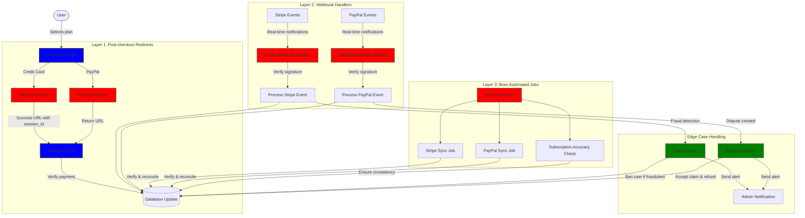
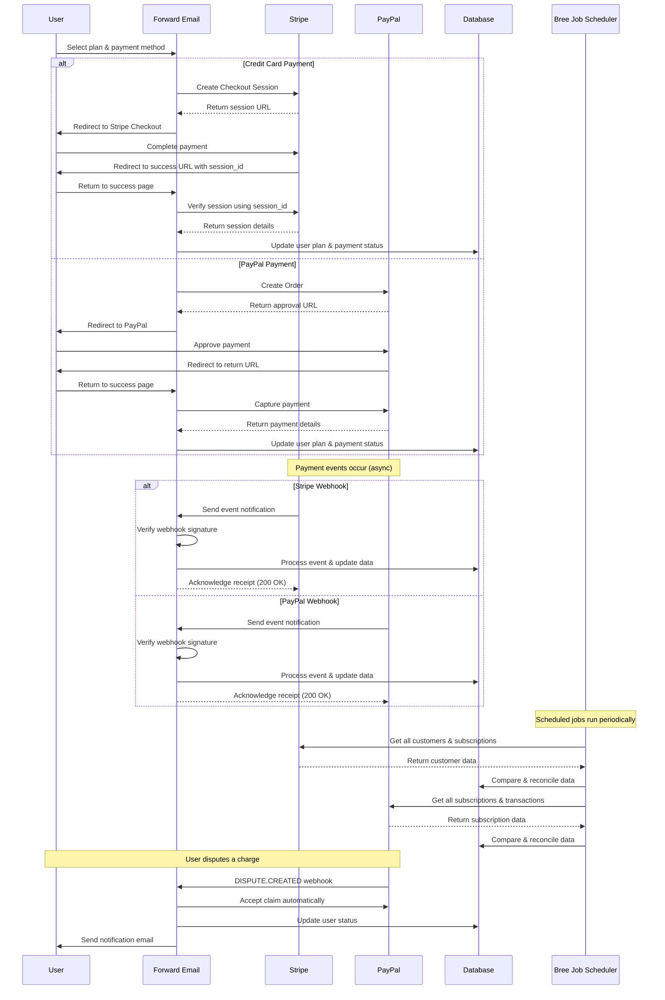
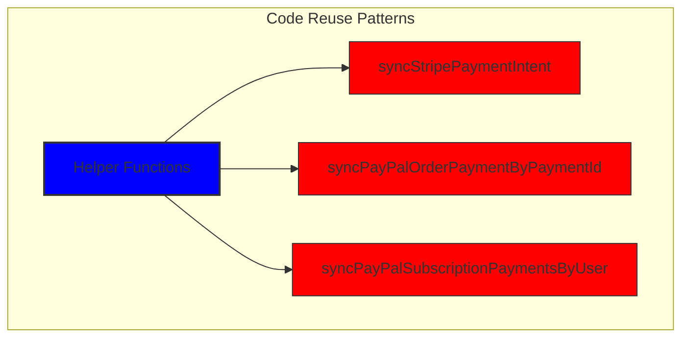
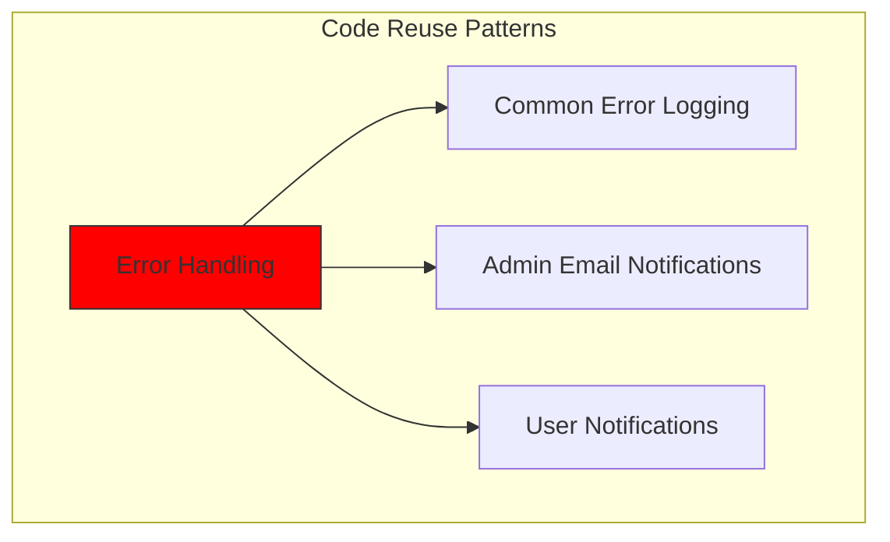
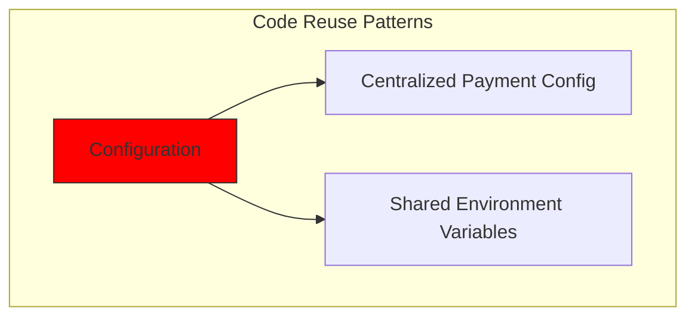
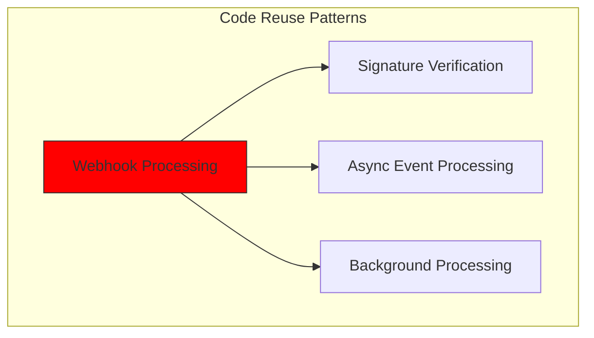
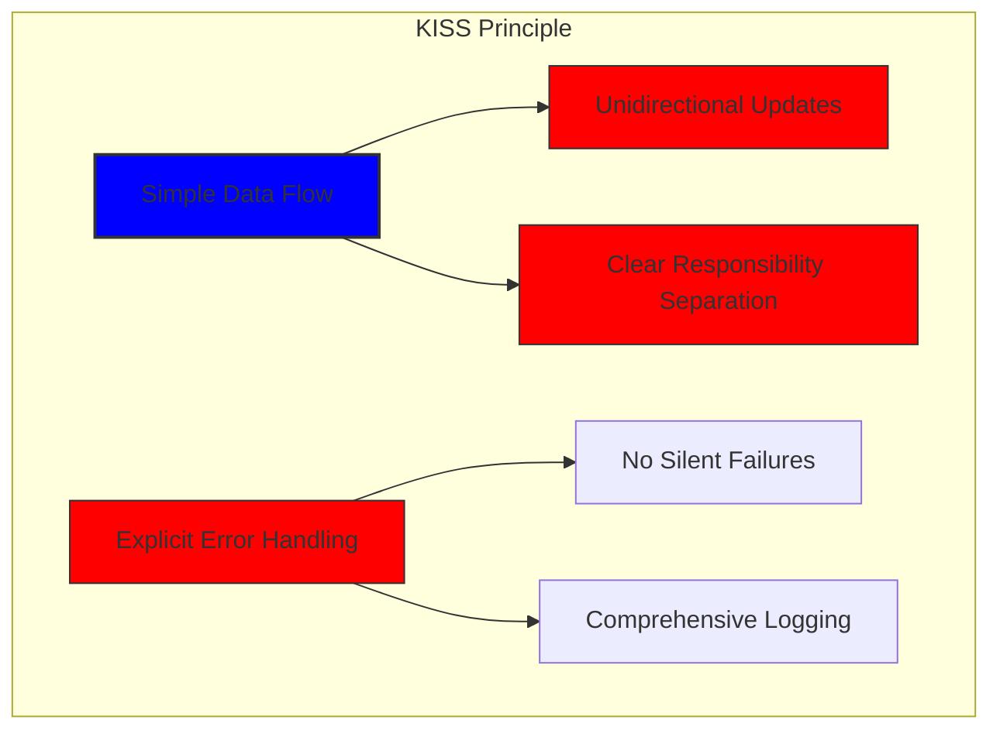
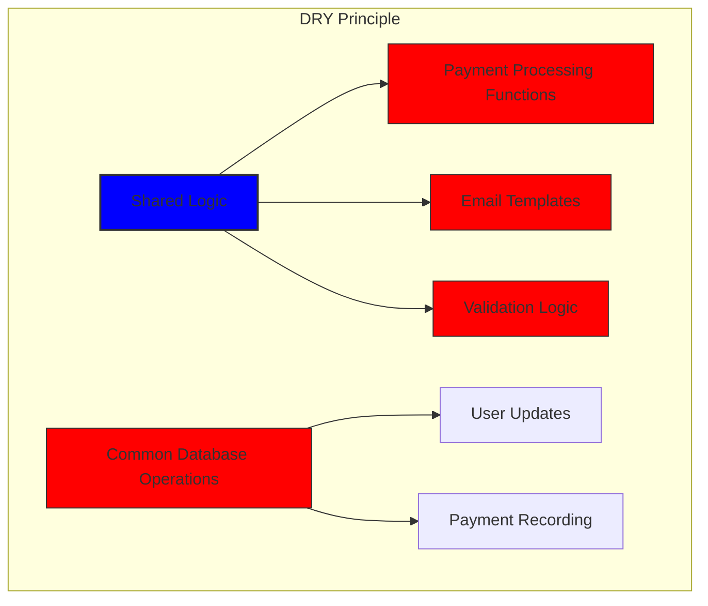

# Jak jsme vybudovali robustní platební systém se Stripe a PayPalem: Trifecta přístup {#how-we-built-a-robust-payment-system-with-stripe-and-paypal-a-trifecta-approach}


## Obsah {#table-of-contents}

* [Předmluva](#foreword)
* [Výzva: Více platebních procesorů, jeden zdroj pravdy](#the-challenge-multiple-payment-processors-one-source-of-truth)
* [Přístup Trifecta: Tři vrstvy spolehlivosti](#the-trifecta-approach-three-layers-of-reliability)
* [Vrstva 1: Přesměrování po dokončení objednávky](#layer-1-post-checkout-redirects)
  * [Implementace Stripe Checkout](#stripe-checkout-implementation)
  * [Platební proces PayPal](#paypal-payment-flow)
* [Vrstva 2: Obslužné rutiny webhooků s ověřováním podpisu](#layer-2-webhook-handlers-with-signature-verification)
  * [Implementace Stripe Webhooku](#stripe-webhook-implementation)
  * [Implementace webhooku PayPal](#paypal-webhook-implementation)
* [Vrstva 3: Automatizované úlohy s Bree](#layer-3-automated-jobs-with-bree)
  * [Kontrola přesnosti předplatného](#subscription-accuracy-checker)
  * [Synchronizace předplatného PayPal](#paypal-subscription-synchronization)
* [Řešení okrajových případů](#handling-edge-cases)
  * [Odhalování a prevence podvodů](#fraud-detection-and-prevention)
  * [Řešení sporů](#dispute-handling)
* [Opětovné použití kódu: Principy KISS a DRY](#code-reuse-kiss-and-dry-principles)
* [Implementace požadavků na předplatné VISA](#visa-subscription-requirements-implementation)
  * [Automatická e-mailová oznámení před obnovením](#automated-pre-renewal-email-notifications)
  * [Řešení okrajových případů](#handling-edge-cases-1)
  * [Zkušební období a podmínky předplatného](#trial-periods-and-subscription-terms)
* [Závěr: Výhody našeho přístupu Trifecta](#conclusion-the-benefits-of-our-trifecta-approach)

## Předmluva {#foreword}

Ve společnosti Forward Email jsme vždy kladli důraz na vytváření systémů, které jsou spolehlivé, přesné a uživatelsky přívětivé. Při implementaci našeho systému pro zpracování plateb jsme věděli, že potřebujeme řešení, které zvládne více platebních procesorů a zároveň zachová dokonalou konzistenci dat. Tento blogový příspěvek podrobně popisuje, jak náš vývojový tým integroval Stripe a PayPal pomocí trojitého přístupu, který zajišťuje přesnost 1:1 v reálném čase v celém našem systému.

## Výzva: Více platebních procesorů, jeden zdroj pravdy {#the-challenge-multiple-payment-processors-one-source-of-truth}

Jako e-mailová služba zaměřená na soukromí jsme chtěli našim uživatelům nabídnout možnosti platby. Někteří preferují jednoduchost plateb kreditní kartou přes Stripe, zatímco jiní oceňují dodatečnou vrstvu oddělení, kterou PayPal poskytuje. Podpora více platebních procesorů však s sebou nese značnou složitost:

1. Jak zajišťujeme konzistentní data napříč různými platebními systémy?
2. Jak řešíme okrajové případy, jako jsou spory, vrácení peněz nebo neúspěšné platby?
3. Jak udržujeme v naší databázi jeden zdroj pravdivých informací?

Naším řešením bylo implementovat to, čemu říkáme „trifecta přístup“ – třívrstvý systém, který poskytuje redundanci a zajišťuje konzistenci dat bez ohledu na to, co se stane.

## Přístup Trifecta: Tři vrstvy spolehlivosti {#the-trifecta-approach-three-layers-of-reliability}

Náš platební systém se skládá ze tří klíčových komponent, které spolupracují a zajišťují dokonalou synchronizaci dat:

1. **Přesměrování po dokončení platby** - Zachycení platebních informací ihned po dokončení platby
2. **Obsluha webhooků** - Zpracování událostí v reálném čase od platebních procesorů
3. **Automatizované úlohy** - Pravidelné ověřování a odsouhlasování platebních údajů

Pojďme se ponořit do jednotlivých komponent a podívat se, jak spolupracují.



## Vrstva 1: Přesměrování po dokončení objednávky {#layer-1-post-checkout-redirects}

První vrstva našeho trifecta přístupu se aktivuje ihned poté, co uživatel dokončí platbu. Stripe i PayPal poskytují mechanismy pro přesměrování uživatelů zpět na naše stránky s informacemi o transakci.

### Implementace Stripe Checkout {#stripe-checkout-implementation}

Pro Stripe používáme jejich Checkout Sessions API k vytvoření bezproblémového platebního procesu. Když si uživatel vybere tarif a rozhodne se platit kreditní kartou, vytvoříme Checkout Sessions s konkrétními úspěšnými kroky a zrušíme URL adresy:

```javascript
const options = {
  mode: paymentType === 'one-time' ? 'payment' : 'subscription',
  customer: ctx.state.user[config.userFields.stripeCustomerID],
  client_reference_id: reference,
  metadata: {
    plan
  },
  line_items: [
    {
      price,
      quantity: 1,
      description
    }
  ],
  locale: config.STRIPE_LOCALES.has(ctx.locale) ? ctx.locale : 'auto',
  cancel_url: `${config.urls.web}${ctx.path}${
    isMakePayment || isEnableAutoRenew ? '' : `/?plan=${plan}`
  }`,
  success_url: `${config.urls.web}${ctx.path}/?${
    isMakePayment || isEnableAutoRenew ? '' : `plan=${plan}&`
  }session_id={CHECKOUT_SESSION_ID}`,
  allow_promotion_codes: true
};

// Create the checkout session and redirect
const session = await stripe.checkout.sessions.create(options);
const redirectTo = session.url;
if (ctx.accepts('html')) {
  ctx.status = 303;
  ctx.redirect(redirectTo);
} else {
  ctx.body = { redirectTo };
}
```

Kritickou částí je zde parametr `success_url`, který jako parametr dotazu obsahuje `session_id`. Když Stripe po úspěšné platbě přesměruje uživatele zpět na naše stránky, můžeme toto ID relace použít k ověření transakce a odpovídající aktualizaci naší databáze.

### Platební proces PayPal {#paypal-payment-flow}

Pro PayPal používáme podobný přístup s jejich Orders API:

```javascript
const requestBody = {
  intent: 'CAPTURE',
  application_context: {
    cancel_url: `${config.urls.web}${ctx.path}${
      isMakePayment || isEnableAutoRenew ? '' : `/?plan=${plan}`
    }`,
    return_url: `${config.urls.web}${ctx.path}/?plan=${plan}`,
    brand_name: 'Forward Email',
    shipping_preference: 'NO_SHIPPING',
    user_action: 'PAY_NOW'
  },
  payer: {
    email_address: ctx.state.user.email
  },
  purchase_units: [
    {
      reference_id: ctx.state.user.id,
      description,
      custom_id: sku,
      invoice_id: reference,
      soft_descriptor: sku,
      amount: {
        currency_code: 'USD',
        value: price,
        breakdown: {
          item_total: {
            currency_code: 'USD',
            value: price
          }
        }
      },
      items: [
        {
          name,
          description,
          sku,
          unit_amount: {
            currency_code: 'USD',
            value: price
          },
          quantity: '1',
          category: 'DIGITAL_GOODS'
        }
      ]
    }
  ]
};
```

Podobně jako u Stripe specifikujeme parametry `return_url` a `cancel_url` pro zpracování přesměrování po platbě. Když PayPal přesměruje uživatele zpět na naše stránky, můžeme zaznamenat podrobnosti o platbě a aktualizovat naši databázi.



## Vrstva 2: Obslužné rutiny webhooků s ověřováním podpisu {#layer-2-webhook-handlers-with-signature-verification}

Přestože přesměrování po dokončení platby funguje ve většině scénářů dobře, není zcela spolehlivé. Uživatelé mohou před přesměrováním zavřít prohlížeč nebo problémy se sítí mohou zabránit dokončení přesměrování. A právě zde přicházejí na řadu webhooky.

Stripe i PayPal poskytují systémy webhooků, které odesílají oznámení o platbách v reálném čase. Implementovali jsme robustní obslužné rutiny webhooků, které ověřují pravost těchto oznámení a odpovídajícím způsobem je zpracovávají.

### Implementace webhooku Stripe {#stripe-webhook-implementation}

Náš obslužný program Stripe webhook ověřuje podpis příchozích událostí webhooku, aby se ujistil, že jsou legitimní:

```javascript
async function webhook(ctx) {
  const sig = ctx.request.get('stripe-signature');
  // throw an error if something was wrong
  if (!isSANB(sig))
    throw Boom.badRequest(ctx.translateError('INVALID_STRIPE_SIGNATURE'));
  const event = stripe.webhooks.constructEvent(
    ctx.request.rawBody,
    sig,
    env.STRIPE_ENDPOINT_SECRET
  );
  // throw an error if something was wrong
  if (!event)
    throw Boom.badRequest(ctx.translateError('INVALID_STRIPE_SIGNATURE'));
  ctx.logger.info('stripe webhook', { event });
  // return a response to acknowledge receipt of the event
  ctx.body = { received: true };
  // run in background
  processEvent(ctx, event)
    .then()
    .catch((err) => {
      ctx.logger.fatal(err, { event });
      // email admin errors
      emailHelper({
        template: 'alert',
        message: {
          to: config.email.message.from,
          subject: `Error with Stripe Webhook (Event ID ${event.id})`
        },
        locals: {
          message: `<pre><code>${safeStringify(
            parseErr(err),
            null,
            2
          )}</code></pre>`
        }
      })
        .then()
        .catch((err) => ctx.logger.fatal(err, { event }));
    });
}
```

Funkce `stripe.webhooks.constructEvent` ověřuje podpis pomocí našeho tajného identifikátoru koncového bodu. Pokud je podpis platný, zpracujeme událost asynchronně, abychom zabránili blokování odpovědi webhooku.

### Implementace webhooku PayPal {#paypal-webhook-implementation}

Podobně náš obslužný program webhooku PayPal ověřuje pravost příchozích oznámení:

```javascript
async function webhook(ctx) {
  const response = await promisify(
    paypal.notification.webhookEvent.verify,
    paypal.notification.webhookEvent
  )(ctx.request.headers, ctx.request.body, env.PAYPAL_WEBHOOK_ID);
  // throw an error if something was wrong
  if (!_.isObject(response) || response.verification_status !== 'SUCCESS')
    throw Boom.badRequest(ctx.translateError('INVALID_PAYPAL_SIGNATURE'));
  // return a response to acknowledge receipt of the event
  ctx.body = { received: true };
  // run in background
  processEvent(ctx)
    .then()
    .catch((err) => {
      ctx.logger.fatal(err);
      // email admin errors
      emailHelper({
        template: 'alert',
        message: {
          to: config.email.message.from,
          subject: `Error with PayPal Webhook (Event ID ${ctx.request.body.id})`
        },
        locals: {
          message: `<pre><code>${safeStringify(
            parseErr(err),
            null,
            2
          )}</code></pre>`
        }
      })
        .then()
        .catch((err) => ctx.logger.fatal(err));
    });
}
```

Oba obslužné rutiny webhooků fungují stejným způsobem: ověřují podpis, potvrzují příjem a asynchronně zpracovávají událost. To zajišťuje, že nikdy nezmeškáme platební událost, a to ani v případě, že přesměrování po dokončení platby selže.

## Vrstva 3: Automatizované úlohy s Bree {#layer-3-automated-jobs-with-bree}

Poslední vrstvou našeho trifecta přístupu je sada automatizovaných úloh, které pravidelně ověřují a slučují platební data. Ke spouštění těchto úloh v pravidelných intervalech používáme Bree, plánovač úloh pro Node.js.

### Kontrola přesnosti předplatného {#subscription-accuracy-checker}

Jednou z našich klíčových úloh je kontrola přesnosti předplatného, která zajišťuje, že naše databáze přesně odráží stav předplatného ve Stripe:

```javascript
async function mapper(customer) {
  // wait a second to prevent rate limitation error
  await setTimeout(ms('1s'));
  // check for user on our side
  let user = await Users.findOne({
    [config.userFields.stripeCustomerID]: customer.id
  })
    .lean()
    .exec();
  if (!user) return;
  if (user.is_banned) return;

  // if emails did not match
  if (user.email !== customer.email) {
    logger.info(
      `User email ${user.email} did not match customer email ${customer.email} (${customer.id})`
    );
    customer = await stripe.customers.update(customer.id, {
      email: user.email
    });
    logger.info(`Updated user email to match ${user.email}`);
  }

  // check for active subscriptions
  const [activeSubscriptions, trialingSubscriptions] = await Promise.all([
    stripe.subscriptions.list({
      customer: customer.id,
      status: 'active'
    }),
    stripe.subscriptions.list({
      customer: customer.id,
      status: 'trialing'
    })
  ]);

  // Combine active and trialing subscriptions
  let subscriptions = [
    ...activeSubscriptions.data,
    ...trialingSubscriptions.data
  ];

  // Handle edge case: multiple subscriptions for one user
  if (subscriptions.length > 1) {
    await logger.error(
      new Error(
        `We may need to refund: User had multiple subscriptions ${user.email} (${customer.id})`
      )
    );
    await emailHelper({
      template: 'alert',
      message: {
        to: config.email.message.from,
        subject: `User had multiple subscriptions ${user.email}`
      },
      locals: {
        message: `User ${user.email} (${customer.id}) had multiple subscriptions: ${JSON.stringify(
          subscriptions.map((s) => s.id)
        )}`
      }
    });
  }
}
```

Tato úloha kontroluje nesrovnalosti mezi naší databází a Stripe, jako jsou neshodné e-mailové adresy nebo více aktivních předplatných. Pokud zjistí nějaké problémy, zaznamená je a odešle upozornění našemu administrátorskému týmu.

### Synchronizace předplatného PayPal {#paypal-subscription-synchronization}

Podobnou práci nabízíme i pro předplatné PayPal:

```javascript
async function syncPayPalSubscriptionPayments() {
  const paypalCustomers = await Users.find({
    $or: [
      {
        [config.userFields.paypalSubscriptionID]: { $exists: true, $ne: null }
      },
      {
        [config.userFields.paypalPayerID]: { $exists: true, $ne: null }
      }
    ]
  })
    // sort by newest customers first
    .sort('-created_at')
    .lean()
    .exec();

  await logger.info(
    `Syncing payments for ${paypalCustomers.length} paypal customers`
  );

  // Process each customer and sync their payments
  const errorEmails = await pReduce(
    paypalCustomers,
    // Implementation details...
  );
}
```

Tyto automatizované úlohy slouží jako naše poslední záchranná síť a zajišťují, aby naše databáze vždy odrážela skutečný stav předplatného a plateb ve Stripe i PayPalu.

## Zpracování okrajových případů {#handling-edge-cases}

Robustní platební systém musí elegantně zvládat okrajové případy. Podívejme se, jak řešíme některé běžné scénáře.

### Detekce a prevence podvodů {#fraud-detection-and-prevention}

Zavedli jsme sofistikované mechanismy pro detekci podvodů, které automaticky identifikují a řeší podezřelé platební aktivity:

```javascript
case 'charge.failed': {
  // Get all failed charges in the last 30 days
  const charges = await stripe.charges.list({
    customer: event.data.object.customer,
    created: {
      gte: dayjs().subtract(1, 'month').unix()
    }
  });

  // Filter for declined charges
  const filtered = charges.data.filter(
    (d) => d.status === 'failed' && d.failure_code === 'card_declined'
  );

  // if not more than 5 then return early
  if (filtered.length < 5) break;

  // Check if user has verified domains
  const count = await Domains.countDocuments({
    members: {
      $elemMatch: {
        user: user._id,
        group: 'admin'
      }
    },
    plan: { $in: ['enhanced_protection', 'team'] },
    has_txt_record: true
  });

  if (!user.is_banned) {
    // If no verified domains, ban the user and refund all charges
    if (count === 0) {
      // Ban the user
      user.is_banned = true;
      await user.save();

      // Refund all successful charges
    }
  }
}
```

Tento kód automaticky zablokuje uživatele, kteří mají několik neúspěšných plateb a nemají ověřené domény, což je silný indikátor podvodné aktivity.

### Řešení sporů {#dispute-handling}

Když uživatel vznese námitku proti platbě, automaticky reklamaci přijmeme a podnikneme příslušné kroky:

```javascript
case 'CUSTOMER.DISPUTE.CREATED': {
  // accept claim
  const agent = await paypalAgent();
  await agent
    .post(`/v1/customer/disputes/${body.resource.dispute_id}/accept-claim`)
    .send({
      note: 'Full refund to the customer.'
    });

  // Find the payment in our database
  const payment = await Payments.findOne({ $or });
  if (!payment) throw new Error('Payment does not exist');

  const user = await Users.findById(payment.user);
  if (!user) throw new Error('User did not exist for customer');

  // Cancel the user's subscription if they have one
  if (isSANB(user[config.userFields.paypalSubscriptionID])) {
    try {
      const agent = await paypalAgent();
      await agent.post(
        `/v1/billing/subscriptions/${
          user[config.userFields.paypalSubscriptionID]
        }/cancel`
      );
    } catch (err) {
      // Handle subscription cancellation errors
    }
  }
}
```

Tento přístup minimalizuje dopad sporů na naše podnikání a zároveň zajišťuje dobrou zákaznickou zkušenost.

## Opětovné použití kódu: Principy KISS a DRY {#code-reuse-kiss-and-dry-principles}

V celém našem platebním systému se držíme zásad KISS (Keep It Simple, Stupid) a DRY (Don't Repeat Yourself). Zde je několik příkladů:

1. **Sdílené pomocné funkce**: Vytvořili jsme opakovaně použitelné pomocné funkce pro běžné úkoly, jako je synchronizace plateb a odesílání e-mailů.

2. **Konzistentní zpracování chyb**: Obslužné rutiny webhooků Stripe i PayPal používají stejný vzorec pro zpracování chyb a oznámení administrátorům.

3. **Sjednocené schéma databáze**: Naše schéma databáze je navrženo tak, aby pojalo data ze Stripe i PayPal, se společnými poli pro stav platby, částku a informace o tarifu.

4. **Centralizovaná konfigurace**: Konfigurace související s platbami je centralizována v jednom souboru, což usnadňuje aktualizaci cen a informací o produktech.













## Implementace požadavků na předplatné VISA {#visa-subscription-requirements-implementation}

Kromě našeho trifecta přístupu jsme implementovali specifické funkce, které splňují požadavky na předplatné společnosti VISA a zároveň vylepšují uživatelský zážitek. Jedním z klíčových požadavků společnosti VISA je, že uživatelé musí být informováni předtím, než jim bude předplatné naúčtováno, zejména při přechodu ze zkušebního na placené předplatné.

### Automatická e-mailová oznámení před obnovením {#automated-pre-renewal-email-notifications}

Vytvořili jsme automatizovaný systém, který identifikuje uživatele s aktivním zkušebním předplatným a zasílá jim e-mail s oznámením před první platbou. Díky tomu nejen dodržujeme požadavky společnosti VISA, ale také snižujeme počet storna plateb a zvyšujeme spokojenost zákazníků.

Zde je návod, jak jsme tuto funkci implementovali:

```javascript
// Find users with trial subscriptions who haven't received a notification yet
const users = await Users.find({
  $or: [
    {
      $and: [
        { [config.userFields.stripeSubscriptionID]: { $exists: true } },
        { [config.userFields.stripeTrialSentAt]: { $exists: false } },
        // Exclude subscriptions that have already had payments
        ...(paidStripeSubscriptionIds.length > 0
          ? [
              {
                [config.userFields.stripeSubscriptionID]: {
                  $nin: paidStripeSubscriptionIds
                }
              }
            ]
          : [])
      ]
    },
    {
      $and: [
        { [config.userFields.paypalSubscriptionID]: { $exists: true } },
        { [config.userFields.paypalTrialSentAt]: { $exists: false } },
        // Exclude subscriptions that have already had payments
        ...(paidPayPalSubscriptionIds.length > 0
          ? [
              {
                [config.userFields.paypalSubscriptionID]: {
                  $nin: paidPayPalSubscriptionIds
                }
              }
            ]
          : [])
      ]
    }
  ]
});

// Process each user and send notification
for (const user of users) {
  // Get subscription details from payment processor
  const subscription = await getSubscriptionDetails(user);

  // Calculate subscription duration and frequency
  const duration = getDurationFromPlanId(subscription.plan_id);
  const frequency = getHumanReadableFrequency(duration, user.locale);
  const amount = getPlanAmount(user.plan, duration);

  // Get user's domains for personalized email
  const domains = await Domains.find({
    'members.user': user._id
  }).sort('name').lean().exec();

  // Send VISA-compliant notification email
  await emailHelper({
    template: 'visa-trial-subscription-requirement',
    message: {
      to: user.receipt_email || user.email,
      ...(user.receipt_email ? { cc: user.email } : {})
    },
    locals: {
      user,
      firstChargeDate: new Date(subscription.start_time),
      frequency,
      formattedAmount: numeral(amount).format('$0,0,0.00'),
      domains
    }
  });

  // Record that notification was sent
  await Users.findByIdAndUpdate(user._id, {
    $set: {
      [config.userFields.paypalTrialSentAt]: new Date()
    }
  });
}
```

Tato implementace zajišťuje, že uživatelé jsou vždy informováni o nadcházejících platbách s jasnými podrobnostmi o:

1. Kdy dojde k první platbě
2. Četnost budoucích plateb (měsíčně, ročně atd.)
3. Přesná částka, která jim bude účtována
4. Které domény jsou zahrnuty v jejich předplatném

Automatizací tohoto procesu dosahujeme dokonalého souladu s požadavky společnosti VISA (které nařizují oznámení alespoň 7 dní před provedením platby), a zároveň snižujeme počet dotazů na podporu a zlepšujeme celkovou uživatelskou zkušenost.

### Zpracování okrajových případů {#handling-edge-cases-1}

Naše implementace zahrnuje také robustní ošetření chyb. Pokud se během procesu oznamování něco pokazí, náš systém automaticky upozorní náš tým:

```javascript
try {
  await mapper(user);
} catch (err) {
  logger.error(err);

  // Send alert to administrators
  await emailHelper({
    template: 'alert',
    message: {
      to: config.email.message.from,
      subject: 'VISA Trial Subscription Requirement Error'
    },
    locals: {
      message: `<pre><code>${safeStringify(
        parseErr(err),
        null,
        2
      )}</code></pre>`
    }
  });
}
```

Díky tomu je zajištěno, že i v případě problému s notifikačním systémem jej náš tým dokáže rychle vyřešit a zajistit soulad s požadavky společnosti VISA.

Systém oznámení o předplatném VISA je dalším příkladem toho, jak jsme vybudovali naši platební infrastrukturu s ohledem na dodržování předpisů i uživatelskou zkušenost, a doplňuje náš komplexní přístup k zajištění spolehlivého a transparentního zpracování plateb.

### Zkušební období a podmínky předplatného {#trial-periods-and-subscription-terms}

Pro uživatele, kteří si u stávajících tarifů povolí automatické obnovení, vypočítáme odpovídající zkušební dobu, abychom zajistili, že jim nebude účtován poplatek, dokud nevyprší jejich aktuální tarif:

```javascript
if (
  isEnableAutoRenew &&
  dayjs(ctx.state.user[config.userFields.planExpiresAt]).isAfter(
    dayjs()
  )
) {
  const hours = dayjs(
    ctx.state.user[config.userFields.planExpiresAt]
  ).diff(dayjs(), 'hours');

  // Handle trial period calculation
}
```

Také poskytujeme jasné informace o podmínkách předplatného, včetně četnosti fakturace a zásad zrušení, a ke každému předplatnému přikládáme podrobná metadata, abychom zajistili správné sledování a správu.

## Závěr: Výhody našeho přístupu Trifecta {#conclusion-the-benefits-of-our-trifecta-approach}

Náš komplexní přístup ke zpracování plateb nám přinesl několik klíčových výhod:

1. **Spolehlivost**: Implementací tří vrstev ověřování plateb zajišťujeme, že žádná platba nebude zmeškána nebo nesprávně zpracována.

2. **Přesnost**: Naše databáze vždy odráží skutečný stav předplatného a plateb ve službách Stripe i PayPal.

3. **Flexibilita**: Uživatelé si mohou zvolit preferovaný způsob platby, aniž by to ohrozilo spolehlivost našeho systému.

4. **Robustnost**: Náš systém elegantně zvládá okrajové případy, od selhání sítě až po podvodné aktivity.

Pokud implementujete platební systém, který podporuje více procesorů, důrazně doporučujeme tento trojitý přístup. Vyžaduje sice více počátečního vývojového úsilí, ale dlouhodobé výhody z hlediska spolehlivosti a přesnosti za to rozhodně stojí.

Další informace o službě Forward Email a našich e-mailových službách zaměřených na ochranu soukromí naleznete na stránce [webové stránky](https://forwardemail.net).

<!-- *Klíčová slova: zpracování plateb, integrace Stripe, integrace PayPal, zpracování webhooků, synchronizace plateb, správa předplatného, prevence podvodů, řešení sporů, platební systém Node.js, víceprocesorový platební systém, integrace platební brány, ověřování plateb v reálném čase, konzistence platebních dat, fakturace předplatného, zabezpečení plateb, automatizace plateb, platební webhooky, odsouhlasení plateb, případy plateb na okraji, zpracování chyb při platbě, požadavky na předplatné VISA, oznámení o předběžném obnovení, dodržování předpisů pro předplatné* -->