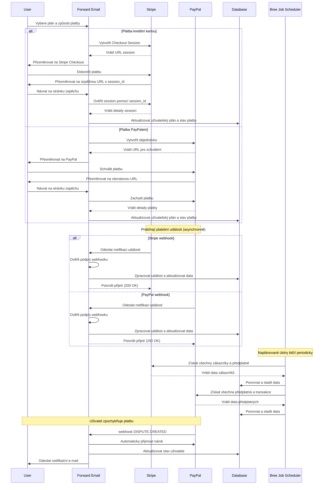
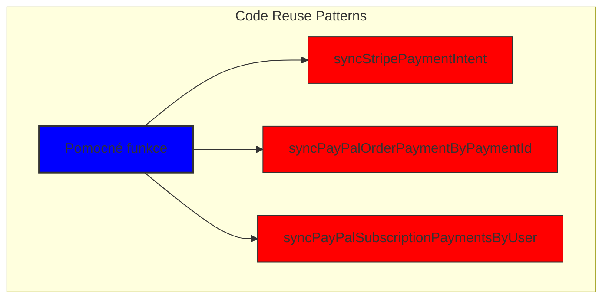
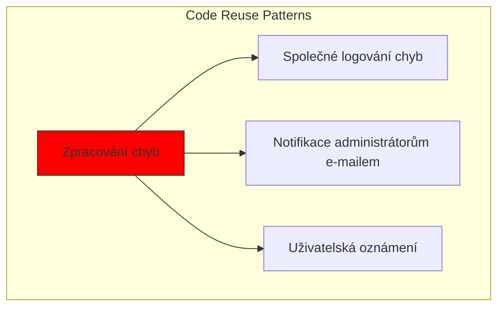
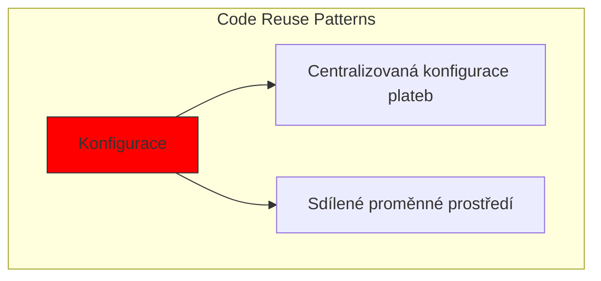
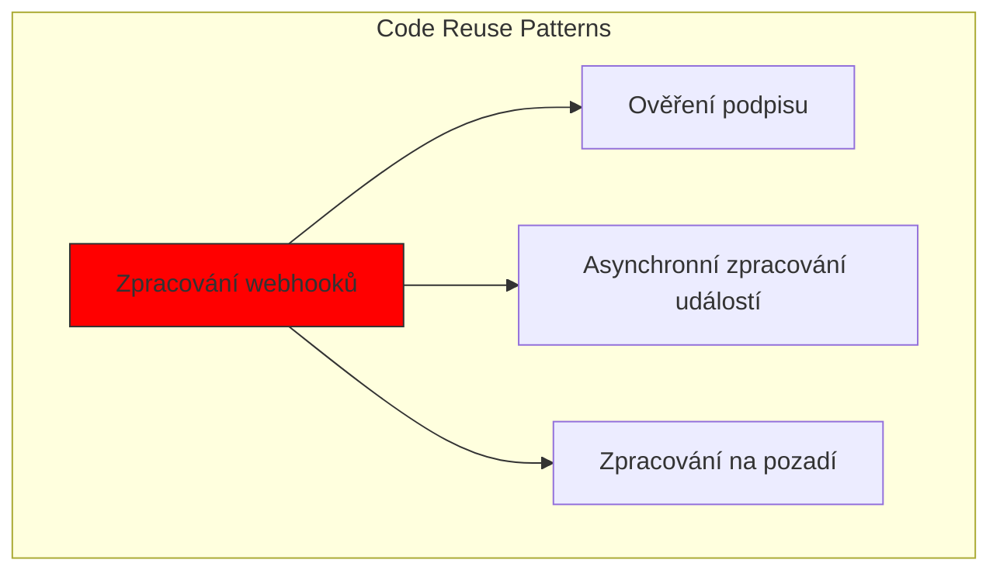
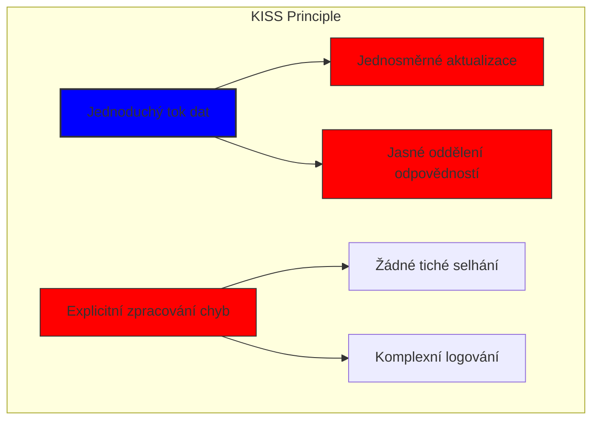

# Jak jsme vybudovali robustní platební systém se Stripe a PayPal: Přístup Trifecta {#how-we-built-a-robust-payment-system-with-stripe-and-paypal-a-trifecta-approach}


## Obsah {#table-of-contents}

* [Předmluva](#foreword)
* [Výzva: Více platebních procesorů, jeden zdroj pravdy](#the-challenge-multiple-payment-processors-one-source-of-truth)
* [Přístup Trifecta: Tři vrstvy spolehlivosti](#the-trifecta-approach-three-layers-of-reliability)
* [Vrstva 1: Přesměrování po dokončení platby](#layer-1-post-checkout-redirects)
  * [Implementace Stripe Checkout](#stripe-checkout-implementation)
  * [Platební tok PayPal](#paypal-payment-flow)
* [Vrstva 2: Webhook handlery s ověřením podpisu](#layer-2-webhook-handlers-with-signature-verification)
  * [Implementace Stripe webhooku](#stripe-webhook-implementation)
  * [Implementace PayPal webhooku](#paypal-webhook-implementation)
* [Vrstva 3: Automatizované úlohy s Bree](#layer-3-automated-jobs-with-bree)
  * [Kontrola přesnosti předplatného](#subscription-accuracy-checker)
  * [Synchronizace předplatného PayPal](#paypal-subscription-synchronization)
* [Řešení okrajových případů](#handling-edge-cases)
  * [Detekce a prevence podvodů](#fraud-detection-and-prevention)
  * [Řešení sporů](#dispute-handling)
* [Znovupoužití kódu: Principy KISS a DRY](#code-reuse-kiss-and-dry-principles)
* [Implementace požadavků VISA na předplatné](#visa-subscription-requirements-implementation)
  * [Automatické e-mailové upozornění před obnovením](#automated-pre-renewal-email-notifications)
  * [Řešení okrajových případů](#handling-edge-cases-1)
  * [Zkušební období a podmínky předplatného](#trial-periods-and-subscription-terms)
* [Závěr: Výhody našeho přístupu Trifecta](#conclusion-the-benefits-of-our-trifecta-approach)


## Předmluva {#foreword}

Ve Forward Email jsme vždy kladli důraz na vytváření systémů, které jsou spolehlivé, přesné a uživatelsky přívětivé. Když jsme implementovali náš platební systém, věděli jsme, že potřebujeme řešení, které zvládne více platebních procesorů a zároveň udrží dokonalou konzistenci dat. Tento blogový příspěvek popisuje, jak náš vývojový tým integroval Stripe i PayPal pomocí přístupu trifecta, který zajišťuje 1:1 přesnost v reálném čase v celém našem systému.


## Výzva: Více platebních procesorů, jeden zdroj pravdy {#the-challenge-multiple-payment-processors-one-source-of-truth}

Jako e-mailová služba zaměřená na soukromí jsme chtěli našim uživatelům nabídnout platební možnosti. Někteří preferují jednoduchost plateb kreditní kartou přes Stripe, zatímco jiní oceňují další vrstvu oddělení, kterou poskytuje PayPal. Podpora více platebních procesorů však přináší značnou složitost:

1. Jak zajistit konzistentní data napříč různými platebními systémy?
2. Jak řešit okrajové případy jako spory, refundace nebo neúspěšné platby?
3. Jak udržet jediný zdroj pravdy v naší databázi?

Naším řešením bylo zavedení toho, co nazýváme „přístup trifecta“ – třívrstvého systému, který poskytuje redundanci a zajišťuje konzistenci dat bez ohledu na okolnosti.


## Přístup Trifecta: Tři vrstvy spolehlivosti {#the-trifecta-approach-three-layers-of-reliability}

Náš platební systém se skládá ze tří klíčových komponent, které spolupracují, aby zajistily dokonalou synchronizaci dat:

1. **Přesměrování po dokončení platby** – zachycení platebních informací ihned po dokončení platby
2. **Webhook handlery** – zpracování událostí v reálném čase od platebních procesorů
3. **Automatizované úlohy** – periodická kontrola a vyrovnání platebních dat

Pojďme se podívat na každou komponentu a jak spolu fungují.


```mermaid
flowchart TD
    User([User]) --> |Vybere plán| Checkout[Checkout Page]

    %% Layer 1: Post-checkout redirects
    subgraph "Vrstva 1: Přesměrování po dokončení platby"
        Checkout --> |Kreditní karta| Stripe[Stripe Checkout]
        Checkout --> |PayPal| PayPal[PayPal Payment]

        Stripe --> |URL úspěchu se session_id| SuccessPage[Success Page]
        PayPal --> |Návratová URL| SuccessPage

        SuccessPage --> |Ověření platby| Database[(Aktualizace databáze)]
    end

    %% Layer 2: Webhooks
    subgraph "Vrstva 2: Webhook handlery"
        StripeEvents[Stripe Události] --> |Notifikace v reálném čase| StripeWebhook[Stripe Webhook Handler]
        PayPalEvents[PayPal Události] --> |Notifikace v reálném čase| PayPalWebhook[PayPal Webhook Handler]

        StripeWebhook --> |Ověření podpisu| ProcessStripeEvent[Zpracování Stripe události]
        PayPalWebhook --> |Ověření podpisu| ProcessPayPalEvent[Zpracování PayPal události]

        ProcessStripeEvent --> Database
        ProcessPayPalEvent --> Database
    end

    %% Layer 3: Automated jobs
    subgraph "Vrstva 3: Automatizované úlohy Bree"
        BreeScheduler[Bree Scheduler] --> StripeSync[Stripe synchronizační úloha]
        BreeScheduler --> PayPalSync[PayPal synchronizační úloha]
        BreeScheduler --> AccuracyCheck[Kontrola přesnosti předplatného]

        StripeSync --> |Ověření a vyrovnání| Database
        PayPalSync --> |Ověření a vyrovnání| Database
        AccuracyCheck --> |Zajištění konzistence| Database
    end

    %% Edge cases
    subgraph "Řešení okrajových případů"
        ProcessStripeEvent --> |Detekce podvodů| FraudCheck[Kontrola podvodů]
        ProcessPayPalEvent --> |Vytvořen spor| DisputeHandler[Řešení sporu]

        FraudCheck --> |Zákaz uživatele v případě podvodu| Database
        DisputeHandler --> |Přijetí reklamace a refundace| Database

        FraudCheck --> |Odeslání upozornění| AdminNotification[Upozornění administrátora]
        DisputeHandler --> |Odeslání upozornění| AdminNotification
    end

    %% Style definitions
    classDef primary fill:blue,stroke:#333,stroke-width:2px;
    classDef secondary fill:red,stroke:#333,stroke-width:1px;
    classDef tertiary fill:green,stroke:#333,stroke-width:1px;

    class Checkout,SuccessPage primary;
    class Stripe,PayPal,StripeWebhook,PayPalWebhook,BreeScheduler secondary;
    class FraudCheck,DisputeHandler tertiary;
```
## Vrstva 1: Přesměrování po dokončení platby {#layer-1-post-checkout-redirects}

První vrstva našeho trojitého přístupu nastává ihned poté, co uživatel dokončí platbu. Jak Stripe, tak PayPal poskytují mechanismy pro přesměrování uživatelů zpět na naše stránky s informacemi o transakci.

### Implementace Stripe Checkout {#stripe-checkout-implementation}

Pro Stripe používáme jejich API Checkout Sessions k vytvoření plynulého platebního zážitku. Když uživatel vybere plán a zvolí platbu kreditní kartou, vytvoříme Checkout Session se specifickými URL pro úspěch a zrušení:

```javascript
const options = {
  mode: paymentType === 'one-time' ? 'payment' : 'subscription',
  customer: ctx.state.user[config.userFields.stripeCustomerID],
  client_reference_id: reference,
  metadata: {
    plan
  },
  line_items: [
    {
      price,
      quantity: 1,
      description
    }
  ],
  locale: config.STRIPE_LOCALES.has(ctx.locale) ? ctx.locale : 'auto',
  cancel_url: `${config.urls.web}${ctx.path}${
    isMakePayment || isEnableAutoRenew ? '' : `/?plan=${plan}`
  }`,
  success_url: `${config.urls.web}${ctx.path}/?${
    isMakePayment || isEnableAutoRenew ? '' : `plan=${plan}&`
  }session_id={CHECKOUT_SESSION_ID}`,
  allow_promotion_codes: true
};

// Vytvoření checkout session a přesměrování
const session = await stripe.checkout.sessions.create(options);
const redirectTo = session.url;
if (ctx.accepts('html')) {
  ctx.status = 303;
  ctx.redirect(redirectTo);
} else {
  ctx.body = { redirectTo };
}
```

Klíčovou částí je zde parametr `success_url`, který obsahuje `session_id` jako dotazovací parametr. Když Stripe přesměruje uživatele zpět na naše stránky po úspěšné platbě, můžeme použít toto ID session k ověření transakce a odpovídajícímu aktualizování naší databáze.

### Platební tok PayPal {#paypal-payment-flow}

Pro PayPal používáme podobný přístup s jejich API Orders:

```javascript
const requestBody = {
  intent: 'CAPTURE',
  application_context: {
    cancel_url: `${config.urls.web}${ctx.path}${
      isMakePayment || isEnableAutoRenew ? '' : `/?plan=${plan}`
    }`,
    return_url: `${config.urls.web}${ctx.path}/?plan=${plan}`,
    brand_name: 'Forward Email',
    shipping_preference: 'NO_SHIPPING',
    user_action: 'PAY_NOW'
  },
  payer: {
    email_address: ctx.state.user.email
  },
  purchase_units: [
    {
      reference_id: ctx.state.user.id,
      description,
      custom_id: sku,
      invoice_id: reference,
      soft_descriptor: sku,
      amount: {
        currency_code: 'USD',
        value: price,
        breakdown: {
          item_total: {
            currency_code: 'USD',
            value: price
          }
        }
      },
      items: [
        {
          name,
          description,
          sku,
          unit_amount: {
            currency_code: 'USD',
            value: price
          },
          quantity: '1',
          category: 'DIGITAL_GOODS'
        }
      ]
    }
  ]
};
```

Podobně jako u Stripe specifikujeme parametry `return_url` a `cancel_url` pro zpracování přesměrování po platbě. Když PayPal přesměruje uživatele zpět na naše stránky, můžeme zachytit detaily platby a aktualizovat naši databázi.


```mermaid
sequenceDiagram
    participant User
    participant FE as Forward Email
    participant Stripe
    participant PayPal
    participant DB as Database
    participant Bree as Bree Job Scheduler

    %% Počáteční průběh checkoutu
    User->>FE: Vybere plán a způsob platby

    alt Platba kreditní kartou
        FE->>Stripe: Vytvořit Checkout Session
        Stripe-->>FE: Vrátit URL session
        FE->>User: Přesměrovat na Stripe Checkout
        User->>Stripe: Dokončit platbu
        Stripe->>User: Přesměrovat na úspěšnou URL s session_id
        User->>FE: Návrat na stránku úspěchu
        FE->>Stripe: Ověřit session pomocí session_id
        Stripe-->>FE: Vrátit detaily session
        FE->>DB: Aktualizovat uživatelský plán a stav platby
    else Platba PayPalem
        FE->>PayPal: Vytvořit objednávku
        PayPal-->>FE: Vrátit URL pro schválení
        FE->>User: Přesměrovat na PayPal
        User->>PayPal: Schválit platbu
        PayPal->>User: Přesměrovat na návratovou URL
        User->>FE: Návrat na stránku úspěchu
        FE->>PayPal: Zachytit platbu
        PayPal-->>FE: Vrátit detaily platby
        FE->>DB: Aktualizovat uživatelský plán a stav platby
    end

    %% Průběh webhooku (asynchronní)
    Note over Stripe,PayPal: Probíhají platební události (asynchronně)

    alt Stripe webhook
        Stripe->>FE: Odeslat notifikaci události
        FE->>FE: Ověřit podpis webhooku
        FE->>DB: Zpracovat událost a aktualizovat data
        FE-->>Stripe: Potvrdit přijetí (200 OK)
    else PayPal webhook
        PayPal->>FE: Odeslat notifikaci události
        FE->>FE: Ověřit podpis webhooku
        FE->>DB: Zpracovat událost a aktualizovat data
        FE-->>PayPal: Potvrdit přijetí (200 OK)
    end

    %% Automatizované úlohy Bree
    Note over Bree: Naplánované úlohy běží periodicky

    Bree->>Stripe: Získat všechny zákazníky a předplatné
    Stripe-->>Bree: Vrátit data zákazníků
    Bree->>DB: Porovnat a sladit data

    Bree->>PayPal: Získat všechna předplatná a transakce
    PayPal-->>Bree: Vrátit data předplatných
    Bree->>DB: Porovnat a sladit data

    %% Okrajový případ: Řešení sporu
    Note over User,PayPal: Uživatel zpochybňuje platbu

    PayPal->>FE: webhook DISPUTE.CREATED
    FE->>PayPal: Automaticky přijmout nárok
    FE->>DB: Aktualizovat stav uživatele
    FE->>User: Odeslat notifikační e-mail
```
## Vrstva 2: Zpracovatelé webhooků s ověřením podpisu {#layer-2-webhook-handlers-with-signature-verification}

Zatímco přesměrování po dokončení nákupu funguje dobře ve většině scénářů, není stoprocentně spolehlivé. Uživatelé mohou zavřít prohlížeč dříve, než dojde k přesměrování, nebo mohou nastat síťové problémy, které zabrání dokončení přesměrování. Právě zde přicházejí na řadu webhooky.

Jak Stripe, tak PayPal poskytují systémy webhooků, které zasílají oznámení o platebních událostech v reálném čase. Implementovali jsme robustní zpracovatele webhooků, kteří ověřují pravost těchto oznámení a zpracovávají je odpovídajícím způsobem.

### Implementace webhooku Stripe {#stripe-webhook-implementation}

Náš zpracovatel webhooku Stripe ověřuje podpis příchozích webhook událostí, aby zajistil jejich legitimitu:

```javascript
async function webhook(ctx) {
  const sig = ctx.request.get('stripe-signature');
  // vyhodit chybu, pokud je něco špatně
  if (!isSANB(sig))
    throw Boom.badRequest(ctx.translateError('INVALID_STRIPE_SIGNATURE'));
  const event = stripe.webhooks.constructEvent(
    ctx.request.rawBody,
    sig,
    env.STRIPE_ENDPOINT_SECRET
  );
  // vyhodit chybu, pokud je něco špatně
  if (!event)
    throw Boom.badRequest(ctx.translateError('INVALID_STRIPE_SIGNATURE'));
  ctx.logger.info('stripe webhook', { event });
  // vrátit odpověď k potvrzení přijetí události
  ctx.body = { received: true };
  // spustit na pozadí
  processEvent(ctx, event)
    .then()
    .catch((err) => {
      ctx.logger.fatal(err, { event });
      // poslat e-mail administrátorovi o chybách
      emailHelper({
        template: 'alert',
        message: {
          to: config.email.message.from,
          subject: `Chyba s webhookem Stripe (ID události ${event.id})`
        },
        locals: {
          message: `<pre><code>${safeStringify(
            parseErr(err),
            null,
            2
          )}</code></pre>`
        }
      })
        .then()
        .catch((err) => ctx.logger.fatal(err, { event }));
    });
}
```

Funkce `stripe.webhooks.constructEvent` ověřuje podpis pomocí našeho tajemství endpointu. Pokud je podpis platný, zpracováváme událost asynchronně, aby nedošlo k blokování odpovědi webhooku.

### Implementace webhooku PayPal {#paypal-webhook-implementation}

Podobně náš zpracovatel webhooku PayPal ověřuje pravost příchozích oznámení:

```javascript
async function webhook(ctx) {
  const response = await promisify(
    paypal.notification.webhookEvent.verify,
    paypal.notification.webhookEvent
  )(ctx.request.headers, ctx.request.body, env.PAYPAL_WEBHOOK_ID);
  // vyhodit chybu, pokud je něco špatně
  if (!_.isObject(response) || response.verification_status !== 'SUCCESS')
    throw Boom.badRequest(ctx.translateError('INVALID_PAYPAL_SIGNATURE'));
  // vrátit odpověď k potvrzení přijetí události
  ctx.body = { received: true };
  // spustit na pozadí
  processEvent(ctx)
    .then()
    .catch((err) => {
      ctx.logger.fatal(err);
      // poslat e-mail administrátorovi o chybách
      emailHelper({
        template: 'alert',
        message: {
          to: config.email.message.from,
          subject: `Chyba s webhookem PayPal (ID události ${ctx.request.body.id})`
        },
        locals: {
          message: `<pre><code>${safeStringify(
            parseErr(err),
            null,
            2
          )}</code></pre>`
        }
      })
        .then()
        .catch((err) => ctx.logger.fatal(err));
    });
}
```

Oba zpracovatelé webhooků dodržují stejný vzor: ověřit podpis, potvrdit přijetí a asynchronně zpracovat událost. To zajišťuje, že nikdy nezmeškáme platební událost, i když přesměrování po dokončení nákupu selže.


## Vrstva 3: Automatizované úlohy s Bree {#layer-3-automated-jobs-with-bree}

Poslední vrstvou našeho trojitého přístupu je sada automatizovaných úloh, které pravidelně ověřují a sladí platební data. Používáme Bree, plánovač úloh pro Node.js, k pravidelnému spouštění těchto úloh.

### Kontrola přesnosti předplatného {#subscription-accuracy-checker}

Jednou z našich klíčových úloh je kontrola přesnosti předplatného, která zajišťuje, že naše databáze přesně odráží stav předplatného ve Stripe:
```javascript
async function mapper(customer) {
  // wait a second to prevent rate limitation error
  await setTimeout(ms('1s'));
  // check for user on our side
  let user = await Users.findOne({
    [config.userFields.stripeCustomerID]: customer.id
  })
    .lean()
    .exec();
  if (!user) return;
  if (user.is_banned) return;

  // if emails did not match
  if (user.email !== customer.email) {
    logger.info(
      `User email ${user.email} did not match customer email ${customer.email} (${customer.id})`
    );
    customer = await stripe.customers.update(customer.id, {
      email: user.email
    });
    logger.info(`Updated user email to match ${user.email}`);
  }

  // check for active subscriptions
  const [activeSubscriptions, trialingSubscriptions] = await Promise.all([
    stripe.subscriptions.list({
      customer: customer.id,
      status: 'active'
    }),
    stripe.subscriptions.list({
      customer: customer.id,
      status: 'trialing'
    })
  ]);

  // Combine active and trialing subscriptions
  let subscriptions = [
    ...activeSubscriptions.data,
    ...trialingSubscriptions.data
  ];

  // Handle edge case: multiple subscriptions for one user
  if (subscriptions.length > 1) {
    await logger.error(
      new Error(
        `We may need to refund: User had multiple subscriptions ${user.email} (${customer.id})`
      )
    );
    await emailHelper({
      template: 'alert',
      message: {
        to: config.email.message.from,
        subject: `User had multiple subscriptions ${user.email}`
      },
      locals: {
        message: `User ${user.email} (${customer.id}) had multiple subscriptions: ${JSON.stringify(
          subscriptions.map((s) => s.id)
        )}`
      }
    });
  }
}
```

This job checks for discrepancies between our database and Stripe, such as mismatched email addresses or multiple active subscriptions. If it finds any issues, it logs them and sends alerts to our admin team.

### PayPal Subscription Synchronization {#paypal-subscription-synchronization}

We have a similar job for PayPal subscriptions:

```javascript
async function syncPayPalSubscriptionPayments() {
  const paypalCustomers = await Users.find({
    $or: [
      {
        [config.userFields.paypalSubscriptionID]: { $exists: true, $ne: null }
      },
      {
        [config.userFields.paypalPayerID]: { $exists: true, $ne: null }
      }
    ]
  })
    // sort by newest customers first
    .sort('-created_at')
    .lean()
    .exec();

  await logger.info(
    `Syncing payments for ${paypalCustomers.length} paypal customers`
  );

  // Process each customer and sync their payments
  const errorEmails = await pReduce(
    paypalCustomers,
    // Implementation details...
  );
}
```

These automated jobs serve as our final safety net, ensuring that our database always reflects the true state of subscriptions and payments in both Stripe and PayPal.


## Handling Edge Cases {#handling-edge-cases}

A robust payment system must handle edge cases gracefully. Let's look at how we handle some common scenarios.

### Fraud Detection and Prevention {#fraud-detection-and-prevention}

We've implemented sophisticated fraud detection mechanisms that automatically identify and handle suspicious payment activities:

```javascript
case 'charge.failed': {
  // Get all failed charges in the last 30 days
  const charges = await stripe.charges.list({
    customer: event.data.object.customer,
    created: {
      gte: dayjs().subtract(1, 'month').unix()
    }
  });

  // Filter for declined charges
  const filtered = charges.data.filter(
    (d) => d.status === 'failed' && d.failure_code === 'card_declined'
  );

  // if not more than 5 then return early
  if (filtered.length < 5) break;

  // Check if user has verified domains
  const count = await Domains.countDocuments({
    members: {
      $elemMatch: {
        user: user._id,
        group: 'admin'
      }
    },
    plan: { $in: ['enhanced_protection', 'team'] },
    has_txt_record: true
  });

  if (!user.is_banned) {
    // If no verified domains, ban the user and refund all charges
    if (count === 0) {
      // Ban the user
      user.is_banned = true;
      await user.save();

      // Refund all successful charges
    }
  }
}
```

Tento kód automaticky zablokuje uživatele, kteří mají více neúspěšných plateb a žádné ověřené domény, což je silný indikátor podvodné činnosti.

### Řešení sporů {#dispute-handling}

Když uživatel zpochybní platbu, automaticky přijmeme nárok a podnikneme příslušné kroky:

```javascript
case 'CUSTOMER.DISPUTE.CREATED': {
  // přijmout nárok
  const agent = await paypalAgent();
  await agent
    .post(`/v1/customer/disputes/${body.resource.dispute_id}/accept-claim`)
    .send({
      note: 'Úplné vrácení peněz zákazníkovi.'
    });

  // Najít platbu v naší databázi
  const payment = await Payments.findOne({ $or });
  if (!payment) throw new Error('Platba neexistuje');

  const user = await Users.findById(payment.user);
  if (!user) throw new Error('Uživatel pro zákazníka neexistoval');

  // Zrušit uživatelovo předplatné, pokud nějaké má
  if (isSANB(user[config.userFields.paypalSubscriptionID])) {
    try {
      const agent = await paypalAgent();
      await agent.post(
        `/v1/billing/subscriptions/${
          user[config.userFields.paypalSubscriptionID]
        }/cancel`
      );
    } catch (err) {
      // Zpracování chyb při rušení předplatného
    }
  }
}
```

Tento přístup minimalizuje dopad sporů na náš byznys a zároveň zajišťuje dobrou zákaznickou zkušenost.


## Znovupoužití kódu: Principy KISS a DRY {#code-reuse-kiss-and-dry-principles}

V celém našem platebním systému jsme dodržovali principy KISS (Keep It Simple, Stupid – Drž to jednoduché, hlupáku) a DRY (Don't Repeat Yourself – Neopakuj se). Zde jsou některé příklady:

1. **Sdílené pomocné funkce**: Vytvořili jsme znovupoužitelné pomocné funkce pro běžné úkoly, jako je synchronizace plateb a odesílání e-mailů.

2. **Konzistentní zpracování chyb**: Oba webhook handlery pro Stripe i PayPal používají stejný vzor pro zpracování chyb a notifikace administrátorům.

3. **Jednotné schéma databáze**: Naše databázové schéma je navrženo tak, aby pojalo data jak ze Stripe, tak z PayPalu, s běžnými poli pro stav platby, částku a informace o plánu.

4. **Centralizovaná konfigurace**: Konfigurace související s platbami je centralizována v jednom souboru, což usnadňuje aktualizaci cen a informací o produktech.


```mermaid
graph TD
    subgraph "Code Reuse Patterns"
        A[Pomocné funkce] --> B[syncStripePaymentIntent]
        A --> C[syncPayPalOrderPaymentByPaymentId]
        A --> D[syncPayPalSubscriptionPaymentsByUser]
    end

    classDef primary fill:blue,stroke:#333,stroke-width:2px;
    classDef secondary fill:red,stroke:#333,stroke-width:1px;

    class A,P,V primary;
    class B,C,D,E,I,L,Q,R,S,W,X,Y,Z secondary;
```


```mermaid
graph TD
    subgraph "Code Reuse Patterns"
        E[Zpracování chyb] --> F[Společné logování chyb]
        E --> G[Notifikace administrátorům e-mailem]
        E --> H[Uživatelská oznámení]
    end

    classDef primary fill:blue,stroke:#333,stroke-width:2px;
    classDef secondary fill:red,stroke:#333,stroke-width:1px;

    class A,P,V primary;
    class B,C,D,E,I,L,Q,R,S,W,X,Y,Z secondary;
```


```mermaid
graph TD
    subgraph "Code Reuse Patterns"
        I[Konfigurace] --> J[Centralizovaná konfigurace plateb]
        I --> K[Sdílené proměnné prostředí]
    end

    classDef primary fill:blue,stroke:#333,stroke-width:2px;
    classDef secondary fill:red,stroke:#333,stroke-width:1px;

    class A,P,V primary;
    class B,C,D,E,I,L,Q,R,S,W,X,Y,Z secondary;
```


```mermaid
graph TD
    subgraph "Code Reuse Patterns"
        L[Zpracování webhooků] --> M[Ověření podpisu]
        L --> N[Asynchronní zpracování událostí]
        L --> O[Zpracování na pozadí]
    end

    classDef primary fill:blue,stroke:#333,stroke-width:2px;
    classDef secondary fill:red,stroke:#333,stroke-width:1px;

    class A,P,V primary;
    class B,C,D,E,I,L,Q,R,S,W,X,Y,Z secondary;
```


```mermaid
graph TD
    subgraph "KISS Principle"
        P[Jednoduchý tok dat] --> Q[Jednosměrné aktualizace]
        P --> R[Jasné oddělení odpovědností]

        S[Explicitní zpracování chyb] --> T[Žádné tiché selhání]
        S --> U[Komplexní logování]
    end

    classDef primary fill:blue,stroke:#333,stroke-width:2px;
    classDef secondary fill:red,stroke:#333,stroke-width:1px;

    class A,P,V primary;
    class B,C,D,E,I,L,Q,R,S,W,X,Y,Z secondary;
```
graph TD
    subgraph "Princip DRY"
        V[Sdílená logika] --> W[Funkce zpracování plateb]
        V --> X[Šablony e-mailů]
        V --> Y[Validace logiky]

        Z[Společné databázové operace] --> AA[Aktualizace uživatelů]
        Z --> AB[Zaznamenání plateb]
    end

    classDef primary fill:blue,stroke:#333,stroke-width:2px;
    classDef secondary fill:red,stroke:#333,stroke-width:1px;

    class A,P,V primary;
    class B,C,D,E,I,L,Q,R,S,W,X,Y,Z secondary;
```


## Implementace požadavků na předplatné VISA {#visa-subscription-requirements-implementation}

Kromě našeho přístupu trifecta jsme implementovali specifické funkce, které splňují požadavky VISA na předplatné a zároveň zlepšují uživatelský zážitek. Jedním z klíčových požadavků VISA je, že uživatelé musí být předem upozorněni, než jim bude účtováno předplatné, zejména při přechodu z trial verze na placené předplatné.

### Automatická upozornění e-mailem před obnovením {#automated-pre-renewal-email-notifications}

Vytvořili jsme automatizovaný systém, který identifikuje uživatele s aktivním trial předplatným a odešle jim upozornění e-mailem před tím, než dojde k prvnímu účtování. To nám nejen pomáhá splnit požadavky VISA, ale také snižuje počet reklamací plateb a zvyšuje spokojenost zákazníků.

Takto jsme tuto funkci implementovali:

```javascript
// Najděte uživatele s trial předplatným, kteří ještě neobdrželi upozornění
const users = await Users.find({
  $or: [
    {
      $and: [
        { [config.userFields.stripeSubscriptionID]: { $exists: true } },
        { [config.userFields.stripeTrialSentAt]: { $exists: false } },
        // Vyloučit předplatné, u kterých již byly platby
        ...(paidStripeSubscriptionIds.length > 0
          ? [
              {
                [config.userFields.stripeSubscriptionID]: {
                  $nin: paidStripeSubscriptionIds
                }
              }
            ]
          : [])
      ]
    },
    {
      $and: [
        { [config.userFields.paypalSubscriptionID]: { $exists: true } },
        { [config.userFields.paypalTrialSentAt]: { $exists: false } },
        // Vyloučit předplatné, u kterých již byly platby
        ...(paidPayPalSubscriptionIds.length > 0
          ? [
              {
                [config.userFields.paypalSubscriptionID]: {
                  $nin: paidPayPalSubscriptionIds
                }
              }
            ]
          : [])
      ]
    }
  ]
});

// Zpracujte každého uživatele a odešlete upozornění
for (const user of users) {
  // Získejte detaily předplatného od platebního procesoru
  const subscription = await getSubscriptionDetails(user);

  // Vypočítejte délku a frekvenci předplatného
  const duration = getDurationFromPlanId(subscription.plan_id);
  const frequency = getHumanReadableFrequency(duration, user.locale);
  const amount = getPlanAmount(user.plan, duration);

  // Získejte domény uživatele pro personalizovaný e-mail
  const domains = await Domains.find({
    'members.user': user._id
  }).sort('name').lean().exec();

  // Odešlete upozornění e-mailem v souladu s požadavky VISA
  await emailHelper({
    template: 'visa-trial-subscription-requirement',
    message: {
      to: user.receipt_email || user.email,
      ...(user.receipt_email ? { cc: user.email } : {})
    },
    locals: {
      user,
      firstChargeDate: new Date(subscription.start_time),
      frequency,
      formattedAmount: numeral(amount).format('$0,0,0.00'),
      domains
    }
  });

  // Zaznamenejte, že upozornění bylo odesláno
  await Users.findByIdAndUpdate(user._id, {
    $set: {
      [config.userFields.paypalTrialSentAt]: new Date()
    }
  });
}
```

Tato implementace zajišťuje, že uživatelé jsou vždy informováni o nadcházejících platbách s jasnými informacemi o:

1. Kdy dojde k prvnímu účtování
2. Frekvenci budoucích plateb (měsíční, roční atd.)
3. Přesné částce, která jim bude účtována
4. Které domény jsou jejich předplatným pokryty

Automatizací tohoto procesu udržujeme dokonalou shodu s požadavky VISA (které vyžadují upozornění alespoň 7 dní před účtováním), zároveň snižujeme počet dotazů na podporu a zlepšujeme celkový uživatelský zážitek.
### Zpracování okrajových případů {#handling-edge-cases-1}

Naše implementace také zahrnuje robustní zpracování chyb. Pokud během procesu notifikace dojde k nějaké chybě, náš systém automaticky upozorní náš tým:

```javascript
try {
  await mapper(user);
} catch (err) {
  logger.error(err);

  // Odeslat upozornění administrátorům
  await emailHelper({
    template: 'alert',
    message: {
      to: config.email.message.from,
      subject: 'Chyba požadavku na zkušební předplatné VISA'
    },
    locals: {
      message: `<pre><code>${safeStringify(
        parseErr(err),
        null,
        2
      )}</code></pre>`
    }
  });
}
```

To zajišťuje, že i když nastane problém se systémem notifikací, náš tým jej může rychle řešit a udržovat shodu s požadavky VISA.

Systém notifikací předplatného VISA je dalším příkladem toho, jak jsme vybudovali naši platební infrastrukturu s ohledem na dodržování předpisů i uživatelskou zkušenost, doplňující náš přístup trifecta, který zajišťuje spolehlivé a transparentní zpracování plateb.

### Zkušební období a podmínky předplatného {#trial-periods-and-subscription-terms}

Pro uživatele, kteří povolí automatické obnovení u stávajících plánů, vypočítáváme odpovídající zkušební období, aby nebyli účtováni, dokud jejich aktuální plán nevyprší:

```javascript
if (
  isEnableAutoRenew &&
  dayjs(ctx.state.user[config.userFields.planExpiresAt]).isAfter(
    dayjs()
  )
) {
  const hours = dayjs(
    ctx.state.user[config.userFields.planExpiresAt]
  ).diff(dayjs(), 'hours');

  // Zpracování výpočtu zkušebního období
}
```

Také poskytujeme jasné informace o podmínkách předplatného, včetně frekvence fakturace a zásad zrušení, a zahrnujeme podrobné metadata u každého předplatného, aby bylo zajištěno správné sledování a správa.

## Závěr: Výhody našeho přístupu trifecta {#conclusion-the-benefits-of-our-trifecta-approach}

Náš přístup trifecta k zpracování plateb přinesl několik klíčových výhod:

1. **Spolehlivost**: Implementací tří vrstev ověřování plateb zajišťujeme, že žádná platba není vynechána nebo nesprávně zpracována.

2. **Přesnost**: Naše databáze vždy odráží skutečný stav předplatných a plateb jak v Stripe, tak v PayPalu.

3. **Flexibilita**: Uživatelé si mohou vybrat preferovanou platební metodu, aniž by byla ohrožena spolehlivost našeho systému.

4. **Robustnost**: Náš systém elegantně zvládá okrajové případy, od selhání sítě až po podvodné aktivity.

Pokud implementujete platební systém podporující více procesorů, důrazně doporučujeme tento přístup trifecta. Vyžaduje více úsilí při vývoji, ale dlouhodobé výhody v oblasti spolehlivosti a přesnosti jsou rozhodně stojí za to.

Pro více informací o Forward Email a našich službách zaměřených na ochranu soukromí navštivte naše [webové stránky](https://forwardemail.net).

<!-- *Keywords: zpracování plateb, integrace Stripe, integrace PayPal, zpracování webhooků, synchronizace plateb, správa předplatného, prevence podvodů, řešení sporů, platební systém Node.js, platební systém s více procesory, integrace platební brány, ověřování plateb v reálném čase, konzistence platebních dat, fakturace předplatného, bezpečnost plateb, automatizace plateb, platební webhooky, vyrovnání plateb, okrajové případy plateb, zpracování chyb plateb, požadavky VISA na předplatné, upozornění před obnovením, shoda předplatného* -->
