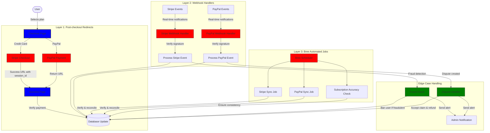
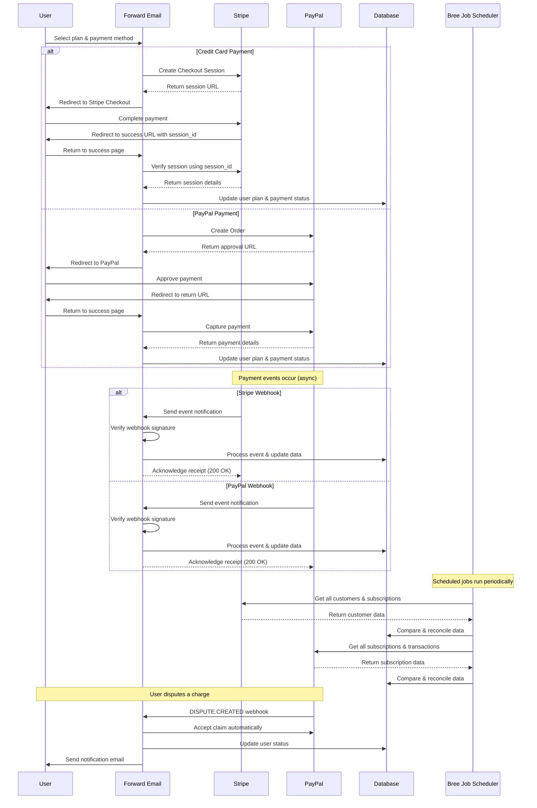
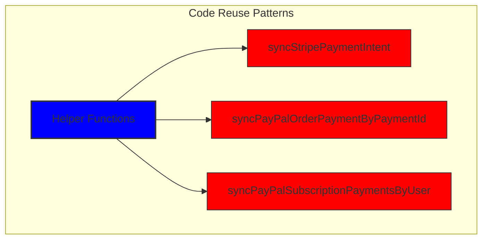
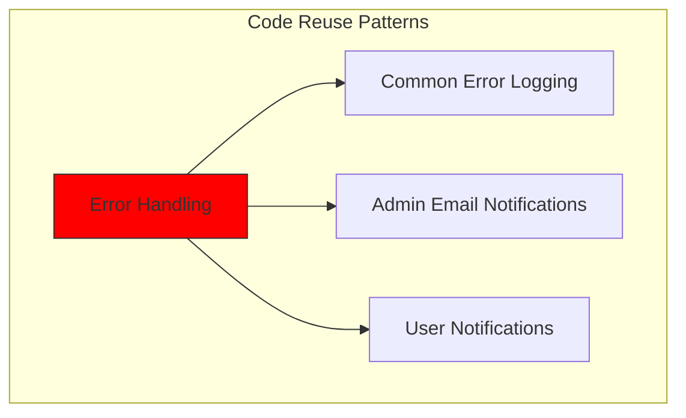
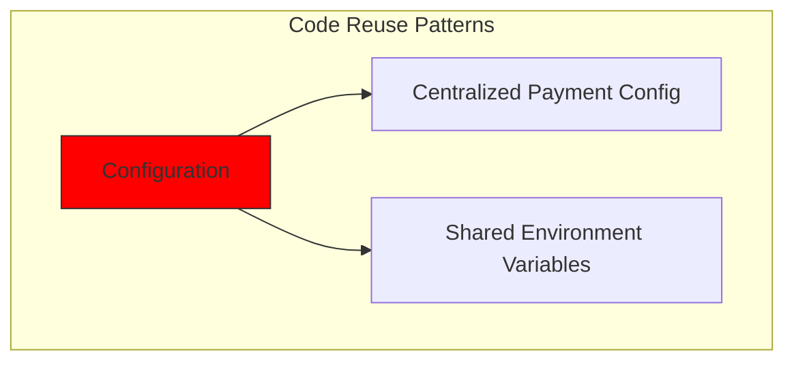
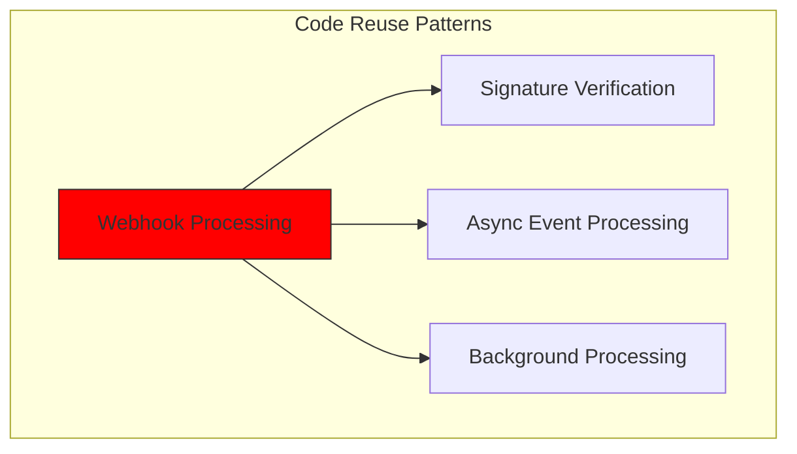
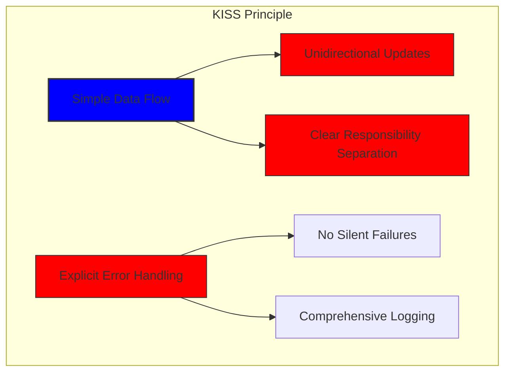
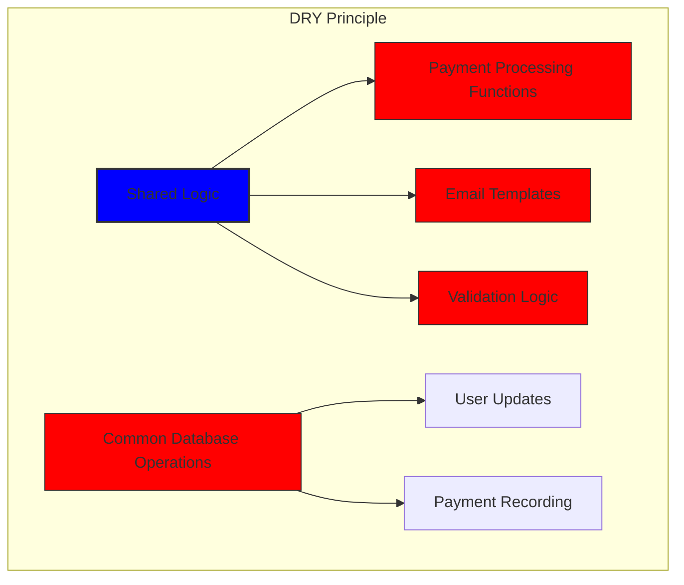

# Sådan byggede vi et robust betalingssystem med Stripe og PayPal: En trifecta-tilgang {#how-we-built-a-robust-payment-system-with-stripe-and-paypal-a-trifecta-approach}


## Indholdsfortegnelse {#table-of-contents}

* [Forord](#foreword)
* [Udfordringen: Flere betalingsudbydere, én kilde til sandhed](#the-challenge-multiple-payment-processors-one-source-of-truth)
* [Trifecta-tilgangen: Tre lag af pålidelighed](#the-trifecta-approach-three-layers-of-reliability)
* [Lag 1: Omdirigeringer efter betaling](#layer-1-post-checkout-redirects)
  * [Stripe Checkout Implementering](#stripe-checkout-implementation)
  * [PayPal-betalingsflow](#paypal-payment-flow)
* [Lag 2: Webhook-håndterere med signaturbekræftelse](#layer-2-webhook-handlers-with-signature-verification)
  * [Stripe Webhook-implementering](#stripe-webhook-implementation)
  * [PayPal Webhook-implementering](#paypal-webhook-implementation)
* [Lag 3: Automatiserede job med Bree](#layer-3-automated-jobs-with-bree)
  * [Abonnementsnøjagtighedskontrol](#subscription-accuracy-checker)
  * [PayPal-abonnementssynkronisering](#paypal-subscription-synchronization)
* [Håndtering af Edge-sager](#handling-edge-cases)
  * [Svigdetektion og -forebyggelse](#fraud-detection-and-prevention)
  * [Håndtering af tvister](#dispute-handling)
* [Genbrug af kode: KISS- og DRY-principperne](#code-reuse-kiss-and-dry-principles)
* [Implementering af VISA-abonnementskrav](#visa-subscription-requirements-implementation)
  * [Automatiske e-mailnotifikationer før fornyelse](#automated-pre-renewal-email-notifications)
  * [Håndtering af Edge-sager](#handling-edge-cases-1)
  * [Prøveperioder og abonnementsvilkår](#trial-periods-and-subscription-terms)
* [Konklusion: Fordelene ved vores Trifecta-tilgang](#conclusion-the-benefits-of-our-trifecta-approach)

## Forord {#foreword}

Hos Forward Email har vi altid prioriteret at skabe systemer, der er pålidelige, præcise og brugervenlige. Da det kom til implementeringen af vores betalingssystem, vidste vi, at vi havde brug for en løsning, der kunne håndtere flere betalingsprocessorer og samtidig opretholde perfekt datakonsistens. Dette blogindlæg beskriver, hvordan vores udviklingsteam integrerede både Stripe og PayPal ved hjælp af en trifecta-tilgang, der sikrer 1:1 nøjagtighed i realtid på tværs af hele vores system.

## Udfordringen: Flere betalingsudbydere, én kilde til sandhed {#the-challenge-multiple-payment-processors-one-source-of-truth}

Som en privatlivsfokuseret e-mailtjeneste ønskede vi at give vores brugere betalingsmuligheder. Nogle foretrækker den enkle kreditkortbetaling via Stripe, mens andre værdsætter det ekstra lag af adskillelse, som PayPal tilbyder. Understøttelse af flere betalingsudbydere introducerer dog betydelig kompleksitet:

1. Hvordan sikrer vi ensartede data på tværs af forskellige betalingssystemer?
2. Hvordan håndterer vi marginale sager som tvister, refusioner eller mislykkede betalinger?
3. Hvordan opretholder vi en enkelt kilde til sandheden i vores database?

Vores løsning var at implementere det, vi kalder "trifecta-tilgangen" - et trelagssystem, der giver redundans og sikrer datakonsistens, uanset hvad der sker.

## Trifecta-tilgangen: Tre lag af pålidelighed {#the-trifecta-approach-three-layers-of-reliability}

Vores betalingssystem består af tre kritiske komponenter, der arbejder sammen for at sikre perfekt datasynkronisering:

1. **Omdirigeringer efter betaling** - Indsamling af betalingsoplysninger umiddelbart efter betaling
2. **Webhook-handlere** - Behandling af hændelser i realtid fra betalingsudbydere
3. **Automatiserede job** - Periodisk verifikation og afstemning af betalingsdata

Lad os dykke ned i hver komponent og se, hvordan de fungerer sammen.



## Lag 1: Omdirigeringer efter betaling {#layer-1-post-checkout-redirects}

Det første lag af vores trifecta-tilgang sker umiddelbart efter, at en bruger har gennemført en betaling. Både Stripe og PayPal tilbyder mekanismer til at omdirigere brugere tilbage til vores hjemmeside med transaktionsoplysninger.

### Stripe Checkout-implementering {#stripe-checkout-implementation}

For Stripe bruger vi deres Checkout Sessions API til at skabe en problemfri betalingsoplevelse. Når en bruger vælger en plan og vælger at betale med et kreditkort, opretter vi en Checkout Session med specifikke succes- og annullerings-URL'er:

```javascript
const options = {
  mode: paymentType === 'one-time' ? 'payment' : 'subscription',
  customer: ctx.state.user[config.userFields.stripeCustomerID],
  client_reference_id: reference,
  metadata: {
    plan
  },
  line_items: [
    {
      price,
      quantity: 1,
      description
    }
  ],
  locale: config.STRIPE_LOCALES.has(ctx.locale) ? ctx.locale : 'auto',
  cancel_url: `${config.urls.web}${ctx.path}${
    isMakePayment || isEnableAutoRenew ? '' : `/?plan=${plan}`
  }`,
  success_url: `${config.urls.web}${ctx.path}/?${
    isMakePayment || isEnableAutoRenew ? '' : `plan=${plan}&`
  }session_id={CHECKOUT_SESSION_ID}`,
  allow_promotion_codes: true
};

// Create the checkout session and redirect
const session = await stripe.checkout.sessions.create(options);
const redirectTo = session.url;
if (ctx.accepts('html')) {
  ctx.status = 303;
  ctx.redirect(redirectTo);
} else {
  ctx.body = { redirectTo };
}
```

Den kritiske del her er parameteren `success_url`, som inkluderer `session_id` som en forespørgselsparameter. Når Stripe omdirigerer brugeren tilbage til vores hjemmeside efter en vellykket betaling, kan vi bruge dette sessions-ID til at verificere transaktionen og opdatere vores database i overensstemmelse hermed.

### PayPal-betalingsflow {#paypal-payment-flow}

For PayPal bruger vi en lignende tilgang med deres Orders API:

```javascript
const requestBody = {
  intent: 'CAPTURE',
  application_context: {
    cancel_url: `${config.urls.web}${ctx.path}${
      isMakePayment || isEnableAutoRenew ? '' : `/?plan=${plan}`
    }`,
    return_url: `${config.urls.web}${ctx.path}/?plan=${plan}`,
    brand_name: 'Forward Email',
    shipping_preference: 'NO_SHIPPING',
    user_action: 'PAY_NOW'
  },
  payer: {
    email_address: ctx.state.user.email
  },
  purchase_units: [
    {
      reference_id: ctx.state.user.id,
      description,
      custom_id: sku,
      invoice_id: reference,
      soft_descriptor: sku,
      amount: {
        currency_code: 'USD',
        value: price,
        breakdown: {
          item_total: {
            currency_code: 'USD',
            value: price
          }
        }
      },
      items: [
        {
          name,
          description,
          sku,
          unit_amount: {
            currency_code: 'USD',
            value: price
          },
          quantity: '1',
          category: 'DIGITAL_GOODS'
        }
      ]
    }
  ]
};
```

Ligesom Stripe angiver vi parametrene `return_url` og `cancel_url` til at håndtere omdirigeringer efter betaling. Når PayPal omdirigerer brugeren tilbage til vores hjemmeside, kan vi registrere betalingsoplysningerne og opdatere vores database.



## Lag 2: Webhook-håndterere med signaturbekræftelse {#layer-2-webhook-handlers-with-signature-verification}

Selvom omdirigeringer efter betaling fungerer godt i de fleste scenarier, er de ikke idiotsikre. Brugere kan lukke deres browser, før de bliver omdirigeret, eller netværksproblemer kan forhindre omdirigeringen i at fuldføres. Det er her, webhooks kommer ind i billedet.

Både Stripe og PayPal tilbyder webhook-systemer, der sender notifikationer i realtid om betalingshændelser. Vi har implementeret robuste webhook-håndterere, der verificerer ægtheden af disse notifikationer og behandler dem i overensstemmelse hermed.

### Stripe Webhook-implementering {#stripe-webhook-implementation}

Vores Stripe webhook-handler verificerer signaturen af indgående webhook-hændelser for at sikre, at de er legitime:

```javascript
async function webhook(ctx) {
  const sig = ctx.request.get('stripe-signature');
  // throw an error if something was wrong
  if (!isSANB(sig))
    throw Boom.badRequest(ctx.translateError('INVALID_STRIPE_SIGNATURE'));
  const event = stripe.webhooks.constructEvent(
    ctx.request.rawBody,
    sig,
    env.STRIPE_ENDPOINT_SECRET
  );
  // throw an error if something was wrong
  if (!event)
    throw Boom.badRequest(ctx.translateError('INVALID_STRIPE_SIGNATURE'));
  ctx.logger.info('stripe webhook', { event });
  // return a response to acknowledge receipt of the event
  ctx.body = { received: true };
  // run in background
  processEvent(ctx, event)
    .then()
    .catch((err) => {
      ctx.logger.fatal(err, { event });
      // email admin errors
      emailHelper({
        template: 'alert',
        message: {
          to: config.email.message.from,
          subject: `Error with Stripe Webhook (Event ID ${event.id})`
        },
        locals: {
          message: `<pre><code>${safeStringify(
            parseErr(err),
            null,
            2
          )}</code></pre>`
        }
      })
        .then()
        .catch((err) => ctx.logger.fatal(err, { event }));
    });
}
```

Funktionen `stripe.webhooks.constructEvent` verificerer signaturen ved hjælp af vores slutpunktshemmelighed. Hvis signaturen er gyldig, behandler vi hændelsen asynkront for at undgå at blokere webhook-svaret.

### PayPal Webhook-implementering {#paypal-webhook-implementation}

På samme måde verificerer vores PayPal webhook-handler ægtheden af indgående meddelelser:

```javascript
async function webhook(ctx) {
  const response = await promisify(
    paypal.notification.webhookEvent.verify,
    paypal.notification.webhookEvent
  )(ctx.request.headers, ctx.request.body, env.PAYPAL_WEBHOOK_ID);
  // throw an error if something was wrong
  if (!_.isObject(response) || response.verification_status !== 'SUCCESS')
    throw Boom.badRequest(ctx.translateError('INVALID_PAYPAL_SIGNATURE'));
  // return a response to acknowledge receipt of the event
  ctx.body = { received: true };
  // run in background
  processEvent(ctx)
    .then()
    .catch((err) => {
      ctx.logger.fatal(err);
      // email admin errors
      emailHelper({
        template: 'alert',
        message: {
          to: config.email.message.from,
          subject: `Error with PayPal Webhook (Event ID ${ctx.request.body.id})`
        },
        locals: {
          message: `<pre><code>${safeStringify(
            parseErr(err),
            null,
            2
          )}</code></pre>`
        }
      })
        .then()
        .catch((err) => ctx.logger.fatal(err));
    });
}
```

Begge webhook-handlere følger det samme mønster: verificerer signaturen, bekræfter modtagelsen og behandler hændelsen asynkront. Dette sikrer, at vi aldrig går glip af en betalingshændelse, selvom omdirigeringen efter betaling mislykkes.

## Lag 3: Automatiserede job med Bree {#layer-3-automated-jobs-with-bree}

Det sidste lag i vores trifecta-tilgang er et sæt automatiserede job, der periodisk verificerer og afstemmer betalingsdata. Vi bruger Bree, en jobplanlægger til Node.js, til at køre disse job med jævne mellemrum.

### Abonnementsnøjagtighedskontrol {#subscription-accuracy-checker}

En af vores vigtigste opgaver er abonnementsnøjagtighedskontrollen, som sikrer, at vores database nøjagtigt afspejler abonnementsstatus i Stripe:

```javascript
async function mapper(customer) {
  // wait a second to prevent rate limitation error
  await setTimeout(ms('1s'));
  // check for user on our side
  let user = await Users.findOne({
    [config.userFields.stripeCustomerID]: customer.id
  })
    .lean()
    .exec();
  if (!user) return;
  if (user.is_banned) return;

  // if emails did not match
  if (user.email !== customer.email) {
    logger.info(
      `User email ${user.email} did not match customer email ${customer.email} (${customer.id})`
    );
    customer = await stripe.customers.update(customer.id, {
      email: user.email
    });
    logger.info(`Updated user email to match ${user.email}`);
  }

  // check for active subscriptions
  const [activeSubscriptions, trialingSubscriptions] = await Promise.all([
    stripe.subscriptions.list({
      customer: customer.id,
      status: 'active'
    }),
    stripe.subscriptions.list({
      customer: customer.id,
      status: 'trialing'
    })
  ]);

  // Combine active and trialing subscriptions
  let subscriptions = [
    ...activeSubscriptions.data,
    ...trialingSubscriptions.data
  ];

  // Handle edge case: multiple subscriptions for one user
  if (subscriptions.length > 1) {
    await logger.error(
      new Error(
        `We may need to refund: User had multiple subscriptions ${user.email} (${customer.id})`
      )
    );
    await emailHelper({
      template: 'alert',
      message: {
        to: config.email.message.from,
        subject: `User had multiple subscriptions ${user.email}`
      },
      locals: {
        message: `User ${user.email} (${customer.id}) had multiple subscriptions: ${JSON.stringify(
          subscriptions.map((s) => s.id)
        )}`
      }
    });
  }
}
```

Dette job tjekker for uoverensstemmelser mellem vores database og Stripe, såsom uoverensstemmelser i e-mailadresser eller flere aktive abonnementer. Hvis der findes problemer, logger det dem og sender advarsler til vores administratorteam.

### PayPal-abonnementssynkronisering {#paypal-subscription-synchronization}

Vi har en lignende opgave for PayPal-abonnementer:

```javascript
async function syncPayPalSubscriptionPayments() {
  const paypalCustomers = await Users.find({
    $or: [
      {
        [config.userFields.paypalSubscriptionID]: { $exists: true, $ne: null }
      },
      {
        [config.userFields.paypalPayerID]: { $exists: true, $ne: null }
      }
    ]
  })
    // sort by newest customers first
    .sort('-created_at')
    .lean()
    .exec();

  await logger.info(
    `Syncing payments for ${paypalCustomers.length} paypal customers`
  );

  // Process each customer and sync their payments
  const errorEmails = await pReduce(
    paypalCustomers,
    // Implementation details...
  );
}
```

Disse automatiserede job fungerer som vores sidste sikkerhedsnet og sikrer, at vores database altid afspejler den sande status for abonnementer og betalinger i både Stripe og PayPal.

## Håndtering af Edge-sager {#handling-edge-cases}

Et robust betalingssystem skal håndtere edge-sager effektivt. Lad os se på, hvordan vi håndterer nogle almindelige scenarier.

### Svigdetektering og -forebyggelse {#fraud-detection-and-prevention}

Vi har implementeret sofistikerede mekanismer til svindelopdagelse, der automatisk identificerer og håndterer mistænkelige betalingsaktiviteter:

```javascript
case 'charge.failed': {
  // Get all failed charges in the last 30 days
  const charges = await stripe.charges.list({
    customer: event.data.object.customer,
    created: {
      gte: dayjs().subtract(1, 'month').unix()
    }
  });

  // Filter for declined charges
  const filtered = charges.data.filter(
    (d) => d.status === 'failed' && d.failure_code === 'card_declined'
  );

  // if not more than 5 then return early
  if (filtered.length < 5) break;

  // Check if user has verified domains
  const count = await Domains.countDocuments({
    members: {
      $elemMatch: {
        user: user._id,
        group: 'admin'
      }
    },
    plan: { $in: ['enhanced_protection', 'team'] },
    has_txt_record: true
  });

  if (!user.is_banned) {
    // If no verified domains, ban the user and refund all charges
    if (count === 0) {
      // Ban the user
      user.is_banned = true;
      await user.save();

      // Refund all successful charges
    }
  }
}
```

Denne kode udelukker automatisk brugere, der har flere mislykkede debiteringer og ingen verificerede domæner, hvilket er en stærk indikator for svigagtig aktivitet.

### Håndtering af tvister {#dispute-handling}

Når en bruger bestrider en opkrævning, accepterer vi automatisk kravet og træffer passende foranstaltninger:

```javascript
case 'CUSTOMER.DISPUTE.CREATED': {
  // accept claim
  const agent = await paypalAgent();
  await agent
    .post(`/v1/customer/disputes/${body.resource.dispute_id}/accept-claim`)
    .send({
      note: 'Full refund to the customer.'
    });

  // Find the payment in our database
  const payment = await Payments.findOne({ $or });
  if (!payment) throw new Error('Payment does not exist');

  const user = await Users.findById(payment.user);
  if (!user) throw new Error('User did not exist for customer');

  // Cancel the user's subscription if they have one
  if (isSANB(user[config.userFields.paypalSubscriptionID])) {
    try {
      const agent = await paypalAgent();
      await agent.post(
        `/v1/billing/subscriptions/${
          user[config.userFields.paypalSubscriptionID]
        }/cancel`
      );
    } catch (err) {
      // Handle subscription cancellation errors
    }
  }
}
```

Denne tilgang minimerer virkningen af tvister på vores forretning, samtidig med at den sikrer en god kundeoplevelse.

## Kodegenbrug: KISS- og DRY-principperne {#code-reuse-kiss-and-dry-principles}

I hele vores betalingssystem har vi overholdt KISS-principperne (Keep It Simple, Stupid) og DRY-principperne (Don't Repeat Yourself). Her er nogle eksempler:

1. **Delt hjælpefunktioner**: Vi har oprettet genbrugelige hjælpefunktioner til almindelige opgaver som synkronisering af betalinger og afsendelse af e-mails.

2. **Konsekvent fejlhåndtering**: Både Stripe- og PayPal-webhook-handlere bruger det samme mønster til fejlhåndtering og administratornotifikationer.

3. **Ensartet databaseskema**: Vores databaseskema er designet til at indeholde både Stripe- og PayPal-data med fælles felter til betalingsstatus, beløb og planoplysninger.

4. **Centraliseret konfiguration**: Betalingsrelateret konfiguration er centraliseret i en enkelt fil, hvilket gør det nemt at opdatere priser og produktoplysninger.













## Implementering af VISA-abonnementskrav {#visa-subscription-requirements-implementation}

Ud over vores trifecta-tilgang har vi implementeret specifikke funktioner for at overholde VISAs abonnementskrav og samtidig forbedre brugeroplevelsen. Et vigtigt krav fra VISA er, at brugerne skal underrettes, før de bliver opkrævet betaling for et abonnement, især når de skifter fra en prøveperiode til et betalt abonnement.

### Automatiske e-mailnotifikationer før fornyelse {#automated-pre-renewal-email-notifications}

Vi har bygget et automatiseret system, der identificerer brugere med aktive prøveabonnementer og sender dem en e-mail-besked, inden deres første opkrævning finder sted. Dette sikrer ikke kun, at vi overholder VISA-kravene, men reducerer også tilbageførsler og forbedrer kundetilfredsheden.

Sådan implementerede vi denne funktion:

```javascript
// Find users with trial subscriptions who haven't received a notification yet
const users = await Users.find({
  $or: [
    {
      $and: [
        { [config.userFields.stripeSubscriptionID]: { $exists: true } },
        { [config.userFields.stripeTrialSentAt]: { $exists: false } },
        // Exclude subscriptions that have already had payments
        ...(paidStripeSubscriptionIds.length > 0
          ? [
              {
                [config.userFields.stripeSubscriptionID]: {
                  $nin: paidStripeSubscriptionIds
                }
              }
            ]
          : [])
      ]
    },
    {
      $and: [
        { [config.userFields.paypalSubscriptionID]: { $exists: true } },
        { [config.userFields.paypalTrialSentAt]: { $exists: false } },
        // Exclude subscriptions that have already had payments
        ...(paidPayPalSubscriptionIds.length > 0
          ? [
              {
                [config.userFields.paypalSubscriptionID]: {
                  $nin: paidPayPalSubscriptionIds
                }
              }
            ]
          : [])
      ]
    }
  ]
});

// Process each user and send notification
for (const user of users) {
  // Get subscription details from payment processor
  const subscription = await getSubscriptionDetails(user);

  // Calculate subscription duration and frequency
  const duration = getDurationFromPlanId(subscription.plan_id);
  const frequency = getHumanReadableFrequency(duration, user.locale);
  const amount = getPlanAmount(user.plan, duration);

  // Get user's domains for personalized email
  const domains = await Domains.find({
    'members.user': user._id
  }).sort('name').lean().exec();

  // Send VISA-compliant notification email
  await emailHelper({
    template: 'visa-trial-subscription-requirement',
    message: {
      to: user.receipt_email || user.email,
      ...(user.receipt_email ? { cc: user.email } : {})
    },
    locals: {
      user,
      firstChargeDate: new Date(subscription.start_time),
      frequency,
      formattedAmount: numeral(amount).format('$0,0,0.00'),
      domains
    }
  });

  // Record that notification was sent
  await Users.findByIdAndUpdate(user._id, {
    $set: {
      [config.userFields.paypalTrialSentAt]: new Date()
    }
  });
}
```

Denne implementering sikrer, at brugerne altid er informeret om kommende opkrævninger med klare detaljer om:

1. Hvornår den første opkrævning finder sted
2. Hyppigheden af fremtidige opkrævninger (månedligt, årligt osv.)
3. Det nøjagtige beløb, de vil blive opkrævet
4. Hvilke domæner er dækket af deres abonnement

Ved at automatisere denne proces opretholder vi perfekt overholdelse af VISAs krav (som kræver underretning mindst 7 dage før opkrævning), samtidig med at vi reducerer antallet af supportforespørgsler og forbedrer den samlede brugeroplevelse.

### Håndtering af Edge-sager {#handling-edge-cases-1}

Vores implementering inkluderer også robust fejlhåndtering. Hvis noget går galt under notifikationsprocessen, giver vores system automatisk vores team besked:

```javascript
try {
  await mapper(user);
} catch (err) {
  logger.error(err);

  // Send alert to administrators
  await emailHelper({
    template: 'alert',
    message: {
      to: config.email.message.from,
      subject: 'VISA Trial Subscription Requirement Error'
    },
    locals: {
      message: `<pre><code>${safeStringify(
        parseErr(err),
        null,
        2
      )}</code></pre>`
    }
  });
}
```

Dette sikrer, at selvom der er et problem med notifikationssystemet, kan vores team hurtigt løse det og opretholde overholdelse af VISAs krav.

VISA-abonnementsnotifikationssystemet er endnu et eksempel på, hvordan vi har bygget vores betalingsinfrastruktur med både compliance og brugeroplevelse i tankerne, hvilket supplerer vores trifecta-tilgang for at sikre pålidelig og transparent betalingsbehandling.

### Prøveperioder og abonnementsvilkår {#trial-periods-and-subscription-terms}

For brugere, der aktiverer automatisk fornyelse på eksisterende abonnementer, beregner vi den passende prøveperiode for at sikre, at de ikke bliver opkrævet betaling, før deres nuværende abonnement udløber:

```javascript
if (
  isEnableAutoRenew &&
  dayjs(ctx.state.user[config.userFields.planExpiresAt]).isAfter(
    dayjs()
  )
) {
  const hours = dayjs(
    ctx.state.user[config.userFields.planExpiresAt]
  ).diff(dayjs(), 'hours');

  // Handle trial period calculation
}
```

Vi giver også klare oplysninger om abonnementsvilkår, herunder faktureringshyppighed og opsigelsespolitikker, og inkluderer detaljerede metadata med hvert abonnement for at sikre korrekt sporing og administration.

## Konklusion: Fordelene ved vores Trifecta-tilgang {#conclusion-the-benefits-of-our-trifecta-approach}

Vores trifecta-tilgang til betalingsbehandling har givet flere vigtige fordele:

1. **Pålidelighed**: Ved at implementere tre lag af betalingsverifikation sikrer vi, at ingen betalinger går glip af eller behandles forkert.

2. **Nøjagtighed**: Vores database afspejler altid den sande status for abonnementer og betalinger i både Stripe og PayPal.

3. **Fleksibilitet**: Brugere kan vælge deres foretrukne betalingsmetode uden at gå på kompromis med vores systems pålidelighed.

4. **Robusthed**: Vores system håndterer edge-sager problemfrit, lige fra netværksfejl til svigagtige aktiviteter.

Hvis du implementerer et betalingssystem, der understøtter flere processorer, anbefaler vi kraftigt denne trifecta-tilgang. Det kræver en større udviklingsindsats på forhånd, men de langsigtede fordele med hensyn til pålidelighed og nøjagtighed er det hele værd.

For mere information om videresendelse af e-mail og vores privatlivsfokuserede e-mailtjenester, besøg vores [hjemmeside](https://forwardemail.net).

<!-- *Nøgleord: betalingsbehandling, Stripe-integration, PayPal-integration, webhook-håndtering, betalingssynkronisering, abonnementsadministration, forebyggelse af svindel, håndtering af tvister, Node.js-betalingssystem, multiprocessor-betalingssystem, integration af betalingsgateway, verifikation af betalinger i realtid, ensartethed i betalingsdata, abonnementsfakturering, betalingssikkerhed, betalingsautomatisering, betalingswebhooks, betalingsafstemning, betalingssager i edge-situationer, håndtering af betalingsfejl, VISA-abonnementskrav, meddelelser før fornyelse, overholdelse af abonnementsregler* -->