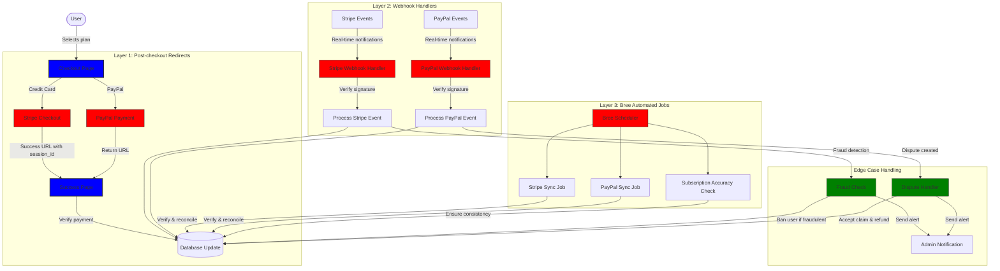
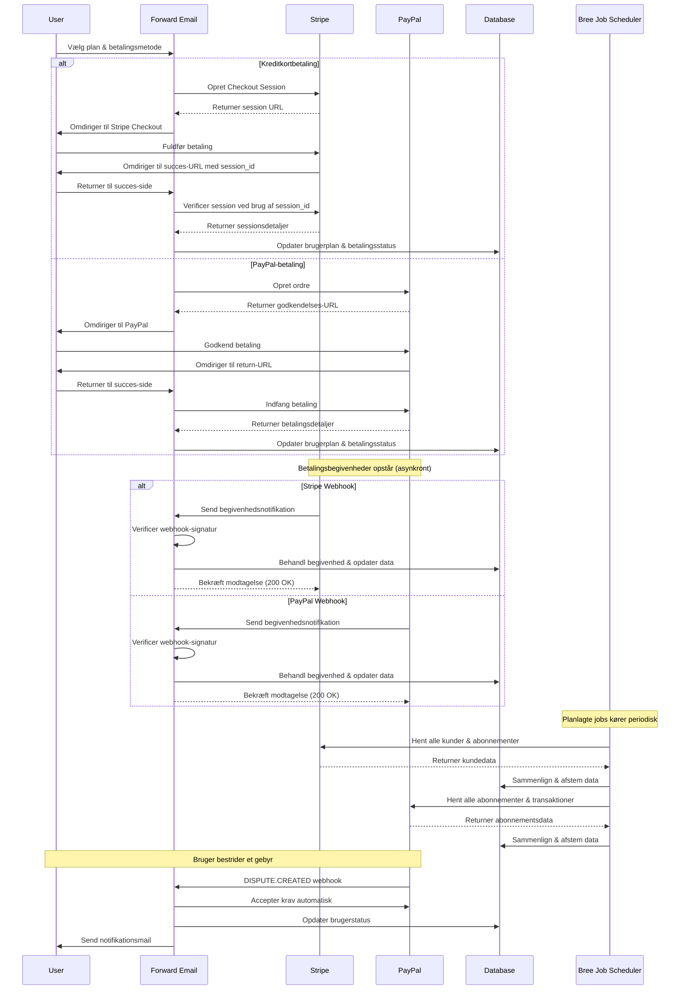
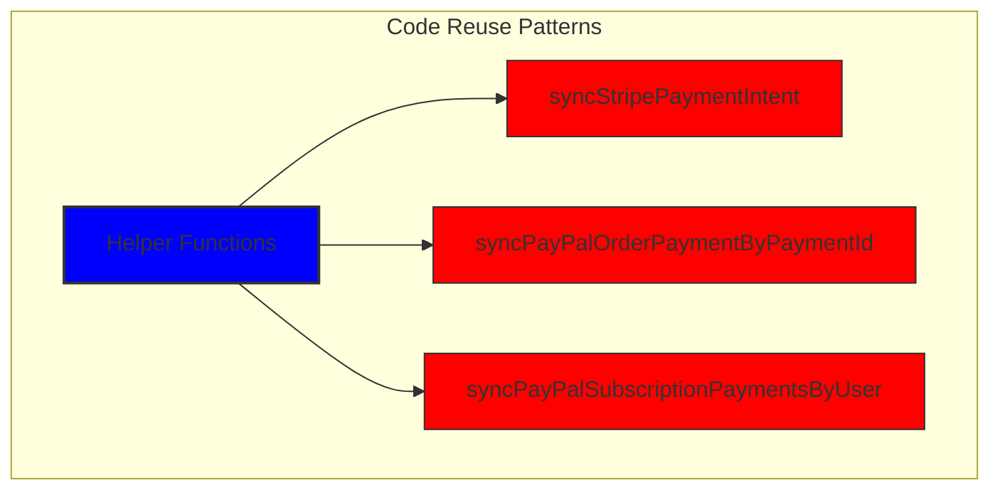
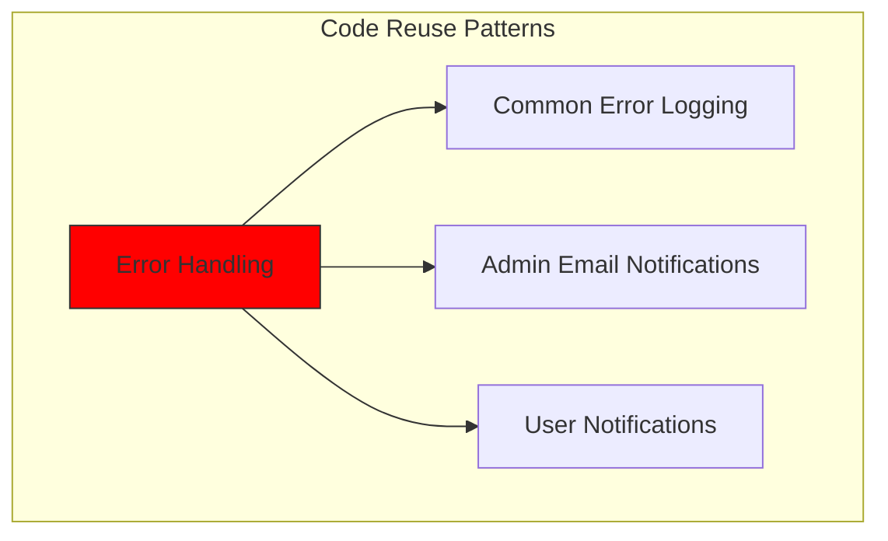
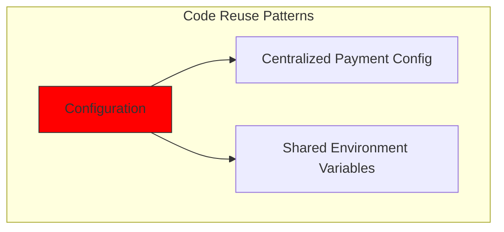
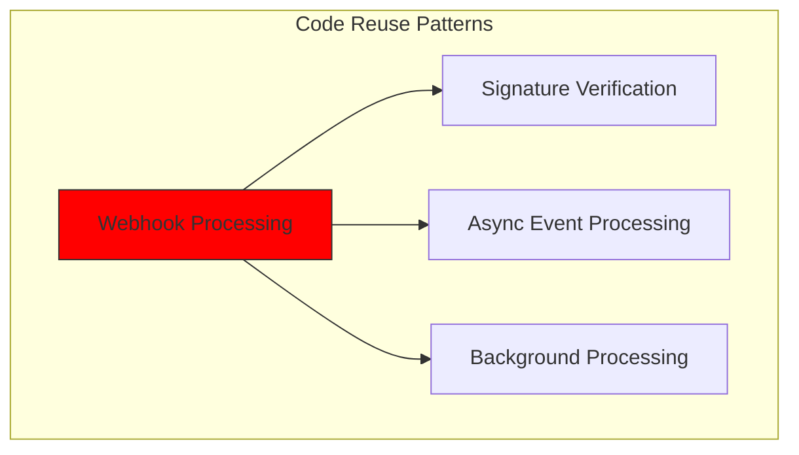
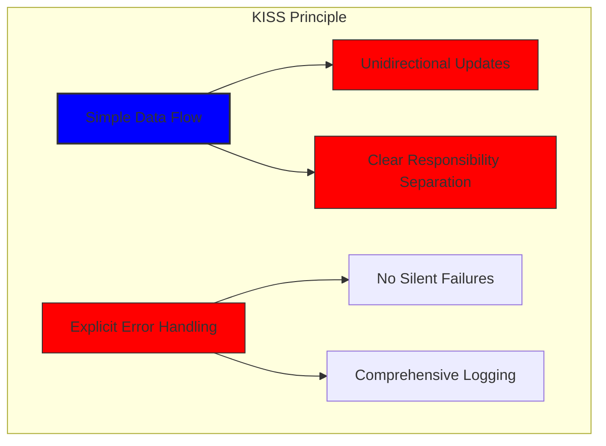

# Hvordan vi byggede et robust betalingssystem med Stripe og PayPal: En trifecta-tilgang {#how-we-built-a-robust-payment-system-with-stripe-and-paypal-a-trifecta-approach}


## Indholdsfortegnelse {#table-of-contents}

* [Forord](#foreword)
* [Udfordringen: Flere betalingsprocessorer, én sandhedskilde](#the-challenge-multiple-payment-processors-one-source-of-truth)
* [Trifecta-tilgangen: Tre lag af pålidelighed](#the-trifecta-approach-three-layers-of-reliability)
* [Lag 1: Post-checkout redirects](#layer-1-post-checkout-redirects)
  * [Stripe Checkout-implementering](#stripe-checkout-implementation)
  * [PayPal betalingsflow](#paypal-payment-flow)
* [Lag 2: Webhook-handlere med signaturverifikation](#layer-2-webhook-handlers-with-signature-verification)
  * [Stripe Webhook-implementering](#stripe-webhook-implementation)
  * [PayPal Webhook-implementering](#paypal-webhook-implementation)
* [Lag 3: Automatiserede jobs med Bree](#layer-3-automated-jobs-with-bree)
  * [Abonnementsnøjagtighedstjekker](#subscription-accuracy-checker)
  * [PayPal abonnements-synkronisering](#paypal-subscription-synchronization)
* [Håndtering af kanttilfælde](#handling-edge-cases)
  * [Svindeldetektion og forebyggelse](#fraud-detection-and-prevention)
  * [Håndtering af tvister](#dispute-handling)
* [Kodegenbrug: KISS og DRY principper](#code-reuse-kiss-and-dry-principles)
* [Implementering af VISA abonnementskrav](#visa-subscription-requirements-implementation)
  * [Automatiserede e-mail-notifikationer før fornyelse](#automated-pre-renewal-email-notifications)
  * [Håndtering af kanttilfælde](#handling-edge-cases-1)
  * [Prøveperioder og abonnementsbetingelser](#trial-periods-and-subscription-terms)
* [Konklusion: Fordelene ved vores trifecta-tilgang](#conclusion-the-benefits-of-our-trifecta-approach)


## Forord {#foreword}

Hos Forward Email har vi altid prioriteret at skabe systemer, der er pålidelige, præcise og brugervenlige. Da vi skulle implementere vores betalingsbehandlingssystem, vidste vi, at vi havde brug for en løsning, der kunne håndtere flere betalingsprocessorer samtidig med at opretholde perfekt datakonsistens. Dette blogindlæg beskriver, hvordan vores udviklingsteam integrerede både Stripe og PayPal ved hjælp af en trifecta-tilgang, der sikrer 1:1 realtidsnøjagtighed på tværs af hele vores system.


## Udfordringen: Flere betalingsprocessorer, én sandhedskilde {#the-challenge-multiple-payment-processors-one-source-of-truth}

Som en privatlivsfokuseret e-mailtjeneste ønskede vi at give vores brugere betalingsmuligheder. Nogle foretrækker enkelheden ved kreditkortbetalinger gennem Stripe, mens andre værdsætter det ekstra lag af adskillelse, som PayPal giver. Men understøttelse af flere betalingsprocessorer introducerer betydelig kompleksitet:

1. Hvordan sikrer vi konsistente data på tværs af forskellige betalingssystemer?
2. Hvordan håndterer vi kanttilfælde som tvister, refunderinger eller mislykkede betalinger?
3. Hvordan opretholder vi én sandhedskilde i vores database?

Vores løsning var at implementere det, vi kalder "trifecta-tilgangen" – et tre-lags system, der giver redundans og sikrer datakonsistens uanset hvad der sker.


## Trifecta-tilgangen: Tre lag af pålidelighed {#the-trifecta-approach-three-layers-of-reliability}

Vores betalingssystem består af tre kritiske komponenter, der arbejder sammen for at sikre perfekt datasynkronisering:

1. **Post-checkout redirects** – Indfangning af betalingsinformation umiddelbart efter checkout
2. **Webhook-handlere** – Behandling af realtidsbegivenheder fra betalingsprocessorer
3. **Automatiserede jobs** – Periodisk verifikation og afstemning af betalingsdata

Lad os dykke ned i hver komponent og se, hvordan de arbejder sammen.


```mermaid
flowchart TD
    User([User]) --> |Selects plan| Checkout[Checkout Page]

    %% Layer 1: Post-checkout redirects
    subgraph "Layer 1: Post-checkout Redirects"
        Checkout --> |Credit Card| Stripe[Stripe Checkout]
        Checkout --> |PayPal| PayPal[PayPal Payment]

        Stripe --> |Success URL with session_id| SuccessPage[Success Page]
        PayPal --> |Return URL| SuccessPage

        SuccessPage --> |Verify payment| Database[(Database Update)]
    end

    %% Layer 2: Webhooks
    subgraph "Layer 2: Webhook Handlers"
        StripeEvents[Stripe Events] --> |Real-time notifications| StripeWebhook[Stripe Webhook Handler]
        PayPalEvents[PayPal Events] --> |Real-time notifications| PayPalWebhook[PayPal Webhook Handler]

        StripeWebhook --> |Verify signature| ProcessStripeEvent[Process Stripe Event]
        PayPalWebhook --> |Verify signature| ProcessPayPalEvent[Process PayPal Event]

        ProcessStripeEvent --> Database
        ProcessPayPalEvent --> Database
    end

    %% Layer 3: Automated jobs
    subgraph "Layer 3: Bree Automated Jobs"
        BreeScheduler[Bree Scheduler] --> StripeSync[Stripe Sync Job]
        BreeScheduler --> PayPalSync[PayPal Sync Job]
        BreeScheduler --> AccuracyCheck[Subscription Accuracy Check]

        StripeSync --> |Verify & reconcile| Database
        PayPalSync --> |Verify & reconcile| Database
        AccuracyCheck --> |Ensure consistency| Database
    end

    %% Edge cases
    subgraph "Edge Case Handling"
        ProcessStripeEvent --> |Fraud detection| FraudCheck[Fraud Check]
        ProcessPayPalEvent --> |Dispute created| DisputeHandler[Dispute Handler]

        FraudCheck --> |Ban user if fraudulent| Database
        DisputeHandler --> |Accept claim & refund| Database

        FraudCheck --> |Send alert| AdminNotification[Admin Notification]
        DisputeHandler --> |Send alert| AdminNotification
    end

    %% Style definitions
    classDef primary fill:blue,stroke:#333,stroke-width:2px;
    classDef secondary fill:red,stroke:#333,stroke-width:1px;
    classDef tertiary fill:green,stroke:#333,stroke-width:1px;

    class Checkout,SuccessPage primary;
    class Stripe,PayPal,StripeWebhook,PayPalWebhook,BreeScheduler secondary;
    class FraudCheck,DisputeHandler tertiary;
```
## Lag 1: Omdirigeringer efter checkout {#layer-1-post-checkout-redirects}

Det første lag i vores trefoldige tilgang sker umiddelbart efter, at en bruger har gennemført en betaling. Både Stripe og PayPal tilbyder mekanismer til at omdirigere brugere tilbage til vores side med transaktionsinformation.

### Stripe Checkout-implementering {#stripe-checkout-implementation}

For Stripe bruger vi deres Checkout Sessions API til at skabe en problemfri betalingsoplevelse. Når en bruger vælger en plan og vælger at betale med kreditkort, opretter vi en Checkout Session med specifikke succes- og annullerings-URL'er:

```javascript
const options = {
  mode: paymentType === 'one-time' ? 'payment' : 'subscription',
  customer: ctx.state.user[config.userFields.stripeCustomerID],
  client_reference_id: reference,
  metadata: {
    plan
  },
  line_items: [
    {
      price,
      quantity: 1,
      description
    }
  ],
  locale: config.STRIPE_LOCALES.has(ctx.locale) ? ctx.locale : 'auto',
  cancel_url: `${config.urls.web}${ctx.path}${
    isMakePayment || isEnableAutoRenew ? '' : `/?plan=${plan}`
  }`,
  success_url: `${config.urls.web}${ctx.path}/?${
    isMakePayment || isEnableAutoRenew ? '' : `plan=${plan}&`
  }session_id={CHECKOUT_SESSION_ID}`,
  allow_promotion_codes: true
};

// Create the checkout session and redirect
const session = await stripe.checkout.sessions.create(options);
const redirectTo = session.url;
if (ctx.accepts('html')) {
  ctx.status = 303;
  ctx.redirect(redirectTo);
} else {
  ctx.body = { redirectTo };
}
```

Den kritiske del her er `success_url`-parameteren, som inkluderer `session_id` som en forespørgselsparameter. Når Stripe omdirigerer brugeren tilbage til vores side efter en vellykket betaling, kan vi bruge denne session-ID til at verificere transaktionen og opdatere vores database tilsvarende.

### PayPal betalingsflow {#paypal-payment-flow}

For PayPal bruger vi en lignende tilgang med deres Orders API:

```javascript
const requestBody = {
  intent: 'CAPTURE',
  application_context: {
    cancel_url: `${config.urls.web}${ctx.path}${
      isMakePayment || isEnableAutoRenew ? '' : `/?plan=${plan}`
    }`,
    return_url: `${config.urls.web}${ctx.path}/?plan=${plan}`,
    brand_name: 'Forward Email',
    shipping_preference: 'NO_SHIPPING',
    user_action: 'PAY_NOW'
  },
  payer: {
    email_address: ctx.state.user.email
  },
  purchase_units: [
    {
      reference_id: ctx.state.user.id,
      description,
      custom_id: sku,
      invoice_id: reference,
      soft_descriptor: sku,
      amount: {
        currency_code: 'USD',
        value: price,
        breakdown: {
          item_total: {
            currency_code: 'USD',
            value: price
          }
        }
      },
      items: [
        {
          name,
          description,
          sku,
          unit_amount: {
            currency_code: 'USD',
            value: price
          },
          quantity: '1',
          category: 'DIGITAL_GOODS'
        }
      ]
    }
  ]
};
```

Ligesom med Stripe specificerer vi `return_url` og `cancel_url` parametre for at håndtere omdirigeringer efter betaling. Når PayPal omdirigerer brugeren tilbage til vores side, kan vi indfange betalingsdetaljerne og opdatere vores database.


```mermaid
sequenceDiagram
    participant User
    participant FE as Forward Email
    participant Stripe
    participant PayPal
    participant DB as Database
    participant Bree as Bree Job Scheduler

    %% Initial checkout flow
    User->>FE: Vælg plan & betalingsmetode

    alt Kreditkortbetaling
        FE->>Stripe: Opret Checkout Session
        Stripe-->>FE: Returner session URL
        FE->>User: Omdiriger til Stripe Checkout
        User->>Stripe: Fuldfør betaling
        Stripe->>User: Omdiriger til succes-URL med session_id
        User->>FE: Returner til succes-side
        FE->>Stripe: Verificer session ved brug af session_id
        Stripe-->>FE: Returner sessionsdetaljer
        FE->>DB: Opdater brugerplan & betalingsstatus
    else PayPal-betaling
        FE->>PayPal: Opret ordre
        PayPal-->>FE: Returner godkendelses-URL
        FE->>User: Omdiriger til PayPal
        User->>PayPal: Godkend betaling
        PayPal->>User: Omdiriger til return-URL
        User->>FE: Returner til succes-side
        FE->>PayPal: Indfang betaling
        PayPal-->>FE: Returner betalingsdetaljer
        FE->>DB: Opdater brugerplan & betalingsstatus
    end

    %% Webhook flow (asynkron)
    Note over Stripe,PayPal: Betalingsbegivenheder opstår (asynkront)

    alt Stripe Webhook
        Stripe->>FE: Send begivenhedsnotifikation
        FE->>FE: Verificer webhook-signatur
        FE->>DB: Behandl begivenhed & opdater data
        FE-->>Stripe: Bekræft modtagelse (200 OK)
    else PayPal Webhook
        PayPal->>FE: Send begivenhedsnotifikation
        FE->>FE: Verificer webhook-signatur
        FE->>DB: Behandl begivenhed & opdater data
        FE-->>PayPal: Bekræft modtagelse (200 OK)
    end

    %% Bree automatiserede jobs
    Note over Bree: Planlagte jobs kører periodisk

    Bree->>Stripe: Hent alle kunder & abonnementer
    Stripe-->>Bree: Returner kundedata
    Bree->>DB: Sammenlign & afstem data

    Bree->>PayPal: Hent alle abonnementer & transaktioner
    PayPal-->>Bree: Returner abonnementsdata
    Bree->>DB: Sammenlign & afstem data

    %% Edge case: Håndtering af tvister
    Note over User,PayPal: Bruger bestrider et gebyr

    PayPal->>FE: DISPUTE.CREATED webhook
    FE->>PayPal: Accepter krav automatisk
    FE->>DB: Opdater brugerstatus
    FE->>User: Send notifikationsmail
```
## Lag 2: Webhook-håndteringer med signaturverifikation {#layer-2-webhook-handlers-with-signature-verification}

Mens post-checkout omdirigeringer fungerer godt i de fleste scenarier, er de ikke idiotsikre. Brugere kan lukke deres browser, før de bliver omdirigeret, eller netværksproblemer kan forhindre, at omdirigeringen fuldføres. Her kommer webhooks ind i billedet.

Både Stripe og PayPal tilbyder webhook-systemer, der sender realtidsnotifikationer om betalingsbegivenheder. Vi har implementeret robuste webhook-håndteringer, der verificerer ægtheden af disse notifikationer og behandler dem derefter.

### Stripe Webhook-implementering {#stripe-webhook-implementation}

Vores Stripe webhook-håndtering verificerer signaturen på indkommende webhook-begivenheder for at sikre, at de er legitime:

```javascript
async function webhook(ctx) {
  const sig = ctx.request.get('stripe-signature');
  // throw an error if something was wrong
  if (!isSANB(sig))
    throw Boom.badRequest(ctx.translateError('INVALID_STRIPE_SIGNATURE'));
  const event = stripe.webhooks.constructEvent(
    ctx.request.rawBody,
    sig,
    env.STRIPE_ENDPOINT_SECRET
  );
  // throw an error if something was wrong
  if (!event)
    throw Boom.badRequest(ctx.translateError('INVALID_STRIPE_SIGNATURE'));
  ctx.logger.info('stripe webhook', { event });
  // return a response to acknowledge receipt of the event
  ctx.body = { received: true };
  // run in background
  processEvent(ctx, event)
    .then()
    .catch((err) => {
      ctx.logger.fatal(err, { event });
      // email admin errors
      emailHelper({
        template: 'alert',
        message: {
          to: config.email.message.from,
          subject: `Error with Stripe Webhook (Event ID ${event.id})`
        },
        locals: {
          message: `<pre><code>${safeStringify(
            parseErr(err),
            null,
            2
          )}</code></pre>`
        }
      })
        .then()
        .catch((err) => ctx.logger.fatal(err, { event }));
    });
}
```

Funktionen `stripe.webhooks.constructEvent` verificerer signaturen ved hjælp af vores endpoint-secret. Hvis signaturen er gyldig, behandler vi begivenheden asynkront for at undgå at blokere webhook-responsen.

### PayPal Webhook-implementering {#paypal-webhook-implementation}

På samme måde verificerer vores PayPal webhook-håndtering ægtheden af indkommende notifikationer:

```javascript
async function webhook(ctx) {
  const response = await promisify(
    paypal.notification.webhookEvent.verify,
    paypal.notification.webhookEvent
  )(ctx.request.headers, ctx.request.body, env.PAYPAL_WEBHOOK_ID);
  // throw an error if something was wrong
  if (!_.isObject(response) || response.verification_status !== 'SUCCESS')
    throw Boom.badRequest(ctx.translateError('INVALID_PAYPAL_SIGNATURE'));
  // return a response to acknowledge receipt of the event
  ctx.body = { received: true };
  // run in background
  processEvent(ctx)
    .then()
    .catch((err) => {
      ctx.logger.fatal(err);
      // email admin errors
      emailHelper({
        template: 'alert',
        message: {
          to: config.email.message.from,
          subject: `Error with PayPal Webhook (Event ID ${ctx.request.body.id})`
        },
        locals: {
          message: `<pre><code>${safeStringify(
            parseErr(err),
            null,
            2
          )}</code></pre>`
        }
      })
        .then()
        .catch((err) => ctx.logger.fatal(err));
    });
}
```

Begge webhook-håndteringer følger samme mønster: verificer signaturen, bekræft modtagelsen, og behandl begivenheden asynkront. Dette sikrer, at vi aldrig går glip af en betalingsbegivenhed, selv hvis post-checkout omdirigeringen fejler.


## Lag 3: Automatiserede jobs med Bree {#layer-3-automated-jobs-with-bree}

Det sidste lag i vores trefoldige tilgang er et sæt automatiserede jobs, der periodisk verificerer og afstemmer betalingsdata. Vi bruger Bree, en jobplanlægger til Node.js, til at køre disse jobs med jævne mellemrum.

### Kontrol af abonnementsnøjagtighed {#subscription-accuracy-checker}

Et af vores nøglejobs er abonnementsnøjagtighedskontrollen, som sikrer, at vores database nøjagtigt afspejler abonnementsstatus i Stripe:
```javascript
async function mapper(customer) {
  // wait a second to prevent rate limitation error
  await setTimeout(ms('1s'));
  // check for user on our side
  let user = await Users.findOne({
    [config.userFields.stripeCustomerID]: customer.id
  })
    .lean()
    .exec();
  if (!user) return;
  if (user.is_banned) return;

  // if emails did not match
  if (user.email !== customer.email) {
    logger.info(
      `User email ${user.email} did not match customer email ${customer.email} (${customer.id})`
    );
    customer = await stripe.customers.update(customer.id, {
      email: user.email
    });
    logger.info(`Updated user email to match ${user.email}`);
  }

  // check for active subscriptions
  const [activeSubscriptions, trialingSubscriptions] = await Promise.all([
    stripe.subscriptions.list({
      customer: customer.id,
      status: 'active'
    }),
    stripe.subscriptions.list({
      customer: customer.id,
      status: 'trialing'
    })
  ]);

  // Combine active and trialing subscriptions
  let subscriptions = [
    ...activeSubscriptions.data,
    ...trialingSubscriptions.data
  ];

  // Handle edge case: multiple subscriptions for one user
  if (subscriptions.length > 1) {
    await logger.error(
      new Error(
        `We may need to refund: User had multiple subscriptions ${user.email} (${customer.id})`
      )
    );
    await emailHelper({
      template: 'alert',
      message: {
        to: config.email.message.from,
        subject: `User had multiple subscriptions ${user.email}`
      },
      locals: {
        message: `User ${user.email} (${customer.id}) had multiple subscriptions: ${JSON.stringify(
          subscriptions.map((s) => s.id)
        )}`
      }
    });
  }
}
```

This job checks for discrepancies between our database and Stripe, such as mismatched email addresses or multiple active subscriptions. If it finds any issues, it logs them and sends alerts to our admin team.

### PayPal Subscription Synchronization {#paypal-subscription-synchronization}

We have a similar job for PayPal subscriptions:

```javascript
async function syncPayPalSubscriptionPayments() {
  const paypalCustomers = await Users.find({
    $or: [
      {
        [config.userFields.paypalSubscriptionID]: { $exists: true, $ne: null }
      },
      {
        [config.userFields.paypalPayerID]: { $exists: true, $ne: null }
      }
    ]
  })
    // sort by newest customers first
    .sort('-created_at')
    .lean()
    .exec();

  await logger.info(
    `Syncing payments for ${paypalCustomers.length} paypal customers`
  );

  // Process each customer and sync their payments
  const errorEmails = await pReduce(
    paypalCustomers,
    // Implementation details...
  );
}
```

These automated jobs serve as our final safety net, ensuring that our database always reflects the true state of subscriptions and payments in both Stripe and PayPal.


## Handling Edge Cases {#handling-edge-cases}

A robust payment system must handle edge cases gracefully. Let's look at how we handle some common scenarios.

### Fraud Detection and Prevention {#fraud-detection-and-prevention}

We've implemented sophisticated fraud detection mechanisms that automatically identify and handle suspicious payment activities:

```javascript
case 'charge.failed': {
  // Get all failed charges in the last 30 days
  const charges = await stripe.charges.list({
    customer: event.data.object.customer,
    created: {
      gte: dayjs().subtract(1, 'month').unix()
    }
  });

  // Filter for declined charges
  const filtered = charges.data.filter(
    (d) => d.status === 'failed' && d.failure_code === 'card_declined'
  );

  // if not more than 5 then return early
  if (filtered.length < 5) break;

  // Check if user has verified domains
  const count = await Domains.countDocuments({
    members: {
      $elemMatch: {
        user: user._id,
        group: 'admin'
      }
    },
    plan: { $in: ['enhanced_protection', 'team'] },
    has_txt_record: true
  });

  if (!user.is_banned) {
    // If no verified domains, ban the user and refund all charges
    if (count === 0) {
      // Ban the user
      user.is_banned = true;
      await user.save();

      // Refund all successful charges
    }
  }
}
```

Denne kode blokerer automatisk brugere, der har flere mislykkede betalinger og ingen verificerede domæner, hvilket er en stærk indikator på svigagtig aktivitet.

### Dispute Handling {#dispute-handling}

Når en bruger bestrider en betaling, accepterer vi automatisk kravet og tager passende handling:

```javascript
case 'CUSTOMER.DISPUTE.CREATED': {
  // accept claim
  const agent = await paypalAgent();
  await agent
    .post(`/v1/customer/disputes/${body.resource.dispute_id}/accept-claim`)
    .send({
      note: 'Fuld refundering til kunden.'
    });

  // Find betalingen i vores database
  const payment = await Payments.findOne({ $or });
  if (!payment) throw new Error('Betaling findes ikke');

  const user = await Users.findById(payment.user);
  if (!user) throw new Error('Bruger eksisterede ikke for kunden');

  // Annuller brugerens abonnement, hvis de har et
  if (isSANB(user[config.userFields.paypalSubscriptionID])) {
    try {
      const agent = await paypalAgent();
      await agent.post(
        `/v1/billing/subscriptions/${
          user[config.userFields.paypalSubscriptionID]
        }/cancel`
      );
    } catch (err) {
      // Håndter fejl ved annullering af abonnement
    }
  }
}
```

Denne tilgang minimerer virkningen af tvister på vores forretning, samtidig med at den sikrer en god kundeoplevelse.


## Code Reuse: KISS and DRY Principles {#code-reuse-kiss-and-dry-principles}

Gennem hele vores betalingssystem har vi fulgt KISS (Keep It Simple, Stupid) og DRY (Don't Repeat Yourself) principperne. Her er nogle eksempler:

1. **Delte hjælpefunktioner**: Vi har oprettet genanvendelige hjælpefunktioner til almindelige opgaver som synkronisering af betalinger og afsendelse af e-mails.

2. **Konsistent fejlhåndtering**: Både Stripe og PayPal webhook-handlere bruger det samme mønster for fejlhåndtering og admin-notifikationer.

3. **Enheds database-skema**: Vores databaseskema er designet til at rumme både Stripe- og PayPal-data med fælles felter for betalingsstatus, beløb og planinformation.

4. **Centraliseret konfiguration**: Betalingsrelateret konfiguration er centraliseret i en enkelt fil, hvilket gør det nemt at opdatere priser og produktinformation.


```mermaid
graph TD
    subgraph "Code Reuse Patterns"
        A[Helper Functions] --> B[syncStripePaymentIntent]
        A --> C[syncPayPalOrderPaymentByPaymentId]
        A --> D[syncPayPalSubscriptionPaymentsByUser]
    end

    classDef primary fill:blue,stroke:#333,stroke-width:2px;
    classDef secondary fill:red,stroke:#333,stroke-width:1px;

    class A,P,V primary;
    class B,C,D,E,I,L,Q,R,S,W,X,Y,Z secondary;
```


```mermaid
graph TD
    subgraph "Code Reuse Patterns"
        E[Error Handling] --> F[Common Error Logging]
        E --> G[Admin Email Notifications]
        E --> H[User Notifications]
    end

    classDef primary fill:blue,stroke:#333,stroke-width:2px;
    classDef secondary fill:red,stroke:#333,stroke-width:1px;

    class A,P,V primary;
    class B,C,D,E,I,L,Q,R,S,W,X,Y,Z secondary;
```


```mermaid
graph TD
    subgraph "Code Reuse Patterns"
        I[Configuration] --> J[Centralized Payment Config]
        I --> K[Shared Environment Variables]
    end

    classDef primary fill:blue,stroke:#333,stroke-width:2px;
    classDef secondary fill:red,stroke:#333,stroke-width:1px;

    class A,P,V primary;
    class B,C,D,E,I,L,Q,R,S,W,X,Y,Z secondary;
```


```mermaid
graph TD
    subgraph "Code Reuse Patterns"
        L[Webhook Processing] --> M[Signature Verification]
        L --> N[Async Event Processing]
        L --> O[Background Processing]
    end

    classDef primary fill:blue,stroke:#333,stroke-width:2px;
    classDef secondary fill:red,stroke:#333,stroke-width:1px;

    class A,P,V primary;
    class B,C,D,E,I,L,Q,R,S,W,X,Y,Z secondary;
```


```mermaid
graph TD
    subgraph "KISS Principle"
        P[Simple Data Flow] --> Q[Unidirectional Updates]
        P --> R[Clear Responsibility Separation]

        S[Explicit Error Handling] --> T[No Silent Failures]
        S --> U[Comprehensive Logging]
    end

    classDef primary fill:blue,stroke:#333,stroke-width:2px;
    classDef secondary fill:red,stroke:#333,stroke-width:1px;

    class A,P,V primary;
    class B,C,D,E,I,L,Q,R,S,W,X,Y,Z secondary;
```
graph TD
    subgraph "DRY Principle"
        V[Shared Logic] --> W[Payment Processing Functions]
        V --> X[Email Templates]
        V --> Y[Validation Logic]

        Z[Common Database Operations] --> AA[User Updates]
        Z --> AB[Payment Recording]
    end

    classDef primary fill:blue,stroke:#333,stroke-width:2px;
    classDef secondary fill:red,stroke:#333,stroke-width:1px;

    class A,P,V primary;
    class B,C,D,E,I,L,Q,R,S,W,X,Y,Z secondary;
```


## Implementering af VISA-abonnements krav {#visa-subscription-requirements-implementation}

Ud over vores trefoldige tilgang har vi implementeret specifikke funktioner for at overholde VISAs abonnements krav samtidig med, at brugeroplevelsen forbedres. Et nøglekrav fra VISA er, at brugerne skal underrettes, før de bliver opkrævet for et abonnement, især når de går fra en prøveperiode til et betalt abonnement.

### Automatiserede e-mail notifikationer før fornyelse {#automated-pre-renewal-email-notifications}

Vi har bygget et automatiseret system, der identificerer brugere med aktive prøveabonnementer og sender dem en notifikationsmail, før deres første opkrævning finder sted. Dette sikrer ikke kun, at vi overholder VISAs krav, men reducerer også tilbageførsler og forbedrer kundetilfredsheden.

Sådan har vi implementeret denne funktion:

```javascript
// Find users with trial subscriptions who haven't received a notification yet
const users = await Users.find({
  $or: [
    {
      $and: [
        { [config.userFields.stripeSubscriptionID]: { $exists: true } },
        { [config.userFields.stripeTrialSentAt]: { $exists: false } },
        // Exclude subscriptions that have already had payments
        ...(paidStripeSubscriptionIds.length > 0
          ? [
              {
                [config.userFields.stripeSubscriptionID]: {
                  $nin: paidStripeSubscriptionIds
                }
              }
            ]
          : [])
      ]
    },
    {
      $and: [
        { [config.userFields.paypalSubscriptionID]: { $exists: true } },
        { [config.userFields.paypalTrialSentAt]: { $exists: false } },
        // Exclude subscriptions that have already had payments
        ...(paidPayPalSubscriptionIds.length > 0
          ? [
              {
                [config.userFields.paypalSubscriptionID]: {
                  $nin: paidPayPalSubscriptionIds
                }
              }
            ]
          : [])
      ]
    }
  ]
});

// Process each user and send notification
for (const user of users) {
  // Get subscription details from payment processor
  const subscription = await getSubscriptionDetails(user);

  // Calculate subscription duration and frequency
  const duration = getDurationFromPlanId(subscription.plan_id);
  const frequency = getHumanReadableFrequency(duration, user.locale);
  const amount = getPlanAmount(user.plan, duration);

  // Get user's domains for personalized email
  const domains = await Domains.find({
    'members.user': user._id
  }).sort('name').lean().exec();

  // Send VISA-compliant notification email
  await emailHelper({
    template: 'visa-trial-subscription-requirement',
    message: {
      to: user.receipt_email || user.email,
      ...(user.receipt_email ? { cc: user.email } : {})
    },
    locals: {
      user,
      firstChargeDate: new Date(subscription.start_time),
      frequency,
      formattedAmount: numeral(amount).format('$0,0,0.00'),
      domains
    }
  });

  // Record that notification was sent
  await Users.findByIdAndUpdate(user._id, {
    $set: {
      [config.userFields.paypalTrialSentAt]: new Date()
    }
  });
}
```

Denne implementering sikrer, at brugerne altid bliver informeret om kommende opkrævninger med klare oplysninger om:

1. Hvornår den første opkrævning vil finde sted
2. Hyppigheden af fremtidige opkrævninger (månedligt, årligt osv.)
3. Det præcise beløb, de vil blive opkrævet
4. Hvilke domæner der er dækket af deres abonnement

Ved at automatisere denne proces opretholder vi fuld overensstemmelse med VISAs krav (som kræver underretning mindst 7 dage før opkrævning), samtidig med at vi reducerer supporthenvendelser og forbedrer den samlede brugeroplevelse.
### Håndtering af Kanttilfælde {#handling-edge-cases-1}

Vores implementering inkluderer også robust fejlhåndtering. Hvis noget går galt under notifikationsprocessen, alarmerer vores system automatisk vores team:

```javascript
try {
  await mapper(user);
} catch (err) {
  logger.error(err);

  // Send alert to administrators
  await emailHelper({
    template: 'alert',
    message: {
      to: config.email.message.from,
      subject: 'VISA Trial Subscription Requirement Error'
    },
    locals: {
      message: `<pre><code>${safeStringify(
        parseErr(err),
        null,
        2
      )}</code></pre>`
    }
  });
}
```

Dette sikrer, at selv hvis der opstår et problem med notifikationssystemet, kan vores team hurtigt tage hånd om det og opretholde overholdelse af VISAs krav.

VISA abonnement notifikationssystemet er et andet eksempel på, hvordan vi har bygget vores betalingsinfrastruktur med både overholdelse og brugeroplevelse for øje, som supplerer vores trifecta-tilgang for at sikre pålidelig, gennemsigtig betalingsbehandling.

### Prøveperioder og Abonnementsbetingelser {#trial-periods-and-subscription-terms}

For brugere, der aktiverer automatisk fornyelse på eksisterende planer, beregner vi den passende prøveperiode for at sikre, at de ikke bliver opkrævet, før deres nuværende plan udløber:

```javascript
if (
  isEnableAutoRenew &&
  dayjs(ctx.state.user[config.userFields.planExpiresAt]).isAfter(
    dayjs()
  )
) {
  const hours = dayjs(
    ctx.state.user[config.userFields.planExpiresAt]
  ).diff(dayjs(), 'hours');

  // Handle trial period calculation
}
```

Vi giver også klar information om abonnementsbetingelser, inklusive faktureringsfrekvens og afbestillingspolitikker, og inkluderer detaljeret metadata med hvert abonnement for at sikre korrekt sporing og administration.


## Konklusion: Fordelene ved Vores Trifecta-Tilgang {#conclusion-the-benefits-of-our-trifecta-approach}

Vores trifecta-tilgang til betalingsbehandling har givet flere nøglefordele:

1. **Pålidelighed**: Ved at implementere tre lag af betalingsverifikation sikrer vi, at ingen betalinger bliver overset eller forkert behandlet.

2. **Nøjagtighed**: Vores database afspejler altid den sande tilstand af abonnementer og betalinger i både Stripe og PayPal.

3. **Fleksibilitet**: Brugere kan vælge deres foretrukne betalingsmetode uden at gå på kompromis med systemets pålidelighed.

4. **Robusthed**: Vores system håndterer kanttilfælde elegant, fra netværksfejl til svigagtige aktiviteter.

Hvis du implementerer et betalingssystem, der understøtter flere processorer, anbefaler vi stærkt denne trifecta-tilgang. Det kræver mere udviklingsindsats i starten, men de langsigtede fordele i form af pålidelighed og nøjagtighed er det hele værd.

For mere information om Forward Email og vores privatlivsfokuserede e-mailtjenester, besøg vores [hjemmeside](https://forwardemail.net).
