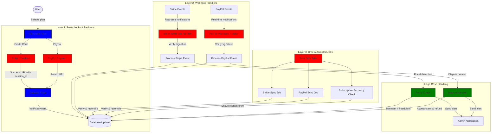
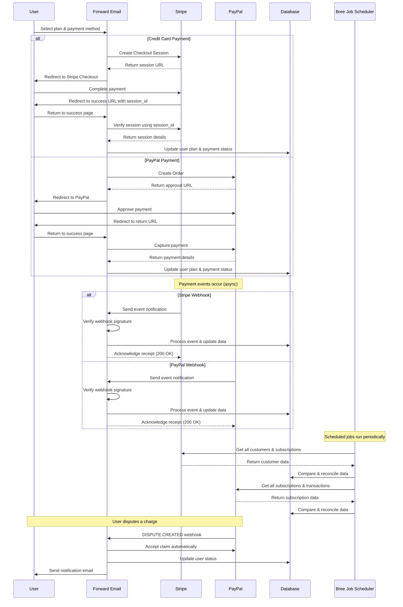
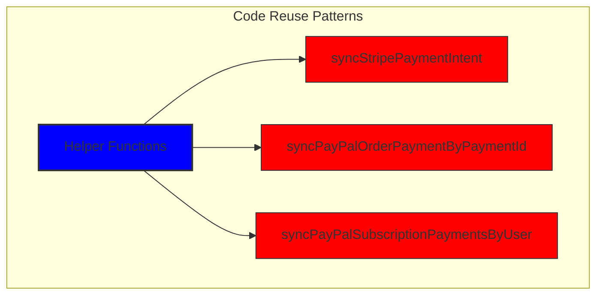
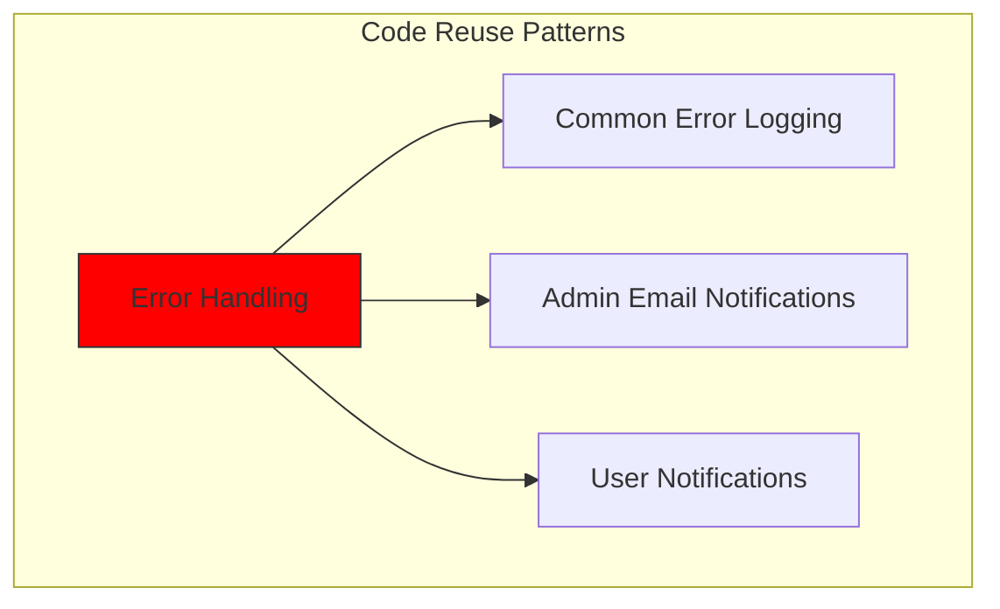
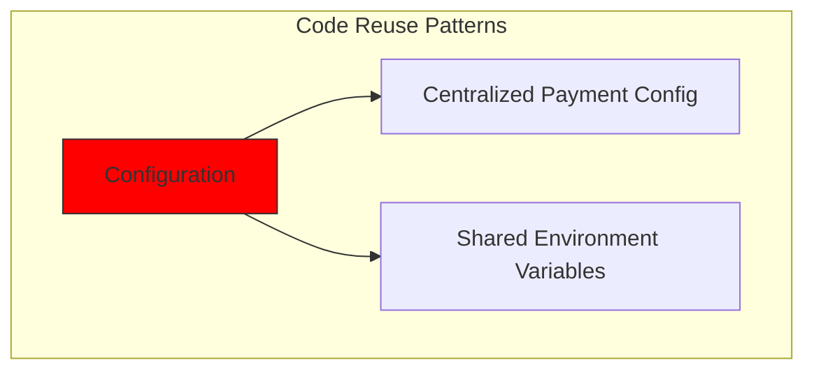
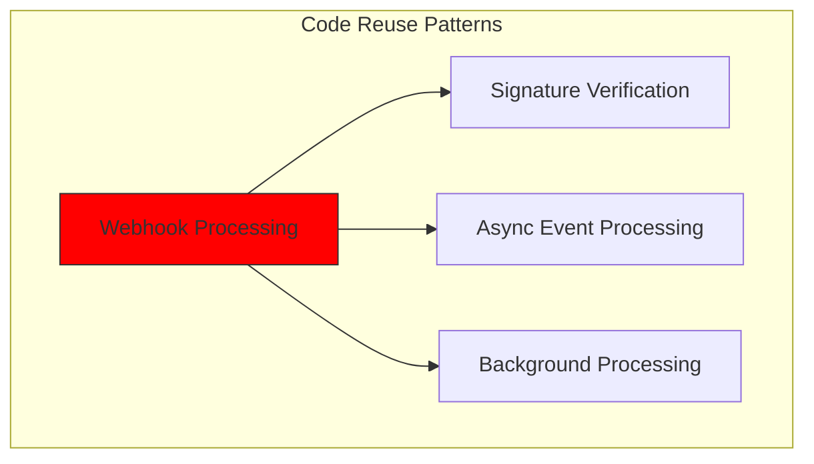
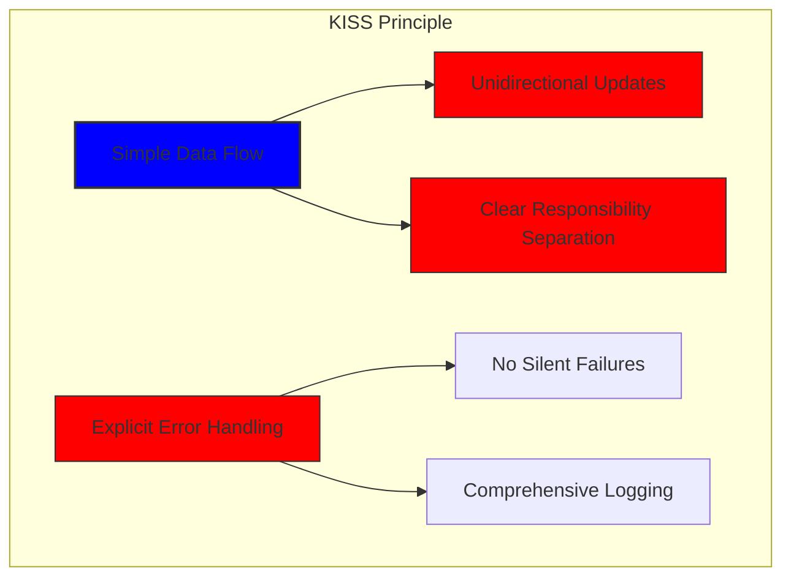
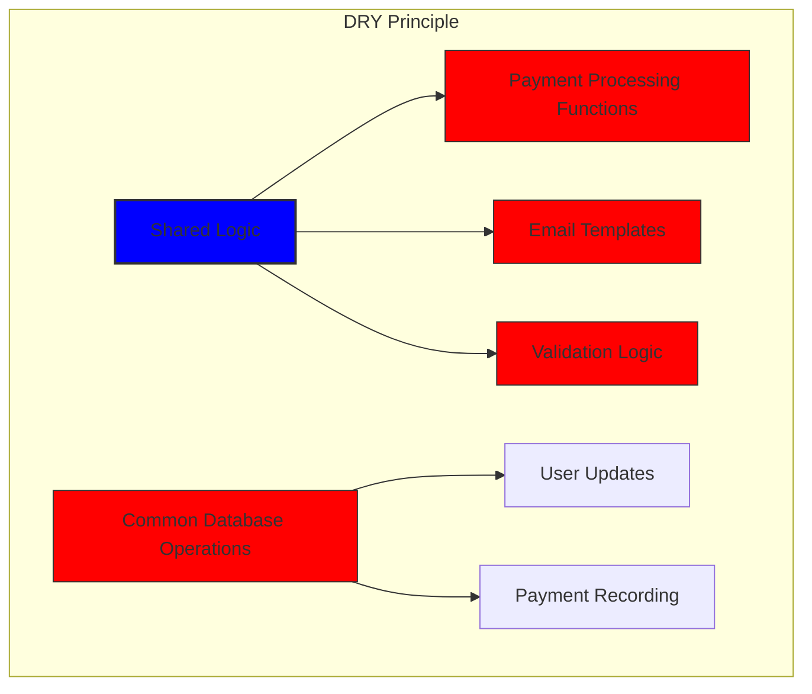

# Wie wir mit Stripe und PayPal ein robustes Zahlungssystem aufgebaut haben: Ein Dreifach-Ansatz {#how-we-built-a-robust-payment-system-with-stripe-and-paypal-a-trifecta-approach}


## Inhaltsverzeichnis {#table-of-contents}

* [Vorwort](#foreword)
* [Die Herausforderung: Mehrere Zahlungsabwickler, eine einzige Quelle der Wahrheit](#the-challenge-multiple-payment-processors-one-source-of-truth)
* [Der Trifecta-Ansatz: Drei Ebenen der Zuverlässigkeit](#the-trifecta-approach-three-layers-of-reliability)
* [Ebene 1: Weiterleitungen nach dem Checkout](#layer-1-post-checkout-redirects)
  * [Stripe Checkout-Implementierung](#stripe-checkout-implementation)
  * [PayPal-Zahlungsablauf](#paypal-payment-flow)
* [Schicht 2: Webhook-Handler mit Signaturüberprüfung](#layer-2-webhook-handlers-with-signature-verification)
  * [Stripe Webhook-Implementierung](#stripe-webhook-implementation)
  * [PayPal-Webhook-Implementierung](#paypal-webhook-implementation)
* [Ebene 3: Automatisierte Jobs mit Bree](#layer-3-automated-jobs-with-bree)
  * [Abonnement-Genauigkeitsprüfung](#subscription-accuracy-checker)
  * [PayPal-Abonnementsynchronisierung](#paypal-subscription-synchronization)
* [Umgang mit Randfällen](#handling-edge-cases)
  * [Betrugserkennung und -prävention](#fraud-detection-and-prevention)
  * [Streitbeilegung](#dispute-handling)
* [Code-Wiederverwendung: KISS- und DRY-Prinzipien](#code-reuse-kiss-and-dry-principles)
* [Implementierung der VISA-Abonnementanforderungen](#visa-subscription-requirements-implementation)
  * [Automatisierte E-Mail-Benachrichtigungen vor der Verlängerung](#automated-pre-renewal-email-notifications)
  * [Umgang mit Randfällen](#handling-edge-cases-1)
  * [Testzeiträume und Abonnementlaufzeiten](#trial-periods-and-subscription-terms)
* [Fazit: Die Vorteile unseres Trifecta-Ansatzes](#conclusion-the-benefits-of-our-trifecta-approach)

## Vorwort {#foreword}

Bei Forward Email legen wir seit jeher Wert auf zuverlässige, präzise und benutzerfreundliche Systeme. Bei der Implementierung unseres Zahlungsabwicklungssystems wussten wir, dass wir eine Lösung benötigen, die mehrere Zahlungsprozessoren verarbeiten und gleichzeitig perfekte Datenkonsistenz gewährleisten kann. Dieser Blogbeitrag beschreibt detailliert, wie unser Entwicklungsteam Stripe und PayPal mithilfe eines Dreifachansatzes integriert hat, der eine 1:1-Echtzeitgenauigkeit im gesamten System gewährleistet.

## Die Herausforderung: Mehrere Zahlungsabwickler, eine Quelle der Wahrheit {#the-challenge-multiple-payment-processors-one-source-of-truth}

Als datenschutzorientierter E-Mail-Dienst wollten wir unseren Nutzern Zahlungsoptionen bieten. Manche bevorzugen die einfache Kreditkartenzahlung über Stripe, andere schätzen die zusätzliche Trennung von PayPal. Die Unterstützung mehrerer Zahlungsanbieter bringt jedoch eine erhebliche Komplexität mit sich:

1. Wie gewährleisten wir konsistente Daten über verschiedene Zahlungssysteme hinweg?
2. Wie gehen wir mit Sonderfällen wie Streitigkeiten, Rückerstattungen oder fehlgeschlagenen Zahlungen um?
3. Wie gewährleisten wir eine einheitliche Datenquelle in unserer Datenbank?

Unsere Lösung bestand in der Implementierung des sogenannten „Trifecta-Ansatzes“ – ein dreischichtiges System, das Redundanz bietet und die Datenkonsistenz sicherstellt, egal was passiert.

## Der Trifecta-Ansatz: Drei Ebenen der Zuverlässigkeit {#the-trifecta-approach-three-layers-of-reliability}

Unser Zahlungssystem besteht aus drei kritischen Komponenten, die zusammenarbeiten, um eine perfekte Datensynchronisation zu gewährleisten:

1. **Weiterleitungen nach dem Checkout** – Erfassung von Zahlungsinformationen unmittelbar nach dem Checkout
2. **Webhook-Handler** – Verarbeitung von Echtzeitereignissen von Zahlungsabwicklern
3. **Automatisierte Aufgaben** – Regelmäßige Überprüfung und Abgleich von Zahlungsdaten

Lassen Sie uns die einzelnen Komponenten genauer betrachten und sehen, wie sie zusammenarbeiten.



## Ebene 1: Weiterleitungen nach dem Checkout {#layer-1-post-checkout-redirects}

Die erste Ebene unseres Dreifachansatzes erfolgt unmittelbar nach Abschluss einer Zahlung. Sowohl Stripe als auch PayPal bieten Mechanismen, um Benutzer mit Transaktionsinformationen auf unsere Website zurückzuleiten.

### Stripe Checkout-Implementierung {#stripe-checkout-implementation}

Für Stripe nutzen wir die Checkout Sessions API, um ein nahtloses Zahlungserlebnis zu ermöglichen. Wenn ein Nutzer einen Plan auswählt und mit Kreditkarte bezahlt, erstellen wir eine Checkout-Sitzung mit spezifischen Erfolgs- und Abbruch-URLs:

```javascript
const options = {
  mode: paymentType === 'one-time' ? 'payment' : 'subscription',
  customer: ctx.state.user[config.userFields.stripeCustomerID],
  client_reference_id: reference,
  metadata: {
    plan
  },
  line_items: [
    {
      price,
      quantity: 1,
      description
    }
  ],
  locale: config.STRIPE_LOCALES.has(ctx.locale) ? ctx.locale : 'auto',
  cancel_url: `${config.urls.web}${ctx.path}${
    isMakePayment || isEnableAutoRenew ? '' : `/?plan=${plan}`
  }`,
  success_url: `${config.urls.web}${ctx.path}/?${
    isMakePayment || isEnableAutoRenew ? '' : `plan=${plan}&`
  }session_id={CHECKOUT_SESSION_ID}`,
  allow_promotion_codes: true
};

// Create the checkout session and redirect
const session = await stripe.checkout.sessions.create(options);
const redirectTo = session.url;
if (ctx.accepts('html')) {
  ctx.status = 303;
  ctx.redirect(redirectTo);
} else {
  ctx.body = { redirectTo };
}
```

Der kritische Teil ist hier der Parameter `success_url`, der den `session_id` als Abfrageparameter enthält. Wenn Stripe den Benutzer nach einer erfolgreichen Zahlung zurück auf unsere Website leitet, können wir diese Sitzungs-ID verwenden, um die Transaktion zu verifizieren und unsere Datenbank entsprechend zu aktualisieren.

### PayPal-Zahlungsablauf {#paypal-payment-flow}

Für PayPal verwenden wir einen ähnlichen Ansatz mit der Orders API:

```javascript
const requestBody = {
  intent: 'CAPTURE',
  application_context: {
    cancel_url: `${config.urls.web}${ctx.path}${
      isMakePayment || isEnableAutoRenew ? '' : `/?plan=${plan}`
    }`,
    return_url: `${config.urls.web}${ctx.path}/?plan=${plan}`,
    brand_name: 'Forward Email',
    shipping_preference: 'NO_SHIPPING',
    user_action: 'PAY_NOW'
  },
  payer: {
    email_address: ctx.state.user.email
  },
  purchase_units: [
    {
      reference_id: ctx.state.user.id,
      description,
      custom_id: sku,
      invoice_id: reference,
      soft_descriptor: sku,
      amount: {
        currency_code: 'USD',
        value: price,
        breakdown: {
          item_total: {
            currency_code: 'USD',
            value: price
          }
        }
      },
      items: [
        {
          name,
          description,
          sku,
          unit_amount: {
            currency_code: 'USD',
            value: price
          },
          quantity: '1',
          category: 'DIGITAL_GOODS'
        }
      ]
    }
  ]
};
```

Ähnlich wie bei Stripe geben wir die Parameter `return_url` und `cancel_url` an, um Weiterleitungen nach der Zahlung zu handhaben. Wenn PayPal den Nutzer zurück auf unsere Website leitet, können wir die Zahlungsdetails erfassen und unsere Datenbank aktualisieren.



## Ebene 2: Webhook-Handler mit Signaturüberprüfung {#layer-2-webhook-handlers-with-signature-verification}

Obwohl Weiterleitungen nach dem Checkout in den meisten Fällen gut funktionieren, sind sie nicht absolut sicher. Benutzer schließen möglicherweise ihren Browser, bevor sie weitergeleitet werden, oder Netzwerkprobleme verhindern möglicherweise, dass die Weiterleitung abgeschlossen wird. Hier kommen Webhooks ins Spiel.

Sowohl Stripe als auch PayPal bieten Webhook-Systeme, die Echtzeitbenachrichtigungen über Zahlungsereignisse senden. Wir haben robuste Webhook-Handler implementiert, die die Authentizität dieser Benachrichtigungen überprüfen und entsprechend verarbeiten.

### Stripe Webhook-Implementierung {#stripe-webhook-implementation}

Unser Stripe-Webhook-Handler überprüft die Signatur eingehender Webhook-Ereignisse, um sicherzustellen, dass sie legitim sind:

```javascript
async function webhook(ctx) {
  const sig = ctx.request.get('stripe-signature');
  // throw an error if something was wrong
  if (!isSANB(sig))
    throw Boom.badRequest(ctx.translateError('INVALID_STRIPE_SIGNATURE'));
  const event = stripe.webhooks.constructEvent(
    ctx.request.rawBody,
    sig,
    env.STRIPE_ENDPOINT_SECRET
  );
  // throw an error if something was wrong
  if (!event)
    throw Boom.badRequest(ctx.translateError('INVALID_STRIPE_SIGNATURE'));
  ctx.logger.info('stripe webhook', { event });
  // return a response to acknowledge receipt of the event
  ctx.body = { received: true };
  // run in background
  processEvent(ctx, event)
    .then()
    .catch((err) => {
      ctx.logger.fatal(err, { event });
      // email admin errors
      emailHelper({
        template: 'alert',
        message: {
          to: config.email.message.from,
          subject: `Error with Stripe Webhook (Event ID ${event.id})`
        },
        locals: {
          message: `<pre><code>${safeStringify(
            parseErr(err),
            null,
            2
          )}</code></pre>`
        }
      })
        .then()
        .catch((err) => ctx.logger.fatal(err, { event }));
    });
}
```

Die Funktion `stripe.webhooks.constructEvent` überprüft die Signatur anhand unseres Endpunktgeheimnisses. Wenn die Signatur gültig ist, verarbeiten wir das Ereignis asynchron, um eine Blockierung der Webhook-Antwort zu vermeiden.

### PayPal-Webhook-Implementierung {#paypal-webhook-implementation}

In ähnlicher Weise überprüft unser PayPal-Webhook-Handler die Authentizität eingehender Benachrichtigungen:

```javascript
async function webhook(ctx) {
  const response = await promisify(
    paypal.notification.webhookEvent.verify,
    paypal.notification.webhookEvent
  )(ctx.request.headers, ctx.request.body, env.PAYPAL_WEBHOOK_ID);
  // throw an error if something was wrong
  if (!_.isObject(response) || response.verification_status !== 'SUCCESS')
    throw Boom.badRequest(ctx.translateError('INVALID_PAYPAL_SIGNATURE'));
  // return a response to acknowledge receipt of the event
  ctx.body = { received: true };
  // run in background
  processEvent(ctx)
    .then()
    .catch((err) => {
      ctx.logger.fatal(err);
      // email admin errors
      emailHelper({
        template: 'alert',
        message: {
          to: config.email.message.from,
          subject: `Error with PayPal Webhook (Event ID ${ctx.request.body.id})`
        },
        locals: {
          message: `<pre><code>${safeStringify(
            parseErr(err),
            null,
            2
          )}</code></pre>`
        }
      })
        .then()
        .catch((err) => ctx.logger.fatal(err));
    });
}
```

Beide Webhook-Handler folgen demselben Muster: Signaturprüfung, Empfangsbestätigung und asynchrone Ereignisverarbeitung. Dadurch wird sichergestellt, dass wir kein Zahlungsereignis verpassen, selbst wenn die Weiterleitung nach dem Checkout fehlschlägt.

## Ebene 3: Automatisierte Jobs mit Bree {#layer-3-automated-jobs-with-bree}

Die letzte Ebene unseres Dreifachansatzes besteht aus einer Reihe automatisierter Jobs, die regelmäßig Zahlungsdaten prüfen und abgleichen. Wir verwenden Bree, einen Job-Scheduler für Node.js, um diese Jobs in regelmäßigen Abständen auszuführen.

### Abonnement-Genauigkeitsprüfung {#subscription-accuracy-checker}

Eine unserer wichtigsten Aufgaben ist die Abonnement-Genauigkeitsprüfung, die sicherstellt, dass unsere Datenbank den Abonnementstatus in Stripe genau widerspiegelt:

```javascript
async function mapper(customer) {
  // wait a second to prevent rate limitation error
  await setTimeout(ms('1s'));
  // check for user on our side
  let user = await Users.findOne({
    [config.userFields.stripeCustomerID]: customer.id
  })
    .lean()
    .exec();
  if (!user) return;
  if (user.is_banned) return;

  // if emails did not match
  if (user.email !== customer.email) {
    logger.info(
      `User email ${user.email} did not match customer email ${customer.email} (${customer.id})`
    );
    customer = await stripe.customers.update(customer.id, {
      email: user.email
    });
    logger.info(`Updated user email to match ${user.email}`);
  }

  // check for active subscriptions
  const [activeSubscriptions, trialingSubscriptions] = await Promise.all([
    stripe.subscriptions.list({
      customer: customer.id,
      status: 'active'
    }),
    stripe.subscriptions.list({
      customer: customer.id,
      status: 'trialing'
    })
  ]);

  // Combine active and trialing subscriptions
  let subscriptions = [
    ...activeSubscriptions.data,
    ...trialingSubscriptions.data
  ];

  // Handle edge case: multiple subscriptions for one user
  if (subscriptions.length > 1) {
    await logger.error(
      new Error(
        `We may need to refund: User had multiple subscriptions ${user.email} (${customer.id})`
      )
    );
    await emailHelper({
      template: 'alert',
      message: {
        to: config.email.message.from,
        subject: `User had multiple subscriptions ${user.email}`
      },
      locals: {
        message: `User ${user.email} (${customer.id}) had multiple subscriptions: ${JSON.stringify(
          subscriptions.map((s) => s.id)
        )}`
      }
    });
  }
}
```

Dieser Job prüft auf Abweichungen zwischen unserer Datenbank und Stripe, wie z. B. nicht übereinstimmende E-Mail-Adressen oder mehrere aktive Abonnements. Bei Problemen werden diese protokolliert und Warnmeldungen an unser Admin-Team gesendet.

### PayPal-Abonnementsynchronisierung {#paypal-subscription-synchronization}

Für PayPal-Abonnements haben wir eine ähnliche Aufgabe:

```javascript
async function syncPayPalSubscriptionPayments() {
  const paypalCustomers = await Users.find({
    $or: [
      {
        [config.userFields.paypalSubscriptionID]: { $exists: true, $ne: null }
      },
      {
        [config.userFields.paypalPayerID]: { $exists: true, $ne: null }
      }
    ]
  })
    // sort by newest customers first
    .sort('-created_at')
    .lean()
    .exec();

  await logger.info(
    `Syncing payments for ${paypalCustomers.length} paypal customers`
  );

  // Process each customer and sync their payments
  const errorEmails = await pReduce(
    paypalCustomers,
    // Implementation details...
  );
}
```

Diese automatisierten Jobs dienen als unser letztes Sicherheitsnetz und stellen sicher, dass unsere Datenbank immer den wahren Status der Abonnements und Zahlungen sowohl bei Stripe als auch bei PayPal widerspiegelt.

## Umgang mit Randfällen {#handling-edge-cases}

Ein robustes Zahlungssystem muss mit Grenzfällen umgehen können. Sehen wir uns an, wie wir mit einigen häufigen Szenarien umgehen.

### Betrugserkennung und -prävention {#fraud-detection-and-prevention}

Wir haben hochentwickelte Mechanismen zur Betrugserkennung implementiert, die verdächtige Zahlungsaktivitäten automatisch identifizieren und behandeln:

```javascript
case 'charge.failed': {
  // Get all failed charges in the last 30 days
  const charges = await stripe.charges.list({
    customer: event.data.object.customer,
    created: {
      gte: dayjs().subtract(1, 'month').unix()
    }
  });

  // Filter for declined charges
  const filtered = charges.data.filter(
    (d) => d.status === 'failed' && d.failure_code === 'card_declined'
  );

  // if not more than 5 then return early
  if (filtered.length < 5) break;

  // Check if user has verified domains
  const count = await Domains.countDocuments({
    members: {
      $elemMatch: {
        user: user._id,
        group: 'admin'
      }
    },
    plan: { $in: ['enhanced_protection', 'team'] },
    has_txt_record: true
  });

  if (!user.is_banned) {
    // If no verified domains, ban the user and refund all charges
    if (count === 0) {
      // Ban the user
      user.is_banned = true;
      await user.save();

      // Refund all successful charges
    }
  }
}
```

Dieser Code sperrt automatisch Benutzer, deren Abbuchungen mehrfach fehlgeschlagen sind und deren Domänen nicht verifiziert sind, was ein starker Hinweis auf betrügerische Aktivitäten ist.

### Streitbeilegung {#dispute-handling}

Wenn ein Benutzer eine Belastung bestreitet, akzeptieren wir die Forderung automatisch und ergreifen die entsprechenden Maßnahmen:

```javascript
case 'CUSTOMER.DISPUTE.CREATED': {
  // accept claim
  const agent = await paypalAgent();
  await agent
    .post(`/v1/customer/disputes/${body.resource.dispute_id}/accept-claim`)
    .send({
      note: 'Full refund to the customer.'
    });

  // Find the payment in our database
  const payment = await Payments.findOne({ $or });
  if (!payment) throw new Error('Payment does not exist');

  const user = await Users.findById(payment.user);
  if (!user) throw new Error('User did not exist for customer');

  // Cancel the user's subscription if they have one
  if (isSANB(user[config.userFields.paypalSubscriptionID])) {
    try {
      const agent = await paypalAgent();
      await agent.post(
        `/v1/billing/subscriptions/${
          user[config.userFields.paypalSubscriptionID]
        }/cancel`
      );
    } catch (err) {
      // Handle subscription cancellation errors
    }
  }
}
```

Dieser Ansatz minimiert die Auswirkungen von Streitigkeiten auf unser Geschäft und gewährleistet gleichzeitig ein gutes Kundenerlebnis.

## Code-Wiederverwendung: KISS- und DRY-Prinzipien {#code-reuse-kiss-and-dry-principles}

In unserem gesamten Zahlungssystem halten wir uns an die Prinzipien KISS (Keep It Simple, Stupid) und DRY (Don't Repeat Yourself). Hier sind einige Beispiele:

1. **Gemeinsam genutzte Hilfsfunktionen**: Wir haben wiederverwendbare Hilfsfunktionen für allgemeine Aufgaben wie das Synchronisieren von Zahlungen und das Senden von E-Mails erstellt.

2. **Konsistente Fehlerbehandlung**: Sowohl die Webhook-Handler von Stripe als auch von PayPal verwenden dasselbe Muster für die Fehlerbehandlung und Administratorbenachrichtigungen.

3. **Einheitliches Datenbankschema**: Unser Datenbankschema ist so konzipiert, dass es sowohl Stripe- als auch PayPal-Daten aufnehmen kann, mit gemeinsamen Feldern für Zahlungsstatus, Betrag und Planinformationen.

4. **Zentralisierte Konfiguration**: Die zahlungsbezogene Konfiguration ist in einer einzigen Datei zentralisiert, sodass Preis- und Produktinformationen einfach aktualisiert werden können.













## Implementierung der VISA-Abonnementanforderungen {#visa-subscription-requirements-implementation}

Zusätzlich zu unserem Dreifach-Ansatz haben wir spezielle Funktionen implementiert, um die Abonnementanforderungen von VISA zu erfüllen und gleichzeitig das Benutzererlebnis zu verbessern. Eine wichtige Anforderung von VISA ist, dass Benutzer benachrichtigt werden müssen, bevor ihnen ein Abonnement in Rechnung gestellt wird, insbesondere beim Wechsel von einem Testabonnement zu einem kostenpflichtigen Abonnement.

### Automatisierte E-Mail-Benachrichtigungen vor der Verlängerung {#automated-pre-renewal-email-notifications}

Wir haben ein automatisiertes System entwickelt, das Nutzer mit aktiven Testabonnements identifiziert und ihnen vor der ersten Belastung eine Benachrichtigungs-E-Mail sendet. Dadurch erfüllen wir nicht nur die VISA-Anforderungen, sondern reduzieren auch Rückbuchungen und verbessern die Kundenzufriedenheit.

So haben wir diese Funktion implementiert:

```javascript
// Find users with trial subscriptions who haven't received a notification yet
const users = await Users.find({
  $or: [
    {
      $and: [
        { [config.userFields.stripeSubscriptionID]: { $exists: true } },
        { [config.userFields.stripeTrialSentAt]: { $exists: false } },
        // Exclude subscriptions that have already had payments
        ...(paidStripeSubscriptionIds.length > 0
          ? [
              {
                [config.userFields.stripeSubscriptionID]: {
                  $nin: paidStripeSubscriptionIds
                }
              }
            ]
          : [])
      ]
    },
    {
      $and: [
        { [config.userFields.paypalSubscriptionID]: { $exists: true } },
        { [config.userFields.paypalTrialSentAt]: { $exists: false } },
        // Exclude subscriptions that have already had payments
        ...(paidPayPalSubscriptionIds.length > 0
          ? [
              {
                [config.userFields.paypalSubscriptionID]: {
                  $nin: paidPayPalSubscriptionIds
                }
              }
            ]
          : [])
      ]
    }
  ]
});

// Process each user and send notification
for (const user of users) {
  // Get subscription details from payment processor
  const subscription = await getSubscriptionDetails(user);

  // Calculate subscription duration and frequency
  const duration = getDurationFromPlanId(subscription.plan_id);
  const frequency = getHumanReadableFrequency(duration, user.locale);
  const amount = getPlanAmount(user.plan, duration);

  // Get user's domains for personalized email
  const domains = await Domains.find({
    'members.user': user._id
  }).sort('name').lean().exec();

  // Send VISA-compliant notification email
  await emailHelper({
    template: 'visa-trial-subscription-requirement',
    message: {
      to: user.receipt_email || user.email,
      ...(user.receipt_email ? { cc: user.email } : {})
    },
    locals: {
      user,
      firstChargeDate: new Date(subscription.start_time),
      frequency,
      formattedAmount: numeral(amount).format('$0,0,0.00'),
      domains
    }
  });

  // Record that notification was sent
  await Users.findByIdAndUpdate(user._id, {
    $set: {
      [config.userFields.paypalTrialSentAt]: new Date()
    }
  });
}
```

Diese Implementierung stellt sicher, dass Benutzer immer über anstehende Gebühren informiert sind und klare Angaben zu folgenden Punkten enthalten:

1. Wann erfolgt die erste Abbuchung?
2. Häufigkeit zukünftiger Abbuchungen (monatlich, jährlich usw.)
3. Genauer Betrag
4. Welche Domains sind im Abonnement enthalten?

Durch die Automatisierung dieses Prozesses gewährleisten wir die perfekte Einhaltung der VISA-Anforderungen (die eine Benachrichtigung mindestens 7 Tage vor der Belastung vorschreiben), reduzieren gleichzeitig die Supportanfragen und verbessern das allgemeine Benutzererlebnis.

### Umgang mit Randfällen {#handling-edge-cases-1}

Unsere Implementierung beinhaltet auch eine robuste Fehlerbehandlung. Sollte während des Benachrichtigungsprozesses etwas schiefgehen, benachrichtigt unser System unser Team automatisch:

```javascript
try {
  await mapper(user);
} catch (err) {
  logger.error(err);

  // Send alert to administrators
  await emailHelper({
    template: 'alert',
    message: {
      to: config.email.message.from,
      subject: 'VISA Trial Subscription Requirement Error'
    },
    locals: {
      message: `<pre><code>${safeStringify(
        parseErr(err),
        null,
        2
      )}</code></pre>`
    }
  });
}
```

Dadurch wird sichergestellt, dass unser Team auch bei Problemen mit dem Benachrichtigungssystem diese schnell beheben und die Einhaltung der VISA-Anforderungen gewährleisten kann.

Das VISA-Abonnementbenachrichtigungssystem ist ein weiteres Beispiel dafür, wie wir unsere Zahlungsinfrastruktur sowohl im Hinblick auf Compliance als auch Benutzerfreundlichkeit aufgebaut haben und ergänzt unseren Dreifachansatz zur Gewährleistung einer zuverlässigen und transparenten Zahlungsabwicklung.

### Testzeiträume und Abonnementbedingungen {#trial-periods-and-subscription-terms}

Für Benutzer, die die automatische Verlängerung bestehender Pläne aktivieren, berechnen wir den entsprechenden Testzeitraum, um sicherzustellen, dass ihnen bis zum Ablauf ihres aktuellen Plans keine Kosten entstehen:

```javascript
if (
  isEnableAutoRenew &&
  dayjs(ctx.state.user[config.userFields.planExpiresAt]).isAfter(
    dayjs()
  )
) {
  const hours = dayjs(
    ctx.state.user[config.userFields.planExpiresAt]
  ).diff(dayjs(), 'hours');

  // Handle trial period calculation
}
```

Wir stellen außerdem klare Informationen zu den Abonnementbedingungen bereit, einschließlich Abrechnungshäufigkeit und Kündigungsrichtlinien, und fügen jedem Abonnement detaillierte Metadaten bei, um eine ordnungsgemäße Nachverfolgung und Verwaltung zu gewährleisten.

## Fazit: Die Vorteile unseres Trifecta-Ansatzes {#conclusion-the-benefits-of-our-trifecta-approach}

Unser Dreifachansatz zur Zahlungsabwicklung bietet mehrere wichtige Vorteile:

1. **Zuverlässigkeit**: Durch die Implementierung einer dreistufigen Zahlungsüberprüfung stellen wir sicher, dass keine Zahlung übersehen oder falsch verarbeitet wird.

2. **Genauigkeit**: Unsere Datenbank spiegelt immer den tatsächlichen Stand der Abonnements und Zahlungen sowohl bei Stripe als auch bei PayPal wider.

3. **Flexibilität**: Benutzer können ihre bevorzugte Zahlungsmethode wählen, ohne die Zuverlässigkeit unseres Systems zu beeinträchtigen.

4. **Robustheit**: Unser System bewältigt Randfälle problemlos, von Netzwerkausfällen bis hin zu betrügerischen Aktivitäten.

Wenn Sie ein Zahlungssystem implementieren, das mehrere Prozessoren unterstützt, empfehlen wir Ihnen diesen Dreifachansatz. Zwar ist der Entwicklungsaufwand im Vorfeld höher, die langfristigen Vorteile hinsichtlich Zuverlässigkeit und Genauigkeit lohnen sich jedoch.

Weitere Informationen zu Forward Email und unseren datenschutzorientierten E-Mail-Diensten finden Sie in unserem [Webseite](https://forwardemail.net).

<!-- *Schlüsselwörter: Zahlungsabwicklung, Stripe-Integration, PayPal-Integration, Webhook-Bearbeitung, Zahlungssynchronisierung, Abonnementverwaltung, Betrugsprävention, Streitbeilegung, Node.js-Zahlungssystem, Multiprozessor-Zahlungssystem, Zahlungsgateway-Integration, Echtzeit-Zahlungsüberprüfung, Zahlungsdatenkonsistenz, Abonnementabrechnung, Zahlungssicherheit, Zahlungsautomatisierung, Zahlungs-Webhooks, Zahlungsabgleich, Grenzfälle bei Zahlungen, Zahlungsfehlerbehandlung, VISA-Abonnementanforderungen, Benachrichtigungen vor Verlängerung, Abonnementkonformität* -->