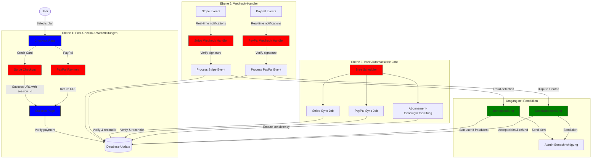
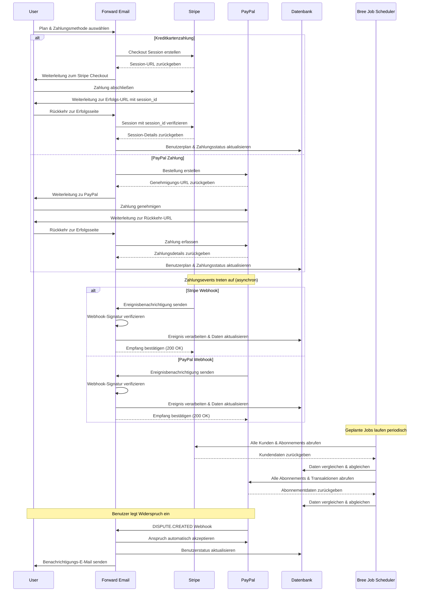
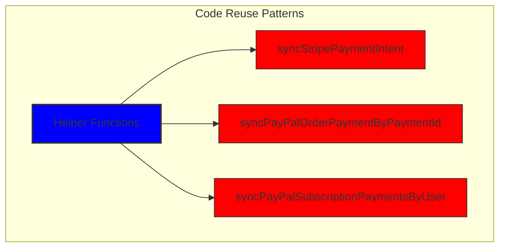
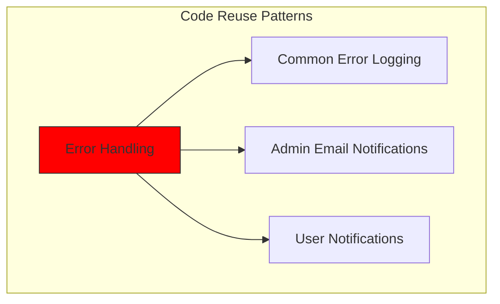
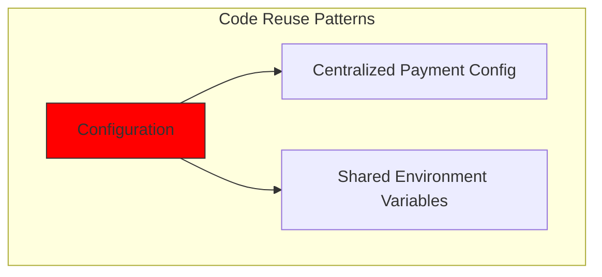
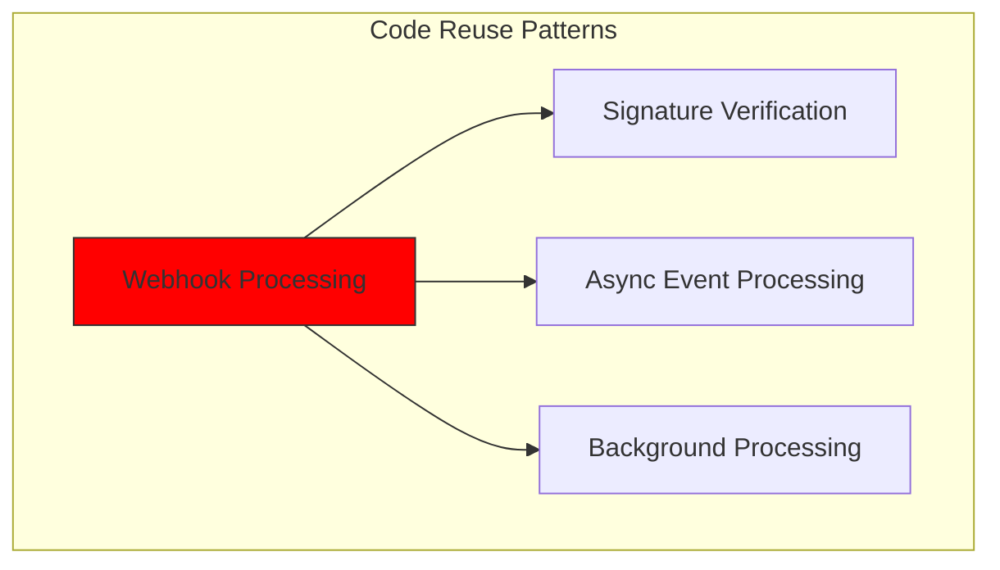
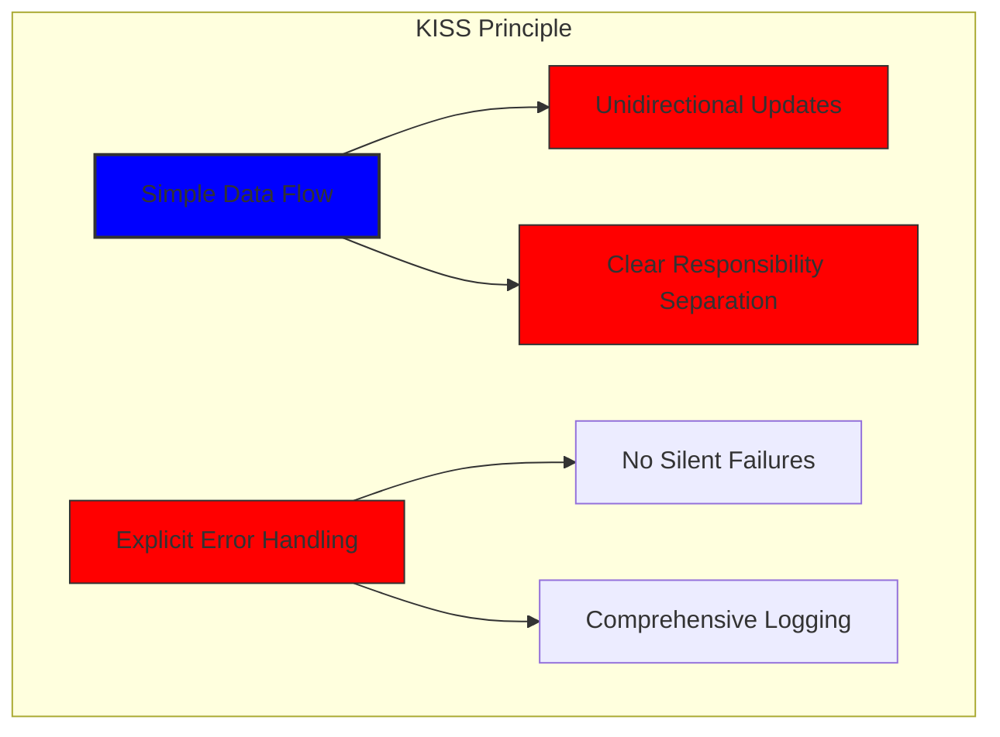

# Wie wir ein robustes Zahlungssystem mit Stripe und PayPal aufgebaut haben: Ein Trifecta-Ansatz {#how-we-built-a-robust-payment-system-with-stripe-and-paypal-a-trifecta-approach}


## Inhaltsverzeichnis {#table-of-contents}

* [Vorwort](#foreword)
* [Die Herausforderung: Mehrere Zahlungsanbieter, eine einzige Wahrheit](#the-challenge-multiple-payment-processors-one-source-of-truth)
* [Der Trifecta-Ansatz: Drei Ebenen der Zuverlässigkeit](#the-trifecta-approach-three-layers-of-reliability)
* [Ebene 1: Post-Checkout-Weiterleitungen](#layer-1-post-checkout-redirects)
  * [Stripe Checkout Implementierung](#stripe-checkout-implementation)
  * [PayPal Zahlungsablauf](#paypal-payment-flow)
* [Ebene 2: Webhook-Handler mit Signaturprüfung](#layer-2-webhook-handlers-with-signature-verification)
  * [Stripe Webhook Implementierung](#stripe-webhook-implementation)
  * [PayPal Webhook Implementierung](#paypal-webhook-implementation)
* [Ebene 3: Automatisierte Jobs mit Bree](#layer-3-automated-jobs-with-bree)
  * [Abonnement-Genauigkeitsprüfung](#subscription-accuracy-checker)
  * [PayPal Abonnement-Synchronisation](#paypal-subscription-synchronization)
* [Umgang mit Randfällen](#handling-edge-cases)
  * [Betrugserkennung und -prävention](#fraud-detection-and-prevention)
  * [Streitfallbehandlung](#dispute-handling)
* [Code-Wiederverwendung: KISS- und DRY-Prinzipien](#code-reuse-kiss-and-dry-principles)
* [Implementierung der VISA-Abonnementanforderungen](#visa-subscription-requirements-implementation)
  * [Automatisierte E-Mail-Benachrichtigungen vor Verlängerung](#automated-pre-renewal-email-notifications)
  * [Umgang mit Randfällen](#handling-edge-cases-1)
  * [Probezeiten und Abonnementbedingungen](#trial-periods-and-subscription-terms)
* [Fazit: Die Vorteile unseres Trifecta-Ansatzes](#conclusion-the-benefits-of-our-trifecta-approach)


## Vorwort {#foreword}

Bei Forward Email haben wir stets Wert darauf gelegt, Systeme zu schaffen, die zuverlässig, genau und benutzerfreundlich sind. Als es darum ging, unser Zahlungssystem zu implementieren, wussten wir, dass wir eine Lösung brauchen, die mehrere Zahlungsanbieter handhaben kann und gleichzeitig perfekte Datenkonsistenz gewährleistet. Dieser Blogbeitrag beschreibt, wie unser Entwicklungsteam sowohl Stripe als auch PayPal mit einem Trifecta-Ansatz integriert hat, der eine 1:1 Echtzeit-Genauigkeit im gesamten System sicherstellt.


## Die Herausforderung: Mehrere Zahlungsanbieter, eine einzige Wahrheit {#the-challenge-multiple-payment-processors-one-source-of-truth}

Als datenschutzorientierter E-Mail-Dienst wollten wir unseren Nutzern Zahlungsoptionen bieten. Einige bevorzugen die Einfachheit von Kreditkartenzahlungen über Stripe, während andere die zusätzliche Trennungsebene von PayPal schätzen. Die Unterstützung mehrerer Zahlungsanbieter bringt jedoch erhebliche Komplexität mit sich:

1. Wie stellen wir konsistente Daten über verschiedene Zahlungssysteme hinweg sicher?
2. Wie gehen wir mit Randfällen wie Streitigkeiten, Rückerstattungen oder fehlgeschlagenen Zahlungen um?
3. Wie erhalten wir eine einzige Quelle der Wahrheit in unserer Datenbank?

Unsere Lösung war die Implementierung dessen, was wir den „Trifecta-Ansatz“ nennen – ein dreischichtiges System, das Redundanz bietet und Datenkonsistenz unabhängig von den Umständen sicherstellt.


## Der Trifecta-Ansatz: Drei Ebenen der Zuverlässigkeit {#the-trifecta-approach-three-layers-of-reliability}

Unser Zahlungssystem besteht aus drei kritischen Komponenten, die zusammenarbeiten, um perfekte Datensynchronisation zu gewährleisten:

1. **Post-Checkout-Weiterleitungen** – Erfassung der Zahlungsinformationen unmittelbar nach dem Checkout
2. **Webhook-Handler** – Verarbeitung von Echtzeit-Ereignissen der Zahlungsanbieter
3. **Automatisierte Jobs** – Periodische Überprüfung und Abgleich der Zahlungsdaten

Lassen Sie uns jede Komponente genauer betrachten und sehen, wie sie zusammenwirken.


```mermaid
flowchart TD
    User([User]) --> |Selects plan| Checkout[Checkout Page]

    %% Layer 1: Post-checkout redirects
    subgraph "Ebene 1: Post-Checkout-Weiterleitungen"
        Checkout --> |Credit Card| Stripe[Stripe Checkout]
        Checkout --> |PayPal| PayPal[PayPal Payment]

        Stripe --> |Success URL with session_id| SuccessPage[Success Page]
        PayPal --> |Return URL| SuccessPage

        SuccessPage --> |Verify payment| Database[(Database Update)]
    end

    %% Layer 2: Webhooks
    subgraph "Ebene 2: Webhook-Handler"
        StripeEvents[Stripe Events] --> |Real-time notifications| StripeWebhook[Stripe Webhook Handler]
        PayPalEvents[PayPal Events] --> |Real-time notifications| PayPalWebhook[PayPal Webhook Handler]

        StripeWebhook --> |Verify signature| ProcessStripeEvent[Process Stripe Event]
        PayPalWebhook --> |Verify signature| ProcessPayPalEvent[Process PayPal Event]

        ProcessStripeEvent --> Database
        ProcessPayPalEvent --> Database
    end

    %% Layer 3: Automated jobs
    subgraph "Ebene 3: Bree Automatisierte Jobs"
        BreeScheduler[Bree Scheduler] --> StripeSync[Stripe Sync Job]
        BreeScheduler --> PayPalSync[PayPal Sync Job]
        BreeScheduler --> AccuracyCheck[Abonnement-Genauigkeitsprüfung]

        StripeSync --> |Verify & reconcile| Database
        PayPalSync --> |Verify & reconcile| Database
        AccuracyCheck --> |Ensure consistency| Database
    end

    %% Edge cases
    subgraph "Umgang mit Randfällen"
        ProcessStripeEvent --> |Fraud detection| FraudCheck[Betrugsprüfung]
        ProcessPayPalEvent --> |Dispute created| DisputeHandler[Streitfallbehandlung]

        FraudCheck --> |Ban user if fraudulent| Database
        DisputeHandler --> |Accept claim & refund| Database

        FraudCheck --> |Send alert| AdminNotification[Admin-Benachrichtigung]
        DisputeHandler --> |Send alert| AdminNotification
    end

    %% Style definitions
    classDef primary fill:blue,stroke:#333,stroke-width:2px;
    classDef secondary fill:red,stroke:#333,stroke-width:1px;
    classDef tertiary fill:green,stroke:#333,stroke-width:1px;

    class Checkout,SuccessPage primary;
    class Stripe,PayPal,StripeWebhook,PayPalWebhook,BreeScheduler secondary;
    class FraudCheck,DisputeHandler tertiary;
```
## Layer 1: Post-Checkout-Weiterleitungen {#layer-1-post-checkout-redirects}

Die erste Ebene unseres Dreifach-Ansatzes findet unmittelbar statt, nachdem ein Benutzer eine Zahlung abgeschlossen hat. Sowohl Stripe als auch PayPal bieten Mechanismen, um Benutzer mit Transaktionsinformationen zurück auf unsere Seite umzuleiten.

### Stripe Checkout Implementierung {#stripe-checkout-implementation}

Für Stripe verwenden wir deren Checkout Sessions API, um ein nahtloses Zahlungserlebnis zu schaffen. Wenn ein Benutzer einen Plan auswählt und mit Kreditkarte bezahlen möchte, erstellen wir eine Checkout Session mit spezifischen Erfolgs- und Abbruch-URLs:

```javascript
const options = {
  mode: paymentType === 'one-time' ? 'payment' : 'subscription',
  customer: ctx.state.user[config.userFields.stripeCustomerID],
  client_reference_id: reference,
  metadata: {
    plan
  },
  line_items: [
    {
      price,
      quantity: 1,
      description
    }
  ],
  locale: config.STRIPE_LOCALES.has(ctx.locale) ? ctx.locale : 'auto',
  cancel_url: `${config.urls.web}${ctx.path}${
    isMakePayment || isEnableAutoRenew ? '' : `/?plan=${plan}`
  }`,
  success_url: `${config.urls.web}${ctx.path}/?${
    isMakePayment || isEnableAutoRenew ? '' : `plan=${plan}&`
  }session_id={CHECKOUT_SESSION_ID}`,
  allow_promotion_codes: true
};

// Create the checkout session and redirect
const session = await stripe.checkout.sessions.create(options);
const redirectTo = session.url;
if (ctx.accepts('html')) {
  ctx.status = 303;
  ctx.redirect(redirectTo);
} else {
  ctx.body = { redirectTo };
}
```

Der entscheidende Teil hier ist der Parameter `success_url`, der die `session_id` als Query-Parameter enthält. Wenn Stripe den Benutzer nach einer erfolgreichen Zahlung zurück auf unsere Seite weiterleitet, können wir diese Session-ID verwenden, um die Transaktion zu verifizieren und unsere Datenbank entsprechend zu aktualisieren.

### PayPal Zahlungsablauf {#paypal-payment-flow}

Für PayPal verwenden wir einen ähnlichen Ansatz mit deren Orders API:

```javascript
const requestBody = {
  intent: 'CAPTURE',
  application_context: {
    cancel_url: `${config.urls.web}${ctx.path}${
      isMakePayment || isEnableAutoRenew ? '' : `/?plan=${plan}`
    }`,
    return_url: `${config.urls.web}${ctx.path}/?plan=${plan}`,
    brand_name: 'Forward Email',
    shipping_preference: 'NO_SHIPPING',
    user_action: 'PAY_NOW'
  },
  payer: {
    email_address: ctx.state.user.email
  },
  purchase_units: [
    {
      reference_id: ctx.state.user.id,
      description,
      custom_id: sku,
      invoice_id: reference,
      soft_descriptor: sku,
      amount: {
        currency_code: 'USD',
        value: price,
        breakdown: {
          item_total: {
            currency_code: 'USD',
            value: price
          }
        }
      },
      items: [
        {
          name,
          description,
          sku,
          unit_amount: {
            currency_code: 'USD',
            value: price
          },
          quantity: '1',
          category: 'DIGITAL_GOODS'
        }
      ]
    }
  ]
};
```

Ähnlich wie bei Stripe geben wir die Parameter `return_url` und `cancel_url` an, um die Weiterleitungen nach der Zahlung zu steuern. Wenn PayPal den Benutzer zurück auf unsere Seite weiterleitet, können wir die Zahlungsdetails erfassen und unsere Datenbank aktualisieren.


```mermaid
sequenceDiagram
    participant User
    participant FE as Forward Email
    participant Stripe
    participant PayPal
    participant DB as Datenbank
    participant Bree as Bree Job Scheduler

    %% Initial checkout flow
    User->>FE: Plan & Zahlungsmethode auswählen

    alt Kreditkartenzahlung
        FE->>Stripe: Checkout Session erstellen
        Stripe-->>FE: Session-URL zurückgeben
        FE->>User: Weiterleitung zum Stripe Checkout
        User->>Stripe: Zahlung abschließen
        Stripe->>User: Weiterleitung zur Erfolgs-URL mit session_id
        User->>FE: Rückkehr zur Erfolgsseite
        FE->>Stripe: Session mit session_id verifizieren
        Stripe-->>FE: Session-Details zurückgeben
        FE->>DB: Benutzerplan & Zahlungsstatus aktualisieren
    else PayPal Zahlung
        FE->>PayPal: Bestellung erstellen
        PayPal-->>FE: Genehmigungs-URL zurückgeben
        FE->>User: Weiterleitung zu PayPal
        User->>PayPal: Zahlung genehmigen
        PayPal->>User: Weiterleitung zur Rückkehr-URL
        User->>FE: Rückkehr zur Erfolgsseite
        FE->>PayPal: Zahlung erfassen
        PayPal-->>FE: Zahlungsdetails zurückgeben
        FE->>DB: Benutzerplan & Zahlungsstatus aktualisieren
    end

    %% Webhook Ablauf (asynchron)
    Note over Stripe,PayPal: Zahlungsevents treten auf (asynchron)

    alt Stripe Webhook
        Stripe->>FE: Ereignisbenachrichtigung senden
        FE->>FE: Webhook-Signatur verifizieren
        FE->>DB: Ereignis verarbeiten & Daten aktualisieren
        FE-->>Stripe: Empfang bestätigen (200 OK)
    else PayPal Webhook
        PayPal->>FE: Ereignisbenachrichtigung senden
        FE->>FE: Webhook-Signatur verifizieren
        FE->>DB: Ereignis verarbeiten & Daten aktualisieren
        FE-->>PayPal: Empfang bestätigen (200 OK)
    end

    %% Bree automatisierte Jobs
    Note over Bree: Geplante Jobs laufen periodisch

    Bree->>Stripe: Alle Kunden & Abonnements abrufen
    Stripe-->>Bree: Kundendaten zurückgeben
    Bree->>DB: Daten vergleichen & abgleichen

    Bree->>PayPal: Alle Abonnements & Transaktionen abrufen
    PayPal-->>Bree: Abonnementdaten zurückgeben
    Bree->>DB: Daten vergleichen & abgleichen

    %% Sonderfall: Streitfallbearbeitung
    Note over User,PayPal: Benutzer legt Widerspruch ein

    PayPal->>FE: DISPUTE.CREATED Webhook
    FE->>PayPal: Anspruch automatisch akzeptieren
    FE->>DB: Benutzerstatus aktualisieren
    FE->>User: Benachrichtigungs-E-Mail senden
```
## Layer 2: Webhook-Handler mit Signaturverifizierung {#layer-2-webhook-handlers-with-signature-verification}

Während Post-Checkout-Weiterleitungen in den meisten Szenarien gut funktionieren, sind sie nicht narrensicher. Nutzer könnten ihren Browser schließen, bevor die Weiterleitung erfolgt, oder Netzwerkprobleme könnten die Weiterleitung verhindern. Hier kommen Webhooks ins Spiel.

Sowohl Stripe als auch PayPal bieten Webhook-Systeme, die Echtzeit-Benachrichtigungen über Zahlungsereignisse senden. Wir haben robuste Webhook-Handler implementiert, die die Authentizität dieser Benachrichtigungen überprüfen und sie entsprechend verarbeiten.

### Stripe Webhook-Implementierung {#stripe-webhook-implementation}

Unser Stripe-Webhook-Handler überprüft die Signatur eingehender Webhook-Ereignisse, um sicherzustellen, dass sie legitim sind:

```javascript
async function webhook(ctx) {
  const sig = ctx.request.get('stripe-signature');
  // throw an error if something was wrong
  if (!isSANB(sig))
    throw Boom.badRequest(ctx.translateError('INVALID_STRIPE_SIGNATURE'));
  const event = stripe.webhooks.constructEvent(
    ctx.request.rawBody,
    sig,
    env.STRIPE_ENDPOINT_SECRET
  );
  // throw an error if something was wrong
  if (!event)
    throw Boom.badRequest(ctx.translateError('INVALID_STRIPE_SIGNATURE'));
  ctx.logger.info('stripe webhook', { event });
  // return a response to acknowledge receipt of the event
  ctx.body = { received: true };
  // run in background
  processEvent(ctx, event)
    .then()
    .catch((err) => {
      ctx.logger.fatal(err, { event });
      // email admin errors
      emailHelper({
        template: 'alert',
        message: {
          to: config.email.message.from,
          subject: `Fehler mit Stripe Webhook (Event ID ${event.id})`
        },
        locals: {
          message: `<pre><code>${safeStringify(
            parseErr(err),
            null,
            2
          )}</code></pre>`
        }
      })
        .then()
        .catch((err) => ctx.logger.fatal(err, { event }));
    });
}
```

Die Funktion `stripe.webhooks.constructEvent` überprüft die Signatur mit unserem Endpunkt-Geheimnis. Wenn die Signatur gültig ist, verarbeiten wir das Ereignis asynchron, um die Antwort des Webhooks nicht zu blockieren.

### PayPal Webhook-Implementierung {#paypal-webhook-implementation}

Ähnlich überprüft unser PayPal-Webhook-Handler die Authentizität eingehender Benachrichtigungen:

```javascript
async function webhook(ctx) {
  const response = await promisify(
    paypal.notification.webhookEvent.verify,
    paypal.notification.webhookEvent
  )(ctx.request.headers, ctx.request.body, env.PAYPAL_WEBHOOK_ID);
  // throw an error if something was wrong
  if (!_.isObject(response) || response.verification_status !== 'SUCCESS')
    throw Boom.badRequest(ctx.translateError('INVALID_PAYPAL_SIGNATURE'));
  // return a response to acknowledge receipt of the event
  ctx.body = { received: true };
  // run in background
  processEvent(ctx)
    .then()
    .catch((err) => {
      ctx.logger.fatal(err);
      // email admin errors
      emailHelper({
        template: 'alert',
        message: {
          to: config.email.message.from,
          subject: `Fehler mit PayPal Webhook (Event ID ${ctx.request.body.id})`
        },
        locals: {
          message: `<pre><code>${safeStringify(
            parseErr(err),
            null,
            2
          )}</code></pre>`
        }
      })
        .then()
        .catch((err) => ctx.logger.fatal(err));
    });
}
```

Beide Webhook-Handler folgen dem gleichen Muster: Signatur verifizieren, Empfang bestätigen und das Ereignis asynchron verarbeiten. So stellen wir sicher, dass wir kein Zahlungsevent verpassen, selbst wenn die Post-Checkout-Weiterleitung fehlschlägt.


## Layer 3: Automatisierte Jobs mit Bree {#layer-3-automated-jobs-with-bree}

Die letzte Ebene unseres Dreiklangs ist eine Reihe automatisierter Jobs, die periodisch Zahlungsdaten überprüfen und abgleichen. Wir verwenden Bree, einen Job-Scheduler für Node.js, um diese Jobs in regelmäßigen Abständen auszuführen.

### Abonnement-Genauigkeitsprüfer {#subscription-accuracy-checker}

Einer unserer wichtigsten Jobs ist der Abonnement-Genauigkeitsprüfer, der sicherstellt, dass unsere Datenbank den Abonnementstatus in Stripe korrekt widerspiegelt:
```javascript
async function mapper(customer) {
  // wait a second to prevent rate limitation error
  await setTimeout(ms('1s'));
  // check for user on our side
  let user = await Users.findOne({
    [config.userFields.stripeCustomerID]: customer.id
  })
    .lean()
    .exec();
  if (!user) return;
  if (user.is_banned) return;

  // if emails did not match
  if (user.email !== customer.email) {
    logger.info(
      `User email ${user.email} did not match customer email ${customer.email} (${customer.id})`
    );
    customer = await stripe.customers.update(customer.id, {
      email: user.email
    });
    logger.info(`Updated user email to match ${user.email}`);
  }

  // check for active subscriptions
  const [activeSubscriptions, trialingSubscriptions] = await Promise.all([
    stripe.subscriptions.list({
      customer: customer.id,
      status: 'active'
    }),
    stripe.subscriptions.list({
      customer: customer.id,
      status: 'trialing'
    })
  ]);

  // Combine active and trialing subscriptions
  let subscriptions = [
    ...activeSubscriptions.data,
    ...trialingSubscriptions.data
  ];

  // Handle edge case: multiple subscriptions for one user
  if (subscriptions.length > 1) {
    await logger.error(
      new Error(
        `We may need to refund: User had multiple subscriptions ${user.email} (${customer.id})`
      )
    );
    await emailHelper({
      template: 'alert',
      message: {
        to: config.email.message.from,
        subject: `User had multiple subscriptions ${user.email}`
      },
      locals: {
        message: `User ${user.email} (${customer.id}) had multiple subscriptions: ${JSON.stringify(
          subscriptions.map((s) => s.id)
        )}`
      }
    });
  }
}
```

This job checks for discrepancies between our database and Stripe, such as mismatched email addresses or multiple active subscriptions. If it finds any issues, it logs them and sends alerts to our admin team.

### PayPal Subscription Synchronization {#paypal-subscription-synchronization}

We have a similar job for PayPal subscriptions:

```javascript
async function syncPayPalSubscriptionPayments() {
  const paypalCustomers = await Users.find({
    $or: [
      {
        [config.userFields.paypalSubscriptionID]: { $exists: true, $ne: null }
      },
      {
        [config.userFields.paypalPayerID]: { $exists: true, $ne: null }
      }
    ]
  })
    // sort by newest customers first
    .sort('-created_at')
    .lean()
    .exec();

  await logger.info(
    `Syncing payments for ${paypalCustomers.length} paypal customers`
  );

  // Process each customer and sync their payments
  const errorEmails = await pReduce(
    paypalCustomers,
    // Implementation details...
  );
}
```

These automated jobs serve as our final safety net, ensuring that our database always reflects the true state of subscriptions and payments in both Stripe and PayPal.


## Handling Edge Cases {#handling-edge-cases}

A robust payment system must handle edge cases gracefully. Let's look at how we handle some common scenarios.

### Fraud Detection and Prevention {#fraud-detection-and-prevention}

We've implemented sophisticated fraud detection mechanisms that automatically identify and handle suspicious payment activities:

```javascript
case 'charge.failed': {
  // Get all failed charges in the last 30 days
  const charges = await stripe.charges.list({
    customer: event.data.object.customer,
    created: {
      gte: dayjs().subtract(1, 'month').unix()
    }
  });

  // Filter for declined charges
  const filtered = charges.data.filter(
    (d) => d.status === 'failed' && d.failure_code === 'card_declined'
  );

  // if not more than 5 then return early
  if (filtered.length < 5) break;

  // Check if user has verified domains
  const count = await Domains.countDocuments({
    members: {
      $elemMatch: {
        user: user._id,
        group: 'admin'
      }
    },
    plan: { $in: ['enhanced_protection', 'team'] },
    has_txt_record: true
  });

  if (!user.is_banned) {
    // If no verified domains, ban the user and refund all charges
    if (count === 0) {
      // Ban the user
      user.is_banned = true;
      await user.save();

      // Refund all successful charges
    }
  }
}
```

Dieser Code sperrt automatisch Benutzer, die mehrere fehlgeschlagene Abbuchungen und keine verifizierten Domains haben, was ein starkes Indiz für betrügerische Aktivitäten ist.

### Streitbeilegung {#dispute-handling}

Wenn ein Benutzer eine Abbuchung bestreitet, akzeptieren wir die Forderung automatisch und ergreifen geeignete Maßnahmen:

```javascript
case 'CUSTOMER.DISPUTE.CREATED': {
  // Forderung akzeptieren
  const agent = await paypalAgent();
  await agent
    .post(`/v1/customer/disputes/${body.resource.dispute_id}/accept-claim`)
    .send({
      note: 'Volle Rückerstattung an den Kunden.'
    });

  // Zahlung in unserer Datenbank finden
  const payment = await Payments.findOne({ $or });
  if (!payment) throw new Error('Zahlung existiert nicht');

  const user = await Users.findById(payment.user);
  if (!user) throw new Error('Benutzer existierte nicht für Kunden');

  // Abonnement des Benutzers kündigen, falls vorhanden
  if (isSANB(user[config.userFields.paypalSubscriptionID])) {
    try {
      const agent = await paypalAgent();
      await agent.post(
        `/v1/billing/subscriptions/${
          user[config.userFields.paypalSubscriptionID]
        }/cancel`
      );
    } catch (err) {
      // Fehler bei der Kündigung des Abonnements behandeln
    }
  }
}
```

Dieser Ansatz minimiert die Auswirkungen von Streitfällen auf unser Geschäft und sorgt gleichzeitig für eine gute Kundenerfahrung.


## Code-Wiederverwendung: KISS- und DRY-Prinzipien {#code-reuse-kiss-and-dry-principles}

In unserem Zahlungssystem haben wir die KISS- (Keep It Simple, Stupid) und DRY- (Don't Repeat Yourself) Prinzipien befolgt. Hier einige Beispiele:

1. **Gemeinsame Hilfsfunktionen**: Wir haben wiederverwendbare Hilfsfunktionen für häufige Aufgaben wie das Synchronisieren von Zahlungen und das Versenden von E-Mails erstellt.

2. **Konsistente Fehlerbehandlung**: Sowohl Stripe- als auch PayPal-Webhook-Handler verwenden dasselbe Muster für Fehlerbehandlung und Admin-Benachrichtigungen.

3. **Einheitliches Datenbankschema**: Unser Datenbankschema ist so gestaltet, dass es sowohl Stripe- als auch PayPal-Daten aufnehmen kann, mit gemeinsamen Feldern für Zahlungsstatus, Betrag und Planinformationen.

4. **Zentralisierte Konfiguration**: Zahlungsbezogene Konfigurationen sind in einer einzigen Datei zentralisiert, was die Aktualisierung von Preisen und Produktinformationen erleichtert.


```mermaid
graph TD
    subgraph "Code Reuse Patterns"
        A[Helper Functions] --> B[syncStripePaymentIntent]
        A --> C[syncPayPalOrderPaymentByPaymentId]
        A --> D[syncPayPalSubscriptionPaymentsByUser]
    end

    classDef primary fill:blue,stroke:#333,stroke-width:2px;
    classDef secondary fill:red,stroke:#333,stroke-width:1px;

    class A,P,V primary;
    class B,C,D,E,I,L,Q,R,S,W,X,Y,Z secondary;
```


```mermaid
graph TD
    subgraph "Code Reuse Patterns"
        E[Error Handling] --> F[Common Error Logging]
        E --> G[Admin Email Notifications]
        E --> H[User Notifications]
    end

    classDef primary fill:blue,stroke:#333,stroke-width:2px;
    classDef secondary fill:red,stroke:#333,stroke-width:1px;

    class A,P,V primary;
    class B,C,D,E,I,L,Q,R,S,W,X,Y,Z secondary;
```


```mermaid
graph TD
    subgraph "Code Reuse Patterns"
        I[Configuration] --> J[Centralized Payment Config]
        I --> K[Shared Environment Variables]
    end

    classDef primary fill:blue,stroke:#333,stroke-width:2px;
    classDef secondary fill:red,stroke:#333,stroke-width:1px;

    class A,P,V primary;
    class B,C,D,E,I,L,Q,R,S,W,X,Y,Z secondary;
```


```mermaid
graph TD
    subgraph "Code Reuse Patterns"
        L[Webhook Processing] --> M[Signature Verification]
        L --> N[Async Event Processing]
        L --> O[Background Processing]
    end

    classDef primary fill:blue,stroke:#333,stroke-width:2px;
    classDef secondary fill:red,stroke:#333,stroke-width:1px;

    class A,P,V primary;
    class B,C,D,E,I,L,Q,R,S,W,X,Y,Z secondary;
```


```mermaid
graph TD
    subgraph "KISS Principle"
        P[Simple Data Flow] --> Q[Unidirectional Updates]
        P --> R[Clear Responsibility Separation]

        S[Explicit Error Handling] --> T[No Silent Failures]
        S --> U[Comprehensive Logging]
    end

    classDef primary fill:blue,stroke:#333,stroke-width:2px;
    classDef secondary fill:red,stroke:#333,stroke-width:1px;

    class A,P,V primary;
    class B,C,D,E,I,L,Q,R,S,W,X,Y,Z secondary;
```
graph TD
    subgraph "DRY-Prinzip"
        V[Geteilte Logik] --> W[Zahlungsverarbeitungsfunktionen]
        V --> X[E-Mail-Vorlagen]
        V --> Y[Validierungslogik]

        Z[Gemeinsame Datenbankoperationen] --> AA[Benutzeraktualisierungen]
        Z --> AB[Zahlungsaufzeichnung]
    end

    classDef primary fill:blue,stroke:#333,stroke-width:2px;
    classDef secondary fill:red,stroke:#333,stroke-width:1px;

    class A,P,V primary;
    class B,C,D,E,I,L,Q,R,S,W,X,Y,Z secondary;
```


## Umsetzung der VISA-Abonnementanforderungen {#visa-subscription-requirements-implementation}

Zusätzlich zu unserem Dreifach-Ansatz haben wir spezifische Funktionen implementiert, um den Anforderungen von VISA an Abonnements gerecht zu werden und gleichzeitig die Benutzererfahrung zu verbessern. Eine wichtige Anforderung von VISA ist, dass Nutzer vor der Belastung für ein Abonnement benachrichtigt werden müssen, insbesondere beim Übergang von einer Testphase zu einem kostenpflichtigen Abonnement.

### Automatisierte Vorverlängerungs-E-Mail-Benachrichtigungen {#automated-pre-renewal-email-notifications}

Wir haben ein automatisiertes System entwickelt, das Nutzer mit aktiven Testabonnements identifiziert und ihnen vor der ersten Belastung eine Benachrichtigungs-E-Mail sendet. Dies sorgt nicht nur für die Einhaltung der VISA-Anforderungen, sondern reduziert auch Rückbuchungen und verbessert die Kundenzufriedenheit.

So haben wir diese Funktion umgesetzt:

```javascript
// Finde Nutzer mit Testabonnements, die noch keine Benachrichtigung erhalten haben
const users = await Users.find({
  $or: [
    {
      $and: [
        { [config.userFields.stripeSubscriptionID]: { $exists: true } },
        { [config.userFields.stripeTrialSentAt]: { $exists: false } },
        // Schließe Abonnements aus, die bereits Zahlungen hatten
        ...(paidStripeSubscriptionIds.length > 0
          ? [
              {
                [config.userFields.stripeSubscriptionID]: {
                  $nin: paidStripeSubscriptionIds
                }
              }
            ]
          : [])
      ]
    },
    {
      $and: [
        { [config.userFields.paypalSubscriptionID]: { $exists: true } },
        { [config.userFields.paypalTrialSentAt]: { $exists: false } },
        // Schließe Abonnements aus, die bereits Zahlungen hatten
        ...(paidPayPalSubscriptionIds.length > 0
          ? [
              {
                [config.userFields.paypalSubscriptionID]: {
                  $nin: paidPayPalSubscriptionIds
                }
              }
            ]
          : [])
      ]
    }
  ]
});

// Verarbeite jeden Nutzer und sende Benachrichtigung
for (const user of users) {
  // Hole Abonnementdetails vom Zahlungsanbieter
  const subscription = await getSubscriptionDetails(user);

  // Berechne Abonnementdauer und -häufigkeit
  const duration = getDurationFromPlanId(subscription.plan_id);
  const frequency = getHumanReadableFrequency(duration, user.locale);
  const amount = getPlanAmount(user.plan, duration);

  // Hole die Domains des Nutzers für personalisierte E-Mail
  const domains = await Domains.find({
    'members.user': user._id
  }).sort('name').lean().exec();

  // Sende VISA-konforme Benachrichtigungs-E-Mail
  await emailHelper({
    template: 'visa-trial-subscription-requirement',
    message: {
      to: user.receipt_email || user.email,
      ...(user.receipt_email ? { cc: user.email } : {})
    },
    locals: {
      user,
      firstChargeDate: new Date(subscription.start_time),
      frequency,
      formattedAmount: numeral(amount).format('$0,0,0.00'),
      domains
    }
  });

  // Vermerke, dass die Benachrichtigung gesendet wurde
  await Users.findByIdAndUpdate(user._id, {
    $set: {
      [config.userFields.paypalTrialSentAt]: new Date()
    }
  });
}
```

Diese Umsetzung stellt sicher, dass Nutzer stets über bevorstehende Belastungen informiert werden, mit klaren Angaben zu:

1. Wann die erste Belastung erfolgt
2. Der Häufigkeit zukünftiger Belastungen (monatlich, jährlich usw.)
3. Dem genauen Betrag, der belastet wird
4. Welche Domains durch ihr Abonnement abgedeckt sind

Durch die Automatisierung dieses Prozesses gewährleisten wir die vollständige Einhaltung der VISA-Anforderungen (die eine Benachrichtigung mindestens 7 Tage vor der Belastung vorschreiben), reduzieren Supportanfragen und verbessern die gesamte Benutzererfahrung.
### Umgang mit Randfällen {#handling-edge-cases-1}

Unsere Implementierung beinhaltet auch eine robuste Fehlerbehandlung. Wenn während des Benachrichtigungsprozesses etwas schiefgeht, alarmiert unser System automatisch unser Team:

```javascript
try {
  await mapper(user);
} catch (err) {
  logger.error(err);

  // Send alert to administrators
  await emailHelper({
    template: 'alert',
    message: {
      to: config.email.message.from,
      subject: 'VISA Trial Subscription Requirement Error'
    },
    locals: {
      message: `<pre><code>${safeStringify(
        parseErr(err),
        null,
        2
      )}</code></pre>`
    }
  });
}
```

Dies stellt sicher, dass unser Team auch bei Problemen mit dem Benachrichtigungssystem schnell reagieren und die Einhaltung der VISA-Anforderungen gewährleisten kann.

Das VISA-Abonnement-Benachrichtigungssystem ist ein weiteres Beispiel dafür, wie wir unsere Zahlungsinfrastruktur sowohl unter Compliance- als auch unter Benutzererfahrungsaspekten aufgebaut haben. Es ergänzt unseren Trifecta-Ansatz, um eine zuverlässige und transparente Zahlungsabwicklung sicherzustellen.

### Probezeiträume und Abonnementbedingungen {#trial-periods-and-subscription-terms}

Für Benutzer, die die automatische Verlängerung bei bestehenden Plänen aktivieren, berechnen wir den entsprechenden Probezeitraum, um sicherzustellen, dass ihnen erst nach Ablauf ihres aktuellen Plans Gebühren berechnet werden:

```javascript
if (
  isEnableAutoRenew &&
  dayjs(ctx.state.user[config.userFields.planExpiresAt]).isAfter(
    dayjs()
  )
) {
  const hours = dayjs(
    ctx.state.user[config.userFields.planExpiresAt]
  ).diff(dayjs(), 'hours');

  // Handle trial period calculation
}
```

Wir bieten außerdem klare Informationen zu den Abonnementbedingungen, einschließlich Abrechnungsfrequenz und Kündigungsrichtlinien, und fügen jedem Abonnement detaillierte Metadaten hinzu, um eine ordnungsgemäße Nachverfolgung und Verwaltung zu gewährleisten.

## Fazit: Die Vorteile unseres Trifecta-Ansatzes {#conclusion-the-benefits-of-our-trifecta-approach}

Unser Trifecta-Ansatz bei der Zahlungsabwicklung bietet mehrere wesentliche Vorteile:

1. **Zuverlässigkeit**: Durch die Implementierung von drei Ebenen der Zahlungsüberprüfung stellen wir sicher, dass keine Zahlung verpasst oder falsch verarbeitet wird.

2. **Genauigkeit**: Unsere Datenbank spiegelt stets den tatsächlichen Status von Abonnements und Zahlungen sowohl in Stripe als auch in PayPal wider.

3. **Flexibilität**: Benutzer können ihre bevorzugte Zahlungsmethode wählen, ohne die Zuverlässigkeit unseres Systems zu beeinträchtigen.

4. **Robustheit**: Unser System geht mit Randfällen elegant um, von Netzwerkfehlern bis hin zu betrügerischen Aktivitäten.

Wenn Sie ein Zahlungssystem implementieren, das mehrere Prozessoren unterstützt, empfehlen wir diesen Trifecta-Ansatz sehr. Er erfordert zwar mehr Entwicklungsaufwand im Vorfeld, aber die langfristigen Vorteile in Bezug auf Zuverlässigkeit und Genauigkeit sind den Aufwand wert.

Für weitere Informationen über Forward Email und unsere datenschutzorientierten E-Mail-Dienste besuchen Sie unsere [Website](https://forwardemail.net).
