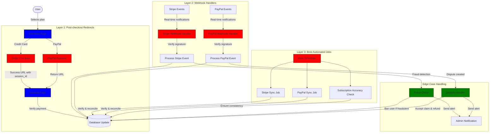
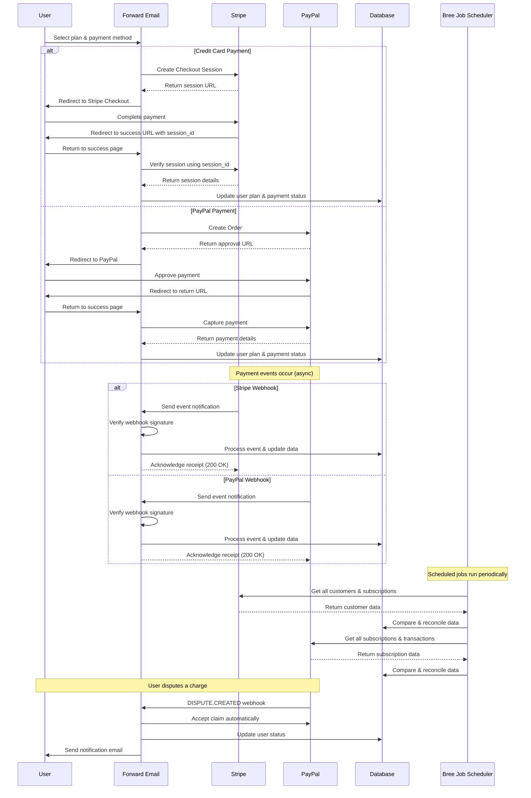
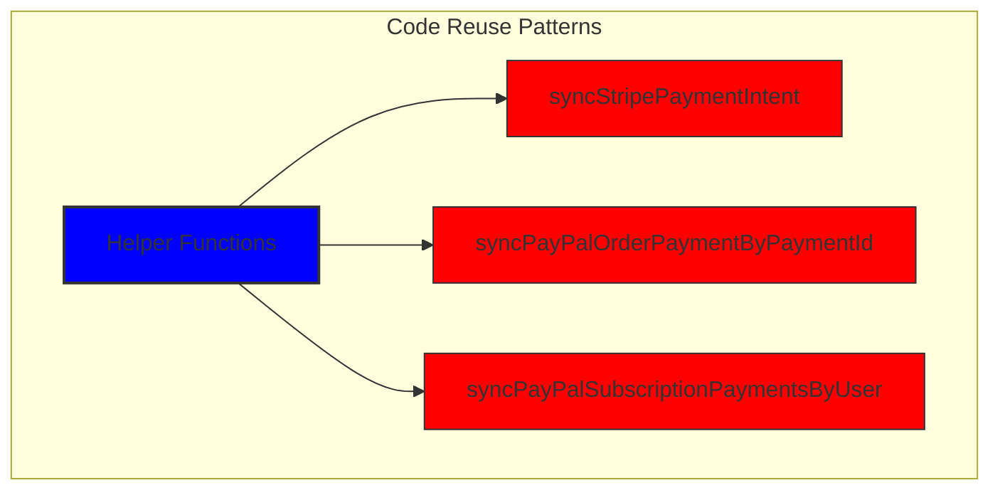
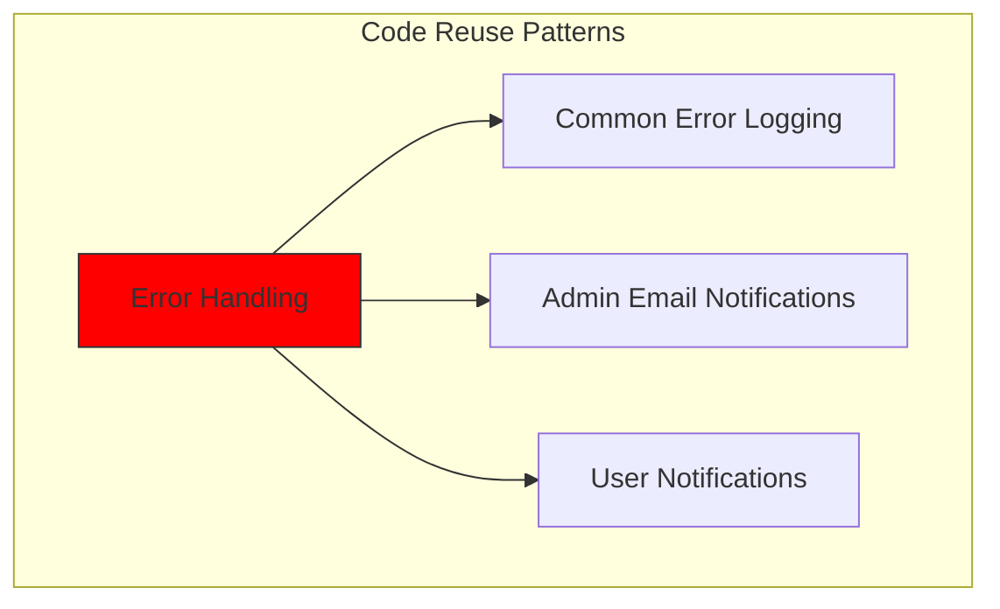
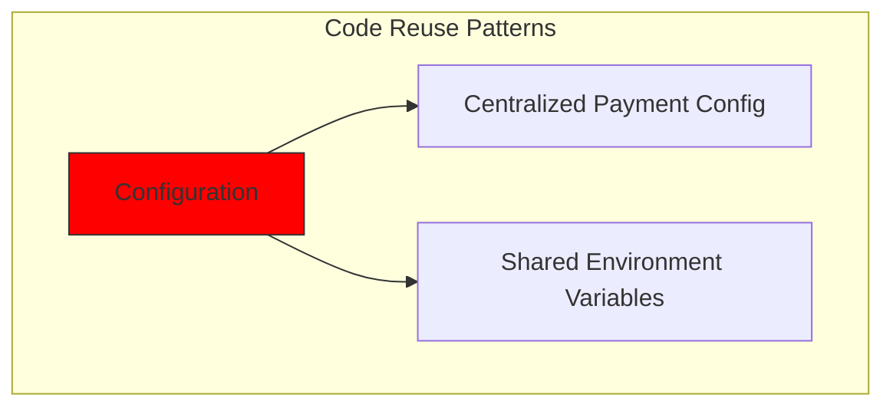
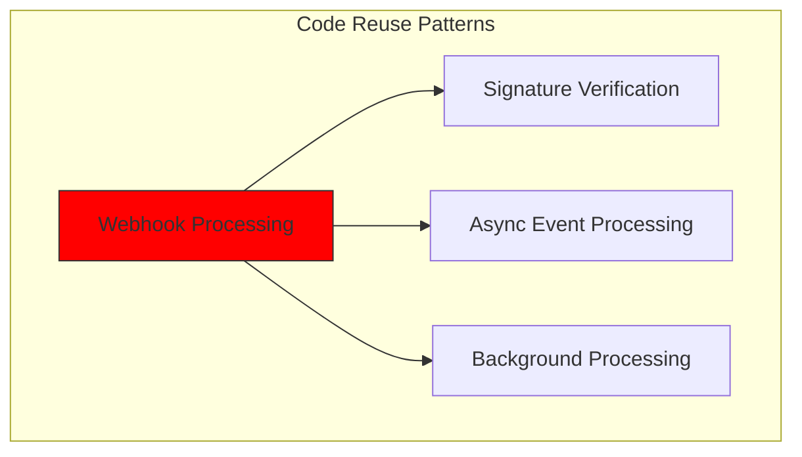
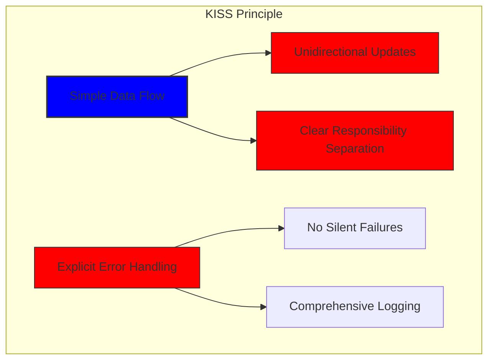
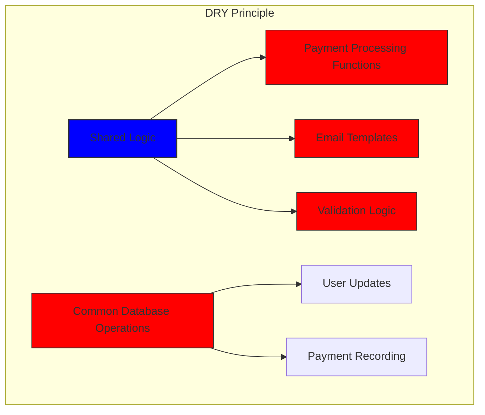

# Cómo construimos un sistema de pago robusto con Stripe y PayPal: un enfoque trifecta {#how-we-built-a-robust-payment-system-with-stripe-and-paypal-a-trifecta-approach}


## Tabla de contenido {#table-of-contents}

* [Prefacio](#foreword)
* [El desafío: múltiples procesadores de pagos, una sola fuente de verdad](#the-challenge-multiple-payment-processors-one-source-of-truth)
* [El enfoque Trifecta: tres niveles de confiabilidad](#the-trifecta-approach-three-layers-of-reliability)
* [Capa 1: Redirecciones posteriores al pago](#layer-1-post-checkout-redirects)
  * [Implementación de Stripe Checkout](#stripe-checkout-implementation)
  * [Flujo de pago de PayPal](#paypal-payment-flow)
* [Capa 2: Controladores de webhook con verificación de firma](#layer-2-webhook-handlers-with-signature-verification)
  * [Implementación del webhook de Stripe](#stripe-webhook-implementation)
  * [Implementación del webhook de PayPal](#paypal-webhook-implementation)
* [Capa 3: Trabajos automatizados con Bree](#layer-3-automated-jobs-with-bree)
  * [Comprobador de precisión de suscripciones](#subscription-accuracy-checker)
  * [Sincronización de suscripciones de PayPal](#paypal-subscription-synchronization)
* [Manejo de casos extremos](#handling-edge-cases)
  * [Detección y prevención de fraudes](#fraud-detection-and-prevention)
  * [Manejo de disputas](#dispute-handling)
* [Reutilización de código: principios KISS y DRY](#code-reuse-kiss-and-dry-principles)
* [Implementación de los requisitos de suscripción a VISA](#visa-subscription-requirements-implementation)
  * [Notificaciones automáticas por correo electrónico previas a la renovación](#automated-pre-renewal-email-notifications)
  * [Manejo de casos extremos](#handling-edge-cases-1)
  * [Períodos de prueba y términos de suscripción](#trial-periods-and-subscription-terms)
* [Conclusión: Los beneficios de nuestro enfoque trifecta](#conclusion-the-benefits-of-our-trifecta-approach)

## Prólogo {#foreword}

En Forward Email, siempre hemos priorizado la creación de sistemas fiables, precisos y fáciles de usar. Al implementar nuestro sistema de procesamiento de pagos, sabíamos que necesitábamos una solución que pudiera gestionar múltiples procesadores de pago y, al mismo tiempo, mantener una consistencia perfecta de los datos. Esta entrada de blog detalla cómo nuestro equipo de desarrollo integró Stripe y PayPal mediante un enfoque trifecta que garantiza una precisión 1:1 en tiempo real en todo nuestro sistema.

## El desafío: múltiples procesadores de pagos, una fuente de verdad {#the-challenge-multiple-payment-processors-one-source-of-truth}

Como servicio de correo electrónico centrado en la privacidad, queríamos ofrecer a nuestros usuarios opciones de pago. Algunos prefieren la simplicidad de los pagos con tarjeta de crédito a través de Stripe, mientras que otros valoran la separación adicional que ofrece PayPal. Sin embargo, la compatibilidad con varios procesadores de pago presenta una complejidad significativa:

1. ¿Cómo garantizamos la consistencia de los datos en los diferentes sistemas de pago?
2. ¿Cómo gestionamos casos excepcionales como disputas, reembolsos o pagos fallidos?
3. ¿Cómo mantenemos una única fuente de información veraz en nuestra base de datos?

Nuestra solución fue implementar lo que llamamos el "enfoque trifecta": un sistema de tres capas que proporciona redundancia y garantiza la consistencia de los datos pase lo que pase.

## El enfoque Trifecta: tres capas de confiabilidad {#the-trifecta-approach-three-layers-of-reliability}

Nuestro sistema de pago consta de tres componentes críticos que trabajan juntos para garantizar una sincronización perfecta de datos:

1. **Redirecciones posteriores al pago**: captura de información de pago inmediatamente después del pago.
2. **Gestores de webhooks**: procesamiento de eventos en tiempo real de los procesadores de pagos.
3. **Trabajos automatizados**: verificación y conciliación periódica de los datos de pago.

Profundicemos en cada componente y veamos cómo funcionan juntos.



## Capa 1: Redirecciones posteriores al pago {#layer-1-post-checkout-redirects}

La primera capa de nuestro enfoque trifecta se implementa inmediatamente después de que el usuario complete un pago. Tanto Stripe como PayPal ofrecen mecanismos para redirigir a los usuarios a nuestro sitio web con la información de la transacción.

### Implementación de Stripe Checkout {#stripe-checkout-implementation}

En Stripe, utilizamos su API de Sesiones de Pago para crear una experiencia de pago fluida. Cuando un usuario selecciona un plan y decide pagar con tarjeta de crédito, creamos una Sesión de Pago con URL específicas de éxito y cancelación:

```javascript
const options = {
  mode: paymentType === 'one-time' ? 'payment' : 'subscription',
  customer: ctx.state.user[config.userFields.stripeCustomerID],
  client_reference_id: reference,
  metadata: {
    plan
  },
  line_items: [
    {
      price,
      quantity: 1,
      description
    }
  ],
  locale: config.STRIPE_LOCALES.has(ctx.locale) ? ctx.locale : 'auto',
  cancel_url: `${config.urls.web}${ctx.path}${
    isMakePayment || isEnableAutoRenew ? '' : `/?plan=${plan}`
  }`,
  success_url: `${config.urls.web}${ctx.path}/?${
    isMakePayment || isEnableAutoRenew ? '' : `plan=${plan}&`
  }session_id={CHECKOUT_SESSION_ID}`,
  allow_promotion_codes: true
};

// Create the checkout session and redirect
const session = await stripe.checkout.sessions.create(options);
const redirectTo = session.url;
if (ctx.accepts('html')) {
  ctx.status = 303;
  ctx.redirect(redirectTo);
} else {
  ctx.body = { redirectTo };
}
```

La parte crítica aquí es el parámetro `success_url`, que incluye `session_id` como parámetro de consulta. Cuando Stripe redirige al usuario a nuestro sitio web tras un pago exitoso, podemos usar este ID de sesión para verificar la transacción y actualizar nuestra base de datos en consecuencia.

### Flujo de pago de PayPal {#paypal-payment-flow}

Para PayPal, utilizamos un enfoque similar con su API de pedidos:

```javascript
const requestBody = {
  intent: 'CAPTURE',
  application_context: {
    cancel_url: `${config.urls.web}${ctx.path}${
      isMakePayment || isEnableAutoRenew ? '' : `/?plan=${plan}`
    }`,
    return_url: `${config.urls.web}${ctx.path}/?plan=${plan}`,
    brand_name: 'Forward Email',
    shipping_preference: 'NO_SHIPPING',
    user_action: 'PAY_NOW'
  },
  payer: {
    email_address: ctx.state.user.email
  },
  purchase_units: [
    {
      reference_id: ctx.state.user.id,
      description,
      custom_id: sku,
      invoice_id: reference,
      soft_descriptor: sku,
      amount: {
        currency_code: 'USD',
        value: price,
        breakdown: {
          item_total: {
            currency_code: 'USD',
            value: price
          }
        }
      },
      items: [
        {
          name,
          description,
          sku,
          unit_amount: {
            currency_code: 'USD',
            value: price
          },
          quantity: '1',
          category: 'DIGITAL_GOODS'
        }
      ]
    }
  ]
};
```

Al igual que en Stripe, especificamos los parámetros `return_url` y `cancel_url` para gestionar las redirecciones posteriores al pago. Cuando PayPal redirige al usuario a nuestro sitio web, podemos capturar los detalles del pago y actualizar nuestra base de datos.



## Capa 2: Controladores de webhook con verificación de firma {#layer-2-webhook-handlers-with-signature-verification}

Aunque las redirecciones posteriores al pago funcionan bien en la mayoría de los casos, no son infalibles. Los usuarios podrían cerrar el navegador antes de ser redirigidos, o problemas de red podrían impedir que la redirección se complete. Aquí es donde entran en juego los webhooks.

Tanto Stripe como PayPal ofrecen sistemas de webhooks que envían notificaciones en tiempo real sobre eventos de pago. Hemos implementado robustos controladores de webhooks que verifican la autenticidad de estas notificaciones y las procesan como corresponde.

### Implementación del webhook de Stripe {#stripe-webhook-implementation}

Nuestro controlador de webhook de Stripe verifica la firma de los eventos de webhook entrantes para garantizar que sean legítimos:

```javascript
async function webhook(ctx) {
  const sig = ctx.request.get('stripe-signature');
  // throw an error if something was wrong
  if (!isSANB(sig))
    throw Boom.badRequest(ctx.translateError('INVALID_STRIPE_SIGNATURE'));
  const event = stripe.webhooks.constructEvent(
    ctx.request.rawBody,
    sig,
    env.STRIPE_ENDPOINT_SECRET
  );
  // throw an error if something was wrong
  if (!event)
    throw Boom.badRequest(ctx.translateError('INVALID_STRIPE_SIGNATURE'));
  ctx.logger.info('stripe webhook', { event });
  // return a response to acknowledge receipt of the event
  ctx.body = { received: true };
  // run in background
  processEvent(ctx, event)
    .then()
    .catch((err) => {
      ctx.logger.fatal(err, { event });
      // email admin errors
      emailHelper({
        template: 'alert',
        message: {
          to: config.email.message.from,
          subject: `Error with Stripe Webhook (Event ID ${event.id})`
        },
        locals: {
          message: `<pre><code>${safeStringify(
            parseErr(err),
            null,
            2
          )}</code></pre>`
        }
      })
        .then()
        .catch((err) => ctx.logger.fatal(err, { event }));
    });
}
```

La función `stripe.webhooks.constructEvent` verifica la firma utilizando nuestro secreto de endpoint. Si la firma es válida, procesamos el evento de forma asíncrona para evitar bloquear la respuesta del webhook.

### Implementación del webhook de PayPal {#paypal-webhook-implementation}

De manera similar, nuestro controlador de webhook de PayPal verifica la autenticidad de las notificaciones entrantes:

```javascript
async function webhook(ctx) {
  const response = await promisify(
    paypal.notification.webhookEvent.verify,
    paypal.notification.webhookEvent
  )(ctx.request.headers, ctx.request.body, env.PAYPAL_WEBHOOK_ID);
  // throw an error if something was wrong
  if (!_.isObject(response) || response.verification_status !== 'SUCCESS')
    throw Boom.badRequest(ctx.translateError('INVALID_PAYPAL_SIGNATURE'));
  // return a response to acknowledge receipt of the event
  ctx.body = { received: true };
  // run in background
  processEvent(ctx)
    .then()
    .catch((err) => {
      ctx.logger.fatal(err);
      // email admin errors
      emailHelper({
        template: 'alert',
        message: {
          to: config.email.message.from,
          subject: `Error with PayPal Webhook (Event ID ${ctx.request.body.id})`
        },
        locals: {
          message: `<pre><code>${safeStringify(
            parseErr(err),
            null,
            2
          )}</code></pre>`
        }
      })
        .then()
        .catch((err) => ctx.logger.fatal(err));
    });
}
```

Ambos manejadores de webhooks siguen el mismo patrón: verificar la firma, acusar recibo y procesar el evento de forma asíncrona. Esto garantiza que nunca se nos pase por alto un evento de pago, incluso si falla la redirección posterior al pago.

## Capa 3: Trabajos automatizados con Bree {#layer-3-automated-jobs-with-bree}

La capa final de nuestro enfoque trifecta consiste en un conjunto de tareas automatizadas que verifican y concilian periódicamente los datos de pago. Utilizamos Bree, un programador de tareas para Node.js, para ejecutar estas tareas a intervalos regulares.

### Comprobador de precisión de suscripciones {#subscription-accuracy-checker}

Una de nuestras tareas principales es el verificador de precisión de suscripciones, que garantiza que nuestra base de datos refleje con precisión el estado de la suscripción en Stripe:

```javascript
async function mapper(customer) {
  // wait a second to prevent rate limitation error
  await setTimeout(ms('1s'));
  // check for user on our side
  let user = await Users.findOne({
    [config.userFields.stripeCustomerID]: customer.id
  })
    .lean()
    .exec();
  if (!user) return;
  if (user.is_banned) return;

  // if emails did not match
  if (user.email !== customer.email) {
    logger.info(
      `User email ${user.email} did not match customer email ${customer.email} (${customer.id})`
    );
    customer = await stripe.customers.update(customer.id, {
      email: user.email
    });
    logger.info(`Updated user email to match ${user.email}`);
  }

  // check for active subscriptions
  const [activeSubscriptions, trialingSubscriptions] = await Promise.all([
    stripe.subscriptions.list({
      customer: customer.id,
      status: 'active'
    }),
    stripe.subscriptions.list({
      customer: customer.id,
      status: 'trialing'
    })
  ]);

  // Combine active and trialing subscriptions
  let subscriptions = [
    ...activeSubscriptions.data,
    ...trialingSubscriptions.data
  ];

  // Handle edge case: multiple subscriptions for one user
  if (subscriptions.length > 1) {
    await logger.error(
      new Error(
        `We may need to refund: User had multiple subscriptions ${user.email} (${customer.id})`
      )
    );
    await emailHelper({
      template: 'alert',
      message: {
        to: config.email.message.from,
        subject: `User had multiple subscriptions ${user.email}`
      },
      locals: {
        message: `User ${user.email} (${customer.id}) had multiple subscriptions: ${JSON.stringify(
          subscriptions.map((s) => s.id)
        )}`
      }
    });
  }
}
```

Esta tarea verifica si hay discrepancias entre nuestra base de datos y Stripe, como direcciones de correo electrónico no coincidentes o múltiples suscripciones activas. Si encuentra algún problema, lo registra y envía alertas a nuestro equipo de administración.

### Sincronización de suscripción de PayPal {#paypal-subscription-synchronization}

Tenemos un trabajo similar para las suscripciones de PayPal:

```javascript
async function syncPayPalSubscriptionPayments() {
  const paypalCustomers = await Users.find({
    $or: [
      {
        [config.userFields.paypalSubscriptionID]: { $exists: true, $ne: null }
      },
      {
        [config.userFields.paypalPayerID]: { $exists: true, $ne: null }
      }
    ]
  })
    // sort by newest customers first
    .sort('-created_at')
    .lean()
    .exec();

  await logger.info(
    `Syncing payments for ${paypalCustomers.length} paypal customers`
  );

  // Process each customer and sync their payments
  const errorEmails = await pReduce(
    paypalCustomers,
    // Implementation details...
  );
}
```

Estos trabajos automatizados sirven como nuestra red de seguridad final, garantizando que nuestra base de datos siempre refleje el estado real de las suscripciones y los pagos tanto en Stripe como en PayPal.

## Manejo de casos extremos {#handling-edge-cases}

Un sistema de pagos robusto debe gestionar casos extremos con agilidad. Veamos cómo gestionamos algunos escenarios comunes.

### Detección y prevención de fraudes {#fraud-detection-and-prevention}

Hemos implementado sofisticados mecanismos de detección de fraude que identifican y manejan automáticamente actividades de pago sospechosas:

```javascript
case 'charge.failed': {
  // Get all failed charges in the last 30 days
  const charges = await stripe.charges.list({
    customer: event.data.object.customer,
    created: {
      gte: dayjs().subtract(1, 'month').unix()
    }
  });

  // Filter for declined charges
  const filtered = charges.data.filter(
    (d) => d.status === 'failed' && d.failure_code === 'card_declined'
  );

  // if not more than 5 then return early
  if (filtered.length < 5) break;

  // Check if user has verified domains
  const count = await Domains.countDocuments({
    members: {
      $elemMatch: {
        user: user._id,
        group: 'admin'
      }
    },
    plan: { $in: ['enhanced_protection', 'team'] },
    has_txt_record: true
  });

  if (!user.is_banned) {
    // If no verified domains, ban the user and refund all charges
    if (count === 0) {
      // Ban the user
      user.is_banned = true;
      await user.save();

      // Refund all successful charges
    }
  }
}
```

Este código prohíbe automáticamente a los usuarios que tienen múltiples cargos fallidos y ningún dominio verificado, lo que es un fuerte indicador de actividad fraudulenta.

### Manejo de disputas {#dispute-handling}

Cuando un usuario disputa un cargo, automáticamente aceptamos el reclamo y tomamos las medidas apropiadas:

```javascript
case 'CUSTOMER.DISPUTE.CREATED': {
  // accept claim
  const agent = await paypalAgent();
  await agent
    .post(`/v1/customer/disputes/${body.resource.dispute_id}/accept-claim`)
    .send({
      note: 'Full refund to the customer.'
    });

  // Find the payment in our database
  const payment = await Payments.findOne({ $or });
  if (!payment) throw new Error('Payment does not exist');

  const user = await Users.findById(payment.user);
  if (!user) throw new Error('User did not exist for customer');

  // Cancel the user's subscription if they have one
  if (isSANB(user[config.userFields.paypalSubscriptionID])) {
    try {
      const agent = await paypalAgent();
      await agent.post(
        `/v1/billing/subscriptions/${
          user[config.userFields.paypalSubscriptionID]
        }/cancel`
      );
    } catch (err) {
      // Handle subscription cancellation errors
    }
  }
}
```

Este enfoque minimiza el impacto de las disputas en nuestro negocio y al mismo tiempo garantiza una buena experiencia del cliente.

## Reutilización de código: Principios KISS y DRY {#code-reuse-kiss-and-dry-principles}

En todo nuestro sistema de pagos, nos hemos adherido a los principios KISS (Keep It Simple, Stupid) y DRY (Don't Repeat Yourself). Aquí tienes algunos ejemplos:

1. **Funciones auxiliares compartidas**: Hemos creado funciones auxiliares reutilizables para tareas comunes como sincronizar pagos y enviar correos electrónicos.

2. **Manejo de errores consistente**: Los controladores de webhook de Stripe y PayPal utilizan el mismo patrón para el manejo de errores y las notificaciones de administrador.

3. **Esquema de base de datos unificado**: Nuestro esquema de base de datos está diseñado para admitir datos de Stripe y PayPal, con campos comunes para el estado del pago, el monto y la información del plan.

4. **Configuración centralizada**: La configuración relacionada con los pagos está centralizada en un solo archivo, lo que facilita la actualización de precios e información del producto.













## Implementación de requisitos de suscripción de VISA {#visa-subscription-requirements-implementation}

Además de nuestro enfoque tripartito, hemos implementado funciones específicas para cumplir con los requisitos de suscripción de VISA y, al mismo tiempo, mejorar la experiencia del usuario. Un requisito clave de VISA es que los usuarios deben recibir una notificación antes de que se les cobre una suscripción, especialmente al pasar de una suscripción de prueba a una de pago.

### Notificaciones automáticas por correo electrónico previas a la renovación {#automated-pre-renewal-email-notifications}

Hemos desarrollado un sistema automatizado que identifica a los usuarios con suscripciones de prueba activas y les envía una notificación por correo electrónico antes de su primer cargo. Esto no solo nos permite cumplir con los requisitos de VISA, sino que también reduce las devoluciones de cargos y mejora la satisfacción del cliente.

Así es como implementamos esta función:

```javascript
// Find users with trial subscriptions who haven't received a notification yet
const users = await Users.find({
  $or: [
    {
      $and: [
        { [config.userFields.stripeSubscriptionID]: { $exists: true } },
        { [config.userFields.stripeTrialSentAt]: { $exists: false } },
        // Exclude subscriptions that have already had payments
        ...(paidStripeSubscriptionIds.length > 0
          ? [
              {
                [config.userFields.stripeSubscriptionID]: {
                  $nin: paidStripeSubscriptionIds
                }
              }
            ]
          : [])
      ]
    },
    {
      $and: [
        { [config.userFields.paypalSubscriptionID]: { $exists: true } },
        { [config.userFields.paypalTrialSentAt]: { $exists: false } },
        // Exclude subscriptions that have already had payments
        ...(paidPayPalSubscriptionIds.length > 0
          ? [
              {
                [config.userFields.paypalSubscriptionID]: {
                  $nin: paidPayPalSubscriptionIds
                }
              }
            ]
          : [])
      ]
    }
  ]
});

// Process each user and send notification
for (const user of users) {
  // Get subscription details from payment processor
  const subscription = await getSubscriptionDetails(user);

  // Calculate subscription duration and frequency
  const duration = getDurationFromPlanId(subscription.plan_id);
  const frequency = getHumanReadableFrequency(duration, user.locale);
  const amount = getPlanAmount(user.plan, duration);

  // Get user's domains for personalized email
  const domains = await Domains.find({
    'members.user': user._id
  }).sort('name').lean().exec();

  // Send VISA-compliant notification email
  await emailHelper({
    template: 'visa-trial-subscription-requirement',
    message: {
      to: user.receipt_email || user.email,
      ...(user.receipt_email ? { cc: user.email } : {})
    },
    locals: {
      user,
      firstChargeDate: new Date(subscription.start_time),
      frequency,
      formattedAmount: numeral(amount).format('$0,0,0.00'),
      domains
    }
  });

  // Record that notification was sent
  await Users.findByIdAndUpdate(user._id, {
    $set: {
      [config.userFields.paypalTrialSentAt]: new Date()
    }
  });
}
```

Esta implementación garantiza que los usuarios estén siempre informados sobre los próximos cargos, con detalles claros sobre:

1. Cuándo se realizará el primer cobro
2. La frecuencia de los cobros futuros (mensuales, anuales, etc.)
3. El importe exacto que se les cobrará
4. Qué dominios están cubiertos por su suscripción

Al automatizar este proceso, mantenemos un perfecto cumplimiento con los requisitos de VISA (que exigen notificación al menos 7 días antes del cobro) al tiempo que reducimos las consultas de soporte y mejoramos la experiencia general del usuario.

### Manejo de casos extremos {#handling-edge-cases-1}

Nuestra implementación también incluye un sólido sistema de gestión de errores. Si algo falla durante el proceso de notificación, nuestro sistema alerta automáticamente a nuestro equipo:

```javascript
try {
  await mapper(user);
} catch (err) {
  logger.error(err);

  // Send alert to administrators
  await emailHelper({
    template: 'alert',
    message: {
      to: config.email.message.from,
      subject: 'VISA Trial Subscription Requirement Error'
    },
    locals: {
      message: `<pre><code>${safeStringify(
        parseErr(err),
        null,
        2
      )}</code></pre>`
    }
  });
}
```

Esto garantiza que incluso si hay un problema con el sistema de notificación, nuestro equipo puede abordarlo rápidamente y mantener el cumplimiento de los requisitos de VISA.

El sistema de notificación de suscripciones de VISA es otro ejemplo de cómo hemos construido nuestra infraestructura de pagos teniendo en cuenta tanto el cumplimiento como la experiencia del usuario, complementando nuestro enfoque trifecta para garantizar un procesamiento de pagos confiable y transparente.

### Períodos de prueba y términos de suscripción {#trial-periods-and-subscription-terms}

Para los usuarios que habilitan la renovación automática en planes existentes, calculamos el período de prueba adecuado para garantizar que no se les cobre hasta que expire su plan actual:

```javascript
if (
  isEnableAutoRenew &&
  dayjs(ctx.state.user[config.userFields.planExpiresAt]).isAfter(
    dayjs()
  )
) {
  const hours = dayjs(
    ctx.state.user[config.userFields.planExpiresAt]
  ).diff(dayjs(), 'hours');

  // Handle trial period calculation
}
```

También proporcionamos información clara sobre los términos de suscripción, incluida la frecuencia de facturación y las políticas de cancelación, e incluimos metadatos detallados con cada suscripción para garantizar un seguimiento y una gestión adecuados.

## Conclusión: Los beneficios de nuestro enfoque trifecta {#conclusion-the-benefits-of-our-trifecta-approach}

Nuestro enfoque trifecta para el procesamiento de pagos ha proporcionado varios beneficios clave:

1. **Confiabilidad**: Al implementar tres capas de verificación de pago, garantizamos que ningún pago se pierda o se procese incorrectamente.

2. **Precisión**: Nuestra base de datos siempre refleja el estado real de las suscripciones y pagos tanto en Stripe como en PayPal.

3. **Flexibilidad**: Los usuarios pueden elegir su método de pago preferido sin comprometer la confiabilidad de nuestro sistema.

4. **Robustez**: Nuestro sistema maneja casos extremos con elegancia, desde fallas de red hasta actividades fraudulentas.

Si está implementando un sistema de pago compatible con varios procesadores, le recomendamos encarecidamente este enfoque tripartito. Requiere un mayor esfuerzo de desarrollo inicial, pero los beneficios a largo plazo en términos de fiabilidad y precisión valen la pena.

Para obtener más información sobre Forward Email y nuestros servicios de correo electrónico centrados en la privacidad, visite nuestro [sitio web](https://forwardemail.net).

<!-- *Palabras clave: procesamiento de pagos, integración de Stripe, integración de PayPal, manejo de webhooks, sincronización de pagos, gestión de suscripciones, prevención de fraudes, manejo de disputas, sistema de pago Node.js, sistema de pago multiprocesador, integración de pasarela de pagos, verificación de pagos en tiempo real, consistencia de datos de pago, facturación de suscripciones, seguridad de pagos, automatización de pagos, webhooks de pago, conciliación de pagos, casos límite de pago, manejo de errores de pago, requisitos de suscripción de VISA, notificaciones previas a la renovación, cumplimiento de suscripciones* -->