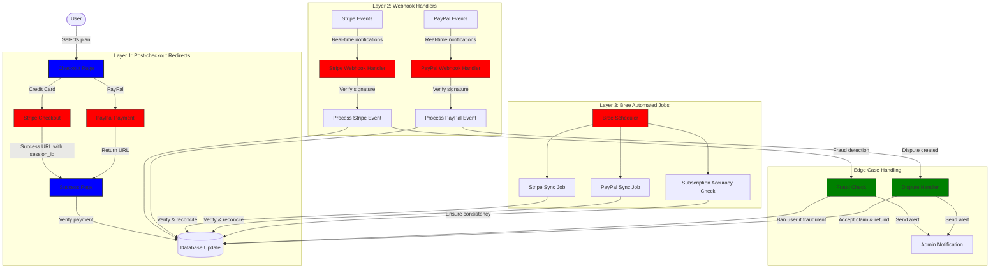
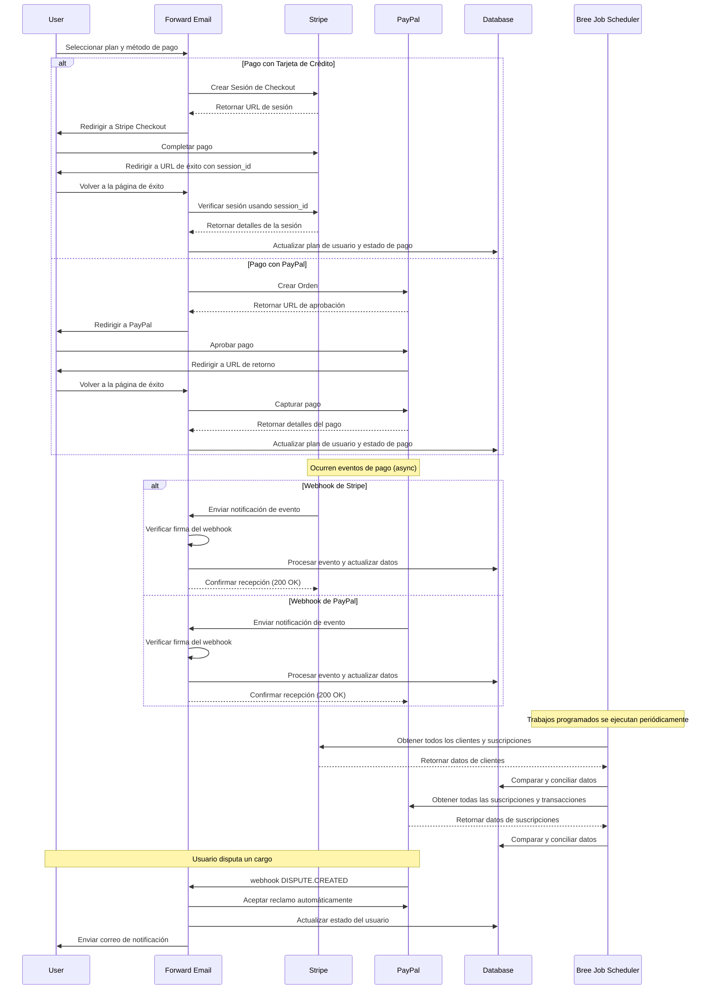
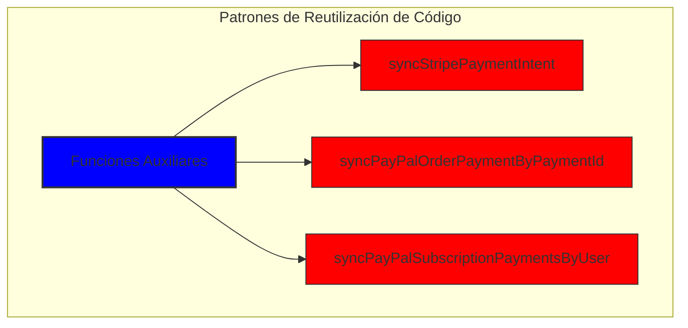
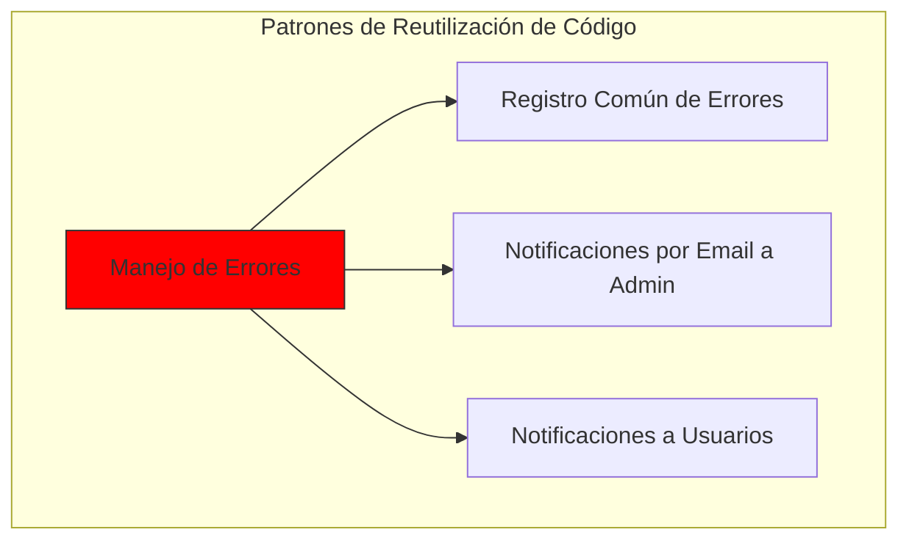
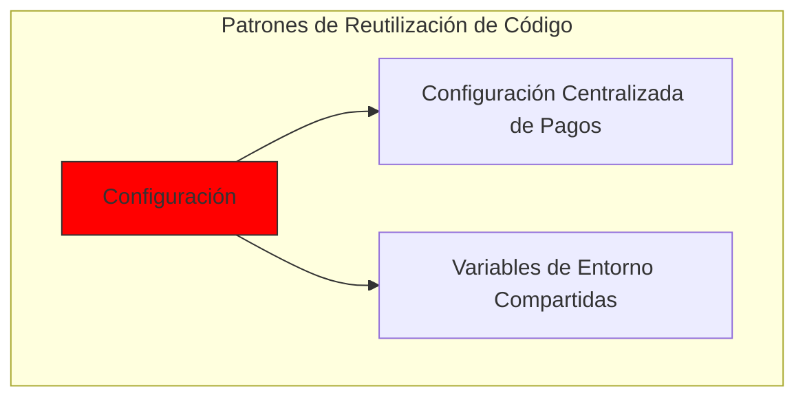
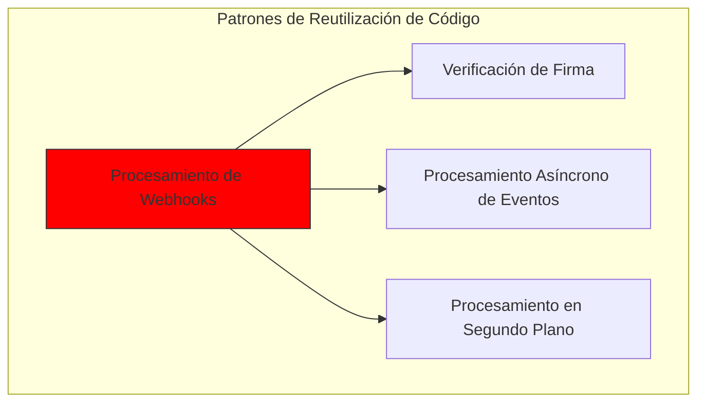
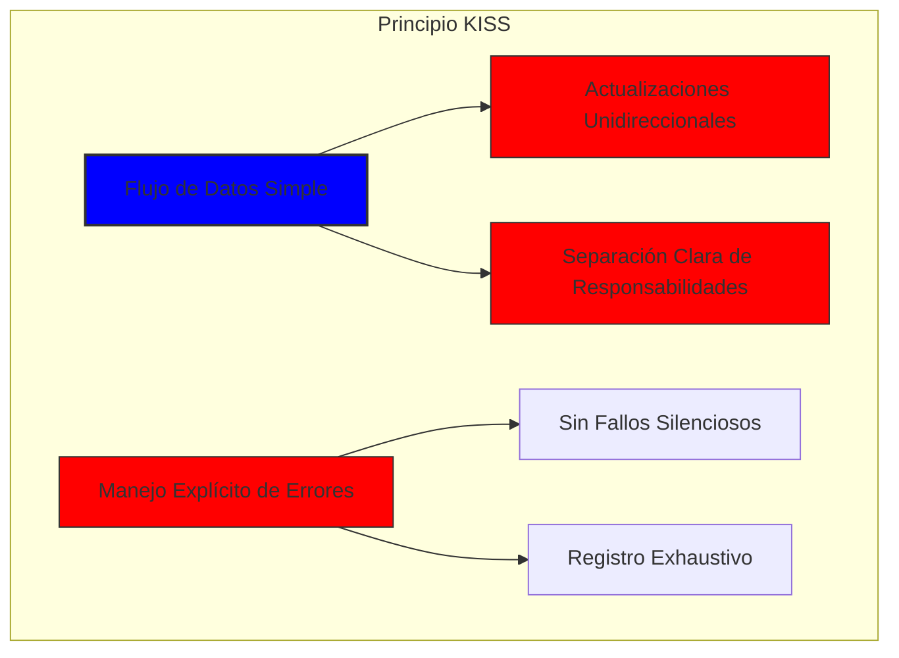

# Cómo Construimos un Sistema de Pago Robusto con Stripe y PayPal: Un Enfoque de Trifecta {#how-we-built-a-robust-payment-system-with-stripe-and-paypal-a-trifecta-approach}


## Tabla de Contenidos {#table-of-contents}

* [Prólogo](#foreword)
* [El Desafío: Múltiples Procesadores de Pago, Una Fuente de Verdad](#the-challenge-multiple-payment-processors-one-source-of-truth)
* [El Enfoque de Trifecta: Tres Capas de Confiabilidad](#the-trifecta-approach-three-layers-of-reliability)
* [Capa 1: Redirecciones Post-Checkout](#layer-1-post-checkout-redirects)
  * [Implementación de Stripe Checkout](#stripe-checkout-implementation)
  * [Flujo de Pago con PayPal](#paypal-payment-flow)
* [Capa 2: Manejadores de Webhooks con Verificación de Firma](#layer-2-webhook-handlers-with-signature-verification)
  * [Implementación de Webhook de Stripe](#stripe-webhook-implementation)
  * [Implementación de Webhook de PayPal](#paypal-webhook-implementation)
* [Capa 3: Trabajos Automatizados con Bree](#layer-3-automated-jobs-with-bree)
  * [Verificador de Precisión de Suscripciones](#subscription-accuracy-checker)
  * [Sincronización de Suscripciones de PayPal](#paypal-subscription-synchronization)
* [Manejo de Casos Límite](#handling-edge-cases)
  * [Detección y Prevención de Fraudes](#fraud-detection-and-prevention)
  * [Manejo de Disputas](#dispute-handling)
* [Reutilización de Código: Principios KISS y DRY](#code-reuse-kiss-and-dry-principles)
* [Implementación de Requisitos de Suscripción VISA](#visa-subscription-requirements-implementation)
  * [Notificaciones Automatizadas por Email Antes de la Renovación](#automated-pre-renewal-email-notifications)
  * [Manejo de Casos Límite](#handling-edge-cases-1)
  * [Períodos de Prueba y Términos de Suscripción](#trial-periods-and-subscription-terms)
* [Conclusión: Los Beneficios de Nuestro Enfoque de Trifecta](#conclusion-the-benefits-of-our-trifecta-approach)


## Prólogo {#foreword}

En Forward Email, siempre hemos priorizado la creación de sistemas que sean confiables, precisos y fáciles de usar. Cuando llegó el momento de implementar nuestro sistema de procesamiento de pagos, sabíamos que necesitábamos una solución que pudiera manejar múltiples procesadores de pago manteniendo una consistencia perfecta de datos. Esta publicación detalla cómo nuestro equipo de desarrollo integró tanto Stripe como PayPal usando un enfoque de trifecta que garantiza una precisión 1:1 en tiempo real en todo nuestro sistema.


## El Desafío: Múltiples Procesadores de Pago, Una Fuente de Verdad {#the-challenge-multiple-payment-processors-one-source-of-truth}

Como un servicio de correo electrónico enfocado en la privacidad, queríamos ofrecer a nuestros usuarios opciones de pago. Algunos prefieren la simplicidad de los pagos con tarjeta de crédito a través de Stripe, mientras que otros valoran la capa adicional de separación que proporciona PayPal. Sin embargo, soportar múltiples procesadores de pago introduce una complejidad significativa:

1. ¿Cómo aseguramos datos consistentes entre diferentes sistemas de pago?
2. ¿Cómo manejamos casos límite como disputas, reembolsos o pagos fallidos?
3. ¿Cómo mantenemos una única fuente de verdad en nuestra base de datos?

Nuestra solución fue implementar lo que llamamos el "enfoque de trifecta": un sistema de tres capas que proporciona redundancia y asegura la consistencia de datos sin importar lo que suceda.


## El Enfoque de Trifecta: Tres Capas de Confiabilidad {#the-trifecta-approach-three-layers-of-reliability}

Nuestro sistema de pagos consta de tres componentes críticos que trabajan juntos para asegurar una sincronización perfecta de datos:

1. **Redirecciones post-checkout** - Capturando la información de pago inmediatamente después del checkout
2. **Manejadores de webhooks** - Procesando eventos en tiempo real desde los procesadores de pago
3. **Trabajos automatizados** - Verificando y conciliando periódicamente los datos de pago

Vamos a profundizar en cada componente y ver cómo trabajan juntos.


```mermaid
flowchart TD
    User([User]) --> |Selects plan| Checkout[Checkout Page]

    %% Layer 1: Post-checkout redirects
    subgraph "Layer 1: Post-checkout Redirects"
        Checkout --> |Credit Card| Stripe[Stripe Checkout]
        Checkout --> |PayPal| PayPal[PayPal Payment]

        Stripe --> |Success URL with session_id| SuccessPage[Success Page]
        PayPal --> |Return URL| SuccessPage

        SuccessPage --> |Verify payment| Database[(Database Update)]
    end

    %% Layer 2: Webhooks
    subgraph "Layer 2: Webhook Handlers"
        StripeEvents[Stripe Events] --> |Real-time notifications| StripeWebhook[Stripe Webhook Handler]
        PayPalEvents[PayPal Events] --> |Real-time notifications| PayPalWebhook[PayPal Webhook Handler]

        StripeWebhook --> |Verify signature| ProcessStripeEvent[Process Stripe Event]
        PayPalWebhook --> |Verify signature| ProcessPayPalEvent[Process PayPal Event]

        ProcessStripeEvent --> Database
        ProcessPayPalEvent --> Database
    end

    %% Layer 3: Automated jobs
    subgraph "Layer 3: Bree Automated Jobs"
        BreeScheduler[Bree Scheduler] --> StripeSync[Stripe Sync Job]
        BreeScheduler --> PayPalSync[PayPal Sync Job]
        BreeScheduler --> AccuracyCheck[Subscription Accuracy Check]

        StripeSync --> |Verify & reconcile| Database
        PayPalSync --> |Verify & reconcile| Database
        AccuracyCheck --> |Ensure consistency| Database
    end

    %% Edge cases
    subgraph "Edge Case Handling"
        ProcessStripeEvent --> |Fraud detection| FraudCheck[Fraud Check]
        ProcessPayPalEvent --> |Dispute created| DisputeHandler[Dispute Handler]

        FraudCheck --> |Ban user if fraudulent| Database
        DisputeHandler --> |Accept claim & refund| Database

        FraudCheck --> |Send alert| AdminNotification[Admin Notification]
        DisputeHandler --> |Send alert| AdminNotification
    end

    %% Style definitions
    classDef primary fill:blue,stroke:#333,stroke-width:2px;
    classDef secondary fill:red,stroke:#333,stroke-width:1px;
    classDef tertiary fill:green,stroke:#333,stroke-width:1px;

    class Checkout,SuccessPage primary;
    class Stripe,PayPal,StripeWebhook,PayPalWebhook,BreeScheduler secondary;
    class FraudCheck,DisputeHandler tertiary;
```
## Capa 1: Redirecciones Post-Compra {#layer-1-post-checkout-redirects}

La primera capa de nuestro enfoque trifecta ocurre inmediatamente después de que un usuario completa un pago. Tanto Stripe como PayPal proporcionan mecanismos para redirigir a los usuarios de vuelta a nuestro sitio con información de la transacción.

### Implementación de Stripe Checkout {#stripe-checkout-implementation}

Para Stripe, usamos su API de Sesiones de Checkout para crear una experiencia de pago fluida. Cuando un usuario selecciona un plan y elige pagar con tarjeta de crédito, creamos una Sesión de Checkout con URLs específicas de éxito y cancelación:

```javascript
const options = {
  mode: paymentType === 'one-time' ? 'payment' : 'subscription',
  customer: ctx.state.user[config.userFields.stripeCustomerID],
  client_reference_id: reference,
  metadata: {
    plan
  },
  line_items: [
    {
      price,
      quantity: 1,
      description
    }
  ],
  locale: config.STRIPE_LOCALES.has(ctx.locale) ? ctx.locale : 'auto',
  cancel_url: `${config.urls.web}${ctx.path}${
    isMakePayment || isEnableAutoRenew ? '' : `/?plan=${plan}`
  }`,
  success_url: `${config.urls.web}${ctx.path}/?${
    isMakePayment || isEnableAutoRenew ? '' : `plan=${plan}&`
  }session_id={CHECKOUT_SESSION_ID}`,
  allow_promotion_codes: true
};

// Create the checkout session and redirect
const session = await stripe.checkout.sessions.create(options);
const redirectTo = session.url;
if (ctx.accepts('html')) {
  ctx.status = 303;
  ctx.redirect(redirectTo);
} else {
  ctx.body = { redirectTo };
}
```

La parte crítica aquí es el parámetro `success_url`, que incluye el `session_id` como un parámetro de consulta. Cuando Stripe redirige al usuario de vuelta a nuestro sitio después de un pago exitoso, podemos usar este ID de sesión para verificar la transacción y actualizar nuestra base de datos en consecuencia.

### Flujo de Pago con PayPal {#paypal-payment-flow}

Para PayPal, usamos un enfoque similar con su API de Órdenes:

```javascript
const requestBody = {
  intent: 'CAPTURE',
  application_context: {
    cancel_url: `${config.urls.web}${ctx.path}${
      isMakePayment || isEnableAutoRenew ? '' : `/?plan=${plan}`
    }`,
    return_url: `${config.urls.web}${ctx.path}/?plan=${plan}`,
    brand_name: 'Forward Email',
    shipping_preference: 'NO_SHIPPING',
    user_action: 'PAY_NOW'
  },
  payer: {
    email_address: ctx.state.user.email
  },
  purchase_units: [
    {
      reference_id: ctx.state.user.id,
      description,
      custom_id: sku,
      invoice_id: reference,
      soft_descriptor: sku,
      amount: {
        currency_code: 'USD',
        value: price,
        breakdown: {
          item_total: {
            currency_code: 'USD',
            value: price
          }
        }
      },
      items: [
        {
          name,
          description,
          sku,
          unit_amount: {
            currency_code: 'USD',
            value: price
          },
          quantity: '1',
          category: 'DIGITAL_GOODS'
        }
      ]
    }
  ]
};
```

Similar a Stripe, especificamos los parámetros `return_url` y `cancel_url` para manejar las redirecciones post-pago. Cuando PayPal redirige al usuario de vuelta a nuestro sitio, podemos capturar los detalles del pago y actualizar nuestra base de datos.


```mermaid
sequenceDiagram
    participant User
    participant FE as Forward Email
    participant Stripe
    participant PayPal
    participant DB as Database
    participant Bree as Bree Job Scheduler

    %% Initial checkout flow
    User->>FE: Seleccionar plan y método de pago

    alt Pago con Tarjeta de Crédito
        FE->>Stripe: Crear Sesión de Checkout
        Stripe-->>FE: Retornar URL de sesión
        FE->>User: Redirigir a Stripe Checkout
        User->>Stripe: Completar pago
        Stripe->>User: Redirigir a URL de éxito con session_id
        User->>FE: Volver a la página de éxito
        FE->>Stripe: Verificar sesión usando session_id
        Stripe-->>FE: Retornar detalles de la sesión
        FE->>DB: Actualizar plan de usuario y estado de pago
    else Pago con PayPal
        FE->>PayPal: Crear Orden
        PayPal-->>FE: Retornar URL de aprobación
        FE->>User: Redirigir a PayPal
        User->>PayPal: Aprobar pago
        PayPal->>User: Redirigir a URL de retorno
        User->>FE: Volver a la página de éxito
        FE->>PayPal: Capturar pago
        PayPal-->>FE: Retornar detalles del pago
        FE->>DB: Actualizar plan de usuario y estado de pago
    end

    %% Webhook flow (asynchronous)
    Note over Stripe,PayPal: Ocurren eventos de pago (async)

    alt Webhook de Stripe
        Stripe->>FE: Enviar notificación de evento
        FE->>FE: Verificar firma del webhook
        FE->>DB: Procesar evento y actualizar datos
        FE-->>Stripe: Confirmar recepción (200 OK)
    else Webhook de PayPal
        PayPal->>FE: Enviar notificación de evento
        FE->>FE: Verificar firma del webhook
        FE->>DB: Procesar evento y actualizar datos
        FE-->>PayPal: Confirmar recepción (200 OK)
    end

    %% Trabajos automatizados de Bree
    Note over Bree: Trabajos programados se ejecutan periódicamente

    Bree->>Stripe: Obtener todos los clientes y suscripciones
    Stripe-->>Bree: Retornar datos de clientes
    Bree->>DB: Comparar y conciliar datos

    Bree->>PayPal: Obtener todas las suscripciones y transacciones
    PayPal-->>Bree: Retornar datos de suscripciones
    Bree->>DB: Comparar y conciliar datos

    %% Caso límite: Manejo de disputas
    Note over User,PayPal: Usuario disputa un cargo

    PayPal->>FE: webhook DISPUTE.CREATED
    FE->>PayPal: Aceptar reclamo automáticamente
    FE->>DB: Actualizar estado del usuario
    FE->>User: Enviar correo de notificación
```
## Capa 2: Manejadores de Webhook con Verificación de Firma {#layer-2-webhook-handlers-with-signature-verification}

Aunque las redirecciones post-checkout funcionan bien para la mayoría de los escenarios, no son infalibles. Los usuarios podrían cerrar su navegador antes de ser redirigidos, o problemas de red podrían impedir que la redirección se complete. Ahí es donde entran los webhooks.

Tanto Stripe como PayPal proporcionan sistemas de webhook que envían notificaciones en tiempo real sobre eventos de pago. Hemos implementado manejadores de webhook robustos que verifican la autenticidad de estas notificaciones y las procesan en consecuencia.

### Implementación del Webhook de Stripe {#stripe-webhook-implementation}

Nuestro manejador de webhook de Stripe verifica la firma de los eventos entrantes para asegurarse de que sean legítimos:

```javascript
async function webhook(ctx) {
  const sig = ctx.request.get('stripe-signature');
  // lanzar un error si algo está mal
  if (!isSANB(sig))
    throw Boom.badRequest(ctx.translateError('INVALID_STRIPE_SIGNATURE'));
  const event = stripe.webhooks.constructEvent(
    ctx.request.rawBody,
    sig,
    env.STRIPE_ENDPOINT_SECRET
  );
  // lanzar un error si algo está mal
  if (!event)
    throw Boom.badRequest(ctx.translateError('INVALID_STRIPE_SIGNATURE'));
  ctx.logger.info('stripe webhook', { event });
  // devolver una respuesta para reconocer la recepción del evento
  ctx.body = { received: true };
  // ejecutar en segundo plano
  processEvent(ctx, event)
    .then()
    .catch((err) => {
      ctx.logger.fatal(err, { event });
      // enviar correo electrónico al administrador sobre errores
      emailHelper({
        template: 'alert',
        message: {
          to: config.email.message.from,
          subject: `Error with Stripe Webhook (Event ID ${event.id})`
        },
        locals: {
          message: `<pre><code>${safeStringify(
            parseErr(err),
            null,
            2
          )}</code></pre>`
        }
      })
        .then()
        .catch((err) => ctx.logger.fatal(err, { event }));
    });
}
```

La función `stripe.webhooks.constructEvent` verifica la firma usando nuestro secreto de endpoint. Si la firma es válida, procesamos el evento de forma asíncrona para evitar bloquear la respuesta del webhook.

### Implementación del Webhook de PayPal {#paypal-webhook-implementation}

De manera similar, nuestro manejador de webhook de PayPal verifica la autenticidad de las notificaciones entrantes:

```javascript
async function webhook(ctx) {
  const response = await promisify(
    paypal.notification.webhookEvent.verify,
    paypal.notification.webhookEvent
  )(ctx.request.headers, ctx.request.body, env.PAYPAL_WEBHOOK_ID);
  // lanzar un error si algo está mal
  if (!_.isObject(response) || response.verification_status !== 'SUCCESS')
    throw Boom.badRequest(ctx.translateError('INVALID_PAYPAL_SIGNATURE'));
  // devolver una respuesta para reconocer la recepción del evento
  ctx.body = { received: true };
  // ejecutar en segundo plano
  processEvent(ctx)
    .then()
    .catch((err) => {
      ctx.logger.fatal(err);
      // enviar correo electrónico al administrador sobre errores
      emailHelper({
        template: 'alert',
        message: {
          to: config.email.message.from,
          subject: `Error with PayPal Webhook (Event ID ${ctx.request.body.id})`
        },
        locals: {
          message: `<pre><code>${safeStringify(
            parseErr(err),
            null,
            2
          )}</code></pre>`
        }
      })
        .then()
        .catch((err) => ctx.logger.fatal(err));
    });
}
```

Ambos manejadores de webhook siguen el mismo patrón: verificar la firma, reconocer la recepción y procesar el evento de forma asíncrona. Esto asegura que nunca perdamos un evento de pago, incluso si la redirección post-checkout falla.


## Capa 3: Trabajos Automatizados con Bree {#layer-3-automated-jobs-with-bree}

La capa final de nuestro enfoque trifecta es un conjunto de trabajos automatizados que verifican y concilian periódicamente los datos de pago. Usamos Bree, un programador de trabajos para Node.js, para ejecutar estos trabajos a intervalos regulares.

### Verificador de Precisión de Suscripciones {#subscription-accuracy-checker}

Uno de nuestros trabajos clave es el verificador de precisión de suscripciones, que asegura que nuestra base de datos refleje con exactitud el estado de la suscripción en Stripe:
```javascript
async function mapper(customer) {
  // wait a second to prevent rate limitation error
  await setTimeout(ms('1s'));
  // check for user on our side
  let user = await Users.findOne({
    [config.userFields.stripeCustomerID]: customer.id
  })
    .lean()
    .exec();
  if (!user) return;
  if (user.is_banned) return;

  // if emails did not match
  if (user.email !== customer.email) {
    logger.info(
      `User email ${user.email} did not match customer email ${customer.email} (${customer.id})`
    );
    customer = await stripe.customers.update(customer.id, {
      email: user.email
    });
    logger.info(`Updated user email to match ${user.email}`);
  }

  // check for active subscriptions
  const [activeSubscriptions, trialingSubscriptions] = await Promise.all([
    stripe.subscriptions.list({
      customer: customer.id,
      status: 'active'
    }),
    stripe.subscriptions.list({
      customer: customer.id,
      status: 'trialing'
    })
  ]);

  // Combine active and trialing subscriptions
  let subscriptions = [
    ...activeSubscriptions.data,
    ...trialingSubscriptions.data
  ];

  // Handle edge case: multiple subscriptions for one user
  if (subscriptions.length > 1) {
    await logger.error(
      new Error(
        `We may need to refund: User had multiple subscriptions ${user.email} (${customer.id})`
      )
    );
    await emailHelper({
      template: 'alert',
      message: {
        to: config.email.message.from,
        subject: `User had multiple subscriptions ${user.email}`
      },
      locals: {
        message: `User ${user.email} (${customer.id}) had multiple subscriptions: ${JSON.stringify(
          subscriptions.map((s) => s.id)
        )}`
      }
    });
  }
}
```

This job checks for discrepancies between our database and Stripe, such as mismatched email addresses or multiple active subscriptions. If it finds any issues, it logs them and sends alerts to our admin team.

### PayPal Subscription Synchronization {#paypal-subscription-synchronization}

We have a similar job for PayPal subscriptions:

```javascript
async function syncPayPalSubscriptionPayments() {
  const paypalCustomers = await Users.find({
    $or: [
      {
        [config.userFields.paypalSubscriptionID]: { $exists: true, $ne: null }
      },
      {
        [config.userFields.paypalPayerID]: { $exists: true, $ne: null }
      }
    ]
  })
    // sort by newest customers first
    .sort('-created_at')
    .lean()
    .exec();

  await logger.info(
    `Syncing payments for ${paypalCustomers.length} paypal customers`
  );

  // Process each customer and sync their payments
  const errorEmails = await pReduce(
    paypalCustomers,
    // Implementation details...
  );
}
```

These automated jobs serve as our final safety net, ensuring that our database always reflects the true state of subscriptions and payments in both Stripe and PayPal.


## Handling Edge Cases {#handling-edge-cases}

A robust payment system must handle edge cases gracefully. Let's look at how we handle some common scenarios.

### Fraud Detection and Prevention {#fraud-detection-and-prevention}

We've implemented sophisticated fraud detection mechanisms that automatically identify and handle suspicious payment activities:

```javascript
case 'charge.failed': {
  // Get all failed charges in the last 30 days
  const charges = await stripe.charges.list({
    customer: event.data.object.customer,
    created: {
      gte: dayjs().subtract(1, 'month').unix()
    }
  });

  // Filter for declined charges
  const filtered = charges.data.filter(
    (d) => d.status === 'failed' && d.failure_code === 'card_declined'
  );

  // if not more than 5 then return early
  if (filtered.length < 5) break;

  // Check if user has verified domains
  const count = await Domains.countDocuments({
    members: {
      $elemMatch: {
        user: user._id,
        group: 'admin'
      }
    },
    plan: { $in: ['enhanced_protection', 'team'] },
    has_txt_record: true
  });

  if (!user.is_banned) {
    // If no verified domains, ban the user and refund all charges
    if (count === 0) {
      // Ban the user
      user.is_banned = true;
      await user.save();

      // Refund all successful charges
    }
  }
}
```

Este código bloquea automáticamente a los usuarios que tienen múltiples cargos fallidos y ningún dominio verificado, lo cual es un fuerte indicador de actividad fraudulenta.

### Manejo de Disputas {#dispute-handling}

Cuando un usuario disputa un cargo, aceptamos automáticamente la reclamación y tomamos las acciones apropiadas:

```javascript
case 'CUSTOMER.DISPUTE.CREATED': {
  // aceptar reclamación
  const agent = await paypalAgent();
  await agent
    .post(`/v1/customer/disputes/${body.resource.dispute_id}/accept-claim`)
    .send({
      note: 'Reembolso completo al cliente.'
    });

  // Encontrar el pago en nuestra base de datos
  const payment = await Payments.findOne({ $or });
  if (!payment) throw new Error('El pago no existe');

  const user = await Users.findById(payment.user);
  if (!user) throw new Error('El usuario no existía para el cliente');

  // Cancelar la suscripción del usuario si tiene una
  if (isSANB(user[config.userFields.paypalSubscriptionID])) {
    try {
      const agent = await paypalAgent();
      await agent.post(
        `/v1/billing/subscriptions/${
          user[config.userFields.paypalSubscriptionID]
        }/cancel`
      );
    } catch (err) {
      // Manejar errores de cancelación de suscripción
    }
  }
}
```

Este enfoque minimiza el impacto de las disputas en nuestro negocio mientras asegura una buena experiencia para el cliente.


## Reutilización de Código: Principios KISS y DRY {#code-reuse-kiss-and-dry-principles}

A lo largo de nuestro sistema de pagos, hemos seguido los principios KISS (Keep It Simple, Stupid - Mantenlo Simple, Estúpido) y DRY (Don't Repeat Yourself - No te Repitas). Aquí algunos ejemplos:

1. **Funciones Auxiliares Compartidas**: Hemos creado funciones auxiliares reutilizables para tareas comunes como sincronizar pagos y enviar correos electrónicos.

2. **Manejo Consistente de Errores**: Los manejadores de webhook de Stripe y PayPal usan el mismo patrón para el manejo de errores y notificaciones a administradores.

3. **Esquema Unificado de Base de Datos**: Nuestro esquema de base de datos está diseñado para acomodar datos tanto de Stripe como de PayPal, con campos comunes para estado de pago, monto e información del plan.

4. **Configuración Centralizada**: La configuración relacionada con pagos está centralizada en un solo archivo, facilitando la actualización de precios e información de productos.


```mermaid
graph TD
    subgraph "Patrones de Reutilización de Código"
        A[Funciones Auxiliares] --> B[syncStripePaymentIntent]
        A --> C[syncPayPalOrderPaymentByPaymentId]
        A --> D[syncPayPalSubscriptionPaymentsByUser]
    end

    classDef primary fill:blue,stroke:#333,stroke-width:2px;
    classDef secondary fill:red,stroke:#333,stroke-width:1px;

    class A,P,V primary;
    class B,C,D,E,I,L,Q,R,S,W,X,Y,Z secondary;
```


```mermaid
graph TD
    subgraph "Patrones de Reutilización de Código"
        E[Manejo de Errores] --> F[Registro Común de Errores]
        E --> G[Notificaciones por Email a Admin]
        E --> H[Notificaciones a Usuarios]
    end

    classDef primary fill:blue,stroke:#333,stroke-width:2px;
    classDef secondary fill:red,stroke:#333,stroke-width:1px;

    class A,P,V primary;
    class B,C,D,E,I,L,Q,R,S,W,X,Y,Z secondary;
```


```mermaid
graph TD
    subgraph "Patrones de Reutilización de Código"
        I[Configuración] --> J[Configuración Centralizada de Pagos]
        I --> K[Variables de Entorno Compartidas]
    end

    classDef primary fill:blue,stroke:#333,stroke-width:2px;
    classDef secondary fill:red,stroke:#333,stroke-width:1px;

    class A,P,V primary;
    class B,C,D,E,I,L,Q,R,S,W,X,Y,Z secondary;
```


```mermaid
graph TD
    subgraph "Patrones de Reutilización de Código"
        L[Procesamiento de Webhooks] --> M[Verificación de Firma]
        L --> N[Procesamiento Asíncrono de Eventos]
        L --> O[Procesamiento en Segundo Plano]
    end

    classDef primary fill:blue,stroke:#333,stroke-width:2px;
    classDef secondary fill:red,stroke:#333,stroke-width:1px;

    class A,P,V primary;
    class B,C,D,E,I,L,Q,R,S,W,X,Y,Z secondary;
```


```mermaid
graph TD
    subgraph "Principio KISS"
        P[Flujo de Datos Simple] --> Q[Actualizaciones Unidireccionales]
        P --> R[Separación Clara de Responsabilidades]

        S[Manejo Explícito de Errores] --> T[Sin Fallos Silenciosos]
        S --> U[Registro Exhaustivo]
    end

    classDef primary fill:blue,stroke:#333,stroke-width:2px;
    classDef secondary fill:red,stroke:#333,stroke-width:1px;

    class A,P,V primary;
    class B,C,D,E,I,L,Q,R,S,W,X,Y,Z secondary;
```
graph TD
    subgraph "Principio DRY"
        V[Lógica Compartida] --> W[Funciones de Procesamiento de Pagos]
        V --> X[Plantillas de Email]
        V --> Y[Lógica de Validación]

        Z[Operaciones Comunes de Base de Datos] --> AA[Actualizaciones de Usuario]
        Z --> AB[Registro de Pagos]
    end

    classDef primary fill:blue,stroke:#333,stroke-width:2px;
    classDef secondary fill:red,stroke:#333,stroke-width:1px;

    class A,P,V primary;
    class B,C,D,E,I,L,Q,R,S,W,X,Y,Z secondary;
```


## Implementación de Requisitos de Suscripción VISA {#visa-subscription-requirements-implementation}

Además de nuestro enfoque trifecta, hemos implementado características específicas para cumplir con los requisitos de suscripción de VISA mientras mejoramos la experiencia del usuario. Un requisito clave de VISA es que los usuarios deben ser notificados antes de que se les cobre una suscripción, especialmente al pasar de una prueba a una suscripción pagada.

### Notificaciones Automáticas por Email Antes de la Renovación {#automated-pre-renewal-email-notifications}

Hemos construido un sistema automatizado que identifica a los usuarios con suscripciones de prueba activas y les envía un correo de notificación antes de que ocurra su primer cobro. Esto no solo nos mantiene en cumplimiento con los requisitos de VISA, sino que también reduce las devoluciones de cargo y mejora la satisfacción del cliente.

Así es como implementamos esta función:

```javascript
// Encontrar usuarios con suscripciones de prueba que aún no han recibido una notificación
const users = await Users.find({
  $or: [
    {
      $and: [
        { [config.userFields.stripeSubscriptionID]: { $exists: true } },
        { [config.userFields.stripeTrialSentAt]: { $exists: false } },
        // Excluir suscripciones que ya han tenido pagos
        ...(paidStripeSubscriptionIds.length > 0
          ? [
              {
                [config.userFields.stripeSubscriptionID]: {
                  $nin: paidStripeSubscriptionIds
                }
              }
            ]
          : [])
      ]
    },
    {
      $and: [
        { [config.userFields.paypalSubscriptionID]: { $exists: true } },
        { [config.userFields.paypalTrialSentAt]: { $exists: false } },
        // Excluir suscripciones que ya han tenido pagos
        ...(paidPayPalSubscriptionIds.length > 0
          ? [
              {
                [config.userFields.paypalSubscriptionID]: {
                  $nin: paidPayPalSubscriptionIds
                }
              }
            ]
          : [])
      ]
    }
  ]
});

// Procesar cada usuario y enviar notificación
for (const user of users) {
  // Obtener detalles de la suscripción del procesador de pagos
  const subscription = await getSubscriptionDetails(user);

  // Calcular duración y frecuencia de la suscripción
  const duration = getDurationFromPlanId(subscription.plan_id);
  const frequency = getHumanReadableFrequency(duration, user.locale);
  const amount = getPlanAmount(user.plan, duration);

  // Obtener los dominios del usuario para un email personalizado
  const domains = await Domains.find({
    'members.user': user._id
  }).sort('name').lean().exec();

  // Enviar email de notificación conforme a VISA
  await emailHelper({
    template: 'visa-trial-subscription-requirement',
    message: {
      to: user.receipt_email || user.email,
      ...(user.receipt_email ? { cc: user.email } : {})
    },
    locals: {
      user,
      firstChargeDate: new Date(subscription.start_time),
      frequency,
      formattedAmount: numeral(amount).format('$0,0,0.00'),
      domains
    }
  });

  // Registrar que la notificación fue enviada
  await Users.findByIdAndUpdate(user._id, {
    $set: {
      [config.userFields.paypalTrialSentAt]: new Date()
    }
  });
}
```

Esta implementación asegura que los usuarios siempre estén informados sobre los próximos cargos, con detalles claros sobre:

1. Cuándo ocurrirá el primer cobro
2. La frecuencia de los cargos futuros (mensual, anual, etc.)
3. El monto exacto que se les cobrará
4. Qué dominios están cubiertos por su suscripción

Al automatizar este proceso, mantenemos un cumplimiento perfecto con los requisitos de VISA (que exigen notificación al menos 7 días antes del cobro) mientras reducimos consultas al soporte y mejoramos la experiencia general del usuario.
### Manejo de Casos Límite {#handling-edge-cases-1}

Nuestra implementación también incluye un manejo robusto de errores. Si algo sale mal durante el proceso de notificación, nuestro sistema alerta automáticamente a nuestro equipo:

```javascript
try {
  await mapper(user);
} catch (err) {
  logger.error(err);

  // Enviar alerta a los administradores
  await emailHelper({
    template: 'alert',
    message: {
      to: config.email.message.from,
      subject: 'Error en el Requisito de Suscripción de Prueba VISA'
    },
    locals: {
      message: `<pre><code>${safeStringify(
        parseErr(err),
        null,
        2
      )}</code></pre>`
    }
  });
}
```

Esto asegura que incluso si hay un problema con el sistema de notificaciones, nuestro equipo pueda abordarlo rápidamente y mantener el cumplimiento con los requisitos de VISA.

El sistema de notificación de suscripción VISA es otro ejemplo de cómo hemos construido nuestra infraestructura de pagos pensando tanto en el cumplimiento como en la experiencia del usuario, complementando nuestro enfoque trifecta para asegurar un procesamiento de pagos confiable y transparente.

### Períodos de Prueba y Términos de Suscripción {#trial-periods-and-subscription-terms}

Para los usuarios que habilitan la renovación automática en planes existentes, calculamos el período de prueba adecuado para asegurar que no se les cobre hasta que su plan actual expire:

```javascript
if (
  isEnableAutoRenew &&
  dayjs(ctx.state.user[config.userFields.planExpiresAt]).isAfter(
    dayjs()
  )
) {
  const hours = dayjs(
    ctx.state.user[config.userFields.planExpiresAt]
  ).diff(dayjs(), 'hours');

  // Manejar el cálculo del período de prueba
}
```

También proporcionamos información clara sobre los términos de suscripción, incluyendo la frecuencia de facturación y las políticas de cancelación, e incluimos metadatos detallados con cada suscripción para asegurar un seguimiento y gestión adecuados.


## Conclusión: Los Beneficios de Nuestro Enfoque Trifecta {#conclusion-the-benefits-of-our-trifecta-approach}

Nuestro enfoque trifecta para el procesamiento de pagos ha proporcionado varios beneficios clave:

1. **Confiabilidad**: Al implementar tres capas de verificación de pagos, aseguramos que ningún pago se pierda o procese incorrectamente.

2. **Precisión**: Nuestra base de datos siempre refleja el estado real de las suscripciones y pagos tanto en Stripe como en PayPal.

3. **Flexibilidad**: Los usuarios pueden elegir su método de pago preferido sin comprometer la confiabilidad de nuestro sistema.

4. **Robustez**: Nuestro sistema maneja casos límite con gracia, desde fallos de red hasta actividades fraudulentas.

Si estás implementando un sistema de pagos que soporte múltiples procesadores, recomendamos encarecidamente este enfoque trifecta. Requiere más esfuerzo de desarrollo inicial, pero los beneficios a largo plazo en términos de confiabilidad y precisión valen la pena.

Para más información sobre Forward Email y nuestros servicios de correo electrónico enfocados en la privacidad, visita nuestro [sitio web](https://forwardemail.net).

<!-- *Keywords: payment processing, Stripe integration, PayPal integration, webhook handling, payment synchronization, subscription management, fraud prevention, dispute handling, Node.js payment system, multi-processor payment system, payment gateway integration, real-time payment verification, payment data consistency, subscription billing, payment security, payment automation, payment webhooks, payment reconciliation, payment edge cases, payment error handling, VISA subscription requirements, pre-renewal notifications, subscription compliance* -->
