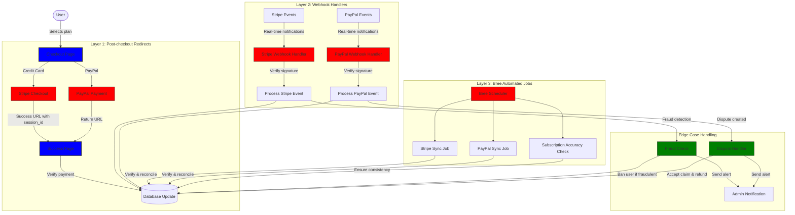
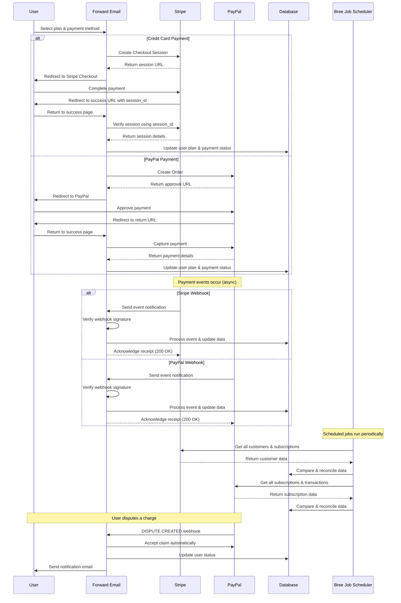
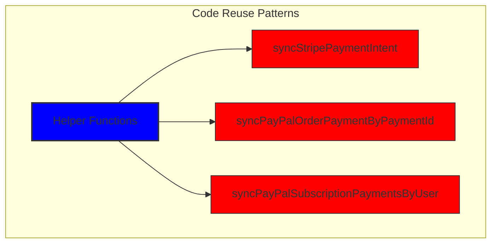
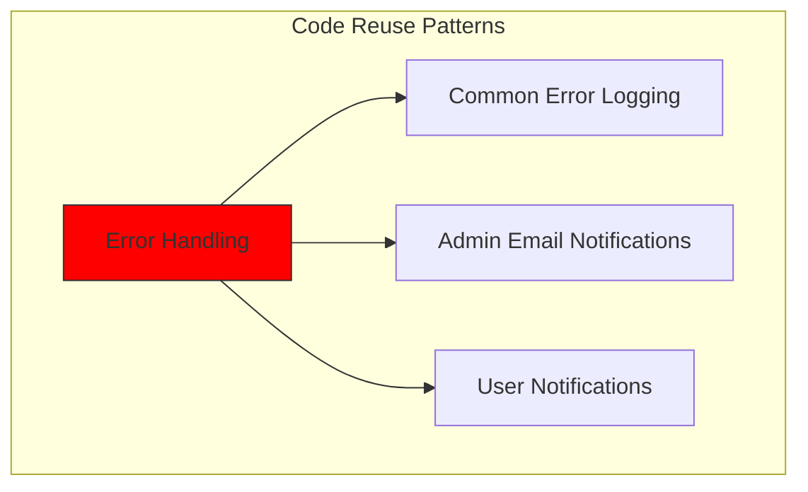
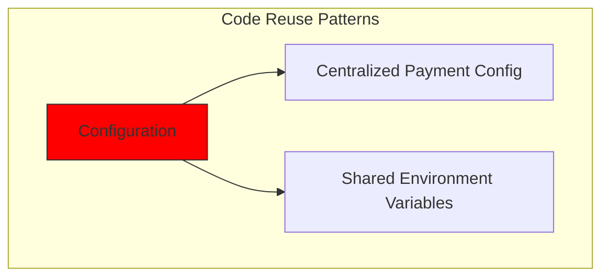
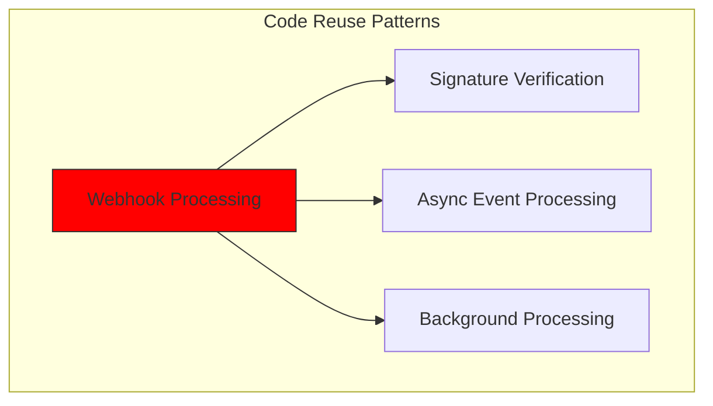
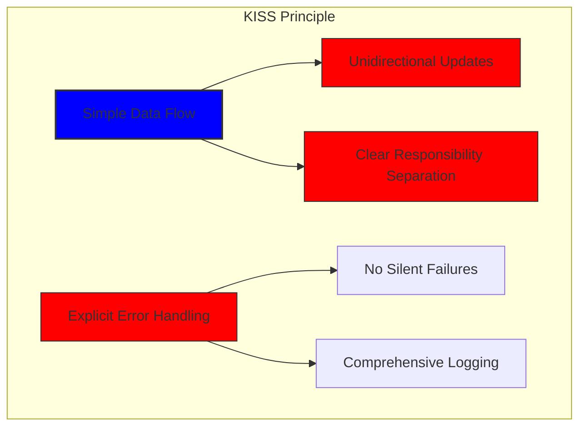
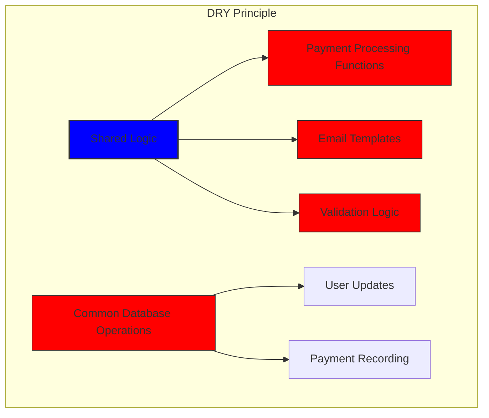

# Kuinka rakensimme vankan maksujärjestelmän Stripen ja PayPalin avulla: Trifecta-lähestymistapa {#how-we-built-a-robust-payment-system-with-stripe-and-paypal-a-trifecta-approach}


## Sisällysluettelo {#table-of-contents}

* [Esipuhe](#foreword)
* [Haaste: Useita maksuprosessoreita, yksi totuuden lähde](#the-challenge-multiple-payment-processors-one-source-of-truth)
* [Trifecta-lähestymistapa: Kolme luotettavuuden tasoa](#the-trifecta-approach-three-layers-of-reliability)
* [Taso 1: Kassan jälkeiset uudelleenohjaukset](#layer-1-post-checkout-redirects)
  * [Stripe Checkoutin toteutus](#stripe-checkout-implementation)
  * [PayPalin maksuvirta](#paypal-payment-flow)
* [Taso 2: Webhook-käsittelijät, joissa on allekirjoituksen vahvistus](#layer-2-webhook-handlers-with-signature-verification)
  * [Stripe Webhook -toteutus](#stripe-webhook-implementation)
  * [PayPal Webhook -toteutus](#paypal-webhook-implementation)
* [Taso 3: Automatisoidut työt Breen kanssa](#layer-3-automated-jobs-with-bree)
  * [Tilauksen tarkkuuden tarkistus](#subscription-accuracy-checker)
  * [PayPal-tilauksen synkronointi](#paypal-subscription-synchronization)
* [Edge-koteloiden käsittely](#handling-edge-cases)
  * [Petosten havaitseminen ja ehkäisy](#fraud-detection-and-prevention)
  * [Riitojen käsittely](#dispute-handling)
* [Koodin uudelleenkäyttö: KISS- ja DRY-periaatteet](#code-reuse-kiss-and-dry-principles)
* [VISA-tilausvaatimusten täytäntöönpano](#visa-subscription-requirements-implementation)
  * [Automaattiset uusimista edeltävät sähköposti-ilmoitukset](#automated-pre-renewal-email-notifications)
  * [Edge-koteloiden käsittely](#handling-edge-cases-1)
  * [Kokeilujaksot ja tilausehdot](#trial-periods-and-subscription-terms)
* [Johtopäätös: Trifecta-lähestymistapamme edut](#conclusion-the-benefits-of-our-trifecta-approach)

## Esipuhe {#foreword}

Forward Emailissa olemme aina asettaneet etusijalle luotettavien, tarkkojen ja käyttäjäystävällisten järjestelmien luomisen. Maksujenkäsittelyjärjestelmämme käyttöönoton yhteydessä tiesimme, että tarvitsemme ratkaisun, joka pystyy käsittelemään useita maksuprosessoreita säilyttäen samalla täydellisen tietojen johdonmukaisuuden. Tässä blogiviestissä kerrotaan, kuinka kehitystiimimme integroi sekä Stripen että PayPalin käyttämällä trifecta-lähestymistapaa, joka varmistaa 1:1 reaaliaikaisen tarkkuuden koko järjestelmässämme.

## Haaste: Useita maksupalveluntarjoajia, yksi totuuden lähde {#the-challenge-multiple-payment-processors-one-source-of-truth}

Tietosuojapainotteisena sähköpostipalveluna halusimme tarjota käyttäjillemme maksuvaihtoehtoja. Jotkut pitävät luottokorttimaksujen yksinkertaisuudesta Stripen kautta, kun taas toiset arvostavat PayPalin tarjoamaa lisäerotustasoa. Useiden maksuprosessorien tukeminen aiheuttaa kuitenkin huomattavaa monimutkaisuutta:

1. Miten varmistamme yhdenmukaisen datan eri maksujärjestelmien välillä?

2. Miten käsittelemme ääritapauksia, kuten riitoja, hyvityksiä tai epäonnistuneita maksuja?

3. Miten ylläpidämme yhtä totuuden lähdettä tietokannassamme?

Ratkaisumme oli ottaa käyttöön "trifecta-lähestymistapa" - kolmikerroksinen järjestelmä, joka tarjoaa redundanssin ja varmistaa tietojen johdonmukaisuuden tapahtumista riippumatta.

## Trifecta-lähestymistapa: Kolme luotettavuuden tasoa {#the-trifecta-approach-three-layers-of-reliability}

Maksujärjestelmämme koostuu kolmesta kriittisestä osasta, jotka toimivat yhdessä varmistaakseen täydellisen tietojen synkronoinnin:

1. **Maksun jälkeiset uudelleenohjaukset** - Maksutietojen kerääminen heti kassan jälkeen
2. **Webhook-käsittelijät** - Maksujen käsittelijöiden reaaliaikaisten tapahtumien käsittely
3. **Automatisoidut työt** - Maksutietojen säännöllinen tarkistaminen ja täsmäyttäminen

Sukellaan jokaiseen komponenttiin ja katsotaan kuinka ne toimivat yhdessä.



## Kerros 1: Maksun jälkeiset uudelleenohjaukset {#layer-1-post-checkout-redirects}

Trifecta-lähestymistapamme ensimmäinen kerros tapahtuu heti, kun käyttäjä on suorittanut maksun. Sekä Stripe että PayPal tarjoavat mekanismeja käyttäjien ohjaamiseksi takaisin sivustollemme tapahtumatietojen kera.

### Stripe Checkout -toteutus {#stripe-checkout-implementation}

Stripen osalta käytämme niiden Checkout Sessions -sovellusliittymää saumattoman maksukokemuksen luomiseen. Kun käyttäjä valitsee suunnitelman ja maksaa luottokortilla, luomme Checkout-istunnon tietyllä menestyksellä ja peruutamme URL-osoitteet:

```javascript
const options = {
  mode: paymentType === 'one-time' ? 'payment' : 'subscription',
  customer: ctx.state.user[config.userFields.stripeCustomerID],
  client_reference_id: reference,
  metadata: {
    plan
  },
  line_items: [
    {
      price,
      quantity: 1,
      description
    }
  ],
  locale: config.STRIPE_LOCALES.has(ctx.locale) ? ctx.locale : 'auto',
  cancel_url: `${config.urls.web}${ctx.path}${
    isMakePayment || isEnableAutoRenew ? '' : `/?plan=${plan}`
  }`,
  success_url: `${config.urls.web}${ctx.path}/?${
    isMakePayment || isEnableAutoRenew ? '' : `plan=${plan}&`
  }session_id={CHECKOUT_SESSION_ID}`,
  allow_promotion_codes: true
};

// Create the checkout session and redirect
const session = await stripe.checkout.sessions.create(options);
const redirectTo = session.url;
if (ctx.accepts('html')) {
  ctx.status = 303;
  ctx.redirect(redirectTo);
} else {
  ctx.body = { redirectTo };
}
```

Kriittinen osa tässä on `success_url` -parametri, joka sisältää `session_id` -parametrin kyselyparametrina. Kun Stripe ohjaa käyttäjän takaisin sivustollemme onnistuneen maksun jälkeen, voimme käyttää tätä istuntotunnusta tapahtuman tarkistamiseen ja tietokantaamme päivittämiseen vastaavasti.

### PayPal-maksuprosessi {#paypal-payment-flow}

PayPalille käytämme samanlaista lähestymistapaa heidän tilaustensa API:n kanssa:

```javascript
const requestBody = {
  intent: 'CAPTURE',
  application_context: {
    cancel_url: `${config.urls.web}${ctx.path}${
      isMakePayment || isEnableAutoRenew ? '' : `/?plan=${plan}`
    }`,
    return_url: `${config.urls.web}${ctx.path}/?plan=${plan}`,
    brand_name: 'Forward Email',
    shipping_preference: 'NO_SHIPPING',
    user_action: 'PAY_NOW'
  },
  payer: {
    email_address: ctx.state.user.email
  },
  purchase_units: [
    {
      reference_id: ctx.state.user.id,
      description,
      custom_id: sku,
      invoice_id: reference,
      soft_descriptor: sku,
      amount: {
        currency_code: 'USD',
        value: price,
        breakdown: {
          item_total: {
            currency_code: 'USD',
            value: price
          }
        }
      },
      items: [
        {
          name,
          description,
          sku,
          unit_amount: {
            currency_code: 'USD',
            value: price
          },
          quantity: '1',
          category: 'DIGITAL_GOODS'
        }
      ]
    }
  ]
};
```

Samoin kuin Stripessä, määritämme `return_url` ja `cancel_url` parametrit maksun jälkeisten uudelleenohjausten käsittelemiseksi. Kun PayPal ohjaa käyttäjän takaisin sivustollemme, voimme tallentaa maksutiedot ja päivittää tietokantaamme.



## Kerros 2: Webhook-käsittelijät allekirjoituksen varmentamalla {#layer-2-webhook-handlers-with-signature-verification}

Vaikka kassan jälkeiset uudelleenohjaukset toimivat hyvin useimmissa skenaarioissa, ne eivät ole idioottivarmoja. Käyttäjät voivat sulkea selaimensa ennen uudelleenohjausta, tai verkko-ongelmat voivat estää uudelleenohjauksen loppuunsaattamisen. Siellä webhookit tulevat käyttöön.

Sekä Stripe että PayPal tarjoavat webhook-järjestelmiä, jotka lähettävät reaaliaikaisia ilmoituksia maksutapahtumista. Olemme ottaneet käyttöön vankat webhook-käsittelijät, jotka varmistavat näiden ilmoitusten aitouden ja käsittelevät ne vastaavasti.

### Stripe Webhookin toteutus {#stripe-webhook-implementation}

Stripe-webhook-käsittelijämme varmistaa saapuvien webhook-tapahtumien allekirjoituksen varmistaakseen, että ne ovat laillisia:

```javascript
async function webhook(ctx) {
  const sig = ctx.request.get('stripe-signature');
  // throw an error if something was wrong
  if (!isSANB(sig))
    throw Boom.badRequest(ctx.translateError('INVALID_STRIPE_SIGNATURE'));
  const event = stripe.webhooks.constructEvent(
    ctx.request.rawBody,
    sig,
    env.STRIPE_ENDPOINT_SECRET
  );
  // throw an error if something was wrong
  if (!event)
    throw Boom.badRequest(ctx.translateError('INVALID_STRIPE_SIGNATURE'));
  ctx.logger.info('stripe webhook', { event });
  // return a response to acknowledge receipt of the event
  ctx.body = { received: true };
  // run in background
  processEvent(ctx, event)
    .then()
    .catch((err) => {
      ctx.logger.fatal(err, { event });
      // email admin errors
      emailHelper({
        template: 'alert',
        message: {
          to: config.email.message.from,
          subject: `Error with Stripe Webhook (Event ID ${event.id})`
        },
        locals: {
          message: `<pre><code>${safeStringify(
            parseErr(err),
            null,
            2
          )}</code></pre>`
        }
      })
        .then()
        .catch((err) => ctx.logger.fatal(err, { event }));
    });
}
```

`stripe.webhooks.constructEvent`-funktio tarkistaa allekirjoituksen käyttämällä päätepisteen salaisuuttamme. Jos allekirjoitus on kelvollinen, käsittelemme tapahtuman asynkronisesti, jotta webhook-vastaus ei estyisi.

### PayPal Webhookin toteutus {#paypal-webhook-implementation}

Samoin PayPal-webhook-käsittelijämme varmistaa saapuvien ilmoitusten aitouden:

```javascript
async function webhook(ctx) {
  const response = await promisify(
    paypal.notification.webhookEvent.verify,
    paypal.notification.webhookEvent
  )(ctx.request.headers, ctx.request.body, env.PAYPAL_WEBHOOK_ID);
  // throw an error if something was wrong
  if (!_.isObject(response) || response.verification_status !== 'SUCCESS')
    throw Boom.badRequest(ctx.translateError('INVALID_PAYPAL_SIGNATURE'));
  // return a response to acknowledge receipt of the event
  ctx.body = { received: true };
  // run in background
  processEvent(ctx)
    .then()
    .catch((err) => {
      ctx.logger.fatal(err);
      // email admin errors
      emailHelper({
        template: 'alert',
        message: {
          to: config.email.message.from,
          subject: `Error with PayPal Webhook (Event ID ${ctx.request.body.id})`
        },
        locals: {
          message: `<pre><code>${safeStringify(
            parseErr(err),
            null,
            2
          )}</code></pre>`
        }
      })
        .then()
        .catch((err) => ctx.logger.fatal(err));
    });
}
```

Molemmat webhook-käsittelijät noudattavat samaa kaavaa: tarkista allekirjoitus, kuittaa vastaanottaminen ja käsittele tapahtuma asynkronisesti. Tämä varmistaa, että emme koskaan menetä maksutapahtumaa, vaikka kassan jälkeinen uudelleenohjaus epäonnistuisi.

## Kerros 3: Automatisoidut työt Breen avulla {#layer-3-automated-jobs-with-bree}

Trifecta-lähestymistapamme viimeinen kerros on joukko automatisoituja töitä, jotka säännöllisesti tarkistavat ja täsmäävät maksutiedot. Käytämme Breeä, Node.js:n työn ajoittajaa, suorittamaan nämä työt säännöllisin väliajoin.

### Tilauksen tarkkuuden tarkistus {#subscription-accuracy-checker}

Yksi tärkeimmistä tehtävistämme on tilauksen tarkkuuden tarkistus, joka varmistaa, että tietokantamme kuvastaa tarkasti tilauksen tilaa Stripessä:

```javascript
async function mapper(customer) {
  // wait a second to prevent rate limitation error
  await setTimeout(ms('1s'));
  // check for user on our side
  let user = await Users.findOne({
    [config.userFields.stripeCustomerID]: customer.id
  })
    .lean()
    .exec();
  if (!user) return;
  if (user.is_banned) return;

  // if emails did not match
  if (user.email !== customer.email) {
    logger.info(
      `User email ${user.email} did not match customer email ${customer.email} (${customer.id})`
    );
    customer = await stripe.customers.update(customer.id, {
      email: user.email
    });
    logger.info(`Updated user email to match ${user.email}`);
  }

  // check for active subscriptions
  const [activeSubscriptions, trialingSubscriptions] = await Promise.all([
    stripe.subscriptions.list({
      customer: customer.id,
      status: 'active'
    }),
    stripe.subscriptions.list({
      customer: customer.id,
      status: 'trialing'
    })
  ]);

  // Combine active and trialing subscriptions
  let subscriptions = [
    ...activeSubscriptions.data,
    ...trialingSubscriptions.data
  ];

  // Handle edge case: multiple subscriptions for one user
  if (subscriptions.length > 1) {
    await logger.error(
      new Error(
        `We may need to refund: User had multiple subscriptions ${user.email} (${customer.id})`
      )
    );
    await emailHelper({
      template: 'alert',
      message: {
        to: config.email.message.from,
        subject: `User had multiple subscriptions ${user.email}`
      },
      locals: {
        message: `User ${user.email} (${customer.id}) had multiple subscriptions: ${JSON.stringify(
          subscriptions.map((s) => s.id)
        )}`
      }
    });
  }
}
```

Tämä työ tarkistaa tietokantamme ja Stripen välisten ristiriitojen varalta, kuten yhteensopimattomia sähköpostiosoitteita tai useita aktiivisia tilauksia. Jos se löytää ongelmia, se kirjaa ne lokiin ja lähettää hälytyksiä järjestelmänvalvojatiimillemme.

### PayPal-tilauksen synkronointi {#paypal-subscription-synchronization}

Meillä on samanlainen työ PayPal-tilauksille:

```javascript
async function syncPayPalSubscriptionPayments() {
  const paypalCustomers = await Users.find({
    $or: [
      {
        [config.userFields.paypalSubscriptionID]: { $exists: true, $ne: null }
      },
      {
        [config.userFields.paypalPayerID]: { $exists: true, $ne: null }
      }
    ]
  })
    // sort by newest customers first
    .sort('-created_at')
    .lean()
    .exec();

  await logger.info(
    `Syncing payments for ${paypalCustomers.length} paypal customers`
  );

  // Process each customer and sync their payments
  const errorEmails = await pReduce(
    paypalCustomers,
    // Implementation details...
  );
}
```

Nämä automatisoidut työt toimivat lopullisena turvaverkkonamme ja varmistavat, että tietokantamme kuvastaa aina tilausten ja maksujen todellista tilaa sekä Stripen että PayPalin kautta.

## Reunatapausten käsittely {#handling-edge-cases}

Tukevan maksujärjestelmän on käsiteltävä reunatapauksia sulavasti. Katsotaanpa, kuinka käsittelemme joitain yleisiä skenaarioita.

### Petosten havaitseminen ja ehkäisy {#fraud-detection-and-prevention}

Olemme ottaneet käyttöön kehittyneitä petosten havaitsemismekanismeja, jotka tunnistavat ja käsittelevät automaattisesti epäilyttävät maksutoiminnot:

```javascript
case 'charge.failed': {
  // Get all failed charges in the last 30 days
  const charges = await stripe.charges.list({
    customer: event.data.object.customer,
    created: {
      gte: dayjs().subtract(1, 'month').unix()
    }
  });

  // Filter for declined charges
  const filtered = charges.data.filter(
    (d) => d.status === 'failed' && d.failure_code === 'card_declined'
  );

  // if not more than 5 then return early
  if (filtered.length < 5) break;

  // Check if user has verified domains
  const count = await Domains.countDocuments({
    members: {
      $elemMatch: {
        user: user._id,
        group: 'admin'
      }
    },
    plan: { $in: ['enhanced_protection', 'team'] },
    has_txt_record: true
  });

  if (!user.is_banned) {
    // If no verified domains, ban the user and refund all charges
    if (count === 0) {
      // Ban the user
      user.is_banned = true;
      await user.save();

      // Refund all successful charges
    }
  }
}
```

Tämä koodi estää automaattisesti käyttäjät, joilla on useita epäonnistuneita maksuja ja joilla ei ole vahvistettuja verkkotunnuksia, mikä on vahva osoitus vilpillisestä toiminnasta.

### Riitojen käsittely {#dispute-handling}

Kun käyttäjä kiistää veloituksen, hyväksymme vaatimuksen automaattisesti ja ryhdymme tarvittaviin toimiin:

```javascript
case 'CUSTOMER.DISPUTE.CREATED': {
  // accept claim
  const agent = await paypalAgent();
  await agent
    .post(`/v1/customer/disputes/${body.resource.dispute_id}/accept-claim`)
    .send({
      note: 'Full refund to the customer.'
    });

  // Find the payment in our database
  const payment = await Payments.findOne({ $or });
  if (!payment) throw new Error('Payment does not exist');

  const user = await Users.findById(payment.user);
  if (!user) throw new Error('User did not exist for customer');

  // Cancel the user's subscription if they have one
  if (isSANB(user[config.userFields.paypalSubscriptionID])) {
    try {
      const agent = await paypalAgent();
      await agent.post(
        `/v1/billing/subscriptions/${
          user[config.userFields.paypalSubscriptionID]
        }/cancel`
      );
    } catch (err) {
      // Handle subscription cancellation errors
    }
  }
}
```

Tämä lähestymistapa minimoi riitojen vaikutuksen liiketoimintaamme ja takaa hyvän asiakaskokemuksen.

## Koodin uudelleenkäyttö: KISS- ja DRY-periaatteet {#code-reuse-kiss-and-dry-principles}

Olemme noudattaneet koko maksujärjestelmässämme KISS (Keep It Simple, Stupid) ja DRY (Don't Repeat Yourself) -periaatteita. Tässä on joitain esimerkkejä:

1. **Jaetut apufunktiot**: Olemme luoneet uudelleenkäytettäviä apufunktioita yleisiin tehtäviin, kuten maksujen synkronointiin ja sähköpostien lähettämiseen.

2. **Johdonmukainen virheiden käsittely**: Sekä Stripen että PayPalin webhook-käsittelijät käyttävät samaa mallia virheiden käsittelyyn ja järjestelmänvalvojan ilmoituksiin.

3. **Yhtenäinen tietokantarakenne**: Tietokantarakenne on suunniteltu sekä Stripen että PayPalin datan käsittelyyn, ja siinä on yhteiset kentät maksun tilalle, summalle ja sopimustiedoille.

4. **Keskitetty konfigurointi**: Maksuihin liittyvä konfigurointi on keskitetty yhteen tiedostoon, mikä helpottaa hinnoittelun ja tuotetietojen päivittämistä.













## VISA-tilausvaatimusten käyttöönotto {#visa-subscription-requirements-implementation}

Trifecta-lähestymistavan lisäksi olemme ottaneet käyttöön erityisiä ominaisuuksia, jotka täyttävät VISAn tilausvaatimukset ja parantavat samalla käyttökokemusta. Yksi VISA:n keskeisistä vaatimuksista on, että käyttäjille on ilmoitettava ennen tilauksen veloittamista, varsinkin kun he siirtyvät kokeilujaksosta maksulliseen tilaukseen.

### Automaattiset sähköposti-ilmoitukset ennen uusimista {#automated-pre-renewal-email-notifications}

Olemme rakentaneet automatisoidun järjestelmän, joka tunnistaa käyttäjät, joilla on aktiivinen kokeilutilaus, ja lähettää heille ilmoituksen sähköpostitse ennen ensimmäistä veloitusta. Tämä ei ainoastaan pidä meidät VISA-vaatimusten mukaisina, vaan myös vähentää takaisinperintöjä ja parantaa asiakastyytyväisyyttä.

Näin otimme tämän ominaisuuden käyttöön:

```javascript
// Find users with trial subscriptions who haven't received a notification yet
const users = await Users.find({
  $or: [
    {
      $and: [
        { [config.userFields.stripeSubscriptionID]: { $exists: true } },
        { [config.userFields.stripeTrialSentAt]: { $exists: false } },
        // Exclude subscriptions that have already had payments
        ...(paidStripeSubscriptionIds.length > 0
          ? [
              {
                [config.userFields.stripeSubscriptionID]: {
                  $nin: paidStripeSubscriptionIds
                }
              }
            ]
          : [])
      ]
    },
    {
      $and: [
        { [config.userFields.paypalSubscriptionID]: { $exists: true } },
        { [config.userFields.paypalTrialSentAt]: { $exists: false } },
        // Exclude subscriptions that have already had payments
        ...(paidPayPalSubscriptionIds.length > 0
          ? [
              {
                [config.userFields.paypalSubscriptionID]: {
                  $nin: paidPayPalSubscriptionIds
                }
              }
            ]
          : [])
      ]
    }
  ]
});

// Process each user and send notification
for (const user of users) {
  // Get subscription details from payment processor
  const subscription = await getSubscriptionDetails(user);

  // Calculate subscription duration and frequency
  const duration = getDurationFromPlanId(subscription.plan_id);
  const frequency = getHumanReadableFrequency(duration, user.locale);
  const amount = getPlanAmount(user.plan, duration);

  // Get user's domains for personalized email
  const domains = await Domains.find({
    'members.user': user._id
  }).sort('name').lean().exec();

  // Send VISA-compliant notification email
  await emailHelper({
    template: 'visa-trial-subscription-requirement',
    message: {
      to: user.receipt_email || user.email,
      ...(user.receipt_email ? { cc: user.email } : {})
    },
    locals: {
      user,
      firstChargeDate: new Date(subscription.start_time),
      frequency,
      formattedAmount: numeral(amount).format('$0,0,0.00'),
      domains
    }
  });

  // Record that notification was sent
  await Users.findByIdAndUpdate(user._id, {
    $set: {
      [config.userFields.paypalTrialSentAt]: new Date()
    }
  });
}
```

Tämä toteutus varmistaa, että käyttäjät ovat aina tietoisia tulevista maksuista ja selkeät tiedot seuraavista:

1. Milloin ensimmäinen veloitus tapahtuu
2. Tulevien veloitusten tiheys (kuukausittain, vuosittain jne.)
3. Tarkka veloitettava summa
4. Mitkä verkkotunnukset tilaukseen kuuluvat

Automatisoimalla tämän prosessin ylläpidämme VISAn vaatimusten täydellistä noudattamista (jotka edellyttävät ilmoitusta vähintään 7 päivää ennen laskutusta) samalla kun vähennämme tukikyselyitä ja parannamme yleistä käyttökokemusta.

### Reunatapausten käsittely {#handling-edge-cases-1}

Toteuksemme sisältää myös tehokkaan virheenkäsittelyn. Jos jokin menee pieleen ilmoitusprosessin aikana, järjestelmämme hälyttää automaattisesti tiimillemme:

```javascript
try {
  await mapper(user);
} catch (err) {
  logger.error(err);

  // Send alert to administrators
  await emailHelper({
    template: 'alert',
    message: {
      to: config.email.message.from,
      subject: 'VISA Trial Subscription Requirement Error'
    },
    locals: {
      message: `<pre><code>${safeStringify(
        parseErr(err),
        null,
        2
      )}</code></pre>`
    }
  });
}
```

Näin varmistetaan, että vaikka ilmoitusjärjestelmässä olisi ongelmia, tiimimme voi korjata sen nopeasti ja noudattaa VISAn vaatimuksia.

VISA-tilausten ilmoitusjärjestelmä on toinen esimerkki siitä, kuinka olemme rakentaneet maksuinfrastruktuurimme sekä vaatimustenmukaisuuden että käyttökokemuksen mukaisesti. Se täydentää trifecta-lähestymistapaamme varmistaaksemme luotettavan ja läpinäkyvän maksujen käsittelyn.

### Kokeilujaksot ja tilausehdot {#trial-periods-and-subscription-terms}

Käyttäjille, jotka mahdollistavat automaattisen uusimisen olemassa olevissa sopimuksissa, laskemme sopivan kokeilujakson varmistaaksemme, että heitä ei veloiteta ennen kuin heidän nykyinen sopimuksensa vanhenee:

```javascript
if (
  isEnableAutoRenew &&
  dayjs(ctx.state.user[config.userFields.planExpiresAt]).isAfter(
    dayjs()
  )
) {
  const hours = dayjs(
    ctx.state.user[config.userFields.planExpiresAt]
  ).diff(dayjs(), 'hours');

  // Handle trial period calculation
}
```

Annamme myös selkeät tiedot tilausehdoista, mukaan lukien laskutustiheydestä ja peruutuskäytännöistä, ja sisällytämme jokaiseen tilaukseen yksityiskohtaiset metatiedot oikean seurannan ja hallinnan varmistamiseksi.

## Yhteenveto: Trifecta-lähestymistapamme edut {#conclusion-the-benefits-of-our-trifecta-approach}

Trifecta-lähestymistapamme maksujen käsittelyyn on tarjonnut useita keskeisiä etuja:

1. **Luotettavuus**: Toteuttamalla kolmikerroksisen maksunvahvistuksen varmistamme, ettei yhtäkään maksua jää huomaamatta tai käsitellä väärin.

2. **Tarkkuus**: Tietokantaamme heijastaa aina tilausten ja maksujen todellista tilaa sekä Stripessä että PayPalissa.

3. **Joustavuus**: Käyttäjät voivat valita haluamansa maksutavan vaarantamatta järjestelmämme luotettavuutta.

4. **Lujuus**: Järjestelmämme käsittelee reunatapaukset sujuvasti verkkohäiriöistä petolliseen toimintaan.

Jos käytät maksujärjestelmää, joka tukee useita prosessoreita, suosittelemme tätä trifecta-lähestymistapaa. Se vaatii enemmän etukäteistä kehitystyötä, mutta pitkän aikavälin hyödyt luotettavuuden ja tarkkuuden osalta ovat sen arvoisia.

Lisätietoja sähköpostin edelleenlähetyksestä ja yksityisyyttä suojaavista sähköpostipalveluistamme on osoitteessa [verkkosivuilla](https://forwardemail.net).

<!-- *Avainsanat: maksujen käsittely, Stripe-integraatio, PayPal-integraatio, webhookien käsittely, maksujen synkronointi, tilausten hallinta, petosten ehkäisy, riitojen käsittely, Node.js-maksujärjestelmä, moniajoinen maksujärjestelmä, maksuyhdyskäytävän integraatio, reaaliaikainen maksun varmennus, maksutietojen yhdenmukaisuus, tilausten laskutus, maksujen turvallisuus, maksuautomaatio, maksujen webhookit, maksujen täsmäytys, maksujen reunatapaukset, maksuvirheiden käsittely, VISA-tilausvaatimukset, uusimista edeltävät ilmoitukset, tilauksen vaatimustenmukaisuus* -->