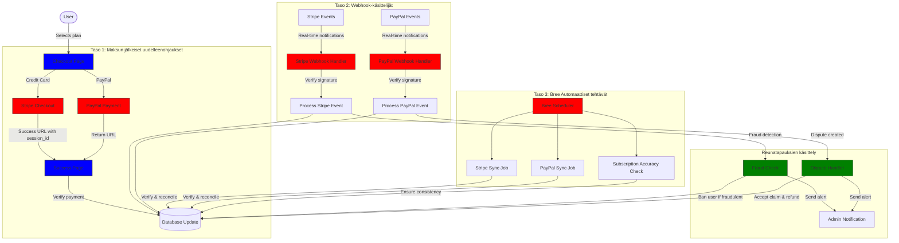
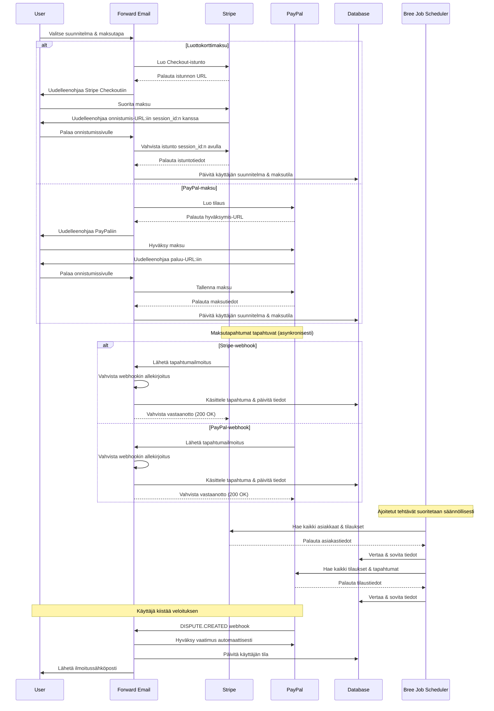
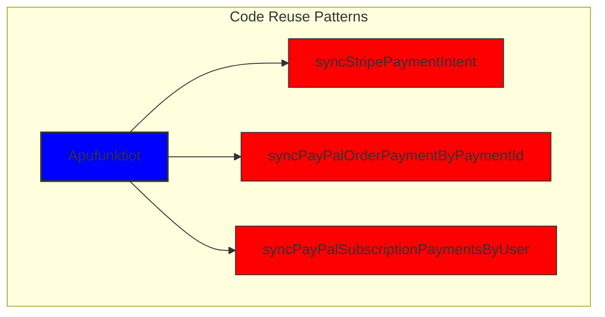
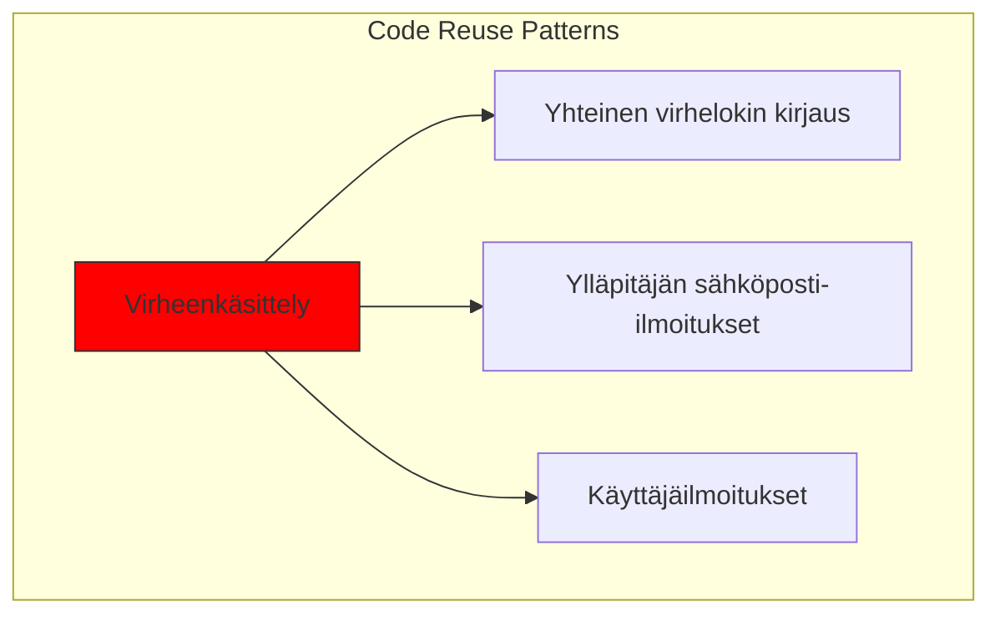
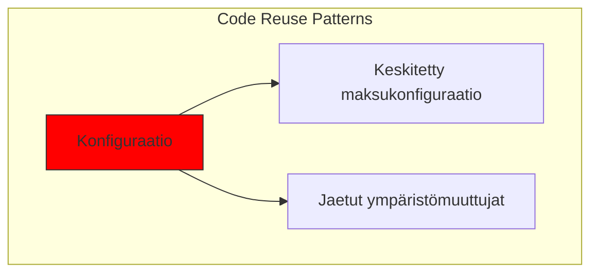
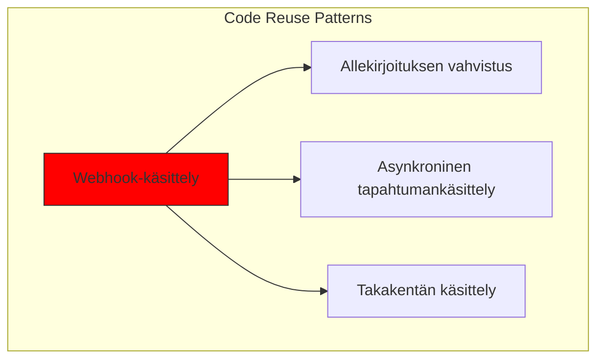
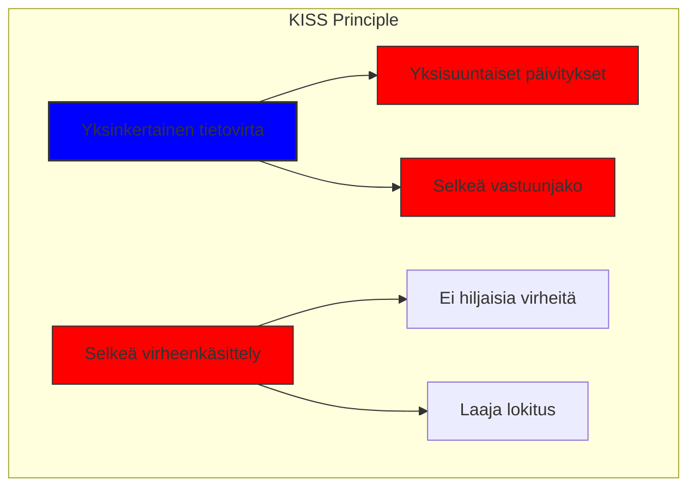

# Kuinka Rakensimme Vankan Maksujärjestelmän Stripe- ja PayPal-in Kanssa: Trifecta-lähestymistapa {#how-we-built-a-robust-payment-system-with-stripe-and-paypal-a-trifecta-approach}


## Sisällysluettelo {#table-of-contents}

* [Esipuhe](#foreword)
* [Haaste: Useita maksunvälittäjiä, yksi totuuden lähde](#the-challenge-multiple-payment-processors-one-source-of-truth)
* [Trifecta-lähestymistapa: Kolme luotettavuuden tasoa](#the-trifecta-approach-three-layers-of-reliability)
* [Taso 1: Maksun jälkeiset uudelleenohjaukset](#layer-1-post-checkout-redirects)
  * [Stripe Checkout -toteutus](#stripe-checkout-implementation)
  * [PayPal-maksuprosessi](#paypal-payment-flow)
* [Taso 2: Webhook-käsittelijät allekirjoituksen varmistuksella](#layer-2-webhook-handlers-with-signature-verification)
  * [Stripe Webhook -toteutus](#stripe-webhook-implementation)
  * [PayPal Webhook -toteutus](#paypal-webhook-implementation)
* [Taso 3: Automaattiset tehtävät Bree:n avulla](#layer-3-automated-jobs-with-bree)
  * [Tilaustarkkuuden tarkistaja](#subscription-accuracy-checker)
  * [PayPal-tilausten synkronointi](#paypal-subscription-synchronization)
* [Reunatapauksien käsittely](#handling-edge-cases)
  * [Petosten tunnistus ja ehkäisy](#fraud-detection-and-prevention)
  * [Riitojen käsittely](#dispute-handling)
* [Koodin uudelleenkäyttö: KISS- ja DRY-periaatteet](#code-reuse-kiss-and-dry-principles)
* [VISA-tilausten vaatimusten toteutus](#visa-subscription-requirements-implementation)
  * [Automaattiset ennakkoilmoitukset sähköpostitse](#automated-pre-renewal-email-notifications)
  * [Reunatapauksien käsittely](#handling-edge-cases-1)
  * [Kokeilujaksot ja tilausehdot](#trial-periods-and-subscription-terms)
* [Yhteenveto: Trifecta-lähestymistapamme hyödyt](#conclusion-the-benefits-of-our-trifecta-approach)


## Esipuhe {#foreword}

Forward Emaililla olemme aina priorisoineet järjestelmien luotettavuuden, tarkkuuden ja käyttäjäystävällisyyden. Kun toteutimme maksujärjestelmäämme, tiesimme tarvitsevamme ratkaisun, joka pystyy käsittelemään useita maksunvälittäjiä säilyttäen täydellisen tietojen yhdenmukaisuuden. Tässä blogikirjoituksessa kerromme, kuinka kehitystiimimme integroi sekä Stripe- että PayPal-maksut trifecta-lähestymistavalla, joka takaa 1:1 reaaliaikaisen tarkkuuden koko järjestelmässämme.


## Haaste: Useita maksunvälittäjiä, yksi totuuden lähde {#the-challenge-multiple-payment-processors-one-source-of-truth}

Yksityisyyteen keskittyvänä sähköpostipalveluna halusimme tarjota käyttäjillemme maksuvaihtoehtoja. Jotkut suosivat Stripe:n kautta tehtäviä luottokorttimaksuja yksinkertaisuuden vuoksi, kun taas toiset arvostavat PayPalin tarjoamaa lisäeristystä. Useiden maksunvälittäjien tukeminen tuo kuitenkin merkittävää monimutkaisuutta:

1. Kuinka varmistamme tietojen yhdenmukaisuuden eri maksujärjestelmien välillä?
2. Kuinka käsittelemme reunatapauksia, kuten riitoja, hyvityksiä tai epäonnistuneita maksuja?
3. Kuinka ylläpidämme yhtä totuuden lähdettä tietokannassamme?

Ratkaisumme oli toteuttaa niin kutsuttu "trifecta-lähestymistapa" – kolmitasoinen järjestelmä, joka tarjoaa redundanssia ja varmistaa tietojen yhdenmukaisuuden tilanteesta riippumatta.


## Trifecta-lähestymistapa: Kolme luotettavuuden tasoa {#the-trifecta-approach-three-layers-of-reliability}

Maksujärjestelmämme koostuu kolmesta kriittisestä osasta, jotka toimivat yhdessä täydellisen tietojen synkronoinnin varmistamiseksi:

1. **Maksun jälkeiset uudelleenohjaukset** – Maksutietojen tallentaminen heti maksun jälkeen
2. **Webhook-käsittelijät** – Maksunvälittäjien reaaliaikaisten tapahtumien käsittely
3. **Automaattiset tehtävät** – Maksutietojen säännöllinen tarkistus ja sovittaminen

Katsotaanpa kutakin osaa ja miten ne toimivat yhdessä.


```mermaid
flowchart TD
    User([User]) --> |Selects plan| Checkout[Checkout Page]

    %% Layer 1: Post-checkout redirects
    subgraph "Taso 1: Maksun jälkeiset uudelleenohjaukset"
        Checkout --> |Credit Card| Stripe[Stripe Checkout]
        Checkout --> |PayPal| PayPal[PayPal Payment]

        Stripe --> |Success URL with session_id| SuccessPage[Success Page]
        PayPal --> |Return URL| SuccessPage

        SuccessPage --> |Verify payment| Database[(Database Update)]
    end

    %% Layer 2: Webhooks
    subgraph "Taso 2: Webhook-käsittelijät"
        StripeEvents[Stripe Events] --> |Real-time notifications| StripeWebhook[Stripe Webhook Handler]
        PayPalEvents[PayPal Events] --> |Real-time notifications| PayPalWebhook[PayPal Webhook Handler]

        StripeWebhook --> |Verify signature| ProcessStripeEvent[Process Stripe Event]
        PayPalWebhook --> |Verify signature| ProcessPayPalEvent[Process PayPal Event]

        ProcessStripeEvent --> Database
        ProcessPayPalEvent --> Database
    end

    %% Layer 3: Automated jobs
    subgraph "Taso 3: Bree Automaattiset tehtävät"
        BreeScheduler[Bree Scheduler] --> StripeSync[Stripe Sync Job]
        BreeScheduler --> PayPalSync[PayPal Sync Job]
        BreeScheduler --> AccuracyCheck[Subscription Accuracy Check]

        StripeSync --> |Verify & reconcile| Database
        PayPalSync --> |Verify & reconcile| Database
        AccuracyCheck --> |Ensure consistency| Database
    end

    %% Edge cases
    subgraph "Reunatapauksien käsittely"
        ProcessStripeEvent --> |Fraud detection| FraudCheck[Fraud Check]
        ProcessPayPalEvent --> |Dispute created| DisputeHandler[Dispute Handler]

        FraudCheck --> |Ban user if fraudulent| Database
        DisputeHandler --> |Accept claim & refund| Database

        FraudCheck --> |Send alert| AdminNotification[Admin Notification]
        DisputeHandler --> |Send alert| AdminNotification
    end

    %% Style definitions
    classDef primary fill:blue,stroke:#333,stroke-width:2px;
    classDef secondary fill:red,stroke:#333,stroke-width:1px;
    classDef tertiary fill:green,stroke:#333,stroke-width:1px;

    class Checkout,SuccessPage primary;
    class Stripe,PayPal,StripeWebhook,PayPalWebhook,BreeScheduler secondary;
    class FraudCheck,DisputeHandler tertiary;
```
## Kerros 1: Maksun jälkeiset uudelleenohjaukset {#layer-1-post-checkout-redirects}

Ensimmäinen kerros kolmivaiheisessa lähestymistavassamme tapahtuu heti käyttäjän suorittaessa maksun. Sekä Stripe että PayPal tarjoavat mekanismeja ohjata käyttäjät takaisin sivustollemme tapahtumatietojen kanssa.

### Stripe Checkout -toteutus {#stripe-checkout-implementation}

Stripen osalta käytämme heidän Checkout Sessions -API:a saumattoman maksukokemuksen luomiseksi. Kun käyttäjä valitsee suunnitelman ja päättää maksaa luottokortilla, luomme Checkout Sessionin, jossa on määritellyt onnistumis- ja peruutus-URL-osoitteet:

```javascript
const options = {
  mode: paymentType === 'one-time' ? 'payment' : 'subscription',
  customer: ctx.state.user[config.userFields.stripeCustomerID],
  client_reference_id: reference,
  metadata: {
    plan
  },
  line_items: [
    {
      price,
      quantity: 1,
      description
    }
  ],
  locale: config.STRIPE_LOCALES.has(ctx.locale) ? ctx.locale : 'auto',
  cancel_url: `${config.urls.web}${ctx.path}${
    isMakePayment || isEnableAutoRenew ? '' : `/?plan=${plan}`
  }`,
  success_url: `${config.urls.web}${ctx.path}/?${
    isMakePayment || isEnableAutoRenew ? '' : `plan=${plan}&`
  }session_id={CHECKOUT_SESSION_ID}`,
  allow_promotion_codes: true
};

// Luo checkout-istunto ja uudelleenohjaa
const session = await stripe.checkout.sessions.create(options);
const redirectTo = session.url;
if (ctx.accepts('html')) {
  ctx.status = 303;
  ctx.redirect(redirectTo);
} else {
  ctx.body = { redirectTo };
}
```

Tärkeä osa tässä on `success_url`-parametri, joka sisältää `session_id`-kyselyparametrina. Kun Stripe ohjaa käyttäjän takaisin sivustollemme onnistuneen maksun jälkeen, voimme käyttää tätä istunnon ID:tä tapahtuman vahvistamiseen ja tietokannan päivittämiseen.

### PayPal-maksuprosessi {#paypal-payment-flow}

PayPalin osalta käytämme samanlaista lähestymistapaa heidän Orders API:n kanssa:

```javascript
const requestBody = {
  intent: 'CAPTURE',
  application_context: {
    cancel_url: `${config.urls.web}${ctx.path}${
      isMakePayment || isEnableAutoRenew ? '' : `/?plan=${plan}`
    }`,
    return_url: `${config.urls.web}${ctx.path}/?plan=${plan}`,
    brand_name: 'Forward Email',
    shipping_preference: 'NO_SHIPPING',
    user_action: 'PAY_NOW'
  },
  payer: {
    email_address: ctx.state.user.email
  },
  purchase_units: [
    {
      reference_id: ctx.state.user.id,
      description,
      custom_id: sku,
      invoice_id: reference,
      soft_descriptor: sku,
      amount: {
        currency_code: 'USD',
        value: price,
        breakdown: {
          item_total: {
            currency_code: 'USD',
            value: price
          }
        }
      },
      items: [
        {
          name,
          description,
          sku,
          unit_amount: {
            currency_code: 'USD',
            value: price
          },
          quantity: '1',
          category: 'DIGITAL_GOODS'
        }
      ]
    }
  ]
};
```

Samoin kuin Stripen kanssa, määrittelemme `return_url`- ja `cancel_url`-parametrit maksun jälkeisten uudelleenohjausten käsittelemiseksi. Kun PayPal ohjaa käyttäjän takaisin sivustollemme, voimme tallentaa maksutiedot ja päivittää tietokantamme.


```mermaid
sequenceDiagram
    participant User
    participant FE as Forward Email
    participant Stripe
    participant PayPal
    participant DB as Database
    participant Bree as Bree Job Scheduler

    %% Alkuperäinen kassavirta
    User->>FE: Valitse suunnitelma & maksutapa

    alt Luottokorttimaksu
        FE->>Stripe: Luo Checkout-istunto
        Stripe-->>FE: Palauta istunnon URL
        FE->>User: Uudelleenohjaa Stripe Checkoutiin
        User->>Stripe: Suorita maksu
        Stripe->>User: Uudelleenohjaa onnistumis-URL:iin session_id:n kanssa
        User->>FE: Palaa onnistumissivulle
        FE->>Stripe: Vahvista istunto session_id:n avulla
        Stripe-->>FE: Palauta istuntotiedot
        FE->>DB: Päivitä käyttäjän suunnitelma & maksutila
    else PayPal-maksu
        FE->>PayPal: Luo tilaus
        PayPal-->>FE: Palauta hyväksymis-URL
        FE->>User: Uudelleenohjaa PayPaliin
        User->>PayPal: Hyväksy maksu
        PayPal->>User: Uudelleenohjaa paluu-URL:iin
        User->>FE: Palaa onnistumissivulle
        FE->>PayPal: Tallenna maksu
        PayPal-->>FE: Palauta maksutiedot
        FE->>DB: Päivitä käyttäjän suunnitelma & maksutila
    end

    %% Webhook-virta (asynkroninen)
    Note over Stripe,PayPal: Maksutapahtumat tapahtuvat (asynkronisesti)

    alt Stripe-webhook
        Stripe->>FE: Lähetä tapahtumailmoitus
        FE->>FE: Vahvista webhookin allekirjoitus
        FE->>DB: Käsittele tapahtuma & päivitä tiedot
        FE-->>Stripe: Vahvista vastaanotto (200 OK)
    else PayPal-webhook
        PayPal->>FE: Lähetä tapahtumailmoitus
        FE->>FE: Vahvista webhookin allekirjoitus
        FE->>DB: Käsittele tapahtuma & päivitä tiedot
        FE-->>PayPal: Vahvista vastaanotto (200 OK)
    end

    %% Bree:n automatisoidut tehtävät
    Note over Bree: Ajoitetut tehtävät suoritetaan säännöllisesti

    Bree->>Stripe: Hae kaikki asiakkaat & tilaukset
    Stripe-->>Bree: Palauta asiakastiedot
    Bree->>DB: Vertaa & sovita tiedot

    Bree->>PayPal: Hae kaikki tilaukset & tapahtumat
    PayPal-->>Bree: Palauta tilaustiedot
    Bree->>DB: Vertaa & sovita tiedot

    %% Reunatapaus: Riitojen käsittely
    Note over User,PayPal: Käyttäjä kiistää veloituksen

    PayPal->>FE: DISPUTE.CREATED webhook
    FE->>PayPal: Hyväksy vaatimus automaattisesti
    FE->>DB: Päivitä käyttäjän tila
    FE->>User: Lähetä ilmoitussähköposti
```
## Kerros 2: Webhook-käsittelijät allekirjoituksen varmistuksella {#layer-2-webhook-handlers-with-signature-verification}

Vaikka post-checkout-uudelleenohjaukset toimivat hyvin useimmissa tilanteissa, ne eivät ole täydellisiä. Käyttäjät saattavat sulkea selaimensa ennen uudelleenohjausta tai verkkoyhteysongelmat voivat estää uudelleenohjauksen suorittamisen. Tässä vaiheessa webhooksit astuvat kuvaan.

Sekä Stripe että PayPal tarjoavat webhook-järjestelmiä, jotka lähettävät reaaliaikaisia ilmoituksia maksutapahtumista. Olemme toteuttaneet vankat webhook-käsittelijät, jotka varmistavat näiden ilmoitusten aitouden ja käsittelevät ne asianmukaisesti.

### Stripe-webhookin toteutus {#stripe-webhook-implementation}

Stripe-webhook-käsittelijämme varmistaa saapuvien webhook-tapahtumien allekirjoituksen aitouden:

```javascript
async function webhook(ctx) {
  const sig = ctx.request.get('stripe-signature');
  // heitä virhe, jos jokin meni pieleen
  if (!isSANB(sig))
    throw Boom.badRequest(ctx.translateError('INVALID_STRIPE_SIGNATURE'));
  const event = stripe.webhooks.constructEvent(
    ctx.request.rawBody,
    sig,
    env.STRIPE_ENDPOINT_SECRET
  );
  // heitä virhe, jos jokin meni pieleen
  if (!event)
    throw Boom.badRequest(ctx.translateError('INVALID_STRIPE_SIGNATURE'));
  ctx.logger.info('stripe webhook', { event });
  // palauta vastaus tapahtuman vastaanoton vahvistamiseksi
  ctx.body = { received: true };
  // suorita taustalla
  processEvent(ctx, event)
    .then()
    .catch((err) => {
      ctx.logger.fatal(err, { event });
      // lähetä virheilmoitus sähköpostitse ylläpidolle
      emailHelper({
        template: 'alert',
        message: {
          to: config.email.message.from,
          subject: `Error with Stripe Webhook (Event ID ${event.id})`
        },
        locals: {
          message: `<pre><code>${safeStringify(
            parseErr(err),
            null,
            2
          )}</code></pre>`
        }
      })
        .then()
        .catch((err) => ctx.logger.fatal(err, { event }));
    });
}
```

`stripe.webhooks.constructEvent`-funktio varmistaa allekirjoituksen käyttämällä päätepisteemme salaista avainta. Jos allekirjoitus on voimassa, käsittelemme tapahtuman asynkronisesti estääksemme webhook-vastauksen estymisen.

### PayPal-webhookin toteutus {#paypal-webhook-implementation}

Vastaavasti PayPal-webhook-käsittelijämme varmistaa saapuvien ilmoitusten aitouden:

```javascript
async function webhook(ctx) {
  const response = await promisify(
    paypal.notification.webhookEvent.verify,
    paypal.notification.webhookEvent
  )(ctx.request.headers, ctx.request.body, env.PAYPAL_WEBHOOK_ID);
  // heitä virhe, jos jokin meni pieleen
  if (!_.isObject(response) || response.verification_status !== 'SUCCESS')
    throw Boom.badRequest(ctx.translateError('INVALID_PAYPAL_SIGNATURE'));
  // palauta vastaus tapahtuman vastaanoton vahvistamiseksi
  ctx.body = { received: true };
  // suorita taustalla
  processEvent(ctx)
    .then()
    .catch((err) => {
      ctx.logger.fatal(err);
      // lähetä virheilmoitus sähköpostitse ylläpidolle
      emailHelper({
        template: 'alert',
        message: {
          to: config.email.message.from,
          subject: `Error with PayPal Webhook (Event ID ${ctx.request.body.id})`
        },
        locals: {
          message: `<pre><code>${safeStringify(
            parseErr(err),
            null,
            2
          )}</code></pre>`
        }
      })
        .then()
        .catch((err) => ctx.logger.fatal(err));
    });
}
```

Molemmat webhook-käsittelijät noudattavat samaa kaavaa: varmista allekirjoitus, vahvista vastaanotto ja käsittele tapahtuma asynkronisesti. Tämä varmistaa, ettemme koskaan menetä maksutapahtumaa, vaikka post-checkout-uudelleenohjaus epäonnistuisi.


## Kerros 3: Automaattiset tehtävät Bree:llä {#layer-3-automated-jobs-with-bree}

Kolmas kerros kolmiosaisessa lähestymistavassamme on joukko automaattisia tehtäviä, jotka säännöllisesti tarkistavat ja sovittavat maksutietoja. Käytämme Bree:tä, Node.js:n tehtävien ajastajaa, suorittamaan nämä tehtävät säännöllisin väliajoin.

### Tilauksen tarkkuuden tarkistaja {#subscription-accuracy-checker}

Yksi keskeisistä tehtävistämme on tilauksen tarkkuuden tarkistaja, joka varmistaa, että tietokantamme heijastaa tarkasti tilauksen tilaa Stripessä:
```javascript
async function mapper(customer) {
  // wait a second to prevent rate limitation error
  await setTimeout(ms('1s'));
  // check for user on our side
  let user = await Users.findOne({
    [config.userFields.stripeCustomerID]: customer.id
  })
    .lean()
    .exec();
  if (!user) return;
  if (user.is_banned) return;

  // if emails did not match
  if (user.email !== customer.email) {
    logger.info(
      `User email ${user.email} did not match customer email ${customer.email} (${customer.id})`
    );
    customer = await stripe.customers.update(customer.id, {
      email: user.email
    });
    logger.info(`Updated user email to match ${user.email}`);
  }

  // check for active subscriptions
  const [activeSubscriptions, trialingSubscriptions] = await Promise.all([
    stripe.subscriptions.list({
      customer: customer.id,
      status: 'active'
    }),
    stripe.subscriptions.list({
      customer: customer.id,
      status: 'trialing'
    })
  ]);

  // Combine active and trialing subscriptions
  let subscriptions = [
    ...activeSubscriptions.data,
    ...trialingSubscriptions.data
  ];

  // Handle edge case: multiple subscriptions for one user
  if (subscriptions.length > 1) {
    await logger.error(
      new Error(
        `We may need to refund: User had multiple subscriptions ${user.email} (${customer.id})`
      )
    );
    await emailHelper({
      template: 'alert',
      message: {
        to: config.email.message.from,
        subject: `User had multiple subscriptions ${user.email}`
      },
      locals: {
        message: `User ${user.email} (${customer.id}) had multiple subscriptions: ${JSON.stringify(
          subscriptions.map((s) => s.id)
        )}`
      }
    });
  }
}
```

This job checks for discrepancies between our database and Stripe, such as mismatched email addresses or multiple active subscriptions. If it finds any issues, it logs them and sends alerts to our admin team.

### PayPal Subscription Synchronization {#paypal-subscription-synchronization}

We have a similar job for PayPal subscriptions:

```javascript
async function syncPayPalSubscriptionPayments() {
  const paypalCustomers = await Users.find({
    $or: [
      {
        [config.userFields.paypalSubscriptionID]: { $exists: true, $ne: null }
      },
      {
        [config.userFields.paypalPayerID]: { $exists: true, $ne: null }
      }
    ]
  })
    // sort by newest customers first
    .sort('-created_at')
    .lean()
    .exec();

  await logger.info(
    `Syncing payments for ${paypalCustomers.length} paypal customers`
  );

  // Process each customer and sync their payments
  const errorEmails = await pReduce(
    paypalCustomers,
    // Implementation details...
  );
}
```

These automated jobs serve as our final safety net, ensuring that our database always reflects the true state of subscriptions and payments in both Stripe and PayPal.


## Handling Edge Cases {#handling-edge-cases}

A robust payment system must handle edge cases gracefully. Let's look at how we handle some common scenarios.

### Fraud Detection and Prevention {#fraud-detection-and-prevention}

We've implemented sophisticated fraud detection mechanisms that automatically identify and handle suspicious payment activities:

```javascript
case 'charge.failed': {
  // Get all failed charges in the last 30 days
  const charges = await stripe.charges.list({
    customer: event.data.object.customer,
    created: {
      gte: dayjs().subtract(1, 'month').unix()
    }
  });

  // Filter for declined charges
  const filtered = charges.data.filter(
    (d) => d.status === 'failed' && d.failure_code === 'card_declined'
  );

  // if not more than 5 then return early
  if (filtered.length < 5) break;

  // Check if user has verified domains
  const count = await Domains.countDocuments({
    members: {
      $elemMatch: {
        user: user._id,
        group: 'admin'
      }
    },
    plan: { $in: ['enhanced_protection', 'team'] },
    has_txt_record: true
  });

  if (!user.is_banned) {
    // If no verified domains, ban the user and refund all charges
    if (count === 0) {
      // Ban the user
      user.is_banned = true;
      await user.save();

      // Refund all successful charges
    }
  }
}
```

Tämä koodi estää automaattisesti käyttäjiä, joilla on useita epäonnistuneita veloituksia eikä vahvistettuja domaineja, mikä on vahva merkki petollisesta toiminnasta.

### Riitojen käsittely {#dispute-handling}

Kun käyttäjä kiistää veloituksen, hyväksymme automaattisesti vaatimuksen ja ryhdymme asianmukaisiin toimiin:

```javascript
case 'CUSTOMER.DISPUTE.CREATED': {
  // hyväksy vaatimus
  const agent = await paypalAgent();
  await agent
    .post(`/v1/customer/disputes/${body.resource.dispute_id}/accept-claim`)
    .send({
      note: 'Täysi hyvitys asiakkaalle.'
    });

  // Etsi maksu tietokannastamme
  const payment = await Payments.findOne({ $or });
  if (!payment) throw new Error('Maksua ei ole olemassa');

  const user = await Users.findById(payment.user);
  if (!user) throw new Error('Käyttäjää ei löytynyt asiakkaalle');

  // Peruuta käyttäjän tilaus, jos sellainen on
  if (isSANB(user[config.userFields.paypalSubscriptionID])) {
    try {
      const agent = await paypalAgent();
      await agent.post(
        `/v1/billing/subscriptions/${
          user[config.userFields.paypalSubscriptionID]
        }/cancel`
      );
    } catch (err) {
      // Käsittele tilauksen peruutusvirheet
    }
  }
}
```

Tämä lähestymistapa minimoi riitojen vaikutuksen liiketoimintaamme samalla kun varmistaa hyvän asiakaskokemuksen.


## Koodin uudelleenkäyttö: KISS- ja DRY-periaatteet {#code-reuse-kiss-and-dry-principles}

Maksujärjestelmämme kaikissa osissa olemme noudattaneet KISS (Keep It Simple, Stupid) ja DRY (Don't Repeat Yourself) -periaatteita. Tässä muutamia esimerkkejä:

1. **Jaetut apufunktiot**: Olemme luoneet uudelleenkäytettäviä apufunktioita yleisiin tehtäviin, kuten maksujen synkronointiin ja sähköpostien lähettämiseen.

2. **Johdonmukainen virheenkäsittely**: Sekä Stripe- että PayPal-webhook-käsittelijät käyttävät samaa mallia virheiden käsittelyyn ja ylläpitäjien ilmoituksiin.

3. **Yhtenäinen tietokantarakenne**: Tietokantarakenteemme on suunniteltu tukemaan sekä Stripe- että PayPal-dataa, sisältäen yhteiset kentät maksun tilalle, summalle ja suunnitelmatiedoille.

4. **Keskitetty konfiguraatio**: Maksuihin liittyvä konfiguraatio on keskitetty yhteen tiedostoon, mikä helpottaa hinnoittelun ja tuoteinformaation päivittämistä.


```mermaid
graph TD
    subgraph "Code Reuse Patterns"
        A[Apufunktiot] --> B[syncStripePaymentIntent]
        A --> C[syncPayPalOrderPaymentByPaymentId]
        A --> D[syncPayPalSubscriptionPaymentsByUser]
    end

    classDef primary fill:blue,stroke:#333,stroke-width:2px;
    classDef secondary fill:red,stroke:#333,stroke-width:1px;

    class A,P,V primary;
    class B,C,D,E,I,L,Q,R,S,W,X,Y,Z secondary;
```


```mermaid
graph TD
    subgraph "Code Reuse Patterns"
        E[Virheenkäsittely] --> F[Yhteinen virhelokin kirjaus]
        E --> G[Ylläpitäjän sähköposti-ilmoitukset]
        E --> H[Käyttäjäilmoitukset]
    end

    classDef primary fill:blue,stroke:#333,stroke-width:2px;
    classDef secondary fill:red,stroke:#333,stroke-width:1px;

    class A,P,V primary;
    class B,C,D,E,I,L,Q,R,S,W,X,Y,Z secondary;
```


```mermaid
graph TD
    subgraph "Code Reuse Patterns"
        I[Konfiguraatio] --> J[Keskitetty maksukonfiguraatio]
        I --> K[Jaetut ympäristömuuttujat]
    end

    classDef primary fill:blue,stroke:#333,stroke-width:2px;
    classDef secondary fill:red,stroke:#333,stroke-width:1px;

    class A,P,V primary;
    class B,C,D,E,I,L,Q,R,S,W,X,Y,Z secondary;
```


```mermaid
graph TD
    subgraph "Code Reuse Patterns"
        L[Webhook-käsittely] --> M[Allekirjoituksen vahvistus]
        L --> N[Asynkroninen tapahtumankäsittely]
        L --> O[Takakentän käsittely]
    end

    classDef primary fill:blue,stroke:#333,stroke-width:2px;
    classDef secondary fill:red,stroke:#333,stroke-width:1px;

    class A,P,V primary;
    class B,C,D,E,I,L,Q,R,S,W,X,Y,Z secondary;
```


```mermaid
graph TD
    subgraph "KISS Principle"
        P[Yksinkertainen tietovirta] --> Q[Yksisuuntaiset päivitykset]
        P --> R[Selkeä vastuunjako]

        S[Selkeä virheenkäsittely] --> T[Ei hiljaisia virheitä]
        S --> U[Laaja lokitus]
    end

    classDef primary fill:blue,stroke:#333,stroke-width:2px;
    classDef secondary fill:red,stroke:#333,stroke-width:1px;

    class A,P,V primary;
    class B,C,D,E,I,L,Q,R,S,W,X,Y,Z secondary;
```
graph TD
    subgraph "DRY-periaate"
        V[Yhteinen logiikka] --> W[Maksujen käsittelytoiminnot]
        V --> X[Sähköpostipohjat]
        V --> Y[Validointilogiikka]

        Z[Yleiset tietokantaoperaatiot] --> AA[Käyttäjien päivitykset]
        Z --> AB[Maksujen kirjaaminen]
    end

    classDef primary fill:blue,stroke:#333,stroke-width:2px;
    classDef secondary fill:red,stroke:#333,stroke-width:1px;

    class A,P,V primary;
    class B,C,D,E,I,L,Q,R,S,W,X,Y,Z secondary;
```


## VISA-tilausvaatimusten toteutus {#visa-subscription-requirements-implementation}

Trifecta-lähestymistapamme lisäksi olemme toteuttaneet erityisiä ominaisuuksia VISA:n tilausvaatimusten noudattamiseksi samalla kun parannamme käyttäjäkokemusta. Yksi keskeinen vaatimus VISAlta on, että käyttäjiä on tiedotettava ennen tilausmaksun veloittamista, erityisesti siirryttäessä kokeilujaksosta maksulliseen tilaukseen.

### Automaattiset ennakkoilmoitukset ennen uusimista {#automated-pre-renewal-email-notifications}

Olemme rakentaneet automaattisen järjestelmän, joka tunnistaa aktiivisilla kokeilutilauksilla olevat käyttäjät ja lähettää heille ilmoitussähköpostin ennen ensimmäisen maksun veloittamista. Tämä ei ainoastaan pidä meitä VISA-vaatimusten mukaisina, vaan myös vähentää maksupalautuksia ja parantaa asiakastyytyväisyyttä.

Näin toteutimme tämän ominaisuuden:

```javascript
// Etsi käyttäjät, joilla on kokeilutilaus eikä ilmoitusta ole vielä lähetetty
const users = await Users.find({
  $or: [
    {
      $and: [
        { [config.userFields.stripeSubscriptionID]: { $exists: true } },
        { [config.userFields.stripeTrialSentAt]: { $exists: false } },
        // Sulje pois tilaukset, joista on jo maksettu
        ...(paidStripeSubscriptionIds.length > 0
          ? [
              {
                [config.userFields.stripeSubscriptionID]: {
                  $nin: paidStripeSubscriptionIds
                }
              }
            ]
          : [])
      ]
    },
    {
      $and: [
        { [config.userFields.paypalSubscriptionID]: { $exists: true } },
        { [config.userFields.paypalTrialSentAt]: { $exists: false } },
        // Sulje pois tilaukset, joista on jo maksettu
        ...(paidPayPalSubscriptionIds.length > 0
          ? [
              {
                [config.userFields.paypalSubscriptionID]: {
                  $nin: paidPayPalSubscriptionIds
                }
              }
            ]
          : [])
      ]
    }
  ]
});

// Käsittele jokainen käyttäjä ja lähetä ilmoitus
for (const user of users) {
  // Hae tilauksen tiedot maksun käsittelijältä
  const subscription = await getSubscriptionDetails(user);

  // Laske tilauksen kesto ja maksutiheys
  const duration = getDurationFromPlanId(subscription.plan_id);
  const frequency = getHumanReadableFrequency(duration, user.locale);
  const amount = getPlanAmount(user.plan, duration);

  // Hae käyttäjän domainit personoitua sähköpostia varten
  const domains = await Domains.find({
    'members.user': user._id
  }).sort('name').lean().exec();

  // Lähetä VISA-vaatimusten mukainen ilmoitussähköposti
  await emailHelper({
    template: 'visa-trial-subscription-requirement',
    message: {
      to: user.receipt_email || user.email,
      ...(user.receipt_email ? { cc: user.email } : {})
    },
    locals: {
      user,
      firstChargeDate: new Date(subscription.start_time),
      frequency,
      formattedAmount: numeral(amount).format('$0,0,0.00'),
      domains
    }
  });

  // Merkitse, että ilmoitus on lähetetty
  await Users.findByIdAndUpdate(user._id, {
    $set: {
      [config.userFields.paypalTrialSentAt]: new Date()
    }
  });
}
```

Tämä toteutus varmistaa, että käyttäjät saavat aina tiedon tulevista veloituksista, sisältäen selkeät tiedot:

1. Milloin ensimmäinen veloitus tapahtuu
2. Tulevien veloitusten tiheys (kuukausittain, vuosittain jne.)
3. Tarkka veloitettava summa
4. Mitkä domainit sisältyvät heidän tilaukseensa

Automatisoimalla tämän prosessin ylläpidämme täydellistä VISA-vaatimusten noudattamista (joka edellyttää ilmoitusta vähintään 7 päivää ennen veloitusta) samalla kun vähennämme tukipyyntöjä ja parannamme kokonaisvaltaista käyttäjäkokemusta.
### Reunatapauksien käsittely {#handling-edge-cases-1}

Toteutuksemme sisältää myös vankan virheenkäsittelyn. Jos ilmoitusprosessissa tapahtuu jotain virhettä, järjestelmämme hälyttää automaattisesti tiimimme:

```javascript
try {
  await mapper(user);
} catch (err) {
  logger.error(err);

  // Lähetä hälytys ylläpitäjille
  await emailHelper({
    template: 'alert',
    message: {
      to: config.email.message.from,
      subject: 'VISA Trial Subscription Requirement Error'
    },
    locals: {
      message: `<pre><code>${safeStringify(
        parseErr(err),
        null,
        2
      )}</code></pre>`
    }
  });
}
```

Tämä varmistaa, että vaikka ilmoitusjärjestelmässä olisi ongelma, tiimimme voi nopeasti puuttua asiaan ja ylläpitää VISA:n vaatimustenmukaisuutta.

VISA-tilausilmoitusjärjestelmä on toinen esimerkki siitä, miten olemme rakentaneet maksuinfrastruktuurimme sekä vaatimustenmukaisuutta että käyttäjäkokemusta silmällä pitäen, täydentäen trifecta-lähestymistapaamme varmistaaksemme luotettavan ja läpinäkyvän maksujen käsittelyn.

### Kokeilujaksot ja tilausehdot {#trial-periods-and-subscription-terms}

Käyttäjille, jotka ottavat automaattisen uusimisen käyttöön olemassa olevissa suunnitelmissa, laskemme sopivan kokeilujakson varmistaaksemme, ettei heitä veloiteta ennen nykyisen suunnitelman päättymistä:

```javascript
if (
  isEnableAutoRenew &&
  dayjs(ctx.state.user[config.userFields.planExpiresAt]).isAfter(
    dayjs()
  )
) {
  const hours = dayjs(
    ctx.state.user[config.userFields.planExpiresAt]
  ).diff(dayjs(), 'hours');

  // Käsittele kokeilujakson laskenta
}
```

Tarjoamme myös selkeää tietoa tilausehdoista, mukaan lukien laskutusväli ja peruutuskäytännöt, sekä liitämme yksityiskohtaiset metatiedot jokaiseen tilaukseen varmistaaksemme asianmukaisen seurannan ja hallinnan.


## Yhteenveto: Trifecta-lähestymistapamme hyödyt {#conclusion-the-benefits-of-our-trifecta-approach}

Maksujen käsittelyn trifecta-lähestymistapamme on tuonut useita keskeisiä etuja:

1. **Luotettavuus**: Kolmen maksujen varmennuskerroksen avulla varmistamme, ettei yksikään maksu jää huomaamatta tai käsitellä väärin.

2. **Tarkkuus**: Tietokantamme heijastaa aina tilausten ja maksujen todellista tilaa sekä Stripessä että PayPalissa.

3. **Joustavuus**: Käyttäjät voivat valita mieluisimman maksutapansa vaarantamatta järjestelmämme luotettavuutta.

4. **Vahvuus**: Järjestelmämme käsittelee reunatapaukset sujuvasti, verkko-ongelmista petollisiin toimiin.

Jos toteutat maksujärjestelmää, joka tukee useita maksunvälittäjiä, suosittelemme lämpimästi tätä trifecta-lähestymistapaa. Se vaatii enemmän alkuvaiheen kehitystyötä, mutta pitkän aikavälin hyödyt luotettavuuden ja tarkkuuden osalta ovat ehdottomasti sen arvoiset.

Lisätietoja Forward Emailista ja yksityisyyteen keskittyvistä sähköpostipalveluistamme löydät [verkkosivuiltamme](https://forwardemail.net).

<!-- *Keywords: payment processing, Stripe integration, PayPal integration, webhook handling, payment synchronization, subscription management, fraud prevention, dispute handling, Node.js payment system, multi-processor payment system, payment gateway integration, real-time payment verification, payment data consistency, subscription billing, payment security, payment automation, payment webhooks, payment reconciliation, payment edge cases, payment error handling, VISA subscription requirements, pre-renewal notifications, subscription compliance* -->
