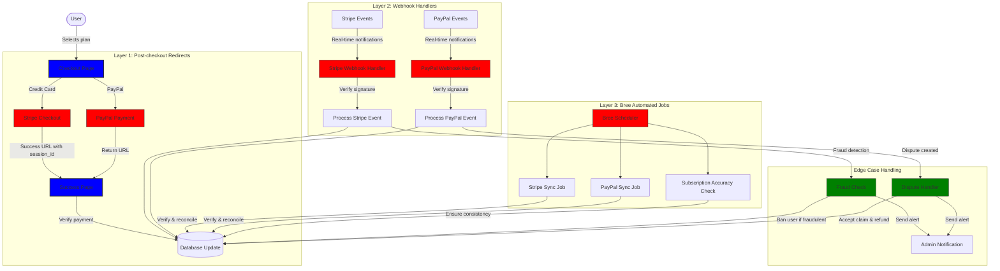
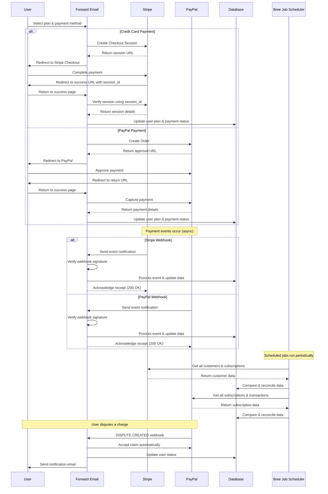
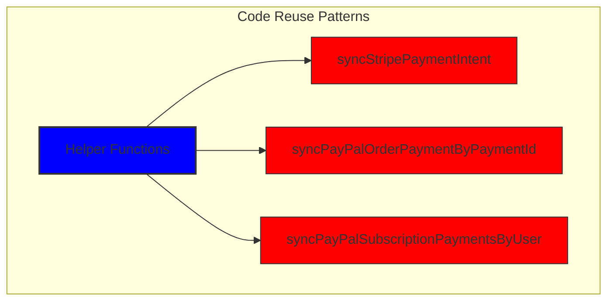
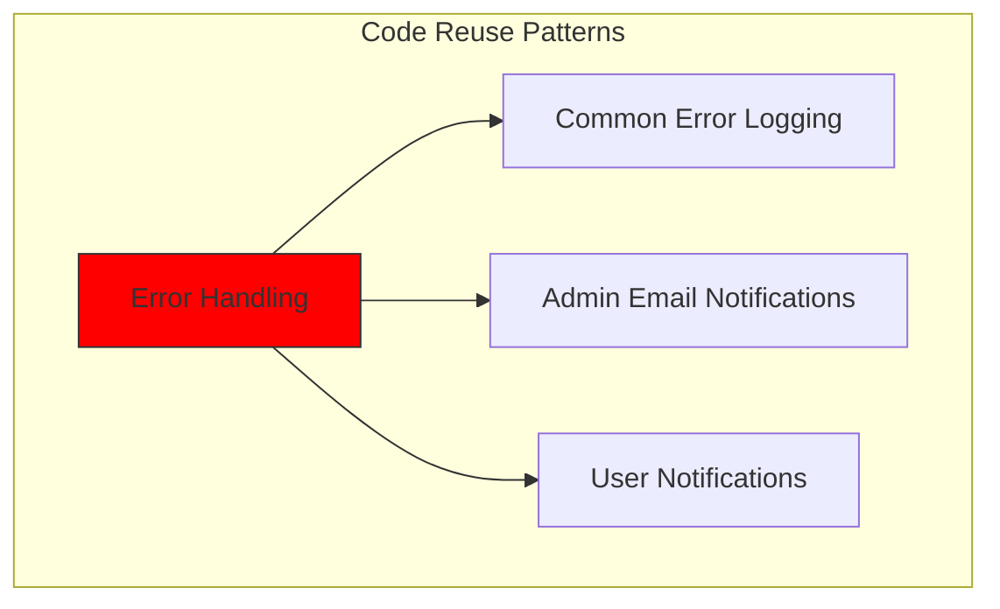
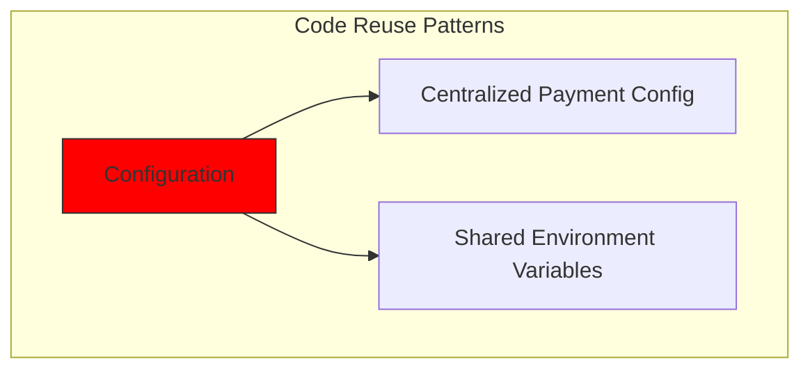
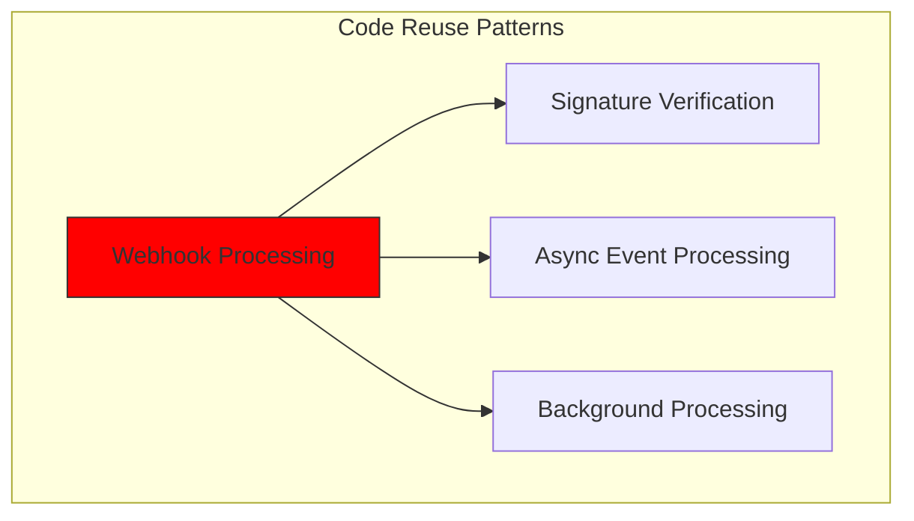
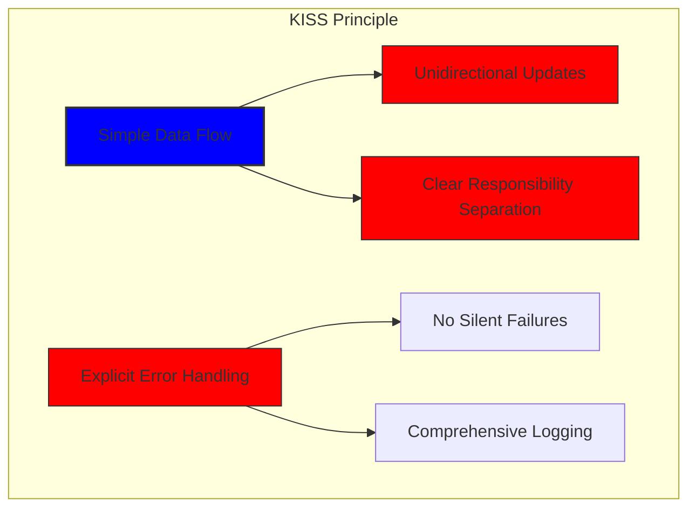
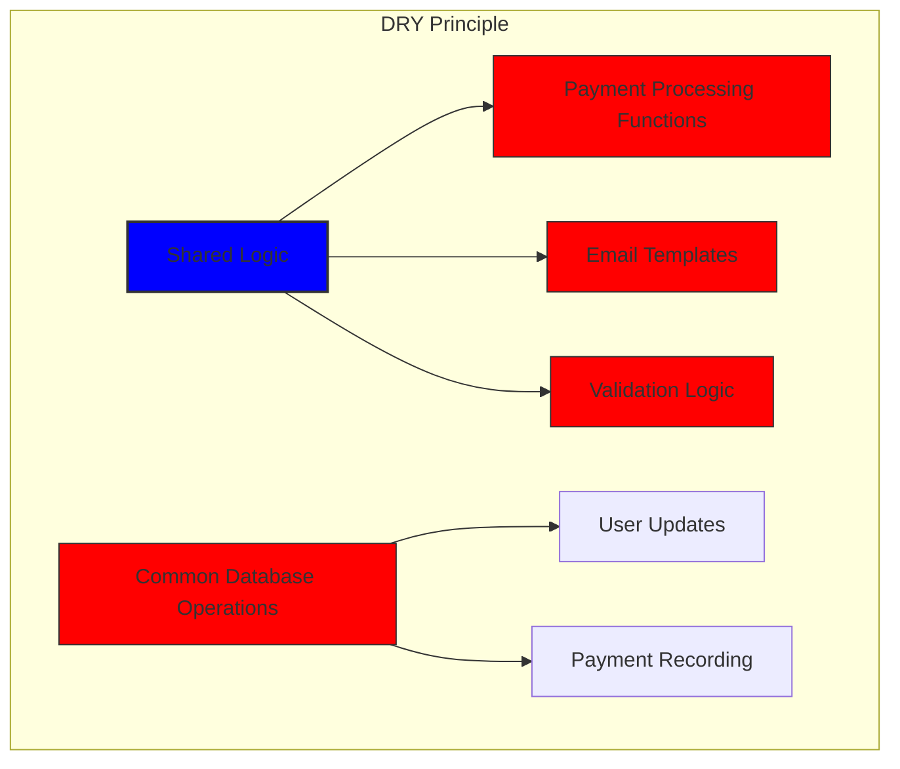

# Comment nous avons construit un système de paiement robuste avec Stripe et PayPal : une approche Trifecta {#how-we-built-a-robust-payment-system-with-stripe-and-paypal-a-trifecta-approach}


## Table des matières {#table-of-contents}

* [Avant-propos](#foreword)
* [Le défi : plusieurs processeurs de paiement, une seule source de vérité](#the-challenge-multiple-payment-processors-one-source-of-truth)
* [L'approche Trifecta : trois niveaux de fiabilité](#the-trifecta-approach-three-layers-of-reliability)
* [Couche 1 : Redirections post-paiement](#layer-1-post-checkout-redirects)
  * [Implémentation de Stripe Checkout](#stripe-checkout-implementation)
  * [Flux de paiement PayPal](#paypal-payment-flow)
* [Couche 2 : Gestionnaires de webhook avec vérification de signature](#layer-2-webhook-handlers-with-signature-verification)
  * [Implémentation du webhook Stripe](#stripe-webhook-implementation)
  * [Implémentation du Webhook PayPal](#paypal-webhook-implementation)
* [Couche 3 : tâches automatisées avec Bree](#layer-3-automated-jobs-with-bree)
  * [Vérificateur de précision d'abonnement](#subscription-accuracy-checker)
  * [Synchronisation des abonnements PayPal](#paypal-subscription-synchronization)
* [Gestion des cas limites](#handling-edge-cases)
  * [Détection et prévention de la fraude](#fraud-detection-and-prevention)
  * [Gestion des litiges](#dispute-handling)
* [Réutilisation du code : principes KISS et DRY](#code-reuse-kiss-and-dry-principles)
* [Mise en œuvre des exigences d'abonnement VISA](#visa-subscription-requirements-implementation)
  * [Notifications automatiques par e-mail de pré-renouvellement](#automated-pre-renewal-email-notifications)
  * [Gestion des cas limites](#handling-edge-cases-1)
  * [Périodes d'essai et conditions d'abonnement](#trial-periods-and-subscription-terms)
* [Conclusion : Les avantages de notre approche Trifecta](#conclusion-the-benefits-of-our-trifecta-approach)

## Avant-propos {#foreword}

Chez Forward Email, nous avons toujours privilégié la création de systèmes fiables, précis et conviviaux. Pour la mise en œuvre de notre système de traitement des paiements, nous savions qu'il nous fallait une solution capable de gérer plusieurs processeurs de paiement tout en garantissant une parfaite cohérence des données. Cet article de blog détaille comment notre équipe de développement a intégré Stripe et PayPal grâce à une approche trifecta garantissant une précision absolue en temps réel sur l'ensemble de notre système.

## Le défi : plusieurs processeurs de paiement, une seule source de vérité {#the-challenge-multiple-payment-processors-one-source-of-truth}

En tant que service de messagerie électronique soucieux de la confidentialité, nous souhaitions offrir à nos utilisateurs des options de paiement. Certains privilégient la simplicité des paiements par carte bancaire via Stripe, tandis que d'autres apprécient la séparation supplémentaire offerte par PayPal. Cependant, la prise en charge de plusieurs processeurs de paiement entraîne une complexité importante :

1. Comment garantir la cohérence des données entre les différents systèmes de paiement ?
2. Comment gérer les cas particuliers comme les litiges, les remboursements ou les échecs de paiement ?
3. Comment maintenir une source unique de données fiables dans notre base de données ?

Notre solution a été de mettre en œuvre ce que nous appelons « l’approche trifecta » : un système à trois couches qui assure la redondance et garantit la cohérence des données quoi qu’il arrive.

## L'approche Trifecta : trois niveaux de fiabilité {#the-trifecta-approach-three-layers-of-reliability}

Notre système de paiement se compose de trois composants essentiels qui fonctionnent ensemble pour assurer une synchronisation parfaite des données :

1. **Redirections post-paiement** - Saisie des informations de paiement immédiatement après le paiement
2. **Gestionnaires de webhooks** - Traitement des événements en temps réel des processeurs de paiement
3. **Tâches automatisées** - Vérification et rapprochement périodiques des données de paiement

Plongeons dans chaque composant et voyons comment ils fonctionnent ensemble.



## Couche 1 : Redirections post-paiement {#layer-1-post-checkout-redirects}

La première étape de notre approche « trifecta » intervient immédiatement après le paiement. Stripe et PayPal proposent tous deux des mécanismes permettant de rediriger les utilisateurs vers notre site avec les informations de transaction.

### Implémentation de Stripe Checkout {#stripe-checkout-implementation}

Pour Stripe, nous utilisons leur API Checkout Sessions pour créer une expérience de paiement fluide. Lorsqu'un utilisateur choisit un forfait et choisit de payer par carte de crédit, nous créons une session de paiement avec des URL de réussite et d'annulation spécifiques :

```javascript
const options = {
  mode: paymentType === 'one-time' ? 'payment' : 'subscription',
  customer: ctx.state.user[config.userFields.stripeCustomerID],
  client_reference_id: reference,
  metadata: {
    plan
  },
  line_items: [
    {
      price,
      quantity: 1,
      description
    }
  ],
  locale: config.STRIPE_LOCALES.has(ctx.locale) ? ctx.locale : 'auto',
  cancel_url: `${config.urls.web}${ctx.path}${
    isMakePayment || isEnableAutoRenew ? '' : `/?plan=${plan}`
  }`,
  success_url: `${config.urls.web}${ctx.path}/?${
    isMakePayment || isEnableAutoRenew ? '' : `plan=${plan}&`
  }session_id={CHECKOUT_SESSION_ID}`,
  allow_promotion_codes: true
};

// Create the checkout session and redirect
const session = await stripe.checkout.sessions.create(options);
const redirectTo = session.url;
if (ctx.accepts('html')) {
  ctx.status = 303;
  ctx.redirect(redirectTo);
} else {
  ctx.body = { redirectTo };
}
```

L'élément crucial ici est le paramètre `success_url`, qui inclut `session_id` comme paramètre de requête. Lorsque Stripe redirige l'utilisateur vers notre site après un paiement réussi, nous pouvons utiliser cet identifiant de session pour vérifier la transaction et mettre à jour notre base de données en conséquence.

### Flux de paiement PayPal {#paypal-payment-flow}

Pour PayPal, nous utilisons une approche similaire avec leur API de commandes :

```javascript
const requestBody = {
  intent: 'CAPTURE',
  application_context: {
    cancel_url: `${config.urls.web}${ctx.path}${
      isMakePayment || isEnableAutoRenew ? '' : `/?plan=${plan}`
    }`,
    return_url: `${config.urls.web}${ctx.path}/?plan=${plan}`,
    brand_name: 'Forward Email',
    shipping_preference: 'NO_SHIPPING',
    user_action: 'PAY_NOW'
  },
  payer: {
    email_address: ctx.state.user.email
  },
  purchase_units: [
    {
      reference_id: ctx.state.user.id,
      description,
      custom_id: sku,
      invoice_id: reference,
      soft_descriptor: sku,
      amount: {
        currency_code: 'USD',
        value: price,
        breakdown: {
          item_total: {
            currency_code: 'USD',
            value: price
          }
        }
      },
      items: [
        {
          name,
          description,
          sku,
          unit_amount: {
            currency_code: 'USD',
            value: price
          },
          quantity: '1',
          category: 'DIGITAL_GOODS'
        }
      ]
    }
  ]
};
```

Comme pour Stripe, nous spécifions les paramètres `return_url` et `cancel_url` pour gérer les redirections post-paiement. Lorsque PayPal redirige l'utilisateur vers notre site, nous pouvons récupérer les informations de paiement et mettre à jour notre base de données.



## Couche 2 : Gestionnaires de webhook avec vérification de signature {#layer-2-webhook-handlers-with-signature-verification}

Bien que les redirections post-paiement fonctionnent bien dans la plupart des cas, elles ne sont pas infaillibles. Les utilisateurs peuvent fermer leur navigateur avant d'être redirigés, ou des problèmes de réseau peuvent empêcher la redirection de se terminer. C'est là que les webhooks entrent en jeu.

Stripe et PayPal proposent tous deux des systèmes de webhooks qui envoient des notifications en temps réel sur les événements de paiement. Nous avons mis en place des gestionnaires de webhooks robustes qui vérifient l'authenticité de ces notifications et les traitent en conséquence.

### Implémentation du webhook Stripe {#stripe-webhook-implementation}

Notre gestionnaire de webhook Stripe vérifie la signature des événements webhook entrants pour garantir leur légitimité :

```javascript
async function webhook(ctx) {
  const sig = ctx.request.get('stripe-signature');
  // throw an error if something was wrong
  if (!isSANB(sig))
    throw Boom.badRequest(ctx.translateError('INVALID_STRIPE_SIGNATURE'));
  const event = stripe.webhooks.constructEvent(
    ctx.request.rawBody,
    sig,
    env.STRIPE_ENDPOINT_SECRET
  );
  // throw an error if something was wrong
  if (!event)
    throw Boom.badRequest(ctx.translateError('INVALID_STRIPE_SIGNATURE'));
  ctx.logger.info('stripe webhook', { event });
  // return a response to acknowledge receipt of the event
  ctx.body = { received: true };
  // run in background
  processEvent(ctx, event)
    .then()
    .catch((err) => {
      ctx.logger.fatal(err, { event });
      // email admin errors
      emailHelper({
        template: 'alert',
        message: {
          to: config.email.message.from,
          subject: `Error with Stripe Webhook (Event ID ${event.id})`
        },
        locals: {
          message: `<pre><code>${safeStringify(
            parseErr(err),
            null,
            2
          )}</code></pre>`
        }
      })
        .then()
        .catch((err) => ctx.logger.fatal(err, { event }));
    });
}
```

La fonction `stripe.webhooks.constructEvent` vérifie la signature à l'aide de notre secret de point de terminaison. Si la signature est valide, nous traitons l'événement de manière asynchrone pour éviter de bloquer la réponse du webhook.

### Implémentation du Webhook PayPal {#paypal-webhook-implementation}

De même, notre gestionnaire de webhook PayPal vérifie l’authenticité des notifications entrantes :

```javascript
async function webhook(ctx) {
  const response = await promisify(
    paypal.notification.webhookEvent.verify,
    paypal.notification.webhookEvent
  )(ctx.request.headers, ctx.request.body, env.PAYPAL_WEBHOOK_ID);
  // throw an error if something was wrong
  if (!_.isObject(response) || response.verification_status !== 'SUCCESS')
    throw Boom.badRequest(ctx.translateError('INVALID_PAYPAL_SIGNATURE'));
  // return a response to acknowledge receipt of the event
  ctx.body = { received: true };
  // run in background
  processEvent(ctx)
    .then()
    .catch((err) => {
      ctx.logger.fatal(err);
      // email admin errors
      emailHelper({
        template: 'alert',
        message: {
          to: config.email.message.from,
          subject: `Error with PayPal Webhook (Event ID ${ctx.request.body.id})`
        },
        locals: {
          message: `<pre><code>${safeStringify(
            parseErr(err),
            null,
            2
          )}</code></pre>`
        }
      })
        .then()
        .catch((err) => ctx.logger.fatal(err));
    });
}
```

Les deux gestionnaires de webhooks suivent le même modèle : ils vérifient la signature, accusent réception et traitent l'événement de manière asynchrone. Cela garantit que nous ne manquons jamais d'événement de paiement, même en cas d'échec de la redirection post-paiement.

## Couche 3 : tâches automatisées avec Bree {#layer-3-automated-jobs-with-bree}

La dernière couche de notre approche trifecta est un ensemble de tâches automatisées qui vérifient et rapprochent périodiquement les données de paiement. Nous utilisons Bree, un planificateur de tâches pour Node.js, pour exécuter ces tâches à intervalles réguliers.

### Vérificateur de précision d'abonnement {#subscription-accuracy-checker}

L'une de nos tâches principales est le vérificateur de précision des abonnements, qui garantit que notre base de données reflète avec précision l'état de l'abonnement dans Stripe :

```javascript
async function mapper(customer) {
  // wait a second to prevent rate limitation error
  await setTimeout(ms('1s'));
  // check for user on our side
  let user = await Users.findOne({
    [config.userFields.stripeCustomerID]: customer.id
  })
    .lean()
    .exec();
  if (!user) return;
  if (user.is_banned) return;

  // if emails did not match
  if (user.email !== customer.email) {
    logger.info(
      `User email ${user.email} did not match customer email ${customer.email} (${customer.id})`
    );
    customer = await stripe.customers.update(customer.id, {
      email: user.email
    });
    logger.info(`Updated user email to match ${user.email}`);
  }

  // check for active subscriptions
  const [activeSubscriptions, trialingSubscriptions] = await Promise.all([
    stripe.subscriptions.list({
      customer: customer.id,
      status: 'active'
    }),
    stripe.subscriptions.list({
      customer: customer.id,
      status: 'trialing'
    })
  ]);

  // Combine active and trialing subscriptions
  let subscriptions = [
    ...activeSubscriptions.data,
    ...trialingSubscriptions.data
  ];

  // Handle edge case: multiple subscriptions for one user
  if (subscriptions.length > 1) {
    await logger.error(
      new Error(
        `We may need to refund: User had multiple subscriptions ${user.email} (${customer.id})`
      )
    );
    await emailHelper({
      template: 'alert',
      message: {
        to: config.email.message.from,
        subject: `User had multiple subscriptions ${user.email}`
      },
      locals: {
        message: `User ${user.email} (${customer.id}) had multiple subscriptions: ${JSON.stringify(
          subscriptions.map((s) => s.id)
        )}`
      }
    });
  }
}
```

Cette tâche vérifie les divergences entre notre base de données et Stripe, comme des adresses e-mail incompatibles ou plusieurs abonnements actifs. Si des problèmes sont détectés, ils sont consignés et des alertes sont envoyées à notre équipe d'administration.

### Synchronisation des abonnements PayPal {#paypal-subscription-synchronization}

Nous avons un travail similaire pour les abonnements PayPal :

```javascript
async function syncPayPalSubscriptionPayments() {
  const paypalCustomers = await Users.find({
    $or: [
      {
        [config.userFields.paypalSubscriptionID]: { $exists: true, $ne: null }
      },
      {
        [config.userFields.paypalPayerID]: { $exists: true, $ne: null }
      }
    ]
  })
    // sort by newest customers first
    .sort('-created_at')
    .lean()
    .exec();

  await logger.info(
    `Syncing payments for ${paypalCustomers.length} paypal customers`
  );

  // Process each customer and sync their payments
  const errorEmails = await pReduce(
    paypalCustomers,
    // Implementation details...
  );
}
```

Ces tâches automatisées servent de filet de sécurité final, garantissant que notre base de données reflète toujours l'état réel des abonnements et des paiements dans Stripe et PayPal.

## Gestion des cas limites {#handling-edge-cases}

Un système de paiement robuste doit gérer les cas extrêmes avec aisance. Voyons comment gérer quelques scénarios courants.

### Détection et prévention des fraudes {#fraud-detection-and-prevention}

Nous avons mis en place des mécanismes sophistiqués de détection de fraude qui identifient et traitent automatiquement les activités de paiement suspectes :

```javascript
case 'charge.failed': {
  // Get all failed charges in the last 30 days
  const charges = await stripe.charges.list({
    customer: event.data.object.customer,
    created: {
      gte: dayjs().subtract(1, 'month').unix()
    }
  });

  // Filter for declined charges
  const filtered = charges.data.filter(
    (d) => d.status === 'failed' && d.failure_code === 'card_declined'
  );

  // if not more than 5 then return early
  if (filtered.length < 5) break;

  // Check if user has verified domains
  const count = await Domains.countDocuments({
    members: {
      $elemMatch: {
        user: user._id,
        group: 'admin'
      }
    },
    plan: { $in: ['enhanced_protection', 'team'] },
    has_txt_record: true
  });

  if (!user.is_banned) {
    // If no verified domains, ban the user and refund all charges
    if (count === 0) {
      // Ban the user
      user.is_banned = true;
      await user.save();

      // Refund all successful charges
    }
  }
}
```

Ce code bannit automatiquement les utilisateurs qui ont plusieurs échecs de paiement et aucun domaine vérifié, ce qui est un indicateur fort d'activité frauduleuse.

### Gestion des litiges {#dispute-handling}

Lorsqu'un utilisateur conteste des frais, nous acceptons automatiquement la réclamation et prenons les mesures appropriées :

```javascript
case 'CUSTOMER.DISPUTE.CREATED': {
  // accept claim
  const agent = await paypalAgent();
  await agent
    .post(`/v1/customer/disputes/${body.resource.dispute_id}/accept-claim`)
    .send({
      note: 'Full refund to the customer.'
    });

  // Find the payment in our database
  const payment = await Payments.findOne({ $or });
  if (!payment) throw new Error('Payment does not exist');

  const user = await Users.findById(payment.user);
  if (!user) throw new Error('User did not exist for customer');

  // Cancel the user's subscription if they have one
  if (isSANB(user[config.userFields.paypalSubscriptionID])) {
    try {
      const agent = await paypalAgent();
      await agent.post(
        `/v1/billing/subscriptions/${
          user[config.userFields.paypalSubscriptionID]
        }/cancel`
      );
    } catch (err) {
      // Handle subscription cancellation errors
    }
  }
}
```

Cette approche minimise l’impact des litiges sur notre activité tout en garantissant une bonne expérience client.

## Réutilisation du code : principes KISS et DRY {#code-reuse-kiss-and-dry-principles}

Tout au long de notre système de paiement, nous avons adhéré aux principes KISS (Keep It Simple, Stupid) et DRY (Don't Repeat Yourself). Voici quelques exemples :

1. **Fonctions d'aide partagées** : nous avons créé des fonctions d'aide réutilisables pour les tâches courantes telles que la synchronisation des paiements et l'envoi d'e-mails.

2. **Gestion cohérente des erreurs** : les gestionnaires de webhook Stripe et PayPal utilisent le même modèle pour la gestion des erreurs et les notifications d'administration.

3. **Schéma de base de données unifié** : Notre schéma de base de données est conçu pour prendre en charge les données Stripe et PayPal, avec des champs communs pour le statut de paiement, le montant et les informations sur le plan.

4. **Configuration centralisée** : La configuration liée au paiement est centralisée dans un seul fichier, ce qui facilite la mise à jour des prix et des informations sur les produits.













## Mise en œuvre des exigences d'abonnement VISA {#visa-subscription-requirements-implementation}

En plus de notre approche trifecta, nous avons mis en place des fonctionnalités spécifiques pour répondre aux exigences d'abonnement de VISA tout en améliorant l'expérience utilisateur. L'une des principales exigences de VISA est que les utilisateurs soient informés avant le prélèvement de leur abonnement, notamment lors du passage d'un abonnement d'essai à un abonnement payant.

### Notifications automatiques par e-mail de pré-renouvellement {#automated-pre-renewal-email-notifications}

Nous avons mis en place un système automatisé qui identifie les utilisateurs disposant d'un abonnement d'essai actif et leur envoie une notification par e-mail avant leur premier prélèvement. Cela nous permet non seulement de respecter les exigences VISA, mais aussi de réduire les rétrofacturations et d'améliorer la satisfaction client.

Voici comment nous avons implémenté cette fonctionnalité :

```javascript
// Find users with trial subscriptions who haven't received a notification yet
const users = await Users.find({
  $or: [
    {
      $and: [
        { [config.userFields.stripeSubscriptionID]: { $exists: true } },
        { [config.userFields.stripeTrialSentAt]: { $exists: false } },
        // Exclude subscriptions that have already had payments
        ...(paidStripeSubscriptionIds.length > 0
          ? [
              {
                [config.userFields.stripeSubscriptionID]: {
                  $nin: paidStripeSubscriptionIds
                }
              }
            ]
          : [])
      ]
    },
    {
      $and: [
        { [config.userFields.paypalSubscriptionID]: { $exists: true } },
        { [config.userFields.paypalTrialSentAt]: { $exists: false } },
        // Exclude subscriptions that have already had payments
        ...(paidPayPalSubscriptionIds.length > 0
          ? [
              {
                [config.userFields.paypalSubscriptionID]: {
                  $nin: paidPayPalSubscriptionIds
                }
              }
            ]
          : [])
      ]
    }
  ]
});

// Process each user and send notification
for (const user of users) {
  // Get subscription details from payment processor
  const subscription = await getSubscriptionDetails(user);

  // Calculate subscription duration and frequency
  const duration = getDurationFromPlanId(subscription.plan_id);
  const frequency = getHumanReadableFrequency(duration, user.locale);
  const amount = getPlanAmount(user.plan, duration);

  // Get user's domains for personalized email
  const domains = await Domains.find({
    'members.user': user._id
  }).sort('name').lean().exec();

  // Send VISA-compliant notification email
  await emailHelper({
    template: 'visa-trial-subscription-requirement',
    message: {
      to: user.receipt_email || user.email,
      ...(user.receipt_email ? { cc: user.email } : {})
    },
    locals: {
      user,
      firstChargeDate: new Date(subscription.start_time),
      frequency,
      formattedAmount: numeral(amount).format('$0,0,0.00'),
      domains
    }
  });

  // Record that notification was sent
  await Users.findByIdAndUpdate(user._id, {
    $set: {
      [config.userFields.paypalTrialSentAt]: new Date()
    }
  });
}
```

Cette mise en œuvre garantit que les utilisateurs sont toujours informés des frais à venir, avec des détails clairs sur :

1. Quand le premier prélèvement aura lieu ?
2. La fréquence des prélèvements futurs (mensuels, annuels, etc.)
3. Le montant exact qui leur sera facturé
4. Les domaines couverts par leur abonnement

En automatisant ce processus, nous maintenons une conformité parfaite avec les exigences de VISA (qui imposent une notification au moins 7 jours avant le débit) tout en réduisant les demandes d'assistance et en améliorant l'expérience utilisateur globale.

### Gestion des cas limites {#handling-edge-cases-1}

Notre implémentation inclut également une gestion robuste des erreurs. En cas de problème lors du processus de notification, notre système alerte automatiquement notre équipe :

```javascript
try {
  await mapper(user);
} catch (err) {
  logger.error(err);

  // Send alert to administrators
  await emailHelper({
    template: 'alert',
    message: {
      to: config.email.message.from,
      subject: 'VISA Trial Subscription Requirement Error'
    },
    locals: {
      message: `<pre><code>${safeStringify(
        parseErr(err),
        null,
        2
      )}</code></pre>`
    }
  });
}
```

Cela garantit que même en cas de problème avec le système de notification, notre équipe peut le résoudre rapidement et maintenir la conformité aux exigences de VISA.

Le système de notification d'abonnement VISA est un autre exemple de la manière dont nous avons construit notre infrastructure de paiement en gardant à l'esprit la conformité et l'expérience utilisateur, complétant notre approche trifecta pour garantir un traitement des paiements fiable et transparent.

### Périodes d'essai et conditions d'abonnement {#trial-periods-and-subscription-terms}

Pour les utilisateurs qui activent le renouvellement automatique sur les plans existants, nous calculons la période d'essai appropriée pour garantir qu'ils ne soient pas facturés avant l'expiration de leur plan actuel :

```javascript
if (
  isEnableAutoRenew &&
  dayjs(ctx.state.user[config.userFields.planExpiresAt]).isAfter(
    dayjs()
  )
) {
  const hours = dayjs(
    ctx.state.user[config.userFields.planExpiresAt]
  ).diff(dayjs(), 'hours');

  // Handle trial period calculation
}
```

Nous fournissons également des informations claires sur les conditions d'abonnement, y compris la fréquence de facturation et les politiques d'annulation, et incluons des métadonnées détaillées avec chaque abonnement pour assurer un suivi et une gestion appropriés.

## Conclusion : Les avantages de notre approche Trifecta {#conclusion-the-benefits-of-our-trifecta-approach}

Notre approche trifecta du traitement des paiements a apporté plusieurs avantages clés :

1. **Fiabilité** : En mettant en œuvre trois niveaux de vérification des paiements, nous garantissons qu'aucun paiement n'est manqué ou traité de manière incorrecte.

2. **Précision** : Notre base de données reflète toujours l'état réel des abonnements et des paiements dans Stripe et PayPal.

3. **Flexibilité** : Les utilisateurs peuvent choisir leur mode de paiement préféré sans compromettre la fiabilité de notre système.

4. **Robustesse** : Notre système gère les cas extrêmes avec élégance, des pannes de réseau aux activités frauduleuses.

Si vous implémentez un système de paiement prenant en charge plusieurs processeurs, nous recommandons vivement cette approche triple. Elle nécessite un développement initial plus important, mais les avantages à long terme en termes de fiabilité et de précision en valent largement la peine.

Pour plus d'informations sur Forward Email et nos services de messagerie axés sur la confidentialité, visitez notre [site web](https://forwardemail.net).

<!-- *Mots-clés : traitement des paiements, intégration Stripe, intégration PayPal, gestion des webhooks, synchronisation des paiements, gestion des abonnements, prévention de la fraude, gestion des litiges, système de paiement Node.js, système de paiement multiprocesseur, intégration de passerelle de paiement, vérification des paiements en temps réel, cohérence des données de paiement, facturation des abonnements, sécurité des paiements, automatisation des paiements, webhooks de paiement, rapprochement des paiements, cas limites de paiement, gestion des erreurs de paiement, exigences d'abonnement VISA, notifications de pré-renouvellement, conformité des abonnements* -->