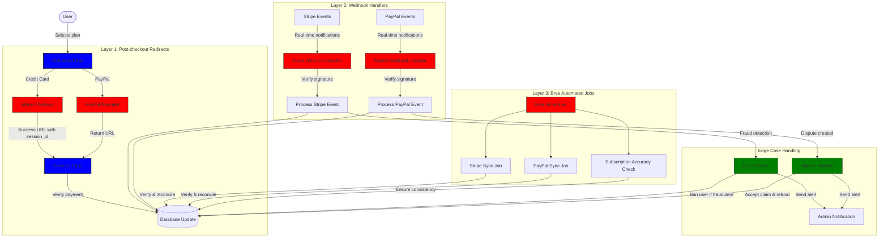
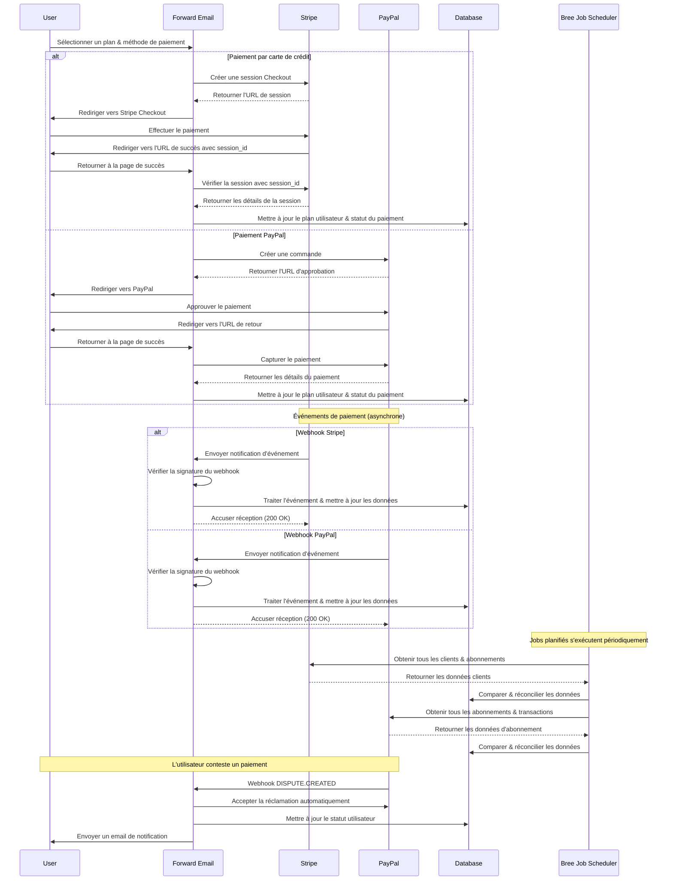
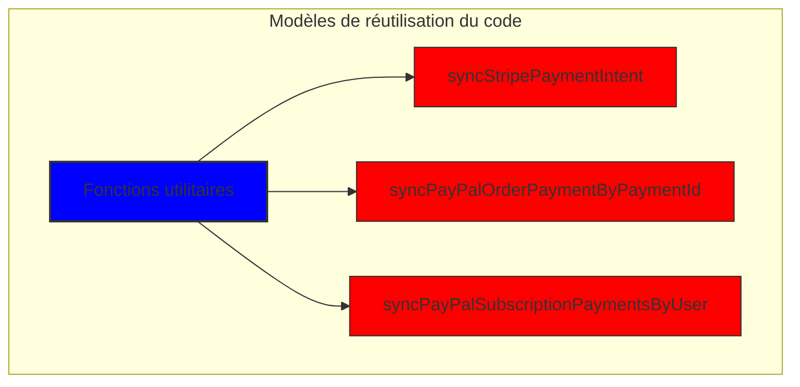
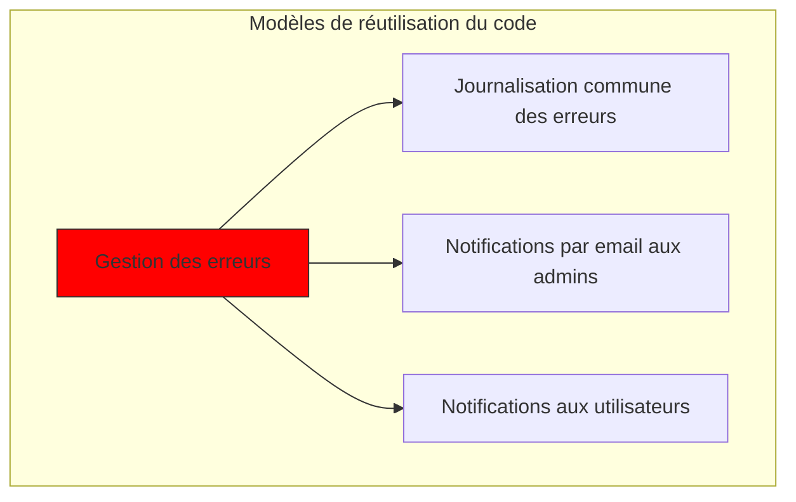
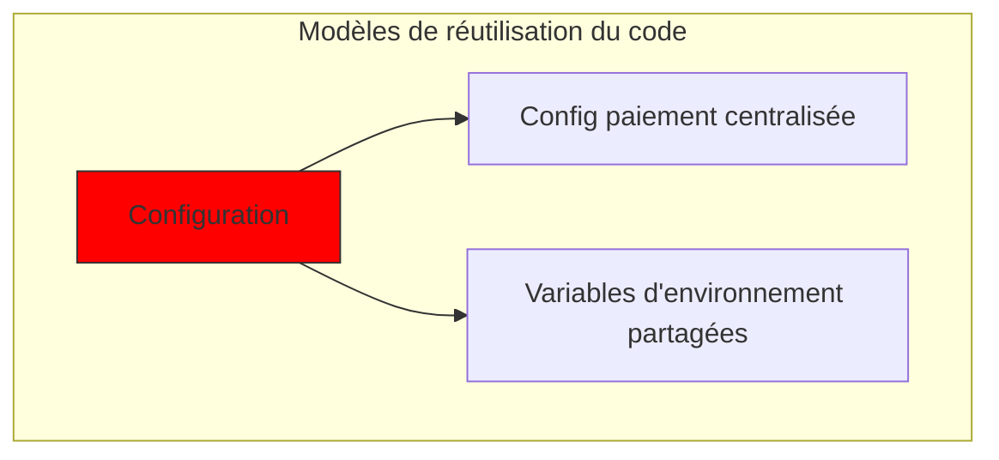
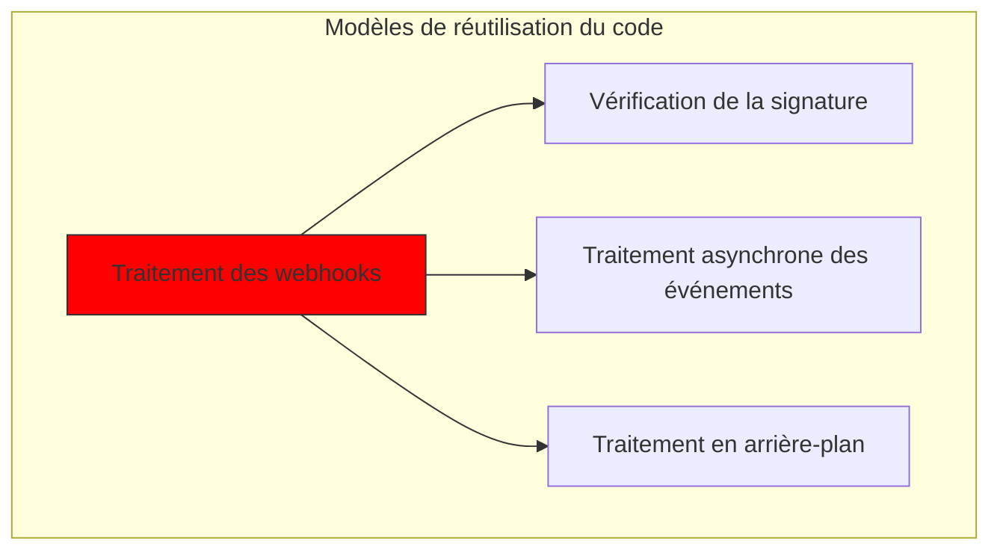
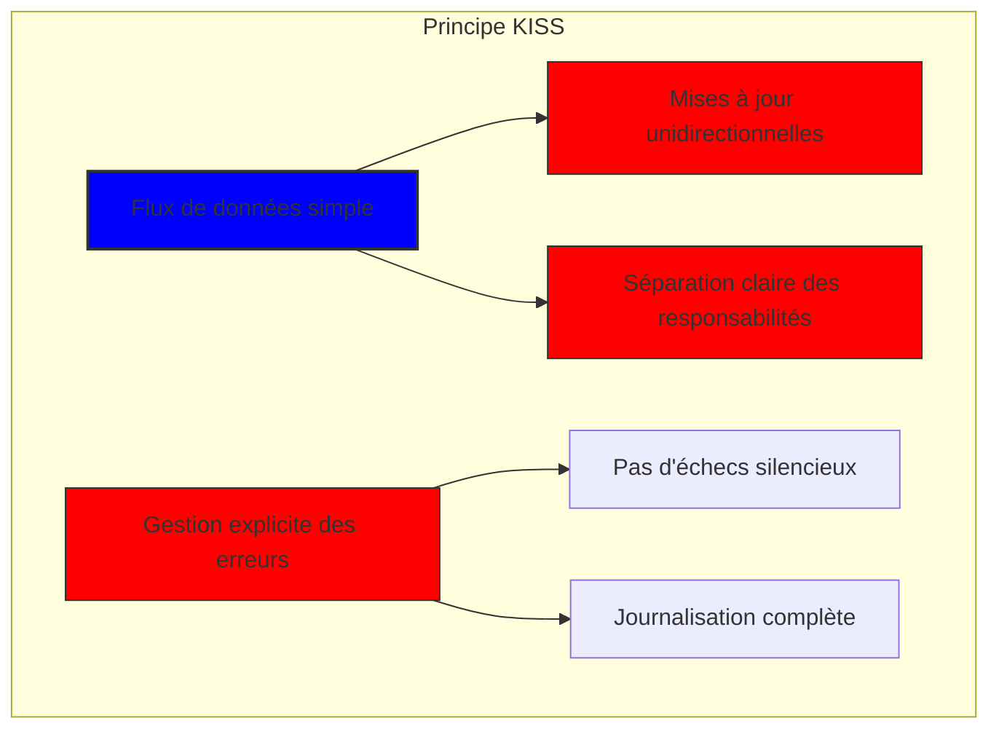

# Comment nous avons construit un système de paiement robuste avec Stripe et PayPal : une approche trifecta {#how-we-built-a-robust-payment-system-with-stripe-and-paypal-a-trifecta-approach}


## Table des matières {#table-of-contents}

* [Avant-propos](#foreword)
* [Le défi : plusieurs processeurs de paiement, une source de vérité](#the-challenge-multiple-payment-processors-one-source-of-truth)
* [L'approche trifecta : trois couches de fiabilité](#the-trifecta-approach-three-layers-of-reliability)
* [Couche 1 : redirections post-checkout](#layer-1-post-checkout-redirects)
  * [Implémentation de Stripe Checkout](#stripe-checkout-implementation)
  * [Flux de paiement PayPal](#paypal-payment-flow)
* [Couche 2 : gestionnaires de webhook avec vérification de signature](#layer-2-webhook-handlers-with-signature-verification)
  * [Implémentation du webhook Stripe](#stripe-webhook-implementation)
  * [Implémentation du webhook PayPal](#paypal-webhook-implementation)
* [Couche 3 : tâches automatisées avec Bree](#layer-3-automated-jobs-with-bree)
  * [Vérificateur de précision des abonnements](#subscription-accuracy-checker)
  * [Synchronisation des abonnements PayPal](#paypal-subscription-synchronization)
* [Gestion des cas limites](#handling-edge-cases)
  * [Détection et prévention de la fraude](#fraud-detection-and-prevention)
  * [Gestion des litiges](#dispute-handling)
* [Réutilisation du code : principes KISS et DRY](#code-reuse-kiss-and-dry-principles)
* [Mise en œuvre des exigences d'abonnement VISA](#visa-subscription-requirements-implementation)
  * [Notifications par email automatisées avant renouvellement](#automated-pre-renewal-email-notifications)
  * [Gestion des cas limites](#handling-edge-cases-1)
  * [Périodes d'essai et conditions d'abonnement](#trial-periods-and-subscription-terms)
* [Conclusion : les avantages de notre approche trifecta](#conclusion-the-benefits-of-our-trifecta-approach)


## Avant-propos {#foreword}

Chez Forward Email, nous avons toujours privilégié la création de systèmes fiables, précis et conviviaux. Lorsqu'il s'est agi de mettre en place notre système de traitement des paiements, nous savions qu'il nous fallait une solution capable de gérer plusieurs processeurs de paiement tout en maintenant une parfaite cohérence des données. Ce billet de blog détaille comment notre équipe de développement a intégré à la fois Stripe et PayPal en utilisant une approche trifecta qui garantit une précision en temps réel 1:1 sur l'ensemble de notre système.


## Le défi : plusieurs processeurs de paiement, une source de vérité {#the-challenge-multiple-payment-processors-one-source-of-truth}

En tant que service de messagerie axé sur la confidentialité, nous voulions offrir à nos utilisateurs des options de paiement. Certains préfèrent la simplicité des paiements par carte bancaire via Stripe, tandis que d'autres apprécient la couche supplémentaire de séparation que PayPal offre. Cependant, supporter plusieurs processeurs de paiement introduit une complexité importante :

1. Comment assurer la cohérence des données entre différents systèmes de paiement ?
2. Comment gérer les cas limites comme les litiges, remboursements ou paiements échoués ?
3. Comment maintenir une source unique de vérité dans notre base de données ?

Notre solution a été de mettre en œuvre ce que nous appelons « l'approche trifecta » - un système à trois couches qui offre une redondance et garantit la cohérence des données quoi qu'il arrive.


## L'approche trifecta : trois couches de fiabilité {#the-trifecta-approach-three-layers-of-reliability}

Notre système de paiement se compose de trois composants critiques qui fonctionnent ensemble pour assurer une synchronisation parfaite des données :

1. **Redirections post-checkout** - Capturer les informations de paiement immédiatement après le checkout
2. **Gestionnaires de webhook** - Traiter les événements en temps réel des processeurs de paiement
3. **Tâches automatisées** - Vérifier et rapprocher périodiquement les données de paiement

Entrons dans le détail de chaque composant et voyons comment ils fonctionnent ensemble.


```mermaid
flowchart TD
    User([User]) --> |Selects plan| Checkout[Checkout Page]

    %% Layer 1: Post-checkout redirects
    subgraph "Layer 1: Post-checkout Redirects"
        Checkout --> |Credit Card| Stripe[Stripe Checkout]
        Checkout --> |PayPal| PayPal[PayPal Payment]

        Stripe --> |Success URL with session_id| SuccessPage[Success Page]
        PayPal --> |Return URL| SuccessPage

        SuccessPage --> |Verify payment| Database[(Database Update)]
    end

    %% Layer 2: Webhooks
    subgraph "Layer 2: Webhook Handlers"
        StripeEvents[Stripe Events] --> |Real-time notifications| StripeWebhook[Stripe Webhook Handler]
        PayPalEvents[PayPal Events] --> |Real-time notifications| PayPalWebhook[PayPal Webhook Handler]

        StripeWebhook --> |Verify signature| ProcessStripeEvent[Process Stripe Event]
        PayPalWebhook --> |Verify signature| ProcessPayPalEvent[Process PayPal Event]

        ProcessStripeEvent --> Database
        ProcessPayPalEvent --> Database
    end

    %% Layer 3: Automated jobs
    subgraph "Layer 3: Bree Automated Jobs"
        BreeScheduler[Bree Scheduler] --> StripeSync[Stripe Sync Job]
        BreeScheduler --> PayPalSync[PayPal Sync Job]
        BreeScheduler --> AccuracyCheck[Subscription Accuracy Check]

        StripeSync --> |Verify & reconcile| Database
        PayPalSync --> |Verify & reconcile| Database
        AccuracyCheck --> |Ensure consistency| Database
    end

    %% Edge cases
    subgraph "Edge Case Handling"
        ProcessStripeEvent --> |Fraud detection| FraudCheck[Fraud Check]
        ProcessPayPalEvent --> |Dispute created| DisputeHandler[Dispute Handler]

        FraudCheck --> |Ban user if fraudulent| Database
        DisputeHandler --> |Accept claim & refund| Database

        FraudCheck --> |Send alert| AdminNotification[Admin Notification]
        DisputeHandler --> |Send alert| AdminNotification
    end

    %% Style definitions
    classDef primary fill:blue,stroke:#333,stroke-width:2px;
    classDef secondary fill:red,stroke:#333,stroke-width:1px;
    classDef tertiary fill:green,stroke:#333,stroke-width:1px;

    class Checkout,SuccessPage primary;
    class Stripe,PayPal,StripeWebhook,PayPalWebhook,BreeScheduler secondary;
    class FraudCheck,DisputeHandler tertiary;
```
## Couche 1 : Redirections post-paiement {#layer-1-post-checkout-redirects}

La première couche de notre approche trifecta se produit immédiatement après qu'un utilisateur ait effectué un paiement. Stripe et PayPal fournissent tous deux des mécanismes pour rediriger les utilisateurs vers notre site avec les informations de la transaction.

### Implémentation Stripe Checkout {#stripe-checkout-implementation}

Pour Stripe, nous utilisons leur API Checkout Sessions pour créer une expérience de paiement fluide. Lorsqu'un utilisateur sélectionne un plan et choisit de payer par carte de crédit, nous créons une session Checkout avec des URL de succès et d'annulation spécifiques :

```javascript
const options = {
  mode: paymentType === 'one-time' ? 'payment' : 'subscription',
  customer: ctx.state.user[config.userFields.stripeCustomerID],
  client_reference_id: reference,
  metadata: {
    plan
  },
  line_items: [
    {
      price,
      quantity: 1,
      description
    }
  ],
  locale: config.STRIPE_LOCALES.has(ctx.locale) ? ctx.locale : 'auto',
  cancel_url: `${config.urls.web}${ctx.path}${
    isMakePayment || isEnableAutoRenew ? '' : `/?plan=${plan}`
  }`,
  success_url: `${config.urls.web}${ctx.path}/?${
    isMakePayment || isEnableAutoRenew ? '' : `plan=${plan}&`
  }session_id={CHECKOUT_SESSION_ID}`,
  allow_promotion_codes: true
};

// Create the checkout session and redirect
const session = await stripe.checkout.sessions.create(options);
const redirectTo = session.url;
if (ctx.accepts('html')) {
  ctx.status = 303;
  ctx.redirect(redirectTo);
} else {
  ctx.body = { redirectTo };
}
```

La partie critique ici est le paramètre `success_url`, qui inclut le `session_id` en tant que paramètre de requête. Lorsque Stripe redirige l'utilisateur vers notre site après un paiement réussi, nous pouvons utiliser cet ID de session pour vérifier la transaction et mettre à jour notre base de données en conséquence.

### Flux de paiement PayPal {#paypal-payment-flow}

Pour PayPal, nous utilisons une approche similaire avec leur API Orders :

```javascript
const requestBody = {
  intent: 'CAPTURE',
  application_context: {
    cancel_url: `${config.urls.web}${ctx.path}${
      isMakePayment || isEnableAutoRenew ? '' : `/?plan=${plan}`
    }`,
    return_url: `${config.urls.web}${ctx.path}/?plan=${plan}`,
    brand_name: 'Forward Email',
    shipping_preference: 'NO_SHIPPING',
    user_action: 'PAY_NOW'
  },
  payer: {
    email_address: ctx.state.user.email
  },
  purchase_units: [
    {
      reference_id: ctx.state.user.id,
      description,
      custom_id: sku,
      invoice_id: reference,
      soft_descriptor: sku,
      amount: {
        currency_code: 'USD',
        value: price,
        breakdown: {
          item_total: {
            currency_code: 'USD',
            value: price
          }
        }
      },
      items: [
        {
          name,
          description,
          sku,
          unit_amount: {
            currency_code: 'USD',
            value: price
          },
          quantity: '1',
          category: 'DIGITAL_GOODS'
        }
      ]
    }
  ]
};
```

Comme pour Stripe, nous spécifions les paramètres `return_url` et `cancel_url` pour gérer les redirections après paiement. Lorsque PayPal redirige l'utilisateur vers notre site, nous pouvons capturer les détails du paiement et mettre à jour notre base de données.


```mermaid
sequenceDiagram
    participant User
    participant FE as Forward Email
    participant Stripe
    participant PayPal
    participant DB as Database
    participant Bree as Bree Job Scheduler

    %% Initial checkout flow
    User->>FE: Sélectionner un plan & méthode de paiement

    alt Paiement par carte de crédit
        FE->>Stripe: Créer une session Checkout
        Stripe-->>FE: Retourner l'URL de session
        FE->>User: Rediriger vers Stripe Checkout
        User->>Stripe: Effectuer le paiement
        Stripe->>User: Rediriger vers l'URL de succès avec session_id
        User->>FE: Retourner à la page de succès
        FE->>Stripe: Vérifier la session avec session_id
        Stripe-->>FE: Retourner les détails de la session
        FE->>DB: Mettre à jour le plan utilisateur & statut du paiement
    else Paiement PayPal
        FE->>PayPal: Créer une commande
        PayPal-->>FE: Retourner l'URL d'approbation
        FE->>User: Rediriger vers PayPal
        User->>PayPal: Approuver le paiement
        PayPal->>User: Rediriger vers l'URL de retour
        User->>FE: Retourner à la page de succès
        FE->>PayPal: Capturer le paiement
        PayPal-->>FE: Retourner les détails du paiement
        FE->>DB: Mettre à jour le plan utilisateur & statut du paiement
    end

    %% Flux webhook (asynchrone)
    Note over Stripe,PayPal: Événements de paiement (asynchrone)

    alt Webhook Stripe
        Stripe->>FE: Envoyer notification d'événement
        FE->>FE: Vérifier la signature du webhook
        FE->>DB: Traiter l'événement & mettre à jour les données
        FE-->>Stripe: Accuser réception (200 OK)
    else Webhook PayPal
        PayPal->>FE: Envoyer notification d'événement
        FE->>FE: Vérifier la signature du webhook
        FE->>DB: Traiter l'événement & mettre à jour les données
        FE-->>PayPal: Accuser réception (200 OK)
    end

    %% Jobs automatisés Bree
    Note over Bree: Jobs planifiés s'exécutent périodiquement

    Bree->>Stripe: Obtenir tous les clients & abonnements
    Stripe-->>Bree: Retourner les données clients
    Bree->>DB: Comparer & réconcilier les données

    Bree->>PayPal: Obtenir tous les abonnements & transactions
    PayPal-->>Bree: Retourner les données d'abonnement
    Bree->>DB: Comparer & réconcilier les données

    %% Cas particulier : Gestion des litiges
    Note over User,PayPal: L'utilisateur conteste un paiement

    PayPal->>FE: Webhook DISPUTE.CREATED
    FE->>PayPal: Accepter la réclamation automatiquement
    FE->>DB: Mettre à jour le statut utilisateur
    FE->>User: Envoyer un email de notification
```
## Couche 2 : Gestionnaires de Webhooks avec Vérification de Signature {#layer-2-webhook-handlers-with-signature-verification}

Bien que les redirections post-paiement fonctionnent bien dans la plupart des scénarios, elles ne sont pas infaillibles. Les utilisateurs peuvent fermer leur navigateur avant la redirection, ou des problèmes réseau peuvent empêcher la redirection de se terminer. C’est là que les webhooks interviennent.

Stripe et PayPal fournissent tous deux des systèmes de webhooks qui envoient des notifications en temps réel concernant les événements de paiement. Nous avons mis en place des gestionnaires de webhooks robustes qui vérifient l’authenticité de ces notifications et les traitent en conséquence.

### Implémentation du Webhook Stripe {#stripe-webhook-implementation}

Notre gestionnaire de webhook Stripe vérifie la signature des événements webhook entrants pour s’assurer qu’ils sont légitimes :

```javascript
async function webhook(ctx) {
  const sig = ctx.request.get('stripe-signature');
  // throw an error if something was wrong
  if (!isSANB(sig))
    throw Boom.badRequest(ctx.translateError('INVALID_STRIPE_SIGNATURE'));
  const event = stripe.webhooks.constructEvent(
    ctx.request.rawBody,
    sig,
    env.STRIPE_ENDPOINT_SECRET
  );
  // throw an error if something was wrong
  if (!event)
    throw Boom.badRequest(ctx.translateError('INVALID_STRIPE_SIGNATURE'));
  ctx.logger.info('stripe webhook', { event });
  // return a response to acknowledge receipt of the event
  ctx.body = { received: true };
  // run in background
  processEvent(ctx, event)
    .then()
    .catch((err) => {
      ctx.logger.fatal(err, { event });
      // email admin errors
      emailHelper({
        template: 'alert',
        message: {
          to: config.email.message.from,
          subject: `Error with Stripe Webhook (Event ID ${event.id})`
        },
        locals: {
          message: `<pre><code>${safeStringify(
            parseErr(err),
            null,
            2
          )}</code></pre>`
        }
      })
        .then()
        .catch((err) => ctx.logger.fatal(err, { event }));
    });
}
```

La fonction `stripe.webhooks.constructEvent` vérifie la signature en utilisant notre secret d’endpoint. Si la signature est valide, nous traitons l’événement de manière asynchrone afin de ne pas bloquer la réponse du webhook.

### Implémentation du Webhook PayPal {#paypal-webhook-implementation}

De même, notre gestionnaire de webhook PayPal vérifie l’authenticité des notifications entrantes :

```javascript
async function webhook(ctx) {
  const response = await promisify(
    paypal.notification.webhookEvent.verify,
    paypal.notification.webhookEvent
  )(ctx.request.headers, ctx.request.body, env.PAYPAL_WEBHOOK_ID);
  // throw an error if something was wrong
  if (!_.isObject(response) || response.verification_status !== 'SUCCESS')
    throw Boom.badRequest(ctx.translateError('INVALID_PAYPAL_SIGNATURE'));
  // return a response to acknowledge receipt of the event
  ctx.body = { received: true };
  // run in background
  processEvent(ctx)
    .then()
    .catch((err) => {
      ctx.logger.fatal(err);
      // email admin errors
      emailHelper({
        template: 'alert',
        message: {
          to: config.email.message.from,
          subject: `Error with PayPal Webhook (Event ID ${ctx.request.body.id})`
        },
        locals: {
          message: `<pre><code>${safeStringify(
            parseErr(err),
            null,
            2
          )}</code></pre>`
        }
      })
        .then()
        .catch((err) => ctx.logger.fatal(err));
    });
}
```

Les deux gestionnaires de webhook suivent le même schéma : vérifier la signature, accuser réception, et traiter l’événement de manière asynchrone. Cela garantit que nous ne manquons jamais un événement de paiement, même si la redirection post-paiement échoue.


## Couche 3 : Tâches Automatisées avec Bree {#layer-3-automated-jobs-with-bree}

La dernière couche de notre approche trifecta est un ensemble de tâches automatisées qui vérifient et rapprochent périodiquement les données de paiement. Nous utilisons Bree, un planificateur de tâches pour Node.js, pour exécuter ces tâches à intervalles réguliers.

### Vérificateur de Précision des Abonnements {#subscription-accuracy-checker}

L’une de nos tâches clés est le vérificateur de précision des abonnements, qui s’assure que notre base de données reflète avec exactitude le statut des abonnements dans Stripe :
```javascript
async function mapper(customer) {
  // wait a second to prevent rate limitation error
  await setTimeout(ms('1s'));
  // check for user on our side
  let user = await Users.findOne({
    [config.userFields.stripeCustomerID]: customer.id
  })
    .lean()
    .exec();
  if (!user) return;
  if (user.is_banned) return;

  // if emails did not match
  if (user.email !== customer.email) {
    logger.info(
      `User email ${user.email} did not match customer email ${customer.email} (${customer.id})`
    );
    customer = await stripe.customers.update(customer.id, {
      email: user.email
    });
    logger.info(`Updated user email to match ${user.email}`);
  }

  // check for active subscriptions
  const [activeSubscriptions, trialingSubscriptions] = await Promise.all([
    stripe.subscriptions.list({
      customer: customer.id,
      status: 'active'
    }),
    stripe.subscriptions.list({
      customer: customer.id,
      status: 'trialing'
    })
  ]);

  // Combine active and trialing subscriptions
  let subscriptions = [
    ...activeSubscriptions.data,
    ...trialingSubscriptions.data
  ];

  // Handle edge case: multiple subscriptions for one user
  if (subscriptions.length > 1) {
    await logger.error(
      new Error(
        `We may need to refund: User had multiple subscriptions ${user.email} (${customer.id})`
      )
    );
    await emailHelper({
      template: 'alert',
      message: {
        to: config.email.message.from,
        subject: `User had multiple subscriptions ${user.email}`
      },
      locals: {
        message: `User ${user.email} (${customer.id}) had multiple subscriptions: ${JSON.stringify(
          subscriptions.map((s) => s.id)
        )}`
      }
    });
  }
}
```

This job checks for discrepancies between our database and Stripe, such as mismatched email addresses or multiple active subscriptions. If it finds any issues, it logs them and sends alerts to our admin team.

### PayPal Subscription Synchronization {#paypal-subscription-synchronization}

We have a similar job for PayPal subscriptions:

```javascript
async function syncPayPalSubscriptionPayments() {
  const paypalCustomers = await Users.find({
    $or: [
      {
        [config.userFields.paypalSubscriptionID]: { $exists: true, $ne: null }
      },
      {
        [config.userFields.paypalPayerID]: { $exists: true, $ne: null }
      }
    ]
  })
    // sort by newest customers first
    .sort('-created_at')
    .lean()
    .exec();

  await logger.info(
    `Syncing payments for ${paypalCustomers.length} paypal customers`
  );

  // Process each customer and sync their payments
  const errorEmails = await pReduce(
    paypalCustomers,
    // Implementation details...
  );
}
```

These automated jobs serve as our final safety net, ensuring that our database always reflects the true state of subscriptions and payments in both Stripe and PayPal.


## Handling Edge Cases {#handling-edge-cases}

A robust payment system must handle edge cases gracefully. Let's look at how we handle some common scenarios.

### Fraud Detection and Prevention {#fraud-detection-and-prevention}

We've implemented sophisticated fraud detection mechanisms that automatically identify and handle suspicious payment activities:

```javascript
case 'charge.failed': {
  // Get all failed charges in the last 30 days
  const charges = await stripe.charges.list({
    customer: event.data.object.customer,
    created: {
      gte: dayjs().subtract(1, 'month').unix()
    }
  });

  // Filter for declined charges
  const filtered = charges.data.filter(
    (d) => d.status === 'failed' && d.failure_code === 'card_declined'
  );

  // if not more than 5 then return early
  if (filtered.length < 5) break;

  // Check if user has verified domains
  const count = await Domains.countDocuments({
    members: {
      $elemMatch: {
        user: user._id,
        group: 'admin'
      }
    },
    plan: { $in: ['enhanced_protection', 'team'] },
    has_txt_record: true
  });

  if (!user.is_banned) {
    // If no verified domains, ban the user and refund all charges
    if (count === 0) {
      // Ban the user
      user.is_banned = true;
      await user.save();

      // Refund all successful charges
    }
  }
}
```

Ce code bannit automatiquement les utilisateurs qui ont plusieurs tentatives de paiement échouées et aucun domaine vérifié, ce qui est un fort indicateur d'activité frauduleuse.

### Gestion des litiges {#dispute-handling}

Lorsqu'un utilisateur conteste un paiement, nous acceptons automatiquement la réclamation et prenons les mesures appropriées :

```javascript
case 'CUSTOMER.DISPUTE.CREATED': {
  // accepter la réclamation
  const agent = await paypalAgent();
  await agent
    .post(`/v1/customer/disputes/${body.resource.dispute_id}/accept-claim`)
    .send({
      note: 'Remboursement complet au client.'
    });

  // Trouver le paiement dans notre base de données
  const payment = await Payments.findOne({ $or });
  if (!payment) throw new Error('Le paiement n\'existe pas');

  const user = await Users.findById(payment.user);
  if (!user) throw new Error('L\'utilisateur n\'existait pas pour le client');

  // Annuler l'abonnement de l'utilisateur s'il en a un
  if (isSANB(user[config.userFields.paypalSubscriptionID])) {
    try {
      const agent = await paypalAgent();
      await agent.post(
        `/v1/billing/subscriptions/${
          user[config.userFields.paypalSubscriptionID]
        }/cancel`
      );
    } catch (err) {
      // Gérer les erreurs d'annulation d'abonnement
    }
  }
}
```

Cette approche minimise l'impact des litiges sur notre activité tout en garantissant une bonne expérience client.


## Réutilisation du code : principes KISS et DRY {#code-reuse-kiss-and-dry-principles}

Dans tout notre système de paiement, nous avons respecté les principes KISS (Keep It Simple, Stupid) et DRY (Don't Repeat Yourself). Voici quelques exemples :

1. **Fonctions utilitaires partagées** : Nous avons créé des fonctions utilitaires réutilisables pour des tâches courantes comme la synchronisation des paiements et l'envoi d'emails.

2. **Gestion cohérente des erreurs** : Les gestionnaires de webhooks Stripe et PayPal utilisent le même modèle pour la gestion des erreurs et les notifications aux administrateurs.

3. **Schéma de base de données unifié** : Notre schéma de base de données est conçu pour accueillir à la fois les données Stripe et PayPal, avec des champs communs pour le statut du paiement, le montant et les informations sur le plan.

4. **Configuration centralisée** : La configuration liée aux paiements est centralisée dans un seul fichier, ce qui facilite la mise à jour des tarifs et des informations produit.


```mermaid
graph TD
    subgraph "Modèles de réutilisation du code"
        A[Fonctions utilitaires] --> B[syncStripePaymentIntent]
        A --> C[syncPayPalOrderPaymentByPaymentId]
        A --> D[syncPayPalSubscriptionPaymentsByUser]
    end

    classDef primary fill:blue,stroke:#333,stroke-width:2px;
    classDef secondary fill:red,stroke:#333,stroke-width:1px;

    class A,P,V primary;
    class B,C,D,E,I,L,Q,R,S,W,X,Y,Z secondary;
```


```mermaid
graph TD
    subgraph "Modèles de réutilisation du code"
        E[Gestion des erreurs] --> F[Journalisation commune des erreurs]
        E --> G[Notifications par email aux admins]
        E --> H[Notifications aux utilisateurs]
    end

    classDef primary fill:blue,stroke:#333,stroke-width:2px;
    classDef secondary fill:red,stroke:#333,stroke-width:1px;

    class A,P,V primary;
    class B,C,D,E,I,L,Q,R,S,W,X,Y,Z secondary;
```


```mermaid
graph TD
    subgraph "Modèles de réutilisation du code"
        I[Configuration] --> J[Config paiement centralisée]
        I --> K[Variables d'environnement partagées]
    end

    classDef primary fill:blue,stroke:#333,stroke-width:2px;
    classDef secondary fill:red,stroke:#333,stroke-width:1px;

    class A,P,V primary;
    class B,C,D,E,I,L,Q,R,S,W,X,Y,Z secondary;
```


```mermaid
graph TD
    subgraph "Modèles de réutilisation du code"
        L[Traitement des webhooks] --> M[Vérification de la signature]
        L --> N[Traitement asynchrone des événements]
        L --> O[Traitement en arrière-plan]
    end

    classDef primary fill:blue,stroke:#333,stroke-width:2px;
    classDef secondary fill:red,stroke:#333,stroke-width:1px;

    class A,P,V primary;
    class B,C,D,E,I,L,Q,R,S,W,X,Y,Z secondary;
```


```mermaid
graph TD
    subgraph "Principe KISS"
        P[Flux de données simple] --> Q[Mises à jour unidirectionnelles]
        P --> R[Séparation claire des responsabilités]

        S[Gestion explicite des erreurs] --> T[Pas d'échecs silencieux]
        S --> U[Journalisation complète]
    end

    classDef primary fill:blue,stroke:#333,stroke-width:2px;
    classDef secondary fill:red,stroke:#333,stroke-width:1px;

    class A,P,V primary;
    class B,C,D,E,I,L,Q,R,S,W,X,Y,Z secondary;
```
graph TD
    subgraph "Principe DRY"
        V[Logique Partagée] --> W[Fonctions de Traitement des Paiements]
        V --> X[Modèles d'Email]
        V --> Y[Logique de Validation]

        Z[Opérations Communes de Base de Données] --> AA[Mises à Jour Utilisateur]
        Z --> AB[Enregistrement des Paiements]
    end

    classDef primary fill:blue,stroke:#333,stroke-width:2px;
    classDef secondary fill:red,stroke:#333,stroke-width:1px;

    class A,P,V primary;
    class B,C,D,E,I,L,Q,R,S,W,X,Y,Z secondary;
```


## Mise en œuvre des exigences d’abonnement VISA {#visa-subscription-requirements-implementation}

En plus de notre approche trifecta, nous avons mis en place des fonctionnalités spécifiques pour respecter les exigences d’abonnement de VISA tout en améliorant l’expérience utilisateur. Une exigence clé de VISA est que les utilisateurs doivent être informés avant d’être facturés pour un abonnement, en particulier lors du passage d’un essai à un abonnement payant.

### Notifications automatisées par email avant le renouvellement {#automated-pre-renewal-email-notifications}

Nous avons construit un système automatisé qui identifie les utilisateurs avec des abonnements d’essai actifs et leur envoie un email de notification avant que leur premier prélèvement ne soit effectué. Cela nous permet non seulement de respecter les exigences de VISA, mais aussi de réduire les rétrofacturations et d’améliorer la satisfaction client.

Voici comment nous avons implémenté cette fonctionnalité :

```javascript
// Trouver les utilisateurs avec des abonnements d’essai qui n’ont pas encore reçu de notification
const users = await Users.find({
  $or: [
    {
      $and: [
        { [config.userFields.stripeSubscriptionID]: { $exists: true } },
        { [config.userFields.stripeTrialSentAt]: { $exists: false } },
        // Exclure les abonnements ayant déjà eu des paiements
        ...(paidStripeSubscriptionIds.length > 0
          ? [
              {
                [config.userFields.stripeSubscriptionID]: {
                  $nin: paidStripeSubscriptionIds
                }
              }
            ]
          : [])
      ]
    },
    {
      $and: [
        { [config.userFields.paypalSubscriptionID]: { $exists: true } },
        { [config.userFields.paypalTrialSentAt]: { $exists: false } },
        // Exclure les abonnements ayant déjà eu des paiements
        ...(paidPayPalSubscriptionIds.length > 0
          ? [
              {
                [config.userFields.paypalSubscriptionID]: {
                  $nin: paidPayPalSubscriptionIds
                }
              }
            ]
          : [])
      ]
    }
  ]
});

// Traiter chaque utilisateur et envoyer la notification
for (const user of users) {
  // Obtenir les détails de l’abonnement auprès du processeur de paiement
  const subscription = await getSubscriptionDetails(user);

  // Calculer la durée et la fréquence de l’abonnement
  const duration = getDurationFromPlanId(subscription.plan_id);
  const frequency = getHumanReadableFrequency(duration, user.locale);
  const amount = getPlanAmount(user.plan, duration);

  // Obtenir les domaines de l’utilisateur pour un email personnalisé
  const domains = await Domains.find({
    'members.user': user._id
  }).sort('name').lean().exec();

  // Envoyer un email de notification conforme à VISA
  await emailHelper({
    template: 'visa-trial-subscription-requirement',
    message: {
      to: user.receipt_email || user.email,
      ...(user.receipt_email ? { cc: user.email } : {})
    },
    locals: {
      user,
      firstChargeDate: new Date(subscription.start_time),
      frequency,
      formattedAmount: numeral(amount).format('$0,0,0.00'),
      domains
    }
  });

  // Enregistrer que la notification a été envoyée
  await Users.findByIdAndUpdate(user._id, {
    $set: {
      [config.userFields.paypalTrialSentAt]: new Date()
    }
  });
}
```

Cette mise en œuvre garantit que les utilisateurs sont toujours informés des prélèvements à venir, avec des détails clairs sur :

1. Quand le premier prélèvement aura lieu
2. La fréquence des prélèvements futurs (mensuelle, annuelle, etc.)
3. Le montant exact qui leur sera facturé
4. Quels domaines sont couverts par leur abonnement

En automatisant ce processus, nous maintenons une conformité parfaite avec les exigences de VISA (qui imposent une notification au moins 7 jours avant la facturation) tout en réduisant les demandes de support et en améliorant l’expérience utilisateur globale.
### Gestion des cas limites {#handling-edge-cases-1}

Notre implémentation inclut également une gestion robuste des erreurs. Si quelque chose ne fonctionne pas correctement lors du processus de notification, notre système alerte automatiquement notre équipe :

```javascript
try {
  await mapper(user);
} catch (err) {
  logger.error(err);

  // Envoyer une alerte aux administrateurs
  await emailHelper({
    template: 'alert',
    message: {
      to: config.email.message.from,
      subject: 'Erreur de l’exigence d’abonnement d’essai VISA'
    },
    locals: {
      message: `<pre><code>${safeStringify(
        parseErr(err),
        null,
        2
      )}</code></pre>`
    }
  });
}
```

Cela garantit que même s’il y a un problème avec le système de notification, notre équipe peut rapidement le résoudre et maintenir la conformité avec les exigences de VISA.

Le système de notification d’abonnement VISA est un autre exemple de la façon dont nous avons construit notre infrastructure de paiement en tenant compte à la fois de la conformité et de l’expérience utilisateur, complétant notre approche trifecta pour assurer un traitement des paiements fiable et transparent.

### Périodes d’essai et conditions d’abonnement {#trial-periods-and-subscription-terms}

Pour les utilisateurs activant le renouvellement automatique sur des forfaits existants, nous calculons la période d’essai appropriée afin de garantir qu’ils ne soient pas facturés avant l’expiration de leur forfait actuel :

```javascript
if (
  isEnableAutoRenew &&
  dayjs(ctx.state.user[config.userFields.planExpiresAt]).isAfter(
    dayjs()
  )
) {
  const hours = dayjs(
    ctx.state.user[config.userFields.planExpiresAt]
  ).diff(dayjs(), 'hours');

  // Gérer le calcul de la période d’essai
}
```

Nous fournissons également des informations claires sur les conditions d’abonnement, y compris la fréquence de facturation et les politiques d’annulation, et incluons des métadonnées détaillées avec chaque abonnement pour assurer un suivi et une gestion appropriés.


## Conclusion : Les avantages de notre approche trifecta {#conclusion-the-benefits-of-our-trifecta-approach}

Notre approche trifecta du traitement des paiements a apporté plusieurs avantages clés :

1. **Fiabilité** : En mettant en œuvre trois couches de vérification des paiements, nous garantissons qu’aucun paiement n’est manqué ou traité incorrectement.

2. **Précision** : Notre base de données reflète toujours l’état réel des abonnements et des paiements à la fois dans Stripe et PayPal.

3. **Flexibilité** : Les utilisateurs peuvent choisir leur méthode de paiement préférée sans compromettre la fiabilité de notre système.

4. **Robustesse** : Notre système gère les cas limites avec élégance, des pannes réseau aux activités frauduleuses.

Si vous mettez en place un système de paiement prenant en charge plusieurs processeurs, nous recommandons vivement cette approche trifecta. Elle nécessite plus d’efforts de développement initiaux, mais les avantages à long terme en termes de fiabilité et de précision en valent largement la peine.

Pour plus d’informations sur Forward Email et nos services de messagerie axés sur la confidentialité, visitez notre [site web](https://forwardemail.net).

<!-- *Keywords: payment processing, Stripe integration, PayPal integration, webhook handling, payment synchronization, subscription management, fraud prevention, dispute handling, Node.js payment system, multi-processor payment system, payment gateway integration, real-time payment verification, payment data consistency, subscription billing, payment security, payment automation, payment webhooks, payment reconciliation, payment edge cases, payment error handling, VISA subscription requirements, pre-renewal notifications, subscription compliance* -->
