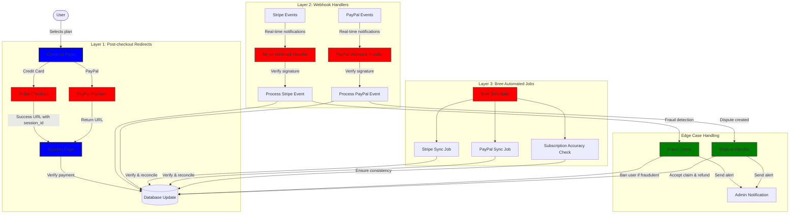
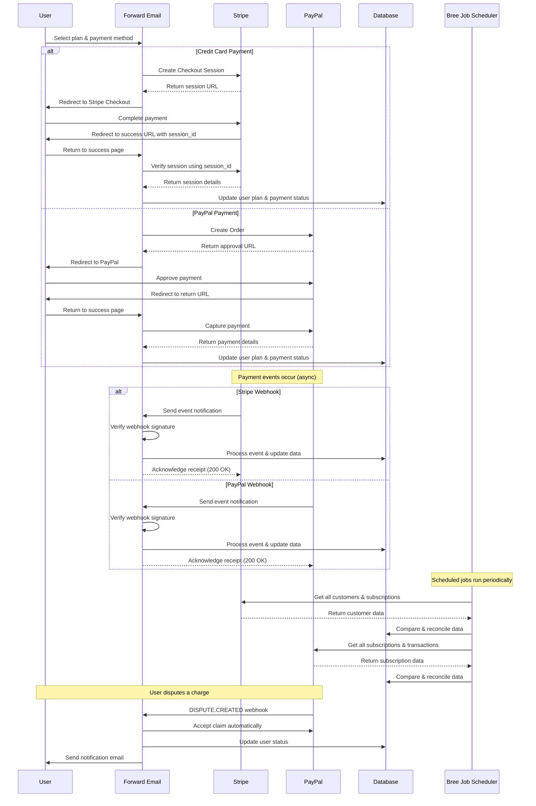
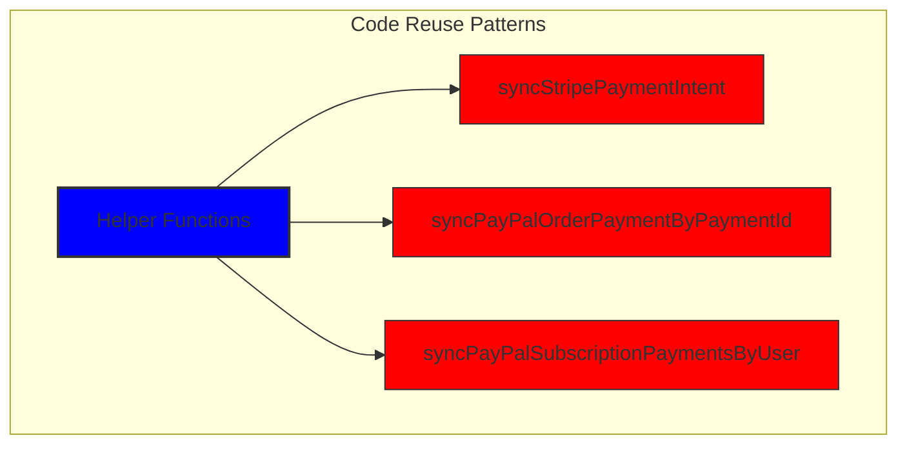
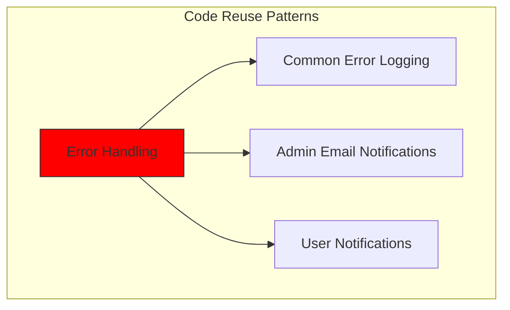
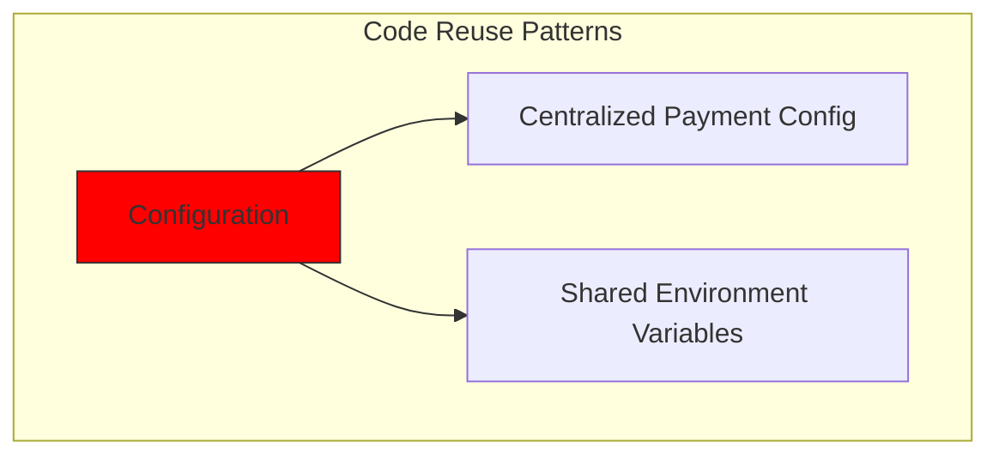
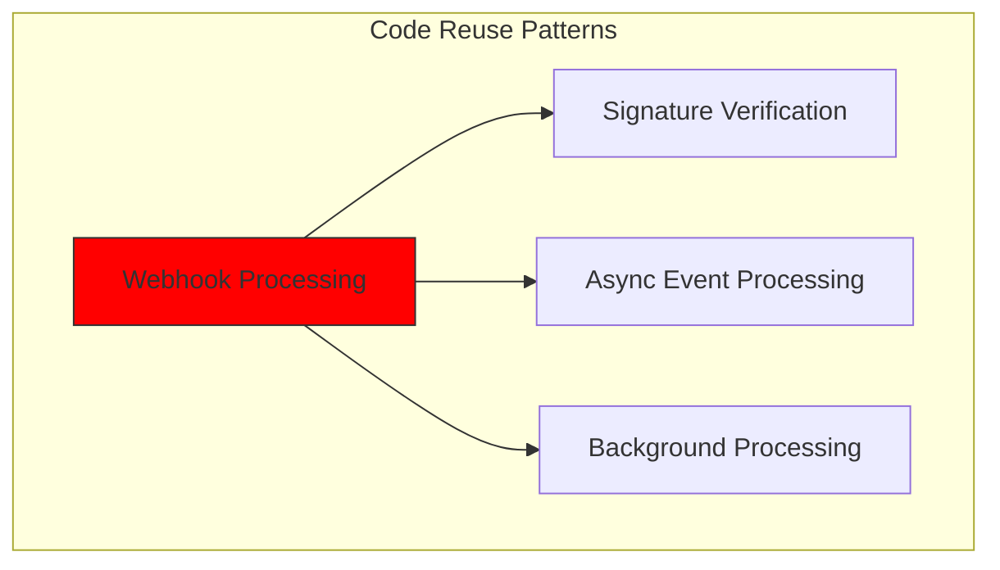
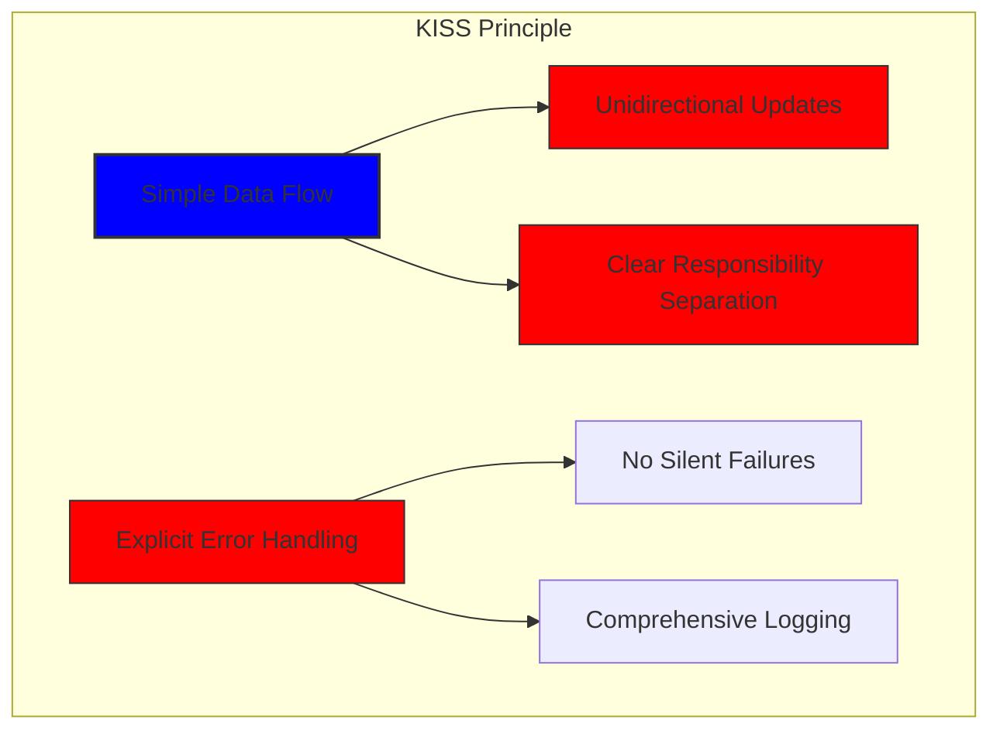
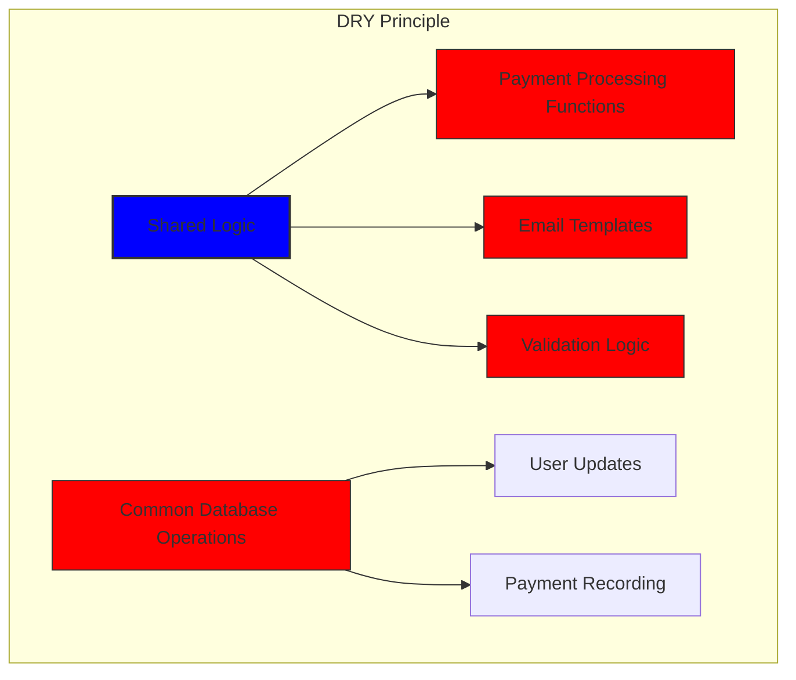

# איך בנינו מערכת תשלומים חזקה עם Stripe ו-PayPal: גישת טריפקטה {#how-we-built-a-robust-payment-system-with-stripe-and-paypal-a-trifecta-approach}


## תוכן עניינים

* [הַקדָמָה](#foreword)
* [האתגר: מעבדי תשלומים מרובים, מקור אחד לאמת](#the-challenge-multiple-payment-processors-one-source-of-truth)
* [גישת הטריפקטה: שלוש שכבות של אמינות](#the-trifecta-approach-three-layers-of-reliability)
* [שכבה 1: הפניות לאחר התשלום](#layer-1-post-checkout-redirects)
  * [הטמעת קופה ב-Stripe](#stripe-checkout-implementation)
  * [זרימת תשלום של PayPal](#paypal-payment-flow)
* [שכבה 2: מטפלי Webhook עם אימות חתימה](#layer-2-webhook-handlers-with-signature-verification)
  * [יישום Webhook של Stripe](#stripe-webhook-implementation)
  * [יישום Webhook של PayPal](#paypal-webhook-implementation)
* [שכבה 3: עבודות אוטומטיות עם Bree](#layer-3-automated-jobs-with-bree)
  * [בודק דיוק המנוי](#subscription-accuracy-checker)
  * [סנכרון מנוי PayPal](#paypal-subscription-synchronization)
* [טיפול במקרי קצה](#handling-edge-cases)
  * [גילוי ומניעת הונאות](#fraud-detection-and-prevention)
  * [טיפול בסכסוכים](#dispute-handling)
* [שימוש חוזר בקוד: עקרונות KISS ו-DRY](#code-reuse-kiss-and-dry-principles)
* [יישום דרישות מנוי לויזה](#visa-subscription-requirements-implementation)
  * [התראות אוטומטיות בדוא"ל לפני חידוש](#automated-pre-renewal-email-notifications)
  * [טיפול במקרי קצה](#handling-edge-cases-1)
  * [תקופות ניסיון ותנאי מנוי](#trial-periods-and-subscription-terms)
* [סיכום: היתרונות של גישת הטריפקטה שלנו](#conclusion-the-benefits-of-our-trifecta-approach)

## הקדמה {#foreword}

ב-Forward Email, תמיד העדפנו יצירת מערכות אמינות, מדויקות וידידותיות למשתמש. כשזה הגיע ליישום מערכת עיבוד התשלומים שלנו, ידענו שאנחנו צריכים פתרון שיכול להתמודד עם מספר מעבדי תשלום תוך שמירה על עקביות נתונים מושלמת. פוסט בבלוג זה מפרט כיצד צוות הפיתוח שלנו שילב את Stripe ואת PayPal באמצעות גישת טריפקטה המבטיחה דיוק בזמן אמת של 1:1 בכל המערכת שלנו.

## האתגר: מעבדי תשלומים מרובים, מקור אחד לאמת {#the-challenge-multiple-payment-processors-one-source-of-truth}

כשירות דוא"ל המתמקד בפרטיות, רצינו להעניק למשתמשים שלנו אפשרויות תשלום. חלקם מעדיפים את הפשטות של תשלומי כרטיסי אשראי דרך Stripe, בעוד שאחרים מעריכים את שכבת ההפרדה הנוספת שמספקת PayPal. עם זאת, תמיכה במספר מעבדי תשלום יוצרת מורכבות משמעותית:

1. כיצד אנו מבטיחים נתונים עקביים במערכות תשלום שונות?
2. כיצד אנו מטפלים במקרים קשים כמו סכסוכים, החזרים או תשלומים כושלים?
3. כיצד אנו שומרים על מקור אמת יחיד במסד הנתונים שלנו?

הפתרון שלנו היה ליישם את מה שאנו מכנים "גישת הטריפקטה" - מערכת תלת-שכבתית המספקת יתירות ומבטיחה עקביות נתונים לא משנה מה קורה.

## גישת הטריפקטה: שלוש שכבות של אמינות {#the-trifecta-approach-three-layers-of-reliability}

מערכת התשלומים שלנו מורכבת משלושה רכיבים קריטיים שעובדים יחד כדי להבטיח סנכרון נתונים מושלם:

1. **הפניות לאחר התשלום** - לכידת פרטי תשלום מיד לאחר התשלום
2. **מטפלי Webhook** - עיבוד אירועים בזמן אמת ממעבדי תשלומים
3. **משימות אוטומטיות** - אימות והתאמה תקופתיים של נתוני תשלום

בואו נתעמק בכל רכיב ונראה כיצד הם פועלים יחד.



## שכבה 1: הפניות לאחר התשלום {#layer-1-post-checkout-redirects}

השכבה הראשונה של גישת הטריפקטה שלנו מתרחשת מיד לאחר שמשתמש משלים תשלום. גם Stripe וגם PayPal מספקים מנגנונים להפניית משתמשים חזרה לאתר שלנו עם פרטי עסקה.

הטמעת ### של Stripe Checkout {#stripe-checkout-implementation}

עבור Stripe, אנו משתמשים ב-API של Checkout Sessions שלהם כדי ליצור חוויית תשלום חלקה. כאשר משתמש בוחר תוכנית ובוחר לשלם באמצעות כרטיס אשראי, אנו יוצרים Checkout Session עם כתובות URL ספציפיות להצלחה וביטול:

```javascript
const options = {
  mode: paymentType === 'one-time' ? 'payment' : 'subscription',
  customer: ctx.state.user[config.userFields.stripeCustomerID],
  client_reference_id: reference,
  metadata: {
    plan
  },
  line_items: [
    {
      price,
      quantity: 1,
      description
    }
  ],
  locale: config.STRIPE_LOCALES.has(ctx.locale) ? ctx.locale : 'auto',
  cancel_url: `${config.urls.web}${ctx.path}${
    isMakePayment || isEnableAutoRenew ? '' : `/?plan=${plan}`
  }`,
  success_url: `${config.urls.web}${ctx.path}/?${
    isMakePayment || isEnableAutoRenew ? '' : `plan=${plan}&`
  }session_id={CHECKOUT_SESSION_ID}`,
  allow_promotion_codes: true
};

// Create the checkout session and redirect
const session = await stripe.checkout.sessions.create(options);
const redirectTo = session.url;
if (ctx.accepts('html')) {
  ctx.status = 303;
  ctx.redirect(redirectTo);
} else {
  ctx.body = { redirectTo };
}
```

החלק הקריטי כאן הוא הפרמטר `success_url`, הכולל את `session_id` כפרמטר שאילתה. כאשר Stripe מפנה את המשתמש חזרה לאתר שלנו לאחר תשלום מוצלח, נוכל להשתמש במזהה הסשן הזה כדי לאמת את העסקה ולעדכן את מסד הנתונים שלנו בהתאם.

### זרימת תשלום PayPal {#paypal-payment-flow}

עבור PayPal, אנו משתמשים בגישה דומה עם ה-API של Orders שלהם:

```javascript
const requestBody = {
  intent: 'CAPTURE',
  application_context: {
    cancel_url: `${config.urls.web}${ctx.path}${
      isMakePayment || isEnableAutoRenew ? '' : `/?plan=${plan}`
    }`,
    return_url: `${config.urls.web}${ctx.path}/?plan=${plan}`,
    brand_name: 'Forward Email',
    shipping_preference: 'NO_SHIPPING',
    user_action: 'PAY_NOW'
  },
  payer: {
    email_address: ctx.state.user.email
  },
  purchase_units: [
    {
      reference_id: ctx.state.user.id,
      description,
      custom_id: sku,
      invoice_id: reference,
      soft_descriptor: sku,
      amount: {
        currency_code: 'USD',
        value: price,
        breakdown: {
          item_total: {
            currency_code: 'USD',
            value: price
          }
        }
      },
      items: [
        {
          name,
          description,
          sku,
          unit_amount: {
            currency_code: 'USD',
            value: price
          },
          quantity: '1',
          category: 'DIGITAL_GOODS'
        }
      ]
    }
  ]
};
```

בדומה ל-Stripe, אנו מגדירים פרמטרים `return_url` ו-`cancel_url` כדי לטפל בהפניות לאחר תשלום. כאשר PayPal מפנה את המשתמש חזרה לאתר שלנו, אנו יכולים ללכוד את פרטי התשלום ולעדכן את מסד הנתונים שלנו.



## שכבה 2: מטפלי Webhook עם אימות חתימה {#layer-2-webhook-handlers-with-signature-verification}

בעוד שהפניות לאחר התשלום פועלות היטב ברוב התרחישים, הן אינן חסינות תקלות. משתמשים עשויים לסגור את הדפדפן שלהם לפני שהם מנותבים מחדש, או שבעיות רשת עלולות למנוע את השלמת ההפניה. כאן נכנסים לתמונה webhooks.

גם Stripe וגם PayPal מספקות מערכות Webhook ששולחות התראות בזמן אמת על אירועי תשלום. יישמנו מערכות Webhook חזקות המאמתות את האותנטיות של התראות אלו ומעבדות אותן בהתאם.

### הטמעת Webhook של Stripe {#stripe-webhook-implementation}

מטפל ה-webhook של Stripe שלנו מאמת את החתימה של אירועי webhook נכנסים כדי לוודא שהם לגיטימיים:

```javascript
async function webhook(ctx) {
  const sig = ctx.request.get('stripe-signature');
  // throw an error if something was wrong
  if (!isSANB(sig))
    throw Boom.badRequest(ctx.translateError('INVALID_STRIPE_SIGNATURE'));
  const event = stripe.webhooks.constructEvent(
    ctx.request.rawBody,
    sig,
    env.STRIPE_ENDPOINT_SECRET
  );
  // throw an error if something was wrong
  if (!event)
    throw Boom.badRequest(ctx.translateError('INVALID_STRIPE_SIGNATURE'));
  ctx.logger.info('stripe webhook', { event });
  // return a response to acknowledge receipt of the event
  ctx.body = { received: true };
  // run in background
  processEvent(ctx, event)
    .then()
    .catch((err) => {
      ctx.logger.fatal(err, { event });
      // email admin errors
      emailHelper({
        template: 'alert',
        message: {
          to: config.email.message.from,
          subject: `Error with Stripe Webhook (Event ID ${event.id})`
        },
        locals: {
          message: `<pre><code>${safeStringify(
            parseErr(err),
            null,
            2
          )}</code></pre>`
        }
      })
        .then()
        .catch((err) => ctx.logger.fatal(err, { event }));
    });
}
```

הפונקציה `stripe.webhooks.constructEvent` מאמתת את החתימה באמצעות סוד נקודת הקצה שלנו. אם החתימה תקפה, אנו מעבדים את האירוע באופן אסינכרוני כדי למנוע חסימת תגובת ה-webhook.

### הטמעת Webhook של PayPal {#paypal-webhook-implementation}

באופן דומה, מטפל ה-webhook של PayPal שלנו מאמת את האותנטיות של הודעות נכנסות:

```javascript
async function webhook(ctx) {
  const response = await promisify(
    paypal.notification.webhookEvent.verify,
    paypal.notification.webhookEvent
  )(ctx.request.headers, ctx.request.body, env.PAYPAL_WEBHOOK_ID);
  // throw an error if something was wrong
  if (!_.isObject(response) || response.verification_status !== 'SUCCESS')
    throw Boom.badRequest(ctx.translateError('INVALID_PAYPAL_SIGNATURE'));
  // return a response to acknowledge receipt of the event
  ctx.body = { received: true };
  // run in background
  processEvent(ctx)
    .then()
    .catch((err) => {
      ctx.logger.fatal(err);
      // email admin errors
      emailHelper({
        template: 'alert',
        message: {
          to: config.email.message.from,
          subject: `Error with PayPal Webhook (Event ID ${ctx.request.body.id})`
        },
        locals: {
          message: `<pre><code>${safeStringify(
            parseErr(err),
            null,
            2
          )}</code></pre>`
        }
      })
        .then()
        .catch((err) => ctx.logger.fatal(err));
    });
}
```

שני מטפלי ה-webhook פועלים לפי אותו דפוס: מאמתים את החתימה, מאשרים קבלה ומעבדים את האירוע באופן אסינכרוני. זה מבטיח שלעולם לא נפספס אירוע תשלום, גם אם ההפניה לאחר התשלום נכשלת.

## שכבה 3: עבודות אוטומטיות עם Bree {#layer-3-automated-jobs-with-bree}

השכבה האחרונה של גישת הטריפקטה שלנו היא קבוצה של משימות אוטומטיות שמאמתות ומתקנים נתוני תשלום מעת לעת. אנו משתמשים ב-Bree, מתזמן משימות עבור Node.js, כדי להריץ משימות אלו במרווחי זמן קבועים.

### בודק דיוק המנוי {#subscription-accuracy-checker}

אחת התפקידים המרכזיים שלנו היא בודק דיוק המנויים, אשר מבטיח שמסד הנתונים שלנו משקף במדויק את סטטוס המנוי ב-Stripe:

```javascript
async function mapper(customer) {
  // wait a second to prevent rate limitation error
  await setTimeout(ms('1s'));
  // check for user on our side
  let user = await Users.findOne({
    [config.userFields.stripeCustomerID]: customer.id
  })
    .lean()
    .exec();
  if (!user) return;
  if (user.is_banned) return;

  // if emails did not match
  if (user.email !== customer.email) {
    logger.info(
      `User email ${user.email} did not match customer email ${customer.email} (${customer.id})`
    );
    customer = await stripe.customers.update(customer.id, {
      email: user.email
    });
    logger.info(`Updated user email to match ${user.email}`);
  }

  // check for active subscriptions
  const [activeSubscriptions, trialingSubscriptions] = await Promise.all([
    stripe.subscriptions.list({
      customer: customer.id,
      status: 'active'
    }),
    stripe.subscriptions.list({
      customer: customer.id,
      status: 'trialing'
    })
  ]);

  // Combine active and trialing subscriptions
  let subscriptions = [
    ...activeSubscriptions.data,
    ...trialingSubscriptions.data
  ];

  // Handle edge case: multiple subscriptions for one user
  if (subscriptions.length > 1) {
    await logger.error(
      new Error(
        `We may need to refund: User had multiple subscriptions ${user.email} (${customer.id})`
      )
    );
    await emailHelper({
      template: 'alert',
      message: {
        to: config.email.message.from,
        subject: `User had multiple subscriptions ${user.email}`
      },
      locals: {
        message: `User ${user.email} (${customer.id}) had multiple subscriptions: ${JSON.stringify(
          subscriptions.map((s) => s.id)
        )}`
      }
    });
  }
}
```

משימה זו בודקת אי התאמות בין מסד הנתונים שלנו לבין Stripe, כגון כתובות דוא"ל לא תואמות או מספר מנויים פעילים. אם היא מוצאת בעיות, היא רושמת אותן ושולחת התראות לצוות הניהול שלנו.

### סנכרון מנוי PayPal {#paypal-subscription-synchronization}

יש לנו עבודה דומה עבור מנויי PayPal:

```javascript
async function syncPayPalSubscriptionPayments() {
  const paypalCustomers = await Users.find({
    $or: [
      {
        [config.userFields.paypalSubscriptionID]: { $exists: true, $ne: null }
      },
      {
        [config.userFields.paypalPayerID]: { $exists: true, $ne: null }
      }
    ]
  })
    // sort by newest customers first
    .sort('-created_at')
    .lean()
    .exec();

  await logger.info(
    `Syncing payments for ${paypalCustomers.length} paypal customers`
  );

  // Process each customer and sync their payments
  const errorEmails = await pReduce(
    paypalCustomers,
    // Implementation details...
  );
}
```

משימות אוטומטיות אלו משמשות כרשת הביטחון הסופית שלנו, ומבטיחות שמסד הנתונים שלנו תמיד משקף את המצב האמיתי של המנויים והתשלומים הן ב-Stripe והן ב-PayPal.

## טיפול במקרי קצה {#handling-edge-cases}

מערכת תשלומים חזקה חייבת להתמודד עם מקרי קצה בצורה חלקה. בואו נבחן כיצד אנו מטפלים בכמה תרחישים נפוצים.

### גילוי ומניעת הונאות {#fraud-detection-and-prevention}

יישמנו מנגנוני זיהוי הונאות מתוחכמים שמזהים ומטפלים באופן אוטומטי בפעילויות תשלום חשודות:

```javascript
case 'charge.failed': {
  // Get all failed charges in the last 30 days
  const charges = await stripe.charges.list({
    customer: event.data.object.customer,
    created: {
      gte: dayjs().subtract(1, 'month').unix()
    }
  });

  // Filter for declined charges
  const filtered = charges.data.filter(
    (d) => d.status === 'failed' && d.failure_code === 'card_declined'
  );

  // if not more than 5 then return early
  if (filtered.length < 5) break;

  // Check if user has verified domains
  const count = await Domains.countDocuments({
    members: {
      $elemMatch: {
        user: user._id,
        group: 'admin'
      }
    },
    plan: { $in: ['enhanced_protection', 'team'] },
    has_txt_record: true
  });

  if (!user.is_banned) {
    // If no verified domains, ban the user and refund all charges
    if (count === 0) {
      // Ban the user
      user.is_banned = true;
      await user.save();

      // Refund all successful charges
    }
  }
}
```

קוד זה חוסם אוטומטית משתמשים שיש להם מספר חיובים שנכשלו ואין להם דומיינים מאומתים, וזהו אינדיקציה חזקה לפעילות הונאה.

### טיפול בסכסוכים {#dispute-handling}

כאשר משתמש מערער על חיוב, אנו מקבלים את התביעה באופן אוטומטי ונוקטים בפעולה המתאימה:

```javascript
case 'CUSTOMER.DISPUTE.CREATED': {
  // accept claim
  const agent = await paypalAgent();
  await agent
    .post(`/v1/customer/disputes/${body.resource.dispute_id}/accept-claim`)
    .send({
      note: 'Full refund to the customer.'
    });

  // Find the payment in our database
  const payment = await Payments.findOne({ $or });
  if (!payment) throw new Error('Payment does not exist');

  const user = await Users.findById(payment.user);
  if (!user) throw new Error('User did not exist for customer');

  // Cancel the user's subscription if they have one
  if (isSANB(user[config.userFields.paypalSubscriptionID])) {
    try {
      const agent = await paypalAgent();
      await agent.post(
        `/v1/billing/subscriptions/${
          user[config.userFields.paypalSubscriptionID]
        }/cancel`
      );
    } catch (err) {
      // Handle subscription cancellation errors
    }
  }
}
```

גישה זו ממזערת את השפעת המחלוקות על העסק שלנו תוך הבטחת חוויית לקוח טובה.

## שימוש חוזר בקוד: עקרונות KISS ו-DRY {#code-reuse-kiss-and-dry-principles}

לאורך כל מערכת התשלומים שלנו, דבקנו בעקרונות KISS (Keep It Simple, Stupid) ו-DRY (Don't Repeat Yourself). הנה כמה דוגמאות:

1. **פונקציות עזר משותפות**: יצרנו פונקציות עזר רב פעמיות עבור משימות נפוצות כמו סנכרון תשלומים ושליחת מיילים.

2. **טיפול עקבי בשגיאות**: גם מטפלי webhook של Stripe וגם של PayPal משתמשים באותו דפוס לטיפול בשגיאות והודעות מנהל.

3. **סכמת מסד נתונים מאוחדת**: סכמת מסד הנתונים שלנו נועדה להכיל נתוני Stripe ו-PayPal כאחד, עם שדות משותפים עבור סטטוס תשלום, סכום ומידע על תוכנית.

4. **תצורה מרכזית**: תצורה הקשורה לתשלום מרוכזת בקובץ אחד, מה שמקל על עדכון תמחור ופרטי מוצרים.













## יישום דרישות מנוי VISA {#visa-subscription-requirements-implementation}

בנוסף לגישת הטריפקטה שלנו, יישמנו תכונות ספציפיות כדי לעמוד בדרישות המנוי של VISA תוך שיפור חוויית המשתמש. דרישה מרכזית אחת מ-VISA היא שמשתמשים חייבים לקבל הודעה לפני חיובם עבור מנוי, במיוחד בעת מעבר מתקופת ניסיון למנוי בתשלום.

### התראות אוטומטיות בדוא"ל לפני חידוש {#automated-pre-renewal-email-notifications}

בנינו מערכת אוטומטית שמזהה משתמשים עם מנויי ניסיון פעילים ושולחת להם התראה בדוא"ל לפני החיוב הראשון שלהם. זה לא רק שומר על עמידתנו בדרישות VISA, אלא גם מפחית חיובים חוזרים ומשפר את שביעות רצון הלקוחות.

כך יישמנו תכונה זו:

```javascript
// Find users with trial subscriptions who haven't received a notification yet
const users = await Users.find({
  $or: [
    {
      $and: [
        { [config.userFields.stripeSubscriptionID]: { $exists: true } },
        { [config.userFields.stripeTrialSentAt]: { $exists: false } },
        // Exclude subscriptions that have already had payments
        ...(paidStripeSubscriptionIds.length > 0
          ? [
              {
                [config.userFields.stripeSubscriptionID]: {
                  $nin: paidStripeSubscriptionIds
                }
              }
            ]
          : [])
      ]
    },
    {
      $and: [
        { [config.userFields.paypalSubscriptionID]: { $exists: true } },
        { [config.userFields.paypalTrialSentAt]: { $exists: false } },
        // Exclude subscriptions that have already had payments
        ...(paidPayPalSubscriptionIds.length > 0
          ? [
              {
                [config.userFields.paypalSubscriptionID]: {
                  $nin: paidPayPalSubscriptionIds
                }
              }
            ]
          : [])
      ]
    }
  ]
});

// Process each user and send notification
for (const user of users) {
  // Get subscription details from payment processor
  const subscription = await getSubscriptionDetails(user);

  // Calculate subscription duration and frequency
  const duration = getDurationFromPlanId(subscription.plan_id);
  const frequency = getHumanReadableFrequency(duration, user.locale);
  const amount = getPlanAmount(user.plan, duration);

  // Get user's domains for personalized email
  const domains = await Domains.find({
    'members.user': user._id
  }).sort('name').lean().exec();

  // Send VISA-compliant notification email
  await emailHelper({
    template: 'visa-trial-subscription-requirement',
    message: {
      to: user.receipt_email || user.email,
      ...(user.receipt_email ? { cc: user.email } : {})
    },
    locals: {
      user,
      firstChargeDate: new Date(subscription.start_time),
      frequency,
      formattedAmount: numeral(amount).format('$0,0,0.00'),
      domains
    }
  });

  // Record that notification was sent
  await Users.findByIdAndUpdate(user._id, {
    $set: {
      [config.userFields.paypalTrialSentAt]: new Date()
    }
  });
}
```

יישום זה מבטיח שהמשתמשים תמיד יהיו מעודכנים לגבי חיובים עתידיים, עם פרטים ברורים לגבי:

1. מתי יתבצע החיוב הראשון
2. תדירות החיובים העתידיים (חודשי, שנתי וכו')
3. הסכום המדויק בו יחויבו
4. אילו דומיינים מכוסים על ידי המנוי שלהם

על ידי אוטומציה של תהליך זה, אנו שומרים על עמידה מושלמת בדרישות VISA (המחייבות הודעה לפחות 7 ימים לפני החיוב) תוך צמצום פניות התמיכה ושיפור חוויית המשתמש הכוללת.

### טיפול במקרי קצה {#handling-edge-cases-1}

היישום שלנו כולל גם טיפול יעיל בשגיאות. אם משהו משתבש במהלך תהליך ההתראה, המערכת שלנו מתריעה אוטומטית לצוות שלנו:

```javascript
try {
  await mapper(user);
} catch (err) {
  logger.error(err);

  // Send alert to administrators
  await emailHelper({
    template: 'alert',
    message: {
      to: config.email.message.from,
      subject: 'VISA Trial Subscription Requirement Error'
    },
    locals: {
      message: `<pre><code>${safeStringify(
        parseErr(err),
        null,
        2
      )}</code></pre>`
    }
  });
}
```

זה מבטיח שגם אם יש בעיה במערכת ההתראות, הצוות שלנו יוכל לטפל בה במהירות ולשמור על עמידה בדרישות VISA.

מערכת התראות המנוי של VISA היא דוגמה נוספת לאופן שבו בנינו את תשתית התשלומים שלנו תוך מחשבה על תאימות וחוויית משתמש, ומשלימה את הגישה המשולשת שלנו כדי להבטיח עיבוד תשלומים אמין ושקוף.

### תקופות ניסיון ותנאי מנוי {#trial-periods-and-subscription-terms}

עבור משתמשים המאפשרים חידוש אוטומטי בתוכניות קיימות, אנו מחשבים את תקופת הניסיון המתאימה כדי להבטיח שלא יחויבו עד שפג תוקף התוכנית הנוכחית שלהם:

```javascript
if (
  isEnableAutoRenew &&
  dayjs(ctx.state.user[config.userFields.planExpiresAt]).isAfter(
    dayjs()
  )
) {
  const hours = dayjs(
    ctx.state.user[config.userFields.planExpiresAt]
  ).diff(dayjs(), 'hours');

  // Handle trial period calculation
}
```

אנו מספקים גם מידע ברור לגבי תנאי המנוי, כולל תדירות חיוב ומדיניות ביטול, וכוללים מטא-נתונים מפורטים לכל מנוי כדי להבטיח מעקב וניהול נאותים.

## סיכום: היתרונות של גישת הטריפקטה שלנו {#conclusion-the-benefits-of-our-trifecta-approach}

הגישה המשולשת שלנו לעיבוד תשלומים סיפקה מספר יתרונות מרכזיים:

1. **אמינות**: על ידי יישום שלוש שכבות של אימות תשלומים, אנו מבטיחים שאף תשלום לא יתפספס או יעובד באופן שגוי.

2. **דיוק**: מסד הנתונים שלנו תמיד משקף את המצב האמיתי של המנויים והתשלומים הן ב-Stripe והן ב-PayPal.

3. **גמישות**: משתמשים יכולים לבחור את אמצעי התשלום המועדף עליהם מבלי לפגוע באמינות המערכת שלנו.

4. **חוסן**: המערכת שלנו מטפלת במקרים בקצה הרשת בצורה חלקה, החל מכשלים ברשת ועד לפעילויות הונאה.

אם אתם מיישמים מערכת תשלומים התומכת במספר מעבדים, אנו ממליצים בחום על גישת טריפקטה זו. היא דורשת מאמץ פיתוח מקדים גדול יותר, אך היתרונות ארוכי הטווח מבחינת אמינות ודיוק שווים את זה.

למידע נוסף על העברת דוא"ל ושירותי הדוא"ל שלנו המתמקדים בפרטיות, בקרו באתר [אֲתַר אִינטֶרנֶט](https://forwardemail.net).

<!-- *מילות מפתח: עיבוד תשלומים, שילוב Stripe, שילוב PayPal, טיפול ב-webhook, סנכרון תשלומים, ניהול מנויים, מניעת הונאות, טיפול בסכסוכים, מערכת תשלומים Node.js, מערכת תשלומים מרובת מעבדים, שילוב שער תשלומים, אימות תשלומים בזמן אמת, עקביות נתוני תשלום, חיוב מנויים, אבטחת תשלומים, אוטומציה של תשלומים, webhooks לתשלום, התאמת תשלומים, מקרי קצה תשלום, טיפול בשגיאות תשלום, דרישות מנוי VISA, הודעות טרום חידוש, תאימות מנוי* -->