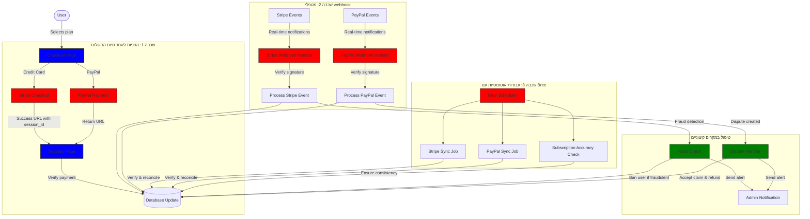
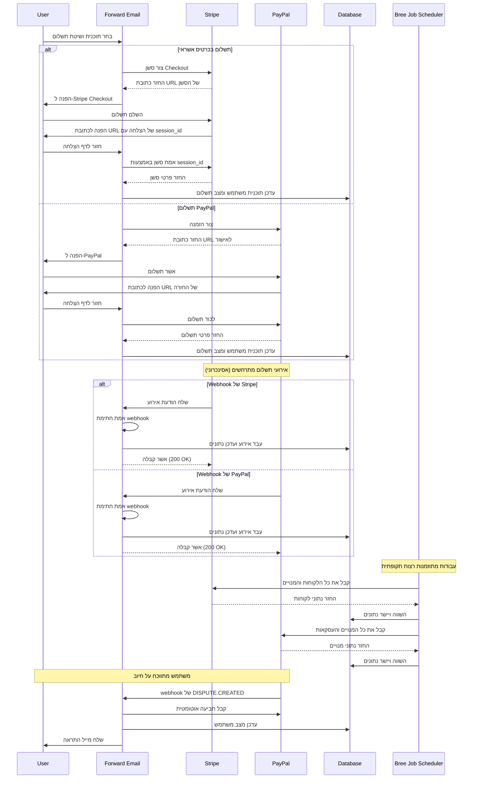
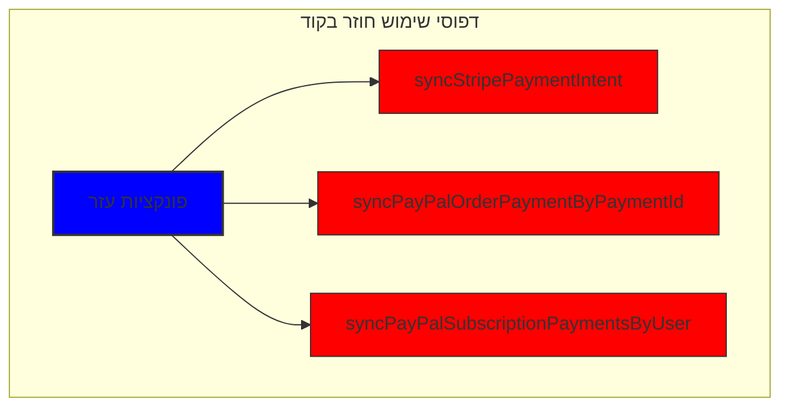
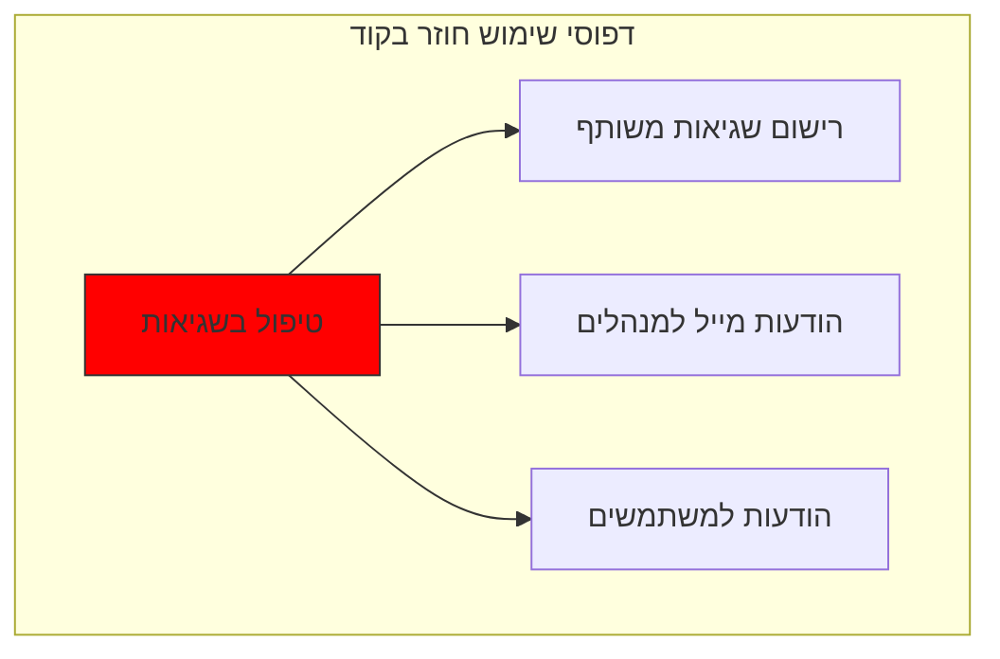
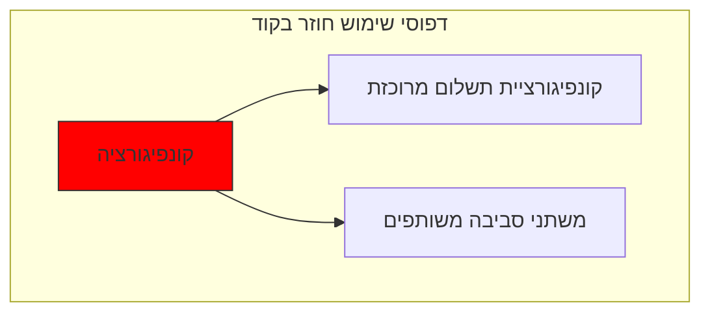
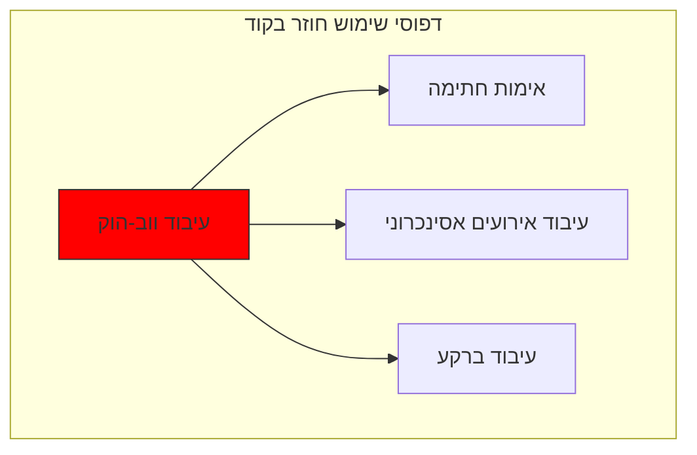
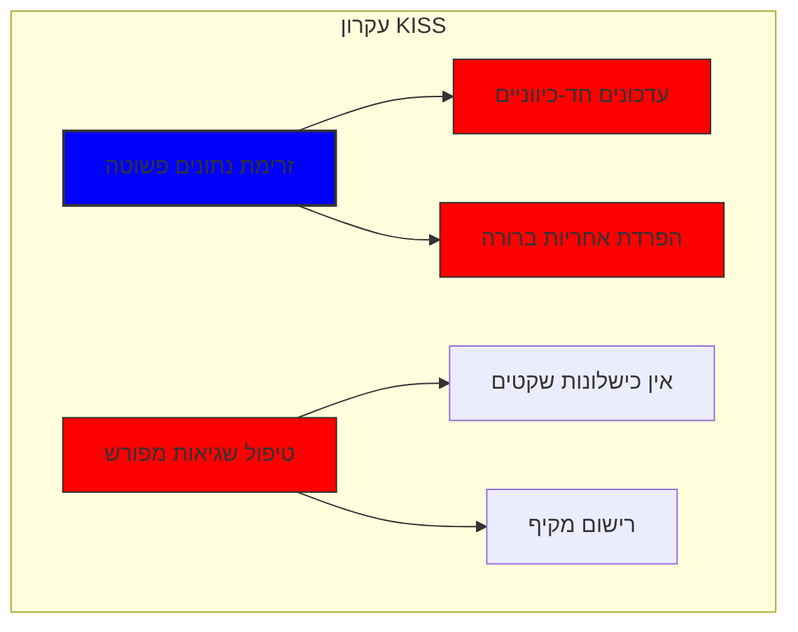

# איך בנינו מערכת תשלומים חזקה עם Stripe ו-PayPal: גישת הטריפלקס {#how-we-built-a-robust-payment-system-with-stripe-and-paypal-a-trifecta-approach}


## תוכן העניינים {#table-of-contents}

* [הקדמה](#foreword)
* [האתגר: מספר מעבדי תשלום, מקור אמת אחד](#the-challenge-multiple-payment-processors-one-source-of-truth)
* [גישת הטריפלקס: שלוש שכבות של אמינות](#the-trifecta-approach-three-layers-of-reliability)
* [שכבה 1: הפניות לאחר סיום התשלום](#layer-1-post-checkout-redirects)
  * [מימוש Stripe Checkout](#stripe-checkout-implementation)
  * [זרימת תשלום ב-PayPal](#paypal-payment-flow)
* [שכבה 2: מטפלי webhook עם אימות חתימה](#layer-2-webhook-handlers-with-signature-verification)
  * [מימוש webhook של Stripe](#stripe-webhook-implementation)
  * [מימוש webhook של PayPal](#paypal-webhook-implementation)
* [שכבה 3: עבודות אוטומטיות עם Bree](#layer-3-automated-jobs-with-bree)
  * [בודק דיוק במנויים](#subscription-accuracy-checker)
  * [סינכרון מנויים ב-PayPal](#paypal-subscription-synchronization)
* [טיפול במקרים קיצוניים](#handling-edge-cases)
  * [זיהוי ומניעת הונאות](#fraud-detection-and-prevention)
  * [טיפול במחלוקות](#dispute-handling)
* [שימוש חוזר בקוד: עקרונות KISS ו-DRY](#code-reuse-kiss-and-dry-principles)
* [מימוש דרישות מנוי VISA](#visa-subscription-requirements-implementation)
  * [התראות דוא"ל אוטומטיות לפני חידוש](#automated-pre-renewal-email-notifications)
  * [טיפול במקרים קיצוניים](#handling-edge-cases-1)
  * [תקופות ניסיון ותנאי מנוי](#trial-periods-and-subscription-terms)
* [סיכום: היתרונות של גישת הטריפלקס שלנו](#conclusion-the-benefits-of-our-trifecta-approach)


## הקדמה {#foreword}

ב-Forward Email, תמיד שמרנו על יצירת מערכות אמינות, מדויקות וידידותיות למשתמש. כשבאנו ליישם את מערכת עיבוד התשלומים שלנו, ידענו שאנחנו צריכים פתרון שיכול להתמודד עם מספר מעבדי תשלום תוך שמירה על עקביות נתונים מושלמת. פוסט הבלוג הזה מפרט כיצד צוות הפיתוח שלנו שילב את Stripe ו-PayPal באמצעות גישת טריפלקס שמבטיחה דיוק בזמן אמת של 1:1 בכל המערכת שלנו.


## האתגר: מספר מעבדי תשלום, מקור אמת אחד {#the-challenge-multiple-payment-processors-one-source-of-truth}

כשירות דוא"ל המתמקד בפרטיות, רצינו להציע למשתמשים שלנו אפשרויות תשלום. חלקם מעדיפים את הפשטות של תשלומי כרטיס אשראי דרך Stripe, בעוד אחרים מעריכים את השכבה הנוספת של הפרדה ש-PayPal מספק. עם זאת, תמיכה במספר מעבדי תשלום יוצרת מורכבות משמעותית:

1. איך נבטיח עקביות נתונים בין מערכות תשלום שונות?
2. איך נטפל במקרים קיצוניים כמו מחלוקות, החזרים או תשלומים שנכשלו?
3. איך נשמור על מקור אמת יחיד בבסיס הנתונים שלנו?

הפתרון שלנו היה ליישם את מה שאנחנו קוראים לו "גישת הטריפלקס" - מערכת בעלת שלוש שכבות שמספקת רדונדנס ומבטיחה עקביות נתונים ללא קשר למה שקורה.


## גישת הטריפלקס: שלוש שכבות של אמינות {#the-trifecta-approach-three-layers-of-reliability}

מערכת התשלומים שלנו מורכבת משלושה רכיבים קריטיים שעובדים יחד כדי להבטיח סינכרון נתונים מושלם:

1. **הפניות לאחר סיום התשלום** - תפיסת מידע על התשלום מיד לאחר הסיום
2. **מטפלי webhook** - עיבוד אירועים בזמן אמת ממעבדי התשלום
3. **עבודות אוטומטיות** - אימות תקופתי ופיוס נתוני תשלום

בואו נצלול לכל רכיב ונראה איך הם פועלים יחד.


```mermaid
flowchart TD
    User([User]) --> |Selects plan| Checkout[Checkout Page]

    %% Layer 1: Post-checkout redirects
    subgraph "שכבה 1: הפניות לאחר סיום התשלום"
        Checkout --> |Credit Card| Stripe[Stripe Checkout]
        Checkout --> |PayPal| PayPal[PayPal Payment]

        Stripe --> |Success URL with session_id| SuccessPage[Success Page]
        PayPal --> |Return URL| SuccessPage

        SuccessPage --> |Verify payment| Database[(Database Update)]
    end

    %% Layer 2: Webhooks
    subgraph "שכבה 2: מטפלי webhook"
        StripeEvents[Stripe Events] --> |Real-time notifications| StripeWebhook[Stripe Webhook Handler]
        PayPalEvents[PayPal Events] --> |Real-time notifications| PayPalWebhook[PayPal Webhook Handler]

        StripeWebhook --> |Verify signature| ProcessStripeEvent[Process Stripe Event]
        PayPalWebhook --> |Verify signature| ProcessPayPalEvent[Process PayPal Event]

        ProcessStripeEvent --> Database
        ProcessPayPalEvent --> Database
    end

    %% Layer 3: Automated jobs
    subgraph "שכבה 3: עבודות אוטומטיות עם Bree"
        BreeScheduler[Bree Scheduler] --> StripeSync[Stripe Sync Job]
        BreeScheduler --> PayPalSync[PayPal Sync Job]
        BreeScheduler --> AccuracyCheck[Subscription Accuracy Check]

        StripeSync --> |Verify & reconcile| Database
        PayPalSync --> |Verify & reconcile| Database
        AccuracyCheck --> |Ensure consistency| Database
    end

    %% Edge cases
    subgraph "טיפול במקרים קיצוניים"
        ProcessStripeEvent --> |Fraud detection| FraudCheck[Fraud Check]
        ProcessPayPalEvent --> |Dispute created| DisputeHandler[Dispute Handler]

        FraudCheck --> |Ban user if fraudulent| Database
        DisputeHandler --> |Accept claim & refund| Database

        FraudCheck --> |Send alert| AdminNotification[Admin Notification]
        DisputeHandler --> |Send alert| AdminNotification
    end

    %% Style definitions
    classDef primary fill:blue,stroke:#333,stroke-width:2px;
    classDef secondary fill:red,stroke:#333,stroke-width:1px;
    classDef tertiary fill:green,stroke:#333,stroke-width:1px;

    class Checkout,SuccessPage primary;
    class Stripe,PayPal,StripeWebhook,PayPalWebhook,BreeScheduler secondary;
    class FraudCheck,DisputeHandler tertiary;
```
## שכבה 1: הפניות לאחר השלמת התשלום {#layer-1-post-checkout-redirects}

השכבה הראשונה בגישת הטריפלקס שלנו מתרחשת מיד לאחר שמשתמש משלים תשלום. גם Stripe וגם PayPal מספקים מנגנונים להפנות משתמשים חזרה לאתר שלנו עם מידע על העסקה.

### יישום Stripe Checkout {#stripe-checkout-implementation}

ל-Stripe, אנו משתמשים ב-Checkout Sessions API שלהם כדי ליצור חווית תשלום חלקה. כאשר משתמש בוחר תוכנית ומחליט לשלם בכרטיס אשראי, אנו יוצרים סשן Checkout עם כתובות URL ספציפיות להצלחה וביטול:

```javascript
const options = {
  mode: paymentType === 'one-time' ? 'payment' : 'subscription',
  customer: ctx.state.user[config.userFields.stripeCustomerID],
  client_reference_id: reference,
  metadata: {
    plan
  },
  line_items: [
    {
      price,
      quantity: 1,
      description
    }
  ],
  locale: config.STRIPE_LOCALES.has(ctx.locale) ? ctx.locale : 'auto',
  cancel_url: `${config.urls.web}${ctx.path}${
    isMakePayment || isEnableAutoRenew ? '' : `/?plan=${plan}`
  }`,
  success_url: `${config.urls.web}${ctx.path}/?${
    isMakePayment || isEnableAutoRenew ? '' : `plan=${plan}&`
  }session_id={CHECKOUT_SESSION_ID}`,
  allow_promotion_codes: true
};

// Create the checkout session and redirect
const session = await stripe.checkout.sessions.create(options);
const redirectTo = session.url;
if (ctx.accepts('html')) {
  ctx.status = 303;
  ctx.redirect(redirectTo);
} else {
  ctx.body = { redirectTo };
}
```

החלק הקריטי כאן הוא הפרמטר `success_url`, הכולל את `session_id` כפרמטר שאילתה. כאשר Stripe מפנה את המשתמש חזרה לאתר שלנו לאחר תשלום מוצלח, אנו יכולים להשתמש במזהה הסשן הזה כדי לאמת את העסקה ולעדכן את מסד הנתונים שלנו בהתאם.

### זרימת תשלום PayPal {#paypal-payment-flow}

ל-PayPal, אנו משתמשים בגישה דומה עם Orders API שלהם:

```javascript
const requestBody = {
  intent: 'CAPTURE',
  application_context: {
    cancel_url: `${config.urls.web}${ctx.path}${
      isMakePayment || isEnableAutoRenew ? '' : `/?plan=${plan}`
    }`,
    return_url: `${config.urls.web}${ctx.path}/?plan=${plan}`,
    brand_name: 'Forward Email',
    shipping_preference: 'NO_SHIPPING',
    user_action: 'PAY_NOW'
  },
  payer: {
    email_address: ctx.state.user.email
  },
  purchase_units: [
    {
      reference_id: ctx.state.user.id,
      description,
      custom_id: sku,
      invoice_id: reference,
      soft_descriptor: sku,
      amount: {
        currency_code: 'USD',
        value: price,
        breakdown: {
          item_total: {
            currency_code: 'USD',
            value: price
          }
        }
      },
      items: [
        {
          name,
          description,
          sku,
          unit_amount: {
            currency_code: 'USD',
            value: price
          },
          quantity: '1',
          category: 'DIGITAL_GOODS'
        }
      ]
    }
  ]
};
```

בדומה ל-Stripe, אנו מגדירים את הפרמטרים `return_url` ו-`cancel_url` כדי לטפל בהפניות לאחר התשלום. כאשר PayPal מפנה את המשתמש חזרה לאתר שלנו, אנו יכולים ללכוד את פרטי התשלום ולעדכן את מסד הנתונים שלנו.


```mermaid
sequenceDiagram
    participant User
    participant FE as Forward Email
    participant Stripe
    participant PayPal
    participant DB as Database
    participant Bree as Bree Job Scheduler

    %% Initial checkout flow
    User->>FE: בחר תוכנית ושיטת תשלום

    alt תשלום בכרטיס אשראי
        FE->>Stripe: צור סשן Checkout
        Stripe-->>FE: החזר כתובת URL של הסשן
        FE->>User: הפנה ל-Stripe Checkout
        User->>Stripe: השלם תשלום
        Stripe->>User: הפנה לכתובת URL של הצלחה עם session_id
        User->>FE: חזור לדף הצלחה
        FE->>Stripe: אמת סשן באמצעות session_id
        Stripe-->>FE: החזר פרטי סשן
        FE->>DB: עדכן תוכנית משתמש ומצב תשלום
    else תשלום PayPal
        FE->>PayPal: צור הזמנה
        PayPal-->>FE: החזר כתובת URL לאישור
        FE->>User: הפנה ל-PayPal
        User->>PayPal: אשר תשלום
        PayPal->>User: הפנה לכתובת URL של החזרה
        User->>FE: חזור לדף הצלחה
        FE->>PayPal: לכוד תשלום
        PayPal-->>FE: החזר פרטי תשלום
        FE->>DB: עדכן תוכנית משתמש ומצב תשלום
    end

    %% Webhook flow (asynchronous)
    Note over Stripe,PayPal: אירועי תשלום מתרחשים (אסינכרוני)

    alt Webhook של Stripe
        Stripe->>FE: שלח הודעת אירוע
        FE->>FE: אמת חתימת webhook
        FE->>DB: עבד אירוע ועדכן נתונים
        FE-->>Stripe: אשר קבלה (200 OK)
    else Webhook של PayPal
        PayPal->>FE: שלח הודעת אירוע
        FE->>FE: אמת חתימת webhook
        FE->>DB: עבד אירוע ועדכן נתונים
        FE-->>PayPal: אשר קבלה (200 OK)
    end

    %% עבודות אוטומטיות של Bree
    Note over Bree: עבודות מתוזמנות רצות תקופתית

    Bree->>Stripe: קבל את כל הלקוחות והמנויים
    Stripe-->>Bree: החזר נתוני לקוחות
    Bree->>DB: השווה ויישר נתונים

    Bree->>PayPal: קבל את כל המנויים והעסקאות
    PayPal-->>Bree: החזר נתוני מנויים
    Bree->>DB: השווה ויישר נתונים

    %% מקרה קצה: טיפול במחלוקת
    Note over User,PayPal: משתמש מתווכח על חיוב

    PayPal->>FE: webhook של DISPUTE.CREATED
    FE->>PayPal: קבל תביעה אוטומטית
    FE->>DB: עדכן מצב משתמש
    FE->>User: שלח מייל התראה
```
## שכבה 2: מטפלי וובוק עם אימות חתימה {#layer-2-webhook-handlers-with-signature-verification}

בעוד שהפניות לאחר התשלום עובדות היטב ברוב התרחישים, הן לא חסינות מפני טעויות. משתמשים עשויים לסגור את הדפדפן לפני ההפניה, או שבעיות ברשת ימנעו את השלמת ההפניה. כאן נכנסים לתמונה הוובוקים.

גם Stripe וגם PayPal מספקים מערכות וובוק ששולחות התראות בזמן אמת על אירועי תשלום. יישמנו מטפלי וובוק חזקים שמאמתים את האותנטיות של ההתראות האלו ומעבדים אותן בהתאם.

### יישום וובוק של Stripe {#stripe-webhook-implementation}

מטפל הוובוק של Stripe שלנו מאמת את חתימת אירועי הוובוק הנכנסים כדי לוודא שהם לגיטימיים:

```javascript
async function webhook(ctx) {
  const sig = ctx.request.get('stripe-signature');
  // throw an error if something was wrong
  if (!isSANB(sig))
    throw Boom.badRequest(ctx.translateError('INVALID_STRIPE_SIGNATURE'));
  const event = stripe.webhooks.constructEvent(
    ctx.request.rawBody,
    sig,
    env.STRIPE_ENDPOINT_SECRET
  );
  // throw an error if something was wrong
  if (!event)
    throw Boom.badRequest(ctx.translateError('INVALID_STRIPE_SIGNATURE'));
  ctx.logger.info('stripe webhook', { event });
  // return a response to acknowledge receipt of the event
  ctx.body = { received: true };
  // run in background
  processEvent(ctx, event)
    .then()
    .catch((err) => {
      ctx.logger.fatal(err, { event });
      // email admin errors
      emailHelper({
        template: 'alert',
        message: {
          to: config.email.message.from,
          subject: `Error with Stripe Webhook (Event ID ${event.id})`
        },
        locals: {
          message: `<pre><code>${safeStringify(
            parseErr(err),
            null,
            2
          )}</code></pre>`
        }
      })
        .then()
        .catch((err) => ctx.logger.fatal(err, { event }));
    });
}
```

הפונקציה `stripe.webhooks.constructEvent` מאמתת את החתימה באמצעות הסוד של נקודת הקצה שלנו. אם החתימה תקפה, אנו מעבדים את האירוע באופן אסינכרוני כדי למנוע חסימת תגובת הוובוק.

### יישום וובוק של PayPal {#paypal-webhook-implementation}

באופן דומה, מטפל הוובוק של PayPal שלנו מאמת את האותנטיות של ההתראות הנכנסות:

```javascript
async function webhook(ctx) {
  const response = await promisify(
    paypal.notification.webhookEvent.verify,
    paypal.notification.webhookEvent
  )(ctx.request.headers, ctx.request.body, env.PAYPAL_WEBHOOK_ID);
  // throw an error if something was wrong
  if (!_.isObject(response) || response.verification_status !== 'SUCCESS')
    throw Boom.badRequest(ctx.translateError('INVALID_PAYPAL_SIGNATURE'));
  // return a response to acknowledge receipt of the event
  ctx.body = { received: true };
  // run in background
  processEvent(ctx)
    .then()
    .catch((err) => {
      ctx.logger.fatal(err);
      // email admin errors
      emailHelper({
        template: 'alert',
        message: {
          to: config.email.message.from,
          subject: `Error with PayPal Webhook (Event ID ${ctx.request.body.id})`
        },
        locals: {
          message: `<pre><code>${safeStringify(
            parseErr(err),
            null,
            2
          )}</code></pre>`
        }
      })
        .then()
        .catch((err) => ctx.logger.fatal(err));
    });
}
```

שני מטפלי הוובוק פועלים באותו דפוס: מאמתים את החתימה, מאשרים את קבלת האירוע, ומעבדים את האירוע באופן אסינכרוני. זה מבטיח שלא נפספס אף אירוע תשלום, גם אם ההפניה לאחר התשלום נכשלת.


## שכבה 3: עבודות אוטומטיות עם Bree {#layer-3-automated-jobs-with-bree}

השכבה הסופית בגישת השלישייה שלנו היא סט של עבודות אוטומטיות שבודקות ומיישרות את נתוני התשלום באופן תקופתי. אנו משתמשים ב-Bree, מתזמן עבודות ל-Node.js, כדי להריץ את העבודות האלה בפרקי זמן קבועים.

### בודק דיוק המנוי {#subscription-accuracy-checker}

אחת מהעבודות המרכזיות שלנו היא בודק דיוק המנוי, שמוודא שהמסד נתונים שלנו משקף במדויק את מצב המנוי ב-Stripe:
```javascript
async function mapper(customer) {
  // wait a second to prevent rate limitation error
  await setTimeout(ms('1s'));
  // check for user on our side
  let user = await Users.findOne({
    [config.userFields.stripeCustomerID]: customer.id
  })
    .lean()
    .exec();
  if (!user) return;
  if (user.is_banned) return;

  // if emails did not match
  if (user.email !== customer.email) {
    logger.info(
      `User email ${user.email} did not match customer email ${customer.email} (${customer.id})`
    );
    customer = await stripe.customers.update(customer.id, {
      email: user.email
    });
    logger.info(`Updated user email to match ${user.email}`);
  }

  // check for active subscriptions
  const [activeSubscriptions, trialingSubscriptions] = await Promise.all([
    stripe.subscriptions.list({
      customer: customer.id,
      status: 'active'
    }),
    stripe.subscriptions.list({
      customer: customer.id,
      status: 'trialing'
    })
  ]);

  // Combine active and trialing subscriptions
  let subscriptions = [
    ...activeSubscriptions.data,
    ...trialingSubscriptions.data
  ];

  // Handle edge case: multiple subscriptions for one user
  if (subscriptions.length > 1) {
    await logger.error(
      new Error(
        `We may need to refund: User had multiple subscriptions ${user.email} (${customer.id})`
      )
    );
    await emailHelper({
      template: 'alert',
      message: {
        to: config.email.message.from,
        subject: `User had multiple subscriptions ${user.email}`
      },
      locals: {
        message: `User ${user.email} (${customer.id}) had multiple subscriptions: ${JSON.stringify(
          subscriptions.map((s) => s.id)
        )}`
      }
    });
  }
}
```

This job checks for discrepancies between our database and Stripe, such as mismatched email addresses or multiple active subscriptions. If it finds any issues, it logs them and sends alerts to our admin team.

### PayPal Subscription Synchronization {#paypal-subscription-synchronization}

We have a similar job for PayPal subscriptions:

```javascript
async function syncPayPalSubscriptionPayments() {
  const paypalCustomers = await Users.find({
    $or: [
      {
        [config.userFields.paypalSubscriptionID]: { $exists: true, $ne: null }
      },
      {
        [config.userFields.paypalPayerID]: { $exists: true, $ne: null }
      }
    ]
  })
    // sort by newest customers first
    .sort('-created_at')
    .lean()
    .exec();

  await logger.info(
    `Syncing payments for ${paypalCustomers.length} paypal customers`
  );

  // Process each customer and sync their payments
  const errorEmails = await pReduce(
    paypalCustomers,
    // Implementation details...
  );
}
```

These automated jobs serve as our final safety net, ensuring that our database always reflects the true state of subscriptions and payments in both Stripe and PayPal.


## Handling Edge Cases {#handling-edge-cases}

A robust payment system must handle edge cases gracefully. Let's look at how we handle some common scenarios.

### Fraud Detection and Prevention {#fraud-detection-and-prevention}

We've implemented sophisticated fraud detection mechanisms that automatically identify and handle suspicious payment activities:

```javascript
case 'charge.failed': {
  // Get all failed charges in the last 30 days
  const charges = await stripe.charges.list({
    customer: event.data.object.customer,
    created: {
      gte: dayjs().subtract(1, 'month').unix()
    }
  });

  // Filter for declined charges
  const filtered = charges.data.filter(
    (d) => d.status === 'failed' && d.failure_code === 'card_declined'
  );

  // if not more than 5 then return early
  if (filtered.length < 5) break;

  // Check if user has verified domains
  const count = await Domains.countDocuments({
    members: {
      $elemMatch: {
        user: user._id,
        group: 'admin'
      }
    },
    plan: { $in: ['enhanced_protection', 'team'] },
    has_txt_record: true
  });

  if (!user.is_banned) {
    // If no verified domains, ban the user and refund all charges
    if (count === 0) {
      // Ban the user
      user.is_banned = true;
      await user.save();

      // Refund all successful charges
    }
  }
}
```

קוד זה אוטומטית חוסם משתמשים שיש להם מספר ניסיונות חיוב שנכשלו ואין להם דומיינים מאומתים, מה שמצביע חזק על פעילות הונאה.

### טיפול במחלוקות {#dispute-handling}

כאשר משתמש מתווכח על חיוב, אנו מקבלים אוטומטית את הטענה ונוקטים בפעולה המתאימה:

```javascript
case 'CUSTOMER.DISPUTE.CREATED': {
  // לקבלת הטענה
  const agent = await paypalAgent();
  await agent
    .post(`/v1/customer/disputes/${body.resource.dispute_id}/accept-claim`)
    .send({
      note: 'החזר מלא ללקוח.'
    });

  // מציאת התשלום במסד הנתונים שלנו
  const payment = await Payments.findOne({ $or });
  if (!payment) throw new Error('התשלום לא קיים');

  const user = await Users.findById(payment.user);
  if (!user) throw new Error('המשתמש לא קיים עבור הלקוח');

  // ביטול המנוי של המשתמש אם יש לו כזה
  if (isSANB(user[config.userFields.paypalSubscriptionID])) {
    try {
      const agent = await paypalAgent();
      await agent.post(
        `/v1/billing/subscriptions/${
          user[config.userFields.paypalSubscriptionID]
        }/cancel`
      );
    } catch (err) {
      // טיפול בשגיאות ביטול מנוי
    }
  }
}
```

גישה זו ממזערת את ההשפעה של מחלוקות על העסק שלנו תוך שמירה על חוויית לקוח טובה.


## שימוש חוזר בקוד: עקרונות KISS ו-DRY {#code-reuse-kiss-and-dry-principles}

במהלך מערכת התשלומים שלנו, שמרנו על עקרונות KISS (שמור על זה פשוט, טיפש) ו-DRY (אל תחזור על עצמך). הנה כמה דוגמאות:

1. **פונקציות עזר משותפות**: יצרנו פונקציות עזר שניתן להשתמש בהן מחדש למשימות נפוצות כמו סנכרון תשלומים ושליחת מיילים.

2. **טיפול שגיאות עקבי**: גם מטפלי הווב-הוקים של Stripe וגם של PayPal משתמשים באותו דפוס לטיפול בשגיאות והודעות למנהלים.

3. **סכמת מסד נתונים מאוחדת**: סכמת מסד הנתונים שלנו מעוצבת לתמוך גם בנתוני Stripe וגם בנתוני PayPal, עם שדות משותפים למצב תשלום, סכום ומידע על התכנית.

4. **קונפיגורציה מרוכזת**: קונפיגורציה הקשורה לתשלומים מרוכזת בקובץ אחד, מה שמקל על עדכון מחירים ומידע על מוצרים.


```mermaid
graph TD
    subgraph "דפוסי שימוש חוזר בקוד"
        A[פונקציות עזר] --> B[syncStripePaymentIntent]
        A --> C[syncPayPalOrderPaymentByPaymentId]
        A --> D[syncPayPalSubscriptionPaymentsByUser]
    end

    classDef primary fill:blue,stroke:#333,stroke-width:2px;
    classDef secondary fill:red,stroke:#333,stroke-width:1px;

    class A,P,V primary;
    class B,C,D,E,I,L,Q,R,S,W,X,Y,Z secondary;
```


```mermaid
graph TD
    subgraph "דפוסי שימוש חוזר בקוד"
        E[טיפול בשגיאות] --> F[רישום שגיאות משותף]
        E --> G[הודעות מייל למנהלים]
        E --> H[הודעות למשתמשים]
    end

    classDef primary fill:blue,stroke:#333,stroke-width:2px;
    classDef secondary fill:red,stroke:#333,stroke-width:1px;

    class A,P,V primary;
    class B,C,D,E,I,L,Q,R,S,W,X,Y,Z secondary;
```


```mermaid
graph TD
    subgraph "דפוסי שימוש חוזר בקוד"
        I[קונפיגורציה] --> J[קונפיגורציית תשלום מרוכזת]
        I --> K[משתני סביבה משותפים]
    end

    classDef primary fill:blue,stroke:#333,stroke-width:2px;
    classDef secondary fill:red,stroke:#333,stroke-width:1px;

    class A,P,V primary;
    class B,C,D,E,I,L,Q,R,S,W,X,Y,Z secondary;
```


```mermaid
graph TD
    subgraph "דפוסי שימוש חוזר בקוד"
        L[עיבוד ווב-הוק] --> M[אימות חתימה]
        L --> N[עיבוד אירועים אסינכרוני]
        L --> O[עיבוד ברקע]
    end

    classDef primary fill:blue,stroke:#333,stroke-width:2px;
    classDef secondary fill:red,stroke:#333,stroke-width:1px;

    class A,P,V primary;
    class B,C,D,E,I,L,Q,R,S,W,X,Y,Z secondary;
```


```mermaid
graph TD
    subgraph "עקרון KISS"
        P[זרימת נתונים פשוטה] --> Q[עדכונים חד-כיווניים]
        P --> R[הפרדת אחריות ברורה]

        S[טיפול שגיאות מפורש] --> T[אין כישלונות שקטים]
        S --> U[רישום מקיף]
    end

    classDef primary fill:blue,stroke:#333,stroke-width:2px;
    classDef secondary fill:red,stroke:#333,stroke-width:1px;

    class A,P,V primary;
    class B,C,D,E,I,L,Q,R,S,W,X,Y,Z secondary;
```
graph TD
    subgraph "עקרון DRY"
        V[לוגיקה משותפת] --> W[פונקציות עיבוד תשלום]
        V --> X[תבניות אימייל]
        V --> Y[לוגיקת אימות]

        Z[פעולות בסיס נתונים משותפות] --> AA[עדכוני משתמש]
        Z --> AB[רישום תשלום]
    end

    classDef primary fill:blue,stroke:#333,stroke-width:2px;
    classDef secondary fill:red,stroke:#333,stroke-width:1px;

    class A,P,V primary;
    class B,C,D,E,I,L,Q,R,S,W,X,Y,Z secondary;
```


## יישום דרישות המנוי של VISA {#visa-subscription-requirements-implementation}

בנוסף לגישת הטריפלקס שלנו, יישמנו תכונות ספציפיות כדי לעמוד בדרישות המנוי של VISA תוך שיפור חוויית המשתמש. דרישה מרכזית מ-VISA היא שיש להודיע למשתמשים לפני שהם מחויבים על מנוי, במיוחד במעבר מניסיון חינם למנוי בתשלום.

### התראות אימייל אוטומטיות לפני חידוש {#automated-pre-renewal-email-notifications}

בנינו מערכת אוטומטית שמזהה משתמשים עם מנויים לניסיון פעיל ושולחת להם אימייל התראה לפני מתבצעת החיוב הראשון. זה לא רק שומר על עמידה בדרישות VISA אלא גם מפחית החזרות חיוב ומשפר את שביעות רצון הלקוחות.

כך יישמנו את התכונה הזו:

```javascript
// מציאת משתמשים עם מנויי ניסיון שעדיין לא קיבלו התראה
const users = await Users.find({
  $or: [
    {
      $and: [
        { [config.userFields.stripeSubscriptionID]: { $exists: true } },
        { [config.userFields.stripeTrialSentAt]: { $exists: false } },
        // לא לכלול מנויים שכבר בוצעו עבורם תשלומים
        ...(paidStripeSubscriptionIds.length > 0
          ? [
              {
                [config.userFields.stripeSubscriptionID]: {
                  $nin: paidStripeSubscriptionIds
                }
              }
            ]
          : [])
      ]
    },
    {
      $and: [
        { [config.userFields.paypalSubscriptionID]: { $exists: true } },
        { [config.userFields.paypalTrialSentAt]: { $exists: false } },
        // לא לכלול מנויים שכבר בוצעו עבורם תשלומים
        ...(paidPayPalSubscriptionIds.length > 0
          ? [
              {
                [config.userFields.paypalSubscriptionID]: {
                  $nin: paidPayPalSubscriptionIds
                }
              }
            ]
          : [])
      ]
    }
  ]
});

// עיבוד כל משתמש ושליחת התראה
for (const user of users) {
  // קבלת פרטי המנוי ממעבד התשלום
  const subscription = await getSubscriptionDetails(user);

  // חישוב משך המנוי ותדירותו
  const duration = getDurationFromPlanId(subscription.plan_id);
  const frequency = getHumanReadableFrequency(duration, user.locale);
  const amount = getPlanAmount(user.plan, duration);

  // קבלת הדומיינים של המשתמש לאימייל מותאם אישית
  const domains = await Domains.find({
    'members.user': user._id
  }).sort('name').lean().exec();

  // שליחת אימייל התראה התואם לדרישות VISA
  await emailHelper({
    template: 'visa-trial-subscription-requirement',
    message: {
      to: user.receipt_email || user.email,
      ...(user.receipt_email ? { cc: user.email } : {})
    },
    locals: {
      user,
      firstChargeDate: new Date(subscription.start_time),
      frequency,
      formattedAmount: numeral(amount).format('$0,0,0.00'),
      domains
    }
  });

  // רישום שההתראה נשלחה
  await Users.findByIdAndUpdate(user._id, {
    $set: {
      [config.userFields.paypalTrialSentAt]: new Date()
    }
  });
}
```

יישום זה מבטיח שהמשתמשים תמיד יקבלו מידע על חיובים עתידיים, עם פרטים ברורים לגבי:

1. מתי יבוצע החיוב הראשון
2. תדירות החיובים העתידיים (חודשי, שנתי וכו')
3. הסכום המדויק שיחויבו בו
4. אילו דומיינים כלולים במנוי שלהם

באמצעות אוטומציה של התהליך, אנו שומרים על עמידה מושלמת בדרישות VISA (שדורשות הודעה לפחות 7 ימים לפני החיוב) תוך הפחתת פניות לתמיכה ושיפור חוויית המשתמש הכוללת.
### טיפול במקרי קצה {#handling-edge-cases-1}

היישום שלנו כולל גם טיפול שגיאות חזק. אם משהו משתבש במהלך תהליך ההודעה, המערכת שלנו מתריעה אוטומטית לצוות שלנו:

```javascript
try {
  await mapper(user);
} catch (err) {
  logger.error(err);

  // שליחת התרעה למנהלים
  await emailHelper({
    template: 'alert',
    message: {
      to: config.email.message.from,
      subject: 'שגיאה בדרישת מנוי ניסיון של VISA'
    },
    locals: {
      message: `<pre><code>${safeStringify(
        parseErr(err),
        null,
        2
      )}</code></pre>`
    }
  });
}
```

זה מבטיח שגם אם יש בעיה במערכת ההודעות, הצוות שלנו יכול לטפל בה במהירות ולשמור על תאימות לדרישות VISA.

מערכת ההודעות למנוי VISA היא דוגמה נוספת לאופן שבו בנינו את תשתית התשלום שלנו תוך התחשבות גם בתאימות וגם בחוויית המשתמש, ומשלימה את גישת הטריפלקס שלנו כדי להבטיח עיבוד תשלומים אמין ושקוף.

### תקופות ניסיון ותנאי מנוי {#trial-periods-and-subscription-terms}

למשתמשים שמפעילים חידוש אוטומטי בתכניות קיימות, אנו מחשבים את תקופת הניסיון המתאימה כדי לוודא שלא יחויבו עד שתכניתם הנוכחית תסתיים:

```javascript
if (
  isEnableAutoRenew &&
  dayjs(ctx.state.user[config.userFields.planExpiresAt]).isAfter(
    dayjs()
  )
) {
  const hours = dayjs(
    ctx.state.user[config.userFields.planExpiresAt]
  ).diff(dayjs(), 'hours');

  // טיפול בחישוב תקופת הניסיון
}
```

אנו גם מספקים מידע ברור על תנאי המנוי, כולל תדירות החיוב ומדיניות הביטול, ומכלילים מטא-דאטה מפורטת עם כל מנוי כדי להבטיח מעקב וניהול תקינים.

## סיכום: היתרונות של גישת הטריפלקס שלנו {#conclusion-the-benefits-of-our-trifecta-approach}

גישת הטריפלקס שלנו לעיבוד תשלומים סיפקה מספר יתרונות מרכזיים:

1. **אמינות**: על ידי יישום שלוש שכבות של אימות תשלום, אנו מבטיחים שלא יחסר או יעובד תשלום בצורה שגויה.

2. **דיוק**: בסיס הנתונים שלנו תמיד משקף את המצב האמיתי של המנויים והתשלומים הן ב-Stripe והן ב-PayPal.

3. **גמישות**: משתמשים יכולים לבחור את שיטת התשלום המועדפת עליהם מבלי לפגוע באמינות המערכת שלנו.

4. **חוסן**: המערכת שלנו מטפלת במקרי קצה בצורה חלקה, מכשלות רשת ועד פעילויות הונאה.

אם אתם מיישמים מערכת תשלום התומכת במספר מעבדים, אנו ממליצים בחום על גישת הטריפלקס הזו. היא דורשת מאמץ פיתוח ראשוני גדול יותר, אך היתרונות לטווח הארוך מבחינת אמינות ודיוק שווים את זה בהחלט.

למידע נוסף על Forward Email ועל שירותי הדואר האלקטרוני שלנו הממוקדים בפרטיות, בקרו באתר שלנו ב-[website](https://forwardemail.net).

<!-- *Keywords: payment processing, Stripe integration, PayPal integration, webhook handling, payment synchronization, subscription management, fraud prevention, dispute handling, Node.js payment system, multi-processor payment system, payment gateway integration, real-time payment verification, payment data consistency, subscription billing, payment security, payment automation, payment webhooks, payment reconciliation, payment edge cases, payment error handling, VISA subscription requirements, pre-renewal notifications, subscription compliance* -->
