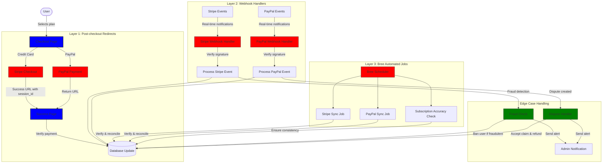
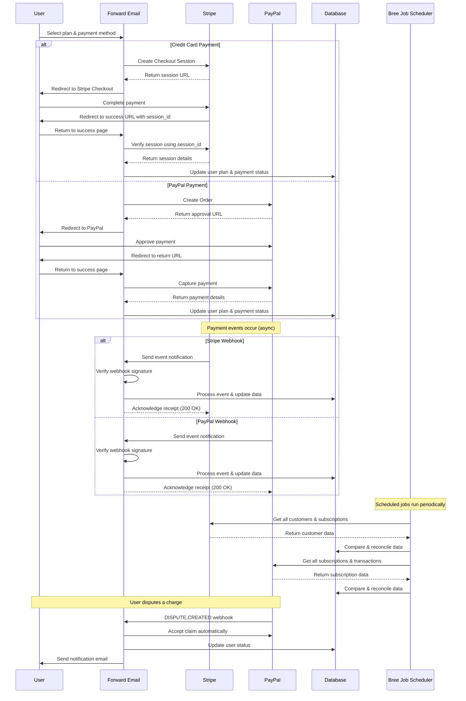
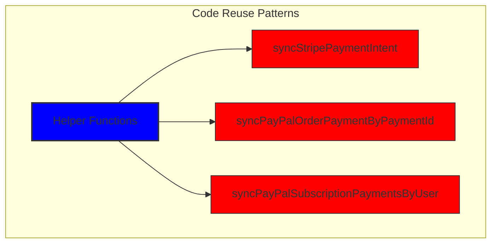
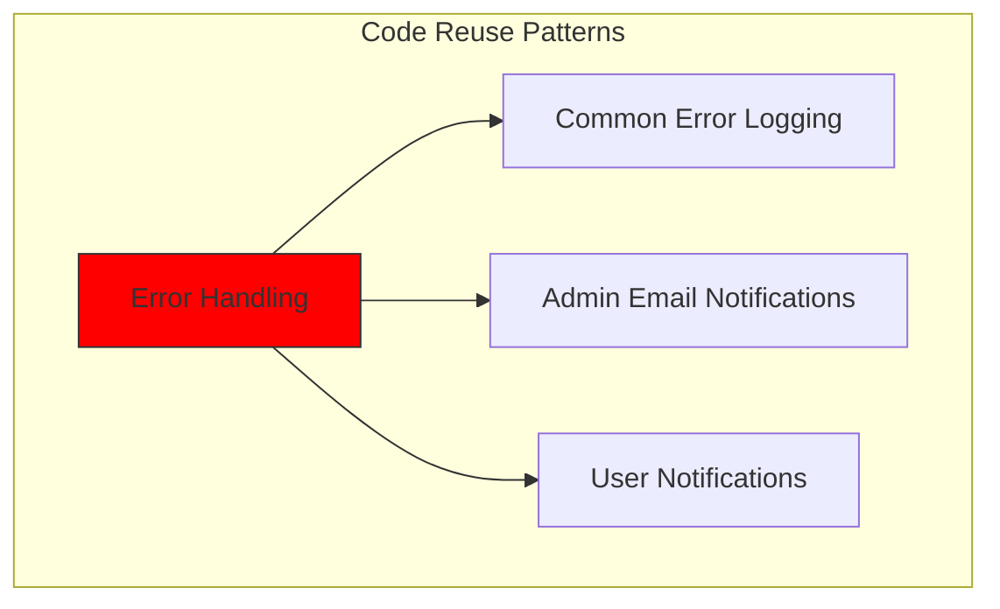
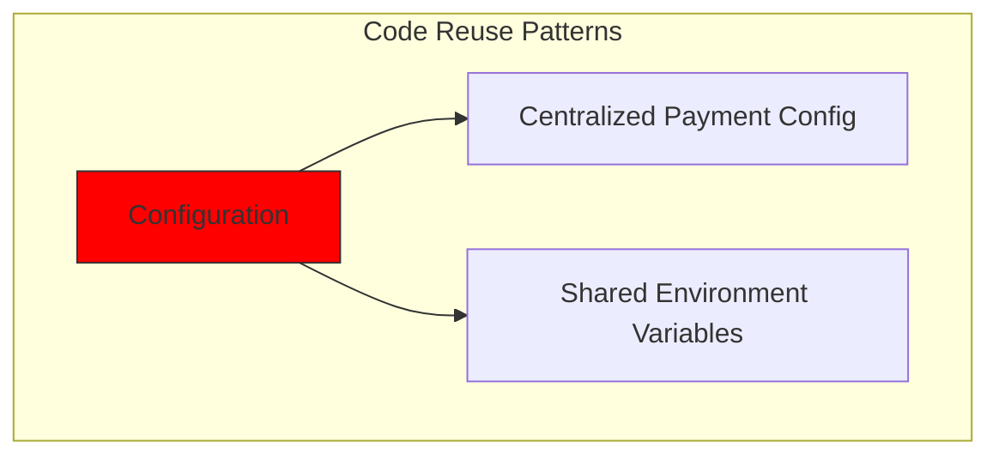
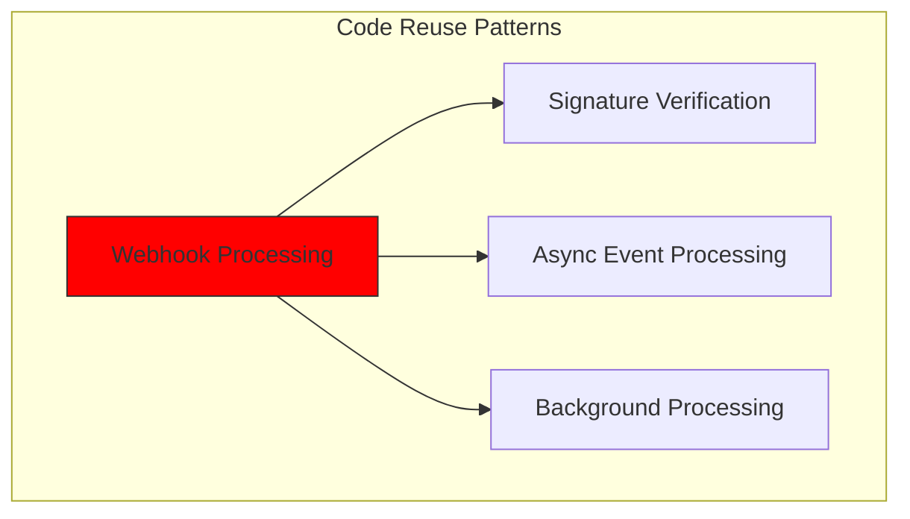
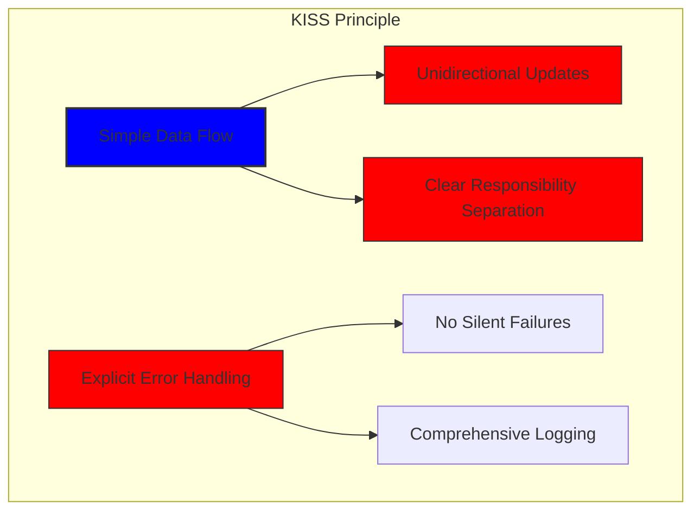
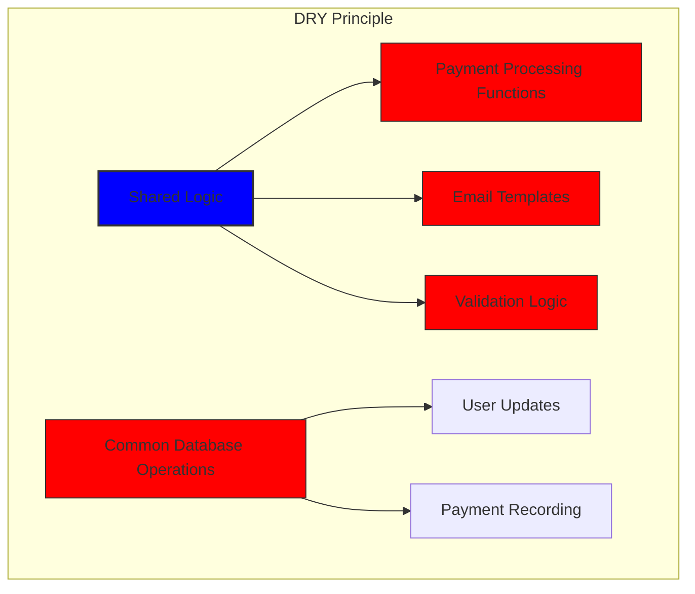

# Hogyan építettünk fel egy robusztus fizetési rendszert a Stripe és a PayPal segítségével: Trifecta megközelítés {#how-we-built-a-robust-payment-system-with-stripe-and-paypal-a-trifecta-approach}


## Tartalomjegyzék {#table-of-contents}

* [Előszó](#foreword)
* [A kihívás: Több fizetési processzor, egyetlen igazságforrás](#the-challenge-multiple-payment-processors-one-source-of-truth)
* [A Trifecta megközelítés: A megbízhatóság három rétege](#the-trifecta-approach-three-layers-of-reliability)
* [1. réteg: Pénztár utáni átirányítások](#layer-1-post-checkout-redirects)
  * [Stripe pénztár implementáció](#stripe-checkout-implementation)
  * [PayPal fizetési folyamat](#paypal-payment-flow)
* [2. réteg: Webhook-kezelők aláírás-ellenőrzéssel](#layer-2-webhook-handlers-with-signature-verification)
  * [Stripe webhook implementáció](#stripe-webhook-implementation)
  * [PayPal webhook implementáció](#paypal-webhook-implementation)
* [3. réteg: Automatizált feladatok Bree-vel](#layer-3-automated-jobs-with-bree)
  * [Előfizetés pontosságának ellenőrzője](#subscription-accuracy-checker)
  * [PayPal előfizetés szinkronizálása](#paypal-subscription-synchronization)
* [Edge esetek kezelése](#handling-edge-cases)
  * [Csalásészlelés és -megelőzés](#fraud-detection-and-prevention)
  * [Vitarendezés](#dispute-handling)
* [Kód újrafelhasználása: KISS és DRY alapelvek](#code-reuse-kiss-and-dry-principles)
* [VISA előfizetési követelmények végrehajtása](#visa-subscription-requirements-implementation)
  * [Automatikus megújítás előtti e-mail értesítések](#automated-pre-renewal-email-notifications)
  * [Edge esetek kezelése](#handling-edge-cases-1)
  * [Próbaidőszakok és előfizetési feltételek](#trial-periods-and-subscription-terms)
* [Konklúzió: A Trifecta megközelítésünk előnyei](#conclusion-the-benefits-of-our-trifecta-approach)

## Előszó {#foreword}

A Forward Emailnél mindig is prioritásként kezeltük a megbízható, pontos és felhasználóbarát rendszerek létrehozását. Amikor a fizetésfeldolgozó rendszerünk megvalósítására került a sor, tudtuk, hogy egy olyan megoldásra van szükségünk, amely több fizetésfeldolgozót is képes kezelni, miközben tökéletes adatkonzisztenciát biztosít. Ez a blogbejegyzés részletezi, hogyan integrálta fejlesztőcsapatunk a Stripe-ot és a PayPalt egy trifecta megközelítéssel, amely 1:1 valós idejű pontosságot biztosít a teljes rendszerünkben.

## A kihívás: Több fizetési processzor, egyetlen igazságforrás {#the-challenge-multiple-payment-processors-one-source-of-truth}

Adatvédelem-központú e-mail szolgáltatásként fizetési lehetőségeket szerettünk volna biztosítani felhasználóinknak. Vannak, akik a Stripe-on keresztüli bankkártyás fizetés egyszerűségét részesítik előnyben, míg mások a PayPal által biztosított további elkülönítési réteget értékelik. Több fizetési processzor támogatása azonban jelentős bonyolultságot okoz:

1. Hogyan biztosítjuk az adatok konzisztenciáját a különböző fizetési rendszerek között?

2. Hogyan kezeljük a szélsőséges eseteket, például a vitákat, visszatérítéseket vagy sikertelen fizetéseket?

3. Hogyan tartsuk fenn az adatok egyetlen, megbízható forrását az adatbázisunkban?

A megoldásunk az úgynevezett „trifecta megközelítés” bevezetése volt – egy háromrétegű rendszer, amely redundanciát biztosít, és garantálja az adatok konzisztenciáját, bármi is történjen.

## A Trifecta megközelítés: A megbízhatóság három rétege {#the-trifecta-approach-three-layers-of-reliability}

Fizetési rendszerünk három kritikus összetevőből áll, amelyek együttesen biztosítják a tökéletes adatszinkronizációt:

1. **Pénztár utáni átirányítások** – Fizetési információk rögzítése közvetlenül a fizetés után
2. **Webhook-kezelők** – Valós idejű események feldolgozása a fizetésfeldolgozóktól
3. **Automatizált feladatok** – Fizetési adatok időszakos ellenőrzése és egyeztetése

Merüljünk el az egyes komponensekben, és nézzük meg, hogyan működnek együtt.



## 1. réteg: Pénztár utáni átirányítások {#layer-1-post-checkout-redirects}

A trifecta megközelítésünk első rétege közvetlenül azután történik, hogy a felhasználó végrehajtott egy fizetést. Mind a Stripe, mind a PayPal olyan mechanizmusokat kínál, amelyekkel a felhasználókat tranzakciós információkkal visszairányíthatjuk oldalunkra.

### Stripe fizetési implementáció {#stripe-checkout-implementation}

A Stripe esetében a Checkout Sessions API-t használjuk a zökkenőmentes fizetési élmény biztosításához. Amikor egy felhasználó kiválaszt egy csomagot, és úgy dönt, hogy hitelkártyával fizet, létrehozunk egy Checkout Session-t egy sikeres fizetéssel, és töröljük az URL-eket:

```javascript
const options = {
  mode: paymentType === 'one-time' ? 'payment' : 'subscription',
  customer: ctx.state.user[config.userFields.stripeCustomerID],
  client_reference_id: reference,
  metadata: {
    plan
  },
  line_items: [
    {
      price,
      quantity: 1,
      description
    }
  ],
  locale: config.STRIPE_LOCALES.has(ctx.locale) ? ctx.locale : 'auto',
  cancel_url: `${config.urls.web}${ctx.path}${
    isMakePayment || isEnableAutoRenew ? '' : `/?plan=${plan}`
  }`,
  success_url: `${config.urls.web}${ctx.path}/?${
    isMakePayment || isEnableAutoRenew ? '' : `plan=${plan}&`
  }session_id={CHECKOUT_SESSION_ID}`,
  allow_promotion_codes: true
};

// Create the checkout session and redirect
const session = await stripe.checkout.sessions.create(options);
const redirectTo = session.url;
if (ctx.accepts('html')) {
  ctx.status = 303;
  ctx.redirect(redirectTo);
} else {
  ctx.body = { redirectTo };
}
```

A kritikus rész itt a `success_url` paraméter, amely lekérdezési paraméterként tartalmazza a `session_id` paramétert. Amikor a Stripe a sikeres fizetés után visszairányítja a felhasználót az oldalunkra, ezt a munkamenet-azonosítót használhatjuk a tranzakció ellenőrzésére és az adatbázisunk ennek megfelelő frissítésére.

### PayPal fizetési folyamat {#paypal-payment-flow}

A PayPal esetében hasonló megközelítést alkalmazunk az Orders API-jukkal:

```javascript
const requestBody = {
  intent: 'CAPTURE',
  application_context: {
    cancel_url: `${config.urls.web}${ctx.path}${
      isMakePayment || isEnableAutoRenew ? '' : `/?plan=${plan}`
    }`,
    return_url: `${config.urls.web}${ctx.path}/?plan=${plan}`,
    brand_name: 'Forward Email',
    shipping_preference: 'NO_SHIPPING',
    user_action: 'PAY_NOW'
  },
  payer: {
    email_address: ctx.state.user.email
  },
  purchase_units: [
    {
      reference_id: ctx.state.user.id,
      description,
      custom_id: sku,
      invoice_id: reference,
      soft_descriptor: sku,
      amount: {
        currency_code: 'USD',
        value: price,
        breakdown: {
          item_total: {
            currency_code: 'USD',
            value: price
          }
        }
      },
      items: [
        {
          name,
          description,
          sku,
          unit_amount: {
            currency_code: 'USD',
            value: price
          },
          quantity: '1',
          category: 'DIGITAL_GOODS'
        }
      ]
    }
  ]
};
```

A Stripe-hoz hasonlóan a `return_url` és `cancel_url` paramétereket adjuk meg a fizetés utáni átirányítások kezeléséhez. Amikor a PayPal visszairányítja a felhasználót az oldalunkra, rögzíthetjük a fizetési adatokat és frissíthetjük az adatbázisunkat.



## 2. réteg: Webhook-kezelők aláírás-ellenőrzéssel {#layer-2-webhook-handlers-with-signature-verification}

Bár a fizetés utáni átirányítások a legtöbb esetben jól működnek, nem tévedhetetlenek. Előfordulhat, hogy a felhasználók bezárják a böngészőjüket az átirányítás előtt, vagy hálózati problémák akadályozhatják meg az átirányítás befejeződését. Itt jönnek képbe a webhookok.

Mind a Stripe, mind a PayPal webhook rendszereket kínál, amelyek valós idejű értesítéseket küldenek a fizetési eseményekről. Robusztus webhook-kezelőket implementáltunk, amelyek ellenőrzik az értesítések hitelességét, és ennek megfelelően dolgozzák fel azokat.

### Stripe webhook implementáció {#stripe-webhook-implementation}

A Stripe webhook-kezelőnk ellenőrzi a bejövő webhook események aláírását, hogy megbizonyosodjon azok jogosságáról:

```javascript
async function webhook(ctx) {
  const sig = ctx.request.get('stripe-signature');
  // throw an error if something was wrong
  if (!isSANB(sig))
    throw Boom.badRequest(ctx.translateError('INVALID_STRIPE_SIGNATURE'));
  const event = stripe.webhooks.constructEvent(
    ctx.request.rawBody,
    sig,
    env.STRIPE_ENDPOINT_SECRET
  );
  // throw an error if something was wrong
  if (!event)
    throw Boom.badRequest(ctx.translateError('INVALID_STRIPE_SIGNATURE'));
  ctx.logger.info('stripe webhook', { event });
  // return a response to acknowledge receipt of the event
  ctx.body = { received: true };
  // run in background
  processEvent(ctx, event)
    .then()
    .catch((err) => {
      ctx.logger.fatal(err, { event });
      // email admin errors
      emailHelper({
        template: 'alert',
        message: {
          to: config.email.message.from,
          subject: `Error with Stripe Webhook (Event ID ${event.id})`
        },
        locals: {
          message: `<pre><code>${safeStringify(
            parseErr(err),
            null,
            2
          )}</code></pre>`
        }
      })
        .then()
        .catch((err) => ctx.logger.fatal(err, { event }));
    });
}
```

A `stripe.webhooks.constructEvent` függvény a végponti titkos kódunk segítségével ellenőrzi az aláírást. Ha az aláírás érvényes, az eseményt aszinkron módon dolgozzuk fel, hogy elkerüljük a webhook válasz blokkolását.

### PayPal webhook implementáció {#paypal-webhook-implementation}

Hasonlóképpen, a PayPal webhook kezelőnk ellenőrzi a bejövő értesítések hitelességét:

```javascript
async function webhook(ctx) {
  const response = await promisify(
    paypal.notification.webhookEvent.verify,
    paypal.notification.webhookEvent
  )(ctx.request.headers, ctx.request.body, env.PAYPAL_WEBHOOK_ID);
  // throw an error if something was wrong
  if (!_.isObject(response) || response.verification_status !== 'SUCCESS')
    throw Boom.badRequest(ctx.translateError('INVALID_PAYPAL_SIGNATURE'));
  // return a response to acknowledge receipt of the event
  ctx.body = { received: true };
  // run in background
  processEvent(ctx)
    .then()
    .catch((err) => {
      ctx.logger.fatal(err);
      // email admin errors
      emailHelper({
        template: 'alert',
        message: {
          to: config.email.message.from,
          subject: `Error with PayPal Webhook (Event ID ${ctx.request.body.id})`
        },
        locals: {
          message: `<pre><code>${safeStringify(
            parseErr(err),
            null,
            2
          )}</code></pre>`
        }
      })
        .then()
        .catch((err) => ctx.logger.fatal(err));
    });
}
```

Mindkét webhook-kezelő ugyanazt a mintát követi: ellenőrzi az aláírást, visszaigazolja a kézhezvételt, és aszinkron módon feldolgozza az eseményt. Ez biztosítja, hogy soha ne hagyjunk ki fizetési eseményt, még akkor sem, ha a fizetés utáni átirányítás sikertelen.

## 3. réteg: Automatizált feladatok Bree-vel {#layer-3-automated-jobs-with-bree}

A trifecta megközelítésünk utolsó rétege egy sor automatizált feladat, amelyek rendszeresen ellenőrzik és egyeztetik a fizetési adatokat. A Bree-t, a Node.js feladatütemezőjét használjuk ezen feladatok rendszeres időközönkénti futtatásához.

### Előfizetés pontosságának ellenőrzője {#subscription-accuracy-checker}

Az egyik legfontosabb feladatunk az előfizetések pontosságának ellenőrzése, amely biztosítja, hogy adatbázisunk pontosan tükrözze az előfizetés állapotát a Stripe-ban:

```javascript
async function mapper(customer) {
  // wait a second to prevent rate limitation error
  await setTimeout(ms('1s'));
  // check for user on our side
  let user = await Users.findOne({
    [config.userFields.stripeCustomerID]: customer.id
  })
    .lean()
    .exec();
  if (!user) return;
  if (user.is_banned) return;

  // if emails did not match
  if (user.email !== customer.email) {
    logger.info(
      `User email ${user.email} did not match customer email ${customer.email} (${customer.id})`
    );
    customer = await stripe.customers.update(customer.id, {
      email: user.email
    });
    logger.info(`Updated user email to match ${user.email}`);
  }

  // check for active subscriptions
  const [activeSubscriptions, trialingSubscriptions] = await Promise.all([
    stripe.subscriptions.list({
      customer: customer.id,
      status: 'active'
    }),
    stripe.subscriptions.list({
      customer: customer.id,
      status: 'trialing'
    })
  ]);

  // Combine active and trialing subscriptions
  let subscriptions = [
    ...activeSubscriptions.data,
    ...trialingSubscriptions.data
  ];

  // Handle edge case: multiple subscriptions for one user
  if (subscriptions.length > 1) {
    await logger.error(
      new Error(
        `We may need to refund: User had multiple subscriptions ${user.email} (${customer.id})`
      )
    );
    await emailHelper({
      template: 'alert',
      message: {
        to: config.email.message.from,
        subject: `User had multiple subscriptions ${user.email}`
      },
      locals: {
        message: `User ${user.email} (${customer.id}) had multiple subscriptions: ${JSON.stringify(
          subscriptions.map((s) => s.id)
        )}`
      }
    });
  }
}
```

Ez a feladat eltéréseket keres az adatbázisunk és a Stripe között, például eltérő e-mail címeket vagy több aktív előfizetést. Ha bármilyen problémát talál, naplózza azokat, és riasztásokat küld az adminisztrációs csapatunknak.

### PayPal előfizetés szinkronizálása {#paypal-subscription-synchronization}

Hasonló feladatunk van a PayPal-előfizetésekkel kapcsolatban:

```javascript
async function syncPayPalSubscriptionPayments() {
  const paypalCustomers = await Users.find({
    $or: [
      {
        [config.userFields.paypalSubscriptionID]: { $exists: true, $ne: null }
      },
      {
        [config.userFields.paypalPayerID]: { $exists: true, $ne: null }
      }
    ]
  })
    // sort by newest customers first
    .sort('-created_at')
    .lean()
    .exec();

  await logger.info(
    `Syncing payments for ${paypalCustomers.length} paypal customers`
  );

  // Process each customer and sync their payments
  const errorEmails = await pReduce(
    paypalCustomers,
    // Implementation details...
  );
}
```

Ezek az automatizált feladatok végső biztonsági hálóként szolgálnak, biztosítva, hogy adatbázisunk mindig tükrözze az előfizetések és fizetések valós állapotát mind a Stripe-ban, mind a PayPalban.

## Szélső esetek kezelése {#handling-edge-cases}

Egy robusztus fizetési rendszernek gördülékenyen kell kezelnie a szélsőséges eseteket. Nézzük meg, hogyan kezelünk néhány gyakori forgatókönyvet.

### Csalásészlelés és -megelőzés {#fraud-detection-and-prevention}

Kifinomult csalásészlelő mechanizmusokat vezettünk be, amelyek automatikusan azonosítják és kezelik a gyanús fizetési tevékenységeket:

```javascript
case 'charge.failed': {
  // Get all failed charges in the last 30 days
  const charges = await stripe.charges.list({
    customer: event.data.object.customer,
    created: {
      gte: dayjs().subtract(1, 'month').unix()
    }
  });

  // Filter for declined charges
  const filtered = charges.data.filter(
    (d) => d.status === 'failed' && d.failure_code === 'card_declined'
  );

  // if not more than 5 then return early
  if (filtered.length < 5) break;

  // Check if user has verified domains
  const count = await Domains.countDocuments({
    members: {
      $elemMatch: {
        user: user._id,
        group: 'admin'
      }
    },
    plan: { $in: ['enhanced_protection', 'team'] },
    has_txt_record: true
  });

  if (!user.is_banned) {
    // If no verified domains, ban the user and refund all charges
    if (count === 0) {
      // Ban the user
      user.is_banned = true;
      await user.save();

      // Refund all successful charges
    }
  }
}
```

Ez a kód automatikusan kitiltja azokat a felhasználókat, akiknek több sikertelen terhelésük van, és nincsenek ellenőrzött domainjeik, ami a csalárd tevékenység erős mutatója.

### Vitarendezés {#dispute-handling}

Amikor egy felhasználó vitat egy terhelést, automatikusan elfogadjuk a reklamációt, és megtesszük a megfelelő lépéseket:

```javascript
case 'CUSTOMER.DISPUTE.CREATED': {
  // accept claim
  const agent = await paypalAgent();
  await agent
    .post(`/v1/customer/disputes/${body.resource.dispute_id}/accept-claim`)
    .send({
      note: 'Full refund to the customer.'
    });

  // Find the payment in our database
  const payment = await Payments.findOne({ $or });
  if (!payment) throw new Error('Payment does not exist');

  const user = await Users.findById(payment.user);
  if (!user) throw new Error('User did not exist for customer');

  // Cancel the user's subscription if they have one
  if (isSANB(user[config.userFields.paypalSubscriptionID])) {
    try {
      const agent = await paypalAgent();
      await agent.post(
        `/v1/billing/subscriptions/${
          user[config.userFields.paypalSubscriptionID]
        }/cancel`
      );
    } catch (err) {
      // Handle subscription cancellation errors
    }
  }
}
```

Ez a megközelítés minimalizálja a viták üzleti tevékenységünkre gyakorolt hatását, miközben biztosítja a jó ügyfélélményt.

## Kód újrafelhasználása: KISS és DRY alapelvek {#code-reuse-kiss-and-dry-principles}

Fizetési rendszerünkben végig a KISS (Keep It Simple, Stupid) és a DRY (Don't Repeat Yourself) alapelveket követtük. Íme néhány példa:

1. **Megosztott segédfüggvények**: Újrafelhasználható segédfüggvényeket hoztunk létre olyan gyakori feladatokhoz, mint a fizetések szinkronizálása és az e-mailek küldése.

2. **Konzisztens hibakezelés**: A Stripe és a PayPal webhook-kezelői ugyanazt a mintát használják a hibakezeléshez és az adminisztrátori értesítésekhez.

3. **Egységes adatbázisséma**: Adatbázissémánk úgy lett kialakítva, hogy mind a Stripe, mind a PayPal adatait kezelje, közös mezőkkel a fizetési állapot, az összeg és a csomaginformációk tekintetében.

4. **Központosított konfiguráció**: A fizetéssel kapcsolatos konfiguráció egyetlen fájlban van központosítva, így könnyen frissíthetők az árak és a termékinformációk.













## VISA előfizetési követelmények megvalósítása {#visa-subscription-requirements-implementation}

A trifecta megközelítésünk mellett speciális funkciókat is bevezettünk a VISA előfizetési követelményeinek való megfelelés, miközben javítjuk a felhasználói élményt. A VISA egyik kulcsfontosságú követelménye, hogy a felhasználókat értesíteni kell, mielőtt az előfizetésért fizetnének, különösen próbaidőszakról fizetős előfizetésre való áttéréskor.

### Automatikus megújítás előtti e-mail értesítések {#automated-pre-renewal-email-notifications}

Létrehoztunk egy automatizált rendszert, amely azonosítja az aktív próbaidőszakos előfizetéssel rendelkező felhasználókat, és értesítő e-mailt küld nekik az első terhelés előtt. Ez nemcsak a VISA követelményeinek való megfelelést biztosítja számunkra, hanem csökkenti a visszaterheléseket és javítja az ügyfelek elégedettségét is.

Így valósítottuk meg ezt a funkciót:

```javascript
// Find users with trial subscriptions who haven't received a notification yet
const users = await Users.find({
  $or: [
    {
      $and: [
        { [config.userFields.stripeSubscriptionID]: { $exists: true } },
        { [config.userFields.stripeTrialSentAt]: { $exists: false } },
        // Exclude subscriptions that have already had payments
        ...(paidStripeSubscriptionIds.length > 0
          ? [
              {
                [config.userFields.stripeSubscriptionID]: {
                  $nin: paidStripeSubscriptionIds
                }
              }
            ]
          : [])
      ]
    },
    {
      $and: [
        { [config.userFields.paypalSubscriptionID]: { $exists: true } },
        { [config.userFields.paypalTrialSentAt]: { $exists: false } },
        // Exclude subscriptions that have already had payments
        ...(paidPayPalSubscriptionIds.length > 0
          ? [
              {
                [config.userFields.paypalSubscriptionID]: {
                  $nin: paidPayPalSubscriptionIds
                }
              }
            ]
          : [])
      ]
    }
  ]
});

// Process each user and send notification
for (const user of users) {
  // Get subscription details from payment processor
  const subscription = await getSubscriptionDetails(user);

  // Calculate subscription duration and frequency
  const duration = getDurationFromPlanId(subscription.plan_id);
  const frequency = getHumanReadableFrequency(duration, user.locale);
  const amount = getPlanAmount(user.plan, duration);

  // Get user's domains for personalized email
  const domains = await Domains.find({
    'members.user': user._id
  }).sort('name').lean().exec();

  // Send VISA-compliant notification email
  await emailHelper({
    template: 'visa-trial-subscription-requirement',
    message: {
      to: user.receipt_email || user.email,
      ...(user.receipt_email ? { cc: user.email } : {})
    },
    locals: {
      user,
      firstChargeDate: new Date(subscription.start_time),
      frequency,
      formattedAmount: numeral(amount).format('$0,0,0.00'),
      domains
    }
  });

  // Record that notification was sent
  await Users.findByIdAndUpdate(user._id, {
    $set: {
      [config.userFields.paypalTrialSentAt]: new Date()
    }
  });
}
```

Ez a megvalósítás biztosítja, hogy a felhasználók mindig tájékozottak legyenek a közelgő terhelésekről, egyértelmű részletekkel a következőkről:

1. Mikor történik az első terhelés
2. A jövőbeni terhelések gyakorisága (havi, éves stb.)
3. A pontos összeg, amelyet felszámítanak
4. Mely domaineket fedi le az előfizetésük

A folyamat automatizálásával tökéletesen megfelelünk a VISA követelményeinek (amelyek legalább 7 nappal a terhelés előtti értesítést írnak elő), miközben csökkentjük a támogatási megkeresések számát és javítjuk az általános felhasználói élményt.

### Szélső esetek kezelése {#handling-edge-cases-1}

A megvalósításunk robusztus hibakezelést is tartalmaz. Ha bármi probléma adódik az értesítési folyamat során, rendszerünk automatikusan értesíti csapatunkat:

```javascript
try {
  await mapper(user);
} catch (err) {
  logger.error(err);

  // Send alert to administrators
  await emailHelper({
    template: 'alert',
    message: {
      to: config.email.message.from,
      subject: 'VISA Trial Subscription Requirement Error'
    },
    locals: {
      message: `<pre><code>${safeStringify(
        parseErr(err),
        null,
        2
      )}</code></pre>`
    }
  });
}
```

Ez biztosítja, hogy még ha probléma is adódna az értesítési rendszerrel, csapatunk gyorsan kezelni tudja azt, és fenntartsa a VISA követelményeinek való megfelelést.

A VISA előfizetési értesítési rendszer egy másik példa arra, hogyan építettük fel fizetési infrastruktúránkat a megfelelőség és a felhasználói élmény szem előtt tartásával, kiegészítve trifecta megközelítésünket a megbízható és átlátható fizetésfeldolgozás biztosítása érdekében.

### Próbaidőszakok és előfizetési feltételek {#trial-periods-and-subscription-terms}

Azoknál a felhasználóknál, akik engedélyezik az automatikus megújítást a meglévő csomagjaikban, kiszámítjuk a megfelelő próbaidőszakot, hogy biztosítsuk, hogy ne terheljük meg őket a jelenlegi csomagjuk lejárta előtt:

```javascript
if (
  isEnableAutoRenew &&
  dayjs(ctx.state.user[config.userFields.planExpiresAt]).isAfter(
    dayjs()
  )
) {
  const hours = dayjs(
    ctx.state.user[config.userFields.planExpiresAt]
  ).diff(dayjs(), 'hours');

  // Handle trial period calculation
}
```

Világos tájékoztatást nyújtunk az előfizetési feltételekről, beleértve a számlázási gyakoriságot és a lemondási szabályzatokat, és minden előfizetéshez részletes metaadatokat mellékelünk a megfelelő nyomon követés és kezelés biztosítása érdekében.

## Konklúzió: A Trifecta megközelítésünk előnyei {#conclusion-the-benefits-of-our-trifecta-approach}

A fizetésfeldolgozás trifecta megközelítésünk számos kulcsfontosságú előnnyel járt:

1. **Megbízhatóság**: A fizetés-ellenőrzés három rétegének bevezetésével biztosítjuk, hogy egyetlen fizetés se maradjon figyelmen kívül, vagy ne kerüljön helytelenül feldolgozásra.

2. **Pontosság**: Adatbázisunk mindig tükrözi az előfizetések és fizetések valós állapotát mind a Stripe-ban, mind a PayPal-ban.

3. **Rugalmasság**: A felhasználók a rendszer megbízhatóságának feláldozása nélkül választhatják ki a kívánt fizetési módot.

4. **Robusztusság**: Rendszerünk gördülékenyen kezeli a szélsőséges eseteket, a hálózati hibáktól a csalárd tevékenységekig.

Ha olyan fizetési rendszert valósít meg, amely több processzort támogat, erősen ajánljuk ezt a trifecta megközelítést. Több előzetes fejlesztési erőfeszítést igényel, de a megbízhatóság és a pontosság tekintetében a hosszú távú előnyök megérik a fáradságot.

A Forward Email szolgáltatással és az adatvédelmet támogató e-mail szolgáltatásainkkal kapcsolatos további információkért látogassa meg a [weboldal](https://forwardemail.net) oldalunkat.

<!-- *Kulcsszavak: fizetésfeldolgozás, Stripe integráció, PayPal integráció, webhook kezelés, fizetésszinkronizáció, előfizetés-kezelés, csalásmegelőzés, vitarendezés, Node.js fizetési rendszer, többprocesszoros fizetési rendszer, fizetési átjáró integráció, valós idejű fizetés-ellenőrzés, fizetési adatok konzisztenciája, előfizetéses számlázás, fizetésbiztonság, fizetésautomatizálás, fizetési webhookok, fizetésegyeztetés, fizetési élproblémák, fizetési hibakezelés, VISA előfizetési követelmények, megújítás előtti értesítések, előfizetés-megfelelőség* -->