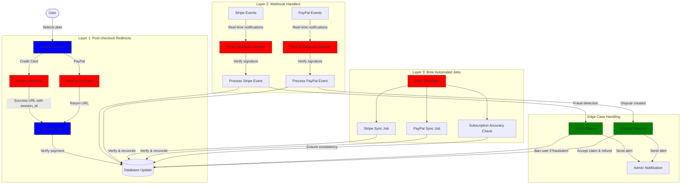
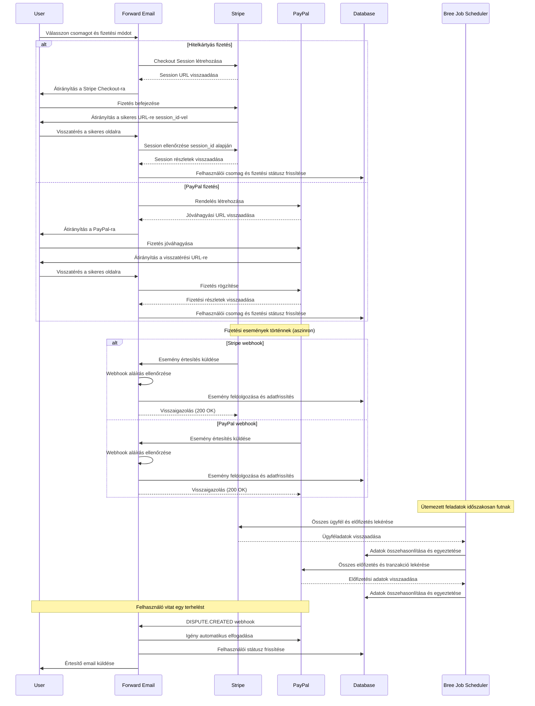
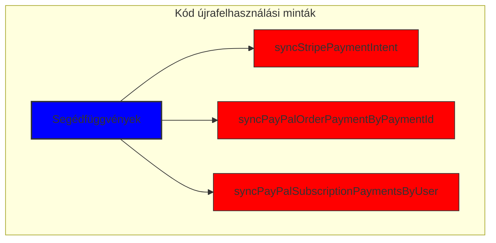
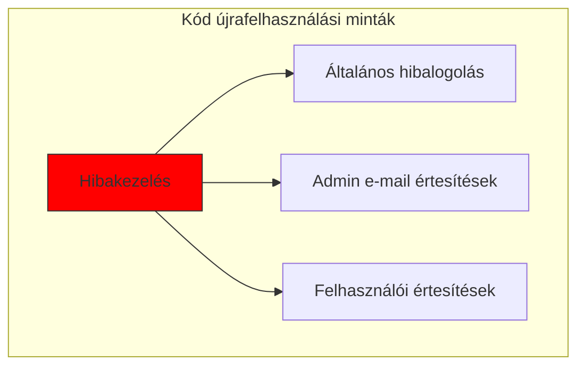
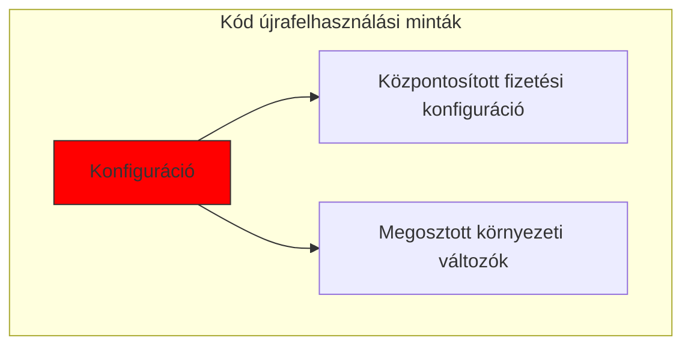
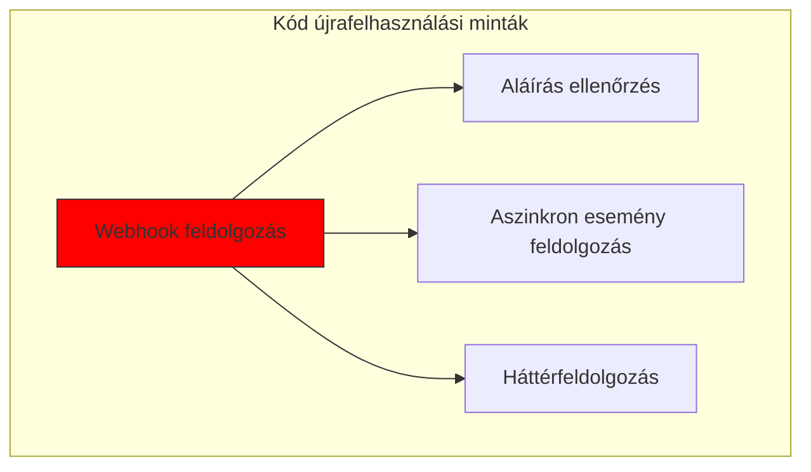
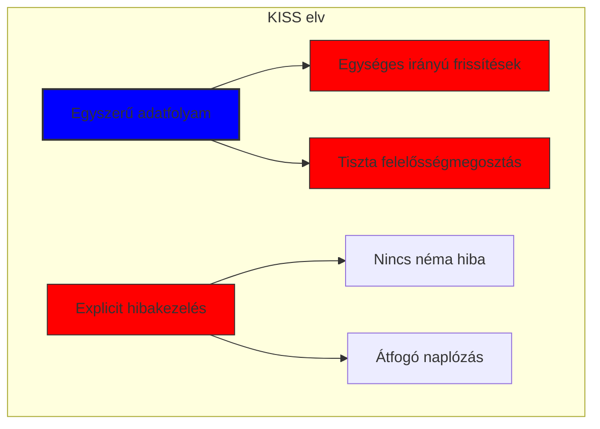

# Hogyan építettünk ki egy robusztus fizetési rendszert Stripe és PayPal segítségével: Egy trifecta megközelítés {#how-we-built-a-robust-payment-system-with-stripe-and-paypal-a-trifecta-approach}


## Tartalomjegyzék {#table-of-contents}

* [Előszó](#foreword)
* [A kihívás: Több fizetési feldolgozó, egyetlen igazságforrás](#the-challenge-multiple-payment-processors-one-source-of-truth)
* [A trifecta megközelítés: Három megbízhatósági réteg](#the-trifecta-approach-three-layers-of-reliability)
* [1. réteg: Vásárlás utáni átirányítások](#layer-1-post-checkout-redirects)
  * [Stripe Checkout megvalósítás](#stripe-checkout-implementation)
  * [PayPal fizetési folyamat](#paypal-payment-flow)
* [2. réteg: Webhook kezelők aláírás ellenőrzéssel](#layer-2-webhook-handlers-with-signature-verification)
  * [Stripe webhook megvalósítás](#stripe-webhook-implementation)
  * [PayPal webhook megvalósítás](#paypal-webhook-implementation)
* [3. réteg: Automatikus feladatok Bree-vel](#layer-3-automated-jobs-with-bree)
  * [Előfizetés pontosság ellenőrző](#subscription-accuracy-checker)
  * [PayPal előfizetés szinkronizáció](#paypal-subscription-synchronization)
* [Szélsőséges esetek kezelése](#handling-edge-cases)
  * [Csalásfelderítés és megelőzés](#fraud-detection-and-prevention)
  * [Vita kezelése](#dispute-handling)
* [Kód újrafelhasználás: KISS és DRY elvek](#code-reuse-kiss-and-dry-principles)
* [VISA előfizetési követelmények megvalósítása](#visa-subscription-requirements-implementation)
  * [Automatikus megújítás előtti email értesítések](#automated-pre-renewal-email-notifications)
  * [Szélsőséges esetek kezelése](#handling-edge-cases-1)
  * [Próbaidők és előfizetési feltételek](#trial-periods-and-subscription-terms)
* [Összegzés: A trifecta megközelítés előnyei](#conclusion-the-benefits-of-our-trifecta-approach)


## Előszó {#foreword}

A Forward Email-nél mindig is elsődleges célunk volt megbízható, pontos és felhasználóbarát rendszerek létrehozása. Amikor a fizetési feldolgozó rendszerünk megvalósítására került sor, tudtuk, hogy olyan megoldásra van szükségünk, amely képes több fizetési feldolgozó kezelésére, miközben tökéletes adatkonzisztenciát tart fenn. Ez a blogbejegyzés részletezi, hogyan integrálta fejlesztőcsapatunk a Stripe-ot és a PayPalt egy trifecta megközelítéssel, amely 1:1 valós idejű pontosságot biztosít az egész rendszerünkben.


## A kihívás: Több fizetési feldolgozó, egyetlen igazságforrás {#the-challenge-multiple-payment-processors-one-source-of-truth}

Adatvédelmi fókuszú email szolgáltatóként szerettünk volna fizetési lehetőségeket kínálni felhasználóinknak. Egyesek a Stripe-on keresztüli bankkártyás fizetés egyszerűségét részesítik előnyben, míg mások értékelik a PayPal által nyújtott további elkülönítési réteget. Azonban több fizetési feldolgozó támogatása jelentős bonyolultságot hoz magával:

1. Hogyan biztosítsuk az adatok konzisztenciáját a különböző fizetési rendszerek között?
2. Hogyan kezeljük a szélsőséges eseteket, mint a viták, visszatérítések vagy sikertelen fizetések?
3. Hogyan tartsunk fenn egyetlen igazságforrást az adatbázisunkban?

Megoldásunk az úgynevezett "trifecta megközelítés" bevezetése volt – egy háromrétegű rendszer, amely redundanciát biztosít és garantálja az adatkonzisztenciát bármi történjék is.


## A trifecta megközelítés: Három megbízhatósági réteg {#the-trifecta-approach-three-layers-of-reliability}

Fizetési rendszerünk három kritikus összetevőből áll, amelyek együttműködve biztosítják a tökéletes adat szinkronizációt:

1. **Vásárlás utáni átirányítások** – A fizetési információk azonnali rögzítése a vásárlás után
2. **Webhook kezelők** – Valós idejű események feldolgozása a fizetési feldolgozóktól
3. **Automatikus feladatok** – Időszakos ellenőrzés és egyeztetés a fizetési adatok között

Nézzük meg részletesen az egyes összetevőket és működésüket.


```mermaid
flowchart TD
    User([User]) --> |Selects plan| Checkout[Checkout Page]

    %% Layer 1: Post-checkout redirects
    subgraph "Layer 1: Post-checkout Redirects"
        Checkout --> |Credit Card| Stripe[Stripe Checkout]
        Checkout --> |PayPal| PayPal[PayPal Payment]

        Stripe --> |Success URL with session_id| SuccessPage[Success Page]
        PayPal --> |Return URL| SuccessPage

        SuccessPage --> |Verify payment| Database[(Database Update)]
    end

    %% Layer 2: Webhooks
    subgraph "Layer 2: Webhook Handlers"
        StripeEvents[Stripe Events] --> |Real-time notifications| StripeWebhook[Stripe Webhook Handler]
        PayPalEvents[PayPal Events] --> |Real-time notifications| PayPalWebhook[PayPal Webhook Handler]

        StripeWebhook --> |Verify signature| ProcessStripeEvent[Process Stripe Event]
        PayPalWebhook --> |Verify signature| ProcessPayPalEvent[Process PayPal Event]

        ProcessStripeEvent --> Database
        ProcessPayPalEvent --> Database
    end

    %% Layer 3: Automated jobs
    subgraph "Layer 3: Bree Automated Jobs"
        BreeScheduler[Bree Scheduler] --> StripeSync[Stripe Sync Job]
        BreeScheduler --> PayPalSync[PayPal Sync Job]
        BreeScheduler --> AccuracyCheck[Subscription Accuracy Check]

        StripeSync --> |Verify & reconcile| Database
        PayPalSync --> |Verify & reconcile| Database
        AccuracyCheck --> |Ensure consistency| Database
    end

    %% Edge cases
    subgraph "Edge Case Handling"
        ProcessStripeEvent --> |Fraud detection| FraudCheck[Fraud Check]
        ProcessPayPalEvent --> |Dispute created| DisputeHandler[Dispute Handler]

        FraudCheck --> |Ban user if fraudulent| Database
        DisputeHandler --> |Accept claim & refund| Database

        FraudCheck --> |Send alert| AdminNotification[Admin Notification]
        DisputeHandler --> |Send alert| AdminNotification
    end

    %% Style definitions
    classDef primary fill:blue,stroke:#333,stroke-width:2px;
    classDef secondary fill:red,stroke:#333,stroke-width:1px;
    classDef tertiary fill:green,stroke:#333,stroke-width:1px;

    class Checkout,SuccessPage primary;
    class Stripe,PayPal,StripeWebhook,PayPalWebhook,BreeScheduler secondary;
    class FraudCheck,DisputeHandler tertiary;
```
## 1. réteg: Vásárlás utáni átirányítások {#layer-1-post-checkout-redirects}

A háromlépcsős megközelítésünk első rétege közvetlenül a felhasználó fizetésének befejezése után történik. Mind a Stripe, mind a PayPal biztosít mechanizmusokat arra, hogy a felhasználókat tranzakciós információkkal visszairányítsák a weboldalunkra.

### Stripe Checkout megvalósítás {#stripe-checkout-implementation}

A Stripe esetében a Checkout Sessions API-jukat használjuk egy zökkenőmentes fizetési élmény létrehozásához. Amikor a felhasználó kiválaszt egy csomagot és hitelkártyával szeretne fizetni, létrehozunk egy Checkout Session-t konkrét siker és megszakítás URL-ekkel:

```javascript
const options = {
  mode: paymentType === 'one-time' ? 'payment' : 'subscription',
  customer: ctx.state.user[config.userFields.stripeCustomerID],
  client_reference_id: reference,
  metadata: {
    plan
  },
  line_items: [
    {
      price,
      quantity: 1,
      description
    }
  ],
  locale: config.STRIPE_LOCALES.has(ctx.locale) ? ctx.locale : 'auto',
  cancel_url: `${config.urls.web}${ctx.path}${
    isMakePayment || isEnableAutoRenew ? '' : `/?plan=${plan}`
  }`,
  success_url: `${config.urls.web}${ctx.path}/?${
    isMakePayment || isEnableAutoRenew ? '' : `plan=${plan}&`
  }session_id={CHECKOUT_SESSION_ID}`,
  allow_promotion_codes: true
};

// Create the checkout session and redirect
const session = await stripe.checkout.sessions.create(options);
const redirectTo = session.url;
if (ctx.accepts('html')) {
  ctx.status = 303;
  ctx.redirect(redirectTo);
} else {
  ctx.body = { redirectTo };
}
```

A kritikus rész itt a `success_url` paraméter, amely tartalmazza a `session_id`-t lekérdezési paraméterként. Amikor a Stripe sikeres fizetés után visszairányítja a felhasználót az oldalunkra, ezt a session ID-t használhatjuk a tranzakció ellenőrzésére és az adatbázisunk frissítésére.

### PayPal fizetési folyamat {#paypal-payment-flow}

A PayPal esetében hasonló megközelítést alkalmazunk az Orders API-jukkal:

```javascript
const requestBody = {
  intent: 'CAPTURE',
  application_context: {
    cancel_url: `${config.urls.web}${ctx.path}${
      isMakePayment || isEnableAutoRenew ? '' : `/?plan=${plan}`
    }`,
    return_url: `${config.urls.web}${ctx.path}/?plan=${plan}`,
    brand_name: 'Forward Email',
    shipping_preference: 'NO_SHIPPING',
    user_action: 'PAY_NOW'
  },
  payer: {
    email_address: ctx.state.user.email
  },
  purchase_units: [
    {
      reference_id: ctx.state.user.id,
      description,
      custom_id: sku,
      invoice_id: reference,
      soft_descriptor: sku,
      amount: {
        currency_code: 'USD',
        value: price,
        breakdown: {
          item_total: {
            currency_code: 'USD',
            value: price
          }
        }
      },
      items: [
        {
          name,
          description,
          sku,
          unit_amount: {
            currency_code: 'USD',
            value: price
          },
          quantity: '1',
          category: 'DIGITAL_GOODS'
        }
      ]
    }
  ]
};
```

Hasonlóan a Stripe-hoz, megadjuk a `return_url` és `cancel_url` paramétereket a fizetés utáni átirányítások kezelésére. Amikor a PayPal visszairányítja a felhasználót az oldalunkra, rögzíthetjük a fizetés részleteit és frissíthetjük az adatbázisunkat.


```mermaid
sequenceDiagram
    participant User
    participant FE as Forward Email
    participant Stripe
    participant PayPal
    participant DB as Database
    participant Bree as Bree Job Scheduler

    %% Initial checkout flow
    User->>FE: Válasszon csomagot és fizetési módot

    alt Hitelkártyás fizetés
        FE->>Stripe: Checkout Session létrehozása
        Stripe-->>FE: Session URL visszaadása
        FE->>User: Átirányítás a Stripe Checkout-ra
        User->>Stripe: Fizetés befejezése
        Stripe->>User: Átirányítás a sikeres URL-re session_id-vel
        User->>FE: Visszatérés a sikeres oldalra
        FE->>Stripe: Session ellenőrzése session_id alapján
        Stripe-->>FE: Session részletek visszaadása
        FE->>DB: Felhasználói csomag és fizetési státusz frissítése
    else PayPal fizetés
        FE->>PayPal: Rendelés létrehozása
        PayPal-->>FE: Jóváhagyási URL visszaadása
        FE->>User: Átirányítás a PayPal-ra
        User->>PayPal: Fizetés jóváhagyása
        PayPal->>User: Átirányítás a visszatérési URL-re
        User->>FE: Visszatérés a sikeres oldalra
        FE->>PayPal: Fizetés rögzítése
        PayPal-->>FE: Fizetési részletek visszaadása
        FE->>DB: Felhasználói csomag és fizetési státusz frissítése
    end

    %% Webhook flow (asynchronous)
    Note over Stripe,PayPal: Fizetési események történnek (aszinron)

    alt Stripe webhook
        Stripe->>FE: Esemény értesítés küldése
        FE->>FE: Webhook aláírás ellenőrzése
        FE->>DB: Esemény feldolgozása és adatfrissítés
        FE-->>Stripe: Visszaigazolás (200 OK)
    else PayPal webhook
        PayPal->>FE: Esemény értesítés küldése
        FE->>FE: Webhook aláírás ellenőrzése
        FE->>DB: Esemény feldolgozása és adatfrissítés
        FE-->>PayPal: Visszaigazolás (200 OK)
    end

    %% Bree automatizált feladatok
    Note over Bree: Ütemezett feladatok időszakosan futnak

    Bree->>Stripe: Összes ügyfél és előfizetés lekérése
    Stripe-->>Bree: Ügyféladatok visszaadása
    Bree->>DB: Adatok összehasonlítása és egyeztetése

    Bree->>PayPal: Összes előfizetés és tranzakció lekérése
    PayPal-->>Bree: Előfizetési adatok visszaadása
    Bree->>DB: Adatok összehasonlítása és egyeztetése

    %% Különleges eset: Vitakezelés
    Note over User,PayPal: Felhasználó vitat egy terhelést

    PayPal->>FE: DISPUTE.CREATED webhook
    FE->>PayPal: Igény automatikus elfogadása
    FE->>DB: Felhasználói státusz frissítése
    FE->>User: Értesítő email küldése
```
## 2. réteg: Webhook kezelők aláírás ellenőrzéssel {#layer-2-webhook-handlers-with-signature-verification}

Bár a post-checkout átirányítások a legtöbb esetben jól működnek, nem tökéletesek. A felhasználók bezárhatják a böngészőt az átirányítás előtt, vagy hálózati problémák akadályozhatják az átirányítás befejezését. Itt jönnek képbe a webhookok.

Mind a Stripe, mind a PayPal webhook rendszert biztosít, amely valós idejű értesítéseket küld a fizetési eseményekről. Mi robusztus webhook kezelőket valósítottunk meg, amelyek ellenőrzik ezeknek az értesítéseknek a hitelességét, és ennek megfelelően dolgozzák fel őket.

### Stripe webhook megvalósítás {#stripe-webhook-implementation}

A Stripe webhook kezelőnk ellenőrzi a bejövő webhook események aláírását, hogy megbizonyosodjon azok hitelességéről:

```javascript
async function webhook(ctx) {
  const sig = ctx.request.get('stripe-signature');
  // dobjon hibát, ha valami nem stimmel
  if (!isSANB(sig))
    throw Boom.badRequest(ctx.translateError('INVALID_STRIPE_SIGNATURE'));
  const event = stripe.webhooks.constructEvent(
    ctx.request.rawBody,
    sig,
    env.STRIPE_ENDPOINT_SECRET
  );
  // dobjon hibát, ha valami nem stimmel
  if (!event)
    throw Boom.badRequest(ctx.translateError('INVALID_STRIPE_SIGNATURE'));
  ctx.logger.info('stripe webhook', { event });
  // válasz visszaküldése az esemény átvételének megerősítésére
  ctx.body = { received: true };
  // háttérben futtatás
  processEvent(ctx, event)
    .then()
    .catch((err) => {
      ctx.logger.fatal(err, { event });
      // adminisztrátornak email hibaüzenet
      emailHelper({
        template: 'alert',
        message: {
          to: config.email.message.from,
          subject: `Hiba a Stripe Webhook-kal (Esemény ID ${event.id})`
        },
        locals: {
          message: `<pre><code>${safeStringify(
            parseErr(err),
            null,
            2
          )}</code></pre>`
        }
      })
        .then()
        .catch((err) => ctx.logger.fatal(err, { event }));
    });
}
```

A `stripe.webhooks.constructEvent` függvény az aláírást az endpoint titkunk segítségével ellenőrzi. Ha az aláírás érvényes, az eseményt aszinkron módon dolgozzuk fel, hogy ne blokkoljuk a webhook válaszát.

### PayPal webhook megvalósítás {#paypal-webhook-implementation}

Hasonlóan, a PayPal webhook kezelőnk is ellenőrzi a bejövő értesítések hitelességét:

```javascript
async function webhook(ctx) {
  const response = await promisify(
    paypal.notification.webhookEvent.verify,
    paypal.notification.webhookEvent
  )(ctx.request.headers, ctx.request.body, env.PAYPAL_WEBHOOK_ID);
  // dobjon hibát, ha valami nem stimmel
  if (!_.isObject(response) || response.verification_status !== 'SUCCESS')
    throw Boom.badRequest(ctx.translateError('INVALID_PAYPAL_SIGNATURE'));
  // válasz visszaküldése az esemény átvételének megerősítésére
  ctx.body = { received: true };
  // háttérben futtatás
  processEvent(ctx)
    .then()
    .catch((err) => {
      ctx.logger.fatal(err);
      // adminisztrátornak email hibaüzenet
      emailHelper({
        template: 'alert',
        message: {
          to: config.email.message.from,
          subject: `Hiba a PayPal Webhook-kal (Esemény ID ${ctx.request.body.id})`
        },
        locals: {
          message: `<pre><code>${safeStringify(
            parseErr(err),
            null,
            2
          )}</code></pre>`
        }
      })
        .then()
        .catch((err) => ctx.logger.fatal(err));
    });
}
```

Mindkét webhook kezelő ugyanazt a mintát követi: ellenőrzi az aláírást, visszaigazolja az átvételt, és aszinkron módon dolgozza fel az eseményt. Ez biztosítja, hogy soha ne maradjunk le egy fizetési eseményről, még akkor sem, ha a post-checkout átirányítás sikertelen.

## 3. réteg: Automatikus feladatok Bree-vel {#layer-3-automated-jobs-with-bree}

A háromlépcsős megközelítésünk utolsó rétege egy sor automatikus feladat, amelyek időszakosan ellenőrzik és egyeztetik a fizetési adatokat. A Bree-t, egy Node.js feladatütemezőt használjuk ezeknek a feladatoknak a rendszeres futtatására.

### Előfizetés pontosság ellenőrző {#subscription-accuracy-checker}

Az egyik kulcsfontosságú feladatunk az előfizetés pontosság ellenőrző, amely biztosítja, hogy adatbázisunk pontosan tükrözze az előfizetés állapotát a Stripe-ban:
```javascript
async function mapper(customer) {
  // wait a second to prevent rate limitation error
  await setTimeout(ms('1s'));
  // check for user on our side
  let user = await Users.findOne({
    [config.userFields.stripeCustomerID]: customer.id
  })
    .lean()
    .exec();
  if (!user) return;
  if (user.is_banned) return;

  // if emails did not match
  if (user.email !== customer.email) {
    logger.info(
      `User email ${user.email} did not match customer email ${customer.email} (${customer.id})`
    );
    customer = await stripe.customers.update(customer.id, {
      email: user.email
    });
    logger.info(`Updated user email to match ${user.email}`);
  }

  // check for active subscriptions
  const [activeSubscriptions, trialingSubscriptions] = await Promise.all([
    stripe.subscriptions.list({
      customer: customer.id,
      status: 'active'
    }),
    stripe.subscriptions.list({
      customer: customer.id,
      status: 'trialing'
    })
  ]);

  // Combine active and trialing subscriptions
  let subscriptions = [
    ...activeSubscriptions.data,
    ...trialingSubscriptions.data
  ];

  // Handle edge case: multiple subscriptions for one user
  if (subscriptions.length > 1) {
    await logger.error(
      new Error(
        `We may need to refund: User had multiple subscriptions ${user.email} (${customer.id})`
      )
    );
    await emailHelper({
      template: 'alert',
      message: {
        to: config.email.message.from,
        subject: `User had multiple subscriptions ${user.email}`
      },
      locals: {
        message: `User ${user.email} (${customer.id}) had multiple subscriptions: ${JSON.stringify(
          subscriptions.map((s) => s.id)
        )}`
      }
    });
  }
}
```

This job checks for discrepancies between our database and Stripe, such as mismatched email addresses or multiple active subscriptions. If it finds any issues, it logs them and sends alerts to our admin team.

### PayPal Subscription Synchronization {#paypal-subscription-synchronization}

We have a similar job for PayPal subscriptions:

```javascript
async function syncPayPalSubscriptionPayments() {
  const paypalCustomers = await Users.find({
    $or: [
      {
        [config.userFields.paypalSubscriptionID]: { $exists: true, $ne: null }
      },
      {
        [config.userFields.paypalPayerID]: { $exists: true, $ne: null }
      }
    ]
  })
    // sort by newest customers first
    .sort('-created_at')
    .lean()
    .exec();

  await logger.info(
    `Syncing payments for ${paypalCustomers.length} paypal customers`
  );

  // Process each customer and sync their payments
  const errorEmails = await pReduce(
    paypalCustomers,
    // Implementation details...
  );
}
```

These automated jobs serve as our final safety net, ensuring that our database always reflects the true state of subscriptions and payments in both Stripe and PayPal.


## Handling Edge Cases {#handling-edge-cases}

A robust payment system must handle edge cases gracefully. Let's look at how we handle some common scenarios.

### Fraud Detection and Prevention {#fraud-detection-and-prevention}

We've implemented sophisticated fraud detection mechanisms that automatically identify and handle suspicious payment activities:

```javascript
case 'charge.failed': {
  // Get all failed charges in the last 30 days
  const charges = await stripe.charges.list({
    customer: event.data.object.customer,
    created: {
      gte: dayjs().subtract(1, 'month').unix()
    }
  });

  // Filter for declined charges
  const filtered = charges.data.filter(
    (d) => d.status === 'failed' && d.failure_code === 'card_declined'
  );

  // if not more than 5 then return early
  if (filtered.length < 5) break;

  // Check if user has verified domains
  const count = await Domains.countDocuments({
    members: {
      $elemMatch: {
        user: user._id,
        group: 'admin'
      }
    },
    plan: { $in: ['enhanced_protection', 'team'] },
    has_txt_record: true
  });

  if (!user.is_banned) {
    // If no verified domains, ban the user and refund all charges
    if (count === 0) {
      // Ban the user
      user.is_banned = true;
      await user.save();

      // Refund all successful charges
    }
  }
}
```

Ez a kód automatikusan kitiltja azokat a felhasználókat, akiknek több sikertelen terhelésük van és nincs ellenőrzött domainjük, ami erős csalási tevékenységre utal.

### Vitakezelés {#dispute-handling}

Amikor egy felhasználó vitat egy terhelést, automatikusan elfogadjuk az igényt és megfelelő intézkedéseket teszünk:

```javascript
case 'CUSTOMER.DISPUTE.CREATED': {
  // igény elfogadása
  const agent = await paypalAgent();
  await agent
    .post(`/v1/customer/disputes/${body.resource.dispute_id}/accept-claim`)
    .send({
      note: 'Teljes visszatérítés az ügyfélnek.'
    });

  // Fizetés keresése az adatbázisunkban
  const payment = await Payments.findOne({ $or });
  if (!payment) throw new Error('A fizetés nem létezik');

  const user = await Users.findById(payment.user);
  if (!user) throw new Error('A felhasználó nem létezett az ügyfélhez');

  // A felhasználó előfizetésének lemondása, ha van ilyen
  if (isSANB(user[config.userFields.paypalSubscriptionID])) {
    try {
      const agent = await paypalAgent();
      await agent.post(
        `/v1/billing/subscriptions/${
          user[config.userFields.paypalSubscriptionID]
        }/cancel`
      );
    } catch (err) {
      // Előfizetés lemondási hibák kezelése
    }
  }
}
```

Ez a megközelítés minimalizálja a viták üzletünkre gyakorolt hatását, miközben biztosítja a jó ügyfélélményt.


## Kód újrafelhasználás: KISS és DRY elvek {#code-reuse-kiss-and-dry-principles}

Fizetési rendszerünkben követjük a KISS (Keep It Simple, Stupid - Tartsd egyszerűen, hülye) és DRY (Don't Repeat Yourself - Ne ismételd magad) elveket. Íme néhány példa:

1. **Megosztott segédfüggvények**: Újrafelhasználható segédfüggvényeket hoztunk létre gyakori feladatokra, mint a fizetések szinkronizálása és e-mailek küldése.

2. **Konzisztens hibakezelés**: Mind a Stripe, mind a PayPal webhook kezelők ugyanazt a mintát használják a hibakezelésre és admin értesítésekre.

3. **Egységes adatbázis séma**: Adatbázis sémánk úgy van kialakítva, hogy mind a Stripe, mind a PayPal adatait kezelje, közös mezőkkel a fizetési státusz, összeg és előfizetési információk számára.

4. **Központosított konfiguráció**: A fizetéssel kapcsolatos konfiguráció egyetlen fájlban van központosítva, így könnyű az árak és termékinformációk frissítése.


```mermaid
graph TD
    subgraph "Kód újrafelhasználási minták"
        A[Segédfüggvények] --> B[syncStripePaymentIntent]
        A --> C[syncPayPalOrderPaymentByPaymentId]
        A --> D[syncPayPalSubscriptionPaymentsByUser]
    end

    classDef primary fill:blue,stroke:#333,stroke-width:2px;
    classDef secondary fill:red,stroke:#333,stroke-width:1px;

    class A,P,V primary;
    class B,C,D,E,I,L,Q,R,S,W,X,Y,Z secondary;
```


```mermaid
graph TD
    subgraph "Kód újrafelhasználási minták"
        E[Hibakezelés] --> F[Általános hibalogolás]
        E --> G[Admin e-mail értesítések]
        E --> H[Felhasználói értesítések]
    end

    classDef primary fill:blue,stroke:#333,stroke-width:2px;
    classDef secondary fill:red,stroke:#333,stroke-width:1px;

    class A,P,V primary;
    class B,C,D,E,I,L,Q,R,S,W,X,Y,Z secondary;
```


```mermaid
graph TD
    subgraph "Kód újrafelhasználási minták"
        I[Konfiguráció] --> J[Központosított fizetési konfiguráció]
        I --> K[Megosztott környezeti változók]
    end

    classDef primary fill:blue,stroke:#333,stroke-width:2px;
    classDef secondary fill:red,stroke:#333,stroke-width:1px;

    class A,P,V primary;
    class B,C,D,E,I,L,Q,R,S,W,X,Y,Z secondary;
```


```mermaid
graph TD
    subgraph "Kód újrafelhasználási minták"
        L[Webhook feldolgozás] --> M[Aláírás ellenőrzés]
        L --> N[Aszinkron esemény feldolgozás]
        L --> O[Háttérfeldolgozás]
    end

    classDef primary fill:blue,stroke:#333,stroke-width:2px;
    classDef secondary fill:red,stroke:#333,stroke-width:1px;

    class A,P,V primary;
    class B,C,D,E,I,L,Q,R,S,W,X,Y,Z secondary;
```


```mermaid
graph TD
    subgraph "KISS elv"
        P[Egyszerű adatfolyam] --> Q[Egységes irányú frissítések]
        P --> R[Tiszta felelősségmegosztás]

        S[Explicit hibakezelés] --> T[Nincs néma hiba]
        S --> U[Átfogó naplózás]
    end

    classDef primary fill:blue,stroke:#333,stroke-width:2px;
    classDef secondary fill:red,stroke:#333,stroke-width:1px;

    class A,P,V primary;
    class B,C,D,E,I,L,Q,R,S,W,X,Y,Z secondary;
```
graph TD
    subgraph "DRY Elv"
        V[Megosztott Logika] --> W[Fizetési Feldolgozó Funkciók]
        V --> X[Email Sablonok]
        V --> Y[Érvényesítési Logika]

        Z[Általános Adatbázis Műveletek] --> AA[Felhasználói Frissítések]
        Z --> AB[Fizetések Rögzítése]
    end

    classDef primary fill:blue,stroke:#333,stroke-width:2px;
    classDef secondary fill:red,stroke:#333,stroke-width:1px;

    class A,P,V primary;
    class B,C,D,E,I,L,Q,R,S,W,X,Y,Z secondary;
```


## VISA Előfizetési Követelmények Megvalósítása {#visa-subscription-requirements-implementation}

A hárompontos megközelítésünk mellett specifikus funkciókat valósítottunk meg a VISA előfizetési követelményeinek való megfelelés érdekében, miközben javítjuk a felhasználói élményt. Egy kulcsfontosságú követelmény a VISA részéről, hogy a felhasználókat értesíteni kell, mielőtt előfizetésükért díjat számítanak fel, különösen a próbaidőszakról fizetős előfizetésre való átálláskor.

### Automatikus Megújítás Előtti Email Értesítések {#automated-pre-renewal-email-notifications}

Létrehoztunk egy automatikus rendszert, amely azonosítja az aktív próba előfizetéssel rendelkező felhasználókat, és értesítő emailt küld nekik az első díj felszámítása előtt. Ez nemcsak a VISA követelményeknek való megfelelést biztosítja, hanem csökkenti a visszaterheléseket és javítja az ügyfél-elégedettséget.

Így valósítottuk meg ezt a funkciót:

```javascript
// Keressük azokat a felhasználókat, akiknek próba előfizetésük van és még nem kaptak értesítést
const users = await Users.find({
  $or: [
    {
      $and: [
        { [config.userFields.stripeSubscriptionID]: { $exists: true } },
        { [config.userFields.stripeTrialSentAt]: { $exists: false } },
        // Kizárjuk azokat az előfizetéseket, amelyeknél már volt fizetés
        ...(paidStripeSubscriptionIds.length > 0
          ? [
              {
                [config.userFields.stripeSubscriptionID]: {
                  $nin: paidStripeSubscriptionIds
                }
              }
            ]
          : [])
      ]
    },
    {
      $and: [
        { [config.userFields.paypalSubscriptionID]: { $exists: true } },
        { [config.userFields.paypalTrialSentAt]: { $exists: false } },
        // Kizárjuk azokat az előfizetéseket, amelyeknél már volt fizetés
        ...(paidPayPalSubscriptionIds.length > 0
          ? [
              {
                [config.userFields.paypalSubscriptionID]: {
                  $nin: paidPayPalSubscriptionIds
                }
              }
            ]
          : [])
      ]
    }
  ]
});

// Feldolgozzuk az egyes felhasználókat és elküldjük az értesítést
for (const user of users) {
  // Lekérjük az előfizetés részleteit a fizetési szolgáltatótól
  const subscription = await getSubscriptionDetails(user);

  // Kiszámoljuk az előfizetés időtartamát és gyakoriságát
  const duration = getDurationFromPlanId(subscription.plan_id);
  const frequency = getHumanReadableFrequency(duration, user.locale);
  const amount = getPlanAmount(user.plan, duration);

  // Lekérjük a felhasználó domainjeit a személyre szabott emailhez
  const domains = await Domains.find({
    'members.user': user._id
  }).sort('name').lean().exec();

  // Küldjük a VISA-kompatibilis értesítő emailt
  await emailHelper({
    template: 'visa-trial-subscription-requirement',
    message: {
      to: user.receipt_email || user.email,
      ...(user.receipt_email ? { cc: user.email } : {})
    },
    locals: {
      user,
      firstChargeDate: new Date(subscription.start_time),
      frequency,
      formattedAmount: numeral(amount).format('$0,0,0.00'),
      domains
    }
  });

  // Rögzítjük, hogy az értesítés elküldésre került
  await Users.findByIdAndUpdate(user._id, {
    $set: {
      [config.userFields.paypalTrialSentAt]: new Date()
    }
  });
}
```

Ez a megvalósítás biztosítja, hogy a felhasználók mindig értesüljenek a közelgő díjakról, világos részletekkel arról, hogy:

1. Mikor történik az első díj felszámítása
2. Milyen gyakorisággal lesznek a további díjak (havonta, évente, stb.)
3. Pontosan mekkora összeget fognak felszámítani
4. Mely domainek tartoznak az előfizetésükhöz

Az automatizált folyamat révén tökéletesen megfelelünk a VISA követelményeinek (amely előírja az értesítést legalább 7 nappal a díj felszámítása előtt), miközben csökkentjük a támogatási megkereséseket és javítjuk az általános felhasználói élményt.
### Kezelési szélsőséges esetek {#handling-edge-cases-1}

Megvalósításunk tartalmaz egy robusztus hibakezelést is. Ha bármi probléma adódik az értesítési folyamat során, rendszerünk automatikusan értesíti a csapatunkat:

```javascript
try {
  await mapper(user);
} catch (err) {
  logger.error(err);

  // Értesítés küldése az adminisztrátoroknak
  await emailHelper({
    template: 'alert',
    message: {
      to: config.email.message.from,
      subject: 'VISA próba előfizetési követelmény hiba'
    },
    locals: {
      message: `<pre><code>${safeStringify(
        parseErr(err),
        null,
        2
      )}</code></pre>`
    }
  });
}
```

Ez biztosítja, hogy még ha probléma is adódik az értesítési rendszerrel, csapatunk gyorsan tud reagálni és fenntartani a VISA követelményeinek való megfelelést.

A VISA előfizetés értesítési rendszere egy másik példa arra, hogyan építettük fel fizetési infrastruktúránkat egyszerre megfelelőség és felhasználói élmény szem előtt tartásával, kiegészítve trifecta megközelítésünket a megbízható, átlátható fizetési feldolgozás biztosítása érdekében.

### Próbaidőszakok és előfizetési feltételek {#trial-periods-and-subscription-terms}

Azoknak a felhasználóknak, akik meglévő csomagokon engedélyezik az automatikus megújítást, kiszámoljuk a megfelelő próbaidőszakot, hogy biztosítsuk, ne számoljunk fel díjat, amíg a jelenlegi csomagjuk le nem jár:

```javascript
if (
  isEnableAutoRenew &&
  dayjs(ctx.state.user[config.userFields.planExpiresAt]).isAfter(
    dayjs()
  )
) {
  const hours = dayjs(
    ctx.state.user[config.userFields.planExpiresAt]
  ).diff(dayjs(), 'hours');

  // Próbaidőszak számításának kezelése
}
```

Továbbá világos információkat nyújtunk az előfizetési feltételekről, beleértve a számlázási gyakoriságot és a lemondási szabályzatokat, valamint részletes metaadatokat mellékelünk minden előfizetéshez a megfelelő nyomon követés és kezelés érdekében.


## Összegzés: Trifecta megközelítésünk előnyei {#conclusion-the-benefits-of-our-trifecta-approach}

Fizetési feldolgozásunk trifecta megközelítése számos kulcsfontosságú előnyt biztosított:

1. **Megbízhatóság**: Három rétegű fizetésellenőrzés bevezetésével biztosítjuk, hogy egyetlen fizetés se maradjon ki vagy legyen helytelenül feldolgozva.

2. **Pontosság**: Adatbázisunk mindig tükrözi az előfizetések és fizetések valós állapotát mind a Stripe-ban, mind a PayPal-ban.

3. **Rugalmasság**: A felhasználók választhatják a preferált fizetési módjukat anélkül, hogy a rendszer megbízhatósága csorbulna.

4. **Robusztusság**: Rendszerünk szélsőséges eseteket is elegánsan kezeli, a hálózati hibáktól a csalárd tevékenységekig.

Ha több fizetési feldolgozót támogató rendszert valósítasz meg, erősen ajánljuk ezt a trifecta megközelítést. Több kezdeti fejlesztési erőfeszítést igényel, de a hosszú távú előnyök a megbízhatóság és pontosság terén megérik.

További információkért a Forward Email-ről és adatvédelmi fókuszú e-mail szolgáltatásainkról látogass el a [weboldalunkra](https://forwardemail.net).

<!-- *Keywords: payment processing, Stripe integration, PayPal integration, webhook handling, payment synchronization, subscription management, fraud prevention, dispute handling, Node.js payment system, multi-processor payment system, payment gateway integration, real-time payment verification, payment data consistency, subscription billing, payment security, payment automation, payment webhooks, payment reconciliation, payment edge cases, payment error handling, VISA subscription requirements, pre-renewal notifications, subscription compliance* -->
