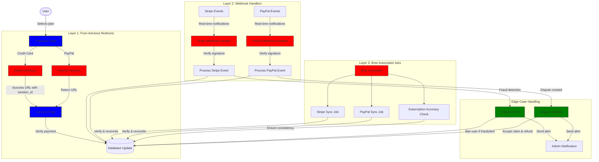
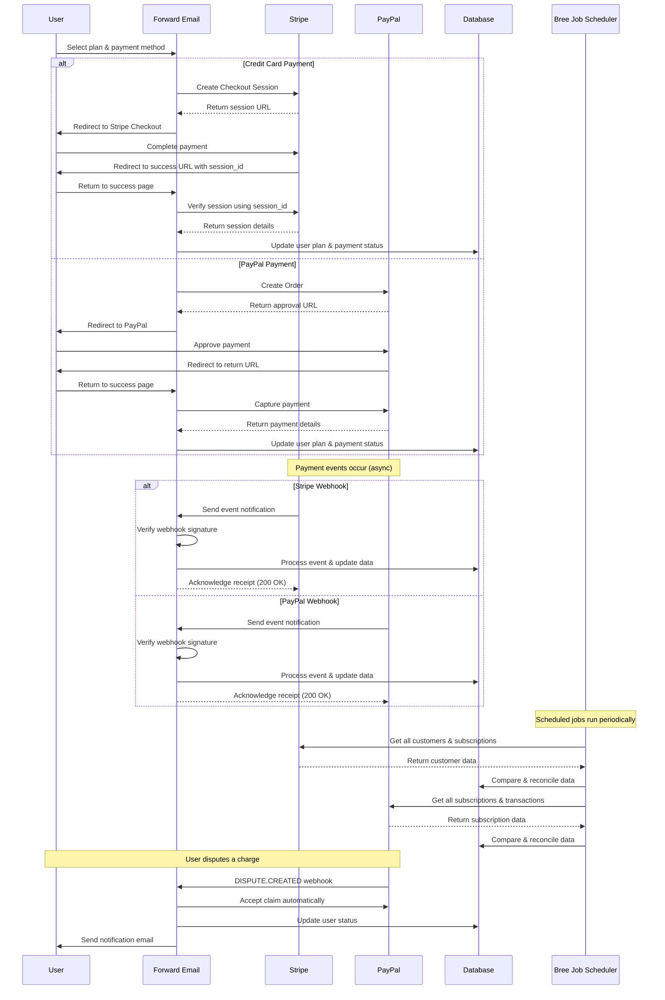
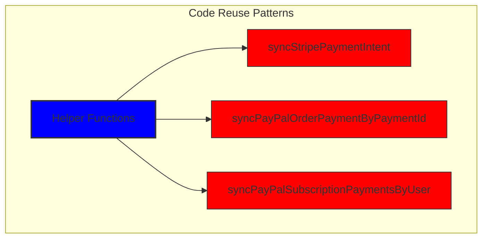
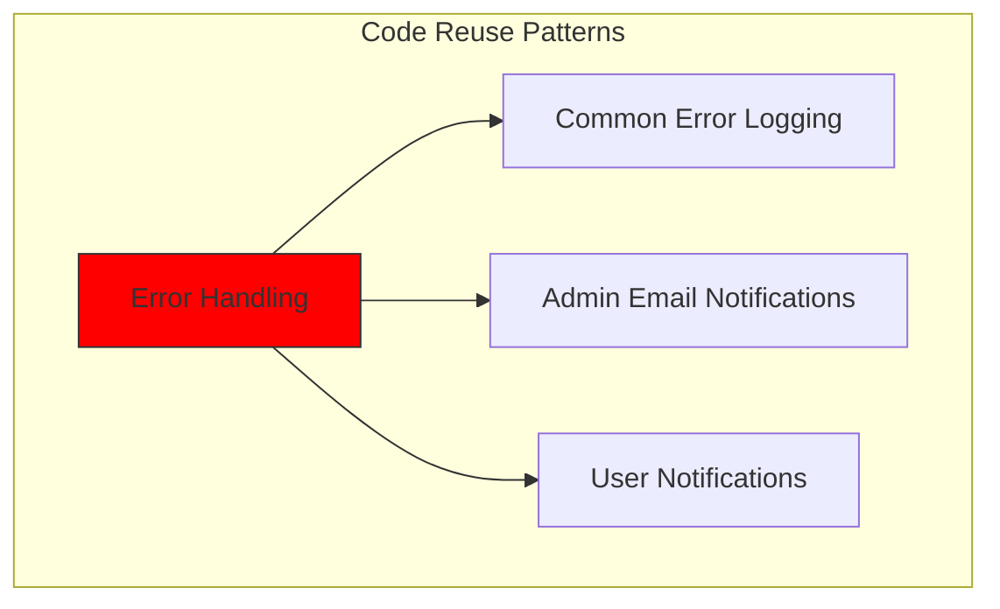
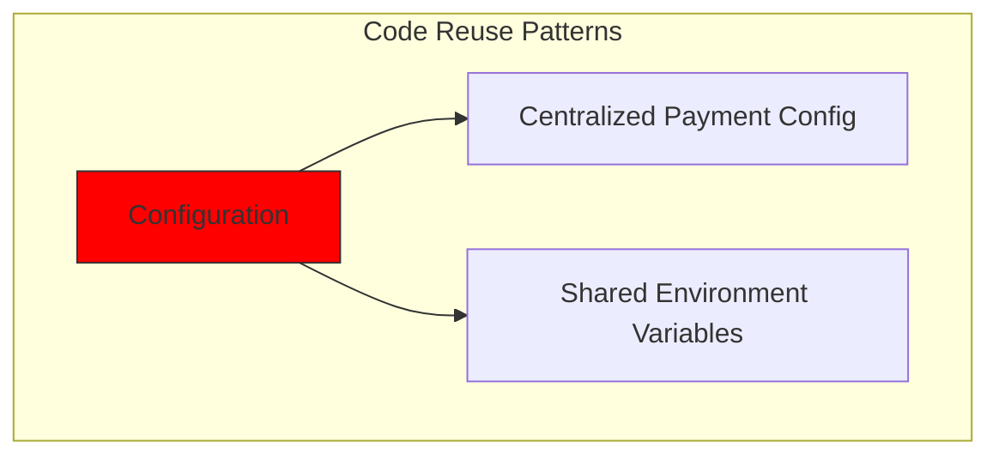
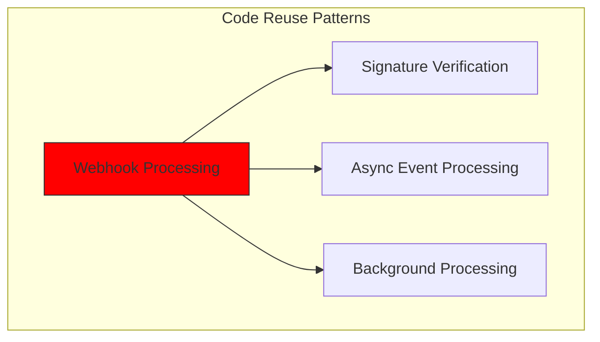
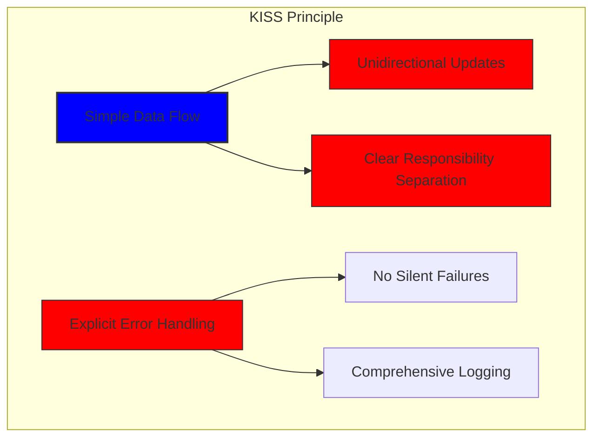
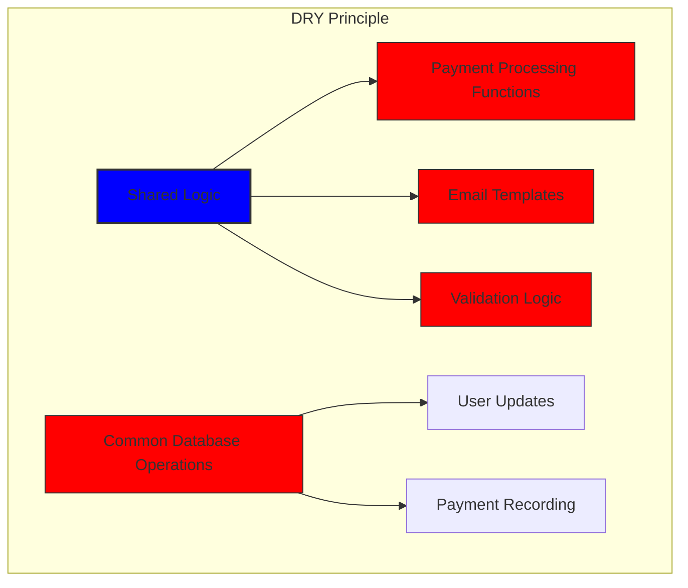

# Bagaimana Kami Membangun Sistem Pembayaran yang Tangguh dengan Stripe dan PayPal: Pendekatan Trifecta {#how-we-built-a-robust-payment-system-with-stripe-and-paypal-a-trifecta-approach}


## Daftar Isi {#table-of-contents}

* [Kata pengantar](#foreword)
* [Tantangan: Banyak Pemroses Pembayaran, Satu Sumber Kebenaran](#the-challenge-multiple-payment-processors-one-source-of-truth)
* [Pendekatan Trifecta: Tiga Lapisan Keandalan](#the-trifecta-approach-three-layers-of-reliability)
* [Lapisan 1: Pengalihan Pasca-Pembayaran](#layer-1-post-checkout-redirects)
  * [Implementasi Stripe Checkout](#stripe-checkout-implementation)
  * [Alur Pembayaran PayPal](#paypal-payment-flow)
* [Lapisan 2: Penanganan Webhook dengan Verifikasi Tanda Tangan](#layer-2-webhook-handlers-with-signature-verification)
  * [Implementasi Webhook Stripe](#stripe-webhook-implementation)
  * [Implementasi Webhook PayPal](#paypal-webhook-implementation)
* [Lapisan 3: Pekerjaan Otomatis dengan Bree](#layer-3-automated-jobs-with-bree)
  * [Pemeriksa Akurasi Berlangganan](#subscription-accuracy-checker)
  * [Sinkronisasi Langganan PayPal](#paypal-subscription-synchronization)
* [Penanganan Kasus Tepi](#handling-edge-cases)
  * [Deteksi dan Pencegahan Penipuan](#fraud-detection-and-prevention)
  * [Penanganan Sengketa](#dispute-handling)
* [Penggunaan Kembali Kode: Prinsip KISS dan DRY](#code-reuse-kiss-and-dry-principles)
* [Implementasi Persyaratan Berlangganan VISA](#visa-subscription-requirements-implementation)
  * [Notifikasi Email Pra-Perpanjangan Otomatis](#automated-pre-renewal-email-notifications)
  * [Penanganan Kasus Tepi](#handling-edge-cases-1)
  * [Periode Uji Coba dan Ketentuan Berlangganan](#trial-periods-and-subscription-terms)
* [Kesimpulan: Manfaat Pendekatan Trifecta Kami](#conclusion-the-benefits-of-our-trifecta-approach)

## Kata Pengantar {#foreword}

Di Forward Email, kami selalu memprioritaskan pengembangan sistem yang andal, akurat, dan ramah pengguna. Saat mengimplementasikan sistem pemrosesan pembayaran, kami menyadari bahwa kami membutuhkan solusi yang dapat menangani beberapa pemroses pembayaran sekaligus menjaga konsistensi data yang sempurna. Artikel blog ini merinci bagaimana tim pengembangan kami mengintegrasikan Stripe dan PayPal menggunakan pendekatan trifecta yang memastikan akurasi real-time 1:1 di seluruh sistem kami.

## Tantangan: Banyak Pemroses Pembayaran, Satu Sumber Kebenaran {#the-challenge-multiple-payment-processors-one-source-of-truth}

Sebagai layanan email yang berfokus pada privasi, kami ingin memberikan opsi pembayaran kepada pengguna kami. Beberapa pengguna lebih menyukai kemudahan pembayaran kartu kredit melalui Stripe, sementara yang lain menghargai lapisan pemisahan tambahan yang disediakan PayPal. Namun, mendukung beberapa pemroses pembayaran menimbulkan kompleksitas yang signifikan:

1. Bagaimana kita memastikan konsistensi data di berbagai sistem pembayaran?
2. Bagaimana kita menangani kasus-kasus khusus seperti sengketa, pengembalian dana, atau pembayaran yang gagal?
3. Bagaimana kita mempertahankan satu sumber kebenaran dalam basis data kita?

Solusi kami adalah menerapkan apa yang kami sebut "pendekatan trifecta" - sistem tiga lapis yang menyediakan redundansi dan memastikan konsistensi data apa pun yang terjadi.

## Pendekatan Trifecta: Tiga Lapisan Keandalan {#the-trifecta-approach-three-layers-of-reliability}

Sistem pembayaran kami terdiri dari tiga komponen penting yang bekerja sama untuk memastikan sinkronisasi data yang sempurna:

1. **Pengalihan pasca-pembayaran** - Menangkap informasi pembayaran segera setelah pembayaran
2. **Penanganan webhook** - Memproses peristiwa waktu nyata dari pemroses pembayaran
3. **Pekerjaan otomatis** - Memverifikasi dan merekonsiliasi data pembayaran secara berkala

Mari selami setiap komponen dan lihat bagaimana mereka bekerja bersama.



## Lapisan 1: Pengalihan Pasca-Pembayaran {#layer-1-post-checkout-redirects}

Lapisan pertama dari pendekatan trifecta kami terjadi segera setelah pengguna menyelesaikan pembayaran. Baik Stripe maupun PayPal menyediakan mekanisme untuk mengarahkan pengguna kembali ke situs kami dengan informasi transaksi.

### Implementasi Stripe Checkout {#stripe-checkout-implementation}

Untuk Stripe, kami menggunakan API Sesi Checkout mereka untuk menciptakan pengalaman pembayaran yang lancar. Ketika pengguna memilih paket dan memilih untuk membayar dengan kartu kredit, kami membuat Sesi Checkout dengan URL sukses dan batal yang spesifik:

```javascript
const options = {
  mode: paymentType === 'one-time' ? 'payment' : 'subscription',
  customer: ctx.state.user[config.userFields.stripeCustomerID],
  client_reference_id: reference,
  metadata: {
    plan
  },
  line_items: [
    {
      price,
      quantity: 1,
      description
    }
  ],
  locale: config.STRIPE_LOCALES.has(ctx.locale) ? ctx.locale : 'auto',
  cancel_url: `${config.urls.web}${ctx.path}${
    isMakePayment || isEnableAutoRenew ? '' : `/?plan=${plan}`
  }`,
  success_url: `${config.urls.web}${ctx.path}/?${
    isMakePayment || isEnableAutoRenew ? '' : `plan=${plan}&`
  }session_id={CHECKOUT_SESSION_ID}`,
  allow_promotion_codes: true
};

// Create the checkout session and redirect
const session = await stripe.checkout.sessions.create(options);
const redirectTo = session.url;
if (ctx.accepts('html')) {
  ctx.status = 303;
  ctx.redirect(redirectTo);
} else {
  ctx.body = { redirectTo };
}
```

Bagian penting di sini adalah parameter `success_url`, yang menyertakan `session_id` sebagai parameter kueri. Ketika Stripe mengarahkan pengguna kembali ke situs kami setelah pembayaran berhasil, kami dapat menggunakan ID sesi ini untuk memverifikasi transaksi dan memperbarui basis data kami.

### Alur Pembayaran PayPal {#paypal-payment-flow}

Untuk PayPal, kami menggunakan pendekatan serupa dengan API Pesanan mereka:

```javascript
const requestBody = {
  intent: 'CAPTURE',
  application_context: {
    cancel_url: `${config.urls.web}${ctx.path}${
      isMakePayment || isEnableAutoRenew ? '' : `/?plan=${plan}`
    }`,
    return_url: `${config.urls.web}${ctx.path}/?plan=${plan}`,
    brand_name: 'Forward Email',
    shipping_preference: 'NO_SHIPPING',
    user_action: 'PAY_NOW'
  },
  payer: {
    email_address: ctx.state.user.email
  },
  purchase_units: [
    {
      reference_id: ctx.state.user.id,
      description,
      custom_id: sku,
      invoice_id: reference,
      soft_descriptor: sku,
      amount: {
        currency_code: 'USD',
        value: price,
        breakdown: {
          item_total: {
            currency_code: 'USD',
            value: price
          }
        }
      },
      items: [
        {
          name,
          description,
          sku,
          unit_amount: {
            currency_code: 'USD',
            value: price
          },
          quantity: '1',
          category: 'DIGITAL_GOODS'
        }
      ]
    }
  ]
};
```

Mirip dengan Stripe, kami menetapkan parameter `return_url` dan `cancel_url` untuk menangani pengalihan pascabayar. Ketika PayPal mengalihkan pengguna kembali ke situs kami, kami dapat mencatat detail pembayaran dan memperbarui basis data kami.



## Lapisan 2: Penanganan Webhook dengan Verifikasi Tanda Tangan {#layer-2-webhook-handlers-with-signature-verification}

Meskipun pengalihan pasca-pembayaran berfungsi dengan baik untuk sebagian besar skenario, pengalihan tersebut tidak sepenuhnya aman. Pengguna mungkin menutup peramban mereka sebelum dialihkan, atau masalah jaringan mungkin mencegah pengalihan selesai. Di sinilah webhook berperan.

Baik Stripe maupun PayPal menyediakan sistem webhook yang mengirimkan notifikasi real-time tentang peristiwa pembayaran. Kami telah menerapkan pengendali webhook yang andal untuk memverifikasi keaslian notifikasi ini dan memprosesnya sebagaimana mestinya.

### Implementasi Webhook Stripe {#stripe-webhook-implementation}

Penanganan webhook Stripe kami memverifikasi tanda tangan peristiwa webhook yang masuk untuk memastikan keabsahannya:

```javascript
async function webhook(ctx) {
  const sig = ctx.request.get('stripe-signature');
  // throw an error if something was wrong
  if (!isSANB(sig))
    throw Boom.badRequest(ctx.translateError('INVALID_STRIPE_SIGNATURE'));
  const event = stripe.webhooks.constructEvent(
    ctx.request.rawBody,
    sig,
    env.STRIPE_ENDPOINT_SECRET
  );
  // throw an error if something was wrong
  if (!event)
    throw Boom.badRequest(ctx.translateError('INVALID_STRIPE_SIGNATURE'));
  ctx.logger.info('stripe webhook', { event });
  // return a response to acknowledge receipt of the event
  ctx.body = { received: true };
  // run in background
  processEvent(ctx, event)
    .then()
    .catch((err) => {
      ctx.logger.fatal(err, { event });
      // email admin errors
      emailHelper({
        template: 'alert',
        message: {
          to: config.email.message.from,
          subject: `Error with Stripe Webhook (Event ID ${event.id})`
        },
        locals: {
          message: `<pre><code>${safeStringify(
            parseErr(err),
            null,
            2
          )}</code></pre>`
        }
      })
        .then()
        .catch((err) => ctx.logger.fatal(err, { event }));
    });
}
```

Fungsi `stripe.webhooks.constructEvent` memverifikasi tanda tangan menggunakan rahasia titik akhir kami. Jika tanda tangan valid, kami memproses peristiwa secara asinkron untuk menghindari pemblokiran respons webhook.

### Implementasi Webhook PayPal {#paypal-webhook-implementation}

Demikian pula, penangan webhook PayPal kami memverifikasi keaslian notifikasi yang masuk:

```javascript
async function webhook(ctx) {
  const response = await promisify(
    paypal.notification.webhookEvent.verify,
    paypal.notification.webhookEvent
  )(ctx.request.headers, ctx.request.body, env.PAYPAL_WEBHOOK_ID);
  // throw an error if something was wrong
  if (!_.isObject(response) || response.verification_status !== 'SUCCESS')
    throw Boom.badRequest(ctx.translateError('INVALID_PAYPAL_SIGNATURE'));
  // return a response to acknowledge receipt of the event
  ctx.body = { received: true };
  // run in background
  processEvent(ctx)
    .then()
    .catch((err) => {
      ctx.logger.fatal(err);
      // email admin errors
      emailHelper({
        template: 'alert',
        message: {
          to: config.email.message.from,
          subject: `Error with PayPal Webhook (Event ID ${ctx.request.body.id})`
        },
        locals: {
          message: `<pre><code>${safeStringify(
            parseErr(err),
            null,
            2
          )}</code></pre>`
        }
      })
        .then()
        .catch((err) => ctx.logger.fatal(err));
    });
}
```

Kedua pengendali webhook mengikuti pola yang sama: memverifikasi tanda tangan, mengonfirmasi penerimaan, dan memproses peristiwa secara asinkron. Hal ini memastikan bahwa kami tidak pernah melewatkan peristiwa pembayaran, meskipun pengalihan pasca-pembayaran gagal.

## Lapisan 3: Pekerjaan Otomatis dengan Bree {#layer-3-automated-jobs-with-bree}

Lapisan terakhir dari pendekatan trifecta kami adalah serangkaian pekerjaan otomatis yang secara berkala memverifikasi dan merekonsiliasi data pembayaran. Kami menggunakan Bree, penjadwal pekerjaan untuk Node.js, untuk menjalankan pekerjaan ini secara berkala.

### Pemeriksa Akurasi Langganan {#subscription-accuracy-checker}

Salah satu tugas utama kami adalah pemeriksa akurasi langganan, yang memastikan bahwa basis data kami secara akurat mencerminkan status langganan di Stripe:

```javascript
async function mapper(customer) {
  // wait a second to prevent rate limitation error
  await setTimeout(ms('1s'));
  // check for user on our side
  let user = await Users.findOne({
    [config.userFields.stripeCustomerID]: customer.id
  })
    .lean()
    .exec();
  if (!user) return;
  if (user.is_banned) return;

  // if emails did not match
  if (user.email !== customer.email) {
    logger.info(
      `User email ${user.email} did not match customer email ${customer.email} (${customer.id})`
    );
    customer = await stripe.customers.update(customer.id, {
      email: user.email
    });
    logger.info(`Updated user email to match ${user.email}`);
  }

  // check for active subscriptions
  const [activeSubscriptions, trialingSubscriptions] = await Promise.all([
    stripe.subscriptions.list({
      customer: customer.id,
      status: 'active'
    }),
    stripe.subscriptions.list({
      customer: customer.id,
      status: 'trialing'
    })
  ]);

  // Combine active and trialing subscriptions
  let subscriptions = [
    ...activeSubscriptions.data,
    ...trialingSubscriptions.data
  ];

  // Handle edge case: multiple subscriptions for one user
  if (subscriptions.length > 1) {
    await logger.error(
      new Error(
        `We may need to refund: User had multiple subscriptions ${user.email} (${customer.id})`
      )
    );
    await emailHelper({
      template: 'alert',
      message: {
        to: config.email.message.from,
        subject: `User had multiple subscriptions ${user.email}`
      },
      locals: {
        message: `User ${user.email} (${customer.id}) had multiple subscriptions: ${JSON.stringify(
          subscriptions.map((s) => s.id)
        )}`
      }
    });
  }
}
```

Pekerjaan ini memeriksa ketidaksesuaian antara basis data kami dan Stripe, seperti alamat email yang tidak cocok atau beberapa langganan aktif. Jika ditemukan masalah, pekerjaan ini akan mencatatnya dan mengirimkan peringatan kepada tim admin kami.

### Sinkronisasi Langganan PayPal {#paypal-subscription-synchronization}

Kami memiliki pekerjaan serupa untuk langganan PayPal:

```javascript
async function syncPayPalSubscriptionPayments() {
  const paypalCustomers = await Users.find({
    $or: [
      {
        [config.userFields.paypalSubscriptionID]: { $exists: true, $ne: null }
      },
      {
        [config.userFields.paypalPayerID]: { $exists: true, $ne: null }
      }
    ]
  })
    // sort by newest customers first
    .sort('-created_at')
    .lean()
    .exec();

  await logger.info(
    `Syncing payments for ${paypalCustomers.length} paypal customers`
  );

  // Process each customer and sync their payments
  const errorEmails = await pReduce(
    paypalCustomers,
    // Implementation details...
  );
}
```

Pekerjaan otomatis ini berfungsi sebagai jaring pengaman terakhir kami, memastikan bahwa basis data kami selalu mencerminkan status sebenarnya dari langganan dan pembayaran di Stripe dan PayPal.

## Menangani Kasus Tepi {#handling-edge-cases}

Sistem pembayaran yang tangguh harus menangani kasus-kasus ekstrem dengan baik. Mari kita lihat bagaimana kami menangani beberapa skenario umum.

### Deteksi dan Pencegahan Penipuan {#fraud-detection-and-prevention}

Kami telah menerapkan mekanisme deteksi penipuan canggih yang secara otomatis mengidentifikasi dan menangani aktivitas pembayaran yang mencurigakan:

```javascript
case 'charge.failed': {
  // Get all failed charges in the last 30 days
  const charges = await stripe.charges.list({
    customer: event.data.object.customer,
    created: {
      gte: dayjs().subtract(1, 'month').unix()
    }
  });

  // Filter for declined charges
  const filtered = charges.data.filter(
    (d) => d.status === 'failed' && d.failure_code === 'card_declined'
  );

  // if not more than 5 then return early
  if (filtered.length < 5) break;

  // Check if user has verified domains
  const count = await Domains.countDocuments({
    members: {
      $elemMatch: {
        user: user._id,
        group: 'admin'
      }
    },
    plan: { $in: ['enhanced_protection', 'team'] },
    has_txt_record: true
  });

  if (!user.is_banned) {
    // If no verified domains, ban the user and refund all charges
    if (count === 0) {
      // Ban the user
      user.is_banned = true;
      await user.save();

      // Refund all successful charges
    }
  }
}
```

Kode ini secara otomatis memblokir pengguna yang memiliki beberapa tagihan gagal dan tidak ada domain terverifikasi, yang merupakan indikator kuat aktivitas penipuan.

### Penanganan Sengketa {#dispute-handling}

Jika pengguna membantah suatu tagihan, kami secara otomatis menerima klaim tersebut dan mengambil tindakan yang tepat:

```javascript
case 'CUSTOMER.DISPUTE.CREATED': {
  // accept claim
  const agent = await paypalAgent();
  await agent
    .post(`/v1/customer/disputes/${body.resource.dispute_id}/accept-claim`)
    .send({
      note: 'Full refund to the customer.'
    });

  // Find the payment in our database
  const payment = await Payments.findOne({ $or });
  if (!payment) throw new Error('Payment does not exist');

  const user = await Users.findById(payment.user);
  if (!user) throw new Error('User did not exist for customer');

  // Cancel the user's subscription if they have one
  if (isSANB(user[config.userFields.paypalSubscriptionID])) {
    try {
      const agent = await paypalAgent();
      await agent.post(
        `/v1/billing/subscriptions/${
          user[config.userFields.paypalSubscriptionID]
        }/cancel`
      );
    } catch (err) {
      // Handle subscription cancellation errors
    }
  }
}
```

Pendekatan ini meminimalkan dampak perselisihan pada bisnis kami sekaligus memastikan pengalaman pelanggan yang baik.

Penggunaan Kembali Kode ##: Prinsip KISS dan DRY {#code-reuse-kiss-and-dry-principles}

Di seluruh sistem pembayaran kami, kami telah mematuhi prinsip KISS (Keep It Simple, Stupid) dan DRY (Don't Repeat Yourself). Berikut beberapa contohnya:

1. **Fungsi Pembantu Bersama**: Kami telah membuat fungsi pembantu yang dapat digunakan kembali untuk tugas-tugas umum seperti menyinkronkan pembayaran dan mengirim email.

2. **Penanganan Kesalahan yang Konsisten**: Baik penangan webhook Stripe maupun PayPal menggunakan pola yang sama untuk penanganan kesalahan dan pemberitahuan admin.

3. **Skema Basis Data Terpadu**: Skema basis data kami dirancang untuk mengakomodasi data Stripe dan PayPal, dengan bidang umum untuk status pembayaran, jumlah, dan informasi paket.

4. **Konfigurasi Terpusat**: Konfigurasi terkait pembayaran dipusatkan dalam satu file, sehingga memudahkan pembaruan harga dan informasi produk.













## Implementasi Persyaratan Berlangganan VISA {#visa-subscription-requirements-implementation}

Selain pendekatan trifecta kami, kami telah menerapkan fitur-fitur spesifik untuk memenuhi persyaratan berlangganan VISA sekaligus meningkatkan pengalaman pengguna. Salah satu persyaratan utama VISA adalah pengguna harus diberi tahu sebelum dikenakan biaya berlangganan, terutama saat beralih dari uji coba ke langganan berbayar.

### Notifikasi Email Pra-Perpanjangan Otomatis {#automated-pre-renewal-email-notifications}

Kami telah membangun sistem otomatis yang mengidentifikasi pengguna dengan langganan uji coba aktif dan mengirimkan email notifikasi sebelum tagihan pertama mereka muncul. Hal ini tidak hanya menjaga kepatuhan kami terhadap persyaratan VISA, tetapi juga mengurangi pengembalian dana dan meningkatkan kepuasan pelanggan.

Berikut ini cara kami menerapkan fitur ini:

```javascript
// Find users with trial subscriptions who haven't received a notification yet
const users = await Users.find({
  $or: [
    {
      $and: [
        { [config.userFields.stripeSubscriptionID]: { $exists: true } },
        { [config.userFields.stripeTrialSentAt]: { $exists: false } },
        // Exclude subscriptions that have already had payments
        ...(paidStripeSubscriptionIds.length > 0
          ? [
              {
                [config.userFields.stripeSubscriptionID]: {
                  $nin: paidStripeSubscriptionIds
                }
              }
            ]
          : [])
      ]
    },
    {
      $and: [
        { [config.userFields.paypalSubscriptionID]: { $exists: true } },
        { [config.userFields.paypalTrialSentAt]: { $exists: false } },
        // Exclude subscriptions that have already had payments
        ...(paidPayPalSubscriptionIds.length > 0
          ? [
              {
                [config.userFields.paypalSubscriptionID]: {
                  $nin: paidPayPalSubscriptionIds
                }
              }
            ]
          : [])
      ]
    }
  ]
});

// Process each user and send notification
for (const user of users) {
  // Get subscription details from payment processor
  const subscription = await getSubscriptionDetails(user);

  // Calculate subscription duration and frequency
  const duration = getDurationFromPlanId(subscription.plan_id);
  const frequency = getHumanReadableFrequency(duration, user.locale);
  const amount = getPlanAmount(user.plan, duration);

  // Get user's domains for personalized email
  const domains = await Domains.find({
    'members.user': user._id
  }).sort('name').lean().exec();

  // Send VISA-compliant notification email
  await emailHelper({
    template: 'visa-trial-subscription-requirement',
    message: {
      to: user.receipt_email || user.email,
      ...(user.receipt_email ? { cc: user.email } : {})
    },
    locals: {
      user,
      firstChargeDate: new Date(subscription.start_time),
      frequency,
      formattedAmount: numeral(amount).format('$0,0,0.00'),
      domains
    }
  });

  // Record that notification was sent
  await Users.findByIdAndUpdate(user._id, {
    $set: {
      [config.userFields.paypalTrialSentAt]: new Date()
    }
  });
}
```

Implementasi ini memastikan bahwa pengguna selalu diberi tahu tentang tagihan yang akan datang, dengan rincian yang jelas tentang:

1. Kapan tagihan pertama akan dikenakan
2. Frekuensi tagihan selanjutnya (bulanan, tahunan, dll.)
3. Jumlah pasti tagihan yang akan dikenakan
4. Domain mana saja yang tercakup dalam langganan mereka

Dengan mengotomatiskan proses ini, kami mempertahankan kepatuhan sempurna terhadap persyaratan VISA (yang mewajibkan pemberitahuan setidaknya 7 hari sebelum penagihan) sekaligus mengurangi pertanyaan dukungan dan meningkatkan pengalaman pengguna secara keseluruhan.

### Menangani Kasus Tepi {#handling-edge-cases-1}

Implementasi kami juga mencakup penanganan kesalahan yang andal. Jika terjadi kesalahan selama proses notifikasi, sistem kami akan secara otomatis memberi tahu tim kami:

```javascript
try {
  await mapper(user);
} catch (err) {
  logger.error(err);

  // Send alert to administrators
  await emailHelper({
    template: 'alert',
    message: {
      to: config.email.message.from,
      subject: 'VISA Trial Subscription Requirement Error'
    },
    locals: {
      message: `<pre><code>${safeStringify(
        parseErr(err),
        null,
        2
      )}</code></pre>`
    }
  });
}
```

Ini memastikan bahwa meskipun terjadi masalah dengan sistem notifikasi, tim kami dapat dengan cepat mengatasinya dan menjaga kepatuhan terhadap persyaratan VISA.

Sistem pemberitahuan langganan VISA adalah contoh lain tentang bagaimana kami membangun infrastruktur pembayaran dengan mempertimbangkan kepatuhan dan pengalaman pengguna, melengkapi pendekatan trifecta kami untuk memastikan pemrosesan pembayaran yang andal dan transparan.

### Periode Uji Coba dan Ketentuan Berlangganan {#trial-periods-and-subscription-terms}

Bagi pengguna yang mengaktifkan perpanjangan otomatis pada paket yang ada, kami menghitung periode uji coba yang tepat untuk memastikan mereka tidak dikenai biaya hingga paket mereka saat ini berakhir:

```javascript
if (
  isEnableAutoRenew &&
  dayjs(ctx.state.user[config.userFields.planExpiresAt]).isAfter(
    dayjs()
  )
) {
  const hours = dayjs(
    ctx.state.user[config.userFields.planExpiresAt]
  ).diff(dayjs(), 'hours');

  // Handle trial period calculation
}
```

Kami juga menyediakan informasi yang jelas tentang ketentuan berlangganan, termasuk frekuensi penagihan dan kebijakan pembatalan, serta menyertakan metadata terperinci dengan setiap langganan untuk memastikan pelacakan dan pengelolaan yang tepat.

Kesimpulan: Manfaat Pendekatan Trifecta Kami {#conclusion-the-benefits-of-our-trifecta-approach}

Pendekatan tiga serangkai kami terhadap pemrosesan pembayaran telah memberikan beberapa manfaat utama:

1. **Keandalan**: Dengan menerapkan tiga lapisan verifikasi pembayaran, kami memastikan bahwa tidak ada pembayaran yang terlewat atau diproses secara tidak benar.

2. **Akurasi**: Basis data kami selalu mencerminkan status sebenarnya dari langganan dan pembayaran di Stripe dan PayPal.

3. **Fleksibilitas**: Pengguna dapat memilih metode pembayaran yang mereka inginkan tanpa mengorbankan keandalan sistem kami.

4. **Ketahanan**: Sistem kami menangani kasus-kasus ekstrem dengan baik, mulai dari kegagalan jaringan hingga aktivitas penipuan.

Jika Anda menerapkan sistem pembayaran yang mendukung banyak prosesor, kami sangat merekomendasikan pendekatan trifecta ini. Pendekatan ini membutuhkan upaya pengembangan awal yang lebih besar, tetapi manfaat jangka panjangnya dalam hal keandalan dan akurasi sangat sepadan.

Untuk informasi lebih lanjut tentang Forward Email dan layanan email kami yang berfokus pada privasi, kunjungi [situs web](https://forwardemail.net).

<!-- *Kata kunci: pemrosesan pembayaran, integrasi Stripe, integrasi PayPal, penanganan webhook, sinkronisasi pembayaran, manajemen langganan, pencegahan penipuan, penanganan sengketa, sistem pembayaran Node.js, sistem pembayaran multiprosesor, integrasi gateway pembayaran, verifikasi pembayaran real-time, konsistensi data pembayaran, penagihan langganan, keamanan pembayaran, otomatisasi pembayaran, webhook pembayaran, rekonsiliasi pembayaran, kasus tepi pembayaran, penanganan kesalahan pembayaran, persyaratan langganan VISA, notifikasi pra-perpanjangan, kepatuhan langganan* -->