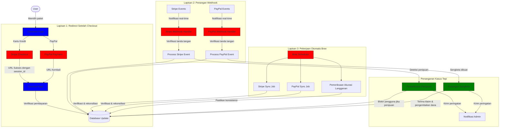
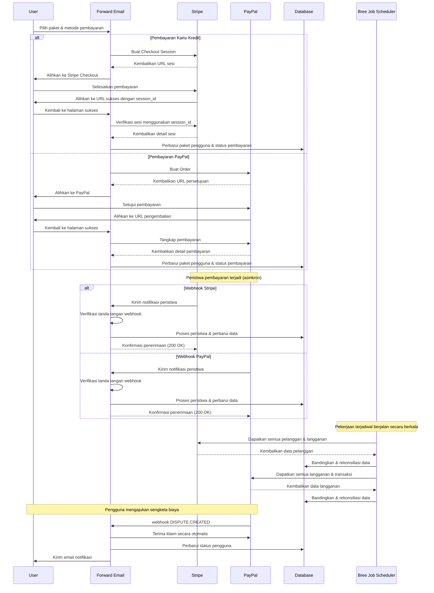
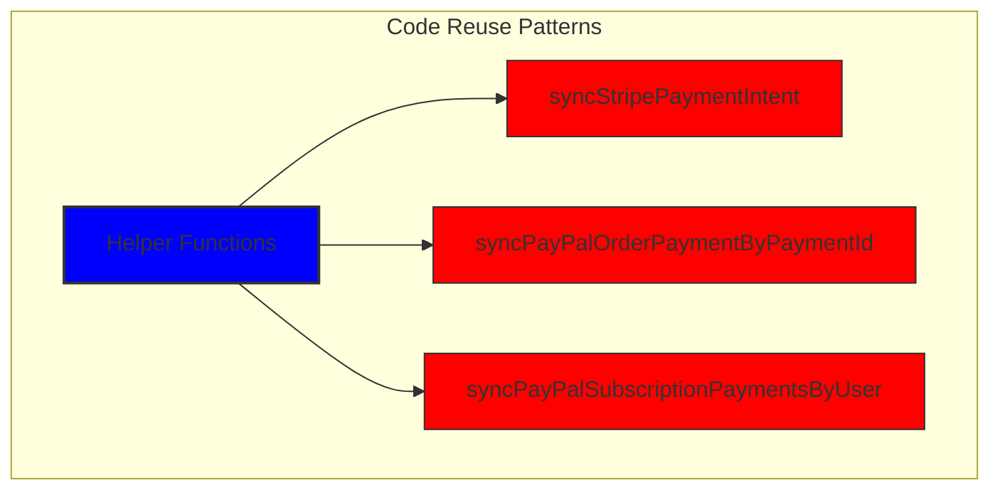
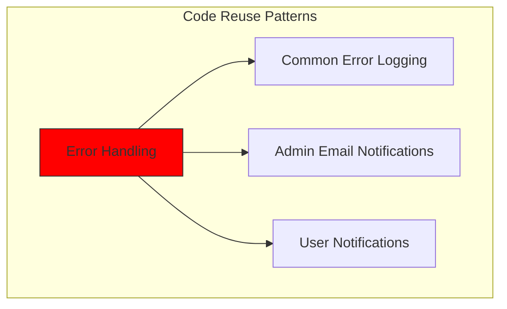
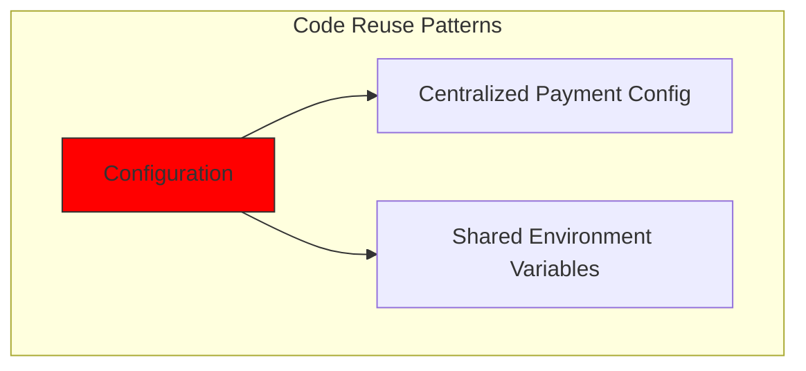
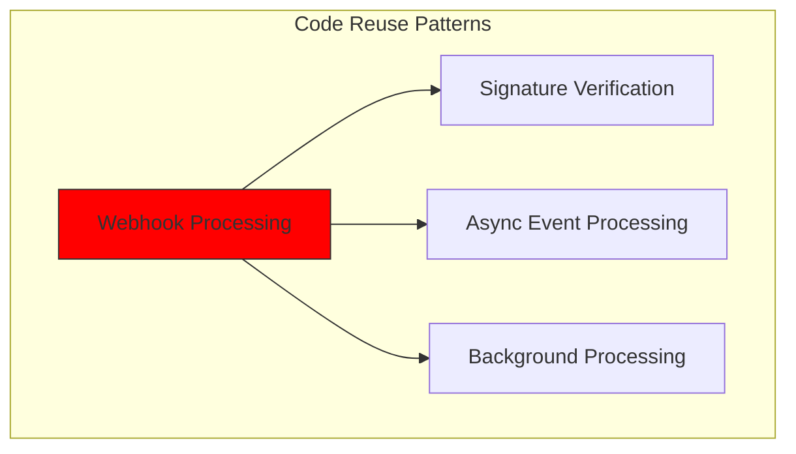
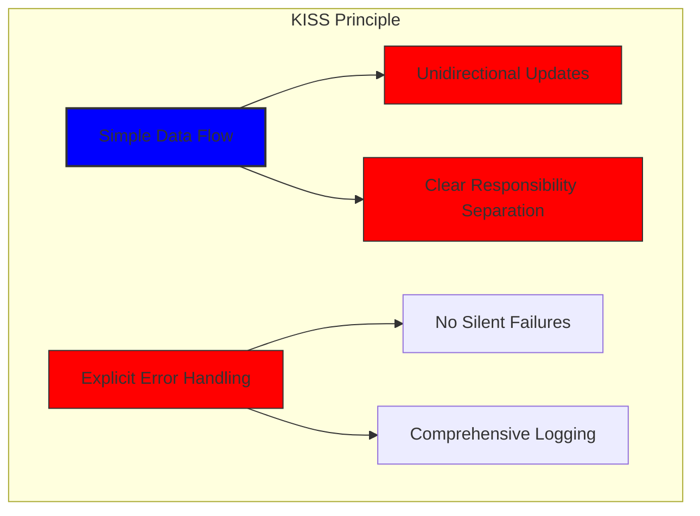

# Bagaimana Kami Membangun Sistem Pembayaran yang Kuat dengan Stripe dan PayPal: Pendekatan Trifecta {#how-we-built-a-robust-payment-system-with-stripe-and-paypal-a-trifecta-approach}


## Daftar Isi {#table-of-contents}

* [Kata Pengantar](#foreword)
* [Tantangan: Banyak Prosesor Pembayaran, Satu Sumber Kebenaran](#the-challenge-multiple-payment-processors-one-source-of-truth)
* [Pendekatan Trifecta: Tiga Lapisan Keandalan](#the-trifecta-approach-three-layers-of-reliability)
* [Lapisan 1: Redirect Setelah Checkout](#layer-1-post-checkout-redirects)
  * [Implementasi Stripe Checkout](#stripe-checkout-implementation)
  * [Alur Pembayaran PayPal](#paypal-payment-flow)
* [Lapisan 2: Penangan Webhook dengan Verifikasi Tanda Tangan](#layer-2-webhook-handlers-with-signature-verification)
  * [Implementasi Webhook Stripe](#stripe-webhook-implementation)
  * [Implementasi Webhook PayPal](#paypal-webhook-implementation)
* [Lapisan 3: Pekerjaan Otomatis dengan Bree](#layer-3-automated-jobs-with-bree)
  * [Pemeriksa Akurasi Langganan](#subscription-accuracy-checker)
  * [Sinkronisasi Langganan PayPal](#paypal-subscription-synchronization)
* [Menangani Kasus Tepi](#handling-edge-cases)
  * [Deteksi dan Pencegahan Penipuan](#fraud-detection-and-prevention)
  * [Penanganan Sengketa](#dispute-handling)
* [Penggunaan Kembali Kode: Prinsip KISS dan DRY](#code-reuse-kiss-and-dry-principles)
* [Implementasi Persyaratan Langganan VISA](#visa-subscription-requirements-implementation)
  * [Notifikasi Email Pra-Pembaruan Otomatis](#automated-pre-renewal-email-notifications)
  * [Menangani Kasus Tepi](#handling-edge-cases-1)
  * [Periode Percobaan dan Ketentuan Langganan](#trial-periods-and-subscription-terms)
* [Kesimpulan: Manfaat Pendekatan Trifecta Kami](#conclusion-the-benefits-of-our-trifecta-approach)


## Kata Pengantar {#foreword}

Di Forward Email, kami selalu memprioritaskan pembuatan sistem yang andal, akurat, dan ramah pengguna. Saat mengimplementasikan sistem pemrosesan pembayaran kami, kami tahu kami membutuhkan solusi yang dapat menangani banyak prosesor pembayaran sekaligus menjaga konsistensi data yang sempurna. Posting blog ini menjelaskan bagaimana tim pengembangan kami mengintegrasikan Stripe dan PayPal menggunakan pendekatan trifecta yang memastikan akurasi 1:1 secara real-time di seluruh sistem kami.


## Tantangan: Banyak Prosesor Pembayaran, Satu Sumber Kebenaran {#the-challenge-multiple-payment-processors-one-source-of-truth}

Sebagai layanan email yang berfokus pada privasi, kami ingin memberikan opsi pembayaran kepada pengguna kami. Beberapa lebih memilih kemudahan pembayaran kartu kredit melalui Stripe, sementara yang lain menghargai lapisan pemisahan tambahan yang disediakan PayPal. Namun, mendukung banyak prosesor pembayaran memperkenalkan kompleksitas yang signifikan:

1. Bagaimana kami memastikan data yang konsisten di berbagai sistem pembayaran?
2. Bagaimana kami menangani kasus tepi seperti sengketa, pengembalian dana, atau pembayaran gagal?
3. Bagaimana kami mempertahankan satu sumber kebenaran dalam basis data kami?

Solusi kami adalah mengimplementasikan apa yang kami sebut "pendekatan trifecta" - sistem tiga lapis yang menyediakan redundansi dan memastikan konsistensi data apa pun yang terjadi.


## Pendekatan Trifecta: Tiga Lapisan Keandalan {#the-trifecta-approach-three-layers-of-reliability}

Sistem pembayaran kami terdiri dari tiga komponen penting yang bekerja bersama untuk memastikan sinkronisasi data yang sempurna:

1. **Redirect setelah checkout** - Menangkap informasi pembayaran segera setelah checkout
2. **Penangan webhook** - Memproses event real-time dari prosesor pembayaran
3. **Pekerjaan otomatis** - Memverifikasi dan merekonsiliasi data pembayaran secara berkala

Mari kita bahas setiap komponen dan lihat bagaimana mereka bekerja bersama.


```mermaid
flowchart TD
    User([User]) --> |Memilih paket| Checkout[Checkout Page]

    %% Layer 1: Post-checkout redirects
    subgraph "Lapisan 1: Redirect Setelah Checkout"
        Checkout --> |Kartu Kredit| Stripe[Stripe Checkout]
        Checkout --> |PayPal| PayPal[PayPal Payment]

        Stripe --> |URL Sukses dengan session_id| SuccessPage[Success Page]
        PayPal --> |URL Kembali| SuccessPage

        SuccessPage --> |Verifikasi pembayaran| Database[(Database Update)]
    end

    %% Layer 2: Webhooks
    subgraph "Lapisan 2: Penangan Webhook"
        StripeEvents[Stripe Events] --> |Notifikasi real-time| StripeWebhook[Stripe Webhook Handler]
        PayPalEvents[PayPal Events] --> |Notifikasi real-time| PayPalWebhook[PayPal Webhook Handler]

        StripeWebhook --> |Verifikasi tanda tangan| ProcessStripeEvent[Process Stripe Event]
        PayPalWebhook --> |Verifikasi tanda tangan| ProcessPayPalEvent[Process PayPal Event]

        ProcessStripeEvent --> Database
        ProcessPayPalEvent --> Database
    end

    %% Layer 3: Automated jobs
    subgraph "Lapisan 3: Pekerjaan Otomatis Bree"
        BreeScheduler[Bree Scheduler] --> StripeSync[Stripe Sync Job]
        BreeScheduler --> PayPalSync[PayPal Sync Job]
        BreeScheduler --> AccuracyCheck[Pemeriksaan Akurasi Langganan]

        StripeSync --> |Verifikasi & rekonsiliasi| Database
        PayPalSync --> |Verifikasi & rekonsiliasi| Database
        AccuracyCheck --> |Pastikan konsistensi| Database
    end

    %% Edge cases
    subgraph "Penanganan Kasus Tepi"
        ProcessStripeEvent --> |Deteksi penipuan| FraudCheck[Pemeriksaan Penipuan]
        ProcessPayPalEvent --> |Sengketa dibuat| DisputeHandler[Penangan Sengketa]

        FraudCheck --> |Blokir pengguna jika penipuan| Database
        DisputeHandler --> |Terima klaim & pengembalian dana| Database

        FraudCheck --> |Kirim peringatan| AdminNotification[Notifikasi Admin]
        DisputeHandler --> |Kirim peringatan| AdminNotification
    end

    %% Style definitions
    classDef primary fill:blue,stroke:#333,stroke-width:2px;
    classDef secondary fill:red,stroke:#333,stroke-width:1px;
    classDef tertiary fill:green,stroke:#333,stroke-width:1px;

    class Checkout,SuccessPage primary;
    class Stripe,PayPal,StripeWebhook,PayPalWebhook,BreeScheduler secondary;
    class FraudCheck,DisputeHandler tertiary;
```
## Layer 1: Pengalihan Setelah Checkout {#layer-1-post-checkout-redirects}

Lapisan pertama dari pendekatan trifecta kami terjadi segera setelah pengguna menyelesaikan pembayaran. Baik Stripe maupun PayPal menyediakan mekanisme untuk mengarahkan pengguna kembali ke situs kami dengan informasi transaksi.

### Implementasi Stripe Checkout {#stripe-checkout-implementation}

Untuk Stripe, kami menggunakan API Checkout Sessions mereka untuk menciptakan pengalaman pembayaran yang mulus. Ketika pengguna memilih paket dan memilih untuk membayar dengan kartu kredit, kami membuat Checkout Session dengan URL sukses dan batal yang spesifik:

```javascript
const options = {
  mode: paymentType === 'one-time' ? 'payment' : 'subscription',
  customer: ctx.state.user[config.userFields.stripeCustomerID],
  client_reference_id: reference,
  metadata: {
    plan
  },
  line_items: [
    {
      price,
      quantity: 1,
      description
    }
  ],
  locale: config.STRIPE_LOCALES.has(ctx.locale) ? ctx.locale : 'auto',
  cancel_url: `${config.urls.web}${ctx.path}${
    isMakePayment || isEnableAutoRenew ? '' : `/?plan=${plan}`
  }`,
  success_url: `${config.urls.web}${ctx.path}/?${
    isMakePayment || isEnableAutoRenew ? '' : `plan=${plan}&`
  }session_id={CHECKOUT_SESSION_ID}`,
  allow_promotion_codes: true
};

// Create the checkout session and redirect
const session = await stripe.checkout.sessions.create(options);
const redirectTo = session.url;
if (ctx.accepts('html')) {
  ctx.status = 303;
  ctx.redirect(redirectTo);
} else {
  ctx.body = { redirectTo };
}
```

Bagian penting di sini adalah parameter `success_url`, yang menyertakan `session_id` sebagai parameter query. Ketika Stripe mengarahkan pengguna kembali ke situs kami setelah pembayaran berhasil, kami dapat menggunakan ID sesi ini untuk memverifikasi transaksi dan memperbarui basis data kami sesuai kebutuhan.

### Alur Pembayaran PayPal {#paypal-payment-flow}

Untuk PayPal, kami menggunakan pendekatan serupa dengan API Orders mereka:

```javascript
const requestBody = {
  intent: 'CAPTURE',
  application_context: {
    cancel_url: `${config.urls.web}${ctx.path}${
      isMakePayment || isEnableAutoRenew ? '' : `/?plan=${plan}`
    }`,
    return_url: `${config.urls.web}${ctx.path}/?plan=${plan}`,
    brand_name: 'Forward Email',
    shipping_preference: 'NO_SHIPPING',
    user_action: 'PAY_NOW'
  },
  payer: {
    email_address: ctx.state.user.email
  },
  purchase_units: [
    {
      reference_id: ctx.state.user.id,
      description,
      custom_id: sku,
      invoice_id: reference,
      soft_descriptor: sku,
      amount: {
        currency_code: 'USD',
        value: price,
        breakdown: {
          item_total: {
            currency_code: 'USD',
            value: price
          }
        }
      },
      items: [
        {
          name,
          description,
          sku,
          unit_amount: {
            currency_code: 'USD',
            value: price
          },
          quantity: '1',
          category: 'DIGITAL_GOODS'
        }
      ]
    }
  ]
};
```

Serupa dengan Stripe, kami menentukan parameter `return_url` dan `cancel_url` untuk menangani pengalihan setelah pembayaran. Ketika PayPal mengarahkan pengguna kembali ke situs kami, kami dapat menangkap detail pembayaran dan memperbarui basis data kami.


```mermaid
sequenceDiagram
    participant User
    participant FE as Forward Email
    participant Stripe
    participant PayPal
    participant DB as Database
    participant Bree as Bree Job Scheduler

    %% Initial checkout flow
    User->>FE: Pilih paket & metode pembayaran

    alt Pembayaran Kartu Kredit
        FE->>Stripe: Buat Checkout Session
        Stripe-->>FE: Kembalikan URL sesi
        FE->>User: Alihkan ke Stripe Checkout
        User->>Stripe: Selesaikan pembayaran
        Stripe->>User: Alihkan ke URL sukses dengan session_id
        User->>FE: Kembali ke halaman sukses
        FE->>Stripe: Verifikasi sesi menggunakan session_id
        Stripe-->>FE: Kembalikan detail sesi
        FE->>DB: Perbarui paket pengguna & status pembayaran
    else Pembayaran PayPal
        FE->>PayPal: Buat Order
        PayPal-->>FE: Kembalikan URL persetujuan
        FE->>User: Alihkan ke PayPal
        User->>PayPal: Setujui pembayaran
        PayPal->>User: Alihkan ke URL pengembalian
        User->>FE: Kembali ke halaman sukses
        FE->>PayPal: Tangkap pembayaran
        PayPal-->>FE: Kembalikan detail pembayaran
        FE->>DB: Perbarui paket pengguna & status pembayaran
    end

    %% Alur webhook (asinkron)
    Note over Stripe,PayPal: Peristiwa pembayaran terjadi (asinkron)

    alt Webhook Stripe
        Stripe->>FE: Kirim notifikasi peristiwa
        FE->>FE: Verifikasi tanda tangan webhook
        FE->>DB: Proses peristiwa & perbarui data
        FE-->>Stripe: Konfirmasi penerimaan (200 OK)
    else Webhook PayPal
        PayPal->>FE: Kirim notifikasi peristiwa
        FE->>FE: Verifikasi tanda tangan webhook
        FE->>DB: Proses peristiwa & perbarui data
        FE-->>PayPal: Konfirmasi penerimaan (200 OK)
    end

    %% Pekerjaan otomatis Bree
    Note over Bree: Pekerjaan terjadwal berjalan secara berkala

    Bree->>Stripe: Dapatkan semua pelanggan & langganan
    Stripe-->>Bree: Kembalikan data pelanggan
    Bree->>DB: Bandingkan & rekonsiliasi data

    Bree->>PayPal: Dapatkan semua langganan & transaksi
    PayPal-->>Bree: Kembalikan data langganan
    Bree->>DB: Bandingkan & rekonsiliasi data

    %% Kasus tepi: Penanganan sengketa
    Note over User,PayPal: Pengguna mengajukan sengketa biaya

    PayPal->>FE: webhook DISPUTE.CREATED
    FE->>PayPal: Terima klaim secara otomatis
    FE->>DB: Perbarui status pengguna
    FE->>User: Kirim email notifikasi
```
## Layer 2: Penangan Webhook dengan Verifikasi Tanda Tangan {#layer-2-webhook-handlers-with-signature-verification}

Meskipun pengalihan setelah checkout bekerja dengan baik untuk sebagian besar skenario, metode ini tidak sempurna. Pengguna mungkin menutup browser mereka sebelum dialihkan, atau masalah jaringan dapat mencegah pengalihan selesai. Di sinilah webhook berperan.

Baik Stripe maupun PayPal menyediakan sistem webhook yang mengirimkan notifikasi waktu nyata tentang peristiwa pembayaran. Kami telah mengimplementasikan penangan webhook yang kuat yang memverifikasi keaslian notifikasi ini dan memprosesnya sesuai kebutuhan.

### Implementasi Webhook Stripe {#stripe-webhook-implementation}

Penangan webhook Stripe kami memverifikasi tanda tangan dari event webhook yang masuk untuk memastikan keasliannya:

```javascript
async function webhook(ctx) {
  const sig = ctx.request.get('stripe-signature');
  // lempar error jika ada yang salah
  if (!isSANB(sig))
    throw Boom.badRequest(ctx.translateError('INVALID_STRIPE_SIGNATURE'));
  const event = stripe.webhooks.constructEvent(
    ctx.request.rawBody,
    sig,
    env.STRIPE_ENDPOINT_SECRET
  );
  // lempar error jika ada yang salah
  if (!event)
    throw Boom.badRequest(ctx.translateError('INVALID_STRIPE_SIGNATURE'));
  ctx.logger.info('stripe webhook', { event });
  // kembalikan respons untuk mengakui penerimaan event
  ctx.body = { received: true };
  // jalankan di latar belakang
  processEvent(ctx, event)
    .then()
    .catch((err) => {
      ctx.logger.fatal(err, { event });
      // kirim email admin jika ada error
      emailHelper({
        template: 'alert',
        message: {
          to: config.email.message.from,
          subject: `Error with Stripe Webhook (Event ID ${event.id})`
        },
        locals: {
          message: `<pre><code>${safeStringify(
            parseErr(err),
            null,
            2
          )}</code></pre>`
        }
      })
        .then()
        .catch((err) => ctx.logger.fatal(err, { event }));
    });
}
```

Fungsi `stripe.webhooks.constructEvent` memverifikasi tanda tangan menggunakan rahasia endpoint kami. Jika tanda tangan valid, kami memproses event secara asinkron untuk menghindari pemblokiran respons webhook.

### Implementasi Webhook PayPal {#paypal-webhook-implementation}

Demikian pula, penangan webhook PayPal kami memverifikasi keaslian notifikasi yang masuk:

```javascript
async function webhook(ctx) {
  const response = await promisify(
    paypal.notification.webhookEvent.verify,
    paypal.notification.webhookEvent
  )(ctx.request.headers, ctx.request.body, env.PAYPAL_WEBHOOK_ID);
  // lempar error jika ada yang salah
  if (!_.isObject(response) || response.verification_status !== 'SUCCESS')
    throw Boom.badRequest(ctx.translateError('INVALID_PAYPAL_SIGNATURE'));
  // kembalikan respons untuk mengakui penerimaan event
  ctx.body = { received: true };
  // jalankan di latar belakang
  processEvent(ctx)
    .then()
    .catch((err) => {
      ctx.logger.fatal(err);
      // kirim email admin jika ada error
      emailHelper({
        template: 'alert',
        message: {
          to: config.email.message.from,
          subject: `Error with PayPal Webhook (Event ID ${ctx.request.body.id})`
        },
        locals: {
          message: `<pre><code>${safeStringify(
            parseErr(err),
            null,
            2
          )}</code></pre>`
        }
      })
        .then()
        .catch((err) => ctx.logger.fatal(err));
    });
}
```

Kedua penangan webhook mengikuti pola yang sama: memverifikasi tanda tangan, mengakui penerimaan, dan memproses event secara asinkron. Ini memastikan kami tidak pernah melewatkan peristiwa pembayaran, bahkan jika pengalihan setelah checkout gagal.


## Layer 3: Pekerjaan Otomatis dengan Bree {#layer-3-automated-jobs-with-bree}

Lapisan terakhir dari pendekatan trifecta kami adalah serangkaian pekerjaan otomatis yang secara berkala memverifikasi dan merekonsiliasi data pembayaran. Kami menggunakan Bree, sebuah penjadwal pekerjaan untuk Node.js, untuk menjalankan pekerjaan ini secara berkala.

### Pemeriksa Akurasi Langganan {#subscription-accuracy-checker}

Salah satu pekerjaan utama kami adalah pemeriksa akurasi langganan, yang memastikan bahwa basis data kami mencerminkan status langganan di Stripe dengan akurat:
```javascript
async function mapper(customer) {
  // wait a second to prevent rate limitation error
  await setTimeout(ms('1s'));
  // check for user on our side
  let user = await Users.findOne({
    [config.userFields.stripeCustomerID]: customer.id
  })
    .lean()
    .exec();
  if (!user) return;
  if (user.is_banned) return;

  // if emails did not match
  if (user.email !== customer.email) {
    logger.info(
      `User email ${user.email} did not match customer email ${customer.email} (${customer.id})`
    );
    customer = await stripe.customers.update(customer.id, {
      email: user.email
    });
    logger.info(`Updated user email to match ${user.email}`);
  }

  // check for active subscriptions
  const [activeSubscriptions, trialingSubscriptions] = await Promise.all([
    stripe.subscriptions.list({
      customer: customer.id,
      status: 'active'
    }),
    stripe.subscriptions.list({
      customer: customer.id,
      status: 'trialing'
    })
  ]);

  // Combine active and trialing subscriptions
  let subscriptions = [
    ...activeSubscriptions.data,
    ...trialingSubscriptions.data
  ];

  // Handle edge case: multiple subscriptions for one user
  if (subscriptions.length > 1) {
    await logger.error(
      new Error(
        `We may need to refund: User had multiple subscriptions ${user.email} (${customer.id})`
      )
    );
    await emailHelper({
      template: 'alert',
      message: {
        to: config.email.message.from,
        subject: `User had multiple subscriptions ${user.email}`
      },
      locals: {
        message: `User ${user.email} (${customer.id}) had multiple subscriptions: ${JSON.stringify(
          subscriptions.map((s) => s.id)
        )}`
      }
    });
  }
}
```

This job checks for discrepancies between our database and Stripe, such as mismatched email addresses or multiple active subscriptions. If it finds any issues, it logs them and sends alerts to our admin team.

### PayPal Subscription Synchronization {#paypal-subscription-synchronization}

We have a similar job for PayPal subscriptions:

```javascript
async function syncPayPalSubscriptionPayments() {
  const paypalCustomers = await Users.find({
    $or: [
      {
        [config.userFields.paypalSubscriptionID]: { $exists: true, $ne: null }
      },
      {
        [config.userFields.paypalPayerID]: { $exists: true, $ne: null }
      }
    ]
  })
    // sort by newest customers first
    .sort('-created_at')
    .lean()
    .exec();

  await logger.info(
    `Syncing payments for ${paypalCustomers.length} paypal customers`
  );

  // Process each customer and sync their payments
  const errorEmails = await pReduce(
    paypalCustomers,
    // Implementation details...
  );
}
```

These automated jobs serve as our final safety net, ensuring that our database always reflects the true state of subscriptions and payments in both Stripe and PayPal.


## Handling Edge Cases {#handling-edge-cases}

A robust payment system must handle edge cases gracefully. Let's look at how we handle some common scenarios.

### Fraud Detection and Prevention {#fraud-detection-and-prevention}

We've implemented sophisticated fraud detection mechanisms that automatically identify and handle suspicious payment activities:

```javascript
case 'charge.failed': {
  // Get all failed charges in the last 30 days
  const charges = await stripe.charges.list({
    customer: event.data.object.customer,
    created: {
      gte: dayjs().subtract(1, 'month').unix()
    }
  });

  // Filter for declined charges
  const filtered = charges.data.filter(
    (d) => d.status === 'failed' && d.failure_code === 'card_declined'
  );

  // if not more than 5 then return early
  if (filtered.length < 5) break;

  // Check if user has verified domains
  const count = await Domains.countDocuments({
    members: {
      $elemMatch: {
        user: user._id,
        group: 'admin'
      }
    },
    plan: { $in: ['enhanced_protection', 'team'] },
    has_txt_record: true
  });

  if (!user.is_banned) {
    // If no verified domains, ban the user and refund all charges
    if (count === 0) {
      // Ban the user
      user.is_banned = true;
      await user.save();

      // Refund all successful charges
    }
  }
}
```

Kode ini secara otomatis melarang pengguna yang memiliki beberapa kegagalan pembayaran dan tidak memiliki domain terverifikasi, yang merupakan indikator kuat aktivitas penipuan.

### Penanganan Sengketa {#dispute-handling}

Ketika pengguna mengajukan sengketa atas sebuah pembayaran, kami secara otomatis menerima klaim tersebut dan mengambil tindakan yang sesuai:

```javascript
case 'CUSTOMER.DISPUTE.CREATED': {
  // terima klaim
  const agent = await paypalAgent();
  await agent
    .post(`/v1/customer/disputes/${body.resource.dispute_id}/accept-claim`)
    .send({
      note: 'Pengembalian dana penuh kepada pelanggan.'
    });

  // Temukan pembayaran di database kami
  const payment = await Payments.findOne({ $or });
  if (!payment) throw new Error('Pembayaran tidak ada');

  const user = await Users.findById(payment.user);
  if (!user) throw new Error('Pengguna tidak ditemukan untuk pelanggan');

  // Batalkan langganan pengguna jika mereka memilikinya
  if (isSANB(user[config.userFields.paypalSubscriptionID])) {
    try {
      const agent = await paypalAgent();
      await agent.post(
        `/v1/billing/subscriptions/${
          user[config.userFields.paypalSubscriptionID]
        }/cancel`
      );
    } catch (err) {
      // Tangani kesalahan pembatalan langganan
    }
  }
}
```

Pendekatan ini meminimalkan dampak sengketa pada bisnis kami sekaligus memastikan pengalaman pelanggan yang baik.


## Penggunaan Kembali Kode: Prinsip KISS dan DRY {#code-reuse-kiss-and-dry-principles}

Sepanjang sistem pembayaran kami, kami telah mematuhi prinsip KISS (Keep It Simple, Stupid) dan DRY (Don't Repeat Yourself). Berikut beberapa contohnya:

1. **Fungsi Pembantu Bersama**: Kami telah membuat fungsi pembantu yang dapat digunakan ulang untuk tugas umum seperti menyinkronkan pembayaran dan mengirim email.

2. **Penanganan Kesalahan Konsisten**: Baik handler webhook Stripe maupun PayPal menggunakan pola yang sama untuk penanganan kesalahan dan notifikasi admin.

3. **Skema Database Terpadu**: Skema database kami dirancang untuk mengakomodasi data Stripe dan PayPal, dengan bidang umum untuk status pembayaran, jumlah, dan informasi paket.

4. **Konfigurasi Terpusat**: Konfigurasi terkait pembayaran terpusat dalam satu file, sehingga mudah untuk memperbarui harga dan informasi produk.


```mermaid
graph TD
    subgraph "Code Reuse Patterns"
        A[Helper Functions] --> B[syncStripePaymentIntent]
        A --> C[syncPayPalOrderPaymentByPaymentId]
        A --> D[syncPayPalSubscriptionPaymentsByUser]
    end

    classDef primary fill:blue,stroke:#333,stroke-width:2px;
    classDef secondary fill:red,stroke:#333,stroke-width:1px;

    class A,P,V primary;
    class B,C,D,E,I,L,Q,R,S,W,X,Y,Z secondary;
```


```mermaid
graph TD
    subgraph "Code Reuse Patterns"
        E[Error Handling] --> F[Common Error Logging]
        E --> G[Admin Email Notifications]
        E --> H[User Notifications]
    end

    classDef primary fill:blue,stroke:#333,stroke-width:2px;
    classDef secondary fill:red,stroke:#333,stroke-width:1px;

    class A,P,V primary;
    class B,C,D,E,I,L,Q,R,S,W,X,Y,Z secondary;
```


```mermaid
graph TD
    subgraph "Code Reuse Patterns"
        I[Configuration] --> J[Centralized Payment Config]
        I --> K[Shared Environment Variables]
    end

    classDef primary fill:blue,stroke:#333,stroke-width:2px;
    classDef secondary fill:red,stroke:#333,stroke-width:1px;

    class A,P,V primary;
    class B,C,D,E,I,L,Q,R,S,W,X,Y,Z secondary;
```


```mermaid
graph TD
    subgraph "Code Reuse Patterns"
        L[Webhook Processing] --> M[Signature Verification]
        L --> N[Async Event Processing]
        L --> O[Background Processing]
    end

    classDef primary fill:blue,stroke:#333,stroke-width:2px;
    classDef secondary fill:red,stroke:#333,stroke-width:1px;

    class A,P,V primary;
    class B,C,D,E,I,L,Q,R,S,W,X,Y,Z secondary;
```


```mermaid
graph TD
    subgraph "KISS Principle"
        P[Simple Data Flow] --> Q[Unidirectional Updates]
        P --> R[Clear Responsibility Separation]

        S[Explicit Error Handling] --> T[No Silent Failures]
        S --> U[Comprehensive Logging]
    end

    classDef primary fill:blue,stroke:#333,stroke-width:2px;
    classDef secondary fill:red,stroke:#333,stroke-width:1px;

    class A,P,V primary;
    class B,C,D,E,I,L,Q,R,S,W,X,Y,Z secondary;
```
graph TD
    subgraph "Prinsip DRY"
        V[Logika Bersama] --> W[Fungsi Pemrosesan Pembayaran]
        V --> X[Template Email]
        V --> Y[Logika Validasi]

        Z[Operasi Database Umum] --> AA[Pembaruan Pengguna]
        Z --> AB[Pencatatan Pembayaran]
    end

    classDef primary fill:blue,stroke:#333,stroke-width:2px;
    classDef secondary fill:red,stroke:#333,stroke-width:1px;

    class A,P,V primary;
    class B,C,D,E,I,L,Q,R,S,W,X,Y,Z secondary;
```


## Implementasi Persyaratan Langganan VISA {#visa-subscription-requirements-implementation}

Selain pendekatan trifecta kami, kami telah mengimplementasikan fitur khusus untuk mematuhi persyaratan langganan VISA sekaligus meningkatkan pengalaman pengguna. Salah satu persyaratan utama dari VISA adalah bahwa pengguna harus diberitahu sebelum mereka dikenakan biaya untuk langganan, terutama saat beralih dari percobaan ke langganan berbayar.

### Notifikasi Email Pra-Pembaruan Otomatis {#automated-pre-renewal-email-notifications}

Kami telah membangun sistem otomatis yang mengidentifikasi pengguna dengan langganan percobaan aktif dan mengirimkan email pemberitahuan sebelum biaya pertama mereka terjadi. Ini tidak hanya membuat kami patuh pada persyaratan VISA tetapi juga mengurangi chargeback dan meningkatkan kepuasan pelanggan.

Berikut cara kami mengimplementasikan fitur ini:

```javascript
// Temukan pengguna dengan langganan percobaan yang belum menerima pemberitahuan
const users = await Users.find({
  $or: [
    {
      $and: [
        { [config.userFields.stripeSubscriptionID]: { $exists: true } },
        { [config.userFields.stripeTrialSentAt]: { $exists: false } },
        // Kecualikan langganan yang sudah pernah melakukan pembayaran
        ...(paidStripeSubscriptionIds.length > 0
          ? [
              {
                [config.userFields.stripeSubscriptionID]: {
                  $nin: paidStripeSubscriptionIds
                }
              }
            ]
          : [])
      ]
    },
    {
      $and: [
        { [config.userFields.paypalSubscriptionID]: { $exists: true } },
        { [config.userFields.paypalTrialSentAt]: { $exists: false } },
        // Kecualikan langganan yang sudah pernah melakukan pembayaran
        ...(paidPayPalSubscriptionIds.length > 0
          ? [
              {
                [config.userFields.paypalSubscriptionID]: {
                  $nin: paidPayPalSubscriptionIds
                }
              }
            ]
          : [])
      ]
    }
  ]
});

// Proses setiap pengguna dan kirim pemberitahuan
for (const user of users) {
  // Dapatkan detail langganan dari penyedia pembayaran
  const subscription = await getSubscriptionDetails(user);

  // Hitung durasi dan frekuensi langganan
  const duration = getDurationFromPlanId(subscription.plan_id);
  const frequency = getHumanReadableFrequency(duration, user.locale);
  const amount = getPlanAmount(user.plan, duration);

  // Dapatkan domain pengguna untuk email yang dipersonalisasi
  const domains = await Domains.find({
    'members.user': user._id
  }).sort('name').lean().exec();

  // Kirim email pemberitahuan sesuai persyaratan VISA
  await emailHelper({
    template: 'visa-trial-subscription-requirement',
    message: {
      to: user.receipt_email || user.email,
      ...(user.receipt_email ? { cc: user.email } : {})
    },
    locals: {
      user,
      firstChargeDate: new Date(subscription.start_time),
      frequency,
      formattedAmount: numeral(amount).format('$0,0,0.00'),
      domains
    }
  });

  // Catat bahwa pemberitahuan telah dikirim
  await Users.findByIdAndUpdate(user._id, {
    $set: {
      [config.userFields.paypalTrialSentAt]: new Date()
    }
  });
}
```

Implementasi ini memastikan bahwa pengguna selalu diberi tahu tentang biaya yang akan datang, dengan rincian yang jelas tentang:

1. Kapan biaya pertama akan dikenakan
2. Frekuensi biaya berikutnya (bulanan, tahunan, dll.)
3. Jumlah tepat yang akan mereka bayar
4. Domain mana saja yang tercakup dalam langganan mereka

Dengan mengotomatisasi proses ini, kami menjaga kepatuhan sempurna terhadap persyaratan VISA (yang mewajibkan pemberitahuan setidaknya 7 hari sebelum penagihan) sekaligus mengurangi pertanyaan dukungan dan meningkatkan pengalaman pengguna secara keseluruhan.
### Menangani Kasus Tepi {#handling-edge-cases-1}

Implementasi kami juga mencakup penanganan kesalahan yang kuat. Jika terjadi kesalahan selama proses notifikasi, sistem kami secara otomatis memberi tahu tim kami:

```javascript
try {
  await mapper(user);
} catch (err) {
  logger.error(err);

  // Kirim peringatan ke administrator
  await emailHelper({
    template: 'alert',
    message: {
      to: config.email.message.from,
      subject: 'Kesalahan Persyaratan Langganan Percobaan VISA'
    },
    locals: {
      message: `<pre><code>${safeStringify(
        parseErr(err),
        null,
        2
      )}</code></pre>`
    }
  });
}
```

Ini memastikan bahwa meskipun ada masalah dengan sistem notifikasi, tim kami dapat segera menanganinya dan menjaga kepatuhan terhadap persyaratan VISA.

Sistem notifikasi langganan VISA adalah contoh lain bagaimana kami membangun infrastruktur pembayaran dengan memperhatikan kepatuhan dan pengalaman pengguna, melengkapi pendekatan trifecta kami untuk memastikan pemrosesan pembayaran yang andal dan transparan.

### Periode Percobaan dan Ketentuan Langganan {#trial-periods-and-subscription-terms}

Untuk pengguna yang mengaktifkan perpanjangan otomatis pada paket yang sudah ada, kami menghitung periode percobaan yang sesuai agar mereka tidak dikenakan biaya sampai paket mereka saat ini berakhir:

```javascript
if (
  isEnableAutoRenew &&
  dayjs(ctx.state.user[config.userFields.planExpiresAt]).isAfter(
    dayjs()
  )
) {
  const hours = dayjs(
    ctx.state.user[config.userFields.planExpiresAt]
  ).diff(dayjs(), 'hours');

  // Tangani perhitungan periode percobaan
}
```

Kami juga menyediakan informasi yang jelas tentang ketentuan langganan, termasuk frekuensi penagihan dan kebijakan pembatalan, serta menyertakan metadata terperinci dengan setiap langganan untuk memastikan pelacakan dan pengelolaan yang tepat.


## Kesimpulan: Manfaat Pendekatan Trifecta Kami {#conclusion-the-benefits-of-our-trifecta-approach}

Pendekatan trifecta kami dalam pemrosesan pembayaran telah memberikan beberapa manfaat utama:

1. **Keandalan**: Dengan menerapkan tiga lapisan verifikasi pembayaran, kami memastikan tidak ada pembayaran yang terlewat atau diproses secara salah.

2. **Akurasi**: Basis data kami selalu mencerminkan keadaan sebenarnya dari langganan dan pembayaran di Stripe dan PayPal.

3. **Fleksibilitas**: Pengguna dapat memilih metode pembayaran yang mereka sukai tanpa mengorbankan keandalan sistem kami.

4. **Ketangguhan**: Sistem kami menangani kasus tepi dengan baik, mulai dari kegagalan jaringan hingga aktivitas penipuan.

Jika Anda mengimplementasikan sistem pembayaran yang mendukung beberapa prosesor, kami sangat merekomendasikan pendekatan trifecta ini. Ini membutuhkan lebih banyak upaya pengembangan di awal, tetapi manfaat jangka panjang dalam hal keandalan dan akurasi sangat berharga.

Untuk informasi lebih lanjut tentang Forward Email dan layanan email kami yang berfokus pada privasi, kunjungi [situs web kami](https://forwardemail.net).

<!-- *Keywords: payment processing, Stripe integration, PayPal integration, webhook handling, payment synchronization, subscription management, fraud prevention, dispute handling, Node.js payment system, multi-processor payment system, payment gateway integration, real-time payment verification, payment data consistency, subscription billing, payment security, payment automation, payment webhooks, payment reconciliation, payment edge cases, payment error handling, VISA subscription requirements, pre-renewal notifications, subscription compliance* -->
