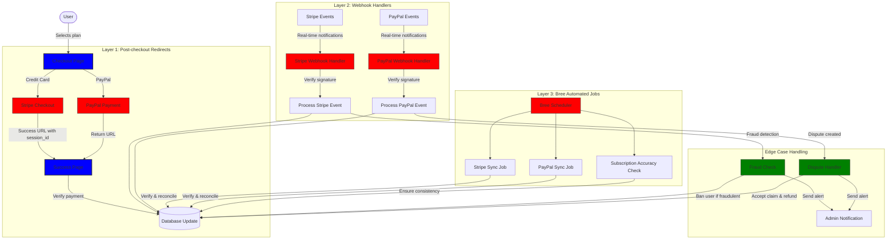
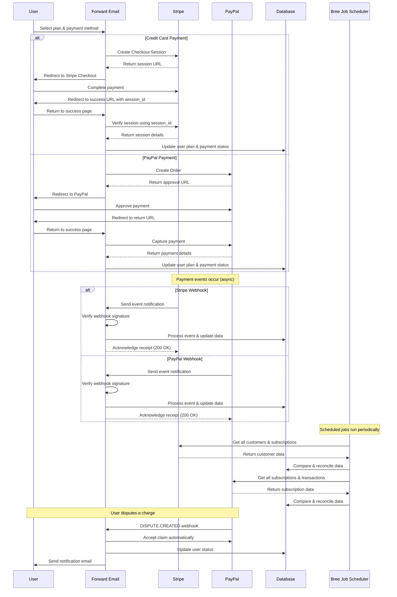
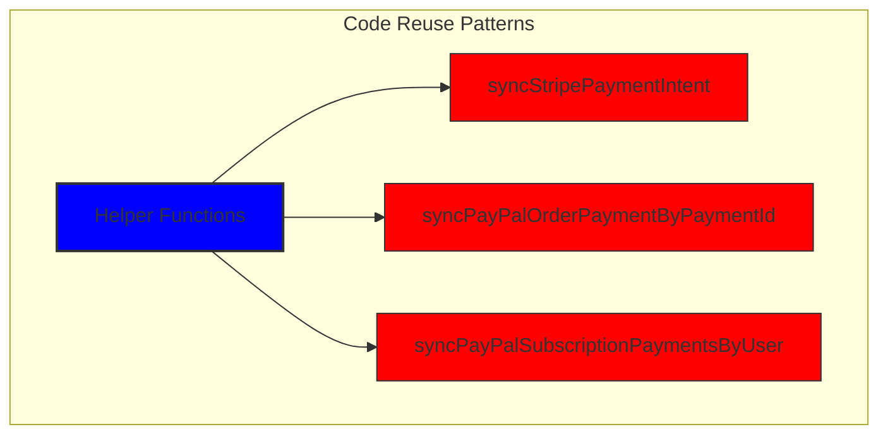
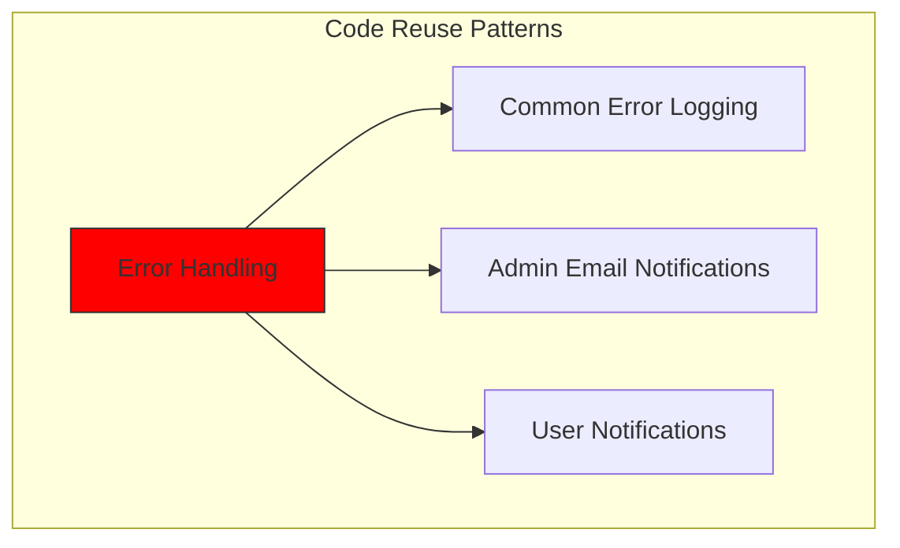
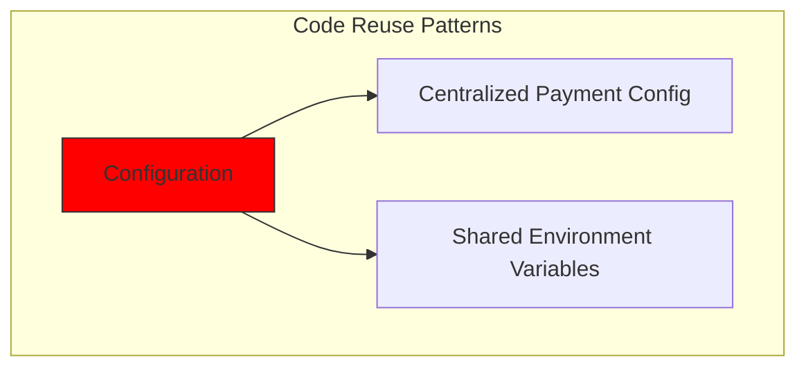
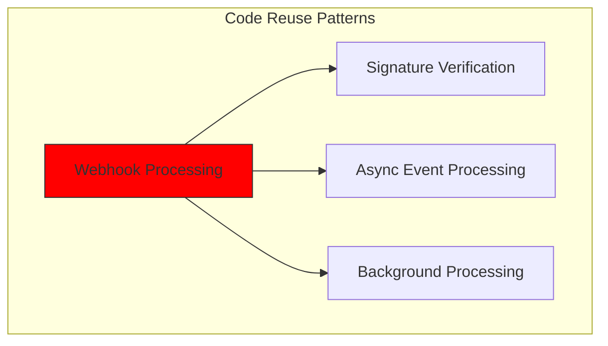
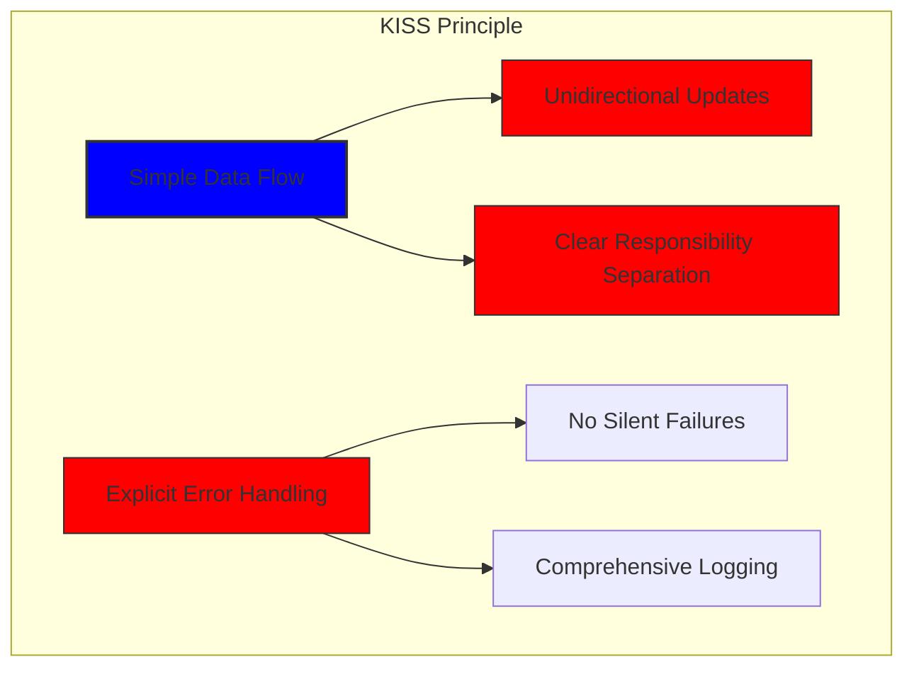
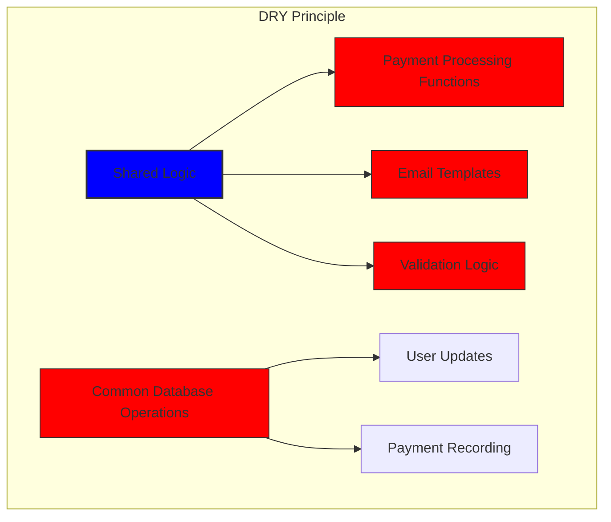

# Come abbiamo creato un sistema di pagamento solido con Stripe e PayPal: un approccio Trifecta {#how-we-built-a-robust-payment-system-with-stripe-and-paypal-a-trifecta-approach}


## Indice {#table-of-contents}

* [Prefazione](#foreword)
* [La sfida: più processori di pagamento, un'unica fonte di verità](#the-challenge-multiple-payment-processors-one-source-of-truth)
* [L'approccio Trifecta: tre livelli di affidabilità](#the-trifecta-approach-three-layers-of-reliability)
* [Livello 1: Reindirizzamenti post-checkout](#layer-1-post-checkout-redirects)
  * [Implementazione del checkout Stripe](#stripe-checkout-implementation)
  * [Flusso di pagamento PayPal](#paypal-payment-flow)
* [Livello 2: gestori webhook con verifica della firma](#layer-2-webhook-handlers-with-signature-verification)
  * [Implementazione del webhook Stripe](#stripe-webhook-implementation)
  * [Implementazione del webhook PayPal](#paypal-webhook-implementation)
* [Livello 3: lavori automatizzati con Bree](#layer-3-automated-jobs-with-bree)
  * [Controllo dell'accuratezza dell'abbonamento](#subscription-accuracy-checker)
  * [Sincronizzazione degli abbonamenti PayPal](#paypal-subscription-synchronization)
* [Gestione dei casi limite](#handling-edge-cases)
  * [Rilevamento e prevenzione delle frodi](#fraud-detection-and-prevention)
  * [Gestione delle controversie](#dispute-handling)
* [Riutilizzo del codice: principi KISS e DRY](#code-reuse-kiss-and-dry-principles)
* [Implementazione dei requisiti di abbonamento VISA](#visa-subscription-requirements-implementation)
  * [Notifiche e-mail automatiche pre-rinnovo](#automated-pre-renewal-email-notifications)
  * [Gestione dei casi limite](#handling-edge-cases-1)
  * [Periodi di prova e termini di abbonamento](#trial-periods-and-subscription-terms)
* [Conclusione: i vantaggi del nostro approccio Trifecta](#conclusion-the-benefits-of-our-trifecta-approach)

## Prefazione {#foreword}

Noi di Forward Email abbiamo sempre dato priorità alla creazione di sistemi affidabili, accurati e intuitivi. Quando si è trattato di implementare il nostro sistema di elaborazione dei pagamenti, sapevamo di aver bisogno di una soluzione in grado di gestire più processori di pagamento mantenendo al contempo una perfetta coerenza dei dati. Questo articolo del blog descrive come il nostro team di sviluppo ha integrato Stripe e PayPal utilizzando un approccio "trifecta" che garantisce un'accuratezza 1:1 in tempo reale sull'intero sistema.

## La sfida: più processori di pagamento, una sola fonte di verità {#the-challenge-multiple-payment-processors-one-source-of-truth}

In quanto servizio di posta elettronica incentrato sulla privacy, desideravamo offrire ai nostri utenti opzioni di pagamento. Alcuni preferiscono la semplicità dei pagamenti con carta di credito tramite Stripe, mentre altri apprezzano l'ulteriore livello di separazione offerto da PayPal. Tuttavia, supportare più processori di pagamento introduce una notevole complessità:

1. Come garantiamo la coerenza dei dati tra i diversi sistemi di pagamento?
2. Come gestiamo casi limite come controversie, rimborsi o pagamenti non andati a buon fine?
3. Come manteniamo un'unica fonte di dati attendibile nel nostro database?

La nostra soluzione è stata quella di implementare quello che chiamiamo l'approccio "trifecta", un sistema a tre livelli che fornisce ridondanza e assicura la coerenza dei dati qualunque cosa accada.

## L'approccio Trifecta: tre livelli di affidabilità {#the-trifecta-approach-three-layers-of-reliability}

Il nostro sistema di pagamento è costituito da tre componenti fondamentali che lavorano insieme per garantire una perfetta sincronizzazione dei dati:

1. **Reindirizzamenti post-checkout** - Acquisizione delle informazioni di pagamento immediatamente dopo il checkout
2. **Gestori di webhook** - Elaborazione di eventi in tempo reale dai processori di pagamento
3. **Lavori automatizzati** - Verifica e riconciliazione periodica dei dati di pagamento

Analizziamo nel dettaglio ogni componente e vediamo come interagiscono.



## Livello 1: Reindirizzamenti post-checkout {#layer-1-post-checkout-redirects}

Il primo livello del nostro approccio "trifecta" avviene subito dopo che un utente completa un pagamento. Sia Stripe che PayPal forniscono meccanismi per reindirizzare gli utenti al nostro sito con le informazioni sulla transazione.

### Implementazione del checkout Stripe {#stripe-checkout-implementation}

Per Stripe, utilizziamo la loro API Checkout Sessions per creare un'esperienza di pagamento fluida. Quando un utente seleziona un piano e sceglie di pagare con carta di credito, creiamo una sessione di checkout con URL specifici per l'esito positivo e l'annullamento:

```javascript
const options = {
  mode: paymentType === 'one-time' ? 'payment' : 'subscription',
  customer: ctx.state.user[config.userFields.stripeCustomerID],
  client_reference_id: reference,
  metadata: {
    plan
  },
  line_items: [
    {
      price,
      quantity: 1,
      description
    }
  ],
  locale: config.STRIPE_LOCALES.has(ctx.locale) ? ctx.locale : 'auto',
  cancel_url: `${config.urls.web}${ctx.path}${
    isMakePayment || isEnableAutoRenew ? '' : `/?plan=${plan}`
  }`,
  success_url: `${config.urls.web}${ctx.path}/?${
    isMakePayment || isEnableAutoRenew ? '' : `plan=${plan}&`
  }session_id={CHECKOUT_SESSION_ID}`,
  allow_promotion_codes: true
};

// Create the checkout session and redirect
const session = await stripe.checkout.sessions.create(options);
const redirectTo = session.url;
if (ctx.accepts('html')) {
  ctx.status = 303;
  ctx.redirect(redirectTo);
} else {
  ctx.body = { redirectTo };
}
```

La parte critica in questo caso è il parametro `success_url`, che include `session_id` come parametro di query. Quando Stripe reindirizza l'utente al nostro sito dopo un pagamento andato a buon fine, possiamo utilizzare questo ID di sessione per verificare la transazione e aggiornare di conseguenza il nostro database.

### Flusso di pagamento PayPal {#paypal-payment-flow}

Per PayPal utilizziamo un approccio simile con la loro API Ordini:

```javascript
const requestBody = {
  intent: 'CAPTURE',
  application_context: {
    cancel_url: `${config.urls.web}${ctx.path}${
      isMakePayment || isEnableAutoRenew ? '' : `/?plan=${plan}`
    }`,
    return_url: `${config.urls.web}${ctx.path}/?plan=${plan}`,
    brand_name: 'Forward Email',
    shipping_preference: 'NO_SHIPPING',
    user_action: 'PAY_NOW'
  },
  payer: {
    email_address: ctx.state.user.email
  },
  purchase_units: [
    {
      reference_id: ctx.state.user.id,
      description,
      custom_id: sku,
      invoice_id: reference,
      soft_descriptor: sku,
      amount: {
        currency_code: 'USD',
        value: price,
        breakdown: {
          item_total: {
            currency_code: 'USD',
            value: price
          }
        }
      },
      items: [
        {
          name,
          description,
          sku,
          unit_amount: {
            currency_code: 'USD',
            value: price
          },
          quantity: '1',
          category: 'DIGITAL_GOODS'
        }
      ]
    }
  ]
};
```

Analogamente a Stripe, specifichiamo i parametri `return_url` e `cancel_url` per gestire i reindirizzamenti post-pagamento. Quando PayPal reindirizza l'utente al nostro sito, possiamo acquisire i dettagli del pagamento e aggiornare il nostro database.



## Livello 2: gestori webhook con verifica della firma {#layer-2-webhook-handlers-with-signature-verification}

Sebbene i reindirizzamenti post-checkout funzionino bene nella maggior parte degli scenari, non sono infallibili. Gli utenti potrebbero chiudere il browser prima di essere reindirizzati, oppure problemi di rete potrebbero impedire il completamento del reindirizzamento. È qui che entrano in gioco i webhook.

Sia Stripe che PayPal forniscono sistemi webhook che inviano notifiche in tempo reale sugli eventi di pagamento. Abbiamo implementato robusti gestori di webhook che verificano l'autenticità di queste notifiche e le elaborano di conseguenza.

### Implementazione del webhook Stripe {#stripe-webhook-implementation}

Il nostro gestore webhook Stripe verifica la firma degli eventi webhook in arrivo per garantirne la legittimità:

```javascript
async function webhook(ctx) {
  const sig = ctx.request.get('stripe-signature');
  // throw an error if something was wrong
  if (!isSANB(sig))
    throw Boom.badRequest(ctx.translateError('INVALID_STRIPE_SIGNATURE'));
  const event = stripe.webhooks.constructEvent(
    ctx.request.rawBody,
    sig,
    env.STRIPE_ENDPOINT_SECRET
  );
  // throw an error if something was wrong
  if (!event)
    throw Boom.badRequest(ctx.translateError('INVALID_STRIPE_SIGNATURE'));
  ctx.logger.info('stripe webhook', { event });
  // return a response to acknowledge receipt of the event
  ctx.body = { received: true };
  // run in background
  processEvent(ctx, event)
    .then()
    .catch((err) => {
      ctx.logger.fatal(err, { event });
      // email admin errors
      emailHelper({
        template: 'alert',
        message: {
          to: config.email.message.from,
          subject: `Error with Stripe Webhook (Event ID ${event.id})`
        },
        locals: {
          message: `<pre><code>${safeStringify(
            parseErr(err),
            null,
            2
          )}</code></pre>`
        }
      })
        .then()
        .catch((err) => ctx.logger.fatal(err, { event }));
    });
}
```

La funzione `stripe.webhooks.constructEvent` verifica la firma utilizzando il nostro endpoint secret. Se la firma è valida, elaboriamo l'evento in modo asincrono per evitare di bloccare la risposta del webhook.

### Implementazione del webhook PayPal {#paypal-webhook-implementation}

Allo stesso modo, il nostro gestore webhook PayPal verifica l'autenticità delle notifiche in arrivo:

```javascript
async function webhook(ctx) {
  const response = await promisify(
    paypal.notification.webhookEvent.verify,
    paypal.notification.webhookEvent
  )(ctx.request.headers, ctx.request.body, env.PAYPAL_WEBHOOK_ID);
  // throw an error if something was wrong
  if (!_.isObject(response) || response.verification_status !== 'SUCCESS')
    throw Boom.badRequest(ctx.translateError('INVALID_PAYPAL_SIGNATURE'));
  // return a response to acknowledge receipt of the event
  ctx.body = { received: true };
  // run in background
  processEvent(ctx)
    .then()
    .catch((err) => {
      ctx.logger.fatal(err);
      // email admin errors
      emailHelper({
        template: 'alert',
        message: {
          to: config.email.message.from,
          subject: `Error with PayPal Webhook (Event ID ${ctx.request.body.id})`
        },
        locals: {
          message: `<pre><code>${safeStringify(
            parseErr(err),
            null,
            2
          )}</code></pre>`
        }
      })
        .then()
        .catch((err) => ctx.logger.fatal(err));
    });
}
```

Entrambi i gestori di webhook seguono lo stesso schema: verificano la firma, confermano la ricezione ed elaborano l'evento in modo asincrono. Questo garantisce che non si perda mai un evento di pagamento, anche se il reindirizzamento post-checkout non riesce.

## Livello 3: Lavori automatizzati con Bree {#layer-3-automated-jobs-with-bree}

Il livello finale del nostro approccio "trifecta" è un insieme di processi automatizzati che verificano e riconciliano periodicamente i dati di pagamento. Utilizziamo Bree, uno scheduler di processi per Node.js, per eseguire questi processi a intervalli regolari.

### Verifica accuratezza abbonamento {#subscription-accuracy-checker}

Uno dei nostri compiti principali è il controllo dell'accuratezza degli abbonamenti, che garantisce che il nostro database rifletta accuratamente lo stato dell'abbonamento in Stripe:

```javascript
async function mapper(customer) {
  // wait a second to prevent rate limitation error
  await setTimeout(ms('1s'));
  // check for user on our side
  let user = await Users.findOne({
    [config.userFields.stripeCustomerID]: customer.id
  })
    .lean()
    .exec();
  if (!user) return;
  if (user.is_banned) return;

  // if emails did not match
  if (user.email !== customer.email) {
    logger.info(
      `User email ${user.email} did not match customer email ${customer.email} (${customer.id})`
    );
    customer = await stripe.customers.update(customer.id, {
      email: user.email
    });
    logger.info(`Updated user email to match ${user.email}`);
  }

  // check for active subscriptions
  const [activeSubscriptions, trialingSubscriptions] = await Promise.all([
    stripe.subscriptions.list({
      customer: customer.id,
      status: 'active'
    }),
    stripe.subscriptions.list({
      customer: customer.id,
      status: 'trialing'
    })
  ]);

  // Combine active and trialing subscriptions
  let subscriptions = [
    ...activeSubscriptions.data,
    ...trialingSubscriptions.data
  ];

  // Handle edge case: multiple subscriptions for one user
  if (subscriptions.length > 1) {
    await logger.error(
      new Error(
        `We may need to refund: User had multiple subscriptions ${user.email} (${customer.id})`
      )
    );
    await emailHelper({
      template: 'alert',
      message: {
        to: config.email.message.from,
        subject: `User had multiple subscriptions ${user.email}`
      },
      locals: {
        message: `User ${user.email} (${customer.id}) had multiple subscriptions: ${JSON.stringify(
          subscriptions.map((s) => s.id)
        )}`
      }
    });
  }
}
```

Questo processo verifica eventuali discrepanze tra il nostro database e Stripe, come indirizzi email non corrispondenti o più abbonamenti attivi. Se rileva problemi, li registra e invia avvisi al nostro team di amministrazione.

### Sincronizzazione abbonamento PayPal {#paypal-subscription-synchronization}

Abbiamo un lavoro simile per gli abbonamenti PayPal:

```javascript
async function syncPayPalSubscriptionPayments() {
  const paypalCustomers = await Users.find({
    $or: [
      {
        [config.userFields.paypalSubscriptionID]: { $exists: true, $ne: null }
      },
      {
        [config.userFields.paypalPayerID]: { $exists: true, $ne: null }
      }
    ]
  })
    // sort by newest customers first
    .sort('-created_at')
    .lean()
    .exec();

  await logger.info(
    `Syncing payments for ${paypalCustomers.length} paypal customers`
  );

  // Process each customer and sync their payments
  const errorEmails = await pReduce(
    paypalCustomers,
    // Implementation details...
  );
}
```

Questi processi automatizzati costituiscono la nostra ultima rete di sicurezza, garantendo che il nostro database rifletta sempre il vero stato degli abbonamenti e dei pagamenti sia su Stripe che su PayPal.

## Gestione dei casi limite {#handling-edge-cases}

Un sistema di pagamento affidabile deve gestire con eleganza i casi limite. Vediamo come gestire alcuni scenari comuni.

### Rilevamento e prevenzione delle frodi {#fraud-detection-and-prevention}

Abbiamo implementato sofisticati meccanismi di rilevamento delle frodi che identificano e gestiscono automaticamente le attività di pagamento sospette:

```javascript
case 'charge.failed': {
  // Get all failed charges in the last 30 days
  const charges = await stripe.charges.list({
    customer: event.data.object.customer,
    created: {
      gte: dayjs().subtract(1, 'month').unix()
    }
  });

  // Filter for declined charges
  const filtered = charges.data.filter(
    (d) => d.status === 'failed' && d.failure_code === 'card_declined'
  );

  // if not more than 5 then return early
  if (filtered.length < 5) break;

  // Check if user has verified domains
  const count = await Domains.countDocuments({
    members: {
      $elemMatch: {
        user: user._id,
        group: 'admin'
      }
    },
    plan: { $in: ['enhanced_protection', 'team'] },
    has_txt_record: true
  });

  if (!user.is_banned) {
    // If no verified domains, ban the user and refund all charges
    if (count === 0) {
      // Ban the user
      user.is_banned = true;
      await user.save();

      // Refund all successful charges
    }
  }
}
```

Questo codice banna automaticamente gli utenti che hanno più addebiti non andati a buon fine e nessun dominio verificato, il che è un forte indicatore di attività fraudolenta.

### Gestione delle controversie {#dispute-handling}

Quando un utente contesta un addebito, accettiamo automaticamente il reclamo e adottiamo le misure appropriate:

```javascript
case 'CUSTOMER.DISPUTE.CREATED': {
  // accept claim
  const agent = await paypalAgent();
  await agent
    .post(`/v1/customer/disputes/${body.resource.dispute_id}/accept-claim`)
    .send({
      note: 'Full refund to the customer.'
    });

  // Find the payment in our database
  const payment = await Payments.findOne({ $or });
  if (!payment) throw new Error('Payment does not exist');

  const user = await Users.findById(payment.user);
  if (!user) throw new Error('User did not exist for customer');

  // Cancel the user's subscription if they have one
  if (isSANB(user[config.userFields.paypalSubscriptionID])) {
    try {
      const agent = await paypalAgent();
      await agent.post(
        `/v1/billing/subscriptions/${
          user[config.userFields.paypalSubscriptionID]
        }/cancel`
      );
    } catch (err) {
      // Handle subscription cancellation errors
    }
  }
}
```

Questo approccio riduce al minimo l'impatto delle controversie sulla nostra attività, garantendo al contempo una buona esperienza al cliente.

## Riutilizzo del codice: principi KISS e DRY {#code-reuse-kiss-and-dry-principles}

In tutto il nostro sistema di pagamento, aderiamo ai principi KISS (Keep It Simple, Stupid) e DRY (Don't Repeat Yourself). Ecco alcuni esempi:

1. **Funzioni di supporto condivise**: abbiamo creato funzioni di supporto riutilizzabili per attività comuni come la sincronizzazione dei pagamenti e l'invio di e-mail.

2. **Gestione coerente degli errori**: i gestori webhook di Stripe e PayPal utilizzano lo stesso schema per la gestione degli errori e le notifiche amministrative.

3. **Schema del database unificato**: il nostro schema del database è progettato per ospitare sia i dati Stripe che PayPal, con campi comuni per lo stato del pagamento, l'importo e le informazioni sul piano.

4. **Configurazione centralizzata**: la configurazione relativa ai pagamenti è centralizzata in un unico file, semplificando l'aggiornamento dei prezzi e delle informazioni sui prodotti.













## Implementazione dei requisiti di abbonamento VISA {#visa-subscription-requirements-implementation}

Oltre al nostro approccio "trifecta", abbiamo implementato funzionalità specifiche per soddisfare i requisiti di abbonamento di VISA, migliorando al contempo l'esperienza utente. Un requisito fondamentale di VISA è che gli utenti vengano avvisati prima dell'addebito di un abbonamento, soprattutto quando si passa da un abbonamento di prova a uno a pagamento.

### Notifiche automatiche via email prima del rinnovo {#automated-pre-renewal-email-notifications}

Abbiamo sviluppato un sistema automatizzato che identifica gli utenti con abbonamenti di prova attivi e invia loro un'email di notifica prima del primo addebito. Questo non solo ci consente di rispettare i requisiti VISA, ma riduce anche gli addebiti non rimborsabili e migliora la soddisfazione del cliente.

Ecco come abbiamo implementato questa funzionalità:

```javascript
// Find users with trial subscriptions who haven't received a notification yet
const users = await Users.find({
  $or: [
    {
      $and: [
        { [config.userFields.stripeSubscriptionID]: { $exists: true } },
        { [config.userFields.stripeTrialSentAt]: { $exists: false } },
        // Exclude subscriptions that have already had payments
        ...(paidStripeSubscriptionIds.length > 0
          ? [
              {
                [config.userFields.stripeSubscriptionID]: {
                  $nin: paidStripeSubscriptionIds
                }
              }
            ]
          : [])
      ]
    },
    {
      $and: [
        { [config.userFields.paypalSubscriptionID]: { $exists: true } },
        { [config.userFields.paypalTrialSentAt]: { $exists: false } },
        // Exclude subscriptions that have already had payments
        ...(paidPayPalSubscriptionIds.length > 0
          ? [
              {
                [config.userFields.paypalSubscriptionID]: {
                  $nin: paidPayPalSubscriptionIds
                }
              }
            ]
          : [])
      ]
    }
  ]
});

// Process each user and send notification
for (const user of users) {
  // Get subscription details from payment processor
  const subscription = await getSubscriptionDetails(user);

  // Calculate subscription duration and frequency
  const duration = getDurationFromPlanId(subscription.plan_id);
  const frequency = getHumanReadableFrequency(duration, user.locale);
  const amount = getPlanAmount(user.plan, duration);

  // Get user's domains for personalized email
  const domains = await Domains.find({
    'members.user': user._id
  }).sort('name').lean().exec();

  // Send VISA-compliant notification email
  await emailHelper({
    template: 'visa-trial-subscription-requirement',
    message: {
      to: user.receipt_email || user.email,
      ...(user.receipt_email ? { cc: user.email } : {})
    },
    locals: {
      user,
      firstChargeDate: new Date(subscription.start_time),
      frequency,
      formattedAmount: numeral(amount).format('$0,0,0.00'),
      domains
    }
  });

  // Record that notification was sent
  await Users.findByIdAndUpdate(user._id, {
    $set: {
      [config.userFields.paypalTrialSentAt]: new Date()
    }
  });
}
```

Questa implementazione garantisce che gli utenti siano sempre informati sui prossimi addebiti, con dettagli chiari su:

1. Quando verrà effettuato il primo addebito
2. La frequenza degli addebiti futuri (mensile, annuale, ecc.)
3. L'importo esatto che verrà addebitato
4. Quali domini sono coperti dall'abbonamento

Automatizzando questo processo, manteniamo la perfetta conformità ai requisiti VISA (che impongono la notifica almeno 7 giorni prima dell'addebito), riducendo al contempo le richieste di supporto e migliorando l'esperienza complessiva dell'utente.

### Gestione dei casi limite {#handling-edge-cases-1}

La nostra implementazione include anche una solida gestione degli errori. In caso di problemi durante il processo di notifica, il nostro sistema avvisa automaticamente il nostro team:

```javascript
try {
  await mapper(user);
} catch (err) {
  logger.error(err);

  // Send alert to administrators
  await emailHelper({
    template: 'alert',
    message: {
      to: config.email.message.from,
      subject: 'VISA Trial Subscription Requirement Error'
    },
    locals: {
      message: `<pre><code>${safeStringify(
        parseErr(err),
        null,
        2
      )}</code></pre>`
    }
  });
}
```

Ciò garantisce che, anche se si verifica un problema con il sistema di notifica, il nostro team possa risolverlo rapidamente e mantenere la conformità ai requisiti VISA.

Il sistema di notifica degli abbonamenti VISA è un altro esempio di come abbiamo costruito la nostra infrastruttura di pagamento tenendo a mente sia la conformità che l'esperienza dell'utente, integrando il nostro approccio "trifecta" per garantire un'elaborazione dei pagamenti affidabile e trasparente.

### Periodi di prova e termini di abbonamento {#trial-periods-and-subscription-terms}

Per gli utenti che abilitano il rinnovo automatico sui piani esistenti, calcoliamo il periodo di prova appropriato per garantire che non venga addebitato alcun importo fino alla scadenza del piano attuale:

```javascript
if (
  isEnableAutoRenew &&
  dayjs(ctx.state.user[config.userFields.planExpiresAt]).isAfter(
    dayjs()
  )
) {
  const hours = dayjs(
    ctx.state.user[config.userFields.planExpiresAt]
  ).diff(dayjs(), 'hours');

  // Handle trial period calculation
}
```

Forniamo inoltre informazioni chiare sui termini dell'abbonamento, tra cui la frequenza di fatturazione e le politiche di cancellazione, e includiamo metadati dettagliati con ogni abbonamento per garantire un monitoraggio e una gestione adeguati.

## Conclusione: i vantaggi del nostro approccio Trifecta {#conclusion-the-benefits-of-our-trifecta-approach}

Il nostro approccio "trifecta" all'elaborazione dei pagamenti ha offerto diversi vantaggi chiave:

1. **Affidabilità**: implementando tre livelli di verifica dei pagamenti, garantiamo che nessun pagamento venga perso o elaborato in modo errato.

2. **Precisione**: Il nostro database riflette sempre il vero stato degli abbonamenti e dei pagamenti sia su Stripe che su PayPal.

3. **Flessibilità**: gli utenti possono scegliere il metodo di pagamento preferito senza compromettere l'affidabilità del nostro sistema.

4. **Robustezza**: il nostro sistema gestisce con eleganza i casi limite, dai guasti della rete alle attività fraudolente.

Se state implementando un sistema di pagamento che supporta più processori, vi consigliamo vivamente questo approccio "trifecta". Richiede un maggiore impegno di sviluppo iniziale, ma i vantaggi a lungo termine in termini di affidabilità e precisione ne valgono decisamente la pena.

Per maggiori informazioni su Forward Email e sui nostri servizi di posta elettronica incentrati sulla privacy, visita [sito web](https://forwardemail.net).

<!-- *Parole chiave: elaborazione dei pagamenti, integrazione Stripe, integrazione PayPal, gestione webhook, sincronizzazione dei pagamenti, gestione degli abbonamenti, prevenzione delle frodi, gestione delle controversie, sistema di pagamento Node.js, sistema di pagamento multiprocessore, integrazione del gateway di pagamento, verifica dei pagamenti in tempo reale, coerenza dei dati di pagamento, fatturazione degli abbonamenti, sicurezza dei pagamenti, automazione dei pagamenti, webhook di pagamento, riconciliazione dei pagamenti, casi limite di pagamento, gestione degli errori di pagamento, requisiti di abbonamento VISA, notifiche pre-rinnovo, conformità degli abbonamenti* -->