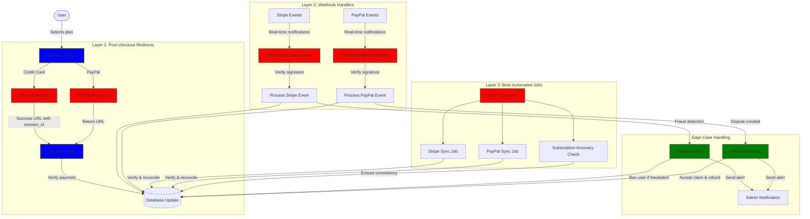
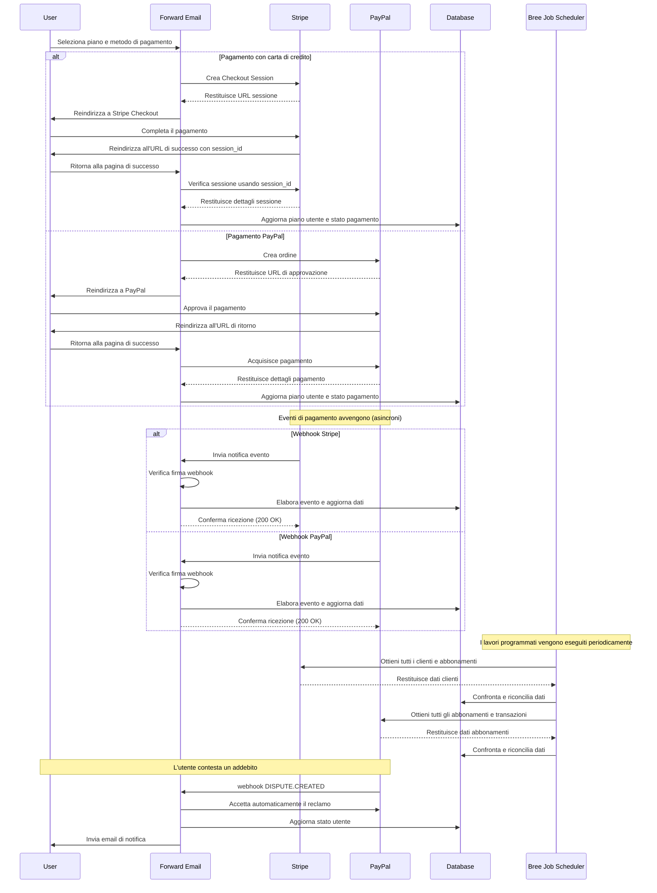
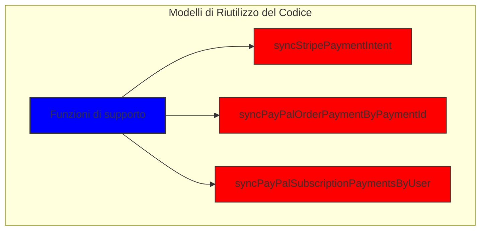
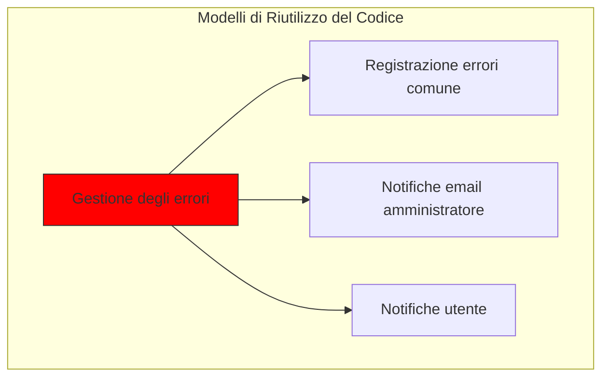
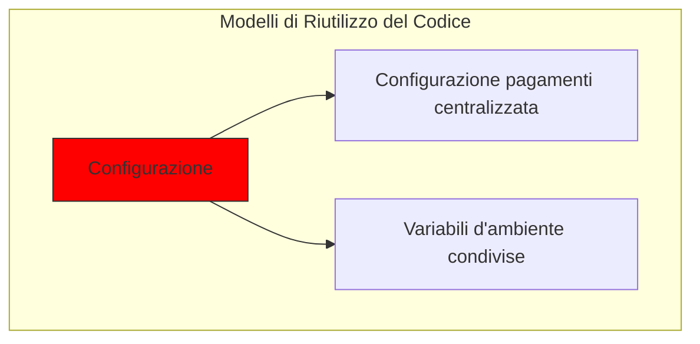
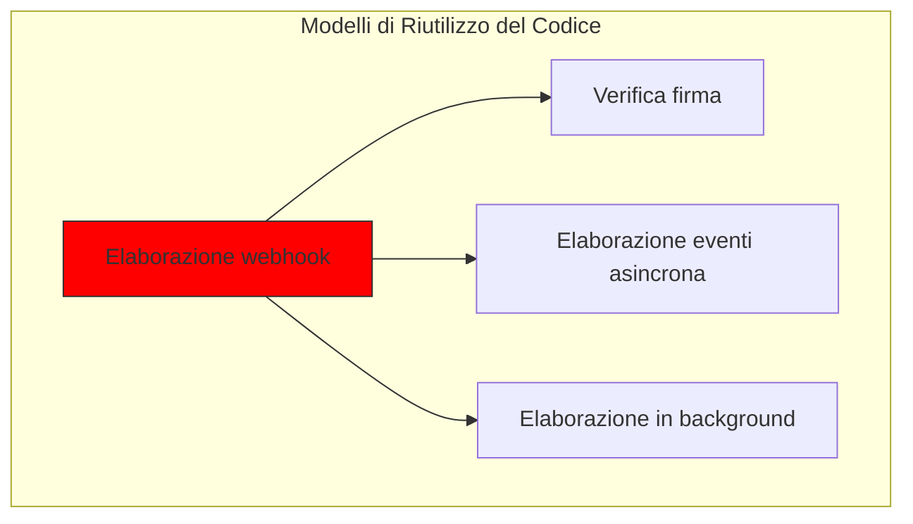
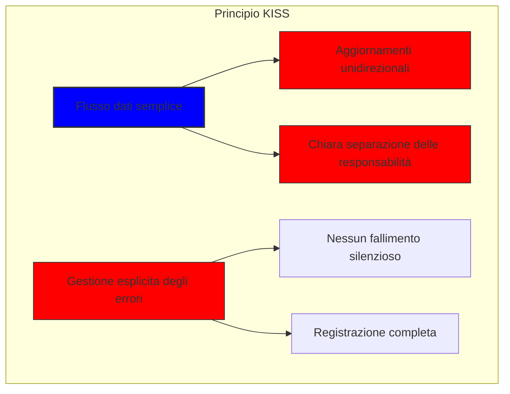

# Come Abbiamo Costruito un Sistema di Pagamento Robusto con Stripe e PayPal: Un Approccio a Trifecta {#how-we-built-a-robust-payment-system-with-stripe-and-paypal-a-trifecta-approach}


## Indice {#table-of-contents}

* [Prefazione](#foreword)
* [La Sfida: Molteplici Processori di Pagamento, Una Sola Fonte di Verità](#the-challenge-multiple-payment-processors-one-source-of-truth)
* [L'Approccio a Trifecta: Tre Livelli di Affidabilità](#the-trifecta-approach-three-layers-of-reliability)
* [Livello 1: Reindirizzamenti Post-Checkout](#layer-1-post-checkout-redirects)
  * [Implementazione di Stripe Checkout](#stripe-checkout-implementation)
  * [Flusso di Pagamento PayPal](#paypal-payment-flow)
* [Livello 2: Gestori Webhook con Verifica della Firma](#layer-2-webhook-handlers-with-signature-verification)
  * [Implementazione Webhook Stripe](#stripe-webhook-implementation)
  * [Implementazione Webhook PayPal](#paypal-webhook-implementation)
* [Livello 3: Job Automatizzati con Bree](#layer-3-automated-jobs-with-bree)
  * [Controllo di Accuratezza delle Sottoscrizioni](#subscription-accuracy-checker)
  * [Sincronizzazione delle Sottoscrizioni PayPal](#paypal-subscription-synchronization)
* [Gestione dei Casi Limite](#handling-edge-cases)
  * [Rilevamento e Prevenzione Frodi](#fraud-detection-and-prevention)
  * [Gestione delle Controversie](#dispute-handling)
* [Riutilizzo del Codice: Principi KISS e DRY](#code-reuse-kiss-and-dry-principles)
* [Implementazione dei Requisiti di Sottoscrizione VISA](#visa-subscription-requirements-implementation)
  * [Notifiche Email Automatiche Pre-Rinnovo](#automated-pre-renewal-email-notifications)
  * [Gestione dei Casi Limite](#handling-edge-cases-1)
  * [Periodi di Prova e Termini di Sottoscrizione](#trial-periods-and-subscription-terms)
* [Conclusione: I Benefici del Nostro Approccio a Trifecta](#conclusion-the-benefits-of-our-trifecta-approach)


## Prefazione {#foreword}

Da Forward Email, abbiamo sempre dato priorità alla creazione di sistemi affidabili, precisi e facili da usare. Quando si è trattato di implementare il nostro sistema di elaborazione pagamenti, sapevamo di aver bisogno di una soluzione in grado di gestire più processori di pagamento mantenendo una perfetta coerenza dei dati. Questo post del blog descrive come il nostro team di sviluppo ha integrato sia Stripe che PayPal utilizzando un approccio a trifecta che garantisce un'accuratezza 1:1 in tempo reale in tutto il nostro sistema.


## La Sfida: Molteplici Processori di Pagamento, Una Sola Fonte di Verità {#the-challenge-multiple-payment-processors-one-source-of-truth}

Come servizio email focalizzato sulla privacy, volevamo offrire ai nostri utenti opzioni di pagamento. Alcuni preferiscono la semplicità dei pagamenti con carta di credito tramite Stripe, mentre altri apprezzano il livello aggiuntivo di separazione fornito da PayPal. Tuttavia, supportare più processori di pagamento introduce una complessità significativa:

1. Come garantiamo dati coerenti tra i diversi sistemi di pagamento?
2. Come gestiamo casi limite come controversie, rimborsi o pagamenti falliti?
3. Come manteniamo una sola fonte di verità nel nostro database?

La nostra soluzione è stata implementare ciò che chiamiamo "approccio a trifecta" - un sistema a tre livelli che fornisce ridondanza e garantisce la coerenza dei dati qualunque cosa accada.


## L'Approccio a Trifecta: Tre Livelli di Affidabilità {#the-trifecta-approach-three-layers-of-reliability}

Il nostro sistema di pagamento è composto da tre componenti critici che lavorano insieme per garantire una perfetta sincronizzazione dei dati:

1. **Reindirizzamenti post-checkout** - Catturare le informazioni di pagamento immediatamente dopo il checkout
2. **Gestori webhook** - Elaborare eventi in tempo reale dai processori di pagamento
3. **Job automatizzati** - Verificare e riconciliare periodicamente i dati di pagamento

Esploriamo ciascun componente e vediamo come lavorano insieme.


```mermaid
flowchart TD
    User([User]) --> |Selects plan| Checkout[Checkout Page]

    %% Layer 1: Post-checkout redirects
    subgraph "Layer 1: Post-checkout Redirects"
        Checkout --> |Credit Card| Stripe[Stripe Checkout]
        Checkout --> |PayPal| PayPal[PayPal Payment]

        Stripe --> |Success URL with session_id| SuccessPage[Success Page]
        PayPal --> |Return URL| SuccessPage

        SuccessPage --> |Verify payment| Database[(Database Update)]
    end

    %% Layer 2: Webhooks
    subgraph "Layer 2: Webhook Handlers"
        StripeEvents[Stripe Events] --> |Real-time notifications| StripeWebhook[Stripe Webhook Handler]
        PayPalEvents[PayPal Events] --> |Real-time notifications| PayPalWebhook[PayPal Webhook Handler]

        StripeWebhook --> |Verify signature| ProcessStripeEvent[Process Stripe Event]
        PayPalWebhook --> |Verify signature| ProcessPayPalEvent[Process PayPal Event]

        ProcessStripeEvent --> Database
        ProcessPayPalEvent --> Database
    end

    %% Layer 3: Automated jobs
    subgraph "Layer 3: Bree Automated Jobs"
        BreeScheduler[Bree Scheduler] --> StripeSync[Stripe Sync Job]
        BreeScheduler --> PayPalSync[PayPal Sync Job]
        BreeScheduler --> AccuracyCheck[Subscription Accuracy Check]

        StripeSync --> |Verify & reconcile| Database
        PayPalSync --> |Verify & reconcile| Database
        AccuracyCheck --> |Ensure consistency| Database
    end

    %% Edge cases
    subgraph "Edge Case Handling"
        ProcessStripeEvent --> |Fraud detection| FraudCheck[Fraud Check]
        ProcessPayPalEvent --> |Dispute created| DisputeHandler[Dispute Handler]

        FraudCheck --> |Ban user if fraudulent| Database
        DisputeHandler --> |Accept claim & refund| Database

        FraudCheck --> |Send alert| AdminNotification[Admin Notification]
        DisputeHandler --> |Send alert| AdminNotification
    end

    %% Style definitions
    classDef primary fill:blue,stroke:#333,stroke-width:2px;
    classDef secondary fill:red,stroke:#333,stroke-width:1px;
    classDef tertiary fill:green,stroke:#333,stroke-width:1px;

    class Checkout,SuccessPage primary;
    class Stripe,PayPal,StripeWebhook,PayPalWebhook,BreeScheduler secondary;
    class FraudCheck,DisputeHandler tertiary;
```
## Layer 1: Reindirizzamenti post-checkout {#layer-1-post-checkout-redirects}

Il primo livello del nostro approccio trifasico avviene immediatamente dopo che un utente completa un pagamento. Sia Stripe che PayPal forniscono meccanismi per reindirizzare gli utenti al nostro sito con le informazioni sulla transazione.

### Implementazione Stripe Checkout {#stripe-checkout-implementation}

Per Stripe, utilizziamo la loro API Checkout Sessions per creare un'esperienza di pagamento fluida. Quando un utente seleziona un piano e sceglie di pagare con carta di credito, creiamo una Checkout Session con URL specifici di successo e annullamento:

```javascript
const options = {
  mode: paymentType === 'one-time' ? 'payment' : 'subscription',
  customer: ctx.state.user[config.userFields.stripeCustomerID],
  client_reference_id: reference,
  metadata: {
    plan
  },
  line_items: [
    {
      price,
      quantity: 1,
      description
    }
  ],
  locale: config.STRIPE_LOCALES.has(ctx.locale) ? ctx.locale : 'auto',
  cancel_url: `${config.urls.web}${ctx.path}${
    isMakePayment || isEnableAutoRenew ? '' : `/?plan=${plan}`
  }`,
  success_url: `${config.urls.web}${ctx.path}/?${
    isMakePayment || isEnableAutoRenew ? '' : `plan=${plan}&`
  }session_id={CHECKOUT_SESSION_ID}`,
  allow_promotion_codes: true
};

// Create the checkout session and redirect
const session = await stripe.checkout.sessions.create(options);
const redirectTo = session.url;
if (ctx.accepts('html')) {
  ctx.status = 303;
  ctx.redirect(redirectTo);
} else {
  ctx.body = { redirectTo };
}
```

La parte critica qui è il parametro `success_url`, che include il `session_id` come parametro di query. Quando Stripe reindirizza l'utente al nostro sito dopo un pagamento riuscito, possiamo usare questo ID di sessione per verificare la transazione e aggiornare di conseguenza il nostro database.

### Flusso di pagamento PayPal {#paypal-payment-flow}

Per PayPal, utilizziamo un approccio simile con la loro API Orders:

```javascript
const requestBody = {
  intent: 'CAPTURE',
  application_context: {
    cancel_url: `${config.urls.web}${ctx.path}${
      isMakePayment || isEnableAutoRenew ? '' : `/?plan=${plan}`
    }`,
    return_url: `${config.urls.web}${ctx.path}/?plan=${plan}`,
    brand_name: 'Forward Email',
    shipping_preference: 'NO_SHIPPING',
    user_action: 'PAY_NOW'
  },
  payer: {
    email_address: ctx.state.user.email
  },
  purchase_units: [
    {
      reference_id: ctx.state.user.id,
      description,
      custom_id: sku,
      invoice_id: reference,
      soft_descriptor: sku,
      amount: {
        currency_code: 'USD',
        value: price,
        breakdown: {
          item_total: {
            currency_code: 'USD',
            value: price
          }
        }
      },
      items: [
        {
          name,
          description,
          sku,
          unit_amount: {
            currency_code: 'USD',
            value: price
          },
          quantity: '1',
          category: 'DIGITAL_GOODS'
        }
      ]
    }
  ]
};
```

Simile a Stripe, specifichiamo i parametri `return_url` e `cancel_url` per gestire i reindirizzamenti post-pagamento. Quando PayPal reindirizza l'utente al nostro sito, possiamo acquisire i dettagli del pagamento e aggiornare il nostro database.


```mermaid
sequenceDiagram
    participant User
    participant FE as Forward Email
    participant Stripe
    participant PayPal
    participant DB as Database
    participant Bree as Bree Job Scheduler

    %% Initial checkout flow
    User->>FE: Seleziona piano e metodo di pagamento

    alt Pagamento con carta di credito
        FE->>Stripe: Crea Checkout Session
        Stripe-->>FE: Restituisce URL sessione
        FE->>User: Reindirizza a Stripe Checkout
        User->>Stripe: Completa il pagamento
        Stripe->>User: Reindirizza all'URL di successo con session_id
        User->>FE: Ritorna alla pagina di successo
        FE->>Stripe: Verifica sessione usando session_id
        Stripe-->>FE: Restituisce dettagli sessione
        FE->>DB: Aggiorna piano utente e stato pagamento
    else Pagamento PayPal
        FE->>PayPal: Crea ordine
        PayPal-->>FE: Restituisce URL di approvazione
        FE->>User: Reindirizza a PayPal
        User->>PayPal: Approva il pagamento
        PayPal->>User: Reindirizza all'URL di ritorno
        User->>FE: Ritorna alla pagina di successo
        FE->>PayPal: Acquisisce pagamento
        PayPal-->>FE: Restituisce dettagli pagamento
        FE->>DB: Aggiorna piano utente e stato pagamento
    end

    %% Webhook flow (asincrono)
    Note over Stripe,PayPal: Eventi di pagamento avvengono (asincroni)

    alt Webhook Stripe
        Stripe->>FE: Invia notifica evento
        FE->>FE: Verifica firma webhook
        FE->>DB: Elabora evento e aggiorna dati
        FE-->>Stripe: Conferma ricezione (200 OK)
    else Webhook PayPal
        PayPal->>FE: Invia notifica evento
        FE->>FE: Verifica firma webhook
        FE->>DB: Elabora evento e aggiorna dati
        FE-->>PayPal: Conferma ricezione (200 OK)
    end

    %% Lavori automatizzati Bree
    Note over Bree: I lavori programmati vengono eseguiti periodicamente

    Bree->>Stripe: Ottieni tutti i clienti e abbonamenti
    Stripe-->>Bree: Restituisce dati clienti
    Bree->>DB: Confronta e riconcilia dati

    Bree->>PayPal: Ottieni tutti gli abbonamenti e transazioni
    PayPal-->>Bree: Restituisce dati abbonamenti
    Bree->>DB: Confronta e riconcilia dati

    %% Caso limite: Gestione contestazioni
    Note over User,PayPal: L'utente contesta un addebito

    PayPal->>FE: webhook DISPUTE.CREATED
    FE->>PayPal: Accetta automaticamente il reclamo
    FE->>DB: Aggiorna stato utente
    FE->>User: Invia email di notifica
```
## Layer 2: Gestori Webhook con Verifica della Firma {#layer-2-webhook-handlers-with-signature-verification}

Sebbene i reindirizzamenti post-checkout funzionino bene nella maggior parte degli scenari, non sono infallibili. Gli utenti potrebbero chiudere il browser prima del reindirizzamento, oppure problemi di rete potrebbero impedire il completamento del reindirizzamento. È qui che entrano in gioco i webhook.

Sia Stripe che PayPal forniscono sistemi di webhook che inviano notifiche in tempo reale sugli eventi di pagamento. Abbiamo implementato gestori webhook robusti che verificano l'autenticità di queste notifiche e le elaborano di conseguenza.

### Implementazione Webhook Stripe {#stripe-webhook-implementation}

Il nostro gestore webhook di Stripe verifica la firma degli eventi webhook in arrivo per assicurarsi che siano legittimi:

```javascript
async function webhook(ctx) {
  const sig = ctx.request.get('stripe-signature');
  // throw an error if something was wrong
  if (!isSANB(sig))
    throw Boom.badRequest(ctx.translateError('INVALID_STRIPE_SIGNATURE'));
  const event = stripe.webhooks.constructEvent(
    ctx.request.rawBody,
    sig,
    env.STRIPE_ENDPOINT_SECRET
  );
  // throw an error if something was wrong
  if (!event)
    throw Boom.badRequest(ctx.translateError('INVALID_STRIPE_SIGNATURE'));
  ctx.logger.info('stripe webhook', { event });
  // return a response to acknowledge receipt of the event
  ctx.body = { received: true };
  // run in background
  processEvent(ctx, event)
    .then()
    .catch((err) => {
      ctx.logger.fatal(err, { event });
      // email admin errors
      emailHelper({
        template: 'alert',
        message: {
          to: config.email.message.from,
          subject: `Errore con Webhook Stripe (ID Evento ${event.id})`
        },
        locals: {
          message: `<pre><code>${safeStringify(
            parseErr(err),
            null,
            2
          )}</code></pre>`
        }
      })
        .then()
        .catch((err) => ctx.logger.fatal(err, { event }));
    });
}
```

La funzione `stripe.webhooks.constructEvent` verifica la firma utilizzando il nostro segreto dell'endpoint. Se la firma è valida, elaboriamo l'evento in modo asincrono per evitare di bloccare la risposta del webhook.

### Implementazione Webhook PayPal {#paypal-webhook-implementation}

Analogamente, il nostro gestore webhook di PayPal verifica l'autenticità delle notifiche in arrivo:

```javascript
async function webhook(ctx) {
  const response = await promisify(
    paypal.notification.webhookEvent.verify,
    paypal.notification.webhookEvent
  )(ctx.request.headers, ctx.request.body, env.PAYPAL_WEBHOOK_ID);
  // throw an error if something was wrong
  if (!_.isObject(response) || response.verification_status !== 'SUCCESS')
    throw Boom.badRequest(ctx.translateError('INVALID_PAYPAL_SIGNATURE'));
  // return a response to acknowledge receipt of the event
  ctx.body = { received: true };
  // run in background
  processEvent(ctx)
    .then()
    .catch((err) => {
      ctx.logger.fatal(err);
      // email admin errors
      emailHelper({
        template: 'alert',
        message: {
          to: config.email.message.from,
          subject: `Errore con Webhook PayPal (ID Evento ${ctx.request.body.id})`
        },
        locals: {
          message: `<pre><code>${safeStringify(
            parseErr(err),
            null,
            2
          )}</code></pre>`
        }
      })
        .then()
        .catch((err) => ctx.logger.fatal(err));
    });
}
```

Entrambi i gestori webhook seguono lo stesso schema: verificano la firma, riconoscono la ricezione e processano l'evento in modo asincrono. Questo garantisce che non perdiamo mai un evento di pagamento, anche se il reindirizzamento post-checkout fallisce.


## Layer 3: Lavori Automatizzati con Bree {#layer-3-automated-jobs-with-bree}

L'ultimo livello del nostro approccio trifasico è un insieme di lavori automatizzati che verificano e riconciliano periodicamente i dati di pagamento. Utilizziamo Bree, un job scheduler per Node.js, per eseguire questi lavori a intervalli regolari.

### Controllo di Accuratezza delle Sottoscrizioni {#subscription-accuracy-checker}

Uno dei nostri lavori chiave è il controllo di accuratezza delle sottoscrizioni, che assicura che il nostro database rifletta accuratamente lo stato delle sottoscrizioni in Stripe:
```javascript
async function mapper(customer) {
  // wait a second to prevent rate limitation error
  await setTimeout(ms('1s'));
  // check for user on our side
  let user = await Users.findOne({
    [config.userFields.stripeCustomerID]: customer.id
  })
    .lean()
    .exec();
  if (!user) return;
  if (user.is_banned) return;

  // if emails did not match
  if (user.email !== customer.email) {
    logger.info(
      `User email ${user.email} did not match customer email ${customer.email} (${customer.id})`
    );
    customer = await stripe.customers.update(customer.id, {
      email: user.email
    });
    logger.info(`Updated user email to match ${user.email}`);
  }

  // check for active subscriptions
  const [activeSubscriptions, trialingSubscriptions] = await Promise.all([
    stripe.subscriptions.list({
      customer: customer.id,
      status: 'active'
    }),
    stripe.subscriptions.list({
      customer: customer.id,
      status: 'trialing'
    })
  ]);

  // Combine active and trialing subscriptions
  let subscriptions = [
    ...activeSubscriptions.data,
    ...trialingSubscriptions.data
  ];

  // Handle edge case: multiple subscriptions for one user
  if (subscriptions.length > 1) {
    await logger.error(
      new Error(
        `We may need to refund: User had multiple subscriptions ${user.email} (${customer.id})`
      )
    );
    await emailHelper({
      template: 'alert',
      message: {
        to: config.email.message.from,
        subject: `User had multiple subscriptions ${user.email}`
      },
      locals: {
        message: `User ${user.email} (${customer.id}) had multiple subscriptions: ${JSON.stringify(
          subscriptions.map((s) => s.id)
        )}`
      }
    });
  }
}
```

This job checks for discrepancies between our database and Stripe, such as mismatched email addresses or multiple active subscriptions. If it finds any issues, it logs them and sends alerts to our admin team.

### PayPal Subscription Synchronization {#paypal-subscription-synchronization}

We have a similar job for PayPal subscriptions:

```javascript
async function syncPayPalSubscriptionPayments() {
  const paypalCustomers = await Users.find({
    $or: [
      {
        [config.userFields.paypalSubscriptionID]: { $exists: true, $ne: null }
      },
      {
        [config.userFields.paypalPayerID]: { $exists: true, $ne: null }
      }
    ]
  })
    // sort by newest customers first
    .sort('-created_at')
    .lean()
    .exec();

  await logger.info(
    `Syncing payments for ${paypalCustomers.length} paypal customers`
  );

  // Process each customer and sync their payments
  const errorEmails = await pReduce(
    paypalCustomers,
    // Implementation details...
  );
}
```

These automated jobs serve as our final safety net, ensuring that our database always reflects the true state of subscriptions and payments in both Stripe and PayPal.


## Handling Edge Cases {#handling-edge-cases}

A robust payment system must handle edge cases gracefully. Let's look at how we handle some common scenarios.

### Fraud Detection and Prevention {#fraud-detection-and-prevention}

We've implemented sophisticated fraud detection mechanisms that automatically identify and handle suspicious payment activities:

```javascript
case 'charge.failed': {
  // Get all failed charges in the last 30 days
  const charges = await stripe.charges.list({
    customer: event.data.object.customer,
    created: {
      gte: dayjs().subtract(1, 'month').unix()
    }
  });

  // Filter for declined charges
  const filtered = charges.data.filter(
    (d) => d.status === 'failed' && d.failure_code === 'card_declined'
  );

  // if not more than 5 then return early
  if (filtered.length < 5) break;

  // Check if user has verified domains
  const count = await Domains.countDocuments({
    members: {
      $elemMatch: {
        user: user._id,
        group: 'admin'
      }
    },
    plan: { $in: ['enhanced_protection', 'team'] },
    has_txt_record: true
  });

  if (!user.is_banned) {
    // If no verified domains, ban the user and refund all charges
    if (count === 0) {
      // Ban the user
      user.is_banned = true;
      await user.save();

      // Refund all successful charges
    }
  }
}
```

Questo codice banna automaticamente gli utenti che hanno molteplici addebiti falliti e nessun dominio verificato, il che è un forte indicatore di attività fraudolenta.

### Gestione delle contestazioni {#dispute-handling}

Quando un utente contesta un addebito, accettiamo automaticamente la richiesta e prendiamo le azioni appropriate:

```javascript
case 'CUSTOMER.DISPUTE.CREATED': {
  // accetta la richiesta
  const agent = await paypalAgent();
  await agent
    .post(`/v1/customer/disputes/${body.resource.dispute_id}/accept-claim`)
    .send({
      note: 'Rimborso completo al cliente.'
    });

  // Trova il pagamento nel nostro database
  const payment = await Payments.findOne({ $or });
  if (!payment) throw new Error('Il pagamento non esiste');

  const user = await Users.findById(payment.user);
  if (!user) throw new Error('L\'utente non esisteva per il cliente');

  // Annulla l'abbonamento dell'utente se ne ha uno
  if (isSANB(user[config.userFields.paypalSubscriptionID])) {
    try {
      const agent = await paypalAgent();
      await agent.post(
        `/v1/billing/subscriptions/${
          user[config.userFields.paypalSubscriptionID]
        }/cancel`
      );
    } catch (err) {
      // Gestisci gli errori di cancellazione dell'abbonamento
    }
  }
}
```

Questo approccio minimizza l'impatto delle contestazioni sul nostro business garantendo al contempo una buona esperienza per il cliente.


## Riutilizzo del codice: Principi KISS e DRY {#code-reuse-kiss-and-dry-principles}

Nel nostro sistema di pagamento, abbiamo seguito i principi KISS (Keep It Simple, Stupid) e DRY (Don't Repeat Yourself). Ecco alcuni esempi:

1. **Funzioni di supporto condivise**: Abbiamo creato funzioni di supporto riutilizzabili per attività comuni come la sincronizzazione dei pagamenti e l'invio di email.

2. **Gestione degli errori coerente**: Sia i gestori webhook di Stripe che di PayPal utilizzano lo stesso schema per la gestione degli errori e le notifiche agli amministratori.

3. **Schema di database unificato**: Il nostro schema di database è progettato per gestire sia i dati di Stripe che di PayPal, con campi comuni per stato del pagamento, importo e informazioni sul piano.

4. **Configurazione centralizzata**: La configurazione relativa ai pagamenti è centralizzata in un unico file, rendendo facile aggiornare prezzi e informazioni sui prodotti.


```mermaid
graph TD
    subgraph "Modelli di Riutilizzo del Codice"
        A[Funzioni di supporto] --> B[syncStripePaymentIntent]
        A --> C[syncPayPalOrderPaymentByPaymentId]
        A --> D[syncPayPalSubscriptionPaymentsByUser]
    end

    classDef primary fill:blue,stroke:#333,stroke-width:2px;
    classDef secondary fill:red,stroke:#333,stroke-width:1px;

    class A,P,V primary;
    class B,C,D,E,I,L,Q,R,S,W,X,Y,Z secondary;
```


```mermaid
graph TD
    subgraph "Modelli di Riutilizzo del Codice"
        E[Gestione degli errori] --> F[Registrazione errori comune]
        E --> G[Notifiche email amministratore]
        E --> H[Notifiche utente]
    end

    classDef primary fill:blue,stroke:#333,stroke-width:2px;
    classDef secondary fill:red,stroke:#333,stroke-width:1px;

    class A,P,V primary;
    class B,C,D,E,I,L,Q,R,S,W,X,Y,Z secondary;
```


```mermaid
graph TD
    subgraph "Modelli di Riutilizzo del Codice"
        I[Configurazione] --> J[Configurazione pagamenti centralizzata]
        I --> K[Variabili d'ambiente condivise]
    end

    classDef primary fill:blue,stroke:#333,stroke-width:2px;
    classDef secondary fill:red,stroke:#333,stroke-width:1px;

    class A,P,V primary;
    class B,C,D,E,I,L,Q,R,S,W,X,Y,Z secondary;
```


```mermaid
graph TD
    subgraph "Modelli di Riutilizzo del Codice"
        L[Elaborazione webhook] --> M[Verifica firma]
        L --> N[Elaborazione eventi asincrona]
        L --> O[Elaborazione in background]
    end

    classDef primary fill:blue,stroke:#333,stroke-width:2px;
    classDef secondary fill:red,stroke:#333,stroke-width:1px;

    class A,P,V primary;
    class B,C,D,E,I,L,Q,R,S,W,X,Y,Z secondary;
```


```mermaid
graph TD
    subgraph "Principio KISS"
        P[Flusso dati semplice] --> Q[Aggiornamenti unidirezionali]
        P --> R[Chiara separazione delle responsabilità]

        S[Gestione esplicita degli errori] --> T[Nessun fallimento silenzioso]
        S --> U[Registrazione completa]
    end

    classDef primary fill:blue,stroke:#333,stroke-width:2px;
    classDef secondary fill:red,stroke:#333,stroke-width:1px;

    class A,P,V primary;
    class B,C,D,E,I,L,Q,R,S,W,X,Y,Z secondary;
```
graph TD
    subgraph "Principio DRY"
        V[Logica Condivisa] --> W[Funzioni di Elaborazione Pagamenti]
        V --> X[Modelli Email]
        V --> Y[Logica di Validazione]

        Z[Operazioni Comuni sul Database] --> AA[Aggiornamenti Utente]
        Z --> AB[Registrazione Pagamenti]
    end

    classDef primary fill:blue,stroke:#333,stroke-width:2px;
    classDef secondary fill:red,stroke:#333,stroke-width:1px;

    class A,P,V primary;
    class B,C,D,E,I,L,Q,R,S,W,X,Y,Z secondary;
```


## Implementazione dei Requisiti di Abbonamento VISA {#visa-subscription-requirements-implementation}

Oltre al nostro approccio trifasico, abbiamo implementato funzionalità specifiche per conformarci ai requisiti di abbonamento VISA migliorando al contempo l'esperienza utente. Un requisito chiave di VISA è che gli utenti devono essere notificati prima di essere addebitati per un abbonamento, specialmente durante la transizione da una prova gratuita a un abbonamento a pagamento.

### Notifiche Email Automatiche Pre-Rinnovo {#automated-pre-renewal-email-notifications}

Abbiamo creato un sistema automatico che identifica gli utenti con abbonamenti di prova attivi e invia loro una email di notifica prima che avvenga il primo addebito. Questo non solo ci mantiene conformi ai requisiti VISA, ma riduce anche i chargeback e migliora la soddisfazione del cliente.

Ecco come abbiamo implementato questa funzionalità:

```javascript
// Trova utenti con abbonamenti di prova che non hanno ancora ricevuto una notifica
const users = await Users.find({
  $or: [
    {
      $and: [
        { [config.userFields.stripeSubscriptionID]: { $exists: true } },
        { [config.userFields.stripeTrialSentAt]: { $exists: false } },
        // Escludi abbonamenti che hanno già avuto pagamenti
        ...(paidStripeSubscriptionIds.length > 0
          ? [
              {
                [config.userFields.stripeSubscriptionID]: {
                  $nin: paidStripeSubscriptionIds
                }
              }
            ]
          : [])
      ]
    },
    {
      $and: [
        { [config.userFields.paypalSubscriptionID]: { $exists: true } },
        { [config.userFields.paypalTrialSentAt]: { $exists: false } },
        // Escludi abbonamenti che hanno già avuto pagamenti
        ...(paidPayPalSubscriptionIds.length > 0
          ? [
              {
                [config.userFields.paypalSubscriptionID]: {
                  $nin: paidPayPalSubscriptionIds
                }
              }
            ]
          : [])
      ]
    }
  ]
});

// Processa ogni utente e invia la notifica
for (const user of users) {
  // Ottieni dettagli dell'abbonamento dal processore di pagamento
  const subscription = await getSubscriptionDetails(user);

  // Calcola durata e frequenza dell'abbonamento
  const duration = getDurationFromPlanId(subscription.plan_id);
  const frequency = getHumanReadableFrequency(duration, user.locale);
  const amount = getPlanAmount(user.plan, duration);

  // Ottieni i domini dell'utente per email personalizzata
  const domains = await Domains.find({
    'members.user': user._id
  }).sort('name').lean().exec();

  // Invia email di notifica conforme a VISA
  await emailHelper({
    template: 'visa-trial-subscription-requirement',
    message: {
      to: user.receipt_email || user.email,
      ...(user.receipt_email ? { cc: user.email } : {})
    },
    locals: {
      user,
      firstChargeDate: new Date(subscription.start_time),
      frequency,
      formattedAmount: numeral(amount).format('$0,0,0.00'),
      domains
    }
  });

  // Registra che la notifica è stata inviata
  await Users.findByIdAndUpdate(user._id, {
    $set: {
      [config.userFields.paypalTrialSentAt]: new Date()
    }
  });
}
```

Questa implementazione garantisce che gli utenti siano sempre informati sugli addebiti imminenti, con dettagli chiari su:

1. Quando avverrà il primo addebito
2. La frequenza degli addebiti futuri (mensile, annuale, ecc.)
3. L'importo esatto che verrà addebitato
4. Quali domini sono coperti dal loro abbonamento

Automatizzando questo processo, manteniamo una perfetta conformità ai requisiti VISA (che impongono la notifica almeno 7 giorni prima dell'addebito) riducendo al contempo le richieste di supporto e migliorando l'esperienza utente complessiva.
### Gestione dei Casi Limite {#handling-edge-cases-1}

La nostra implementazione include anche una gestione robusta degli errori. Se qualcosa va storto durante il processo di notifica, il nostro sistema avvisa automaticamente il nostro team:

```javascript
try {
  await mapper(user);
} catch (err) {
  logger.error(err);

  // Invia avviso agli amministratori
  await emailHelper({
    template: 'alert',
    message: {
      to: config.email.message.from,
      subject: 'Errore nei Requisiti di Abbonamento di Prova VISA'
    },
    locals: {
      message: `<pre><code>${safeStringify(
        parseErr(err),
        null,
        2
      )}</code></pre>`
    }
  });
}
```

Questo garantisce che anche se c'è un problema con il sistema di notifica, il nostro team possa intervenire rapidamente e mantenere la conformità ai requisiti VISA.

Il sistema di notifica per l’abbonamento VISA è un altro esempio di come abbiamo costruito la nostra infrastruttura di pagamento tenendo conto sia della conformità che dell’esperienza utente, completando il nostro approccio trifecta per garantire un’elaborazione dei pagamenti affidabile e trasparente.

### Periodi di Prova e Termini di Abbonamento {#trial-periods-and-subscription-terms}

Per gli utenti che attivano il rinnovo automatico su piani esistenti, calcoliamo il periodo di prova appropriato per garantire che non vengano addebitati fino alla scadenza del loro piano attuale:

```javascript
if (
  isEnableAutoRenew &&
  dayjs(ctx.state.user[config.userFields.planExpiresAt]).isAfter(
    dayjs()
  )
) {
  const hours = dayjs(
    ctx.state.user[config.userFields.planExpiresAt]
  ).diff(dayjs(), 'hours');

  // Gestione del calcolo del periodo di prova
}
```

Forniamo inoltre informazioni chiare sui termini di abbonamento, inclusa la frequenza di fatturazione e le politiche di cancellazione, e includiamo metadati dettagliati con ogni abbonamento per garantire un corretto tracciamento e gestione.


## Conclusione: I Vantaggi del Nostro Approccio Trifecta {#conclusion-the-benefits-of-our-trifecta-approach}

Il nostro approccio trifecta all’elaborazione dei pagamenti ha fornito diversi vantaggi chiave:

1. **Affidabilità**: Implementando tre livelli di verifica del pagamento, garantiamo che nessun pagamento venga perso o elaborato in modo errato.

2. **Precisione**: Il nostro database riflette sempre lo stato reale degli abbonamenti e dei pagamenti sia in Stripe che in PayPal.

3. **Flessibilità**: Gli utenti possono scegliere il metodo di pagamento preferito senza compromettere l’affidabilità del nostro sistema.

4. **Robustezza**: Il nostro sistema gestisce con eleganza i casi limite, dai guasti di rete alle attività fraudolente.

Se stai implementando un sistema di pagamento che supporta più processori, consigliamo vivamente questo approccio trifecta. Richiede un maggiore sforzo di sviluppo iniziale, ma i benefici a lungo termine in termini di affidabilità e precisione ne valgono sicuramente la pena.

Per maggiori informazioni su Forward Email e i nostri servizi email focalizzati sulla privacy, visita il nostro [sito web](https://forwardemail.net).

<!-- *Keywords: payment processing, Stripe integration, PayPal integration, webhook handling, payment synchronization, subscription management, fraud prevention, dispute handling, Node.js payment system, multi-processor payment system, payment gateway integration, real-time payment verification, payment data consistency, subscription billing, payment security, payment automation, payment webhooks, payment reconciliation, payment edge cases, payment error handling, VISA subscription requirements, pre-renewal notifications, subscription compliance* -->
