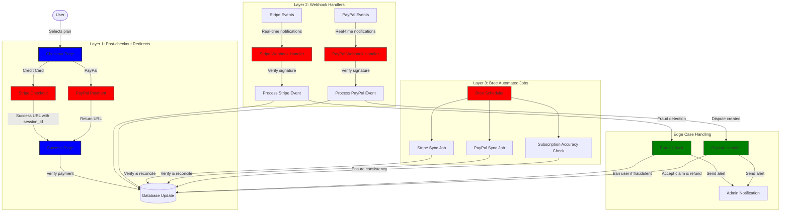
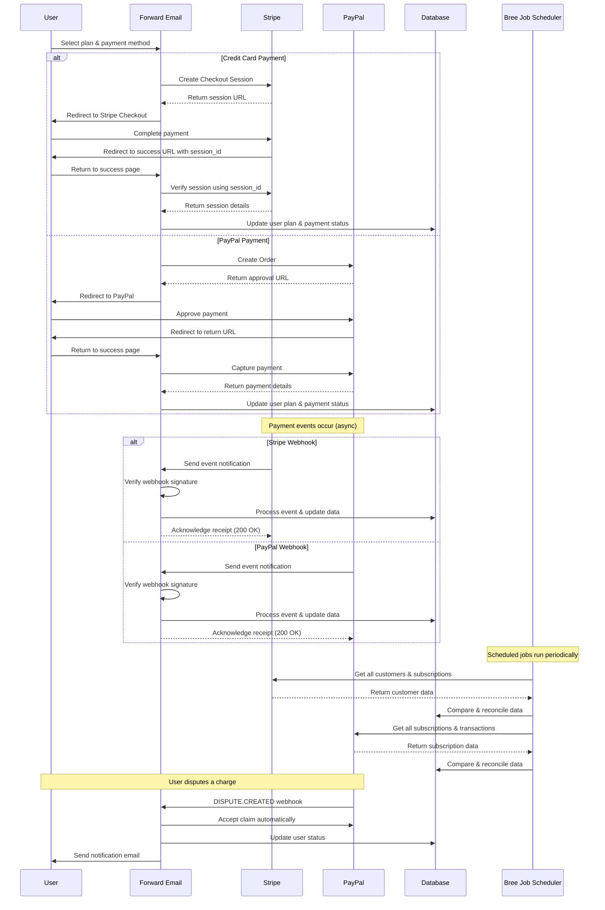
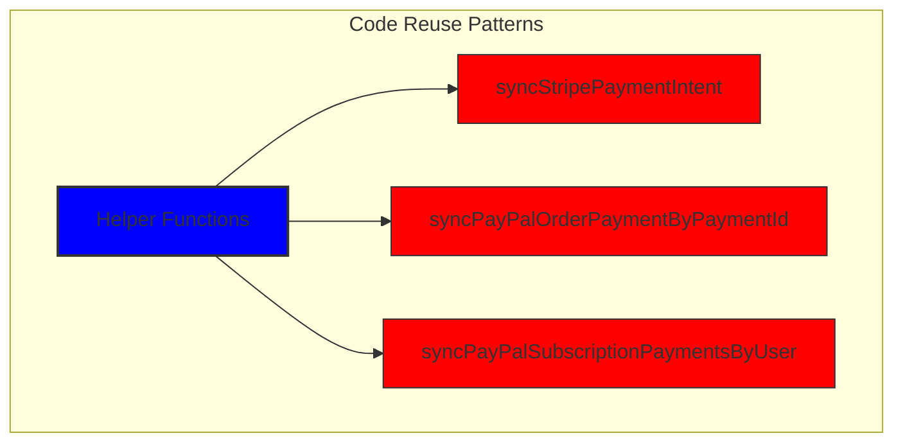
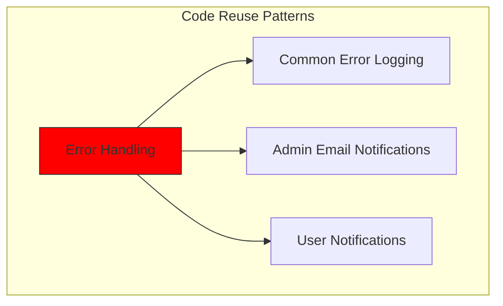
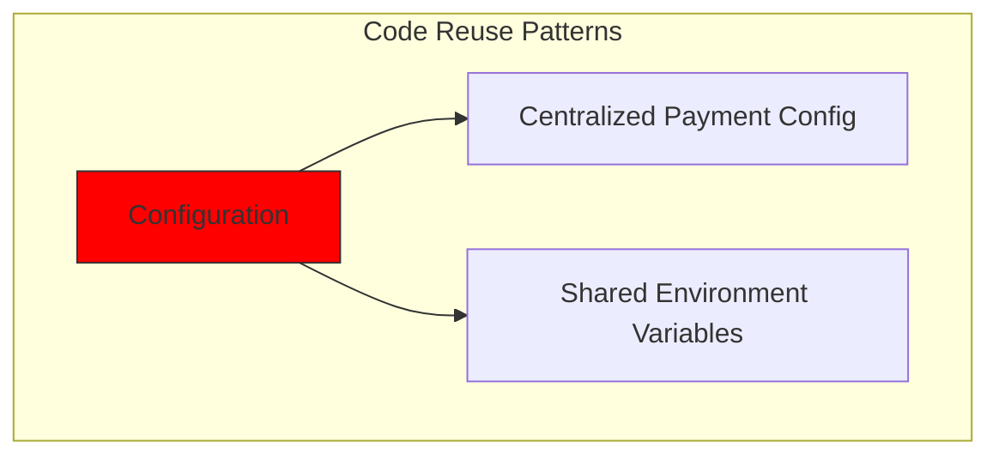
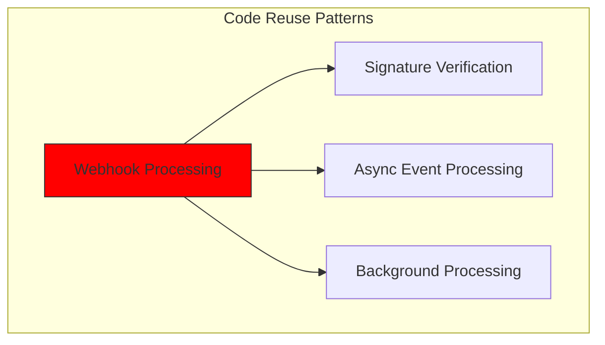
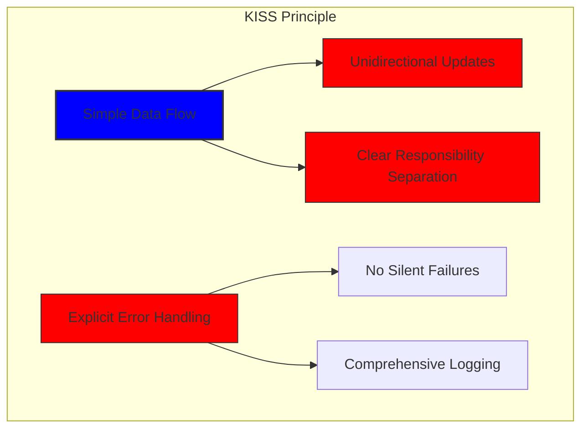
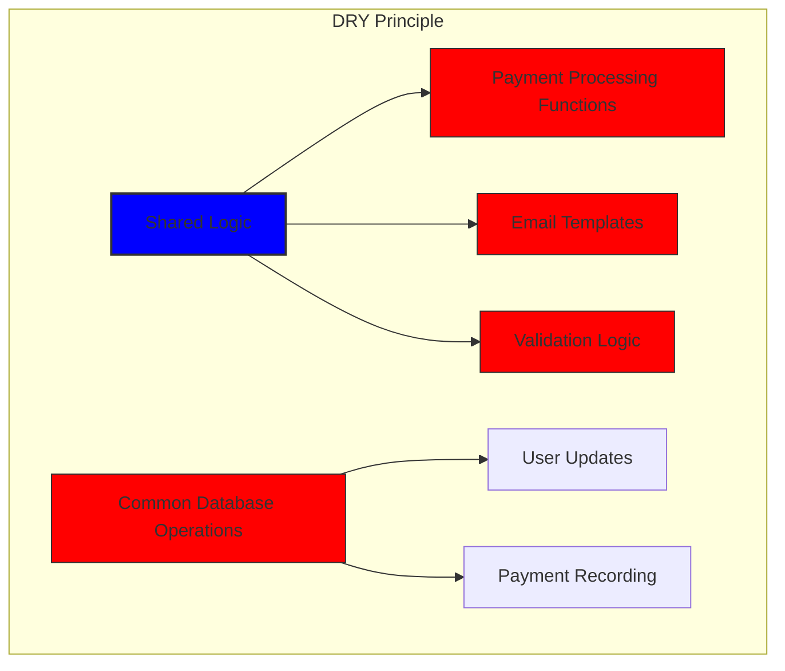

# Stripe と PayPal を使った堅牢な決済システムの構築方法: トリフェクタアプローチ {#how-we-built-a-robust-payment-system-with-stripe-and-paypal-a-trifecta-approach}


## 目次 {#table-of-contents}

* [序文](#foreword)
* [課題：複数の決済処理業者、唯一の真実の情報源](#the-challenge-multiple-payment-processors-one-source-of-truth)
* [トリフェクタアプローチ：信頼性の3層](#the-trifecta-approach-three-layers-of-reliability)
* [レイヤー1: チェックアウト後のリダイレクト](#layer-1-post-checkout-redirects)
  * [Stripeチェックアウトの実装](#stripe-checkout-implementation)
  * [PayPalの支払いフロー](#paypal-payment-flow)
* [レイヤー2: 署名検証を備えたWebhookハンドラー](#layer-2-webhook-handlers-with-signature-verification)
  * [Stripe Webhook の実装](#stripe-webhook-implementation)
  * [PayPal Webhookの実装](#paypal-webhook-implementation)
* [レイヤー3: Breeによるジョブの自動化](#layer-3-automated-jobs-with-bree)
  * [サブスクリプション精度チェッカー](#subscription-accuracy-checker)
  * [PayPalサブスクリプションの同期](#paypal-subscription-synchronization)
* [エッジケースの処理](#handling-edge-cases)
  * [不正行為の検出と防止](#fraud-detection-and-prevention)
  * [紛争処理](#dispute-handling)
* [コードの再利用: KISSとDRY原則](#code-reuse-kiss-and-dry-principles)
* [VISAサブスクリプション要件の実装](#visa-subscription-requirements-implementation)
  * [自動更新前メール通知](#automated-pre-renewal-email-notifications)
  * [エッジケースの処理](#handling-edge-cases-1)
  * [試用期間とサブスクリプション条件](#trial-periods-and-subscription-terms)
* [結論：Trifectaアプローチの利点](#conclusion-the-benefits-of-our-trifecta-approach)

## 序文 {#foreword}

Forward Emailでは、信頼性、正確性、そしてユーザーフレンドリーなシステムの構築を常に最優先に考えてきました。決済処理システムの導入にあたり、複数の決済処理業者に対応しながらも、完璧なデータの一貫性を維持できるソリューションが必要であることを認識していました。このブログ記事では、開発チームがStripeとPayPalを三位一体のアプローチで統合し、システム全体で1:1のリアルタイム精度を確保した方法について詳しく説明します。

## 課題: 複数の決済処理業者、唯一の信頼できる情報源 {#the-challenge-multiple-payment-processors-one-source-of-truth}

プライバシー重視のメールサービスとして、ユーザーに支払い方法の選択肢を提供したいと考えました。Stripeを介したクレジットカード決済のシンプルさを好むユーザーもいれば、PayPalが提供する分離レイヤーを重視するユーザーもいます。しかし、複数の決済処理業者をサポートすると、大きな複雑さが生じます。

1. 異なる決済システム間でデータの一貫性を確保するにはどうすればよいでしょうか？
2. 紛争、返金、支払い失敗といったエッジケースにはどのように対処すればよいでしょうか？
3. データベース内で信頼できる唯一の情報源を維持するにはどうすればよいでしょうか？

私たちの解決策は、いわゆる「トリフェクタ アプローチ」を実装することでした。これは、何が起こっても冗長性を提供し、データの一貫性を保証する 3 層システムです。

## トリフェクタアプローチ：信頼性の3層 {#the-trifecta-approach-three-layers-of-reliability}

当社の支払いシステムは、完全なデータ同期を確保するために連携して機能する 3 つの重要なコンポーネントで構成されています。

1. **チェックアウト後のリダイレクト** - チェックアウト直後に支払い情報を取得します
2. **Webhookハンドラー** - 決済処理業者からのリアルタイムイベントを処理します
3. **自動化ジョブ** - 支払いデータを定期的に検証および照合します

各コンポーネントを詳しく見て、それらがどのように連携するかを見てみましょう。



## レイヤー1: チェックアウト後のリダイレクト {#layer-1-post-checkout-redirects}

当社の三要素アプローチの第一段階は、ユーザーが支払いを完了した直後に実行されます。StripeとPayPalはどちらも、取引情報とともにユーザーを当社のサイトにリダイレクトするメカニズムを提供しています。

### ストライプチェックアウトの実装 {#stripe-checkout-implementation}

Stripeでは、シームレスな決済体験を実現するためにCheckout Sessions APIを使用しています。ユーザーがプランを選択し、クレジットカードでの支払いを選択すると、成功URLとキャンセルURLを含むCheckout Sessionが作成されます。

```javascript
const options = {
  mode: paymentType === 'one-time' ? 'payment' : 'subscription',
  customer: ctx.state.user[config.userFields.stripeCustomerID],
  client_reference_id: reference,
  metadata: {
    plan
  },
  line_items: [
    {
      price,
      quantity: 1,
      description
    }
  ],
  locale: config.STRIPE_LOCALES.has(ctx.locale) ? ctx.locale : 'auto',
  cancel_url: `${config.urls.web}${ctx.path}${
    isMakePayment || isEnableAutoRenew ? '' : `/?plan=${plan}`
  }`,
  success_url: `${config.urls.web}${ctx.path}/?${
    isMakePayment || isEnableAutoRenew ? '' : `plan=${plan}&`
  }session_id={CHECKOUT_SESSION_ID}`,
  allow_promotion_codes: true
};

// Create the checkout session and redirect
const session = await stripe.checkout.sessions.create(options);
const redirectTo = session.url;
if (ctx.accepts('html')) {
  ctx.status = 303;
  ctx.redirect(redirectTo);
} else {
  ctx.body = { redirectTo };
}
```

ここで重要なのは`success_url`パラメータです。このパラメータには`session_id`がクエリパラメータとして含まれています。Stripeが支払い処理の成功後にユーザーをサイトにリダイレクトする際に、このセッションIDを使用してトランザクションを検証し、データベースを更新することができます。

### PayPal支払いフロー {#paypal-payment-flow}

PayPal の場合、Orders API で同様のアプローチを使用します。

```javascript
const requestBody = {
  intent: 'CAPTURE',
  application_context: {
    cancel_url: `${config.urls.web}${ctx.path}${
      isMakePayment || isEnableAutoRenew ? '' : `/?plan=${plan}`
    }`,
    return_url: `${config.urls.web}${ctx.path}/?plan=${plan}`,
    brand_name: 'Forward Email',
    shipping_preference: 'NO_SHIPPING',
    user_action: 'PAY_NOW'
  },
  payer: {
    email_address: ctx.state.user.email
  },
  purchase_units: [
    {
      reference_id: ctx.state.user.id,
      description,
      custom_id: sku,
      invoice_id: reference,
      soft_descriptor: sku,
      amount: {
        currency_code: 'USD',
        value: price,
        breakdown: {
          item_total: {
            currency_code: 'USD',
            value: price
          }
        }
      },
      items: [
        {
          name,
          description,
          sku,
          unit_amount: {
            currency_code: 'USD',
            value: price
          },
          quantity: '1',
          category: 'DIGITAL_GOODS'
        }
      ]
    }
  ]
};
```

Stripeと同様に、支払い後のリダイレクトを処理するために`return_url`と`cancel_url`パラメータを指定します。PayPalがユーザーをサイトにリダイレクトする際に、支払い情報を取得し、データベースを更新できます。



## レイヤー2: 署名検証付きWebhookハンドラー {#layer-2-webhook-handlers-with-signature-verification}

チェックアウト後のリダイレクトはほとんどのシナリオでうまく機能しますが、万能ではありません。ユーザーがリダイレクトされる前にブラウザを閉じてしまったり、ネットワークの問題でリダイレクトが完了しなかったりする可能性があります。そこでWebhookが役立ちます。

StripeとPayPalはどちらも、決済イベントに関するリアルタイム通知を送信するWebhookシステムを提供しています。私たちは、これらの通知の信頼性を検証し、それに応じて処理する堅牢なWebhookハンドラーを実装しました。

### Stripe Webhook 実装 {#stripe-webhook-implementation}

当社の Stripe Webhook ハンドラーは、受信した Webhook イベントの署名を検証し、それが正当であることを確認します。

```javascript
async function webhook(ctx) {
  const sig = ctx.request.get('stripe-signature');
  // throw an error if something was wrong
  if (!isSANB(sig))
    throw Boom.badRequest(ctx.translateError('INVALID_STRIPE_SIGNATURE'));
  const event = stripe.webhooks.constructEvent(
    ctx.request.rawBody,
    sig,
    env.STRIPE_ENDPOINT_SECRET
  );
  // throw an error if something was wrong
  if (!event)
    throw Boom.badRequest(ctx.translateError('INVALID_STRIPE_SIGNATURE'));
  ctx.logger.info('stripe webhook', { event });
  // return a response to acknowledge receipt of the event
  ctx.body = { received: true };
  // run in background
  processEvent(ctx, event)
    .then()
    .catch((err) => {
      ctx.logger.fatal(err, { event });
      // email admin errors
      emailHelper({
        template: 'alert',
        message: {
          to: config.email.message.from,
          subject: `Error with Stripe Webhook (Event ID ${event.id})`
        },
        locals: {
          message: `<pre><code>${safeStringify(
            parseErr(err),
            null,
            2
          )}</code></pre>`
        }
      })
        .then()
        .catch((err) => ctx.logger.fatal(err, { event }));
    });
}
```

`stripe.webhooks.constructEvent` 関数は、エンドポイントシークレットを使用して署名を検証します。署名が有効な場合、Webhook レスポンスのブロックを回避するため、イベントを非同期的に処理します。

### PayPal Webhook実装 {#paypal-webhook-implementation}

同様に、PayPal Webhook ハンドラーは、受信通知の信頼性を検証します。

```javascript
async function webhook(ctx) {
  const response = await promisify(
    paypal.notification.webhookEvent.verify,
    paypal.notification.webhookEvent
  )(ctx.request.headers, ctx.request.body, env.PAYPAL_WEBHOOK_ID);
  // throw an error if something was wrong
  if (!_.isObject(response) || response.verification_status !== 'SUCCESS')
    throw Boom.badRequest(ctx.translateError('INVALID_PAYPAL_SIGNATURE'));
  // return a response to acknowledge receipt of the event
  ctx.body = { received: true };
  // run in background
  processEvent(ctx)
    .then()
    .catch((err) => {
      ctx.logger.fatal(err);
      // email admin errors
      emailHelper({
        template: 'alert',
        message: {
          to: config.email.message.from,
          subject: `Error with PayPal Webhook (Event ID ${ctx.request.body.id})`
        },
        locals: {
          message: `<pre><code>${safeStringify(
            parseErr(err),
            null,
            2
          )}</code></pre>`
        }
      })
        .then()
        .catch((err) => ctx.logger.fatal(err));
    });
}
```

どちらのWebhookハンドラも同じパターンに従います。署名の検証、受信確認、そしてイベントの非同期処理です。これにより、チェックアウト後のリダイレクトが失敗した場合でも、決済イベントを見逃すことはありません。

## レイヤー3: Breeによる自動化ジョブ {#layer-3-automated-jobs-with-bree}

トリフェクタアプローチの最終層は、支払いデータを定期的に検証・調整する一連の自動化ジョブです。これらのジョブは、Node.jsのジョブスケジューラであるBreeを使用して定期的に実行されます。

### サブスクリプション精度チェッカー {#subscription-accuracy-checker}

私たちの主な仕事の 1 つは、サブスクリプションの精度チェッカーです。これは、データベースが Stripe のサブスクリプション ステータスを正確に反映していることを確認するものです。

```javascript
async function mapper(customer) {
  // wait a second to prevent rate limitation error
  await setTimeout(ms('1s'));
  // check for user on our side
  let user = await Users.findOne({
    [config.userFields.stripeCustomerID]: customer.id
  })
    .lean()
    .exec();
  if (!user) return;
  if (user.is_banned) return;

  // if emails did not match
  if (user.email !== customer.email) {
    logger.info(
      `User email ${user.email} did not match customer email ${customer.email} (${customer.id})`
    );
    customer = await stripe.customers.update(customer.id, {
      email: user.email
    });
    logger.info(`Updated user email to match ${user.email}`);
  }

  // check for active subscriptions
  const [activeSubscriptions, trialingSubscriptions] = await Promise.all([
    stripe.subscriptions.list({
      customer: customer.id,
      status: 'active'
    }),
    stripe.subscriptions.list({
      customer: customer.id,
      status: 'trialing'
    })
  ]);

  // Combine active and trialing subscriptions
  let subscriptions = [
    ...activeSubscriptions.data,
    ...trialingSubscriptions.data
  ];

  // Handle edge case: multiple subscriptions for one user
  if (subscriptions.length > 1) {
    await logger.error(
      new Error(
        `We may need to refund: User had multiple subscriptions ${user.email} (${customer.id})`
      )
    );
    await emailHelper({
      template: 'alert',
      message: {
        to: config.email.message.from,
        subject: `User had multiple subscriptions ${user.email}`
      },
      locals: {
        message: `User ${user.email} (${customer.id}) had multiple subscriptions: ${JSON.stringify(
          subscriptions.map((s) => s.id)
        )}`
      }
    });
  }
}
```

このジョブは、メールアドレスの不一致や複数のアクティブなサブスクリプションなど、データベースとStripe間の不一致をチェックします。問題が見つかった場合はログに記録し、管理チームにアラートを送信します。

### PayPalサブスクリプション同期 {#paypal-subscription-synchronization}

PayPal サブスクリプションでも同様のジョブがあります。

```javascript
async function syncPayPalSubscriptionPayments() {
  const paypalCustomers = await Users.find({
    $or: [
      {
        [config.userFields.paypalSubscriptionID]: { $exists: true, $ne: null }
      },
      {
        [config.userFields.paypalPayerID]: { $exists: true, $ne: null }
      }
    ]
  })
    // sort by newest customers first
    .sort('-created_at')
    .lean()
    .exec();

  await logger.info(
    `Syncing payments for ${paypalCustomers.length} paypal customers`
  );

  // Process each customer and sync their payments
  const errorEmails = await pReduce(
    paypalCustomers,
    // Implementation details...
  );
}
```

これらの自動化されたジョブは最終的な安全網として機能し、データベースが常に Stripe と PayPal の両方でサブスクリプションと支払いの実際の状態を反映することを保証します。

## エッジケースの処理 {#handling-edge-cases}

堅牢な決済システムは、エッジケースを適切に処理する必要があります。よくあるシナリオにどのように対処するかを見てみましょう。

### 不正行為の検出と防止 {#fraud-detection-and-prevention}

当社では、疑わしい支払い行為を自動的に識別して処理する高度な不正検出メカニズムを実装しています。

```javascript
case 'charge.failed': {
  // Get all failed charges in the last 30 days
  const charges = await stripe.charges.list({
    customer: event.data.object.customer,
    created: {
      gte: dayjs().subtract(1, 'month').unix()
    }
  });

  // Filter for declined charges
  const filtered = charges.data.filter(
    (d) => d.status === 'failed' && d.failure_code === 'card_declined'
  );

  // if not more than 5 then return early
  if (filtered.length < 5) break;

  // Check if user has verified domains
  const count = await Domains.countDocuments({
    members: {
      $elemMatch: {
        user: user._id,
        group: 'admin'
      }
    },
    plan: { $in: ['enhanced_protection', 'team'] },
    has_txt_record: true
  });

  if (!user.is_banned) {
    // If no verified domains, ban the user and refund all charges
    if (count === 0) {
      // Ban the user
      user.is_banned = true;
      await user.save();

      // Refund all successful charges
    }
  }
}
```

このコードは、不正行為の強い指標となる、複数回の請求失敗と検証済みドメインのないユーザーを自動的に禁止します。

### 紛争処理 {#dispute-handling}

ユーザーが請求に異議を申し立てた場合、当社は自動的にその申し立てを承認し、適切な措置を講じます。

```javascript
case 'CUSTOMER.DISPUTE.CREATED': {
  // accept claim
  const agent = await paypalAgent();
  await agent
    .post(`/v1/customer/disputes/${body.resource.dispute_id}/accept-claim`)
    .send({
      note: 'Full refund to the customer.'
    });

  // Find the payment in our database
  const payment = await Payments.findOne({ $or });
  if (!payment) throw new Error('Payment does not exist');

  const user = await Users.findById(payment.user);
  if (!user) throw new Error('User did not exist for customer');

  // Cancel the user's subscription if they have one
  if (isSANB(user[config.userFields.paypalSubscriptionID])) {
    try {
      const agent = await paypalAgent();
      await agent.post(
        `/v1/billing/subscriptions/${
          user[config.userFields.paypalSubscriptionID]
        }/cancel`
      );
    } catch (err) {
      // Handle subscription cancellation errors
    }
  }
}
```

このアプローチにより、紛争がビジネスに与える影響を最小限に抑えながら、優れた顧客体験を確保できます。

## コードの再利用: KISS と DRY の原則 {#code-reuse-kiss-and-dry-principles}

当社の決済システム全体を通して、KISS（Keep It Simple, Stupid）とDRY（Don't Repeat Yourself）の原則を遵守しています。以下にいくつか例を挙げます。

1. **共有ヘルパー関数**: 支払いの同期やメールの送信などの一般的なタスク用に再利用可能なヘルパー関数を作成しました。

2. **一貫したエラー処理**: Stripe と PayPal の両方の Webhook ハンドラーは、エラー処理と管理者通知に同じパターンを使用します。

3. **統合データベース スキーマ**: 当社のデータベース スキーマは、支払いステータス、金額、プラン情報の共通フィールドを備え、Stripe と PayPal の両方のデータに対応するように設計されています。

4. **集中構成**: 支払い関連の構成が 1 つのファイルに一元化されているため、価格や製品情報を簡単に更新できます。













## VISAサブスクリプション要件の実装 {#visa-subscription-requirements-implementation}

3つの柱となるアプローチに加え、VISAのサブスクリプション要件を遵守しながらユーザーエクスペリエンスを向上させるための特別な機能を実装しました。VISAの重要な要件の一つは、特にトライアルから有料サブスクリプションに移行する際、サブスクリプション料金が請求される前にユーザーに通知する必要があることです。

### 更新前自動メール通知 {#automated-pre-renewal-email-notifications}

有効なトライアルサブスクリプションをお持ちのユーザーを特定し、初回請求が発生する前に通知メールを送信する自動システムを構築しました。これにより、VISAの要件を遵守できるだけでなく、チャージバックを削減し、顧客満足度を向上させることができます。

この機能を実装する方法は次のとおりです。

```javascript
// Find users with trial subscriptions who haven't received a notification yet
const users = await Users.find({
  $or: [
    {
      $and: [
        { [config.userFields.stripeSubscriptionID]: { $exists: true } },
        { [config.userFields.stripeTrialSentAt]: { $exists: false } },
        // Exclude subscriptions that have already had payments
        ...(paidStripeSubscriptionIds.length > 0
          ? [
              {
                [config.userFields.stripeSubscriptionID]: {
                  $nin: paidStripeSubscriptionIds
                }
              }
            ]
          : [])
      ]
    },
    {
      $and: [
        { [config.userFields.paypalSubscriptionID]: { $exists: true } },
        { [config.userFields.paypalTrialSentAt]: { $exists: false } },
        // Exclude subscriptions that have already had payments
        ...(paidPayPalSubscriptionIds.length > 0
          ? [
              {
                [config.userFields.paypalSubscriptionID]: {
                  $nin: paidPayPalSubscriptionIds
                }
              }
            ]
          : [])
      ]
    }
  ]
});

// Process each user and send notification
for (const user of users) {
  // Get subscription details from payment processor
  const subscription = await getSubscriptionDetails(user);

  // Calculate subscription duration and frequency
  const duration = getDurationFromPlanId(subscription.plan_id);
  const frequency = getHumanReadableFrequency(duration, user.locale);
  const amount = getPlanAmount(user.plan, duration);

  // Get user's domains for personalized email
  const domains = await Domains.find({
    'members.user': user._id
  }).sort('name').lean().exec();

  // Send VISA-compliant notification email
  await emailHelper({
    template: 'visa-trial-subscription-requirement',
    message: {
      to: user.receipt_email || user.email,
      ...(user.receipt_email ? { cc: user.email } : {})
    },
    locals: {
      user,
      firstChargeDate: new Date(subscription.start_time),
      frequency,
      formattedAmount: numeral(amount).format('$0,0,0.00'),
      domains
    }
  });

  // Record that notification was sent
  await Users.findByIdAndUpdate(user._id, {
    $set: {
      [config.userFields.paypalTrialSentAt]: new Date()
    }
  });
}
```

この実装により、ユーザーは今後の請求について常に通知され、以下の点について明確な詳細が得られます。

1. 初回請求日
2. 今後の請求頻度（月払い、年払いなど）
3. 請求金額（具体的には）
4. サブスクリプションの対象となるドメイン

このプロセスを自動化することで、VISA の要件 (請求の少なくとも 7 日前に通知することを義務付けている) に完全に準拠しながら、サポートの問い合わせを減らし、全体的なユーザー エクスペリエンスを向上させることができます。

### エッジケースの処理 {#handling-edge-cases-1}

当社の実装には堅牢なエラー処理も含まれています。通知プロセス中に問題が発生した場合、システムが自動的にチームに警告を発します。

```javascript
try {
  await mapper(user);
} catch (err) {
  logger.error(err);

  // Send alert to administrators
  await emailHelper({
    template: 'alert',
    message: {
      to: config.email.message.from,
      subject: 'VISA Trial Subscription Requirement Error'
    },
    locals: {
      message: `<pre><code>${safeStringify(
        parseErr(err),
        null,
        2
      )}</code></pre>`
    }
  });
}
```

これにより、通知システムに問題が発生した場合でも、当社のチームが迅速に対応し、VISA の要件への準拠を維持することができます。

VISA サブスクリプション通知システムは、コンプライアンスとユーザー エクスペリエンスの両方を考慮して支払いインフラストラクチャを構築した当社のもう 1 つの例であり、信頼性が高く透明性の高い支払い処理を保証するための 3 つのアプローチを補完するものです。

### 試用期間とサブスクリプション条件 {#trial-periods-and-subscription-terms}

既存のプランで自動更新を有効にしているユーザーの場合、現在のプランの有効期限が切れるまで料金が発生しないように適切な試用期間を計算します。

```javascript
if (
  isEnableAutoRenew &&
  dayjs(ctx.state.user[config.userFields.planExpiresAt]).isAfter(
    dayjs()
  )
) {
  const hours = dayjs(
    ctx.state.user[config.userFields.planExpiresAt]
  ).diff(dayjs(), 'hours');

  // Handle trial period calculation
}
```

また、請求頻度やキャンセルポリシーなどのサブスクリプション条件に関する明確な情報を提供し、適切な追跡と管理を確実にするために各サブスクリプションに詳細なメタデータを含めます。

## 結論: 当社のトリフェクタアプローチの利点 {#conclusion-the-benefits-of-our-trifecta-approach}

弊社の支払い処理に対する 3 つのアプローチにより、次のような重要なメリットがもたらされました。

1. **信頼性**: 3 層の決済検証を実施することで、支払い漏れや誤った処理が行われないようにします。

2. **正確性**: 当社のデータベースは、Stripe と PayPal の両方におけるサブスクリプションと支払いの実際の状態を常に反映しています。

3. **柔軟性**: ユーザーは、システムの信頼性を損なうことなく、好みの支払い方法を選択できます。

4. **堅牢性**: 当社のシステムは、ネットワーク障害から不正行為まで、エッジケースを適切に処理します。

複数のプロセッサをサポートする決済システムを実装する場合は、この3つのアプローチを強くお勧めします。初期開発にはより多くの労力が必要ですが、信頼性と精度という点で得られる長期的なメリットは十分に価値があります。

Forward Email およびプライバシーを重視したメール サービスの詳細については、[Webサイト](https://forwardemail.net) をご覧ください。

<!-- *キーワード: 支払い処理、Stripe 統合、PayPal 統合、Webhook 処理、支払い同期、サブスクリプション管理、不正防止、紛争処理、Node.js 支払いシステム、マルチプロセッサ支払いシステム、支払いゲートウェイ統合、リアルタイム支払い検証、支払いデータの一貫性、サブスクリプション請求、支払いセキュリティ、支払い自動化、支払い Webhook、支払い調整、支払いエッジケース、支払いエラー処理、VISA サブスクリプション要件、更新前通知、サブスクリプションコンプライアンス* -->