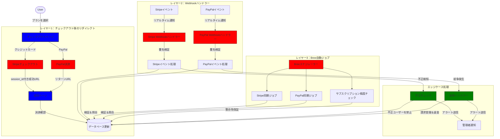
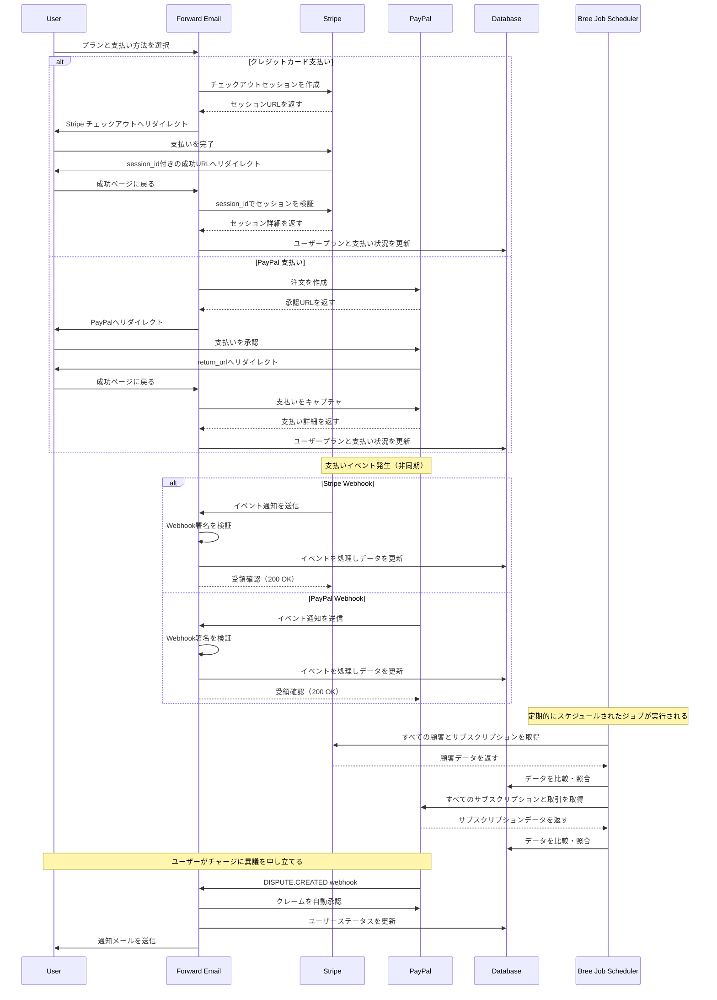
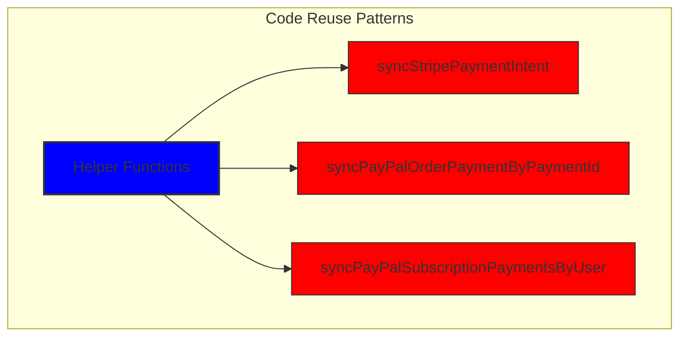
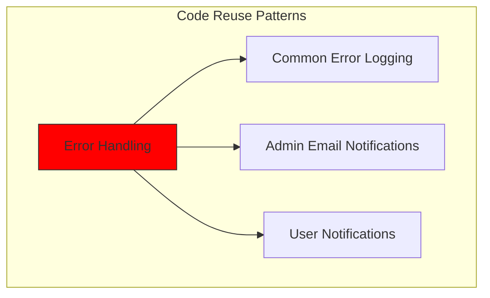
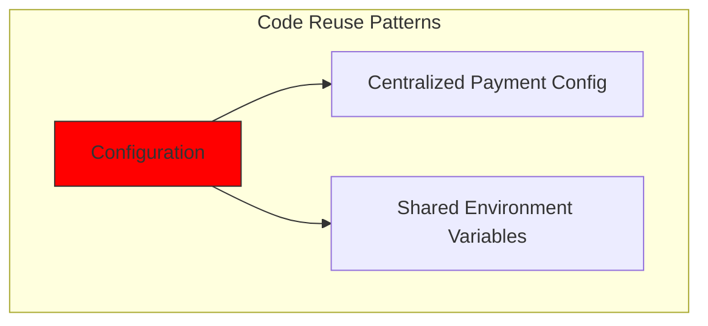
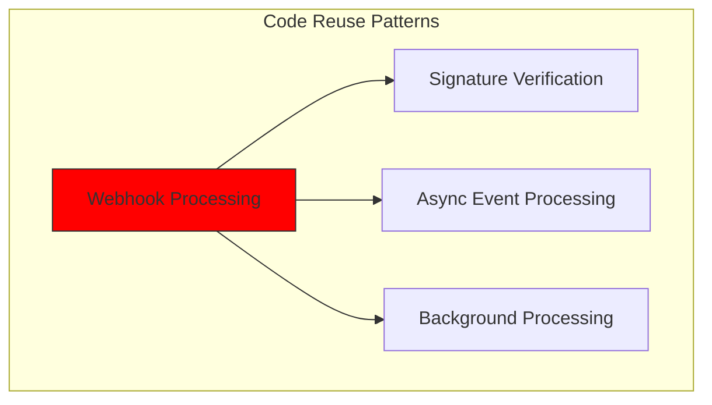
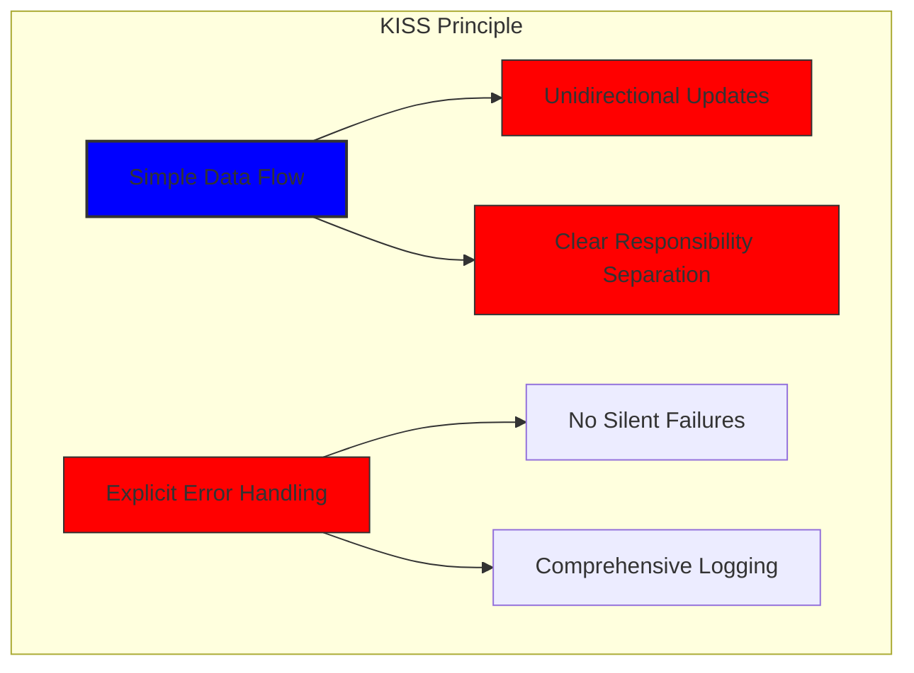

# StripeとPayPalで堅牢な決済システムを構築した方法：トリフェクタアプローチ {#how-we-built-a-robust-payment-system-with-stripe-and-paypal-a-trifecta-approach}


## 目次 {#table-of-contents}

* [序文](#foreword)
* [課題：複数の決済プロセッサー、唯一の真実の情報源](#the-challenge-multiple-payment-processors-one-source-of-truth)
* [トリフェクタアプローチ：信頼性の3層構造](#the-trifecta-approach-three-layers-of-reliability)
* [レイヤー1：チェックアウト後のリダイレクト](#layer-1-post-checkout-redirects)
  * [Stripeチェックアウトの実装](#stripe-checkout-implementation)
  * [PayPal決済フロー](#paypal-payment-flow)
* [レイヤー2：署名検証付きWebhookハンドラー](#layer-2-webhook-handlers-with-signature-verification)
  * [Stripe Webhookの実装](#stripe-webhook-implementation)
  * [PayPal Webhookの実装](#paypal-webhook-implementation)
* [レイヤー3：Breeによる自動ジョブ](#layer-3-automated-jobs-with-bree)
  * [サブスクリプション精度チェッカー](#subscription-accuracy-checker)
  * [PayPalサブスクリプション同期](#paypal-subscription-synchronization)
* [エッジケースの処理](#handling-edge-cases)
  * [不正検知と防止](#fraud-detection-and-prevention)
  * [紛争処理](#dispute-handling)
* [コード再利用：KISSとDRYの原則](#code-reuse-kiss-and-dry-principles)
* [VISAサブスクリプション要件の実装](#visa-subscription-requirements-implementation)
  * [自動化された更新前メール通知](#automated-pre-renewal-email-notifications)
  * [エッジケースの処理](#handling-edge-cases-1)
  * [トライアル期間とサブスクリプション条件](#trial-periods-and-subscription-terms)
* [結論：トリフェクタアプローチの利点](#conclusion-the-benefits-of-our-trifecta-approach)


## 序文 {#foreword}

Forward Emailでは、常に信頼性が高く、正確で、ユーザーフレンドリーなシステムの構築を最優先してきました。決済処理システムの実装にあたっては、複数の決済プロセッサーを扱いながらも完璧なデータ整合性を維持できるソリューションが必要だと認識していました。本記事では、当社の開発チームがStripeとPayPalの両方を統合し、システム全体で1:1のリアルタイム精度を保証するトリフェクタアプローチをどのように実装したかを詳述します。


## 課題：複数の決済プロセッサー、唯一の真実の情報源 {#the-challenge-multiple-payment-processors-one-source-of-truth}

プライバシー重視のメールサービスとして、ユーザーに複数の決済オプションを提供したいと考えました。Stripeによるクレジットカード決済のシンプルさを好む方もいれば、PayPalが提供する追加の分離レイヤーを評価する方もいます。しかし、複数の決済プロセッサーをサポートすることは大きな複雑さを伴います：

1. 異なる決済システム間でデータの一貫性をどう確保するか？
2. 紛争、返金、支払い失敗などのエッジケースをどう処理するか？
3. データベース内で唯一の真実の情報源をどう維持するか？

私たちの解決策は「トリフェクタアプローチ」と呼ぶ、冗長性を持ち、何が起きてもデータ整合性を保証する3層構造のシステムを実装することでした。


## トリフェクタアプローチ：信頼性の3層構造 {#the-trifecta-approach-three-layers-of-reliability}

当社の決済システムは、完璧なデータ同期を保証するために連携する3つの重要なコンポーネントで構成されています：

1. **チェックアウト後のリダイレクト** - チェックアウト直後に決済情報を取得
2. **Webhookハンドラー** - 決済プロセッサーからのリアルタイムイベントを処理
3. **自動ジョブ** - 定期的に決済データを検証・照合

それぞれのコンポーネントがどのように連携しているか見ていきましょう。


```mermaid
flowchart TD
    User([User]) --> |プランを選択| Checkout[チェックアウトページ]

    %% Layer 1: Post-checkout redirects
    subgraph "レイヤー1：チェックアウト後のリダイレクト"
        Checkout --> |クレジットカード| Stripe[Stripeチェックアウト]
        Checkout --> |PayPal| PayPal[PayPal決済]

        Stripe --> |session_id付き成功URL| SuccessPage[成功ページ]
        PayPal --> |リターンURL| SuccessPage

        SuccessPage --> |決済確認| Database[(データベース更新)]
    end

    %% Layer 2: Webhooks
    subgraph "レイヤー2：Webhookハンドラー"
        StripeEvents[Stripeイベント] --> |リアルタイム通知| StripeWebhook[Stripe Webhookハンドラー]
        PayPalEvents[PayPalイベント] --> |リアルタイム通知| PayPalWebhook[PayPal Webhookハンドラー]

        StripeWebhook --> |署名検証| ProcessStripeEvent[Stripeイベント処理]
        PayPalWebhook --> |署名検証| ProcessPayPalEvent[PayPalイベント処理]

        ProcessStripeEvent --> Database
        ProcessPayPalEvent --> Database
    end

    %% Layer 3: Automated jobs
    subgraph "レイヤー3：Bree自動ジョブ"
        BreeScheduler[Breeスケジューラー] --> StripeSync[Stripe同期ジョブ]
        BreeScheduler --> PayPalSync[PayPal同期ジョブ]
        BreeScheduler --> AccuracyCheck[サブスクリプション精度チェック]

        StripeSync --> |検証＆照合| Database
        PayPalSync --> |検証＆照合| Database
        AccuracyCheck --> |整合性保証| Database
    end

    %% Edge cases
    subgraph "エッジケース処理"
        ProcessStripeEvent --> |不正検知| FraudCheck[不正チェック]
        ProcessPayPalEvent --> |紛争発生| DisputeHandler[紛争ハンドラー]

        FraudCheck --> |不正ユーザーを禁止| Database
        DisputeHandler --> |請求受理＆返金| Database

        FraudCheck --> |アラート送信| AdminNotification[管理者通知]
        DisputeHandler --> |アラート送信| AdminNotification
    end

    %% Style definitions
    classDef primary fill:blue,stroke:#333,stroke-width:2px;
    classDef secondary fill:red,stroke:#333,stroke-width:1px;
    classDef tertiary fill:green,stroke:#333,stroke-width:1px;

    class Checkout,SuccessPage primary;
    class Stripe,PayPal,StripeWebhook,PayPalWebhook,BreeScheduler secondary;
    class FraudCheck,DisputeHandler tertiary;
```
## レイヤー1: チェックアウト後のリダイレクト {#layer-1-post-checkout-redirects}

私たちの三段構えアプローチの最初のレイヤーは、ユーザーが支払いを完了した直後に発生します。Stripe と PayPal の両方が、取引情報を含めてユーザーを当サイトにリダイレクトする仕組みを提供しています。

### Stripe チェックアウトの実装 {#stripe-checkout-implementation}

Stripe では、Checkout Sessions API を使用してシームレスな支払い体験を作成しています。ユーザーがプランを選択しクレジットカードで支払う場合、特定の成功およびキャンセル URL を指定して Checkout Session を作成します：

```javascript
const options = {
  mode: paymentType === 'one-time' ? 'payment' : 'subscription',
  customer: ctx.state.user[config.userFields.stripeCustomerID],
  client_reference_id: reference,
  metadata: {
    plan
  },
  line_items: [
    {
      price,
      quantity: 1,
      description
    }
  ],
  locale: config.STRIPE_LOCALES.has(ctx.locale) ? ctx.locale : 'auto',
  cancel_url: `${config.urls.web}${ctx.path}${
    isMakePayment || isEnableAutoRenew ? '' : `/?plan=${plan}`
  }`,
  success_url: `${config.urls.web}${ctx.path}/?${
    isMakePayment || isEnableAutoRenew ? '' : `plan=${plan}&`
  }session_id={CHECKOUT_SESSION_ID}`,
  allow_promotion_codes: true
};

// チェックアウトセッションを作成しリダイレクト
const session = await stripe.checkout.sessions.create(options);
const redirectTo = session.url;
if (ctx.accepts('html')) {
  ctx.status = 303;
  ctx.redirect(redirectTo);
} else {
  ctx.body = { redirectTo };
}
```

ここで重要なのは、`success_url` パラメータで、クエリパラメータとして `session_id` を含めている点です。Stripe が支払い成功後にユーザーを当サイトにリダイレクトするとき、このセッション ID を使って取引を検証し、データベースを更新できます。

### PayPal 支払いフロー {#paypal-payment-flow}

PayPal では、Orders API を使って同様のアプローチを取っています：

```javascript
const requestBody = {
  intent: 'CAPTURE',
  application_context: {
    cancel_url: `${config.urls.web}${ctx.path}${
      isMakePayment || isEnableAutoRenew ? '' : `/?plan=${plan}`
    }`,
    return_url: `${config.urls.web}${ctx.path}/?plan=${plan}`,
    brand_name: 'Forward Email',
    shipping_preference: 'NO_SHIPPING',
    user_action: 'PAY_NOW'
  },
  payer: {
    email_address: ctx.state.user.email
  },
  purchase_units: [
    {
      reference_id: ctx.state.user.id,
      description,
      custom_id: sku,
      invoice_id: reference,
      soft_descriptor: sku,
      amount: {
        currency_code: 'USD',
        value: price,
        breakdown: {
          item_total: {
            currency_code: 'USD',
            value: price
          }
        }
      },
      items: [
        {
          name,
          description,
          sku,
          unit_amount: {
            currency_code: 'USD',
            value: price
          },
          quantity: '1',
          category: 'DIGITAL_GOODS'
        }
      ]
    }
  ]
};
```

Stripe と同様に、支払い後のリダイレクトを処理するために `return_url` と `cancel_url` パラメータを指定しています。PayPal がユーザーを当サイトにリダイレクトするときに支払い詳細を取得し、データベースを更新できます。


```mermaid
sequenceDiagram
    participant User
    participant FE as Forward Email
    participant Stripe
    participant PayPal
    participant DB as Database
    participant Bree as Bree Job Scheduler

    %% 初期チェックアウトフロー
    User->>FE: プランと支払い方法を選択

    alt クレジットカード支払い
        FE->>Stripe: チェックアウトセッションを作成
        Stripe-->>FE: セッションURLを返す
        FE->>User: Stripe チェックアウトへリダイレクト
        User->>Stripe: 支払いを完了
        Stripe->>User: session_id付きの成功URLへリダイレクト
        User->>FE: 成功ページに戻る
        FE->>Stripe: session_idでセッションを検証
        Stripe-->>FE: セッション詳細を返す
        FE->>DB: ユーザープランと支払い状況を更新
    else PayPal 支払い
        FE->>PayPal: 注文を作成
        PayPal-->>FE: 承認URLを返す
        FE->>User: PayPalへリダイレクト
        User->>PayPal: 支払いを承認
        PayPal->>User: return_urlへリダイレクト
        User->>FE: 成功ページに戻る
        FE->>PayPal: 支払いをキャプチャ
        PayPal-->>FE: 支払い詳細を返す
        FE->>DB: ユーザープランと支払い状況を更新
    end

    %% Webhook フロー（非同期）
    Note over Stripe,PayPal: 支払いイベント発生（非同期）

    alt Stripe Webhook
        Stripe->>FE: イベント通知を送信
        FE->>FE: Webhook署名を検証
        FE->>DB: イベントを処理しデータを更新
        FE-->>Stripe: 受領確認（200 OK）
    else PayPal Webhook
        PayPal->>FE: イベント通知を送信
        FE->>FE: Webhook署名を検証
        FE->>DB: イベントを処理しデータを更新
        FE-->>PayPal: 受領確認（200 OK）
    end

    %% Bree 自動ジョブ
    Note over Bree: 定期的にスケジュールされたジョブが実行される

    Bree->>Stripe: すべての顧客とサブスクリプションを取得
    Stripe-->>Bree: 顧客データを返す
    Bree->>DB: データを比較・照合

    Bree->>PayPal: すべてのサブスクリプションと取引を取得
    PayPal-->>Bree: サブスクリプションデータを返す
    Bree->>DB: データを比較・照合

    %% エッジケース: 異議申し立て処理
    Note over User,PayPal: ユーザーがチャージに異議を申し立てる

    PayPal->>FE: DISPUTE.CREATED webhook
    FE->>PayPal: クレームを自動承認
    FE->>DB: ユーザーステータスを更新
    FE->>User: 通知メールを送信
```
## Layer 2: 署名検証付きWebhookハンドラー {#layer-2-webhook-handlers-with-signature-verification}

ポストチェックアウトのリダイレクトはほとんどのシナリオでうまく機能しますが、完全ではありません。ユーザーがリダイレクト前にブラウザを閉じたり、ネットワークの問題でリダイレクトが完了しないことがあります。そこでWebhookが役立ちます。

StripeとPayPalの両方が、支払いイベントに関するリアルタイム通知を送信するWebhookシステムを提供しています。私たちはこれらの通知の真正性を検証し、適切に処理する堅牢なWebhookハンドラーを実装しています。

### Stripe Webhook 実装 {#stripe-webhook-implementation}

私たちのStripe webhookハンドラーは、受信したWebhookイベントの署名を検証して正当性を確認します：

```javascript
async function webhook(ctx) {
  const sig = ctx.request.get('stripe-signature');
  // 問題があればエラーを投げる
  if (!isSANB(sig))
    throw Boom.badRequest(ctx.translateError('INVALID_STRIPE_SIGNATURE'));
  const event = stripe.webhooks.constructEvent(
    ctx.request.rawBody,
    sig,
    env.STRIPE_ENDPOINT_SECRET
  );
  // 問題があればエラーを投げる
  if (!event)
    throw Boom.badRequest(ctx.translateError('INVALID_STRIPE_SIGNATURE'));
  ctx.logger.info('stripe webhook', { event });
  // イベント受領を認識するレスポンスを返す
  ctx.body = { received: true };
  // バックグラウンドで実行
  processEvent(ctx, event)
    .then()
    .catch((err) => {
      ctx.logger.fatal(err, { event });
      // 管理者にエラーをメール送信
      emailHelper({
        template: 'alert',
        message: {
          to: config.email.message.from,
          subject: `Error with Stripe Webhook (Event ID ${event.id})`
        },
        locals: {
          message: `<pre><code>${safeStringify(
            parseErr(err),
            null,
            2
          )}</code></pre>`
        }
      })
        .then()
        .catch((err) => ctx.logger.fatal(err, { event }));
    });
}
```

`stripe.webhooks.constructEvent` 関数は、エンドポイントシークレットを使って署名を検証します。署名が有効な場合、Webhookレスポンスのブロックを避けるためにイベントを非同期で処理します。

### PayPal Webhook 実装 {#paypal-webhook-implementation}

同様に、私たちのPayPal webhookハンドラーは受信通知の真正性を検証します：

```javascript
async function webhook(ctx) {
  const response = await promisify(
    paypal.notification.webhookEvent.verify,
    paypal.notification.webhookEvent
  )(ctx.request.headers, ctx.request.body, env.PAYPAL_WEBHOOK_ID);
  // 問題があればエラーを投げる
  if (!_.isObject(response) || response.verification_status !== 'SUCCESS')
    throw Boom.badRequest(ctx.translateError('INVALID_PAYPAL_SIGNATURE'));
  // イベント受領を認識するレスポンスを返す
  ctx.body = { received: true };
  // バックグラウンドで実行
  processEvent(ctx)
    .then()
    .catch((err) => {
      ctx.logger.fatal(err);
      // 管理者にエラーをメール送信
      emailHelper({
        template: 'alert',
        message: {
          to: config.email.message.from,
          subject: `Error with PayPal Webhook (Event ID ${ctx.request.body.id})`
        },
        locals: {
          message: `<pre><code>${safeStringify(
            parseErr(err),
            null,
            2
          )}</code></pre>`
        }
      })
        .then()
        .catch((err) => ctx.logger.fatal(err));
    });
}
```

両方のWebhookハンドラーは同じパターンに従っています：署名を検証し、受領を認識し、イベントを非同期で処理します。これにより、ポストチェックアウトのリダイレクトが失敗しても支払いイベントを見逃すことがありません。


## Layer 3: Breeによる自動ジョブ {#layer-3-automated-jobs-with-bree}

私たちの三段階アプローチの最終層は、定期的に支払いデータを検証・照合する自動ジョブのセットです。Node.js用のジョブスケジューラーであるBreeを使って、これらのジョブを定期的に実行しています。

### サブスクリプション精度チェッカー {#subscription-accuracy-checker}

私たちの主要なジョブの一つはサブスクリプション精度チェッカーで、データベースがStripeのサブスクリプション状況を正確に反映していることを保証します：
```javascript
async function mapper(customer) {
  // wait a second to prevent rate limitation error
  await setTimeout(ms('1s'));
  // check for user on our side
  let user = await Users.findOne({
    [config.userFields.stripeCustomerID]: customer.id
  })
    .lean()
    .exec();
  if (!user) return;
  if (user.is_banned) return;

  // if emails did not match
  if (user.email !== customer.email) {
    logger.info(
      `User email ${user.email} did not match customer email ${customer.email} (${customer.id})`
    );
    customer = await stripe.customers.update(customer.id, {
      email: user.email
    });
    logger.info(`Updated user email to match ${user.email}`);
  }

  // check for active subscriptions
  const [activeSubscriptions, trialingSubscriptions] = await Promise.all([
    stripe.subscriptions.list({
      customer: customer.id,
      status: 'active'
    }),
    stripe.subscriptions.list({
      customer: customer.id,
      status: 'trialing'
    })
  ]);

  // Combine active and trialing subscriptions
  let subscriptions = [
    ...activeSubscriptions.data,
    ...trialingSubscriptions.data
  ];

  // Handle edge case: multiple subscriptions for one user
  if (subscriptions.length > 1) {
    await logger.error(
      new Error(
        `We may need to refund: User had multiple subscriptions ${user.email} (${customer.id})`
      )
    );
    await emailHelper({
      template: 'alert',
      message: {
        to: config.email.message.from,
        subject: `User had multiple subscriptions ${user.email}`
      },
      locals: {
        message: `User ${user.email} (${customer.id}) had multiple subscriptions: ${JSON.stringify(
          subscriptions.map((s) => s.id)
        )}`
      }
    });
  }
}
```

This job checks for discrepancies between our database and Stripe, such as mismatched email addresses or multiple active subscriptions. If it finds any issues, it logs them and sends alerts to our admin team.

### PayPal Subscription Synchronization {#paypal-subscription-synchronization}

We have a similar job for PayPal subscriptions:

```javascript
async function syncPayPalSubscriptionPayments() {
  const paypalCustomers = await Users.find({
    $or: [
      {
        [config.userFields.paypalSubscriptionID]: { $exists: true, $ne: null }
      },
      {
        [config.userFields.paypalPayerID]: { $exists: true, $ne: null }
      }
    ]
  })
    // sort by newest customers first
    .sort('-created_at')
    .lean()
    .exec();

  await logger.info(
    `Syncing payments for ${paypalCustomers.length} paypal customers`
  );

  // Process each customer and sync their payments
  const errorEmails = await pReduce(
    paypalCustomers,
    // Implementation details...
  );
}
```

These automated jobs serve as our final safety net, ensuring that our database always reflects the true state of subscriptions and payments in both Stripe and PayPal.


## Handling Edge Cases {#handling-edge-cases}

A robust payment system must handle edge cases gracefully. Let's look at how we handle some common scenarios.

### Fraud Detection and Prevention {#fraud-detection-and-prevention}

We've implemented sophisticated fraud detection mechanisms that automatically identify and handle suspicious payment activities:

```javascript
case 'charge.failed': {
  // Get all failed charges in the last 30 days
  const charges = await stripe.charges.list({
    customer: event.data.object.customer,
    created: {
      gte: dayjs().subtract(1, 'month').unix()
    }
  });

  // Filter for declined charges
  const filtered = charges.data.filter(
    (d) => d.status === 'failed' && d.failure_code === 'card_declined'
  );

  // if not more than 5 then return early
  if (filtered.length < 5) break;

  // Check if user has verified domains
  const count = await Domains.countDocuments({
    members: {
      $elemMatch: {
        user: user._id,
        group: 'admin'
      }
    },
    plan: { $in: ['enhanced_protection', 'team'] },
    has_txt_record: true
  });

  if (!user.is_banned) {
    // If no verified domains, ban the user and refund all charges
    if (count === 0) {
      // Ban the user
      user.is_banned = true;
      await user.save();

      // Refund all successful charges
    }
  }
}
```

このコードは、複数回の決済失敗があり、かつ検証済みドメインがないユーザーを自動的に禁止します。これは不正行為の強い指標です。

### Dispute Handling {#dispute-handling}

ユーザーがチャージに異議を唱えた場合、私たちは自動的に請求を受け入れ、適切な対応を行います：

```javascript
case 'CUSTOMER.DISPUTE.CREATED': {
  // accept claim
  const agent = await paypalAgent();
  await agent
    .post(`/v1/customer/disputes/${body.resource.dispute_id}/accept-claim`)
    .send({
      note: 'Full refund to the customer.'
    });

  // Find the payment in our database
  const payment = await Payments.findOne({ $or });
  if (!payment) throw new Error('Payment does not exist');

  const user = await Users.findById(payment.user);
  if (!user) throw new Error('User did not exist for customer');

  // Cancel the user's subscription if they have one
  if (isSANB(user[config.userFields.paypalSubscriptionID])) {
    try {
      const agent = await paypalAgent();
      await agent.post(
        `/v1/billing/subscriptions/${
          user[config.userFields.paypalSubscriptionID]
        }/cancel`
      );
    } catch (err) {
      // Handle subscription cancellation errors
    }
  }
}
```

この方法により、異議申し立てがビジネスに与える影響を最小限に抑えつつ、良好な顧客体験を確保しています。


## Code Reuse: KISS and DRY Principles {#code-reuse-kiss-and-dry-principles}

私たちの決済システム全体で、KISS（Keep It Simple, Stupid）およびDRY（Don't Repeat Yourself）の原則を遵守しています。以下はいくつかの例です：

1. **共有ヘルパー関数**：決済同期やメール送信などの共通タスクのために再利用可能なヘルパー関数を作成しています。

2. **一貫したエラーハンドリング**：StripeとPayPalの両方のWebhookハンドラーは、同じパターンでエラーハンドリングと管理者通知を行います。

3. **統一されたデータベーススキーマ**：決済ステータス、金額、プラン情報などの共通フィールドを持つ、StripeとPayPal両方のデータに対応したスキーマ設計です。

4. **集中管理された設定**：決済関連の設定は単一ファイルに集中管理されており、価格や製品情報の更新が容易です。


```mermaid
graph TD
    subgraph "Code Reuse Patterns"
        A[Helper Functions] --> B[syncStripePaymentIntent]
        A --> C[syncPayPalOrderPaymentByPaymentId]
        A --> D[syncPayPalSubscriptionPaymentsByUser]
    end

    classDef primary fill:blue,stroke:#333,stroke-width:2px;
    classDef secondary fill:red,stroke:#333,stroke-width:1px;

    class A,P,V primary;
    class B,C,D,E,I,L,Q,R,S,W,X,Y,Z secondary;
```


```mermaid
graph TD
    subgraph "Code Reuse Patterns"
        E[Error Handling] --> F[Common Error Logging]
        E --> G[Admin Email Notifications]
        E --> H[User Notifications]
    end

    classDef primary fill:blue,stroke:#333,stroke-width:2px;
    classDef secondary fill:red,stroke:#333,stroke-width:1px;

    class A,P,V primary;
    class B,C,D,E,I,L,Q,R,S,W,X,Y,Z secondary;
```


```mermaid
graph TD
    subgraph "Code Reuse Patterns"
        I[Configuration] --> J[Centralized Payment Config]
        I --> K[Shared Environment Variables]
    end

    classDef primary fill:blue,stroke:#333,stroke-width:2px;
    classDef secondary fill:red,stroke:#333,stroke-width:1px;

    class A,P,V primary;
    class B,C,D,E,I,L,Q,R,S,W,X,Y,Z secondary;
```


```mermaid
graph TD
    subgraph "Code Reuse Patterns"
        L[Webhook Processing] --> M[Signature Verification]
        L --> N[Async Event Processing]
        L --> O[Background Processing]
    end

    classDef primary fill:blue,stroke:#333,stroke-width:2px;
    classDef secondary fill:red,stroke:#333,stroke-width:1px;

    class A,P,V primary;
    class B,C,D,E,I,L,Q,R,S,W,X,Y,Z secondary;
```


```mermaid
graph TD
    subgraph "KISS Principle"
        P[Simple Data Flow] --> Q[Unidirectional Updates]
        P --> R[Clear Responsibility Separation]

        S[Explicit Error Handling] --> T[No Silent Failures]
        S --> U[Comprehensive Logging]
    end

    classDef primary fill:blue,stroke:#333,stroke-width:2px;
    classDef secondary fill:red,stroke:#333,stroke-width:1px;

    class A,P,V primary;
    class B,C,D,E,I,L,Q,R,S,W,X,Y,Z secondary;
```
graph TD
    subgraph "DRY Principle"
        V[共有ロジック] --> W[支払い処理関数]
        V --> X[メールテンプレート]
        V --> Y[検証ロジック]

        Z[共通データベース操作] --> AA[ユーザー更新]
        Z --> AB[支払い記録]
    end

    classDef primary fill:blue,stroke:#333,stroke-width:2px;
    classDef secondary fill:red,stroke:#333,stroke-width:1px;

    class A,P,V primary;
    class B,C,D,E,I,L,Q,R,S,W,X,Y,Z secondary;
```


## VISAサブスクリプション要件の実装 {#visa-subscription-requirements-implementation}

私たちのトリフェクタアプローチに加え、VISAのサブスクリプション要件に準拠しつつユーザー体験を向上させるための特定の機能を実装しました。VISAからの重要な要件の一つは、特にトライアルから有料サブスクリプションに移行する際に、ユーザーが課金される前に通知を受け取る必要があるということです。

### 自動化された事前更新メール通知 {#automated-pre-renewal-email-notifications}

アクティブなトライアルサブスクリプションを持つユーザーを特定し、最初の課金が行われる前に通知メールを送信する自動システムを構築しました。これにより、VISAの要件を満たすだけでなく、チャージバックの減少や顧客満足度の向上にもつながっています。

この機能の実装方法は以下の通りです：

```javascript
// 通知をまだ受け取っていないトライアルサブスクリプションのユーザーを検索
const users = await Users.find({
  $or: [
    {
      $and: [
        { [config.userFields.stripeSubscriptionID]: { $exists: true } },
        { [config.userFields.stripeTrialSentAt]: { $exists: false } },
        // すでに支払いが発生しているサブスクリプションは除外
        ...(paidStripeSubscriptionIds.length > 0
          ? [
              {
                [config.userFields.stripeSubscriptionID]: {
                  $nin: paidStripeSubscriptionIds
                }
              }
            ]
          : [])
      ]
    },
    {
      $and: [
        { [config.userFields.paypalSubscriptionID]: { $exists: true } },
        { [config.userFields.paypalTrialSentAt]: { $exists: false } },
        // すでに支払いが発生しているサブスクリプションは除外
        ...(paidPayPalSubscriptionIds.length > 0
          ? [
              {
                [config.userFields.paypalSubscriptionID]: {
                  $nin: paidPayPalSubscriptionIds
                }
              }
            ]
          : [])
      ]
    }
  ]
});

// 各ユーザーを処理し通知を送信
for (const user of users) {
  // 支払いプロセッサーからサブスクリプション詳細を取得
  const subscription = await getSubscriptionDetails(user);

  // サブスクリプションの期間と頻度を計算
  const duration = getDurationFromPlanId(subscription.plan_id);
  const frequency = getHumanReadableFrequency(duration, user.locale);
  const amount = getPlanAmount(user.plan, duration);

  // パーソナライズされたメールのためにユーザーのドメインを取得
  const domains = await Domains.find({
    'members.user': user._id
  }).sort('name').lean().exec();

  // VISA準拠の通知メールを送信
  await emailHelper({
    template: 'visa-trial-subscription-requirement',
    message: {
      to: user.receipt_email || user.email,
      ...(user.receipt_email ? { cc: user.email } : {})
    },
    locals: {
      user,
      firstChargeDate: new Date(subscription.start_time),
      frequency,
      formattedAmount: numeral(amount).format('$0,0,0.00'),
      domains
    }
  });

  // 通知送信済みを記録
  await Users.findByIdAndUpdate(user._id, {
    $set: {
      [config.userFields.paypalTrialSentAt]: new Date()
    }
  });
}
```

この実装により、ユーザーは常に以下の明確な詳細とともに今後の課金について通知されます：

1. 最初の課金がいつ行われるか
2. 今後の課金頻度（月次、年次など）
3. 課金される正確な金額
4. サブスクリプションでカバーされるドメイン

このプロセスを自動化することで、VISAの要件（課金の少なくとも7日前に通知すること）を完全に遵守しつつ、サポートへの問い合わせを減らし、全体的なユーザー体験を向上させています。
### エッジケースの処理 {#handling-edge-cases-1}

当社の実装には堅牢なエラーハンドリングも含まれています。通知プロセス中に何か問題が発生した場合、システムは自動的にチームにアラートを送信します：

```javascript
try {
  await mapper(user);
} catch (err) {
  logger.error(err);

  // 管理者へのアラート送信
  await emailHelper({
    template: 'alert',
    message: {
      to: config.email.message.from,
      subject: 'VISAトライアルサブスクリプション要件エラー'
    },
    locals: {
      message: `<pre><code>${safeStringify(
        parseErr(err),
        null,
        2
      )}</code></pre>`
    }
  });
}
```

これにより、通知システムに問題があっても、チームが迅速に対応しVISAの要件を遵守し続けることができます。

VISAサブスクリプション通知システムは、当社がコンプライアンスとユーザー体験の両方を考慮して支払いインフラを構築したもう一つの例であり、信頼性が高く透明性のある支払い処理を実現するための三位一体アプローチを補完しています。

### トライアル期間とサブスクリプション条件 {#trial-periods-and-subscription-terms}

既存プランで自動更新を有効にするユーザーに対しては、現在のプランが終了するまで課金されないよう適切なトライアル期間を計算します：

```javascript
if (
  isEnableAutoRenew &&
  dayjs(ctx.state.user[config.userFields.planExpiresAt]).isAfter(
    dayjs()
  )
) {
  const hours = dayjs(
    ctx.state.user[config.userFields.planExpiresAt]
  ).diff(dayjs(), 'hours');

  // トライアル期間の計算処理
}
```

また、請求頻度やキャンセルポリシーなどのサブスクリプション条件を明確に提供し、各サブスクリプションに詳細なメタデータを含めることで適切な追跡と管理を保証しています。


## 結論：三位一体アプローチの利点 {#conclusion-the-benefits-of-our-trifecta-approach}

当社の支払い処理における三位一体アプローチは、以下の主要な利点をもたらしています：

1. **信頼性**：3層の支払い検証を実装することで、支払いの見落としや誤処理を防止しています。

2. **正確性**：データベースは常にStripeとPayPalの両方のサブスクリプションおよび支払いの正確な状態を反映しています。

3. **柔軟性**：ユーザーはシステムの信頼性を損なうことなく、好みの支払い方法を選択できます。

4. **堅牢性**：ネットワーク障害から不正行為まで、エッジケースを適切に処理します。

複数の決済プロセッサをサポートする支払いシステムを実装する場合、この三位一体アプローチを強く推奨します。初期の開発コストはかかりますが、信頼性と正確性の面で長期的なメリットは非常に大きいです。

Forward Emailおよびプライバシー重視のメールサービスの詳細については、当社の[ウェブサイト](https://forwardemail.net)をご覧ください。

<!-- *Keywords: payment processing, Stripe integration, PayPal integration, webhook handling, payment synchronization, subscription management, fraud prevention, dispute handling, Node.js payment system, multi-processor payment system, payment gateway integration, real-time payment verification, payment data consistency, subscription billing, payment security, payment automation, payment webhooks, payment reconciliation, payment edge cases, payment error handling, VISA subscription requirements, pre-renewal notifications, subscription compliance* -->
