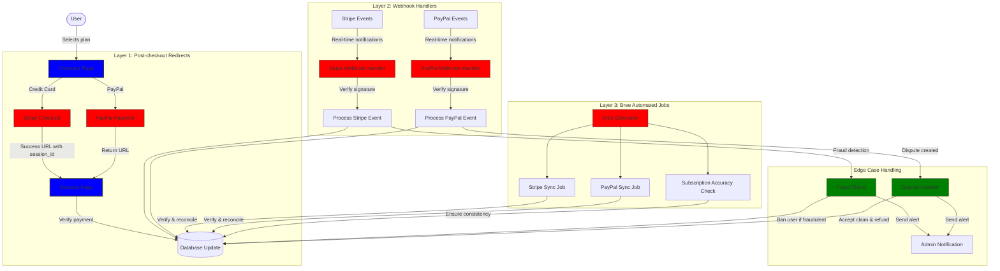
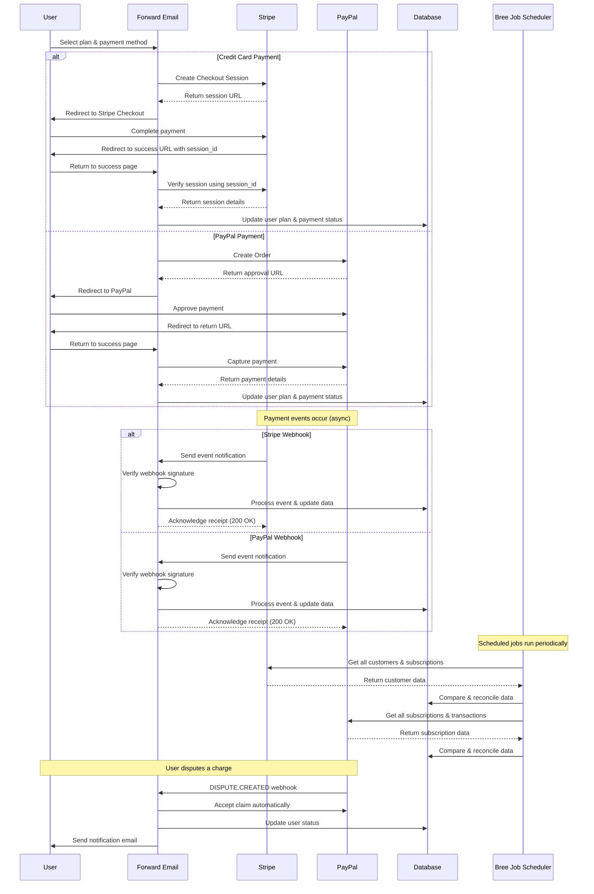
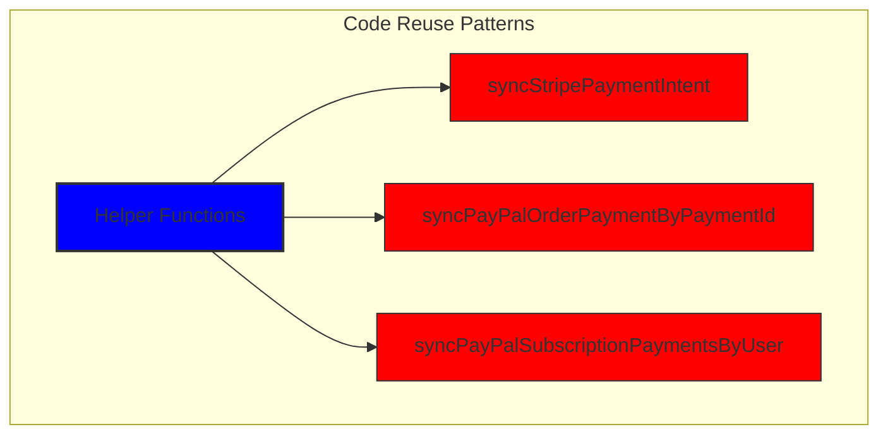
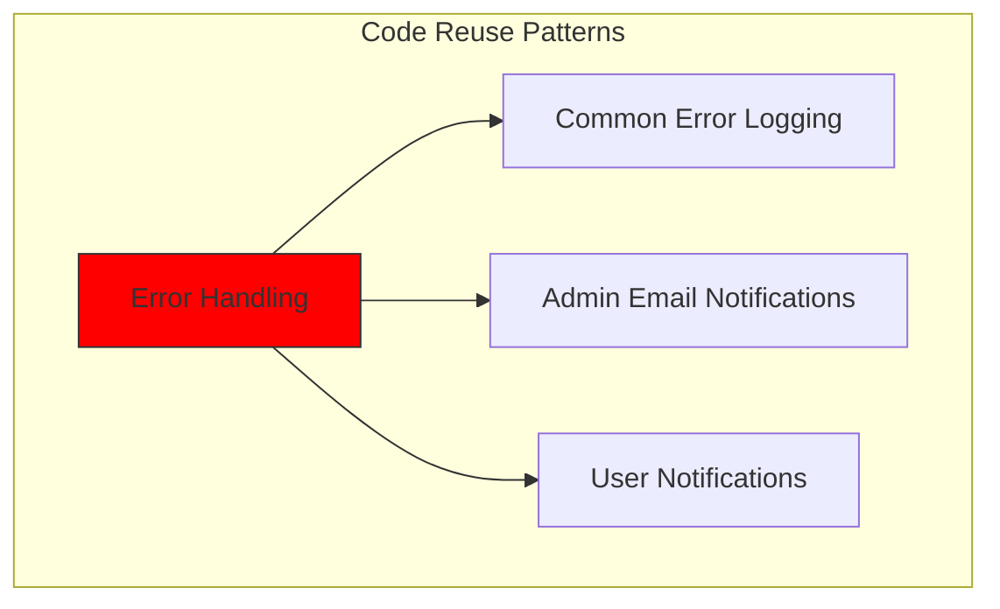
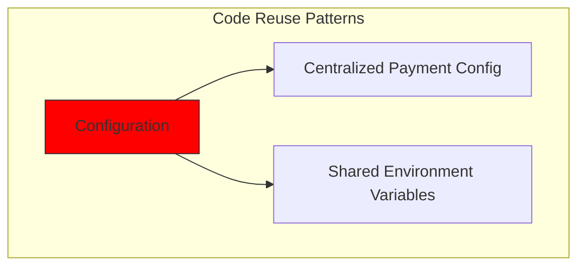
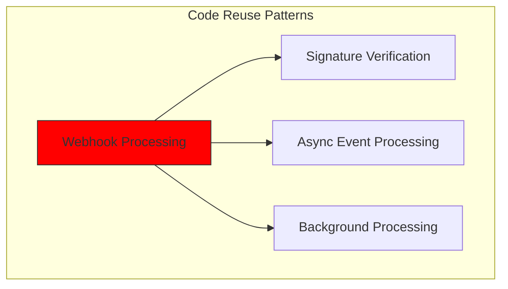
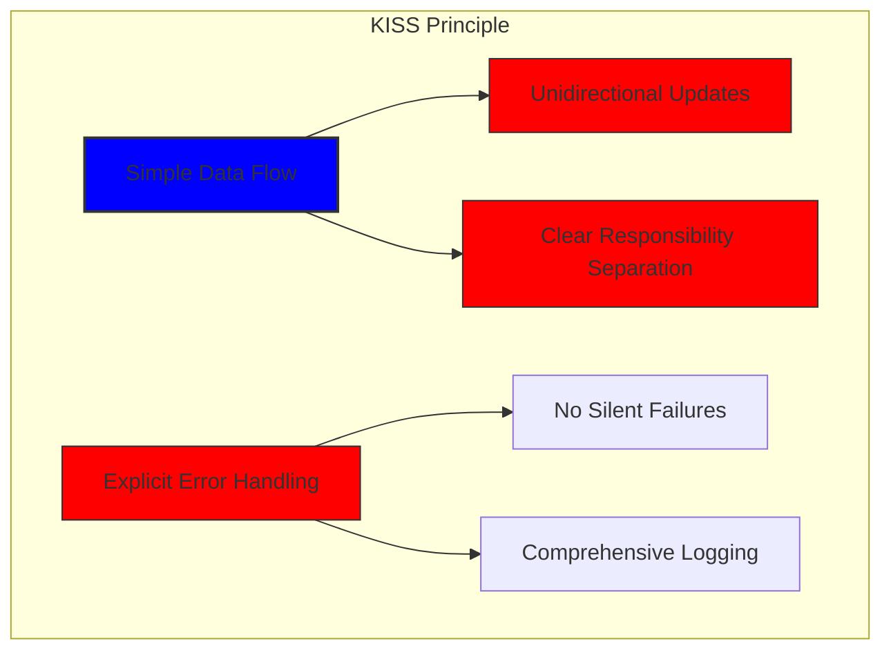
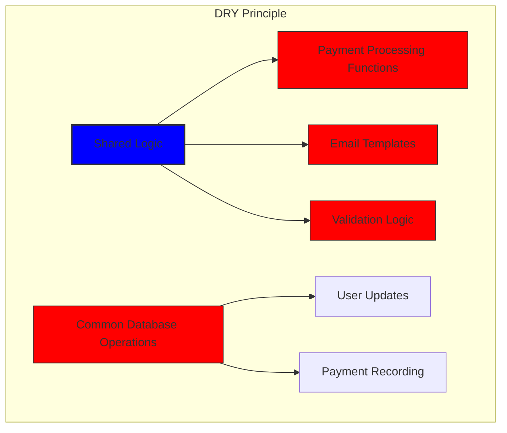

# Stripe와 PayPal을 활용한 강력한 결제 시스템 구축: 3중 접근법 {#how-we-built-a-robust-payment-system-with-stripe-and-paypal-a-trifecta-approach}


## 목차 {#table-of-contents}

* [머리말](#foreword)
* [과제: 여러 결제 처리업체, 진실의 단일 소스](#the-challenge-multiple-payment-processors-one-source-of-truth)
* [트리펙타 접근법: 신뢰성의 세 가지 계층](#the-trifecta-approach-three-layers-of-reliability)
* [1계층: 결제 후 리디렉션](#layer-1-post-checkout-redirects)
  * [Stripe 체크아웃 구현](#stripe-checkout-implementation)
  * [PayPal 결제 흐름](#paypal-payment-flow)
* [2계층: 서명 검증 기능이 있는 웹훅 핸들러](#layer-2-webhook-handlers-with-signature-verification)
  * [Stripe 웹훅 구현](#stripe-webhook-implementation)
  * [PayPal 웹훅 구현](#paypal-webhook-implementation)
* [3계층: Bree를 사용한 자동화된 작업](#layer-3-automated-jobs-with-bree)
  * [구독 정확도 검사기](#subscription-accuracy-checker)
  * [PayPal 구독 동기화](#paypal-subscription-synchronization)
* [엣지 케이스 처리](#handling-edge-cases)
  * [사기 탐지 및 예방](#fraud-detection-and-prevention)
  * [분쟁 처리](#dispute-handling)
* [코드 재사용: KISS 및 DRY 원칙](#code-reuse-kiss-and-dry-principles)
* [VISA 구독 요구 사항 구현](#visa-subscription-requirements-implementation)
  * [자동 갱신 전 이메일 알림](#automated-pre-renewal-email-notifications)
  * [엣지 케이스 처리](#handling-edge-cases-1)
  * [체험 기간 및 구독 약관](#trial-periods-and-subscription-terms)
* [결론: Trifecta 접근법의 이점](#conclusion-the-benefits-of-our-trifecta-approach)

## 서문 {#foreword}

Forward Email은 항상 안정적이고 정확하며 사용자 친화적인 시스템을 구축하는 것을 최우선으로 생각해 왔습니다. 결제 처리 시스템을 구축할 때, 완벽한 데이터 일관성을 유지하면서 여러 결제 처리업체를 처리할 수 있는 솔루션이 필요하다는 것을 인지했습니다. 이 블로그 게시물에서는 개발팀이 Stripe와 PayPal을 통합하여 전체 시스템에서 1:1 실시간 정확성을 보장하는 3중 접근법을 어떻게 활용했는지 자세히 설명합니다.

## 과제: 여러 결제 처리업체, 진실의 단일 소스 {#the-challenge-multiple-payment-processors-one-source-of-truth}

개인정보 보호에 중점을 둔 이메일 서비스로서, 저희는 사용자들에게 결제 옵션을 제공하고자 했습니다. Stripe를 통한 신용카드 결제의 간편함을 선호하는 사용자도 있고, PayPal이 제공하는 추가적인 보안 기능을 중시하는 사용자도 있습니다. 하지만 여러 결제 처리업체를 지원하는 것은 상당한 복잡성을 야기합니다.

1. 다양한 결제 시스템에서 일관된 데이터를 어떻게 보장할 수 있나요?
2. 분쟁, 환불 또는 결제 실패와 같은 예외적인 상황은 어떻게 처리할 수 있나요?
3. 데이터베이스에서 단일 정보 소스를 어떻게 유지할 수 있나요?

우리의 솔루션은 "트리펙타 접근법"이라고 부르는 것을 구현하는 것이었습니다. 이는 무슨 일이 있어도 중복성을 제공하고 데이터 일관성을 보장하는 3중 계층 시스템입니다.

## Trifecta 접근 방식: 3단계의 신뢰성 {#the-trifecta-approach-three-layers-of-reliability}

당사의 결제 시스템은 완벽한 데이터 동기화를 보장하기 위해 함께 작동하는 세 가지 핵심 구성 요소로 이루어져 있습니다.

1. **결제 후 리디렉션** - 결제 직후 결제 정보 수집
2. **웹훅 핸들러** - 결제 처리업체의 실시간 이벤트 처리
3. **자동화된 작업** - 결제 데이터 주기적 확인 및 조정

각 구성 요소를 자세히 살펴보고 이들이 서로 어떻게 작동하는지 살펴보겠습니다.



## 레이어 1: 결제 후 리디렉션 {#layer-1-post-checkout-redirects}

저희의 트리펙타(Trifecta) 접근 방식의 첫 번째 단계는 사용자가 결제를 완료한 직후에 이루어집니다. Stripe와 PayPal은 모두 사용자를 거래 정보와 함께 저희 사이트로 다시 리디렉션하는 메커니즘을 제공합니다.

### Stripe 체크아웃 구현 {#stripe-checkout-implementation}

Stripe의 경우, 원활한 결제 경험을 제공하기 위해 Checkout Sessions API를 사용합니다. 사용자가 요금제를 선택하고 신용카드로 결제하면, 결제 성공 및 취소 URL을 포함한 Checkout Session이 생성됩니다.

```javascript
const options = {
  mode: paymentType === 'one-time' ? 'payment' : 'subscription',
  customer: ctx.state.user[config.userFields.stripeCustomerID],
  client_reference_id: reference,
  metadata: {
    plan
  },
  line_items: [
    {
      price,
      quantity: 1,
      description
    }
  ],
  locale: config.STRIPE_LOCALES.has(ctx.locale) ? ctx.locale : 'auto',
  cancel_url: `${config.urls.web}${ctx.path}${
    isMakePayment || isEnableAutoRenew ? '' : `/?plan=${plan}`
  }`,
  success_url: `${config.urls.web}${ctx.path}/?${
    isMakePayment || isEnableAutoRenew ? '' : `plan=${plan}&`
  }session_id={CHECKOUT_SESSION_ID}`,
  allow_promotion_codes: true
};

// Create the checkout session and redirect
const session = await stripe.checkout.sessions.create(options);
const redirectTo = session.url;
if (ctx.accepts('html')) {
  ctx.status = 303;
  ctx.redirect(redirectTo);
} else {
  ctx.body = { redirectTo };
}
```

여기서 중요한 부분은 `success_url` 매개변수인데, 이 매개변수에는 `session_id`이 쿼리 매개변수로 포함되어 있습니다. Stripe가 결제 성공 후 사용자를 다시 사이트로 리디렉션할 때, 이 세션 ID를 사용하여 거래를 확인하고 데이터베이스를 업데이트할 수 있습니다.

### PayPal 결제 흐름 {#paypal-payment-flow}

PayPal의 경우, 주문 API에 비슷한 접근 방식을 사용합니다.

```javascript
const requestBody = {
  intent: 'CAPTURE',
  application_context: {
    cancel_url: `${config.urls.web}${ctx.path}${
      isMakePayment || isEnableAutoRenew ? '' : `/?plan=${plan}`
    }`,
    return_url: `${config.urls.web}${ctx.path}/?plan=${plan}`,
    brand_name: 'Forward Email',
    shipping_preference: 'NO_SHIPPING',
    user_action: 'PAY_NOW'
  },
  payer: {
    email_address: ctx.state.user.email
  },
  purchase_units: [
    {
      reference_id: ctx.state.user.id,
      description,
      custom_id: sku,
      invoice_id: reference,
      soft_descriptor: sku,
      amount: {
        currency_code: 'USD',
        value: price,
        breakdown: {
          item_total: {
            currency_code: 'USD',
            value: price
          }
        }
      },
      items: [
        {
          name,
          description,
          sku,
          unit_amount: {
            currency_code: 'USD',
            value: price
          },
          quantity: '1',
          category: 'DIGITAL_GOODS'
        }
      ]
    }
  ]
};
```

Stripe와 마찬가지로, 결제 후 리디렉션을 처리하기 위해 `return_url` 및 `cancel_url` 매개변수를 지정합니다. PayPal이 사용자를 다시 저희 사이트로 리디렉션하면 결제 정보를 캡처하고 데이터베이스를 업데이트할 수 있습니다.



## 레이어 2: 서명 검증 기능이 있는 웹훅 핸들러 {#layer-2-webhook-handlers-with-signature-verification}

결제 후 리디렉션은 대부분의 상황에서 효과적이지만, 완벽하지는 않습니다. 사용자가 리디렉션되기 전에 브라우저를 닫거나, 네트워크 문제로 리디렉션이 완료되지 않을 수 있습니다. 바로 이 부분에서 웹훅이 필요합니다.

Stripe와 PayPal은 모두 결제 이벤트에 대한 실시간 알림을 전송하는 웹훅 시스템을 제공합니다. 저희는 이러한 알림의 진위 여부를 확인하고 적절하게 처리하는 강력한 웹훅 핸들러를 구현했습니다.

### Stripe 웹훅 구현 {#stripe-webhook-implementation}

Stripe 웹훅 핸들러는 들어오는 웹훅 이벤트의 서명을 검증하여 합법적인지 확인합니다.

```javascript
async function webhook(ctx) {
  const sig = ctx.request.get('stripe-signature');
  // throw an error if something was wrong
  if (!isSANB(sig))
    throw Boom.badRequest(ctx.translateError('INVALID_STRIPE_SIGNATURE'));
  const event = stripe.webhooks.constructEvent(
    ctx.request.rawBody,
    sig,
    env.STRIPE_ENDPOINT_SECRET
  );
  // throw an error if something was wrong
  if (!event)
    throw Boom.badRequest(ctx.translateError('INVALID_STRIPE_SIGNATURE'));
  ctx.logger.info('stripe webhook', { event });
  // return a response to acknowledge receipt of the event
  ctx.body = { received: true };
  // run in background
  processEvent(ctx, event)
    .then()
    .catch((err) => {
      ctx.logger.fatal(err, { event });
      // email admin errors
      emailHelper({
        template: 'alert',
        message: {
          to: config.email.message.from,
          subject: `Error with Stripe Webhook (Event ID ${event.id})`
        },
        locals: {
          message: `<pre><code>${safeStringify(
            parseErr(err),
            null,
            2
          )}</code></pre>`
        }
      })
        .then()
        .catch((err) => ctx.logger.fatal(err, { event }));
    });
}
```

`stripe.webhooks.constructEvent` 함수는 엔드포인트 시크릿을 사용하여 서명을 검증합니다. 서명이 유효하면 웹훅 응답 차단을 방지하기 위해 이벤트를 비동기 방식으로 처리합니다.

### PayPal 웹훅 구현 {#paypal-webhook-implementation}

마찬가지로, PayPal 웹훅 핸들러는 수신 알림의 진위 여부를 확인합니다.

```javascript
async function webhook(ctx) {
  const response = await promisify(
    paypal.notification.webhookEvent.verify,
    paypal.notification.webhookEvent
  )(ctx.request.headers, ctx.request.body, env.PAYPAL_WEBHOOK_ID);
  // throw an error if something was wrong
  if (!_.isObject(response) || response.verification_status !== 'SUCCESS')
    throw Boom.badRequest(ctx.translateError('INVALID_PAYPAL_SIGNATURE'));
  // return a response to acknowledge receipt of the event
  ctx.body = { received: true };
  // run in background
  processEvent(ctx)
    .then()
    .catch((err) => {
      ctx.logger.fatal(err);
      // email admin errors
      emailHelper({
        template: 'alert',
        message: {
          to: config.email.message.from,
          subject: `Error with PayPal Webhook (Event ID ${ctx.request.body.id})`
        },
        locals: {
          message: `<pre><code>${safeStringify(
            parseErr(err),
            null,
            2
          )}</code></pre>`
        }
      })
        .then()
        .catch((err) => ctx.logger.fatal(err));
    });
}
```

두 웹훅 핸들러 모두 동일한 패턴을 따릅니다. 서명을 확인하고, 수신을 확인하고, 이벤트를 비동기적으로 처리합니다. 이를 통해 결제 후 리디렉션이 실패하더라도 결제 이벤트를 놓치지 않습니다.

## 레이어 3: Bree를 사용한 자동화된 작업 {#layer-3-automated-jobs-with-bree}

트리펙타 방식의 마지막 단계는 결제 데이터를 주기적으로 검증하고 조정하는 자동화된 작업 집합입니다. Node.js용 작업 스케줄러인 Bree를 사용하여 이러한 작업을 정기적으로 실행합니다.

### 구독 정확도 검사기 {#subscription-accuracy-checker}

당사의 주요 업무 중 하나는 구독 정확도 검사기로, Stripe의 구독 상태가 당사 데이터베이스에 정확하게 반영되는지 확인합니다.

```javascript
async function mapper(customer) {
  // wait a second to prevent rate limitation error
  await setTimeout(ms('1s'));
  // check for user on our side
  let user = await Users.findOne({
    [config.userFields.stripeCustomerID]: customer.id
  })
    .lean()
    .exec();
  if (!user) return;
  if (user.is_banned) return;

  // if emails did not match
  if (user.email !== customer.email) {
    logger.info(
      `User email ${user.email} did not match customer email ${customer.email} (${customer.id})`
    );
    customer = await stripe.customers.update(customer.id, {
      email: user.email
    });
    logger.info(`Updated user email to match ${user.email}`);
  }

  // check for active subscriptions
  const [activeSubscriptions, trialingSubscriptions] = await Promise.all([
    stripe.subscriptions.list({
      customer: customer.id,
      status: 'active'
    }),
    stripe.subscriptions.list({
      customer: customer.id,
      status: 'trialing'
    })
  ]);

  // Combine active and trialing subscriptions
  let subscriptions = [
    ...activeSubscriptions.data,
    ...trialingSubscriptions.data
  ];

  // Handle edge case: multiple subscriptions for one user
  if (subscriptions.length > 1) {
    await logger.error(
      new Error(
        `We may need to refund: User had multiple subscriptions ${user.email} (${customer.id})`
      )
    );
    await emailHelper({
      template: 'alert',
      message: {
        to: config.email.message.from,
        subject: `User had multiple subscriptions ${user.email}`
      },
      locals: {
        message: `User ${user.email} (${customer.id}) had multiple subscriptions: ${JSON.stringify(
          subscriptions.map((s) => s.id)
        )}`
      }
    });
  }
}
```

이 작업은 이메일 주소 불일치나 여러 개의 활성 구독 등 데이터베이스와 Stripe 간의 불일치를 확인합니다. 문제가 발견되면 이를 기록하고 관리팀에 알림을 보냅니다.

### PayPal 구독 동기화 {#paypal-subscription-synchronization}

PayPal 구독에 대해서도 비슷한 작업이 있습니다.

```javascript
async function syncPayPalSubscriptionPayments() {
  const paypalCustomers = await Users.find({
    $or: [
      {
        [config.userFields.paypalSubscriptionID]: { $exists: true, $ne: null }
      },
      {
        [config.userFields.paypalPayerID]: { $exists: true, $ne: null }
      }
    ]
  })
    // sort by newest customers first
    .sort('-created_at')
    .lean()
    .exec();

  await logger.info(
    `Syncing payments for ${paypalCustomers.length} paypal customers`
  );

  // Process each customer and sync their payments
  const errorEmails = await pReduce(
    paypalCustomers,
    // Implementation details...
  );
}
```

이러한 자동화된 작업은 Stripe와 PayPal의 구독 및 결제의 실제 상태를 항상 데이터베이스에 반영하도록 보장하여 최종적인 안전망 역할을 합니다.

## 예외 상황 처리 {#handling-edge-cases}

강력한 결제 시스템은 예외적인 상황을 원활하게 처리해야 합니다. 몇 가지 일반적인 상황을 어떻게 처리하는지 살펴보겠습니다.

### 사기 감지 및 예방 {#fraud-detection-and-prevention}

우리는 의심스러운 결제 활동을 자동으로 식별하고 처리하는 정교한 사기 감지 메커니즘을 구현했습니다.

```javascript
case 'charge.failed': {
  // Get all failed charges in the last 30 days
  const charges = await stripe.charges.list({
    customer: event.data.object.customer,
    created: {
      gte: dayjs().subtract(1, 'month').unix()
    }
  });

  // Filter for declined charges
  const filtered = charges.data.filter(
    (d) => d.status === 'failed' && d.failure_code === 'card_declined'
  );

  // if not more than 5 then return early
  if (filtered.length < 5) break;

  // Check if user has verified domains
  const count = await Domains.countDocuments({
    members: {
      $elemMatch: {
        user: user._id,
        group: 'admin'
      }
    },
    plan: { $in: ['enhanced_protection', 'team'] },
    has_txt_record: true
  });

  if (!user.is_banned) {
    // If no verified domains, ban the user and refund all charges
    if (count === 0) {
      // Ban the user
      user.is_banned = true;
      await user.save();

      // Refund all successful charges
    }
  }
}
```

이 코드는 여러 번 결제에 실패하고 도메인을 확인하지 않은 사용자를 자동으로 차단하는데, 이는 사기 활동의 강력한 지표입니다.

### 분쟁 처리 {#dispute-handling}

사용자가 요금에 대해 이의를 제기하는 경우 당사는 자동으로 해당 청구를 수락하고 적절한 조치를 취합니다.

```javascript
case 'CUSTOMER.DISPUTE.CREATED': {
  // accept claim
  const agent = await paypalAgent();
  await agent
    .post(`/v1/customer/disputes/${body.resource.dispute_id}/accept-claim`)
    .send({
      note: 'Full refund to the customer.'
    });

  // Find the payment in our database
  const payment = await Payments.findOne({ $or });
  if (!payment) throw new Error('Payment does not exist');

  const user = await Users.findById(payment.user);
  if (!user) throw new Error('User did not exist for customer');

  // Cancel the user's subscription if they have one
  if (isSANB(user[config.userFields.paypalSubscriptionID])) {
    try {
      const agent = await paypalAgent();
      await agent.post(
        `/v1/billing/subscriptions/${
          user[config.userFields.paypalSubscriptionID]
        }/cancel`
      );
    } catch (err) {
      // Handle subscription cancellation errors
    }
  }
}
```

이러한 접근 방식은 고객에게 좋은 경험을 보장하는 동시에 분쟁이 당사 사업에 미치는 영향을 최소화합니다.

## 코드 재사용: KISS 및 DRY 원칙 {#code-reuse-kiss-and-dry-principles}

저희는 결제 시스템 전반에 걸쳐 KISS(Keep It Simple, Stupid) 및 DRY(Don't Repeat Yourself) 원칙을 준수해 왔습니다. 몇 가지 예를 들면 다음과 같습니다.

1. **공유 도우미 함수**: 결제 동기화, 이메일 전송 등의 일반적인 작업을 위해 재사용 가능한 도우미 함수를 만들었습니다.

2. **일관된 오류 처리**: Stripe와 PayPal 웹훅 핸들러는 모두 오류 처리 및 관리자 알림에 동일한 패턴을 사용합니다.

3. **통합 데이터베이스 스키마**: 당사의 데이터베이스 스키마는 Stripe와 PayPal 데이터를 모두 수용하도록 설계되었으며, 결제 상태, 금액, 플랜 정보에 대한 공통 필드를 갖추고 있습니다.

4. **중앙 집중식 구성**: 결제 관련 구성이 단일 파일에 중앙 집중화되어 가격 및 제품 정보를 쉽게 업데이트할 수 있습니다.













## VISA 구독 요구 사항 구현 {#visa-subscription-requirements-implementation}

저희는 세 가지 접근 방식 외에도 VISA의 구독 요건을 준수하는 동시에 사용자 경험을 향상시키기 위한 특정 기능을 구현했습니다. VISA의 핵심 요건 중 하나는 구독료가 청구되기 전에 사용자에게 알림을 제공해야 한다는 것입니다. 특히 체험판에서 유료 구독으로 전환할 때 더욱 그렇습니다.

### 자동 갱신 사전 이메일 알림 {#automated-pre-renewal-email-notifications}

저희는 활성 체험 구독이 있는 사용자를 식별하고 첫 결제 전에 알림 이메일을 발송하는 자동화된 시스템을 구축했습니다. 이를 통해 VISA 규정을 준수할 뿐만 아니라, 환불을 줄이고 고객 만족도를 향상시킵니다.

이 기능을 구현한 방법은 다음과 같습니다.

```javascript
// Find users with trial subscriptions who haven't received a notification yet
const users = await Users.find({
  $or: [
    {
      $and: [
        { [config.userFields.stripeSubscriptionID]: { $exists: true } },
        { [config.userFields.stripeTrialSentAt]: { $exists: false } },
        // Exclude subscriptions that have already had payments
        ...(paidStripeSubscriptionIds.length > 0
          ? [
              {
                [config.userFields.stripeSubscriptionID]: {
                  $nin: paidStripeSubscriptionIds
                }
              }
            ]
          : [])
      ]
    },
    {
      $and: [
        { [config.userFields.paypalSubscriptionID]: { $exists: true } },
        { [config.userFields.paypalTrialSentAt]: { $exists: false } },
        // Exclude subscriptions that have already had payments
        ...(paidPayPalSubscriptionIds.length > 0
          ? [
              {
                [config.userFields.paypalSubscriptionID]: {
                  $nin: paidPayPalSubscriptionIds
                }
              }
            ]
          : [])
      ]
    }
  ]
});

// Process each user and send notification
for (const user of users) {
  // Get subscription details from payment processor
  const subscription = await getSubscriptionDetails(user);

  // Calculate subscription duration and frequency
  const duration = getDurationFromPlanId(subscription.plan_id);
  const frequency = getHumanReadableFrequency(duration, user.locale);
  const amount = getPlanAmount(user.plan, duration);

  // Get user's domains for personalized email
  const domains = await Domains.find({
    'members.user': user._id
  }).sort('name').lean().exec();

  // Send VISA-compliant notification email
  await emailHelper({
    template: 'visa-trial-subscription-requirement',
    message: {
      to: user.receipt_email || user.email,
      ...(user.receipt_email ? { cc: user.email } : {})
    },
    locals: {
      user,
      firstChargeDate: new Date(subscription.start_time),
      frequency,
      formattedAmount: numeral(amount).format('$0,0,0.00'),
      domains
    }
  });

  // Record that notification was sent
  await Users.findByIdAndUpdate(user._id, {
    $set: {
      [config.userFields.paypalTrialSentAt]: new Date()
    }
  });
}
```

이 구현을 통해 사용자는 다음 사항에 대한 명확한 세부 정보를 통해 예정된 요금에 대해 항상 알 수 있습니다.

1. 첫 번째 요금이 청구되는 시점
2. 향후 요금 청구 빈도(월별, 연간 등)
3. 청구될 정확한 금액
4. 구독에 포함되는 도메인

이 프로세스를 자동화함으로써 VISA의 요구 사항(청구하기 최소 7일 전에 통지해야 함)을 완벽하게 준수하는 동시에 지원 문의를 줄이고 전반적인 사용자 경험을 개선할 수 있습니다.

### 예외 상황 처리 {#handling-edge-cases-1}

저희 구현에는 강력한 오류 처리 기능도 포함되어 있습니다. 알림 프로세스 중에 문제가 발생하면 저희 시스템은 자동으로 팀에 다음과 같은 알림을 보냅니다.

```javascript
try {
  await mapper(user);
} catch (err) {
  logger.error(err);

  // Send alert to administrators
  await emailHelper({
    template: 'alert',
    message: {
      to: config.email.message.from,
      subject: 'VISA Trial Subscription Requirement Error'
    },
    locals: {
      message: `<pre><code>${safeStringify(
        parseErr(err),
        null,
        2
      )}</code></pre>`
    }
  });
}
```

이를 통해 알림 시스템에 문제가 발생하더라도 당사 팀은 신속하게 문제를 해결하고 VISA 요구 사항을 준수할 수 있습니다.

VISA 구독 알림 시스템은 규정 준수와 사용자 경험을 모두 염두에 두고 결제 인프라를 구축한 또 다른 사례로, 안정적이고 투명한 결제 처리를 보장하기 위한 3중 접근 방식을 보완합니다.

### 체험 기간 및 구독 약관 {#trial-periods-and-subscription-terms}

기존 요금제에서 자동 갱신을 활성화한 사용자의 경우, 현재 요금제가 만료될 때까지 요금이 청구되지 않도록 적절한 체험 기간을 계산합니다.

```javascript
if (
  isEnableAutoRenew &&
  dayjs(ctx.state.user[config.userFields.planExpiresAt]).isAfter(
    dayjs()
  )
) {
  const hours = dayjs(
    ctx.state.user[config.userFields.planExpiresAt]
  ).diff(dayjs(), 'hours');

  // Handle trial period calculation
}
```

또한 청구 빈도와 취소 정책을 포함한 구독 약관에 대한 명확한 정보를 제공하고, 각 구독에 대한 자세한 메타데이터를 포함하여 적절한 추적 및 관리를 보장합니다.

## 결론: Trifecta 접근 방식의 이점 {#conclusion-the-benefits-of-our-trifecta-approach}

결제 처리에 대한 당사의 3가지 접근 방식은 다음과 같은 몇 가지 주요 이점을 제공했습니다.

1. **신뢰성**: 3단계의 결제 검증을 구현하여 결제가 누락되거나 잘못 처리되는 일이 없도록 보장합니다.

2. **정확성**: 당사 데이터베이스는 항상 Stripe와 PayPal의 구독 및 결제 현황을 정확하게 반영합니다.

3. **유연성**: 사용자는 시스템의 안정성을 손상시키지 않고도 원하는 결제 방법을 선택할 수 있습니다.

4. **견고성**: 당사 시스템은 네트워크 장애부터 사기 행위까지 예외적인 상황을 원활하게 처리합니다.

여러 프로세서를 지원하는 결제 시스템을 구현하는 경우, 이 트리펙타 방식을 적극 권장합니다. 초기 개발 비용이 더 많이 들지만, 안정성과 정확성 측면에서 장기적인 이점을 얻을 수 있어 그만한 가치가 있습니다.

Forward Email과 개인정보 보호 중심 이메일 서비스에 대한 자세한 내용은 [웹사이트](https://forwardemail.net)에서 확인하세요.

<!-- *키워드: 결제 처리, Stripe 통합, PayPal 통합, 웹훅 처리, 결제 동기화, 구독 관리, 사기 방지, 분쟁 처리, Node.js 결제 시스템, 멀티 프로세서 결제 시스템, 결제 게이트웨이 통합, 실시간 결제 검증, 결제 데이터 일관성, 구독 청구, 결제 보안, 결제 자동화, 결제 웹훅, 결제 조정, 결제 예외 사례, 결제 오류 처리, VISA 구독 요구 사항, 사전 갱신 알림, 구독 규정 준수* -->