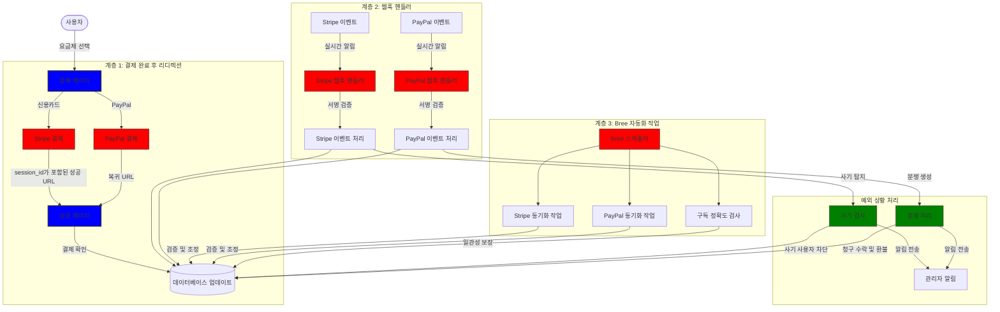
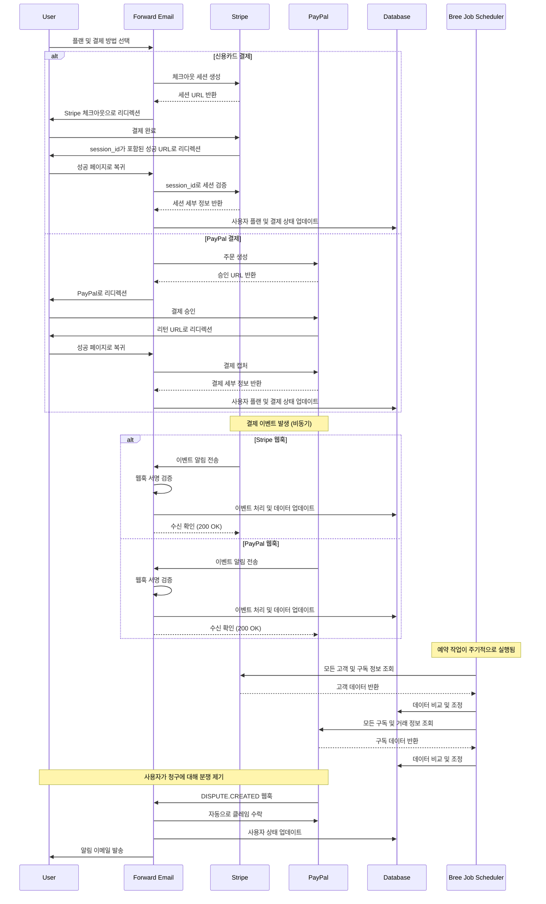
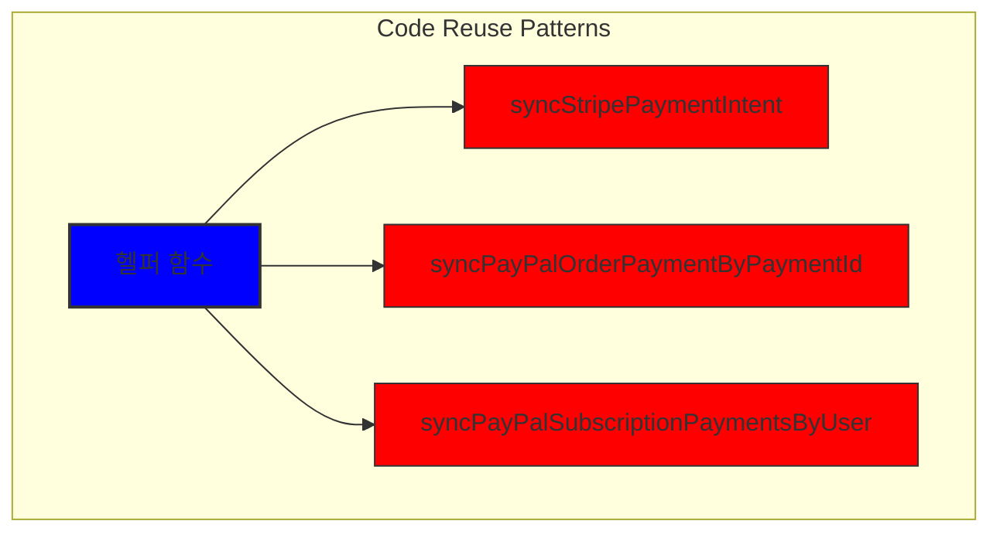
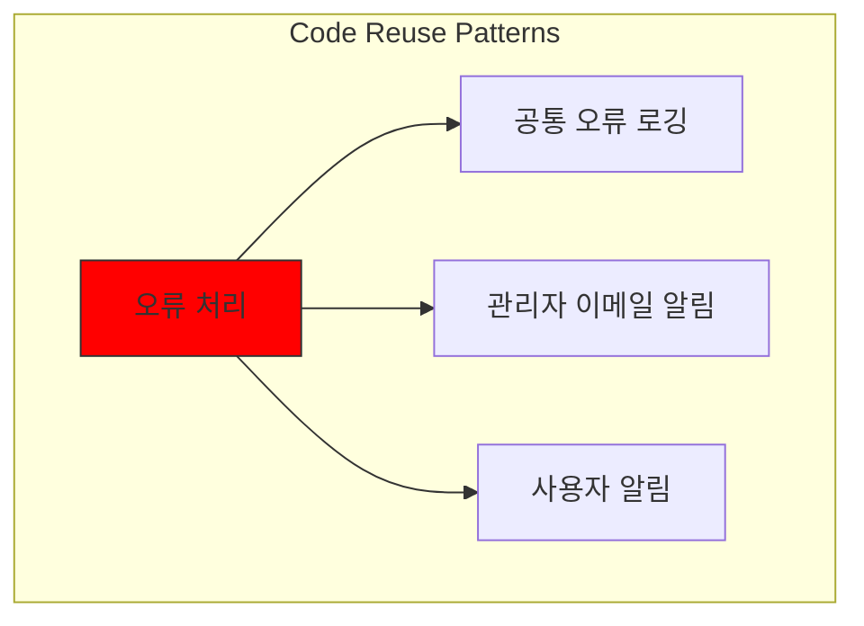
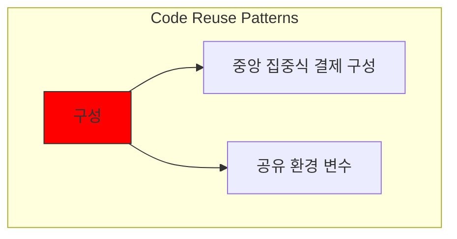
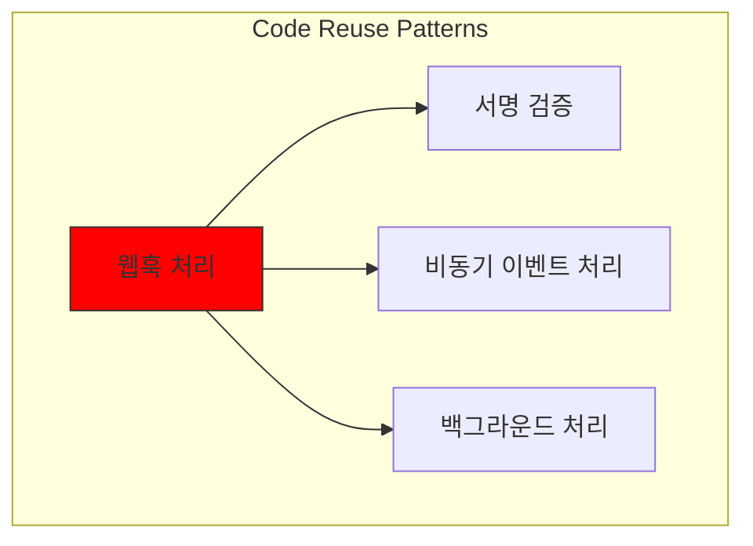
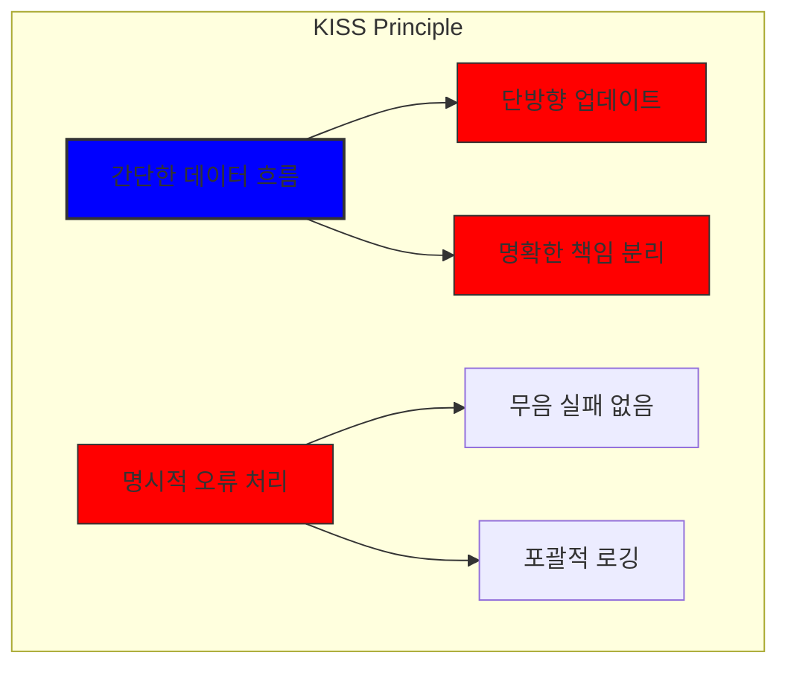

# Stripe와 PayPal로 견고한 결제 시스템을 구축한 방법: 삼중 접근법 {#how-we-built-a-robust-payment-system-with-stripe-and-paypal-a-trifecta-approach}


## 목차 {#table-of-contents}

* [서문](#foreword)
* [도전 과제: 여러 결제 프로세서, 하나의 진실 원천](#the-challenge-multiple-payment-processors-one-source-of-truth)
* [삼중 접근법: 세 가지 신뢰성 계층](#the-trifecta-approach-three-layers-of-reliability)
* [계층 1: 결제 완료 후 리디렉션](#layer-1-post-checkout-redirects)
  * [Stripe 결제 구현](#stripe-checkout-implementation)
  * [PayPal 결제 흐름](#paypal-payment-flow)
* [계층 2: 서명 검증이 포함된 웹훅 핸들러](#layer-2-webhook-handlers-with-signature-verification)
  * [Stripe 웹훅 구현](#stripe-webhook-implementation)
  * [PayPal 웹훅 구현](#paypal-webhook-implementation)
* [계층 3: Bree를 이용한 자동화 작업](#layer-3-automated-jobs-with-bree)
  * [구독 정확도 검사기](#subscription-accuracy-checker)
  * [PayPal 구독 동기화](#paypal-subscription-synchronization)
* [예외 상황 처리](#handling-edge-cases)
  * [사기 탐지 및 방지](#fraud-detection-and-prevention)
  * [분쟁 처리](#dispute-handling)
* [코드 재사용: KISS 및 DRY 원칙](#code-reuse-kiss-and-dry-principles)
* [VISA 구독 요구사항 구현](#visa-subscription-requirements-implementation)
  * [자동 사전 갱신 이메일 알림](#automated-pre-renewal-email-notifications)
  * [예외 상황 처리](#handling-edge-cases-1)
  * [체험 기간 및 구독 조건](#trial-periods-and-subscription-terms)
* [결론: 삼중 접근법의 이점](#conclusion-the-benefits-of-our-trifecta-approach)


## 서문 {#foreword}

Forward Email에서는 항상 신뢰할 수 있고 정확하며 사용자 친화적인 시스템을 만드는 것을 최우선으로 생각해왔습니다. 결제 처리 시스템을 구현할 때, 여러 결제 프로세서를 다루면서도 완벽한 데이터 일관성을 유지할 수 있는 솔루션이 필요하다는 것을 알았습니다. 이 블로그 글에서는 개발팀이 Stripe와 PayPal을 삼중 접근법으로 통합하여 시스템 전반에 걸쳐 1:1 실시간 정확성을 보장한 방법을 자세히 설명합니다.


## 도전 과제: 여러 결제 프로세서, 하나의 진실 원천 {#the-challenge-multiple-payment-processors-one-source-of-truth}

개인정보 보호에 중점을 둔 이메일 서비스로서, 사용자에게 다양한 결제 옵션을 제공하고자 했습니다. 일부는 Stripe를 통한 신용카드 결제의 간편함을 선호하는 반면, 다른 일부는 PayPal이 제공하는 추가 분리 계층을 중요하게 생각합니다. 그러나 여러 결제 프로세서를 지원하는 것은 상당한 복잡성을 수반합니다:

1. 서로 다른 결제 시스템 간에 어떻게 일관된 데이터를 보장할 것인가?
2. 분쟁, 환불 또는 결제 실패와 같은 예외 상황을 어떻게 처리할 것인가?
3. 데이터베이스에서 단일 진실 원천을 어떻게 유지할 것인가?

우리의 해결책은 "삼중 접근법"이라 부르는 세 계층 시스템을 구현하는 것이었습니다. 이 시스템은 중복성을 제공하고 어떤 상황에서도 데이터 일관성을 보장합니다.


## 삼중 접근법: 세 가지 신뢰성 계층 {#the-trifecta-approach-three-layers-of-reliability}

우리의 결제 시스템은 완벽한 데이터 동기화를 보장하기 위해 함께 작동하는 세 가지 핵심 구성 요소로 이루어져 있습니다:

1. **결제 완료 후 리디렉션** - 결제 직후 결제 정보를 캡처
2. **웹훅 핸들러** - 결제 프로세서로부터 실시간 이벤트 처리
3. **자동화 작업** - 주기적으로 결제 데이터를 검증 및 조정

각 구성 요소가 어떻게 함께 작동하는지 살펴보겠습니다.


```mermaid
flowchart TD
    User([사용자]) --> |요금제 선택| Checkout[결제 페이지]

    %% 계층 1: 결제 완료 후 리디렉션
    subgraph "계층 1: 결제 완료 후 리디렉션"
        Checkout --> |신용카드| Stripe[Stripe 결제]
        Checkout --> |PayPal| PayPal[PayPal 결제]

        Stripe --> |session_id가 포함된 성공 URL| SuccessPage[성공 페이지]
        PayPal --> |복귀 URL| SuccessPage

        SuccessPage --> |결제 확인| Database[(데이터베이스 업데이트)]
    end

    %% 계층 2: 웹훅
    subgraph "계층 2: 웹훅 핸들러"
        StripeEvents[Stripe 이벤트] --> |실시간 알림| StripeWebhook[Stripe 웹훅 핸들러]
        PayPalEvents[PayPal 이벤트] --> |실시간 알림| PayPalWebhook[PayPal 웹훅 핸들러]

        StripeWebhook --> |서명 검증| ProcessStripeEvent[Stripe 이벤트 처리]
        PayPalWebhook --> |서명 검증| ProcessPayPalEvent[PayPal 이벤트 처리]

        ProcessStripeEvent --> Database
        ProcessPayPalEvent --> Database
    end

    %% 계층 3: 자동화 작업
    subgraph "계층 3: Bree 자동화 작업"
        BreeScheduler[Bree 스케줄러] --> StripeSync[Stripe 동기화 작업]
        BreeScheduler --> PayPalSync[PayPal 동기화 작업]
        BreeScheduler --> AccuracyCheck[구독 정확도 검사]

        StripeSync --> |검증 및 조정| Database
        PayPalSync --> |검증 및 조정| Database
        AccuracyCheck --> |일관성 보장| Database
    end

    %% 예외 상황
    subgraph "예외 상황 처리"
        ProcessStripeEvent --> |사기 탐지| FraudCheck[사기 검사]
        ProcessPayPalEvent --> |분쟁 생성| DisputeHandler[분쟁 처리]

        FraudCheck --> |사기 사용자 차단| Database
        DisputeHandler --> |청구 수락 및 환불| Database

        FraudCheck --> |알림 전송| AdminNotification[관리자 알림]
        DisputeHandler --> |알림 전송| AdminNotification
    end

    %% 스타일 정의
    classDef primary fill:blue,stroke:#333,stroke-width:2px;
    classDef secondary fill:red,stroke:#333,stroke-width:1px;
    classDef tertiary fill:green,stroke:#333,stroke-width:1px;

    class Checkout,SuccessPage primary;
    class Stripe,PayPal,StripeWebhook,PayPalWebhook,BreeScheduler secondary;
    class FraudCheck,DisputeHandler tertiary;
```
## 레이어 1: 결제 완료 후 리디렉션 {#layer-1-post-checkout-redirects}

우리의 삼중 접근법의 첫 번째 레이어는 사용자가 결제를 완료한 직후에 발생합니다. Stripe와 PayPal 모두 거래 정보를 포함하여 사용자를 우리 사이트로 리디렉션하는 메커니즘을 제공합니다.

### Stripe Checkout 구현 {#stripe-checkout-implementation}

Stripe의 경우, 원활한 결제 경험을 위해 Checkout Sessions API를 사용합니다. 사용자가 플랜을 선택하고 신용카드로 결제하기로 하면, 특정 성공 및 취소 URL과 함께 Checkout Session을 생성합니다:

```javascript
const options = {
  mode: paymentType === 'one-time' ? 'payment' : 'subscription',
  customer: ctx.state.user[config.userFields.stripeCustomerID],
  client_reference_id: reference,
  metadata: {
    plan
  },
  line_items: [
    {
      price,
      quantity: 1,
      description
    }
  ],
  locale: config.STRIPE_LOCALES.has(ctx.locale) ? ctx.locale : 'auto',
  cancel_url: `${config.urls.web}${ctx.path}${
    isMakePayment || isEnableAutoRenew ? '' : `/?plan=${plan}`
  }`,
  success_url: `${config.urls.web}${ctx.path}/?${
    isMakePayment || isEnableAutoRenew ? '' : `plan=${plan}&`
  }session_id={CHECKOUT_SESSION_ID}`,
  allow_promotion_codes: true
};

// 체크아웃 세션을 생성하고 리디렉션
const session = await stripe.checkout.sessions.create(options);
const redirectTo = session.url;
if (ctx.accepts('html')) {
  ctx.status = 303;
  ctx.redirect(redirectTo);
} else {
  ctx.body = { redirectTo };
}
```

여기서 중요한 부분은 `success_url` 매개변수로, 쿼리 매개변수로 `session_id`를 포함합니다. Stripe가 결제 성공 후 사용자를 우리 사이트로 리디렉션할 때, 이 세션 ID를 사용하여 거래를 확인하고 데이터베이스를 적절히 업데이트할 수 있습니다.

### PayPal 결제 흐름 {#paypal-payment-flow}

PayPal의 경우, Orders API를 사용하여 유사한 방식을 적용합니다:

```javascript
const requestBody = {
  intent: 'CAPTURE',
  application_context: {
    cancel_url: `${config.urls.web}${ctx.path}${
      isMakePayment || isEnableAutoRenew ? '' : `/?plan=${plan}`
    }`,
    return_url: `${config.urls.web}${ctx.path}/?plan=${plan}`,
    brand_name: 'Forward Email',
    shipping_preference: 'NO_SHIPPING',
    user_action: 'PAY_NOW'
  },
  payer: {
    email_address: ctx.state.user.email
  },
  purchase_units: [
    {
      reference_id: ctx.state.user.id,
      description,
      custom_id: sku,
      invoice_id: reference,
      soft_descriptor: sku,
      amount: {
        currency_code: 'USD',
        value: price,
        breakdown: {
          item_total: {
            currency_code: 'USD',
            value: price
          }
        }
      },
      items: [
        {
          name,
          description,
          sku,
          unit_amount: {
            currency_code: 'USD',
            value: price
          },
          quantity: '1',
          category: 'DIGITAL_GOODS'
        }
      ]
    }
  ]
};
```

Stripe와 마찬가지로, 결제 후 리디렉션을 처리하기 위해 `return_url`과 `cancel_url` 매개변수를 지정합니다. PayPal이 사용자를 우리 사이트로 리디렉션할 때, 결제 세부 정보를 캡처하고 데이터베이스를 업데이트할 수 있습니다.


```mermaid
sequenceDiagram
    participant User
    participant FE as Forward Email
    participant Stripe
    participant PayPal
    participant DB as Database
    participant Bree as Bree Job Scheduler

    %% 초기 체크아웃 흐름
    User->>FE: 플랜 및 결제 방법 선택

    alt 신용카드 결제
        FE->>Stripe: 체크아웃 세션 생성
        Stripe-->>FE: 세션 URL 반환
        FE->>User: Stripe 체크아웃으로 리디렉션
        User->>Stripe: 결제 완료
        Stripe->>User: session_id가 포함된 성공 URL로 리디렉션
        User->>FE: 성공 페이지로 복귀
        FE->>Stripe: session_id로 세션 검증
        Stripe-->>FE: 세션 세부 정보 반환
        FE->>DB: 사용자 플랜 및 결제 상태 업데이트
    else PayPal 결제
        FE->>PayPal: 주문 생성
        PayPal-->>FE: 승인 URL 반환
        FE->>User: PayPal로 리디렉션
        User->>PayPal: 결제 승인
        PayPal->>User: 리턴 URL로 리디렉션
        User->>FE: 성공 페이지로 복귀
        FE->>PayPal: 결제 캡처
        PayPal-->>FE: 결제 세부 정보 반환
        FE->>DB: 사용자 플랜 및 결제 상태 업데이트
    end

    %% 웹훅 흐름 (비동기)
    Note over Stripe,PayPal: 결제 이벤트 발생 (비동기)

    alt Stripe 웹훅
        Stripe->>FE: 이벤트 알림 전송
        FE->>FE: 웹훅 서명 검증
        FE->>DB: 이벤트 처리 및 데이터 업데이트
        FE-->>Stripe: 수신 확인 (200 OK)
    else PayPal 웹훅
        PayPal->>FE: 이벤트 알림 전송
        FE->>FE: 웹훅 서명 검증
        FE->>DB: 이벤트 처리 및 데이터 업데이트
        FE-->>PayPal: 수신 확인 (200 OK)
    end

    %% Bree 자동화 작업
    Note over Bree: 예약 작업이 주기적으로 실행됨

    Bree->>Stripe: 모든 고객 및 구독 정보 조회
    Stripe-->>Bree: 고객 데이터 반환
    Bree->>DB: 데이터 비교 및 조정

    Bree->>PayPal: 모든 구독 및 거래 정보 조회
    PayPal-->>Bree: 구독 데이터 반환
    Bree->>DB: 데이터 비교 및 조정

    %% 예외 상황: 분쟁 처리
    Note over User,PayPal: 사용자가 청구에 대해 분쟁 제기

    PayPal->>FE: DISPUTE.CREATED 웹훅
    FE->>PayPal: 자동으로 클레임 수락
    FE->>DB: 사용자 상태 업데이트
    FE->>User: 알림 이메일 발송
```
## Layer 2: 서명 검증이 포함된 웹훅 핸들러 {#layer-2-webhook-handlers-with-signature-verification}

포스트 체크아웃 리디렉션은 대부분의 시나리오에서 잘 작동하지만 완벽하지는 않습니다. 사용자가 리디렉션되기 전에 브라우저를 닫거나 네트워크 문제로 인해 리디렉션이 완료되지 않을 수 있습니다. 이럴 때 웹훅이 필요합니다.

Stripe와 PayPal 모두 결제 이벤트에 대한 실시간 알림을 보내는 웹훅 시스템을 제공합니다. 우리는 이러한 알림의 진위를 검증하고 적절히 처리하는 견고한 웹훅 핸들러를 구현했습니다.

### Stripe 웹훅 구현 {#stripe-webhook-implementation}

우리의 Stripe 웹훅 핸들러는 들어오는 웹훅 이벤트의 서명을 검증하여 합법성을 확인합니다:

```javascript
async function webhook(ctx) {
  const sig = ctx.request.get('stripe-signature');
  // throw an error if something was wrong
  if (!isSANB(sig))
    throw Boom.badRequest(ctx.translateError('INVALID_STRIPE_SIGNATURE'));
  const event = stripe.webhooks.constructEvent(
    ctx.request.rawBody,
    sig,
    env.STRIPE_ENDPOINT_SECRET
  );
  // throw an error if something was wrong
  if (!event)
    throw Boom.badRequest(ctx.translateError('INVALID_STRIPE_SIGNATURE'));
  ctx.logger.info('stripe webhook', { event });
  // return a response to acknowledge receipt of the event
  ctx.body = { received: true };
  // run in background
  processEvent(ctx, event)
    .then()
    .catch((err) => {
      ctx.logger.fatal(err, { event });
      // email admin errors
      emailHelper({
        template: 'alert',
        message: {
          to: config.email.message.from,
          subject: `Error with Stripe Webhook (Event ID ${event.id})`
        },
        locals: {
          message: `<pre><code>${safeStringify(
            parseErr(err),
            null,
            2
          )}</code></pre>`
        }
      })
        .then()
        .catch((err) => ctx.logger.fatal(err, { event }));
    });
}
```

`stripe.webhooks.constructEvent` 함수는 엔드포인트 비밀 키를 사용하여 서명을 검증합니다. 서명이 유효하면 웹훅 응답을 차단하지 않도록 비동기적으로 이벤트를 처리합니다.

### PayPal 웹훅 구현 {#paypal-webhook-implementation}

마찬가지로, 우리의 PayPal 웹훅 핸들러는 들어오는 알림의 진위를 검증합니다:

```javascript
async function webhook(ctx) {
  const response = await promisify(
    paypal.notification.webhookEvent.verify,
    paypal.notification.webhookEvent
  )(ctx.request.headers, ctx.request.body, env.PAYPAL_WEBHOOK_ID);
  // throw an error if something was wrong
  if (!_.isObject(response) || response.verification_status !== 'SUCCESS')
    throw Boom.badRequest(ctx.translateError('INVALID_PAYPAL_SIGNATURE'));
  // return a response to acknowledge receipt of the event
  ctx.body = { received: true };
  // run in background
  processEvent(ctx)
    .then()
    .catch((err) => {
      ctx.logger.fatal(err);
      // email admin errors
      emailHelper({
        template: 'alert',
        message: {
          to: config.email.message.from,
          subject: `Error with PayPal Webhook (Event ID ${ctx.request.body.id})`
        },
        locals: {
          message: `<pre><code>${safeStringify(
            parseErr(err),
            null,
            2
          )}</code></pre>`
        }
      })
        .then()
        .catch((err) => ctx.logger.fatal(err));
    });
}
```

두 웹훅 핸들러 모두 동일한 패턴을 따릅니다: 서명을 검증하고, 수신을 확인하며, 이벤트를 비동기적으로 처리합니다. 이를 통해 포스트 체크아웃 리디렉션이 실패하더라도 결제 이벤트를 놓치지 않습니다.


## Layer 3: Bree를 이용한 자동화 작업 {#layer-3-automated-jobs-with-bree}

우리의 삼중 접근법의 마지막 단계는 결제 데이터를 주기적으로 검증하고 조정하는 자동화 작업 세트입니다. 우리는 Node.js용 작업 스케줄러인 Bree를 사용하여 이러한 작업을 정기적으로 실행합니다.

### 구독 정확도 검사기 {#subscription-accuracy-checker}

주요 작업 중 하나는 구독 정확도 검사기로, 데이터베이스가 Stripe의 구독 상태를 정확히 반영하는지 확인합니다:
```javascript
async function mapper(customer) {
  // wait a second to prevent rate limitation error
  await setTimeout(ms('1s'));
  // check for user on our side
  let user = await Users.findOne({
    [config.userFields.stripeCustomerID]: customer.id
  })
    .lean()
    .exec();
  if (!user) return;
  if (user.is_banned) return;

  // if emails did not match
  if (user.email !== customer.email) {
    logger.info(
      `User email ${user.email} did not match customer email ${customer.email} (${customer.id})`
    );
    customer = await stripe.customers.update(customer.id, {
      email: user.email
    });
    logger.info(`Updated user email to match ${user.email}`);
  }

  // check for active subscriptions
  const [activeSubscriptions, trialingSubscriptions] = await Promise.all([
    stripe.subscriptions.list({
      customer: customer.id,
      status: 'active'
    }),
    stripe.subscriptions.list({
      customer: customer.id,
      status: 'trialing'
    })
  ]);

  // Combine active and trialing subscriptions
  let subscriptions = [
    ...activeSubscriptions.data,
    ...trialingSubscriptions.data
  ];

  // Handle edge case: multiple subscriptions for one user
  if (subscriptions.length > 1) {
    await logger.error(
      new Error(
        `We may need to refund: User had multiple subscriptions ${user.email} (${customer.id})`
      )
    );
    await emailHelper({
      template: 'alert',
      message: {
        to: config.email.message.from,
        subject: `User had multiple subscriptions ${user.email}`
      },
      locals: {
        message: `User ${user.email} (${customer.id}) had multiple subscriptions: ${JSON.stringify(
          subscriptions.map((s) => s.id)
        )}`
      }
    });
  }
}
```

This job checks for discrepancies between our database and Stripe, such as mismatched email addresses or multiple active subscriptions. If it finds any issues, it logs them and sends alerts to our admin team.

### PayPal Subscription Synchronization {#paypal-subscription-synchronization}

We have a similar job for PayPal subscriptions:

```javascript
async function syncPayPalSubscriptionPayments() {
  const paypalCustomers = await Users.find({
    $or: [
      {
        [config.userFields.paypalSubscriptionID]: { $exists: true, $ne: null }
      },
      {
        [config.userFields.paypalPayerID]: { $exists: true, $ne: null }
      }
    ]
  })
    // sort by newest customers first
    .sort('-created_at')
    .lean()
    .exec();

  await logger.info(
    `Syncing payments for ${paypalCustomers.length} paypal customers`
  );

  // Process each customer and sync their payments
  const errorEmails = await pReduce(
    paypalCustomers,
    // Implementation details...
  );
}
```

These automated jobs serve as our final safety net, ensuring that our database always reflects the true state of subscriptions and payments in both Stripe and PayPal.


## Handling Edge Cases {#handling-edge-cases}

A robust payment system must handle edge cases gracefully. Let's look at how we handle some common scenarios.

### Fraud Detection and Prevention {#fraud-detection-and-prevention}

We've implemented sophisticated fraud detection mechanisms that automatically identify and handle suspicious payment activities:

```javascript
case 'charge.failed': {
  // Get all failed charges in the last 30 days
  const charges = await stripe.charges.list({
    customer: event.data.object.customer,
    created: {
      gte: dayjs().subtract(1, 'month').unix()
    }
  });

  // Filter for declined charges
  const filtered = charges.data.filter(
    (d) => d.status === 'failed' && d.failure_code === 'card_declined'
  );

  // if not more than 5 then return early
  if (filtered.length < 5) break;

  // Check if user has verified domains
  const count = await Domains.countDocuments({
    members: {
      $elemMatch: {
        user: user._id,
        group: 'admin'
      }
    },
    plan: { $in: ['enhanced_protection', 'team'] },
    has_txt_record: true
  });

  if (!user.is_banned) {
    // If no verified domains, ban the user and refund all charges
    if (count === 0) {
      // Ban the user
      user.is_banned = true;
      await user.save();

      // Refund all successful charges
    }
  }
}
```

이 코드는 여러 번 결제 실패가 발생하고 인증된 도메인이 없는 사용자를 자동으로 차단하는데, 이는 사기 행위의 강력한 지표입니다.

### 분쟁 처리 {#dispute-handling}

사용자가 결제에 대해 이의를 제기하면, 우리는 자동으로 클레임을 수락하고 적절한 조치를 취합니다:

```javascript
case 'CUSTOMER.DISPUTE.CREATED': {
  // 클레임 수락
  const agent = await paypalAgent();
  await agent
    .post(`/v1/customer/disputes/${body.resource.dispute_id}/accept-claim`)
    .send({
      note: '고객에게 전액 환불.'
    });

  // 데이터베이스에서 결제 내역 찾기
  const payment = await Payments.findOne({ $or });
  if (!payment) throw new Error('결제가 존재하지 않습니다');

  const user = await Users.findById(payment.user);
  if (!user) throw new Error('고객에 해당하는 사용자가 존재하지 않습니다');

  // 사용자가 구독 중이면 구독 취소
  if (isSANB(user[config.userFields.paypalSubscriptionID])) {
    try {
      const agent = await paypalAgent();
      await agent.post(
        `/v1/billing/subscriptions/${
          user[config.userFields.paypalSubscriptionID]
        }/cancel`
      );
    } catch (err) {
      // 구독 취소 오류 처리
    }
  }
}
```

이 방법은 분쟁이 비즈니스에 미치는 영향을 최소화하면서도 좋은 고객 경험을 보장합니다.


## 코드 재사용: KISS 및 DRY 원칙 {#code-reuse-kiss-and-dry-principles}

우리 결제 시스템 전반에 걸쳐 KISS(Keep It Simple, Stupid)와 DRY(Don't Repeat Yourself) 원칙을 준수해왔습니다. 다음은 몇 가지 예시입니다:

1. **공유 헬퍼 함수**: 결제 동기화 및 이메일 전송과 같은 공통 작업을 위한 재사용 가능한 헬퍼 함수를 만들었습니다.

2. **일관된 오류 처리**: Stripe와 PayPal 웹훅 핸들러 모두 동일한 패턴으로 오류 처리 및 관리자 알림을 수행합니다.

3. **통합 데이터베이스 스키마**: 결제 상태, 금액, 플랜 정보 등 공통 필드를 포함하여 Stripe와 PayPal 데이터를 모두 수용할 수 있도록 데이터베이스 스키마를 설계했습니다.

4. **중앙 집중식 구성**: 결제 관련 구성은 단일 파일에 중앙 집중화되어 있어 가격 및 제품 정보를 쉽게 업데이트할 수 있습니다.


```mermaid
graph TD
    subgraph "Code Reuse Patterns"
        A[헬퍼 함수] --> B[syncStripePaymentIntent]
        A --> C[syncPayPalOrderPaymentByPaymentId]
        A --> D[syncPayPalSubscriptionPaymentsByUser]
    end

    classDef primary fill:blue,stroke:#333,stroke-width:2px;
    classDef secondary fill:red,stroke:#333,stroke-width:1px;

    class A,P,V primary;
    class B,C,D,E,I,L,Q,R,S,W,X,Y,Z secondary;
```


```mermaid
graph TD
    subgraph "Code Reuse Patterns"
        E[오류 처리] --> F[공통 오류 로깅]
        E --> G[관리자 이메일 알림]
        E --> H[사용자 알림]
    end

    classDef primary fill:blue,stroke:#333,stroke-width:2px;
    classDef secondary fill:red,stroke:#333,stroke-width:1px;

    class A,P,V primary;
    class B,C,D,E,I,L,Q,R,S,W,X,Y,Z secondary;
```


```mermaid
graph TD
    subgraph "Code Reuse Patterns"
        I[구성] --> J[중앙 집중식 결제 구성]
        I --> K[공유 환경 변수]
    end

    classDef primary fill:blue,stroke:#333,stroke-width:2px;
    classDef secondary fill:red,stroke:#333,stroke-width:1px;

    class A,P,V primary;
    class B,C,D,E,I,L,Q,R,S,W,X,Y,Z secondary;
```


```mermaid
graph TD
    subgraph "Code Reuse Patterns"
        L[웹훅 처리] --> M[서명 검증]
        L --> N[비동기 이벤트 처리]
        L --> O[백그라운드 처리]
    end

    classDef primary fill:blue,stroke:#333,stroke-width:2px;
    classDef secondary fill:red,stroke:#333,stroke-width:1px;

    class A,P,V primary;
    class B,C,D,E,I,L,Q,R,S,W,X,Y,Z secondary;
```


```mermaid
graph TD
    subgraph "KISS Principle"
        P[간단한 데이터 흐름] --> Q[단방향 업데이트]
        P --> R[명확한 책임 분리]

        S[명시적 오류 처리] --> T[무음 실패 없음]
        S --> U[포괄적 로깅]
    end

    classDef primary fill:blue,stroke:#333,stroke-width:2px;
    classDef secondary fill:red,stroke:#333,stroke-width:1px;

    class A,P,V primary;
    class B,C,D,E,I,L,Q,R,S,W,X,Y,Z secondary;
```
graph TD
    subgraph "DRY 원칙"
        V[공유 로직] --> W[결제 처리 함수]
        V --> X[이메일 템플릿]
        V --> Y[검증 로직]

        Z[공통 데이터베이스 작업] --> AA[사용자 업데이트]
        Z --> AB[결제 기록]
    end

    classDef primary fill:blue,stroke:#333,stroke-width:2px;
    classDef secondary fill:red,stroke:#333,stroke-width:1px;

    class A,P,V primary;
    class B,C,D,E,I,L,Q,R,S,W,X,Y,Z secondary;
```


## VISA 구독 요구사항 구현 {#visa-subscription-requirements-implementation}

우리의 삼위일체 접근법 외에도, VISA의 구독 요구사항을 준수하면서 사용자 경험을 향상시키기 위해 특정 기능을 구현했습니다. VISA의 주요 요구사항 중 하나는 사용자가 구독 요금이 청구되기 전에, 특히 체험판에서 유료 구독으로 전환될 때 반드시 통지받아야 한다는 점입니다.

### 자동 사전 갱신 이메일 알림 {#automated-pre-renewal-email-notifications}

활성 체험 구독 사용자를 식별하고 첫 결제 전에 알림 이메일을 보내는 자동 시스템을 구축했습니다. 이는 VISA 요구사항을 준수할 뿐만 아니라, 결제 취소를 줄이고 고객 만족도를 높입니다.

이 기능을 구현한 방법은 다음과 같습니다:

```javascript
// 알림을 아직 받지 않은 체험 구독 사용자를 찾기
const users = await Users.find({
  $or: [
    {
      $and: [
        { [config.userFields.stripeSubscriptionID]: { $exists: true } },
        { [config.userFields.stripeTrialSentAt]: { $exists: false } },
        // 이미 결제가 된 구독 제외
        ...(paidStripeSubscriptionIds.length > 0
          ? [
              {
                [config.userFields.stripeSubscriptionID]: {
                  $nin: paidStripeSubscriptionIds
                }
              }
            ]
          : [])
      ]
    },
    {
      $and: [
        { [config.userFields.paypalSubscriptionID]: { $exists: true } },
        { [config.userFields.paypalTrialSentAt]: { $exists: false } },
        // 이미 결제가 된 구독 제외
        ...(paidPayPalSubscriptionIds.length > 0
          ? [
              {
                [config.userFields.paypalSubscriptionID]: {
                  $nin: paidPayPalSubscriptionIds
                }
              }
            ]
          : [])
      ]
    }
  ]
});

// 각 사용자 처리 및 알림 전송
for (const user of users) {
  // 결제 처리자로부터 구독 세부 정보 가져오기
  const subscription = await getSubscriptionDetails(user);

  // 구독 기간 및 빈도 계산
  const duration = getDurationFromPlanId(subscription.plan_id);
  const frequency = getHumanReadableFrequency(duration, user.locale);
  const amount = getPlanAmount(user.plan, duration);

  // 개인화된 이메일을 위한 사용자의 도메인 가져오기
  const domains = await Domains.find({
    'members.user': user._id
  }).sort('name').lean().exec();

  // VISA 준수 알림 이메일 전송
  await emailHelper({
    template: 'visa-trial-subscription-requirement',
    message: {
      to: user.receipt_email || user.email,
      ...(user.receipt_email ? { cc: user.email } : {})
    },
    locals: {
      user,
      firstChargeDate: new Date(subscription.start_time),
      frequency,
      formattedAmount: numeral(amount).format('$0,0,0.00'),
      domains
    }
  });

  // 알림 전송 기록
  await Users.findByIdAndUpdate(user._id, {
    $set: {
      [config.userFields.paypalTrialSentAt]: new Date()
    }
  });
}
```

이 구현은 사용자가 항상 다가오는 결제에 대해 명확한 세부사항과 함께 통지받도록 보장합니다:

1. 첫 결제 시점
2. 이후 결제 빈도 (월간, 연간 등)
3. 청구될 정확한 금액
4. 구독에 포함된 도메인 목록

이 프로세스를 자동화함으로써, 결제 최소 7일 전에 통지를 요구하는 VISA 요구사항을 완벽히 준수하는 동시에 지원 문의를 줄이고 전반적인 사용자 경험을 향상시킵니다.
### 엣지 케이스 처리 {#handling-edge-cases-1}

우리 구현에는 강력한 오류 처리도 포함되어 있습니다. 알림 과정에서 문제가 발생하면, 시스템이 자동으로 팀에 경고를 보냅니다:

```javascript
try {
  await mapper(user);
} catch (err) {
  logger.error(err);

  // 관리자에게 경고 전송
  await emailHelper({
    template: 'alert',
    message: {
      to: config.email.message.from,
      subject: 'VISA 체험 구독 요구사항 오류'
    },
    locals: {
      message: `<pre><code>${safeStringify(
        parseErr(err),
        null,
        2
      )}</code></pre>`
    }
  });
}
```

이로 인해 알림 시스템에 문제가 있더라도, 우리 팀이 신속하게 대응하여 VISA 요구사항을 준수할 수 있습니다.

VISA 구독 알림 시스템은 결제 인프라를 준수와 사용자 경험을 모두 고려하여 구축한 또 다른 예로, 신뢰할 수 있고 투명한 결제 처리를 보장하는 우리의 삼중 접근법을 보완합니다.

### 체험 기간 및 구독 조건 {#trial-periods-and-subscription-terms}

기존 플랜에서 자동 갱신을 활성화하는 사용자에 대해, 현재 플랜이 만료될 때까지 요금이 청구되지 않도록 적절한 체험 기간을 계산합니다:

```javascript
if (
  isEnableAutoRenew &&
  dayjs(ctx.state.user[config.userFields.planExpiresAt]).isAfter(
    dayjs()
  )
) {
  const hours = dayjs(
    ctx.state.user[config.userFields.planExpiresAt]
  ).diff(dayjs(), 'hours');

  // 체험 기간 계산 처리
}
```

또한 구독 조건에 대한 명확한 정보를 제공하며, 청구 주기와 취소 정책을 포함하고, 각 구독에 상세한 메타데이터를 포함하여 적절한 추적 및 관리를 보장합니다.


## 결론: 우리의 삼중 접근법의 이점 {#conclusion-the-benefits-of-our-trifecta-approach}

우리의 결제 처리 삼중 접근법은 다음과 같은 주요 이점을 제공합니다:

1. **신뢰성**: 세 단계의 결제 검증을 구현하여 결제가 누락되거나 잘못 처리되는 일이 없도록 보장합니다.

2. **정확성**: 데이터베이스는 Stripe와 PayPal 양쪽의 구독 및 결제 상태를 항상 정확하게 반영합니다.

3. **유연성**: 사용자는 시스템의 신뢰성을 저해하지 않고 선호하는 결제 수단을 선택할 수 있습니다.

4. **견고성**: 네트워크 장애부터 사기 행위까지 엣지 케이스를 원활하게 처리합니다.

여러 결제 프로세서를 지원하는 결제 시스템을 구현 중이라면, 이 삼중 접근법을 강력히 추천합니다. 초기 개발 노력이 더 필요하지만, 신뢰성과 정확성 측면에서 장기적인 이점이 충분히 가치 있습니다.

Forward Email 및 개인정보 보호 중심 이메일 서비스에 대한 자세한 내용은 [웹사이트](https://forwardemail.net)를 방문하세요.

<!-- *Keywords: payment processing, Stripe integration, PayPal integration, webhook handling, payment synchronization, subscription management, fraud prevention, dispute handling, Node.js payment system, multi-processor payment system, payment gateway integration, real-time payment verification, payment data consistency, subscription billing, payment security, payment automation, payment webhooks, payment reconciliation, payment edge cases, payment error handling, VISA subscription requirements, pre-renewal notifications, subscription compliance* -->
