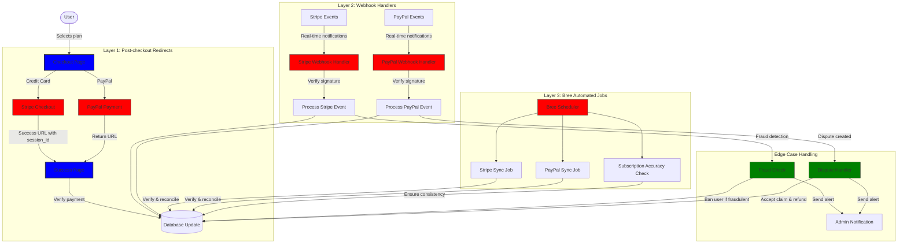
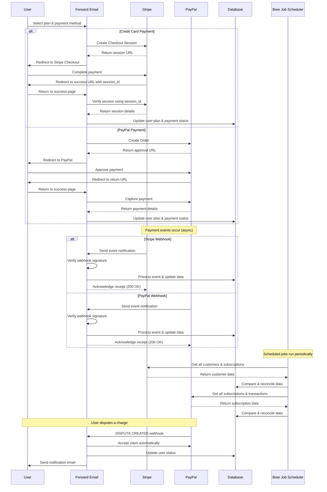
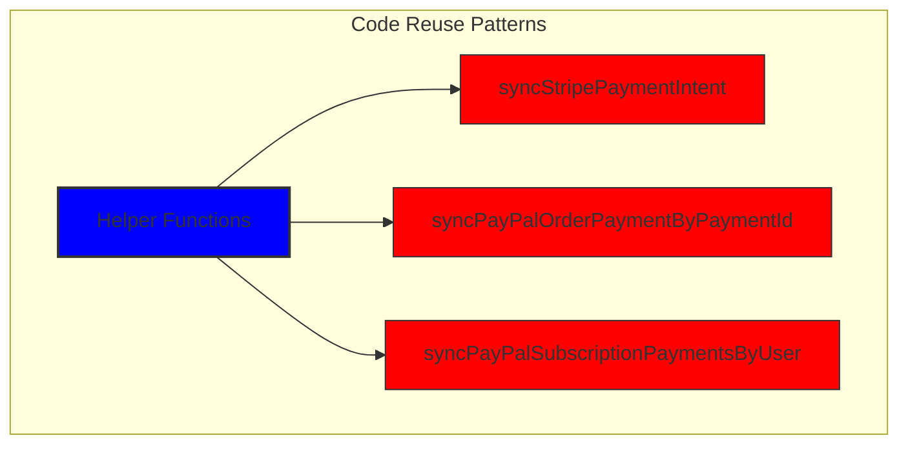
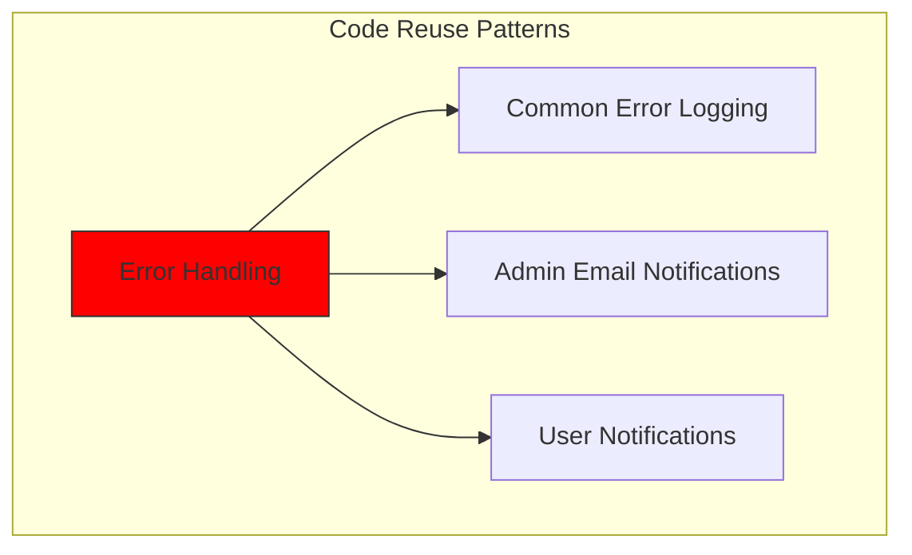
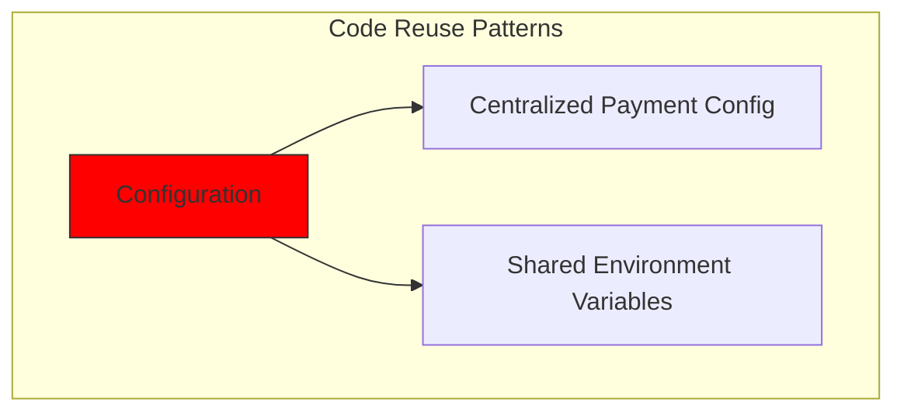
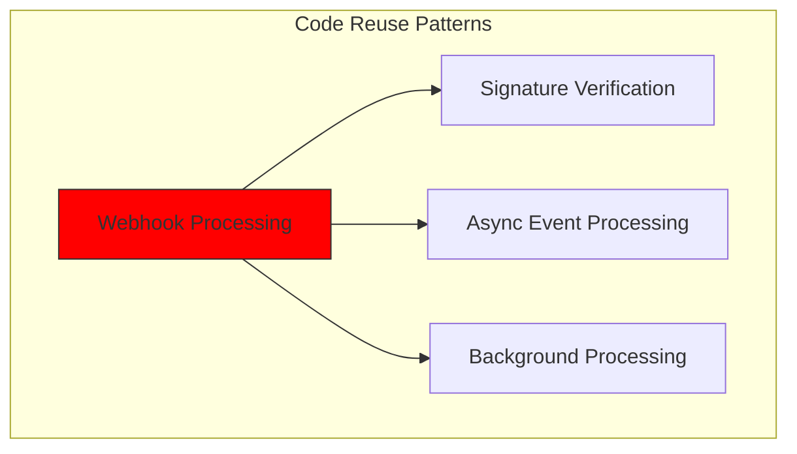
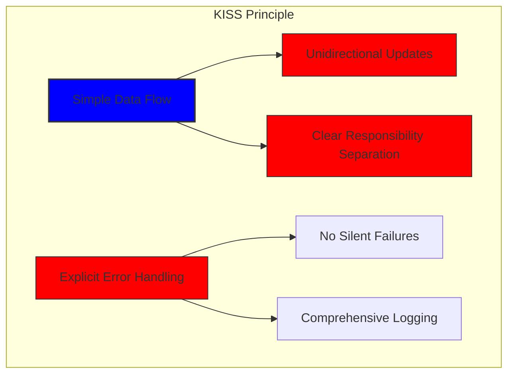
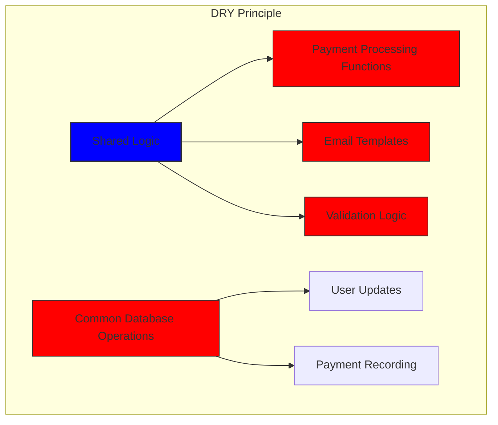

# Hoe we een robuust betalingssysteem hebben gebouwd met Stripe en PayPal: een trifecta-aanpak {#how-we-built-a-robust-payment-system-with-stripe-and-paypal-a-trifecta-approach}


## Inhoudsopgave {#table-of-contents}

* [Voorwoord](#foreword)
* [De uitdaging: meerdere betalingsverwerkers, één bron van waarheid](#the-challenge-multiple-payment-processors-one-source-of-truth)
* [De Trifecta-aanpak: drie lagen betrouwbaarheid](#the-trifecta-approach-three-layers-of-reliability)
* [Laag 1: Post-Checkout Redirects](#layer-1-post-checkout-redirects)
  * [Implementatie van Stripe Checkout](#stripe-checkout-implementation)
  * [PayPal-betalingsstroom](#paypal-payment-flow)
* [Laag 2: Webhook-handlers met handtekeningverificatie](#layer-2-webhook-handlers-with-signature-verification)
  * [Stripe Webhook-implementatie](#stripe-webhook-implementation)
  * [PayPal Webhook-implementatie](#paypal-webhook-implementation)
* [Laag 3: Geautomatiseerde taken met Bree](#layer-3-automated-jobs-with-bree)
  * [Abonnementsnauwkeurigheidscontrole](#subscription-accuracy-checker)
  * [PayPal-abonnementsynchronisatie](#paypal-subscription-synchronization)
* [Omgaan met randgevallen](#handling-edge-cases)
  * [Fraudedetectie en -preventie](#fraud-detection-and-prevention)
  * [Geschillenbehandeling](#dispute-handling)
* [Code hergebruik: KISS- en DRY-principes](#code-reuse-kiss-and-dry-principles)
* [Implementatie van VISA-abonnementsvereisten](#visa-subscription-requirements-implementation)
  * [Geautomatiseerde e-mailmeldingen vóór verlenging](#automated-pre-renewal-email-notifications)
  * [Omgaan met randgevallen](#handling-edge-cases-1)
  * [Proefperiodes en abonnementsvoorwaarden](#trial-periods-and-subscription-terms)
* [Conclusie: de voordelen van onze trifecta-aanpak](#conclusion-the-benefits-of-our-trifecta-approach)

## Voorwoord {#foreword}

Bij Forward Email hebben we altijd prioriteit gegeven aan het creëren van systemen die betrouwbaar, nauwkeurig en gebruiksvriendelijk zijn. Toen we ons betalingsverwerkingssysteem implementeerden, wisten we dat we een oplossing nodig hadden die meerdere betalingsverwerkers aankon en tegelijkertijd perfecte dataconsistentie behield. Deze blogpost beschrijft hoe ons ontwikkelteam zowel Stripe als PayPal integreerde met behulp van een trifecta-aanpak die een 1:1 realtime nauwkeurigheid in ons hele systeem garandeert.

## De uitdaging: meerdere betalingsverwerkers, één bron van waarheid {#the-challenge-multiple-payment-processors-one-source-of-truth}

Als privacygerichte e-mailservice wilden we onze gebruikers betaalopties bieden. Sommigen geven de voorkeur aan de eenvoud van creditcardbetalingen via Stripe, terwijl anderen de extra scheidingslaag waarderen die PayPal biedt. De ondersteuning van meerdere betalingsverwerkers brengt echter aanzienlijke complexiteit met zich mee:

1. Hoe zorgen we voor consistente gegevens in verschillende betalingssystemen?
2. Hoe gaan we om met grensgevallen zoals geschillen, terugbetalingen of mislukte betalingen?
3. Hoe zorgen we voor één enkele bron van waarheid in onze database?

Onze oplossing was om te implementeren wat wij de "trifecta-aanpak" noemen: een systeem met drie lagen dat redundantie biedt en zorgt voor consistente gegevens, wat er ook gebeurt.

## De Trifecta-benadering: drie lagen betrouwbaarheid {#the-trifecta-approach-three-layers-of-reliability}

Ons betalingssysteem bestaat uit drie cruciale componenten die samenwerken om een perfecte gegevenssynchronisatie te garanderen:

1. **Post-checkout redirects** - Betalingsgegevens direct na het afrekenen vastleggen
2. **Webhook handlers** - Realtime gebeurtenissen van betalingsverwerkers verwerken
3. **Geautomatiseerde taken** - Betalingsgegevens periodiek verifiëren en afstemmen

Laten we eens dieper ingaan op elk onderdeel en hoe ze samenwerken.



## Laag 1: Post-Checkout-omleidingen {#layer-1-post-checkout-redirects}

De eerste laag van onze trifecta-aanpak vindt plaats direct nadat een gebruiker een betaling heeft voltooid. Zowel Stripe als PayPal bieden mechanismen om gebruikers met transactiegegevens terug te leiden naar onze site.

### Stripe Checkout-implementatie {#stripe-checkout-implementation}

Voor Stripe gebruiken we hun Checkout Sessions API om een naadloze betaalervaring te creëren. Wanneer een gebruiker een abonnement selecteert en ervoor kiest om met een creditcard te betalen, creëren we een Checkout Session met specifieke succes- en annulerings-URL's:

```javascript
const options = {
  mode: paymentType === 'one-time' ? 'payment' : 'subscription',
  customer: ctx.state.user[config.userFields.stripeCustomerID],
  client_reference_id: reference,
  metadata: {
    plan
  },
  line_items: [
    {
      price,
      quantity: 1,
      description
    }
  ],
  locale: config.STRIPE_LOCALES.has(ctx.locale) ? ctx.locale : 'auto',
  cancel_url: `${config.urls.web}${ctx.path}${
    isMakePayment || isEnableAutoRenew ? '' : `/?plan=${plan}`
  }`,
  success_url: `${config.urls.web}${ctx.path}/?${
    isMakePayment || isEnableAutoRenew ? '' : `plan=${plan}&`
  }session_id={CHECKOUT_SESSION_ID}`,
  allow_promotion_codes: true
};

// Create the checkout session and redirect
const session = await stripe.checkout.sessions.create(options);
const redirectTo = session.url;
if (ctx.accepts('html')) {
  ctx.status = 303;
  ctx.redirect(redirectTo);
} else {
  ctx.body = { redirectTo };
}
```

Het cruciale onderdeel hier is de parameter `success_url`, die `session_id` als queryparameter bevat. Wanneer Stripe de gebruiker na een succesvolle betaling terugstuurt naar onze site, kunnen we deze sessie-ID gebruiken om de transactie te verifiëren en onze database dienovereenkomstig bij te werken.

### PayPal-betalingsstroom {#paypal-payment-flow}

Voor PayPal gebruiken we een vergelijkbare aanpak met hun Orders API:

```javascript
const requestBody = {
  intent: 'CAPTURE',
  application_context: {
    cancel_url: `${config.urls.web}${ctx.path}${
      isMakePayment || isEnableAutoRenew ? '' : `/?plan=${plan}`
    }`,
    return_url: `${config.urls.web}${ctx.path}/?plan=${plan}`,
    brand_name: 'Forward Email',
    shipping_preference: 'NO_SHIPPING',
    user_action: 'PAY_NOW'
  },
  payer: {
    email_address: ctx.state.user.email
  },
  purchase_units: [
    {
      reference_id: ctx.state.user.id,
      description,
      custom_id: sku,
      invoice_id: reference,
      soft_descriptor: sku,
      amount: {
        currency_code: 'USD',
        value: price,
        breakdown: {
          item_total: {
            currency_code: 'USD',
            value: price
          }
        }
      },
      items: [
        {
          name,
          description,
          sku,
          unit_amount: {
            currency_code: 'USD',
            value: price
          },
          quantity: '1',
          category: 'DIGITAL_GOODS'
        }
      ]
    }
  ]
};
```

Net als bij Stripe specificeren we de parameters `return_url` en `cancel_url` om doorverwijzingen na betaling te verwerken. Wanneer PayPal de gebruiker terugverwijst naar onze site, kunnen we de betalingsgegevens vastleggen en onze database bijwerken.



## Laag 2: Webhook-handlers met handtekeningverificatie {#layer-2-webhook-handlers-with-signature-verification}

Hoewel omleidingen na het afrekenen in de meeste gevallen goed werken, zijn ze niet waterdicht. Gebruikers sluiten mogelijk hun browser voordat ze worden omgeleid, of netwerkproblemen kunnen ervoor zorgen dat de omleiding niet wordt voltooid. Daar komen webhooks om de hoek kijken.

Zowel Stripe als PayPal bieden webhooksystemen die realtime meldingen over betalingsgebeurtenissen versturen. We hebben robuuste webhookhandlers geïmplementeerd die de authenticiteit van deze meldingen verifiëren en ze dienovereenkomstig verwerken.

### Stripe Webhook-implementatie {#stripe-webhook-implementation}

Onze Stripe-webhook-handler controleert de handtekening van binnenkomende webhook-gebeurtenissen om te garanderen dat ze legitiem zijn:

```javascript
async function webhook(ctx) {
  const sig = ctx.request.get('stripe-signature');
  // throw an error if something was wrong
  if (!isSANB(sig))
    throw Boom.badRequest(ctx.translateError('INVALID_STRIPE_SIGNATURE'));
  const event = stripe.webhooks.constructEvent(
    ctx.request.rawBody,
    sig,
    env.STRIPE_ENDPOINT_SECRET
  );
  // throw an error if something was wrong
  if (!event)
    throw Boom.badRequest(ctx.translateError('INVALID_STRIPE_SIGNATURE'));
  ctx.logger.info('stripe webhook', { event });
  // return a response to acknowledge receipt of the event
  ctx.body = { received: true };
  // run in background
  processEvent(ctx, event)
    .then()
    .catch((err) => {
      ctx.logger.fatal(err, { event });
      // email admin errors
      emailHelper({
        template: 'alert',
        message: {
          to: config.email.message.from,
          subject: `Error with Stripe Webhook (Event ID ${event.id})`
        },
        locals: {
          message: `<pre><code>${safeStringify(
            parseErr(err),
            null,
            2
          )}</code></pre>`
        }
      })
        .then()
        .catch((err) => ctx.logger.fatal(err, { event }));
    });
}
```

De functie `stripe.webhooks.constructEvent` verifieert de handtekening met behulp van ons eindpuntgeheim. Als de handtekening geldig is, verwerken we de gebeurtenis asynchroon om te voorkomen dat de webhookrespons wordt geblokkeerd.

### PayPal Webhook-implementatie {#paypal-webhook-implementation}

Op dezelfde manier verifieert onze PayPal webhook-handler de authenticiteit van binnenkomende meldingen:

```javascript
async function webhook(ctx) {
  const response = await promisify(
    paypal.notification.webhookEvent.verify,
    paypal.notification.webhookEvent
  )(ctx.request.headers, ctx.request.body, env.PAYPAL_WEBHOOK_ID);
  // throw an error if something was wrong
  if (!_.isObject(response) || response.verification_status !== 'SUCCESS')
    throw Boom.badRequest(ctx.translateError('INVALID_PAYPAL_SIGNATURE'));
  // return a response to acknowledge receipt of the event
  ctx.body = { received: true };
  // run in background
  processEvent(ctx)
    .then()
    .catch((err) => {
      ctx.logger.fatal(err);
      // email admin errors
      emailHelper({
        template: 'alert',
        message: {
          to: config.email.message.from,
          subject: `Error with PayPal Webhook (Event ID ${ctx.request.body.id})`
        },
        locals: {
          message: `<pre><code>${safeStringify(
            parseErr(err),
            null,
            2
          )}</code></pre>`
        }
      })
        .then()
        .catch((err) => ctx.logger.fatal(err));
    });
}
```

Beide webhook-handlers volgen hetzelfde patroon: ze verifiëren de handtekening, bevestigen de ontvangst en verwerken de gebeurtenis asynchroon. Dit zorgt ervoor dat we nooit een betalingsgebeurtenis missen, zelfs niet als de omleiding na het afrekenen mislukt.

## Laag 3: Geautomatiseerde taken met Bree {#layer-3-automated-jobs-with-bree}

De laatste laag van onze trifecta-aanpak bestaat uit een reeks geautomatiseerde taken die periodiek betalingsgegevens verifiëren en afstemmen. We gebruiken Bree, een taakplanner voor Node.js, om deze taken met regelmatige tussenpozen uit te voeren.

### Abonnementsnauwkeurigheidscontrole {#subscription-accuracy-checker}

Een van onze belangrijkste taken is het controleren van de nauwkeurigheid van abonnementen. Hiermee zorgen we ervoor dat onze database de abonnementsstatus in Stripe nauwkeurig weergeeft:

```javascript
async function mapper(customer) {
  // wait a second to prevent rate limitation error
  await setTimeout(ms('1s'));
  // check for user on our side
  let user = await Users.findOne({
    [config.userFields.stripeCustomerID]: customer.id
  })
    .lean()
    .exec();
  if (!user) return;
  if (user.is_banned) return;

  // if emails did not match
  if (user.email !== customer.email) {
    logger.info(
      `User email ${user.email} did not match customer email ${customer.email} (${customer.id})`
    );
    customer = await stripe.customers.update(customer.id, {
      email: user.email
    });
    logger.info(`Updated user email to match ${user.email}`);
  }

  // check for active subscriptions
  const [activeSubscriptions, trialingSubscriptions] = await Promise.all([
    stripe.subscriptions.list({
      customer: customer.id,
      status: 'active'
    }),
    stripe.subscriptions.list({
      customer: customer.id,
      status: 'trialing'
    })
  ]);

  // Combine active and trialing subscriptions
  let subscriptions = [
    ...activeSubscriptions.data,
    ...trialingSubscriptions.data
  ];

  // Handle edge case: multiple subscriptions for one user
  if (subscriptions.length > 1) {
    await logger.error(
      new Error(
        `We may need to refund: User had multiple subscriptions ${user.email} (${customer.id})`
      )
    );
    await emailHelper({
      template: 'alert',
      message: {
        to: config.email.message.from,
        subject: `User had multiple subscriptions ${user.email}`
      },
      locals: {
        message: `User ${user.email} (${customer.id}) had multiple subscriptions: ${JSON.stringify(
          subscriptions.map((s) => s.id)
        )}`
      }
    });
  }
}
```

Deze taak controleert op discrepanties tussen onze database en Stripe, zoals niet-overeenkomende e-mailadressen of meerdere actieve abonnementen. Als er problemen worden gevonden, worden deze geregistreerd en worden er meldingen naar ons beheerdersteam gestuurd.

### PayPal-abonnementssynchronisatie {#paypal-subscription-synchronization}

Voor PayPal-abonnementen hebben we een soortgelijke taak:

```javascript
async function syncPayPalSubscriptionPayments() {
  const paypalCustomers = await Users.find({
    $or: [
      {
        [config.userFields.paypalSubscriptionID]: { $exists: true, $ne: null }
      },
      {
        [config.userFields.paypalPayerID]: { $exists: true, $ne: null }
      }
    ]
  })
    // sort by newest customers first
    .sort('-created_at')
    .lean()
    .exec();

  await logger.info(
    `Syncing payments for ${paypalCustomers.length} paypal customers`
  );

  // Process each customer and sync their payments
  const errorEmails = await pReduce(
    paypalCustomers,
    // Implementation details...
  );
}
```

Deze geautomatiseerde taken vormen ons laatste vangnet en zorgen ervoor dat onze database altijd de werkelijke status van abonnementen en betalingen in zowel Stripe als PayPal weergeeft.

## Randgevallen afhandelen {#handling-edge-cases}

Een robuust betalingssysteem moet randgevallen soepel afhandelen. Laten we eens kijken hoe we met enkele veelvoorkomende scenario's omgaan.

### Fraudedetectie en -preventie {#fraud-detection-and-prevention}

We hebben geavanceerde fraudedetectiemechanismen geïmplementeerd die automatisch verdachte betalingsactiviteiten identificeren en afhandelen:

```javascript
case 'charge.failed': {
  // Get all failed charges in the last 30 days
  const charges = await stripe.charges.list({
    customer: event.data.object.customer,
    created: {
      gte: dayjs().subtract(1, 'month').unix()
    }
  });

  // Filter for declined charges
  const filtered = charges.data.filter(
    (d) => d.status === 'failed' && d.failure_code === 'card_declined'
  );

  // if not more than 5 then return early
  if (filtered.length < 5) break;

  // Check if user has verified domains
  const count = await Domains.countDocuments({
    members: {
      $elemMatch: {
        user: user._id,
        group: 'admin'
      }
    },
    plan: { $in: ['enhanced_protection', 'team'] },
    has_txt_record: true
  });

  if (!user.is_banned) {
    // If no verified domains, ban the user and refund all charges
    if (count === 0) {
      // Ban the user
      user.is_banned = true;
      await user.save();

      // Refund all successful charges
    }
  }
}
```

Met deze code worden gebruikers met meerdere mislukte betalingen en zonder geverifieerde domeinnamen automatisch geblokkeerd. Dit is een sterke indicator van frauduleuze activiteiten.

### Geschillenbehandeling {#dispute-handling}

Wanneer een gebruiker een betaling betwist, accepteren we de claim automatisch en ondernemen we passende actie:

```javascript
case 'CUSTOMER.DISPUTE.CREATED': {
  // accept claim
  const agent = await paypalAgent();
  await agent
    .post(`/v1/customer/disputes/${body.resource.dispute_id}/accept-claim`)
    .send({
      note: 'Full refund to the customer.'
    });

  // Find the payment in our database
  const payment = await Payments.findOne({ $or });
  if (!payment) throw new Error('Payment does not exist');

  const user = await Users.findById(payment.user);
  if (!user) throw new Error('User did not exist for customer');

  // Cancel the user's subscription if they have one
  if (isSANB(user[config.userFields.paypalSubscriptionID])) {
    try {
      const agent = await paypalAgent();
      await agent.post(
        `/v1/billing/subscriptions/${
          user[config.userFields.paypalSubscriptionID]
        }/cancel`
      );
    } catch (err) {
      // Handle subscription cancellation errors
    }
  }
}
```

Deze aanpak minimaliseert de impact van geschillen op onze bedrijfsvoering en zorgt tegelijkertijd voor een goede klantervaring.

## Code hergebruik: KISS en DRY-principes {#code-reuse-kiss-and-dry-principles}

In ons betalingssysteem hanteren we de principes KISS (Keep It Simple, Stupid) en DRY (Don't Repeat Yourself). Hier zijn enkele voorbeelden:

1. **Gedeelde hulpfuncties**: We hebben herbruikbare hulpfuncties gemaakt voor veelvoorkomende taken zoals het synchroniseren van betalingen en het verzenden van e-mails.

2. **Consistente foutverwerking**: Zowel Stripe- als PayPal-webhook-handlers gebruiken hetzelfde patroon voor foutverwerking en beheerdersmeldingen.

3. **Unified Database Schema**: Ons databaseschema is ontworpen om zowel Stripe- als PayPal-gegevens te verwerken, met gemeenschappelijke velden voor betalingsstatus, bedrag en planinformatie.

4. **Gecentraliseerde configuratie**: Betalingsgerelateerde configuratie is gecentraliseerd in één enkel bestand, waardoor u eenvoudig prijs- en productinformatie kunt bijwerken.













## Implementatie van VISA-abonnementsvereisten {#visa-subscription-requirements-implementation}

Naast onze trifecta-aanpak hebben we specifieke functies geïmplementeerd om te voldoen aan de abonnementsvereisten van VISA en tegelijkertijd de gebruikerservaring te verbeteren. Een belangrijke vereiste van VISA is dat gebruikers op de hoogte moeten worden gesteld voordat ze een abonnement in rekening worden gebracht, vooral bij de overstap van een proefabonnement naar een betaald abonnement.

### Geautomatiseerde e-mailmeldingen vóór verlenging {#automated-pre-renewal-email-notifications}

We hebben een geautomatiseerd systeem ontwikkeld dat gebruikers met actieve proefabonnementen identificeert en hen een e-mailmelding stuurt voordat hun eerste betaling plaatsvindt. Dit zorgt er niet alleen voor dat we voldoen aan de VISA-vereisten, maar vermindert ook het aantal terugboekingen en verbetert de klanttevredenheid.

Zo hebben we deze functie geïmplementeerd:

```javascript
// Find users with trial subscriptions who haven't received a notification yet
const users = await Users.find({
  $or: [
    {
      $and: [
        { [config.userFields.stripeSubscriptionID]: { $exists: true } },
        { [config.userFields.stripeTrialSentAt]: { $exists: false } },
        // Exclude subscriptions that have already had payments
        ...(paidStripeSubscriptionIds.length > 0
          ? [
              {
                [config.userFields.stripeSubscriptionID]: {
                  $nin: paidStripeSubscriptionIds
                }
              }
            ]
          : [])
      ]
    },
    {
      $and: [
        { [config.userFields.paypalSubscriptionID]: { $exists: true } },
        { [config.userFields.paypalTrialSentAt]: { $exists: false } },
        // Exclude subscriptions that have already had payments
        ...(paidPayPalSubscriptionIds.length > 0
          ? [
              {
                [config.userFields.paypalSubscriptionID]: {
                  $nin: paidPayPalSubscriptionIds
                }
              }
            ]
          : [])
      ]
    }
  ]
});

// Process each user and send notification
for (const user of users) {
  // Get subscription details from payment processor
  const subscription = await getSubscriptionDetails(user);

  // Calculate subscription duration and frequency
  const duration = getDurationFromPlanId(subscription.plan_id);
  const frequency = getHumanReadableFrequency(duration, user.locale);
  const amount = getPlanAmount(user.plan, duration);

  // Get user's domains for personalized email
  const domains = await Domains.find({
    'members.user': user._id
  }).sort('name').lean().exec();

  // Send VISA-compliant notification email
  await emailHelper({
    template: 'visa-trial-subscription-requirement',
    message: {
      to: user.receipt_email || user.email,
      ...(user.receipt_email ? { cc: user.email } : {})
    },
    locals: {
      user,
      firstChargeDate: new Date(subscription.start_time),
      frequency,
      formattedAmount: numeral(amount).format('$0,0,0.00'),
      domains
    }
  });

  // Record that notification was sent
  await Users.findByIdAndUpdate(user._id, {
    $set: {
      [config.userFields.paypalTrialSentAt]: new Date()
    }
  });
}
```

Dankzij deze implementatie worden gebruikers altijd op de hoogte gebracht van aankomende kosten, met duidelijke informatie over:

1. Wanneer de eerste afschrijving plaatsvindt
2. De frequentie van toekomstige afschrijvingen (maandelijks, jaarlijks, enz.)
3. Het exacte bedrag dat in rekening wordt gebracht
4. Welke domeinen onder hun abonnement vallen

Door dit proces te automatiseren, voldoen we volledig aan de eisen van VISA (die vereisen dat er minimaal 7 dagen voor kosten een melding wordt gedaan), terwijl we tegelijkertijd het aantal ondersteuningsvragen beperken en de algehele gebruikerservaring verbeteren.

### Randgevallen afhandelen {#handling-edge-cases-1}

Onze implementatie omvat ook robuuste foutafhandeling. Als er iets misgaat tijdens het meldingsproces, waarschuwt ons systeem automatisch ons team:

```javascript
try {
  await mapper(user);
} catch (err) {
  logger.error(err);

  // Send alert to administrators
  await emailHelper({
    template: 'alert',
    message: {
      to: config.email.message.from,
      subject: 'VISA Trial Subscription Requirement Error'
    },
    locals: {
      message: `<pre><code>${safeStringify(
        parseErr(err),
        null,
        2
      )}</code></pre>`
    }
  });
}
```

Zo weet u zeker dat ons team eventuele problemen met het meldingssysteem snel kan oplossen en kan blijven voldoen aan de vereisten van VISA.

Het VISA-abonnementmeldingssysteem is een ander voorbeeld van hoe wij onze betalingsinfrastructuur hebben opgebouwd met zowel naleving als gebruikerservaring in gedachten. Het vormt een aanvulling op onze trifecta-aanpak om betrouwbare, transparante betalingsverwerking te garanderen.

### Proefperiodes en abonnementsvoorwaarden {#trial-periods-and-subscription-terms}

Voor gebruikers die automatisch verlengen inschakelen voor bestaande abonnementen, berekenen we de juiste proefperiode om ervoor te zorgen dat er niets in rekening wordt gebracht totdat hun huidige abonnement verloopt:

```javascript
if (
  isEnableAutoRenew &&
  dayjs(ctx.state.user[config.userFields.planExpiresAt]).isAfter(
    dayjs()
  )
) {
  const hours = dayjs(
    ctx.state.user[config.userFields.planExpiresAt]
  ).diff(dayjs(), 'hours');

  // Handle trial period calculation
}
```

Daarnaast verstrekken we duidelijke informatie over de abonnementsvoorwaarden, zoals de factureringsfrequentie en het annuleringsbeleid. Ook voegen we bij elk abonnement gedetailleerde metagegevens toe om een goede traceerbaarheid en beheer te garanderen.

## Conclusie: de voordelen van onze trifecta-aanpak {#conclusion-the-benefits-of-our-trifecta-approach}

Onze trifecta-aanpak voor betalingsverwerking heeft ons verschillende belangrijke voordelen opgeleverd:

1. **Betrouwbaarheid**: Door het implementeren van drie lagen van betalingsverificatie, garanderen wij dat er geen enkele betaling over het hoofd wordt gezien of onjuist wordt verwerkt.

2. **Nauwkeurigheid**: Onze database geeft altijd de werkelijke status van abonnementen en betalingen weer in zowel Stripe als PayPal.

3. **Flexibiliteit**: Gebruikers kunnen hun favoriete betaalmethode kiezen zonder dat dit ten koste gaat van de betrouwbaarheid van ons systeem.

4. **Robuustheid**: Ons systeem gaat soepel om met grensgevallen, van netwerkstoringen tot frauduleuze activiteiten.

Als u een betalingssysteem implementeert dat meerdere processors ondersteunt, raden we deze trifecta-aanpak ten zeerste aan. Het vereist meer initiële ontwikkelinspanning, maar de voordelen op de lange termijn op het gebied van betrouwbaarheid en nauwkeurigheid zijn het zeker waard.

Bezoek onze website [website](https://forwardemail.net) voor meer informatie over Forward Email en onze op privacy gerichte e-mailservices.

<!-- *Trefwoorden: betalingsverwerking, Stripe-integratie, PayPal-integratie, webhook-verwerking, betalingssynchronisatie, abonnementenbeheer, fraudepreventie, geschillenbehandeling, Node.js-betalingssysteem, multi-processor betalingssysteem, integratie van betalingsgateway, realtime betalingsverificatie, consistentie van betalingsgegevens, facturering van abonnementen, betalingsbeveiliging, betalingsautomatisering, betalingswebhooks, betalingsafstemming, edge-cases voor betalingen, verwerking van betalingsfouten, VISA-abonnementsvereisten, meldingen vóór verlenging, naleving van abonnementen* -->