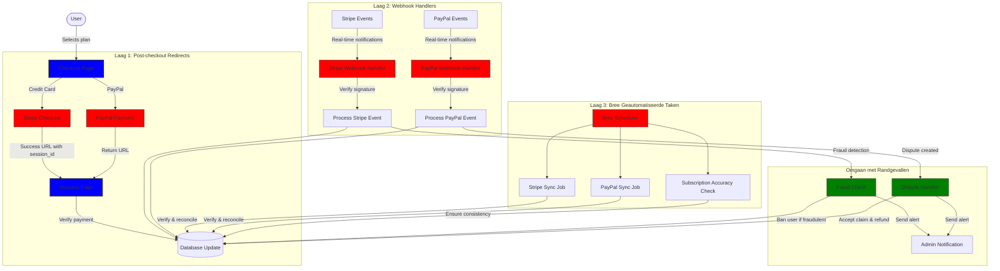
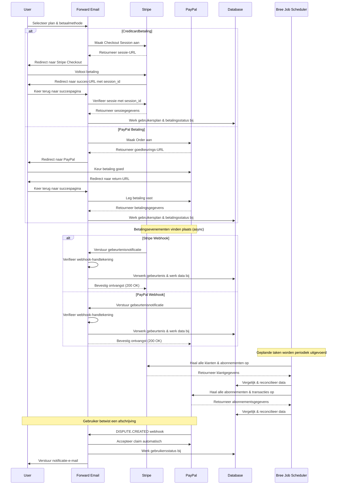
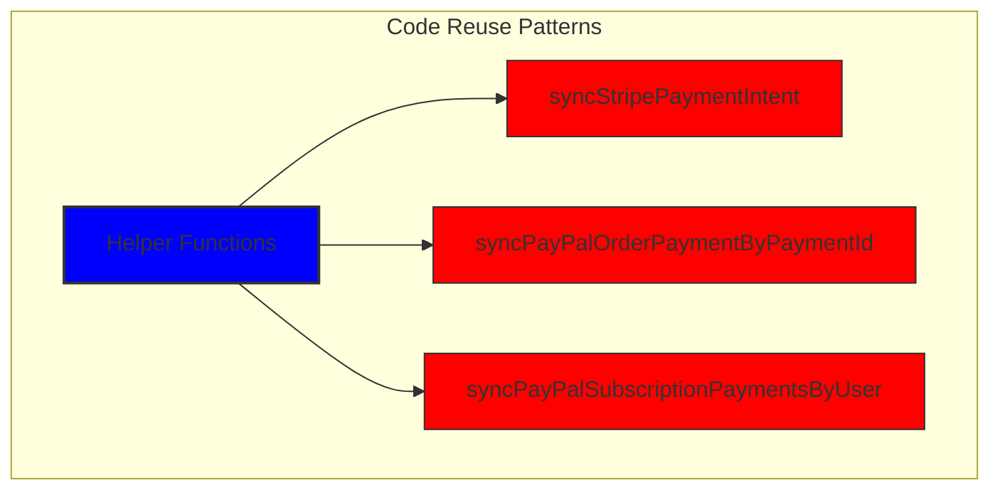
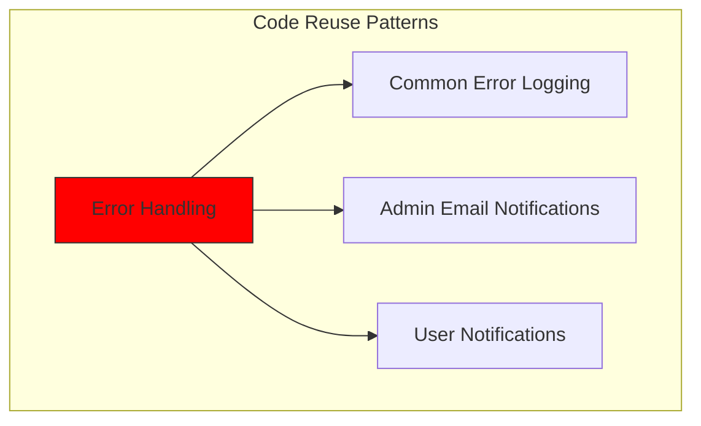
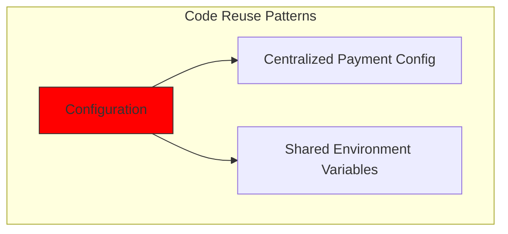
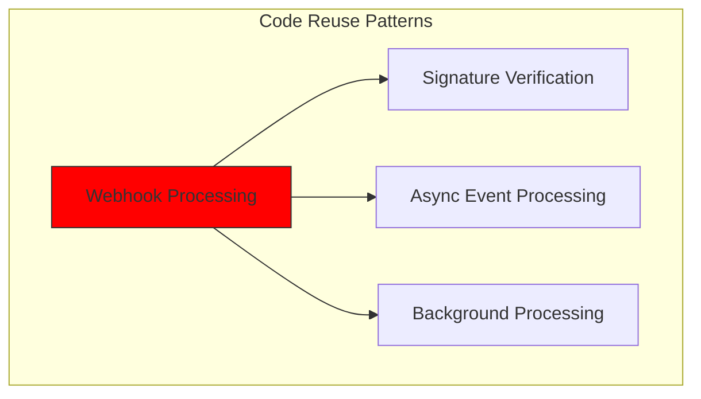
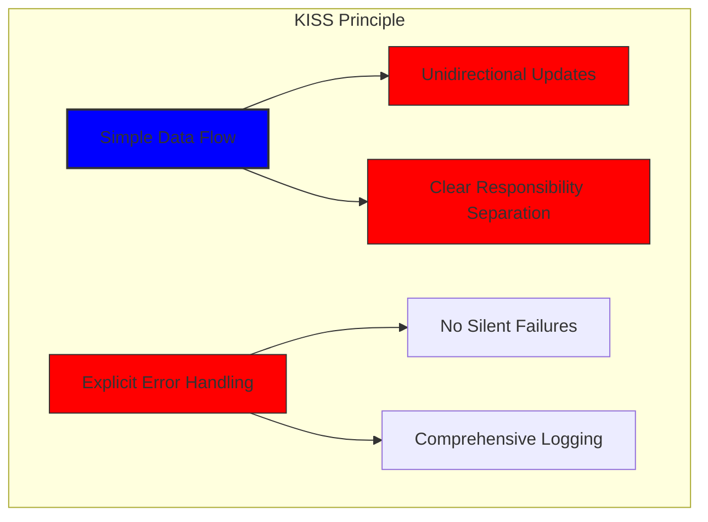

# Hoe We een Robuust Betalingssysteem Bouwde met Stripe en PayPal: Een Trifecta Benadering {#how-we-built-a-robust-payment-system-with-stripe-and-paypal-a-trifecta-approach}


## Inhoudsopgave {#table-of-contents}

* [Voorwoord](#foreword)
* [De Uitdaging: Meerdere Betaalverwerkers, Eén Bron van Waarheid](#the-challenge-multiple-payment-processors-one-source-of-truth)
* [De Trifecta Benadering: Drie Lagen van Betrouwbaarheid](#the-trifecta-approach-three-layers-of-reliability)
* [Laag 1: Post-Checkout Redirects](#layer-1-post-checkout-redirects)
  * [Stripe Checkout Implementatie](#stripe-checkout-implementation)
  * [PayPal Betaalstroom](#paypal-payment-flow)
* [Laag 2: Webhook Handlers met Handtekeningverificatie](#layer-2-webhook-handlers-with-signature-verification)
  * [Stripe Webhook Implementatie](#stripe-webhook-implementation)
  * [PayPal Webhook Implementatie](#paypal-webhook-implementation)
* [Laag 3: Geautomatiseerde Taken met Bree](#layer-3-automated-jobs-with-bree)
  * [Controleur voor Abonnementsnauwkeurigheid](#subscription-accuracy-checker)
  * [PayPal Abonnementsynchronisatie](#paypal-subscription-synchronization)
* [Omgaan met Randgevallen](#handling-edge-cases)
  * [Fraudedetectie en Preventie](#fraud-detection-and-prevention)
  * [Afhandeling van Geschillen](#dispute-handling)
* [Code Hergebruik: KISS en DRY Principes](#code-reuse-kiss-and-dry-principles)
* [Implementatie van VISA Abonnementsvereisten](#visa-subscription-requirements-implementation)
  * [Geautomatiseerde Pre-Verlengings E-mailmeldingen](#automated-pre-renewal-email-notifications)
  * [Omgaan met Randgevallen](#handling-edge-cases-1)
  * [Proefperiodes en Abonnementsvoorwaarden](#trial-periods-and-subscription-terms)
* [Conclusie: De Voordelen van Onze Trifecta Benadering](#conclusion-the-benefits-of-our-trifecta-approach)


## Voorwoord {#foreword}

Bij Forward Email hebben we altijd prioriteit gegeven aan het creëren van systemen die betrouwbaar, nauwkeurig en gebruiksvriendelijk zijn. Toen het tijd was om ons betaalsysteem te implementeren, wisten we dat we een oplossing nodig hadden die meerdere betaalverwerkers aankon en tegelijkertijd perfecte dataconsistentie behield. Deze blogpost beschrijft hoe ons ontwikkelingsteam zowel Stripe als PayPal integreerde met een trifecta-benadering die 1:1 realtime nauwkeurigheid garandeert in ons hele systeem.


## De Uitdaging: Meerdere Betaalverwerkers, Eén Bron van Waarheid {#the-challenge-multiple-payment-processors-one-source-of-truth}

Als een privacygerichte e-maildienst wilden we onze gebruikers betaalopties bieden. Sommigen geven de voorkeur aan de eenvoud van creditcardbetalingen via Stripe, terwijl anderen de extra scheidingslaag waarderen die PayPal biedt. Het ondersteunen van meerdere betaalverwerkers brengt echter aanzienlijke complexiteit met zich mee:

1. Hoe zorgen we voor consistente data over verschillende betaalsystemen heen?
2. Hoe gaan we om met randgevallen zoals geschillen, terugbetalingen of mislukte betalingen?
3. Hoe behouden we een enkele bron van waarheid in onze database?

Onze oplossing was het implementeren van wat we de "trifecta-benadering" noemen - een driedelig systeem dat redundantie biedt en dataconsistentie garandeert, ongeacht wat er gebeurt.


## De Trifecta Benadering: Drie Lagen van Betrouwbaarheid {#the-trifecta-approach-three-layers-of-reliability}

Ons betaalsysteem bestaat uit drie cruciale componenten die samenwerken om perfecte datasynchronisatie te waarborgen:

1. **Post-checkout redirects** - Het direct vastleggen van betalingsinformatie na het afrekenen
2. **Webhook handlers** - Het verwerken van realtime gebeurtenissen van betaalverwerkers
3. **Geautomatiseerde taken** - Periodiek verifiëren en afstemmen van betalingsgegevens

Laten we elk onderdeel bekijken en zien hoe ze samenwerken.


```mermaid
flowchart TD
    User([User]) --> |Selects plan| Checkout[Checkout Page]

    %% Layer 1: Post-checkout redirects
    subgraph "Laag 1: Post-checkout Redirects"
        Checkout --> |Credit Card| Stripe[Stripe Checkout]
        Checkout --> |PayPal| PayPal[PayPal Payment]

        Stripe --> |Success URL with session_id| SuccessPage[Success Page]
        PayPal --> |Return URL| SuccessPage

        SuccessPage --> |Verify payment| Database[(Database Update)]
    end

    %% Layer 2: Webhooks
    subgraph "Laag 2: Webhook Handlers"
        StripeEvents[Stripe Events] --> |Real-time notifications| StripeWebhook[Stripe Webhook Handler]
        PayPalEvents[PayPal Events] --> |Real-time notifications| PayPalWebhook[PayPal Webhook Handler]

        StripeWebhook --> |Verify signature| ProcessStripeEvent[Process Stripe Event]
        PayPalWebhook --> |Verify signature| ProcessPayPalEvent[Process PayPal Event]

        ProcessStripeEvent --> Database
        ProcessPayPalEvent --> Database
    end

    %% Layer 3: Automated jobs
    subgraph "Laag 3: Bree Geautomatiseerde Taken"
        BreeScheduler[Bree Scheduler] --> StripeSync[Stripe Sync Job]
        BreeScheduler --> PayPalSync[PayPal Sync Job]
        BreeScheduler --> AccuracyCheck[Subscription Accuracy Check]

        StripeSync --> |Verify & reconcile| Database
        PayPalSync --> |Verify & reconcile| Database
        AccuracyCheck --> |Ensure consistency| Database
    end

    %% Edge cases
    subgraph "Omgaan met Randgevallen"
        ProcessStripeEvent --> |Fraud detection| FraudCheck[Fraud Check]
        ProcessPayPalEvent --> |Dispute created| DisputeHandler[Dispute Handler]

        FraudCheck --> |Ban user if fraudulent| Database
        DisputeHandler --> |Accept claim & refund| Database

        FraudCheck --> |Send alert| AdminNotification[Admin Notification]
        DisputeHandler --> |Send alert| AdminNotification
    end

    %% Style definitions
    classDef primary fill:blue,stroke:#333,stroke-width:2px;
    classDef secondary fill:red,stroke:#333,stroke-width:1px;
    classDef tertiary fill:green,stroke:#333,stroke-width:1px;

    class Checkout,SuccessPage primary;
    class Stripe,PayPal,StripeWebhook,PayPalWebhook,BreeScheduler secondary;
    class FraudCheck,DisputeHandler tertiary;
```
## Laag 1: Post-Checkout Redirects {#layer-1-post-checkout-redirects}

De eerste laag van onze trifecta-aanpak vindt direct plaats nadat een gebruiker een betaling heeft voltooid. Zowel Stripe als PayPal bieden mechanismen om gebruikers terug te leiden naar onze site met transactie-informatie.

### Stripe Checkout Implementatie {#stripe-checkout-implementation}

Voor Stripe gebruiken we hun Checkout Sessions API om een naadloze betaalervaring te creëren. Wanneer een gebruiker een plan selecteert en kiest om te betalen met een creditcard, maken we een Checkout Session aan met specifieke succes- en annulerings-URL's:

```javascript
const options = {
  mode: paymentType === 'one-time' ? 'payment' : 'subscription',
  customer: ctx.state.user[config.userFields.stripeCustomerID],
  client_reference_id: reference,
  metadata: {
    plan
  },
  line_items: [
    {
      price,
      quantity: 1,
      description
    }
  ],
  locale: config.STRIPE_LOCALES.has(ctx.locale) ? ctx.locale : 'auto',
  cancel_url: `${config.urls.web}${ctx.path}${
    isMakePayment || isEnableAutoRenew ? '' : `/?plan=${plan}`
  }`,
  success_url: `${config.urls.web}${ctx.path}/?${
    isMakePayment || isEnableAutoRenew ? '' : `plan=${plan}&`
  }session_id={CHECKOUT_SESSION_ID}`,
  allow_promotion_codes: true
};

// Create the checkout session and redirect
const session = await stripe.checkout.sessions.create(options);
const redirectTo = session.url;
if (ctx.accepts('html')) {
  ctx.status = 303;
  ctx.redirect(redirectTo);
} else {
  ctx.body = { redirectTo };
}
```

Het cruciale onderdeel hier is de `success_url` parameter, die de `session_id` als queryparameter bevat. Wanneer Stripe de gebruiker na een succesvolle betaling terugleidt naar onze site, kunnen we deze sessie-ID gebruiken om de transactie te verifiëren en onze database dienovereenkomstig bij te werken.

### PayPal Betaalstroom {#paypal-payment-flow}

Voor PayPal gebruiken we een vergelijkbare aanpak met hun Orders API:

```javascript
const requestBody = {
  intent: 'CAPTURE',
  application_context: {
    cancel_url: `${config.urls.web}${ctx.path}${
      isMakePayment || isEnableAutoRenew ? '' : `/?plan=${plan}`
    }`,
    return_url: `${config.urls.web}${ctx.path}/?plan=${plan}`,
    brand_name: 'Forward Email',
    shipping_preference: 'NO_SHIPPING',
    user_action: 'PAY_NOW'
  },
  payer: {
    email_address: ctx.state.user.email
  },
  purchase_units: [
    {
      reference_id: ctx.state.user.id,
      description,
      custom_id: sku,
      invoice_id: reference,
      soft_descriptor: sku,
      amount: {
        currency_code: 'USD',
        value: price,
        breakdown: {
          item_total: {
            currency_code: 'USD',
            value: price
          }
        }
      },
      items: [
        {
          name,
          description,
          sku,
          unit_amount: {
            currency_code: 'USD',
            value: price
          },
          quantity: '1',
          category: 'DIGITAL_GOODS'
        }
      ]
    }
  ]
};
```

Net als bij Stripe specificeren we `return_url` en `cancel_url` parameters om post-betalingsredirects af te handelen. Wanneer PayPal de gebruiker terugleidt naar onze site, kunnen we de betalingsgegevens vastleggen en onze database bijwerken.


```mermaid
sequenceDiagram
    participant User
    participant FE as Forward Email
    participant Stripe
    participant PayPal
    participant DB as Database
    participant Bree as Bree Job Scheduler

    %% Initial checkout flow
    User->>FE: Selecteer plan & betaalmethode

    alt Creditcardbetaling
        FE->>Stripe: Maak Checkout Session aan
        Stripe-->>FE: Retourneer sessie-URL
        FE->>User: Redirect naar Stripe Checkout
        User->>Stripe: Voltooi betaling
        Stripe->>User: Redirect naar succes-URL met session_id
        User->>FE: Keer terug naar succespagina
        FE->>Stripe: Verifieer sessie met session_id
        Stripe-->>FE: Retourneer sessiegegevens
        FE->>DB: Werk gebruikersplan & betalingsstatus bij
    else PayPal Betaling
        FE->>PayPal: Maak Order aan
        PayPal-->>FE: Retourneer goedkeurings-URL
        FE->>User: Redirect naar PayPal
        User->>PayPal: Keur betaling goed
        PayPal->>User: Redirect naar return-URL
        User->>FE: Keer terug naar succespagina
        FE->>PayPal: Leg betaling vast
        PayPal-->>FE: Retourneer betalingsgegevens
        FE->>DB: Werk gebruikersplan & betalingsstatus bij
    end

    %% Webhook flow (asynchroon)
    Note over Stripe,PayPal: Betalingsevenementen vinden plaats (async)

    alt Stripe Webhook
        Stripe->>FE: Verstuur gebeurtenisnotificatie
        FE->>FE: Verifieer webhook-handtekening
        FE->>DB: Verwerk gebeurtenis & werk data bij
        FE-->>Stripe: Bevestig ontvangst (200 OK)
    else PayPal Webhook
        PayPal->>FE: Verstuur gebeurtenisnotificatie
        FE->>FE: Verifieer webhook-handtekening
        FE->>DB: Verwerk gebeurtenis & werk data bij
        FE-->>PayPal: Bevestig ontvangst (200 OK)
    end

    %% Bree geautomatiseerde taken
    Note over Bree: Geplande taken worden periodiek uitgevoerd

    Bree->>Stripe: Haal alle klanten & abonnementen op
    Stripe-->>Bree: Retourneer klantgegevens
    Bree->>DB: Vergelijk & reconcilieer data

    Bree->>PayPal: Haal alle abonnementen & transacties op
    PayPal-->>Bree: Retourneer abonnementsgegevens
    Bree->>DB: Vergelijk & reconcilieer data

    %% Randgeval: Geschilafhandeling
    Note over User,PayPal: Gebruiker betwist een afschrijving

    PayPal->>FE: DISPUTE.CREATED webhook
    FE->>PayPal: Accepteer claim automatisch
    FE->>DB: Werk gebruikersstatus bij
    FE->>User: Verstuur notificatie-e-mail
```
## Laag 2: Webhook Handlers met Handtekeningverificatie {#layer-2-webhook-handlers-with-signature-verification}

Hoewel post-checkout redirects goed werken voor de meeste scenario's, zijn ze niet onfeilbaar. Gebruikers kunnen hun browser sluiten voordat ze worden doorgestuurd, of netwerkproblemen kunnen voorkomen dat de redirect wordt voltooid. Daar komen webhooks om de hoek kijken.

Zowel Stripe als PayPal bieden webhook-systemen die realtime meldingen sturen over betaalgebeurtenissen. Wij hebben robuuste webhook handlers geïmplementeerd die de authenticiteit van deze meldingen verifiëren en ze dienovereenkomstig verwerken.

### Stripe Webhook Implementatie {#stripe-webhook-implementation}

Onze Stripe webhook handler verifieert de handtekening van binnenkomende webhook events om te verzekeren dat ze legitiem zijn:

```javascript
async function webhook(ctx) {
  const sig = ctx.request.get('stripe-signature');
  // gooi een fout als er iets mis was
  if (!isSANB(sig))
    throw Boom.badRequest(ctx.translateError('INVALID_STRIPE_SIGNATURE'));
  const event = stripe.webhooks.constructEvent(
    ctx.request.rawBody,
    sig,
    env.STRIPE_ENDPOINT_SECRET
  );
  // gooi een fout als er iets mis was
  if (!event)
    throw Boom.badRequest(ctx.translateError('INVALID_STRIPE_SIGNATURE'));
  ctx.logger.info('stripe webhook', { event });
  // geef een response terug om ontvangst van het event te bevestigen
  ctx.body = { received: true };
  // voer uit op de achtergrond
  processEvent(ctx, event)
    .then()
    .catch((err) => {
      ctx.logger.fatal(err, { event });
      // e-mail admin bij fouten
      emailHelper({
        template: 'alert',
        message: {
          to: config.email.message.from,
          subject: `Fout met Stripe Webhook (Event ID ${event.id})`
        },
        locals: {
          message: `<pre><code>${safeStringify(
            parseErr(err),
            null,
            2
          )}</code></pre>`
        }
      })
        .then()
        .catch((err) => ctx.logger.fatal(err, { event }));
    });
}
```

De functie `stripe.webhooks.constructEvent` verifieert de handtekening met onze endpoint secret. Als de handtekening geldig is, verwerken we het event asynchroon om te voorkomen dat de webhook response wordt geblokkeerd.

### PayPal Webhook Implementatie {#paypal-webhook-implementation}

Op dezelfde manier verifieert onze PayPal webhook handler de authenticiteit van binnenkomende meldingen:

```javascript
async function webhook(ctx) {
  const response = await promisify(
    paypal.notification.webhookEvent.verify,
    paypal.notification.webhookEvent
  )(ctx.request.headers, ctx.request.body, env.PAYPAL_WEBHOOK_ID);
  // gooi een fout als er iets mis was
  if (!_.isObject(response) || response.verification_status !== 'SUCCESS')
    throw Boom.badRequest(ctx.translateError('INVALID_PAYPAL_SIGNATURE'));
  // geef een response terug om ontvangst van het event te bevestigen
  ctx.body = { received: true };
  // voer uit op de achtergrond
  processEvent(ctx)
    .then()
    .catch((err) => {
      ctx.logger.fatal(err);
      // e-mail admin bij fouten
      emailHelper({
        template: 'alert',
        message: {
          to: config.email.message.from,
          subject: `Fout met PayPal Webhook (Event ID ${ctx.request.body.id})`
        },
        locals: {
          message: `<pre><code>${safeStringify(
            parseErr(err),
            null,
            2
          )}</code></pre>`
        }
      })
        .then()
        .catch((err) => ctx.logger.fatal(err));
    });
}
```

Beide webhook handlers volgen hetzelfde patroon: verifieer de handtekening, bevestig ontvangst, en verwerk het event asynchroon. Dit zorgt ervoor dat we nooit een betaalgebeurtenis missen, zelfs als de post-checkout redirect faalt.


## Laag 3: Geautomatiseerde Taken met Bree {#layer-3-automated-jobs-with-bree}

De laatste laag van onze trifecta-aanpak is een set geautomatiseerde taken die periodiek betalingsgegevens verifiëren en reconciliëren. We gebruiken Bree, een job scheduler voor Node.js, om deze taken op regelmatige intervallen uit te voeren.

### Controleur voor Abonnementsnauwkeurigheid {#subscription-accuracy-checker}

Een van onze belangrijkste taken is de controleur voor abonnementsnauwkeurigheid, die ervoor zorgt dat onze database de abonnementsstatus in Stripe nauwkeurig weerspiegelt:
```javascript
async function mapper(customer) {
  // wait a second to prevent rate limitation error
  await setTimeout(ms('1s'));
  // check for user on our side
  let user = await Users.findOne({
    [config.userFields.stripeCustomerID]: customer.id
  })
    .lean()
    .exec();
  if (!user) return;
  if (user.is_banned) return;

  // if emails did not match
  if (user.email !== customer.email) {
    logger.info(
      `User email ${user.email} did not match customer email ${customer.email} (${customer.id})`
    );
    customer = await stripe.customers.update(customer.id, {
      email: user.email
    });
    logger.info(`Updated user email to match ${user.email}`);
  }

  // check for active subscriptions
  const [activeSubscriptions, trialingSubscriptions] = await Promise.all([
    stripe.subscriptions.list({
      customer: customer.id,
      status: 'active'
    }),
    stripe.subscriptions.list({
      customer: customer.id,
      status: 'trialing'
    })
  ]);

  // Combine active and trialing subscriptions
  let subscriptions = [
    ...activeSubscriptions.data,
    ...trialingSubscriptions.data
  ];

  // Handle edge case: multiple subscriptions for one user
  if (subscriptions.length > 1) {
    await logger.error(
      new Error(
        `We may need to refund: User had multiple subscriptions ${user.email} (${customer.id})`
      )
    );
    await emailHelper({
      template: 'alert',
      message: {
        to: config.email.message.from,
        subject: `User had multiple subscriptions ${user.email}`
      },
      locals: {
        message: `User ${user.email} (${customer.id}) had multiple subscriptions: ${JSON.stringify(
          subscriptions.map((s) => s.id)
        )}`
      }
    });
  }
}
```

This job checks for discrepancies between our database and Stripe, such as mismatched email addresses or multiple active subscriptions. If it finds any issues, it logs them and sends alerts to our admin team.

### PayPal Subscription Synchronization {#paypal-subscription-synchronization}

We have a similar job for PayPal subscriptions:

```javascript
async function syncPayPalSubscriptionPayments() {
  const paypalCustomers = await Users.find({
    $or: [
      {
        [config.userFields.paypalSubscriptionID]: { $exists: true, $ne: null }
      },
      {
        [config.userFields.paypalPayerID]: { $exists: true, $ne: null }
      }
    ]
  })
    // sort by newest customers first
    .sort('-created_at')
    .lean()
    .exec();

  await logger.info(
    `Syncing payments for ${paypalCustomers.length} paypal customers`
  );

  // Process each customer and sync their payments
  const errorEmails = await pReduce(
    paypalCustomers,
    // Implementation details...
  );
}
```

These automated jobs serve as our final safety net, ensuring that our database always reflects the true state of subscriptions and payments in both Stripe and PayPal.


## Handling Edge Cases {#handling-edge-cases}

A robust payment system must handle edge cases gracefully. Let's look at how we handle some common scenarios.

### Fraud Detection and Prevention {#fraud-detection-and-prevention}

We've implemented sophisticated fraud detection mechanisms that automatically identify and handle suspicious payment activities:

```javascript
case 'charge.failed': {
  // Get all failed charges in the last 30 days
  const charges = await stripe.charges.list({
    customer: event.data.object.customer,
    created: {
      gte: dayjs().subtract(1, 'month').unix()
    }
  });

  // Filter for declined charges
  const filtered = charges.data.filter(
    (d) => d.status === 'failed' && d.failure_code === 'card_declined'
  );

  // if not more than 5 then return early
  if (filtered.length < 5) break;

  // Check if user has verified domains
  const count = await Domains.countDocuments({
    members: {
      $elemMatch: {
        user: user._id,
        group: 'admin'
      }
    },
    plan: { $in: ['enhanced_protection', 'team'] },
    has_txt_record: true
  });

  if (!user.is_banned) {
    // If no verified domains, ban the user and refund all charges
    if (count === 0) {
      // Ban the user
      user.is_banned = true;
      await user.save();

      // Refund all successful charges
    }
  }
}
```

Deze code verbiedt automatisch gebruikers die meerdere mislukte betalingen hebben en geen geverifieerde domeinen, wat een sterke aanwijzing is voor frauduleuze activiteiten.

### Geschilafhandeling {#dispute-handling}

Wanneer een gebruiker een betaling betwist, accepteren we automatisch de claim en nemen we passende maatregelen:

```javascript
case 'CUSTOMER.DISPUTE.CREATED': {
  // accepteer claim
  const agent = await paypalAgent();
  await agent
    .post(`/v1/customer/disputes/${body.resource.dispute_id}/accept-claim`)
    .send({
      note: 'Volledige terugbetaling aan de klant.'
    });

  // Zoek de betaling in onze database
  const payment = await Payments.findOne({ $or });
  if (!payment) throw new Error('Betaling bestaat niet');

  const user = await Users.findById(payment.user);
  if (!user) throw new Error('Gebruiker bestond niet voor klant');

  // Annuleer het abonnement van de gebruiker als die er is
  if (isSANB(user[config.userFields.paypalSubscriptionID])) {
    try {
      const agent = await paypalAgent();
      await agent.post(
        `/v1/billing/subscriptions/${
          user[config.userFields.paypalSubscriptionID]
        }/cancel`
      );
    } catch (err) {
      // Afhandeling van fouten bij het annuleren van abonnementen
    }
  }
}
```

Deze aanpak minimaliseert de impact van geschillen op onze bedrijfsvoering en zorgt tegelijkertijd voor een goede klantervaring.


## Codehergebruik: KISS- en DRY-principes {#code-reuse-kiss-and-dry-principles}

Door ons betalingssysteem heen hebben we ons gehouden aan de KISS (Keep It Simple, Stupid) en DRY (Don't Repeat Yourself) principes. Hier zijn enkele voorbeelden:

1. **Gedeelde Hulpfuncties**: We hebben herbruikbare hulpfuncties gemaakt voor veelvoorkomende taken zoals het synchroniseren van betalingen en het versturen van e-mails.

2. **Consistente Foutafhandeling**: Zowel Stripe- als PayPal-webhook handlers gebruiken hetzelfde patroon voor foutafhandeling en adminmeldingen.

3. **Geünificeerd Databaseschema**: Ons databaseschema is ontworpen om zowel Stripe- als PayPal-gegevens te accommoderen, met gemeenschappelijke velden voor betalingsstatus, bedrag en planinformatie.

4. **Gecentraliseerde Configuratie**: Betalingsgerelateerde configuratie is gecentraliseerd in één bestand, wat het makkelijk maakt om prijzen en productinformatie bij te werken.


```mermaid
graph TD
    subgraph "Code Reuse Patterns"
        A[Helper Functions] --> B[syncStripePaymentIntent]
        A --> C[syncPayPalOrderPaymentByPaymentId]
        A --> D[syncPayPalSubscriptionPaymentsByUser]
    end

    classDef primary fill:blue,stroke:#333,stroke-width:2px;
    classDef secondary fill:red,stroke:#333,stroke-width:1px;

    class A,P,V primary;
    class B,C,D,E,I,L,Q,R,S,W,X,Y,Z secondary;
```


```mermaid
graph TD
    subgraph "Code Reuse Patterns"
        E[Error Handling] --> F[Common Error Logging]
        E --> G[Admin Email Notifications]
        E --> H[User Notifications]
    end

    classDef primary fill:blue,stroke:#333,stroke-width:2px;
    classDef secondary fill:red,stroke:#333,stroke-width:1px;

    class A,P,V primary;
    class B,C,D,E,I,L,Q,R,S,W,X,Y,Z secondary;
```


```mermaid
graph TD
    subgraph "Code Reuse Patterns"
        I[Configuration] --> J[Centralized Payment Config]
        I --> K[Shared Environment Variables]
    end

    classDef primary fill:blue,stroke:#333,stroke-width:2px;
    classDef secondary fill:red,stroke:#333,stroke-width:1px;

    class A,P,V primary;
    class B,C,D,E,I,L,Q,R,S,W,X,Y,Z secondary;
```


```mermaid
graph TD
    subgraph "Code Reuse Patterns"
        L[Webhook Processing] --> M[Signature Verification]
        L --> N[Async Event Processing]
        L --> O[Background Processing]
    end

    classDef primary fill:blue,stroke:#333,stroke-width:2px;
    classDef secondary fill:red,stroke:#333,stroke-width:1px;

    class A,P,V primary;
    class B,C,D,E,I,L,Q,R,S,W,X,Y,Z secondary;
```


```mermaid
graph TD
    subgraph "KISS Principle"
        P[Simple Data Flow] --> Q[Unidirectional Updates]
        P --> R[Clear Responsibility Separation]

        S[Explicit Error Handling] --> T[No Silent Failures]
        S --> U[Comprehensive Logging]
    end

    classDef primary fill:blue,stroke:#333,stroke-width:2px;
    classDef secondary fill:red,stroke:#333,stroke-width:1px;

    class A,P,V primary;
    class B,C,D,E,I,L,Q,R,S,W,X,Y,Z secondary;
```
graph TD
    subgraph "DRY Principle"
        V[Shared Logic] --> W[Payment Processing Functions]
        V --> X[Email Templates]
        V --> Y[Validation Logic]

        Z[Common Database Operations] --> AA[User Updates]
        Z --> AB[Payment Recording]
    end

    classDef primary fill:blue,stroke:#333,stroke-width:2px;
    classDef secondary fill:red,stroke:#333,stroke-width:1px;

    class A,P,V primary;
    class B,C,D,E,I,L,Q,R,S,W,X,Y,Z secondary;
```


## Implementatie van VISA Abonnementsvereisten {#visa-subscription-requirements-implementation}

Naast onze trifecta-aanpak hebben we specifieke functies geïmplementeerd om te voldoen aan de abonnementsvereisten van VISA en tegelijkertijd de gebruikerservaring te verbeteren. Een belangrijke eis van VISA is dat gebruikers op de hoogte moeten worden gesteld voordat ze worden gefactureerd voor een abonnement, vooral bij de overgang van een proefperiode naar een betaald abonnement.

### Geautomatiseerde Pre-Renewal E-mailmeldingen {#automated-pre-renewal-email-notifications}

We hebben een geautomatiseerd systeem gebouwd dat gebruikers met actieve proefabonnementen identificeert en hen een notificatie-e-mail stuurt voordat hun eerste betaling plaatsvindt. Dit zorgt er niet alleen voor dat we voldoen aan de VISA-vereisten, maar vermindert ook terugboekingen en verbetert de klanttevredenheid.

Zo hebben we deze functie geïmplementeerd:

```javascript
// Find users with trial subscriptions who haven't received a notification yet
const users = await Users.find({
  $or: [
    {
      $and: [
        { [config.userFields.stripeSubscriptionID]: { $exists: true } },
        { [config.userFields.stripeTrialSentAt]: { $exists: false } },
        // Exclude subscriptions that have already had payments
        ...(paidStripeSubscriptionIds.length > 0
          ? [
              {
                [config.userFields.stripeSubscriptionID]: {
                  $nin: paidStripeSubscriptionIds
                }
              }
            ]
          : [])
      ]
    },
    {
      $and: [
        { [config.userFields.paypalSubscriptionID]: { $exists: true } },
        { [config.userFields.paypalTrialSentAt]: { $exists: false } },
        // Exclude subscriptions that have already had payments
        ...(paidPayPalSubscriptionIds.length > 0
          ? [
              {
                [config.userFields.paypalSubscriptionID]: {
                  $nin: paidPayPalSubscriptionIds
                }
              }
            ]
          : [])
      ]
    }
  ]
});

// Process each user and send notification
for (const user of users) {
  // Get subscription details from payment processor
  const subscription = await getSubscriptionDetails(user);

  // Calculate subscription duration and frequency
  const duration = getDurationFromPlanId(subscription.plan_id);
  const frequency = getHumanReadableFrequency(duration, user.locale);
  const amount = getPlanAmount(user.plan, duration);

  // Get user's domains for personalized email
  const domains = await Domains.find({
    'members.user': user._id
  }).sort('name').lean().exec();

  // Send VISA-compliant notification email
  await emailHelper({
    template: 'visa-trial-subscription-requirement',
    message: {
      to: user.receipt_email || user.email,
      ...(user.receipt_email ? { cc: user.email } : {})
    },
    locals: {
      user,
      firstChargeDate: new Date(subscription.start_time),
      frequency,
      formattedAmount: numeral(amount).format('$0,0,0.00'),
      domains
    }
  });

  // Record that notification was sent
  await Users.findByIdAndUpdate(user._id, {
    $set: {
      [config.userFields.paypalTrialSentAt]: new Date()
    }
  });
}
```

Deze implementatie zorgt ervoor dat gebruikers altijd geïnformeerd worden over aankomende kosten, met duidelijke details over:

1. Wanneer de eerste betaling zal plaatsvinden
2. De frequentie van toekomstige betalingen (maandelijks, jaarlijks, enz.)
3. Het exacte bedrag dat in rekening wordt gebracht
4. Welke domeinen door hun abonnement worden gedekt

Door dit proces te automatiseren, blijven we volledig voldoen aan de eisen van VISA (die een melding minimaal 7 dagen voor de betaling voorschrijven) terwijl we het aantal ondersteuningsvragen verminderen en de algehele gebruikerservaring verbeteren.
### Omgaan met Randgevallen {#handling-edge-cases-1}

Onze implementatie bevat ook robuuste foutafhandeling. Als er iets misgaat tijdens het notificatieproces, waarschuwt ons systeem automatisch ons team:

```javascript
try {
  await mapper(user);
} catch (err) {
  logger.error(err);

  // Send alert to administrators
  await emailHelper({
    template: 'alert',
    message: {
      to: config.email.message.from,
      subject: 'VISA Trial Subscription Requirement Error'
    },
    locals: {
      message: `<pre><code>${safeStringify(
        parseErr(err),
        null,
        2
      )}</code></pre>`
    }
  });
}
```

Dit zorgt ervoor dat zelfs als er een probleem is met het notificatiesysteem, ons team dit snel kan oplossen en kan blijven voldoen aan de vereisten van VISA.

Het VISA-abonnementsnotificatiesysteem is een ander voorbeeld van hoe we onze betalingsinfrastructuur hebben gebouwd met zowel compliance als gebruikerservaring in gedachten, als aanvulling op onze trifecta-aanpak om betrouwbare, transparante betalingsverwerking te garanderen.

### Proefperiodes en Abonnementsvoorwaarden {#trial-periods-and-subscription-terms}

Voor gebruikers die automatische verlenging inschakelen op bestaande plannen, berekenen we de juiste proefperiode om ervoor te zorgen dat ze pas worden gefactureerd nadat hun huidige plan is verlopen:

```javascript
if (
  isEnableAutoRenew &&
  dayjs(ctx.state.user[config.userFields.planExpiresAt]).isAfter(
    dayjs()
  )
) {
  const hours = dayjs(
    ctx.state.user[config.userFields.planExpiresAt]
  ).diff(dayjs(), 'hours');

  // Handle trial period calculation
}
```

We bieden ook duidelijke informatie over abonnementsvoorwaarden, inclusief factureringsfrequentie en annuleringsbeleid, en voegen gedetailleerde metadata toe aan elk abonnement om een juiste tracking en beheer te waarborgen.


## Conclusie: De Voordelen van Onze Trifecta-aanpak {#conclusion-the-benefits-of-our-trifecta-approach}

Onze trifecta-aanpak voor betalingsverwerking heeft verschillende belangrijke voordelen opgeleverd:

1. **Betrouwbaarheid**: Door drie lagen van betalingsverificatie te implementeren, zorgen we ervoor dat geen enkele betaling wordt gemist of onjuist verwerkt.

2. **Nauwkeurigheid**: Onze database weerspiegelt altijd de werkelijke status van abonnementen en betalingen in zowel Stripe als PayPal.

3. **Flexibiliteit**: Gebruikers kunnen hun voorkeursbetaalmethode kiezen zonder concessies te doen aan de betrouwbaarheid van ons systeem.

4. **Robuustheid**: Ons systeem gaat soepel om met randgevallen, van netwerkstoringen tot frauduleuze activiteiten.

Als je een betalingssysteem implementeert dat meerdere verwerkers ondersteunt, raden we deze trifecta-aanpak ten zeerste aan. Het vereist meer ontwikkelingsinspanning vooraf, maar de langetermijnvoordelen op het gebied van betrouwbaarheid en nauwkeurigheid zijn het zeker waard.

Voor meer informatie over Forward Email en onze privacygerichte e-mailservices, bezoek onze [website](https://forwardemail.net).

<!-- *Keywords: payment processing, Stripe integration, PayPal integration, webhook handling, payment synchronization, subscription management, fraud prevention, dispute handling, Node.js payment system, multi-processor payment system, payment gateway integration, real-time payment verification, payment data consistency, subscription billing, payment security, payment automation, payment webhooks, payment reconciliation, payment edge cases, payment error handling, VISA subscription requirements, pre-renewal notifications, subscription compliance* -->
