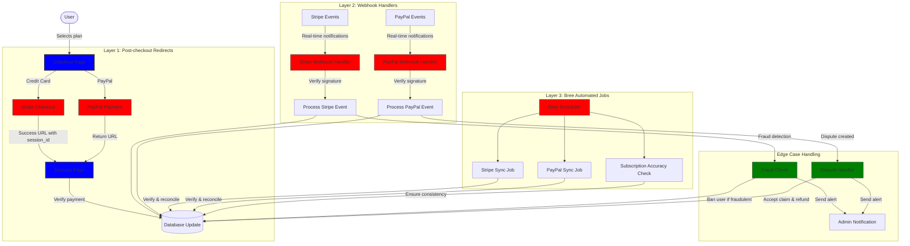
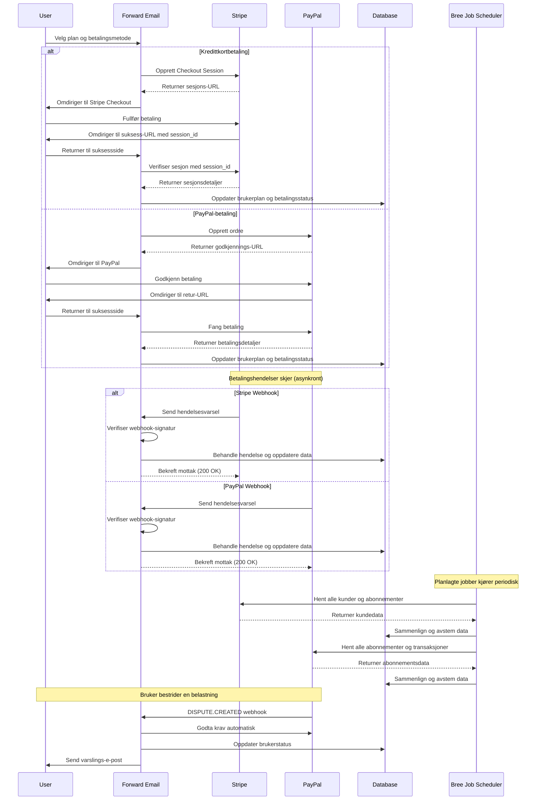
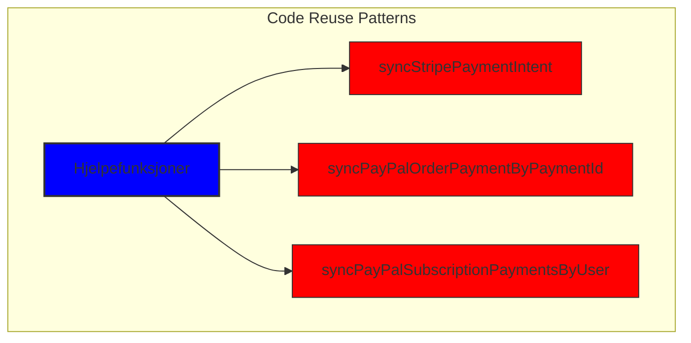
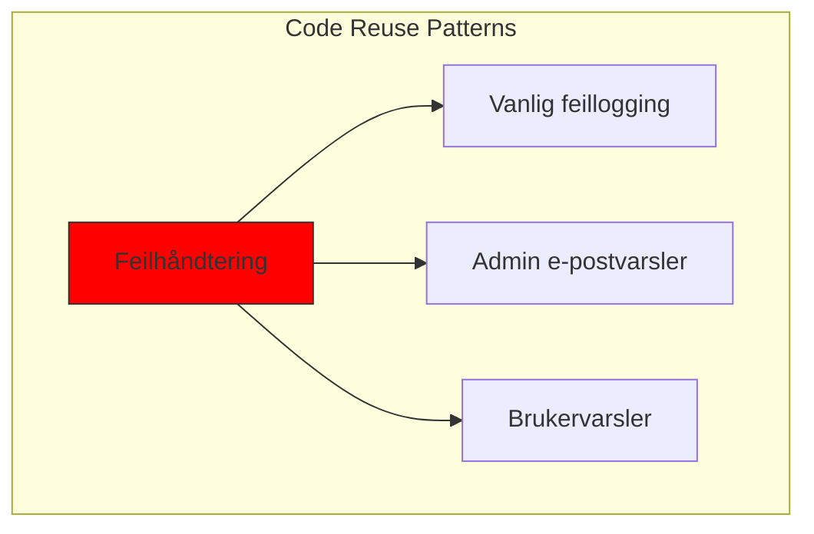
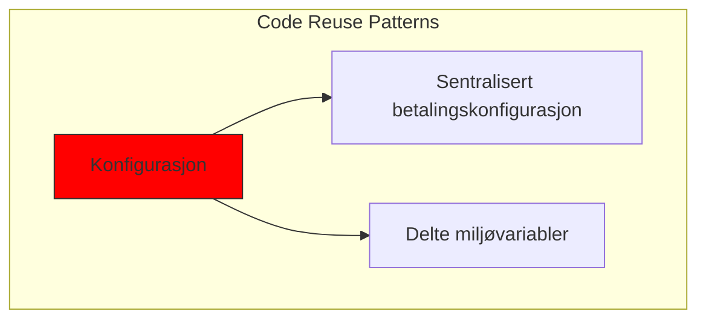
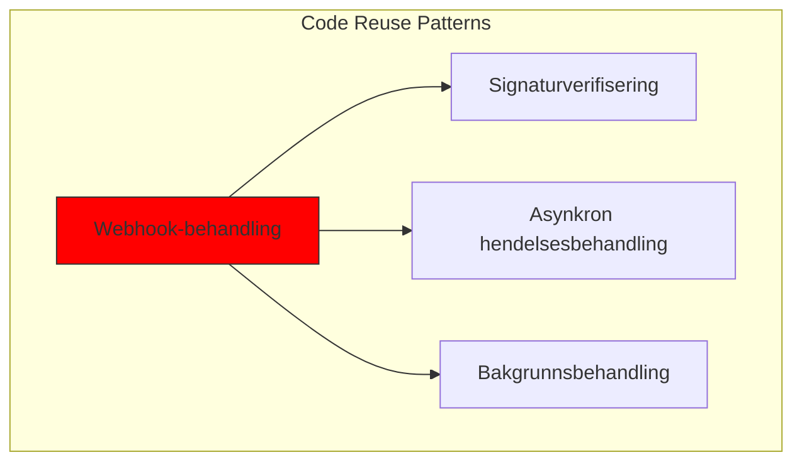
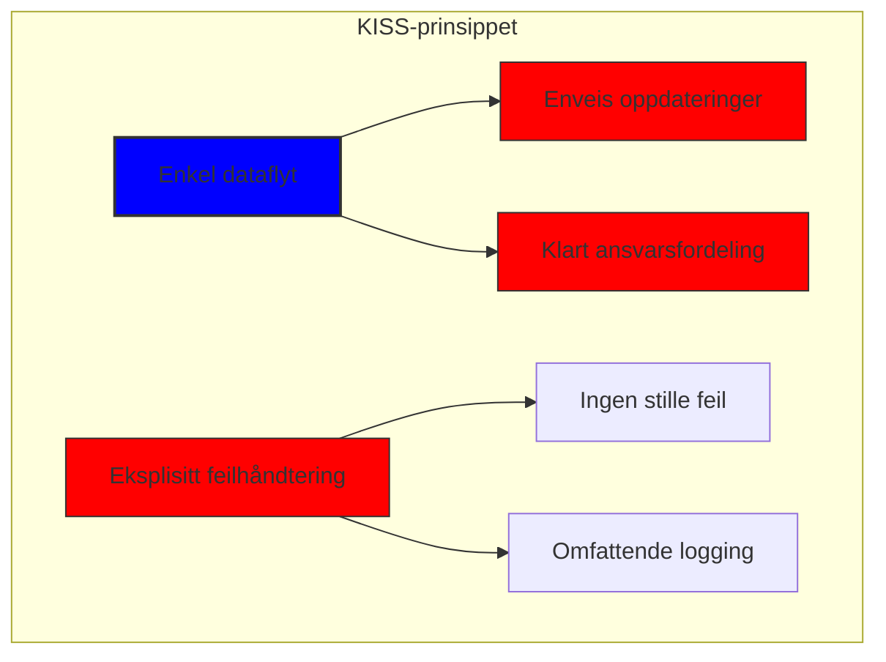

# Hvordan vi bygde et robust betalingssystem med Stripe og PayPal: En trifecta-tilnærming {#how-we-built-a-robust-payment-system-with-stripe-and-paypal-a-trifecta-approach}


## Innholdsfortegnelse {#table-of-contents}

* [Forord](#foreword)
* [Utfordringen: Flere betalingsprosessorer, én sannhetskilde](#the-challenge-multiple-payment-processors-one-source-of-truth)
* [Trifecta-tilnærmingen: Tre lag med pålitelighet](#the-trifecta-approach-three-layers-of-reliability)
* [Lag 1: Omdirigeringer etter utsjekk](#layer-1-post-checkout-redirects)
  * [Stripe Checkout-implementering](#stripe-checkout-implementation)
  * [PayPal betalingsflyt](#paypal-payment-flow)
* [Lag 2: Webhook-håndterere med signaturverifisering](#layer-2-webhook-handlers-with-signature-verification)
  * [Stripe webhook-implementering](#stripe-webhook-implementation)
  * [PayPal webhook-implementering](#paypal-webhook-implementation)
* [Lag 3: Automatiserte jobber med Bree](#layer-3-automated-jobs-with-bree)
  * [Abonnementsnøyaktighetskontroll](#subscription-accuracy-checker)
  * [PayPal abonnements-synkronisering](#paypal-subscription-synchronization)
* [Håndtering av kanttilfeller](#handling-edge-cases)
  * [Svindeldeteksjon og forebygging](#fraud-detection-and-prevention)
  * [Håndtering av tvister](#dispute-handling)
* [Gjenbruk av kode: KISS- og DRY-prinsipper](#code-reuse-kiss-and-dry-principles)
* [Implementering av VISA-abonnements-krav](#visa-subscription-requirements-implementation)
  * [Automatiserte e-postvarsler før fornyelse](#automated-pre-renewal-email-notifications)
  * [Håndtering av kanttilfeller](#handling-edge-cases-1)
  * [Prøveperioder og abonnementsvilkår](#trial-periods-and-subscription-terms)
* [Konklusjon: Fordelene med vår trifecta-tilnærming](#conclusion-the-benefits-of-our-trifecta-approach)


## Forord {#foreword}

Hos Forward Email har vi alltid prioritert å lage systemer som er pålitelige, nøyaktige og brukervennlige. Da vi skulle implementere vårt betalingssystem, visste vi at vi trengte en løsning som kunne håndtere flere betalingsprosessorer samtidig som den opprettholdt perfekt datakonsistens. Dette blogginnlegget beskriver hvordan vårt utviklingsteam integrerte både Stripe og PayPal ved hjelp av en trifecta-tilnærming som sikrer 1:1 sanntidsnøyaktighet i hele systemet vårt.


## Utfordringen: Flere betalingsprosessorer, én sannhetskilde {#the-challenge-multiple-payment-processors-one-source-of-truth}

Som en personvernfokusert e-posttjeneste ønsket vi å gi brukerne våre betalingsvalg. Noen foretrekker enkelheten ved kredittkortbetalinger gjennom Stripe, mens andre verdsetter det ekstra skillet som PayPal gir. Å støtte flere betalingsprosessorer introduserer imidlertid betydelig kompleksitet:

1. Hvordan sikrer vi konsistente data på tvers av ulike betalingssystemer?
2. Hvordan håndterer vi kanttilfeller som tvister, refusjoner eller mislykkede betalinger?
3. Hvordan opprettholder vi én sannhetskilde i databasen vår?

Vår løsning var å implementere det vi kaller "trifecta-tilnærmingen" – et trelags system som gir redundans og sikrer datakonsistens uansett hva som skjer.


## Trifecta-tilnærmingen: Tre lag med pålitelighet {#the-trifecta-approach-three-layers-of-reliability}

Vårt betalingssystem består av tre kritiske komponenter som samarbeider for å sikre perfekt datasynkronisering:

1. **Omdirigeringer etter utsjekk** – Fange betalingsinformasjon umiddelbart etter utsjekk
2. **Webhook-håndterere** – Behandle sanntidshendelser fra betalingsprosessorer
3. **Automatiserte jobber** – Periodisk verifisere og avstemme betalingsdata

La oss gå nærmere inn på hver komponent og se hvordan de fungerer sammen.


```mermaid
flowchart TD
    User([User]) --> |Selects plan| Checkout[Checkout Page]

    %% Layer 1: Post-checkout redirects
    subgraph "Layer 1: Post-checkout Redirects"
        Checkout --> |Credit Card| Stripe[Stripe Checkout]
        Checkout --> |PayPal| PayPal[PayPal Payment]

        Stripe --> |Success URL with session_id| SuccessPage[Success Page]
        PayPal --> |Return URL| SuccessPage

        SuccessPage --> |Verify payment| Database[(Database Update)]
    end

    %% Layer 2: Webhooks
    subgraph "Layer 2: Webhook Handlers"
        StripeEvents[Stripe Events] --> |Real-time notifications| StripeWebhook[Stripe Webhook Handler]
        PayPalEvents[PayPal Events] --> |Real-time notifications| PayPalWebhook[PayPal Webhook Handler]

        StripeWebhook --> |Verify signature| ProcessStripeEvent[Process Stripe Event]
        PayPalWebhook --> |Verify signature| ProcessPayPalEvent[Process PayPal Event]

        ProcessStripeEvent --> Database
        ProcessPayPalEvent --> Database
    end

    %% Layer 3: Automated jobs
    subgraph "Layer 3: Bree Automated Jobs"
        BreeScheduler[Bree Scheduler] --> StripeSync[Stripe Sync Job]
        BreeScheduler --> PayPalSync[PayPal Sync Job]
        BreeScheduler --> AccuracyCheck[Subscription Accuracy Check]

        StripeSync --> |Verify & reconcile| Database
        PayPalSync --> |Verify & reconcile| Database
        AccuracyCheck --> |Ensure consistency| Database
    end

    %% Edge cases
    subgraph "Edge Case Handling"
        ProcessStripeEvent --> |Fraud detection| FraudCheck[Fraud Check]
        ProcessPayPalEvent --> |Dispute created| DisputeHandler[Dispute Handler]

        FraudCheck --> |Ban user if fraudulent| Database
        DisputeHandler --> |Accept claim & refund| Database

        FraudCheck --> |Send alert| AdminNotification[Admin Notification]
        DisputeHandler --> |Send alert| AdminNotification
    end

    %% Style definitions
    classDef primary fill:blue,stroke:#333,stroke-width:2px;
    classDef secondary fill:red,stroke:#333,stroke-width:1px;
    classDef tertiary fill:green,stroke:#333,stroke-width:1px;

    class Checkout,SuccessPage primary;
    class Stripe,PayPal,StripeWebhook,PayPalWebhook,BreeScheduler secondary;
    class FraudCheck,DisputeHandler tertiary;
```
## Lag 1: Omdirigeringer etter utsjekking {#layer-1-post-checkout-redirects}

Det første laget i vår trefoldige tilnærming skjer umiddelbart etter at en bruker fullfører en betaling. Både Stripe og PayPal tilbyr mekanismer for å omdirigere brukere tilbake til vårt nettsted med transaksjonsinformasjon.

### Stripe Checkout-implementering {#stripe-checkout-implementation}

For Stripe bruker vi deres Checkout Sessions API for å skape en sømløs betalingsopplevelse. Når en bruker velger en plan og velger å betale med kredittkort, oppretter vi en Checkout Session med spesifikke URL-er for suksess og avbrytelse:

```javascript
const options = {
  mode: paymentType === 'one-time' ? 'payment' : 'subscription',
  customer: ctx.state.user[config.userFields.stripeCustomerID],
  client_reference_id: reference,
  metadata: {
    plan
  },
  line_items: [
    {
      price,
      quantity: 1,
      description
    }
  ],
  locale: config.STRIPE_LOCALES.has(ctx.locale) ? ctx.locale : 'auto',
  cancel_url: `${config.urls.web}${ctx.path}${
    isMakePayment || isEnableAutoRenew ? '' : `/?plan=${plan}`
  }`,
  success_url: `${config.urls.web}${ctx.path}/?${
    isMakePayment || isEnableAutoRenew ? '' : `plan=${plan}&`
  }session_id={CHECKOUT_SESSION_ID}`,
  allow_promotion_codes: true
};

// Create the checkout session and redirect
const session = await stripe.checkout.sessions.create(options);
const redirectTo = session.url;
if (ctx.accepts('html')) {
  ctx.status = 303;
  ctx.redirect(redirectTo);
} else {
  ctx.body = { redirectTo };
}
```

Den kritiske delen her er `success_url`-parameteren, som inkluderer `session_id` som en spørringsparameter. Når Stripe omdirigerer brukeren tilbake til vårt nettsted etter en vellykket betaling, kan vi bruke denne sesjons-ID-en for å verifisere transaksjonen og oppdatere databasen vår deretter.

### PayPal betalingsflyt {#paypal-payment-flow}

For PayPal bruker vi en lignende tilnærming med deres Orders API:

```javascript
const requestBody = {
  intent: 'CAPTURE',
  application_context: {
    cancel_url: `${config.urls.web}${ctx.path}${
      isMakePayment || isEnableAutoRenew ? '' : `/?plan=${plan}`
    }`,
    return_url: `${config.urls.web}${ctx.path}/?plan=${plan}`,
    brand_name: 'Forward Email',
    shipping_preference: 'NO_SHIPPING',
    user_action: 'PAY_NOW'
  },
  payer: {
    email_address: ctx.state.user.email
  },
  purchase_units: [
    {
      reference_id: ctx.state.user.id,
      description,
      custom_id: sku,
      invoice_id: reference,
      soft_descriptor: sku,
      amount: {
        currency_code: 'USD',
        value: price,
        breakdown: {
          item_total: {
            currency_code: 'USD',
            value: price
          }
        }
      },
      items: [
        {
          name,
          description,
          sku,
          unit_amount: {
            currency_code: 'USD',
            value: price
          },
          quantity: '1',
          category: 'DIGITAL_GOODS'
        }
      ]
    }
  ]
};
```

På samme måte som med Stripe spesifiserer vi `return_url` og `cancel_url`-parametere for å håndtere omdirigeringer etter betaling. Når PayPal omdirigerer brukeren tilbake til vårt nettsted, kan vi fange betalingsdetaljene og oppdatere databasen vår.


```mermaid
sequenceDiagram
    participant User
    participant FE as Forward Email
    participant Stripe
    participant PayPal
    participant DB as Database
    participant Bree as Bree Job Scheduler

    %% Initial checkout flow
    User->>FE: Velg plan og betalingsmetode

    alt Kredittkortbetaling
        FE->>Stripe: Opprett Checkout Session
        Stripe-->>FE: Returner sesjons-URL
        FE->>User: Omdiriger til Stripe Checkout
        User->>Stripe: Fullfør betaling
        Stripe->>User: Omdiriger til suksess-URL med session_id
        User->>FE: Returner til suksessside
        FE->>Stripe: Verifiser sesjon med session_id
        Stripe-->>FE: Returner sesjonsdetaljer
        FE->>DB: Oppdater brukerplan og betalingsstatus
    else PayPal-betaling
        FE->>PayPal: Opprett ordre
        PayPal-->>FE: Returner godkjennings-URL
        FE->>User: Omdiriger til PayPal
        User->>PayPal: Godkjenn betaling
        PayPal->>User: Omdiriger til retur-URL
        User->>FE: Returner til suksessside
        FE->>PayPal: Fang betaling
        PayPal-->>FE: Returner betalingsdetaljer
        FE->>DB: Oppdater brukerplan og betalingsstatus
    end

    %% Webhook-flyt (asynkron)
    Note over Stripe,PayPal: Betalingshendelser skjer (asynkront)

    alt Stripe Webhook
        Stripe->>FE: Send hendelsesvarsel
        FE->>FE: Verifiser webhook-signatur
        FE->>DB: Behandle hendelse og oppdatere data
        FE-->>Stripe: Bekreft mottak (200 OK)
    else PayPal Webhook
        PayPal->>FE: Send hendelsesvarsel
        FE->>FE: Verifiser webhook-signatur
        FE->>DB: Behandle hendelse og oppdatere data
        FE-->>PayPal: Bekreft mottak (200 OK)
    end

    %% Bree automatiserte jobber
    Note over Bree: Planlagte jobber kjører periodisk

    Bree->>Stripe: Hent alle kunder og abonnementer
    Stripe-->>Bree: Returner kundedata
    Bree->>DB: Sammenlign og avstem data

    Bree->>PayPal: Hent alle abonnementer og transaksjoner
    PayPal-->>Bree: Returner abonnementsdata
    Bree->>DB: Sammenlign og avstem data

    %% Kanttilfelle: Håndtering av tvist
    Note over User,PayPal: Bruker bestrider en belastning

    PayPal->>FE: DISPUTE.CREATED webhook
    FE->>PayPal: Godta krav automatisk
    FE->>DB: Oppdater brukerstatus
    FE->>User: Send varslings-e-post
```
## Lag 2: Webhook-håndterere med signaturverifisering {#layer-2-webhook-handlers-with-signature-verification}

Selv om omdirigeringer etter utsjekking fungerer godt i de fleste scenarier, er de ikke idiotsikre. Brukere kan lukke nettleseren før de blir omdirigert, eller nettverksproblemer kan hindre at omdirigeringen fullføres. Det er her webhooks kommer inn.

Både Stripe og PayPal tilbyr webhook-systemer som sender sanntidsvarsler om betalingshendelser. Vi har implementert robuste webhook-håndterere som verifiserer ektheten av disse varslene og behandler dem deretter.

### Stripe Webhook-implementasjon {#stripe-webhook-implementation}

Vår Stripe webhook-håndterer verifiserer signaturen til innkommende webhook-hendelser for å sikre at de er legitime:

```javascript
async function webhook(ctx) {
  const sig = ctx.request.get('stripe-signature');
  // kast en feil hvis noe var galt
  if (!isSANB(sig))
    throw Boom.badRequest(ctx.translateError('INVALID_STRIPE_SIGNATURE'));
  const event = stripe.webhooks.constructEvent(
    ctx.request.rawBody,
    sig,
    env.STRIPE_ENDPOINT_SECRET
  );
  // kast en feil hvis noe var galt
  if (!event)
    throw Boom.badRequest(ctx.translateError('INVALID_STRIPE_SIGNATURE'));
  ctx.logger.info('stripe webhook', { event });
  // returner et svar for å bekrefte mottak av hendelsen
  ctx.body = { received: true };
  // kjør i bakgrunnen
  processEvent(ctx, event)
    .then()
    .catch((err) => {
      ctx.logger.fatal(err, { event });
      // send e-post til admin ved feil
      emailHelper({
        template: 'alert',
        message: {
          to: config.email.message.from,
          subject: `Error with Stripe Webhook (Event ID ${event.id})`
        },
        locals: {
          message: `<pre><code>${safeStringify(
            parseErr(err),
            null,
            2
          )}</code></pre>`
        }
      })
        .then()
        .catch((err) => ctx.logger.fatal(err, { event }));
    });
}
```

Funksjonen `stripe.webhooks.constructEvent` verifiserer signaturen ved hjelp av vårt endepunkthemmelighet. Hvis signaturen er gyldig, behandler vi hendelsen asynkront for å unngå å blokkere webhook-responsen.

### PayPal Webhook-implementasjon {#paypal-webhook-implementation}

På samme måte verifiserer vår PayPal webhook-håndterer ektheten av innkommende varsler:

```javascript
async function webhook(ctx) {
  const response = await promisify(
    paypal.notification.webhookEvent.verify,
    paypal.notification.webhookEvent
  )(ctx.request.headers, ctx.request.body, env.PAYPAL_WEBHOOK_ID);
  // kast en feil hvis noe var galt
  if (!_.isObject(response) || response.verification_status !== 'SUCCESS')
    throw Boom.badRequest(ctx.translateError('INVALID_PAYPAL_SIGNATURE'));
  // returner et svar for å bekrefte mottak av hendelsen
  ctx.body = { received: true };
  // kjør i bakgrunnen
  processEvent(ctx)
    .then()
    .catch((err) => {
      ctx.logger.fatal(err);
      // send e-post til admin ved feil
      emailHelper({
        template: 'alert',
        message: {
          to: config.email.message.from,
          subject: `Error with PayPal Webhook (Event ID ${ctx.request.body.id})`
        },
        locals: {
          message: `<pre><code>${safeStringify(
            parseErr(err),
            null,
            2
          )}</code></pre>`
        }
      })
        .then()
        .catch((err) => ctx.logger.fatal(err));
    });
}
```

Begge webhook-håndtererne følger samme mønster: verifiser signaturen, bekreft mottak, og behandle hendelsen asynkront. Dette sikrer at vi aldri går glipp av en betalingshendelse, selv om omdirigeringen etter utsjekking feiler.


## Lag 3: Automatiserte jobber med Bree {#layer-3-automated-jobs-with-bree}

Det siste laget i vår trefoldige tilnærming er et sett med automatiserte jobber som periodisk verifiserer og avstemmer betalingsdata. Vi bruker Bree, en jobbscheduler for Node.js, for å kjøre disse jobbene med jevne mellomrom.

### Abonnementsnøyaktighetskontroll {#subscription-accuracy-checker}

En av våre nøkkeljobber er abonnementsnøyaktighetskontrollen, som sikrer at databasen vår nøyaktig gjenspeiler abonnementsstatusen i Stripe:
```javascript
async function mapper(customer) {
  // wait a second to prevent rate limitation error
  await setTimeout(ms('1s'));
  // check for user on our side
  let user = await Users.findOne({
    [config.userFields.stripeCustomerID]: customer.id
  })
    .lean()
    .exec();
  if (!user) return;
  if (user.is_banned) return;

  // if emails did not match
  if (user.email !== customer.email) {
    logger.info(
      `User email ${user.email} did not match customer email ${customer.email} (${customer.id})`
    );
    customer = await stripe.customers.update(customer.id, {
      email: user.email
    });
    logger.info(`Updated user email to match ${user.email}`);
  }

  // check for active subscriptions
  const [activeSubscriptions, trialingSubscriptions] = await Promise.all([
    stripe.subscriptions.list({
      customer: customer.id,
      status: 'active'
    }),
    stripe.subscriptions.list({
      customer: customer.id,
      status: 'trialing'
    })
  ]);

  // Combine active and trialing subscriptions
  let subscriptions = [
    ...activeSubscriptions.data,
    ...trialingSubscriptions.data
  ];

  // Handle edge case: multiple subscriptions for one user
  if (subscriptions.length > 1) {
    await logger.error(
      new Error(
        `We may need to refund: User had multiple subscriptions ${user.email} (${customer.id})`
      )
    );
    await emailHelper({
      template: 'alert',
      message: {
        to: config.email.message.from,
        subject: `User had multiple subscriptions ${user.email}`
      },
      locals: {
        message: `User ${user.email} (${customer.id}) had multiple subscriptions: ${JSON.stringify(
          subscriptions.map((s) => s.id)
        )}`
      }
    });
  }
}
```

This job checks for discrepancies between our database and Stripe, such as mismatched email addresses or multiple active subscriptions. If it finds any issues, it logs them and sends alerts to our admin team.

### PayPal Subscription Synchronization {#paypal-subscription-synchronization}

We have a similar job for PayPal subscriptions:

```javascript
async function syncPayPalSubscriptionPayments() {
  const paypalCustomers = await Users.find({
    $or: [
      {
        [config.userFields.paypalSubscriptionID]: { $exists: true, $ne: null }
      },
      {
        [config.userFields.paypalPayerID]: { $exists: true, $ne: null }
      }
    ]
  })
    // sort by newest customers first
    .sort('-created_at')
    .lean()
    .exec();

  await logger.info(
    `Syncing payments for ${paypalCustomers.length} paypal customers`
  );

  // Process each customer and sync their payments
  const errorEmails = await pReduce(
    paypalCustomers,
    // Implementation details...
  );
}
```

These automated jobs serve as our final safety net, ensuring that our database always reflects the true state of subscriptions and payments in both Stripe and PayPal.


## Handling Edge Cases {#handling-edge-cases}

A robust payment system must handle edge cases gracefully. Let's look at how we handle some common scenarios.

### Fraud Detection and Prevention {#fraud-detection-and-prevention}

We've implemented sophisticated fraud detection mechanisms that automatically identify and handle suspicious payment activities:

```javascript
case 'charge.failed': {
  // Get all failed charges in the last 30 days
  const charges = await stripe.charges.list({
    customer: event.data.object.customer,
    created: {
      gte: dayjs().subtract(1, 'month').unix()
    }
  });

  // Filter for declined charges
  const filtered = charges.data.filter(
    (d) => d.status === 'failed' && d.failure_code === 'card_declined'
  );

  // if not more than 5 then return early
  if (filtered.length < 5) break;

  // Check if user has verified domains
  const count = await Domains.countDocuments({
    members: {
      $elemMatch: {
        user: user._id,
        group: 'admin'
      }
    },
    plan: { $in: ['enhanced_protection', 'team'] },
    has_txt_record: true
  });

  if (!user.is_banned) {
    // If no verified domains, ban the user and refund all charges
    if (count === 0) {
      // Ban the user
      user.is_banned = true;
      await user.save();

      // Refund all successful charges
    }
  }
}
```

Denne koden utestenger automatisk brukere som har flere mislykkede belastninger og ingen verifiserte domener, noe som er en sterk indikasjon på svindelaktivitet.

### Håndtering av tvister {#dispute-handling}

Når en bruker bestrider en belastning, godtar vi automatisk kravet og tar passende tiltak:

```javascript
case 'CUSTOMER.DISPUTE.CREATED': {
  // godta kravet
  const agent = await paypalAgent();
  await agent
    .post(`/v1/customer/disputes/${body.resource.dispute_id}/accept-claim`)
    .send({
      note: 'Full refusjon til kunden.'
    });

  // Finn betalingen i databasen vår
  const payment = await Payments.findOne({ $or });
  if (!payment) throw new Error('Betalingen eksisterer ikke');

  const user = await Users.findById(payment.user);
  if (!user) throw new Error('Bruker eksisterte ikke for kunden');

  // Avbryt brukerens abonnement hvis de har ett
  if (isSANB(user[config.userFields.paypalSubscriptionID])) {
    try {
      const agent = await paypalAgent();
      await agent.post(
        `/v1/billing/subscriptions/${
          user[config.userFields.paypalSubscriptionID]
        }/cancel`
      );
    } catch (err) {
      // Håndter feil ved avbestilling av abonnement
    }
  }
}
```

Denne tilnærmingen minimerer virkningen av tvister på virksomheten vår samtidig som den sikrer en god kundeopplevelse.


## Gjenbruk av kode: KISS- og DRY-prinsippene {#code-reuse-kiss-and-dry-principles}

Gjennom hele betalingssystemet vårt har vi fulgt KISS (Keep It Simple, Stupid) og DRY (Don't Repeat Yourself) prinsippene. Her er noen eksempler:

1. **Delte hjelpefunksjoner**: Vi har laget gjenbrukbare hjelpefunksjoner for vanlige oppgaver som synkronisering av betalinger og sending av e-poster.

2. **Konsistent feilhåndtering**: Både Stripe- og PayPal-webhook-håndterere bruker samme mønster for feilhåndtering og admin-varsler.

3. **Enhetlig databaseskjema**: Databaseskjemaet vårt er designet for å håndtere både Stripe- og PayPal-data, med felles felt for betalingsstatus, beløp og planinformasjon.

4. **Sentralisert konfigurasjon**: Betalingsrelatert konfigurasjon er sentralisert i én fil, noe som gjør det enkelt å oppdatere priser og produktinformasjon.


```mermaid
graph TD
    subgraph "Code Reuse Patterns"
        A[Hjelpefunksjoner] --> B[syncStripePaymentIntent]
        A --> C[syncPayPalOrderPaymentByPaymentId]
        A --> D[syncPayPalSubscriptionPaymentsByUser]
    end

    classDef primary fill:blue,stroke:#333,stroke-width:2px;
    classDef secondary fill:red,stroke:#333,stroke-width:1px;

    class A,P,V primary;
    class B,C,D,E,I,L,Q,R,S,W,X,Y,Z secondary;
```


```mermaid
graph TD
    subgraph "Code Reuse Patterns"
        E[Feilhåndtering] --> F[Vanlig feillogging]
        E --> G[Admin e-postvarsler]
        E --> H[Brukervarsler]
    end

    classDef primary fill:blue,stroke:#333,stroke-width:2px;
    classDef secondary fill:red,stroke:#333,stroke-width:1px;

    class A,P,V primary;
    class B,C,D,E,I,L,Q,R,S,W,X,Y,Z secondary;
```


```mermaid
graph TD
    subgraph "Code Reuse Patterns"
        I[Konfigurasjon] --> J[Sentralisert betalingskonfigurasjon]
        I --> K[Delte miljøvariabler]
    end

    classDef primary fill:blue,stroke:#333,stroke-width:2px;
    classDef secondary fill:red,stroke:#333,stroke-width:1px;

    class A,P,V primary;
    class B,C,D,E,I,L,Q,R,S,W,X,Y,Z secondary;
```


```mermaid
graph TD
    subgraph "Code Reuse Patterns"
        L[Webhook-behandling] --> M[Signaturverifisering]
        L --> N[Asynkron hendelsesbehandling]
        L --> O[Bakgrunnsbehandling]
    end

    classDef primary fill:blue,stroke:#333,stroke-width:2px;
    classDef secondary fill:red,stroke:#333,stroke-width:1px;

    class A,P,V primary;
    class B,C,D,E,I,L,Q,R,S,W,X,Y,Z secondary;
```


```mermaid
graph TD
    subgraph "KISS-prinsippet"
        P[Enkel dataflyt] --> Q[Enveis oppdateringer]
        P --> R[Klart ansvarsfordeling]

        S[Eksplisitt feilhåndtering] --> T[Ingen stille feil]
        S --> U[Omfattende logging]
    end

    classDef primary fill:blue,stroke:#333,stroke-width:2px;
    classDef secondary fill:red,stroke:#333,stroke-width:1px;

    class A,P,V primary;
    class B,C,D,E,I,L,Q,R,S,W,X,Y,Z secondary;
```
graph TD
    subgraph "DRY Principle"
        V[Shared Logic] --> W[Payment Processing Functions]
        V --> X[Email Templates]
        V --> Y[Validation Logic]

        Z[Common Database Operations] --> AA[User Updates]
        Z --> AB[Payment Recording]
    end

    classDef primary fill:blue,stroke:#333,stroke-width:2px;
    classDef secondary fill:red,stroke:#333,stroke-width:1px;

    class A,P,V primary;
    class B,C,D,E,I,L,Q,R,S,W,X,Y,Z secondary;
```


## Implementering av VISA-abonnementskrav {#visa-subscription-requirements-implementation}

I tillegg til vår trefoldige tilnærming har vi implementert spesifikke funksjoner for å overholde VISAs abonnementskrav samtidig som vi forbedrer brukeropplevelsen. Et viktig krav fra VISA er at brukere må varsles før de blir belastet for et abonnement, spesielt når de går fra prøveperiode til betalt abonnement.

### Automatiserte e-postvarsler før fornyelse {#automated-pre-renewal-email-notifications}

Vi har bygget et automatisert system som identifiserer brukere med aktive prøveabonnementer og sender dem en varslings-e-post før den første belastningen skjer. Dette sikrer ikke bare at vi overholder VISAs krav, men reduserer også tilbakeføringer og forbedrer kundetilfredsheten.

Slik har vi implementert denne funksjonen:

```javascript
// Find users with trial subscriptions who haven't received a notification yet
const users = await Users.find({
  $or: [
    {
      $and: [
        { [config.userFields.stripeSubscriptionID]: { $exists: true } },
        { [config.userFields.stripeTrialSentAt]: { $exists: false } },
        // Exclude subscriptions that have already had payments
        ...(paidStripeSubscriptionIds.length > 0
          ? [
              {
                [config.userFields.stripeSubscriptionID]: {
                  $nin: paidStripeSubscriptionIds
                }
              }
            ]
          : [])
      ]
    },
    {
      $and: [
        { [config.userFields.paypalSubscriptionID]: { $exists: true } },
        { [config.userFields.paypalTrialSentAt]: { $exists: false } },
        // Exclude subscriptions that have already had payments
        ...(paidPayPalSubscriptionIds.length > 0
          ? [
              {
                [config.userFields.paypalSubscriptionID]: {
                  $nin: paidPayPalSubscriptionIds
                }
              }
            ]
          : [])
      ]
    }
  ]
});

// Process each user and send notification
for (const user of users) {
  // Get subscription details from payment processor
  const subscription = await getSubscriptionDetails(user);

  // Calculate subscription duration and frequency
  const duration = getDurationFromPlanId(subscription.plan_id);
  const frequency = getHumanReadableFrequency(duration, user.locale);
  const amount = getPlanAmount(user.plan, duration);

  // Get user's domains for personalized email
  const domains = await Domains.find({
    'members.user': user._id
  }).sort('name').lean().exec();

  // Send VISA-compliant notification email
  await emailHelper({
    template: 'visa-trial-subscription-requirement',
    message: {
      to: user.receipt_email || user.email,
      ...(user.receipt_email ? { cc: user.email } : {})
    },
    locals: {
      user,
      firstChargeDate: new Date(subscription.start_time),
      frequency,
      formattedAmount: numeral(amount).format('$0,0,0.00'),
      domains
    }
  });

  // Record that notification was sent
  await Users.findByIdAndUpdate(user._id, {
    $set: {
      [config.userFields.paypalTrialSentAt]: new Date()
    }
  });
}
```

Denne implementeringen sikrer at brukerne alltid blir informert om kommende belastninger, med klare detaljer om:

1. Når den første belastningen vil skje
2. Hyppigheten av fremtidige belastninger (månedlig, årlig, osv.)
3. Det eksakte beløpet de vil bli belastet
4. Hvilke domener som dekkes av abonnementet deres

Ved å automatisere denne prosessen opprettholder vi full overholdelse av VISAs krav (som krever varsling minst 7 dager før belastning) samtidig som vi reduserer supporthenvendelser og forbedrer den totale brukeropplevelsen.
### Håndtering av kanttilfeller {#handling-edge-cases-1}

Vår implementering inkluderer også robust feilhåndtering. Hvis noe går galt under varslingsprosessen, varsler systemet vårt automatisk teamet vårt:

```javascript
try {
  await mapper(user);
} catch (err) {
  logger.error(err);

  // Send varsel til administratorer
  await emailHelper({
    template: 'alert',
    message: {
      to: config.email.message.from,
      subject: 'VISA Trial Subscription Requirement Error'
    },
    locals: {
      message: `<pre><code>${safeStringify(
        parseErr(err),
        null,
        2
      )}</code></pre>`
    }
  });
}
```

Dette sikrer at selv om det oppstår et problem med varslingssystemet, kan teamet vårt raskt ta tak i det og opprettholde samsvar med VISAs krav.

VISA-abonnementsvarslingssystemet er et annet eksempel på hvordan vi har bygget vår betalingsinfrastruktur med både samsvar og brukeropplevelse i tankene, som utfyller vår trifecta-tilnærming for å sikre pålitelig og transparent betalingsbehandling.

### Prøveperioder og abonnementsbetingelser {#trial-periods-and-subscription-terms}

For brukere som aktiverer automatisk fornyelse på eksisterende planer, beregner vi passende prøveperiode for å sikre at de ikke blir belastet før deres nåværende plan utløper:

```javascript
if (
  isEnableAutoRenew &&
  dayjs(ctx.state.user[config.userFields.planExpiresAt]).isAfter(
    dayjs()
  )
) {
  const hours = dayjs(
    ctx.state.user[config.userFields.planExpiresAt]
  ).diff(dayjs(), 'hours');

  // Håndter beregning av prøveperiode
}
```

Vi gir også klar informasjon om abonnementsbetingelser, inkludert faktureringsfrekvens og avbestillingsregler, og inkluderer detaljert metadata med hvert abonnement for å sikre riktig sporing og administrasjon.

## Konklusjon: Fordelene med vår trifecta-tilnærming {#conclusion-the-benefits-of-our-trifecta-approach}

Vår trifecta-tilnærming til betalingsbehandling har gitt flere viktige fordeler:

1. **Pålitelighet**: Ved å implementere tre lag med betalingsverifisering sikrer vi at ingen betalinger blir oversett eller feilbehandlet.

2. **Nøyaktighet**: Vår database reflekterer alltid den faktiske tilstanden til abonnementer og betalinger i både Stripe og PayPal.

3. **Fleksibilitet**: Brukere kan velge sin foretrukne betalingsmetode uten å gå på kompromiss med systemets pålitelighet.

4. **Robusthet**: Systemet vårt håndterer kanttilfeller elegant, fra nettverksfeil til svindelaktiviteter.

Hvis du implementerer et betalingssystem som støtter flere prosessorer, anbefaler vi sterkt denne trifecta-tilnærmingen. Det krever mer utviklingsinnsats i starten, men de langsiktige fordelene når det gjelder pålitelighet og nøyaktighet er vel verdt det.

For mer informasjon om Forward Email og våre personvernfokuserte e-posttjenester, besøk vår [nettside](https://forwardemail.net).
