# Hvordan vi bygde et robust betalingssystem med Stripe og PayPal: En trifecta-tilnærming {#how-we-built-a-robust-payment-system-with-stripe-and-paypal-a-trifecta-approach}


## Innholdsfortegnelse {#table-of-contents}

* [Forord](#foreword)
* [Utfordringen: Flere betalingsbehandlere, én kilde til sannhet](#the-challenge-multiple-payment-processors-one-source-of-truth)
* [Trifecta-tilnærmingen: Tre lag med pålitelighet](#the-trifecta-approach-three-layers-of-reliability)
* [Lag 1: Omdirigeringer etter betaling](#layer-1-post-checkout-redirects)
  * [Stripe Checkout-implementering](#stripe-checkout-implementation)
  * [PayPal-betalingsflyt](#paypal-payment-flow)
* [Lag 2: Webhook-håndterere med signaturverifisering](#layer-2-webhook-handlers-with-signature-verification)
  * [Stripe Webhook-implementering](#stripe-webhook-implementation)
  * [PayPal Webhook-implementering](#paypal-webhook-implementation)
* [Lag 3: Automatiserte jobber med Bree](#layer-3-automated-jobs-with-bree)
  * [Abonnementsnøyaktighetstester](#subscription-accuracy-checker)
  * [PayPal-abonnementssynkronisering](#paypal-subscription-synchronization)
* [Håndtering av Edge-saker](#handling-edge-cases)
  * [Svindeldeteksjon og -forebygging](#fraud-detection-and-prevention)
  * [Tvistehåndtering](#dispute-handling)
* [Gjenbruk av kode: KISS- og DRY-prinsippene](#code-reuse-kiss-and-dry-principles)
* [Implementering av VISA-abonnementskrav](#visa-subscription-requirements-implementation)
  * [Automatiske e-postvarsler før fornyelse](#automated-pre-renewal-email-notifications)
  * [Håndtering av Edge-saker](#handling-edge-cases-1)
  * [Prøveperioder og abonnementsvilkår](#trial-periods-and-subscription-terms)
* [Konklusjon: Fordelene med vår Trifecta-tilnærming](#conclusion-the-benefits-of-our-trifecta-approach)

## Forord {#foreword}

Hos Forward Email har vi alltid prioritert å lage systemer som er pålitelige, nøyaktige og brukervennlige. Da det gjaldt implementeringen av betalingssystemet vårt, visste vi at vi trengte en løsning som kunne håndtere flere betalingsbehandlere samtidig som vi opprettholdt perfekt datakonsistens. Dette blogginnlegget beskriver hvordan utviklingsteamet vårt integrerte både Stripe og PayPal ved hjelp av en trifekta-tilnærming som sikrer 1:1 sanntidsnøyaktighet på tvers av hele systemet vårt.

## Utfordringen: Flere betalingsbehandlere, én kilde til sannhet {#the-challenge-multiple-payment-processors-one-source-of-truth}

Som en personvernfokusert e-posttjeneste ønsket vi å gi brukerne våre betalingsalternativer. Noen foretrekker enkelheten med kredittkortbetalinger via Stripe, mens andre verdsetter det ekstra laget med separasjon som PayPal tilbyr. Imidlertid introduserer støtte for flere betalingsbehandlere betydelig kompleksitet:

1. Hvordan sikrer vi konsistente data på tvers av ulike betalingssystemer?
2. Hvordan håndterer vi marginale saker som tvister, refusjoner eller mislykkede betalinger?
3. Hvordan opprettholder vi én sannhetskilde i databasen vår?

Løsningen vår var å implementere det vi kaller «trifecta-tilnærmingen» – et trelagssystem som gir redundans og sikrer datakonsistens uansett hva som skjer.

## Trifecta-tilnærmingen: Tre lag med pålitelighet {#the-trifecta-approach-three-layers-of-reliability}

Betalingssystemet vårt består av tre kritiske komponenter som samarbeider for å sikre perfekt datasynkronisering:

1. **Omdirigeringer etter betaling** – Henter betalingsinformasjon umiddelbart etter betaling
2. **Webhook-behandlere** – Behandler sanntidshendelser fra betalingsbehandlere
3. **Automatiserte jobber** – Verifiserer og avstemmer betalingsdata med jevne mellomrom

La oss dykke ned i hver komponent og se hvordan de fungerer sammen.


## Lag 1: Omdirigeringer etter betaling {#layer-1-post-checkout-redirects}

Det første laget av vår trifecta-tilnærming skjer umiddelbart etter at en bruker har fullført en betaling. Både Stripe og PayPal tilbyr mekanismer for å omdirigere brukere tilbake til nettstedet vårt med transaksjonsinformasjon.

### Stripe Checkout-implementering {#stripe-checkout-implementation}

For Stripe bruker vi deres Checkout Sessions API for å skape en sømløs betalingsopplevelse. Når en bruker velger en plan og velger å betale med kredittkort, oppretter vi en Checkout Session med spesifikke URL-er for suksess og kansellering:

```javascript
const options = {
  mode: paymentType === 'one-time' ? 'payment' : 'subscription',
  customer: ctx.state.user[config.userFields.stripeCustomerID],
  client_reference_id: reference,
  metadata: {
    plan
  },
  line_items: [
    {
      price,
      quantity: 1,
      description
    }
  ],
  locale: config.STRIPE_LOCALES.has(ctx.locale) ? ctx.locale : 'auto',
  cancel_url: `${config.urls.web}${ctx.path}${
    isMakePayment || isEnableAutoRenew ? '' : `/?plan=${plan}`
  }`,
  success_url: `${config.urls.web}${ctx.path}/?${
    isMakePayment || isEnableAutoRenew ? '' : `plan=${plan}&`
  }session_id={CHECKOUT_SESSION_ID}`,
  allow_promotion_codes: true
};

// Create the checkout session and redirect
const session = await stripe.checkout.sessions.create(options);
const redirectTo = session.url;
if (ctx.accepts('html')) {
  ctx.status = 303;
  ctx.redirect(redirectTo);
} else {
  ctx.body = { redirectTo };
}
```

Den kritiske delen her er `success_url`-parameteren, som inkluderer `session_id` som en spørreparameter. Når Stripe omdirigerer brukeren tilbake til nettstedet vårt etter en vellykket betaling, kan vi bruke denne økt-ID-en til å bekrefte transaksjonen og oppdatere databasen vår deretter.

### PayPal-betalingsflyt {#paypal-payment-flow}

For PayPal bruker vi en lignende tilnærming med deres Orders API:

```javascript
const requestBody = {
  intent: 'CAPTURE',
  application_context: {
    cancel_url: `${config.urls.web}${ctx.path}${
      isMakePayment || isEnableAutoRenew ? '' : `/?plan=${plan}`
    }`,
    return_url: `${config.urls.web}${ctx.path}/?plan=${plan}`,
    brand_name: 'Forward Email',
    shipping_preference: 'NO_SHIPPING',
    user_action: 'PAY_NOW'
  },
  payer: {
    email_address: ctx.state.user.email
  },
  purchase_units: [
    {
      reference_id: ctx.state.user.id,
      description,
      custom_id: sku,
      invoice_id: reference,
      soft_descriptor: sku,
      amount: {
        currency_code: 'USD',
        value: price,
        breakdown: {
          item_total: {
            currency_code: 'USD',
            value: price
          }
        }
      },
      items: [
        {
          name,
          description,
          sku,
          unit_amount: {
            currency_code: 'USD',
            value: price
          },
          quantity: '1',
          category: 'DIGITAL_GOODS'
        }
      ]
    }
  ]
};
```

I likhet med Stripe spesifiserer vi parameterne `return_url` og `cancel_url` for å håndtere viderekoblinger etter betaling. Når PayPal omdirigerer brukeren tilbake til nettstedet vårt, kan vi registrere betalingsdetaljene og oppdatere databasen vår.


## Lag 2: Webhook-håndterere med signaturverifisering {#layer-2-webhook-handlers-with-signature-verification}

Selv om viderekoblinger etter betaling fungerer bra i de fleste tilfeller, er de ikke idiotsikre. Brukere kan lukke nettleseren før de blir omdirigert, eller nettverksproblemer kan forhindre at viderekoblingen fullføres. Det er her webhooks kommer inn i bildet.

Både Stripe og PayPal tilbyr webhook-systemer som sender varsler i sanntid om betalingshendelser. Vi har implementert robuste webhook-håndterere som bekrefter ektheten til disse varslene og behandler dem deretter.

### Stripe Webhook-implementering {#stripe-webhook-implementation}

Vår Stripe webhook-håndterer verifiserer signaturen til innkommende webhook-hendelser for å sikre at de er legitime:

```javascript
async function webhook(ctx) {
  const sig = ctx.request.get('stripe-signature');
  // throw an error if something was wrong
  if (!isSANB(sig))
    throw Boom.badRequest(ctx.translateError('INVALID_STRIPE_SIGNATURE'));
  const event = stripe.webhooks.constructEvent(
    ctx.request.rawBody,
    sig,
    env.STRIPE_ENDPOINT_SECRET
  );
  // throw an error if something was wrong
  if (!event)
    throw Boom.badRequest(ctx.translateError('INVALID_STRIPE_SIGNATURE'));
  ctx.logger.info('stripe webhook', { event });
  // return a response to acknowledge receipt of the event
  ctx.body = { received: true };
  // run in background
  processEvent(ctx, event)
    .then()
    .catch((err) => {
      ctx.logger.fatal(err, { event });
      // email admin errors
      emailHelper({
        template: 'alert',
        message: {
          to: config.email.message.from,
          subject: `Error with Stripe Webhook (Event ID ${event.id})`
        },
        locals: {
          message: `<pre><code>${safeStringify(
            parseErr(err),
            null,
            2
          )}</code></pre>`
        }
      })
        .then()
        .catch((err) => ctx.logger.fatal(err, { event }));
    });
}
```

`stripe.webhooks.constructEvent`-funksjonen verifiserer signaturen ved hjelp av vår endepunktshemmelighet. Hvis signaturen er gyldig, behandler vi hendelsen asynkront for å unngå å blokkere webhook-responsen.

### PayPal Webhook-implementering {#paypal-webhook-implementation}

På samme måte bekrefter PayPals webhook-håndterer ektheten av innkommende varsler:

```javascript
async function webhook(ctx) {
  const response = await promisify(
    paypal.notification.webhookEvent.verify,
    paypal.notification.webhookEvent
  )(ctx.request.headers, ctx.request.body, env.PAYPAL_WEBHOOK_ID);
  // throw an error if something was wrong
  if (!_.isObject(response) || response.verification_status !== 'SUCCESS')
    throw Boom.badRequest(ctx.translateError('INVALID_PAYPAL_SIGNATURE'));
  // return a response to acknowledge receipt of the event
  ctx.body = { received: true };
  // run in background
  processEvent(ctx)
    .then()
    .catch((err) => {
      ctx.logger.fatal(err);
      // email admin errors
      emailHelper({
        template: 'alert',
        message: {
          to: config.email.message.from,
          subject: `Error with PayPal Webhook (Event ID ${ctx.request.body.id})`
        },
        locals: {
          message: `<pre><code>${safeStringify(
            parseErr(err),
            null,
            2
          )}</code></pre>`
        }
      })
        .then()
        .catch((err) => ctx.logger.fatal(err));
    });
}
```

Begge webhook-håndtererne følger samme mønster: bekrefter signaturen, bekrefter mottak og behandler hendelsen asynkront. Dette sikrer at vi aldri går glipp av en betalingshendelse, selv om omdirigeringen etter betaling mislykkes.

## Lag 3: Automatiserte jobber med Bree {#layer-3-automated-jobs-with-bree}

Det siste laget i vår trifecta-tilnærming er et sett med automatiserte jobber som med jevne mellomrom verifiserer og avstemmer betalingsdata. Vi bruker Bree, en jobbplanlegger for Node.js, til å kjøre disse jobbene med jevne mellomrom.

### Nøyaktighetskontroll for abonnement {#subscription-accuracy-checker}

En av våre viktigste oppgaver er abonnementsnøyaktighetskontrollen, som sikrer at databasen vår nøyaktig gjenspeiler abonnementsstatusen i Stripe:

```javascript
async function mapper(customer) {
  // wait a second to prevent rate limitation error
  await setTimeout(ms('1s'));
  // check for user on our side
  let user = await Users.findOne({
    [config.userFields.stripeCustomerID]: customer.id
  })
    .lean()
    .exec();
  if (!user) return;
  if (user.is_banned) return;

  // if emails did not match
  if (user.email !== customer.email) {
    logger.info(
      `User email ${user.email} did not match customer email ${customer.email} (${customer.id})`
    );
    customer = await stripe.customers.update(customer.id, {
      email: user.email
    });
    logger.info(`Updated user email to match ${user.email}`);
  }

  // check for active subscriptions
  const [activeSubscriptions, trialingSubscriptions] = await Promise.all([
    stripe.subscriptions.list({
      customer: customer.id,
      status: 'active'
    }),
    stripe.subscriptions.list({
      customer: customer.id,
      status: 'trialing'
    })
  ]);

  // Combine active and trialing subscriptions
  let subscriptions = [
    ...activeSubscriptions.data,
    ...trialingSubscriptions.data
  ];

  // Handle edge case: multiple subscriptions for one user
  if (subscriptions.length > 1) {
    await logger.error(
      new Error(
        `We may need to refund: User had multiple subscriptions ${user.email} (${customer.id})`
      )
    );
    await emailHelper({
      template: 'alert',
      message: {
        to: config.email.message.from,
        subject: `User had multiple subscriptions ${user.email}`
      },
      locals: {
        message: `User ${user.email} (${customer.id}) had multiple subscriptions: ${JSON.stringify(
          subscriptions.map((s) => s.id)
        )}`
      }
    });
  }
}
```

Denne jobben sjekker for avvik mellom databasen vår og Stripe, for eksempel uoverensstemmelser i e-postadresser eller flere aktive abonnementer. Hvis den finner noen problemer, logger den dem og sender varsler til administrasjonsteamet vårt.

### PayPal-abonnementssynkronisering {#paypal-subscription-synchronization}

Vi har en lignende jobb for PayPal-abonnementer:

```javascript
async function syncPayPalSubscriptionPayments() {
  const paypalCustomers = await Users.find({
    $or: [
      {
        [config.userFields.paypalSubscriptionID]: { $exists: true, $ne: null }
      },
      {
        [config.userFields.paypalPayerID]: { $exists: true, $ne: null }
      }
    ]
  })
    // sort by newest customers first
    .sort('-created_at')
    .lean()
    .exec();

  await logger.info(
    `Syncing payments for ${paypalCustomers.length} paypal customers`
  );

  // Process each customer and sync their payments
  const errorEmails = await pReduce(
    paypalCustomers,
    // Implementation details...
  );
}
```

Disse automatiserte jobbene fungerer som vårt siste sikkerhetsnett, og sikrer at databasen vår alltid gjenspeiler den sanne statusen for abonnementer og betalinger i både Stripe og PayPal.

## Håndtering av kantsaker {#handling-edge-cases}

Et robust betalingssystem må håndtere marginale tilfeller på en elegant måte. La oss se på hvordan vi håndterer noen vanlige scenarioer.

### Svindeldeteksjon og -forebygging {#fraud-detection-and-prevention}

Vi har implementert sofistikerte svindeldeteksjonsmekanismer som automatisk identifiserer og håndterer mistenkelige betalingsaktiviteter:

```javascript
case 'charge.failed': {
  // Get all failed charges in the last 30 days
  const charges = await stripe.charges.list({
    customer: event.data.object.customer,
    created: {
      gte: dayjs().subtract(1, 'month').unix()
    }
  });

  // Filter for declined charges
  const filtered = charges.data.filter(
    (d) => d.status === 'failed' && d.failure_code === 'card_declined'
  );

  // if not more than 5 then return early
  if (filtered.length < 5) break;

  // Check if user has verified domains
  const count = await Domains.countDocuments({
    members: {
      $elemMatch: {
        user: user._id,
        group: 'admin'
      }
    },
    plan: { $in: ['enhanced_protection', 'team'] },
    has_txt_record: true
  });

  if (!user.is_banned) {
    // If no verified domains, ban the user and refund all charges
    if (count === 0) {
      // Ban the user
      user.is_banned = true;
      await user.save();

      // Refund all successful charges
    }
  }
}
```

Denne koden utestenger automatisk brukere som har flere mislykkede belastninger og ingen bekreftede domener, noe som er en sterk indikator på svindelaktivitet.

### Håndtering av tvister {#dispute-handling}

Når en bruker bestrider en belastning, godtar vi automatisk kravet og iverksetter nødvendige tiltak:

```javascript
case 'CUSTOMER.DISPUTE.CREATED': {
  // accept claim
  const agent = await paypalAgent();
  await agent
    .post(`/v1/customer/disputes/${body.resource.dispute_id}/accept-claim`)
    .send({
      note: 'Full refund to the customer.'
    });

  // Find the payment in our database
  const payment = await Payments.findOne({ $or });
  if (!payment) throw new Error('Payment does not exist');

  const user = await Users.findById(payment.user);
  if (!user) throw new Error('User did not exist for customer');

  // Cancel the user's subscription if they have one
  if (isSANB(user[config.userFields.paypalSubscriptionID])) {
    try {
      const agent = await paypalAgent();
      await agent.post(
        `/v1/billing/subscriptions/${
          user[config.userFields.paypalSubscriptionID]
        }/cancel`
      );
    } catch (err) {
      // Handle subscription cancellation errors
    }
  }
}
```

Denne tilnærmingen minimerer virkningen av tvister på virksomheten vår, samtidig som den sikrer en god kundeopplevelse.

## Gjenbruk av kode: KISS- og DRY-prinsippene {#code-reuse-kiss-and-dry-principles}

Gjennom hele betalingssystemet vårt har vi fulgt KISS-prinsippene (Keep It Simple, Stupid) og DRY-prinsippene (Don't Repeat Yourself). Her er noen eksempler:

1. **Delt hjelpefunksjon**: Vi har laget gjenbrukbare hjelpefunksjoner for vanlige oppgaver som synkronisering av betalinger og sending av e-post.

2. **Konsekvent feilhåndtering**: Både Stripe- og PayPal-webhook-håndterere bruker samme mønster for feilhåndtering og administratorvarsler.

3. **Enhetlig databaseskjema**: Databaseskjemaet vårt er utformet for å håndtere både Stripe- og PayPal-data, med felles felt for betalingsstatus, beløp og planinformasjon.

4. **Sentralisert konfigurasjon**: Betalingsrelatert konfigurasjon er sentralisert i én fil, noe som gjør det enkelt å oppdatere priser og produktinformasjon.

```mermaid
graph TD
    subgraph "Code Reuse Patterns"
        I[Configuration] --> J[Centralized Payment Config]
        I --> K[Shared Environment Variables]
    end

    classDef primary fill:blue,stroke:#333,stroke-width:2px;
    classDef secondary fill:red,stroke:#333,stroke-width:1px;

    class A,P,V primary;
    class B,C,D,E,I,L,Q,R,S,W,X,Y,Z secondary;
```





## Implementering av VISA-abonnementskrav {#visa-subscription-requirements-implementation}

I tillegg til vår trifecta-tilnærming har vi implementert spesifikke funksjoner for å overholde VISAs abonnementskrav samtidig som vi forbedrer brukeropplevelsen. Et viktig krav fra VISA er at brukere må varsles før de belastes for et abonnement, spesielt når de går over fra en prøveperiode til et betalt abonnement.

### Automatiske e-postvarsler før fornyelse {#automated-pre-renewal-email-notifications}

Vi har bygget et automatisert system som identifiserer brukere med aktive prøveabonnementer og sender dem en e-postvarsling før den første belastningen skjer. Dette sørger ikke bare for at vi overholder VISA-kravene, men reduserer også tilbakeføringer og forbedrer kundetilfredsheten.

Slik implementerte vi denne funksjonen:

```javascript
// Find users with trial subscriptions who haven't received a notification yet
const users = await Users.find({
  $or: [
    {
      $and: [
        { [config.userFields.stripeSubscriptionID]: { $exists: true } },
        { [config.userFields.stripeTrialSentAt]: { $exists: false } },
        // Exclude subscriptions that have already had payments
        ...(paidStripeSubscriptionIds.length > 0
          ? [
              {
                [config.userFields.stripeSubscriptionID]: {
                  $nin: paidStripeSubscriptionIds
                }
              }
            ]
          : [])
      ]
    },
    {
      $and: [
        { [config.userFields.paypalSubscriptionID]: { $exists: true } },
        { [config.userFields.paypalTrialSentAt]: { $exists: false } },
        // Exclude subscriptions that have already had payments
        ...(paidPayPalSubscriptionIds.length > 0
          ? [
              {
                [config.userFields.paypalSubscriptionID]: {
                  $nin: paidPayPalSubscriptionIds
                }
              }
            ]
          : [])
      ]
    }
  ]
});

// Process each user and send notification
for (const user of users) {
  // Get subscription details from payment processor
  const subscription = await getSubscriptionDetails(user);

  // Calculate subscription duration and frequency
  const duration = getDurationFromPlanId(subscription.plan_id);
  const frequency = getHumanReadableFrequency(duration, user.locale);
  const amount = getPlanAmount(user.plan, duration);

  // Get user's domains for personalized email
  const domains = await Domains.find({
    'members.user': user._id
  }).sort('name').lean().exec();

  // Send VISA-compliant notification email
  await emailHelper({
    template: 'visa-trial-subscription-requirement',
    message: {
      to: user.receipt_email || user.email,
      ...(user.receipt_email ? { cc: user.email } : {})
    },
    locals: {
      user,
      firstChargeDate: new Date(subscription.start_time),
      frequency,
      formattedAmount: numeral(amount).format('$0,0,0.00'),
      domains
    }
  });

  // Record that notification was sent
  await Users.findByIdAndUpdate(user._id, {
    $set: {
      [config.userFields.paypalTrialSentAt]: new Date()
    }
  });
}
```

Denne implementeringen sikrer at brukerne alltid er informert om kommende belastninger, med tydelige detaljer om:

1. Når den første belastningen vil skje
2. Hyppigheten av fremtidige belastninger (månedlig, årlig osv.)
3. Det nøyaktige beløpet de vil bli belastet
4. Hvilke domener dekkes av abonnementet deres

Ved å automatisere denne prosessen opprettholder vi perfekt samsvar med VISAs krav (som krever varsling minst 7 dager før belastning), samtidig som vi reduserer antall supportforespørsler og forbedrer den generelle brukeropplevelsen.

### Håndtering av kantsaker {#handling-edge-cases-1}

Implementeringen vår inkluderer også robust feilhåndtering. Hvis noe går galt under varslingsprosessen, varsler systemet vårt automatisk teamet vårt:

```javascript
try {
  await mapper(user);
} catch (err) {
  logger.error(err);

  // Send alert to administrators
  await emailHelper({
    template: 'alert',
    message: {
      to: config.email.message.from,
      subject: 'VISA Trial Subscription Requirement Error'
    },
    locals: {
      message: `<pre><code>${safeStringify(
        parseErr(err),
        null,
        2
      )}</code></pre>`
    }
  });
}
```

Dette sikrer at selv om det skulle oppstå et problem med varslingssystemet, kan teamet vårt raskt løse det og opprettholde samsvar med VISAs krav.

VISA-abonnementsvarslingssystemet er et annet eksempel på hvordan vi har bygget betalingsinfrastrukturen vår med tanke på både samsvar og brukeropplevelse, og komplementerer vår trifekte tilnærming for å sikre pålitelig og transparent betalingsbehandling.

### Prøveperioder og abonnementsvilkår {#trial-periods-and-subscription-terms}

For brukere som aktiverer automatisk fornyelse på eksisterende abonnementer, beregner vi den passende prøveperioden for å sikre at de ikke blir belastet før deres nåværende abonnement utløper:

```javascript
if (
  isEnableAutoRenew &&
  dayjs(ctx.state.user[config.userFields.planExpiresAt]).isAfter(
    dayjs()
  )
) {
  const hours = dayjs(
    ctx.state.user[config.userFields.planExpiresAt]
  ).diff(dayjs(), 'hours');

  // Handle trial period calculation
}
```

Vi gir også tydelig informasjon om abonnementsvilkår, inkludert faktureringsfrekvens og kanselleringsregler, og inkluderer detaljerte metadata med hvert abonnement for å sikre riktig sporing og administrasjon.

## Konklusjon: Fordelene med vår Trifecta-tilnærming {#conclusion-the-benefits-of-our-trifecta-approach}

Vår trifekta tilnærming til betalingsbehandling har gitt flere viktige fordeler:

1. **Pålitelighet**: Ved å implementere tre lag med betalingsverifisering sikrer vi at ingen betalinger går glipp av eller behandles feil.

2. **Nøyaktighet**: Databasen vår gjenspeiler alltid den sanne statusen for abonnementer og betalinger i både Stripe og PayPal.

3. **Fleksibilitet**: Brukere kan velge sin foretrukne betalingsmåte uten at det går på bekostning av påliteligheten til systemet vårt.

4. **Robusthet**: Systemet vårt håndterer kantsaker på en elegant måte, fra nettverksfeil til svindelaktiviteter.

Hvis du implementerer et betalingssystem som støtter flere prosessorer, anbefaler vi denne trifecta-tilnærmingen på det sterkeste. Det krever mer utviklingsinnsats på forhånd, men de langsiktige fordelene når det gjelder pålitelighet og nøyaktighet er vel verdt det.

Hvis du vil ha mer informasjon om videresending av e-post og våre personvernfokuserte e-posttjenester, kan du gå til [nettside](https://forwardemail.net).

<!-- *Nøkkelord: betalingsbehandling, Stripe-integrasjon, PayPal-integrasjon, webhook-håndtering, betalingssynkronisering, abonnementsadministrasjon, svindelforebygging, tvistehåndtering, Node.js-betalingssystem, flerprosessorbetalingssystem, integrasjon av betalingsgateway, sanntids betalingsverifisering, konsistens av betalingsdata, abonnementsfakturering, betalingssikkerhet, betalingsautomatisering, betalingswebhooks, betalingsavstemming, betalingsfeiltilfeller, håndtering av betalingsfeil, VISA-abonnementskrav, varsler før fornyelse, abonnementssamsvar* -->