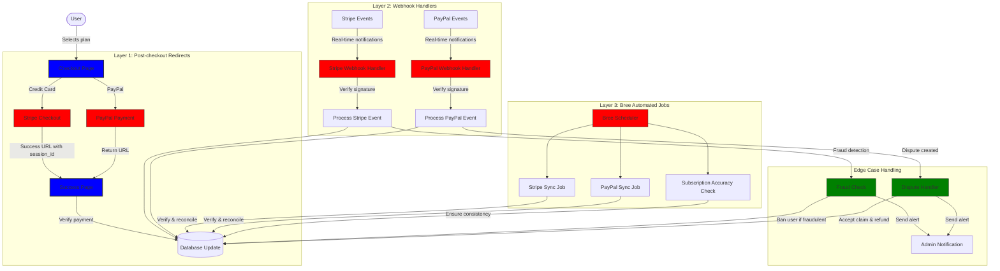
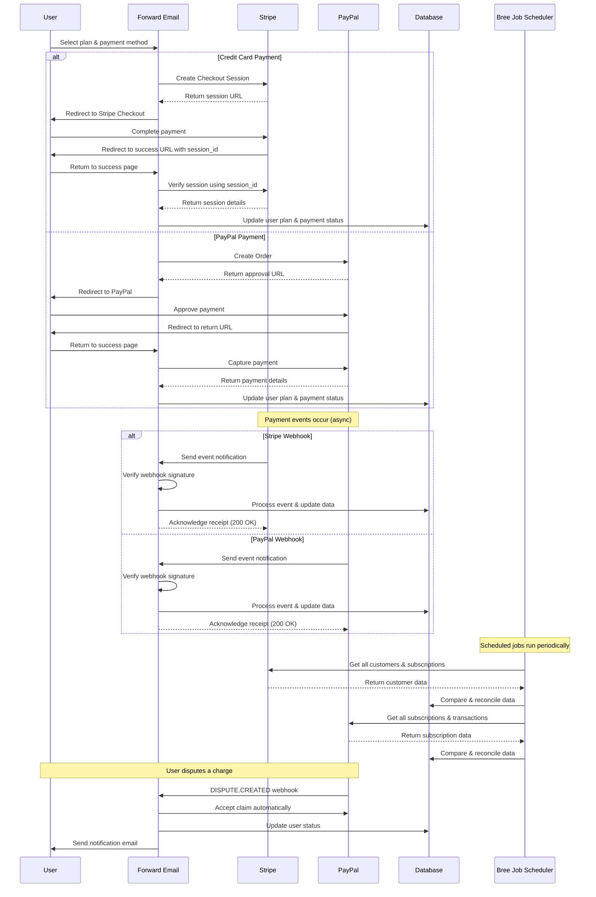
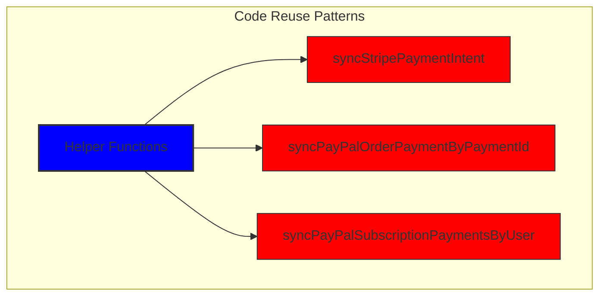
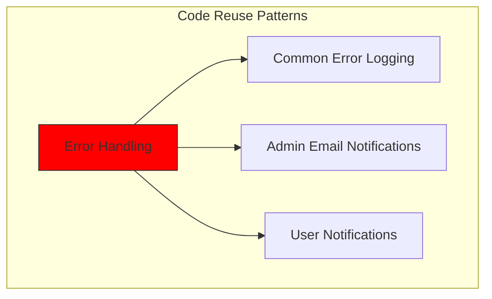
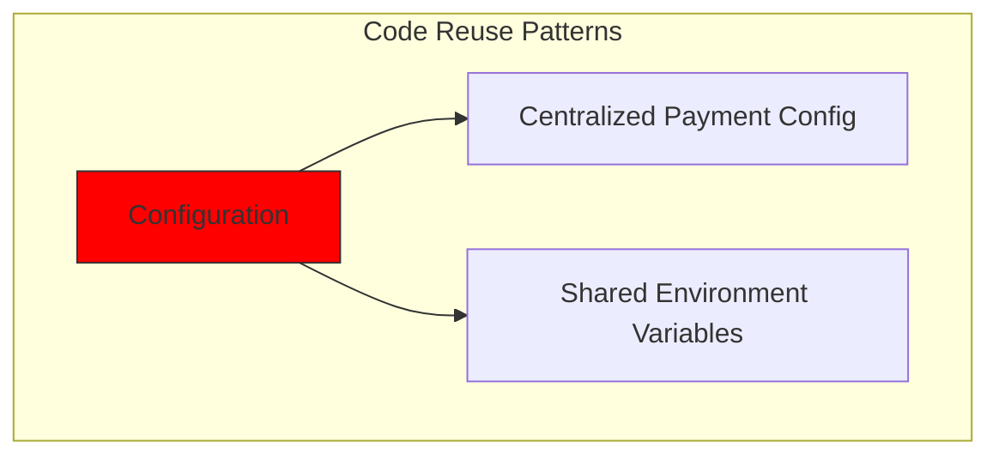
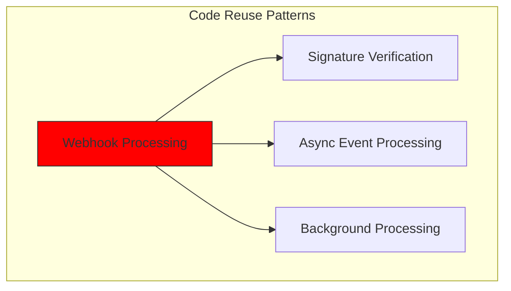
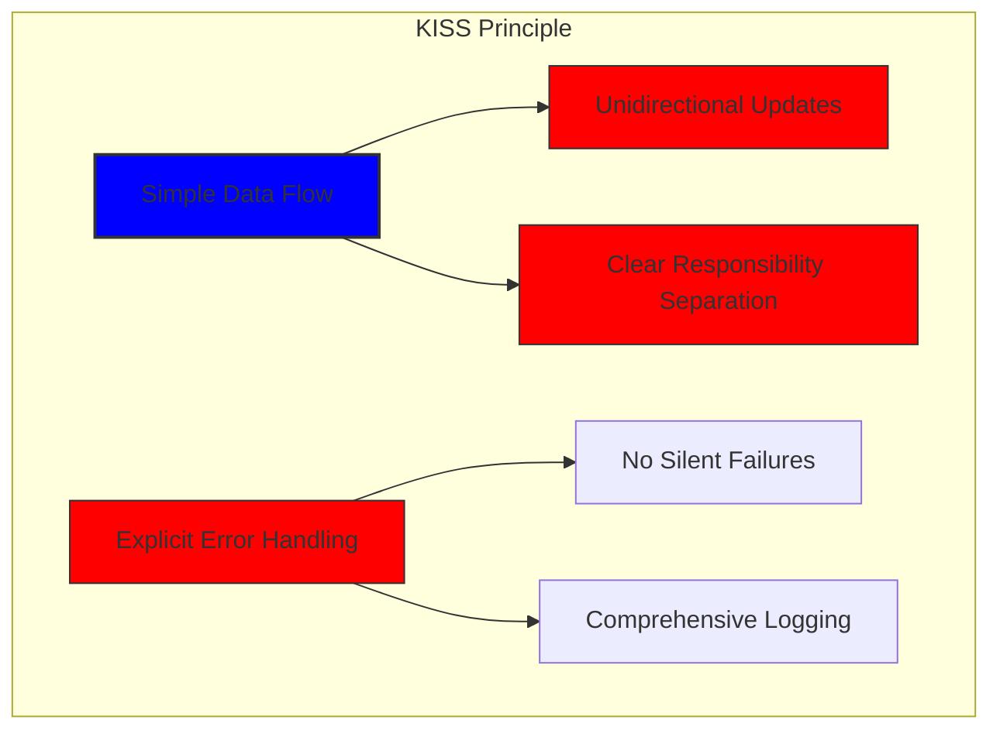
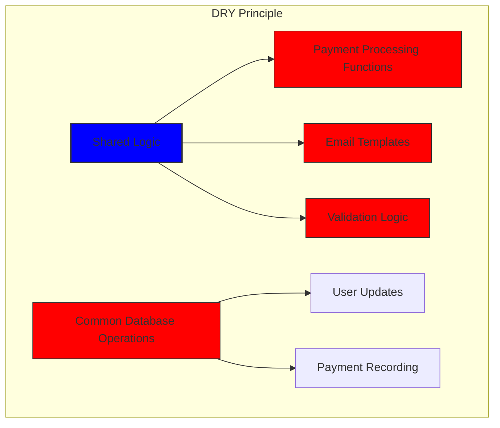

# Jak zbudowaliśmy solidny system płatności ze Stripe i PayPal: podejście Trifecta {#how-we-built-a-robust-payment-system-with-stripe-and-paypal-a-trifecta-approach}


## Spis treści {#table-of-contents}

* [Przedmowa](#foreword)
* [Wyzwanie: wiele procesorów płatności, jedno źródło prawdy](#the-challenge-multiple-payment-processors-one-source-of-truth)
* [Podejście Trifecta: trzy warstwy niezawodności](#the-trifecta-approach-three-layers-of-reliability)
* [Warstwa 1: przekierowania po dokonaniu zakupu](#layer-1-post-checkout-redirects)
  * [Wdrożenie usługi Stripe Checkout](#stripe-checkout-implementation)
  * [Przepływ płatności PayPal](#paypal-payment-flow)
* [Warstwa 2: Obsługujący webhooki z weryfikacją podpisu](#layer-2-webhook-handlers-with-signature-verification)
  * [Implementacja Stripe Webhook](#stripe-webhook-implementation)
  * [Implementacja webhook PayPal](#paypal-webhook-implementation)
* [Warstwa 3: Zautomatyzowane zadania z Bree](#layer-3-automated-jobs-with-bree)
  * [Sprawdzanie dokładności subskrypcji](#subscription-accuracy-checker)
  * [Synchronizacja subskrypcji PayPal](#paypal-subscription-synchronization)
* [Obsługa przypadków skrajnych](#handling-edge-cases)
  * [Wykrywanie i zapobieganie oszustwom](#fraud-detection-and-prevention)
  * [Rozwiązywanie sporów](#dispute-handling)
* [Ponowne wykorzystanie kodu: zasady KISS i DRY](#code-reuse-kiss-and-dry-principles)
* [Wdrażanie wymagań subskrypcji VISA](#visa-subscription-requirements-implementation)
  * [Automatyczne powiadomienia e-mail przed odnowieniem](#automated-pre-renewal-email-notifications)
  * [Obsługa przypadków skrajnych](#handling-edge-cases-1)
  * [Okresy próbne i warunki subskrypcji](#trial-periods-and-subscription-terms)
* [Wnioski: Korzyści z naszego podejścia Trifecta](#conclusion-the-benefits-of-our-trifecta-approach)

## Przedmowa {#foreword}

W Forward Email zawsze priorytetowo traktowaliśmy tworzenie systemów, które są niezawodne, dokładne i przyjazne dla użytkownika. Kiedy wdrażaliśmy nasz system przetwarzania płatności, wiedzieliśmy, że potrzebujemy rozwiązania, które mogłoby obsłużyć wiele procesorów płatności, zachowując jednocześnie idealną spójność danych. Ten wpis na blogu szczegółowo opisuje, w jaki sposób nasz zespół programistów zintegrował Stripe i PayPal, stosując podejście trifecta, które zapewnia dokładność 1:1 w czasie rzeczywistym w całym naszym systemie.

## Wyzwanie: Wiele procesorów płatności, jedno źródło prawdy {#the-challenge-multiple-payment-processors-one-source-of-truth}

Jako usługa poczty e-mail nastawiona na prywatność chcieliśmy dać naszym użytkownikom opcje płatności. Niektórzy wolą prostotę płatności kartą kredytową za pośrednictwem Stripe, podczas gdy inni cenią dodatkową warstwę separacji, którą zapewnia PayPal. Jednak obsługa wielu procesorów płatności wprowadza znaczną złożoność:

1. Jak zapewniamy spójność danych w różnych systemach płatności?
2. Jak radzimy sobie z przypadkami skrajnymi, takimi jak spory, zwroty pieniędzy lub nieudane płatności?
3. Jak utrzymujemy jedno źródło prawdy w naszej bazie danych?

Naszym rozwiązaniem było wdrożenie tego, co nazywamy „podejściem trifecta” – trójwarstwowego systemu zapewniającego redundancję i spójność danych bez względu na wszystko.

## Podejście Trifecta: trzy warstwy niezawodności {#the-trifecta-approach-three-layers-of-reliability}

Nasz system płatności składa się z trzech kluczowych komponentów, które współpracują ze sobą, aby zapewnić doskonałą synchronizację danych:

1. **Przekierowania po dokonaniu płatności** — przechwytywanie informacji o płatnościach bezpośrednio po dokonaniu płatności
2. **Obsługa webhooków** — przetwarzanie zdarzeń w czasie rzeczywistym z procesorów płatności
3. **Zadania automatyczne** — okresowe weryfikowanie i uzgadnianie danych dotyczących płatności

Przyjrzyjmy się bliżej każdemu z komponentów i zobaczmy, jak one ze sobą współdziałają.



## Warstwa 1: przekierowania po dokonaniu zakupu {#layer-1-post-checkout-redirects}

Pierwsza warstwa naszego podejścia trifecta ma miejsce natychmiast po dokonaniu płatności przez użytkownika. Zarówno Stripe, jak i PayPal zapewniają mechanizmy przekierowujące użytkowników z powrotem do naszej witryny z informacjami o transakcji.

### Implementacja usługi Stripe Checkout {#stripe-checkout-implementation}

W przypadku Stripe używamy ich interfejsu API Checkout Sessions, aby stworzyć płynne doświadczenie płatności. Gdy użytkownik wybiera plan i decyduje się zapłacić kartą kredytową, tworzymy sesję Checkout z określonymi adresami URL powodzenia i anulowania:

```javascript
const options = {
  mode: paymentType === 'one-time' ? 'payment' : 'subscription',
  customer: ctx.state.user[config.userFields.stripeCustomerID],
  client_reference_id: reference,
  metadata: {
    plan
  },
  line_items: [
    {
      price,
      quantity: 1,
      description
    }
  ],
  locale: config.STRIPE_LOCALES.has(ctx.locale) ? ctx.locale : 'auto',
  cancel_url: `${config.urls.web}${ctx.path}${
    isMakePayment || isEnableAutoRenew ? '' : `/?plan=${plan}`
  }`,
  success_url: `${config.urls.web}${ctx.path}/?${
    isMakePayment || isEnableAutoRenew ? '' : `plan=${plan}&`
  }session_id={CHECKOUT_SESSION_ID}`,
  allow_promotion_codes: true
};

// Create the checkout session and redirect
const session = await stripe.checkout.sessions.create(options);
const redirectTo = session.url;
if (ctx.accepts('html')) {
  ctx.status = 303;
  ctx.redirect(redirectTo);
} else {
  ctx.body = { redirectTo };
}
```

Krytyczną częścią jest tutaj parametr `success_url`, który zawiera `session_id` jako parametr zapytania. Kiedy Stripe przekieruje użytkownika z powrotem do naszej witryny po pomyślnej płatności, możemy użyć tego identyfikatora sesji, aby zweryfikować transakcję i odpowiednio zaktualizować naszą bazę danych.

### Przepływ płatności PayPal {#paypal-payment-flow}

W przypadku serwisu PayPal stosujemy podobne podejście w ramach interfejsu API zamówień:

```javascript
const requestBody = {
  intent: 'CAPTURE',
  application_context: {
    cancel_url: `${config.urls.web}${ctx.path}${
      isMakePayment || isEnableAutoRenew ? '' : `/?plan=${plan}`
    }`,
    return_url: `${config.urls.web}${ctx.path}/?plan=${plan}`,
    brand_name: 'Forward Email',
    shipping_preference: 'NO_SHIPPING',
    user_action: 'PAY_NOW'
  },
  payer: {
    email_address: ctx.state.user.email
  },
  purchase_units: [
    {
      reference_id: ctx.state.user.id,
      description,
      custom_id: sku,
      invoice_id: reference,
      soft_descriptor: sku,
      amount: {
        currency_code: 'USD',
        value: price,
        breakdown: {
          item_total: {
            currency_code: 'USD',
            value: price
          }
        }
      },
      items: [
        {
          name,
          description,
          sku,
          unit_amount: {
            currency_code: 'USD',
            value: price
          },
          quantity: '1',
          category: 'DIGITAL_GOODS'
        }
      ]
    }
  ]
};
```

Podobnie jak w Stripe, określamy parametry `return_url` i `cancel_url`, aby obsługiwać przekierowania po dokonaniu płatności. Kiedy PayPal przekieruje użytkownika z powrotem do naszej witryny, możemy przechwycić szczegóły płatności i zaktualizować naszą bazę danych.



## Warstwa 2: Obsługa webhooków z weryfikacją podpisu {#layer-2-webhook-handlers-with-signature-verification}

Chociaż przekierowania po dokonaniu zakupu działają dobrze w większości scenariuszy, nie są niezawodne. Użytkownicy mogą zamknąć przeglądarkę przed przekierowaniem lub problemy z siecią mogą uniemożliwić ukończenie przekierowania. Tutaj właśnie pojawiają się webhooki.

Zarówno Stripe, jak i PayPal udostępniają systemy webhook, które wysyłają powiadomienia w czasie rzeczywistym o zdarzeniach płatniczych. Wdrożyliśmy solidne programy obsługi webhook, które weryfikują autentyczność tych powiadomień i odpowiednio je przetwarzają.

### Implementacja webhooka Stripe {#stripe-webhook-implementation}

Nasz moduł obsługi webhooków Stripe weryfikuje podpisy przychodzących zdarzeń webhook, aby upewnić się, że są one prawidłowe:

```javascript
async function webhook(ctx) {
  const sig = ctx.request.get('stripe-signature');
  // throw an error if something was wrong
  if (!isSANB(sig))
    throw Boom.badRequest(ctx.translateError('INVALID_STRIPE_SIGNATURE'));
  const event = stripe.webhooks.constructEvent(
    ctx.request.rawBody,
    sig,
    env.STRIPE_ENDPOINT_SECRET
  );
  // throw an error if something was wrong
  if (!event)
    throw Boom.badRequest(ctx.translateError('INVALID_STRIPE_SIGNATURE'));
  ctx.logger.info('stripe webhook', { event });
  // return a response to acknowledge receipt of the event
  ctx.body = { received: true };
  // run in background
  processEvent(ctx, event)
    .then()
    .catch((err) => {
      ctx.logger.fatal(err, { event });
      // email admin errors
      emailHelper({
        template: 'alert',
        message: {
          to: config.email.message.from,
          subject: `Error with Stripe Webhook (Event ID ${event.id})`
        },
        locals: {
          message: `<pre><code>${safeStringify(
            parseErr(err),
            null,
            2
          )}</code></pre>`
        }
      })
        .then()
        .catch((err) => ctx.logger.fatal(err, { event }));
    });
}
```

Funkcja `stripe.webhooks.constructEvent` weryfikuje podpis przy użyciu naszego sekretu punktu końcowego. Jeśli podpis jest prawidłowy, przetwarzamy zdarzenie asynchronicznie, aby uniknąć zablokowania odpowiedzi webhook.

### Implementacja webhooka PayPal {#paypal-webhook-implementation}

Podobnie nasz moduł obsługi webhooków PayPal weryfikuje autentyczność przychodzących powiadomień:

```javascript
async function webhook(ctx) {
  const response = await promisify(
    paypal.notification.webhookEvent.verify,
    paypal.notification.webhookEvent
  )(ctx.request.headers, ctx.request.body, env.PAYPAL_WEBHOOK_ID);
  // throw an error if something was wrong
  if (!_.isObject(response) || response.verification_status !== 'SUCCESS')
    throw Boom.badRequest(ctx.translateError('INVALID_PAYPAL_SIGNATURE'));
  // return a response to acknowledge receipt of the event
  ctx.body = { received: true };
  // run in background
  processEvent(ctx)
    .then()
    .catch((err) => {
      ctx.logger.fatal(err);
      // email admin errors
      emailHelper({
        template: 'alert',
        message: {
          to: config.email.message.from,
          subject: `Error with PayPal Webhook (Event ID ${ctx.request.body.id})`
        },
        locals: {
          message: `<pre><code>${safeStringify(
            parseErr(err),
            null,
            2
          )}</code></pre>`
        }
      })
        .then()
        .catch((err) => ctx.logger.fatal(err));
    });
}
```

Oba handlery webhook działają według tego samego schematu: weryfikują podpis, potwierdzają odbiór i przetwarzają zdarzenie asynchronicznie. Dzięki temu nigdy nie przegapimy zdarzenia płatności, nawet jeśli przekierowanie po zakończeniu płatności się nie powiedzie.

## Warstwa 3: Zautomatyzowane zadania z Bree {#layer-3-automated-jobs-with-bree}

Ostatnią warstwą naszego podejścia trifecta jest zestaw zautomatyzowanych zadań, które okresowo weryfikują i uzgadniają dane dotyczące płatności. Używamy Bree, harmonogramu zadań dla Node.js, aby uruchamiać te zadania w regularnych odstępach czasu.

### Sprawdzanie dokładności subskrypcji {#subscription-accuracy-checker}

Jednym z naszych kluczowych zadań jest sprawdzanie poprawności subskrypcji, które zapewnia, że nasza baza danych dokładnie odzwierciedla status subskrypcji w Stripe:

```javascript
async function mapper(customer) {
  // wait a second to prevent rate limitation error
  await setTimeout(ms('1s'));
  // check for user on our side
  let user = await Users.findOne({
    [config.userFields.stripeCustomerID]: customer.id
  })
    .lean()
    .exec();
  if (!user) return;
  if (user.is_banned) return;

  // if emails did not match
  if (user.email !== customer.email) {
    logger.info(
      `User email ${user.email} did not match customer email ${customer.email} (${customer.id})`
    );
    customer = await stripe.customers.update(customer.id, {
      email: user.email
    });
    logger.info(`Updated user email to match ${user.email}`);
  }

  // check for active subscriptions
  const [activeSubscriptions, trialingSubscriptions] = await Promise.all([
    stripe.subscriptions.list({
      customer: customer.id,
      status: 'active'
    }),
    stripe.subscriptions.list({
      customer: customer.id,
      status: 'trialing'
    })
  ]);

  // Combine active and trialing subscriptions
  let subscriptions = [
    ...activeSubscriptions.data,
    ...trialingSubscriptions.data
  ];

  // Handle edge case: multiple subscriptions for one user
  if (subscriptions.length > 1) {
    await logger.error(
      new Error(
        `We may need to refund: User had multiple subscriptions ${user.email} (${customer.id})`
      )
    );
    await emailHelper({
      template: 'alert',
      message: {
        to: config.email.message.from,
        subject: `User had multiple subscriptions ${user.email}`
      },
      locals: {
        message: `User ${user.email} (${customer.id}) had multiple subscriptions: ${JSON.stringify(
          subscriptions.map((s) => s.id)
        )}`
      }
    });
  }
}
```

To zadanie sprawdza rozbieżności między naszą bazą danych a Stripe, takie jak niedopasowane adresy e-mail lub wiele aktywnych subskrypcji. Jeśli znajdzie jakiekolwiek problemy, rejestruje je i wysyła alerty do naszego zespołu administracyjnego.

### Synchronizacja subskrypcji PayPal {#paypal-subscription-synchronization}

Podobną pracę mamy w przypadku subskrypcji PayPal:

```javascript
async function syncPayPalSubscriptionPayments() {
  const paypalCustomers = await Users.find({
    $or: [
      {
        [config.userFields.paypalSubscriptionID]: { $exists: true, $ne: null }
      },
      {
        [config.userFields.paypalPayerID]: { $exists: true, $ne: null }
      }
    ]
  })
    // sort by newest customers first
    .sort('-created_at')
    .lean()
    .exec();

  await logger.info(
    `Syncing payments for ${paypalCustomers.length} paypal customers`
  );

  // Process each customer and sync their payments
  const errorEmails = await pReduce(
    paypalCustomers,
    // Implementation details...
  );
}
```

Te zautomatyzowane zadania stanowią naszą ostateczną siatkę bezpieczeństwa, gwarantując, że nasza baza danych zawsze odzwierciedla rzeczywisty stan subskrypcji i płatności zarówno w Stripe, jak i PayPal.

## Obsługa przypadków skrajnych {#handling-edge-cases}

Solidny system płatności musi obsługiwać przypadki skrajne z wdziękiem. Przyjrzyjmy się, jak radzimy sobie z niektórymi typowymi scenariuszami.

### Wykrywanie i zapobieganie oszustwom {#fraud-detection-and-prevention}

Wdrożyliśmy zaawansowane mechanizmy wykrywania oszustw, które automatycznie identyfikują i obsługują podejrzane działania płatnicze:

```javascript
case 'charge.failed': {
  // Get all failed charges in the last 30 days
  const charges = await stripe.charges.list({
    customer: event.data.object.customer,
    created: {
      gte: dayjs().subtract(1, 'month').unix()
    }
  });

  // Filter for declined charges
  const filtered = charges.data.filter(
    (d) => d.status === 'failed' && d.failure_code === 'card_declined'
  );

  // if not more than 5 then return early
  if (filtered.length < 5) break;

  // Check if user has verified domains
  const count = await Domains.countDocuments({
    members: {
      $elemMatch: {
        user: user._id,
        group: 'admin'
      }
    },
    plan: { $in: ['enhanced_protection', 'team'] },
    has_txt_record: true
  });

  if (!user.is_banned) {
    // If no verified domains, ban the user and refund all charges
    if (count === 0) {
      // Ban the user
      user.is_banned = true;
      await user.save();

      // Refund all successful charges
    }
  }
}
```

Kod ten automatycznie blokuje użytkowników, którzy mają na swoim koncie wiele nieudanych płatności i nie mają zweryfikowanych domen, co jest wyraźnym wskaźnikiem oszustwa.

### Rozwiązywanie sporów {#dispute-handling}

Gdy użytkownik kwestionuje opłatę, automatycznie akceptujemy roszczenie i podejmujemy odpowiednie działania:

```javascript
case 'CUSTOMER.DISPUTE.CREATED': {
  // accept claim
  const agent = await paypalAgent();
  await agent
    .post(`/v1/customer/disputes/${body.resource.dispute_id}/accept-claim`)
    .send({
      note: 'Full refund to the customer.'
    });

  // Find the payment in our database
  const payment = await Payments.findOne({ $or });
  if (!payment) throw new Error('Payment does not exist');

  const user = await Users.findById(payment.user);
  if (!user) throw new Error('User did not exist for customer');

  // Cancel the user's subscription if they have one
  if (isSANB(user[config.userFields.paypalSubscriptionID])) {
    try {
      const agent = await paypalAgent();
      await agent.post(
        `/v1/billing/subscriptions/${
          user[config.userFields.paypalSubscriptionID]
        }/cancel`
      );
    } catch (err) {
      // Handle subscription cancellation errors
    }
  }
}
```

Takie podejście minimalizuje wpływ sporów na naszą działalność, zapewniając jednocześnie klientom dobre doświadczenia.

## Ponowne wykorzystanie kodu: zasady KISS i DRY {#code-reuse-kiss-and-dry-principles}

W całym naszym systemie płatności przestrzegamy zasad KISS (Keep It Simple, Stupid) i DRY (Don't Repeat Yourself). Oto kilka przykładów:

1. **Współdzielone funkcje pomocnicze**: Stworzyliśmy wielokrotnego użytku funkcje pomocnicze do typowych zadań, takich jak synchronizacja płatności i wysyłanie wiadomości e-mail.

2. **Spójna obsługa błędów**: Zarówno obsługa webhooków Stripe, jak i PayPal korzysta z tego samego wzorca obsługi błędów i powiadomień administratora.

3. **Ujednolicony schemat bazy danych**: Nasz schemat bazy danych został zaprojektowany tak, aby pomieścić zarówno dane Stripe, jak i PayPal, ze wspólnymi polami dotyczącymi statusu płatności, kwoty i informacji o planie.

4. **Konfiguracja scentralizowana**: Konfiguracja dotycząca płatności jest scentralizowana w jednym pliku, co ułatwia aktualizację cen i informacji o produktach.













## Wdrożenie wymagań subskrypcji VISA {#visa-subscription-requirements-implementation}

Oprócz naszego podejścia trifecta wdrożyliśmy określone funkcje, aby spełnić wymagania subskrypcji VISA, jednocześnie ulepszając doświadczenie użytkownika. Jednym z kluczowych wymagań VISA jest to, że użytkownicy muszą zostać powiadomieni przed pobraniem opłaty za subskrypcję, szczególnie podczas przechodzenia z wersji próbnej na płatną subskrypcję.

### Automatyczne powiadomienia e-mail przed odnowieniem {#automated-pre-renewal-email-notifications}

Zbudowaliśmy zautomatyzowany system, który identyfikuje użytkowników z aktywnymi subskrypcjami próbnymi i wysyła im powiadomienie e-mail przed pierwszym obciążeniem. To nie tylko pozwala nam zachować zgodność z wymogami VISA, ale także zmniejsza liczbę obciążeń zwrotnych i poprawia zadowolenie klientów.

Oto jak wdrożyliśmy tę funkcję:

```javascript
// Find users with trial subscriptions who haven't received a notification yet
const users = await Users.find({
  $or: [
    {
      $and: [
        { [config.userFields.stripeSubscriptionID]: { $exists: true } },
        { [config.userFields.stripeTrialSentAt]: { $exists: false } },
        // Exclude subscriptions that have already had payments
        ...(paidStripeSubscriptionIds.length > 0
          ? [
              {
                [config.userFields.stripeSubscriptionID]: {
                  $nin: paidStripeSubscriptionIds
                }
              }
            ]
          : [])
      ]
    },
    {
      $and: [
        { [config.userFields.paypalSubscriptionID]: { $exists: true } },
        { [config.userFields.paypalTrialSentAt]: { $exists: false } },
        // Exclude subscriptions that have already had payments
        ...(paidPayPalSubscriptionIds.length > 0
          ? [
              {
                [config.userFields.paypalSubscriptionID]: {
                  $nin: paidPayPalSubscriptionIds
                }
              }
            ]
          : [])
      ]
    }
  ]
});

// Process each user and send notification
for (const user of users) {
  // Get subscription details from payment processor
  const subscription = await getSubscriptionDetails(user);

  // Calculate subscription duration and frequency
  const duration = getDurationFromPlanId(subscription.plan_id);
  const frequency = getHumanReadableFrequency(duration, user.locale);
  const amount = getPlanAmount(user.plan, duration);

  // Get user's domains for personalized email
  const domains = await Domains.find({
    'members.user': user._id
  }).sort('name').lean().exec();

  // Send VISA-compliant notification email
  await emailHelper({
    template: 'visa-trial-subscription-requirement',
    message: {
      to: user.receipt_email || user.email,
      ...(user.receipt_email ? { cc: user.email } : {})
    },
    locals: {
      user,
      firstChargeDate: new Date(subscription.start_time),
      frequency,
      formattedAmount: numeral(amount).format('$0,0,0.00'),
      domains
    }
  });

  // Record that notification was sent
  await Users.findByIdAndUpdate(user._id, {
    $set: {
      [config.userFields.paypalTrialSentAt]: new Date()
    }
  });
}
```

Dzięki temu wdrożeniu użytkownicy są zawsze informowani o nadchodzących opłatach, z zachowaniem jasnych szczegółów dotyczących:

1. Kiedy nastąpi pierwsza opłata
2. Częstotliwość przyszłych opłat (miesięczna, roczna itd.)
3. Dokładna kwota, jaką zostaną pobrane
4. Które domeny są objęte ich subskrypcją

Automatyzując ten proces, zachowujemy pełną zgodność z wymogami VISA (które nakazują powiadomienie co najmniej 7 dni przed pobraniem opłaty), jednocześnie ograniczając liczbę zapytań o pomoc techniczną i poprawiając ogólne wrażenia użytkownika.

### Obsługa przypadków brzegowych {#handling-edge-cases-1}

Nasza implementacja obejmuje również solidną obsługę błędów. Jeśli coś pójdzie nie tak podczas procesu powiadamiania, nasz system automatycznie powiadomi nasz zespół:

```javascript
try {
  await mapper(user);
} catch (err) {
  logger.error(err);

  // Send alert to administrators
  await emailHelper({
    template: 'alert',
    message: {
      to: config.email.message.from,
      subject: 'VISA Trial Subscription Requirement Error'
    },
    locals: {
      message: `<pre><code>${safeStringify(
        parseErr(err),
        null,
        2
      )}</code></pre>`
    }
  });
}
```

Dzięki temu nawet jeśli wystąpi problem z systemem powiadomień, nasz zespół może szybko się nim zająć i zachować zgodność z wymogami VISA.

System powiadomień o subskrypcji VISA to kolejny przykład tego, jak budujemy naszą infrastrukturę płatniczą, mając na uwadze zarówno zgodność z przepisami, jak i wygodę użytkownika, uzupełniając nasze potrójne podejście mające na celu zapewnienie niezawodnego i przejrzystego przetwarzania płatności.

### Okresy próbne i warunki subskrypcji {#trial-periods-and-subscription-terms}

W przypadku użytkowników, którzy włączyli opcję automatycznego odnawiania istniejących planów, obliczamy odpowiedni okres próbny, aby mieć pewność, że nie zostaną oni obciążeni opłatą aż do wygaśnięcia bieżącego planu:

```javascript
if (
  isEnableAutoRenew &&
  dayjs(ctx.state.user[config.userFields.planExpiresAt]).isAfter(
    dayjs()
  )
) {
  const hours = dayjs(
    ctx.state.user[config.userFields.planExpiresAt]
  ).diff(dayjs(), 'hours');

  // Handle trial period calculation
}
```

Podajemy także przejrzyste informacje o warunkach subskrypcji, obejmujące częstotliwość rozliczeń i zasady anulowania, a także dołączamy szczegółowe metadane do każdej subskrypcji, aby zapewnić właściwe śledzenie i zarządzanie.

## Wnioski: Korzyści z naszego podejścia Trifecta {#conclusion-the-benefits-of-our-trifecta-approach}

Nasze potrójne podejście do przetwarzania płatności zapewniło nam szereg kluczowych korzyści:

1. **Niezawodność**: Wdrażając trzy poziomy weryfikacji płatności, gwarantujemy, że żadna płatność nie zostanie pominięta ani nieprawidłowo przetworzona.

2. **Dokładność**: Nasza baza danych zawsze odzwierciedla prawdziwy stan subskrypcji i płatności zarówno w Stripe, jak i PayPal.

3. **Elastyczność**: Użytkownicy mogą wybrać preferowaną metodę płatności, nie narażając przy tym niezawodności naszego systemu.

4. **Solidność**: Nasz system sprawnie radzi sobie z przypadkami ekstremalnymi, od awarii sieci po działania oszukańcze.

Jeśli wdrażasz system płatności obsługujący wiele procesorów, zdecydowanie polecamy to podejście trifecta. Wymaga ono większego wysiłku w zakresie rozwoju początkowego, ale długoterminowe korzyści w zakresie niezawodności i dokładności są tego warte.

Aby uzyskać więcej informacji na temat usługi Forward Email i naszych usług poczty e-mail zapewniających prywatność, odwiedź stronę [strona internetowa](https://forwardemail.net).

<!-- *Słowa kluczowe: przetwarzanie płatności, integracja Stripe, integracja PayPal, obsługa webhooków, synchronizacja płatności, zarządzanie subskrypcjami, zapobieganie oszustwom, obsługa sporów, system płatności Node.js, wieloprocesorowy system płatności, integracja bramki płatniczej, weryfikacja płatności w czasie rzeczywistym, spójność danych płatniczych, rozliczanie subskrypcji, bezpieczeństwo płatności, automatyzacja płatności, webhooki płatności, uzgadnianie płatności, skrajne przypadki płatności, obsługa błędów płatności, wymagania subskrypcji VISA, powiadomienia przed odnowieniem, zgodność subskrypcji* -->