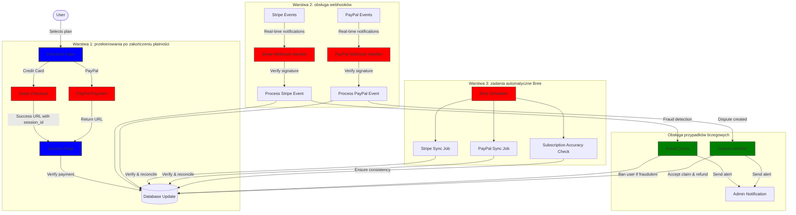
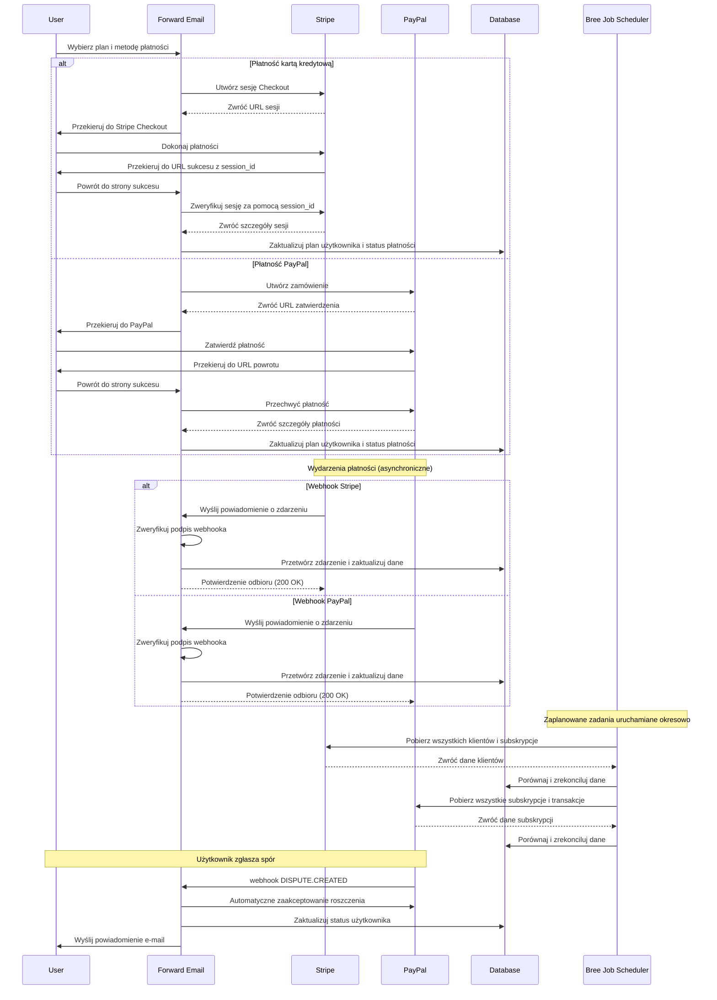
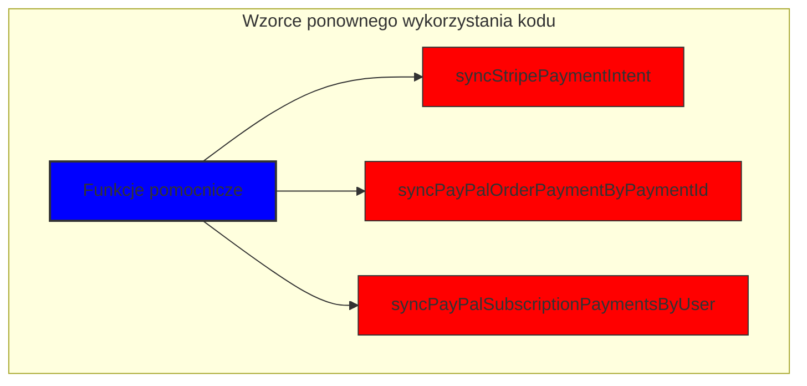
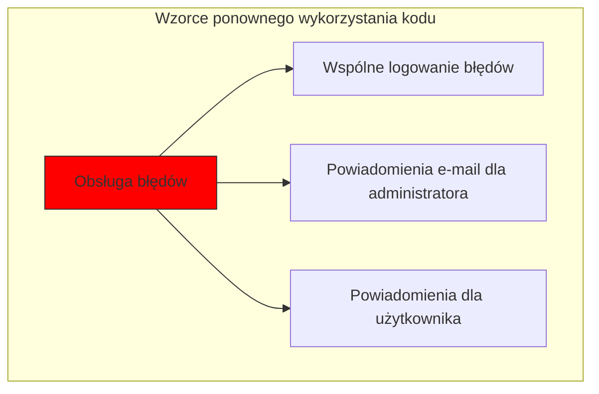
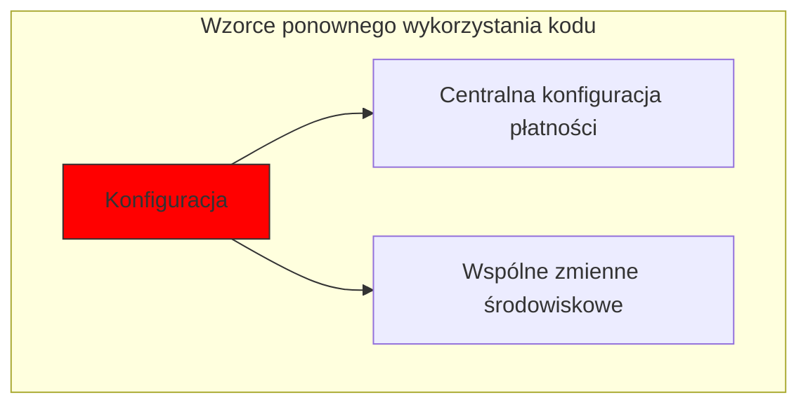
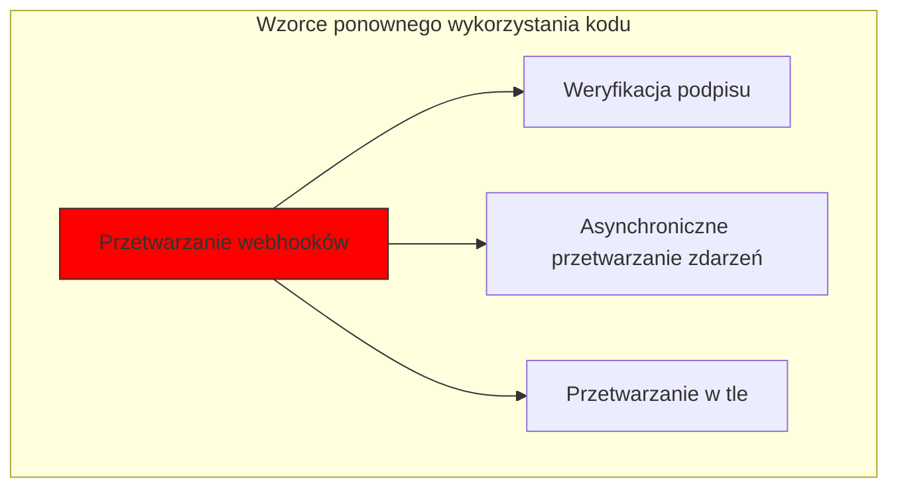
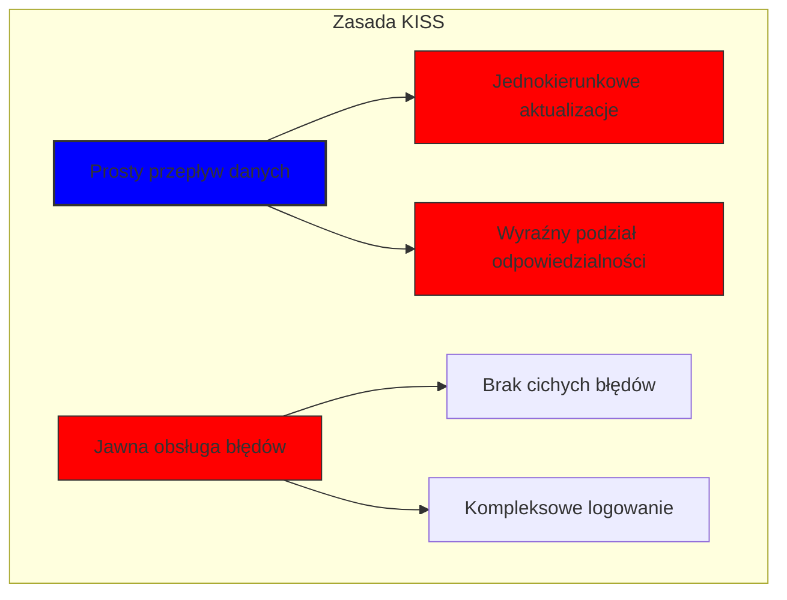

# Jak zbudowaliśmy solidny system płatności ze Stripe i PayPal: podejście trifecta {#how-we-built-a-robust-payment-system-with-stripe-and-paypal-a-trifecta-approach}


## Spis treści {#table-of-contents}

* [Przedmowa](#foreword)
* [Wyzwanie: Wielu dostawców płatności, jedno źródło prawdy](#the-challenge-multiple-payment-processors-one-source-of-truth)
* [Podejście trifecta: trzy warstwy niezawodności](#the-trifecta-approach-three-layers-of-reliability)
* [Warstwa 1: przekierowania po zakończeniu płatności](#layer-1-post-checkout-redirects)
  * [Implementacja Stripe Checkout](#stripe-checkout-implementation)
  * [Proces płatności PayPal](#paypal-payment-flow)
* [Warstwa 2: obsługa webhooków z weryfikacją podpisu](#layer-2-webhook-handlers-with-signature-verification)
  * [Implementacja webhooka Stripe](#stripe-webhook-implementation)
  * [Implementacja webhooka PayPal](#paypal-webhook-implementation)
* [Warstwa 3: zadania automatyczne z Bree](#layer-3-automated-jobs-with-bree)
  * [Sprawdzanie dokładności subskrypcji](#subscription-accuracy-checker)
  * [Synchronizacja subskrypcji PayPal](#paypal-subscription-synchronization)
* [Obsługa przypadków brzegowych](#handling-edge-cases)
  * [Wykrywanie i zapobieganie oszustwom](#fraud-detection-and-prevention)
  * [Obsługa sporów](#dispute-handling)
* [Ponowne wykorzystanie kodu: zasady KISS i DRY](#code-reuse-kiss-and-dry-principles)
* [Implementacja wymagań subskrypcji VISA](#visa-subscription-requirements-implementation)
  * [Automatyczne powiadomienia e-mail przed odnowieniem](#automated-pre-renewal-email-notifications)
  * [Obsługa przypadków brzegowych](#handling-edge-cases-1)
  * [Okresy próbne i warunki subskrypcji](#trial-periods-and-subscription-terms)
* [Podsumowanie: korzyści naszego podejścia trifecta](#conclusion-the-benefits-of-our-trifecta-approach)


## Przedmowa {#foreword}

W Forward Email zawsze stawialiśmy na tworzenie systemów, które są niezawodne, dokładne i przyjazne dla użytkownika. Gdy przyszło do wdrożenia naszego systemu przetwarzania płatności, wiedzieliśmy, że potrzebujemy rozwiązania, które poradzi sobie z wieloma dostawcami płatności, zachowując jednocześnie idealną spójność danych. Ten wpis na blogu opisuje, jak nasz zespół deweloperski zintegrował zarówno Stripe, jak i PayPal, stosując podejście trifecta, które zapewnia dokładność 1:1 w czasie rzeczywistym w całym naszym systemie.


## Wyzwanie: Wielu dostawców płatności, jedno źródło prawdy {#the-challenge-multiple-payment-processors-one-source-of-truth}

Jako usługa e-mailowa skoncentrowana na prywatności, chcieliśmy dać naszym użytkownikom różne opcje płatności. Niektórzy wolą prostotę płatności kartą kredytową przez Stripe, inni cenią dodatkową warstwę separacji, jaką zapewnia PayPal. Jednak wsparcie wielu dostawców płatności wprowadza znaczną złożoność:

1. Jak zapewnić spójność danych między różnymi systemami płatności?
2. Jak radzić sobie z przypadkami brzegowymi, takimi jak spory, zwroty czy nieudane płatności?
3. Jak utrzymać jedno źródło prawdy w naszej bazie danych?

Naszym rozwiązaniem było wdrożenie tego, co nazywamy „podejściem trifecta” – trzywarstwowego systemu, który zapewnia redundancję i gwarantuje spójność danych bez względu na okoliczności.


## Podejście trifecta: trzy warstwy niezawodności {#the-trifecta-approach-three-layers-of-reliability}

Nasz system płatności składa się z trzech kluczowych komponentów, które współpracują, aby zapewnić idealną synchronizację danych:

1. **Przekierowania po zakończeniu płatności** – przechwytywanie informacji o płatności natychmiast po zakończeniu procesu
2. **Obsługa webhooków** – przetwarzanie zdarzeń w czasie rzeczywistym od dostawców płatności
3. **Zadania automatyczne** – okresowa weryfikacja i uzgadnianie danych płatności

Przyjrzyjmy się każdemu komponentowi i zobaczmy, jak współdziałają.


```mermaid
flowchart TD
    User([User]) --> |Selects plan| Checkout[Checkout Page]

    %% Layer 1: Post-checkout redirects
    subgraph "Warstwa 1: przekierowania po zakończeniu płatności"
        Checkout --> |Credit Card| Stripe[Stripe Checkout]
        Checkout --> |PayPal| PayPal[PayPal Payment]

        Stripe --> |Success URL with session_id| SuccessPage[Success Page]
        PayPal --> |Return URL| SuccessPage

        SuccessPage --> |Verify payment| Database[(Database Update)]
    end

    %% Layer 2: Webhooks
    subgraph "Warstwa 2: obsługa webhooków"
        StripeEvents[Stripe Events] --> |Real-time notifications| StripeWebhook[Stripe Webhook Handler]
        PayPalEvents[PayPal Events] --> |Real-time notifications| PayPalWebhook[PayPal Webhook Handler]

        StripeWebhook --> |Verify signature| ProcessStripeEvent[Process Stripe Event]
        PayPalWebhook --> |Verify signature| ProcessPayPalEvent[Process PayPal Event]

        ProcessStripeEvent --> Database
        ProcessPayPalEvent --> Database
    end

    %% Layer 3: Automated jobs
    subgraph "Warstwa 3: zadania automatyczne Bree"
        BreeScheduler[Bree Scheduler] --> StripeSync[Stripe Sync Job]
        BreeScheduler --> PayPalSync[PayPal Sync Job]
        BreeScheduler --> AccuracyCheck[Subscription Accuracy Check]

        StripeSync --> |Verify & reconcile| Database
        PayPalSync --> |Verify & reconcile| Database
        AccuracyCheck --> |Ensure consistency| Database
    end

    %% Edge cases
    subgraph "Obsługa przypadków brzegowych"
        ProcessStripeEvent --> |Fraud detection| FraudCheck[Fraud Check]
        ProcessPayPalEvent --> |Dispute created| DisputeHandler[Dispute Handler]

        FraudCheck --> |Ban user if fraudulent| Database
        DisputeHandler --> |Accept claim & refund| Database

        FraudCheck --> |Send alert| AdminNotification[Admin Notification]
        DisputeHandler --> |Send alert| AdminNotification
    end

    %% Style definitions
    classDef primary fill:blue,stroke:#333,stroke-width:2px;
    classDef secondary fill:red,stroke:#333,stroke-width:1px;
    classDef tertiary fill:green,stroke:#333,stroke-width:1px;

    class Checkout,SuccessPage primary;
    class Stripe,PayPal,StripeWebhook,PayPalWebhook,BreeScheduler secondary;
    class FraudCheck,DisputeHandler tertiary;
```
## Warstwa 1: Przekierowania po zakończeniu płatności {#layer-1-post-checkout-redirects}

Pierwsza warstwa naszego podejścia trifecta następuje natychmiast po dokonaniu płatności przez użytkownika. Zarówno Stripe, jak i PayPal oferują mechanizmy przekierowujące użytkowników z powrotem na naszą stronę z informacjami o transakcji.

### Implementacja Stripe Checkout {#stripe-checkout-implementation}

W przypadku Stripe korzystamy z ich API Checkout Sessions, aby stworzyć płynne doświadczenie płatności. Gdy użytkownik wybiera plan i decyduje się zapłacić kartą kredytową, tworzymy sesję Checkout z określonymi adresami URL sukcesu i anulowania:

```javascript
const options = {
  mode: paymentType === 'one-time' ? 'payment' : 'subscription',
  customer: ctx.state.user[config.userFields.stripeCustomerID],
  client_reference_id: reference,
  metadata: {
    plan
  },
  line_items: [
    {
      price,
      quantity: 1,
      description
    }
  ],
  locale: config.STRIPE_LOCALES.has(ctx.locale) ? ctx.locale : 'auto',
  cancel_url: `${config.urls.web}${ctx.path}${
    isMakePayment || isEnableAutoRenew ? '' : `/?plan=${plan}`
  }`,
  success_url: `${config.urls.web}${ctx.path}/?${
    isMakePayment || isEnableAutoRenew ? '' : `plan=${plan}&`
  }session_id={CHECKOUT_SESSION_ID}`,
  allow_promotion_codes: true
};

// Create the checkout session and redirect
const session = await stripe.checkout.sessions.create(options);
const redirectTo = session.url;
if (ctx.accepts('html')) {
  ctx.status = 303;
  ctx.redirect(redirectTo);
} else {
  ctx.body = { redirectTo };
}
```

Kluczową częścią jest tutaj parametr `success_url`, który zawiera `session_id` jako parametr zapytania. Gdy Stripe przekierowuje użytkownika z powrotem na naszą stronę po pomyślnej płatności, możemy użyć tego ID sesji do weryfikacji transakcji i odpowiedniej aktualizacji bazy danych.

### Proces płatności PayPal {#paypal-payment-flow}

W przypadku PayPal stosujemy podobne podejście z ich API Orders:

```javascript
const requestBody = {
  intent: 'CAPTURE',
  application_context: {
    cancel_url: `${config.urls.web}${ctx.path}${
      isMakePayment || isEnableAutoRenew ? '' : `/?plan=${plan}`
    }`,
    return_url: `${config.urls.web}${ctx.path}/?plan=${plan}`,
    brand_name: 'Forward Email',
    shipping_preference: 'NO_SHIPPING',
    user_action: 'PAY_NOW'
  },
  payer: {
    email_address: ctx.state.user.email
  },
  purchase_units: [
    {
      reference_id: ctx.state.user.id,
      description,
      custom_id: sku,
      invoice_id: reference,
      soft_descriptor: sku,
      amount: {
        currency_code: 'USD',
        value: price,
        breakdown: {
          item_total: {
            currency_code: 'USD',
            value: price
          }
        }
      },
      items: [
        {
          name,
          description,
          sku,
          unit_amount: {
            currency_code: 'USD',
            value: price
          },
          quantity: '1',
          category: 'DIGITAL_GOODS'
        }
      ]
    }
  ]
};
```

Podobnie jak w Stripe, określamy parametry `return_url` i `cancel_url` do obsługi przekierowań po płatności. Gdy PayPal przekierowuje użytkownika z powrotem na naszą stronę, możemy przechwycić szczegóły płatności i zaktualizować bazę danych.


```mermaid
sequenceDiagram
    participant User
    participant FE as Forward Email
    participant Stripe
    participant PayPal
    participant DB as Database
    participant Bree as Bree Job Scheduler

    %% Initial checkout flow
    User->>FE: Wybierz plan i metodę płatności

    alt Płatność kartą kredytową
        FE->>Stripe: Utwórz sesję Checkout
        Stripe-->>FE: Zwróć URL sesji
        FE->>User: Przekieruj do Stripe Checkout
        User->>Stripe: Dokonaj płatności
        Stripe->>User: Przekieruj do URL sukcesu z session_id
        User->>FE: Powrót do strony sukcesu
        FE->>Stripe: Zweryfikuj sesję za pomocą session_id
        Stripe-->>FE: Zwróć szczegóły sesji
        FE->>DB: Zaktualizuj plan użytkownika i status płatności
    else Płatność PayPal
        FE->>PayPal: Utwórz zamówienie
        PayPal-->>FE: Zwróć URL zatwierdzenia
        FE->>User: Przekieruj do PayPal
        User->>PayPal: Zatwierdź płatność
        PayPal->>User: Przekieruj do URL powrotu
        User->>FE: Powrót do strony sukcesu
        FE->>PayPal: Przechwyć płatność
        PayPal-->>FE: Zwróć szczegóły płatności
        FE->>DB: Zaktualizuj plan użytkownika i status płatności
    end

    %% Webhook flow (asynchronous)
    Note over Stripe,PayPal: Wydarzenia płatności (asynchroniczne)

    alt Webhook Stripe
        Stripe->>FE: Wyślij powiadomienie o zdarzeniu
        FE->>FE: Zweryfikuj podpis webhooka
        FE->>DB: Przetwórz zdarzenie i zaktualizuj dane
        FE-->>Stripe: Potwierdzenie odbioru (200 OK)
    else Webhook PayPal
        PayPal->>FE: Wyślij powiadomienie o zdarzeniu
        FE->>FE: Zweryfikuj podpis webhooka
        FE->>DB: Przetwórz zdarzenie i zaktualizuj dane
        FE-->>PayPal: Potwierdzenie odbioru (200 OK)
    end

    %% Automatyczne zadania Bree
    Note over Bree: Zaplanowane zadania uruchamiane okresowo

    Bree->>Stripe: Pobierz wszystkich klientów i subskrypcje
    Stripe-->>Bree: Zwróć dane klientów
    Bree->>DB: Porównaj i zrekonciluj dane

    Bree->>PayPal: Pobierz wszystkie subskrypcje i transakcje
    PayPal-->>Bree: Zwróć dane subskrypcji
    Bree->>DB: Porównaj i zrekonciluj dane

    %% Przypadek brzegowy: Obsługa sporu
    Note over User,PayPal: Użytkownik zgłasza spór

    PayPal->>FE: webhook DISPUTE.CREATED
    FE->>PayPal: Automatyczne zaakceptowanie roszczenia
    FE->>DB: Zaktualizuj status użytkownika
    FE->>User: Wyślij powiadomienie e-mail
```
## Warstwa 2: Obsługa webhooków z weryfikacją podpisu {#layer-2-webhook-handlers-with-signature-verification}

Chociaż przekierowania po zakończeniu płatności działają dobrze w większości scenariuszy, nie są niezawodne. Użytkownicy mogą zamknąć przeglądarkę przed przekierowaniem lub problemy z siecią mogą uniemożliwić zakończenie przekierowania. W takich sytuacjach przydają się webhooki.

Zarówno Stripe, jak i PayPal oferują systemy webhooków, które wysyłają powiadomienia w czasie rzeczywistym o zdarzeniach płatniczych. Zaimplementowaliśmy solidne obsługi webhooków, które weryfikują autentyczność tych powiadomień i odpowiednio je przetwarzają.

### Implementacja webhooka Stripe {#stripe-webhook-implementation}

Nasz handler webhooka Stripe weryfikuje podpis przychodzących zdarzeń webhook, aby upewnić się, że są one prawdziwe:

```javascript
async function webhook(ctx) {
  const sig = ctx.request.get('stripe-signature');
  // wyrzuć błąd, jeśli coś jest nie tak
  if (!isSANB(sig))
    throw Boom.badRequest(ctx.translateError('INVALID_STRIPE_SIGNATURE'));
  const event = stripe.webhooks.constructEvent(
    ctx.request.rawBody,
    sig,
    env.STRIPE_ENDPOINT_SECRET
  );
  // wyrzuć błąd, jeśli coś jest nie tak
  if (!event)
    throw Boom.badRequest(ctx.translateError('INVALID_STRIPE_SIGNATURE'));
  ctx.logger.info('stripe webhook', { event });
  // zwróć odpowiedź potwierdzającą odbiór zdarzenia
  ctx.body = { received: true };
  // uruchom w tle
  processEvent(ctx, event)
    .then()
    .catch((err) => {
      ctx.logger.fatal(err, { event });
      // wyślij e-mail z błędami do administratora
      emailHelper({
        template: 'alert',
        message: {
          to: config.email.message.from,
          subject: `Błąd webhooka Stripe (ID zdarzenia ${event.id})`
        },
        locals: {
          message: `<pre><code>${safeStringify(
            parseErr(err),
            null,
            2
          )}</code></pre>`
        }
      })
        .then()
        .catch((err) => ctx.logger.fatal(err, { event }));
    });
}
```

Funkcja `stripe.webhooks.constructEvent` weryfikuje podpis za pomocą naszego sekretu endpointu. Jeśli podpis jest ważny, przetwarzamy zdarzenie asynchronicznie, aby nie blokować odpowiedzi webhooka.

### Implementacja webhooka PayPal {#paypal-webhook-implementation}

Podobnie, nasz handler webhooka PayPal weryfikuje autentyczność przychodzących powiadomień:

```javascript
async function webhook(ctx) {
  const response = await promisify(
    paypal.notification.webhookEvent.verify,
    paypal.notification.webhookEvent
  )(ctx.request.headers, ctx.request.body, env.PAYPAL_WEBHOOK_ID);
  // wyrzuć błąd, jeśli coś jest nie tak
  if (!_.isObject(response) || response.verification_status !== 'SUCCESS')
    throw Boom.badRequest(ctx.translateError('INVALID_PAYPAL_SIGNATURE'));
  // zwróć odpowiedź potwierdzającą odbiór zdarzenia
  ctx.body = { received: true };
  // uruchom w tle
  processEvent(ctx)
    .then()
    .catch((err) => {
      ctx.logger.fatal(err);
      // wyślij e-mail z błędami do administratora
      emailHelper({
        template: 'alert',
        message: {
          to: config.email.message.from,
          subject: `Błąd webhooka PayPal (ID zdarzenia ${ctx.request.body.id})`
        },
        locals: {
          message: `<pre><code>${safeStringify(
            parseErr(err),
            null,
            2
          )}</code></pre>`
        }
      })
        .then()
        .catch((err) => ctx.logger.fatal(err));
    });
}
```

Oba handlery webhooków stosują ten sam schemat: weryfikują podpis, potwierdzają odbiór i asynchronicznie przetwarzają zdarzenie. Dzięki temu nigdy nie tracimy informacji o zdarzeniach płatniczych, nawet jeśli przekierowanie po zakończeniu płatności zawiedzie.


## Warstwa 3: Automatyczne zadania z Bree {#layer-3-automated-jobs-with-bree}

Ostatnią warstwą naszego podejścia jest zestaw automatycznych zadań, które okresowo weryfikują i uzgadniają dane płatności. Używamy Bree, harmonogramu zadań dla Node.js, aby uruchamiać te zadania w regularnych odstępach czasu.

### Sprawdzanie poprawności subskrypcji {#subscription-accuracy-checker}

Jednym z kluczowych zadań jest sprawdzanie poprawności subskrypcji, które zapewnia, że nasza baza danych dokładnie odzwierciedla status subskrypcji w Stripe:
```javascript
async function mapper(customer) {
  // wait a second to prevent rate limitation error
  await setTimeout(ms('1s'));
  // check for user on our side
  let user = await Users.findOne({
    [config.userFields.stripeCustomerID]: customer.id
  })
    .lean()
    .exec();
  if (!user) return;
  if (user.is_banned) return;

  // if emails did not match
  if (user.email !== customer.email) {
    logger.info(
      `User email ${user.email} did not match customer email ${customer.email} (${customer.id})`
    );
    customer = await stripe.customers.update(customer.id, {
      email: user.email
    });
    logger.info(`Updated user email to match ${user.email}`);
  }

  // check for active subscriptions
  const [activeSubscriptions, trialingSubscriptions] = await Promise.all([
    stripe.subscriptions.list({
      customer: customer.id,
      status: 'active'
    }),
    stripe.subscriptions.list({
      customer: customer.id,
      status: 'trialing'
    })
  ]);

  // Combine active and trialing subscriptions
  let subscriptions = [
    ...activeSubscriptions.data,
    ...trialingSubscriptions.data
  ];

  // Handle edge case: multiple subscriptions for one user
  if (subscriptions.length > 1) {
    await logger.error(
      new Error(
        `We may need to refund: User had multiple subscriptions ${user.email} (${customer.id})`
      )
    );
    await emailHelper({
      template: 'alert',
      message: {
        to: config.email.message.from,
        subject: `User had multiple subscriptions ${user.email}`
      },
      locals: {
        message: `User ${user.email} (${customer.id}) had multiple subscriptions: ${JSON.stringify(
          subscriptions.map((s) => s.id)
        )}`
      }
    });
  }
}
```

This job checks for discrepancies between our database and Stripe, such as mismatched email addresses or multiple active subscriptions. If it finds any issues, it logs them and sends alerts to our admin team.

### PayPal Subscription Synchronization {#paypal-subscription-synchronization}

We have a similar job for PayPal subscriptions:

```javascript
async function syncPayPalSubscriptionPayments() {
  const paypalCustomers = await Users.find({
    $or: [
      {
        [config.userFields.paypalSubscriptionID]: { $exists: true, $ne: null }
      },
      {
        [config.userFields.paypalPayerID]: { $exists: true, $ne: null }
      }
    ]
  })
    // sort by newest customers first
    .sort('-created_at')
    .lean()
    .exec();

  await logger.info(
    `Syncing payments for ${paypalCustomers.length} paypal customers`
  );

  // Process each customer and sync their payments
  const errorEmails = await pReduce(
    paypalCustomers,
    // Implementation details...
  );
}
```

These automated jobs serve as our final safety net, ensuring that our database always reflects the true state of subscriptions and payments in both Stripe and PayPal.


## Handling Edge Cases {#handling-edge-cases}

A robust payment system must handle edge cases gracefully. Let's look at how we handle some common scenarios.

### Fraud Detection and Prevention {#fraud-detection-and-prevention}

We've implemented sophisticated fraud detection mechanisms that automatically identify and handle suspicious payment activities:

```javascript
case 'charge.failed': {
  // Get all failed charges in the last 30 days
  const charges = await stripe.charges.list({
    customer: event.data.object.customer,
    created: {
      gte: dayjs().subtract(1, 'month').unix()
    }
  });

  // Filter for declined charges
  const filtered = charges.data.filter(
    (d) => d.status === 'failed' && d.failure_code === 'card_declined'
  );

  // if not more than 5 then return early
  if (filtered.length < 5) break;

  // Check if user has verified domains
  const count = await Domains.countDocuments({
    members: {
      $elemMatch: {
        user: user._id,
        group: 'admin'
      }
    },
    plan: { $in: ['enhanced_protection', 'team'] },
    has_txt_record: true
  });

  if (!user.is_banned) {
    // If no verified domains, ban the user and refund all charges
    if (count === 0) {
      // Ban the user
      user.is_banned = true;
      await user.save();

      // Refund all successful charges
    }
  }
}
```

Ten kod automatycznie blokuje użytkowników, którzy mają wiele nieudanych obciążeń i niezweryfikowane domeny, co jest silnym wskaźnikiem działalności oszukańczej.

### Obsługa sporów {#dispute-handling}

Gdy użytkownik zgłasza spór dotyczący opłaty, automatycznie akceptujemy roszczenie i podejmujemy odpowiednie działania:

```javascript
case 'CUSTOMER.DISPUTE.CREATED': {
  // akceptuj roszczenie
  const agent = await paypalAgent();
  await agent
    .post(`/v1/customer/disputes/${body.resource.dispute_id}/accept-claim`)
    .send({
      note: 'Pełny zwrot pieniędzy dla klienta.'
    });

  // Znajdź płatność w naszej bazie danych
  const payment = await Payments.findOne({ $or });
  if (!payment) throw new Error('Płatność nie istnieje');

  const user = await Users.findById(payment.user);
  if (!user) throw new Error('Użytkownik nie istniał dla klienta');

  // Anuluj subskrypcję użytkownika, jeśli ją posiada
  if (isSANB(user[config.userFields.paypalSubscriptionID])) {
    try {
      const agent = await paypalAgent();
      await agent.post(
        `/v1/billing/subscriptions/${
          user[config.userFields.paypalSubscriptionID]
        }/cancel`
      );
    } catch (err) {
      // Obsłuż błędy anulowania subskrypcji
    }
  }
}
```

Takie podejście minimalizuje wpływ sporów na naszą działalność, jednocześnie zapewniając dobrą obsługę klienta.


## Ponowne wykorzystanie kodu: zasady KISS i DRY {#code-reuse-kiss-and-dry-principles}

W całym naszym systemie płatności stosujemy zasady KISS (Keep It Simple, Stupid – Zachowaj prostotę) oraz DRY (Don't Repeat Yourself – Nie powtarzaj się). Oto kilka przykładów:

1. **Wspólne funkcje pomocnicze**: Stworzyliśmy wielokrotnego użytku funkcje pomocnicze do typowych zadań, takich jak synchronizacja płatności i wysyłanie e-maili.

2. **Spójna obsługa błędów**: Zarówno obsługiwacze webhooków Stripe, jak i PayPal używają tego samego wzorca obsługi błędów i powiadomień dla administratorów.

3. **Zunifikowany schemat bazy danych**: Nasz schemat bazy danych jest zaprojektowany tak, aby obsługiwać dane zarówno ze Stripe, jak i PayPal, z wspólnymi polami dla statusu płatności, kwoty i informacji o planie.

4. **Centralna konfiguracja**: Konfiguracja związana z płatnościami jest scentralizowana w jednym pliku, co ułatwia aktualizację cen i informacji o produktach.


```mermaid
graph TD
    subgraph "Wzorce ponownego wykorzystania kodu"
        A[Funkcje pomocnicze] --> B[syncStripePaymentIntent]
        A --> C[syncPayPalOrderPaymentByPaymentId]
        A --> D[syncPayPalSubscriptionPaymentsByUser]
    end

    classDef primary fill:blue,stroke:#333,stroke-width:2px;
    classDef secondary fill:red,stroke:#333,stroke-width:1px;

    class A,P,V primary;
    class B,C,D,E,I,L,Q,R,S,W,X,Y,Z secondary;
```


```mermaid
graph TD
    subgraph "Wzorce ponownego wykorzystania kodu"
        E[Obsługa błędów] --> F[Wspólne logowanie błędów]
        E --> G[Powiadomienia e-mail dla administratora]
        E --> H[Powiadomienia dla użytkownika]
    end

    classDef primary fill:blue,stroke:#333,stroke-width:2px;
    classDef secondary fill:red,stroke:#333,stroke-width:1px;

    class A,P,V primary;
    class B,C,D,E,I,L,Q,R,S,W,X,Y,Z secondary;
```


```mermaid
graph TD
    subgraph "Wzorce ponownego wykorzystania kodu"
        I[Konfiguracja] --> J[Centralna konfiguracja płatności]
        I --> K[Wspólne zmienne środowiskowe]
    end

    classDef primary fill:blue,stroke:#333,stroke-width:2px;
    classDef secondary fill:red,stroke:#333,stroke-width:1px;

    class A,P,V primary;
    class B,C,D,E,I,L,Q,R,S,W,X,Y,Z secondary;
```


```mermaid
graph TD
    subgraph "Wzorce ponownego wykorzystania kodu"
        L[Przetwarzanie webhooków] --> M[Weryfikacja podpisu]
        L --> N[Asynchroniczne przetwarzanie zdarzeń]
        L --> O[Przetwarzanie w tle]
    end

    classDef primary fill:blue,stroke:#333,stroke-width:2px;
    classDef secondary fill:red,stroke:#333,stroke-width:1px;

    class A,P,V primary;
    class B,C,D,E,I,L,Q,R,S,W,X,Y,Z secondary;
```


```mermaid
graph TD
    subgraph "Zasada KISS"
        P[Prosty przepływ danych] --> Q[Jednokierunkowe aktualizacje]
        P --> R[Wyraźny podział odpowiedzialności]

        S[Jawna obsługa błędów] --> T[Brak cichych błędów]
        S --> U[Kompleksowe logowanie]
    end

    classDef primary fill:blue,stroke:#333,stroke-width:2px;
    classDef secondary fill:red,stroke:#333,stroke-width:1px;

    class A,P,V primary;
    class B,C,D,E,I,L,Q,R,S,W,X,Y,Z secondary;
```
graph TD
    subgraph "Zasada DRY"
        V[Wspólna logika] --> W[Funkcje przetwarzania płatności]
        V --> X[Szablony e-mail]
        V --> Y[Logika walidacji]

        Z[Wspólne operacje na bazie danych] --> AA[Aktualizacje użytkowników]
        Z --> AB[Rejestrowanie płatności]
    end

    classDef primary fill:blue,stroke:#333,stroke-width:2px;
    classDef secondary fill:red,stroke:#333,stroke-width:1px;

    class A,P,V primary;
    class B,C,D,E,I,L,Q,R,S,W,X,Y,Z secondary;
```


## Implementacja wymagań subskrypcji VISA {#visa-subscription-requirements-implementation}

Oprócz naszego podejścia trifecta, wdrożyliśmy konkretne funkcje, aby spełnić wymagania subskrypcji VISA, jednocześnie poprawiając doświadczenie użytkownika. Jednym z kluczowych wymagań VISA jest to, że użytkownicy muszą być powiadomieni przed obciążeniem ich opłatą za subskrypcję, zwłaszcza podczas przejścia z okresu próbnego na płatną subskrypcję.

### Zautomatyzowane powiadomienia e-mail przed odnowieniem {#automated-pre-renewal-email-notifications}

Stworzyliśmy zautomatyzowany system, który identyfikuje użytkowników z aktywnymi subskrypcjami próbnymi i wysyła im powiadomienie e-mail przed pierwszym obciążeniem. Dzięki temu nie tylko spełniamy wymagania VISA, ale także zmniejszamy liczbę zwrotów płatności i poprawiamy satysfakcję klientów.

Oto jak zaimplementowaliśmy tę funkcję:

```javascript
// Znajdź użytkowników z subskrypcjami próbnymi, którzy jeszcze nie otrzymali powiadomienia
const users = await Users.find({
  $or: [
    {
      $and: [
        { [config.userFields.stripeSubscriptionID]: { $exists: true } },
        { [config.userFields.stripeTrialSentAt]: { $exists: false } },
        // Wyklucz subskrypcje, które już miały płatności
        ...(paidStripeSubscriptionIds.length > 0
          ? [
              {
                [config.userFields.stripeSubscriptionID]: {
                  $nin: paidStripeSubscriptionIds
                }
              }
            ]
          : [])
      ]
    },
    {
      $and: [
        { [config.userFields.paypalSubscriptionID]: { $exists: true } },
        { [config.userFields.paypalTrialSentAt]: { $exists: false } },
        // Wyklucz subskrypcje, które już miały płatności
        ...(paidPayPalSubscriptionIds.length > 0
          ? [
              {
                [config.userFields.paypalSubscriptionID]: {
                  $nin: paidPayPalSubscriptionIds
                }
              }
            ]
          : [])
      ]
    }
  ]
});

// Przetwórz każdego użytkownika i wyślij powiadomienie
for (const user of users) {
  // Pobierz szczegóły subskrypcji od procesora płatności
  const subscription = await getSubscriptionDetails(user);

  // Oblicz czas trwania subskrypcji i częstotliwość
  const duration = getDurationFromPlanId(subscription.plan_id);
  const frequency = getHumanReadableFrequency(duration, user.locale);
  const amount = getPlanAmount(user.plan, duration);

  // Pobierz domeny użytkownika do spersonalizowanego e-maila
  const domains = await Domains.find({
    'members.user': user._id
  }).sort('name').lean().exec();

  // Wyślij powiadomienie e-mail zgodne z wymaganiami VISA
  await emailHelper({
    template: 'visa-trial-subscription-requirement',
    message: {
      to: user.receipt_email || user.email,
      ...(user.receipt_email ? { cc: user.email } : {})
    },
    locals: {
      user,
      firstChargeDate: new Date(subscription.start_time),
      frequency,
      formattedAmount: numeral(amount).format('$0,0,0.00'),
      domains
    }
  });

  // Zapisz, że powiadomienie zostało wysłane
  await Users.findByIdAndUpdate(user._id, {
    $set: {
      [config.userFields.paypalTrialSentAt]: new Date()
    }
  });
}
```

To rozwiązanie zapewnia, że użytkownicy są zawsze informowani o nadchodzących obciążeniach, z jasnymi szczegółami dotyczącymi:

1. Kiedy nastąpi pierwsze obciążenie
2. Częstotliwości przyszłych obciążeń (miesięcznie, rocznie itd.)
3. Dokładnej kwoty, którą zostaną obciążeni
4. Które domeny są objęte ich subskrypcją

Automatyzując ten proces, utrzymujemy pełną zgodność z wymaganiami VISA (które nakazują powiadomienie co najmniej 7 dni przed obciążeniem), jednocześnie zmniejszając liczbę zapytań do wsparcia i poprawiając ogólne doświadczenie użytkownika.
### Obsługa przypadków brzegowych {#handling-edge-cases-1}

Nasza implementacja obejmuje również solidne zarządzanie błędami. Jeśli podczas procesu powiadamiania coś pójdzie nie tak, nasz system automatycznie powiadamia nasz zespół:

```javascript
try {
  await mapper(user);
} catch (err) {
  logger.error(err);

  // Wyślij alert do administratorów
  await emailHelper({
    template: 'alert',
    message: {
      to: config.email.message.from,
      subject: 'Błąd wymagań subskrypcji próbnej VISA'
    },
    locals: {
      message: `<pre><code>${safeStringify(
        parseErr(err),
        null,
        2
      )}</code></pre>`
    }
  });
}
```

Zapewnia to, że nawet jeśli wystąpi problem z systemem powiadomień, nasz zespół może szybko go rozwiązać i utrzymać zgodność z wymaganiami VISA.

System powiadomień o subskrypcji VISA to kolejny przykład, jak zbudowaliśmy naszą infrastrukturę płatniczą z myślą zarówno o zgodności, jak i doświadczeniu użytkownika, uzupełniając nasze podejście trifecta, aby zapewnić niezawodne i przejrzyste przetwarzanie płatności.

### Okresy próbne i warunki subskrypcji {#trial-periods-and-subscription-terms}

Dla użytkowników włączających automatyczne odnawianie na istniejących planach, obliczamy odpowiedni okres próbny, aby upewnić się, że nie zostaną obciążeni, dopóki ich obecny plan nie wygaśnie:

```javascript
if (
  isEnableAutoRenew &&
  dayjs(ctx.state.user[config.userFields.planExpiresAt]).isAfter(
    dayjs()
  )
) {
  const hours = dayjs(
    ctx.state.user[config.userFields.planExpiresAt]
  ).diff(dayjs(), 'hours');

  // Obsługa obliczania okresu próbnego
}
```

Zapewniamy również jasne informacje o warunkach subskrypcji, w tym o częstotliwości rozliczeń i zasadach anulowania, oraz dołączamy szczegółowe metadane do każdej subskrypcji, aby zapewnić właściwe śledzenie i zarządzanie.


## Podsumowanie: Korzyści naszego podejścia trifecta {#conclusion-the-benefits-of-our-trifecta-approach}

Nasze podejście trifecta do przetwarzania płatności przyniosło kilka kluczowych korzyści:

1. **Niezawodność**: Dzięki wdrożeniu trzech warstw weryfikacji płatności zapewniamy, że żadna płatność nie zostanie pominięta ani błędnie przetworzona.

2. **Dokładność**: Nasza baza danych zawsze odzwierciedla rzeczywisty stan subskrypcji i płatności zarówno w Stripe, jak i PayPal.

3. **Elastyczność**: Użytkownicy mogą wybrać preferowaną metodę płatności bez kompromisów w zakresie niezawodności naszego systemu.

4. **Odporność**: Nasz system radzi sobie z przypadkami brzegowymi w sposób płynny, od awarii sieci po działania oszukańcze.

Jeśli wdrażasz system płatności obsługujący wielu operatorów, zdecydowanie polecamy to podejście trifecta. Wymaga ono większego nakładu pracy na początku, ale długoterminowe korzyści w zakresie niezawodności i dokładności są tego warte.

Aby uzyskać więcej informacji o Forward Email i naszych usługach e-mail skoncentrowanych na prywatności, odwiedź naszą [stronę internetową](https://forwardemail.net).

<!-- *Keywords: payment processing, Stripe integration, PayPal integration, webhook handling, payment synchronization, subscription management, fraud prevention, dispute handling, Node.js payment system, multi-processor payment system, payment gateway integration, real-time payment verification, payment data consistency, subscription billing, payment security, payment automation, payment webhooks, payment reconciliation, payment edge cases, payment error handling, VISA subscription requirements, pre-renewal notifications, subscription compliance* -->
