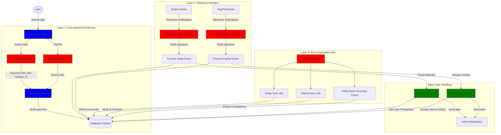
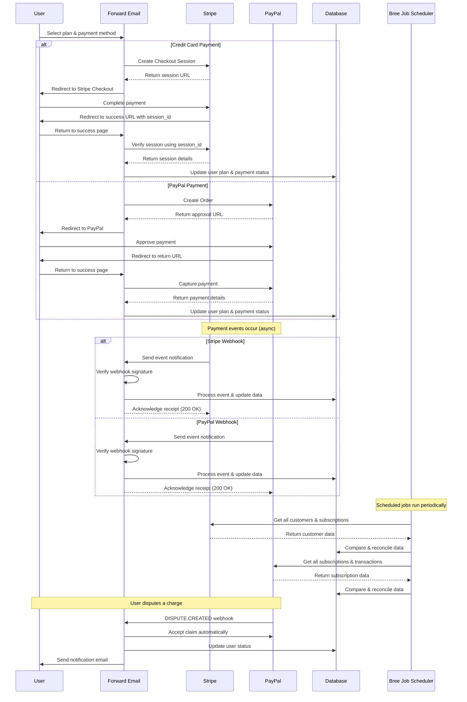
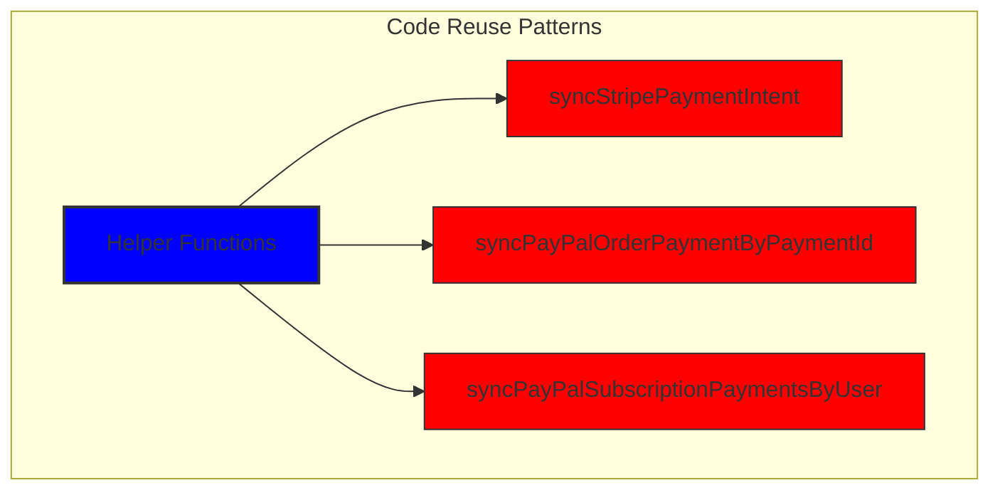
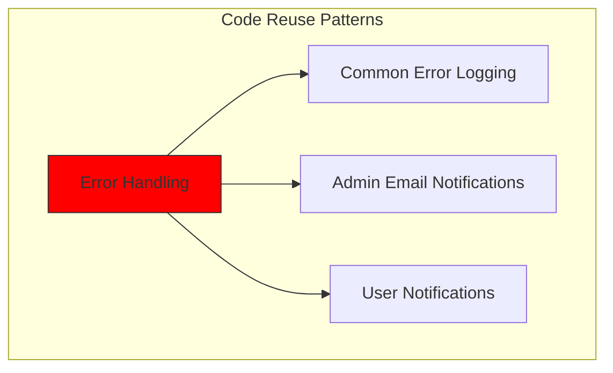
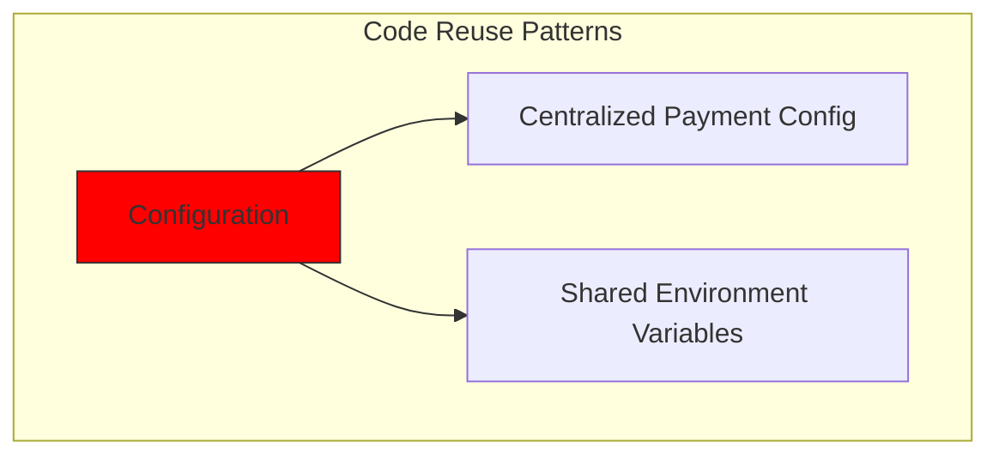
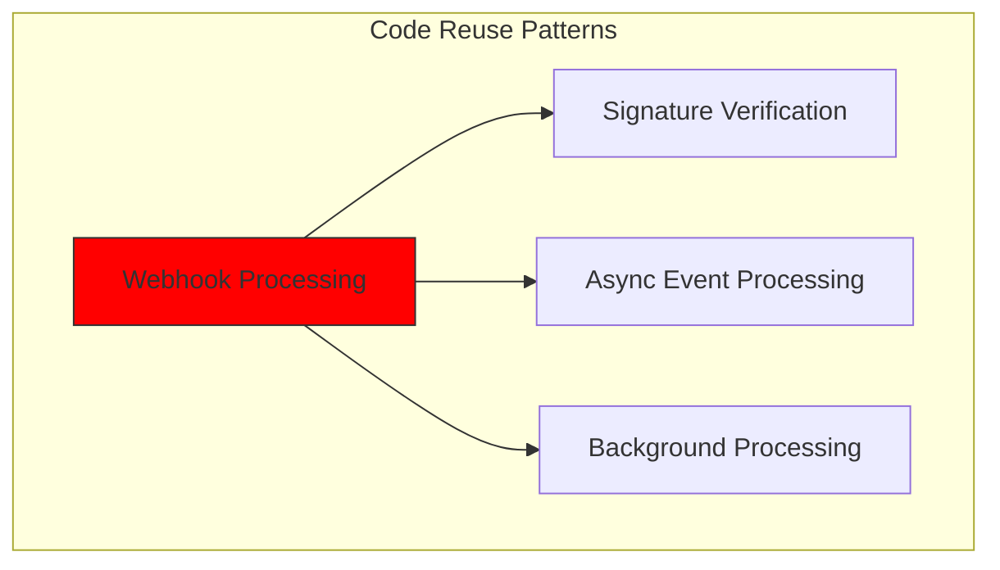
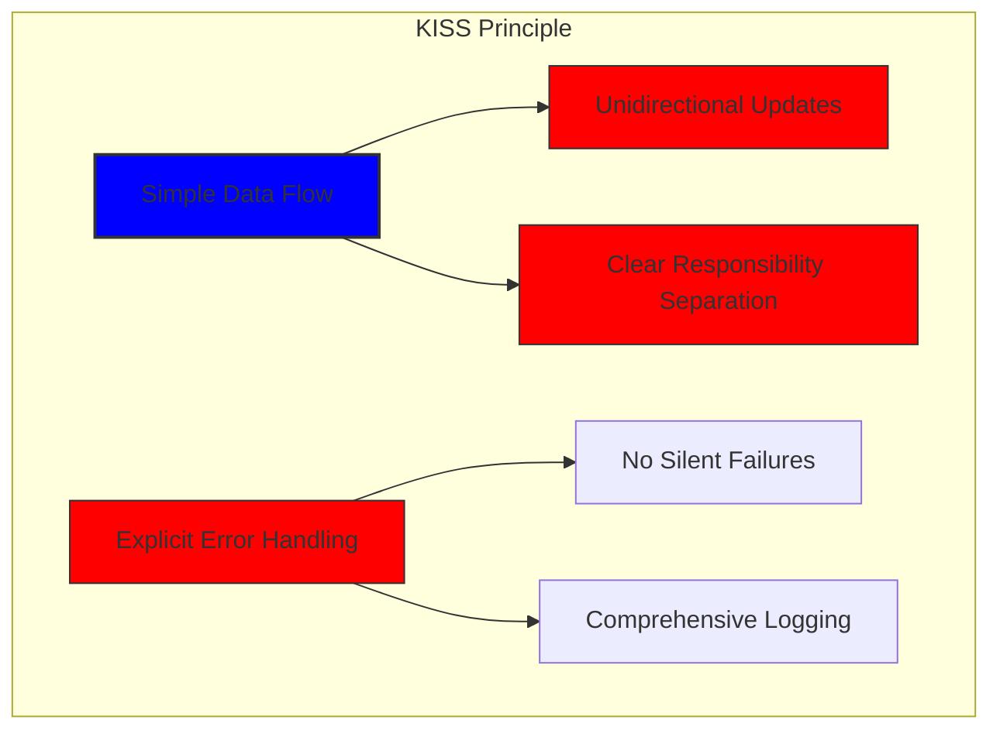
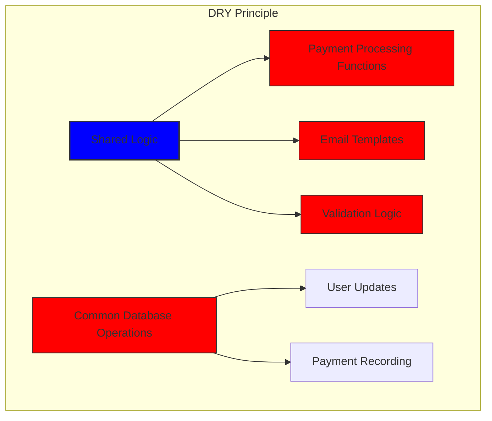

# Como construímos um sistema de pagamento robusto com Stripe e PayPal: uma abordagem trifecta {#how-we-built-a-robust-payment-system-with-stripe-and-paypal-a-trifecta-approach}


## Índice {#table-of-contents}

* [Prefácio](#foreword)
* [O Desafio: Vários Processadores de Pagamento, Uma Fonte de Verdade](#the-challenge-multiple-payment-processors-one-source-of-truth)
* [A Abordagem Trifecta: Três Camadas de Confiabilidade](#the-trifecta-approach-three-layers-of-reliability)
* [Camada 1: Redirecionamentos pós-checkout](#layer-1-post-checkout-redirects)
  * [Implementação do Stripe Checkout](#stripe-checkout-implementation)
  * [Fluxo de pagamento do PayPal](#paypal-payment-flow)
* [Camada 2: Manipuladores de Webhook com Verificação de Assinatura](#layer-2-webhook-handlers-with-signature-verification)
  * [Implementação do Stripe Webhook](#stripe-webhook-implementation)
  * [Implementação do PayPal Webhook](#paypal-webhook-implementation)
* [Camada 3: Trabalhos automatizados com Bree](#layer-3-automated-jobs-with-bree)
  * [Verificador de precisão de assinatura](#subscription-accuracy-checker)
  * [Sincronização de assinatura do PayPal](#paypal-subscription-synchronization)
* [Lidando com casos extremos](#handling-edge-cases)
  * [Detecção e Prevenção de Fraudes](#fraud-detection-and-prevention)
  * [Tratamento de Disputas](#dispute-handling)
* [Reutilização de código: princípios KISS e DRY](#code-reuse-kiss-and-dry-principles)
* [Implementação dos Requisitos de Assinatura VISA](#visa-subscription-requirements-implementation)
  * [Notificações automatizadas por e-mail de pré-renovação](#automated-pre-renewal-email-notifications)
  * [Lidando com casos extremos](#handling-edge-cases-1)
  * [Períodos de teste e termos de assinatura](#trial-periods-and-subscription-terms)
* [Conclusão: Os benefícios da nossa abordagem Trifecta](#conclusion-the-benefits-of-our-trifecta-approach)

## Prefácio {#foreword}

Na Forward Email, sempre priorizamos a criação de sistemas confiáveis, precisos e fáceis de usar. Quando implementamos nosso sistema de processamento de pagamentos, sabíamos que precisávamos de uma solução que pudesse lidar com múltiplos processadores de pagamento, mantendo a consistência perfeita dos dados. Este post detalha como nossa equipe de desenvolvimento integrou o Stripe e o PayPal usando uma abordagem tripla que garante precisão 1:1 em tempo real em todo o nosso sistema.

## O Desafio: Vários Processadores de Pagamento, Uma Fonte de Verdade {#the-challenge-multiple-payment-processors-one-source-of-truth}

Como um serviço de e-mail focado em privacidade, queríamos oferecer aos nossos usuários opções de pagamento. Alguns preferem a simplicidade dos pagamentos com cartão de crédito pelo Stripe, enquanto outros valorizam a camada adicional de separação que o PayPal oferece. No entanto, oferecer suporte a múltiplos processadores de pagamento apresenta uma complexidade significativa:

1. Como garantimos a consistência dos dados em diferentes sistemas de pagamento?
2. Como lidamos com casos extremos, como disputas, reembolsos ou pagamentos não realizados?
3. Como mantemos uma única fonte de verdade em nosso banco de dados?

Nossa solução foi implementar o que chamamos de "abordagem trifecta" — um sistema de três camadas que fornece redundância e garante a consistência dos dados, não importa o que aconteça.

## A abordagem Trifecta: três camadas de confiabilidade {#the-trifecta-approach-three-layers-of-reliability}

Nosso sistema de pagamento consiste em três componentes críticos que trabalham juntos para garantir a sincronização perfeita de dados:

1. **Redirecionamentos pós-checkout** - Captura de informações de pagamento imediatamente após o checkout
2. **Gerenciadores de webhook** - Processamento de eventos em tempo real de processadores de pagamento
3. **Tarefas automatizadas** - Verificação e reconciliação periódica de dados de pagamento

Vamos analisar cada componente e ver como eles funcionam juntos.



## Camada 1: Redirecionamentos pós-checkout {#layer-1-post-checkout-redirects}

A primeira camada da nossa abordagem trifecta acontece imediatamente após o usuário concluir um pagamento. Tanto o Stripe quanto o PayPal oferecem mecanismos para redirecionar os usuários de volta ao nosso site com informações sobre a transação.

### Implementação de checkout do Stripe {#stripe-checkout-implementation}

Para o Stripe, usamos a API de Sessões de Checkout para criar uma experiência de pagamento integrada. Quando um usuário seleciona um plano e opta por pagar com cartão de crédito, criamos uma Sessão de Checkout com URLs específicas de sucesso e cancelamento:

```javascript
const options = {
  mode: paymentType === 'one-time' ? 'payment' : 'subscription',
  customer: ctx.state.user[config.userFields.stripeCustomerID],
  client_reference_id: reference,
  metadata: {
    plan
  },
  line_items: [
    {
      price,
      quantity: 1,
      description
    }
  ],
  locale: config.STRIPE_LOCALES.has(ctx.locale) ? ctx.locale : 'auto',
  cancel_url: `${config.urls.web}${ctx.path}${
    isMakePayment || isEnableAutoRenew ? '' : `/?plan=${plan}`
  }`,
  success_url: `${config.urls.web}${ctx.path}/?${
    isMakePayment || isEnableAutoRenew ? '' : `plan=${plan}&`
  }session_id={CHECKOUT_SESSION_ID}`,
  allow_promotion_codes: true
};

// Create the checkout session and redirect
const session = await stripe.checkout.sessions.create(options);
const redirectTo = session.url;
if (ctx.accepts('html')) {
  ctx.status = 303;
  ctx.redirect(redirectTo);
} else {
  ctx.body = { redirectTo };
}
```

A parte crítica aqui é o parâmetro `success_url`, que inclui o `session_id` como parâmetro de consulta. Quando o Stripe redireciona o usuário de volta ao nosso site após um pagamento bem-sucedido, podemos usar esse ID de sessão para verificar a transação e atualizar nosso banco de dados adequadamente.

### Fluxo de pagamento do PayPal {#paypal-payment-flow}

Para o PayPal, usamos uma abordagem semelhante com sua API de pedidos:

```javascript
const requestBody = {
  intent: 'CAPTURE',
  application_context: {
    cancel_url: `${config.urls.web}${ctx.path}${
      isMakePayment || isEnableAutoRenew ? '' : `/?plan=${plan}`
    }`,
    return_url: `${config.urls.web}${ctx.path}/?plan=${plan}`,
    brand_name: 'Forward Email',
    shipping_preference: 'NO_SHIPPING',
    user_action: 'PAY_NOW'
  },
  payer: {
    email_address: ctx.state.user.email
  },
  purchase_units: [
    {
      reference_id: ctx.state.user.id,
      description,
      custom_id: sku,
      invoice_id: reference,
      soft_descriptor: sku,
      amount: {
        currency_code: 'USD',
        value: price,
        breakdown: {
          item_total: {
            currency_code: 'USD',
            value: price
          }
        }
      },
      items: [
        {
          name,
          description,
          sku,
          unit_amount: {
            currency_code: 'USD',
            value: price
          },
          quantity: '1',
          category: 'DIGITAL_GOODS'
        }
      ]
    }
  ]
};
```

Semelhante ao Stripe, especificamos os parâmetros `return_url` e `cancel_url` para lidar com redirecionamentos pós-pagamento. Quando o PayPal redireciona o usuário de volta ao nosso site, podemos capturar os detalhes do pagamento e atualizar nosso banco de dados.



## Camada 2: Manipuladores de Webhook com Verificação de Assinatura {#layer-2-webhook-handlers-with-signature-verification}

Embora os redirecionamentos pós-checkout funcionem bem na maioria dos cenários, eles não são infalíveis. Os usuários podem fechar o navegador antes de serem redirecionados, ou problemas de rede podem impedir a conclusão do redirecionamento. É aí que entram os webhooks.

Tanto o Stripe quanto o PayPal oferecem sistemas de webhook que enviam notificações em tempo real sobre eventos de pagamento. Implementamos manipuladores de webhook robustos que verificam a autenticidade dessas notificações e as processam adequadamente.

### Implementação do Stripe Webhook {#stripe-webhook-implementation}

Nosso manipulador de webhook Stripe verifica a assinatura de eventos de webhook recebidos para garantir que eles sejam legítimos:

```javascript
async function webhook(ctx) {
  const sig = ctx.request.get('stripe-signature');
  // throw an error if something was wrong
  if (!isSANB(sig))
    throw Boom.badRequest(ctx.translateError('INVALID_STRIPE_SIGNATURE'));
  const event = stripe.webhooks.constructEvent(
    ctx.request.rawBody,
    sig,
    env.STRIPE_ENDPOINT_SECRET
  );
  // throw an error if something was wrong
  if (!event)
    throw Boom.badRequest(ctx.translateError('INVALID_STRIPE_SIGNATURE'));
  ctx.logger.info('stripe webhook', { event });
  // return a response to acknowledge receipt of the event
  ctx.body = { received: true };
  // run in background
  processEvent(ctx, event)
    .then()
    .catch((err) => {
      ctx.logger.fatal(err, { event });
      // email admin errors
      emailHelper({
        template: 'alert',
        message: {
          to: config.email.message.from,
          subject: `Error with Stripe Webhook (Event ID ${event.id})`
        },
        locals: {
          message: `<pre><code>${safeStringify(
            parseErr(err),
            null,
            2
          )}</code></pre>`
        }
      })
        .then()
        .catch((err) => ctx.logger.fatal(err, { event }));
    });
}
```

A função `stripe.webhooks.constructEvent` verifica a assinatura usando nosso segredo de endpoint. Se a assinatura for válida, processamos o evento de forma assíncrona para evitar o bloqueio da resposta do webhook.

### Implementação do Webhook do PayPal {#paypal-webhook-implementation}

Da mesma forma, nosso manipulador de webhook do PayPal verifica a autenticidade das notificações recebidas:

```javascript
async function webhook(ctx) {
  const response = await promisify(
    paypal.notification.webhookEvent.verify,
    paypal.notification.webhookEvent
  )(ctx.request.headers, ctx.request.body, env.PAYPAL_WEBHOOK_ID);
  // throw an error if something was wrong
  if (!_.isObject(response) || response.verification_status !== 'SUCCESS')
    throw Boom.badRequest(ctx.translateError('INVALID_PAYPAL_SIGNATURE'));
  // return a response to acknowledge receipt of the event
  ctx.body = { received: true };
  // run in background
  processEvent(ctx)
    .then()
    .catch((err) => {
      ctx.logger.fatal(err);
      // email admin errors
      emailHelper({
        template: 'alert',
        message: {
          to: config.email.message.from,
          subject: `Error with PayPal Webhook (Event ID ${ctx.request.body.id})`
        },
        locals: {
          message: `<pre><code>${safeStringify(
            parseErr(err),
            null,
            2
          )}</code></pre>`
        }
      })
        .then()
        .catch((err) => ctx.logger.fatal(err));
    });
}
```

Ambos os manipuladores de webhook seguem o mesmo padrão: verificam a assinatura, confirmam o recebimento e processam o evento de forma assíncrona. Isso garante que nunca percamos um evento de pagamento, mesmo que o redirecionamento pós-checkout falhe.

## Camada 3: Trabalhos automatizados com Bree {#layer-3-automated-jobs-with-bree}

A camada final da nossa abordagem trifecta é um conjunto de tarefas automatizadas que verificam e reconciliam periodicamente os dados de pagamento. Usamos o Bree, um agendador de tarefas para Node.js, para executar essas tarefas em intervalos regulares.

### Verificador de precisão de assinatura {#subscription-accuracy-checker}

Uma das nossas principais funções é verificar a precisão da assinatura, o que garante que nosso banco de dados reflita com precisão o status da assinatura no Stripe:

```javascript
async function mapper(customer) {
  // wait a second to prevent rate limitation error
  await setTimeout(ms('1s'));
  // check for user on our side
  let user = await Users.findOne({
    [config.userFields.stripeCustomerID]: customer.id
  })
    .lean()
    .exec();
  if (!user) return;
  if (user.is_banned) return;

  // if emails did not match
  if (user.email !== customer.email) {
    logger.info(
      `User email ${user.email} did not match customer email ${customer.email} (${customer.id})`
    );
    customer = await stripe.customers.update(customer.id, {
      email: user.email
    });
    logger.info(`Updated user email to match ${user.email}`);
  }

  // check for active subscriptions
  const [activeSubscriptions, trialingSubscriptions] = await Promise.all([
    stripe.subscriptions.list({
      customer: customer.id,
      status: 'active'
    }),
    stripe.subscriptions.list({
      customer: customer.id,
      status: 'trialing'
    })
  ]);

  // Combine active and trialing subscriptions
  let subscriptions = [
    ...activeSubscriptions.data,
    ...trialingSubscriptions.data
  ];

  // Handle edge case: multiple subscriptions for one user
  if (subscriptions.length > 1) {
    await logger.error(
      new Error(
        `We may need to refund: User had multiple subscriptions ${user.email} (${customer.id})`
      )
    );
    await emailHelper({
      template: 'alert',
      message: {
        to: config.email.message.from,
        subject: `User had multiple subscriptions ${user.email}`
      },
      locals: {
        message: `User ${user.email} (${customer.id}) had multiple subscriptions: ${JSON.stringify(
          subscriptions.map((s) => s.id)
        )}`
      }
    });
  }
}
```

Esta tarefa verifica discrepâncias entre nosso banco de dados e o Stripe, como endereços de e-mail incompatíveis ou múltiplas assinaturas ativas. Se encontrar algum problema, ele o registra e envia alertas para nossa equipe administrativa.

### Sincronização de assinatura do PayPal {#paypal-subscription-synchronization}

Temos um trabalho semelhante para assinaturas do PayPal:

```javascript
async function syncPayPalSubscriptionPayments() {
  const paypalCustomers = await Users.find({
    $or: [
      {
        [config.userFields.paypalSubscriptionID]: { $exists: true, $ne: null }
      },
      {
        [config.userFields.paypalPayerID]: { $exists: true, $ne: null }
      }
    ]
  })
    // sort by newest customers first
    .sort('-created_at')
    .lean()
    .exec();

  await logger.info(
    `Syncing payments for ${paypalCustomers.length} paypal customers`
  );

  // Process each customer and sync their payments
  const errorEmails = await pReduce(
    paypalCustomers,
    // Implementation details...
  );
}
```

Esses trabalhos automatizados servem como nossa rede de segurança final, garantindo que nosso banco de dados sempre reflita o verdadeiro estado das assinaturas e pagamentos no Stripe e no PayPal.

## Lidando com casos extremos {#handling-edge-cases}

Um sistema de pagamento robusto deve lidar com casos extremos com elegância. Vejamos como lidamos com alguns cenários comuns.

### Detecção e Prevenção de Fraudes {#fraud-detection-and-prevention}

Implementamos mecanismos sofisticados de detecção de fraudes que identificam e lidam automaticamente com atividades de pagamento suspeitas:

```javascript
case 'charge.failed': {
  // Get all failed charges in the last 30 days
  const charges = await stripe.charges.list({
    customer: event.data.object.customer,
    created: {
      gte: dayjs().subtract(1, 'month').unix()
    }
  });

  // Filter for declined charges
  const filtered = charges.data.filter(
    (d) => d.status === 'failed' && d.failure_code === 'card_declined'
  );

  // if not more than 5 then return early
  if (filtered.length < 5) break;

  // Check if user has verified domains
  const count = await Domains.countDocuments({
    members: {
      $elemMatch: {
        user: user._id,
        group: 'admin'
      }
    },
    plan: { $in: ['enhanced_protection', 'team'] },
    has_txt_record: true
  });

  if (!user.is_banned) {
    // If no verified domains, ban the user and refund all charges
    if (count === 0) {
      // Ban the user
      user.is_banned = true;
      await user.save();

      // Refund all successful charges
    }
  }
}
```

Este código bane automaticamente usuários que têm várias cobranças com falha e nenhum domínio verificado, o que é um forte indicador de atividade fraudulenta.

### Tratamento de Disputas {#dispute-handling}

Quando um usuário contesta uma cobrança, nós automaticamente aceitamos a reivindicação e tomamos as medidas apropriadas:

```javascript
case 'CUSTOMER.DISPUTE.CREATED': {
  // accept claim
  const agent = await paypalAgent();
  await agent
    .post(`/v1/customer/disputes/${body.resource.dispute_id}/accept-claim`)
    .send({
      note: 'Full refund to the customer.'
    });

  // Find the payment in our database
  const payment = await Payments.findOne({ $or });
  if (!payment) throw new Error('Payment does not exist');

  const user = await Users.findById(payment.user);
  if (!user) throw new Error('User did not exist for customer');

  // Cancel the user's subscription if they have one
  if (isSANB(user[config.userFields.paypalSubscriptionID])) {
    try {
      const agent = await paypalAgent();
      await agent.post(
        `/v1/billing/subscriptions/${
          user[config.userFields.paypalSubscriptionID]
        }/cancel`
      );
    } catch (err) {
      // Handle subscription cancellation errors
    }
  }
}
```

Essa abordagem minimiza o impacto de disputas em nossos negócios e, ao mesmo tempo, garante uma boa experiência ao cliente.

## Reutilização de código: princípios KISS e DRY {#code-reuse-kiss-and-dry-principles}

Em todo o nosso sistema de pagamento, seguimos os princípios KISS (Keep It Simple, Stupid) e DRY (Don't Repeat Yourself). Aqui estão alguns exemplos:

1. **Funções auxiliares compartilhadas**: Criamos funções auxiliares reutilizáveis para tarefas comuns, como sincronizar pagamentos e enviar e-mails.

2. **Tratamento de erros consistente**: Os manipuladores de webhook do Stripe e do PayPal usam o mesmo padrão para tratamento de erros e notificações de administrador.

3. **Esquema de banco de dados unificado**: Nosso esquema de banco de dados foi projetado para acomodar dados do Stripe e do PayPal, com campos comuns para status de pagamento, valor e informações do plano.

4. **Configuração centralizada**: a configuração relacionada ao pagamento é centralizada em um único arquivo, facilitando a atualização de preços e informações do produto.













## Implementação dos Requisitos de Assinatura VISA {#visa-subscription-requirements-implementation}

Além da nossa abordagem trifecta, implementamos recursos específicos para atender aos requisitos de assinatura da VISA e, ao mesmo tempo, aprimorar a experiência do usuário. Um requisito fundamental da VISA é que os usuários sejam notificados antes de serem cobrados por uma assinatura, especialmente ao fazer a transição de uma versão de teste para uma assinatura paga.

### Notificações automatizadas por e-mail de pré-renovação {#automated-pre-renewal-email-notifications}

Criamos um sistema automatizado que identifica usuários com assinaturas de teste ativas e envia um e-mail de notificação antes da primeira cobrança. Isso não só nos mantém em conformidade com os requisitos da VISA, como também reduz estornos e melhora a satisfação do cliente.

Veja como implementamos esse recurso:

```javascript
// Find users with trial subscriptions who haven't received a notification yet
const users = await Users.find({
  $or: [
    {
      $and: [
        { [config.userFields.stripeSubscriptionID]: { $exists: true } },
        { [config.userFields.stripeTrialSentAt]: { $exists: false } },
        // Exclude subscriptions that have already had payments
        ...(paidStripeSubscriptionIds.length > 0
          ? [
              {
                [config.userFields.stripeSubscriptionID]: {
                  $nin: paidStripeSubscriptionIds
                }
              }
            ]
          : [])
      ]
    },
    {
      $and: [
        { [config.userFields.paypalSubscriptionID]: { $exists: true } },
        { [config.userFields.paypalTrialSentAt]: { $exists: false } },
        // Exclude subscriptions that have already had payments
        ...(paidPayPalSubscriptionIds.length > 0
          ? [
              {
                [config.userFields.paypalSubscriptionID]: {
                  $nin: paidPayPalSubscriptionIds
                }
              }
            ]
          : [])
      ]
    }
  ]
});

// Process each user and send notification
for (const user of users) {
  // Get subscription details from payment processor
  const subscription = await getSubscriptionDetails(user);

  // Calculate subscription duration and frequency
  const duration = getDurationFromPlanId(subscription.plan_id);
  const frequency = getHumanReadableFrequency(duration, user.locale);
  const amount = getPlanAmount(user.plan, duration);

  // Get user's domains for personalized email
  const domains = await Domains.find({
    'members.user': user._id
  }).sort('name').lean().exec();

  // Send VISA-compliant notification email
  await emailHelper({
    template: 'visa-trial-subscription-requirement',
    message: {
      to: user.receipt_email || user.email,
      ...(user.receipt_email ? { cc: user.email } : {})
    },
    locals: {
      user,
      firstChargeDate: new Date(subscription.start_time),
      frequency,
      formattedAmount: numeral(amount).format('$0,0,0.00'),
      domains
    }
  });

  // Record that notification was sent
  await Users.findByIdAndUpdate(user._id, {
    $set: {
      [config.userFields.paypalTrialSentAt]: new Date()
    }
  });
}
```

Esta implementação garante que os usuários estejam sempre informados sobre as próximas cobranças, com detalhes claros sobre:

1. Quando ocorrerá a primeira cobrança
2. A frequência das cobranças futuras (mensal, anual, etc.)
3. O valor exato que será cobrado
4. Quais domínios são cobertos pela assinatura

Ao automatizar esse processo, mantemos a conformidade perfeita com os requisitos da VISA (que exigem notificação pelo menos 7 dias antes da cobrança), ao mesmo tempo em que reduzimos as consultas de suporte e melhoramos a experiência geral do usuário.

### Lidando com casos extremos {#handling-edge-cases-1}

Nossa implementação também inclui um tratamento robusto de erros. Se algo der errado durante o processo de notificação, nosso sistema alerta nossa equipe automaticamente:

```javascript
try {
  await mapper(user);
} catch (err) {
  logger.error(err);

  // Send alert to administrators
  await emailHelper({
    template: 'alert',
    message: {
      to: config.email.message.from,
      subject: 'VISA Trial Subscription Requirement Error'
    },
    locals: {
      message: `<pre><code>${safeStringify(
        parseErr(err),
        null,
        2
      )}</code></pre>`
    }
  });
}
```

Isso garante que, mesmo se houver um problema com o sistema de notificação, nossa equipe possa resolvê-lo rapidamente e manter a conformidade com os requisitos da VISA.

O sistema de notificação de assinatura VISA é outro exemplo de como construímos nossa infraestrutura de pagamento com a conformidade e a experiência do usuário em mente, complementando nossa abordagem trifecta para garantir um processamento de pagamento confiável e transparente.

### Períodos de teste e termos de assinatura {#trial-periods-and-subscription-terms}

Para usuários que habilitaram a renovação automática em planos existentes, calculamos o período de teste apropriado para garantir que eles não sejam cobrados até que o plano atual expire:

```javascript
if (
  isEnableAutoRenew &&
  dayjs(ctx.state.user[config.userFields.planExpiresAt]).isAfter(
    dayjs()
  )
) {
  const hours = dayjs(
    ctx.state.user[config.userFields.planExpiresAt]
  ).diff(dayjs(), 'hours');

  // Handle trial period calculation
}
```

Também fornecemos informações claras sobre os termos da assinatura, incluindo frequência de cobrança e políticas de cancelamento, e incluímos metadados detalhados com cada assinatura para garantir rastreamento e gerenciamento adequados.

## Conclusão: Os benefícios da nossa abordagem Trifecta {#conclusion-the-benefits-of-our-trifecta-approach}

Nossa abordagem trifecta para processamento de pagamentos proporcionou vários benefícios importantes:

1. **Confiabilidade**: Ao implementar três camadas de verificação de pagamento, garantimos que nenhum pagamento seja perdido ou processado incorretamente.

2. **Precisão**: Nosso banco de dados sempre reflete o verdadeiro estado das assinaturas e pagamentos no Stripe e no PayPal.

3. **Flexibilidade**: Os usuários podem escolher seu método de pagamento preferido sem comprometer a confiabilidade do nosso sistema.

4. **Robustez**: Nosso sistema lida com casos extremos com elegância, desde falhas de rede até atividades fraudulentas.

Se você estiver implementando um sistema de pagamento compatível com múltiplos processadores, recomendamos fortemente esta abordagem tripla. Ela exige mais esforço inicial de desenvolvimento, mas os benefícios a longo prazo em termos de confiabilidade e precisão compensam.

Para mais informações sobre o Forward Email e nossos serviços de e-mail focados em privacidade, visite nosso [site](https://forwardemail.net).

<!-- *Palavras-chave: processamento de pagamentos, integração com Stripe, integração com PayPal, tratamento de webhook, sincronização de pagamentos, gerenciamento de assinaturas, prevenção de fraudes, tratamento de disputas, sistema de pagamento Node.js, sistema de pagamento multiprocessador, integração de gateway de pagamento, verificação de pagamento em tempo real, consistência de dados de pagamento, cobrança de assinatura, segurança de pagamento, automação de pagamento, webhooks de pagamento, reconciliação de pagamento, casos extremos de pagamento, tratamento de erros de pagamento, requisitos de assinatura VISA, notificações de pré-renovação, conformidade de assinatura* -->