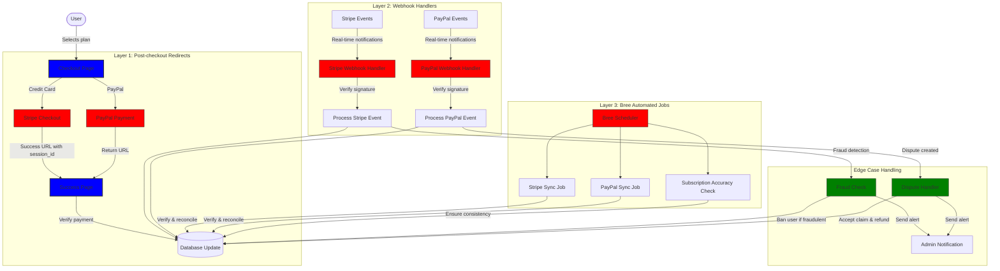
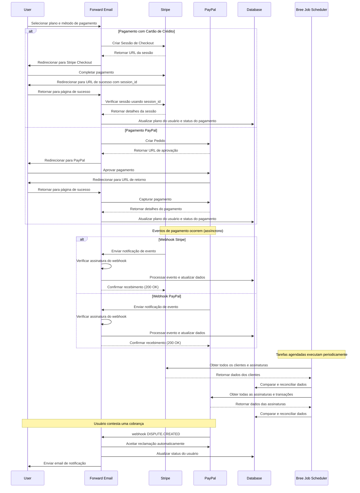
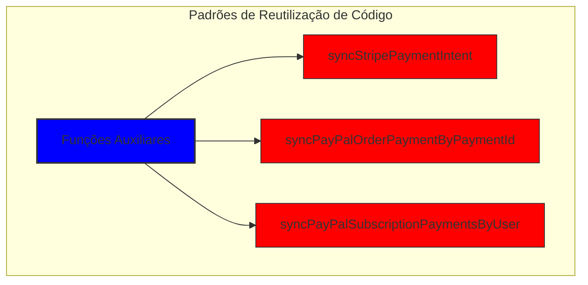
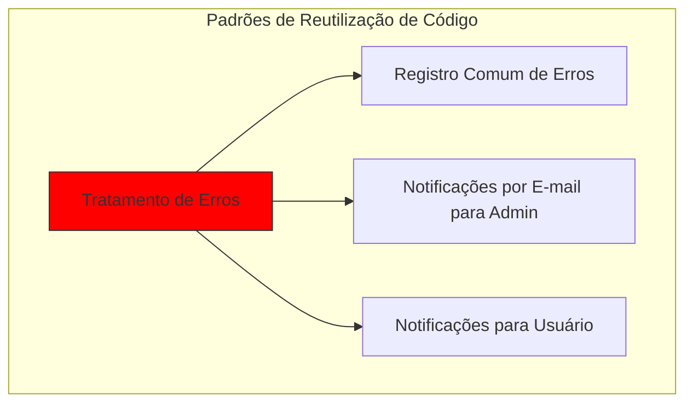
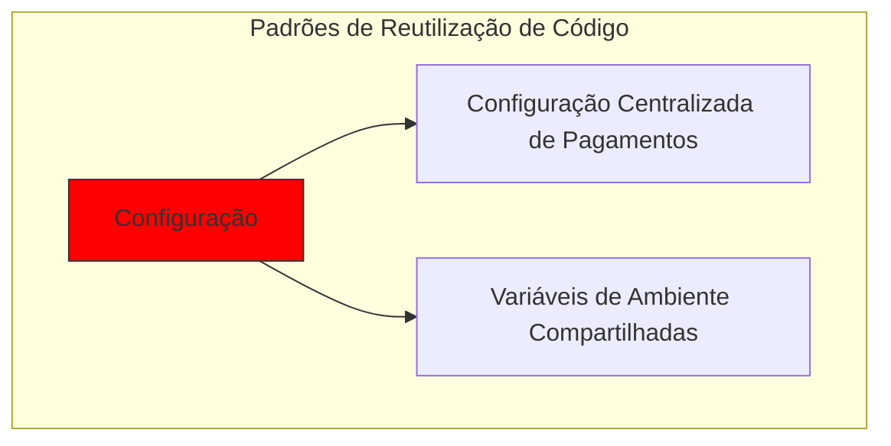
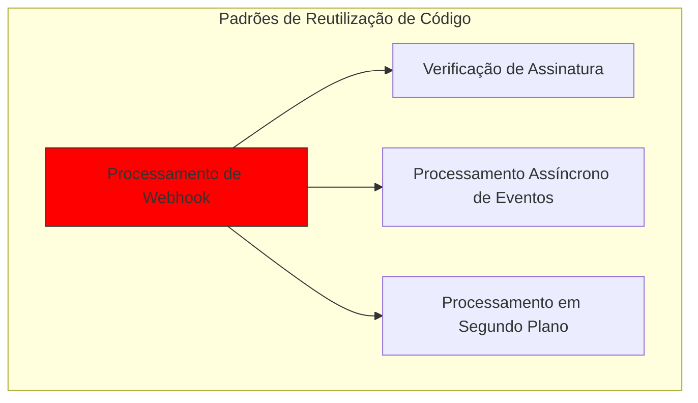
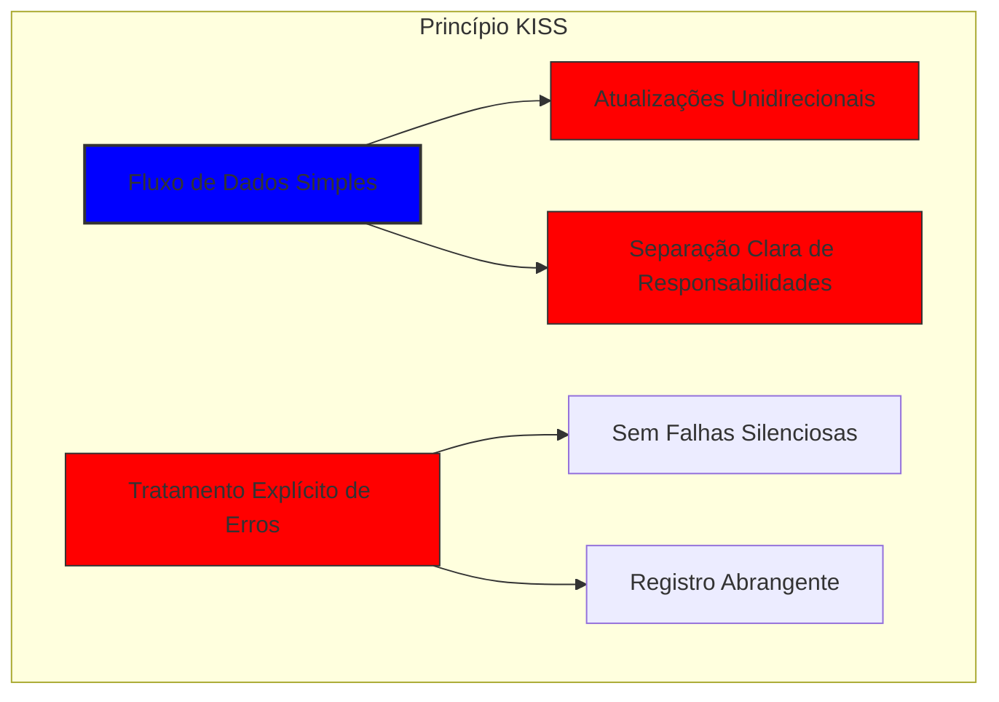

# Como Construímos um Sistema de Pagamento Robusto com Stripe e PayPal: Uma Abordagem Trifecta {#how-we-built-a-robust-payment-system-with-stripe-and-paypal-a-trifecta-approach}


## Índice {#table-of-contents}

* [Prefácio](#foreword)
* [O Desafio: Múltiplos Processadores de Pagamento, Uma Fonte de Verdade](#the-challenge-multiple-payment-processors-one-source-of-truth)
* [A Abordagem Trifecta: Três Camadas de Confiabilidade](#the-trifecta-approach-three-layers-of-reliability)
* [Camada 1: Redirecionamentos Pós-Checkout](#layer-1-post-checkout-redirects)
  * [Implementação do Stripe Checkout](#stripe-checkout-implementation)
  * [Fluxo de Pagamento PayPal](#paypal-payment-flow)
* [Camada 2: Manipuladores de Webhook com Verificação de Assinatura](#layer-2-webhook-handlers-with-signature-verification)
  * [Implementação do Webhook Stripe](#stripe-webhook-implementation)
  * [Implementação do Webhook PayPal](#paypal-webhook-implementation)
* [Camada 3: Jobs Automatizados com Bree](#layer-3-automated-jobs-with-bree)
  * [Verificador de Precisão de Assinaturas](#subscription-accuracy-checker)
  * [Sincronização de Assinaturas PayPal](#paypal-subscription-synchronization)
* [Tratamento de Casos Limite](#handling-edge-cases)
  * [Detecção e Prevenção de Fraudes](#fraud-detection-and-prevention)
  * [Tratamento de Disputas](#dispute-handling)
* [Reutilização de Código: Princípios KISS e DRY](#code-reuse-kiss-and-dry-principles)
* [Implementação dos Requisitos de Assinatura VISA](#visa-subscription-requirements-implementation)
  * [Notificações Automatizadas por Email Pré-Renovação](#automated-pre-renewal-email-notifications)
  * [Tratamento de Casos Limite](#handling-edge-cases-1)
  * [Períodos de Teste e Termos de Assinatura](#trial-periods-and-subscription-terms)
* [Conclusão: Os Benefícios da Nossa Abordagem Trifecta](#conclusion-the-benefits-of-our-trifecta-approach)


## Prefácio {#foreword}

Na Forward Email, sempre priorizamos a criação de sistemas que sejam confiáveis, precisos e fáceis de usar. Quando se tratou de implementar nosso sistema de processamento de pagamentos, sabíamos que precisávamos de uma solução capaz de lidar com múltiplos processadores de pagamento mantendo a consistência perfeita dos dados. Este post detalha como nossa equipe de desenvolvimento integrou tanto o Stripe quanto o PayPal usando uma abordagem trifecta que garante precisão 1:1 em tempo real em todo o nosso sistema.


## O Desafio: Múltiplos Processadores de Pagamento, Uma Fonte de Verdade {#the-challenge-multiple-payment-processors-one-source-of-truth}

Como um serviço de email focado em privacidade, queríamos oferecer opções de pagamento aos nossos usuários. Alguns preferem a simplicidade dos pagamentos com cartão de crédito via Stripe, enquanto outros valorizam a camada adicional de separação que o PayPal oferece. No entanto, suportar múltiplos processadores de pagamento introduz uma complexidade significativa:

1. Como garantir dados consistentes entre diferentes sistemas de pagamento?
2. Como lidar com casos limite como disputas, reembolsos ou pagamentos falhados?
3. Como manter uma única fonte de verdade em nosso banco de dados?

Nossa solução foi implementar o que chamamos de "abordagem trifecta" - um sistema de três camadas que fornece redundância e garante consistência dos dados independentemente do que acontecer.


## A Abordagem Trifecta: Três Camadas de Confiabilidade {#the-trifecta-approach-three-layers-of-reliability}

Nosso sistema de pagamento consiste em três componentes críticos que trabalham juntos para garantir sincronização perfeita dos dados:

1. **Redirecionamentos pós-checkout** - Capturando informações de pagamento imediatamente após o checkout
2. **Manipuladores de webhook** - Processando eventos em tempo real dos processadores de pagamento
3. **Jobs automatizados** - Verificando e reconciliando periodicamente os dados de pagamento

Vamos explorar cada componente e ver como eles funcionam em conjunto.


```mermaid
flowchart TD
    User([User]) --> |Selects plan| Checkout[Checkout Page]

    %% Layer 1: Post-checkout redirects
    subgraph "Layer 1: Post-checkout Redirects"
        Checkout --> |Credit Card| Stripe[Stripe Checkout]
        Checkout --> |PayPal| PayPal[PayPal Payment]

        Stripe --> |Success URL with session_id| SuccessPage[Success Page]
        PayPal --> |Return URL| SuccessPage

        SuccessPage --> |Verify payment| Database[(Database Update)]
    end

    %% Layer 2: Webhooks
    subgraph "Layer 2: Webhook Handlers"
        StripeEvents[Stripe Events] --> |Real-time notifications| StripeWebhook[Stripe Webhook Handler]
        PayPalEvents[PayPal Events] --> |Real-time notifications| PayPalWebhook[PayPal Webhook Handler]

        StripeWebhook --> |Verify signature| ProcessStripeEvent[Process Stripe Event]
        PayPalWebhook --> |Verify signature| ProcessPayPalEvent[Process PayPal Event]

        ProcessStripeEvent --> Database
        ProcessPayPalEvent --> Database
    end

    %% Layer 3: Automated jobs
    subgraph "Layer 3: Bree Automated Jobs"
        BreeScheduler[Bree Scheduler] --> StripeSync[Stripe Sync Job]
        BreeScheduler --> PayPalSync[PayPal Sync Job]
        BreeScheduler --> AccuracyCheck[Subscription Accuracy Check]

        StripeSync --> |Verify & reconcile| Database
        PayPalSync --> |Verify & reconcile| Database
        AccuracyCheck --> |Ensure consistency| Database
    end

    %% Edge cases
    subgraph "Edge Case Handling"
        ProcessStripeEvent --> |Fraud detection| FraudCheck[Fraud Check]
        ProcessPayPalEvent --> |Dispute created| DisputeHandler[Dispute Handler]

        FraudCheck --> |Ban user if fraudulent| Database
        DisputeHandler --> |Accept claim & refund| Database

        FraudCheck --> |Send alert| AdminNotification[Admin Notification]
        DisputeHandler --> |Send alert| AdminNotification
    end

    %% Style definitions
    classDef primary fill:blue,stroke:#333,stroke-width:2px;
    classDef secondary fill:red,stroke:#333,stroke-width:1px;
    classDef tertiary fill:green,stroke:#333,stroke-width:1px;

    class Checkout,SuccessPage primary;
    class Stripe,PayPal,StripeWebhook,PayPalWebhook,BreeScheduler secondary;
    class FraudCheck,DisputeHandler tertiary;
```
## Camada 1: Redirecionamentos Pós-Checkout {#layer-1-post-checkout-redirects}

A primeira camada da nossa abordagem trifecta acontece imediatamente após um usuário completar um pagamento. Tanto o Stripe quanto o PayPal fornecem mecanismos para redirecionar os usuários de volta ao nosso site com informações da transação.

### Implementação do Stripe Checkout {#stripe-checkout-implementation}

Para o Stripe, usamos a API de Sessões de Checkout para criar uma experiência de pagamento fluida. Quando um usuário seleciona um plano e escolhe pagar com cartão de crédito, criamos uma Sessão de Checkout com URLs específicas de sucesso e cancelamento:

```javascript
const options = {
  mode: paymentType === 'one-time' ? 'payment' : 'subscription',
  customer: ctx.state.user[config.userFields.stripeCustomerID],
  client_reference_id: reference,
  metadata: {
    plan
  },
  line_items: [
    {
      price,
      quantity: 1,
      description
    }
  ],
  locale: config.STRIPE_LOCALES.has(ctx.locale) ? ctx.locale : 'auto',
  cancel_url: `${config.urls.web}${ctx.path}${
    isMakePayment || isEnableAutoRenew ? '' : `/?plan=${plan}`
  }`,
  success_url: `${config.urls.web}${ctx.path}/?${
    isMakePayment || isEnableAutoRenew ? '' : `plan=${plan}&`
  }session_id={CHECKOUT_SESSION_ID}`,
  allow_promotion_codes: true
};

// Create the checkout session and redirect
const session = await stripe.checkout.sessions.create(options);
const redirectTo = session.url;
if (ctx.accepts('html')) {
  ctx.status = 303;
  ctx.redirect(redirectTo);
} else {
  ctx.body = { redirectTo };
}
```

A parte crítica aqui é o parâmetro `success_url`, que inclui o `session_id` como um parâmetro de consulta. Quando o Stripe redireciona o usuário de volta ao nosso site após um pagamento bem-sucedido, podemos usar esse ID de sessão para verificar a transação e atualizar nosso banco de dados adequadamente.

### Fluxo de Pagamento PayPal {#paypal-payment-flow}

Para o PayPal, usamos uma abordagem semelhante com a API de Pedidos:

```javascript
const requestBody = {
  intent: 'CAPTURE',
  application_context: {
    cancel_url: `${config.urls.web}${ctx.path}${
      isMakePayment || isEnableAutoRenew ? '' : `/?plan=${plan}`
    }`,
    return_url: `${config.urls.web}${ctx.path}/?plan=${plan}`,
    brand_name: 'Forward Email',
    shipping_preference: 'NO_SHIPPING',
    user_action: 'PAY_NOW'
  },
  payer: {
    email_address: ctx.state.user.email
  },
  purchase_units: [
    {
      reference_id: ctx.state.user.id,
      description,
      custom_id: sku,
      invoice_id: reference,
      soft_descriptor: sku,
      amount: {
        currency_code: 'USD',
        value: price,
        breakdown: {
          item_total: {
            currency_code: 'USD',
            value: price
          }
        }
      },
      items: [
        {
          name,
          description,
          sku,
          unit_amount: {
            currency_code: 'USD',
            value: price
          },
          quantity: '1',
          category: 'DIGITAL_GOODS'
        }
      ]
    }
  ]
};
```

Semelhante ao Stripe, especificamos os parâmetros `return_url` e `cancel_url` para lidar com os redirecionamentos pós-pagamento. Quando o PayPal redireciona o usuário de volta ao nosso site, podemos capturar os detalhes do pagamento e atualizar nosso banco de dados.


```mermaid
sequenceDiagram
    participant User
    participant FE as Forward Email
    participant Stripe
    participant PayPal
    participant DB as Database
    participant Bree as Bree Job Scheduler

    %% Initial checkout flow
    User->>FE: Selecionar plano e método de pagamento

    alt Pagamento com Cartão de Crédito
        FE->>Stripe: Criar Sessão de Checkout
        Stripe-->>FE: Retornar URL da sessão
        FE->>User: Redirecionar para Stripe Checkout
        User->>Stripe: Completar pagamento
        Stripe->>User: Redirecionar para URL de sucesso com session_id
        User->>FE: Retornar para página de sucesso
        FE->>Stripe: Verificar sessão usando session_id
        Stripe-->>FE: Retornar detalhes da sessão
        FE->>DB: Atualizar plano do usuário e status do pagamento
    else Pagamento PayPal
        FE->>PayPal: Criar Pedido
        PayPal-->>FE: Retornar URL de aprovação
        FE->>User: Redirecionar para PayPal
        User->>PayPal: Aprovar pagamento
        PayPal->>User: Redirecionar para URL de retorno
        User->>FE: Retornar para página de sucesso
        FE->>PayPal: Capturar pagamento
        PayPal-->>FE: Retornar detalhes do pagamento
        FE->>DB: Atualizar plano do usuário e status do pagamento
    end

    %% Webhook flow (asynchronous)
    Note over Stripe,PayPal: Eventos de pagamento ocorrem (assíncrono)

    alt Webhook Stripe
        Stripe->>FE: Enviar notificação de evento
        FE->>FE: Verificar assinatura do webhook
        FE->>DB: Processar evento e atualizar dados
        FE-->>Stripe: Confirmar recebimento (200 OK)
    else Webhook PayPal
        PayPal->>FE: Enviar notificação de evento
        FE->>FE: Verificar assinatura do webhook
        FE->>DB: Processar evento e atualizar dados
        FE-->>PayPal: Confirmar recebimento (200 OK)
    end

    %% Tarefas automatizadas Bree
    Note over Bree: Tarefas agendadas executam periodicamente

    Bree->>Stripe: Obter todos os clientes e assinaturas
    Stripe-->>Bree: Retornar dados dos clientes
    Bree->>DB: Comparar e reconciliar dados

    Bree->>PayPal: Obter todas as assinaturas e transações
    PayPal-->>Bree: Retornar dados das assinaturas
    Bree->>DB: Comparar e reconciliar dados

    %% Caso extremo: Tratamento de disputa
    Note over User,PayPal: Usuário contesta uma cobrança

    PayPal->>FE: webhook DISPUTE.CREATED
    FE->>PayPal: Aceitar reclamação automaticamente
    FE->>DB: Atualizar status do usuário
    FE->>User: Enviar email de notificação
```
## Camada 2: Manipuladores de Webhook com Verificação de Assinatura {#layer-2-webhook-handlers-with-signature-verification}

Embora os redirecionamentos pós-checkout funcionem bem na maioria dos cenários, eles não são infalíveis. Os usuários podem fechar o navegador antes de serem redirecionados, ou problemas de rede podem impedir que o redirecionamento seja concluído. É aí que entram os webhooks.

Tanto o Stripe quanto o PayPal fornecem sistemas de webhook que enviam notificações em tempo real sobre eventos de pagamento. Implementamos manipuladores de webhook robustos que verificam a autenticidade dessas notificações e as processam adequadamente.

### Implementação do Webhook do Stripe {#stripe-webhook-implementation}

Nosso manipulador de webhook do Stripe verifica a assinatura dos eventos de webhook recebidos para garantir que sejam legítimos:

```javascript
async function webhook(ctx) {
  const sig = ctx.request.get('stripe-signature');
  // lançar um erro se algo estiver errado
  if (!isSANB(sig))
    throw Boom.badRequest(ctx.translateError('INVALID_STRIPE_SIGNATURE'));
  const event = stripe.webhooks.constructEvent(
    ctx.request.rawBody,
    sig,
    env.STRIPE_ENDPOINT_SECRET
  );
  // lançar um erro se algo estiver errado
  if (!event)
    throw Boom.badRequest(ctx.translateError('INVALID_STRIPE_SIGNATURE'));
  ctx.logger.info('stripe webhook', { event });
  // retornar uma resposta para reconhecer o recebimento do evento
  ctx.body = { received: true };
  // executar em segundo plano
  processEvent(ctx, event)
    .then()
    .catch((err) => {
      ctx.logger.fatal(err, { event });
      // enviar email para erros administrativos
      emailHelper({
        template: 'alert',
        message: {
          to: config.email.message.from,
          subject: `Erro com Webhook do Stripe (ID do Evento ${event.id})`
        },
        locals: {
          message: `<pre><code>${safeStringify(
            parseErr(err),
            null,
            2
          )}</code></pre>`
        }
      })
        .then()
        .catch((err) => ctx.logger.fatal(err, { event }));
    });
}
```

A função `stripe.webhooks.constructEvent` verifica a assinatura usando nosso segredo do endpoint. Se a assinatura for válida, processamos o evento de forma assíncrona para evitar bloquear a resposta do webhook.

### Implementação do Webhook do PayPal {#paypal-webhook-implementation}

De forma semelhante, nosso manipulador de webhook do PayPal verifica a autenticidade das notificações recebidas:

```javascript
async function webhook(ctx) {
  const response = await promisify(
    paypal.notification.webhookEvent.verify,
    paypal.notification.webhookEvent
  )(ctx.request.headers, ctx.request.body, env.PAYPAL_WEBHOOK_ID);
  // lançar um erro se algo estiver errado
  if (!_.isObject(response) || response.verification_status !== 'SUCCESS')
    throw Boom.badRequest(ctx.translateError('INVALID_PAYPAL_SIGNATURE'));
  // retornar uma resposta para reconhecer o recebimento do evento
  ctx.body = { received: true };
  // executar em segundo plano
  processEvent(ctx)
    .then()
    .catch((err) => {
      ctx.logger.fatal(err);
      // enviar email para erros administrativos
      emailHelper({
        template: 'alert',
        message: {
          to: config.email.message.from,
          subject: `Erro com Webhook do PayPal (ID do Evento ${ctx.request.body.id})`
        },
        locals: {
          message: `<pre><code>${safeStringify(
            parseErr(err),
            null,
            2
          )}</code></pre>`
        }
      })
        .then()
        .catch((err) => ctx.logger.fatal(err));
    });
}
```

Ambos os manipuladores de webhook seguem o mesmo padrão: verificar a assinatura, reconhecer o recebimento e processar o evento de forma assíncrona. Isso garante que nunca percamos um evento de pagamento, mesmo que o redirecionamento pós-checkout falhe.


## Camada 3: Jobs Automatizados com Bree {#layer-3-automated-jobs-with-bree}

A camada final da nossa abordagem trifecta é um conjunto de jobs automatizados que verificam e reconciliam periodicamente os dados de pagamento. Usamos o Bree, um agendador de jobs para Node.js, para executar esses jobs em intervalos regulares.

### Verificador de Precisão de Assinaturas {#subscription-accuracy-checker}

Um dos nossos jobs principais é o verificador de precisão de assinaturas, que garante que nosso banco de dados reflita com precisão o status da assinatura no Stripe:
```javascript
async function mapper(customer) {
  // wait a second to prevent rate limitation error
  await setTimeout(ms('1s'));
  // check for user on our side
  let user = await Users.findOne({
    [config.userFields.stripeCustomerID]: customer.id
  })
    .lean()
    .exec();
  if (!user) return;
  if (user.is_banned) return;

  // if emails did not match
  if (user.email !== customer.email) {
    logger.info(
      `User email ${user.email} did not match customer email ${customer.email} (${customer.id})`
    );
    customer = await stripe.customers.update(customer.id, {
      email: user.email
    });
    logger.info(`Updated user email to match ${user.email}`);
  }

  // check for active subscriptions
  const [activeSubscriptions, trialingSubscriptions] = await Promise.all([
    stripe.subscriptions.list({
      customer: customer.id,
      status: 'active'
    }),
    stripe.subscriptions.list({
      customer: customer.id,
      status: 'trialing'
    })
  ]);

  // Combine active and trialing subscriptions
  let subscriptions = [
    ...activeSubscriptions.data,
    ...trialingSubscriptions.data
  ];

  // Handle edge case: multiple subscriptions for one user
  if (subscriptions.length > 1) {
    await logger.error(
      new Error(
        `We may need to refund: User had multiple subscriptions ${user.email} (${customer.id})`
      )
    );
    await emailHelper({
      template: 'alert',
      message: {
        to: config.email.message.from,
        subject: `User had multiple subscriptions ${user.email}`
      },
      locals: {
        message: `User ${user.email} (${customer.id}) had multiple subscriptions: ${JSON.stringify(
          subscriptions.map((s) => s.id)
        )}`
      }
    });
  }
}
```

This job checks for discrepancies between our database and Stripe, such as mismatched email addresses or multiple active subscriptions. If it finds any issues, it logs them and sends alerts to our admin team.

### PayPal Subscription Synchronization {#paypal-subscription-synchronization}

We have a similar job for PayPal subscriptions:

```javascript
async function syncPayPalSubscriptionPayments() {
  const paypalCustomers = await Users.find({
    $or: [
      {
        [config.userFields.paypalSubscriptionID]: { $exists: true, $ne: null }
      },
      {
        [config.userFields.paypalPayerID]: { $exists: true, $ne: null }
      }
    ]
  })
    // sort by newest customers first
    .sort('-created_at')
    .lean()
    .exec();

  await logger.info(
    `Syncing payments for ${paypalCustomers.length} paypal customers`
  );

  // Process each customer and sync their payments
  const errorEmails = await pReduce(
    paypalCustomers,
    // Implementation details...
  );
}
```

These automated jobs serve as our final safety net, ensuring that our database always reflects the true state of subscriptions and payments in both Stripe and PayPal.


## Handling Edge Cases {#handling-edge-cases}

A robust payment system must handle edge cases gracefully. Let's look at how we handle some common scenarios.

### Fraud Detection and Prevention {#fraud-detection-and-prevention}

We've implemented sophisticated fraud detection mechanisms that automatically identify and handle suspicious payment activities:

```javascript
case 'charge.failed': {
  // Get all failed charges in the last 30 days
  const charges = await stripe.charges.list({
    customer: event.data.object.customer,
    created: {
      gte: dayjs().subtract(1, 'month').unix()
    }
  });

  // Filter for declined charges
  const filtered = charges.data.filter(
    (d) => d.status === 'failed' && d.failure_code === 'card_declined'
  );

  // if not more than 5 then return early
  if (filtered.length < 5) break;

  // Check if user has verified domains
  const count = await Domains.countDocuments({
    members: {
      $elemMatch: {
        user: user._id,
        group: 'admin'
      }
    },
    plan: { $in: ['enhanced_protection', 'team'] },
    has_txt_record: true
  });

  if (!user.is_banned) {
    // If no verified domains, ban the user and refund all charges
    if (count === 0) {
      // Ban the user
      user.is_banned = true;
      await user.save();

      // Refund all successful charges
    }
  }
}
```

Este código bane automaticamente usuários que possuem múltiplas cobranças falhadas e nenhum domínio verificado, o que é um forte indicativo de atividade fraudulenta.

### Tratamento de Disputas {#dispute-handling}

Quando um usuário contesta uma cobrança, aceitamos automaticamente a reivindicação e tomamos as ações apropriadas:

```javascript
case 'CUSTOMER.DISPUTE.CREATED': {
  // aceitar reivindicação
  const agent = await paypalAgent();
  await agent
    .post(`/v1/customer/disputes/${body.resource.dispute_id}/accept-claim`)
    .send({
      note: 'Reembolso total ao cliente.'
    });

  // Encontrar o pagamento em nosso banco de dados
  const payment = await Payments.findOne({ $or });
  if (!payment) throw new Error('Pagamento não existe');

  const user = await Users.findById(payment.user);
  if (!user) throw new Error('Usuário não existia para o cliente');

  // Cancelar a assinatura do usuário se ele tiver uma
  if (isSANB(user[config.userFields.paypalSubscriptionID])) {
    try {
      const agent = await paypalAgent();
      await agent.post(
        `/v1/billing/subscriptions/${
          user[config.userFields.paypalSubscriptionID]
        }/cancel`
      );
    } catch (err) {
      // Tratar erros de cancelamento de assinatura
    }
  }
}
```

Essa abordagem minimiza o impacto das disputas em nosso negócio enquanto garante uma boa experiência ao cliente.


## Reutilização de Código: Princípios KISS e DRY {#code-reuse-kiss-and-dry-principles}

Ao longo do nosso sistema de pagamentos, seguimos os princípios KISS (Keep It Simple, Stupid) e DRY (Don't Repeat Yourself). Aqui estão alguns exemplos:

1. **Funções Auxiliares Compartilhadas**: Criamos funções auxiliares reutilizáveis para tarefas comuns como sincronizar pagamentos e enviar e-mails.

2. **Tratamento Consistente de Erros**: Os manipuladores de webhook do Stripe e PayPal usam o mesmo padrão para tratamento de erros e notificações administrativas.

3. **Esquema de Banco de Dados Unificado**: Nosso esquema de banco de dados é projetado para acomodar dados tanto do Stripe quanto do PayPal, com campos comuns para status de pagamento, valor e informações do plano.

4. **Configuração Centralizada**: A configuração relacionada a pagamentos está centralizada em um único arquivo, facilitando a atualização de preços e informações de produtos.


```mermaid
graph TD
    subgraph "Padrões de Reutilização de Código"
        A[Funções Auxiliares] --> B[syncStripePaymentIntent]
        A --> C[syncPayPalOrderPaymentByPaymentId]
        A --> D[syncPayPalSubscriptionPaymentsByUser]
    end

    classDef primary fill:blue,stroke:#333,stroke-width:2px;
    classDef secondary fill:red,stroke:#333,stroke-width:1px;

    class A,P,V primary;
    class B,C,D,E,I,L,Q,R,S,W,X,Y,Z secondary;
```


```mermaid
graph TD
    subgraph "Padrões de Reutilização de Código"
        E[Tratamento de Erros] --> F[Registro Comum de Erros]
        E --> G[Notificações por E-mail para Admin]
        E --> H[Notificações para Usuário]
    end

    classDef primary fill:blue,stroke:#333,stroke-width:2px;
    classDef secondary fill:red,stroke:#333,stroke-width:1px;

    class A,P,V primary;
    class B,C,D,E,I,L,Q,R,S,W,X,Y,Z secondary;
```


```mermaid
graph TD
    subgraph "Padrões de Reutilização de Código"
        I[Configuração] --> J[Configuração Centralizada de Pagamentos]
        I --> K[Variáveis de Ambiente Compartilhadas]
    end

    classDef primary fill:blue,stroke:#333,stroke-width:2px;
    classDef secondary fill:red,stroke:#333,stroke-width:1px;

    class A,P,V primary;
    class B,C,D,E,I,L,Q,R,S,W,X,Y,Z secondary;
```


```mermaid
graph TD
    subgraph "Padrões de Reutilização de Código"
        L[Processamento de Webhook] --> M[Verificação de Assinatura]
        L --> N[Processamento Assíncrono de Eventos]
        L --> O[Processamento em Segundo Plano]
    end

    classDef primary fill:blue,stroke:#333,stroke-width:2px;
    classDef secondary fill:red,stroke:#333,stroke-width:1px;

    class A,P,V primary;
    class B,C,D,E,I,L,Q,R,S,W,X,Y,Z secondary;
```


```mermaid
graph TD
    subgraph "Princípio KISS"
        P[Fluxo de Dados Simples] --> Q[Atualizações Unidirecionais]
        P --> R[Separação Clara de Responsabilidades]

        S[Tratamento Explícito de Erros] --> T[Sem Falhas Silenciosas]
        S --> U[Registro Abrangente]
    end

    classDef primary fill:blue,stroke:#333,stroke-width:2px;
    classDef secondary fill:red,stroke:#333,stroke-width:1px;

    class A,P,V primary;
    class B,C,D,E,I,L,Q,R,S,W,X,Y,Z secondary;
```
graph TD
    subgraph "Princípio DRY"
        V[Lógica Compartilhada] --> W[Funções de Processamento de Pagamento]
        V --> X[Modelos de Email]
        V --> Y[Lógica de Validação]

        Z[Operações Comuns de Banco de Dados] --> AA[Atualizações de Usuário]
        Z --> AB[Registro de Pagamento]
    end

    classDef primary fill:blue,stroke:#333,stroke-width:2px;
    classDef secondary fill:red,stroke:#333,stroke-width:1px;

    class A,P,V primary;
    class B,C,D,E,I,L,Q,R,S,W,X,Y,Z secondary;
```


## Implementação dos Requisitos de Assinatura VISA {#visa-subscription-requirements-implementation}

Além da nossa abordagem trifecta, implementamos recursos específicos para cumprir os requisitos de assinatura da VISA enquanto aprimoramos a experiência do usuário. Um requisito chave da VISA é que os usuários devem ser notificados antes de serem cobrados por uma assinatura, especialmente ao transitar de um teste para uma assinatura paga.

### Notificações Automáticas por Email Antes da Renovação {#automated-pre-renewal-email-notifications}

Construímos um sistema automatizado que identifica usuários com assinaturas de teste ativas e envia um email de notificação antes que a primeira cobrança ocorra. Isso não apenas nos mantém em conformidade com os requisitos da VISA, mas também reduz estornos e melhora a satisfação do cliente.

Veja como implementamos esse recurso:

```javascript
// Encontrar usuários com assinaturas de teste que ainda não receberam notificação
const users = await Users.find({
  $or: [
    {
      $and: [
        { [config.userFields.stripeSubscriptionID]: { $exists: true } },
        { [config.userFields.stripeTrialSentAt]: { $exists: false } },
        // Excluir assinaturas que já tiveram pagamentos
        ...(paidStripeSubscriptionIds.length > 0
          ? [
              {
                [config.userFields.stripeSubscriptionID]: {
                  $nin: paidStripeSubscriptionIds
                }
              }
            ]
          : [])
      ]
    },
    {
      $and: [
        { [config.userFields.paypalSubscriptionID]: { $exists: true } },
        { [config.userFields.paypalTrialSentAt]: { $exists: false } },
        // Excluir assinaturas que já tiveram pagamentos
        ...(paidPayPalSubscriptionIds.length > 0
          ? [
              {
                [config.userFields.paypalSubscriptionID]: {
                  $nin: paidPayPalSubscriptionIds
                }
              }
            ]
          : [])
      ]
    }
  ]
});

// Processar cada usuário e enviar notificação
for (const user of users) {
  // Obter detalhes da assinatura do processador de pagamento
  const subscription = await getSubscriptionDetails(user);

  // Calcular duração e frequência da assinatura
  const duration = getDurationFromPlanId(subscription.plan_id);
  const frequency = getHumanReadableFrequency(duration, user.locale);
  const amount = getPlanAmount(user.plan, duration);

  // Obter domínios do usuário para email personalizado
  const domains = await Domains.find({
    'members.user': user._id
  }).sort('name').lean().exec();

  // Enviar email de notificação conforme requisitos VISA
  await emailHelper({
    template: 'visa-trial-subscription-requirement',
    message: {
      to: user.receipt_email || user.email,
      ...(user.receipt_email ? { cc: user.email } : {})
    },
    locals: {
      user,
      firstChargeDate: new Date(subscription.start_time),
      frequency,
      formattedAmount: numeral(amount).format('$0,0,0.00'),
      domains
    }
  });

  // Registrar que a notificação foi enviada
  await Users.findByIdAndUpdate(user._id, {
    $set: {
      [config.userFields.paypalTrialSentAt]: new Date()
    }
  });
}
```

Essa implementação garante que os usuários estejam sempre informados sobre cobranças futuras, com detalhes claros sobre:

1. Quando ocorrerá a primeira cobrança
2. A frequência das cobranças futuras (mensal, anual, etc.)
3. O valor exato que será cobrado
4. Quais domínios estão cobertos pela assinatura

Ao automatizar esse processo, mantemos perfeita conformidade com os requisitos da VISA (que exigem notificação pelo menos 7 dias antes da cobrança), ao mesmo tempo que reduzimos consultas ao suporte e melhoramos a experiência geral do usuário.
### Lidando com Casos Especiais {#handling-edge-cases-1}

Nossa implementação também inclui um tratamento robusto de erros. Se algo der errado durante o processo de notificação, nosso sistema alerta automaticamente nossa equipe:

```javascript
try {
  await mapper(user);
} catch (err) {
  logger.error(err);

  // Enviar alerta para os administradores
  await emailHelper({
    template: 'alert',
    message: {
      to: config.email.message.from,
      subject: 'Erro no Requisito de Assinatura de Teste VISA'
    },
    locals: {
      message: `<pre><code>${safeStringify(
        parseErr(err),
        null,
        2
      )}</code></pre>`
    }
  });
}
```

Isso garante que, mesmo que haja um problema com o sistema de notificação, nossa equipe possa rapidamente resolvê-lo e manter a conformidade com os requisitos da VISA.

O sistema de notificação de assinatura VISA é outro exemplo de como construímos nossa infraestrutura de pagamento com foco tanto na conformidade quanto na experiência do usuário, complementando nossa abordagem trifecta para garantir um processamento de pagamento confiável e transparente.

### Períodos de Teste e Termos de Assinatura {#trial-periods-and-subscription-terms}

Para usuários que ativam a renovação automática em planos existentes, calculamos o período de teste apropriado para garantir que eles não sejam cobrados até que seu plano atual expire:

```javascript
if (
  isEnableAutoRenew &&
  dayjs(ctx.state.user[config.userFields.planExpiresAt]).isAfter(
    dayjs()
  )
) {
  const hours = dayjs(
    ctx.state.user[config.userFields.planExpiresAt]
  ).diff(dayjs(), 'hours');

  // Lidar com o cálculo do período de teste
}
```

Também fornecemos informações claras sobre os termos da assinatura, incluindo frequência de cobrança e políticas de cancelamento, e incluímos metadados detalhados com cada assinatura para garantir o acompanhamento e gerenciamento adequados.


## Conclusão: Os Benefícios da Nossa Abordagem Trifecta {#conclusion-the-benefits-of-our-trifecta-approach}

Nossa abordagem trifecta para o processamento de pagamentos proporcionou vários benefícios chave:

1. **Confiabilidade**: Ao implementar três camadas de verificação de pagamento, garantimos que nenhum pagamento seja perdido ou processado incorretamente.

2. **Precisão**: Nosso banco de dados sempre reflete o estado real das assinaturas e pagamentos tanto no Stripe quanto no PayPal.

3. **Flexibilidade**: Os usuários podem escolher seu método de pagamento preferido sem comprometer a confiabilidade do nosso sistema.

4. **Robustez**: Nosso sistema lida com casos especiais de forma elegante, desde falhas de rede até atividades fraudulentas.

Se você está implementando um sistema de pagamento que suporta múltiplos processadores, recomendamos fortemente essa abordagem trifecta. Ela exige mais esforço de desenvolvimento inicial, mas os benefícios a longo prazo em termos de confiabilidade e precisão valem muito a pena.

Para mais informações sobre o Forward Email e nossos serviços de e-mail focados em privacidade, visite nosso [site](https://forwardemail.net).

<!-- *Keywords: payment processing, Stripe integration, PayPal integration, webhook handling, payment synchronization, subscription management, fraud prevention, dispute handling, Node.js payment system, multi-processor payment system, payment gateway integration, real-time payment verification, payment data consistency, subscription billing, payment security, payment automation, payment webhooks, payment reconciliation, payment edge cases, payment error handling, VISA subscription requirements, pre-renewal notifications, subscription compliance* -->
