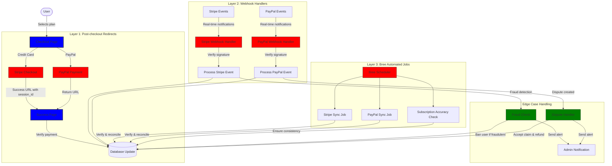
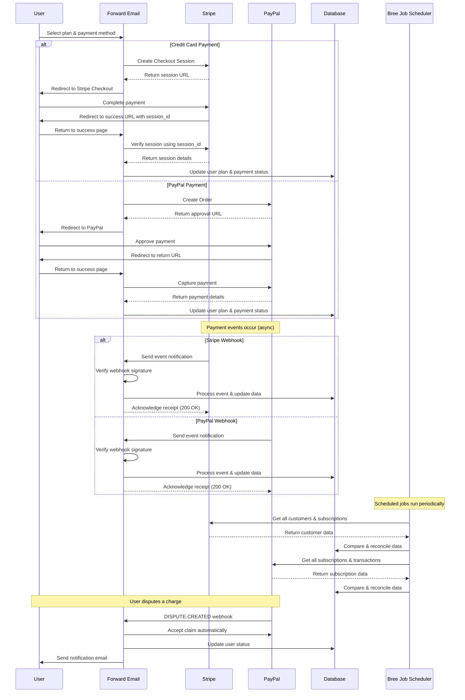
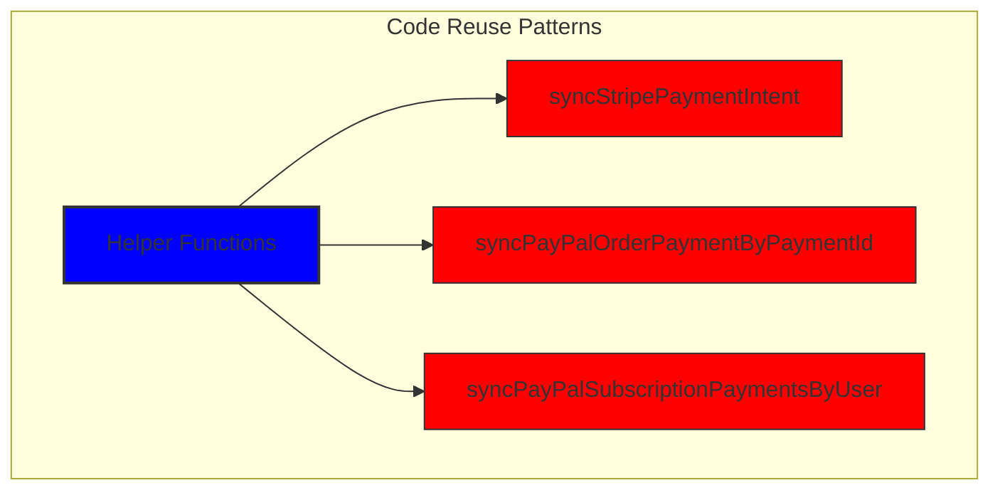
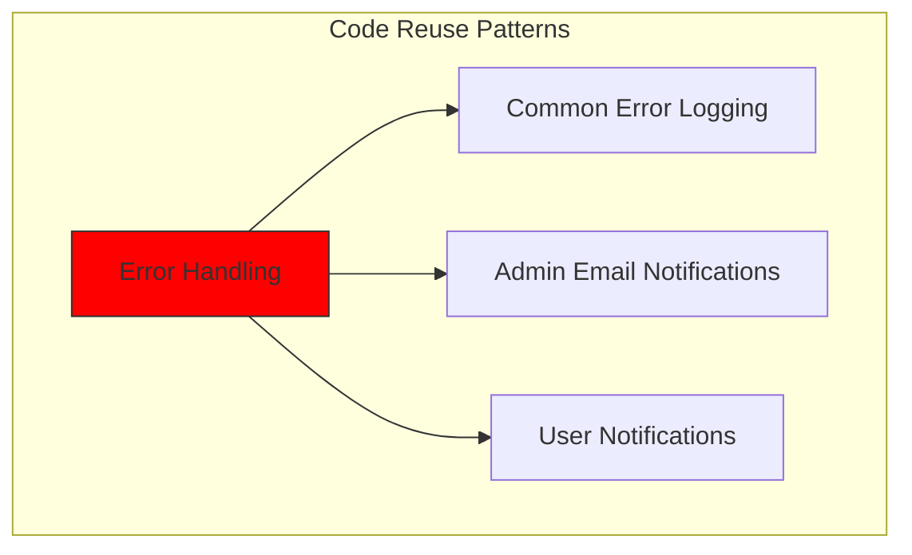
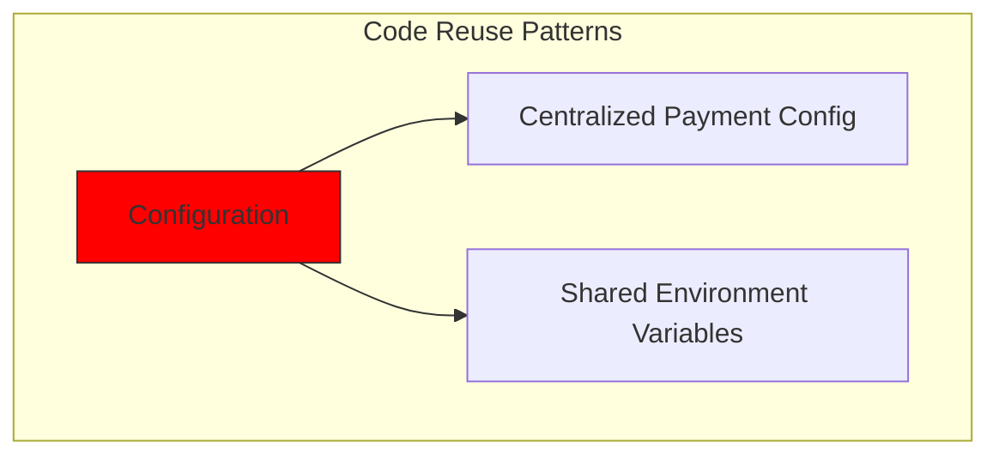
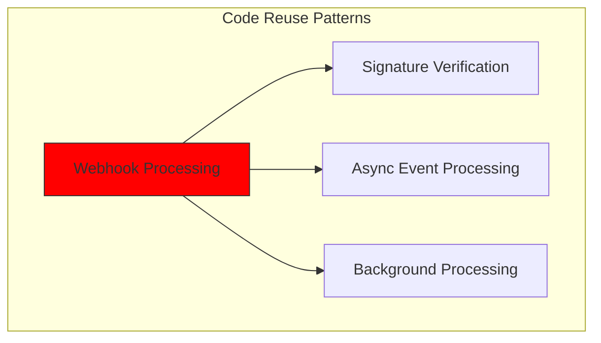
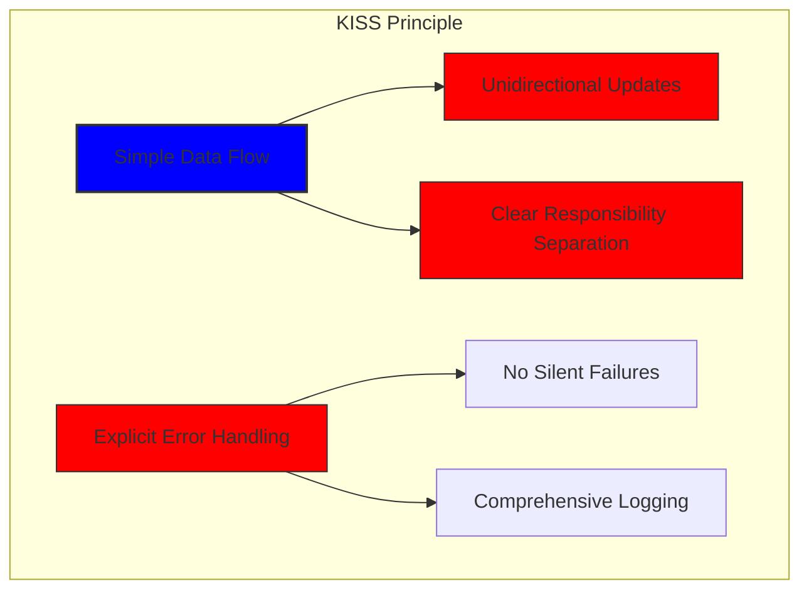
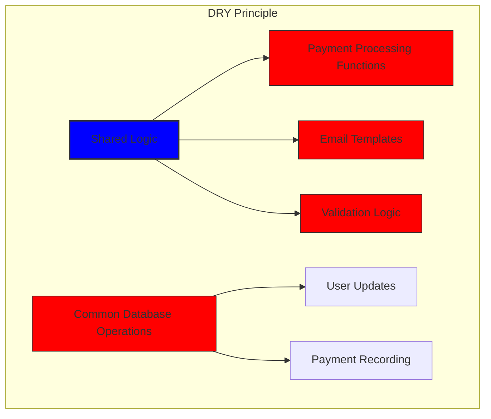

# Как мы создали надежную платежную систему с помощью Stripe и PayPal: тройной подход {#how-we-built-a-robust-payment-system-with-stripe-and-paypal-a-trifecta-approach}


## Содержание {#table-of-contents}

* [Предисловие](#foreword)
* [Задача: несколько платежных систем, один источник достоверной информации](#the-challenge-multiple-payment-processors-one-source-of-truth)
* [Подход Trifecta: три уровня надежности](#the-trifecta-approach-three-layers-of-reliability)
* [Уровень 1: Перенаправления после оформления заказа](#layer-1-post-checkout-redirects)
  * [Реализация Stripe Checkout](#stripe-checkout-implementation)
  * [Поток платежей PayPal](#paypal-payment-flow)
* [Уровень 2: Обработчики веб-перехватов с проверкой подписи](#layer-2-webhook-handlers-with-signature-verification)
  * [Реализация Stripe Webhook](#stripe-webhook-implementation)
  * [Реализация PayPal Webhook](#paypal-webhook-implementation)
* [Уровень 3: Автоматизированные задания с Бри](#layer-3-automated-jobs-with-bree)
  * [Проверка точности подписки](#subscription-accuracy-checker)
  * [Синхронизация подписки PayPal](#paypal-subscription-synchronization)
* [Обработка пограничных случаев](#handling-edge-cases)
  * [Обнаружение и предотвращение мошенничества](#fraud-detection-and-prevention)
  * [Разрешение споров](#dispute-handling)
* [Повторное использование кода: принципы KISS и DRY](#code-reuse-kiss-and-dry-principles)
* [Реализация требований к подписке на VISA](#visa-subscription-requirements-implementation)
  * [Автоматические уведомления по электронной почте перед продлением](#automated-pre-renewal-email-notifications)
  * [Обработка пограничных случаев](#handling-edge-cases-1)
  * [Пробные периоды и условия подписки](#trial-periods-and-subscription-terms)
* [Заключение: преимущества нашего тройного подхода](#conclusion-the-benefits-of-our-trifecta-approach)

## Предисловие {#foreword}

В Forward Email мы всегда уделяли первостепенное внимание созданию надежных, точных и удобных для пользователя систем. Когда дело дошло до внедрения нашей системы обработки платежей, мы знали, что нам нужно решение, способное работать с несколькими платежными системами, сохраняя при этом идеальную согласованность данных. В этой записи блога подробно рассказывается о том, как наша команда разработчиков интегрировала Stripe и PayPal, используя комплексный подход, обеспечивающий точность 1:1 в режиме реального времени во всей нашей системе.

## Задача: несколько платежных систем, один источник информации {#the-challenge-multiple-payment-processors-one-source-of-truth}

Будучи сервисом электронной почты, ориентированным на конфиденциальность, мы хотели предоставить нашим пользователям различные варианты оплаты. Некоторые предпочитают простоту оплаты кредитными картами через Stripe, в то время как другие ценят дополнительный уровень безопасности, предоставляемый PayPal. Однако поддержка нескольких платежных систем значительно усложняет:

1. Как мы обеспечиваем согласованность данных в разных платёжных системах?
2. Как мы обрабатываем особые случаи, такие как споры, возвраты или невыполненные платежи?
3. Как мы обеспечиваем единый источник достоверной информации в нашей базе данных?

Нашим решением стало внедрение так называемого «трифектного подхода» — трехуровневой системы, которая обеспечивает избыточность и гарантирует согласованность данных в любых ситуациях.

## Подход «Трифекта»: три уровня надежности {#the-trifecta-approach-three-layers-of-reliability}

Наша платежная система состоит из трех важнейших компонентов, которые работают вместе, обеспечивая идеальную синхронизацию данных:

1. **Переадресация после оформления заказа** — сбор информации о платеже сразу после оформления заказа.
2. **Обработчики веб-перехватов** — обработка событий от платежных систем в режиме реального времени.
3. **Автоматизированные задания** — периодическая проверка и сверка платежных данных.

Давайте подробнее рассмотрим каждый компонент и посмотрим, как они работают вместе.



## Уровень 1: Перенаправления после оформления заказа {#layer-1-post-checkout-redirects}

Первый уровень нашего тройного подхода реализуется сразу после завершения пользователем платежа. И Stripe, и PayPal предоставляют механизмы перенаправления пользователей обратно на наш сайт с информацией о транзакции.

### Реализация оформления заказов Stripe {#stripe-checkout-implementation}

Для Stripe мы используем API Checkout Sessions для создания бесперебойного процесса оплаты. Когда пользователь выбирает тарифный план и решает оплатить кредитной картой, мы создаём Checkout Session с определёнными URL-адресами успешного завершения и отмены:

```javascript
const options = {
  mode: paymentType === 'one-time' ? 'payment' : 'subscription',
  customer: ctx.state.user[config.userFields.stripeCustomerID],
  client_reference_id: reference,
  metadata: {
    plan
  },
  line_items: [
    {
      price,
      quantity: 1,
      description
    }
  ],
  locale: config.STRIPE_LOCALES.has(ctx.locale) ? ctx.locale : 'auto',
  cancel_url: `${config.urls.web}${ctx.path}${
    isMakePayment || isEnableAutoRenew ? '' : `/?plan=${plan}`
  }`,
  success_url: `${config.urls.web}${ctx.path}/?${
    isMakePayment || isEnableAutoRenew ? '' : `plan=${plan}&`
  }session_id={CHECKOUT_SESSION_ID}`,
  allow_promotion_codes: true
};

// Create the checkout session and redirect
const session = await stripe.checkout.sessions.create(options);
const redirectTo = session.url;
if (ctx.accepts('html')) {
  ctx.status = 303;
  ctx.redirect(redirectTo);
} else {
  ctx.body = { redirectTo };
}
```

Ключевым элементом здесь является параметр `success_url`, который включает в себя `session_id` в качестве параметра запроса. Когда Stripe перенаправляет пользователя обратно на наш сайт после успешного платежа, мы можем использовать этот идентификатор сеанса для проверки транзакции и соответствующего обновления нашей базы данных.

### Поток платежей PayPal {#paypal-payment-flow}

Для PayPal мы используем аналогичный подход с их API заказов:

```javascript
const requestBody = {
  intent: 'CAPTURE',
  application_context: {
    cancel_url: `${config.urls.web}${ctx.path}${
      isMakePayment || isEnableAutoRenew ? '' : `/?plan=${plan}`
    }`,
    return_url: `${config.urls.web}${ctx.path}/?plan=${plan}`,
    brand_name: 'Forward Email',
    shipping_preference: 'NO_SHIPPING',
    user_action: 'PAY_NOW'
  },
  payer: {
    email_address: ctx.state.user.email
  },
  purchase_units: [
    {
      reference_id: ctx.state.user.id,
      description,
      custom_id: sku,
      invoice_id: reference,
      soft_descriptor: sku,
      amount: {
        currency_code: 'USD',
        value: price,
        breakdown: {
          item_total: {
            currency_code: 'USD',
            value: price
          }
        }
      },
      items: [
        {
          name,
          description,
          sku,
          unit_amount: {
            currency_code: 'USD',
            value: price
          },
          quantity: '1',
          category: 'DIGITAL_GOODS'
        }
      ]
    }
  ]
};
```

Как и в Stripe, мы указываем параметры `return_url` и `cancel_url` для обработки перенаправлений после оплаты. Когда PayPal перенаправляет пользователя обратно на наш сайт, мы можем получить данные о платеже и обновить нашу базу данных.



## Уровень 2: Обработчики веб-перехватчиков с проверкой подписи {#layer-2-webhook-handlers-with-signature-verification}

Хотя перенаправления после оформления заказа работают хорошо в большинстве случаев, они не являются абсолютно надёжными. Пользователи могут закрыть браузер до перенаправления, или проблемы с сетью могут помешать перенаправлению. Вот тут-то и пригодятся веб-хуки.

Stripe и PayPal предоставляют системы вебхуков, которые отправляют уведомления о платежах в режиме реального времени. Мы внедрили надежные обработчики вебхуков, которые проверяют подлинность этих уведомлений и обрабатывают их соответствующим образом.

### Реализация веб-перехвата Stripe {#stripe-webhook-implementation}

Наш обработчик веб-перехватчиков Stripe проверяет подпись входящих событий веб-перехватчиков, чтобы убедиться в их легитимности:

```javascript
async function webhook(ctx) {
  const sig = ctx.request.get('stripe-signature');
  // throw an error if something was wrong
  if (!isSANB(sig))
    throw Boom.badRequest(ctx.translateError('INVALID_STRIPE_SIGNATURE'));
  const event = stripe.webhooks.constructEvent(
    ctx.request.rawBody,
    sig,
    env.STRIPE_ENDPOINT_SECRET
  );
  // throw an error if something was wrong
  if (!event)
    throw Boom.badRequest(ctx.translateError('INVALID_STRIPE_SIGNATURE'));
  ctx.logger.info('stripe webhook', { event });
  // return a response to acknowledge receipt of the event
  ctx.body = { received: true };
  // run in background
  processEvent(ctx, event)
    .then()
    .catch((err) => {
      ctx.logger.fatal(err, { event });
      // email admin errors
      emailHelper({
        template: 'alert',
        message: {
          to: config.email.message.from,
          subject: `Error with Stripe Webhook (Event ID ${event.id})`
        },
        locals: {
          message: `<pre><code>${safeStringify(
            parseErr(err),
            null,
            2
          )}</code></pre>`
        }
      })
        .then()
        .catch((err) => ctx.logger.fatal(err, { event }));
    });
}
```

Функция `stripe.webhooks.constructEvent` проверяет подпись, используя наш секрет конечной точки. Если подпись верна, мы обрабатываем событие асинхронно, чтобы избежать блокировки ответа вебхука.

### Реализация PayPal Webhook {#paypal-webhook-implementation}

Аналогичным образом наш обработчик веб-перехватов PayPal проверяет подлинность входящих уведомлений:

```javascript
async function webhook(ctx) {
  const response = await promisify(
    paypal.notification.webhookEvent.verify,
    paypal.notification.webhookEvent
  )(ctx.request.headers, ctx.request.body, env.PAYPAL_WEBHOOK_ID);
  // throw an error if something was wrong
  if (!_.isObject(response) || response.verification_status !== 'SUCCESS')
    throw Boom.badRequest(ctx.translateError('INVALID_PAYPAL_SIGNATURE'));
  // return a response to acknowledge receipt of the event
  ctx.body = { received: true };
  // run in background
  processEvent(ctx)
    .then()
    .catch((err) => {
      ctx.logger.fatal(err);
      // email admin errors
      emailHelper({
        template: 'alert',
        message: {
          to: config.email.message.from,
          subject: `Error with PayPal Webhook (Event ID ${ctx.request.body.id})`
        },
        locals: {
          message: `<pre><code>${safeStringify(
            parseErr(err),
            null,
            2
          )}</code></pre>`
        }
      })
        .then()
        .catch((err) => ctx.logger.fatal(err));
    });
}
```

Оба обработчика вебхуков работают по одному и тому же шаблону: проверяют подпись, подтверждают получение и обрабатывают событие асинхронно. Это гарантирует, что мы никогда не пропустим событие оплаты, даже если перенаправление после оформления заказа не сработает.

## Уровень 3: Автоматизированные задания с Бри {#layer-3-automated-jobs-with-bree}

Последний уровень нашего тройного подхода — это набор автоматизированных заданий, которые периодически проверяют и сверяют платежные данные. Мы используем Bree, планировщик заданий для Node.js, для запуска этих заданий с регулярными интервалами.

### Проверка точности подписки {#subscription-accuracy-checker}

Одной из наших ключевых задач является проверка точности подписок, которая гарантирует, что наша база данных точно отражает статус подписки в Stripe:

```javascript
async function mapper(customer) {
  // wait a second to prevent rate limitation error
  await setTimeout(ms('1s'));
  // check for user on our side
  let user = await Users.findOne({
    [config.userFields.stripeCustomerID]: customer.id
  })
    .lean()
    .exec();
  if (!user) return;
  if (user.is_banned) return;

  // if emails did not match
  if (user.email !== customer.email) {
    logger.info(
      `User email ${user.email} did not match customer email ${customer.email} (${customer.id})`
    );
    customer = await stripe.customers.update(customer.id, {
      email: user.email
    });
    logger.info(`Updated user email to match ${user.email}`);
  }

  // check for active subscriptions
  const [activeSubscriptions, trialingSubscriptions] = await Promise.all([
    stripe.subscriptions.list({
      customer: customer.id,
      status: 'active'
    }),
    stripe.subscriptions.list({
      customer: customer.id,
      status: 'trialing'
    })
  ]);

  // Combine active and trialing subscriptions
  let subscriptions = [
    ...activeSubscriptions.data,
    ...trialingSubscriptions.data
  ];

  // Handle edge case: multiple subscriptions for one user
  if (subscriptions.length > 1) {
    await logger.error(
      new Error(
        `We may need to refund: User had multiple subscriptions ${user.email} (${customer.id})`
      )
    );
    await emailHelper({
      template: 'alert',
      message: {
        to: config.email.message.from,
        subject: `User had multiple subscriptions ${user.email}`
      },
      locals: {
        message: `User ${user.email} (${customer.id}) had multiple subscriptions: ${JSON.stringify(
          subscriptions.map((s) => s.id)
        )}`
      }
    });
  }
}
```

Это задание проверяет наличие расхождений между нашей базой данных и Stripe, таких как несовпадение адресов электронной почты или наличие нескольких активных подписок. При обнаружении каких-либо проблем система регистрирует их и отправляет оповещения нашей команде администраторов.

### Синхронизация подписки PayPal {#paypal-subscription-synchronization}

У нас есть аналогичная работа для подписок PayPal:

```javascript
async function syncPayPalSubscriptionPayments() {
  const paypalCustomers = await Users.find({
    $or: [
      {
        [config.userFields.paypalSubscriptionID]: { $exists: true, $ne: null }
      },
      {
        [config.userFields.paypalPayerID]: { $exists: true, $ne: null }
      }
    ]
  })
    // sort by newest customers first
    .sort('-created_at')
    .lean()
    .exec();

  await logger.info(
    `Syncing payments for ${paypalCustomers.length} paypal customers`
  );

  // Process each customer and sync their payments
  const errorEmails = await pReduce(
    paypalCustomers,
    // Implementation details...
  );
}
```

Эти автоматизированные задания служат нашей последней страховочной сеткой, гарантируя, что наша база данных всегда отражает истинное состояние подписок и платежей как в Stripe, так и в PayPal.

## Обработка пограничных случаев {#handling-edge-cases}

Надёжная платёжная система должна уметь корректно обрабатывать пограничные случаи. Давайте рассмотрим, как мы обрабатываем некоторые распространённые сценарии.

### Обнаружение и предотвращение мошенничества {#fraud-detection-and-prevention}

Мы внедрили сложные механизмы обнаружения мошенничества, которые автоматически выявляют и обрабатывают подозрительные платежные операции:

```javascript
case 'charge.failed': {
  // Get all failed charges in the last 30 days
  const charges = await stripe.charges.list({
    customer: event.data.object.customer,
    created: {
      gte: dayjs().subtract(1, 'month').unix()
    }
  });

  // Filter for declined charges
  const filtered = charges.data.filter(
    (d) => d.status === 'failed' && d.failure_code === 'card_declined'
  );

  // if not more than 5 then return early
  if (filtered.length < 5) break;

  // Check if user has verified domains
  const count = await Domains.countDocuments({
    members: {
      $elemMatch: {
        user: user._id,
        group: 'admin'
      }
    },
    plan: { $in: ['enhanced_protection', 'team'] },
    has_txt_record: true
  });

  if (!user.is_banned) {
    // If no verified domains, ban the user and refund all charges
    if (count === 0) {
      // Ban the user
      user.is_banned = true;
      await user.save();

      // Refund all successful charges
    }
  }
}
```

Этот код автоматически блокирует пользователей, у которых имеется несколько неудачных платежей и нет подтвержденных доменов, что является явным признаком мошеннической деятельности.

### Разрешение споров {#dispute-handling}

Когда пользователь оспаривает платеж, мы автоматически принимаем претензию и предпринимаем соответствующие действия:

```javascript
case 'CUSTOMER.DISPUTE.CREATED': {
  // accept claim
  const agent = await paypalAgent();
  await agent
    .post(`/v1/customer/disputes/${body.resource.dispute_id}/accept-claim`)
    .send({
      note: 'Full refund to the customer.'
    });

  // Find the payment in our database
  const payment = await Payments.findOne({ $or });
  if (!payment) throw new Error('Payment does not exist');

  const user = await Users.findById(payment.user);
  if (!user) throw new Error('User did not exist for customer');

  // Cancel the user's subscription if they have one
  if (isSANB(user[config.userFields.paypalSubscriptionID])) {
    try {
      const agent = await paypalAgent();
      await agent.post(
        `/v1/billing/subscriptions/${
          user[config.userFields.paypalSubscriptionID]
        }/cancel`
      );
    } catch (err) {
      // Handle subscription cancellation errors
    }
  }
}
```

Такой подход сводит к минимуму влияние споров на наш бизнес, обеспечивая при этом хорошее качество обслуживания клиентов.

## Повторное использование кода: принципы KISS и DRY {#code-reuse-kiss-and-dry-principles}

В нашей платёжной системе мы придерживаемся принципов KISS (Keep It Simple, Stupid) и DRY (Don't Repeat Yourself). Вот несколько примеров:

1. **Общие вспомогательные функции**: мы создали повторно используемые вспомогательные функции для выполнения распространенных задач, таких как синхронизация платежей и отправка электронных писем.

2. **Единообразная обработка ошибок**: обработчики веб-перехватов Stripe и PayPal используют один и тот же шаблон для обработки ошибок и уведомлений администратора.

3. **Единая схема базы данных**: Наша схема базы данных разработана для размещения данных Stripe и PayPal с общими полями для статуса платежа, суммы и информации о плане.

4. **Централизованная конфигурация**: конфигурация, связанная с платежами, централизована в одном файле, что упрощает обновление информации о ценах и продуктах.













## Реализация требований к подписке VISA {#visa-subscription-requirements-implementation}

В дополнение к нашему тройному подходу мы внедрили специальные функции, соответствующие требованиям VISA к подписке и одновременно улучшающие пользовательский опыт. Одним из ключевых требований VISA является уведомление пользователей до списания средств за подписку, особенно при переходе с пробной на платную.

### Автоматические уведомления по электронной почте перед продлением {#automated-pre-renewal-email-notifications}

Мы создали автоматизированную систему, которая определяет пользователей с активными пробными подписками и отправляет им уведомление по электронной почте до списания средств. Это не только позволяет нам соблюдать требования VISA, но и сокращает количество возвратных платежей и повышает удовлетворенность клиентов.

Вот как мы реализовали эту функцию:

```javascript
// Find users with trial subscriptions who haven't received a notification yet
const users = await Users.find({
  $or: [
    {
      $and: [
        { [config.userFields.stripeSubscriptionID]: { $exists: true } },
        { [config.userFields.stripeTrialSentAt]: { $exists: false } },
        // Exclude subscriptions that have already had payments
        ...(paidStripeSubscriptionIds.length > 0
          ? [
              {
                [config.userFields.stripeSubscriptionID]: {
                  $nin: paidStripeSubscriptionIds
                }
              }
            ]
          : [])
      ]
    },
    {
      $and: [
        { [config.userFields.paypalSubscriptionID]: { $exists: true } },
        { [config.userFields.paypalTrialSentAt]: { $exists: false } },
        // Exclude subscriptions that have already had payments
        ...(paidPayPalSubscriptionIds.length > 0
          ? [
              {
                [config.userFields.paypalSubscriptionID]: {
                  $nin: paidPayPalSubscriptionIds
                }
              }
            ]
          : [])
      ]
    }
  ]
});

// Process each user and send notification
for (const user of users) {
  // Get subscription details from payment processor
  const subscription = await getSubscriptionDetails(user);

  // Calculate subscription duration and frequency
  const duration = getDurationFromPlanId(subscription.plan_id);
  const frequency = getHumanReadableFrequency(duration, user.locale);
  const amount = getPlanAmount(user.plan, duration);

  // Get user's domains for personalized email
  const domains = await Domains.find({
    'members.user': user._id
  }).sort('name').lean().exec();

  // Send VISA-compliant notification email
  await emailHelper({
    template: 'visa-trial-subscription-requirement',
    message: {
      to: user.receipt_email || user.email,
      ...(user.receipt_email ? { cc: user.email } : {})
    },
    locals: {
      user,
      firstChargeDate: new Date(subscription.start_time),
      frequency,
      formattedAmount: numeral(amount).format('$0,0,0.00'),
      domains
    }
  });

  // Record that notification was sent
  await Users.findByIdAndUpdate(user._id, {
    $set: {
      [config.userFields.paypalTrialSentAt]: new Date()
    }
  });
}
```

Благодаря такой реализации пользователи всегда будут проинформированы о предстоящих платежах, включая четкую информацию о:

1. Когда произойдет первое списание средств.
2. Частота будущих списаний (ежемесячно, ежегодно и т. д.).
3. Точная сумма, которая будет списана.
4. На какие домены распространяется подписка.

Автоматизируя этот процесс, мы обеспечиваем идеальное соблюдение требований VISA (которые требуют уведомления не менее чем за 7 дней до списания средств), одновременно сокращая количество запросов в службу поддержки и улучшая общее качество обслуживания пользователей.

### Обработка пограничных случаев {#handling-edge-cases-1}

Наша реализация также включает в себя надежную обработку ошибок. Если в процессе оповещения что-то пойдет не так, наша система автоматически уведомит нашу команду:

```javascript
try {
  await mapper(user);
} catch (err) {
  logger.error(err);

  // Send alert to administrators
  await emailHelper({
    template: 'alert',
    message: {
      to: config.email.message.from,
      subject: 'VISA Trial Subscription Requirement Error'
    },
    locals: {
      message: `<pre><code>${safeStringify(
        parseErr(err),
        null,
        2
      )}</code></pre>`
    }
  });
}
```

Это гарантирует, что даже если возникнет проблема с системой уведомлений, наша команда сможет быстро ее устранить и обеспечить соответствие требованиям VISA.

Система уведомлений о подписке на VISA — еще один пример того, как мы выстроили нашу платежную инфраструктуру с учетом как соответствия требованиям, так и удобства для пользователей, дополняя наш тройной подход к обеспечению надежной и прозрачной обработки платежей.

### Пробные периоды и условия подписки {#trial-periods-and-subscription-terms}

Для пользователей, включивших автоматическое продление на существующих планах, мы рассчитываем соответствующий пробный период, чтобы гарантировать, что с них не будет взиматься плата до истечения срока действия их текущего плана:

```javascript
if (
  isEnableAutoRenew &&
  dayjs(ctx.state.user[config.userFields.planExpiresAt]).isAfter(
    dayjs()
  )
) {
  const hours = dayjs(
    ctx.state.user[config.userFields.planExpiresAt]
  ).diff(dayjs(), 'hours');

  // Handle trial period calculation
}
```

Мы также предоставляем четкую информацию об условиях подписки, включая частоту выставления счетов и правила отмены, а также включаем подробные метаданные в каждую подписку для обеспечения надлежащего отслеживания и управления.

## Заключение: преимущества нашего тройного подхода {#conclusion-the-benefits-of-our-trifecta-approach}

Наш тройной подход к обработке платежей обеспечил несколько ключевых преимуществ:

1. **Надежность**: Внедряя три уровня проверки платежей, мы гарантируем, что ни один платеж не будет пропущен или обработан неправильно.

2. **Точность**: Наша база данных всегда отражает истинное состояние подписок и платежей как в Stripe, так и в PayPal.

3. **Гибкость**: пользователи могут выбрать предпочитаемый ими способ оплаты, не ставя под угрозу надежность нашей системы.

4. **Надежность**: наша система эффективно обрабатывает пограничные случаи — от сетевых сбоев до мошеннических действий.

Если вы внедряете платёжную систему с поддержкой нескольких процессоров, мы настоятельно рекомендуем этот тройной подход. Он требует больших начальных усилий на разработку, но долгосрочные преимущества в плане надёжности и точности того стоят.

Дополнительную информацию о пересылке электронной почты и наших услугах электронной почты, ориентированных на конфиденциальность, можно найти на нашем сайте [веб-сайт](https://forwardemail.net).

<!-- *Ключевые слова: обработка платежей, интеграция Stripe, интеграция PayPal, обработка веб-перехватчиков, синхронизация платежей, управление подписками, предотвращение мошенничества, обработка споров, платежная система Node.js, многопроцессорная платежная система, интеграция платежного шлюза, проверка платежей в реальном времени, согласованность платежных данных, выставление счетов за подписку, безопасность платежей, автоматизация платежей, веб-перехватчики платежей, согласование платежей, пограничные случаи платежей, обработка ошибок платежей, требования к подписке VISA, уведомления перед продлением, соответствие подписке* -->