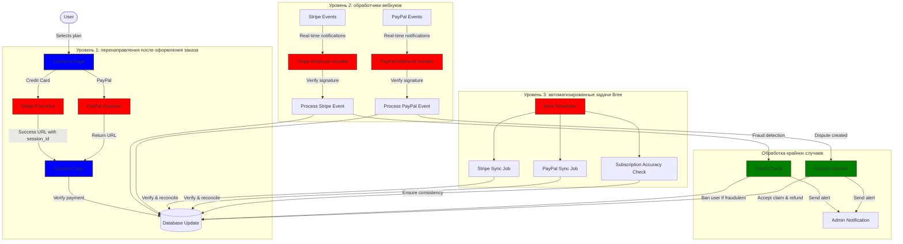
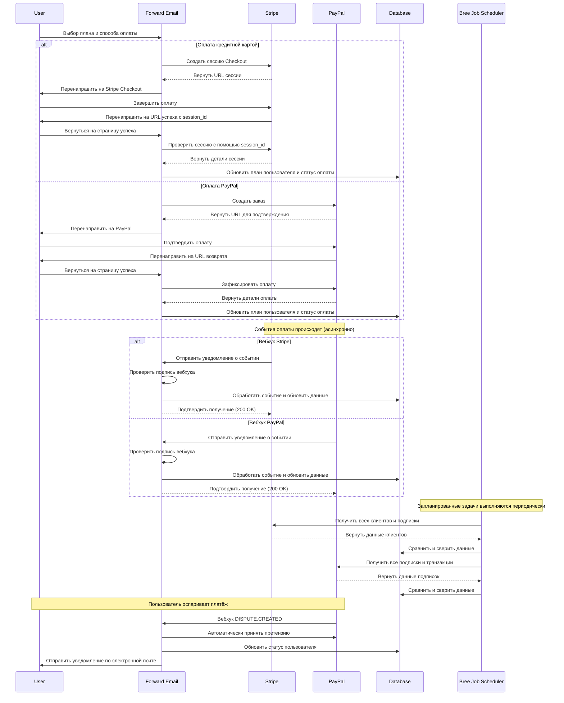
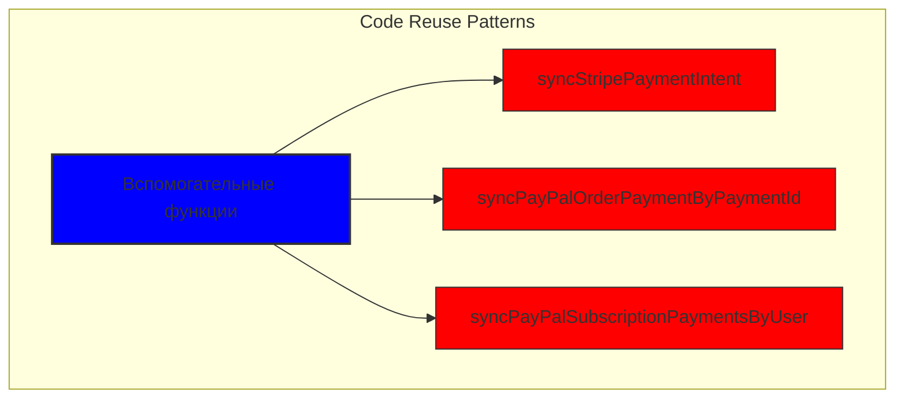
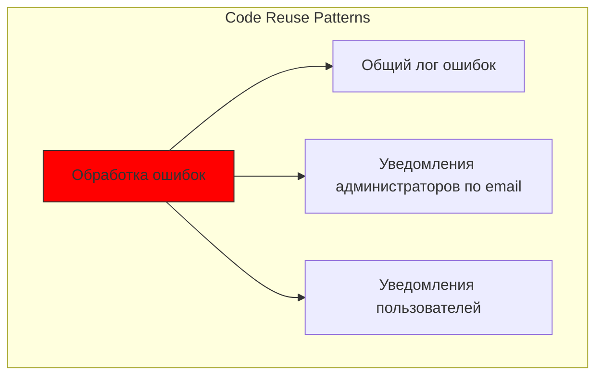
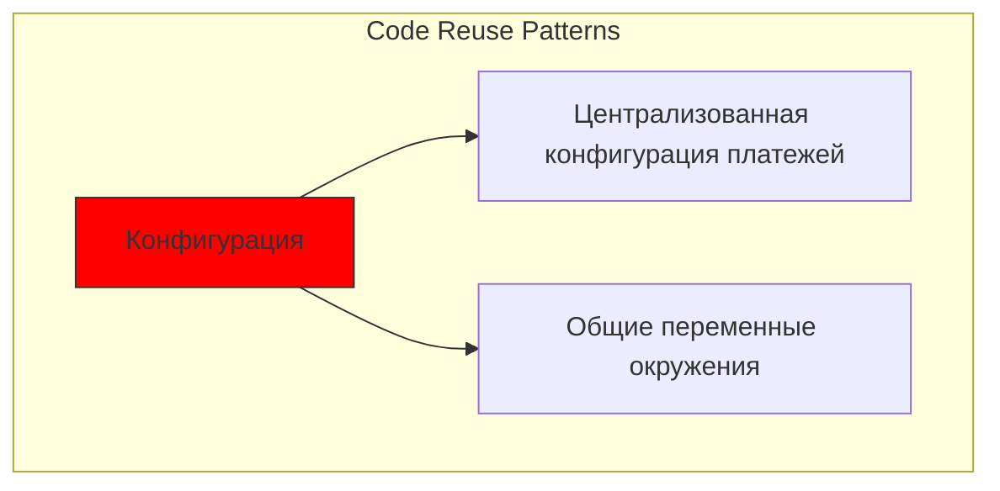
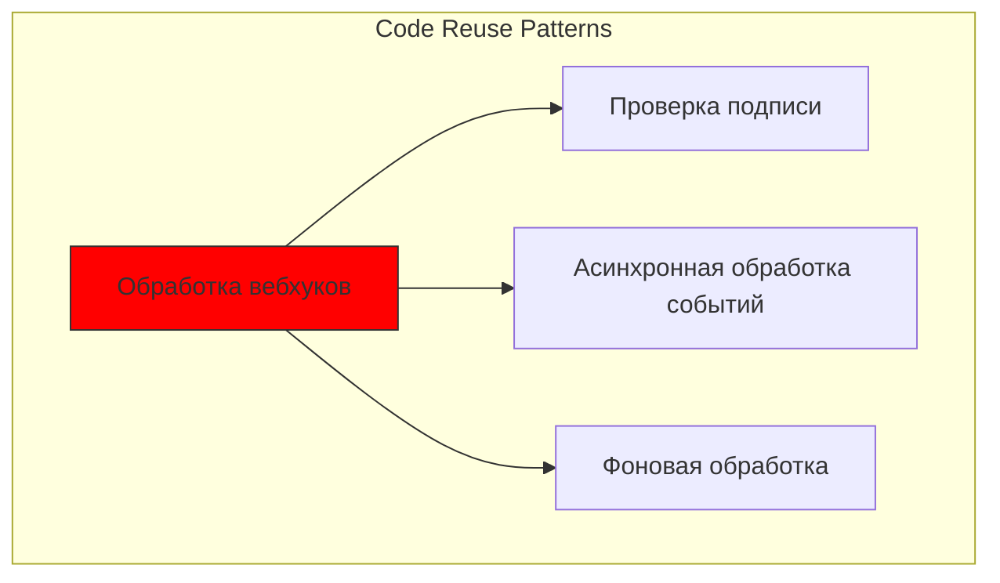
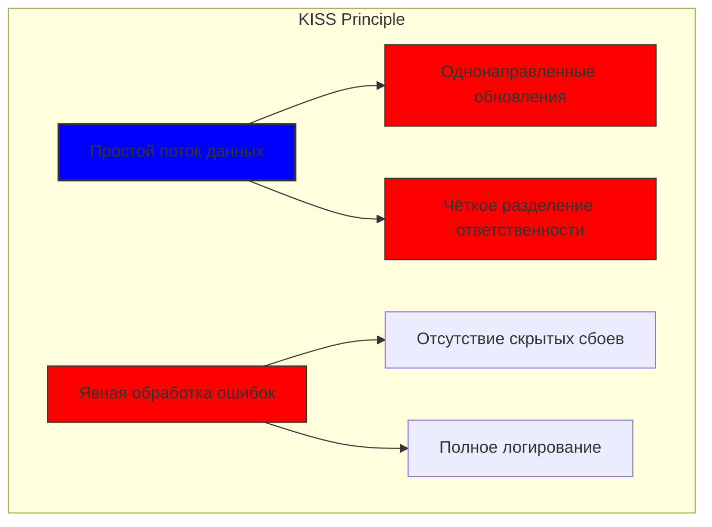

# Как мы создали надежную платежную систему с Stripe и PayPal: подход трифекта {#how-we-built-a-robust-payment-system-with-stripe-and-paypal-a-trifecta-approach}


## Содержание {#table-of-contents}

* [Предисловие](#foreword)
* [Задача: несколько платежных процессоров, один источник правды](#the-challenge-multiple-payment-processors-one-source-of-truth)
* [Подход трифекта: три уровня надежности](#the-trifecta-approach-three-layers-of-reliability)
* [Уровень 1: перенаправления после оформления заказа](#layer-1-post-checkout-redirects)
  * [Реализация Stripe Checkout](#stripe-checkout-implementation)
  * [Платежный поток PayPal](#paypal-payment-flow)
* [Уровень 2: обработчики вебхуков с проверкой подписи](#layer-2-webhook-handlers-with-signature-verification)
  * [Реализация вебхуков Stripe](#stripe-webhook-implementation)
  * [Реализация вебхуков PayPal](#paypal-webhook-implementation)
* [Уровень 3: автоматизированные задачи с Bree](#layer-3-automated-jobs-with-bree)
  * [Проверка точности подписок](#subscription-accuracy-checker)
  * [Синхронизация подписок PayPal](#paypal-subscription-synchronization)
* [Обработка крайних случаев](#handling-edge-cases)
  * [Обнаружение и предотвращение мошенничества](#fraud-detection-and-prevention)
  * [Обработка споров](#dispute-handling)
* [Повторное использование кода: принципы KISS и DRY](#code-reuse-kiss-and-dry-principles)
* [Реализация требований подписки VISA](#visa-subscription-requirements-implementation)
  * [Автоматические уведомления по электронной почте перед продлением](#automated-pre-renewal-email-notifications)
  * [Обработка крайних случаев](#handling-edge-cases-1)
  * [Пробные периоды и условия подписки](#trial-periods-and-subscription-terms)
* [Заключение: преимущества нашего подхода трифекта](#conclusion-the-benefits-of-our-trifecta-approach)


## Предисловие {#foreword}

В Forward Email мы всегда ставили во главу угла создание систем, которые надежны, точны и удобны для пользователей. При реализации нашей системы обработки платежей мы понимали, что нам нужно решение, способное работать с несколькими платежными процессорами, при этом обеспечивая идеальную согласованность данных. В этом блоге наша команда разработчиков подробно рассказывает, как мы интегрировали Stripe и PayPal, используя подход трифекта, который гарантирует точность 1:1 в реальном времени по всей системе.


## Задача: несколько платежных процессоров, один источник правды {#the-challenge-multiple-payment-processors-one-source-of-truth}

Как сервис электронной почты, ориентированный на конфиденциальность, мы хотели предоставить нашим пользователям варианты оплаты. Некоторые предпочитают простоту оплаты кредитной картой через Stripe, другие ценят дополнительный уровень разделения, который предоставляет PayPal. Однако поддержка нескольких платежных процессоров влечет за собой значительную сложность:

1. Как обеспечить согласованность данных между разными платежными системами?
2. Как обрабатывать крайние случаи, такие как споры, возвраты или неудачные платежи?
3. Как поддерживать единый источник правды в нашей базе данных?

Наше решение — реализовать то, что мы называем «подход трифекта» — трехслойную систему, которая обеспечивает избыточность и гарантирует согласованность данных вне зависимости от обстоятельств.


## Подход трифекта: три уровня надежности {#the-trifecta-approach-three-layers-of-reliability}

Наша платежная система состоит из трех ключевых компонентов, которые работают вместе, чтобы обеспечить идеальную синхронизацию данных:

1. **Перенаправления после оформления заказа** — захват информации о платеже сразу после оформления
2. **Обработчики вебхуков** — обработка событий в реальном времени от платежных процессоров
3. **Автоматизированные задачи** — периодическая проверка и сверка платежных данных

Давайте рассмотрим каждый компонент и увидим, как они работают вместе.


```mermaid
flowchart TD
    User([User]) --> |Selects plan| Checkout[Checkout Page]

    %% Layer 1: Post-checkout redirects
    subgraph "Уровень 1: перенаправления после оформления заказа"
        Checkout --> |Credit Card| Stripe[Stripe Checkout]
        Checkout --> |PayPal| PayPal[PayPal Payment]

        Stripe --> |Success URL with session_id| SuccessPage[Success Page]
        PayPal --> |Return URL| SuccessPage

        SuccessPage --> |Verify payment| Database[(Database Update)]
    end

    %% Layer 2: Webhooks
    subgraph "Уровень 2: обработчики вебхуков"
        StripeEvents[Stripe Events] --> |Real-time notifications| StripeWebhook[Stripe Webhook Handler]
        PayPalEvents[PayPal Events] --> |Real-time notifications| PayPalWebhook[PayPal Webhook Handler]

        StripeWebhook --> |Verify signature| ProcessStripeEvent[Process Stripe Event]
        PayPalWebhook --> |Verify signature| ProcessPayPalEvent[Process PayPal Event]

        ProcessStripeEvent --> Database
        ProcessPayPalEvent --> Database
    end

    %% Layer 3: Automated jobs
    subgraph "Уровень 3: автоматизированные задачи Bree"
        BreeScheduler[Bree Scheduler] --> StripeSync[Stripe Sync Job]
        BreeScheduler --> PayPalSync[PayPal Sync Job]
        BreeScheduler --> AccuracyCheck[Subscription Accuracy Check]

        StripeSync --> |Verify & reconcile| Database
        PayPalSync --> |Verify & reconcile| Database
        AccuracyCheck --> |Ensure consistency| Database
    end

    %% Edge cases
    subgraph "Обработка крайних случаев"
        ProcessStripeEvent --> |Fraud detection| FraudCheck[Fraud Check]
        ProcessPayPalEvent --> |Dispute created| DisputeHandler[Dispute Handler]

        FraudCheck --> |Ban user if fraudulent| Database
        DisputeHandler --> |Accept claim & refund| Database

        FraudCheck --> |Send alert| AdminNotification[Admin Notification]
        DisputeHandler --> |Send alert| AdminNotification
    end

    %% Style definitions
    classDef primary fill:blue,stroke:#333,stroke-width:2px;
    classDef secondary fill:red,stroke:#333,stroke-width:1px;
    classDef tertiary fill:green,stroke:#333,stroke-width:1px;

    class Checkout,SuccessPage primary;
    class Stripe,PayPal,StripeWebhook,PayPalWebhook,BreeScheduler secondary;
    class FraudCheck,DisputeHandler tertiary;
```
## Уровень 1: Перенаправления после оформления заказа {#layer-1-post-checkout-redirects}

Первый уровень нашего подхода из трёх этапов происходит сразу после того, как пользователь завершает оплату. И Stripe, и PayPal предоставляют механизмы для перенаправления пользователей обратно на наш сайт с информацией о транзакции.

### Реализация Stripe Checkout {#stripe-checkout-implementation}

Для Stripe мы используем их API Checkout Sessions, чтобы создать бесшовный опыт оплаты. Когда пользователь выбирает план и решает оплатить кредитной картой, мы создаём сессию Checkout с определёнными URL для успеха и отмены:

```javascript
const options = {
  mode: paymentType === 'one-time' ? 'payment' : 'subscription',
  customer: ctx.state.user[config.userFields.stripeCustomerID],
  client_reference_id: reference,
  metadata: {
    plan
  },
  line_items: [
    {
      price,
      quantity: 1,
      description
    }
  ],
  locale: config.STRIPE_LOCALES.has(ctx.locale) ? ctx.locale : 'auto',
  cancel_url: `${config.urls.web}${ctx.path}${
    isMakePayment || isEnableAutoRenew ? '' : `/?plan=${plan}`
  }`,
  success_url: `${config.urls.web}${ctx.path}/?${
    isMakePayment || isEnableAutoRenew ? '' : `plan=${plan}&`
  }session_id={CHECKOUT_SESSION_ID}`,
  allow_promotion_codes: true
};

// Create the checkout session and redirect
const session = await stripe.checkout.sessions.create(options);
const redirectTo = session.url;
if (ctx.accepts('html')) {
  ctx.status = 303;
  ctx.redirect(redirectTo);
} else {
  ctx.body = { redirectTo };
}
```

Критически важной частью здесь является параметр `success_url`, который включает `session_id` в качестве параметра запроса. Когда Stripe перенаправляет пользователя обратно на наш сайт после успешной оплаты, мы можем использовать этот идентификатор сессии для проверки транзакции и обновления нашей базы данных соответствующим образом.

### Процесс оплаты PayPal {#paypal-payment-flow}

Для PayPal мы используем аналогичный подход с их API Orders:

```javascript
const requestBody = {
  intent: 'CAPTURE',
  application_context: {
    cancel_url: `${config.urls.web}${ctx.path}${
      isMakePayment || isEnableAutoRenew ? '' : `/?plan=${plan}`
    }`,
    return_url: `${config.urls.web}${ctx.path}/?plan=${plan}`,
    brand_name: 'Forward Email',
    shipping_preference: 'NO_SHIPPING',
    user_action: 'PAY_NOW'
  },
  payer: {
    email_address: ctx.state.user.email
  },
  purchase_units: [
    {
      reference_id: ctx.state.user.id,
      description,
      custom_id: sku,
      invoice_id: reference,
      soft_descriptor: sku,
      amount: {
        currency_code: 'USD',
        value: price,
        breakdown: {
          item_total: {
            currency_code: 'USD',
            value: price
          }
        }
      },
      items: [
        {
          name,
          description,
          sku,
          unit_amount: {
            currency_code: 'USD',
            value: price
          },
          quantity: '1',
          category: 'DIGITAL_GOODS'
        }
      ]
    }
  ]
};
```

Аналогично Stripe, мы указываем параметры `return_url` и `cancel_url` для обработки перенаправлений после оплаты. Когда PayPal перенаправляет пользователя обратно на наш сайт, мы можем зафиксировать детали оплаты и обновить нашу базу данных.


```mermaid
sequenceDiagram
    participant User
    participant FE as Forward Email
    participant Stripe
    participant PayPal
    participant DB as Database
    participant Bree as Bree Job Scheduler

    %% Initial checkout flow
    User->>FE: Выбор плана и способа оплаты

    alt Оплата кредитной картой
        FE->>Stripe: Создать сессию Checkout
        Stripe-->>FE: Вернуть URL сессии
        FE->>User: Перенаправить на Stripe Checkout
        User->>Stripe: Завершить оплату
        Stripe->>User: Перенаправить на URL успеха с session_id
        User->>FE: Вернуться на страницу успеха
        FE->>Stripe: Проверить сессию с помощью session_id
        Stripe-->>FE: Вернуть детали сессии
        FE->>DB: Обновить план пользователя и статус оплаты
    else Оплата PayPal
        FE->>PayPal: Создать заказ
        PayPal-->>FE: Вернуть URL для подтверждения
        FE->>User: Перенаправить на PayPal
        User->>PayPal: Подтвердить оплату
        PayPal->>User: Перенаправить на URL возврата
        User->>FE: Вернуться на страницу успеха
        FE->>PayPal: Зафиксировать оплату
        PayPal-->>FE: Вернуть детали оплаты
        FE->>DB: Обновить план пользователя и статус оплаты
    end

    %% Webhook flow (asynchronous)
    Note over Stripe,PayPal: События оплаты происходят (асинхронно)

    alt Вебхук Stripe
        Stripe->>FE: Отправить уведомление о событии
        FE->>FE: Проверить подпись вебхука
        FE->>DB: Обработать событие и обновить данные
        FE-->>Stripe: Подтвердить получение (200 OK)
    else Вебхук PayPal
        PayPal->>FE: Отправить уведомление о событии
        FE->>FE: Проверить подпись вебхука
        FE->>DB: Обработать событие и обновить данные
        FE-->>PayPal: Подтвердить получение (200 OK)
    end

    %% Автоматические задачи Bree
    Note over Bree: Запланированные задачи выполняются периодически

    Bree->>Stripe: Получить всех клиентов и подписки
    Stripe-->>Bree: Вернуть данные клиентов
    Bree->>DB: Сравнить и сверить данные

    Bree->>PayPal: Получить все подписки и транзакции
    PayPal-->>Bree: Вернуть данные подписок
    Bree->>DB: Сравнить и сверить данные

    %% Крайний случай: Обработка споров
    Note over User,PayPal: Пользователь оспаривает платёж

    PayPal->>FE: Вебхук DISPUTE.CREATED
    FE->>PayPal: Автоматически принять претензию
    FE->>DB: Обновить статус пользователя
    FE->>User: Отправить уведомление по электронной почте
```
## Layer 2: Обработчики вебхуков с проверкой подписи {#layer-2-webhook-handlers-with-signature-verification}

Хотя перенаправления после оформления заказа хорошо работают в большинстве случаев, они не безупречны. Пользователи могут закрыть браузер до перенаправления, или сетевые проблемы могут помешать завершению перенаправления. Здесь на помощь приходят вебхуки.

И Stripe, и PayPal предоставляют системы вебхуков, которые отправляют уведомления о событиях оплаты в реальном времени. Мы реализовали надежные обработчики вебхуков, которые проверяют подлинность этих уведомлений и обрабатывают их соответствующим образом.

### Реализация вебхука Stripe {#stripe-webhook-implementation}

Наш обработчик вебхуков Stripe проверяет подпись входящих событий вебхука, чтобы убедиться в их легитимности:

```javascript
async function webhook(ctx) {
  const sig = ctx.request.get('stripe-signature');
  // throw an error if something was wrong
  if (!isSANB(sig))
    throw Boom.badRequest(ctx.translateError('INVALID_STRIPE_SIGNATURE'));
  const event = stripe.webhooks.constructEvent(
    ctx.request.rawBody,
    sig,
    env.STRIPE_ENDPOINT_SECRET
  );
  // throw an error if something was wrong
  if (!event)
    throw Boom.badRequest(ctx.translateError('INVALID_STRIPE_SIGNATURE'));
  ctx.logger.info('stripe webhook', { event });
  // return a response to acknowledge receipt of the event
  ctx.body = { received: true };
  // run in background
  processEvent(ctx, event)
    .then()
    .catch((err) => {
      ctx.logger.fatal(err, { event });
      // email admin errors
      emailHelper({
        template: 'alert',
        message: {
          to: config.email.message.from,
          subject: `Ошибка с вебхуком Stripe (ID события ${event.id})`
        },
        locals: {
          message: `<pre><code>${safeStringify(
            parseErr(err),
            null,
            2
          )}</code></pre>`
        }
      })
        .then()
        .catch((err) => ctx.logger.fatal(err, { event }));
    });
}
```

Функция `stripe.webhooks.constructEvent` проверяет подпись с использованием нашего секретного ключа эндпоинта. Если подпись действительна, мы асинхронно обрабатываем событие, чтобы не блокировать ответ вебхука.

### Реализация вебхука PayPal {#paypal-webhook-implementation}

Аналогично, наш обработчик вебхуков PayPal проверяет подлинность входящих уведомлений:

```javascript
async function webhook(ctx) {
  const response = await promisify(
    paypal.notification.webhookEvent.verify,
    paypal.notification.webhookEvent
  )(ctx.request.headers, ctx.request.body, env.PAYPAL_WEBHOOK_ID);
  // throw an error if something was wrong
  if (!_.isObject(response) || response.verification_status !== 'SUCCESS')
    throw Boom.badRequest(ctx.translateError('INVALID_PAYPAL_SIGNATURE'));
  // return a response to acknowledge receipt of the event
  ctx.body = { received: true };
  // run in background
  processEvent(ctx)
    .then()
    .catch((err) => {
      ctx.logger.fatal(err);
      // email admin errors
      emailHelper({
        template: 'alert',
        message: {
          to: config.email.message.from,
          subject: `Ошибка с вебхуком PayPal (ID события ${ctx.request.body.id})`
        },
        locals: {
          message: `<pre><code>${safeStringify(
            parseErr(err),
            null,
            2
          )}</code></pre>`
        }
      })
        .then()
        .catch((err) => ctx.logger.fatal(err));
    });
}
```

Оба обработчика вебхуков следуют одной схеме: проверка подписи, подтверждение получения и асинхронная обработка события. Это гарантирует, что мы никогда не пропустим событие оплаты, даже если перенаправление после оформления заказа не сработает.


## Layer 3: Автоматизированные задачи с Bree {#layer-3-automated-jobs-with-bree}

Последний уровень нашего подхода — набор автоматизированных задач, которые периодически проверяют и сверяют данные по оплатам. Мы используем Bree, планировщик задач для Node.js, чтобы запускать эти задачи с регулярными интервалами.

### Проверка точности подписок {#subscription-accuracy-checker}

Одна из ключевых задач — проверка точности подписок, которая гарантирует, что наша база данных точно отражает статус подписки в Stripe:
```javascript
async function mapper(customer) {
  // wait a second to prevent rate limitation error
  await setTimeout(ms('1s'));
  // check for user on our side
  let user = await Users.findOne({
    [config.userFields.stripeCustomerID]: customer.id
  })
    .lean()
    .exec();
  if (!user) return;
  if (user.is_banned) return;

  // if emails did not match
  if (user.email !== customer.email) {
    logger.info(
      `User email ${user.email} did not match customer email ${customer.email} (${customer.id})`
    );
    customer = await stripe.customers.update(customer.id, {
      email: user.email
    });
    logger.info(`Updated user email to match ${user.email}`);
  }

  // check for active subscriptions
  const [activeSubscriptions, trialingSubscriptions] = await Promise.all([
    stripe.subscriptions.list({
      customer: customer.id,
      status: 'active'
    }),
    stripe.subscriptions.list({
      customer: customer.id,
      status: 'trialing'
    })
  ]);

  // Combine active and trialing subscriptions
  let subscriptions = [
    ...activeSubscriptions.data,
    ...trialingSubscriptions.data
  ];

  // Handle edge case: multiple subscriptions for one user
  if (subscriptions.length > 1) {
    await logger.error(
      new Error(
        `We may need to refund: User had multiple subscriptions ${user.email} (${customer.id})`
      )
    );
    await emailHelper({
      template: 'alert',
      message: {
        to: config.email.message.from,
        subject: `User had multiple subscriptions ${user.email}`
      },
      locals: {
        message: `User ${user.email} (${customer.id}) had multiple subscriptions: ${JSON.stringify(
          subscriptions.map((s) => s.id)
        )}`
      }
    });
  }
}
```

This job checks for discrepancies between our database and Stripe, such as mismatched email addresses or multiple active subscriptions. If it finds any issues, it logs them and sends alerts to our admin team.

### PayPal Subscription Synchronization {#paypal-subscription-synchronization}

We have a similar job for PayPal subscriptions:

```javascript
async function syncPayPalSubscriptionPayments() {
  const paypalCustomers = await Users.find({
    $or: [
      {
        [config.userFields.paypalSubscriptionID]: { $exists: true, $ne: null }
      },
      {
        [config.userFields.paypalPayerID]: { $exists: true, $ne: null }
      }
    ]
  })
    // sort by newest customers first
    .sort('-created_at')
    .lean()
    .exec();

  await logger.info(
    `Syncing payments for ${paypalCustomers.length} paypal customers`
  );

  // Process each customer and sync their payments
  const errorEmails = await pReduce(
    paypalCustomers,
    // Implementation details...
  );
}
```

These automated jobs serve as our final safety net, ensuring that our database always reflects the true state of subscriptions and payments in both Stripe and PayPal.


## Handling Edge Cases {#handling-edge-cases}

A robust payment system must handle edge cases gracefully. Let's look at how we handle some common scenarios.

### Fraud Detection and Prevention {#fraud-detection-and-prevention}

We've implemented sophisticated fraud detection mechanisms that automatically identify and handle suspicious payment activities:

```javascript
case 'charge.failed': {
  // Get all failed charges in the last 30 days
  const charges = await stripe.charges.list({
    customer: event.data.object.customer,
    created: {
      gte: dayjs().subtract(1, 'month').unix()
    }
  });

  // Filter for declined charges
  const filtered = charges.data.filter(
    (d) => d.status === 'failed' && d.failure_code === 'card_declined'
  );

  // if not more than 5 then return early
  if (filtered.length < 5) break;

  // Check if user has verified domains
  const count = await Domains.countDocuments({
    members: {
      $elemMatch: {
        user: user._id,
        group: 'admin'
      }
    },
    plan: { $in: ['enhanced_protection', 'team'] },
    has_txt_record: true
  });

  if (!user.is_banned) {
    // If no verified domains, ban the user and refund all charges
    if (count === 0) {
      // Ban the user
      user.is_banned = true;
      await user.save();

      // Refund all successful charges
    }
  }
}
```

Этот код автоматически блокирует пользователей, у которых несколько неудачных попыток списания и нет подтверждённых доменов, что является сильным признаком мошеннической активности.

### Обработка споров {#dispute-handling}

Когда пользователь оспаривает списание, мы автоматически принимаем претензию и предпринимаем соответствующие действия:

```javascript
case 'CUSTOMER.DISPUTE.CREATED': {
  // принять претензию
  const agent = await paypalAgent();
  await agent
    .post(`/v1/customer/disputes/${body.resource.dispute_id}/accept-claim`)
    .send({
      note: 'Полное возмещение клиенту.'
    });

  // Найти платёж в нашей базе данных
  const payment = await Payments.findOne({ $or });
  if (!payment) throw new Error('Платёж не существует');

  const user = await Users.findById(payment.user);
  if (!user) throw new Error('Пользователь не найден для клиента');

  // Отменить подписку пользователя, если она есть
  if (isSANB(user[config.userFields.paypalSubscriptionID])) {
    try {
      const agent = await paypalAgent();
      await agent.post(
        `/v1/billing/subscriptions/${
          user[config.userFields.paypalSubscriptionID]
        }/cancel`
      );
    } catch (err) {
      // Обработка ошибок при отмене подписки
    }
  }
}
```

Такой подход минимизирует влияние споров на наш бизнес, обеспечивая при этом хороший опыт для клиентов.


## Повторное использование кода: принципы KISS и DRY {#code-reuse-kiss-and-dry-principles}

Во всей нашей платежной системе мы придерживаемся принципов KISS (Keep It Simple, Stupid — «Делай проще») и DRY (Don't Repeat Yourself — «Не повторяйся»). Вот несколько примеров:

1. **Общие вспомогательные функции**: Мы создали переиспользуемые вспомогательные функции для общих задач, таких как синхронизация платежей и отправка писем.

2. **Единая обработка ошибок**: Обработчики вебхуков Stripe и PayPal используют одинаковый шаблон для обработки ошибок и уведомлений администраторов.

3. **Унифицированная схема базы данных**: Наша схема базы данных разработана для поддержки данных как Stripe, так и PayPal, с общими полями для статуса платежа, суммы и информации о плане.

4. **Централизованная конфигурация**: Конфигурация, связанная с платежами, сосредоточена в одном файле, что облегчает обновление цен и информации о продуктах.


```mermaid
graph TD
    subgraph "Code Reuse Patterns"
        A[Вспомогательные функции] --> B[syncStripePaymentIntent]
        A --> C[syncPayPalOrderPaymentByPaymentId]
        A --> D[syncPayPalSubscriptionPaymentsByUser]
    end

    classDef primary fill:blue,stroke:#333,stroke-width:2px;
    classDef secondary fill:red,stroke:#333,stroke-width:1px;

    class A,P,V primary;
    class B,C,D,E,I,L,Q,R,S,W,X,Y,Z secondary;
```


```mermaid
graph TD
    subgraph "Code Reuse Patterns"
        E[Обработка ошибок] --> F[Общий лог ошибок]
        E --> G[Уведомления администраторов по email]
        E --> H[Уведомления пользователей]
    end

    classDef primary fill:blue,stroke:#333,stroke-width:2px;
    classDef secondary fill:red,stroke:#333,stroke-width:1px;

    class A,P,V primary;
    class B,C,D,E,I,L,Q,R,S,W,X,Y,Z secondary;
```


```mermaid
graph TD
    subgraph "Code Reuse Patterns"
        I[Конфигурация] --> J[Централизованная конфигурация платежей]
        I --> K[Общие переменные окружения]
    end

    classDef primary fill:blue,stroke:#333,stroke-width:2px;
    classDef secondary fill:red,stroke:#333,stroke-width:1px;

    class A,P,V primary;
    class B,C,D,E,I,L,Q,R,S,W,X,Y,Z secondary;
```


```mermaid
graph TD
    subgraph "Code Reuse Patterns"
        L[Обработка вебхуков] --> M[Проверка подписи]
        L --> N[Асинхронная обработка событий]
        L --> O[Фоновая обработка]
    end

    classDef primary fill:blue,stroke:#333,stroke-width:2px;
    classDef secondary fill:red,stroke:#333,stroke-width:1px;

    class A,P,V primary;
    class B,C,D,E,I,L,Q,R,S,W,X,Y,Z secondary;
```


```mermaid
graph TD
    subgraph "KISS Principle"
        P[Простой поток данных] --> Q[Однонаправленные обновления]
        P --> R[Чёткое разделение ответственности]

        S[Явная обработка ошибок] --> T[Отсутствие скрытых сбоев]
        S --> U[Полное логирование]
    end

    classDef primary fill:blue,stroke:#333,stroke-width:2px;
    classDef secondary fill:red,stroke:#333,stroke-width:1px;

    class A,P,V primary;
    class B,C,D,E,I,L,Q,R,S,W,X,Y,Z secondary;
```
graph TD
    subgraph "Принцип DRY"
        V[Общая логика] --> W[Функции обработки платежей]
        V --> X[Шаблоны писем]
        V --> Y[Логика валидации]

        Z[Общие операции с базой данных] --> AA[Обновления пользователей]
        Z --> AB[Запись платежей]
    end

    classDef primary fill:blue,stroke:#333,stroke-width:2px;
    classDef secondary fill:red,stroke:#333,stroke-width:1px;

    class A,P,V primary;
    class B,C,D,E,I,L,Q,R,S,W,X,Y,Z secondary;
```


## Реализация требований подписки VISA {#visa-subscription-requirements-implementation}

В дополнение к нашему подходу из трёх компонентов, мы реализовали конкретные функции для соблюдения требований подписки VISA и улучшения пользовательского опыта. Одно из ключевых требований VISA — уведомлять пользователей перед списанием средств за подписку, особенно при переходе с пробного периода на платную подписку.

### Автоматические уведомления по электронной почте перед продлением {#automated-pre-renewal-email-notifications}

Мы создали автоматизированную систему, которая определяет пользователей с активными пробными подписками и отправляет им уведомление по электронной почте перед первым списанием средств. Это не только обеспечивает соответствие требованиям VISA, но и снижает количество возвратов платежей и повышает удовлетворённость клиентов.

Вот как мы реализовали эту функцию:

```javascript
// Найти пользователей с пробными подписками, которым ещё не отправлялось уведомление
const users = await Users.find({
  $or: [
    {
      $and: [
        { [config.userFields.stripeSubscriptionID]: { $exists: true } },
        { [config.userFields.stripeTrialSentAt]: { $exists: false } },
        // Исключить подписки, по которым уже были платежи
        ...(paidStripeSubscriptionIds.length > 0
          ? [
              {
                [config.userFields.stripeSubscriptionID]: {
                  $nin: paidStripeSubscriptionIds
                }
              }
            ]
          : [])
      ]
    },
    {
      $and: [
        { [config.userFields.paypalSubscriptionID]: { $exists: true } },
        { [config.userFields.paypalTrialSentAt]: { $exists: false } },
        // Исключить подписки, по которым уже были платежи
        ...(paidPayPalSubscriptionIds.length > 0
          ? [
              {
                [config.userFields.paypalSubscriptionID]: {
                  $nin: paidPayPalSubscriptionIds
                }
              }
            ]
          : [])
      ]
    }
  ]
});

// Обработать каждого пользователя и отправить уведомление
for (const user of users) {
  // Получить детали подписки от платёжного процессора
  const subscription = await getSubscriptionDetails(user);

  // Рассчитать длительность подписки и частоту списаний
  const duration = getDurationFromPlanId(subscription.plan_id);
  const frequency = getHumanReadableFrequency(duration, user.locale);
  const amount = getPlanAmount(user.plan, duration);

  // Получить домены пользователя для персонализированного письма
  const domains = await Domains.find({
    'members.user': user._id
  }).sort('name').lean().exec();

  // Отправить уведомление по электронной почте в соответствии с требованиями VISA
  await emailHelper({
    template: 'visa-trial-subscription-requirement',
    message: {
      to: user.receipt_email || user.email,
      ...(user.receipt_email ? { cc: user.email } : {})
    },
    locals: {
      user,
      firstChargeDate: new Date(subscription.start_time),
      frequency,
      formattedAmount: numeral(amount).format('$0,0,0.00'),
      domains
    }
  });

  // Зафиксировать факт отправки уведомления
  await Users.findByIdAndUpdate(user._id, {
    $set: {
      [config.userFields.paypalTrialSentAt]: new Date()
    }
  });
}
```

Эта реализация гарантирует, что пользователи всегда информированы о предстоящих списаниях с чёткими деталями:

1. Когда произойдёт первое списание
2. Частота будущих списаний (ежемесячно, ежегодно и т.д.)
3. Точная сумма, которая будет списана
4. Какие домены покрываются их подпиской

Автоматизируя этот процесс, мы обеспечиваем полное соответствие требованиям VISA (которые требуют уведомления как минимум за 7 дней до списания), одновременно снижая количество обращений в поддержку и улучшая общий пользовательский опыт.
### Обработка крайних случаев {#handling-edge-cases-1}

Наша реализация также включает надежную обработку ошибок. Если что-то пойдет не так во время процесса уведомления, наша система автоматически оповещает нашу команду:

```javascript
try {
  await mapper(user);
} catch (err) {
  logger.error(err);

  // Отправить оповещение администраторам
  await emailHelper({
    template: 'alert',
    message: {
      to: config.email.message.from,
      subject: 'Ошибка требования пробной подписки VISA'
    },
    locals: {
      message: `<pre><code>${safeStringify(
        parseErr(err),
        null,
        2
      )}</code></pre>`
    }
  });
}
```

Это гарантирует, что даже если возникнет проблема с системой уведомлений, наша команда сможет быстро ее решить и поддерживать соответствие требованиям VISA.

Система уведомлений о подписке VISA — еще один пример того, как мы построили нашу платежную инфраструктуру с учетом как соответствия требованиям, так и удобства пользователей, дополняя наш подход трифекты для обеспечения надежной и прозрачной обработки платежей.

### Пробные периоды и условия подписки {#trial-periods-and-subscription-terms}

Для пользователей, включающих автообновление на существующих планах, мы рассчитываем соответствующий пробный период, чтобы они не были списаны до истечения текущего плана:

```javascript
if (
  isEnableAutoRenew &&
  dayjs(ctx.state.user[config.userFields.planExpiresAt]).isAfter(
    dayjs()
  )
) {
  const hours = dayjs(
    ctx.state.user[config.userFields.planExpiresAt]
  ).diff(dayjs(), 'hours');

  // Обработка расчета пробного периода
}
```

Мы также предоставляем четкую информацию об условиях подписки, включая частоту выставления счетов и политику отмены, а также включаем подробные метаданные с каждой подпиской для обеспечения правильного отслеживания и управления.

## Заключение: преимущества нашего подхода трифекты {#conclusion-the-benefits-of-our-trifecta-approach}

Наш подход трифекты к обработке платежей принес несколько ключевых преимуществ:

1. **Надежность**: благодаря реализации трех уровней проверки платежей мы гарантируем, что ни один платеж не будет пропущен или обработан неправильно.

2. **Точность**: наша база данных всегда отражает истинное состояние подписок и платежей как в Stripe, так и в PayPal.

3. **Гибкость**: пользователи могут выбирать предпочитаемый способ оплаты без ущерба для надежности нашей системы.

4. **Устойчивость**: наша система грамотно обрабатывает крайние случаи, от сбоев сети до мошеннических действий.

Если вы реализуете платежную систему с поддержкой нескольких процессоров, мы настоятельно рекомендуем этот подход трифекты. Он требует больших усилий на этапе разработки, но долгосрочные преимущества в плане надежности и точности того стоят.

Для получения дополнительной информации о Forward Email и наших сервисах электронной почты с акцентом на конфиденциальность посетите наш [веб-сайт](https://forwardemail.net).

<!-- *Keywords: payment processing, Stripe integration, PayPal integration, webhook handling, payment synchronization, subscription management, fraud prevention, dispute handling, Node.js payment system, multi-processor payment system, payment gateway integration, real-time payment verification, payment data consistency, subscription billing, payment security, payment automation, payment webhooks, payment reconciliation, payment edge cases, payment error handling, VISA subscription requirements, pre-renewal notifications, subscription compliance* -->
