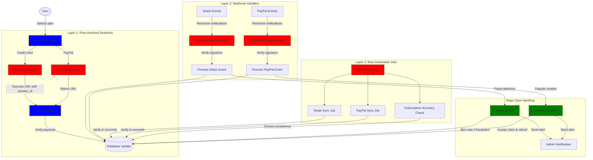
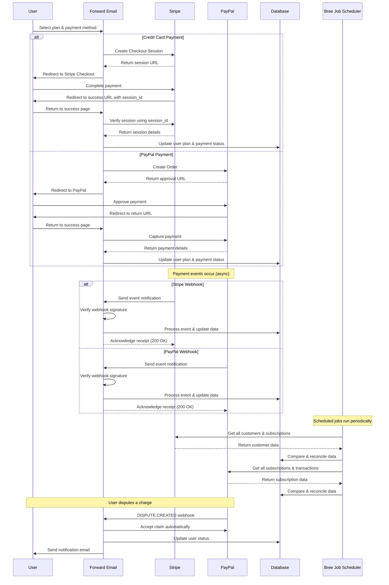
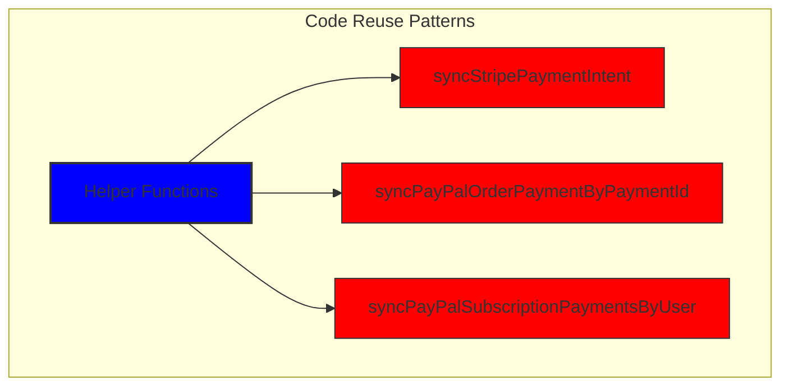
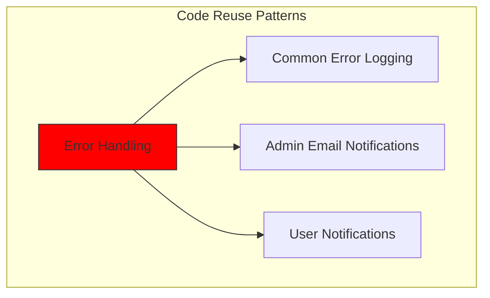
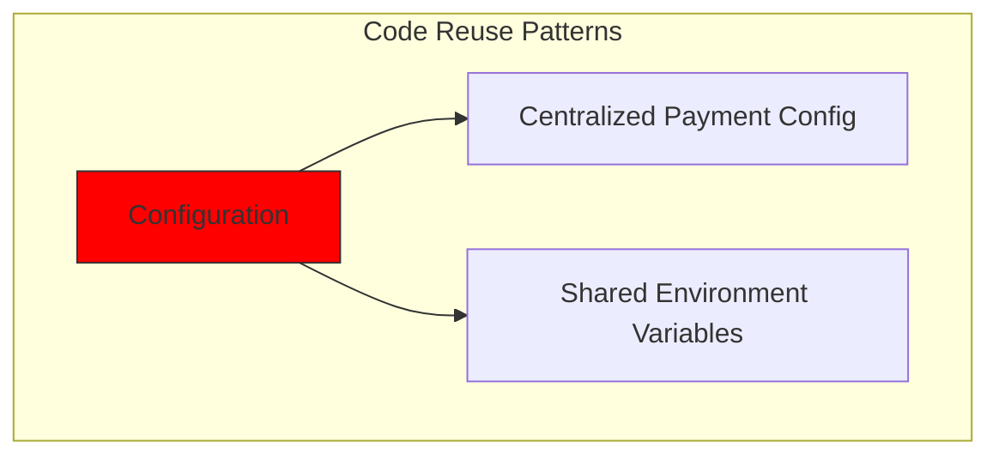
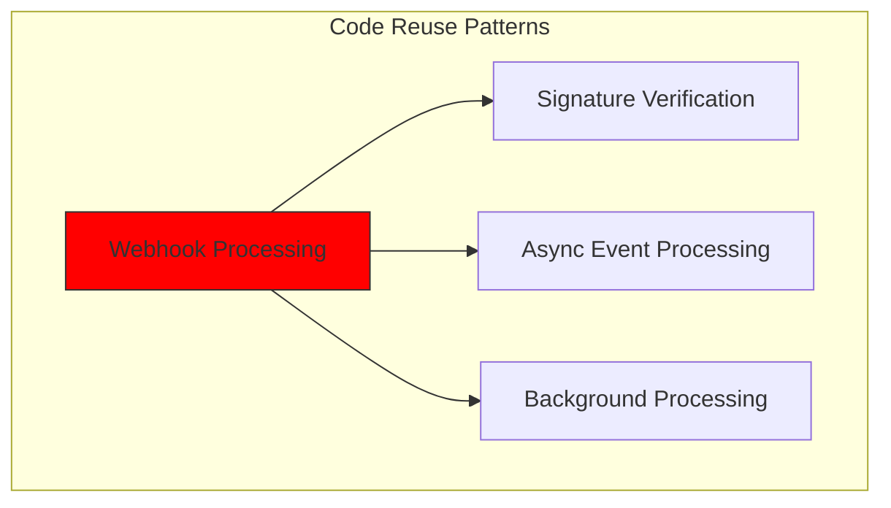
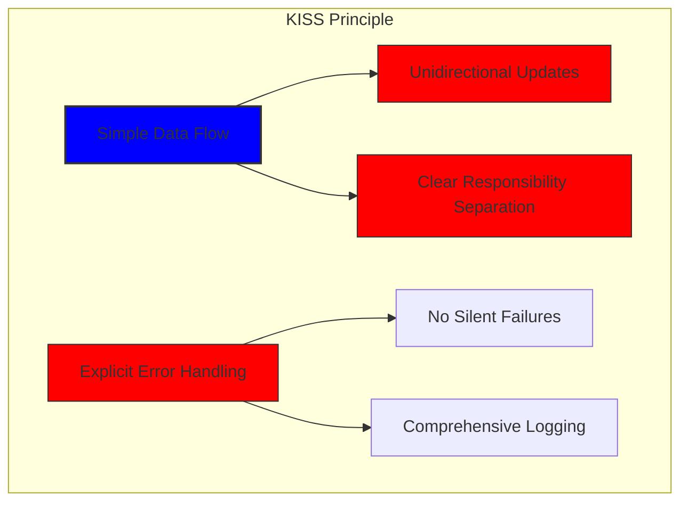
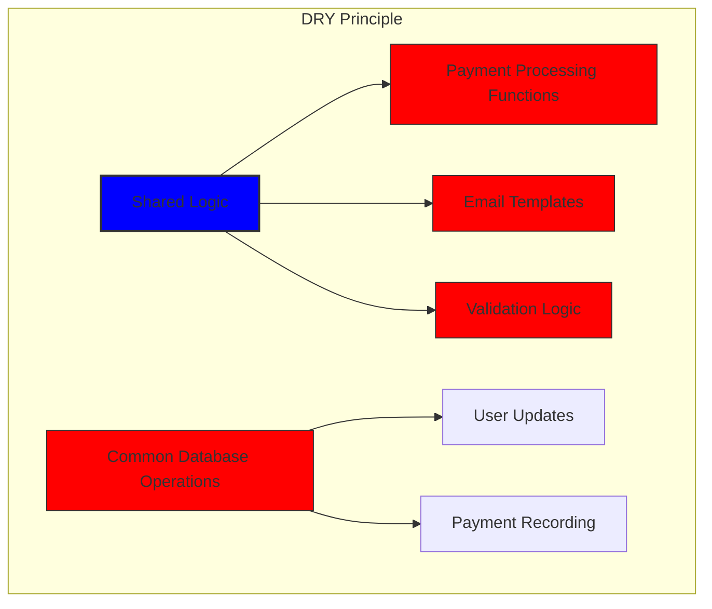

# Hur vi byggde ett robust betalningssystem med Stripe och PayPal: En trifecta-metod {#how-we-built-a-robust-payment-system-with-stripe-and-paypal-a-trifecta-approach}


## Innehållsförteckning {#table-of-contents}

* [Förord](#foreword)
* [Utmaningen: Flera betalningsleverantörer, en enda källa till sanning](#the-challenge-multiple-payment-processors-one-source-of-truth)
* [Trifecta-metoden: Tre lager av tillförlitlighet](#the-trifecta-approach-three-layers-of-reliability)
* [Nivå 1: Omdirigeringar efter utcheckning](#layer-1-post-checkout-redirects)
  * [Stripe Checkout-implementering](#stripe-checkout-implementation)
  * [PayPal-betalningsflöde](#paypal-payment-flow)
* [Nivå 2: Webhook-hanterare med signaturverifiering](#layer-2-webhook-handlers-with-signature-verification)
  * [Stripe Webhook-implementering](#stripe-webhook-implementation)
  * [PayPal Webhook-implementering](#paypal-webhook-implementation)
* [Nivå 3: Automatiserade jobb med Bree](#layer-3-automated-jobs-with-bree)
  * [Prenumerationsnoggrannhetskontroll](#subscription-accuracy-checker)
  * [PayPal-prenumerationssynkronisering](#paypal-subscription-synchronization)
* [Hantering av Edge-fall](#handling-edge-cases)
  * [Bedrägeriupptäckt och förebyggande](#fraud-detection-and-prevention)
  * [Tvisthantering](#dispute-handling)
* [Återanvändning av kod: KISS- och DRY-principerna](#code-reuse-kiss-and-dry-principles)
* [Implementering av VISA-prenumerationskrav](#visa-subscription-requirements-implementation)
  * [Automatiserade e-postmeddelanden före förnyelse](#automated-pre-renewal-email-notifications)
  * [Hantering av Edge-fall](#handling-edge-cases-1)
  * [Provperioder och prenumerationsvillkor](#trial-periods-and-subscription-terms)
* [Slutsats: Fördelarna med vår Trifecta-metod](#conclusion-the-benefits-of-our-trifecta-approach)

## Förord {#foreword}

På Forward Email har vi alltid prioriterat att skapa system som är tillförlitliga, korrekta och användarvänliga. När det gällde att implementera vårt betalningssystem visste vi att vi behövde en lösning som kunde hantera flera betalningsleverantörer samtidigt som vi bibehöll perfekt datakonsistens. Det här blogginlägget beskriver hur vårt utvecklingsteam integrerade både Stripe och PayPal med en trifekta metod som säkerställer 1:1 realtidsnoggrannhet i hela vårt system.

## Utmaningen: Flera betalningsleverantörer, en källa till sanning {#the-challenge-multiple-payment-processors-one-source-of-truth}

Som en integritetsfokuserad e-posttjänst ville vi ge våra användare betalningsalternativ. Vissa föredrar enkelheten med kreditkortsbetalningar via Stripe, medan andra värdesätter det extra separationslager som PayPal erbjuder. Att stödja flera betalningsleverantörer medför dock betydande komplexitet:

1. Hur säkerställer vi enhetlig data över olika betalningssystem?
2. Hur hanterar vi marginalfall som tvister, återbetalningar eller misslyckade betalningar?
3. Hur upprätthåller vi en enda sanningskälla i vår databas?

Vår lösning var att implementera det vi kallar "trifecta-metoden" – ett trelagerssystem som ger redundans och säkerställer datakonsistens oavsett vad som händer.

## Trifecta-metoden: Tre lager av tillförlitlighet {#the-trifecta-approach-three-layers-of-reliability}

Vårt betalningssystem består av tre viktiga komponenter som samverkar för att säkerställa perfekt datasynkronisering:

1. **Omdirigeringar efter utcheckning** - Samlar in betalningsinformation omedelbart efter utcheckningen
2. **Webhook-hanterare** - Bearbetar händelser i realtid från betalningsbehandlare
3. **Automatiserade jobb** - Regelbunden verifiering och avstämning av betalningsdata

Låt oss dyka in i varje komponent och se hur de fungerar tillsammans.



## Nivå 1: Omdirigeringar efter utcheckning {#layer-1-post-checkout-redirects}

Det första lagret av vår trifecta-strategi sker omedelbart efter att en användare har slutfört en betalning. Både Stripe och PayPal erbjuder mekanismer för att omdirigera användare tillbaka till vår webbplats med transaktionsinformation.

### Stripe Checkout-implementering {#stripe-checkout-implementation}

För Stripe använder vi deras Checkout Sessions API för att skapa en sömlös betalningsupplevelse. När en användare väljer ett abonnemang och väljer att betala med kreditkort skapar vi en Checkout Session med specifika URL:er för framgång och avbokning:

```javascript
const options = {
  mode: paymentType === 'one-time' ? 'payment' : 'subscription',
  customer: ctx.state.user[config.userFields.stripeCustomerID],
  client_reference_id: reference,
  metadata: {
    plan
  },
  line_items: [
    {
      price,
      quantity: 1,
      description
    }
  ],
  locale: config.STRIPE_LOCALES.has(ctx.locale) ? ctx.locale : 'auto',
  cancel_url: `${config.urls.web}${ctx.path}${
    isMakePayment || isEnableAutoRenew ? '' : `/?plan=${plan}`
  }`,
  success_url: `${config.urls.web}${ctx.path}/?${
    isMakePayment || isEnableAutoRenew ? '' : `plan=${plan}&`
  }session_id={CHECKOUT_SESSION_ID}`,
  allow_promotion_codes: true
};

// Create the checkout session and redirect
const session = await stripe.checkout.sessions.create(options);
const redirectTo = session.url;
if (ctx.accepts('html')) {
  ctx.status = 303;
  ctx.redirect(redirectTo);
} else {
  ctx.body = { redirectTo };
}
```

Den kritiska delen här är parametern `success_url`, som inkluderar `session_id` som en frågeparameter. När Stripe omdirigerar användaren tillbaka till vår webbplats efter en lyckad betalning kan vi använda detta sessions-ID för att verifiera transaktionen och uppdatera vår databas därefter.

### PayPal-betalningsflöde {#paypal-payment-flow}

För PayPal använder vi en liknande metod med deras Orders API:

```javascript
const requestBody = {
  intent: 'CAPTURE',
  application_context: {
    cancel_url: `${config.urls.web}${ctx.path}${
      isMakePayment || isEnableAutoRenew ? '' : `/?plan=${plan}`
    }`,
    return_url: `${config.urls.web}${ctx.path}/?plan=${plan}`,
    brand_name: 'Forward Email',
    shipping_preference: 'NO_SHIPPING',
    user_action: 'PAY_NOW'
  },
  payer: {
    email_address: ctx.state.user.email
  },
  purchase_units: [
    {
      reference_id: ctx.state.user.id,
      description,
      custom_id: sku,
      invoice_id: reference,
      soft_descriptor: sku,
      amount: {
        currency_code: 'USD',
        value: price,
        breakdown: {
          item_total: {
            currency_code: 'USD',
            value: price
          }
        }
      },
      items: [
        {
          name,
          description,
          sku,
          unit_amount: {
            currency_code: 'USD',
            value: price
          },
          quantity: '1',
          category: 'DIGITAL_GOODS'
        }
      ]
    }
  ]
};
```

I likhet med Stripe anger vi parametrarna `return_url` och `cancel_url` för att hantera omdirigeringar efter betalning. När PayPal omdirigerar användaren tillbaka till vår webbplats kan vi samla in betalningsinformationen och uppdatera vår databas.



## Nivå 2: Webhook-hanterare med signaturverifiering {#layer-2-webhook-handlers-with-signature-verification}

Även om omdirigeringar efter utcheckning fungerar bra i de flesta fall, är de inte idiotsäkra. Användare kan stänga sin webbläsare innan de omdirigeras, eller så kan nätverksproblem förhindra att omdirigeringen slutförs. Det är där webhooks kommer in i bilden.

Både Stripe och PayPal erbjuder webhook-system som skickar realtidsmeddelanden om betalningshändelser. Vi har implementerat robusta webhook-hanterare som verifierar äktheten hos dessa meddelanden och bearbetar dem därefter.

### Stripe Webhook-implementering {#stripe-webhook-implementation}

Vår Stripe webhook-hanterare verifierar signaturen för inkommande webhook-händelser för att säkerställa att de är legitima:

```javascript
async function webhook(ctx) {
  const sig = ctx.request.get('stripe-signature');
  // throw an error if something was wrong
  if (!isSANB(sig))
    throw Boom.badRequest(ctx.translateError('INVALID_STRIPE_SIGNATURE'));
  const event = stripe.webhooks.constructEvent(
    ctx.request.rawBody,
    sig,
    env.STRIPE_ENDPOINT_SECRET
  );
  // throw an error if something was wrong
  if (!event)
    throw Boom.badRequest(ctx.translateError('INVALID_STRIPE_SIGNATURE'));
  ctx.logger.info('stripe webhook', { event });
  // return a response to acknowledge receipt of the event
  ctx.body = { received: true };
  // run in background
  processEvent(ctx, event)
    .then()
    .catch((err) => {
      ctx.logger.fatal(err, { event });
      // email admin errors
      emailHelper({
        template: 'alert',
        message: {
          to: config.email.message.from,
          subject: `Error with Stripe Webhook (Event ID ${event.id})`
        },
        locals: {
          message: `<pre><code>${safeStringify(
            parseErr(err),
            null,
            2
          )}</code></pre>`
        }
      })
        .then()
        .catch((err) => ctx.logger.fatal(err, { event }));
    });
}
```

Funktionen `stripe.webhooks.constructEvent` verifierar signaturen med hjälp av vår slutpunktshemlighet. Om signaturen är giltig bearbetar vi händelsen asynkront för att undvika att blockera webhook-svaret.

### PayPal Webhook-implementering {#paypal-webhook-implementation}

På liknande sätt verifierar vår PayPal webhook-hanterare äktheten hos inkommande aviseringar:

```javascript
async function webhook(ctx) {
  const response = await promisify(
    paypal.notification.webhookEvent.verify,
    paypal.notification.webhookEvent
  )(ctx.request.headers, ctx.request.body, env.PAYPAL_WEBHOOK_ID);
  // throw an error if something was wrong
  if (!_.isObject(response) || response.verification_status !== 'SUCCESS')
    throw Boom.badRequest(ctx.translateError('INVALID_PAYPAL_SIGNATURE'));
  // return a response to acknowledge receipt of the event
  ctx.body = { received: true };
  // run in background
  processEvent(ctx)
    .then()
    .catch((err) => {
      ctx.logger.fatal(err);
      // email admin errors
      emailHelper({
        template: 'alert',
        message: {
          to: config.email.message.from,
          subject: `Error with PayPal Webhook (Event ID ${ctx.request.body.id})`
        },
        locals: {
          message: `<pre><code>${safeStringify(
            parseErr(err),
            null,
            2
          )}</code></pre>`
        }
      })
        .then()
        .catch((err) => ctx.logger.fatal(err));
    });
}
```

Båda webhook-hanterarna följer samma mönster: verifierar signaturen, bekräftar mottagandet och bearbetar händelsen asynkront. Detta säkerställer att vi aldrig missar en betalningshändelse, även om omdirigeringen efter utcheckningen misslyckas.

## Lager 3: Automatiserade jobb med Bree {#layer-3-automated-jobs-with-bree}

Det sista lagret i vår trifecta-metod är en uppsättning automatiserade jobb som regelbundet verifierar och stämmer av betalningsdata. Vi använder Bree, en jobbschemaläggare för Node.js, för att köra dessa jobb med jämna mellanrum.

### Prenumerationsnoggrannhetskontroll {#subscription-accuracy-checker}

En av våra viktigaste uppgifter är prenumerationsnoggrannhetskontrollen, som säkerställer att vår databas korrekt återspeglar prenumerationsstatusen i Stripe:

```javascript
async function mapper(customer) {
  // wait a second to prevent rate limitation error
  await setTimeout(ms('1s'));
  // check for user on our side
  let user = await Users.findOne({
    [config.userFields.stripeCustomerID]: customer.id
  })
    .lean()
    .exec();
  if (!user) return;
  if (user.is_banned) return;

  // if emails did not match
  if (user.email !== customer.email) {
    logger.info(
      `User email ${user.email} did not match customer email ${customer.email} (${customer.id})`
    );
    customer = await stripe.customers.update(customer.id, {
      email: user.email
    });
    logger.info(`Updated user email to match ${user.email}`);
  }

  // check for active subscriptions
  const [activeSubscriptions, trialingSubscriptions] = await Promise.all([
    stripe.subscriptions.list({
      customer: customer.id,
      status: 'active'
    }),
    stripe.subscriptions.list({
      customer: customer.id,
      status: 'trialing'
    })
  ]);

  // Combine active and trialing subscriptions
  let subscriptions = [
    ...activeSubscriptions.data,
    ...trialingSubscriptions.data
  ];

  // Handle edge case: multiple subscriptions for one user
  if (subscriptions.length > 1) {
    await logger.error(
      new Error(
        `We may need to refund: User had multiple subscriptions ${user.email} (${customer.id})`
      )
    );
    await emailHelper({
      template: 'alert',
      message: {
        to: config.email.message.from,
        subject: `User had multiple subscriptions ${user.email}`
      },
      locals: {
        message: `User ${user.email} (${customer.id}) had multiple subscriptions: ${JSON.stringify(
          subscriptions.map((s) => s.id)
        )}`
      }
    });
  }
}
```

Det här jobbet kontrollerar avvikelser mellan vår databas och Stripe, såsom felaktiga e-postadresser eller flera aktiva prenumerationer. Om problem hittas loggas de och skickas varningar till vårt administratörsteam.

### PayPal-prenumerationssynkronisering {#paypal-subscription-synchronization}

Vi har ett liknande jobb för PayPal-prenumerationer:

```javascript
async function syncPayPalSubscriptionPayments() {
  const paypalCustomers = await Users.find({
    $or: [
      {
        [config.userFields.paypalSubscriptionID]: { $exists: true, $ne: null }
      },
      {
        [config.userFields.paypalPayerID]: { $exists: true, $ne: null }
      }
    ]
  })
    // sort by newest customers first
    .sort('-created_at')
    .lean()
    .exec();

  await logger.info(
    `Syncing payments for ${paypalCustomers.length} paypal customers`
  );

  // Process each customer and sync their payments
  const errorEmails = await pReduce(
    paypalCustomers,
    // Implementation details...
  );
}
```

Dessa automatiserade jobb fungerar som vårt sista skyddsnät och säkerställer att vår databas alltid återspeglar det verkliga läget för prenumerationer och betalningar i både Stripe och PayPal.

## Hantering av Edge-fall {#handling-edge-cases}

Ett robust betalningssystem måste hantera edge-fall på ett smidigt sätt. Låt oss titta på hur vi hanterar några vanliga scenarier.

### Bedrägeriupptäckt och förebyggande {#fraud-detection-and-prevention}

Vi har implementerat sofistikerade mekanismer för bedrägeriupptäckt som automatiskt identifierar och hanterar misstänkta betalningsaktiviteter:

```javascript
case 'charge.failed': {
  // Get all failed charges in the last 30 days
  const charges = await stripe.charges.list({
    customer: event.data.object.customer,
    created: {
      gte: dayjs().subtract(1, 'month').unix()
    }
  });

  // Filter for declined charges
  const filtered = charges.data.filter(
    (d) => d.status === 'failed' && d.failure_code === 'card_declined'
  );

  // if not more than 5 then return early
  if (filtered.length < 5) break;

  // Check if user has verified domains
  const count = await Domains.countDocuments({
    members: {
      $elemMatch: {
        user: user._id,
        group: 'admin'
      }
    },
    plan: { $in: ['enhanced_protection', 'team'] },
    has_txt_record: true
  });

  if (!user.is_banned) {
    // If no verified domains, ban the user and refund all charges
    if (count === 0) {
      // Ban the user
      user.is_banned = true;
      await user.save();

      // Refund all successful charges
    }
  }
}
```

Den här koden avstänger automatiskt användare som har flera misslyckade debiteringar och inga verifierade domäner, vilket är en stark indikator på bedräglig aktivitet.

### Tvisthantering {#dispute-handling}

När en användare bestrider en debitering accepterar vi automatiskt kravet och vidtar lämpliga åtgärder:

```javascript
case 'CUSTOMER.DISPUTE.CREATED': {
  // accept claim
  const agent = await paypalAgent();
  await agent
    .post(`/v1/customer/disputes/${body.resource.dispute_id}/accept-claim`)
    .send({
      note: 'Full refund to the customer.'
    });

  // Find the payment in our database
  const payment = await Payments.findOne({ $or });
  if (!payment) throw new Error('Payment does not exist');

  const user = await Users.findById(payment.user);
  if (!user) throw new Error('User did not exist for customer');

  // Cancel the user's subscription if they have one
  if (isSANB(user[config.userFields.paypalSubscriptionID])) {
    try {
      const agent = await paypalAgent();
      await agent.post(
        `/v1/billing/subscriptions/${
          user[config.userFields.paypalSubscriptionID]
        }/cancel`
      );
    } catch (err) {
      // Handle subscription cancellation errors
    }
  }
}
```

Denna metod minimerar påverkan av tvister på vår verksamhet samtidigt som den säkerställer en god kundupplevelse.

## Återanvändning av kod: KISS- och DRY-principerna {#code-reuse-kiss-and-dry-principles}

Genom hela vårt betalningssystem har vi följt principerna KISS (Keep It Simple, Stupid) och DRY (Don't Repeat Yourself). Här är några exempel:

1. **Delade hjälpfunktioner**: Vi har skapat återanvändbara hjälpfunktioner för vanliga uppgifter som att synkronisera betalningar och skicka e-postmeddelanden.

2. **Konsekvent felhantering**: Både Stripe och PayPals webhook-hanterare använder samma mönster för felhantering och administratörsmeddelanden.

3. **Enhetligt databasschema**: Vårt databasschema är utformat för att hantera både Stripe- och PayPal-data, med gemensamma fält för betalningsstatus, belopp och planinformation.

4. **Centraliserad konfiguration**: Betalningsrelaterad konfiguration är centraliserad i en enda fil, vilket gör det enkelt att uppdatera priser och produktinformation.













## Implementering av VISA-prenumerationskrav {#visa-subscription-requirements-implementation}

Utöver vår trifecta-strategi har vi implementerat specifika funktioner för att uppfylla VISAs prenumerationskrav samtidigt som vi förbättrar användarupplevelsen. Ett viktigt krav från VISA är att användare måste meddelas innan de debiteras för en prenumeration, särskilt vid övergång från en provperiod till en betald prenumeration.

### Automatiska e-postmeddelanden före förnyelse {#automated-pre-renewal-email-notifications}

Vi har byggt ett automatiserat system som identifierar användare med aktiva provabonnemang och skickar ett e-postmeddelande till dem innan deras första debitering sker. Detta gör att vi inte bara uppfyller VISA-kraven utan minskar även återkrav och förbättrar kundnöjdheten.

Så här implementerade vi den här funktionen:

```javascript
// Find users with trial subscriptions who haven't received a notification yet
const users = await Users.find({
  $or: [
    {
      $and: [
        { [config.userFields.stripeSubscriptionID]: { $exists: true } },
        { [config.userFields.stripeTrialSentAt]: { $exists: false } },
        // Exclude subscriptions that have already had payments
        ...(paidStripeSubscriptionIds.length > 0
          ? [
              {
                [config.userFields.stripeSubscriptionID]: {
                  $nin: paidStripeSubscriptionIds
                }
              }
            ]
          : [])
      ]
    },
    {
      $and: [
        { [config.userFields.paypalSubscriptionID]: { $exists: true } },
        { [config.userFields.paypalTrialSentAt]: { $exists: false } },
        // Exclude subscriptions that have already had payments
        ...(paidPayPalSubscriptionIds.length > 0
          ? [
              {
                [config.userFields.paypalSubscriptionID]: {
                  $nin: paidPayPalSubscriptionIds
                }
              }
            ]
          : [])
      ]
    }
  ]
});

// Process each user and send notification
for (const user of users) {
  // Get subscription details from payment processor
  const subscription = await getSubscriptionDetails(user);

  // Calculate subscription duration and frequency
  const duration = getDurationFromPlanId(subscription.plan_id);
  const frequency = getHumanReadableFrequency(duration, user.locale);
  const amount = getPlanAmount(user.plan, duration);

  // Get user's domains for personalized email
  const domains = await Domains.find({
    'members.user': user._id
  }).sort('name').lean().exec();

  // Send VISA-compliant notification email
  await emailHelper({
    template: 'visa-trial-subscription-requirement',
    message: {
      to: user.receipt_email || user.email,
      ...(user.receipt_email ? { cc: user.email } : {})
    },
    locals: {
      user,
      firstChargeDate: new Date(subscription.start_time),
      frequency,
      formattedAmount: numeral(amount).format('$0,0,0.00'),
      domains
    }
  });

  // Record that notification was sent
  await Users.findByIdAndUpdate(user._id, {
    $set: {
      [config.userFields.paypalTrialSentAt]: new Date()
    }
  });
}
```

Denna implementering säkerställer att användarna alltid är informerade om kommande debiteringar, med tydliga detaljer om:

1. När den första debiteringen sker
2. Frekvensen för framtida debiteringar (månadsvis, årligen, etc.)
3. Det exakta beloppet de kommer att debiteras
4. Vilka domäner som omfattas av deras prenumeration

Genom att automatisera den här processen upprätthåller vi perfekt efterlevnad av VISAs krav (som kräver avisering minst 7 dagar före debitering) samtidigt som vi minskar antalet supportförfrågningar och förbättrar den övergripande användarupplevelsen.

### Hantering av Edge-fall {#handling-edge-cases-1}

Vår implementering inkluderar även robust felhantering. Om något går fel under anmälningsprocessen varnar vårt system automatiskt vårt team:

```javascript
try {
  await mapper(user);
} catch (err) {
  logger.error(err);

  // Send alert to administrators
  await emailHelper({
    template: 'alert',
    message: {
      to: config.email.message.from,
      subject: 'VISA Trial Subscription Requirement Error'
    },
    locals: {
      message: `<pre><code>${safeStringify(
        parseErr(err),
        null,
        2
      )}</code></pre>`
    }
  });
}
```

Detta säkerställer att även om det skulle uppstå ett problem med aviseringssystemet kan vårt team snabbt åtgärda det och upprätthålla efterlevnaden av VISAs krav.

VISA-systemet för prenumerationsmeddelanden är ytterligare ett exempel på hur vi har byggt vår betalningsinfrastruktur med både efterlevnad och användarupplevelse i åtanke, vilket kompletterar vår tredimensionella strategi för att säkerställa pålitlig och transparent betalningshantering.

### Provperioder och prenumerationsvillkor {#trial-periods-and-subscription-terms}

För användare som aktiverar automatisk förnyelse av befintliga abonnemang beräknar vi lämplig provperiod för att säkerställa att de inte debiteras förrän deras nuvarande abonnemang löper ut:

```javascript
if (
  isEnableAutoRenew &&
  dayjs(ctx.state.user[config.userFields.planExpiresAt]).isAfter(
    dayjs()
  )
) {
  const hours = dayjs(
    ctx.state.user[config.userFields.planExpiresAt]
  ).diff(dayjs(), 'hours');

  // Handle trial period calculation
}
```

Vi tillhandahåller också tydlig information om prenumerationsvillkor, inklusive faktureringsfrekvens och avbokningspolicyer, och inkluderar detaljerad metadata med varje prenumeration för att säkerställa korrekt spårning och hantering.

## Slutsats: Fördelarna med vår Trifecta-metod {#conclusion-the-benefits-of-our-trifecta-approach}

Vår trefaldiga metod för betalningshantering har gett flera viktiga fördelar:

1. **Tillförlitlighet**: Genom att implementera tre lager av betalningsverifiering säkerställer vi att ingen betalning missas eller behandlas felaktigt.

2. **Noggrannhet**: Vår databas återspeglar alltid det verkliga läget för prenumerationer och betalningar i både Stripe och PayPal.

3. **Flexibilitet**: Användare kan välja sin föredragna betalningsmetod utan att kompromissa med vårt systems tillförlitlighet.

4. **Robusthet**: Vårt system hanterar edge-ärenden smidigt, från nätverksfel till bedrägerier.

Om du implementerar ett betalningssystem som stöder flera processorer rekommenderar vi starkt denna trifecta-metod. Det kräver mer utvecklingsinsats i förväg, men de långsiktiga fördelarna i form av tillförlitlighet och noggrannhet är väl värda det.

För mer information om vidarebefordran av e-post och våra integritetsfokuserade e-posttjänster, besök vår [webbplats](https://forwardemail.net).

<!-- *Nyckelord: betalningsbehandling, Stripe-integration, PayPal-integration, webhook-hantering, betalningssynkronisering, prenumerationshantering, bedrägeriförebyggande åtgärder, tvisthantering, Node.js betalningssystem, betalningssystem med flera processorer, integration med betalningsgateway, verifiering av betalningsdata i realtid, konsistens i betalningar, prenumerationsfakturering, betalningssäkerhet, betalningsautomation, betalningswebhooks, betalningsavstämning, betalningsfel, hantering av betalningsfel, VISA-prenumerationskrav, meddelanden före förnyelse, prenumerationsefterlevnad* -->