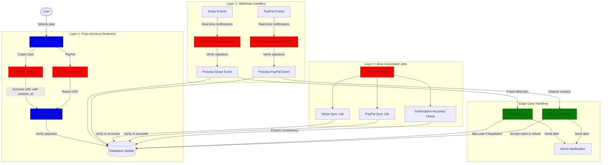
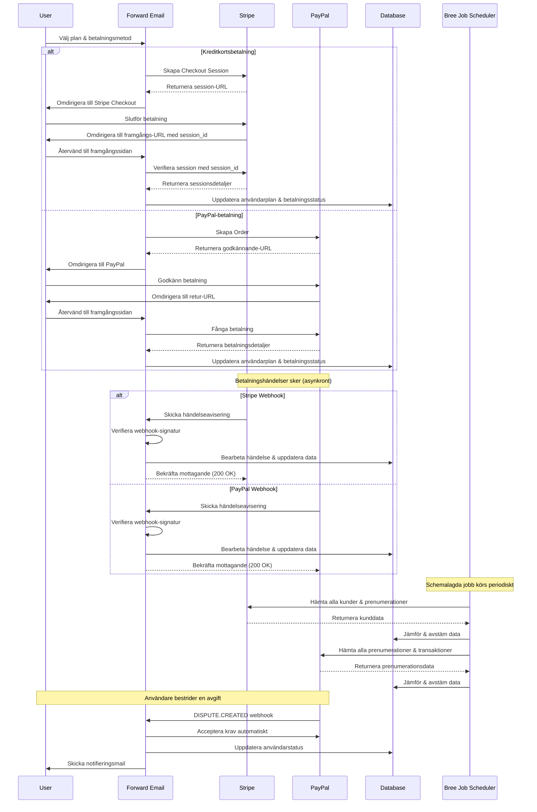
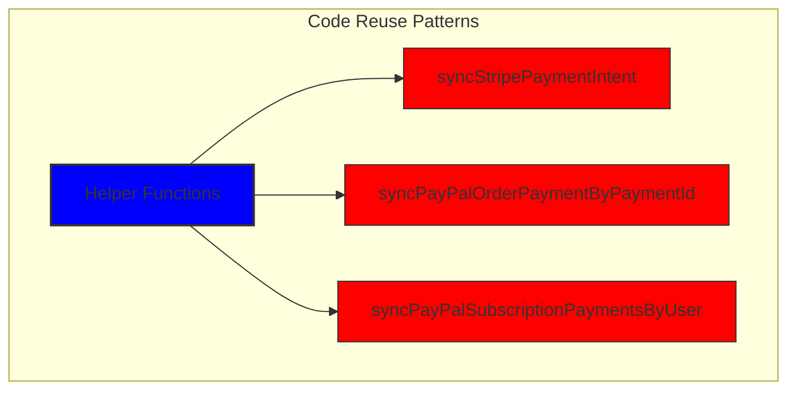
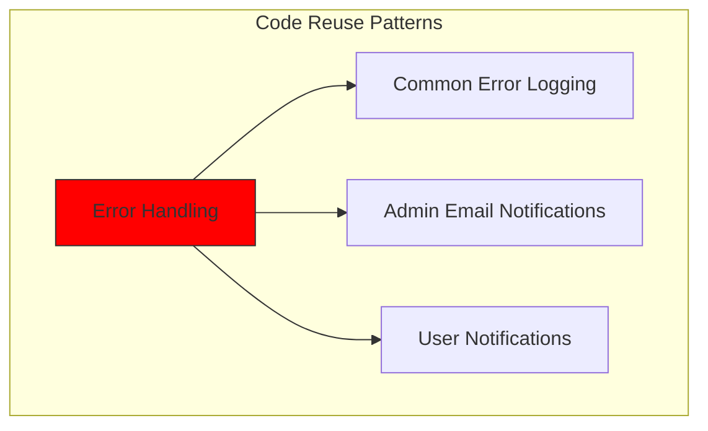
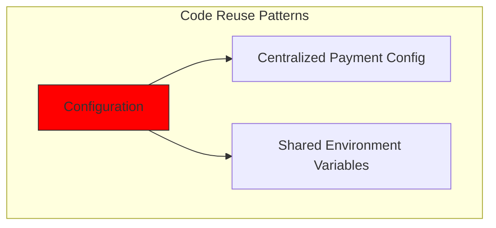
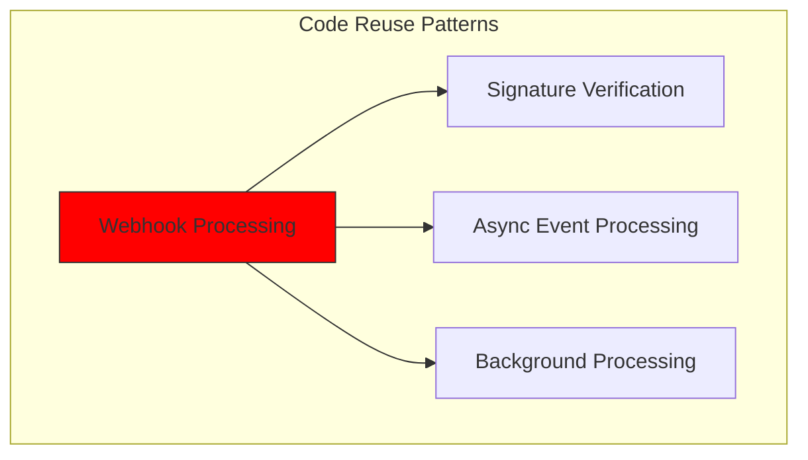
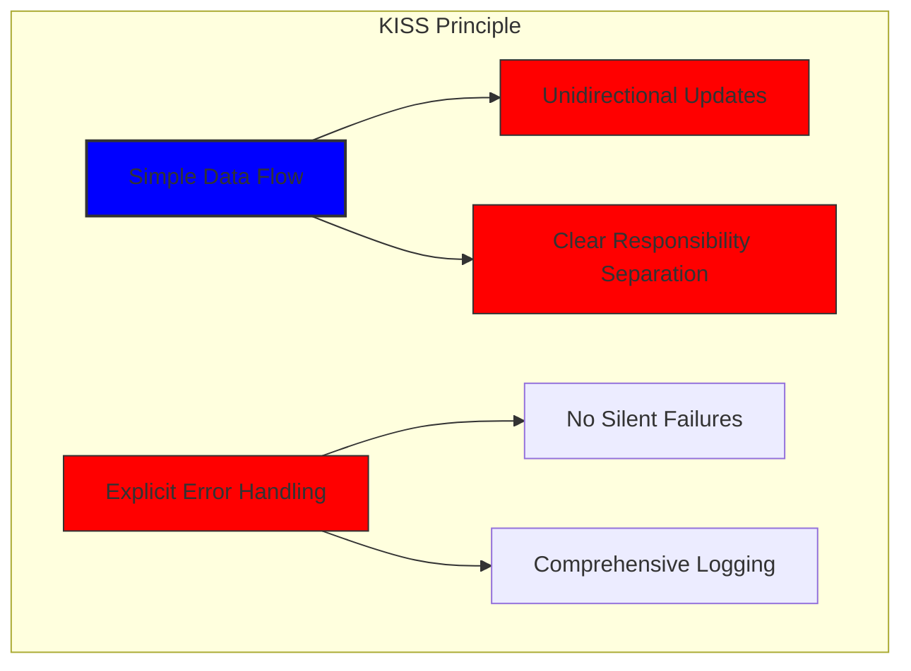

# Hur vi byggde ett robust betalningssystem med Stripe och PayPal: En trifecta-metod {#how-we-built-a-robust-payment-system-with-stripe-and-paypal-a-trifecta-approach}


## Innehållsförteckning {#table-of-contents}

* [Förord](#foreword)
* [Utmaningen: Flera betalningsprocessorer, en sanningskälla](#the-challenge-multiple-payment-processors-one-source-of-truth)
* [Trifecta-metoden: Tre lager av tillförlitlighet](#the-trifecta-approach-three-layers-of-reliability)
* [Lager 1: Omdirigeringar efter kassan](#layer-1-post-checkout-redirects)
  * [Implementering av Stripe Checkout](#stripe-checkout-implementation)
  * [PayPal betalningsflöde](#paypal-payment-flow)
* [Lager 2: Webhook-hanterare med signaturverifiering](#layer-2-webhook-handlers-with-signature-verification)
  * [Implementering av Stripe Webhook](#stripe-webhook-implementation)
  * [Implementering av PayPal Webhook](#paypal-webhook-implementation)
* [Lager 3: Automatiserade jobb med Bree](#layer-3-automated-jobs-with-bree)
  * [Prenumerationsnoggrannhetskontroll](#subscription-accuracy-checker)
  * [Synkronisering av PayPal-prenumerationer](#paypal-subscription-synchronization)
* [Hantering av kantfall](#handling-edge-cases)
  * [Bedrägeridetektion och förebyggande](#fraud-detection-and-prevention)
  * [Hantering av tvister](#dispute-handling)
* [Återanvändning av kod: KISS- och DRY-principerna](#code-reuse-kiss-and-dry-principles)
* [Implementering av VISA-prenumerationskrav](#visa-subscription-requirements-implementation)
  * [Automatiserade e-postmeddelanden före förnyelse](#automated-pre-renewal-email-notifications)
  * [Hantering av kantfall](#handling-edge-cases-1)
  * [Prövoperioder och prenumerationsvillkor](#trial-periods-and-subscription-terms)
* [Slutsats: Fördelarna med vår trifecta-metod](#conclusion-the-benefits-of-our-trifecta-approach)


## Förord {#foreword}

På Forward Email har vi alltid prioriterat att skapa system som är pålitliga, exakta och användarvänliga. När det gällde att implementera vårt betalningssystem visste vi att vi behövde en lösning som kunde hantera flera betalningsprocessorer samtidigt som den upprätthöll perfekt datakonsistens. Detta blogginlägg beskriver hur vårt utvecklingsteam integrerade både Stripe och PayPal med en trifecta-metod som säkerställer 1:1 realtidsnoggrannhet i hela vårt system.


## Utmaningen: Flera betalningsprocessorer, en sanningskälla {#the-challenge-multiple-payment-processors-one-source-of-truth}

Som en integritetsfokuserad e-posttjänst ville vi ge våra användare betalningsalternativ. Vissa föredrar enkelheten med kreditkortsbetalningar via Stripe, medan andra värdesätter det extra separationslagret som PayPal erbjuder. Att stödja flera betalningsprocessorer medför dock betydande komplexitet:

1. Hur säkerställer vi konsekvent data över olika betalningssystem?
2. Hur hanterar vi kantfall som tvister, återbetalningar eller misslyckade betalningar?
3. Hur upprätthåller vi en enda sanningskälla i vår databas?

Vår lösning var att implementera det vi kallar "trifecta-metoden" – ett trelagerssystem som ger redundans och säkerställer datakonsistens oavsett vad som händer.


## Trifecta-metoden: Tre lager av tillförlitlighet {#the-trifecta-approach-three-layers-of-reliability}

Vårt betalningssystem består av tre kritiska komponenter som samarbetar för att säkerställa perfekt datasynkronisering:

1. **Omdirigeringar efter kassan** – fånga betalningsinformation omedelbart efter kassan
2. **Webhook-hanterare** – bearbeta realtidshändelser från betalningsprocessorer
3. **Automatiserade jobb** – verifiera och avstämma betalningsdata periodiskt

Låt oss gå igenom varje komponent och se hur de samverkar.


```mermaid
flowchart TD
    User([User]) --> |Selects plan| Checkout[Checkout Page]

    %% Layer 1: Post-checkout redirects
    subgraph "Layer 1: Post-checkout Redirects"
        Checkout --> |Credit Card| Stripe[Stripe Checkout]
        Checkout --> |PayPal| PayPal[PayPal Payment]

        Stripe --> |Success URL with session_id| SuccessPage[Success Page]
        PayPal --> |Return URL| SuccessPage

        SuccessPage --> |Verify payment| Database[(Database Update)]
    end

    %% Layer 2: Webhooks
    subgraph "Layer 2: Webhook Handlers"
        StripeEvents[Stripe Events] --> |Real-time notifications| StripeWebhook[Stripe Webhook Handler]
        PayPalEvents[PayPal Events] --> |Real-time notifications| PayPalWebhook[PayPal Webhook Handler]

        StripeWebhook --> |Verify signature| ProcessStripeEvent[Process Stripe Event]
        PayPalWebhook --> |Verify signature| ProcessPayPalEvent[Process PayPal Event]

        ProcessStripeEvent --> Database
        ProcessPayPalEvent --> Database
    end

    %% Layer 3: Automated jobs
    subgraph "Layer 3: Bree Automated Jobs"
        BreeScheduler[Bree Scheduler] --> StripeSync[Stripe Sync Job]
        BreeScheduler --> PayPalSync[PayPal Sync Job]
        BreeScheduler --> AccuracyCheck[Subscription Accuracy Check]

        StripeSync --> |Verify & reconcile| Database
        PayPalSync --> |Verify & reconcile| Database
        AccuracyCheck --> |Ensure consistency| Database
    end

    %% Edge cases
    subgraph "Edge Case Handling"
        ProcessStripeEvent --> |Fraud detection| FraudCheck[Fraud Check]
        ProcessPayPalEvent --> |Dispute created| DisputeHandler[Dispute Handler]

        FraudCheck --> |Ban user if fraudulent| Database
        DisputeHandler --> |Accept claim & refund| Database

        FraudCheck --> |Send alert| AdminNotification[Admin Notification]
        DisputeHandler --> |Send alert| AdminNotification
    end

    %% Style definitions
    classDef primary fill:blue,stroke:#333,stroke-width:2px;
    classDef secondary fill:red,stroke:#333,stroke-width:1px;
    classDef tertiary fill:green,stroke:#333,stroke-width:1px;

    class Checkout,SuccessPage primary;
    class Stripe,PayPal,StripeWebhook,PayPalWebhook,BreeScheduler secondary;
    class FraudCheck,DisputeHandler tertiary;
```
## Layer 1: Omdirigeringar efter kassan {#layer-1-post-checkout-redirects}

Det första lagret i vår trefaldiga strategi sker omedelbart efter att en användare har slutfört en betalning. Både Stripe och PayPal tillhandahåller mekanismer för att omdirigera användare tillbaka till vår webbplats med transaktionsinformation.

### Stripe Checkout-implementering {#stripe-checkout-implementation}

För Stripe använder vi deras Checkout Sessions API för att skapa en sömlös betalningsupplevelse. När en användare väljer en plan och väljer att betala med kreditkort skapar vi en Checkout Session med specifika URL:er för framgång och avbokning:

```javascript
const options = {
  mode: paymentType === 'one-time' ? 'payment' : 'subscription',
  customer: ctx.state.user[config.userFields.stripeCustomerID],
  client_reference_id: reference,
  metadata: {
    plan
  },
  line_items: [
    {
      price,
      quantity: 1,
      description
    }
  ],
  locale: config.STRIPE_LOCALES.has(ctx.locale) ? ctx.locale : 'auto',
  cancel_url: `${config.urls.web}${ctx.path}${
    isMakePayment || isEnableAutoRenew ? '' : `/?plan=${plan}`
  }`,
  success_url: `${config.urls.web}${ctx.path}/?${
    isMakePayment || isEnableAutoRenew ? '' : `plan=${plan}&`
  }session_id={CHECKOUT_SESSION_ID}`,
  allow_promotion_codes: true
};

// Create the checkout session and redirect
const session = await stripe.checkout.sessions.create(options);
const redirectTo = session.url;
if (ctx.accepts('html')) {
  ctx.status = 303;
  ctx.redirect(redirectTo);
} else {
  ctx.body = { redirectTo };
}
```

Den kritiska delen här är parametern `success_url`, som inkluderar `session_id` som en frågeparameter. När Stripe omdirigerar användaren tillbaka till vår webbplats efter en lyckad betalning kan vi använda detta session-ID för att verifiera transaktionen och uppdatera vår databas därefter.

### PayPal-betalningsflöde {#paypal-payment-flow}

För PayPal använder vi en liknande metod med deras Orders API:

```javascript
const requestBody = {
  intent: 'CAPTURE',
  application_context: {
    cancel_url: `${config.urls.web}${ctx.path}${
      isMakePayment || isEnableAutoRenew ? '' : `/?plan=${plan}`
    }`,
    return_url: `${config.urls.web}${ctx.path}/?plan=${plan}`,
    brand_name: 'Forward Email',
    shipping_preference: 'NO_SHIPPING',
    user_action: 'PAY_NOW'
  },
  payer: {
    email_address: ctx.state.user.email
  },
  purchase_units: [
    {
      reference_id: ctx.state.user.id,
      description,
      custom_id: sku,
      invoice_id: reference,
      soft_descriptor: sku,
      amount: {
        currency_code: 'USD',
        value: price,
        breakdown: {
          item_total: {
            currency_code: 'USD',
            value: price
          }
        }
      },
      items: [
        {
          name,
          description,
          sku,
          unit_amount: {
            currency_code: 'USD',
            value: price
          },
          quantity: '1',
          category: 'DIGITAL_GOODS'
        }
      ]
    }
  ]
};
```

Precis som med Stripe specificerar vi parametrarna `return_url` och `cancel_url` för att hantera omdirigeringar efter betalning. När PayPal omdirigerar användaren tillbaka till vår webbplats kan vi fånga betalningsdetaljerna och uppdatera vår databas.


```mermaid
sequenceDiagram
    participant User
    participant FE as Forward Email
    participant Stripe
    participant PayPal
    participant DB as Database
    participant Bree as Bree Job Scheduler

    %% Initial checkout flow
    User->>FE: Välj plan & betalningsmetod

    alt Kreditkortsbetalning
        FE->>Stripe: Skapa Checkout Session
        Stripe-->>FE: Returnera session-URL
        FE->>User: Omdirigera till Stripe Checkout
        User->>Stripe: Slutför betalning
        Stripe->>User: Omdirigera till framgångs-URL med session_id
        User->>FE: Återvänd till framgångssidan
        FE->>Stripe: Verifiera session med session_id
        Stripe-->>FE: Returnera sessionsdetaljer
        FE->>DB: Uppdatera användarplan & betalningsstatus
    else PayPal-betalning
        FE->>PayPal: Skapa Order
        PayPal-->>FE: Returnera godkännande-URL
        FE->>User: Omdirigera till PayPal
        User->>PayPal: Godkänn betalning
        PayPal->>User: Omdirigera till retur-URL
        User->>FE: Återvänd till framgångssidan
        FE->>PayPal: Fånga betalning
        PayPal-->>FE: Returnera betalningsdetaljer
        FE->>DB: Uppdatera användarplan & betalningsstatus
    end

    %% Webhook-flöde (asynkront)
    Note over Stripe,PayPal: Betalningshändelser sker (asynkront)

    alt Stripe Webhook
        Stripe->>FE: Skicka händelseavisering
        FE->>FE: Verifiera webhook-signatur
        FE->>DB: Bearbeta händelse & uppdatera data
        FE-->>Stripe: Bekräfta mottagande (200 OK)
    else PayPal Webhook
        PayPal->>FE: Skicka händelseavisering
        FE->>FE: Verifiera webhook-signatur
        FE->>DB: Bearbeta händelse & uppdatera data
        FE-->>PayPal: Bekräfta mottagande (200 OK)
    end

    %% Bree automatiserade jobb
    Note over Bree: Schemalagda jobb körs periodiskt

    Bree->>Stripe: Hämta alla kunder & prenumerationer
    Stripe-->>Bree: Returnera kunddata
    Bree->>DB: Jämför & avstäm data

    Bree->>PayPal: Hämta alla prenumerationer & transaktioner
    PayPal-->>Bree: Returnera prenumerationsdata
    Bree->>DB: Jämför & avstäm data

    %% Kantfall: Hantering av tvist
    Note over User,PayPal: Användare bestrider en avgift

    PayPal->>FE: DISPUTE.CREATED webhook
    FE->>PayPal: Acceptera krav automatiskt
    FE->>DB: Uppdatera användarstatus
    FE->>User: Skicka notifieringsmail
```
## Layer 2: Webhook-hanterare med signaturverifiering {#layer-2-webhook-handlers-with-signature-verification}

Medan omdirigeringar efter kassan fungerar bra i de flesta scenarier är de inte idiotsäkra. Användare kan stänga sin webbläsare innan de omdirigeras, eller nätverksproblem kan förhindra att omdirigeringen slutförs. Där kommer webhooks in i bilden.

Både Stripe och PayPal tillhandahåller webhook-system som skickar realtidsnotifikationer om betalningshändelser. Vi har implementerat robusta webhook-hanterare som verifierar äktheten av dessa notifikationer och behandlar dem därefter.

### Stripe Webhook-implementering {#stripe-webhook-implementation}

Vår Stripe webhook-hanterare verifierar signaturen för inkommande webhook-händelser för att säkerställa att de är legitima:

```javascript
async function webhook(ctx) {
  const sig = ctx.request.get('stripe-signature');
  // kasta ett fel om något var fel
  if (!isSANB(sig))
    throw Boom.badRequest(ctx.translateError('INVALID_STRIPE_SIGNATURE'));
  const event = stripe.webhooks.constructEvent(
    ctx.request.rawBody,
    sig,
    env.STRIPE_ENDPOINT_SECRET
  );
  // kasta ett fel om något var fel
  if (!event)
    throw Boom.badRequest(ctx.translateError('INVALID_STRIPE_SIGNATURE'));
  ctx.logger.info('stripe webhook', { event });
  // returnera ett svar för att bekräfta mottagandet av händelsen
  ctx.body = { received: true };
  // kör i bakgrunden
  processEvent(ctx, event)
    .then()
    .catch((err) => {
      ctx.logger.fatal(err, { event });
      // mejla admin om fel
      emailHelper({
        template: 'alert',
        message: {
          to: config.email.message.from,
          subject: `Error with Stripe Webhook (Event ID ${event.id})`
        },
        locals: {
          message: `<pre><code>${safeStringify(
            parseErr(err),
            null,
            2
          )}</code></pre>`
        }
      })
        .then()
        .catch((err) => ctx.logger.fatal(err, { event }));
    });
}
```

Funktionen `stripe.webhooks.constructEvent` verifierar signaturen med vår endpoint-hemlighet. Om signaturen är giltig behandlar vi händelsen asynkront för att undvika att blockera webhook-svaret.

### PayPal Webhook-implementering {#paypal-webhook-implementation}

På samma sätt verifierar vår PayPal webhook-hanterare äktheten av inkommande notifikationer:

```javascript
async function webhook(ctx) {
  const response = await promisify(
    paypal.notification.webhookEvent.verify,
    paypal.notification.webhookEvent
  )(ctx.request.headers, ctx.request.body, env.PAYPAL_WEBHOOK_ID);
  // kasta ett fel om något var fel
  if (!_.isObject(response) || response.verification_status !== 'SUCCESS')
    throw Boom.badRequest(ctx.translateError('INVALID_PAYPAL_SIGNATURE'));
  // returnera ett svar för att bekräfta mottagandet av händelsen
  ctx.body = { received: true };
  // kör i bakgrunden
  processEvent(ctx)
    .then()
    .catch((err) => {
      ctx.logger.fatal(err);
      // mejla admin om fel
      emailHelper({
        template: 'alert',
        message: {
          to: config.email.message.from,
          subject: `Error with PayPal Webhook (Event ID ${ctx.request.body.id})`
        },
        locals: {
          message: `<pre><code>${safeStringify(
            parseErr(err),
            null,
            2
          )}</code></pre>`
        }
      })
        .then()
        .catch((err) => ctx.logger.fatal(err));
    });
}
```

Båda webhook-hanterarna följer samma mönster: verifiera signaturen, bekräfta mottagandet och behandla händelsen asynkront. Detta säkerställer att vi aldrig missar en betalningshändelse, även om omdirigeringen efter kassan misslyckas.


## Layer 3: Automatiserade jobb med Bree {#layer-3-automated-jobs-with-bree}

Det sista lagret i vår trefaldiga strategi är en uppsättning automatiserade jobb som periodiskt verifierar och avstämmer betalningsdata. Vi använder Bree, en jobbschemaläggare för Node.js, för att köra dessa jobb med jämna mellanrum.

### Kontroll av prenumerationsnoggrannhet {#subscription-accuracy-checker}

Ett av våra nyckeljobb är kontrollen av prenumerationsnoggrannhet, som säkerställer att vår databas korrekt speglar prenumerationsstatus i Stripe:
```javascript
async function mapper(customer) {
  // wait a second to prevent rate limitation error
  await setTimeout(ms('1s'));
  // check for user on our side
  let user = await Users.findOne({
    [config.userFields.stripeCustomerID]: customer.id
  })
    .lean()
    .exec();
  if (!user) return;
  if (user.is_banned) return;

  // if emails did not match
  if (user.email !== customer.email) {
    logger.info(
      `User email ${user.email} did not match customer email ${customer.email} (${customer.id})`
    );
    customer = await stripe.customers.update(customer.id, {
      email: user.email
    });
    logger.info(`Updated user email to match ${user.email}`);
  }

  // check for active subscriptions
  const [activeSubscriptions, trialingSubscriptions] = await Promise.all([
    stripe.subscriptions.list({
      customer: customer.id,
      status: 'active'
    }),
    stripe.subscriptions.list({
      customer: customer.id,
      status: 'trialing'
    })
  ]);

  // Combine active and trialing subscriptions
  let subscriptions = [
    ...activeSubscriptions.data,
    ...trialingSubscriptions.data
  ];

  // Handle edge case: multiple subscriptions for one user
  if (subscriptions.length > 1) {
    await logger.error(
      new Error(
        `We may need to refund: User had multiple subscriptions ${user.email} (${customer.id})`
      )
    );
    await emailHelper({
      template: 'alert',
      message: {
        to: config.email.message.from,
        subject: `User had multiple subscriptions ${user.email}`
      },
      locals: {
        message: `User ${user.email} (${customer.id}) had multiple subscriptions: ${JSON.stringify(
          subscriptions.map((s) => s.id)
        )}`
      }
    });
  }
}
```

This job checks for discrepancies between our database and Stripe, such as mismatched email addresses or multiple active subscriptions. If it finds any issues, it logs them and sends alerts to our admin team.

### PayPal Subscription Synchronization {#paypal-subscription-synchronization}

We have a similar job for PayPal subscriptions:

```javascript
async function syncPayPalSubscriptionPayments() {
  const paypalCustomers = await Users.find({
    $or: [
      {
        [config.userFields.paypalSubscriptionID]: { $exists: true, $ne: null }
      },
      {
        [config.userFields.paypalPayerID]: { $exists: true, $ne: null }
      }
    ]
  })
    // sort by newest customers first
    .sort('-created_at')
    .lean()
    .exec();

  await logger.info(
    `Syncing payments for ${paypalCustomers.length} paypal customers`
  );

  // Process each customer and sync their payments
  const errorEmails = await pReduce(
    paypalCustomers,
    // Implementation details...
  );
}
```

These automated jobs serve as our final safety net, ensuring that our database always reflects the true state of subscriptions and payments in both Stripe and PayPal.


## Handling Edge Cases {#handling-edge-cases}

A robust payment system must handle edge cases gracefully. Let's look at how we handle some common scenarios.

### Fraud Detection and Prevention {#fraud-detection-and-prevention}

We've implemented sophisticated fraud detection mechanisms that automatically identify and handle suspicious payment activities:

```javascript
case 'charge.failed': {
  // Get all failed charges in the last 30 days
  const charges = await stripe.charges.list({
    customer: event.data.object.customer,
    created: {
      gte: dayjs().subtract(1, 'month').unix()
    }
  });

  // Filter for declined charges
  const filtered = charges.data.filter(
    (d) => d.status === 'failed' && d.failure_code === 'card_declined'
  );

  // if not more than 5 then return early
  if (filtered.length < 5) break;

  // Check if user has verified domains
  const count = await Domains.countDocuments({
    members: {
      $elemMatch: {
        user: user._id,
        group: 'admin'
      }
    },
    plan: { $in: ['enhanced_protection', 'team'] },
    has_txt_record: true
  });

  if (!user.is_banned) {
    // If no verified domains, ban the user and refund all charges
    if (count === 0) {
      // Ban the user
      user.is_banned = true;
      await user.save();

      // Refund all successful charges
    }
  }
}
```

Denna kod förbjuder automatiskt användare som har flera misslyckade betalningar och inga verifierade domäner, vilket är en stark indikator på bedräglig verksamhet.

### Dispute Handling {#dispute-handling}

När en användare bestrider en avgift accepterar vi automatiskt kravet och vidtar lämpliga åtgärder:

```javascript
case 'CUSTOMER.DISPUTE.CREATED': {
  // accept claim
  const agent = await paypalAgent();
  await agent
    .post(`/v1/customer/disputes/${body.resource.dispute_id}/accept-claim`)
    .send({
      note: 'Full återbetalning till kunden.'
    });

  // Find the payment in our database
  const payment = await Payments.findOne({ $or });
  if (!payment) throw new Error('Betalningen finns inte');

  const user = await Users.findById(payment.user);
  if (!user) throw new Error('Användaren fanns inte för kunden');

  // Cancel the user's subscription if they have one
  if (isSANB(user[config.userFields.paypalSubscriptionID])) {
    try {
      const agent = await paypalAgent();
      await agent.post(
        `/v1/billing/subscriptions/${
          user[config.userFields.paypalSubscriptionID]
        }/cancel`
      );
    } catch (err) {
      // Hantera fel vid avbokning av prenumeration
    }
  }
}
```

Denna metod minimerar påverkan av tvister på vår verksamhet samtidigt som den säkerställer en bra kundupplevelse.


## Code Reuse: KISS and DRY Principles {#code-reuse-kiss-and-dry-principles}

Genom hela vårt betalningssystem har vi följt KISS (Keep It Simple, Stupid) och DRY (Don't Repeat Yourself) principerna. Här är några exempel:

1. **Delade hjälpfunktioner**: Vi har skapat återanvändbara hjälpfunktioner för vanliga uppgifter som att synkronisera betalningar och skicka e-post.

2. **Konsekvent felhantering**: Både Stripe och PayPal webhook-hanterare använder samma mönster för felhantering och admin-notifikationer.

3. **Enhetligt databasschema**: Vårt databasschema är utformat för att rymma både Stripe- och PayPal-data, med gemensamma fält för betalningsstatus, belopp och planinformation.

4. **Centraliserad konfiguration**: Betalningsrelaterad konfiguration är centraliserad i en enda fil, vilket gör det enkelt att uppdatera priser och produktinformation.


```mermaid
graph TD
    subgraph "Code Reuse Patterns"
        A[Helper Functions] --> B[syncStripePaymentIntent]
        A --> C[syncPayPalOrderPaymentByPaymentId]
        A --> D[syncPayPalSubscriptionPaymentsByUser]
    end

    classDef primary fill:blue,stroke:#333,stroke-width:2px;
    classDef secondary fill:red,stroke:#333,stroke-width:1px;

    class A,P,V primary;
    class B,C,D,E,I,L,Q,R,S,W,X,Y,Z secondary;
```


```mermaid
graph TD
    subgraph "Code Reuse Patterns"
        E[Error Handling] --> F[Common Error Logging]
        E --> G[Admin Email Notifications]
        E --> H[User Notifications]
    end

    classDef primary fill:blue,stroke:#333,stroke-width:2px;
    classDef secondary fill:red,stroke:#333,stroke-width:1px;

    class A,P,V primary;
    class B,C,D,E,I,L,Q,R,S,W,X,Y,Z secondary;
```


```mermaid
graph TD
    subgraph "Code Reuse Patterns"
        I[Configuration] --> J[Centralized Payment Config]
        I --> K[Shared Environment Variables]
    end

    classDef primary fill:blue,stroke:#333,stroke-width:2px;
    classDef secondary fill:red,stroke:#333,stroke-width:1px;

    class A,P,V primary;
    class B,C,D,E,I,L,Q,R,S,W,X,Y,Z secondary;
```


```mermaid
graph TD
    subgraph "Code Reuse Patterns"
        L[Webhook Processing] --> M[Signature Verification]
        L --> N[Async Event Processing]
        L --> O[Background Processing]
    end

    classDef primary fill:blue,stroke:#333,stroke-width:2px;
    classDef secondary fill:red,stroke:#333,stroke-width:1px;

    class A,P,V primary;
    class B,C,D,E,I,L,Q,R,S,W,X,Y,Z secondary;
```


```mermaid
graph TD
    subgraph "KISS Principle"
        P[Simple Data Flow] --> Q[Unidirectional Updates]
        P --> R[Clear Responsibility Separation]

        S[Explicit Error Handling] --> T[No Silent Failures]
        S --> U[Comprehensive Logging]
    end

    classDef primary fill:blue,stroke:#333,stroke-width:2px;
    classDef secondary fill:red,stroke:#333,stroke-width:1px;

    class A,P,V primary;
    class B,C,D,E,I,L,Q,R,S,W,X,Y,Z secondary;
```
graph TD
    subgraph "DRY Principle"
        V[Shared Logic] --> W[Payment Processing Functions]
        V --> X[Email Templates]
        V --> Y[Validation Logic]

        Z[Common Database Operations] --> AA[User Updates]
        Z --> AB[Payment Recording]
    end

    classDef primary fill:blue,stroke:#333,stroke-width:2px;
    classDef secondary fill:red,stroke:#333,stroke-width:1px;

    class A,P,V primary;
    class B,C,D,E,I,L,Q,R,S,W,X,Y,Z secondary;
```


## Implementering av VISA-prenumerationskrav {#visa-subscription-requirements-implementation}

Utöver vår trefaldiga strategi har vi implementerat specifika funktioner för att uppfylla VISAs prenumerationskrav samtidigt som vi förbättrar användarupplevelsen. Ett viktigt krav från VISA är att användare måste meddelas innan de debiteras för en prenumeration, särskilt när de går från en provperiod till en betald prenumeration.

### Automatiserade e-postmeddelanden före förnyelse {#automated-pre-renewal-email-notifications}

Vi har byggt ett automatiserat system som identifierar användare med aktiva provprenumerationer och skickar dem ett meddelande via e-post innan deras första debitering sker. Detta håller oss inte bara i linje med VISAs krav utan minskar även återbetalningar och förbättrar kundnöjdheten.

Så här implementerade vi denna funktion:

```javascript
// Find users with trial subscriptions who haven't received a notification yet
const users = await Users.find({
  $or: [
    {
      $and: [
        { [config.userFields.stripeSubscriptionID]: { $exists: true } },
        { [config.userFields.stripeTrialSentAt]: { $exists: false } },
        // Exclude subscriptions that have already had payments
        ...(paidStripeSubscriptionIds.length > 0
          ? [
              {
                [config.userFields.stripeSubscriptionID]: {
                  $nin: paidStripeSubscriptionIds
                }
              }
            ]
          : [])
      ]
    },
    {
      $and: [
        { [config.userFields.paypalSubscriptionID]: { $exists: true } },
        { [config.userFields.paypalTrialSentAt]: { $exists: false } },
        // Exclude subscriptions that have already had payments
        ...(paidPayPalSubscriptionIds.length > 0
          ? [
              {
                [config.userFields.paypalSubscriptionID]: {
                  $nin: paidPayPalSubscriptionIds
                }
              }
            ]
          : [])
      ]
    }
  ]
});

// Process each user and send notification
for (const user of users) {
  // Get subscription details from payment processor
  const subscription = await getSubscriptionDetails(user);

  // Calculate subscription duration and frequency
  const duration = getDurationFromPlanId(subscription.plan_id);
  const frequency = getHumanReadableFrequency(duration, user.locale);
  const amount = getPlanAmount(user.plan, duration);

  // Get user's domains for personalized email
  const domains = await Domains.find({
    'members.user': user._id
  }).sort('name').lean().exec();

  // Send VISA-compliant notification email
  await emailHelper({
    template: 'visa-trial-subscription-requirement',
    message: {
      to: user.receipt_email || user.email,
      ...(user.receipt_email ? { cc: user.email } : {})
    },
    locals: {
      user,
      firstChargeDate: new Date(subscription.start_time),
      frequency,
      formattedAmount: numeral(amount).format('$0,0,0.00'),
      domains
    }
  });

  // Record that notification was sent
  await Users.findByIdAndUpdate(user._id, {
    $set: {
      [config.userFields.paypalTrialSentAt]: new Date()
    }
  });
}
```

Denna implementation säkerställer att användare alltid informeras om kommande debiteringar, med tydliga detaljer om:

1. När den första debiteringen kommer att ske
2. Frekvensen för framtida debiteringar (månatligen, årligen, etc.)
3. Det exakta belopp de kommer att debiteras
4. Vilka domäner som täcks av deras prenumeration

Genom att automatisera denna process upprätthåller vi fullständig efterlevnad av VISAs krav (som kräver meddelande minst 7 dagar före debitering) samtidigt som vi minskar supportförfrågningar och förbättrar den övergripande användarupplevelsen.
### Hantering av kantfall {#handling-edge-cases-1}

Vår implementation inkluderar också robust felhantering. Om något går fel under notifieringsprocessen, varnar vårt system automatiskt vårt team:

```javascript
try {
  await mapper(user);
} catch (err) {
  logger.error(err);

  // Skicka varning till administratörer
  await emailHelper({
    template: 'alert',
    message: {
      to: config.email.message.from,
      subject: 'VISA Trial Subscription Requirement Error'
    },
    locals: {
      message: `<pre><code>${safeStringify(
        parseErr(err),
        null,
        2
      )}</code></pre>`
    }
  });
}
```

Detta säkerställer att även om det uppstår ett problem med notifieringssystemet kan vårt team snabbt åtgärda det och upprätthålla efterlevnad av VISAs krav.

VISA-prenumerationsnotifieringssystemet är ett annat exempel på hur vi har byggt vår betalningsinfrastruktur med både efterlevnad och användarupplevelse i åtanke, vilket kompletterar vår trifecta-metod för att säkerställa pålitlig och transparent betalningshantering.

### Prova-på-perioder och prenumerationsvillkor {#trial-periods-and-subscription-terms}

För användare som aktiverar automatisk förnyelse på befintliga planer beräknar vi lämplig prova-på-period för att säkerställa att de inte debiteras förrän deras nuvarande plan löper ut:

```javascript
if (
  isEnableAutoRenew &&
  dayjs(ctx.state.user[config.userFields.planExpiresAt]).isAfter(
    dayjs()
  )
) {
  const hours = dayjs(
    ctx.state.user[config.userFields.planExpiresAt]
  ).diff(dayjs(), 'hours');

  // Hantera beräkning av prova-på-period
}
```

Vi tillhandahåller också tydlig information om prenumerationsvillkor, inklusive faktureringsfrekvens och avbokningspolicyer, och inkluderar detaljerad metadata med varje prenumeration för att säkerställa korrekt spårning och hantering.

## Slutsats: Fördelarna med vår trifecta-metod {#conclusion-the-benefits-of-our-trifecta-approach}

Vår trifecta-metod för betalningshantering har gett flera viktiga fördelar:

1. **Tillförlitlighet**: Genom att implementera tre lager av betalningsverifiering säkerställer vi att ingen betalning missas eller hanteras felaktigt.

2. **Noggrannhet**: Vår databas speglar alltid det verkliga tillståndet för prenumerationer och betalningar i både Stripe och PayPal.

3. **Flexibilitet**: Användare kan välja sin föredragna betalningsmetod utan att kompromissa med systemets tillförlitlighet.

4. **Robusthet**: Vårt system hanterar kantfall smidigt, från nätverksfel till bedrägliga aktiviteter.

Om du implementerar ett betalningssystem som stödjer flera processorer rekommenderar vi starkt denna trifecta-metod. Det kräver mer utvecklingsinsats initialt, men de långsiktiga fördelarna i form av tillförlitlighet och noggrannhet är väl värda det.

För mer information om Forward Email och våra integritetsfokuserade e-posttjänster, besök vår [webbplats](https://forwardemail.net).

<!-- *Keywords: payment processing, Stripe integration, PayPal integration, webhook handling, payment synchronization, subscription management, fraud prevention, dispute handling, Node.js payment system, multi-processor payment system, payment gateway integration, real-time payment verification, payment data consistency, subscription billing, payment security, payment automation, payment webhooks, payment reconciliation, payment edge cases, payment error handling, VISA subscription requirements, pre-renewal notifications, subscription compliance* -->
