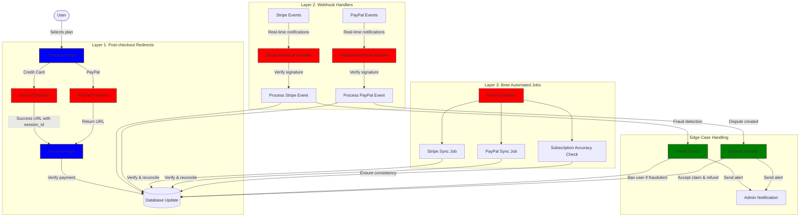
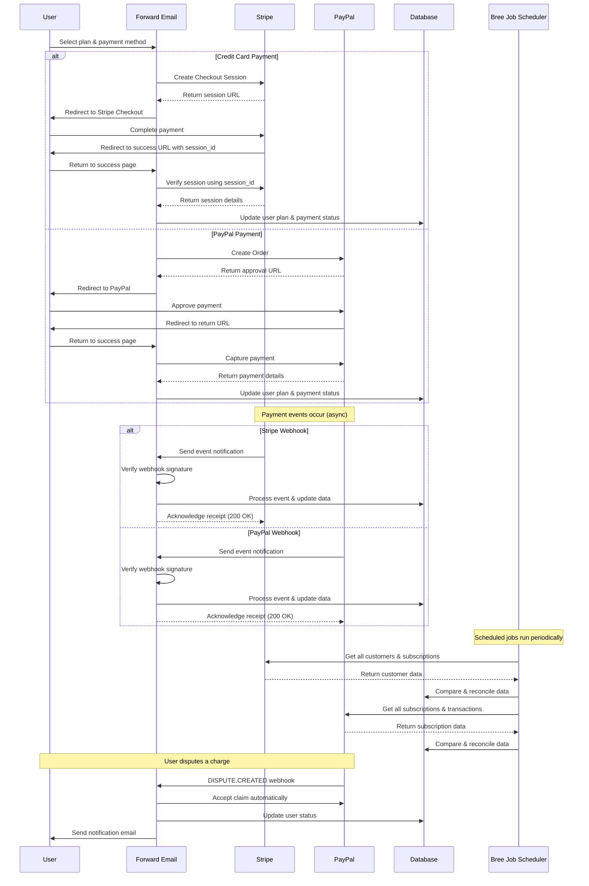
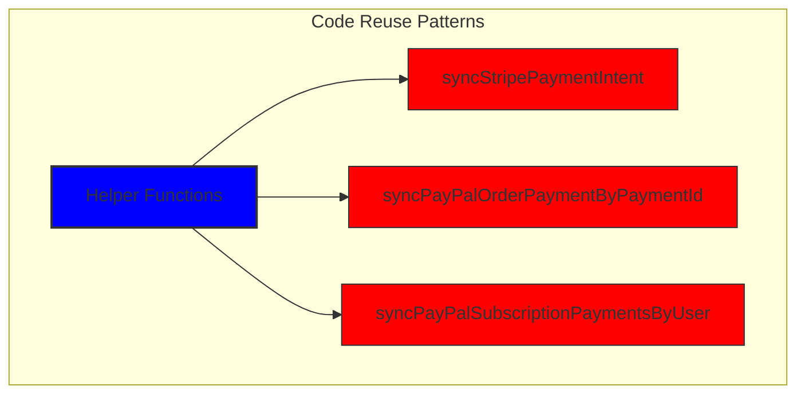
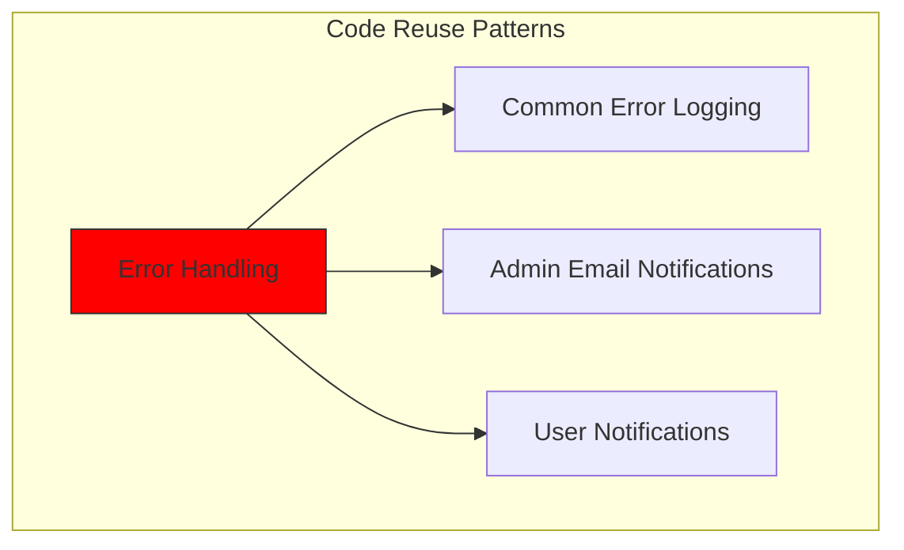
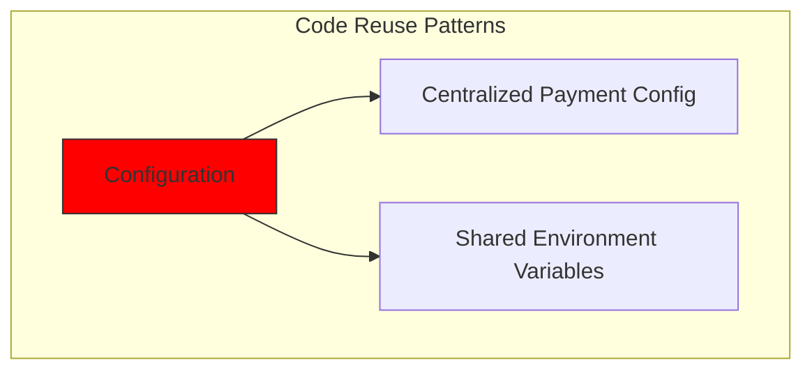
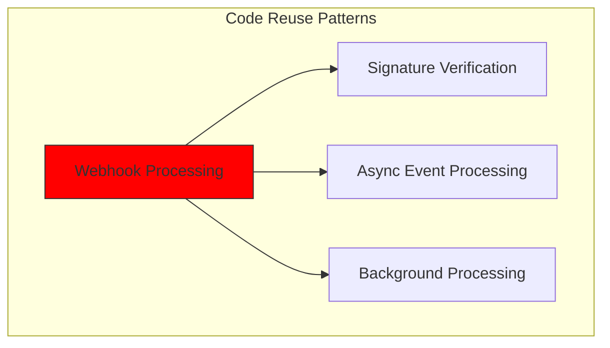
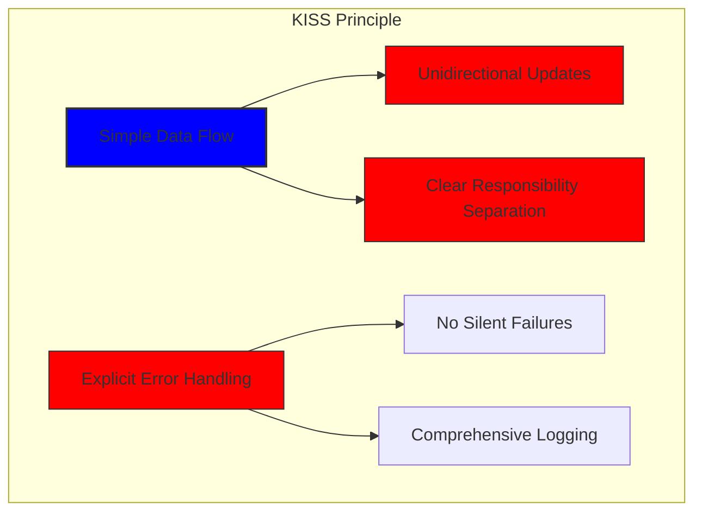
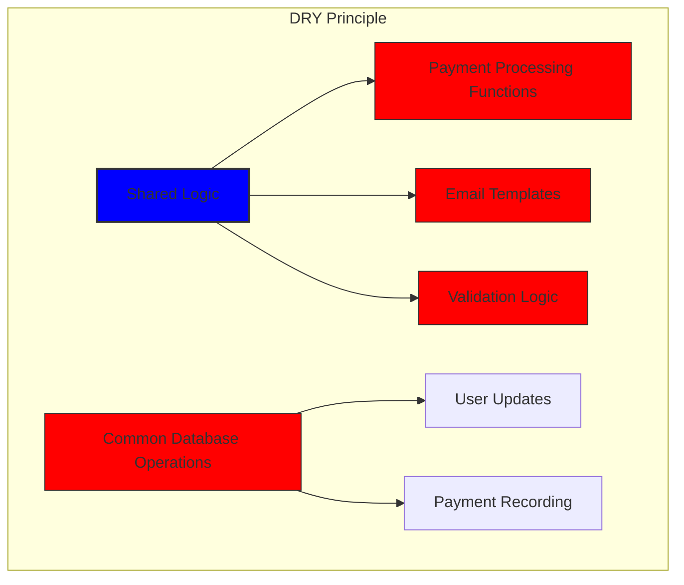

# เราสร้างระบบการชำระเงินที่แข็งแกร่งด้วย Stripe และ PayPal ได้อย่างไร: แนวทาง Trifecta {#how-we-built-a-robust-payment-system-with-stripe-and-paypal-a-trifecta-approach}


## สารบัญ {#table-of-contents}

* [คำนำ](#foreword)
* [ความท้าทาย: ผู้ประมวลผลการชำระเงินหลายราย แหล่งข้อมูลความจริงเพียงแหล่งเดียว](#the-challenge-multiple-payment-processors-one-source-of-truth)
* [แนวทาง Trifecta: ความน่าเชื่อถือสามชั้น](#the-trifecta-approach-three-layers-of-reliability)
* [เลเยอร์ 1: การเปลี่ยนเส้นทางหลังการชำระเงิน](#layer-1-post-checkout-redirects)
  * [การใช้งาน Stripe Checkout](#stripe-checkout-implementation)
  * [การชำระเงินผ่าน PayPal](#paypal-payment-flow)
* [เลเยอร์ 2: ตัวจัดการ Webhook พร้อมการตรวจสอบลายเซ็น](#layer-2-webhook-handlers-with-signature-verification)
  * [การใช้งาน Stripe Webhook](#stripe-webhook-implementation)
  * [การนำ PayPal Webhook ไปใช้งาน](#paypal-webhook-implementation)
* [เลเยอร์ 3: งานอัตโนมัติด้วย Bree](#layer-3-automated-jobs-with-bree)
  * [เครื่องตรวจสอบความถูกต้องของการสมัครสมาชิก](#subscription-accuracy-checker)
  * [การซิงโครไนซ์การสมัครสมาชิก PayPal](#paypal-subscription-synchronization)
* [การจัดการกรณีขอบ](#handling-edge-cases)
  * [การตรวจจับและป้องกันการฉ้อโกง](#fraud-detection-and-prevention)
  * [การจัดการข้อพิพาท](#dispute-handling)
* [การนำโค้ดกลับมาใช้ใหม่: หลักการ KISS และ DRY](#code-reuse-kiss-and-dry-principles)
* [การดำเนินการตามข้อกำหนดการสมัครวีซ่า](#visa-subscription-requirements-implementation)
  * [การแจ้งเตือนทางอีเมลล่วงหน้าการต่ออายุอัตโนมัติ](#automated-pre-renewal-email-notifications)
  * [การจัดการกรณีขอบ](#handling-edge-cases-1)
  * [ระยะเวลาทดลองใช้งานและเงื่อนไขการสมัคร](#trial-periods-and-subscription-terms)
* [บทสรุป: ประโยชน์ของแนวทาง Trifecta ของเรา](#conclusion-the-benefits-of-our-trifecta-approach)

## คำนำ {#foreword}

ที่ Forward Email เราให้ความสำคัญกับการสร้างระบบที่เชื่อถือได้ แม่นยำ และใช้งานง่ายเสมอมา เมื่อต้องนำระบบประมวลผลการชำระเงินของเราไปใช้ เรารู้ว่าเราต้องการโซลูชันที่สามารถจัดการกับโปรเซสเซอร์การชำระเงินหลายตัวได้ในขณะที่ยังคงความสอดคล้องของข้อมูลอย่างสมบูรณ์แบบ โพสต์บล็อกนี้จะอธิบายรายละเอียดว่าทีมพัฒนาของเราบูรณาการ Stripe และ PayPal เข้าด้วยกันอย่างไรโดยใช้แนวทางสามประการที่รับประกันความแม่นยำแบบเรียลไทม์ 1:1 ทั่วทั้งระบบของเรา

## ความท้าทาย: ผู้ประมวลผลการชำระเงินหลายราย แหล่งข้อมูลความจริงหนึ่งแหล่ง {#the-challenge-multiple-payment-processors-one-source-of-truth}

เนื่องจากเราเป็นบริการอีเมลที่เน้นความเป็นส่วนตัว เราจึงต้องการให้ผู้ใช้มีตัวเลือกการชำระเงิน บางคนชอบความเรียบง่ายของการชำระเงินด้วยบัตรเครดิตผ่าน Stripe ในขณะที่บางคนก็ให้ความสำคัญกับการแยกชั้นเพิ่มเติมที่ PayPal มอบให้ อย่างไรก็ตาม การรองรับโปรเซสเซอร์การชำระเงินหลายตัวทำให้เกิดความซับซ้อนอย่างมาก:

1. เราจะมั่นใจได้อย่างไรว่าข้อมูลมีความสอดคล้องกันในระบบการชำระเงินที่แตกต่างกัน
2. เราจะจัดการกับกรณีพิเศษ เช่น ข้อโต้แย้ง การขอคืนเงิน หรือการชำระเงินที่ล้มเหลวได้อย่างไร
3. เราจะรักษาแหล่งข้อมูลที่เชื่อถือได้เพียงแหล่งเดียวในฐานข้อมูลของเราได้อย่างไร

โซลูชันของเราคือการนำสิ่งที่เราเรียกว่า "แนวทาง trifecta" มาใช้ ซึ่งเป็นระบบสามชั้นที่ให้ความซ้ำซ้อนและรับรองความสอดคล้องของข้อมูลไม่ว่าจะเกิดอะไรขึ้นก็ตาม

## แนวทาง Trifecta: ความน่าเชื่อถือสามชั้น {#the-trifecta-approach-three-layers-of-reliability}

ระบบการชำระเงินของเรามีส่วนประกอบที่สำคัญสามประการที่ทำงานร่วมกันเพื่อให้แน่ใจว่าข้อมูลมีการซิงโครไนซ์กันอย่างสมบูรณ์แบบ:

1. **การเปลี่ยนเส้นทางหลังชำระเงิน** - รวบรวมข้อมูลการชำระเงินทันทีหลังชำระเงิน
2. **ตัวจัดการเว็บฮุก** - ประมวลผลเหตุการณ์แบบเรียลไทม์จากผู้ประมวลผลการชำระเงิน
3. **งานอัตโนมัติ** - ตรวจสอบและปรับยอดข้อมูลการชำระเงินเป็นระยะ

มาเจาะลึกแต่ละส่วนประกอบและดูว่าแต่ละส่วนประกอบทำงานร่วมกันอย่างไร



## เลเยอร์ 1: การเปลี่ยนเส้นทางหลังการชำระเงิน {#layer-1-post-checkout-redirects}

ขั้นตอนแรกของวิธีการแบบ Trifecta ของเราจะเกิดขึ้นทันทีหลังจากผู้ใช้ชำระเงินเสร็จสิ้น ทั้ง Stripe และ PayPal จัดเตรียมกลไกเพื่อนำผู้ใช้กลับมายังไซต์ของเราพร้อมข้อมูลธุรกรรม

### การใช้งาน Stripe Checkout {#stripe-checkout-implementation}

สำหรับ Stripe เราใช้ Checkout Sessions API เพื่อสร้างประสบการณ์การชำระเงินที่ราบรื่น เมื่อผู้ใช้เลือกแผนและเลือกที่จะชำระเงินด้วยบัตรเครดิต เราจะสร้าง Checkout Session พร้อม URL ที่ระบุความสำเร็จและการยกเลิก:

```javascript
const options = {
  mode: paymentType === 'one-time' ? 'payment' : 'subscription',
  customer: ctx.state.user[config.userFields.stripeCustomerID],
  client_reference_id: reference,
  metadata: {
    plan
  },
  line_items: [
    {
      price,
      quantity: 1,
      description
    }
  ],
  locale: config.STRIPE_LOCALES.has(ctx.locale) ? ctx.locale : 'auto',
  cancel_url: `${config.urls.web}${ctx.path}${
    isMakePayment || isEnableAutoRenew ? '' : `/?plan=${plan}`
  }`,
  success_url: `${config.urls.web}${ctx.path}/?${
    isMakePayment || isEnableAutoRenew ? '' : `plan=${plan}&`
  }session_id={CHECKOUT_SESSION_ID}`,
  allow_promotion_codes: true
};

// Create the checkout session and redirect
const session = await stripe.checkout.sessions.create(options);
const redirectTo = session.url;
if (ctx.accepts('html')) {
  ctx.status = 303;
  ctx.redirect(redirectTo);
} else {
  ctx.body = { redirectTo };
}
```

ส่วนที่สำคัญคือพารามิเตอร์ `success_url` ซึ่งรวมถึง `session_id` เป็นพารามิเตอร์การค้นหา เมื่อ Stripe เปลี่ยนเส้นทางผู้ใช้กลับมายังไซต์ของเราหลังจากชำระเงินสำเร็จแล้ว เราสามารถใช้ ID เซสชันนี้เพื่อตรวจสอบธุรกรรมและอัปเดตฐานข้อมูลของเราตามนั้น

### ช่องทางการชำระเงิน PayPal {#paypal-payment-flow}

สำหรับ PayPal เราใช้แนวทางเดียวกันกับ Orders API ของพวกเขา:

```javascript
const requestBody = {
  intent: 'CAPTURE',
  application_context: {
    cancel_url: `${config.urls.web}${ctx.path}${
      isMakePayment || isEnableAutoRenew ? '' : `/?plan=${plan}`
    }`,
    return_url: `${config.urls.web}${ctx.path}/?plan=${plan}`,
    brand_name: 'Forward Email',
    shipping_preference: 'NO_SHIPPING',
    user_action: 'PAY_NOW'
  },
  payer: {
    email_address: ctx.state.user.email
  },
  purchase_units: [
    {
      reference_id: ctx.state.user.id,
      description,
      custom_id: sku,
      invoice_id: reference,
      soft_descriptor: sku,
      amount: {
        currency_code: 'USD',
        value: price,
        breakdown: {
          item_total: {
            currency_code: 'USD',
            value: price
          }
        }
      },
      items: [
        {
          name,
          description,
          sku,
          unit_amount: {
            currency_code: 'USD',
            value: price
          },
          quantity: '1',
          category: 'DIGITAL_GOODS'
        }
      ]
    }
  ]
};
```

คล้ายกับ Stripe เราระบุพารามิเตอร์ `return_url` และ `cancel_url` เพื่อจัดการการเปลี่ยนเส้นทางหลังการชำระเงิน เมื่อ PayPal เปลี่ยนเส้นทางผู้ใช้กลับมายังไซต์ของเรา เราจะสามารถบันทึกรายละเอียดการชำระเงินและอัปเดตฐานข้อมูลของเราได้



## เลเยอร์ 2: ตัวจัดการ Webhook พร้อมการตรวจสอบลายเซ็น {#layer-2-webhook-handlers-with-signature-verification}

แม้ว่าการเปลี่ยนเส้นทางหลังการชำระเงินจะได้ผลดีในสถานการณ์ส่วนใหญ่ แต่ก็ไม่ได้หมายความว่าจะทำได้สมบูรณ์แบบเสมอไป ผู้ใช้บางคนอาจปิดเบราว์เซอร์ก่อนที่จะถูกเปลี่ยนเส้นทาง หรืออาจเกิดปัญหากับเครือข่ายที่ทำให้การเปลี่ยนเส้นทางไม่เสร็จสมบูรณ์ ซึ่งนั่นคือที่มาของเว็บฮุก

ทั้ง Stripe และ PayPal มีระบบ webhook ที่ส่งการแจ้งเตือนแบบเรียลไทม์เกี่ยวกับเหตุการณ์การชำระเงิน เราได้นำตัวจัดการ webhook ที่มีประสิทธิภาพมาใช้เพื่อตรวจสอบความถูกต้องของการแจ้งเตือนเหล่านี้และประมวลผลตามความเหมาะสม

### การใช้งาน Stripe Webhook {#stripe-webhook-implementation}

ตัวจัดการ webhook ของ Stripe ของเราจะตรวจสอบลายเซ็นของเหตุการณ์ webhook ที่เข้ามาเพื่อให้แน่ใจว่าถูกต้องตามกฎหมาย:

```javascript
async function webhook(ctx) {
  const sig = ctx.request.get('stripe-signature');
  // throw an error if something was wrong
  if (!isSANB(sig))
    throw Boom.badRequest(ctx.translateError('INVALID_STRIPE_SIGNATURE'));
  const event = stripe.webhooks.constructEvent(
    ctx.request.rawBody,
    sig,
    env.STRIPE_ENDPOINT_SECRET
  );
  // throw an error if something was wrong
  if (!event)
    throw Boom.badRequest(ctx.translateError('INVALID_STRIPE_SIGNATURE'));
  ctx.logger.info('stripe webhook', { event });
  // return a response to acknowledge receipt of the event
  ctx.body = { received: true };
  // run in background
  processEvent(ctx, event)
    .then()
    .catch((err) => {
      ctx.logger.fatal(err, { event });
      // email admin errors
      emailHelper({
        template: 'alert',
        message: {
          to: config.email.message.from,
          subject: `Error with Stripe Webhook (Event ID ${event.id})`
        },
        locals: {
          message: `<pre><code>${safeStringify(
            parseErr(err),
            null,
            2
          )}</code></pre>`
        }
      })
        .then()
        .catch((err) => ctx.logger.fatal(err, { event }));
    });
}
```

ฟังก์ชัน `stripe.webhooks.constructEvent` จะตรวจสอบลายเซ็นโดยใช้ความลับของจุดสิ้นสุดของเรา หากลายเซ็นถูกต้อง เราจะประมวลผลเหตุการณ์แบบอะซิงโครนัสเพื่อหลีกเลี่ยงการบล็อกการตอบสนองของเว็บฮุก

### การใช้งาน PayPal Webhook {#paypal-webhook-implementation}

ในทำนองเดียวกัน ตัวจัดการเว็บฮุก PayPal ของเรายังตรวจสอบความถูกต้องของการแจ้งเตือนขาเข้า:

```javascript
async function webhook(ctx) {
  const response = await promisify(
    paypal.notification.webhookEvent.verify,
    paypal.notification.webhookEvent
  )(ctx.request.headers, ctx.request.body, env.PAYPAL_WEBHOOK_ID);
  // throw an error if something was wrong
  if (!_.isObject(response) || response.verification_status !== 'SUCCESS')
    throw Boom.badRequest(ctx.translateError('INVALID_PAYPAL_SIGNATURE'));
  // return a response to acknowledge receipt of the event
  ctx.body = { received: true };
  // run in background
  processEvent(ctx)
    .then()
    .catch((err) => {
      ctx.logger.fatal(err);
      // email admin errors
      emailHelper({
        template: 'alert',
        message: {
          to: config.email.message.from,
          subject: `Error with PayPal Webhook (Event ID ${ctx.request.body.id})`
        },
        locals: {
          message: `<pre><code>${safeStringify(
            parseErr(err),
            null,
            2
          )}</code></pre>`
        }
      })
        .then()
        .catch((err) => ctx.logger.fatal(err));
    });
}
```

ตัวจัดการเว็บฮุกทั้งสองตัวมีรูปแบบเดียวกัน นั่นคือ ตรวจสอบลายเซ็น ยืนยันการรับ และประมวลผลเหตุการณ์แบบอะซิงโครนัส วิธีนี้จะช่วยให้เราไม่พลาดเหตุการณ์การชำระเงิน แม้ว่าการเปลี่ยนเส้นทางหลังการชำระเงินจะล้มเหลวก็ตาม

## เลเยอร์ 3: งานอัตโนมัติด้วย Bree {#layer-3-automated-jobs-with-bree}

เลเยอร์สุดท้ายของแนวทาง trifecta ของเราคือชุดงานอัตโนมัติที่ตรวจสอบและปรับข้อมูลการชำระเงินเป็นระยะๆ เราใช้ Bree ซึ่งเป็นตัวกำหนดตารางงานสำหรับ Node.js เพื่อเรียกใช้งานเหล่านี้เป็นระยะๆ

### ตัวตรวจสอบความถูกต้องของการสมัครสมาชิก {#subscription-accuracy-checker}

งานสำคัญอย่างหนึ่งของเราคือการตรวจสอบความถูกต้องของการสมัครรับข้อมูล ซึ่งจะช่วยให้แน่ใจว่าฐานข้อมูลของเราสะท้อนสถานะการสมัครรับข้อมูลใน Stripe ได้อย่างถูกต้อง:

```javascript
async function mapper(customer) {
  // wait a second to prevent rate limitation error
  await setTimeout(ms('1s'));
  // check for user on our side
  let user = await Users.findOne({
    [config.userFields.stripeCustomerID]: customer.id
  })
    .lean()
    .exec();
  if (!user) return;
  if (user.is_banned) return;

  // if emails did not match
  if (user.email !== customer.email) {
    logger.info(
      `User email ${user.email} did not match customer email ${customer.email} (${customer.id})`
    );
    customer = await stripe.customers.update(customer.id, {
      email: user.email
    });
    logger.info(`Updated user email to match ${user.email}`);
  }

  // check for active subscriptions
  const [activeSubscriptions, trialingSubscriptions] = await Promise.all([
    stripe.subscriptions.list({
      customer: customer.id,
      status: 'active'
    }),
    stripe.subscriptions.list({
      customer: customer.id,
      status: 'trialing'
    })
  ]);

  // Combine active and trialing subscriptions
  let subscriptions = [
    ...activeSubscriptions.data,
    ...trialingSubscriptions.data
  ];

  // Handle edge case: multiple subscriptions for one user
  if (subscriptions.length > 1) {
    await logger.error(
      new Error(
        `We may need to refund: User had multiple subscriptions ${user.email} (${customer.id})`
      )
    );
    await emailHelper({
      template: 'alert',
      message: {
        to: config.email.message.from,
        subject: `User had multiple subscriptions ${user.email}`
      },
      locals: {
        message: `User ${user.email} (${customer.id}) had multiple subscriptions: ${JSON.stringify(
          subscriptions.map((s) => s.id)
        )}`
      }
    });
  }
}
```

งานนี้จะตรวจสอบความคลาดเคลื่อนระหว่างฐานข้อมูลของเราและ Stripe เช่น ที่อยู่อีเมลไม่ตรงกันหรือการสมัครใช้งานหลายรายการ หากพบปัญหาใดๆ ก็จะบันทึกปัญหาและส่งการแจ้งเตือนไปยังทีมผู้ดูแลระบบของเรา

### การซิงโครไนซ์การสมัคร PayPal {#paypal-subscription-synchronization}

เรามีงานที่คล้ายกันสำหรับการสมัครสมาชิก PayPal:

```javascript
async function syncPayPalSubscriptionPayments() {
  const paypalCustomers = await Users.find({
    $or: [
      {
        [config.userFields.paypalSubscriptionID]: { $exists: true, $ne: null }
      },
      {
        [config.userFields.paypalPayerID]: { $exists: true, $ne: null }
      }
    ]
  })
    // sort by newest customers first
    .sort('-created_at')
    .lean()
    .exec();

  await logger.info(
    `Syncing payments for ${paypalCustomers.length} paypal customers`
  );

  // Process each customer and sync their payments
  const errorEmails = await pReduce(
    paypalCustomers,
    // Implementation details...
  );
}
```

งานอัตโนมัติเหล่านี้ทำหน้าที่เป็นตาข่ายความปลอดภัยขั้นสุดท้ายของเรา โดยรับประกันว่าฐานข้อมูลของเราสะท้อนสถานะที่แท้จริงของการสมัครสมาชิกและการชำระเงินในทั้ง Stripe และ PayPal เสมอ

## การจัดการกรณีขอบ {#handling-edge-cases}

ระบบการชำระเงินที่มีประสิทธิภาพจะต้องจัดการกับกรณีพิเศษต่างๆ ได้อย่างดีเยี่ยม มาดูกันว่าเราจะจัดการกับสถานการณ์ทั่วไปบางกรณีอย่างไร

### การตรวจจับและป้องกันการฉ้อโกง {#fraud-detection-and-prevention}

เราได้นำกลไกการตรวจจับการฉ้อโกงที่ซับซ้อนมาใช้งาน ซึ่งจะระบุและจัดการกิจกรรมการชำระเงินที่น่าสงสัยโดยอัตโนมัติ:

```javascript
case 'charge.failed': {
  // Get all failed charges in the last 30 days
  const charges = await stripe.charges.list({
    customer: event.data.object.customer,
    created: {
      gte: dayjs().subtract(1, 'month').unix()
    }
  });

  // Filter for declined charges
  const filtered = charges.data.filter(
    (d) => d.status === 'failed' && d.failure_code === 'card_declined'
  );

  // if not more than 5 then return early
  if (filtered.length < 5) break;

  // Check if user has verified domains
  const count = await Domains.countDocuments({
    members: {
      $elemMatch: {
        user: user._id,
        group: 'admin'
      }
    },
    plan: { $in: ['enhanced_protection', 'team'] },
    has_txt_record: true
  });

  if (!user.is_banned) {
    // If no verified domains, ban the user and refund all charges
    if (count === 0) {
      // Ban the user
      user.is_banned = true;
      await user.save();

      // Refund all successful charges
    }
  }
}
```

รหัสนี้จะแบนผู้ใช้ที่ชำระเงินไม่สำเร็จหลายครั้งและไม่มีโดเมนที่ผ่านการตรวจสอบโดยอัตโนมัติ ซึ่งถือเป็นตัวบ่งชี้ที่ชัดเจนว่ามีกิจกรรมฉ้อโกง

### การจัดการข้อพิพาท {#dispute-handling}

เมื่อผู้ใช้โต้แย้งค่าใช้จ่าย เราจะยอมรับการเรียกร้องโดยอัตโนมัติและดำเนินการที่เหมาะสม:

```javascript
case 'CUSTOMER.DISPUTE.CREATED': {
  // accept claim
  const agent = await paypalAgent();
  await agent
    .post(`/v1/customer/disputes/${body.resource.dispute_id}/accept-claim`)
    .send({
      note: 'Full refund to the customer.'
    });

  // Find the payment in our database
  const payment = await Payments.findOne({ $or });
  if (!payment) throw new Error('Payment does not exist');

  const user = await Users.findById(payment.user);
  if (!user) throw new Error('User did not exist for customer');

  // Cancel the user's subscription if they have one
  if (isSANB(user[config.userFields.paypalSubscriptionID])) {
    try {
      const agent = await paypalAgent();
      await agent.post(
        `/v1/billing/subscriptions/${
          user[config.userFields.paypalSubscriptionID]
        }/cancel`
      );
    } catch (err) {
      // Handle subscription cancellation errors
    }
  }
}
```

แนวทางนี้ช่วยลดผลกระทบของข้อพิพาทต่อธุรกิจของเราให้เหลือน้อยที่สุด พร้อมทั้งยังคงรักษาประสบการณ์ที่ดีให้กับลูกค้า

## การนำรหัสกลับมาใช้ใหม่: หลักการ KISS และ DRY {#code-reuse-kiss-and-dry-principles}

ในระบบการชำระเงินของเรา เราปฏิบัติตามหลักการ KISS (Keep It Simple, Stupid) และ DRY (Don't Repeat Yourself) ดังต่อไปนี้:

1. **ฟังก์ชันตัวช่วยที่ใช้ร่วมกัน**: เราได้สร้างฟังก์ชันตัวช่วยที่สามารถนำมาใช้ซ้ำได้สำหรับงานทั่วไป เช่น การซิงค์การชำระเงินและการส่งอีเมล

2. **การจัดการข้อผิดพลาดที่สอดคล้องกัน**: ตัวจัดการ webhook ของ Stripe และ PayPal ต่างก็ใช้รูปแบบเดียวกันสำหรับการจัดการข้อผิดพลาดและการแจ้งเตือนผู้ดูแลระบบ

3. **โครงร่างฐานข้อมูลรวม**: โครงร่างฐานข้อมูลของเราได้รับการออกแบบมาเพื่อรองรับข้อมูล Stripe และ PayPal โดยมีฟิลด์ทั่วไปสำหรับสถานะการชำระเงิน จำนวนเงิน และข้อมูลแผน

4. **การกำหนดค่าแบบรวมศูนย์**: การกำหนดค่าที่เกี่ยวข้องกับการชำระเงินจะรวมศูนย์อยู่ในไฟล์เดียว ทำให้อัปเดตราคาและข้อมูลผลิตภัณฑ์ได้ง่าย













## ข้อกำหนดการสมัคร VISA การดำเนินการ {#visa-subscription-requirements-implementation}

นอกเหนือจากแนวทาง trifecta ของเราแล้ว เรายังนำคุณลักษณะเฉพาะมาใช้งานเพื่อให้เป็นไปตามข้อกำหนดการสมัครสมาชิกของ VISA พร้อมทั้งปรับปรุงประสบการณ์การใช้งานของผู้ใช้ ข้อกำหนดสำคัญประการหนึ่งของ VISA คือผู้ใช้จะต้องได้รับการแจ้งเตือนก่อนที่จะถูกเรียกเก็บเงินสำหรับการสมัครสมาชิก โดยเฉพาะอย่างยิ่งเมื่อเปลี่ยนจากการทดลองใช้เป็นการสมัครสมาชิกแบบชำระเงิน

### การแจ้งเตือนอีเมลการต่ออายุล่วงหน้าอัตโนมัติ {#automated-pre-renewal-email-notifications}

เราได้สร้างระบบอัตโนมัติที่ระบุผู้ใช้ที่มีการสมัครทดลองใช้งานและส่งอีเมลแจ้งเตือนก่อนที่จะมีการเรียกเก็บเงินครั้งแรก ซึ่งไม่เพียงช่วยให้เราปฏิบัติตามข้อกำหนดของ VISA เท่านั้น แต่ยังช่วยลดการขอคืนเงินและปรับปรุงความพึงพอใจของลูกค้าอีกด้วย

นี่คือวิธีที่เรานำคุณสมบัตินี้มาใช้:

```javascript
// Find users with trial subscriptions who haven't received a notification yet
const users = await Users.find({
  $or: [
    {
      $and: [
        { [config.userFields.stripeSubscriptionID]: { $exists: true } },
        { [config.userFields.stripeTrialSentAt]: { $exists: false } },
        // Exclude subscriptions that have already had payments
        ...(paidStripeSubscriptionIds.length > 0
          ? [
              {
                [config.userFields.stripeSubscriptionID]: {
                  $nin: paidStripeSubscriptionIds
                }
              }
            ]
          : [])
      ]
    },
    {
      $and: [
        { [config.userFields.paypalSubscriptionID]: { $exists: true } },
        { [config.userFields.paypalTrialSentAt]: { $exists: false } },
        // Exclude subscriptions that have already had payments
        ...(paidPayPalSubscriptionIds.length > 0
          ? [
              {
                [config.userFields.paypalSubscriptionID]: {
                  $nin: paidPayPalSubscriptionIds
                }
              }
            ]
          : [])
      ]
    }
  ]
});

// Process each user and send notification
for (const user of users) {
  // Get subscription details from payment processor
  const subscription = await getSubscriptionDetails(user);

  // Calculate subscription duration and frequency
  const duration = getDurationFromPlanId(subscription.plan_id);
  const frequency = getHumanReadableFrequency(duration, user.locale);
  const amount = getPlanAmount(user.plan, duration);

  // Get user's domains for personalized email
  const domains = await Domains.find({
    'members.user': user._id
  }).sort('name').lean().exec();

  // Send VISA-compliant notification email
  await emailHelper({
    template: 'visa-trial-subscription-requirement',
    message: {
      to: user.receipt_email || user.email,
      ...(user.receipt_email ? { cc: user.email } : {})
    },
    locals: {
      user,
      firstChargeDate: new Date(subscription.start_time),
      frequency,
      formattedAmount: numeral(amount).format('$0,0,0.00'),
      domains
    }
  });

  // Record that notification was sent
  await Users.findByIdAndUpdate(user._id, {
    $set: {
      [config.userFields.paypalTrialSentAt]: new Date()
    }
  });
}
```

การใช้งานนี้ช่วยให้ผู้ใช้ได้รับแจ้งเกี่ยวกับค่าธรรมเนียมที่จะเกิดขึ้นอยู่เสมอ โดยมีรายละเอียดที่ชัดเจนเกี่ยวกับ:

1. การเรียกเก็บเงินครั้งแรกจะเกิดขึ้นเมื่อใด
2. ความถี่ของการเรียกเก็บเงินในอนาคต (รายเดือน รายปี เป็นต้น)
3. จำนวนเงินที่แน่นอนที่จะถูกเรียกเก็บ
4. โดเมนใดบ้างที่ครอบคลุมโดยการสมัครรับข้อมูล

ด้วยการทำให้กระบวนการนี้เป็นแบบอัตโนมัติ เราจึงรักษาความสอดคล้องกับข้อกำหนดของ VISA ได้อย่างสมบูรณ์แบบ (ซึ่งกำหนดให้แจ้งให้ทราบอย่างน้อย 7 วันก่อนการเรียกเก็บเงิน) ในขณะเดียวกันก็ลดการสอบถามเกี่ยวกับการสนับสนุน และปรับปรุงประสบการณ์การใช้งานโดยรวมของผู้ใช้

### การจัดการกรณีขอบ {#handling-edge-cases-1}

การใช้งานของเรายังรวมถึงการจัดการข้อผิดพลาดที่แข็งแกร่งด้วย หากมีสิ่งผิดปกติเกิดขึ้นระหว่างกระบวนการแจ้งเตือน ระบบของเราจะแจ้งเตือนทีมของเราโดยอัตโนมัติ:

```javascript
try {
  await mapper(user);
} catch (err) {
  logger.error(err);

  // Send alert to administrators
  await emailHelper({
    template: 'alert',
    message: {
      to: config.email.message.from,
      subject: 'VISA Trial Subscription Requirement Error'
    },
    locals: {
      message: `<pre><code>${safeStringify(
        parseErr(err),
        null,
        2
      )}</code></pre>`
    }
  });
}
```

ซึ่งจะทำให้มั่นใจได้ว่าแม้ว่าจะมีปัญหาเกิดขึ้นกับระบบการแจ้งเตือน ทีมงานของเราก็สามารถแก้ไขปัญหาได้อย่างรวดเร็วและรักษาความสอดคล้องกับข้อกำหนดของ VISA

ระบบการแจ้งเตือนการสมัคร VISA ถือเป็นอีกตัวอย่างหนึ่งที่แสดงให้เห็นถึงวิธีที่เราสร้างโครงสร้างพื้นฐานการชำระเงินโดยคำนึงถึงทั้งการปฏิบัติตามกฎระเบียบและประสบการณ์ของผู้ใช้ ซึ่งเป็นการเติมเต็มแนวทาง trifecta ของเราเพื่อให้แน่ใจว่าการประมวลผลการชำระเงินมีความน่าเชื่อถือและโปร่งใส

### ระยะเวลาทดลองใช้งานและข้อกำหนดการสมัคร {#trial-periods-and-subscription-terms}

สำหรับผู้ใช้ที่เปิดใช้งานการต่ออายุอัตโนมัติในแผนที่มีอยู่ เราจะคำนวณระยะเวลาทดลองใช้งานที่เหมาะสมเพื่อให้แน่ใจว่าพวกเขาจะไม่ถูกเรียกเก็บเงินจนกว่าแผนปัจจุบันของพวกเขาจะหมดอายุ:

```javascript
if (
  isEnableAutoRenew &&
  dayjs(ctx.state.user[config.userFields.planExpiresAt]).isAfter(
    dayjs()
  )
) {
  const hours = dayjs(
    ctx.state.user[config.userFields.planExpiresAt]
  ).diff(dayjs(), 'hours');

  // Handle trial period calculation
}
```

นอกจากนี้ เรายังให้ข้อมูลที่ชัดเจนเกี่ยวกับเงื่อนไขการสมัครสมาชิก รวมถึงความถี่ในการเรียกเก็บเงินและนโยบายการยกเลิก และรวมข้อมูลเมตาโดยละเอียดกับการสมัครแต่ละครั้งเพื่อให้แน่ใจว่ามีการติดตามและการจัดการอย่างถูกต้อง

## บทสรุป: ประโยชน์ของแนวทาง Trifecta ของเรา {#conclusion-the-benefits-of-our-trifecta-approach}

แนวทางการประมวลผลการชำระเงินแบบ trifecta ของเรามีประโยชน์สำคัญหลายประการ:

1. **ความน่าเชื่อถือ**: ด้วยการดำเนินการตรวจสอบการชำระเงินสามชั้น เราจึงมั่นใจได้ว่าจะไม่มีการชำระเงินที่ล่าช้าหรือดำเนินการไม่ถูกต้อง

2. **ความแม่นยำ**: ฐานข้อมูลของเราสะท้อนสถานะที่แท้จริงของการสมัครสมาชิกและการชำระเงินในทั้ง Stripe และ PayPal เสมอ

3. **ความยืดหยุ่น**: ผู้ใช้สามารถเลือกวิธีการชำระเงินที่ต้องการได้โดยไม่กระทบต่อความน่าเชื่อถือของระบบของเรา

4. **ความแข็งแกร่ง**: ระบบของเราจัดการกับกรณีขอบต่างๆ ได้อย่างดีเยี่ยม ตั้งแต่ความล้มเหลวของเครือข่ายไปจนถึงกิจกรรมฉ้อโกง

หากคุณกำลังใช้งานระบบการชำระเงินที่รองรับโปรเซสเซอร์หลายตัว เราขอแนะนำแนวทางสามประการนี้เป็นอย่างยิ่ง วิธีนี้ต้องใช้ความพยายามในการพัฒนาล่วงหน้ามากกว่า แต่ประโยชน์ในระยะยาวในแง่ของความน่าเชื่อถือและความแม่นยำนั้นคุ้มค่ามาก

หากต้องการข้อมูลเพิ่มเติมเกี่ยวกับการส่งต่ออีเมลและบริการอีเมลที่เน้นความเป็นส่วนตัวของเรา โปรดไปที่ [เว็บไซต์](https://forwardemail.net) ของเรา

<!-- *คำสำคัญ: การประมวลผลการชำระเงิน, การรวม Stripe, การรวม PayPal, การจัดการเว็บฮุก, การซิงโครไนซ์การชำระเงิน, การจัดการการสมัครสมาชิก, การป้องกันการฉ้อโกง, การจัดการข้อพิพาท, ระบบการชำระเงิน Node.js, ระบบการชำระเงินแบบหลายโปรเซสเซอร์, การรวมเกตเวย์การชำระเงิน, การตรวจสอบการชำระเงินแบบเรียลไทม์, ความสอดคล้องของข้อมูลการชำระเงิน, การเรียกเก็บเงินการสมัครสมาชิก, ความปลอดภัยในการชำระเงิน, การชำระเงินอัตโนมัติ, เว็บฮุกการชำระเงิน, การกระทบยอดการชำระเงิน, กรณีขอบการชำระเงิน, การจัดการข้อผิดพลาดในการชำระเงิน, ข้อกำหนดการสมัคร VISA, การแจ้งเตือนก่อนต่ออายุ, การปฏิบัติตามการสมัคร* -->