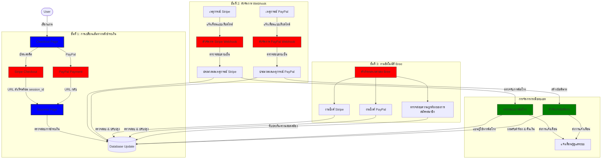
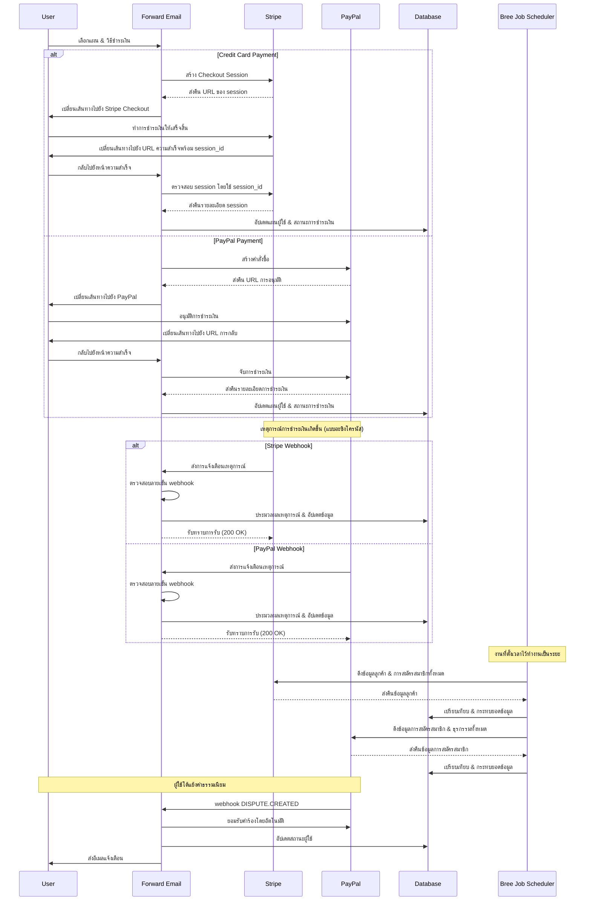
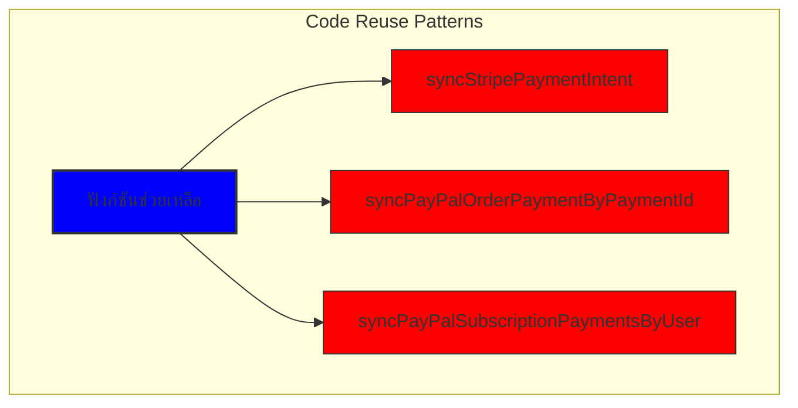
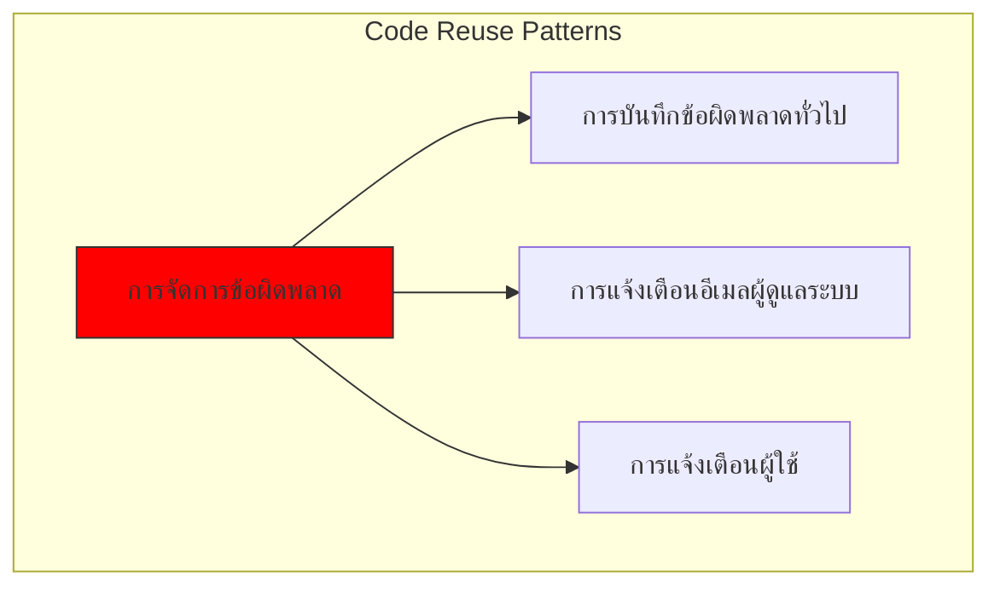
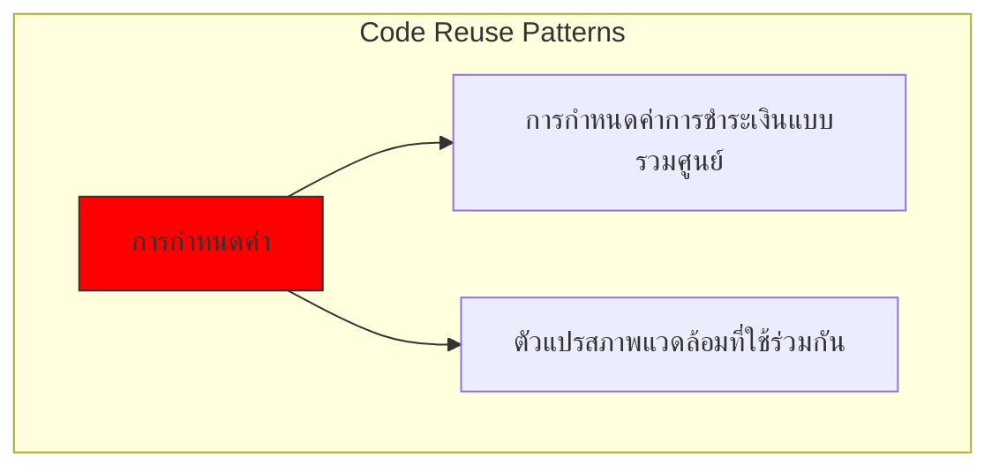
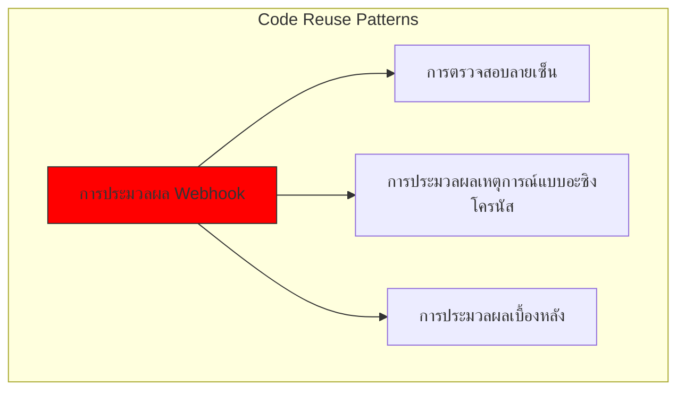
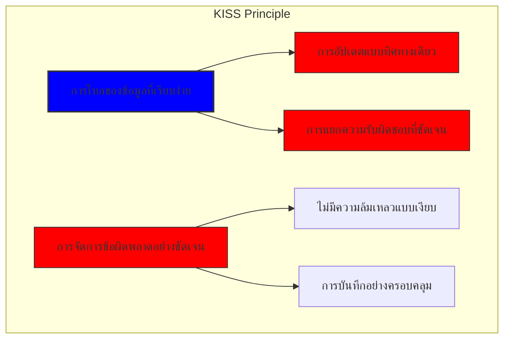

# วิธีที่เราสร้างระบบชำระเงินที่แข็งแกร่งด้วย Stripe และ PayPal: แนวทางสามประสาน {#how-we-built-a-robust-payment-system-with-stripe-and-paypal-a-trifecta-approach}


## สารบัญ {#table-of-contents}

* [คำนำ](#foreword)
* [ความท้าทาย: ผู้ประมวลผลการชำระเงินหลายราย แหล่งข้อมูลเดียวที่เชื่อถือได้](#the-challenge-multiple-payment-processors-one-source-of-truth)
* [แนวทางสามประสาน: สามชั้นของความน่าเชื่อถือ](#the-trifecta-approach-three-layers-of-reliability)
* [ชั้นที่ 1: การเปลี่ยนเส้นทางหลังชำระเงิน](#layer-1-post-checkout-redirects)
  * [การใช้งาน Stripe Checkout](#stripe-checkout-implementation)
  * [กระบวนการชำระเงิน PayPal](#paypal-payment-flow)
* [ชั้นที่ 2: ตัวจัดการ Webhook พร้อมการตรวจสอบลายเซ็น](#layer-2-webhook-handlers-with-signature-verification)
  * [การใช้งาน Stripe Webhook](#stripe-webhook-implementation)
  * [การใช้งาน PayPal Webhook](#paypal-webhook-implementation)
* [ชั้นที่ 3: งานอัตโนมัติด้วย Bree](#layer-3-automated-jobs-with-bree)
  * [ตัวตรวจสอบความถูกต้องของการสมัครสมาชิก](#subscription-accuracy-checker)
  * [การซิงโครไนซ์การสมัครสมาชิก PayPal](#paypal-subscription-synchronization)
* [การจัดการกรณีขอบเขต](#handling-edge-cases)
  * [การตรวจจับและป้องกันการฉ้อโกง](#fraud-detection-and-prevention)
  * [การจัดการข้อพิพาท](#dispute-handling)
* [การนำโค้ดกลับมาใช้ใหม่: หลักการ KISS และ DRY](#code-reuse-kiss-and-dry-principles)
* [การใช้งานข้อกำหนดการสมัครสมาชิก VISA](#visa-subscription-requirements-implementation)
  * [การแจ้งเตือนอีเมลก่อนต่ออายุอัตโนมัติ](#automated-pre-renewal-email-notifications)
  * [การจัดการกรณีขอบเขต](#handling-edge-cases-1)
  * [ช่วงทดลองใช้และเงื่อนไขการสมัครสมาชิก](#trial-periods-and-subscription-terms)
* [บทสรุป: ประโยชน์ของแนวทางสามประสานของเรา](#conclusion-the-benefits-of-our-trifecta-approach)


## คำนำ {#foreword}

ที่ Forward Email เราให้ความสำคัญกับการสร้างระบบที่น่าเชื่อถือ ถูกต้อง และใช้งานง่ายเสมอ เมื่อถึงเวลาที่จะนำระบบประมวลผลการชำระเงินมาใช้ เรารู้ว่าเราต้องการโซลูชันที่สามารถรองรับผู้ประมวลผลการชำระเงินหลายรายในขณะที่ยังคงความสอดคล้องของข้อมูลอย่างสมบูรณ์แบบ โพสต์บล็อกนี้จะอธิบายว่าทีมพัฒนาของเราได้รวม Stripe และ PayPal เข้าด้วยกันอย่างไรโดยใช้แนวทางสามประสานที่รับประกันความถูกต้องแบบเรียลไทม์ 1:1 ทั่วทั้งระบบของเรา


## ความท้าทาย: ผู้ประมวลผลการชำระเงินหลายราย แหล่งข้อมูลเดียวที่เชื่อถือได้ {#the-challenge-multiple-payment-processors-one-source-of-truth}

ในฐานะบริการอีเมลที่เน้นความเป็นส่วนตัว เราต้องการให้ผู้ใช้ของเรามีตัวเลือกการชำระเงิน บางคนชอบความเรียบง่ายของการชำระเงินด้วยบัตรเครดิตผ่าน Stripe ขณะที่บางคนให้ความสำคัญกับชั้นแยกเพิ่มเติมที่ PayPal มอบให้ อย่างไรก็ตาม การรองรับผู้ประมวลผลการชำระเงินหลายรายทำให้เกิดความซับซ้อนอย่างมาก:

1. เราจะทำอย่างไรเพื่อให้แน่ใจว่าข้อมูลสอดคล้องกันในระบบการชำระเงินที่แตกต่างกัน?
2. เราจะจัดการกับกรณีขอบเขต เช่น ข้อพิพาท การคืนเงิน หรือการชำระเงินล้มเหลวได้อย่างไร?
3. เราจะรักษาแหล่งข้อมูลเดียวที่เชื่อถือได้ในฐานข้อมูลของเราได้อย่างไร?

ทางแก้ของเราคือการนำแนวทางที่เราเรียกว่า "แนวทางสามประสาน" มาใช้ — ระบบสามชั้นที่ให้ความซ้ำซ้อนและรับประกันความสอดคล้องของข้อมูลไม่ว่าเหตุการณ์ใดจะเกิดขึ้น


## แนวทางสามประสาน: สามชั้นของความน่าเชื่อถือ {#the-trifecta-approach-three-layers-of-reliability}

ระบบชำระเงินของเราประกอบด้วยส่วนประกอบสำคัญสามส่วนที่ทำงานร่วมกันเพื่อรับประกันการซิงโครไนซ์ข้อมูลที่สมบูรณ์แบบ:

1. **การเปลี่ยนเส้นทางหลังชำระเงิน** - การจับข้อมูลการชำระเงินทันทีหลังจากชำระเงินเสร็จ
2. **ตัวจัดการ Webhook** - การประมวลผลเหตุการณ์แบบเรียลไทม์จากผู้ประมวลผลการชำระเงิน
3. **งานอัตโนมัติ** - การตรวจสอบและปรับข้อมูลการชำระเงินเป็นระยะ

มาดูแต่ละส่วนประกอบและวิธีที่พวกมันทำงานร่วมกัน


```mermaid
flowchart TD
    User([User]) --> |เลือกแผน| Checkout[Checkout Page]

    %% Layer 1: Post-checkout redirects
    subgraph "ชั้นที่ 1: การเปลี่ยนเส้นทางหลังชำระเงิน"
        Checkout --> |บัตรเครดิต| Stripe[Stripe Checkout]
        Checkout --> |PayPal| PayPal[PayPal Payment]

        Stripe --> |URL สำเร็จพร้อม session_id| SuccessPage[Success Page]
        PayPal --> |URL กลับ| SuccessPage

        SuccessPage --> |ตรวจสอบการชำระเงิน| Database[(Database Update)]
    end

    %% Layer 2: Webhooks
    subgraph "ชั้นที่ 2: ตัวจัดการ Webhook"
        StripeEvents[เหตุการณ์ Stripe] --> |แจ้งเตือนแบบเรียลไทม์| StripeWebhook[ตัวจัดการ Stripe Webhook]
        PayPalEvents[เหตุการณ์ PayPal] --> |แจ้งเตือนแบบเรียลไทม์| PayPalWebhook[ตัวจัดการ PayPal Webhook]

        StripeWebhook --> |ตรวจสอบลายเซ็น| ProcessStripeEvent[ประมวลผลเหตุการณ์ Stripe]
        PayPalWebhook --> |ตรวจสอบลายเซ็น| ProcessPayPalEvent[ประมวลผลเหตุการณ์ PayPal]

        ProcessStripeEvent --> Database
        ProcessPayPalEvent --> Database
    end

    %% Layer 3: Automated jobs
    subgraph "ชั้นที่ 3: งานอัตโนมัติ Bree"
        BreeScheduler[ตัวกำหนดเวลาของ Bree] --> StripeSync[งานซิงค์ Stripe]
        BreeScheduler --> PayPalSync[งานซิงค์ PayPal]
        BreeScheduler --> AccuracyCheck[ตรวจสอบความถูกต้องของการสมัครสมาชิก]

        StripeSync --> |ตรวจสอบ & ปรับปรุง| Database
        PayPalSync --> |ตรวจสอบ & ปรับปรุง| Database
        AccuracyCheck --> |รับประกันความสอดคล้อง| Database
    end

    %% Edge cases
    subgraph "การจัดการกรณีขอบเขต"
        ProcessStripeEvent --> |ตรวจจับการฉ้อโกง| FraudCheck[ตรวจสอบการฉ้อโกง]
        ProcessPayPalEvent --> |สร้างข้อพิพาท| DisputeHandler[ตัวจัดการข้อพิพาท]

        FraudCheck --> |แบนผู้ใช้หากฉ้อโกง| Database
        DisputeHandler --> |ยอมรับคำร้อง & คืนเงิน| Database

        FraudCheck --> |ส่งการแจ้งเตือน| AdminNotification[แจ้งเตือนผู้ดูแลระบบ]
        DisputeHandler --> |ส่งการแจ้งเตือน| AdminNotification
    end

    %% Style definitions
    classDef primary fill:blue,stroke:#333,stroke-width:2px;
    classDef secondary fill:red,stroke:#333,stroke-width:1px;
    classDef tertiary fill:green,stroke:#333,stroke-width:1px;

    class Checkout,SuccessPage primary;
    class Stripe,PayPal,StripeWebhook,PayPalWebhook,BreeScheduler secondary;
    class FraudCheck,DisputeHandler tertiary;
```
## Layer 1: การเปลี่ยนเส้นทางหลังชำระเงิน {#layer-1-post-checkout-redirects}

เลเยอร์แรกของแนวทางสามส่วนของเราจะเกิดขึ้นทันทีหลังจากผู้ใช้ทำการชำระเงินเสร็จสิ้น ทั้ง Stripe และ PayPal มีวิธีการเปลี่ยนเส้นทางผู้ใช้กลับมายังเว็บไซต์ของเราพร้อมข้อมูลการทำธุรกรรม

### การใช้งาน Stripe Checkout {#stripe-checkout-implementation}

สำหรับ Stripe เราใช้ Checkout Sessions API ของพวกเขาเพื่อสร้างประสบการณ์การชำระเงินที่ราบรื่น เมื่อผู้ใช้เลือกแผนและเลือกชำระเงินด้วยบัตรเครดิต เราจะสร้าง Checkout Session พร้อม URL สำหรับความสำเร็จและการยกเลิกที่ระบุไว้:

```javascript
const options = {
  mode: paymentType === 'one-time' ? 'payment' : 'subscription',
  customer: ctx.state.user[config.userFields.stripeCustomerID],
  client_reference_id: reference,
  metadata: {
    plan
  },
  line_items: [
    {
      price,
      quantity: 1,
      description
    }
  ],
  locale: config.STRIPE_LOCALES.has(ctx.locale) ? ctx.locale : 'auto',
  cancel_url: `${config.urls.web}${ctx.path}${
    isMakePayment || isEnableAutoRenew ? '' : `/?plan=${plan}`
  }`,
  success_url: `${config.urls.web}${ctx.path}/?${
    isMakePayment || isEnableAutoRenew ? '' : `plan=${plan}&`
  }session_id={CHECKOUT_SESSION_ID}`,
  allow_promotion_codes: true
};

// Create the checkout session and redirect
const session = await stripe.checkout.sessions.create(options);
const redirectTo = session.url;
if (ctx.accepts('html')) {
  ctx.status = 303;
  ctx.redirect(redirectTo);
} else {
  ctx.body = { redirectTo };
}
```

ส่วนสำคัญที่นี่คือพารามิเตอร์ `success_url` ซึ่งรวม `session_id` เป็นพารามิเตอร์ใน query เมื่อ Stripe เปลี่ยนเส้นทางผู้ใช้กลับมายังเว็บไซต์ของเราหลังจากชำระเงินสำเร็จ เราสามารถใช้ session ID นี้เพื่อตรวจสอบธุรกรรมและอัปเดตฐานข้อมูลของเราได้ตามลำดับ

### กระบวนการชำระเงิน PayPal {#paypal-payment-flow}

สำหรับ PayPal เราใช้แนวทางที่คล้ายกันกับ Orders API ของพวกเขา:

```javascript
const requestBody = {
  intent: 'CAPTURE',
  application_context: {
    cancel_url: `${config.urls.web}${ctx.path}${
      isMakePayment || isEnableAutoRenew ? '' : `/?plan=${plan}`
    }`,
    return_url: `${config.urls.web}${ctx.path}/?plan=${plan}`,
    brand_name: 'Forward Email',
    shipping_preference: 'NO_SHIPPING',
    user_action: 'PAY_NOW'
  },
  payer: {
    email_address: ctx.state.user.email
  },
  purchase_units: [
    {
      reference_id: ctx.state.user.id,
      description,
      custom_id: sku,
      invoice_id: reference,
      soft_descriptor: sku,
      amount: {
        currency_code: 'USD',
        value: price,
        breakdown: {
          item_total: {
            currency_code: 'USD',
            value: price
          }
        }
      },
      items: [
        {
          name,
          description,
          sku,
          unit_amount: {
            currency_code: 'USD',
            value: price
          },
          quantity: '1',
          category: 'DIGITAL_GOODS'
        }
      ]
    }
  ]
};
```

เช่นเดียวกับ Stripe เราระบุพารามิเตอร์ `return_url` และ `cancel_url` เพื่อจัดการการเปลี่ยนเส้นทางหลังชำระเงิน เมื่อ PayPal เปลี่ยนเส้นทางผู้ใช้กลับมายังเว็บไซต์ของเรา เราสามารถจับข้อมูลการชำระเงินและอัปเดตฐานข้อมูลของเราได้


```mermaid
sequenceDiagram
    participant User
    participant FE as Forward Email
    participant Stripe
    participant PayPal
    participant DB as Database
    participant Bree as Bree Job Scheduler

    %% Initial checkout flow
    User->>FE: เลือกแผน & วิธีชำระเงิน

    alt Credit Card Payment
        FE->>Stripe: สร้าง Checkout Session
        Stripe-->>FE: ส่งคืน URL ของ session
        FE->>User: เปลี่ยนเส้นทางไปยัง Stripe Checkout
        User->>Stripe: ทำการชำระเงินให้เสร็จสิ้น
        Stripe->>User: เปลี่ยนเส้นทางไปยัง URL ความสำเร็จพร้อม session_id
        User->>FE: กลับไปยังหน้าความสำเร็จ
        FE->>Stripe: ตรวจสอบ session โดยใช้ session_id
        Stripe-->>FE: ส่งคืนรายละเอียด session
        FE->>DB: อัปเดตแผนผู้ใช้ & สถานะการชำระเงิน
    else PayPal Payment
        FE->>PayPal: สร้างคำสั่งซื้อ
        PayPal-->>FE: ส่งคืน URL การอนุมัติ
        FE->>User: เปลี่ยนเส้นทางไปยัง PayPal
        User->>PayPal: อนุมัติการชำระเงิน
        PayPal->>User: เปลี่ยนเส้นทางไปยัง URL การกลับ
        User->>FE: กลับไปยังหน้าความสำเร็จ
        FE->>PayPal: จับการชำระเงิน
        PayPal-->>FE: ส่งคืนรายละเอียดการชำระเงิน
        FE->>DB: อัปเดตแผนผู้ใช้ & สถานะการชำระเงิน
    end

    %% Webhook flow (asynchronous)
    Note over Stripe,PayPal: เหตุการณ์การชำระเงินเกิดขึ้น (แบบอะซิงโครนัส)

    alt Stripe Webhook
        Stripe->>FE: ส่งการแจ้งเตือนเหตุการณ์
        FE->>FE: ตรวจสอบลายเซ็น webhook
        FE->>DB: ประมวลผลเหตุการณ์ & อัปเดตข้อมูล
        FE-->>Stripe: รับทราบการรับ (200 OK)
    else PayPal Webhook
        PayPal->>FE: ส่งการแจ้งเตือนเหตุการณ์
        FE->>FE: ตรวจสอบลายเซ็น webhook
        FE->>DB: ประมวลผลเหตุการณ์ & อัปเดตข้อมูล
        FE-->>PayPal: รับทราบการรับ (200 OK)
    end

    %% Bree automated jobs
    Note over Bree: งานที่ตั้งเวลาไว้ทำงานเป็นระยะ

    Bree->>Stripe: ดึงข้อมูลลูกค้า & การสมัครสมาชิกทั้งหมด
    Stripe-->>Bree: ส่งคืนข้อมูลลูกค้า
    Bree->>DB: เปรียบเทียบ & กระทบยอดข้อมูล

    Bree->>PayPal: ดึงข้อมูลการสมัครสมาชิก & ธุรกรรมทั้งหมด
    PayPal-->>Bree: ส่งคืนข้อมูลการสมัครสมาชิก
    Bree->>DB: เปรียบเทียบ & กระทบยอดข้อมูล

    %% Edge case: Dispute handling
    Note over User,PayPal: ผู้ใช้โต้แย้งค่าธรรมเนียม

    PayPal->>FE: webhook DISPUTE.CREATED
    FE->>PayPal: ยอมรับคำร้องโดยอัตโนมัติ
    FE->>DB: อัปเดตสถานะผู้ใช้
    FE->>User: ส่งอีเมลแจ้งเตือน
```
## Layer 2: ตัวจัดการ Webhook พร้อมการตรวจสอบลายเซ็น {#layer-2-webhook-handlers-with-signature-verification}

ในขณะที่การเปลี่ยนเส้นทางหลังชำระเงินทำงานได้ดีในหลายสถานการณ์ แต่มันไม่สมบูรณ์แบบ ผู้ใช้บางคนอาจปิดเบราว์เซอร์ก่อนที่จะถูกเปลี่ยนเส้นทาง หรือปัญหาเครือข่ายอาจทำให้การเปลี่ยนเส้นทางไม่สำเร็จ นั่นคือจุดที่ webhook เข้ามามีบทบาท

ทั้ง Stripe และ PayPal มีระบบ webhook ที่ส่งการแจ้งเตือนแบบเรียลไทม์เกี่ยวกับเหตุการณ์การชำระเงิน เราได้พัฒนาตัวจัดการ webhook ที่แข็งแกร่งซึ่งตรวจสอบความถูกต้องของการแจ้งเตือนเหล่านี้และดำเนินการตามนั้น

### การใช้งาน Stripe Webhook {#stripe-webhook-implementation}

ตัวจัดการ webhook ของ Stripe ของเราจะตรวจสอบลายเซ็นของเหตุการณ์ webhook ที่เข้ามาเพื่อให้แน่ใจว่าเป็นของแท้:

```javascript
async function webhook(ctx) {
  const sig = ctx.request.get('stripe-signature');
  // throw an error if something was wrong
  if (!isSANB(sig))
    throw Boom.badRequest(ctx.translateError('INVALID_STRIPE_SIGNATURE'));
  const event = stripe.webhooks.constructEvent(
    ctx.request.rawBody,
    sig,
    env.STRIPE_ENDPOINT_SECRET
  );
  // throw an error if something was wrong
  if (!event)
    throw Boom.badRequest(ctx.translateError('INVALID_STRIPE_SIGNATURE'));
  ctx.logger.info('stripe webhook', { event });
  // return a response to acknowledge receipt of the event
  ctx.body = { received: true };
  // run in background
  processEvent(ctx, event)
    .then()
    .catch((err) => {
      ctx.logger.fatal(err, { event });
      // email admin errors
      emailHelper({
        template: 'alert',
        message: {
          to: config.email.message.from,
          subject: `Error with Stripe Webhook (Event ID ${event.id})`
        },
        locals: {
          message: `<pre><code>${safeStringify(
            parseErr(err),
            null,
            2
          )}</code></pre>`
        }
      })
        .then()
        .catch((err) => ctx.logger.fatal(err, { event }));
    });
}
```

ฟังก์ชัน `stripe.webhooks.constructEvent` จะตรวจสอบลายเซ็นโดยใช้ความลับของ endpoint ของเรา หากลายเซ็นถูกต้อง เราจะดำเนินการเหตุการณ์แบบอะซิงโครนัสเพื่อหลีกเลี่ยงการบล็อกการตอบกลับ webhook

### การใช้งาน PayPal Webhook {#paypal-webhook-implementation}

ในทำนองเดียวกัน ตัวจัดการ webhook ของ PayPal ของเราจะตรวจสอบความถูกต้องของการแจ้งเตือนที่เข้ามา:

```javascript
async function webhook(ctx) {
  const response = await promisify(
    paypal.notification.webhookEvent.verify,
    paypal.notification.webhookEvent
  )(ctx.request.headers, ctx.request.body, env.PAYPAL_WEBHOOK_ID);
  // throw an error if something was wrong
  if (!_.isObject(response) || response.verification_status !== 'SUCCESS')
    throw Boom.badRequest(ctx.translateError('INVALID_PAYPAL_SIGNATURE'));
  // return a response to acknowledge receipt of the event
  ctx.body = { received: true };
  // run in background
  processEvent(ctx)
    .then()
    .catch((err) => {
      ctx.logger.fatal(err);
      // email admin errors
      emailHelper({
        template: 'alert',
        message: {
          to: config.email.message.from,
          subject: `Error with PayPal Webhook (Event ID ${ctx.request.body.id})`
        },
        locals: {
          message: `<pre><code>${safeStringify(
            parseErr(err),
            null,
            2
          )}</code></pre>`
        }
      })
        .then()
        .catch((err) => ctx.logger.fatal(err));
    });
}
```

ตัวจัดการ webhook ทั้งสองตัวทำตามรูปแบบเดียวกัน: ตรวจสอบลายเซ็น, ยืนยันการรับเหตุการณ์, และดำเนินการเหตุการณ์แบบอะซิงโครนัส สิ่งนี้ช่วยให้มั่นใจว่าเราไม่พลาดเหตุการณ์การชำระเงินแม้ว่าการเปลี่ยนเส้นทางหลังชำระเงินจะล้มเหลวก็ตาม


## Layer 3: งานอัตโนมัติด้วย Bree {#layer-3-automated-jobs-with-bree}

ชั้นสุดท้ายของแนวทางสามชั้นของเราคืองานอัตโนมัติที่ตรวจสอบและปรับข้อมูลการชำระเงินเป็นระยะ ๆ เราใช้ Bree ซึ่งเป็นตัวจัดตารางงานสำหรับ Node.js เพื่อรันงานเหล่านี้ในช่วงเวลาปกติ

### ตัวตรวจสอบความถูกต้องของการสมัครสมาชิก {#subscription-accuracy-checker}

หนึ่งในงานสำคัญของเราคือตัวตรวจสอบความถูกต้องของการสมัครสมาชิก ซึ่งช่วยให้ฐานข้อมูลของเราสะท้อนสถานะการสมัครสมาชิกใน Stripe อย่างถูกต้อง:
```javascript
async function mapper(customer) {
  // wait a second to prevent rate limitation error
  await setTimeout(ms('1s'));
  // check for user on our side
  let user = await Users.findOne({
    [config.userFields.stripeCustomerID]: customer.id
  })
    .lean()
    .exec();
  if (!user) return;
  if (user.is_banned) return;

  // if emails did not match
  if (user.email !== customer.email) {
    logger.info(
      `User email ${user.email} did not match customer email ${customer.email} (${customer.id})`
    );
    customer = await stripe.customers.update(customer.id, {
      email: user.email
    });
    logger.info(`Updated user email to match ${user.email}`);
  }

  // check for active subscriptions
  const [activeSubscriptions, trialingSubscriptions] = await Promise.all([
    stripe.subscriptions.list({
      customer: customer.id,
      status: 'active'
    }),
    stripe.subscriptions.list({
      customer: customer.id,
      status: 'trialing'
    })
  ]);

  // Combine active and trialing subscriptions
  let subscriptions = [
    ...activeSubscriptions.data,
    ...trialingSubscriptions.data
  ];

  // Handle edge case: multiple subscriptions for one user
  if (subscriptions.length > 1) {
    await logger.error(
      new Error(
        `We may need to refund: User had multiple subscriptions ${user.email} (${customer.id})`
      )
    );
    await emailHelper({
      template: 'alert',
      message: {
        to: config.email.message.from,
        subject: `User had multiple subscriptions ${user.email}`
      },
      locals: {
        message: `User ${user.email} (${customer.id}) had multiple subscriptions: ${JSON.stringify(
          subscriptions.map((s) => s.id)
        )}`
      }
    });
  }
}
```

This job checks for discrepancies between our database and Stripe, such as mismatched email addresses or multiple active subscriptions. If it finds any issues, it logs them and sends alerts to our admin team.

### PayPal Subscription Synchronization {#paypal-subscription-synchronization}

We have a similar job for PayPal subscriptions:

```javascript
async function syncPayPalSubscriptionPayments() {
  const paypalCustomers = await Users.find({
    $or: [
      {
        [config.userFields.paypalSubscriptionID]: { $exists: true, $ne: null }
      },
      {
        [config.userFields.paypalPayerID]: { $exists: true, $ne: null }
      }
    ]
  })
    // sort by newest customers first
    .sort('-created_at')
    .lean()
    .exec();

  await logger.info(
    `Syncing payments for ${paypalCustomers.length} paypal customers`
  );

  // Process each customer and sync their payments
  const errorEmails = await pReduce(
    paypalCustomers,
    // Implementation details...
  );
}
```

These automated jobs serve as our final safety net, ensuring that our database always reflects the true state of subscriptions and payments in both Stripe and PayPal.


## Handling Edge Cases {#handling-edge-cases}

A robust payment system must handle edge cases gracefully. Let's look at how we handle some common scenarios.

### Fraud Detection and Prevention {#fraud-detection-and-prevention}

We've implemented sophisticated fraud detection mechanisms that automatically identify and handle suspicious payment activities:

```javascript
case 'charge.failed': {
  // Get all failed charges in the last 30 days
  const charges = await stripe.charges.list({
    customer: event.data.object.customer,
    created: {
      gte: dayjs().subtract(1, 'month').unix()
    }
  });

  // Filter for declined charges
  const filtered = charges.data.filter(
    (d) => d.status === 'failed' && d.failure_code === 'card_declined'
  );

  // if not more than 5 then return early
  if (filtered.length < 5) break;

  // Check if user has verified domains
  const count = await Domains.countDocuments({
    members: {
      $elemMatch: {
        user: user._id,
        group: 'admin'
      }
    },
    plan: { $in: ['enhanced_protection', 'team'] },
    has_txt_record: true
  });

  if (!user.is_banned) {
    // If no verified domains, ban the user and refund all charges
    if (count === 0) {
      // Ban the user
      user.is_banned = true;
      await user.save();

      // Refund all successful charges
    }
  }
}
```

โค้ดนี้จะทำการแบนผู้ใช้โดยอัตโนมัติที่มีการชาร์จล้มเหลวหลายครั้งและไม่มีโดเมนที่ได้รับการยืนยัน ซึ่งเป็นสัญญาณที่ชัดเจนของกิจกรรมที่เป็นการฉ้อโกง

### การจัดการข้อพิพาท {#dispute-handling}

เมื่อผู้ใช้โต้แย้งการชาร์จ เราจะยอมรับคำร้องโดยอัตโนมัติและดำเนินการที่เหมาะสม:

```javascript
case 'CUSTOMER.DISPUTE.CREATED': {
  // ยอมรับคำร้อง
  const agent = await paypalAgent();
  await agent
    .post(`/v1/customer/disputes/${body.resource.dispute_id}/accept-claim`)
    .send({
      note: 'คืนเงินเต็มจำนวนให้กับลูกค้า'
    });

  // ค้นหาการชำระเงินในฐานข้อมูลของเรา
  const payment = await Payments.findOne({ $or });
  if (!payment) throw new Error('ไม่พบการชำระเงิน');

  const user = await Users.findById(payment.user);
  if (!user) throw new Error('ไม่พบผู้ใช้สำหรับลูกค้า');

  // ยกเลิกการสมัครสมาชิกของผู้ใช้หากมี
  if (isSANB(user[config.userFields.paypalSubscriptionID])) {
    try {
      const agent = await paypalAgent();
      await agent.post(
        `/v1/billing/subscriptions/${
          user[config.userFields.paypalSubscriptionID]
        }/cancel`
      );
    } catch (err) {
      // จัดการข้อผิดพลาดในการยกเลิกการสมัครสมาชิก
    }
  }
}
```

แนวทางนี้ช่วยลดผลกระทบจากข้อพิพาทต่อธุรกิจของเราในขณะที่ยังคงรักษาประสบการณ์ที่ดีให้กับลูกค้า


## การนำโค้ดกลับมาใช้ใหม่: หลักการ KISS และ DRY {#code-reuse-kiss-and-dry-principles}

ตลอดระบบการชำระเงินของเรา เราได้ปฏิบัติตามหลักการ KISS (Keep It Simple, Stupid) และ DRY (Don't Repeat Yourself) นี่คือตัวอย่างบางส่วน:

1. **ฟังก์ชันช่วยเหลือที่ใช้ร่วมกัน**: เราได้สร้างฟังก์ชันช่วยเหลือที่นำกลับมาใช้ใหม่สำหรับงานทั่วไป เช่น การซิงค์การชำระเงินและการส่งอีเมล

2. **การจัดการข้อผิดพลาดที่สม่ำเสมอ**: ตัวจัดการ webhook ของทั้ง Stripe และ PayPal ใช้รูปแบบเดียวกันสำหรับการจัดการข้อผิดพลาดและการแจ้งเตือนผู้ดูแลระบบ

3. **โครงสร้างฐานข้อมูลแบบรวมศูนย์**: โครงสร้างฐานข้อมูลของเราออกแบบมาเพื่อรองรับข้อมูลทั้งจาก Stripe และ PayPal โดยมีฟิลด์ทั่วไปสำหรับสถานะการชำระเงิน จำนวนเงิน และข้อมูลแผน

4. **การกำหนดค่าที่รวมศูนย์**: การกำหนดค่าที่เกี่ยวข้องกับการชำระเงินถูกรวมไว้ในไฟล์เดียว ทำให้ง่ายต่อการอัปเดตราคาและข้อมูลผลิตภัณฑ์


```mermaid
graph TD
    subgraph "Code Reuse Patterns"
        A[ฟังก์ชันช่วยเหลือ] --> B[syncStripePaymentIntent]
        A --> C[syncPayPalOrderPaymentByPaymentId]
        A --> D[syncPayPalSubscriptionPaymentsByUser]
    end

    classDef primary fill:blue,stroke:#333,stroke-width:2px;
    classDef secondary fill:red,stroke:#333,stroke-width:1px;

    class A,P,V primary;
    class B,C,D,E,I,L,Q,R,S,W,X,Y,Z secondary;
```


```mermaid
graph TD
    subgraph "Code Reuse Patterns"
        E[การจัดการข้อผิดพลาด] --> F[การบันทึกข้อผิดพลาดทั่วไป]
        E --> G[การแจ้งเตือนอีเมลผู้ดูแลระบบ]
        E --> H[การแจ้งเตือนผู้ใช้]
    end

    classDef primary fill:blue,stroke:#333,stroke-width:2px;
    classDef secondary fill:red,stroke:#333,stroke-width:1px;

    class A,P,V primary;
    class B,C,D,E,I,L,Q,R,S,W,X,Y,Z secondary;
```


```mermaid
graph TD
    subgraph "Code Reuse Patterns"
        I[การกำหนดค่า] --> J[การกำหนดค่าการชำระเงินแบบรวมศูนย์]
        I --> K[ตัวแปรสภาพแวดล้อมที่ใช้ร่วมกัน]
    end

    classDef primary fill:blue,stroke:#333,stroke-width:2px;
    classDef secondary fill:red,stroke:#333,stroke-width:1px;

    class A,P,V primary;
    class B,C,D,E,I,L,Q,R,S,W,X,Y,Z secondary;
```


```mermaid
graph TD
    subgraph "Code Reuse Patterns"
        L[การประมวลผล Webhook] --> M[การตรวจสอบลายเซ็น]
        L --> N[การประมวลผลเหตุการณ์แบบอะซิงโครนัส]
        L --> O[การประมวลผลเบื้องหลัง]
    end

    classDef primary fill:blue,stroke:#333,stroke-width:2px;
    classDef secondary fill:red,stroke:#333,stroke-width:1px;

    class A,P,V primary;
    class B,C,D,E,I,L,Q,R,S,W,X,Y,Z secondary;
```


```mermaid
graph TD
    subgraph "KISS Principle"
        P[การไหลของข้อมูลที่เรียบง่าย] --> Q[การอัปเดตแบบทิศทางเดียว]
        P --> R[การแยกความรับผิดชอบที่ชัดเจน]

        S[การจัดการข้อผิดพลาดอย่างชัดเจน] --> T[ไม่มีความล้มเหลวแบบเงียบ]
        S --> U[การบันทึกอย่างครอบคลุม]
    end

    classDef primary fill:blue,stroke:#333,stroke-width:2px;
    classDef secondary fill:red,stroke:#333,stroke-width:1px;

    class A,P,V primary;
    class B,C,D,E,I,L,Q,R,S,W,X,Y,Z secondary;
```
graph TD
    subgraph "หลักการ DRY"
        V[ตรรกะที่ใช้ร่วมกัน] --> W[ฟังก์ชันการประมวลผลการชำระเงิน]
        V --> X[แม่แบบอีเมล]
        V --> Y[ตรรกะการตรวจสอบความถูกต้อง]

        Z[การดำเนินการฐานข้อมูลทั่วไป] --> AA[การอัปเดตผู้ใช้]
        Z --> AB[การบันทึกการชำระเงิน]
    end

    classDef primary fill:blue,stroke:#333,stroke-width:2px;
    classDef secondary fill:red,stroke:#333,stroke-width:1px;

    class A,P,V primary;
    class B,C,D,E,I,L,Q,R,S,W,X,Y,Z secondary;
```


## การดำเนินการตามข้อกำหนดการสมัครสมาชิก VISA {#visa-subscription-requirements-implementation}

นอกเหนือจากแนวทางสามประสานของเรา เรายังได้พัฒนาฟีเจอร์เฉพาะเพื่อให้สอดคล้องกับข้อกำหนดการสมัครสมาชิกของ VISA พร้อมกับเพิ่มประสบการณ์ผู้ใช้ ข้อกำหนดสำคัญอย่างหนึ่งจาก VISA คือผู้ใช้ต้องได้รับการแจ้งเตือนก่อนที่จะถูกเรียกเก็บเงินสำหรับการสมัครสมาชิก โดยเฉพาะเมื่อเปลี่ยนจากการทดลองใช้เป็นการสมัครสมาชิกแบบชำระเงิน

### การแจ้งเตือนอีเมลก่อนการต่ออายุอัตโนมัติ {#automated-pre-renewal-email-notifications}

เราได้สร้างระบบอัตโนมัติที่ระบุผู้ใช้ที่มีการสมัครสมาชิกแบบทดลองใช้งานที่ยังใช้งานอยู่ และส่งอีเมลแจ้งเตือนก่อนที่จะมีการเรียกเก็บเงินครั้งแรก ซึ่งไม่เพียงแต่ช่วยให้เราปฏิบัติตามข้อกำหนดของ VISA เท่านั้น แต่ยังช่วยลดการเรียกเงินคืนและเพิ่มความพึงพอใจของลูกค้า

นี่คือวิธีที่เราดำเนินการฟีเจอร์นี้:

```javascript
// ค้นหาผู้ใช้ที่มีการสมัครสมาชิกแบบทดลองใช้งานที่ยังไม่ได้รับการแจ้งเตือน
const users = await Users.find({
  $or: [
    {
      $and: [
        { [config.userFields.stripeSubscriptionID]: { $exists: true } },
        { [config.userFields.stripeTrialSentAt]: { $exists: false } },
        // ยกเว้นการสมัครสมาชิกที่มีการชำระเงินแล้ว
        ...(paidStripeSubscriptionIds.length > 0
          ? [
              {
                [config.userFields.stripeSubscriptionID]: {
                  $nin: paidStripeSubscriptionIds
                }
              }
            ]
          : [])
      ]
    },
    {
      $and: [
        { [config.userFields.paypalSubscriptionID]: { $exists: true } },
        { [config.userFields.paypalTrialSentAt]: { $exists: false } },
        // ยกเว้นการสมัครสมาชิกที่มีการชำระเงินแล้ว
        ...(paidPayPalSubscriptionIds.length > 0
          ? [
              {
                [config.userFields.paypalSubscriptionID]: {
                  $nin: paidPayPalSubscriptionIds
                }
              }
            ]
          : [])
      ]
    }
  ]
});

// ประมวลผลผู้ใช้แต่ละรายและส่งการแจ้งเตือน
for (const user of users) {
  // ดึงรายละเอียดการสมัครสมาชิกจากผู้ประมวลผลการชำระเงิน
  const subscription = await getSubscriptionDetails(user);

  // คำนวณระยะเวลาการสมัครสมาชิกและความถี่
  const duration = getDurationFromPlanId(subscription.plan_id);
  const frequency = getHumanReadableFrequency(duration, user.locale);
  const amount = getPlanAmount(user.plan, duration);

  // ดึงโดเมนของผู้ใช้เพื่อส่งอีเมลแบบส่วนบุคคล
  const domains = await Domains.find({
    'members.user': user._id
  }).sort('name').lean().exec();

  // ส่งอีเมลแจ้งเตือนที่สอดคล้องกับข้อกำหนดของ VISA
  await emailHelper({
    template: 'visa-trial-subscription-requirement',
    message: {
      to: user.receipt_email || user.email,
      ...(user.receipt_email ? { cc: user.email } : {})
    },
    locals: {
      user,
      firstChargeDate: new Date(subscription.start_time),
      frequency,
      formattedAmount: numeral(amount).format('$0,0,0.00'),
      domains
    }
  });

  // บันทึกว่าการแจ้งเตือนได้ถูกส่งแล้ว
  await Users.findByIdAndUpdate(user._id, {
    $set: {
      [config.userFields.paypalTrialSentAt]: new Date()
    }
  });
}
```

การดำเนินการนี้ช่วยให้มั่นใจได้ว่าผู้ใช้จะได้รับข้อมูลเกี่ยวกับการเรียกเก็บเงินที่จะเกิดขึ้นเสมอ โดยมีรายละเอียดที่ชัดเจนเกี่ยวกับ:

1. วันที่จะมีการเรียกเก็บเงินครั้งแรก
2. ความถี่ของการเรียกเก็บเงินในอนาคต (รายเดือน รายปี ฯลฯ)
3. จำนวนเงินที่แน่นอนที่จะถูกเรียกเก็บ
4. โดเมนที่ครอบคลุมโดยการสมัครสมาชิกของพวกเขา

ด้วยการทำให้กระบวนการนี้เป็นอัตโนมัติ เราจึงรักษาการปฏิบัติตามข้อกำหนดของ VISA อย่างสมบูรณ์แบบ (ซึ่งกำหนดให้ต้องแจ้งเตือนล่วงหน้าอย่างน้อย 7 วันก่อนการเรียกเก็บเงิน) พร้อมกับลดคำถามจากฝ่ายสนับสนุนและเพิ่มประสบการณ์ผู้ใช้โดยรวมให้ดียิ่งขึ้น
### การจัดการกรณีขอบเขต {#handling-edge-cases-1}

การดำเนินการของเรายังรวมถึงการจัดการข้อผิดพลาดที่แข็งแกร่ง หากเกิดปัญหาใด ๆ ในระหว่างกระบวนการแจ้งเตือน ระบบของเราจะส่งการแจ้งเตือนถึงทีมงานโดยอัตโนมัติ:

```javascript
try {
  await mapper(user);
} catch (err) {
  logger.error(err);

  // Send alert to administrators
  await emailHelper({
    template: 'alert',
    message: {
      to: config.email.message.from,
      subject: 'VISA Trial Subscription Requirement Error'
    },
    locals: {
      message: `<pre><code>${safeStringify(
        parseErr(err),
        null,
        2
      )}</code></pre>`
    }
  });
}
```

สิ่งนี้ช่วยให้มั่นใจได้ว่าแม้ว่าจะมีปัญหากับระบบแจ้งเตือน ทีมงานของเราสามารถแก้ไขได้อย่างรวดเร็วและรักษาการปฏิบัติตามข้อกำหนดของ VISA

ระบบแจ้งเตือนการสมัครสมาชิกของ VISA เป็นตัวอย่างอีกหนึ่งกรณีที่แสดงให้เห็นว่าเราได้สร้างโครงสร้างพื้นฐานการชำระเงินของเราโดยคำนึงถึงทั้งการปฏิบัติตามกฎระเบียบและประสบการณ์ผู้ใช้ควบคู่กันไป ซึ่งเสริมสร้างแนวทางสามประสานของเราเพื่อให้มั่นใจในกระบวนการชำระเงินที่เชื่อถือได้และโปร่งใส

### ระยะเวลาทดลองใช้และเงื่อนไขการสมัครสมาชิก {#trial-periods-and-subscription-terms}

สำหรับผู้ใช้ที่เปิดใช้งานการต่ออายุอัตโนมัติในแผนที่มีอยู่ เราจะคำนวณระยะเวลาทดลองใช้ที่เหมาะสมเพื่อให้แน่ใจว่าจะไม่มีการเรียกเก็บเงินจนกว่าแผนปัจจุบันจะหมดอายุ:

```javascript
if (
  isEnableAutoRenew &&
  dayjs(ctx.state.user[config.userFields.planExpiresAt]).isAfter(
    dayjs()
  )
) {
  const hours = dayjs(
    ctx.state.user[config.userFields.planExpiresAt]
  ).diff(dayjs(), 'hours');

  // Handle trial period calculation
}
```

เรายังให้ข้อมูลที่ชัดเจนเกี่ยวกับเงื่อนไขการสมัครสมาชิก รวมถึงความถี่ในการเรียกเก็บเงินและนโยบายการยกเลิก พร้อมทั้งรวมเมตาดาต้าที่ละเอียดสำหรับแต่ละการสมัครสมาชิกเพื่อให้มั่นใจในการติดตามและการจัดการที่ถูกต้อง


## สรุป: ประโยชน์ของแนวทางสามประสานของเรา {#conclusion-the-benefits-of-our-trifecta-approach}

แนวทางสามประสานของเราในการประมวลผลการชำระเงินได้มอบประโยชน์สำคัญหลายประการ:

1. **ความน่าเชื่อถือ**: ด้วยการใช้สามชั้นของการตรวจสอบการชำระเงิน เรารับประกันว่าจะไม่มีการชำระเงินใดที่ถูกพลาดหรือประมวลผลผิดพลาด

2. **ความถูกต้อง**: ฐานข้อมูลของเราสะท้อนสถานะที่แท้จริงของการสมัครสมาชิกและการชำระเงินทั้งใน Stripe และ PayPal เสมอ

3. **ความยืดหยุ่น**: ผู้ใช้สามารถเลือกวิธีการชำระเงินที่ต้องการโดยไม่กระทบต่อความน่าเชื่อถือของระบบเรา

4. **ความแข็งแกร่ง**: ระบบของเราจัดการกรณีขอบเขตได้อย่างราบรื่น ตั้งแต่ความล้มเหลวของเครือข่ายจนถึงกิจกรรมที่เป็นการฉ้อโกง

หากคุณกำลังพัฒนาระบบชำระเงินที่รองรับผู้ประมวลผลหลายราย เราขอแนะนำแนวทางสามประสานนี้อย่างยิ่ง แม้ว่าจะต้องใช้ความพยายามในการพัฒนาล่วงหน้ามากขึ้น แต่ประโยชน์ในระยะยาวในแง่ของความน่าเชื่อถือและความถูกต้องนั้นคุ้มค่าอย่างยิ่ง

สำหรับข้อมูลเพิ่มเติมเกี่ยวกับ Forward Email และบริการอีเมลที่เน้นความเป็นส่วนตัวของเรา โปรดเยี่ยมชม [เว็บไซต์](https://forwardemail.net) ของเรา

<!-- *Keywords: payment processing, Stripe integration, PayPal integration, webhook handling, payment synchronization, subscription management, fraud prevention, dispute handling, Node.js payment system, multi-processor payment system, payment gateway integration, real-time payment verification, payment data consistency, subscription billing, payment security, payment automation, payment webhooks, payment reconciliation, payment edge cases, payment error handling, VISA subscription requirements, pre-renewal notifications, subscription compliance* -->
