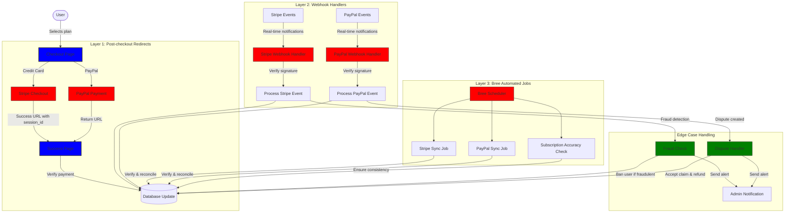
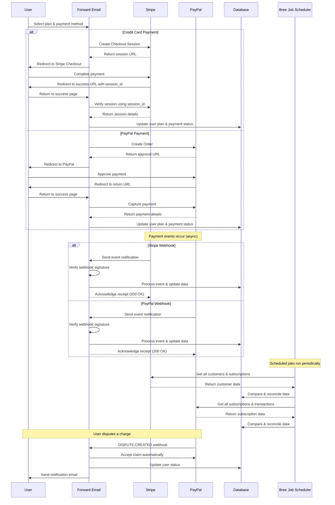
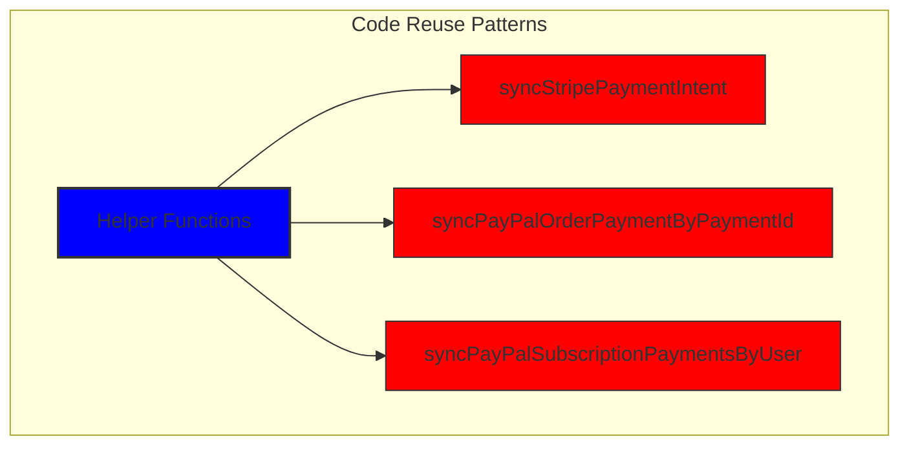
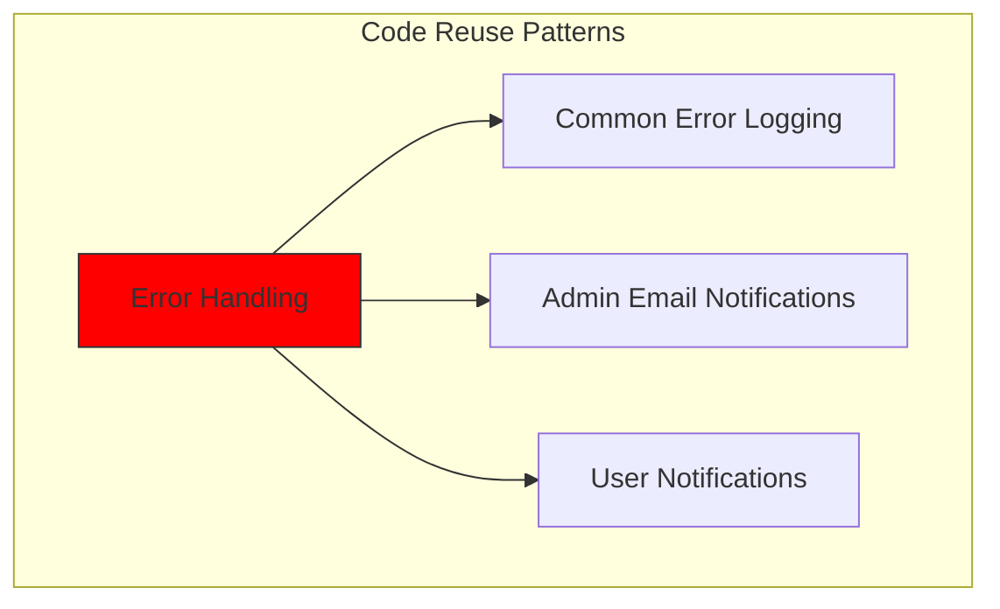
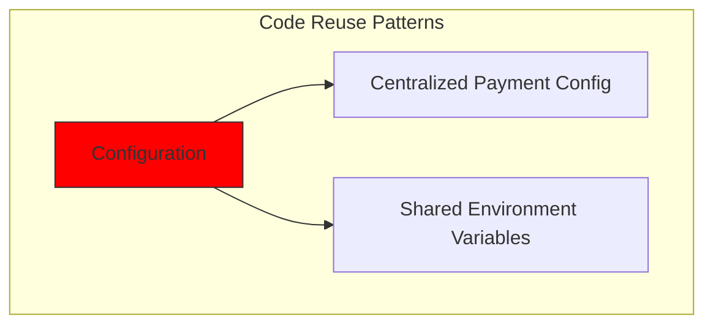
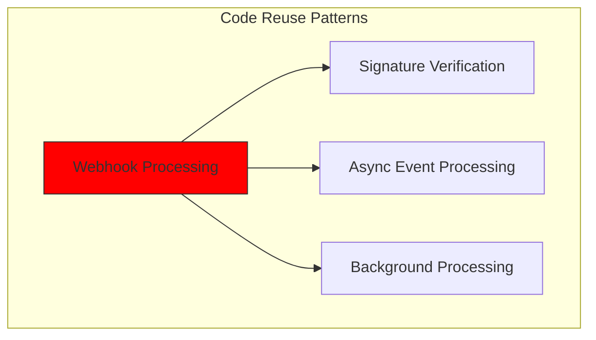
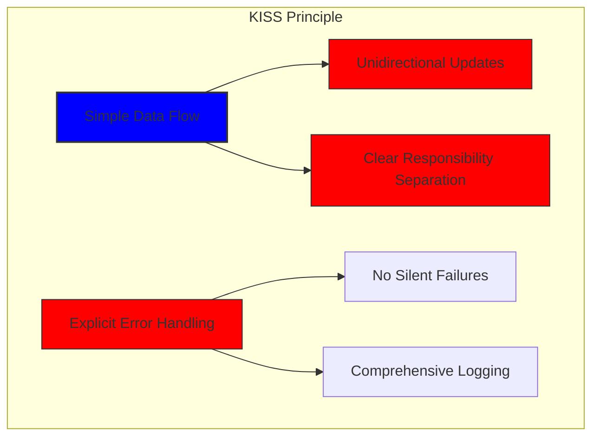
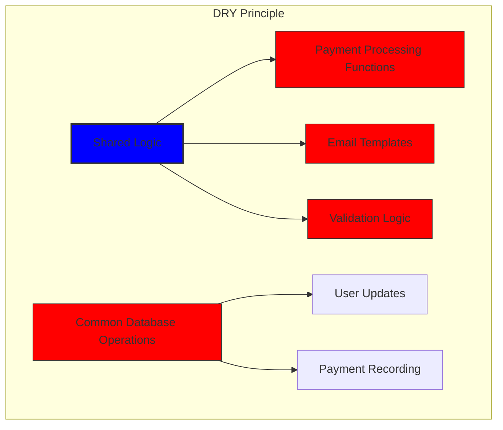

# Stripe ve PayPal ile Güçlü Bir Ödeme Sistemi Nasıl Oluşturduk: Üçlü Yaklaşım {#how-we-built-a-robust-payment-system-with-stripe-and-paypal-a-trifecta-approach}


## İçindekiler {#table-of-contents}

* [Önsöz](#foreword)
* [Zorluk: Birden Fazla Ödeme İşlemcisi, Tek Bir Gerçek Kaynağı](#the-challenge-multiple-payment-processors-one-source-of-truth)
* [Trifecta Yaklaşımı: Üç Katmanlı Güvenilirlik](#the-trifecta-approach-three-layers-of-reliability)
* [Katman 1: Ödeme Sonrası Yönlendirmeler](#layer-1-post-checkout-redirects)
  * [Stripe Ödeme Uygulaması](#stripe-checkout-implementation)
  * [PayPal Ödeme Akışı](#paypal-payment-flow)
* [Katman 2: İmza Doğrulamalı Webhook İşleyicileri](#layer-2-webhook-handlers-with-signature-verification)
  * [Stripe Webhook Uygulaması](#stripe-webhook-implementation)
  * [PayPal Webhook Uygulaması](#paypal-webhook-implementation)
* [Katman 3: Bree ile Otomatik İşler](#layer-3-automated-jobs-with-bree)
  * [Abonelik Doğruluk Denetleyicisi](#subscription-accuracy-checker)
  * [PayPal Abonelik Senkronizasyonu](#paypal-subscription-synchronization)
* [Sınır Durumların Ele Alınması](#handling-edge-cases)
  * [Dolandırıcılık Tespiti ve Önleme](#fraud-detection-and-prevention)
  * [Anlaşmazlıkların Çözümü](#dispute-handling)
* [Kod Yeniden Kullanımı: KISS ve DRY İlkeleri](#code-reuse-kiss-and-dry-principles)
* [VISA Abonelik Gereksinimlerinin Uygulanması](#visa-subscription-requirements-implementation)
  * [Otomatik Yenileme Öncesi E-posta Bildirimleri](#automated-pre-renewal-email-notifications)
  * [Sınır Durumların Ele Alınması](#handling-edge-cases-1)
  * [Deneme Süreleri ve Abonelik Koşulları](#trial-periods-and-subscription-terms)
* [Sonuç: Trifecta Yaklaşımımızın Faydaları](#conclusion-the-benefits-of-our-trifecta-approach)

## Önsöz {#foreword}

Forward Email olarak, her zaman güvenilir, doğru ve kullanıcı dostu sistemler oluşturmaya öncelik verdik. Ödeme işleme sistemimizi uygulamaya koyarken, mükemmel veri tutarlılığını korurken birden fazla ödeme işlemcisini idare edebilecek bir çözüme ihtiyacımız olduğunu biliyorduk. Bu blog yazısı, geliştirme ekibimizin tüm sistemimizde 1:1 gerçek zamanlı doğruluk sağlayan üçlü bir yaklaşım kullanarak hem Stripe'ı hem de PayPal'ı nasıl entegre ettiğini ayrıntılarıyla anlatıyor.

## Zorluk: Birden Fazla Ödeme İşlemcisi, Tek Bir Gerçek Kaynağı {#the-challenge-multiple-payment-processors-one-source-of-truth}

Gizlilik odaklı bir e-posta hizmeti olarak, kullanıcılarımıza ödeme seçenekleri sunmak istedik. Bazıları Stripe üzerinden kredi kartıyla ödeme yapmanın kolaylığını tercih ederken, bazıları PayPal'ın sağladığı ek ayrım katmanını tercih ediyor. Ancak, birden fazla ödeme işlemcisini desteklemek önemli ölçüde karmaşıklığa yol açıyor:

1. Farklı ödeme sistemleri arasında tutarlı verileri nasıl sağlıyoruz?
2. Anlaşmazlıklar, iadeler veya başarısız ödemeler gibi uç durumları nasıl ele alıyoruz?
3. Veritabanımızda tek bir bilgi kaynağını nasıl koruyoruz?

Çözümümüz, "üçlü yaklaşım" adını verdiğimiz, ne olursa olsun yedeklilik sağlayan ve veri tutarlılığını garanti eden üç katmanlı bir sistemi uygulamak oldu.

## Trifecta Yaklaşımı: Üç Katmanlı Güvenilirlik {#the-trifecta-approach-three-layers-of-reliability}

Ödeme sistemimiz, kusursuz veri senkronizasyonunu sağlamak için birlikte çalışan üç kritik bileşenden oluşur:

1. **Ödeme sonrası yönlendirmeler** - Ödeme bilgilerinin ödemeden hemen sonra alınması
2. **Webhook işleyicileri** - Ödeme işlemcilerinden gelen gerçek zamanlı olayların işlenmesi
3. **Otomatik işler** - Ödeme verilerinin periyodik olarak doğrulanması ve uzlaştırılması

Her bir bileşeni daha yakından inceleyelim ve birlikte nasıl çalıştıklarını görelim.



## Katman 1: Ödeme Sonrası Yönlendirmeler {#layer-1-post-checkout-redirects}

Üçlü yaklaşımımızın ilk aşaması, bir kullanıcı ödemeyi tamamladıktan hemen sonra gerçekleşir. Hem Stripe hem de PayPal, kullanıcıları işlem bilgileriyle sitemize geri yönlendirmek için mekanizmalar sunar.

### Stripe Ödeme Uygulaması {#stripe-checkout-implementation}

Stripe için, sorunsuz bir ödeme deneyimi oluşturmak amacıyla Ödeme Oturumları API'sini kullanıyoruz. Bir kullanıcı bir plan seçip kredi kartıyla ödeme yapmayı seçtiğinde, belirli bir başarıyla bir Ödeme Oturumu oluşturuyoruz ve URL'leri iptal ediyoruz:

```javascript
const options = {
  mode: paymentType === 'one-time' ? 'payment' : 'subscription',
  customer: ctx.state.user[config.userFields.stripeCustomerID],
  client_reference_id: reference,
  metadata: {
    plan
  },
  line_items: [
    {
      price,
      quantity: 1,
      description
    }
  ],
  locale: config.STRIPE_LOCALES.has(ctx.locale) ? ctx.locale : 'auto',
  cancel_url: `${config.urls.web}${ctx.path}${
    isMakePayment || isEnableAutoRenew ? '' : `/?plan=${plan}`
  }`,
  success_url: `${config.urls.web}${ctx.path}/?${
    isMakePayment || isEnableAutoRenew ? '' : `plan=${plan}&`
  }session_id={CHECKOUT_SESSION_ID}`,
  allow_promotion_codes: true
};

// Create the checkout session and redirect
const session = await stripe.checkout.sessions.create(options);
const redirectTo = session.url;
if (ctx.accepts('html')) {
  ctx.status = 303;
  ctx.redirect(redirectTo);
} else {
  ctx.body = { redirectTo };
}
```

Buradaki kritik nokta, `session_id`'i sorgu parametresi olarak içeren `success_url` parametresidir. Stripe, başarılı bir ödemenin ardından kullanıcıyı sitemize yönlendirdiğinde, işlemi doğrulamak ve veritabanımızı buna göre güncellemek için bu oturum kimliğini kullanabiliriz.

### PayPal Ödeme Akışı {#paypal-payment-flow}

PayPal için, Siparişler API'sinde benzer bir yaklaşım kullanıyoruz:

```javascript
const requestBody = {
  intent: 'CAPTURE',
  application_context: {
    cancel_url: `${config.urls.web}${ctx.path}${
      isMakePayment || isEnableAutoRenew ? '' : `/?plan=${plan}`
    }`,
    return_url: `${config.urls.web}${ctx.path}/?plan=${plan}`,
    brand_name: 'Forward Email',
    shipping_preference: 'NO_SHIPPING',
    user_action: 'PAY_NOW'
  },
  payer: {
    email_address: ctx.state.user.email
  },
  purchase_units: [
    {
      reference_id: ctx.state.user.id,
      description,
      custom_id: sku,
      invoice_id: reference,
      soft_descriptor: sku,
      amount: {
        currency_code: 'USD',
        value: price,
        breakdown: {
          item_total: {
            currency_code: 'USD',
            value: price
          }
        }
      },
      items: [
        {
          name,
          description,
          sku,
          unit_amount: {
            currency_code: 'USD',
            value: price
          },
          quantity: '1',
          category: 'DIGITAL_GOODS'
        }
      ]
    }
  ]
};
```

Stripe'a benzer şekilde, ödeme sonrası yönlendirmeleri yönetmek için `return_url` ve `cancel_url` parametrelerini belirliyoruz. PayPal kullanıcıyı sitemize yönlendirdiğinde, ödeme ayrıntılarını yakalayıp veritabanımızı güncelleyebiliyoruz.



## Katman 2: İmza Doğrulamalı Webhook İşleyicileri {#layer-2-webhook-handlers-with-signature-verification}

Ödeme sonrası yönlendirmeler çoğu senaryo için iyi çalışsa da, kusursuz değillerdir. Kullanıcılar yönlendirilmeden önce tarayıcılarını kapatabilir veya ağ sorunları yönlendirmenin tamamlanmasını engelleyebilir. İşte webhook'lar tam da bu noktada devreye girer.

Hem Stripe hem de PayPal, ödeme olayları hakkında gerçek zamanlı bildirimler gönderen webhook sistemleri sunmaktadır. Bu bildirimlerin gerçekliğini doğrulayan ve buna göre işleyen güçlü webhook işleyicileri uyguladık.

### Stripe Webhook Uygulaması {#stripe-webhook-implementation}

Stripe webhook işleyicimiz, gelen webhook olaylarının imzasını doğrulayarak bunların meşru olduğundan emin olur:

```javascript
async function webhook(ctx) {
  const sig = ctx.request.get('stripe-signature');
  // throw an error if something was wrong
  if (!isSANB(sig))
    throw Boom.badRequest(ctx.translateError('INVALID_STRIPE_SIGNATURE'));
  const event = stripe.webhooks.constructEvent(
    ctx.request.rawBody,
    sig,
    env.STRIPE_ENDPOINT_SECRET
  );
  // throw an error if something was wrong
  if (!event)
    throw Boom.badRequest(ctx.translateError('INVALID_STRIPE_SIGNATURE'));
  ctx.logger.info('stripe webhook', { event });
  // return a response to acknowledge receipt of the event
  ctx.body = { received: true };
  // run in background
  processEvent(ctx, event)
    .then()
    .catch((err) => {
      ctx.logger.fatal(err, { event });
      // email admin errors
      emailHelper({
        template: 'alert',
        message: {
          to: config.email.message.from,
          subject: `Error with Stripe Webhook (Event ID ${event.id})`
        },
        locals: {
          message: `<pre><code>${safeStringify(
            parseErr(err),
            null,
            2
          )}</code></pre>`
        }
      })
        .then()
        .catch((err) => ctx.logger.fatal(err, { event }));
    });
}
```

`stripe.webhooks.constructEvent` işlevi, imzayı uç nokta sırrımızı kullanarak doğrular. İmza geçerliyse, webhook yanıtının engellenmesini önlemek için olayı eşzamansız olarak işleriz.

### PayPal Webhook Uygulaması {#paypal-webhook-implementation}

Benzer şekilde, PayPal webhook işleyicimiz gelen bildirimlerin gerçekliğini doğrular:

```javascript
async function webhook(ctx) {
  const response = await promisify(
    paypal.notification.webhookEvent.verify,
    paypal.notification.webhookEvent
  )(ctx.request.headers, ctx.request.body, env.PAYPAL_WEBHOOK_ID);
  // throw an error if something was wrong
  if (!_.isObject(response) || response.verification_status !== 'SUCCESS')
    throw Boom.badRequest(ctx.translateError('INVALID_PAYPAL_SIGNATURE'));
  // return a response to acknowledge receipt of the event
  ctx.body = { received: true };
  // run in background
  processEvent(ctx)
    .then()
    .catch((err) => {
      ctx.logger.fatal(err);
      // email admin errors
      emailHelper({
        template: 'alert',
        message: {
          to: config.email.message.from,
          subject: `Error with PayPal Webhook (Event ID ${ctx.request.body.id})`
        },
        locals: {
          message: `<pre><code>${safeStringify(
            parseErr(err),
            null,
            2
          )}</code></pre>`
        }
      })
        .then()
        .catch((err) => ctx.logger.fatal(err));
    });
}
```

Her iki webhook işleyicisi de aynı modeli izler: imzayı doğrular, alındıyı onaylar ve olayı eşzamansız olarak işler. Bu sayede, ödeme sonrası yönlendirme başarısız olsa bile hiçbir ödeme olayını kaçırmayız.

## Katman 3: Bree ile Otomatik İşler {#layer-3-automated-jobs-with-bree}

Üçlü yaklaşımımızın son katmanı, ödeme verilerini periyodik olarak doğrulayıp uzlaştıran bir dizi otomatik iş. Bu işleri düzenli aralıklarla çalıştırmak için Node.js için bir iş zamanlayıcısı olan Bree'yi kullanıyoruz.

### Abonelik Doğruluk Denetleyicisi {#subscription-accuracy-checker}

Ana işlerimizden biri, veritabanımızın Stripe'taki abonelik durumunu doğru bir şekilde yansıtmasını sağlayan abonelik doğruluğu denetleyicisidir:

```javascript
async function mapper(customer) {
  // wait a second to prevent rate limitation error
  await setTimeout(ms('1s'));
  // check for user on our side
  let user = await Users.findOne({
    [config.userFields.stripeCustomerID]: customer.id
  })
    .lean()
    .exec();
  if (!user) return;
  if (user.is_banned) return;

  // if emails did not match
  if (user.email !== customer.email) {
    logger.info(
      `User email ${user.email} did not match customer email ${customer.email} (${customer.id})`
    );
    customer = await stripe.customers.update(customer.id, {
      email: user.email
    });
    logger.info(`Updated user email to match ${user.email}`);
  }

  // check for active subscriptions
  const [activeSubscriptions, trialingSubscriptions] = await Promise.all([
    stripe.subscriptions.list({
      customer: customer.id,
      status: 'active'
    }),
    stripe.subscriptions.list({
      customer: customer.id,
      status: 'trialing'
    })
  ]);

  // Combine active and trialing subscriptions
  let subscriptions = [
    ...activeSubscriptions.data,
    ...trialingSubscriptions.data
  ];

  // Handle edge case: multiple subscriptions for one user
  if (subscriptions.length > 1) {
    await logger.error(
      new Error(
        `We may need to refund: User had multiple subscriptions ${user.email} (${customer.id})`
      )
    );
    await emailHelper({
      template: 'alert',
      message: {
        to: config.email.message.from,
        subject: `User had multiple subscriptions ${user.email}`
      },
      locals: {
        message: `User ${user.email} (${customer.id}) had multiple subscriptions: ${JSON.stringify(
          subscriptions.map((s) => s.id)
        )}`
      }
    });
  }
}
```

Bu görev, veritabanımız ile Stripe arasında uyumsuz e-posta adresleri veya birden fazla aktif abonelik gibi tutarsızlıkları kontrol eder. Herhangi bir sorun tespit ederse, bunları kaydeder ve yönetici ekibimize uyarılar gönderir.

### PayPal Abonelik Senkronizasyonu {#paypal-subscription-synchronization}

PayPal abonelikleri için de benzer bir çalışmamız var:

```javascript
async function syncPayPalSubscriptionPayments() {
  const paypalCustomers = await Users.find({
    $or: [
      {
        [config.userFields.paypalSubscriptionID]: { $exists: true, $ne: null }
      },
      {
        [config.userFields.paypalPayerID]: { $exists: true, $ne: null }
      }
    ]
  })
    // sort by newest customers first
    .sort('-created_at')
    .lean()
    .exec();

  await logger.info(
    `Syncing payments for ${paypalCustomers.length} paypal customers`
  );

  // Process each customer and sync their payments
  const errorEmails = await pReduce(
    paypalCustomers,
    // Implementation details...
  );
}
```

Bu otomatik işler, veritabanımızın hem Stripe hem de PayPal'daki aboneliklerin ve ödemelerin gerçek durumunu her zaman yansıtmasını sağlayarak nihai güvenlik ağımız görevi görür.

## Uç Durumların Ele Alınması {#handling-edge-cases}

Güçlü bir ödeme sistemi, uç durumları zarif bir şekilde ele almalıdır. Bazı yaygın senaryoları nasıl ele aldığımıza bir bakalım.

### Dolandırıcılık Tespiti ve Önleme {#fraud-detection-and-prevention}

Şüpheli ödeme faaliyetlerini otomatik olarak tespit edip işleyen gelişmiş dolandırıcılık tespit mekanizmaları uyguladık:

```javascript
case 'charge.failed': {
  // Get all failed charges in the last 30 days
  const charges = await stripe.charges.list({
    customer: event.data.object.customer,
    created: {
      gte: dayjs().subtract(1, 'month').unix()
    }
  });

  // Filter for declined charges
  const filtered = charges.data.filter(
    (d) => d.status === 'failed' && d.failure_code === 'card_declined'
  );

  // if not more than 5 then return early
  if (filtered.length < 5) break;

  // Check if user has verified domains
  const count = await Domains.countDocuments({
    members: {
      $elemMatch: {
        user: user._id,
        group: 'admin'
      }
    },
    plan: { $in: ['enhanced_protection', 'team'] },
    has_txt_record: true
  });

  if (!user.is_banned) {
    // If no verified domains, ban the user and refund all charges
    if (count === 0) {
      // Ban the user
      user.is_banned = true;
      await user.save();

      // Refund all successful charges
    }
  }
}
```

Bu kod, birden fazla başarısız ödemesi olan ve doğrulanmış alan adı olmayan kullanıcıları otomatik olarak yasaklar; bu, dolandırıcılık faaliyetinin güçlü bir göstergesidir.

### Anlaşmazlıkların Çözümü {#dispute-handling}

Bir kullanıcı bir ücrete itiraz ettiğinde, talebi otomatik olarak kabul eder ve uygun işlemi yaparız:

```javascript
case 'CUSTOMER.DISPUTE.CREATED': {
  // accept claim
  const agent = await paypalAgent();
  await agent
    .post(`/v1/customer/disputes/${body.resource.dispute_id}/accept-claim`)
    .send({
      note: 'Full refund to the customer.'
    });

  // Find the payment in our database
  const payment = await Payments.findOne({ $or });
  if (!payment) throw new Error('Payment does not exist');

  const user = await Users.findById(payment.user);
  if (!user) throw new Error('User did not exist for customer');

  // Cancel the user's subscription if they have one
  if (isSANB(user[config.userFields.paypalSubscriptionID])) {
    try {
      const agent = await paypalAgent();
      await agent.post(
        `/v1/billing/subscriptions/${
          user[config.userFields.paypalSubscriptionID]
        }/cancel`
      );
    } catch (err) {
      // Handle subscription cancellation errors
    }
  }
}
```

Bu yaklaşım, iyi bir müşteri deneyimi sağlarken, anlaşmazlıkların işletmemiz üzerindeki etkisini en aza indirir.

## Kod Yeniden Kullanımı: KISS ve DRY İlkeleri {#code-reuse-kiss-and-dry-principles}

Ödeme sistemimiz boyunca KISS (Basit Tut, Aptal) ve DRY (Kendini Tekrarlama) ilkelerine bağlı kaldık. İşte bazı örnekler:

1. **Paylaşılan Yardımcı Fonksiyonlar**: Ödemeleri senkronize etme ve e-posta gönderme gibi yaygın görevler için yeniden kullanılabilir yardımcı fonksiyonlar oluşturduk.

2. **Tutarlı Hata İşleme**: Hem Stripe hem de PayPal webhook işleyicileri hata işleme ve yönetici bildirimleri için aynı deseni kullanır.

3. **Birleşik Veritabanı Şeması**: Veritabanı şemalarımız, ödeme durumu, tutar ve plan bilgileri için ortak alanlarla hem Stripe hem de PayPal verilerini barındıracak şekilde tasarlanmıştır.

4. **Merkezi Yapılandırma**: Ödemeyle ilgili yapılandırma tek bir dosyada merkezileştirilmiştir, bu sayede fiyatlandırma ve ürün bilgilerini güncellemek kolaydır.













## VISA Abonelik Gereksinimleri Uygulaması {#visa-subscription-requirements-implementation}

Üçlü yaklaşımımıza ek olarak, VISA'nın abonelik gerekliliklerini karşılamak ve kullanıcı deneyimini iyileştirmek için belirli özellikler uyguladık. VISA'nın temel gerekliliklerinden biri, özellikle deneme aboneliğinden ücretli aboneliğe geçiş yaparken, kullanıcıların abonelik ücreti alınmadan önce bilgilendirilmeleridir.

### Otomatik Ön Yenileme E-posta Bildirimleri {#automated-pre-renewal-email-notifications}

Aktif deneme aboneliği olan kullanıcıları tespit eden ve ilk ücretlendirmeleri gerçekleşmeden önce onlara bir bildirim e-postası gönderen otomatik bir sistem oluşturduk. Bu sistem, yalnızca VISA gerekliliklerine uymamızı sağlamakla kalmıyor, aynı zamanda geri ödemeleri azaltıyor ve müşteri memnuniyetini artırıyor.

Bu özelliği şu şekilde uyguladık:

```javascript
// Find users with trial subscriptions who haven't received a notification yet
const users = await Users.find({
  $or: [
    {
      $and: [
        { [config.userFields.stripeSubscriptionID]: { $exists: true } },
        { [config.userFields.stripeTrialSentAt]: { $exists: false } },
        // Exclude subscriptions that have already had payments
        ...(paidStripeSubscriptionIds.length > 0
          ? [
              {
                [config.userFields.stripeSubscriptionID]: {
                  $nin: paidStripeSubscriptionIds
                }
              }
            ]
          : [])
      ]
    },
    {
      $and: [
        { [config.userFields.paypalSubscriptionID]: { $exists: true } },
        { [config.userFields.paypalTrialSentAt]: { $exists: false } },
        // Exclude subscriptions that have already had payments
        ...(paidPayPalSubscriptionIds.length > 0
          ? [
              {
                [config.userFields.paypalSubscriptionID]: {
                  $nin: paidPayPalSubscriptionIds
                }
              }
            ]
          : [])
      ]
    }
  ]
});

// Process each user and send notification
for (const user of users) {
  // Get subscription details from payment processor
  const subscription = await getSubscriptionDetails(user);

  // Calculate subscription duration and frequency
  const duration = getDurationFromPlanId(subscription.plan_id);
  const frequency = getHumanReadableFrequency(duration, user.locale);
  const amount = getPlanAmount(user.plan, duration);

  // Get user's domains for personalized email
  const domains = await Domains.find({
    'members.user': user._id
  }).sort('name').lean().exec();

  // Send VISA-compliant notification email
  await emailHelper({
    template: 'visa-trial-subscription-requirement',
    message: {
      to: user.receipt_email || user.email,
      ...(user.receipt_email ? { cc: user.email } : {})
    },
    locals: {
      user,
      firstChargeDate: new Date(subscription.start_time),
      frequency,
      formattedAmount: numeral(amount).format('$0,0,0.00'),
      domains
    }
  });

  // Record that notification was sent
  await Users.findByIdAndUpdate(user._id, {
    $set: {
      [config.userFields.paypalTrialSentAt]: new Date()
    }
  });
}
```

Bu uygulama, kullanıcıların yaklaşan ücretler hakkında her zaman net ayrıntılarla bilgilendirilmesini sağlar:

1. İlk ücretlendirmenin ne zaman gerçekleşeceği
2. Gelecekteki ücretlerin sıklığı (aylık, yıllık vb.)
3. Tam olarak ne kadar ücretlendirilecekleri
4. Aboneliklerinin hangi alan adlarını kapsadığı

Bu süreci otomatikleştirerek, VISA'nın gerekliliklerine (ücretlendirmeden en az 7 gün önce bildirim yapılmasını zorunlu kılan) mükemmel uyumu koruyoruz, destek taleplerini azaltıyor ve genel kullanıcı deneyimini iyileştiriyoruz.

### Uç Durumların Ele Alınması {#handling-edge-cases-1}

Uygulamamız aynı zamanda güçlü bir hata yönetimi de içeriyor. Bildirim sürecinde herhangi bir sorun yaşanması durumunda, sistemimiz ekibimizi otomatik olarak uyarıyor:

```javascript
try {
  await mapper(user);
} catch (err) {
  logger.error(err);

  // Send alert to administrators
  await emailHelper({
    template: 'alert',
    message: {
      to: config.email.message.from,
      subject: 'VISA Trial Subscription Requirement Error'
    },
    locals: {
      message: `<pre><code>${safeStringify(
        parseErr(err),
        null,
        2
      )}</code></pre>`
    }
  });
}
```

Bu sayede bildirim sisteminde bir sorun olsa bile ekibimiz bunu hızlı bir şekilde çözebilir ve VISA gerekliliklerine uyumu sağlayabilir.

VISA abonelik bildirim sistemi, ödeme altyapımızı hem uyumluluğu hem de kullanıcı deneyimini göz önünde bulundurarak nasıl oluşturduğumuzun bir başka örneğidir ve güvenilir, şeffaf ödeme işlemlerini garanti altına almaya yönelik üçlü yaklaşımımızı tamamlar.

### Deneme Süreleri ve Abonelik Koşulları {#trial-periods-and-subscription-terms}

Mevcut planlarda otomatik yenilemeyi etkinleştiren kullanıcılar için, mevcut planları sona erene kadar ücretlendirilmemelerini sağlamak amacıyla uygun deneme süresini hesaplarız:

```javascript
if (
  isEnableAutoRenew &&
  dayjs(ctx.state.user[config.userFields.planExpiresAt]).isAfter(
    dayjs()
  )
) {
  const hours = dayjs(
    ctx.state.user[config.userFields.planExpiresAt]
  ).diff(dayjs(), 'hours');

  // Handle trial period calculation
}
```

Ayrıca, faturalandırma sıklığı ve iptal politikaları da dahil olmak üzere abonelik koşulları hakkında net bilgiler sağlıyoruz ve uygun izleme ve yönetimi sağlamak için her aboneliğe ayrıntılı meta veriler ekliyoruz.

## Sonuç: Trifecta Yaklaşımımızın Faydaları {#conclusion-the-benefits-of-our-trifecta-approach}

Ödeme işleme konusundaki üçlü yaklaşımımız birçok önemli avantaj sağladı:

1. **Güvenilirlik**: Üç katmanlı ödeme doğrulaması uygulayarak hiçbir ödemenin kaçırılmamasını veya yanlış işlenmemesini sağlıyoruz.

2. **Doğruluk**: Veritabanımız her zaman hem Stripe hem de PayPal'daki aboneliklerin ve ödemelerin gerçek durumunu yansıtır.

3. **Esneklik**: Kullanıcılar, sistemimizin güvenilirliğinden ödün vermeden tercih ettikleri ödeme yöntemini seçebilirler.

4. **Sağlamlık**: Sistemimiz, ağ arızalarından dolandırıcılık faaliyetlerine kadar uç durumları zarif bir şekilde ele alır.

Birden fazla işlemciyi destekleyen bir ödeme sistemi uyguluyorsanız, bu üçlü yaklaşımı şiddetle tavsiye ederiz. Başlangıçta daha fazla geliştirme çabası gerektirir, ancak güvenilirlik ve doğruluk açısından uzun vadeli faydaları buna fazlasıyla değer.

Forward Email ve gizlilik odaklı e-posta hizmetlerimiz hakkında daha fazla bilgi edinmek için [web sitesi](https://forwardemail.net) sayfamızı ziyaret edin.

<!-- *Anahtar kelimeler: ödeme işleme, Stripe entegrasyonu, PayPal entegrasyonu, webhook kullanımı, ödeme senkronizasyonu, abonelik yönetimi, dolandırıcılık önleme, anlaşmazlık yönetimi, Node.js ödeme sistemi, çoklu işlemcili ödeme sistemi, ödeme ağ geçidi entegrasyonu, gerçek zamanlı ödeme doğrulaması, ödeme verisi tutarlılığı, abonelik faturalandırması, ödeme güvenliği, ödeme otomasyonu, ödeme webhook'ları, ödeme uzlaştırma, ödeme uç durumları, ödeme hatası yönetimi, VISA abonelik gereksinimleri, yenileme öncesi bildirimler, abonelik uyumluluğu* -->