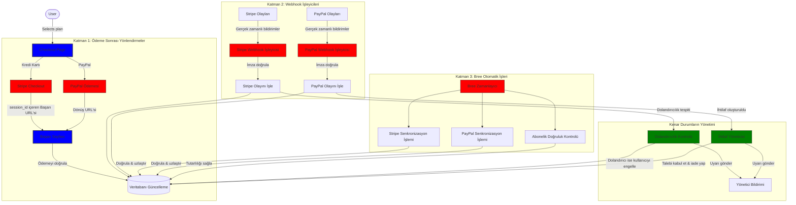
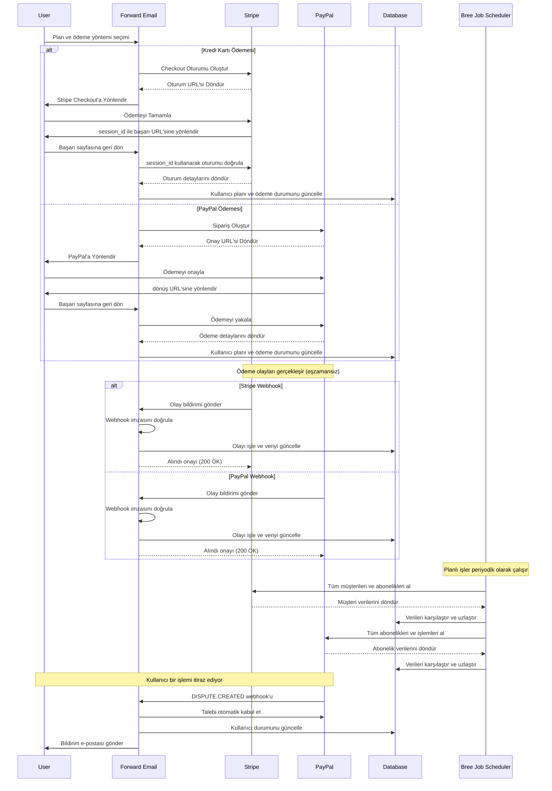
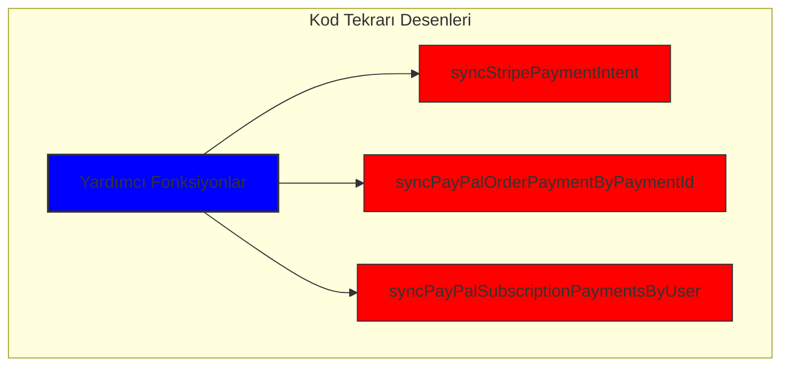
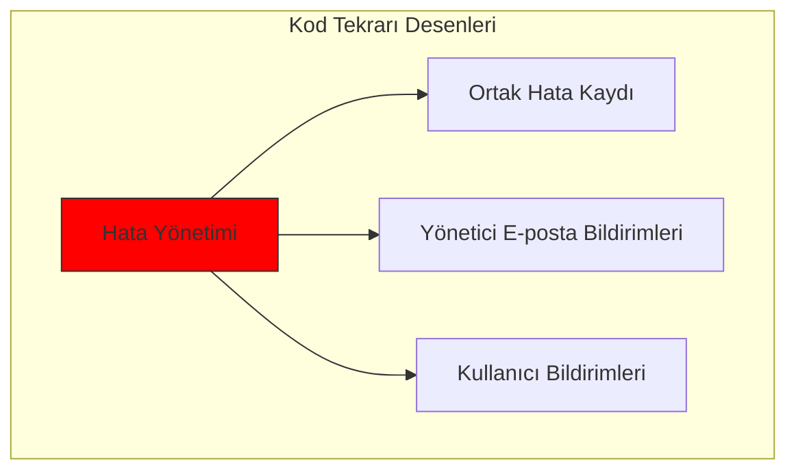
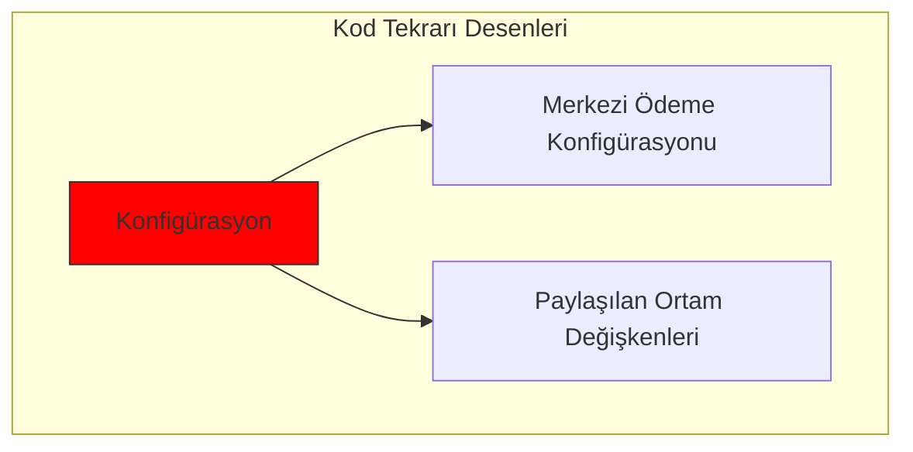
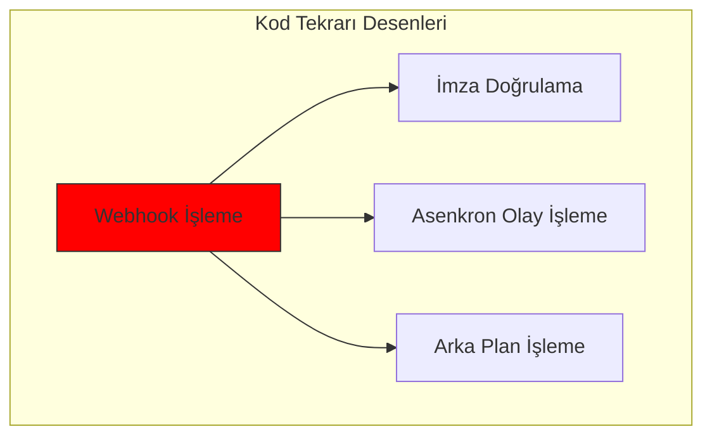
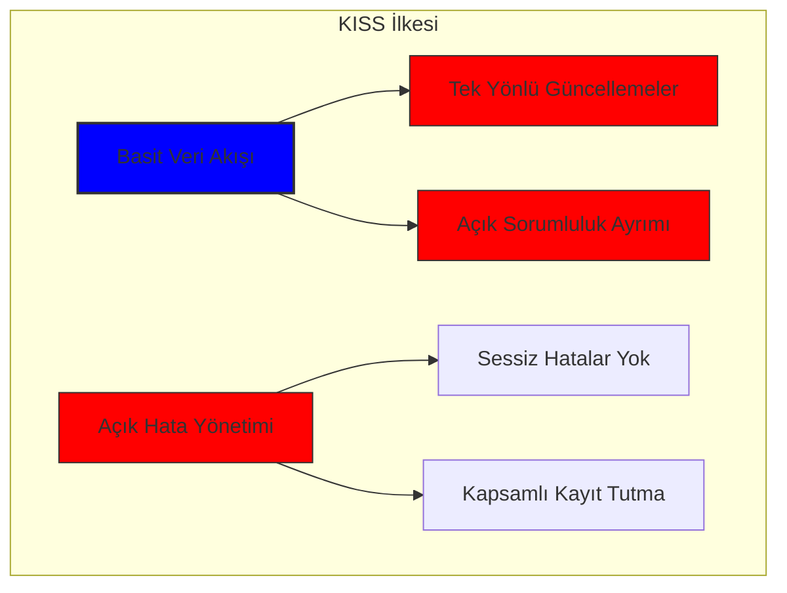

# Stripe ve PayPal ile Güçlü Bir Ödeme Sistemi Nasıl Kurduk: Üçlü Yaklaşım {#how-we-built-a-robust-payment-system-with-stripe-and-paypal-a-trifecta-approach}


## İçindekiler {#table-of-contents}

* [Önsöz](#foreword)
* [Zorluk: Birden Fazla Ödeme İşleyicisi, Tek Doğru Kaynak](#the-challenge-multiple-payment-processors-one-source-of-truth)
* [Üçlü Yaklaşım: Üç Katmanlı Güvenilirlik](#the-trifecta-approach-three-layers-of-reliability)
* [Katman 1: Ödeme Sonrası Yönlendirmeler](#layer-1-post-checkout-redirects)
  * [Stripe Checkout Uygulaması](#stripe-checkout-implementation)
  * [PayPal Ödeme Akışı](#paypal-payment-flow)
* [Katman 2: İmza Doğrulamalı Webhook İşleyicileri](#layer-2-webhook-handlers-with-signature-verification)
  * [Stripe Webhook Uygulaması](#stripe-webhook-implementation)
  * [PayPal Webhook Uygulaması](#paypal-webhook-implementation)
* [Katman 3: Bree ile Otomatik İşler](#layer-3-automated-jobs-with-bree)
  * [Abonelik Doğruluk Kontrolü](#subscription-accuracy-checker)
  * [PayPal Abonelik Senkronizasyonu](#paypal-subscription-synchronization)
* [Kenar Durumların Yönetimi](#handling-edge-cases)
  * [Dolandırıcılık Tespiti ve Önleme](#fraud-detection-and-prevention)
  * [İhtilaf Yönetimi](#dispute-handling)
* [Kodun Yeniden Kullanımı: KISS ve DRY İlkeleri](#code-reuse-kiss-and-dry-principles)
* [VISA Abonelik Gereksinimleri Uygulaması](#visa-subscription-requirements-implementation)
  * [Otomatik Yenileme Öncesi E-posta Bildirimleri](#automated-pre-renewal-email-notifications)
  * [Kenar Durumların Yönetimi](#handling-edge-cases-1)
  * [Deneme Süreleri ve Abonelik Koşulları](#trial-periods-and-subscription-terms)
* [Sonuç: Üçlü Yaklaşımımızın Faydaları](#conclusion-the-benefits-of-our-trifecta-approach)


## Önsöz {#foreword}

Forward Email olarak, her zaman güvenilir, doğru ve kullanıcı dostu sistemler oluşturmayı önceliklendirdik. Ödeme işleme sistemimizi uygularken, birden fazla ödeme işleyicisini yönetebilen ve mükemmel veri tutarlılığı sağlayan bir çözüme ihtiyacımız olduğunu biliyorduk. Bu blog yazısı, geliştirme ekibimizin Stripe ve PayPal’ı nasıl entegre ettiğini ve tüm sistemimizde 1:1 gerçek zamanlı doğruluk sağlayan üçlü yaklaşımı detaylandırmaktadır.


## Zorluk: Birden Fazla Ödeme İşleyicisi, Tek Doğru Kaynak {#the-challenge-multiple-payment-processors-one-source-of-truth}

Gizliliğe odaklı bir e-posta servisi olarak, kullanıcılarımıza ödeme seçenekleri sunmak istedik. Bazıları Stripe üzerinden kredi kartı ödemelerinin sadeliğini tercih ederken, diğerleri PayPal’ın sağladığı ek ayrım katmanını değerli buluyor. Ancak, birden fazla ödeme işleyicisini desteklemek önemli karmaşıklıklar getiriyor:

1. Farklı ödeme sistemlerinde tutarlı veriyi nasıl sağlarız?
2. İhtilaflar, iadeler veya başarısız ödemeler gibi kenar durumları nasıl yönetiriz?
3. Veritabanımızda tek bir doğru kaynak nasıl korunur?

Çözümümüz, “üçlü yaklaşım” dediğimiz - yedeklilik sağlayan ve ne olursa olsun veri tutarlılığını garanti eden üç katmanlı bir sistem uygulamaktı.


## Üçlü Yaklaşım: Üç Katmanlı Güvenilirlik {#the-trifecta-approach-three-layers-of-reliability}

Ödeme sistemimiz, mükemmel veri senkronizasyonunu sağlamak için birlikte çalışan üç kritik bileşenden oluşur:

1. **Ödeme sonrası yönlendirmeler** - Ödeme bilgilerini hemen ödeme sonrası yakalamak
2. **Webhook işleyicileri** - Ödeme işleyicilerinden gerçek zamanlı olayları işlemek
3. **Otomatik işler** - Ödeme verilerini periyodik olarak doğrulamak ve uzlaştırmak

Her bileşene yakından bakalım ve nasıl birlikte çalıştıklarını görelim.


```mermaid
flowchart TD
    User([User]) --> |Selects plan| Checkout[Checkout Page]

    %% Layer 1: Post-checkout redirects
    subgraph "Katman 1: Ödeme Sonrası Yönlendirmeler"
        Checkout --> |Kredi Kartı| Stripe[Stripe Checkout]
        Checkout --> |PayPal| PayPal[PayPal Ödemesi]

        Stripe --> |session_id içeren Başarı URL'si| SuccessPage[Başarı Sayfası]
        PayPal --> |Dönüş URL'si| SuccessPage

        SuccessPage --> |Ödemeyi doğrula| Database[(Veritabanı Güncelleme)]
    end

    %% Layer 2: Webhooks
    subgraph "Katman 2: Webhook İşleyicileri"
        StripeEvents[Stripe Olayları] --> |Gerçek zamanlı bildirimler| StripeWebhook[Stripe Webhook İşleyicisi]
        PayPalEvents[PayPal Olayları] --> |Gerçek zamanlı bildirimler| PayPalWebhook[PayPal Webhook İşleyicisi]

        StripeWebhook --> |İmza doğrula| ProcessStripeEvent[Stripe Olayını İşle]
        PayPalWebhook --> |İmza doğrula| ProcessPayPalEvent[PayPal Olayını İşle]

        ProcessStripeEvent --> Database
        ProcessPayPalEvent --> Database
    end

    %% Layer 3: Automated jobs
    subgraph "Katman 3: Bree Otomatik İşleri"
        BreeScheduler[Bree Zamanlayıcı] --> StripeSync[Stripe Senkronizasyon İşlemi]
        BreeScheduler --> PayPalSync[PayPal Senkronizasyon İşlemi]
        BreeScheduler --> AccuracyCheck[Abonelik Doğruluk Kontrolü]

        StripeSync --> |Doğrula & uzlaştır| Database
        PayPalSync --> |Doğrula & uzlaştır| Database
        AccuracyCheck --> |Tutarlılığı sağla| Database
    end

    %% Edge cases
    subgraph "Kenar Durumların Yönetimi"
        ProcessStripeEvent --> |Dolandırıcılık tespiti| FraudCheck[Dolandırıcılık Kontrolü]
        ProcessPayPalEvent --> |İhtilaf oluşturuldu| DisputeHandler[İhtilaf Yöneticisi]

        FraudCheck --> |Dolandırıcı ise kullanıcıyı engelle| Database
        DisputeHandler --> |Talebi kabul et & iade yap| Database

        FraudCheck --> |Uyarı gönder| AdminNotification[Yönetici Bildirimi]
        DisputeHandler --> |Uyarı gönder| AdminNotification
    end

    %% Style definitions
    classDef primary fill:blue,stroke:#333,stroke-width:2px;
    classDef secondary fill:red,stroke:#333,stroke-width:1px;
    classDef tertiary fill:green,stroke:#333,stroke-width:1px;

    class Checkout,SuccessPage primary;
    class Stripe,PayPal,StripeWebhook,PayPalWebhook,BreeScheduler secondary;
    class FraudCheck,DisputeHandler tertiary;
```
## Katman 1: Ödeme Sonrası Yönlendirmeler {#layer-1-post-checkout-redirects}

Üçlü yaklaşımımızın ilk katmanı, bir kullanıcı ödemeyi tamamlar tamamlamaz gerçekleşir. Hem Stripe hem de PayPal, kullanıcıları işlem bilgileriyle birlikte sitemize geri yönlendirmek için mekanizmalar sağlar.

### Stripe Checkout Uygulaması {#stripe-checkout-implementation}

Stripe için, sorunsuz bir ödeme deneyimi yaratmak amacıyla Checkout Sessions API'sini kullanıyoruz. Bir kullanıcı bir plan seçip kredi kartıyla ödemeyi tercih ettiğinde, belirli başarı ve iptal URL'leri ile bir Checkout Session oluşturuyoruz:

```javascript
const options = {
  mode: paymentType === 'one-time' ? 'payment' : 'subscription',
  customer: ctx.state.user[config.userFields.stripeCustomerID],
  client_reference_id: reference,
  metadata: {
    plan
  },
  line_items: [
    {
      price,
      quantity: 1,
      description
    }
  ],
  locale: config.STRIPE_LOCALES.has(ctx.locale) ? ctx.locale : 'auto',
  cancel_url: `${config.urls.web}${ctx.path}${
    isMakePayment || isEnableAutoRenew ? '' : `/?plan=${plan}`
  }`,
  success_url: `${config.urls.web}${ctx.path}/?${
    isMakePayment || isEnableAutoRenew ? '' : `plan=${plan}&`
  }session_id={CHECKOUT_SESSION_ID}`,
  allow_promotion_codes: true
};

// Checkout oturumunu oluştur ve yönlendir
const session = await stripe.checkout.sessions.create(options);
const redirectTo = session.url;
if (ctx.accepts('html')) {
  ctx.status = 303;
  ctx.redirect(redirectTo);
} else {
  ctx.body = { redirectTo };
}
```

Buradaki kritik kısım, `success_url` parametresidir; bu parametre, sorgu parametresi olarak `session_id` içerir. Stripe, başarılı bir ödeme sonrası kullanıcıyı sitemize geri yönlendirdiğinde, bu oturum ID'sini kullanarak işlemi doğrulayabilir ve veritabanımızı buna göre güncelleyebiliriz.

### PayPal Ödeme Akışı {#paypal-payment-flow}

PayPal için, benzer bir yaklaşımı Orders API ile kullanıyoruz:

```javascript
const requestBody = {
  intent: 'CAPTURE',
  application_context: {
    cancel_url: `${config.urls.web}${ctx.path}${
      isMakePayment || isEnableAutoRenew ? '' : `/?plan=${plan}`
    }`,
    return_url: `${config.urls.web}${ctx.path}/?plan=${plan}`,
    brand_name: 'Forward Email',
    shipping_preference: 'NO_SHIPPING',
    user_action: 'PAY_NOW'
  },
  payer: {
    email_address: ctx.state.user.email
  },
  purchase_units: [
    {
      reference_id: ctx.state.user.id,
      description,
      custom_id: sku,
      invoice_id: reference,
      soft_descriptor: sku,
      amount: {
        currency_code: 'USD',
        value: price,
        breakdown: {
          item_total: {
            currency_code: 'USD',
            value: price
          }
        }
      },
      items: [
        {
          name,
          description,
          sku,
          unit_amount: {
            currency_code: 'USD',
            value: price
          },
          quantity: '1',
          category: 'DIGITAL_GOODS'
        }
      ]
    }
  ]
};
```

Stripe'da olduğu gibi, ödeme sonrası yönlendirmeleri yönetmek için `return_url` ve `cancel_url` parametrelerini belirtiyoruz. PayPal kullanıcıyı sitemize geri yönlendirdiğinde, ödeme detaylarını yakalayıp veritabanımızı güncelleyebiliriz.


```mermaid
sequenceDiagram
    participant User
    participant FE as Forward Email
    participant Stripe
    participant PayPal
    participant DB as Database
    participant Bree as Bree Job Scheduler

    %% İlk ödeme akışı
    User->>FE: Plan ve ödeme yöntemi seçimi

    alt Kredi Kartı Ödemesi
        FE->>Stripe: Checkout Oturumu Oluştur
        Stripe-->>FE: Oturum URL'si Döndür
        FE->>User: Stripe Checkout'a Yönlendir
        User->>Stripe: Ödemeyi Tamamla
        Stripe->>User: session_id ile başarı URL'sine yönlendir
        User->>FE: Başarı sayfasına geri dön
        FE->>Stripe: session_id kullanarak oturumu doğrula
        Stripe-->>FE: Oturum detaylarını döndür
        FE->>DB: Kullanıcı planı ve ödeme durumunu güncelle
    else PayPal Ödemesi
        FE->>PayPal: Sipariş Oluştur
        PayPal-->>FE: Onay URL'si Döndür
        FE->>User: PayPal'a Yönlendir
        User->>PayPal: Ödemeyi onayla
        PayPal->>User: dönüş URL'sine yönlendir
        User->>FE: Başarı sayfasına geri dön
        FE->>PayPal: Ödemeyi yakala
        PayPal-->>FE: Ödeme detaylarını döndür
        FE->>DB: Kullanıcı planı ve ödeme durumunu güncelle
    end

    %% Webhook akışı (eşzamansız)
    Note over Stripe,PayPal: Ödeme olayları gerçekleşir (eşzamansız)

    alt Stripe Webhook
        Stripe->>FE: Olay bildirimi gönder
        FE->>FE: Webhook imzasını doğrula
        FE->>DB: Olayı işle ve veriyi güncelle
        FE-->>Stripe: Alındı onayı (200 OK)
    else PayPal Webhook
        PayPal->>FE: Olay bildirimi gönder
        FE->>FE: Webhook imzasını doğrula
        FE->>DB: Olayı işle ve veriyi güncelle
        FE-->>PayPal: Alındı onayı (200 OK)
    end

    %% Bree otomatik işleri
    Note over Bree: Planlı işler periyodik olarak çalışır

    Bree->>Stripe: Tüm müşterileri ve abonelikleri al
    Stripe-->>Bree: Müşteri verilerini döndür
    Bree->>DB: Verileri karşılaştır ve uzlaştır

    Bree->>PayPal: Tüm abonelikleri ve işlemleri al
    PayPal-->>Bree: Abonelik verilerini döndür
    Bree->>DB: Verileri karşılaştır ve uzlaştır

    %% Kenar durum: İtiraz yönetimi
    Note over User,PayPal: Kullanıcı bir işlemi itiraz ediyor

    PayPal->>FE: DISPUTE.CREATED webhook'u
    FE->>PayPal: Talebi otomatik kabul et
    FE->>DB: Kullanıcı durumunu güncelle
    FE->>User: Bildirim e-postası gönder
```
## Katman 2: İmza Doğrulamalı Webhook İşleyicileri {#layer-2-webhook-handlers-with-signature-verification}

Post-checkout yönlendirmeleri çoğu senaryo için iyi çalışsa da, kusursuz değildir. Kullanıcılar yönlendirilmeden önce tarayıcılarını kapatabilir veya ağ sorunları yönlendirmenin tamamlanmasını engelleyebilir. İşte burada webhooklar devreye girer.

Hem Stripe hem de PayPal, ödeme olayları hakkında gerçek zamanlı bildirimler gönderen webhook sistemleri sağlar. Bu bildirimlerin doğruluğunu doğrulayan ve bunları uygun şekilde işleyen sağlam webhook işleyicileri uyguladık.

### Stripe Webhook Uygulaması {#stripe-webhook-implementation}

Stripe webhook işleyicimiz, gelen webhook olaylarının imzasını doğrulayarak bunların meşru olduğunu garanti eder:

```javascript
async function webhook(ctx) {
  const sig = ctx.request.get('stripe-signature');
  // bir sorun varsa hata fırlat
  if (!isSANB(sig))
    throw Boom.badRequest(ctx.translateError('INVALID_STRIPE_SIGNATURE'));
  const event = stripe.webhooks.constructEvent(
    ctx.request.rawBody,
    sig,
    env.STRIPE_ENDPOINT_SECRET
  );
  // bir sorun varsa hata fırlat
  if (!event)
    throw Boom.badRequest(ctx.translateError('INVALID_STRIPE_SIGNATURE'));
  ctx.logger.info('stripe webhook', { event });
  // olayı aldığımızı onaylamak için yanıt döndür
  ctx.body = { received: true };
  // arka planda çalıştır
  processEvent(ctx, event)
    .then()
    .catch((err) => {
      ctx.logger.fatal(err, { event });
      // yöneticiye hata e-postası gönder
      emailHelper({
        template: 'alert',
        message: {
          to: config.email.message.from,
          subject: `Stripe Webhook Hatası (Olay ID ${event.id})`
        },
        locals: {
          message: `<pre><code>${safeStringify(
            parseErr(err),
            null,
            2
          )}</code></pre>`
        }
      })
        .then()
        .catch((err) => ctx.logger.fatal(err, { event }));
    });
}
```

`stripe.webhooks.constructEvent` fonksiyonu, uç nokta sırrımızı kullanarak imzayı doğrular. İmza geçerliyse, webhook yanıtını engellememek için olayı asenkron olarak işleriz.

### PayPal Webhook Uygulaması {#paypal-webhook-implementation}

Benzer şekilde, PayPal webhook işleyicimiz gelen bildirimlerin doğruluğunu doğrular:

```javascript
async function webhook(ctx) {
  const response = await promisify(
    paypal.notification.webhookEvent.verify,
    paypal.notification.webhookEvent
  )(ctx.request.headers, ctx.request.body, env.PAYPAL_WEBHOOK_ID);
  // bir sorun varsa hata fırlat
  if (!_.isObject(response) || response.verification_status !== 'SUCCESS')
    throw Boom.badRequest(ctx.translateError('INVALID_PAYPAL_SIGNATURE'));
  // olayı aldığımızı onaylamak için yanıt döndür
  ctx.body = { received: true };
  // arka planda çalıştır
  processEvent(ctx)
    .then()
    .catch((err) => {
      ctx.logger.fatal(err);
      // yöneticiye hata e-postası gönder
      emailHelper({
        template: 'alert',
        message: {
          to: config.email.message.from,
          subject: `PayPal Webhook Hatası (Olay ID ${ctx.request.body.id})`
        },
        locals: {
          message: `<pre><code>${safeStringify(
            parseErr(err),
            null,
            2
          )}</code></pre>`
        }
      })
        .then()
        .catch((err) => ctx.logger.fatal(err));
    });
}
```

Her iki webhook işleyicisi de aynı deseni takip eder: imzayı doğrula, alındığını onayla ve olayı asenkron olarak işle. Bu, post-checkout yönlendirmesi başarısız olsa bile hiçbir ödeme olayını kaçırmamamızı sağlar.


## Katman 3: Bree ile Otomatik İşler {#layer-3-automated-jobs-with-bree}

Üçlü yaklaşımımızın son katmanı, ödeme verilerini periyodik olarak doğrulayan ve mutabakat yapan otomatik işlerden oluşur. Bu işleri düzenli aralıklarla çalıştırmak için Node.js için bir iş zamanlayıcısı olan Bree'yi kullanıyoruz.

### Abonelik Doğruluk Denetleyicisi {#subscription-accuracy-checker}

Ana işlerimizden biri olan abonelik doğruluk denetleyicisi, veritabanımızın Stripe'daki abonelik durumunu doğru şekilde yansıttığından emin olur:
```javascript
async function mapper(customer) {
  // wait a second to prevent rate limitation error
  await setTimeout(ms('1s'));
  // check for user on our side
  let user = await Users.findOne({
    [config.userFields.stripeCustomerID]: customer.id
  })
    .lean()
    .exec();
  if (!user) return;
  if (user.is_banned) return;

  // if emails did not match
  if (user.email !== customer.email) {
    logger.info(
      `User email ${user.email} did not match customer email ${customer.email} (${customer.id})`
    );
    customer = await stripe.customers.update(customer.id, {
      email: user.email
    });
    logger.info(`Updated user email to match ${user.email}`);
  }

  // check for active subscriptions
  const [activeSubscriptions, trialingSubscriptions] = await Promise.all([
    stripe.subscriptions.list({
      customer: customer.id,
      status: 'active'
    }),
    stripe.subscriptions.list({
      customer: customer.id,
      status: 'trialing'
    })
  ]);

  // Combine active and trialing subscriptions
  let subscriptions = [
    ...activeSubscriptions.data,
    ...trialingSubscriptions.data
  ];

  // Handle edge case: multiple subscriptions for one user
  if (subscriptions.length > 1) {
    await logger.error(
      new Error(
        `We may need to refund: User had multiple subscriptions ${user.email} (${customer.id})`
      )
    );
    await emailHelper({
      template: 'alert',
      message: {
        to: config.email.message.from,
        subject: `User had multiple subscriptions ${user.email}`
      },
      locals: {
        message: `User ${user.email} (${customer.id}) had multiple subscriptions: ${JSON.stringify(
          subscriptions.map((s) => s.id)
        )}`
      }
    });
  }
}
```

This job checks for discrepancies between our database and Stripe, such as mismatched email addresses or multiple active subscriptions. If it finds any issues, it logs them and sends alerts to our admin team.

### PayPal Subscription Synchronization {#paypal-subscription-synchronization}

We have a similar job for PayPal subscriptions:

```javascript
async function syncPayPalSubscriptionPayments() {
  const paypalCustomers = await Users.find({
    $or: [
      {
        [config.userFields.paypalSubscriptionID]: { $exists: true, $ne: null }
      },
      {
        [config.userFields.paypalPayerID]: { $exists: true, $ne: null }
      }
    ]
  })
    // sort by newest customers first
    .sort('-created_at')
    .lean()
    .exec();

  await logger.info(
    `Syncing payments for ${paypalCustomers.length} paypal customers`
  );

  // Process each customer and sync their payments
  const errorEmails = await pReduce(
    paypalCustomers,
    // Implementation details...
  );
}
```

These automated jobs serve as our final safety net, ensuring that our database always reflects the true state of subscriptions and payments in both Stripe and PayPal.


## Handling Edge Cases {#handling-edge-cases}

A robust payment system must handle edge cases gracefully. Let's look at how we handle some common scenarios.

### Fraud Detection and Prevention {#fraud-detection-and-prevention}

We've implemented sophisticated fraud detection mechanisms that automatically identify and handle suspicious payment activities:

```javascript
case 'charge.failed': {
  // Get all failed charges in the last 30 days
  const charges = await stripe.charges.list({
    customer: event.data.object.customer,
    created: {
      gte: dayjs().subtract(1, 'month').unix()
    }
  });

  // Filter for declined charges
  const filtered = charges.data.filter(
    (d) => d.status === 'failed' && d.failure_code === 'card_declined'
  );

  // if not more than 5 then return early
  if (filtered.length < 5) break;

  // Check if user has verified domains
  const count = await Domains.countDocuments({
    members: {
      $elemMatch: {
        user: user._id,
        group: 'admin'
      }
    },
    plan: { $in: ['enhanced_protection', 'team'] },
    has_txt_record: true
  });

  if (!user.is_banned) {
    // If no verified domains, ban the user and refund all charges
    if (count === 0) {
      // Ban the user
      user.is_banned = true;
      await user.save();

      // Refund all successful charges
    }
  }
}
```

Bu kod, birden fazla başarısız ödeme girişimi olan ve doğrulanmış alan adı bulunmayan kullanıcıları otomatik olarak engeller; bu, dolandırıcılık faaliyetlerinin güçlü bir göstergesidir.

### İtiraz İşleme {#dispute-handling}

Bir kullanıcı bir ödemeye itiraz ettiğinde, talebi otomatik olarak kabul eder ve uygun işlemi yaparız:

```javascript
case 'CUSTOMER.DISPUTE.CREATED': {
  // talebi kabul et
  const agent = await paypalAgent();
  await agent
    .post(`/v1/customer/disputes/${body.resource.dispute_id}/accept-claim`)
    .send({
      note: 'Müşteriye tam geri ödeme.'
    });

  // Ödemeyi veritabanımızda bul
  const payment = await Payments.findOne({ $or });
  if (!payment) throw new Error('Ödeme mevcut değil');

  const user = await Users.findById(payment.user);
  if (!user) throw new Error('Müşteri için kullanıcı mevcut değildi');

  // Kullanıcının aboneliği varsa iptal et
  if (isSANB(user[config.userFields.paypalSubscriptionID])) {
    try {
      const agent = await paypalAgent();
      await agent.post(
        `/v1/billing/subscriptions/${
          user[config.userFields.paypalSubscriptionID]
        }/cancel`
      );
    } catch (err) {
      // Abonelik iptali hatalarını yönet
    }
  }
}
```

Bu yaklaşım, itirazların işimize etkisini en aza indirirken iyi bir müşteri deneyimi sağlar.


## Kod Tekrarı: KISS ve DRY İlkeleri {#code-reuse-kiss-and-dry-principles}

Ödeme sistemimiz boyunca, KISS (Keep It Simple, Stupid - Basit Tut, Aptal) ve DRY (Don't Repeat Yourself - Kendini Tekrarlama) ilkelerine bağlı kaldık. İşte bazı örnekler:

1. **Paylaşılan Yardımcı Fonksiyonlar**: Ödemeleri senkronize etmek ve e-posta göndermek gibi yaygın görevler için yeniden kullanılabilir yardımcı fonksiyonlar oluşturduk.

2. **Tutarlı Hata Yönetimi**: Hem Stripe hem de PayPal webhook işleyicileri, hata yönetimi ve yönetici bildirimleri için aynı deseni kullanır.

3. **Birleşik Veritabanı Şeması**: Veritabanı şemamız, ödeme durumu, tutar ve plan bilgisi gibi ortak alanlarla hem Stripe hem de PayPal verilerini barındıracak şekilde tasarlanmıştır.

4. **Merkezi Konfigürasyon**: Ödeme ile ilgili konfigürasyon tek bir dosyada toplanmıştır, böylece fiyatlandırma ve ürün bilgilerini güncellemek kolaydır.


```mermaid
graph TD
    subgraph "Kod Tekrarı Desenleri"
        A[Yardımcı Fonksiyonlar] --> B[syncStripePaymentIntent]
        A --> C[syncPayPalOrderPaymentByPaymentId]
        A --> D[syncPayPalSubscriptionPaymentsByUser]
    end

    classDef primary fill:blue,stroke:#333,stroke-width:2px;
    classDef secondary fill:red,stroke:#333,stroke-width:1px;

    class A,P,V primary;
    class B,C,D,E,I,L,Q,R,S,W,X,Y,Z secondary;
```


```mermaid
graph TD
    subgraph "Kod Tekrarı Desenleri"
        E[Hata Yönetimi] --> F[Ortak Hata Kaydı]
        E --> G[Yönetici E-posta Bildirimleri]
        E --> H[Kullanıcı Bildirimleri]
    end

    classDef primary fill:blue,stroke:#333,stroke-width:2px;
    classDef secondary fill:red,stroke:#333,stroke-width:1px;

    class A,P,V primary;
    class B,C,D,E,I,L,Q,R,S,W,X,Y,Z secondary;
```


```mermaid
graph TD
    subgraph "Kod Tekrarı Desenleri"
        I[Konfigürasyon] --> J[Merkezi Ödeme Konfigürasyonu]
        I --> K[Paylaşılan Ortam Değişkenleri]
    end

    classDef primary fill:blue,stroke:#333,stroke-width:2px;
    classDef secondary fill:red,stroke:#333,stroke-width:1px;

    class A,P,V primary;
    class B,C,D,E,I,L,Q,R,S,W,X,Y,Z secondary;
```


```mermaid
graph TD
    subgraph "Kod Tekrarı Desenleri"
        L[Webhook İşleme] --> M[İmza Doğrulama]
        L --> N[Asenkron Olay İşleme]
        L --> O[Arka Plan İşleme]
    end

    classDef primary fill:blue,stroke:#333,stroke-width:2px;
    classDef secondary fill:red,stroke:#333,stroke-width:1px;

    class A,P,V primary;
    class B,C,D,E,I,L,Q,R,S,W,X,Y,Z secondary;
```


```mermaid
graph TD
    subgraph "KISS İlkesi"
        P[Basit Veri Akışı] --> Q[Tek Yönlü Güncellemeler]
        P --> R[Açık Sorumluluk Ayrımı]

        S[Açık Hata Yönetimi] --> T[Sessiz Hatalar Yok]
        S --> U[Kapsamlı Kayıt Tutma]
    end

    classDef primary fill:blue,stroke:#333,stroke-width:2px;
    classDef secondary fill:red,stroke:#333,stroke-width:1px;

    class A,P,V primary;
    class B,C,D,E,I,L,Q,R,S,W,X,Y,Z secondary;
```
graph TD
    subgraph "DRY Prensibi"
        V[Paylaşılan Mantık] --> W[Ödeme İşleme Fonksiyonları]
        V --> X[E-posta Şablonları]
        V --> Y[Doğrulama Mantığı]

        Z[Ortak Veritabanı İşlemleri] --> AA[Kullanıcı Güncellemeleri]
        Z --> AB[Ödeme Kaydı]
    end

    classDef primary fill:blue,stroke:#333,stroke-width:2px;
    classDef secondary fill:red,stroke:#333,stroke-width:1px;

    class A,P,V primary;
    class B,C,D,E,I,L,Q,R,S,W,X,Y,Z secondary;
```


## VISA Abonelik Gereksinimleri Uygulaması {#visa-subscription-requirements-implementation}

Üçlü yaklaşımımıza ek olarak, VISA'nın abonelik gereksinimlerine uyum sağlamak ve kullanıcı deneyimini geliştirmek için belirli özellikler uyguladık. VISA'nın önemli bir gereksinimi, kullanıcıların abonelik için ücretlendirilmeden önce, özellikle deneme sürümünden ücretli aboneliğe geçerken, bilgilendirilmesidir.

### Otomatik Ön-Yenileme E-posta Bildirimleri {#automated-pre-renewal-email-notifications}

Aktif deneme aboneliği olan kullanıcıları tespit eden ve ilk ücretlendirme gerçekleşmeden önce onlara bildirim e-postası gönderen otomatik bir sistem kurduk. Bu, sadece VISA gereksinimlerine uyum sağlamamıza yardımcı olmakla kalmaz, aynı zamanda geri ödeme taleplerini azaltır ve müşteri memnuniyetini artırır.

Bu özelliği şöyle uyguladık:

```javascript
// Bildirim almamış deneme aboneliği olan kullanıcıları bul
const users = await Users.find({
  $or: [
    {
      $and: [
        { [config.userFields.stripeSubscriptionID]: { $exists: true } },
        { [config.userFields.stripeTrialSentAt]: { $exists: false } },
        // Zaten ödeme yapılmış abonelikleri hariç tut
        ...(paidStripeSubscriptionIds.length > 0
          ? [
              {
                [config.userFields.stripeSubscriptionID]: {
                  $nin: paidStripeSubscriptionIds
                }
              }
            ]
          : [])
      ]
    },
    {
      $and: [
        { [config.userFields.paypalSubscriptionID]: { $exists: true } },
        { [config.userFields.paypalTrialSentAt]: { $exists: false } },
        // Zaten ödeme yapılmış abonelikleri hariç tut
        ...(paidPayPalSubscriptionIds.length > 0
          ? [
              {
                [config.userFields.paypalSubscriptionID]: {
                  $nin: paidPayPalSubscriptionIds
                }
              }
            ]
          : [])
      ]
    }
  ]
});

// Her kullanıcı için işlemleri yap ve bildirim gönder
for (const user of users) {
  // Ödeme işlemcisinden abonelik detaylarını al
  const subscription = await getSubscriptionDetails(user);

  // Abonelik süresi ve sıklığını hesapla
  const duration = getDurationFromPlanId(subscription.plan_id);
  const frequency = getHumanReadableFrequency(duration, user.locale);
  const amount = getPlanAmount(user.plan, duration);

  // Kişiselleştirilmiş e-posta için kullanıcının alan adlarını al
  const domains = await Domains.find({
    'members.user': user._id
  }).sort('name').lean().exec();

  // VISA uyumlu bildirim e-postası gönder
  await emailHelper({
    template: 'visa-trial-subscription-requirement',
    message: {
      to: user.receipt_email || user.email,
      ...(user.receipt_email ? { cc: user.email } : {})
    },
    locals: {
      user,
      firstChargeDate: new Date(subscription.start_time),
      frequency,
      formattedAmount: numeral(amount).format('$0,0,0.00'),
      domains
    }
  });

  // Bildirimin gönderildiğini kaydet
  await Users.findByIdAndUpdate(user._id, {
    $set: {
      [config.userFields.paypalTrialSentAt]: new Date()
    }
  });
}
```

Bu uygulama, kullanıcıların yaklaşan ücretlendirmeler hakkında her zaman bilgilendirilmelerini sağlar ve açıkça şunları içerir:

1. İlk ücretlendirme ne zaman gerçekleşecek
2. Gelecekteki ücretlendirmelerin sıklığı (aylık, yıllık vb.)
3. Ücretlendirilecek kesin tutar
4. Abonelik kapsamındaki alan adları

Bu süreci otomatikleştirerek, VISA'nın gerektirdiği (ücretlendirmeden en az 7 gün önce bildirim yapılması zorunluluğu) tam uyumu sağlarken, destek taleplerini azaltır ve genel kullanıcı deneyimini iyileştiririz.
### Kenar Durumların Yönetimi {#handling-edge-cases-1}

Uygulamamız ayrıca sağlam hata yönetimini de içerir. Bildirim sürecinde herhangi bir sorun oluşursa, sistemimiz otomatik olarak ekibimizi uyarır:

```javascript
try {
  await mapper(user);
} catch (err) {
  logger.error(err);

  // Yöneticilere uyarı gönder
  await emailHelper({
    template: 'alert',
    message: {
      to: config.email.message.from,
      subject: 'VISA Deneme Aboneliği Gereksinim Hatası'
    },
    locals: {
      message: `<pre><code>${safeStringify(
        parseErr(err),
        null,
        2
      )}</code></pre>`
    }
  });
}
```

Bu, bildirim sisteminde bir sorun olsa bile ekibimizin hızlıca müdahale edip VISA'nın gereksinimlerine uyumu sürdürebilmesini sağlar.

VISA abonelik bildirim sistemi, ödeme altyapımızı hem uyumluluk hem de kullanıcı deneyimi göz önünde bulundurarak nasıl inşa ettiğimizin bir diğer örneğidir. Güvenilir, şeffaf ödeme işlemi sağlamak için üçlü yaklaşımımızı tamamlar.

### Deneme Süreleri ve Abonelik Şartları {#trial-periods-and-subscription-terms}

Mevcut planlarda otomatik yenilemeyi etkinleştiren kullanıcılar için, mevcut planları sona erene kadar ücretlendirilmemelerini sağlamak amacıyla uygun deneme süresini hesaplıyoruz:

```javascript
if (
  isEnableAutoRenew &&
  dayjs(ctx.state.user[config.userFields.planExpiresAt]).isAfter(
    dayjs()
  )
) {
  const hours = dayjs(
    ctx.state.user[config.userFields.planExpiresAt]
  ).diff(dayjs(), 'hours');

  // Deneme süresi hesaplamasını yönet
}
```

Ayrıca, faturalandırma sıklığı ve iptal politikaları dahil olmak üzere abonelik şartları hakkında net bilgiler sağlıyor ve her abonelikle birlikte doğru takip ve yönetim için detaylı meta veriler ekliyoruz.

## Sonuç: Üçlü Yaklaşımımızın Faydaları {#conclusion-the-benefits-of-our-trifecta-approach}

Ödeme işlemlerinde kullandığımız üçlü yaklaşım birkaç önemli fayda sağlamıştır:

1. **Güvenilirlik**: Üç katmanlı ödeme doğrulaması uygulayarak hiçbir ödemenin kaçırılmamasını veya yanlış işlenmemesini sağlıyoruz.

2. **Doğruluk**: Veritabanımız her zaman Stripe ve PayPal’daki abonelikler ve ödemelerin gerçek durumunu yansıtır.

3. **Esneklik**: Kullanıcılar tercih ettikleri ödeme yöntemini sistemimizin güvenilirliğinden ödün vermeden seçebilirler.

4. **Dayanıklılık**: Sistemimiz, ağ hatalarından dolandırıcılık faaliyetlerine kadar kenar durumları sorunsuz yönetir.

Birden fazla ödeme işlemcisini destekleyen bir ödeme sistemi uyguluyorsanız, bu üçlü yaklaşımı şiddetle tavsiye ederiz. Başlangıçta daha fazla geliştirme çabası gerektirir, ancak uzun vadede güvenilirlik ve doğruluk açısından sağladığı faydalar buna değerdir.

Forward Email ve gizlilik odaklı e-posta hizmetlerimiz hakkında daha fazla bilgi için [web sitemizi](https://forwardemail.net) ziyaret edin.

<!-- *Anahtar kelimeler: ödeme işlemleri, Stripe entegrasyonu, PayPal entegrasyonu, webhook yönetimi, ödeme senkronizasyonu, abonelik yönetimi, dolandırıcılık önleme, itiraz yönetimi, Node.js ödeme sistemi, çoklu işlemci ödeme sistemi, ödeme geçidi entegrasyonu, gerçek zamanlı ödeme doğrulaması, ödeme verisi tutarlılığı, abonelik faturalandırması, ödeme güvenliği, ödeme otomasyonu, ödeme webhookları, ödeme mutabakatı, ödeme kenar durumları, ödeme hata yönetimi, VISA abonelik gereksinimleri, ön yenileme bildirimleri, abonelik uyumu* -->
