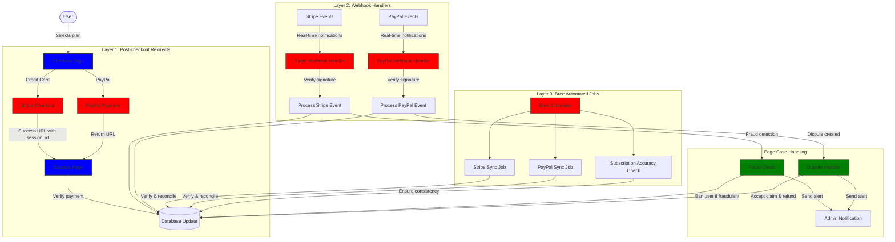
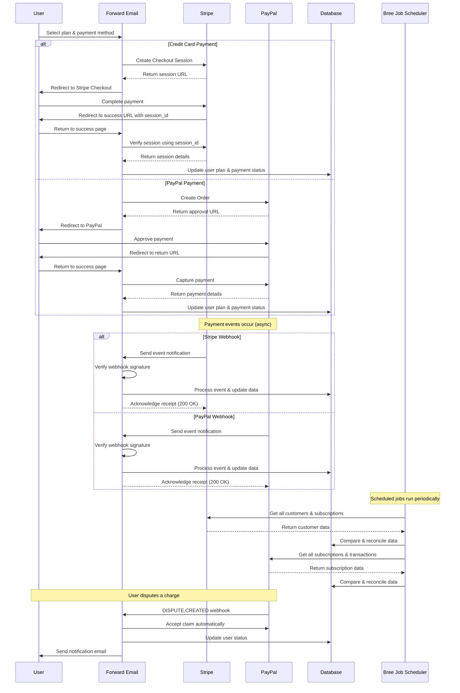
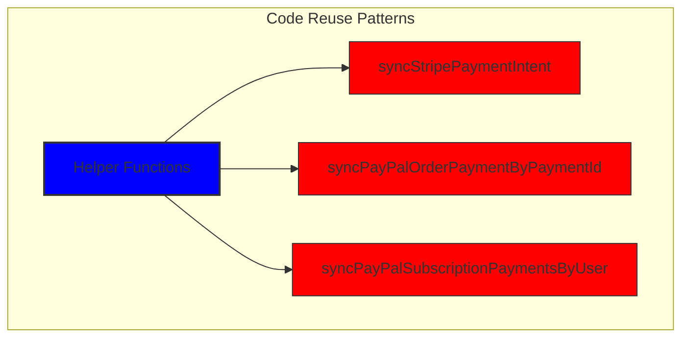
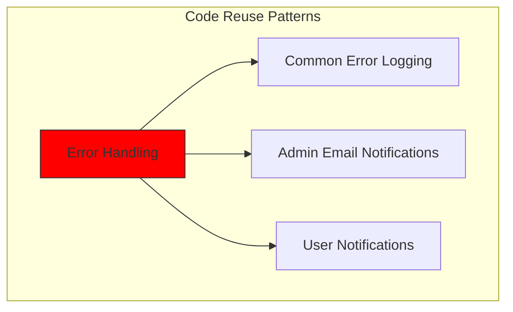
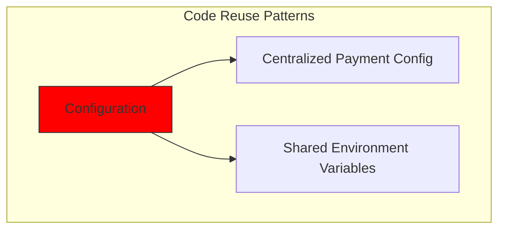
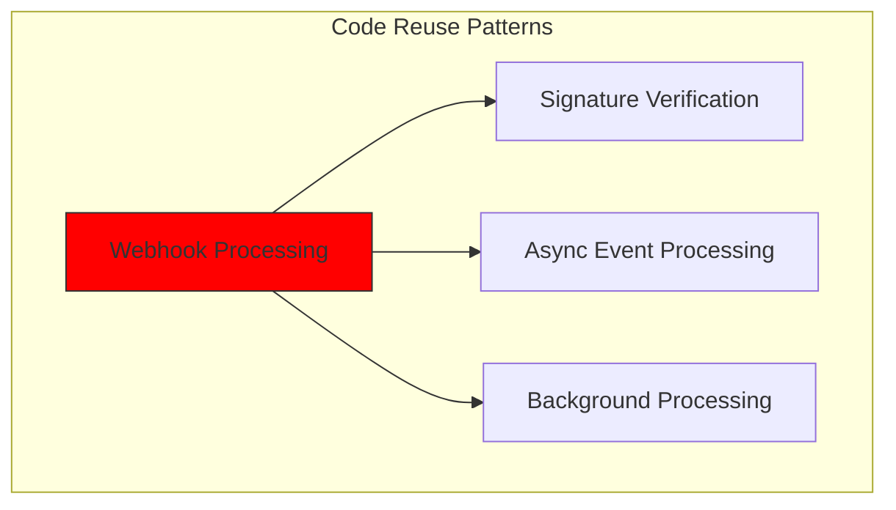
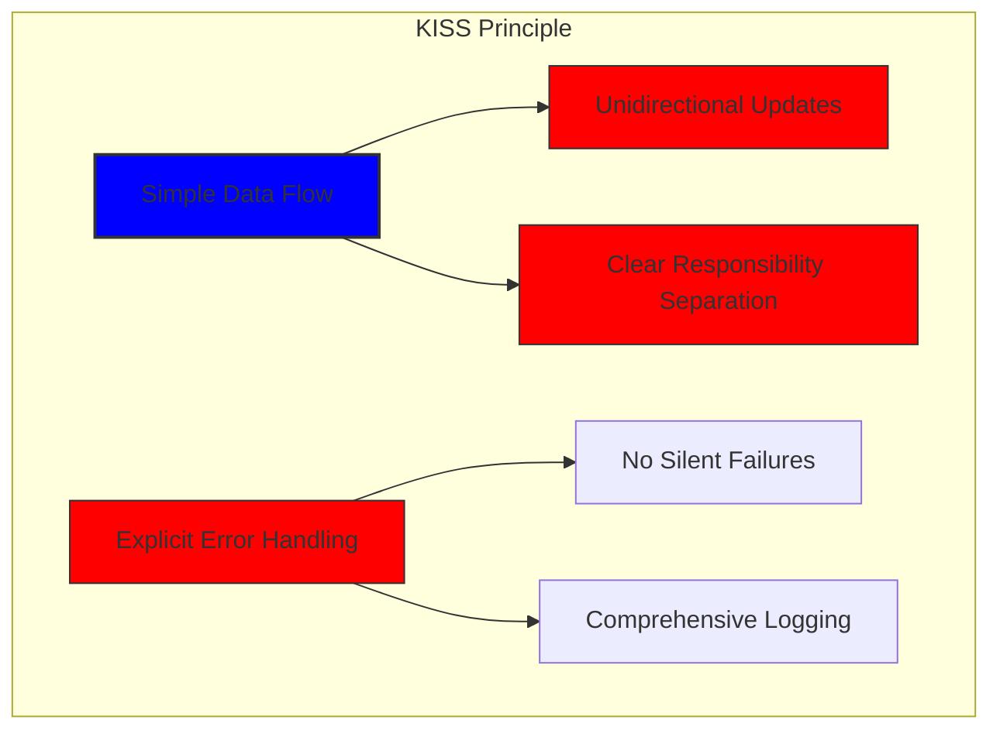
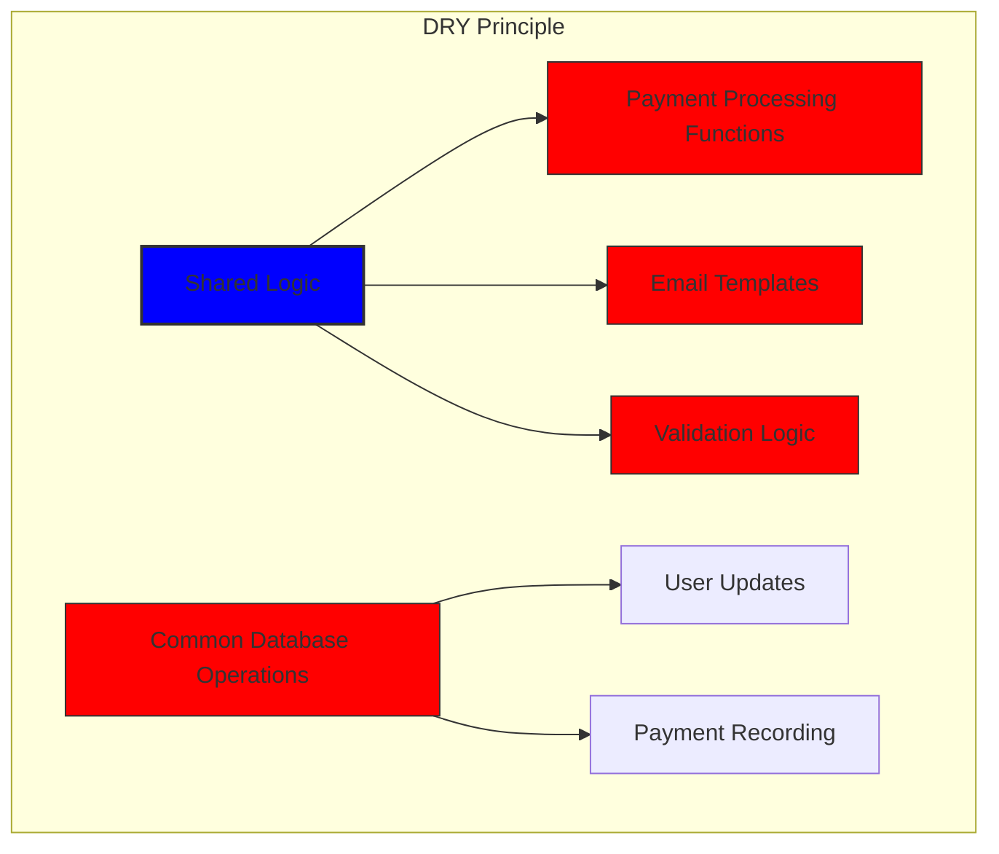

# Як ми створили надійну платіжну систему за допомогою Stripe та PayPal: Потрійний підхід {#how-we-built-a-robust-payment-system-with-stripe-and-paypal-a-trifecta-approach}


## Зміст {#table-of-contents}

* [Передмова](#foreword)
* [Завдання: кілька платіжних процесорів, одне джерело правди](#the-challenge-multiple-payment-processors-one-source-of-truth)
* [Підхід Trifecta: три рівні надійності](#the-trifecta-approach-three-layers-of-reliability)
* [Рівень 1: переспрямування після оформлення замовлення](#layer-1-post-checkout-redirects)
  * [Реалізація Stripe Checkout](#stripe-checkout-implementation)
  * [Потік платежів PayPal](#paypal-payment-flow)
* [Рівень 2: обробники вебхука з перевіркою підпису](#layer-2-webhook-handlers-with-signature-verification)
  * [Впровадження Stripe Webhook](#stripe-webhook-implementation)
  * [Впровадження вебхуку PayPal](#paypal-webhook-implementation)
* [Рівень 3: автоматизовані завдання з Брі](#layer-3-automated-jobs-with-bree)
  * [Перевірка точності підписки](#subscription-accuracy-checker)
  * [Синхронізація підписки PayPal](#paypal-subscription-synchronization)
* [Обробка крайових випадків](#handling-edge-cases)
  * [Виявлення та запобігання шахрайству](#fraud-detection-and-prevention)
  * [Розгляд суперечок](#dispute-handling)
* [Повторне використання коду: принципи KISS і DRY](#code-reuse-kiss-and-dry-principles)
* [Реалізація вимог щодо підписки VISA](#visa-subscription-requirements-implementation)
  * [Автоматичне сповіщення електронною поштою перед поновленням](#automated-pre-renewal-email-notifications)
  * [Обробка крайових випадків](#handling-edge-cases-1)
  * [Пробні періоди та умови передплати](#trial-periods-and-subscription-terms)
* [Висновок: переваги нашого підходу Trifecta](#conclusion-the-benefits-of-our-trifecta-approach)

## Передмова {#foreword}

У Forward Email ми завжди надаємо пріоритет створенню систем, які є надійними, точними та зручними для користувача. Коли справа дійшла до впровадження нашої системи обробки платежів, ми знали, що нам потрібне рішення, яке могло б працювати з декількома платіжними процесорами, зберігаючи ідеальну послідовність даних. У цій публікації блогу детально описано, як наша команда розробників інтегрувала Stripe і PayPal за допомогою підходу trifecta, який забезпечує точність 1:1 у реальному часі в усій нашій системі.

## Виклик: Кілька платіжних систем, одне джерело істини {#the-challenge-multiple-payment-processors-one-source-of-truth}

Як служба електронної пошти, орієнтована на конфіденційність, ми хотіли надати нашим користувачам варіанти оплати. Деякі віддають перевагу простоті платежів кредитною карткою через Stripe, а інші цінують додатковий рівень розділення, який надає PayPal. Однак підтримка кількох платіжних процесорів створює значну складність:

1. Як ми забезпечуємо узгодженість даних у різних платіжних системах?
2. Як ми вирішуємо граничні випадки, такі як суперечки, повернення коштів або невдалі платежі?
3. Як ми підтримуємо єдине джерело достовірної інформації в нашій базі даних?

Нашим рішенням було реалізувати те, що ми називаємо «підходом trifecta» — трирівневою системою, яка забезпечує резервування та узгодженість даних незалежно від того, що відбувається.

## Підхід Trifecta: три рівні надійності {#the-trifecta-approach-three-layers-of-reliability}

Наша платіжна система складається з трьох найважливіших компонентів, які працюють разом, щоб забезпечити ідеальну синхронізацію даних:

1. **Переадресації після оформлення замовлення** – Збір інформації про оплату одразу після оформлення замовлення
2. **Обробники вебхуків** – Обробка подій у режимі реального часу від платіжних процесорів
3. **Автоматизовані завдання** – Періодична перевірка та узгодження даних про оплату

Давайте заглибимося в кожен компонент і подивимося, як вони працюють разом.



## Рівень 1: Перенаправлення після оформлення замовлення {#layer-1-post-checkout-redirects}

Перший рівень нашого підходу trifecta відбувається одразу після здійснення користувачем платежу. І Stripe, і PayPal надають механізми для перенаправлення користувачів назад на наш сайт із інформацією про трансакції.

### Реалізація оформлення замовлення Stripe {#stripe-checkout-implementation}

Для Stripe ми використовуємо їхній API сеансів Checkout, щоб створити безперебійний досвід оплати. Коли користувач вибирає план і вирішує оплатити кредитною карткою, ми створюємо сеанс перевірки з певним успіхом і скасовуємо URL-адреси:

```javascript
const options = {
  mode: paymentType === 'one-time' ? 'payment' : 'subscription',
  customer: ctx.state.user[config.userFields.stripeCustomerID],
  client_reference_id: reference,
  metadata: {
    plan
  },
  line_items: [
    {
      price,
      quantity: 1,
      description
    }
  ],
  locale: config.STRIPE_LOCALES.has(ctx.locale) ? ctx.locale : 'auto',
  cancel_url: `${config.urls.web}${ctx.path}${
    isMakePayment || isEnableAutoRenew ? '' : `/?plan=${plan}`
  }`,
  success_url: `${config.urls.web}${ctx.path}/?${
    isMakePayment || isEnableAutoRenew ? '' : `plan=${plan}&`
  }session_id={CHECKOUT_SESSION_ID}`,
  allow_promotion_codes: true
};

// Create the checkout session and redirect
const session = await stripe.checkout.sessions.create(options);
const redirectTo = session.url;
if (ctx.accepts('html')) {
  ctx.status = 303;
  ctx.redirect(redirectTo);
} else {
  ctx.body = { redirectTo };
}
```

Найважливішою частиною тут є параметр `success_url`, який містить `session_id` як параметр запиту. Коли Stripe перенаправляє користувача назад на наш сайт після успішної оплати, ми можемо використовувати цей ідентифікатор сеансу для перевірки транзакції та відповідного оновлення нашої бази даних.

### Процес оплати PayPal {#paypal-payment-flow}

Для PayPal ми використовуємо подібний підхід із API замовлень:

```javascript
const requestBody = {
  intent: 'CAPTURE',
  application_context: {
    cancel_url: `${config.urls.web}${ctx.path}${
      isMakePayment || isEnableAutoRenew ? '' : `/?plan=${plan}`
    }`,
    return_url: `${config.urls.web}${ctx.path}/?plan=${plan}`,
    brand_name: 'Forward Email',
    shipping_preference: 'NO_SHIPPING',
    user_action: 'PAY_NOW'
  },
  payer: {
    email_address: ctx.state.user.email
  },
  purchase_units: [
    {
      reference_id: ctx.state.user.id,
      description,
      custom_id: sku,
      invoice_id: reference,
      soft_descriptor: sku,
      amount: {
        currency_code: 'USD',
        value: price,
        breakdown: {
          item_total: {
            currency_code: 'USD',
            value: price
          }
        }
      },
      items: [
        {
          name,
          description,
          sku,
          unit_amount: {
            currency_code: 'USD',
            value: price
          },
          quantity: '1',
          category: 'DIGITAL_GOODS'
        }
      ]
    }
  ]
};
```

Подібно до Stripe, ми вказуємо параметри `return_url` та `cancel_url` для обробки переадресацій після оплати. Коли PayPal перенаправляє користувача назад на наш сайт, ми можемо зібрати платіжні дані та оновити нашу базу даних.



## Рівень 2: Обробники вебхуків з перевіркою підпису {#layer-2-webhook-handlers-with-signature-verification}

Хоча переспрямування після оформлення замовлення добре працюють у більшості випадків, вони не є надійними. Користувачі можуть закрити свій веб-переглядач перед перенаправленням або проблеми з мережею можуть перешкодити завершенню перенаправлення. Ось де на допомогу приходять вебхуки.

І Stripe, і PayPal надають системи веб-перехоплення, які надсилають сповіщення про платежі в реальному часі. Ми впровадили надійні обробники вебхуків, які перевіряють автентичність цих сповіщень і обробляють їх відповідно.

### Реалізація вебхука Stripe {#stripe-webhook-implementation}

Наш обробник вебхуку Stripe перевіряє підписи вхідних подій вебхуку, щоб переконатися, що вони законні:

```javascript
async function webhook(ctx) {
  const sig = ctx.request.get('stripe-signature');
  // throw an error if something was wrong
  if (!isSANB(sig))
    throw Boom.badRequest(ctx.translateError('INVALID_STRIPE_SIGNATURE'));
  const event = stripe.webhooks.constructEvent(
    ctx.request.rawBody,
    sig,
    env.STRIPE_ENDPOINT_SECRET
  );
  // throw an error if something was wrong
  if (!event)
    throw Boom.badRequest(ctx.translateError('INVALID_STRIPE_SIGNATURE'));
  ctx.logger.info('stripe webhook', { event });
  // return a response to acknowledge receipt of the event
  ctx.body = { received: true };
  // run in background
  processEvent(ctx, event)
    .then()
    .catch((err) => {
      ctx.logger.fatal(err, { event });
      // email admin errors
      emailHelper({
        template: 'alert',
        message: {
          to: config.email.message.from,
          subject: `Error with Stripe Webhook (Event ID ${event.id})`
        },
        locals: {
          message: `<pre><code>${safeStringify(
            parseErr(err),
            null,
            2
          )}</code></pre>`
        }
      })
        .then()
        .catch((err) => ctx.logger.fatal(err, { event }));
    });
}
```

Функція `stripe.webhooks.constructEvent` перевіряє підпис за допомогою нашого секретного коду кінцевої точки. Якщо підпис дійсний, ми обробляємо подію асинхронно, щоб уникнути блокування відповіді вебхука.

### Реалізація вебхука PayPal {#paypal-webhook-implementation}

Так само наш обробник веб-хуку PayPal перевіряє автентичність вхідних сповіщень:

```javascript
async function webhook(ctx) {
  const response = await promisify(
    paypal.notification.webhookEvent.verify,
    paypal.notification.webhookEvent
  )(ctx.request.headers, ctx.request.body, env.PAYPAL_WEBHOOK_ID);
  // throw an error if something was wrong
  if (!_.isObject(response) || response.verification_status !== 'SUCCESS')
    throw Boom.badRequest(ctx.translateError('INVALID_PAYPAL_SIGNATURE'));
  // return a response to acknowledge receipt of the event
  ctx.body = { received: true };
  // run in background
  processEvent(ctx)
    .then()
    .catch((err) => {
      ctx.logger.fatal(err);
      // email admin errors
      emailHelper({
        template: 'alert',
        message: {
          to: config.email.message.from,
          subject: `Error with PayPal Webhook (Event ID ${ctx.request.body.id})`
        },
        locals: {
          message: `<pre><code>${safeStringify(
            parseErr(err),
            null,
            2
          )}</code></pre>`
        }
      })
        .then()
        .catch((err) => ctx.logger.fatal(err));
    });
}
```

Обидва обробники webhook дотримуються однакового шаблону: перевірка підпису, підтвердження отримання та обробка події асинхронно. Це гарантує, що ми ніколи не пропустимо платіжну подію, навіть якщо перенаправлення після оформлення замовлення не вдасться.

## Рівень 3: Автоматизовані завдання з Bree {#layer-3-automated-jobs-with-bree}

Останнім рівнем нашого підходу trifecta є набір автоматизованих завдань, які періодично перевіряють і звіряють платіжні дані. Ми використовуємо Bree, планувальник завдань для Node.js, щоб виконувати ці завдання через регулярні проміжки часу.

### Перевірка точності підписок {#subscription-accuracy-checker}

Однією з наших ключових завдань є перевірка точності підписки, яка гарантує, що наша база даних точно відображає статус підписки в Stripe:

```javascript
async function mapper(customer) {
  // wait a second to prevent rate limitation error
  await setTimeout(ms('1s'));
  // check for user on our side
  let user = await Users.findOne({
    [config.userFields.stripeCustomerID]: customer.id
  })
    .lean()
    .exec();
  if (!user) return;
  if (user.is_banned) return;

  // if emails did not match
  if (user.email !== customer.email) {
    logger.info(
      `User email ${user.email} did not match customer email ${customer.email} (${customer.id})`
    );
    customer = await stripe.customers.update(customer.id, {
      email: user.email
    });
    logger.info(`Updated user email to match ${user.email}`);
  }

  // check for active subscriptions
  const [activeSubscriptions, trialingSubscriptions] = await Promise.all([
    stripe.subscriptions.list({
      customer: customer.id,
      status: 'active'
    }),
    stripe.subscriptions.list({
      customer: customer.id,
      status: 'trialing'
    })
  ]);

  // Combine active and trialing subscriptions
  let subscriptions = [
    ...activeSubscriptions.data,
    ...trialingSubscriptions.data
  ];

  // Handle edge case: multiple subscriptions for one user
  if (subscriptions.length > 1) {
    await logger.error(
      new Error(
        `We may need to refund: User had multiple subscriptions ${user.email} (${customer.id})`
      )
    );
    await emailHelper({
      template: 'alert',
      message: {
        to: config.email.message.from,
        subject: `User had multiple subscriptions ${user.email}`
      },
      locals: {
        message: `User ${user.email} (${customer.id}) had multiple subscriptions: ${JSON.stringify(
          subscriptions.map((s) => s.id)
        )}`
      }
    });
  }
}
```

Це завдання перевіряє розбіжності між нашою базою даних і Stripe, як-от невідповідність адрес електронної пошти чи кілька активних підписок. Якщо він знаходить будь-які проблеми, він реєструє їх і надсилає сповіщення нашій команді адміністраторів.

### Синхронізація підписки PayPal {#paypal-subscription-synchronization}

У нас є подібна робота для підписок PayPal:

```javascript
async function syncPayPalSubscriptionPayments() {
  const paypalCustomers = await Users.find({
    $or: [
      {
        [config.userFields.paypalSubscriptionID]: { $exists: true, $ne: null }
      },
      {
        [config.userFields.paypalPayerID]: { $exists: true, $ne: null }
      }
    ]
  })
    // sort by newest customers first
    .sort('-created_at')
    .lean()
    .exec();

  await logger.info(
    `Syncing payments for ${paypalCustomers.length} paypal customers`
  );

  // Process each customer and sync their payments
  const errorEmails = await pReduce(
    paypalCustomers,
    // Implementation details...
  );
}
```

Ці автоматизовані завдання служать нашою останньою сіткою безпеки, гарантуючи, що наша база даних завжди відображає справжній стан підписок і платежів як у Stripe, так і в PayPal.

## Обробка пограничних випадків {#handling-edge-cases}

Надійна платіжна система повинна витончено обробляти крайні випадки. Давайте розглянемо, як ми обробляємо деякі типові сценарії.

### Виявлення та запобігання шахрайству {#fraud-detection-and-prevention}

Ми запровадили складні механізми виявлення шахрайства, які автоматично ідентифікують і обробляють підозрілі платежі:

```javascript
case 'charge.failed': {
  // Get all failed charges in the last 30 days
  const charges = await stripe.charges.list({
    customer: event.data.object.customer,
    created: {
      gte: dayjs().subtract(1, 'month').unix()
    }
  });

  // Filter for declined charges
  const filtered = charges.data.filter(
    (d) => d.status === 'failed' && d.failure_code === 'card_declined'
  );

  // if not more than 5 then return early
  if (filtered.length < 5) break;

  // Check if user has verified domains
  const count = await Domains.countDocuments({
    members: {
      $elemMatch: {
        user: user._id,
        group: 'admin'
      }
    },
    plan: { $in: ['enhanced_protection', 'team'] },
    has_txt_record: true
  });

  if (!user.is_banned) {
    // If no verified domains, ban the user and refund all charges
    if (count === 0) {
      // Ban the user
      user.is_banned = true;
      await user.save();

      // Refund all successful charges
    }
  }
}
```

Цей код автоматично блокує користувачів, які мають кілька невдалих платежів і не мають підтверджених доменів, що є серйозним показником шахрайської діяльності.

### Вирішення спорів {#dispute-handling}

Коли користувач оскаржує стягнення плати, ми автоматично приймаємо претензію та вживаємо відповідних заходів:

```javascript
case 'CUSTOMER.DISPUTE.CREATED': {
  // accept claim
  const agent = await paypalAgent();
  await agent
    .post(`/v1/customer/disputes/${body.resource.dispute_id}/accept-claim`)
    .send({
      note: 'Full refund to the customer.'
    });

  // Find the payment in our database
  const payment = await Payments.findOne({ $or });
  if (!payment) throw new Error('Payment does not exist');

  const user = await Users.findById(payment.user);
  if (!user) throw new Error('User did not exist for customer');

  // Cancel the user's subscription if they have one
  if (isSANB(user[config.userFields.paypalSubscriptionID])) {
    try {
      const agent = await paypalAgent();
      await agent.post(
        `/v1/billing/subscriptions/${
          user[config.userFields.paypalSubscriptionID]
        }/cancel`
      );
    } catch (err) {
      // Handle subscription cancellation errors
    }
  }
}
```

Такий підхід мінімізує вплив суперечок на наш бізнес, одночасно забезпечуючи хорошу взаємодію з клієнтами.

## Повторне використання коду: принципи KISS та DRY {#code-reuse-kiss-and-dry-principles}

У нашій платіжній системі ми дотримуємося принципів KISS (Keep It Simple, Stupid) і DRY (Don't Repeat Yourself). Ось кілька прикладів:

1. **Спільні допоміжні функції**: Ми створили допоміжні функції багаторазового використання для поширених завдань, таких як синхронізація платежів та надсилання електронних листів.

2. **Узгоджена обробка помилок**: Обробники вебхуків Stripe та PayPal використовують однаковий шаблон для обробки помилок та сповіщень адміністратора.

3. **Уніфікована схема бази даних**: Наша схема бази даних розроблена для врахування даних Stripe та PayPal, зі спільними полями для статусу платежу, суми та інформації про план.

4. **Централізована конфігурація**: конфігурація, пов’язана з оплатою, централізована в одному файлі, що спрощує оновлення цін та інформації про продукт.













## Впровадження вимог до підписки VISA {#visa-subscription-requirements-implementation}

На додаток до нашого підходу trifecta, ми реалізували спеціальні функції, щоб відповідати вимогам підписки VISA, покращуючи взаємодію з користувачем. Одна з ключових вимог VISA полягає в тому, що користувачі мають бути сповіщені перед стягненням плати за підписку, особливо під час переходу з пробної версії на платну.

### Автоматичні сповіщення електронною поштою про попереднє поновлення {#automated-pre-renewal-email-notifications}

Ми створили автоматизовану систему, яка ідентифікує користувачів із активними пробними підписками та надсилає їм сповіщення електронною поштою до того, як буде стягнено першу плату. Це не тільки забезпечує нашу відповідність вимогам VISA, але й зменшує відкликання платежів і покращує задоволеність клієнтів.

Ось як ми реалізували цю функцію:

```javascript
// Find users with trial subscriptions who haven't received a notification yet
const users = await Users.find({
  $or: [
    {
      $and: [
        { [config.userFields.stripeSubscriptionID]: { $exists: true } },
        { [config.userFields.stripeTrialSentAt]: { $exists: false } },
        // Exclude subscriptions that have already had payments
        ...(paidStripeSubscriptionIds.length > 0
          ? [
              {
                [config.userFields.stripeSubscriptionID]: {
                  $nin: paidStripeSubscriptionIds
                }
              }
            ]
          : [])
      ]
    },
    {
      $and: [
        { [config.userFields.paypalSubscriptionID]: { $exists: true } },
        { [config.userFields.paypalTrialSentAt]: { $exists: false } },
        // Exclude subscriptions that have already had payments
        ...(paidPayPalSubscriptionIds.length > 0
          ? [
              {
                [config.userFields.paypalSubscriptionID]: {
                  $nin: paidPayPalSubscriptionIds
                }
              }
            ]
          : [])
      ]
    }
  ]
});

// Process each user and send notification
for (const user of users) {
  // Get subscription details from payment processor
  const subscription = await getSubscriptionDetails(user);

  // Calculate subscription duration and frequency
  const duration = getDurationFromPlanId(subscription.plan_id);
  const frequency = getHumanReadableFrequency(duration, user.locale);
  const amount = getPlanAmount(user.plan, duration);

  // Get user's domains for personalized email
  const domains = await Domains.find({
    'members.user': user._id
  }).sort('name').lean().exec();

  // Send VISA-compliant notification email
  await emailHelper({
    template: 'visa-trial-subscription-requirement',
    message: {
      to: user.receipt_email || user.email,
      ...(user.receipt_email ? { cc: user.email } : {})
    },
    locals: {
      user,
      firstChargeDate: new Date(subscription.start_time),
      frequency,
      formattedAmount: numeral(amount).format('$0,0,0.00'),
      domains
    }
  });

  // Record that notification was sent
  await Users.findByIdAndUpdate(user._id, {
    $set: {
      [config.userFields.paypalTrialSentAt]: new Date()
    }
  });
}
```

Ця реалізація гарантує, що користувачі завжди будуть поінформовані про майбутні стягнення плати з чіткою інформацією про:

1. Коли відбудеться перше стягнення плати
2. Частота майбутніх стягнень плати (щомісяця, щорічно тощо)
3. Точна сума, яка з них стягуватиметься
4. На які домени поширюється їхня підписка

Автоматизуючи цей процес, ми підтримуємо повну відповідність вимогам VISA (які передбачають сповіщення принаймні за 7 днів до стягнення плати), одночасно зменшуючи кількість запитів у підтримку та покращуючи загальну взаємодію з користувачем.

### Обробка пограничних випадків {#handling-edge-cases-1}

Наша реалізація також включає надійну обробку помилок. Якщо щось піде не так під час процесу сповіщення, наша система автоматично сповістить нашу команду:

```javascript
try {
  await mapper(user);
} catch (err) {
  logger.error(err);

  // Send alert to administrators
  await emailHelper({
    template: 'alert',
    message: {
      to: config.email.message.from,
      subject: 'VISA Trial Subscription Requirement Error'
    },
    locals: {
      message: `<pre><code>${safeStringify(
        parseErr(err),
        null,
        2
      )}</code></pre>`
    }
  });
}
```

Це гарантує, що навіть якщо виникне проблема з системою сповіщень, наша команда зможе швидко її вирішити та підтримувати відповідність вимогам VISA.

Система сповіщень про підписку VISA є ще одним прикладом того, як ми побудували нашу платіжну інфраструктуру з урахуванням як відповідності, так і взаємодії з користувачем, доповнюючи наш підхід trifecta для забезпечення надійної та прозорої обробки платежів.

### Пробні періоди та умови підписки {#trial-periods-and-subscription-terms}

Для користувачів, які ввімкнули автоматичне поновлення в існуючих планах, ми розраховуємо відповідний пробний період, щоб гарантувати, що з них не стягуватиметься плата до закінчення терміну дії поточного плану:

```javascript
if (
  isEnableAutoRenew &&
  dayjs(ctx.state.user[config.userFields.planExpiresAt]).isAfter(
    dayjs()
  )
) {
  const hours = dayjs(
    ctx.state.user[config.userFields.planExpiresAt]
  ).diff(dayjs(), 'hours');

  // Handle trial period calculation
}
```

Ми також надаємо чітку інформацію про умови підписки, включаючи частоту виставлення рахунків і політику скасування, а також включаємо детальні метадані до кожної підписки, щоб забезпечити належне відстеження та керування.

## Висновок: Переваги нашого підходу Trifecta {#conclusion-the-benefits-of-our-trifecta-approach}

Наш підхід trifecta до обробки платежів надав кілька ключових переваг:

1. **Надійність**: Завдяки впровадженню трьох рівнів перевірки платежів ми гарантуємо, що жоден платіж не буде пропущено або неправильно оброблено.

2. **Точність**: Наша база даних завжди відображає справжній стан підписок і платежів як у Stripe, так і в PayPal.

3. **Гнучкість**: Користувачі можуть обрати бажаний спосіб оплати, не ставлячи під загрозу надійність нашої системи.

4. **Надійність**: Наша система плавно обробляє крайні випадки, від збоїв мережі до шахрайської діяльності.

Якщо ви впроваджуєте платіжну систему, яка підтримує кілька процесорів, ми настійно рекомендуємо цей підхід trifecta. Це вимагає більших зусиль на початковому етапі розробки, але довгострокові переваги з точки зору надійності та точності того варті.

Щоб отримати докладнішу інформацію про пересилання електронної пошти та наші послуги електронної пошти, орієнтовані на конфіденційність, відвідайте нашу сторінку [веб-сайт](https://forwardemail.net).

<!-- *Ключові слова: обробка платежів, інтеграція Stripe, інтеграція PayPal, обробка вебхуків, синхронізація платежів, управління підписками, запобігання шахрайству, вирішення суперечок, платіжна система Node.js, багатопроцесорна платіжна система, інтеграція платіжних шлюзів, перевірка платежів у режимі реального часу, узгодженість даних платежів, виставлення рахунків за підписку, безпека платежів, автоматизація платежів, платіжні вебхуки, узгодження платежів, крайні випадки платежів, обробка помилок платежу, вимоги до підписки VISA, сповіщення про попереднє поновлення, відповідність підписки* -->