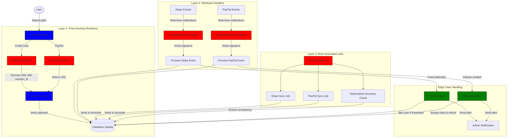
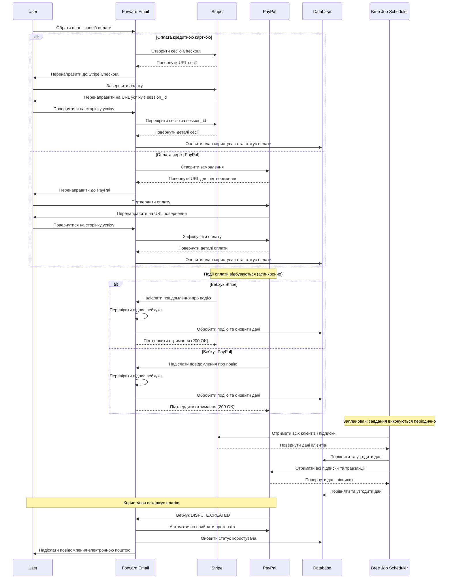
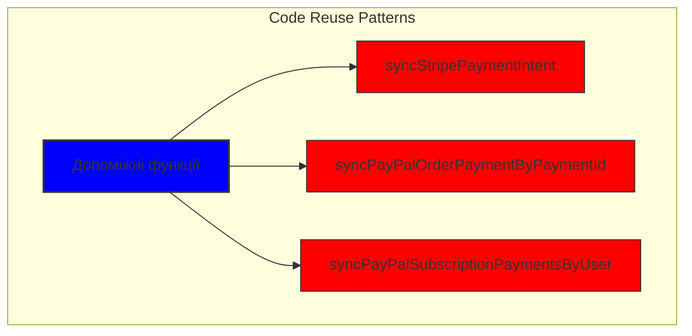
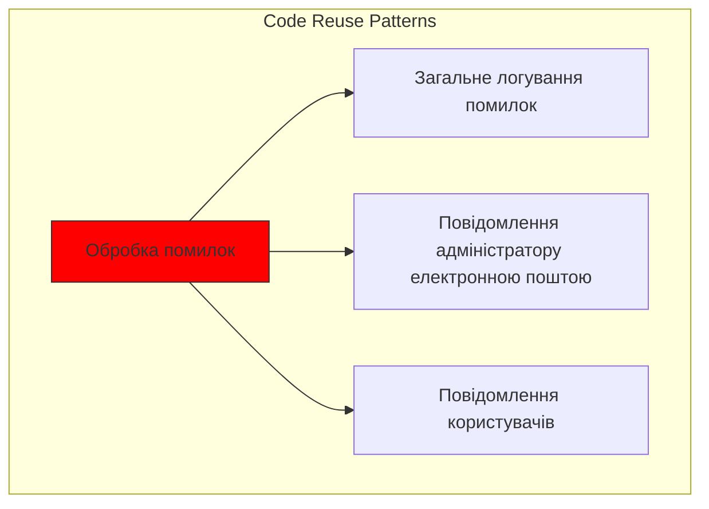
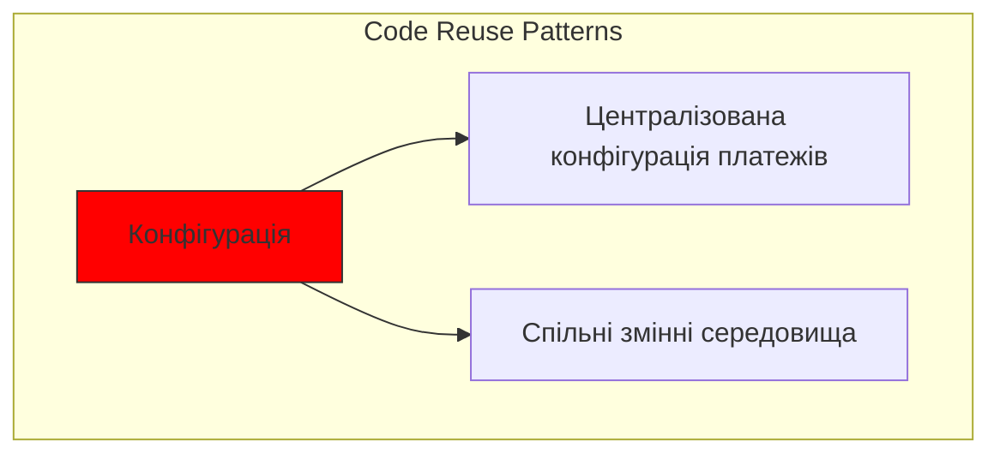
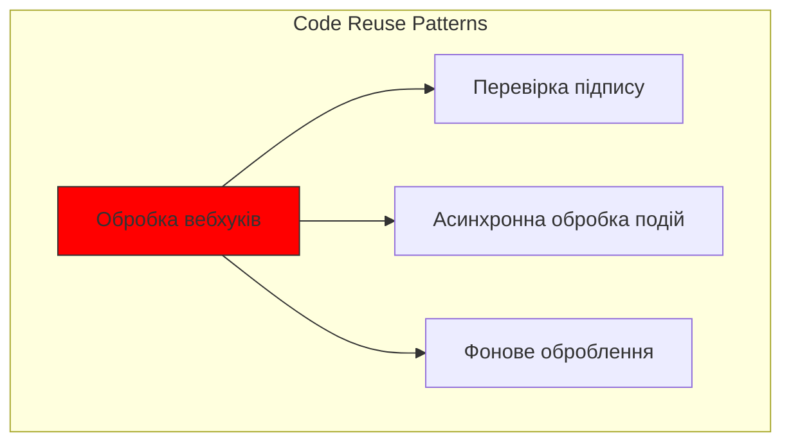
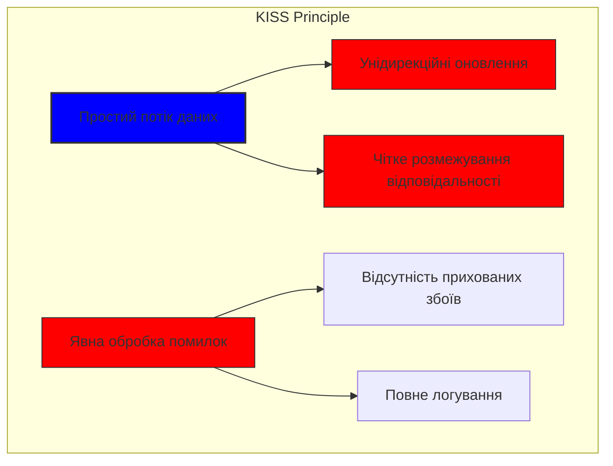

# Як ми побудували надійну платіжну систему з Stripe і PayPal: підхід тріо {#how-we-built-a-robust-payment-system-with-stripe-and-paypal-a-trifecta-approach}


## Зміст {#table-of-contents}

* [Передмова](#foreword)
* [Виклик: кілька платіжних процесорів, одне джерело правди](#the-challenge-multiple-payment-processors-one-source-of-truth)
* [Підхід тріо: три рівні надійності](#the-trifecta-approach-three-layers-of-reliability)
* [Рівень 1: перенаправлення після оформлення замовлення](#layer-1-post-checkout-redirects)
  * [Реалізація Stripe Checkout](#stripe-checkout-implementation)
  * [Платіжний потік PayPal](#paypal-payment-flow)
* [Рівень 2: обробники webhook з перевіркою підпису](#layer-2-webhook-handlers-with-signature-verification)
  * [Реалізація Stripe Webhook](#stripe-webhook-implementation)
  * [Реалізація PayPal Webhook](#paypal-webhook-implementation)
* [Рівень 3: автоматизовані завдання з Bree](#layer-3-automated-jobs-with-bree)
  * [Перевірка точності підписки](#subscription-accuracy-checker)
  * [Синхронізація підписок PayPal](#paypal-subscription-synchronization)
* [Обробка крайніх випадків](#handling-edge-cases)
  * [Виявлення та запобігання шахрайству](#fraud-detection-and-prevention)
  * [Обробка спорів](#dispute-handling)
* [Повторне використання коду: принципи KISS і DRY](#code-reuse-kiss-and-dry-principles)
* [Реалізація вимог підписки VISA](#visa-subscription-requirements-implementation)
  * [Автоматизовані email-повідомлення перед поновленням](#automated-pre-renewal-email-notifications)
  * [Обробка крайніх випадків](#handling-edge-cases-1)
  * [Пробні періоди та умови підписки](#trial-periods-and-subscription-terms)
* [Висновок: переваги нашого підходу тріо](#conclusion-the-benefits-of-our-trifecta-approach)


## Передмова {#foreword}

У Forward Email ми завжди ставили пріоритет на створення систем, які є надійними, точними та зручними для користувачів. Коли настав час впроваджувати нашу платіжну систему, ми знали, що нам потрібне рішення, яке зможе працювати з кількома платіжними процесорами, зберігаючи при цьому ідеальну узгодженість даних. У цьому дописі ми детально розповідаємо, як наша команда розробників інтегрувала Stripe і PayPal, використовуючи підхід тріо, що забезпечує 1:1 точність у реальному часі по всій системі.


## Виклик: кілька платіжних процесорів, одне джерело правди {#the-challenge-multiple-payment-processors-one-source-of-truth}

Як сервіс електронної пошти, орієнтований на конфіденційність, ми хотіли надати нашим користувачам варіанти оплати. Дехто віддає перевагу простоті оплати кредитною карткою через Stripe, інші цінують додатковий рівень відокремлення, який надає PayPal. Однак підтримка кількох платіжних процесорів ускладнює систему:

1. Як забезпечити узгодженість даних між різними платіжними системами?
2. Як обробляти крайні випадки, такі як спори, повернення коштів або невдалі платежі?
3. Як підтримувати єдине джерело правди в нашій базі даних?

Наше рішення — впровадити те, що ми називаємо «підхід тріо» — тришарову систему, яка забезпечує резервування і гарантує узгодженість даних незалежно від обставин.


## Підхід тріо: три рівні надійності {#the-trifecta-approach-three-layers-of-reliability}

Наша платіжна система складається з трьох ключових компонентів, які працюють разом, щоб забезпечити ідеальну синхронізацію даних:

1. **Перенаправлення після оформлення замовлення** — фіксація інформації про платіж одразу після оформлення
2. **Обробники webhook** — обробка подій у реальному часі від платіжних процесорів
3. **Автоматизовані завдання** — періодична перевірка та узгодження платіжних даних

Давайте розглянемо кожен компонент і подивимось, як вони працюють разом.


```mermaid
flowchart TD
    User([User]) --> |Selects plan| Checkout[Checkout Page]

    %% Layer 1: Post-checkout redirects
    subgraph "Layer 1: Post-checkout Redirects"
        Checkout --> |Credit Card| Stripe[Stripe Checkout]
        Checkout --> |PayPal| PayPal[PayPal Payment]

        Stripe --> |Success URL with session_id| SuccessPage[Success Page]
        PayPal --> |Return URL| SuccessPage

        SuccessPage --> |Verify payment| Database[(Database Update)]
    end

    %% Layer 2: Webhooks
    subgraph "Layer 2: Webhook Handlers"
        StripeEvents[Stripe Events] --> |Real-time notifications| StripeWebhook[Stripe Webhook Handler]
        PayPalEvents[PayPal Events] --> |Real-time notifications| PayPalWebhook[PayPal Webhook Handler]

        StripeWebhook --> |Verify signature| ProcessStripeEvent[Process Stripe Event]
        PayPalWebhook --> |Verify signature| ProcessPayPalEvent[Process PayPal Event]

        ProcessStripeEvent --> Database
        ProcessPayPalEvent --> Database
    end

    %% Layer 3: Automated jobs
    subgraph "Layer 3: Bree Automated Jobs"
        BreeScheduler[Bree Scheduler] --> StripeSync[Stripe Sync Job]
        BreeScheduler --> PayPalSync[PayPal Sync Job]
        BreeScheduler --> AccuracyCheck[Subscription Accuracy Check]

        StripeSync --> |Verify & reconcile| Database
        PayPalSync --> |Verify & reconcile| Database
        AccuracyCheck --> |Ensure consistency| Database
    end

    %% Edge cases
    subgraph "Edge Case Handling"
        ProcessStripeEvent --> |Fraud detection| FraudCheck[Fraud Check]
        ProcessPayPalEvent --> |Dispute created| DisputeHandler[Dispute Handler]

        FraudCheck --> |Ban user if fraudulent| Database
        DisputeHandler --> |Accept claim & refund| Database

        FraudCheck --> |Send alert| AdminNotification[Admin Notification]
        DisputeHandler --> |Send alert| AdminNotification
    end

    %% Style definitions
    classDef primary fill:blue,stroke:#333,stroke-width:2px;
    classDef secondary fill:red,stroke:#333,stroke-width:1px;
    classDef tertiary fill:green,stroke:#333,stroke-width:1px;

    class Checkout,SuccessPage primary;
    class Stripe,PayPal,StripeWebhook,PayPalWebhook,BreeScheduler secondary;
    class FraudCheck,DisputeHandler tertiary;
```
## Шар 1: Перенаправлення після оформлення замовлення {#layer-1-post-checkout-redirects}

Перший шар нашого підходу з трьох частин відбувається одразу після того, як користувач завершує оплату. І Stripe, і PayPal надають механізми для перенаправлення користувачів назад на наш сайт з інформацією про транзакцію.

### Реалізація Stripe Checkout {#stripe-checkout-implementation}

Для Stripe ми використовуємо їхній API Checkout Sessions, щоб створити безшовний досвід оплати. Коли користувач обирає план і вирішує оплатити кредитною карткою, ми створюємо сесію Checkout з конкретними URL для успіху та скасування:

```javascript
const options = {
  mode: paymentType === 'one-time' ? 'payment' : 'subscription',
  customer: ctx.state.user[config.userFields.stripeCustomerID],
  client_reference_id: reference,
  metadata: {
    plan
  },
  line_items: [
    {
      price,
      quantity: 1,
      description
    }
  ],
  locale: config.STRIPE_LOCALES.has(ctx.locale) ? ctx.locale : 'auto',
  cancel_url: `${config.urls.web}${ctx.path}${
    isMakePayment || isEnableAutoRenew ? '' : `/?plan=${plan}`
  }`,
  success_url: `${config.urls.web}${ctx.path}/?${
    isMakePayment || isEnableAutoRenew ? '' : `plan=${plan}&`
  }session_id={CHECKOUT_SESSION_ID}`,
  allow_promotion_codes: true
};

// Create the checkout session and redirect
const session = await stripe.checkout.sessions.create(options);
const redirectTo = session.url;
if (ctx.accepts('html')) {
  ctx.status = 303;
  ctx.redirect(redirectTo);
} else {
  ctx.body = { redirectTo };
}
```

Критичною частиною тут є параметр `success_url`, який включає `session_id` як параметр запиту. Коли Stripe перенаправляє користувача назад на наш сайт після успішної оплати, ми можемо використати цей ідентифікатор сесії для перевірки транзакції та відповідного оновлення нашої бази даних.

### Потік оплати PayPal {#paypal-payment-flow}

Для PayPal ми використовуємо подібний підхід з їхнім API Orders:

```javascript
const requestBody = {
  intent: 'CAPTURE',
  application_context: {
    cancel_url: `${config.urls.web}${ctx.path}${
      isMakePayment || isEnableAutoRenew ? '' : `/?plan=${plan}`
    }`,
    return_url: `${config.urls.web}${ctx.path}/?plan=${plan}`,
    brand_name: 'Forward Email',
    shipping_preference: 'NO_SHIPPING',
    user_action: 'PAY_NOW'
  },
  payer: {
    email_address: ctx.state.user.email
  },
  purchase_units: [
    {
      reference_id: ctx.state.user.id,
      description,
      custom_id: sku,
      invoice_id: reference,
      soft_descriptor: sku,
      amount: {
        currency_code: 'USD',
        value: price,
        breakdown: {
          item_total: {
            currency_code: 'USD',
            value: price
          }
        }
      },
      items: [
        {
          name,
          description,
          sku,
          unit_amount: {
            currency_code: 'USD',
            value: price
          },
          quantity: '1',
          category: 'DIGITAL_GOODS'
        }
      ]
    }
  ]
};
```

Подібно до Stripe, ми вказуємо параметри `return_url` та `cancel_url` для обробки перенаправлень після оплати. Коли PayPal перенаправляє користувача назад на наш сайт, ми можемо зафіксувати деталі оплати та оновити нашу базу даних.


```mermaid
sequenceDiagram
    participant User
    participant FE as Forward Email
    participant Stripe
    participant PayPal
    participant DB as Database
    participant Bree as Bree Job Scheduler

    %% Initial checkout flow
    User->>FE: Обрати план і спосіб оплати

    alt Оплата кредитною карткою
        FE->>Stripe: Створити сесію Checkout
        Stripe-->>FE: Повернути URL сесії
        FE->>User: Перенаправити до Stripe Checkout
        User->>Stripe: Завершити оплату
        Stripe->>User: Перенаправити на URL успіху з session_id
        User->>FE: Повернутися на сторінку успіху
        FE->>Stripe: Перевірити сесію за session_id
        Stripe-->>FE: Повернути деталі сесії
        FE->>DB: Оновити план користувача та статус оплати
    else Оплата через PayPal
        FE->>PayPal: Створити замовлення
        PayPal-->>FE: Повернути URL для підтвердження
        FE->>User: Перенаправити до PayPal
        User->>PayPal: Підтвердити оплату
        PayPal->>User: Перенаправити на URL повернення
        User->>FE: Повернутися на сторінку успіху
        FE->>PayPal: Зафіксувати оплату
        PayPal-->>FE: Повернути деталі оплати
        FE->>DB: Оновити план користувача та статус оплати
    end

    %% Webhook flow (asynchronous)
    Note over Stripe,PayPal: Події оплати відбуваються (асинхронно)

    alt Вебхук Stripe
        Stripe->>FE: Надіслати повідомлення про подію
        FE->>FE: Перевірити підпис вебхука
        FE->>DB: Обробити подію та оновити дані
        FE-->>Stripe: Підтвердити отримання (200 OK)
    else Вебхук PayPal
        PayPal->>FE: Надіслати повідомлення про подію
        FE->>FE: Перевірити підпис вебхука
        FE->>DB: Обробити подію та оновити дані
        FE-->>PayPal: Підтвердити отримання (200 OK)
    end

    %% Автоматизовані завдання Bree
    Note over Bree: Заплановані завдання виконуються періодично

    Bree->>Stripe: Отримати всіх клієнтів і підписки
    Stripe-->>Bree: Повернути дані клієнтів
    Bree->>DB: Порівняти та узгодити дані

    Bree->>PayPal: Отримати всі підписки та транзакції
    PayPal-->>Bree: Повернути дані підписок
    Bree->>DB: Порівняти та узгодити дані

    %% Крайній випадок: Обробка спорів
    Note over User,PayPal: Користувач оскаржує платіж

    PayPal->>FE: Вебхук DISPUTE.CREATED
    FE->>PayPal: Автоматично прийняти претензію
    FE->>DB: Оновити статус користувача
    FE->>User: Надіслати повідомлення електронною поштою
```
## Layer 2: Обробники вебхуків із перевіркою підпису {#layer-2-webhook-handlers-with-signature-verification}

Хоча перенаправлення після оформлення замовлення добре працюють у більшості випадків, вони не є бездоганними. Користувачі можуть закрити браузер до перенаправлення, або мережеві проблеми можуть завадити завершенню перенаправлення. Саме тут на допомогу приходять вебхуки.

І Stripe, і PayPal надають системи вебхуків, які надсилають сповіщення в режимі реального часу про події оплати. Ми реалізували надійні обробники вебхуків, які перевіряють автентичність цих сповіщень і відповідно їх обробляють.

### Реалізація вебхука Stripe {#stripe-webhook-implementation}

Наш обробник вебхуків Stripe перевіряє підпис вхідних подій вебхука, щоб переконатися в їхній легітимності:

```javascript
async function webhook(ctx) {
  const sig = ctx.request.get('stripe-signature');
  // throw an error if something was wrong
  if (!isSANB(sig))
    throw Boom.badRequest(ctx.translateError('INVALID_STRIPE_SIGNATURE'));
  const event = stripe.webhooks.constructEvent(
    ctx.request.rawBody,
    sig,
    env.STRIPE_ENDPOINT_SECRET
  );
  // throw an error if something was wrong
  if (!event)
    throw Boom.badRequest(ctx.translateError('INVALID_STRIPE_SIGNATURE'));
  ctx.logger.info('stripe webhook', { event });
  // return a response to acknowledge receipt of the event
  ctx.body = { received: true };
  // run in background
  processEvent(ctx, event)
    .then()
    .catch((err) => {
      ctx.logger.fatal(err, { event });
      // email admin errors
      emailHelper({
        template: 'alert',
        message: {
          to: config.email.message.from,
          subject: `Error with Stripe Webhook (Event ID ${event.id})`
        },
        locals: {
          message: `<pre><code>${safeStringify(
            parseErr(err),
            null,
            2
          )}</code></pre>`
        }
      })
        .then()
        .catch((err) => ctx.logger.fatal(err, { event }));
    });
}
```

Функція `stripe.webhooks.constructEvent` перевіряє підпис за допомогою нашого секрету кінцевої точки. Якщо підпис дійсний, ми асинхронно обробляємо подію, щоб не блокувати відповідь вебхука.

### Реалізація вебхука PayPal {#paypal-webhook-implementation}

Аналогічно, наш обробник вебхуків PayPal перевіряє автентичність вхідних сповіщень:

```javascript
async function webhook(ctx) {
  const response = await promisify(
    paypal.notification.webhookEvent.verify,
    paypal.notification.webhookEvent
  )(ctx.request.headers, ctx.request.body, env.PAYPAL_WEBHOOK_ID);
  // throw an error if something was wrong
  if (!_.isObject(response) || response.verification_status !== 'SUCCESS')
    throw Boom.badRequest(ctx.translateError('INVALID_PAYPAL_SIGNATURE'));
  // return a response to acknowledge receipt of the event
  ctx.body = { received: true };
  // run in background
  processEvent(ctx)
    .then()
    .catch((err) => {
      ctx.logger.fatal(err);
      // email admin errors
      emailHelper({
        template: 'alert',
        message: {
          to: config.email.message.from,
          subject: `Error with PayPal Webhook (Event ID ${ctx.request.body.id})`
        },
        locals: {
          message: `<pre><code>${safeStringify(
            parseErr(err),
            null,
            2
          )}</code></pre>`
        }
      })
        .then()
        .catch((err) => ctx.logger.fatal(err));
    });
}
```

Обидва обробники вебхуків дотримуються однакової схеми: перевірка підпису, підтвердження отримання та асинхронна обробка події. Це гарантує, що ми ніколи не пропустимо подію оплати, навіть якщо перенаправлення після оформлення замовлення не відбулося.


## Layer 3: Автоматизовані завдання з Bree {#layer-3-automated-jobs-with-bree}

Останній рівень нашого підходу — це набір автоматизованих завдань, які періодично перевіряють і звіряють дані про платежі. Ми використовуємо Bree, планувальник завдань для Node.js, щоб запускати ці завдання з регулярними інтервалами.

### Перевірка точності підписки {#subscription-accuracy-checker}

Одне з ключових завдань — перевірка точності підписки, яка гарантує, що наша база даних точно відображає статус підписки в Stripe:
```javascript
async function mapper(customer) {
  // wait a second to prevent rate limitation error
  await setTimeout(ms('1s'));
  // check for user on our side
  let user = await Users.findOne({
    [config.userFields.stripeCustomerID]: customer.id
  })
    .lean()
    .exec();
  if (!user) return;
  if (user.is_banned) return;

  // if emails did not match
  if (user.email !== customer.email) {
    logger.info(
      `User email ${user.email} did not match customer email ${customer.email} (${customer.id})`
    );
    customer = await stripe.customers.update(customer.id, {
      email: user.email
    });
    logger.info(`Updated user email to match ${user.email}`);
  }

  // check for active subscriptions
  const [activeSubscriptions, trialingSubscriptions] = await Promise.all([
    stripe.subscriptions.list({
      customer: customer.id,
      status: 'active'
    }),
    stripe.subscriptions.list({
      customer: customer.id,
      status: 'trialing'
    })
  ]);

  // Combine active and trialing subscriptions
  let subscriptions = [
    ...activeSubscriptions.data,
    ...trialingSubscriptions.data
  ];

  // Handle edge case: multiple subscriptions for one user
  if (subscriptions.length > 1) {
    await logger.error(
      new Error(
        `We may need to refund: User had multiple subscriptions ${user.email} (${customer.id})`
      )
    );
    await emailHelper({
      template: 'alert',
      message: {
        to: config.email.message.from,
        subject: `User had multiple subscriptions ${user.email}`
      },
      locals: {
        message: `User ${user.email} (${customer.id}) had multiple subscriptions: ${JSON.stringify(
          subscriptions.map((s) => s.id)
        )}`
      }
    });
  }
}
```

This job checks for discrepancies between our database and Stripe, such as mismatched email addresses or multiple active subscriptions. If it finds any issues, it logs them and sends alerts to our admin team.

### PayPal Subscription Synchronization {#paypal-subscription-synchronization}

We have a similar job for PayPal subscriptions:

```javascript
async function syncPayPalSubscriptionPayments() {
  const paypalCustomers = await Users.find({
    $or: [
      {
        [config.userFields.paypalSubscriptionID]: { $exists: true, $ne: null }
      },
      {
        [config.userFields.paypalPayerID]: { $exists: true, $ne: null }
      }
    ]
  })
    // sort by newest customers first
    .sort('-created_at')
    .lean()
    .exec();

  await logger.info(
    `Syncing payments for ${paypalCustomers.length} paypal customers`
  );

  // Process each customer and sync their payments
  const errorEmails = await pReduce(
    paypalCustomers,
    // Implementation details...
  );
}
```

These automated jobs serve as our final safety net, ensuring that our database always reflects the true state of subscriptions and payments in both Stripe and PayPal.


## Handling Edge Cases {#handling-edge-cases}

A robust payment system must handle edge cases gracefully. Let's look at how we handle some common scenarios.

### Fraud Detection and Prevention {#fraud-detection-and-prevention}

We've implemented sophisticated fraud detection mechanisms that automatically identify and handle suspicious payment activities:

```javascript
case 'charge.failed': {
  // Get all failed charges in the last 30 days
  const charges = await stripe.charges.list({
    customer: event.data.object.customer,
    created: {
      gte: dayjs().subtract(1, 'month').unix()
    }
  });

  // Filter for declined charges
  const filtered = charges.data.filter(
    (d) => d.status === 'failed' && d.failure_code === 'card_declined'
  );

  // if not more than 5 then return early
  if (filtered.length < 5) break;

  // Check if user has verified domains
  const count = await Domains.countDocuments({
    members: {
      $elemMatch: {
        user: user._id,
        group: 'admin'
      }
    },
    plan: { $in: ['enhanced_protection', 'team'] },
    has_txt_record: true
  });

  if (!user.is_banned) {
    // If no verified domains, ban the user and refund all charges
    if (count === 0) {
      // Ban the user
      user.is_banned = true;
      await user.save();

      // Refund all successful charges
    }
  }
}
```

Цей код автоматично блокує користувачів, які мають кілька невдалих спроб оплати та не мають підтверджених доменів, що є сильним індикатором шахрайської діяльності.

### Обробка спорів {#dispute-handling}

Коли користувач оскаржує платіж, ми автоматично приймаємо претензію та вживаємо відповідних заходів:

```javascript
case 'CUSTOMER.DISPUTE.CREATED': {
  // прийняти претензію
  const agent = await paypalAgent();
  await agent
    .post(`/v1/customer/disputes/${body.resource.dispute_id}/accept-claim`)
    .send({
      note: 'Повне повернення коштів клієнту.'
    });

  // Знайти платіж у нашій базі даних
  const payment = await Payments.findOne({ $or });
  if (!payment) throw new Error('Платіж не існує');

  const user = await Users.findById(payment.user);
  if (!user) throw new Error('Користувач не існував для клієнта');

  // Скасувати підписку користувача, якщо вона є
  if (isSANB(user[config.userFields.paypalSubscriptionID])) {
    try {
      const agent = await paypalAgent();
      await agent.post(
        `/v1/billing/subscriptions/${
          user[config.userFields.paypalSubscriptionID]
        }/cancel`
      );
    } catch (err) {
      // Обробка помилок скасування підписки
    }
  }
}
```

Такий підхід мінімізує вплив спорів на наш бізнес, одночасно забезпечуючи хороший досвід для клієнтів.


## Повторне використання коду: принципи KISS та DRY {#code-reuse-kiss-and-dry-principles}

У всій нашій платіжній системі ми дотримуємося принципів KISS (Keep It Simple, Stupid — тримай просто) та DRY (Don't Repeat Yourself — не повторюйся). Ось кілька прикладів:

1. **Спільні допоміжні функції**: Ми створили багаторазові допоміжні функції для типових завдань, таких як синхронізація платежів та надсилання електронних листів.

2. **Послідовна обробка помилок**: Обробники вебхуків Stripe та PayPal використовують однаковий шаблон для обробки помилок та повідомлень адміністратору.

3. **Уніфікована схема бази даних**: Наша схема бази даних розроблена для роботи як з даними Stripe, так і PayPal, з загальними полями для статусу платежу, суми та інформації про план.

4. **Централізована конфігурація**: Конфігурація, пов’язана з платежами, централізована в одному файлі, що полегшує оновлення цін та інформації про продукти.


```mermaid
graph TD
    subgraph "Code Reuse Patterns"
        A[Допоміжні функції] --> B[syncStripePaymentIntent]
        A --> C[syncPayPalOrderPaymentByPaymentId]
        A --> D[syncPayPalSubscriptionPaymentsByUser]
    end

    classDef primary fill:blue,stroke:#333,stroke-width:2px;
    classDef secondary fill:red,stroke:#333,stroke-width:1px;

    class A,P,V primary;
    class B,C,D,E,I,L,Q,R,S,W,X,Y,Z secondary;
```


```mermaid
graph TD
    subgraph "Code Reuse Patterns"
        E[Обробка помилок] --> F[Загальне логування помилок]
        E --> G[Повідомлення адміністратору електронною поштою]
        E --> H[Повідомлення користувачів]
    end

    classDef primary fill:blue,stroke:#333,stroke-width:2px;
    classDef secondary fill:red,stroke:#333,stroke-width:1px;

    class A,P,V primary;
    class B,C,D,E,I,L,Q,R,S,W,X,Y,Z secondary;
```


```mermaid
graph TD
    subgraph "Code Reuse Patterns"
        I[Конфігурація] --> J[Централізована конфігурація платежів]
        I --> K[Спільні змінні середовища]
    end

    classDef primary fill:blue,stroke:#333,stroke-width:2px;
    classDef secondary fill:red,stroke:#333,stroke-width:1px;

    class A,P,V primary;
    class B,C,D,E,I,L,Q,R,S,W,X,Y,Z secondary;
```


```mermaid
graph TD
    subgraph "Code Reuse Patterns"
        L[Обробка вебхуків] --> M[Перевірка підпису]
        L --> N[Асинхронна обробка подій]
        L --> O[Фонове оброблення]
    end

    classDef primary fill:blue,stroke:#333,stroke-width:2px;
    classDef secondary fill:red,stroke:#333,stroke-width:1px;

    class A,P,V primary;
    class B,C,D,E,I,L,Q,R,S,W,X,Y,Z secondary;
```


```mermaid
graph TD
    subgraph "KISS Principle"
        P[Простий потік даних] --> Q[Унідирекційні оновлення]
        P --> R[Чітке розмежування відповідальності]

        S[Явна обробка помилок] --> T[Відсутність прихованих збоїв]
        S --> U[Повне логування]
    end

    classDef primary fill:blue,stroke:#333,stroke-width:2px;
    classDef secondary fill:red,stroke:#333,stroke-width:1px;

    class A,P,V primary;
    class B,C,D,E,I,L,Q,R,S,W,X,Y,Z secondary;
```
graph TD
    subgraph "Принцип DRY"
        V[Спільна логіка] --> W[Функції обробки платежів]
        V --> X[Шаблони електронних листів]
        V --> Y[Логіка валідації]

        Z[Загальні операції з базою даних] --> AA[Оновлення користувачів]
        Z --> AB[Запис платежів]
    end

    classDef primary fill:blue,stroke:#333,stroke-width:2px;
    classDef secondary fill:red,stroke:#333,stroke-width:1px;

    class A,P,V primary;
    class B,C,D,E,I,L,Q,R,S,W,X,Y,Z secondary;
```


## Реалізація вимог підписки VISA {#visa-subscription-requirements-implementation}

Окрім нашого підходу з тріадою, ми реалізували конкретні функції для відповідності вимогам підписки VISA, одночасно покращуючи користувацький досвід. Однією з ключових вимог VISA є те, що користувачі повинні бути повідомлені перед тим, як з них буде стягнуто плату за підписку, особливо при переході з пробного періоду на платну підписку.

### Автоматизовані повідомлення електронною поштою перед поновленням {#automated-pre-renewal-email-notifications}

Ми створили автоматизовану систему, яка визначає користувачів з активними пробними підписками та надсилає їм повідомлення електронною поштою перед першим стягненням плати. Це не лише забезпечує відповідність вимогам VISA, але й зменшує кількість повернень платежів і підвищує задоволеність клієнтів.

Ось як ми реалізували цю функцію:

```javascript
// Знайти користувачів з пробними підписками, які ще не отримали повідомлення
const users = await Users.find({
  $or: [
    {
      $and: [
        { [config.userFields.stripeSubscriptionID]: { $exists: true } },
        { [config.userFields.stripeTrialSentAt]: { $exists: false } },
        // Виключити підписки, за які вже були платежі
        ...(paidStripeSubscriptionIds.length > 0
          ? [
              {
                [config.userFields.stripeSubscriptionID]: {
                  $nin: paidStripeSubscriptionIds
                }
              }
            ]
          : [])
      ]
    },
    {
      $and: [
        { [config.userFields.paypalSubscriptionID]: { $exists: true } },
        { [config.userFields.paypalTrialSentAt]: { $exists: false } },
        // Виключити підписки, за які вже були платежі
        ...(paidPayPalSubscriptionIds.length > 0
          ? [
              {
                [config.userFields.paypalSubscriptionID]: {
                  $nin: paidPayPalSubscriptionIds
                }
              }
            ]
          : [])
      ]
    }
  ]
});

// Обробити кожного користувача та надіслати повідомлення
for (const user of users) {
  // Отримати деталі підписки від платіжного процесора
  const subscription = await getSubscriptionDetails(user);

  // Обчислити тривалість підписки та частоту
  const duration = getDurationFromPlanId(subscription.plan_id);
  const frequency = getHumanReadableFrequency(duration, user.locale);
  const amount = getPlanAmount(user.plan, duration);

  // Отримати домени користувача для персоналізованого листа
  const domains = await Domains.find({
    'members.user': user._id
  }).sort('name').lean().exec();

  // Надіслати повідомлення, що відповідає вимогам VISA
  await emailHelper({
    template: 'visa-trial-subscription-requirement',
    message: {
      to: user.receipt_email || user.email,
      ...(user.receipt_email ? { cc: user.email } : {})
    },
    locals: {
      user,
      firstChargeDate: new Date(subscription.start_time),
      frequency,
      formattedAmount: numeral(amount).format('$0,0,0.00'),
      domains
    }
  });

  // Зареєструвати, що повідомлення було надіслано
  await Users.findByIdAndUpdate(user._id, {
    $set: {
      [config.userFields.paypalTrialSentAt]: new Date()
    }
  });
}
```

Ця реалізація гарантує, що користувачі завжди інформовані про майбутні стягнення з чіткими деталями щодо:

1. Коли відбудеться перше стягнення
2. Частоти майбутніх стягнень (щомісяця, щорічно тощо)
3. Точної суми, яку з них стягнуть
4. Які домени покриває їхня підписка

Автоматизуючи цей процес, ми підтримуємо ідеальну відповідність вимогам VISA (які вимагають повідомлення щонайменше за 7 днів до стягнення), одночасно зменшуючи кількість звернень до служби підтримки та покращуючи загальний користувацький досвід.
### Обробка крайніх випадків {#handling-edge-cases-1}

Наша реалізація також включає надійну обробку помилок. Якщо щось піде не так під час процесу сповіщення, наша система автоматично повідомляє нашу команду:

```javascript
try {
  await mapper(user);
} catch (err) {
  logger.error(err);

  // Send alert to administrators
  await emailHelper({
    template: 'alert',
    message: {
      to: config.email.message.from,
      subject: 'VISA Trial Subscription Requirement Error'
    },
    locals: {
      message: `<pre><code>${safeStringify(
        parseErr(err),
        null,
        2
      )}</code></pre>`
    }
  });
}
```

Це гарантує, що навіть якщо виникне проблема з системою сповіщень, наша команда зможе швидко її вирішити та підтримувати відповідність вимогам VISA.

Система сповіщень про підписку VISA є ще одним прикладом того, як ми побудували нашу платіжну інфраструктуру з урахуванням як відповідності, так і зручності для користувача, доповнюючи наш підхід триєдності для забезпечення надійної та прозорої обробки платежів.

### Пробні періоди та умови підписки {#trial-periods-and-subscription-terms}

Для користувачів, які вмикають автоматичне поновлення на існуючих планах, ми розраховуємо відповідний пробний період, щоб гарантувати, що з них не стягуватиметься плата до закінчення їхнього поточного плану:

```javascript
if (
  isEnableAutoRenew &&
  dayjs(ctx.state.user[config.userFields.planExpiresAt]).isAfter(
    dayjs()
  )
) {
  const hours = dayjs(
    ctx.state.user[config.userFields.planExpiresAt]
  ).diff(dayjs(), 'hours');

  // Handle trial period calculation
}
```

Ми також надаємо чітку інформацію про умови підписки, включаючи частоту виставлення рахунків та політику скасування, а також додаємо детальні метадані до кожної підписки для забезпечення правильного відстеження та управління.


## Висновок: Переваги нашого підходу триєдності {#conclusion-the-benefits-of-our-trifecta-approach}

Наш підхід триєдності до обробки платежів забезпечив кілька ключових переваг:

1. **Надійність**: Завдяки впровадженню трьох рівнів перевірки платежів ми гарантуємо, що жоден платіж не буде пропущений або оброблений неправильно.

2. **Точність**: Наша база даних завжди відображає реальний стан підписок і платежів як у Stripe, так і в PayPal.

3. **Гнучкість**: Користувачі можуть обирати зручний для них спосіб оплати без шкоди для надійності нашої системи.

4. **Стійкість**: Наша система коректно обробляє крайні випадки, від збоїв мережі до шахрайських дій.

Якщо ви впроваджуєте платіжну систему, яка підтримує кілька процесорів, ми настійно рекомендуємо цей підхід триєдності. Він вимагає більше початкових зусиль на розробку, але довгострокові переваги у надійності та точності того варті.

Для отримання додаткової інформації про Forward Email та наші сервіси електронної пошти з орієнтацією на конфіденційність відвідайте наш [вебсайт](https://forwardemail.net).

<!-- *Keywords: payment processing, Stripe integration, PayPal integration, webhook handling, payment synchronization, subscription management, fraud prevention, dispute handling, Node.js payment system, multi-processor payment system, payment gateway integration, real-time payment verification, payment data consistency, subscription billing, payment security, payment automation, payment webhooks, payment reconciliation, payment edge cases, payment error handling, VISA subscription requirements, pre-renewal notifications, subscription compliance* -->
