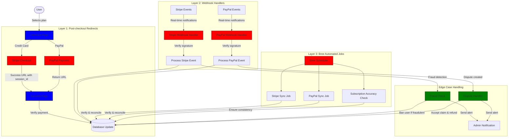
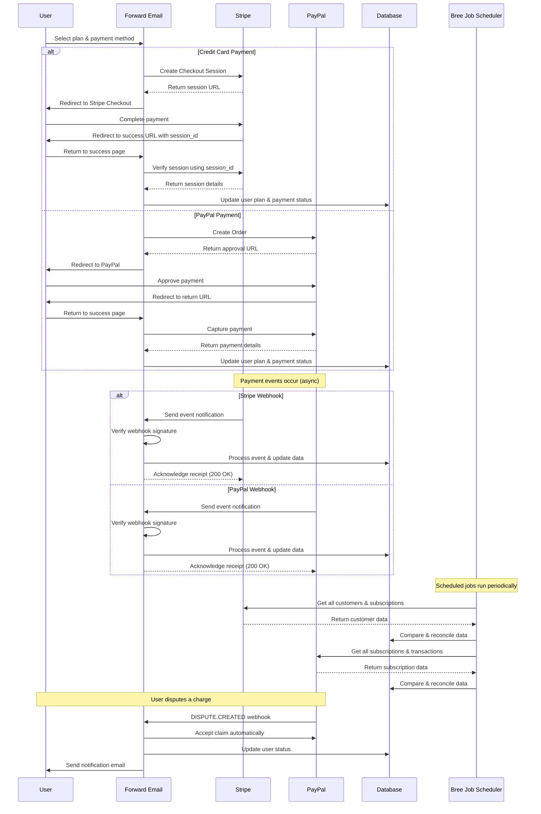
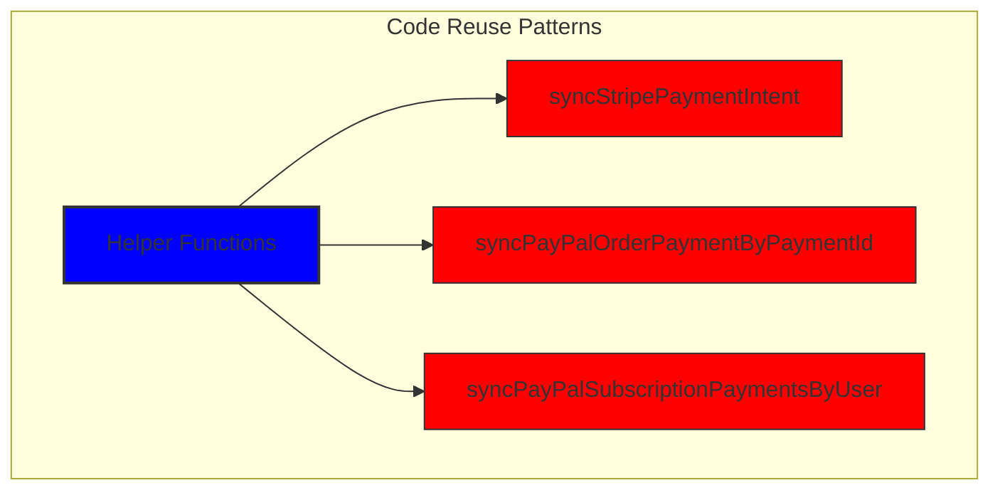
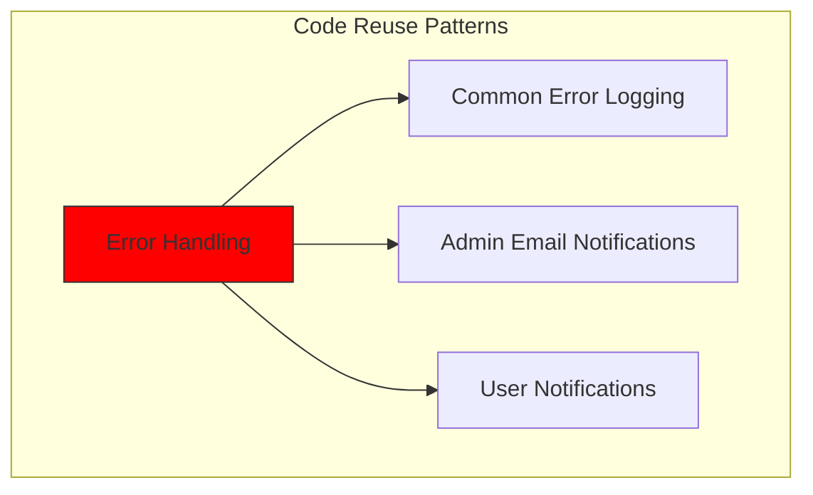
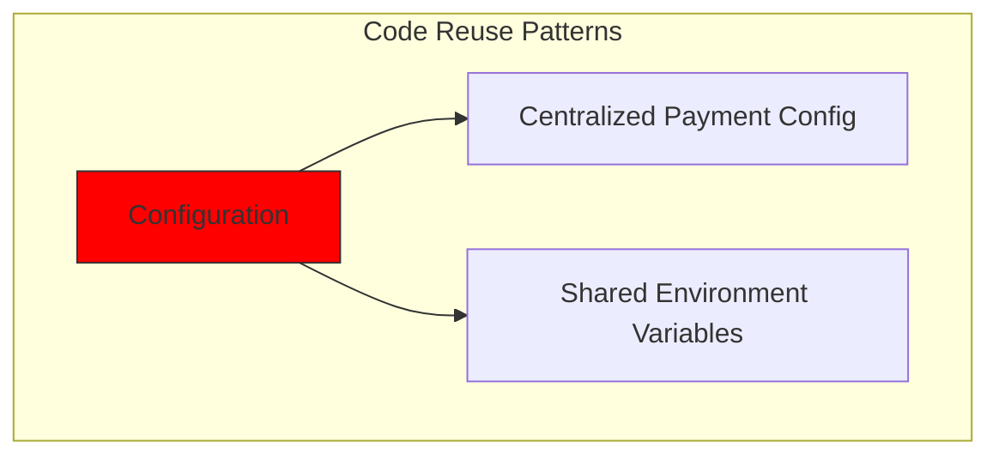
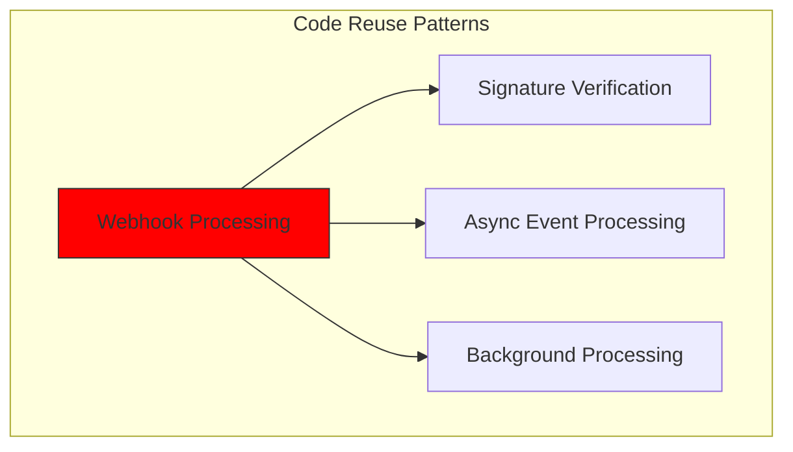
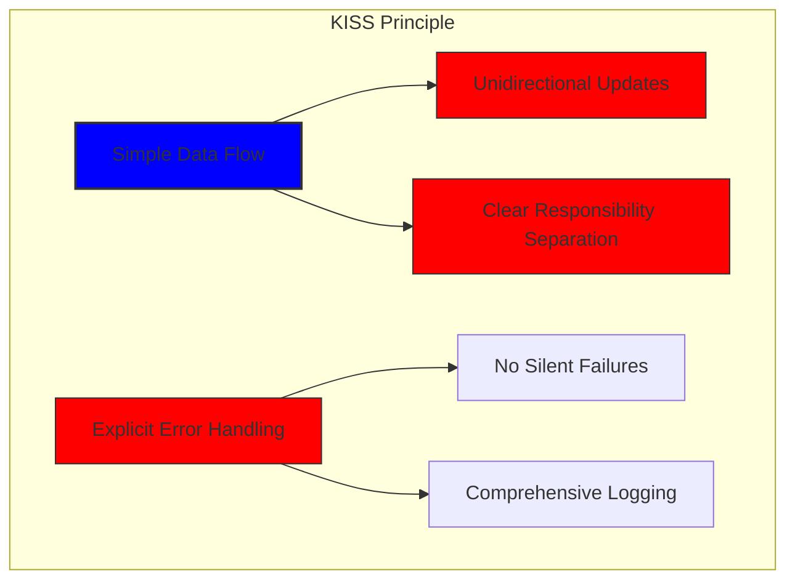
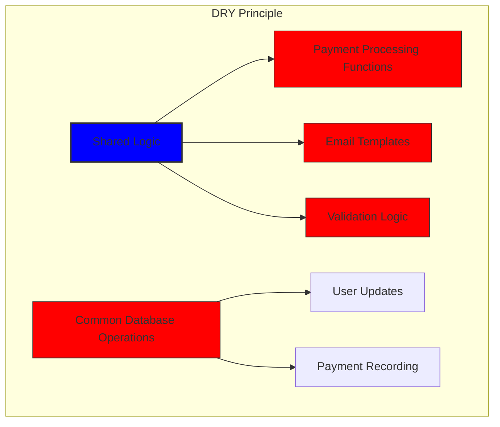

# Cách chúng tôi xây dựng hệ thống thanh toán mạnh mẽ với Stripe và PayPal: Phương pháp tiếp cận Trifecta {#how-we-built-a-robust-payment-system-with-stripe-and-paypal-a-trifecta-approach}


## Mục lục {#table-of-contents}

* [Lời nói đầu](#foreword)
* [Thách thức: Nhiều bộ xử lý thanh toán, một nguồn thông tin đáng tin cậy](#the-challenge-multiple-payment-processors-one-source-of-truth)
* [Phương pháp Trifecta: Ba lớp độ tin cậy](#the-trifecta-approach-three-layers-of-reliability)
* [Lớp 1: Chuyển hướng sau khi thanh toán](#layer-1-post-checkout-redirects)
  * [Triển khai thanh toán Stripe](#stripe-checkout-implementation)
  * [Luồng thanh toán PayPal](#paypal-payment-flow)
* [Lớp 2: Trình xử lý Webhook có xác minh chữ ký](#layer-2-webhook-handlers-with-signature-verification)
  * [Triển khai Stripe Webhook](#stripe-webhook-implementation)
  * [Triển khai PayPal Webhook](#paypal-webhook-implementation)
* [Lớp 3: Công việc tự động với Bree](#layer-3-automated-jobs-with-bree)
  * [Kiểm tra độ chính xác của đăng ký](#subscription-accuracy-checker)
  * [Đồng bộ hóa đăng ký PayPal](#paypal-subscription-synchronization)
* [Xử lý các trường hợp ngoại lệ](#handling-edge-cases)
  * [Phát hiện và phòng ngừa gian lận](#fraud-detection-and-prevention)
  * [Xử lý tranh chấp](#dispute-handling)
* [Tái sử dụng mã: Nguyên tắc KISS và DRY](#code-reuse-kiss-and-dry-principles)
* [Triển khai các yêu cầu đăng ký VISA](#visa-subscription-requirements-implementation)
  * [Thông báo qua email tự động trước khi gia hạn](#automated-pre-renewal-email-notifications)
  * [Xử lý các trường hợp ngoại lệ](#handling-edge-cases-1)
  * [Thời gian dùng thử và Điều khoản đăng ký](#trial-periods-and-subscription-terms)
* [Kết luận: Lợi ích của phương pháp Trifecta của chúng tôi](#conclusion-the-benefits-of-our-trifecta-approach)

## Lời nói đầu {#foreword}

Tại Forward Email, chúng tôi luôn ưu tiên tạo ra các hệ thống đáng tin cậy, chính xác và thân thiện với người dùng. Khi triển khai hệ thống xử lý thanh toán, chúng tôi biết mình cần một giải pháp có thể xử lý nhiều bộ xử lý thanh toán trong khi vẫn duy trì tính nhất quán dữ liệu hoàn hảo. Bài viết trên blog này trình bày chi tiết cách nhóm phát triển của chúng tôi tích hợp cả Stripe và PayPal bằng phương pháp trifecta, đảm bảo độ chính xác theo thời gian thực 1:1 trên toàn bộ hệ thống.

## Thách thức: Nhiều bộ xử lý thanh toán, một nguồn thông tin đáng tin cậy {#the-challenge-multiple-payment-processors-one-source-of-truth}

Là một dịch vụ email chú trọng quyền riêng tư, chúng tôi muốn cung cấp cho người dùng các tùy chọn thanh toán. Một số người thích sự đơn giản của thanh toán bằng thẻ tín dụng thông qua Stripe, trong khi những người khác lại đánh giá cao lớp bảo mật bổ sung mà PayPal cung cấp. Tuy nhiên, việc hỗ trợ nhiều bộ xử lý thanh toán sẽ gây ra sự phức tạp đáng kể:

1. Làm thế nào để chúng tôi đảm bảo dữ liệu nhất quán trên các hệ thống thanh toán khác nhau?
2. Làm thế nào để chúng tôi xử lý các trường hợp bất khả kháng như tranh chấp, hoàn tiền hoặc thanh toán không thành công?
3. Làm thế nào để chúng tôi duy trì một nguồn dữ liệu đáng tin cậy duy nhất trong cơ sở dữ liệu của mình?

Giải pháp của chúng tôi là triển khai cái mà chúng tôi gọi là "phương pháp trifecta" - một hệ thống ba lớp cung cấp tính dự phòng và đảm bảo tính nhất quán của dữ liệu bất kể điều gì xảy ra.

## Phương pháp Trifecta: Ba lớp độ tin cậy {#the-trifecta-approach-three-layers-of-reliability}

Hệ thống thanh toán của chúng tôi bao gồm ba thành phần quan trọng hoạt động cùng nhau để đảm bảo đồng bộ hóa dữ liệu hoàn hảo:

1. **Chuyển hướng sau khi thanh toán** - Thu thập thông tin thanh toán ngay sau khi thanh toán
2. **Trình xử lý Webhook** - Xử lý các sự kiện thời gian thực từ bộ xử lý thanh toán
3. **Công việc tự động** - Định kỳ xác minh và đối chiếu dữ liệu thanh toán

Chúng ta hãy cùng tìm hiểu từng thành phần và xem chúng hoạt động cùng nhau như thế nào.



## Lớp 1: Chuyển hướng sau khi thanh toán {#layer-1-post-checkout-redirects}

Lớp đầu tiên trong phương pháp trifecta của chúng tôi diễn ra ngay sau khi người dùng hoàn tất thanh toán. Cả Stripe và PayPal đều cung cấp cơ chế chuyển hướng người dùng trở lại trang web của chúng tôi với thông tin giao dịch.

### Triển khai thanh toán Stripe {#stripe-checkout-implementation}

Đối với Stripe, chúng tôi sử dụng API Phiên Thanh toán của họ để tạo trải nghiệm thanh toán liền mạch. Khi người dùng chọn một gói cước và thanh toán bằng thẻ tín dụng, chúng tôi sẽ tạo Phiên Thanh toán với các URL thành công và hủy cụ thể:

```javascript
const options = {
  mode: paymentType === 'one-time' ? 'payment' : 'subscription',
  customer: ctx.state.user[config.userFields.stripeCustomerID],
  client_reference_id: reference,
  metadata: {
    plan
  },
  line_items: [
    {
      price,
      quantity: 1,
      description
    }
  ],
  locale: config.STRIPE_LOCALES.has(ctx.locale) ? ctx.locale : 'auto',
  cancel_url: `${config.urls.web}${ctx.path}${
    isMakePayment || isEnableAutoRenew ? '' : `/?plan=${plan}`
  }`,
  success_url: `${config.urls.web}${ctx.path}/?${
    isMakePayment || isEnableAutoRenew ? '' : `plan=${plan}&`
  }session_id={CHECKOUT_SESSION_ID}`,
  allow_promotion_codes: true
};

// Create the checkout session and redirect
const session = await stripe.checkout.sessions.create(options);
const redirectTo = session.url;
if (ctx.accepts('html')) {
  ctx.status = 303;
  ctx.redirect(redirectTo);
} else {
  ctx.body = { redirectTo };
}
```

Phần quan trọng ở đây là tham số `success_url`, bao gồm `session_id` làm tham số truy vấn. Khi Stripe chuyển hướng người dùng trở lại trang web của chúng tôi sau khi thanh toán thành công, chúng tôi có thể sử dụng ID phiên này để xác minh giao dịch và cập nhật cơ sở dữ liệu cho phù hợp.

### Luồng thanh toán PayPal {#paypal-payment-flow}

Đối với PayPal, chúng tôi sử dụng cách tiếp cận tương tự với API Đơn hàng của họ:

```javascript
const requestBody = {
  intent: 'CAPTURE',
  application_context: {
    cancel_url: `${config.urls.web}${ctx.path}${
      isMakePayment || isEnableAutoRenew ? '' : `/?plan=${plan}`
    }`,
    return_url: `${config.urls.web}${ctx.path}/?plan=${plan}`,
    brand_name: 'Forward Email',
    shipping_preference: 'NO_SHIPPING',
    user_action: 'PAY_NOW'
  },
  payer: {
    email_address: ctx.state.user.email
  },
  purchase_units: [
    {
      reference_id: ctx.state.user.id,
      description,
      custom_id: sku,
      invoice_id: reference,
      soft_descriptor: sku,
      amount: {
        currency_code: 'USD',
        value: price,
        breakdown: {
          item_total: {
            currency_code: 'USD',
            value: price
          }
        }
      },
      items: [
        {
          name,
          description,
          sku,
          unit_amount: {
            currency_code: 'USD',
            value: price
          },
          quantity: '1',
          category: 'DIGITAL_GOODS'
        }
      ]
    }
  ]
};
```

Tương tự như Stripe, chúng tôi chỉ định các tham số `return_url` và `cancel_url` để xử lý việc chuyển hướng sau thanh toán. Khi PayPal chuyển hướng người dùng trở lại trang web của chúng tôi, chúng tôi có thể nắm bắt thông tin thanh toán và cập nhật cơ sở dữ liệu.



## Lớp 2: Trình xử lý Webhook có Xác minh chữ ký {#layer-2-webhook-handlers-with-signature-verification}

Mặc dù chuyển hướng sau khi thanh toán hoạt động tốt trong hầu hết các trường hợp, nhưng chúng không phải là giải pháp hoàn hảo. Người dùng có thể đóng trình duyệt trước khi được chuyển hướng, hoặc sự cố mạng có thể ngăn quá trình chuyển hướng hoàn tất. Đó chính là lúc webhooks phát huy tác dụng.

Cả Stripe và PayPal đều cung cấp hệ thống webhook gửi thông báo theo thời gian thực về các sự kiện thanh toán. Chúng tôi đã triển khai các trình xử lý webhook mạnh mẽ để xác minh tính xác thực của các thông báo này và xử lý chúng cho phù hợp.

### Triển khai Webhook Stripe {#stripe-webhook-implementation}

Trình xử lý webhook Stripe của chúng tôi xác minh chữ ký của các sự kiện webhook đến để đảm bảo chúng hợp lệ:

```javascript
async function webhook(ctx) {
  const sig = ctx.request.get('stripe-signature');
  // throw an error if something was wrong
  if (!isSANB(sig))
    throw Boom.badRequest(ctx.translateError('INVALID_STRIPE_SIGNATURE'));
  const event = stripe.webhooks.constructEvent(
    ctx.request.rawBody,
    sig,
    env.STRIPE_ENDPOINT_SECRET
  );
  // throw an error if something was wrong
  if (!event)
    throw Boom.badRequest(ctx.translateError('INVALID_STRIPE_SIGNATURE'));
  ctx.logger.info('stripe webhook', { event });
  // return a response to acknowledge receipt of the event
  ctx.body = { received: true };
  // run in background
  processEvent(ctx, event)
    .then()
    .catch((err) => {
      ctx.logger.fatal(err, { event });
      // email admin errors
      emailHelper({
        template: 'alert',
        message: {
          to: config.email.message.from,
          subject: `Error with Stripe Webhook (Event ID ${event.id})`
        },
        locals: {
          message: `<pre><code>${safeStringify(
            parseErr(err),
            null,
            2
          )}</code></pre>`
        }
      })
        .then()
        .catch((err) => ctx.logger.fatal(err, { event }));
    });
}
```

Hàm `stripe.webhooks.constructEvent` xác minh chữ ký bằng bí mật điểm cuối của chúng tôi. Nếu chữ ký hợp lệ, chúng tôi sẽ xử lý sự kiện theo cách không đồng bộ để tránh chặn phản hồi webhook.

### Triển khai PayPal Webhook {#paypal-webhook-implementation}

Tương tự như vậy, trình xử lý webhook PayPal của chúng tôi sẽ xác minh tính xác thực của thông báo đến:

```javascript
async function webhook(ctx) {
  const response = await promisify(
    paypal.notification.webhookEvent.verify,
    paypal.notification.webhookEvent
  )(ctx.request.headers, ctx.request.body, env.PAYPAL_WEBHOOK_ID);
  // throw an error if something was wrong
  if (!_.isObject(response) || response.verification_status !== 'SUCCESS')
    throw Boom.badRequest(ctx.translateError('INVALID_PAYPAL_SIGNATURE'));
  // return a response to acknowledge receipt of the event
  ctx.body = { received: true };
  // run in background
  processEvent(ctx)
    .then()
    .catch((err) => {
      ctx.logger.fatal(err);
      // email admin errors
      emailHelper({
        template: 'alert',
        message: {
          to: config.email.message.from,
          subject: `Error with PayPal Webhook (Event ID ${ctx.request.body.id})`
        },
        locals: {
          message: `<pre><code>${safeStringify(
            parseErr(err),
            null,
            2
          )}</code></pre>`
        }
      })
        .then()
        .catch((err) => ctx.logger.fatal(err));
    });
}
```

Cả hai trình xử lý webhook đều tuân theo cùng một quy trình: xác minh chữ ký, xác nhận đã nhận và xử lý sự kiện một cách không đồng bộ. Điều này đảm bảo chúng tôi không bao giờ bỏ lỡ bất kỳ sự kiện thanh toán nào, ngay cả khi chuyển hướng sau khi thanh toán không thành công.

## Lớp 3: Công việc tự động với Bree {#layer-3-automated-jobs-with-bree}

Lớp cuối cùng trong phương pháp trifecta của chúng tôi là một tập hợp các tác vụ tự động định kỳ xác minh và đối chiếu dữ liệu thanh toán. Chúng tôi sử dụng Bree, một trình lập lịch tác vụ cho Node.js, để chạy các tác vụ này theo định kỳ.

### Trình kiểm tra độ chính xác của đăng ký {#subscription-accuracy-checker}

Một trong những công việc chính của chúng tôi là kiểm tra độ chính xác của đăng ký, đảm bảo rằng cơ sở dữ liệu của chúng tôi phản ánh chính xác trạng thái đăng ký trong Stripe:

```javascript
async function mapper(customer) {
  // wait a second to prevent rate limitation error
  await setTimeout(ms('1s'));
  // check for user on our side
  let user = await Users.findOne({
    [config.userFields.stripeCustomerID]: customer.id
  })
    .lean()
    .exec();
  if (!user) return;
  if (user.is_banned) return;

  // if emails did not match
  if (user.email !== customer.email) {
    logger.info(
      `User email ${user.email} did not match customer email ${customer.email} (${customer.id})`
    );
    customer = await stripe.customers.update(customer.id, {
      email: user.email
    });
    logger.info(`Updated user email to match ${user.email}`);
  }

  // check for active subscriptions
  const [activeSubscriptions, trialingSubscriptions] = await Promise.all([
    stripe.subscriptions.list({
      customer: customer.id,
      status: 'active'
    }),
    stripe.subscriptions.list({
      customer: customer.id,
      status: 'trialing'
    })
  ]);

  // Combine active and trialing subscriptions
  let subscriptions = [
    ...activeSubscriptions.data,
    ...trialingSubscriptions.data
  ];

  // Handle edge case: multiple subscriptions for one user
  if (subscriptions.length > 1) {
    await logger.error(
      new Error(
        `We may need to refund: User had multiple subscriptions ${user.email} (${customer.id})`
      )
    );
    await emailHelper({
      template: 'alert',
      message: {
        to: config.email.message.from,
        subject: `User had multiple subscriptions ${user.email}`
      },
      locals: {
        message: `User ${user.email} (${customer.id}) had multiple subscriptions: ${JSON.stringify(
          subscriptions.map((s) => s.id)
        )}`
      }
    });
  }
}
```

Công việc này kiểm tra sự khác biệt giữa cơ sở dữ liệu của chúng tôi và Stripe, chẳng hạn như địa chỉ email không khớp hoặc nhiều đăng ký đang hoạt động. Nếu phát hiện bất kỳ sự cố nào, công việc sẽ ghi lại và gửi cảnh báo đến nhóm quản trị viên.

### Đồng bộ hóa đăng ký PayPal {#paypal-subscription-synchronization}

Chúng tôi có công việc tương tự cho đăng ký PayPal:

```javascript
async function syncPayPalSubscriptionPayments() {
  const paypalCustomers = await Users.find({
    $or: [
      {
        [config.userFields.paypalSubscriptionID]: { $exists: true, $ne: null }
      },
      {
        [config.userFields.paypalPayerID]: { $exists: true, $ne: null }
      }
    ]
  })
    // sort by newest customers first
    .sort('-created_at')
    .lean()
    .exec();

  await logger.info(
    `Syncing payments for ${paypalCustomers.length} paypal customers`
  );

  // Process each customer and sync their payments
  const errorEmails = await pReduce(
    paypalCustomers,
    // Implementation details...
  );
}
```

Những công việc tự động này đóng vai trò là mạng lưới an toàn cuối cùng của chúng tôi, đảm bảo rằng cơ sở dữ liệu của chúng tôi luôn phản ánh đúng trạng thái đăng ký và thanh toán trong cả Stripe và PayPal.

## Xử lý các trường hợp ngoại lệ {#handling-edge-cases}

Một hệ thống thanh toán mạnh mẽ phải xử lý các trường hợp ngoại lệ một cách khéo léo. Hãy cùng xem xét cách chúng tôi xử lý một số tình huống phổ biến.

### Phát hiện và phòng ngừa gian lận {#fraud-detection-and-prevention}

Chúng tôi đã triển khai các cơ chế phát hiện gian lận tinh vi có thể tự động xác định và xử lý các hoạt động thanh toán đáng ngờ:

```javascript
case 'charge.failed': {
  // Get all failed charges in the last 30 days
  const charges = await stripe.charges.list({
    customer: event.data.object.customer,
    created: {
      gte: dayjs().subtract(1, 'month').unix()
    }
  });

  // Filter for declined charges
  const filtered = charges.data.filter(
    (d) => d.status === 'failed' && d.failure_code === 'card_declined'
  );

  // if not more than 5 then return early
  if (filtered.length < 5) break;

  // Check if user has verified domains
  const count = await Domains.countDocuments({
    members: {
      $elemMatch: {
        user: user._id,
        group: 'admin'
      }
    },
    plan: { $in: ['enhanced_protection', 'team'] },
    has_txt_record: true
  });

  if (!user.is_banned) {
    // If no verified domains, ban the user and refund all charges
    if (count === 0) {
      // Ban the user
      user.is_banned = true;
      await user.save();

      // Refund all successful charges
    }
  }
}
```

Mã này sẽ tự động cấm những người dùng có nhiều khoản phí không thành công và không có tên miền đã được xác minh, đây là dấu hiệu rõ ràng của hoạt động gian lận.

### Xử lý tranh chấp {#dispute-handling}

Khi người dùng khiếu nại về khoản phí, chúng tôi sẽ tự động chấp nhận khiếu nại và thực hiện hành động thích hợp:

```javascript
case 'CUSTOMER.DISPUTE.CREATED': {
  // accept claim
  const agent = await paypalAgent();
  await agent
    .post(`/v1/customer/disputes/${body.resource.dispute_id}/accept-claim`)
    .send({
      note: 'Full refund to the customer.'
    });

  // Find the payment in our database
  const payment = await Payments.findOne({ $or });
  if (!payment) throw new Error('Payment does not exist');

  const user = await Users.findById(payment.user);
  if (!user) throw new Error('User did not exist for customer');

  // Cancel the user's subscription if they have one
  if (isSANB(user[config.userFields.paypalSubscriptionID])) {
    try {
      const agent = await paypalAgent();
      await agent.post(
        `/v1/billing/subscriptions/${
          user[config.userFields.paypalSubscriptionID]
        }/cancel`
      );
    } catch (err) {
      // Handle subscription cancellation errors
    }
  }
}
```

Cách tiếp cận này giảm thiểu tác động của tranh chấp đối với doanh nghiệp của chúng tôi đồng thời đảm bảo trải nghiệm tốt cho khách hàng.

## Tái sử dụng mã: Nguyên tắc KISS và DRY {#code-reuse-kiss-and-dry-principles}

Trong suốt hệ thống thanh toán của mình, chúng tôi luôn tuân thủ nguyên tắc KISS (Giữ mọi thứ đơn giản, đừng lặp lại) và DRY (Đừng lặp lại chính mình). Dưới đây là một số ví dụ:

1. **Hàm trợ lý dùng chung**: Chúng tôi đã tạo ra các hàm trợ lý có thể tái sử dụng cho các tác vụ phổ biến như đồng bộ hóa thanh toán và gửi email.

2. **Xử lý lỗi nhất quán**: Cả trình xử lý webhook của Stripe và PayPal đều sử dụng cùng một mẫu để xử lý lỗi và thông báo cho quản trị viên.

3. **Sơ đồ cơ sở dữ liệu hợp nhất**: Sơ đồ cơ sở dữ liệu của chúng tôi được thiết kế để chứa cả dữ liệu Stripe và PayPal, với các trường chung cho trạng thái thanh toán, số tiền và thông tin gói.

4. **Cấu hình tập trung**: Cấu hình liên quan đến thanh toán được tập trung trong một tệp duy nhất, giúp dễ dàng cập nhật giá cả và thông tin sản phẩm.













## Triển khai Yêu cầu Đăng ký VISA {#visa-subscription-requirements-implementation}

Bên cạnh phương pháp tiếp cận "trifecta", chúng tôi đã triển khai các tính năng cụ thể để tuân thủ các yêu cầu đăng ký của VISA, đồng thời nâng cao trải nghiệm người dùng. Một yêu cầu quan trọng từ VISA là người dùng phải được thông báo trước khi bị tính phí đăng ký, đặc biệt là khi chuyển từ gói dùng thử sang gói trả phí.

### Thông báo tự động qua email trước khi gia hạn {#automated-pre-renewal-email-notifications}

Chúng tôi đã xây dựng một hệ thống tự động xác định người dùng có đăng ký dùng thử đang hoạt động và gửi email thông báo trước khi khoản phí đầu tiên phát sinh. Điều này không chỉ giúp chúng tôi tuân thủ các yêu cầu của VISA mà còn giảm thiểu tình trạng hoàn tiền và cải thiện sự hài lòng của khách hàng.

Sau đây là cách chúng tôi triển khai tính năng này:

```javascript
// Find users with trial subscriptions who haven't received a notification yet
const users = await Users.find({
  $or: [
    {
      $and: [
        { [config.userFields.stripeSubscriptionID]: { $exists: true } },
        { [config.userFields.stripeTrialSentAt]: { $exists: false } },
        // Exclude subscriptions that have already had payments
        ...(paidStripeSubscriptionIds.length > 0
          ? [
              {
                [config.userFields.stripeSubscriptionID]: {
                  $nin: paidStripeSubscriptionIds
                }
              }
            ]
          : [])
      ]
    },
    {
      $and: [
        { [config.userFields.paypalSubscriptionID]: { $exists: true } },
        { [config.userFields.paypalTrialSentAt]: { $exists: false } },
        // Exclude subscriptions that have already had payments
        ...(paidPayPalSubscriptionIds.length > 0
          ? [
              {
                [config.userFields.paypalSubscriptionID]: {
                  $nin: paidPayPalSubscriptionIds
                }
              }
            ]
          : [])
      ]
    }
  ]
});

// Process each user and send notification
for (const user of users) {
  // Get subscription details from payment processor
  const subscription = await getSubscriptionDetails(user);

  // Calculate subscription duration and frequency
  const duration = getDurationFromPlanId(subscription.plan_id);
  const frequency = getHumanReadableFrequency(duration, user.locale);
  const amount = getPlanAmount(user.plan, duration);

  // Get user's domains for personalized email
  const domains = await Domains.find({
    'members.user': user._id
  }).sort('name').lean().exec();

  // Send VISA-compliant notification email
  await emailHelper({
    template: 'visa-trial-subscription-requirement',
    message: {
      to: user.receipt_email || user.email,
      ...(user.receipt_email ? { cc: user.email } : {})
    },
    locals: {
      user,
      firstChargeDate: new Date(subscription.start_time),
      frequency,
      formattedAmount: numeral(amount).format('$0,0,0.00'),
      domains
    }
  });

  // Record that notification was sent
  await Users.findByIdAndUpdate(user._id, {
    $set: {
      [config.userFields.paypalTrialSentAt]: new Date()
    }
  });
}
```

Việc triển khai này đảm bảo rằng người dùng luôn được thông báo về các khoản phí sắp tới, với thông tin chi tiết rõ ràng về:

1. Thời điểm phát sinh khoản phí đầu tiên
2. Tần suất phát sinh các khoản phí trong tương lai (hàng tháng, hàng năm, v.v.)
3. Số tiền chính xác họ sẽ bị tính
4. Những tên miền nào được bao gồm trong gói đăng ký của họ

Bằng cách tự động hóa quy trình này, chúng tôi duy trì sự tuân thủ hoàn toàn với các yêu cầu của VISA (yêu cầu thông báo ít nhất 7 ngày trước khi tính phí) đồng thời giảm các yêu cầu hỗ trợ và cải thiện trải nghiệm tổng thể của người dùng.

### Xử lý các trường hợp ngoại lệ {#handling-edge-cases-1}

Việc triển khai của chúng tôi cũng bao gồm khả năng xử lý lỗi mạnh mẽ. Nếu có bất kỳ sai sót nào xảy ra trong quá trình thông báo, hệ thống của chúng tôi sẽ tự động cảnh báo nhóm:

```javascript
try {
  await mapper(user);
} catch (err) {
  logger.error(err);

  // Send alert to administrators
  await emailHelper({
    template: 'alert',
    message: {
      to: config.email.message.from,
      subject: 'VISA Trial Subscription Requirement Error'
    },
    locals: {
      message: `<pre><code>${safeStringify(
        parseErr(err),
        null,
        2
      )}</code></pre>`
    }
  });
}
```

Điều này đảm bảo rằng ngay cả khi có sự cố với hệ thống thông báo, nhóm của chúng tôi vẫn có thể nhanh chóng giải quyết và tuân thủ các yêu cầu của VISA.

Hệ thống thông báo đăng ký VISA là một ví dụ khác về cách chúng tôi xây dựng cơ sở hạ tầng thanh toán của mình với mục tiêu tuân thủ và trải nghiệm người dùng, bổ sung cho phương pháp tiếp cận ba trong một của chúng tôi nhằm đảm bảo xử lý thanh toán đáng tin cậy và minh bạch.

### Thời gian dùng thử và Điều khoản đăng ký {#trial-periods-and-subscription-terms}

Đối với người dùng bật tính năng tự động gia hạn trên các gói cước hiện tại, chúng tôi sẽ tính toán thời gian dùng thử phù hợp để đảm bảo họ không bị tính phí cho đến khi gói cước hiện tại hết hạn:

```javascript
if (
  isEnableAutoRenew &&
  dayjs(ctx.state.user[config.userFields.planExpiresAt]).isAfter(
    dayjs()
  )
) {
  const hours = dayjs(
    ctx.state.user[config.userFields.planExpiresAt]
  ).diff(dayjs(), 'hours');

  // Handle trial period calculation
}
```

Chúng tôi cũng cung cấp thông tin rõ ràng về các điều khoản đăng ký, bao gồm tần suất thanh toán và chính sách hủy, đồng thời bao gồm siêu dữ liệu chi tiết với mỗi đăng ký để đảm bảo theo dõi và quản lý đúng cách.

## Kết luận: Lợi ích của phương pháp tiếp cận Trifecta của chúng tôi {#conclusion-the-benefits-of-our-trifecta-approach}

Phương pháp xử lý thanh toán toàn diện của chúng tôi đã mang lại một số lợi ích chính:

1. **Độ tin cậy**: Bằng cách triển khai ba lớp xác minh thanh toán, chúng tôi đảm bảo không có khoản thanh toán nào bị bỏ sót hoặc xử lý không đúng.

2. **Độ chính xác**: Cơ sở dữ liệu của chúng tôi luôn phản ánh đúng trạng thái đăng ký và thanh toán ở cả Stripe và PayPal.

3. **Tính linh hoạt**: Người dùng có thể chọn phương thức thanh toán ưa thích mà không ảnh hưởng đến độ tin cậy của hệ thống.

4. **Độ mạnh mẽ**: Hệ thống của chúng tôi xử lý các trường hợp ngoại lệ một cách hiệu quả, từ lỗi mạng đến các hoạt động gian lận.

Nếu bạn đang triển khai hệ thống thanh toán hỗ trợ nhiều bộ xử lý, chúng tôi đặc biệt khuyên dùng phương pháp trifecta này. Phương pháp này đòi hỏi nhiều nỗ lực phát triển ban đầu hơn, nhưng lợi ích lâu dài về độ tin cậy và độ chính xác là rất xứng đáng.

Để biết thêm thông tin về Forward Email và các dịch vụ email tập trung vào quyền riêng tư của chúng tôi, hãy truy cập [trang web](https://forwardemail.net).

<!-- *Từ khóa: xử lý thanh toán, tích hợp Stripe, tích hợp PayPal, xử lý webhook, đồng bộ hóa thanh toán, quản lý đăng ký, phòng chống gian lận, xử lý tranh chấp, hệ thống thanh toán Node.js, hệ thống thanh toán đa bộ xử lý, tích hợp cổng thanh toán, xác minh thanh toán theo thời gian thực, tính nhất quán của dữ liệu thanh toán, lập hóa đơn đăng ký, bảo mật thanh toán, tự động hóa thanh toán, webhook thanh toán, đối chiếu thanh toán, các trường hợp ngoại lệ về thanh toán, xử lý lỗi thanh toán, yêu cầu đăng ký VISA, thông báo trước khi gia hạn, tuân thủ đăng ký* -->