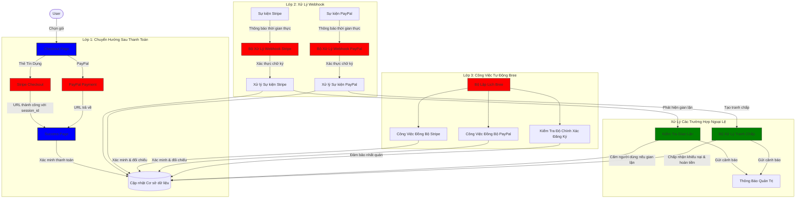
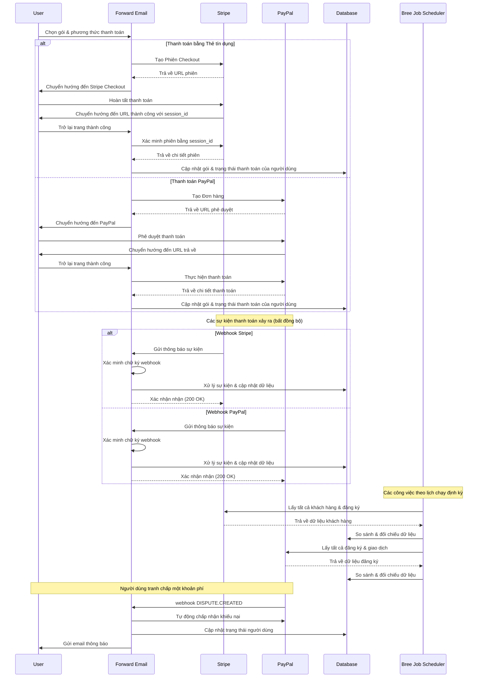
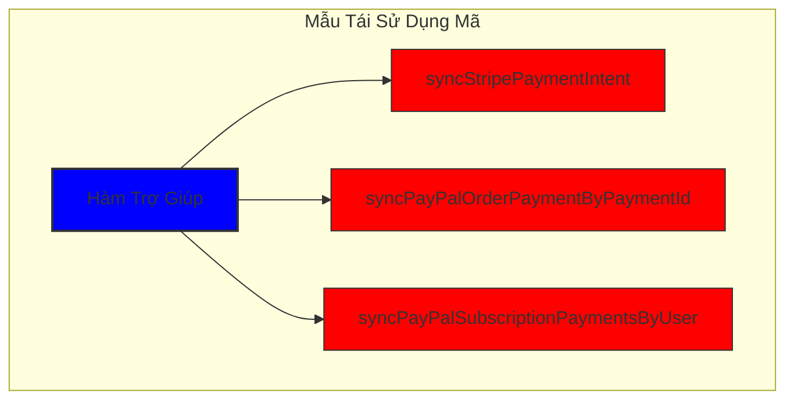
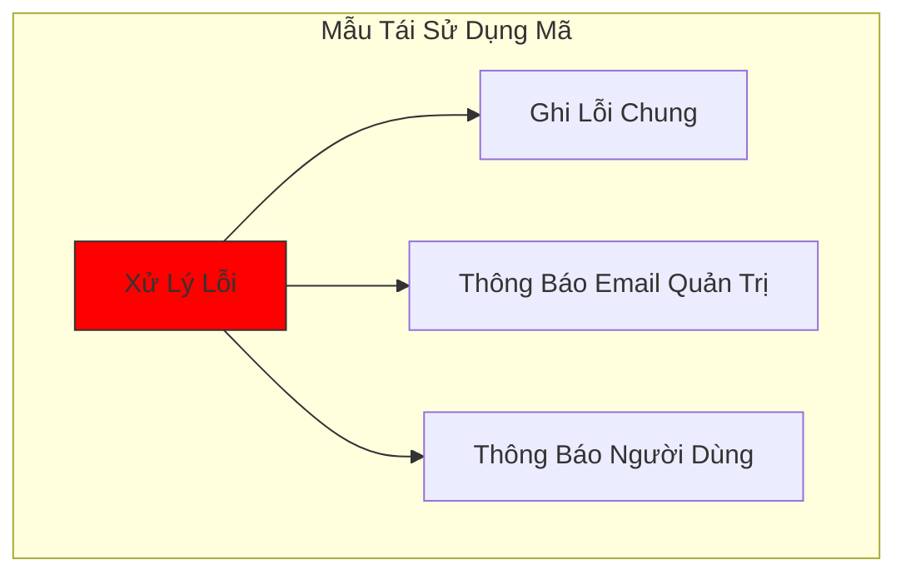
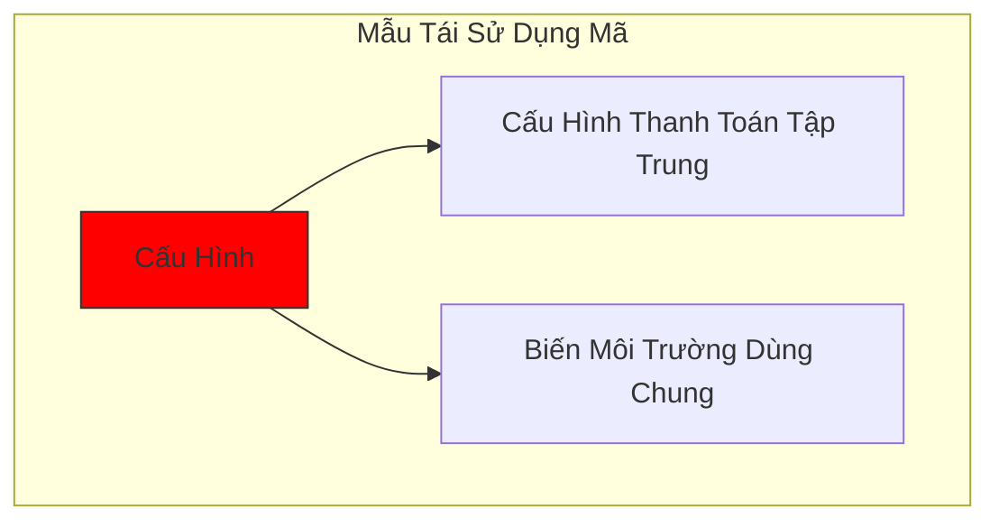
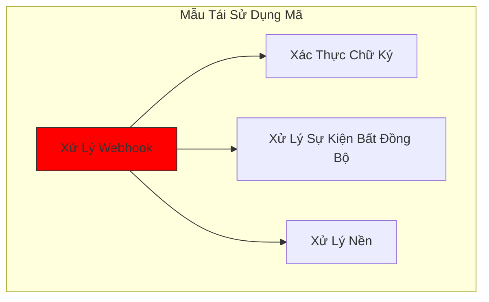
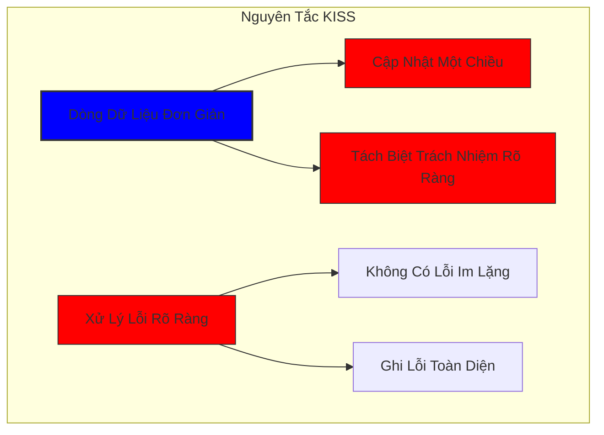

# Cách Chúng Tôi Xây Dựng Hệ Thống Thanh Toán Mạnh Mẽ với Stripe và PayPal: Phương Pháp Ba Mặt {#how-we-built-a-robust-payment-system-with-stripe-and-paypal-a-trifecta-approach}


## Mục Lục {#table-of-contents}

* [Lời Mở Đầu](#foreword)
* [Thách Thức: Nhiều Bộ Xử Lý Thanh Toán, Một Nguồn Sự Thật](#the-challenge-multiple-payment-processors-one-source-of-truth)
* [Phương Pháp Ba Mặt: Ba Lớp Độ Tin Cậy](#the-trifecta-approach-three-layers-of-reliability)
* [Lớp 1: Chuyển Hướng Sau Thanh Toán](#layer-1-post-checkout-redirects)
  * [Triển Khai Stripe Checkout](#stripe-checkout-implementation)
  * [Luồng Thanh Toán PayPal](#paypal-payment-flow)
* [Lớp 2: Xử Lý Webhook với Xác Thực Chữ Ký](#layer-2-webhook-handlers-with-signature-verification)
  * [Triển Khai Webhook Stripe](#stripe-webhook-implementation)
  * [Triển Khai Webhook PayPal](#paypal-webhook-implementation)
* [Lớp 3: Công Việc Tự Động với Bree](#layer-3-automated-jobs-with-bree)
  * [Kiểm Tra Độ Chính Xác Đăng Ký](#subscription-accuracy-checker)
  * [Đồng Bộ Đăng Ký PayPal](#paypal-subscription-synchronization)
* [Xử Lý Các Trường Hợp Ngoại Lệ](#handling-edge-cases)
  * [Phát Hiện và Ngăn Chặn Gian Lận](#fraud-detection-and-prevention)
  * [Xử Lý Tranh Chấp](#dispute-handling)
* [Tái Sử Dụng Mã: Nguyên Tắc KISS và DRY](#code-reuse-kiss-and-dry-principles)
* [Triển Khai Yêu Cầu Đăng Ký VISA](#visa-subscription-requirements-implementation)
  * [Thông Báo Email Tự Động Trước Gia Hạn](#automated-pre-renewal-email-notifications)
  * [Xử Lý Các Trường Hợp Ngoại Lệ](#handling-edge-cases-1)
  * [Thời Gian Dùng Thử và Điều Khoản Đăng Ký](#trial-periods-and-subscription-terms)
* [Kết Luận: Lợi Ích của Phương Pháp Ba Mặt](#conclusion-the-benefits-of-our-trifecta-approach)


## Lời Mở Đầu {#foreword}

Tại Forward Email, chúng tôi luôn ưu tiên tạo ra các hệ thống đáng tin cậy, chính xác và thân thiện với người dùng. Khi triển khai hệ thống xử lý thanh toán, chúng tôi biết mình cần một giải pháp có thể xử lý nhiều bộ xử lý thanh toán trong khi vẫn duy trì sự nhất quán dữ liệu hoàn hảo. Bài viết này sẽ trình bày cách đội ngũ phát triển của chúng tôi tích hợp cả Stripe và PayPal bằng phương pháp ba mặt đảm bảo độ chính xác 1:1 theo thời gian thực trên toàn bộ hệ thống.


## Thách Thức: Nhiều Bộ Xử Lý Thanh Toán, Một Nguồn Sự Thật {#the-challenge-multiple-payment-processors-one-source-of-truth}

Là một dịch vụ email tập trung vào quyền riêng tư, chúng tôi muốn cung cấp cho người dùng nhiều lựa chọn thanh toán. Một số người thích sự đơn giản của thanh toán thẻ tín dụng qua Stripe, trong khi những người khác đánh giá cao lớp tách biệt bổ sung mà PayPal mang lại. Tuy nhiên, hỗ trợ nhiều bộ xử lý thanh toán lại tạo ra sự phức tạp đáng kể:

1. Làm thế nào để đảm bảo dữ liệu nhất quán giữa các hệ thống thanh toán khác nhau?
2. Làm thế nào để xử lý các trường hợp ngoại lệ như tranh chấp, hoàn tiền hoặc thanh toán thất bại?
3. Làm thế nào để duy trì một nguồn sự thật duy nhất trong cơ sở dữ liệu?

Giải pháp của chúng tôi là triển khai cái gọi là "phương pháp ba mặt" - một hệ thống ba lớp cung cấp sự dự phòng và đảm bảo sự nhất quán dữ liệu bất kể điều gì xảy ra.


## Phương Pháp Ba Mặt: Ba Lớp Độ Tin Cậy {#the-trifecta-approach-three-layers-of-reliability}

Hệ thống thanh toán của chúng tôi bao gồm ba thành phần quan trọng hoạt động cùng nhau để đảm bảo đồng bộ dữ liệu hoàn hảo:

1. **Chuyển hướng sau thanh toán** - Thu thập thông tin thanh toán ngay sau khi thanh toán
2. **Xử lý webhook** - Xử lý các sự kiện thời gian thực từ bộ xử lý thanh toán
3. **Công việc tự động** - Định kỳ xác minh và đối chiếu dữ liệu thanh toán

Hãy cùng tìm hiểu từng thành phần và cách chúng phối hợp với nhau.


```mermaid
flowchart TD
    User([User]) --> |Chọn gói| Checkout[Checkout Page]

    %% Layer 1: Post-checkout redirects
    subgraph "Lớp 1: Chuyển Hướng Sau Thanh Toán"
        Checkout --> |Thẻ Tín Dụng| Stripe[Stripe Checkout]
        Checkout --> |PayPal| PayPal[PayPal Payment]

        Stripe --> |URL thành công với session_id| SuccessPage[Success Page]
        PayPal --> |URL trả về| SuccessPage

        SuccessPage --> |Xác minh thanh toán| Database[(Cập nhật Cơ sở dữ liệu)]
    end

    %% Layer 2: Webhooks
    subgraph "Lớp 2: Xử Lý Webhook"
        StripeEvents[Sự kiện Stripe] --> |Thông báo thời gian thực| StripeWebhook[Bộ Xử Lý Webhook Stripe]
        PayPalEvents[Sự kiện PayPal] --> |Thông báo thời gian thực| PayPalWebhook[Bộ Xử Lý Webhook PayPal]

        StripeWebhook --> |Xác thực chữ ký| ProcessStripeEvent[Xử lý Sự kiện Stripe]
        PayPalWebhook --> |Xác thực chữ ký| ProcessPayPalEvent[Xử lý Sự kiện PayPal]

        ProcessStripeEvent --> Database
        ProcessPayPalEvent --> Database
    end

    %% Layer 3: Automated jobs
    subgraph "Lớp 3: Công Việc Tự Động Bree"
        BreeScheduler[Bộ Lập Lịch Bree] --> StripeSync[Công Việc Đồng Bộ Stripe]
        BreeScheduler --> PayPalSync[Công Việc Đồng Bộ PayPal]
        BreeScheduler --> AccuracyCheck[Kiểm Tra Độ Chính Xác Đăng Ký]

        StripeSync --> |Xác minh & đối chiếu| Database
        PayPalSync --> |Xác minh & đối chiếu| Database
        AccuracyCheck --> |Đảm bảo nhất quán| Database
    end

    %% Edge cases
    subgraph "Xử Lý Các Trường Hợp Ngoại Lệ"
        ProcessStripeEvent --> |Phát hiện gian lận| FraudCheck[Kiểm Tra Gian Lận]
        ProcessPayPalEvent --> |Tạo tranh chấp| DisputeHandler[Bộ Xử Lý Tranh Chấp]

        FraudCheck --> |Cấm người dùng nếu gian lận| Database
        DisputeHandler --> |Chấp nhận khiếu nại & hoàn tiền| Database

        FraudCheck --> |Gửi cảnh báo| AdminNotification[Thông Báo Quản Trị]
        DisputeHandler --> |Gửi cảnh báo| AdminNotification
    end

    %% Style definitions
    classDef primary fill:blue,stroke:#333,stroke-width:2px;
    classDef secondary fill:red,stroke:#333,stroke-width:1px;
    classDef tertiary fill:green,stroke:#333,stroke-width:1px;

    class Checkout,SuccessPage primary;
    class Stripe,PayPal,StripeWebhook,PayPalWebhook,BreeScheduler secondary;
    class FraudCheck,DisputeHandler tertiary;
```
## Lớp 1: Chuyển hướng sau khi thanh toán {#layer-1-post-checkout-redirects}

Lớp đầu tiên trong phương pháp ba mũi nhọn của chúng tôi xảy ra ngay sau khi người dùng hoàn tất thanh toán. Cả Stripe và PayPal đều cung cấp cơ chế để chuyển hướng người dùng trở lại trang của chúng tôi kèm theo thông tin giao dịch.

### Triển khai Stripe Checkout {#stripe-checkout-implementation}

Đối với Stripe, chúng tôi sử dụng API Checkout Sessions của họ để tạo trải nghiệm thanh toán liền mạch. Khi người dùng chọn gói và chọn thanh toán bằng thẻ tín dụng, chúng tôi tạo một Phiên Checkout với các URL thành công và hủy cụ thể:

```javascript
const options = {
  mode: paymentType === 'one-time' ? 'payment' : 'subscription',
  customer: ctx.state.user[config.userFields.stripeCustomerID],
  client_reference_id: reference,
  metadata: {
    plan
  },
  line_items: [
    {
      price,
      quantity: 1,
      description
    }
  ],
  locale: config.STRIPE_LOCALES.has(ctx.locale) ? ctx.locale : 'auto',
  cancel_url: `${config.urls.web}${ctx.path}${
    isMakePayment || isEnableAutoRenew ? '' : `/?plan=${plan}`
  }`,
  success_url: `${config.urls.web}${ctx.path}/?${
    isMakePayment || isEnableAutoRenew ? '' : `plan=${plan}&`
  }session_id={CHECKOUT_SESSION_ID}`,
  allow_promotion_codes: true
};

// Create the checkout session and redirect
const session = await stripe.checkout.sessions.create(options);
const redirectTo = session.url;
if (ctx.accepts('html')) {
  ctx.status = 303;
  ctx.redirect(redirectTo);
} else {
  ctx.body = { redirectTo };
}
```

Phần quan trọng ở đây là tham số `success_url`, bao gồm `session_id` như một tham số truy vấn. Khi Stripe chuyển hướng người dùng trở lại trang của chúng tôi sau khi thanh toán thành công, chúng tôi có thể sử dụng ID phiên này để xác minh giao dịch và cập nhật cơ sở dữ liệu tương ứng.

### Quy trình thanh toán PayPal {#paypal-payment-flow}

Đối với PayPal, chúng tôi sử dụng phương pháp tương tự với API Orders của họ:

```javascript
const requestBody = {
  intent: 'CAPTURE',
  application_context: {
    cancel_url: `${config.urls.web}${ctx.path}${
      isMakePayment || isEnableAutoRenew ? '' : `/?plan=${plan}`
    }`,
    return_url: `${config.urls.web}${ctx.path}/?plan=${plan}`,
    brand_name: 'Forward Email',
    shipping_preference: 'NO_SHIPPING',
    user_action: 'PAY_NOW'
  },
  payer: {
    email_address: ctx.state.user.email
  },
  purchase_units: [
    {
      reference_id: ctx.state.user.id,
      description,
      custom_id: sku,
      invoice_id: reference,
      soft_descriptor: sku,
      amount: {
        currency_code: 'USD',
        value: price,
        breakdown: {
          item_total: {
            currency_code: 'USD',
            value: price
          }
        }
      },
      items: [
        {
          name,
          description,
          sku,
          unit_amount: {
            currency_code: 'USD',
            value: price
          },
          quantity: '1',
          category: 'DIGITAL_GOODS'
        }
      ]
    }
  ]
};
```

Tương tự như Stripe, chúng tôi chỉ định các tham số `return_url` và `cancel_url` để xử lý chuyển hướng sau khi thanh toán. Khi PayPal chuyển hướng người dùng trở lại trang của chúng tôi, chúng tôi có thể lấy chi tiết thanh toán và cập nhật cơ sở dữ liệu.


```mermaid
sequenceDiagram
    participant User
    participant FE as Forward Email
    participant Stripe
    participant PayPal
    participant DB as Database
    participant Bree as Bree Job Scheduler

    %% Initial checkout flow
    User->>FE: Chọn gói & phương thức thanh toán

    alt Thanh toán bằng Thẻ tín dụng
        FE->>Stripe: Tạo Phiên Checkout
        Stripe-->>FE: Trả về URL phiên
        FE->>User: Chuyển hướng đến Stripe Checkout
        User->>Stripe: Hoàn tất thanh toán
        Stripe->>User: Chuyển hướng đến URL thành công với session_id
        User->>FE: Trở lại trang thành công
        FE->>Stripe: Xác minh phiên bằng session_id
        Stripe-->>FE: Trả về chi tiết phiên
        FE->>DB: Cập nhật gói & trạng thái thanh toán của người dùng
    else Thanh toán PayPal
        FE->>PayPal: Tạo Đơn hàng
        PayPal-->>FE: Trả về URL phê duyệt
        FE->>User: Chuyển hướng đến PayPal
        User->>PayPal: Phê duyệt thanh toán
        PayPal->>User: Chuyển hướng đến URL trả về
        User->>FE: Trở lại trang thành công
        FE->>PayPal: Thực hiện thanh toán
        PayPal-->>FE: Trả về chi tiết thanh toán
        FE->>DB: Cập nhật gói & trạng thái thanh toán của người dùng
    end

    %% Webhook flow (asynchronous)
    Note over Stripe,PayPal: Các sự kiện thanh toán xảy ra (bất đồng bộ)

    alt Webhook Stripe
        Stripe->>FE: Gửi thông báo sự kiện
        FE->>FE: Xác minh chữ ký webhook
        FE->>DB: Xử lý sự kiện & cập nhật dữ liệu
        FE-->>Stripe: Xác nhận nhận (200 OK)
    else Webhook PayPal
        PayPal->>FE: Gửi thông báo sự kiện
        FE->>FE: Xác minh chữ ký webhook
        FE->>DB: Xử lý sự kiện & cập nhật dữ liệu
        FE-->>PayPal: Xác nhận nhận (200 OK)
    end

    %% Bree automated jobs
    Note over Bree: Các công việc theo lịch chạy định kỳ

    Bree->>Stripe: Lấy tất cả khách hàng & đăng ký
    Stripe-->>Bree: Trả về dữ liệu khách hàng
    Bree->>DB: So sánh & đối chiếu dữ liệu

    Bree->>PayPal: Lấy tất cả đăng ký & giao dịch
    PayPal-->>Bree: Trả về dữ liệu đăng ký
    Bree->>DB: So sánh & đối chiếu dữ liệu

    %% Edge case: Dispute handling
    Note over User,PayPal: Người dùng tranh chấp một khoản phí

    PayPal->>FE: webhook DISPUTE.CREATED
    FE->>PayPal: Tự động chấp nhận khiếu nại
    FE->>DB: Cập nhật trạng thái người dùng
    FE->>User: Gửi email thông báo
```
## Layer 2: Xử lý Webhook với Xác minh Chữ ký {#layer-2-webhook-handlers-with-signature-verification}

Mặc dù chuyển hướng sau khi thanh toán hoạt động tốt trong hầu hết các trường hợp, nhưng chúng không hoàn hảo. Người dùng có thể đóng trình duyệt trước khi được chuyển hướng, hoặc sự cố mạng có thể ngăn việc chuyển hướng hoàn tất. Đó là lúc webhook phát huy tác dụng.

Cả Stripe và PayPal đều cung cấp hệ thống webhook gửi thông báo thời gian thực về các sự kiện thanh toán. Chúng tôi đã triển khai các trình xử lý webhook mạnh mẽ để xác minh tính xác thực của các thông báo này và xử lý chúng phù hợp.

### Triển khai Webhook Stripe {#stripe-webhook-implementation}

Trình xử lý webhook Stripe của chúng tôi xác minh chữ ký của các sự kiện webhook đến để đảm bảo chúng hợp lệ:

```javascript
async function webhook(ctx) {
  const sig = ctx.request.get('stripe-signature');
  // ném lỗi nếu có điều gì đó sai
  if (!isSANB(sig))
    throw Boom.badRequest(ctx.translateError('INVALID_STRIPE_SIGNATURE'));
  const event = stripe.webhooks.constructEvent(
    ctx.request.rawBody,
    sig,
    env.STRIPE_ENDPOINT_SECRET
  );
  // ném lỗi nếu có điều gì đó sai
  if (!event)
    throw Boom.badRequest(ctx.translateError('INVALID_STRIPE_SIGNATURE'));
  ctx.logger.info('stripe webhook', { event });
  // trả về phản hồi để xác nhận đã nhận sự kiện
  ctx.body = { received: true };
  // chạy nền
  processEvent(ctx, event)
    .then()
    .catch((err) => {
      ctx.logger.fatal(err, { event });
      // gửi email lỗi cho admin
      emailHelper({
        template: 'alert',
        message: {
          to: config.email.message.from,
          subject: `Lỗi với Stripe Webhook (Event ID ${event.id})`
        },
        locals: {
          message: `<pre><code>${safeStringify(
            parseErr(err),
            null,
            2
          )}</code></pre>`
        }
      })
        .then()
        .catch((err) => ctx.logger.fatal(err, { event }));
    });
}
```

Hàm `stripe.webhooks.constructEvent` xác minh chữ ký sử dụng khóa bí mật của endpoint. Nếu chữ ký hợp lệ, chúng tôi xử lý sự kiện bất đồng bộ để tránh làm chậm phản hồi webhook.

### Triển khai Webhook PayPal {#paypal-webhook-implementation}

Tương tự, trình xử lý webhook PayPal của chúng tôi xác minh tính xác thực của các thông báo đến:

```javascript
async function webhook(ctx) {
  const response = await promisify(
    paypal.notification.webhookEvent.verify,
    paypal.notification.webhookEvent
  )(ctx.request.headers, ctx.request.body, env.PAYPAL_WEBHOOK_ID);
  // ném lỗi nếu có điều gì đó sai
  if (!_.isObject(response) || response.verification_status !== 'SUCCESS')
    throw Boom.badRequest(ctx.translateError('INVALID_PAYPAL_SIGNATURE'));
  // trả về phản hồi để xác nhận đã nhận sự kiện
  ctx.body = { received: true };
  // chạy nền
  processEvent(ctx)
    .then()
    .catch((err) => {
      ctx.logger.fatal(err);
      // gửi email lỗi cho admin
      emailHelper({
        template: 'alert',
        message: {
          to: config.email.message.from,
          subject: `Lỗi với PayPal Webhook (Event ID ${ctx.request.body.id})`
        },
        locals: {
          message: `<pre><code>${safeStringify(
            parseErr(err),
            null,
            2
          )}</code></pre>`
        }
      })
        .then()
        .catch((err) => ctx.logger.fatal(err));
    });
}
```

Cả hai trình xử lý webhook đều theo cùng một mẫu: xác minh chữ ký, xác nhận đã nhận, và xử lý sự kiện bất đồng bộ. Điều này đảm bảo chúng tôi không bao giờ bỏ lỡ sự kiện thanh toán, ngay cả khi chuyển hướng sau thanh toán thất bại.


## Layer 3: Công việc Tự động với Bree {#layer-3-automated-jobs-with-bree}

Lớp cuối cùng trong bộ ba của chúng tôi là một tập hợp các công việc tự động định kỳ xác minh và đối chiếu dữ liệu thanh toán. Chúng tôi sử dụng Bree, một trình lập lịch công việc cho Node.js, để chạy các công việc này theo khoảng thời gian đều đặn.

### Bộ Kiểm tra Độ chính xác Đăng ký {#subscription-accuracy-checker}

Một trong những công việc chính của chúng tôi là bộ kiểm tra độ chính xác đăng ký, đảm bảo rằng cơ sở dữ liệu của chúng tôi phản ánh chính xác trạng thái đăng ký trong Stripe:
```javascript
async function mapper(customer) {
  // wait a second to prevent rate limitation error
  await setTimeout(ms('1s'));
  // check for user on our side
  let user = await Users.findOne({
    [config.userFields.stripeCustomerID]: customer.id
  })
    .lean()
    .exec();
  if (!user) return;
  if (user.is_banned) return;

  // if emails did not match
  if (user.email !== customer.email) {
    logger.info(
      `User email ${user.email} did not match customer email ${customer.email} (${customer.id})`
    );
    customer = await stripe.customers.update(customer.id, {
      email: user.email
    });
    logger.info(`Updated user email to match ${user.email}`);
  }

  // check for active subscriptions
  const [activeSubscriptions, trialingSubscriptions] = await Promise.all([
    stripe.subscriptions.list({
      customer: customer.id,
      status: 'active'
    }),
    stripe.subscriptions.list({
      customer: customer.id,
      status: 'trialing'
    })
  ]);

  // Combine active and trialing subscriptions
  let subscriptions = [
    ...activeSubscriptions.data,
    ...trialingSubscriptions.data
  ];

  // Handle edge case: multiple subscriptions for one user
  if (subscriptions.length > 1) {
    await logger.error(
      new Error(
        `We may need to refund: User had multiple subscriptions ${user.email} (${customer.id})`
      )
    );
    await emailHelper({
      template: 'alert',
      message: {
        to: config.email.message.from,
        subject: `User had multiple subscriptions ${user.email}`
      },
      locals: {
        message: `User ${user.email} (${customer.id}) had multiple subscriptions: ${JSON.stringify(
          subscriptions.map((s) => s.id)
        )}`
      }
    });
  }
}
```

This job checks for discrepancies between our database and Stripe, such as mismatched email addresses or multiple active subscriptions. If it finds any issues, it logs them and sends alerts to our admin team.

### PayPal Subscription Synchronization {#paypal-subscription-synchronization}

We have a similar job for PayPal subscriptions:

```javascript
async function syncPayPalSubscriptionPayments() {
  const paypalCustomers = await Users.find({
    $or: [
      {
        [config.userFields.paypalSubscriptionID]: { $exists: true, $ne: null }
      },
      {
        [config.userFields.paypalPayerID]: { $exists: true, $ne: null }
      }
    ]
  })
    // sort by newest customers first
    .sort('-created_at')
    .lean()
    .exec();

  await logger.info(
    `Syncing payments for ${paypalCustomers.length} paypal customers`
  );

  // Process each customer and sync their payments
  const errorEmails = await pReduce(
    paypalCustomers,
    // Implementation details...
  );
}
```

These automated jobs serve as our final safety net, ensuring that our database always reflects the true state of subscriptions and payments in both Stripe and PayPal.


## Handling Edge Cases {#handling-edge-cases}

A robust payment system must handle edge cases gracefully. Let's look at how we handle some common scenarios.

### Fraud Detection and Prevention {#fraud-detection-and-prevention}

We've implemented sophisticated fraud detection mechanisms that automatically identify and handle suspicious payment activities:

```javascript
case 'charge.failed': {
  // Get all failed charges in the last 30 days
  const charges = await stripe.charges.list({
    customer: event.data.object.customer,
    created: {
      gte: dayjs().subtract(1, 'month').unix()
    }
  });

  // Filter for declined charges
  const filtered = charges.data.filter(
    (d) => d.status === 'failed' && d.failure_code === 'card_declined'
  );

  // if not more than 5 then return early
  if (filtered.length < 5) break;

  // Check if user has verified domains
  const count = await Domains.countDocuments({
    members: {
      $elemMatch: {
        user: user._id,
        group: 'admin'
      }
    },
    plan: { $in: ['enhanced_protection', 'team'] },
    has_txt_record: true
  });

  if (!user.is_banned) {
    // If no verified domains, ban the user and refund all charges
    if (count === 0) {
      // Ban the user
      user.is_banned = true;
      await user.save();

      // Refund all successful charges
    }
  }
}
```

Mã này tự động cấm người dùng có nhiều lần thanh toán thất bại và không có tên miền đã xác minh, đây là dấu hiệu mạnh mẽ của hoạt động gian lận.

### Xử lý tranh chấp {#dispute-handling}

Khi người dùng tranh chấp một khoản phí, chúng tôi tự động chấp nhận yêu cầu và thực hiện hành động phù hợp:

```javascript
case 'CUSTOMER.DISPUTE.CREATED': {
  // chấp nhận yêu cầu
  const agent = await paypalAgent();
  await agent
    .post(`/v1/customer/disputes/${body.resource.dispute_id}/accept-claim`)
    .send({
      note: 'Hoàn tiền đầy đủ cho khách hàng.'
    });

  // Tìm khoản thanh toán trong cơ sở dữ liệu của chúng tôi
  const payment = await Payments.findOne({ $or });
  if (!payment) throw new Error('Khoản thanh toán không tồn tại');

  const user = await Users.findById(payment.user);
  if (!user) throw new Error('Người dùng không tồn tại cho khách hàng');

  // Hủy đăng ký của người dùng nếu họ có
  if (isSANB(user[config.userFields.paypalSubscriptionID])) {
    try {
      const agent = await paypalAgent();
      await agent.post(
        `/v1/billing/subscriptions/${
          user[config.userFields.paypalSubscriptionID]
        }/cancel`
      );
    } catch (err) {
      // Xử lý lỗi khi hủy đăng ký
    }
  }
}
```

Cách tiếp cận này giảm thiểu tác động của tranh chấp đến doanh nghiệp của chúng tôi đồng thời đảm bảo trải nghiệm khách hàng tốt.


## Tái sử dụng mã: Nguyên tắc KISS và DRY {#code-reuse-kiss-and-dry-principles}

Trong toàn bộ hệ thống thanh toán của chúng tôi, chúng tôi đã tuân thủ các nguyên tắc KISS (Keep It Simple, Stupid - Giữ cho đơn giản, đừng phức tạp) và DRY (Don't Repeat Yourself - Đừng lặp lại chính mình). Dưới đây là một số ví dụ:

1. **Hàm trợ giúp dùng chung**: Chúng tôi đã tạo các hàm trợ giúp có thể tái sử dụng cho các tác vụ phổ biến như đồng bộ thanh toán và gửi email.

2. **Xử lý lỗi nhất quán**: Cả trình xử lý webhook của Stripe và PayPal đều sử dụng cùng một mẫu để xử lý lỗi và thông báo cho quản trị viên.

3. **Cấu trúc cơ sở dữ liệu thống nhất**: Cấu trúc cơ sở dữ liệu của chúng tôi được thiết kế để chứa dữ liệu của cả Stripe và PayPal, với các trường chung cho trạng thái thanh toán, số tiền và thông tin gói.

4. **Cấu hình tập trung**: Cấu hình liên quan đến thanh toán được tập trung trong một tệp duy nhất, giúp dễ dàng cập nhật giá cả và thông tin sản phẩm.


```mermaid
graph TD
    subgraph "Mẫu Tái Sử Dụng Mã"
        A[Hàm Trợ Giúp] --> B[syncStripePaymentIntent]
        A --> C[syncPayPalOrderPaymentByPaymentId]
        A --> D[syncPayPalSubscriptionPaymentsByUser]
    end

    classDef primary fill:blue,stroke:#333,stroke-width:2px;
    classDef secondary fill:red,stroke:#333,stroke-width:1px;

    class A,P,V primary;
    class B,C,D,E,I,L,Q,R,S,W,X,Y,Z secondary;
```


```mermaid
graph TD
    subgraph "Mẫu Tái Sử Dụng Mã"
        E[Xử Lý Lỗi] --> F[Ghi Lỗi Chung]
        E --> G[Thông Báo Email Quản Trị]
        E --> H[Thông Báo Người Dùng]
    end

    classDef primary fill:blue,stroke:#333,stroke-width:2px;
    classDef secondary fill:red,stroke:#333,stroke-width:1px;

    class A,P,V primary;
    class B,C,D,E,I,L,Q,R,S,W,X,Y,Z secondary;
```


```mermaid
graph TD
    subgraph "Mẫu Tái Sử Dụng Mã"
        I[Cấu Hình] --> J[Cấu Hình Thanh Toán Tập Trung]
        I --> K[Biến Môi Trường Dùng Chung]
    end

    classDef primary fill:blue,stroke:#333,stroke-width:2px;
    classDef secondary fill:red,stroke:#333,stroke-width:1px;

    class A,P,V primary;
    class B,C,D,E,I,L,Q,R,S,W,X,Y,Z secondary;
```


```mermaid
graph TD
    subgraph "Mẫu Tái Sử Dụng Mã"
        L[Xử Lý Webhook] --> M[Xác Thực Chữ Ký]
        L --> N[Xử Lý Sự Kiện Bất Đồng Bộ]
        L --> O[Xử Lý Nền]
    end

    classDef primary fill:blue,stroke:#333,stroke-width:2px;
    classDef secondary fill:red,stroke:#333,stroke-width:1px;

    class A,P,V primary;
    class B,C,D,E,I,L,Q,R,S,W,X,Y,Z secondary;
```


```mermaid
graph TD
    subgraph "Nguyên Tắc KISS"
        P[Dòng Dữ Liệu Đơn Giản] --> Q[Cập Nhật Một Chiều]
        P --> R[Tách Biệt Trách Nhiệm Rõ Ràng]

        S[Xử Lý Lỗi Rõ Ràng] --> T[Không Có Lỗi Im Lặng]
        S --> U[Ghi Lỗi Toàn Diện]
    end

    classDef primary fill:blue,stroke:#333,stroke-width:2px;
    classDef secondary fill:red,stroke:#333,stroke-width:1px;

    class A,P,V primary;
    class B,C,D,E,I,L,Q,R,S,W,X,Y,Z secondary;
```
graph TD
    subgraph "Nguyên tắc DRY"
        V[Logic Chung] --> W[Chức năng Xử lý Thanh toán]
        V --> X[Mẫu Email]
        V --> Y[Logic Xác thực]

        Z[Thao tác Cơ sở dữ liệu Chung] --> AA[Cập nhật Người dùng]
        Z --> AB[Ghi nhận Thanh toán]
    end

    classDef primary fill:blue,stroke:#333,stroke-width:2px;
    classDef secondary fill:red,stroke:#333,stroke-width:1px;

    class A,P,V primary;
    class B,C,D,E,I,L,Q,R,S,W,X,Y,Z secondary;
```


## Triển khai Yêu cầu Đăng ký VISA {#visa-subscription-requirements-implementation}

Bên cạnh phương pháp ba mũi nhọn của chúng tôi, chúng tôi đã triển khai các tính năng cụ thể để tuân thủ các yêu cầu đăng ký của VISA đồng thời nâng cao trải nghiệm người dùng. Một yêu cầu quan trọng từ VISA là người dùng phải được thông báo trước khi họ bị tính phí đăng ký, đặc biệt khi chuyển từ giai đoạn dùng thử sang đăng ký trả phí.

### Thông báo Email Tự động Trước Gia hạn {#automated-pre-renewal-email-notifications}

Chúng tôi đã xây dựng một hệ thống tự động xác định người dùng có đăng ký dùng thử đang hoạt động và gửi cho họ email thông báo trước khi khoản phí đầu tiên được tính. Điều này không chỉ giúp chúng tôi tuân thủ các yêu cầu của VISA mà còn giảm thiểu các khoản hoàn tiền và cải thiện sự hài lòng của khách hàng.

Dưới đây là cách chúng tôi triển khai tính năng này:

```javascript
// Tìm người dùng có đăng ký dùng thử chưa nhận được thông báo
const users = await Users.find({
  $or: [
    {
      $and: [
        { [config.userFields.stripeSubscriptionID]: { $exists: true } },
        { [config.userFields.stripeTrialSentAt]: { $exists: false } },
        // Loại trừ các đăng ký đã có thanh toán
        ...(paidStripeSubscriptionIds.length > 0
          ? [
              {
                [config.userFields.stripeSubscriptionID]: {
                  $nin: paidStripeSubscriptionIds
                }
              }
            ]
          : [])
      ]
    },
    {
      $and: [
        { [config.userFields.paypalSubscriptionID]: { $exists: true } },
        { [config.userFields.paypalTrialSentAt]: { $exists: false } },
        // Loại trừ các đăng ký đã có thanh toán
        ...(paidPayPalSubscriptionIds.length > 0
          ? [
              {
                [config.userFields.paypalSubscriptionID]: {
                  $nin: paidPayPalSubscriptionIds
                }
              }
            ]
          : [])
      ]
    }
  ]
});

// Xử lý từng người dùng và gửi thông báo
for (const user of users) {
  // Lấy chi tiết đăng ký từ bộ xử lý thanh toán
  const subscription = await getSubscriptionDetails(user);

  // Tính toán thời lượng và tần suất đăng ký
  const duration = getDurationFromPlanId(subscription.plan_id);
  const frequency = getHumanReadableFrequency(duration, user.locale);
  const amount = getPlanAmount(user.plan, duration);

  // Lấy các tên miền của người dùng để cá nhân hóa email
  const domains = await Domains.find({
    'members.user': user._id
  }).sort('name').lean().exec();

  // Gửi email thông báo tuân thủ VISA
  await emailHelper({
    template: 'visa-trial-subscription-requirement',
    message: {
      to: user.receipt_email || user.email,
      ...(user.receipt_email ? { cc: user.email } : {})
    },
    locals: {
      user,
      firstChargeDate: new Date(subscription.start_time),
      frequency,
      formattedAmount: numeral(amount).format('$0,0,0.00'),
      domains
    }
  });

  // Ghi nhận đã gửi thông báo
  await Users.findByIdAndUpdate(user._id, {
    $set: {
      [config.userFields.paypalTrialSentAt]: new Date()
    }
  });
}
```

Việc triển khai này đảm bảo người dùng luôn được thông báo về các khoản phí sắp tới, với các thông tin rõ ràng về:

1. Khi nào khoản phí đầu tiên sẽ được tính
2. Tần suất các khoản phí tiếp theo (hàng tháng, hàng năm, v.v.)
3. Số tiền chính xác họ sẽ bị tính phí
4. Những tên miền nào được bao gồm trong đăng ký của họ

Bằng cách tự động hóa quy trình này, chúng tôi duy trì sự tuân thủ hoàn hảo với các yêu cầu của VISA (yêu cầu thông báo ít nhất 7 ngày trước khi tính phí) đồng thời giảm thiểu các yêu cầu hỗ trợ và cải thiện trải nghiệm người dùng tổng thể.
### Xử Lý Các Trường Hợp Ngoại Lệ {#handling-edge-cases-1}

Việc triển khai của chúng tôi cũng bao gồm xử lý lỗi mạnh mẽ. Nếu có bất kỳ sự cố nào xảy ra trong quá trình thông báo, hệ thống của chúng tôi sẽ tự động cảnh báo đội ngũ:

```javascript
try {
  await mapper(user);
} catch (err) {
  logger.error(err);

  // Gửi cảnh báo đến quản trị viên
  await emailHelper({
    template: 'alert',
    message: {
      to: config.email.message.from,
      subject: 'Lỗi Yêu Cầu Đăng Ký Dùng Thử VISA'
    },
    locals: {
      message: `<pre><code>${safeStringify(
        parseErr(err),
        null,
        2
      )}</code></pre>`
    }
  });
}
```

Điều này đảm bảo rằng ngay cả khi có sự cố với hệ thống thông báo, đội ngũ của chúng tôi có thể nhanh chóng xử lý và duy trì tuân thủ các yêu cầu của VISA.

Hệ thống thông báo đăng ký VISA là một ví dụ khác về cách chúng tôi xây dựng hạ tầng thanh toán với cả sự tuân thủ và trải nghiệm người dùng trong tâm trí, bổ sung cho phương pháp trifecta của chúng tôi để đảm bảo xử lý thanh toán đáng tin cậy và minh bạch.

### Thời Gian Dùng Thử và Điều Khoản Đăng Ký {#trial-periods-and-subscription-terms}

Đối với người dùng bật tự động gia hạn trên các gói hiện có, chúng tôi tính toán thời gian dùng thử phù hợp để đảm bảo họ không bị tính phí cho đến khi gói hiện tại hết hạn:

```javascript
if (
  isEnableAutoRenew &&
  dayjs(ctx.state.user[config.userFields.planExpiresAt]).isAfter(
    dayjs()
  )
) {
  const hours = dayjs(
    ctx.state.user[config.userFields.planExpiresAt]
  ).diff(dayjs(), 'hours');

  // Xử lý tính toán thời gian dùng thử
}
```

Chúng tôi cũng cung cấp thông tin rõ ràng về các điều khoản đăng ký, bao gồm tần suất thanh toán và chính sách hủy, đồng thời bao gồm metadata chi tiết với mỗi đăng ký để đảm bảo theo dõi và quản lý chính xác.

## Kết Luận: Lợi Ích Của Phương Pháp Trifecta Của Chúng Tôi {#conclusion-the-benefits-of-our-trifecta-approach}

Phương pháp trifecta trong xử lý thanh toán của chúng tôi đã mang lại nhiều lợi ích chính:

1. **Độ Tin Cậy**: Bằng cách triển khai ba lớp xác minh thanh toán, chúng tôi đảm bảo không có khoản thanh toán nào bị bỏ sót hoặc xử lý sai.

2. **Độ Chính Xác**: Cơ sở dữ liệu của chúng tôi luôn phản ánh trạng thái thực tế của các đăng ký và thanh toán trên cả Stripe và PayPal.

3. **Tính Linh Hoạt**: Người dùng có thể chọn phương thức thanh toán ưa thích mà không làm giảm độ tin cậy của hệ thống.

4. **Độ Mạnh Mẽ**: Hệ thống của chúng tôi xử lý các trường hợp ngoại lệ một cách trơn tru, từ sự cố mạng đến các hoạt động gian lận.

Nếu bạn đang triển khai hệ thống thanh toán hỗ trợ nhiều bộ xử lý, chúng tôi rất khuyến nghị phương pháp trifecta này. Nó đòi hỏi nhiều công sức phát triển ban đầu hơn, nhưng lợi ích lâu dài về độ tin cậy và chính xác là rất xứng đáng.

Để biết thêm thông tin về Forward Email và các dịch vụ email tập trung vào quyền riêng tư của chúng tôi, hãy truy cập [website](https://forwardemail.net).
